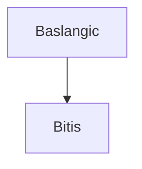

# bookMaker Chapter Specification v0.1

Bu belge, `bookMaker` icin tek bir bolum Markdown dosyasinin insan tarafindan anlasilir, LLM tarafindan tutarli uretilebilir ve otomasyon tarafindan dogrulanabilir olmasi icin gereken sozlesmeyi tanimlar.

Referans ornek: `sample/sample_chapter.md`

## 1. Temel Ilkeler

Bolum dosyasi yalnizca okunabilir Markdown degil, makine tarafindan ayrisitirilabilir bir uretim birimi olmalidir.

1. Bolum basliklari elle numaralandirilmaz.
2. Bolum, kod, diyagram ve gorsel numaralari build asamasinda uretilir.
3. Uretim hattina ait bilgiler HTML yorum bloklari icinde tutulur.
4. Her otomasyon blogu tek amacli ve YAML benzeri anahtar-deger biciminde yazilir.
5. Her `runnable` veya `compile_only` kod blogunun dosya adi, sinif adi ve dil bilgisi tutarli olmalidir.
6. Bilerek hatali bir kod ornegi varsa bu durum acik metadata ile isaretlenmelidir.
7. Final ciktiya cozulmemis placeholder, ham Mermaid kodu veya elle yazilmis `BOLUM SONU` etiketi kalmamalidir.

## 2. Dosya Duzeyi Metadata

Bolum dosyasi YAML front matter ile baslamalidir.

Zorunlu alanlar:

```yaml
---
title: "Bolum basligi"
subtitle: "Kitap adi"
author: "Yazar adi"
date: "2026"
lang: tr-TR
documentclass: report
toc: true
toc-depth: 3
numbersections: true
repo: bmdersleri
project-alias: javanintemelleri
chapter-alias: dosya_islemleri
---
```

Onerilen yeni alanlar:

```yaml
chapter_id: dosya_islemleri
chapter_type: core
automation_profile: academic_technical_book_v1
chapter_spec: chapter_spec_v0_1
processing_stage: authoring_source
numbering: auto
github_slug: dosya-islemleri
qr_policy: dual_for_code_examples
asset_policy: manual_override
placeholder_policy: source_template
snippet_policy: non_meta_code_is_explanatory
```

Not: Eski alanlarla uyumluluk icin `chapter-alias` desteklenebilir; yeni uretim hattinda kalici kimlik olarak `chapter_id` tercih edilmelidir.

## 3. Standart Bolum Akisi

Onerilen top-level bolum akisi:

```markdown
# [Bolum basligi]

## Bolumun yol haritasi
## Bolumun konumu ve pedagojik rolu
## Ogrenme ciktilari
## On bilgi ve baslangic varsayimlari
## Ana kavramlar
## Govde Metni
## Sik yapilan hatalar ve yanlis sezgiler
## Hata ayiklama egzersizi
## Bolumun sonraki bolumlerle iliskisi
## Bolum ozeti
## Terim sozlugu
## Kendini degerlendirme sorulari
## Programlama alistirmalari
## Haftalik laboratuvar / proje gorevi
## Degerlendirme rubrigi
## Ileri okuma ve kaynaklar
## Bir sonraki bolume kopru
```

`Govde Metni` bir meta bolumdur; altinda konu anlatimina ait birden fazla `##` veya `###` baslik bulunabilir. Validator bu bolgeyi tek pedagojik ana govde olarak ele almalidir.

## 4. SECTION_META

Her ana pedagojik bolumden once `SECTION_META` bulunmalidir.

```markdown
<!-- SECTION_META
order: 001
title: "Bolumun yol haritasi"
section_type: standard
-->

## Bolumun yol haritasi
```

Kurallar:

1. `order` benzersiz olmalidir.
2. `order` artan sirada ilerlemelidir.
3. `title`, hemen takip eden ana bolum basligi ile anlamsal olarak uyumlu olmalidir.
4. Aynı `order` degeri iki farkli `SECTION_META` icin kullanilamaz.
5. Alt bilesenler icin `SECTION_META` kullanilmamalidir; gerekirse `SUBSECTION_META` kullanilir.
6. `section_type: body_group` olan `Govde Metni` bolumlerinde `title` bire bir baslik eslesmesi aramaz; birden fazla konu basligini kapsayan ana anlatim bolgesi olarak degerlendirir.

Desteklenen `section_type` degerleri:

| Deger | Anlam |
|---|---|
| `standard` | Tek bir gorunur ana bolume karsilik gelir |
| `body_group` | Birden fazla govde basligini kapsayan anlatim bolgesidir |
| `assessment_group` | Soru, alistirma veya rubrik gibi olcme bilesenlerini kapsar |

## 5. SUBSECTION_META

Ana bolum icindeki ozel parcalar icin kullanilir. Ornegin hata ayiklama bolumundeki "Ogrenciye sorular" listesi.

```markdown
<!-- SUBSECTION_META
order: 001
title: "Ogrenciye sorular"
-->
```

`SUBSECTION_META`, bolum siralamasini etkilemez.

## 6. CODE_META

Her dosyaya cikarilacak, GitHub'a tasinacak, QR uretilecek veya test edilecek kod blogundan hemen once `CODE_META` bulunmalidir.

LLM tarafindan uretilen tam bolum Markdown metninde `CODE_META` bloklari kod bloklarinin icinde degil, kod blogundan hemen once yer almalidir. Sistem bu metadata'yi sonradan tahmin etmeye calisabilir, ancak kanonik ve kabul edilebilir cikti LLM'in `CODE_META` alanlarini metnin icinde uretmesidir.

Kural:

1. Dosyaya cikarilacak veya teknik kontrolden gececek her kod blogunun hemen oncesinde `CODE_META` bulunmalidir.
2. `CODE_META` ile kod blogu arasina baslik, paragraf veya baska aciklama girmemelidir.
3. `CODE_META` alanlari LLM ciktisinda eksikse sistem bunu otomatik kontrol eder ve metadata repair issue'su uretir.
4. Sistem guvenli durumlarda eksik metadata icin aday degerler onerebilir; ancak yazar onayi olmadan onayli bolume islenmis sayilmaz.
5. Hatalı/pedagojik kod ornekleri de metadata tasimalidir; yalnizca `review_only`, `broken_example`, `test: skip` gibi alanlarla dogru isaretlenmelidir.

### CODE_META Eksikligi Fallback Hatti

LLM tam metin ciktisinda `CODE_META` bloklarini uretmeyi atlayabilir. Sistem bu durumu otomatik tespit ederek bir onarim kuyruğuna almalidir.

Otomatik tespit akisi:

1. Yapistirma veya normalize aninda `CODE_META` oncesiz kod bloklari taranir.
2. Java kodu ise `public class Foo` adi, `main` metot varligi ve dosya adi adayi regex ile tahmin edilir.
3. `code_id`, `file`, `main_class`, `extension` aday degerleri form olarak sunulur.
4. Yazar aday degerleri onaylar ya da duzeltir.
5. Onaylanan `CODE_META` `normalized_chapter` uzerine islenir ve `normalization_report` icine yazilir.
6. Validator gecisi her durumda zorunludur; sistem aday uretse bile yazar onayi olmadan `approved_chapter`'a tasinamaz.

```markdown
<!-- CODE_META
order: 001
code_id: {chapter-alias}_{order}
extension: java
kind: example
title: "Temel dosyaya yazma ve okuma"
file: DosyaIslemleriTemel.java
main_class: DosyaIslemleriTemel
link: "{repo}/{project-alias}/{chapter-alias}/{file}"
qrfile: {code_id}.png
extract: true
test: compile_run_assert
github: true
qr_policy: dual
expected_stdout_contains: "Java dosya islemleri;Satir satir yazma ornegi"
intentional_mismatch: false
validation_mode: runnable
-->

```java
// Dosya: DosyaIslemleriTemel.java
public class DosyaIslemleriTemel {
    public static void main(String[] args) {
    }
}
```
```

Zorunlu alanlar:

| Alan | Zorunlu | Aciklama |
|---|---:|---|
| `order` | Evet | Bolum icindeki kod sirasi |
| `code_id` | Evet | Kalici kod kimligi. Kanonik orneklerde somut deger tercih edilir |
| `extension` | Evet | Dosya uzantisi |
| `kind` | Evet | `example`, `application`, `snippet`, `broken_example`, `fixed_example` |
| `title` | Evet | Kodun insan tarafindan okunur basligi |
| `file` | Evet | Uretilecek dosya adi |
| `main_class` | Java icin evet | Java `public class` adi |
| `link` | Evet | Kaynak veya kod sayfasi link sablonu |
| `qrfile` | QR varsa evet | Uretilecek QR dosya adi |
| `extract` | Evet | Kod dosyaya cikarilacak mi? |
| `test` | Evet | `compile`, `run`, `run_assert`, `compile_run`, `compile_run_assert`, `skip`, `none` |
| `github` | Evet | Kod GitHub ciktisina dahil edilecek mi? |
| `qr_policy` | Evet | `none`, `source`, `page`, `dual` |
| `intentional_mismatch` | Evet | Kod bilerek hatali mi? |
| `validation_mode` | Evet | Otomasyon davranisi |

Onerilen ek alanlar:

| Alan | Aciklama |
|---|---|
| `expected_stdout_contains` | Calisma ciktisinda aranacak metinler |
| `timeout_sec` | Calisma zaman asimi |
| `online_mode` | `github_source`, `codespaces`, `browser_sandbox` |

## 7. validation_mode

Ilk surumde desteklenecek degerler:

| Deger | Anlam |
|---|---|
| `runnable` | Kod derlenir/calismaya uygundur ve otomatik calistirilabilir |
| `compile_only` | Kod derlenmelidir, fakat otomatik calistirma yapilmaz |
| `review_only` | Kod pedagojik inceleme icindir; test hatasi basarisizlik sayilmaz |
| `skip` | Otomasyon bu kodu yok sayar; raporda neden belirtilmelidir |

Kural: Kullanici girdisi isteyen interaktif uygulamalar, hazir stdin senaryosu yoksa `compile_only` olmalidir.

## 8. Intentional Mismatch

Bilerek hatali kod ornekleri asagidaki alanlari tasimalidir:

```yaml
intentional_mismatch: true
mismatch_kind: delimiter
mismatch_summary: "CSV satiri ';' ile ayrilmisken split(',') kullaniliyor."
expected_outcome: "Hatanin nedeni aciklanmali ve duzeltilmis surumle karsilastirilmalidir."
paired_with: {chapter-alias}_004
validation_mode: review_only
```

Kurallar:

1. `intentional_mismatch: true` ise `validation_mode` normalde `review_only` olmalidir.
2. `mismatch_kind`, `mismatch_summary`, `expected_outcome` zorunludur.
3. Hatalı kodun düzeltilmiş karşılığı varsa `paired_with` zorunludur.
4. `paired_with` ile verilen kimlik dosyada gerçekten bulunmalıdır.
5. Düzeltilmiş karşılık `intentional_mismatch: false` olmalıdır.

Onerilen `mismatch_kind` degerleri:

```text
delimiter
wrong_path
class_name_mismatch
missing_null_check
off_by_one
resource_leak
syntax_error
logic_error
```

## 9. MERMAID_META

Her Mermaid blogundan hemen once `MERMAID_META` bulunmalidir.

```markdown
<!-- MERMAID_META
order: 001
id: {chapter-alias}_diagram_{order}
chapter_alias: {chapter-alias}
title: "Dosya okuma ve yazma islemlerinde temel akis"
kind: flowchart
output_file: assets/auto/mermaid/{id}.png
manual_override: true
validation_mode: render
-->


```

Kurallar:

1. Ham Mermaid kodu final DOCX/PDF/EPUB ciktilarinda gorunmemelidir.
2. `output_file` build asamasinda uretilmelidir.
3. `manual_override: true` ise ayni ID icin manuel gorsel otomatik gorselden once kullanilabilir.

## 10. ASSET_META ve SCREENSHOT_META

Mermaid disindaki gorseller icin `ASSET_META`, otomatik ekran goruntuleri icin `SCREENSHOT_META` kullanilir.

```markdown
<!-- SCREENSHOT_META
id: ch07_login_form
chapter_id: chapter_07
title: "Giris formu"
kind: browser_page
url: "http://127.0.0.1:5173/login"
viewport: 1440x900
wait_for: "text:Giris Yap"
output_file: assets/auto/screenshots/ch07_login_form.png
caption: "Giris formunun ilk gorunumu"
validation_mode: capture
-->
```

Asset onceligi:

```text
manual > locked > auto
```

Otomasyon `assets/manual/` ve `assets/locked/` altindaki dosyalari ezmemelidir.

## 11. Pedagojik Tutarlilik Kurallari

Validator mekanik kontrollerden sonra asagidaki semantik iliskileri raporlamalidir:

1. Ogrenme ciktilarindaki kavramlar govde metninde islenmis mi?
2. Ana kavramlar tablosundaki terimler metinde ve sozlukte karsilanmis mi?
3. Kod ornekleri ogrenme ciktilarini destekliyor mu?
4. Hatalı orneklerin neden hatali oldugu ve duzeltilmis karsiligi acik mi?
5. Mini uygulama bolumde anlatilan kavramlari birlestiriyor mu?
6. Alistirmalar ve rubrik ogrenme ciktilariyla uyumlu mu?
7. Kapsam disi konular bolume sizmis mi?
8. Bolum sonraki bolume dogru pedagojik kopru kuruyor mu?

Kitap geneli tutarlilik (export oncesi `bookmaker check book` ile):

9. Ayni kavram farkli bolumlerde cakisan bicimde mi tanimlanmis?
10. Terim sozlugu girislerinde kitap geneli tutarlilik var mi?
11. `code_id` degerleri kitap genelinde benzersiz mi?
12. Kapsam disi tanimlanan bir konu baska bolumde isleniyor mu?

## 12. Durdurucu Hatalar

Asagidaki durumlarda bolum kalite kapisindan gecmemelidir:

1. YAML front matter yok.
2. Ana baslik `#` yok veya birden fazla.
3. `SECTION_META.order` yineleniyor.
4. `SECTION_META.title` ile takip eden bolum basligi uyumsuz.
5. `CODE_META` ile kod blogu arasina baska bolum basligi giriyor.
6. `validation_mode: runnable` veya `compile_only` olan Java kodunda `file` ve `public class` uyumsuz.
7. `intentional_mismatch: true` olup `mismatch_summary` veya `expected_outcome` yok.
8. `paired_with` olmayan veya var olmayan bir koda referans veriyor.
9. Mermaid blogu var ama `MERMAID_META` yok.
10. Final build asamasinda `{repo}`, `{file}`, `{qrfile}` gibi placeholderlar cozulmemis kaliyor.
11. Dosyaya cikarilmasi veya test edilmesi gereken kod blogunda `CODE_META` yok.

## 13. Uyarilar

Asagidaki durumlar raporlanmali, ancak kullanici onayi ile devam edilebilmelidir:

1. Bolumde Mermaid diyagrami yok.
2. Bolumde runnable kod yok.
3. Interaktif kod `compile_only` olarak isaretlenmis.
4. QR gorseli referansi var ama henuz uretilmemis.
5. Kod basligi ve `CODE_META.title` tam ayni degil ama anlamsal olarak yakin.
6. Alistirma var fakat rubrikte karsiligi zayif.
7. Ileri okuma kaynaklari resmi URL yerine kaynak turu olarak verilmis.

## 14. Ilk Validator Tasarimi

Ilk validator uc katmanda calismalidir:

```text
1. Structural validation
   Front matter, baslik hiyerarsisi, meta blok sirasi, placeholder kontrolu

2. Technical validation
   CODE_META ayrisitirma, Java file/class uyumu, Mermaid meta, QR/link alanlari

3. Semantic validation
   Ogrenme ciktilari, kavramlar, kodlar, alistirmalar ve rubrik arasi tutarlilik
```

Rapor ciktilari:

```text
build/reports/chapter_semantic_report.json
build/reports/chapter_semantic_report.md
```

Karar sozcugu:

```text
PASS
PASS_WITH_WARNINGS
REVISION_REQUIRED
BLOCKED
```

Skor onerisi:

```text
90-100  PASS
80-89   PASS_WITH_WARNINGS
65-79   REVISION_REQUIRED
0-64    BLOCKED
```

Mevcut ilk implementasyon:

```powershell
python .\tools\chapter_semantic_validator.py .\sample\sample_chapter.md
```

Varsayilan rapor ciktilari:

```text
build/reports/chapter_semantic_report.json
build/reports/chapter_semantic_report.md
```

Final cikti kontrolu icin cozulmemis placeholderlari hata sayan mod:

```powershell
python .\tools\chapter_semantic_validator.py .\sample\sample_chapter.md --final
```
