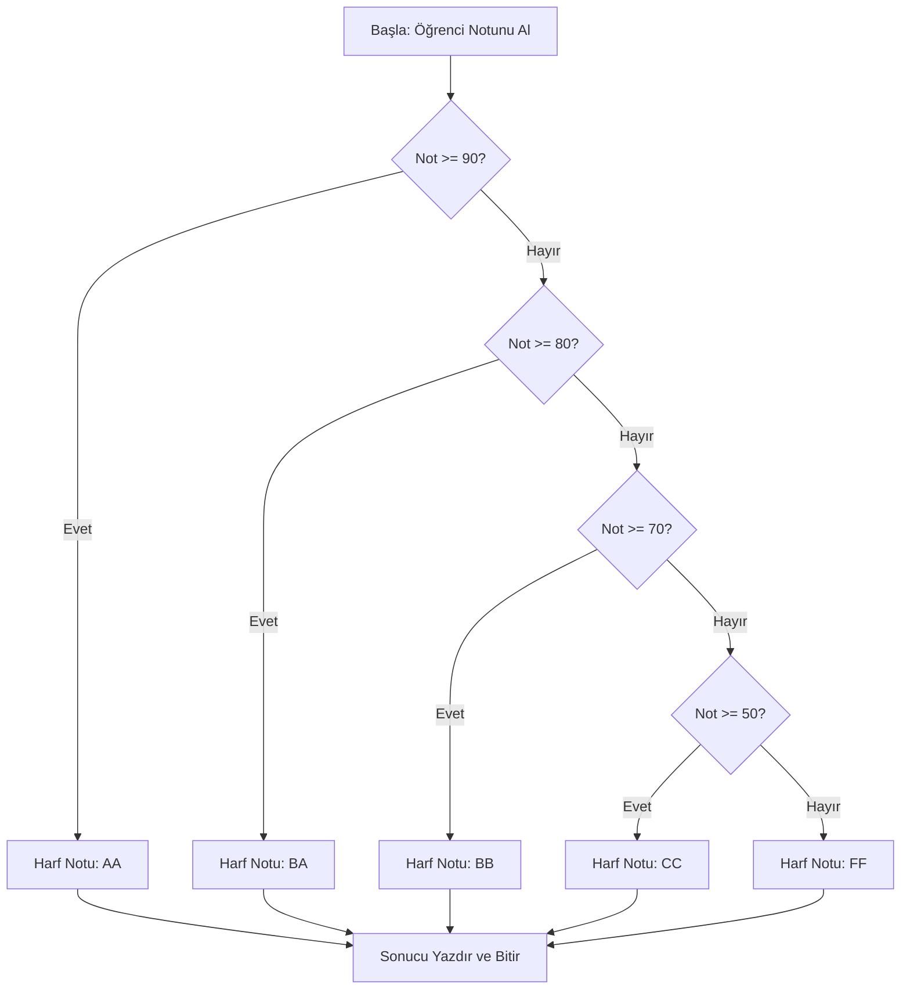
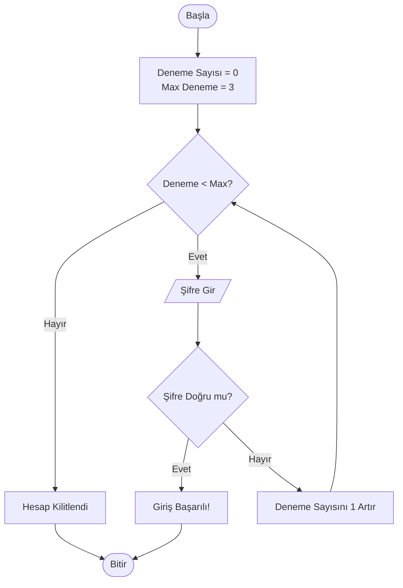

***
# Koşullar ve Döngüler

## Bölüme Hoş Geldiniz

Bir programın sadece yukarıdan aşağıya doğru sırayla çalışması, çoğu zaman yeterli değildir. Gerçek dünya problemlerini çözmek için programımızın **kararlar alması** (örneğin, "yağmur yağıyorsa şemsiye al") ve belirli işlemleri **tekrar tekrar yapması** (örneğin, "her bir öğrenci için notları hesapla") gerekir. İşte bu bölümde, programlama dünyasının bu iki temel direğini öğreneceğiz: **Koşullar** ve **Döngüler**.

Bu bölümün sonunda, programınıza zeka kazandıran karar yapılarını (`if`, `elif`, `else`), işleri otomatikleştiren döngüleri (`for`, `while`) ve Python'un bu alandaki güçlü araçlarını (`break`, `continue`, `List Comprehension`, `match-case`) kullanarak, çok daha akıllı ve verimli kodlar yazabileceksiniz.

### Ön Bilgi
Bu bölüme başlamadan önce, Python'da değişken tanımlama, temel veri tipleri (`int`, `float`, `str`, `bool`) ve `print()` ile `input()` fonksiyonlarını kullanmayı bildiğinizi varsayıyoruz.

### Öğrenme Çıktıları
Bu bölümü tamamladığınızda şunları yapabiliyor olacaksınız:
1. Karşılaştırma ve mantıksal operatörleri kullanarak karmaşık koşullar oluşturabilir.
2. `if-elif-else` yapısıyla program akışını dallandırabilir.
3. `while` döngüsü ile koşula bağlı tekrarlı işlemler yapabilir.
4. `for` döngüsü ve `range()` fonksiyonu ile bir dizi üzerinde gezinebilir.
5. `break` ve `continue` ile döngü akışını kontrol edebilir.
6. Python'a özgü `List Comprehension` yapısını kullanarak listeleri pratik bir şekilde oluşturabilir.
7. `match-case` yapısı ile çoklu kalıp eşlemesi yapabilir.


## Karar Mekanizmaları: Programımıza Zeka Katmak

Programlarımızın farklı durumlara göre farklı tepkiler vermesini sağlayan yapılara **karar mekanizmaları** denir. Bir bilgisayar oyununda canınız azaldığında "Dikkat!" yazısının çıkması veya bir web sitesine yanlış şifre girdiğinizde "Hatalı giriş" uyarısı almanız, bu mekanizmaların eseridir. Bu bölümde, bu kararları almamızı sağlayan temel araçları inceleyeceğiz.

### 1 Karşılaştırma Operatörleri

#### 1. TANIM
Karşılaştırma operatörleri, iki değeri (sayı, metin, vb.) birbiriyle kıyaslayan ve sonuç olarak her zaman `True` (Doğru) ya da `False` (Yanlış) döndüren sembollerdir.

#### 2. NEDEN VAR?
Bir programın karar verebilmesi için öncelikle içinde bulunduğu durumu değerlendirmesi gerekir. "Kullanıcının yaşı 18'den büyük mü?", "Girilen şifre doğru mu?" gibi soruların cevabı, karşılaştırma operatörleri sayesinde bulunur. Bu operatörler olmasaydı, koşullara bağlı hiçbir karar alamaz, herkes için aynı işlemi yapmak zorunda kalırdık.

#### 3. NASIL KULLANILIR?

Aşağıda, bir sinema biletinin yaş sınırını kontrol eden basit bir örnek var.


```python
# 01_bilet_kontrol.py

# Kullanıcıdan yaşını alıyoruz
kullanici_yasi = int(input("Lütfen yaşınızı giriniz: "))

# Bilet için yaş sınırı
yas_siniri = 18

# Karşılaştırma operatörlerini kullanarak durumu değerlendiriyoruz
# >= operatörü: kullanici_yasi, yas_siniri'nden büyük veya eşit mi?
if kullanici_yasi >= yas_siniri:
    print("Filmi izleyebilirsiniz!")  # // Çıktı: Filmi izleyebilirsiniz! (eğer yaş 18 veya üzeriyse)
else:
    print("Maalesef bu film için yaşınız yeterli değil.") # // Çıktı: Maalesef bu film için yaşınız yeterli değil. (eğer yaş 18'den küçükse)
```


**Kodun Satır Satır Açıklaması:**
1. `kullanici_yasi = int(input(…))`: Kullanıcıdan bir değer alır, bunu tam sayıya (`int`) çevirir ve `kullanici_yasi` değişkenine atar.
2. `yas_siniri = 18`: Karşılaştırma yapacağımız sabit değeri belirler.
3. `if kullanici_yasi >= yas_siniri:`: İşte karar anı! `>=` (büyük veya eşit) operatörü, `kullanici_yasi` değişkeninin değerinin 18'den büyük veya 18'e eşit olup olmadığını kontrol eder. Eğer sonuç `True` ise, bir sonraki girintili satır çalışır.
4. `print(…)`: Koşul doğruysa bu mesaj ekrana yazılır.
5. `else:`: Eğer `if`'teki koşul `False` ise, bu bloktaki kod çalışır.
6. `print(…)`: Koşul yanlışsa bu mesaj ekrana yazılır.

**Günlük Hayattan Analoji:** Bir güvenlik görevlisinin elindeki listeyi kontrol etmesi gibi düşünün. Görevli, "Kişinin adı listede var mı?" (`==`), "Yaşı 18'den büyük mü?" (`>`) gibi karşılaştırmalar yaparak içeri alıp almama kararı verir.

#### 4. NE ZAMAN TERCİH EDİLİR?
Karşılaştırma operatörleri, herhangi bir koşul kontrolü yapmanız gereken her an kullanılır. `if`, `while` gibi yapıların içinde olmazsa olmazlardır.

#### 5. ALTERNATİFLERİ
Karşılaştırma operatörlerinin doğrudan bir alternatifi yoktur. Ancak, karmaşık karşılaştırmalar için birden fazla operatörü mantıksal operatörlerle (`and`, `or`, `not`) birleştiririz.

| Operatör | Anlamı | Örnek (`a=10`) | Sonuç |
|:--- |:--- |:--- |:--- |
| `==` | Eşit mi? | `a == 10` | `True` |
| `!=` | Eşit değil mi? | `a!= 5` | `True` |
| `>` | Büyük mü? | `a > 5` | `True` |
| `<` | Küçük mü? | `a < 5` | `False` |
| `>=` | Büyük veya eşit mi? | `a >= 10` | `True` |
| `<=` | Küçük veya eşit mi? | `a <= 9` | `False` |

#### 6. YAYGIN HATALAR
- **En Sık Hata:** Atama operatörü (`=`) ile karşılaştırma operatörünü (`==`) karıştırmak. `if yas = 18:` yazmak, Python'da `yas` değişkenine 18 atamaya çalışır ve bu bir hataya (`SyntaxError`) yol açar.
- **Çözüm:** Karşılaştırma yaparken her zaman çift eşittir (`==`) kullanın.

### 2 Mantıksal Operatörler

#### 1. TANIM
Mantıksal operatörler (`and`, `or`, `not`), birden fazla koşulu birleştirerek tek bir `True` veya `False` değeri üreten operatörlerdir.

#### 2. NEDEN VAR?
Gerçek hayattaki kararlar nadiren tek bir koşula bağlıdır. Örneğin, bir web sitesine giriş yapmak için **hem** kullanıcı adının **hem de** şifrenin doğru olması gerekir (`and`). Veya bir restoranda "çorba **veya** salata" seçeneği sunulabilir (`or`). Mantıksal operatörler, bu tür çoklu koşulları tek bir ifadede birleştirmemizi sağlar.

#### 3. NASIL KULLANILIR?

Aşağıdaki örnekte, bir kullanıcı adı ve şifre doğrulaması yapıyoruz.


```python
# Kullanıcı adı ve şifre doğrulama örneği

# Önceden belirlenmiş doğru kullanıcı bilgileri
dogru_kullanici_adi = "python_ogrencisi"
dogru_sifre = "12345"

# Kullanıcıdan giriş bilgilerini alıyoruz
girilen_kullanici_adi = input("Kullanıcı adınız: ")
girilen_sifre = input("Şifreniz: ")

# and operatörü: İki koşulun da aynı anda doğru olması gerekir
if girilen_kullanici_adi == dogru_kullanici_adi and girilen_sifre == dogru_sifre:
    print("Giriş başarılı!")  # // Çıktı: Giriş başarılı! (eğer her iki bilgi de doğruysa)
else:
    print("Kullanıcı adı veya şifre hatalı.") # // Çıktı: Kullanıcı adı veya şifre hatalı. (en az biri yanlışsa)
```


**Kodun Satır Satır Açıklaması:**
1. `dogru_kullanici_adi = "python_ogrencisi"`: Doğru kullanıcı adını bir değişkende saklıyoruz.
2. `dogru_sifre = "12345"`: Doğru şifreyi bir değişkende saklıyoruz.
3. `if… and…:`: `and` operatörü, sağındaki ve solundaki iki koşulun da `True` olmasını bekler.
  - `girilen_kullanici_adi == dogru_kullanici_adi` (Koşul 1)
  - `girilen_sifre == dogru_sifre` (Koşul 2)
  - Eğer her iki koşul da `True` ise, `and` ifadesinin sonucu `True` olur ve `if` bloğu çalışır. Aksi halde `else` bloğu çalışır.

**Günlük Hayattan Analoji:** Bir araba anahtarı düşünün. Arabayı çalıştırmak için **hem** kontak anahtarını çevirmeniz (`koşul 1`) **hem de** (otomatik vitesli araçlarda) fren pedalına basmanız (`koşul 2`) gerekir. Bu bir `and` ilişkisidir. Bir kafede ise sadece "çay" **veya** "kahve" paranızın yetmesi yeterlidir; bu da bir `or` ilişkisidir.

#### 4. NE ZAMAN TERCİH EDİLİR?
- `and`: Tüm koşulların aynı anda sağlanması gereken durumlarda (örn. giriş yapma, filtreleme).
- `or`: Koşullardan en az birinin sağlanmasının yeterli olduğu durumlarda (örn. çoklu arama kriterleri).
- `not`: Bir koşulun tersini istediğimizde (örn. "eğer üye değilse", `if not uye_mi:`).

#### 5. ALTERNATİFLERİ
Mantıksal operatörlerin alternatifi, iç içe `if` blokları kullanmaktır. Ancak bu, kodu daha okunaksız hale getirir. Örneğin, yukarıdaki `and` örneğini şöyle de yazabilirdik:


```python
if girilen_kullanici_adi == dogru_kullanici_adi:
    if girilen_sifre == dogru_sifre:
        print("Giriş başarılı!")
    else:
        print("Şifre hatalı.")
else:
    print("Kullanıcı adı hatalı.")
```


| Yöntem | Avantaj | Dezavantaj |
|:--- |:--- |:--- |
| **Mantıksal Operatör (`and`)** | Tek satırda, okunması kolay | Hata mesajlarını ayrıştırmak zor |
| **İç İçe `if`** | Hangi koşulun hatalı olduğu net | Kod daha uzun ve iç içe geçmiş |

#### 6. YAYGIN HATALAR
- **En Sık Hata:** `and` ve `or` operatörlerini yanlış anlamak. Örneğin, "yaşı 5'ten küçük veya 65'ten büyük olanlar" gibi bir koşul yazarken `if yas < 5 or yas > 65:` yazmak gerekirken, `if yas < 5 and yas > 65:` yazmak (ki bu imkansız bir durumdur).
- **Çözüm:** Koşul cümlelerinizi Türkçe olarak kurun. "yaşı 5'ten küçük **veya** 65'ten büyük" -> `or`. "yaşı 5'ten büyük **ve** 65'ten küçük" -> `and`.

### 3 if-elif-else Yapısı

#### 1. TANIM
`if-elif-else`, bir programın akışını, belirtilen koşulların doğruluğuna göre farklı dallara ayıran temel karar yapısıdır.

#### 2. NEDEN VAR?
Çoğu zaman sadece iki seçenekli (doğru/yanlış) kararlar yeterli olmaz. Örneğin, bir öğrencinin notuna göre AA, BA, BB,… FF gibi birden çok harf notu atamanız gerekebilir. `if-elif-else` yapısı, bu tür çoklu dallanmaları düzenli bir şekilde yapmamızı sağlar.




#### 3. NASIL KULLANILIR?

Aşağıda, girilen bir puanı harf notuna çeviren klasik bir örnek var.


```python
# 02_not_hesapla.py

# Öğrencinin notunu alıyoruz (0-100 arası)
ogrenci_notu = float(input("Öğrencinin notunu giriniz (0-100): "))

# if-elif-else yapısı ile harf notunu belirliyoruz
if ogrenci_notu >= 90:
    harf_notu = "AA"
elif ogrenci_notu >= 80:
    harf_notu = "BA"
elif ogrenci_notu >= 70:
    harf_notu = "BB"
elif ogrenci_notu >= 60:
    harf_notu = "CB"
elif ogrenci_notu >= 50:
    harf_notu = "CC"
else:
    harf_notu = "FF"

print(f"Öğrencinin harf notu: {harf_notu}")
# // Çıktı: Öğrencinin harf notu: BB (eğer not 75 olarak girilmişse)
```


**Kodun Satır Satır Açıklaması:**
1. `if ogrenci_notu >= 90:`: İlk ve en önemli koşul. Eğer not 90 veya üzeriyse, program bu bloğu çalıştırır ve diğer tüm `elif` ve `else` bloklarını atlar.
2. `elif ogrenci_notu >= 80:`: Eğer ilk `if` koşulu `False` ise, bu koşul kontrol edilir. Not 80-89 arasındaysa bu blok çalışır.
3. `elif…`: Bu şekilde istediğimiz kadar `elif` ekleyebiliriz. Her biri, bir önceki koşul yanlış olduğunda sırayla kontrol edilir.
4. `else:`: Yukarıdaki hiçbir koşul doğru değilse (yani not 50'den küçükse), bu bloktaki kod çalışır.
5. **Önemli Not:** `if-elif-else` yapısında, sadece **bir tane** kod bloğu çalışır. İlk doğru koşuldan itibaren diğerleri atlanır.

**Günlük Hayattan Analoji:** Bir otomatik merdiven düşünün. "Eğer birisi sensöre yaklaşırsa (`if`) merdiven çalışır, **yok eğer** (`elif`) belirli bir süre kimse olmazsa hızını yavaşlatır, **değilse** (`else`) durur." Bu, bir dizi olasılığı sırayla değerlendiren bir sistemdir.

#### 4. NE ZAMAN TERCİH EDİLİR?
- **`if-elif-else`**: İkiden fazla olası durum olduğunda ve bu durumlar birbiriyle örtüşmeyen aralıklar veya değerler olduğunda. (Örn: Not hesaplama, ürün kategorisine göre indirim belirleme).
- **Sadece `if`**: Tek bir koşulu kontrol etmek yeterliyse ve koşul yanlışsa hiçbir şey yapılmayacaksa.
- **`if-else`**: Sadece iki olasılık varsa (doğru/yanlış).

#### 5. ALTERNATİFLERİ
`if-elif-else` yapısının en güçlü alternatifi, Python 3.10 ile gelen `match-case` yapısıdır (ileride göreceğiz). `match-case` özellikle bir değişkenin belirli sabit değerlerle karşılaştırılması gereken durumlarda daha okunabilir bir sözdizimi sunar. Ancak, aralık kontrolleri (`>= 90`) gibi durumlarda `if-elif-else` hala en uygun seçenektir.

#### 6. YAYGIN HATALAR
- **En Sık Hata:** `elif` yerine `if` kullanmak. Eğer `elif` yerine her birini ayrı bir `if` olarak yazarsanız, tüm koşullar sırayla kontrol edilir ve birbiriyle örtüşen durumlarda birden fazla blok çalışabilir. Örneğin, not 95 ise, `if >= 90` ve `if >= 80` bloklarının **ikisi de** çalışır.
- **Çözüm:** Birbiriyle bağlantılı ve sadece birinin çalışmasını istediğiniz çoklu koşullar için mutlaka `if-elif-else` zincirini kullanın.


## Döngüler: Tekrarlı İşlemlerin Ustası

Döngüler, belirli bir kod bloğunu, bir koşul sağlandığı sürece veya bir dizi üzerindeki tüm elemanlar tükenene kadar tekrar tekrar çalıştıran yapılardır. Bu sayede, binlerce öğrencinin notunu tek tek hesaplamak yerine, bir döngü ile bu işi birkaç saniyede halledebiliriz.

### 1 while Döngüsü

#### 1. TANIM
`while` döngüsü, kendisine verilen koşul `True` olduğu sürece, içindeki kod bloğunu tekrar tekrar çalıştıran bir yapıdır.

#### 2. NEDEN VAR?
`while` döngüsü, bir işlemin kaç kere tekrarlanacağının önceden bilinmediği durumlar için idealdir. Örneğin, kullanıcıdan geçerli bir değer alana kadar veri istemek ("doğrulama döngüsü") veya bir oyunda can bitene kadar oyunu oynatmak gibi.



#### 3. NASIL KULLANILIR?

Aşağıdaki örnekte, kullanıcı doğru şifreyi girene veya 3 hakkını tüketene kadar şifre sormaya devam ediyoruz.


```python
# 03_sifre_dogrula.py

dogru_sifre = "python123"
deneme_sayisi = 0
maks_deneme = 3

# while döngüsü: deneme_sayisi, maks_deneme'den küçük olduğu sürece çalış
while deneme_sayisi < maks_deneme:
    girilen_sifre = input("Şifrenizi giriniz: ")

    if girilen_sifre == dogru_sifre:
        print("Giriş başarılı! Hoş geldiniz.")
        break  # Döngüyü sonlandır
    else:
        deneme_sayisi += 1  # Deneme sayısını bir artır
        kalan_hak = maks_deneme - deneme_sayisi
        print(f"Yanlış şifre! Kalan hakkınız: {kalan_hak}")

# Döngü bittiğinde (break ile değil de koşul yanlış olduğu için bittiyse)
if deneme_sayisi == maks_deneme:
    print("Hesabınız kilitlendi. Çok fazla hatalı giriş yaptınız.")

# // Çıktı (örnek bir çalışma):
# Şifrenizi giriniz: yanlis1
# Yanlış şifre! Kalan hakkınız: 2
# Şifrenizi giriniz: python123
# Giriş başarılı! Hoş geldiniz.
```


**Kodun Satır Satır Açıklaması:**
1. `while deneme_sayisi < maks_deneme:`: Döngünün başlangıcı. Python, `deneme_sayisi` (0) değişkeninin `maks_deneme` (3) değişkeninden küçük olup olmadığını kontrol eder. `0 < 3` ifadesi `True` olduğu için döngüye girer.
2. Döngü içinde kullanıcıdan şifre alınır.
3. Eğer şifre doğruysa, `break` komutu ile döngü anında sonlandırılır ve "Giriş başarılı" mesajı yazdırılır.
4. Eğer şifre yanlışsa, `deneme_sayisi += 1` ile sayaç bir artırılır ve kalan hak gösterilir.
5. Döngü, ya `break` ile ya da `deneme_sayisi` değişkeni `3` olduğunda (`3 < 3` -> `False`) sona erer. Döngüden sonraki `if` kontrolü, hesabın kilitlenip kilitlenmediğini belirler.

**Günlük Hayattan Analoji:** Bir ATM'den para çekmeye çalıştığınızı düşünün. Şifrenizi doğru girene kadar (`while şifre yanlış`) ATM sizden şifre ister. Doğru girerseniz işlem biter (`break`). 3 kere yanlış girerseniz kartınız bloke olur (döngü koşulu `False` olur).

#### 4. NE ZAMAN TERCİH EDİLİR?
`while` döngüsü, bir işlemin ne zaman duracağının önceden belli olmadığı, bir koşula bağlı olduğu durumlarda tercih edilir. Örneğin, "kullanıcı 'çıkış' yazana kadar" veya "dosyanın sonuna gelene kadar".

#### 5. ALTERNATİFLERİ
`while` döngüsünün ana alternatifi `for` döngüsüdür. `for` döngüsü, bir liste, aralık veya dizi üzerinde gezineceğiniz zaman daha uygundur.

| Özellik | `while` Döngüsü | `for` Döngüsü |
|:--- |:--- |:--- |
| **Kullanım Amacı** | Koşul sağlandığı sürece çalışır | Bir dizi üzerinde sırayla gezer |
| **Tekrar Sayısı** | Genelde önceden bilinmez | Genelde önceden bellidir (dizinin uzunluğu kadar) |
| **Sonsuz Döngü Riski** | Yüksek (koşulun güncellenmesi unutulursa) | Düşük (dizi bittiğinde otomatik durur) |
| **Kullanım Alanı** | Kullanıcı doğrulama, oyun döngüleri | Liste işleme, sayma işlemleri |

#### 6. YAYGIN HATALAR
- **En Sık Hata:** **Sonsuz Döngü**. Döngü içinde, döngü koşulunu etkileyecek bir değişiklik yapmayı unutmak. Örneğin, `deneme_sayisi += 1` satırını yazmasaydık, `deneme_sayisi` hep 0 kalır ve döngü sonsuza kadar sürerdi.
- **Çözüm:** `while` döngüsü yazarken, döngü koşulunun bir gün `False` olmasını sağlayacak bir kod parçası (sayaç artırma, listeden eleman silme, vb.) eklediğinizden emin olun.

### 2 for Döngüsü ve range() Fonksiyonu

#### 1. TANIM
`for` döngüsü, bir liste, string, sözlük gibi bir dizi (iterable) nesnenin her bir elemanı üzerinde sırayla işlem yapmak için kullanılır. `range()` fonksiyonu ise, belirli bir aralıkta sayılar üreten bir dizi oluşturur ve genellikle `for` döngüsü ile birlikte kullanılır.

#### 2. NEDEN VAR?
Bir listedeki tüm isimleri yazdırmak veya 1'den 100'e kadar olan sayıları toplamak gibi işlemler, `for` döngüsü olmadan son derece zahmetli olurdu. `range()` fonksiyonu ise, belirli bir aralıktaki sayıları manuel olarak bir listeye yazmak zorunda kalmamızı engeller.

#### 3. NASIL KULLANILIR?

İlk örnekte `for` döngüsü ile bir liste üzerinde geziyoruz. İkinci örnekte ise `range()` ile sayılar üretip topluyoruz.


```python
# 04_say_ve_topla.py

# Örnek 1: for döngüsü ile bir listedeki isimleri yazdırma
ogrenci_isimleri = ["Ali", "Ayşe", "Mehmet", "Zeynep"]
print("Öğrenci Listesi:")
for isim in ogrenci_isimleri:
    print(f"- {isim}")
# // Çıktı:
# Öğrenci Listesi:
# - Ali
# - Ayşe
# - Mehmet
# - Zeynep

print("-" * 20)

# Örnek 2: for döngüsü ve range() ile sayıları toplama
toplam = 0
# range(1, 11) -> 1'den başla, 11'e kadar git (10 dahil), 1'er 1'er artır
for sayi in range(1, 11):
    toplam += sayi  # Her sayıyı toplam değişkenine ekle
print(f"1'den 10'a kadar olan sayıların toplamı: {toplam}")
# // Çıktı: 1'den 10'a kadar olan sayıların toplamı: 55
```


**Kodun Satır Satır Açıklaması:**
1. `for isim in ogrenci_isimleri:`: Döngü, `ogrenci_isimleri` listesindeki ilk eleman olan "Ali"yi alır ve `isim` değişkenine atar. Ardından döngü bloğu çalışır. Sonra sıradaki eleman "Ayşe"yi alır ve işlem tekrarlanır. Liste bittiğinde döngü sona erer.
2. `for sayi in range(1, 11):`: `range(1, 11)` fonksiyonu, 1, 2, 3,…, 10 sayılarını üreten özel bir dizi nesnesi oluşturur. `for` döngüsü, bu sayıların her biri için bir kez çalışır.
3. `toplam += sayi`: Bu, `toplam = toplam + sayi` ifadesinin kısa yoludur. Her adımda, sıradaki sayıyı `toplam` değişkenine ekler.

**Günlük Hayattan Analoji:** Bir banttan geçen ürünleri hayal edin. `for` döngüsü, banttaki her bir ürünü (`isim`) alır, üzerinde bir işlem yapar (örneğin, barkodunu okur) ve bir sonraki ürüne geçer. `range()` ise, bir kutuda 1'den 10'a kadar numaralandırılmış topları temsil eder.

#### 4. NE ZAMAN TERCİH EDİLİR?
- **`for` döngüsü**: Bir dizi (liste, string, sözlük, dosya) üzerinde sırayla işlem yapmanız gerektiğinde her zaman `for` döngüsü ilk tercihiniz olmalıdır.
- **`range()`**: Bir işlemi belirli bir sayıda tekrarlamak istediğinizde (örneğin, 5 kere "Merhaba" yazdırmak) veya ardışık sayılarla işlem yapmanız gerektiğinde `range()` kullanılır.

#### #### 4. NE ZAMAN TERCİH EDİLİR? (devam)

5. **ALTERNATİFLERİ**

| Kavram | Kullanım Amacı | Kaç Kere Çalışır? | Ne Zaman Tercih Edilir? |
|---|---|---|---|
| `for` döngüsü | Bir dizi üzerinde sırayla ilerlemek | Dizideki eleman sayısı kadar | Bir listenin, string'in veya `range()`'in tüm elemanlarını işlemek gerektiğinde |
| `while` döngüsü | Bir koşul doğru olduğu sürece tekrarlamak | Koşul yanlış olana kadar (sayısı belirsiz) | Tekrar sayısı önceden bilinmediğinde (örneğin, kullanıcı doğru giriş yapana kadar bekleme) |

**Tablodan da görüleceği üzere**, `for` döngüsü "ne kadar tekrar edeceğini bildiğin" durumlar için idealken, `while` döngüsü "ne zaman duracağını bilmediğin" durumlar için daha uygundur.

6. **YAYGIN HATALAR**

- **Hata 1: `range()`'in bitiş değerini yanlış anlamak.** `range(1, 5)` ifadesinin 1, 2, 3, 4 sayılarını ürettiğini, 5'i üretmediğini unutmayın. Bitiş değeri her zaman hariçtir.
  - **Çözüm:** Eğer 1'den 5'e kadar (5 dahil) istiyorsanız `range(1, 6)` yazmalısınız.

- **Hata 2: Döngü içinde değişkeni yanlışlıkla sıfırlamak.** Döngü her adımda çalıştığı için, döngü içinde bir değişken tanımlarsanız her seferinde sıfırlanır.


```python
  # Yanlış: toplam her adımda sıfırlanır
  for sayi in range(1, 6):
      toplam = 0  # Burada tanımlanırsa her döngüde sıfırlanır
      toplam += sayi
  print(toplam)  # // Çıktı: 5 (sadece son sayıyı ekler)

  # Doğru: toplam döngü dışında tanımlanır
  toplam = 0
  for sayi in range(1, 6):
      toplam += sayi
  print(toplam)  # // Çıktı: 15
```


### 3 break ve continue İfadeleri

#### 1. TANIM
`break` ve `continue`, döngülerin (hem `for` hem de `while`) normal akışını kontrol etmek için kullanılan özel ifadelerdir. `break`, döngüyü tamamen sonlandırır ve döngüden çıkar. `continue` ise, döngünün o anki adımını atlar ve bir sonraki adıma geçer.

#### 2. NEDEN VAR?
Bazen bir döngünün, tüm elemanları işlemeden önce durması gerekebilir. Örneğin, bir sayının asal olup olmadığını kontrol ederken, sayının bir bölenini bulduğumuz anda döngüyü durdurmak isteriz (`break`). Bazen de belirli durumları atlamak isteriz; örneğin, bir listedeki çift sayıları atlayıp sadece tek sayıları işlemek (`continue`).

#### 3. NASIL KULLANILIR?

İlk örnekte `break` ile bir sayının asal olup olmadığını kontrol ediyoruz. İkinci örnekte ise `continue` ile çift sayıları atlayarak sadece tek sayıları yazdırıyoruz.


```python
## 05_asal_sayi_bul.py

## Örnek 1: break ile asal sayı kontrolü
sayi = int(input("Bir sayı girin: "))  # Kullanıcıdan sayı al
asal_mi = True  # Başlangıçta sayının asal olduğunu varsay

## 2'den sayının kendisine kadar olan sayıları dene
for bolen in range(2, sayi):
    if sayi % bolen == 0:  # Eğer sayı, bolen'e tam bölünüyorsa
        asal_mi = False
        break  # Bir bölen bulduk, daha fazla kontrol etmeye gerek yok, döngüyü kır
    # break çalıştığında döngü biter ve buraya gelinmez

if asal_mi and sayi > 1:
    print(f"{sayi} asal bir sayıdır.")
else:
    print(f"{sayi} asal bir sayı değildir.")
## // Çıktı (kullanıcı 7 girdiyse): 7 asal bir sayıdır.
## // Çıktı (kullanıcı 12 girdiyse): 12 asal bir sayı değildir.

print("-" * 20)

## Örnek 2: continue ile çift sayıları atlama
print("1'den 10'a kadar tek sayılar:")
for sayi in range(1, 11):
    if sayi % 2 == 0:  # Eğer sayı çift ise
        continue  # Bu adımı atla, döngünün başına dön
    print(sayi, end=" ")  # continue çalıştıysa bu satıra gelinmez
## // Çıktı: 1'den 10'a kadar tek sayılar: 1 3 5 7 9
```


**Kodun Satır Satır Açıklaması:**
1. **`break` Örneği:** Döngü, 2'den başlayarak sayıyı bölen bir sayı arar. `if sayi % bolen == 0` koşulu sağlandığında (yani bir bölen bulunduğunda), `asal_mi` değişkeni `False` yapılır ve `break` komutu ile döngü anında sonlandırılır. Bu, gereksiz işlem yapılmasını engeller.
2. **`continue` Örneği:** Döngü her adımda önce `if sayi % 2 == 0` koşulunu kontrol eder. Eğer sayı çift ise `continue` çalışır ve `print(sayi, end=" ")` satırı atlanır. Döngü bir sonraki sayıya geçer. Bu sayede sadece tek sayılar yazdırılır.

**Günlük Hayattan Analoji:** Bir kitap okuyorsunuz. `break`, kitabın sonuna geldiğinizde (veya sıkıldığınızda) okumayı tamamen bırakmanız gibidir. `continue` ise, bir sayfadaki dipnotları okumayı atlayıp ana metne devam etmeniz gibidir.

#### 4. NE ZAMAN TERCİH EDİLİR?
- **`break`**: Bir döngüde aradığınız şeyi bulduğunuzda veya bir hata durumuyla karşılaştığınızda döngüyü erken sonlandırmak için idealdir.
- **`continue`**: Bir döngüdeki belirli elemanları işlemek istemediğinizde, onları atlamak için kullanılır.

#### 5. ALTERNATİFLERİ

| Kavram | Etkisi | Kullanım Amacı |
|---|---|---|
| `break` | Döngüyü tamamen sonlandırır | Bir koşul sağlandığında döngüden çıkmak |
| `continue` | Sadece o anki adımı atlar | Belirli durumları işlememek, diğerlerine devam etmek |
| `pass` | Hiçbir şey yapmaz, yer tutucudur | Sözdizimsel olarak bir bloğun boş olması gerektiğinde |

**Önemli Not:** `break` ve `continue` sadece içinde bulunduğu en içteki döngüyü etkiler. İç içe döngülerde, dış döngüyü etkilemezler.

#### 6. YAYGIN HATALAR

- **Hata 1: `break` ve `continue`'u karıştırmak.** `break`'in döngüyü sonlandırdığını, `continue`'un ise sadece bir adımı atladığını unutmayın.
- **Hata 2: `break`'i gereksiz yere kullanmak.** Eğer döngünün doğal olarak sonlanmasını bekleyebiliyorsanız, `break` kullanmak kodun okunabilirliğini azaltabilir.

### 4 List Comprehension (Liste Üreteci)

#### 1. TANIM
List comprehension, Python'a özgü, bir döngü ve isteğe bağlı bir koşul kullanarak tek bir satırda yeni bir liste oluşturmanın kısa ve öz bir yoludur.

#### 2. NEDEN VAR?
Bir listedeki her sayının karesini alıp yeni bir liste oluşturmak gibi basit döngü işlemleri, normal bir `for` döngüsü ile yapıldığında 3-4 satır kod yazmayı gerektirir. List comprehension, bu işlemi tek bir satıra indirgeyerek kodu daha okunabilir ve Pythonik hale getirir. Python 2.0 sürümünde tanıtılmıştır.

#### 3. NASIL KULLANILIR?


```python
## 06_kare_listesi.py

## Normal for döngüsü ile
sayilar = [1, 2, 3, 4, 5]
kareler_dongu = []  # Boş bir liste oluştur
for sayi in sayilar:
    kareler_dongu.append(sayi ** 2)  # Her sayının karesini al ve listeye ekle
print(f"Normal döngü ile: {kareler_dongu}")
## // Çıktı: Normal döngü ile: [1, 4, 9, 16, 25]

## List comprehension ile (tek satır)
kareler_lc = [sayi ** 2 for sayi in sayilar]  # Her sayı için karesini al ve listeye ekle
print(f"List comprehension ile: {kareler_lc}")
## // Çıktı: List comprehension ile: [1, 4, 9, 16, 25]

## İsteğe bağlı koşul: Sadece çift sayıların karesini al
cift_kareler = [sayi ** 2 for sayi in sayilar if sayi % 2 == 0]
print(f"Çift sayıların kareleri: {cift_kareler}")
## // Çıktı: Çift sayıların kareleri: [4, 16]
```


**Kodun Satır Satır Açıklaması:**
1. `[sayi ** 2 for sayi in sayilar]`: Bu yapı şu şekilde okunur: "`sayilar` listesindeki her `sayi` için, `sayi ** 2` ifadesini hesapla ve bu değerleri yeni bir listeye ekle."
2. `[sayi ** 2 for sayi in sayilar if sayi % 2 == 0]`: Bu yapı ise şu şekilde okunur: "`sayilar` listesindeki her `sayi` için, eğer `sayi` çift ise (`if sayi % 2 == 0`), `sayi ** 2` ifadesini hesapla ve bu değerleri yeni bir listeye ekle."

**Günlük Hayattan Analoji:** Bir meyve sepetiniz var. Normal döngü, her bir meyveyi tek tek alıp yıkamak ve yeni bir sepete koymak gibidir. List comprehension ise, "Tüm elmaları al, yıka ve yeni sepete koy" gibi tek bir emirle işi halletmek gibidir.

#### 4. NE ZAMAN TERCİH EDİLİR?
- **List comprehension**: Basit döngü ve koşul işlemleri için idealdir. Kodunuzu daha kısa ve okunabilir hale getirir.
- **Normal `for` döngüsü**: İşlem karmaşık olduğunda (örneğin, iç içe döngüler, çoklu koşullar, hata yakalama) veya döngü içinde birden fazla işlem yapmanız gerektiğinde normal `for` döngüsü daha okunabilir olabilir.

#### 5. ALTERNATİFLERİ

| Yöntem | Kod Uzunluğu | Okunabilirlik | Hız | Karmaşık İşlemler İçin Uygunluk |
|---|---|---|---|---|
| Normal `for` döngüsü | Uzun | Yüksek | Orta | Evet |
| List comprehension | Kısa | Orta (basit işlemler için yüksek) | Yüksek | Hayır (karmaşık işlemlerde okunabilirlik düşer) |
| `map()` ve `filter()` fonksiyonları | Orta | Düşük (fonksiyonel programlama bilgisi gerektirir) | Yüksek | Kısmen |

#### 6. YAYGIN HATALAR

- **Hata 1: Aşırı karmaşık list comprehension yazmak.** Çok fazla koşul veya iç içe döngü içeren bir list comprehension, okunması ve anlaşılması zor bir kod haline gelebilir. Bu durumda normal bir `for` döngüsü kullanmak daha iyidir.
- **Hata 2: Parantezleri unutmak.** List comprehension her zaman köşeli parantez `[]` içinde yazılır. Parantezleri unutmak, bir jeneratör ifadesi (generator expression) oluşturmanıza neden olur.

### 5 match-case Yapısı (Python 3.10+)

#### 1. TANIM
`match-case`, Python 3.10 sürümünde tanıtılan, bir değişkenin değerini birden çok sabit kalıpla (pattern) karşılaştıran ve eşleşen kalıba göre kod çalıştıran bir yapıdır. Diğer dillerdeki `switch-case` yapısına benzer.

#### 2. NEDEN VAR?
Uzun `if-elif-else` zincirleri, özellikle bir değişkenin birçok farklı değerini kontrol ederken okunabilirliği azaltır. `match-case`, bu tür durumlar için daha temiz ve yapılandırılmış bir alternatif sunar.

#### 3. NASIL KULLANILIR?


```python
## 07_gun_bul.py

## Kullanıcıdan bir gün numarası al
gun_numarasi = int(input("Haftanın gün numarasını girin (1-7): "))

## match-case ile gün adını bul
match gun_numarasi:
    case 1:
        gun_adi = "Pazartesi"
    case 2:
        gun_adi = "Salı"
    case 3:
        gun_adi = "Çarşamba"
    case 4:
        gun_adi = "Perşembe"
    case 5:
        gun_adi = "Cuma"
    case 6:
        gun_adi = "Cumartesi"
    case 7:
        gun_adi = "Pazar"
    case _:  # Alt çizgi (_) herhangi bir değerle eşleşir (wildcard)
        gun_adi = "Geçersiz gün numarası"

print(f"Girdiğiniz gün: {gun_adi}")
## // Çıktı (kullanıcı 3 girdiyse): Girdiğiniz gün: Çarşamba
## // Çıktı (kullanıcı 8 girdiyse): Girdiğiniz gün: Geçersiz gün numarası
```


**Kodun Satır Satır Açıklaması:**
1. `match gun_numarasi:`: `gun_numarasi` değişkeninin değerini kontrol etmeye başlar.
2. `case 1:`: Eğer `gun_numarasi` 1'e eşitse, bu bloğu çalıştır.
3. `case _:`: Alt çizgi (`_`), "herhangi bir değer" anlamına gelen özel bir kalıptır. Yukarıdaki hiçbir `case` eşleşmezse, bu blok çalışır. Bu, `if-elif-else` yapısındaki `else` bloğuna benzer.

**Günlük Hayattan Analoji:** Bir postanede, mektupları adreslerine göre ayıran bir görevli düşünün. `match-case`, görevlinin "Adres İstanbul ise şu kutuya, Ankara ise bu kutuya, diğer tüm şehirler için şu kutuya koy" demesi gibidir.

#### 4. NE ZAMAN TERCİH EDİLİR?
- **`match-case`**: Bir değişkenin değerini birçok farklı sabit değerle karşılaştırmanız gerektiğinde ve bu değerlerin her biri için farklı bir işlem yapılacaksa idealdir.
- **`if-elif-else`**: Kontrol ettiğiniz koşullar karmaşık mantıksal ifadeler içeriyorsa (örneğin, `if x > 5 and y < 10`) veya farklı değişkenleri aynı anda kontrol etmeniz gerekiyorsa `if-elif-else` daha uygundur.

#### 5. ALTERNATİFLERİ

| Yapı | Kullanım Amacı | Okunabilirlik | Esneklik |
|---|---|---|---|
| `if-elif-else` | Her türlü koşul için | Orta (uzun zincirlerde düşer) | Çok yüksek |
| `match-case` | Bir değişkenin sabit değerlerle karşılaştırılması | Yüksek | Orta (sadece kalıp eşleme) |

#### 6. YAYGIN HATALAR

- **Hata 1: `match-case`'in sadece sabit değerlerle çalıştığını unutmak.** `match-case`, `if x > 5` gibi karşılaştırmalar için uygun değildir. Bunun için `if-elif-else` kullanmalısınız.
- **Hata 2: `case` bloklarında `break` kullanmaya çalışmak.** Python'daki `match-case`, diğer dillerdeki `switch-case`'in aksine, eşleşen bir `case`'den sonra otomatik olarak diğer `case`'lere geçmez (`fall-through` yoktur). Bu nedenle `break` kullanmanıza gerek yoktur.

## Diyagramlar: Görselleştirme

Bu bölümde, öğrendiğimiz kavramların akışını görselleştiren diyagramlar bulacaksınız. Diyagramlar, soyut kavramları somutlaştırarak anlamanızı kolaylaştıracaktır.

### 1 if-elif-else Karar Yapısı Akış Diyagramı

Aşağıdaki diyagram, bir öğrencinin notuna göre harf notunu belirleyen `if-elif-else` yapısının akışını göstermektedir.


```python
# Kullanıcı adı ve şifre doğrulama örneği

# Önceden belirlenmiş doğru kullanıcı bilgileri
dogru_kullanici_adi = "python_ogrencisi"
dogru_sifre = "12345"

# Kullanıcıdan giriş bilgilerini alıyoruz
girilen_kullanici_adi = input("Kullanıcı adınız: ")
girilen_sifre = input("Şifreniz: ")

# and operatörü: İki koşulun da aynı anda doğru olması gerekir
if girilen_kullanici_adi == dogru_kullanici_adi and girilen_sifre == dogru_sifre:
    print("Giriş başarılı!")  # // Çıktı: Giriş başarılı! (eğer her iki bilgi de doğruysa)
else:
    print("Kullanıcı adı veya şifre hatalı.") # // Çıktı: Kullanıcı adı veya şifre hatalı. (en az biri yanlışsa)
```

0


0


**Diyagram Açıklaması:** Bu diyagram, bir karar ağacını temsil eder. Her elmas şekli (`C`, `E`, `G`, `I`, `K`), bir koşulun (condition) kontrol edildiği noktadır. Koşulun sonucuna göre (Evet veya Hayır) akış farklı dallara ayrılır. Bu, programın farklı durumlara nasıl farklı tepkiler verdiğini açıkça gösterir.

### 2 while Döngüsü Akış Diyagramı (Şifre Doğrulama)

Aşağıdaki diyagram, 3 yanlış deneme hakkı olan bir şifre doğrulama sisteminin `while` döngüsü ile nasıl çalıştığını göstermektedir.


```python
# Kullanıcı adı ve şifre doğrulama örneği

# Önceden belirlenmiş doğru kullanıcı bilgileri
dogru_kullanici_adi = "python_ogrencisi"
dogru_sifre = "12345"

# Kullanıcıdan giriş bilgilerini alıyoruz
girilen_kullanici_adi = input("Kullanıcı adınız: ")
girilen_sifre = input("Şifreniz: ")

# and operatörü: İki koşulun da aynı anda doğru olması gerekir
if girilen_kullanici_adi == dogru_kullanici_adi and girilen_sifre == dogru_sifre:
    print("Giriş başarılı!")  # // Çıktı: Giriş başarılı! (eğer her iki bilgi de doğruysa)
else:
    print("Kullanıcı adı veya şifre hatalı.") # // Çıktı: Kullanıcı adı veya şifre hatalı. (en az biri yanlışsa)
```

1


1


**Diyagram Açıklaması:** Bu diyagram, `while` döngüsünün tipik bir kullanımını gösterir. Döngü, `Deneme Sayısı < 3` koşulu doğru olduğu sürece çalışır. Her yanlış şifre girişinde `Deneme Sayısı` artar. Koşul yanlış olduğunda (deneme sayısı 3'e ulaştığında), döngü sona erer ve "Hesap kilitlendi" mesajı gösterilir.

### 3 break ve continue Davranış Farkı (Sıralı Diyagram)

Aşağıdaki sıralı diyagram (sequence diagram), `break` ve `continue` ifadelerinin bir döngü içinde nasıl farklı davrandığını zaman ekseninde göstermektedir.


```python
# Kullanıcı adı ve şifre doğrulama örneği

# Önceden belirlenmiş doğru kullanıcı bilgileri
dogru_kullanici_adi = "python_ogrencisi"
dogru_sifre = "12345"

# Kullanıcıdan giriş bilgilerini alıyoruz
girilen_kullanici_adi = input("Kullanıcı adınız: ")
girilen_sifre = input("Şifreniz: ")

# and operatörü: İki koşulun da aynı anda doğru olması gerekir
if girilen_kullanici_adi == dogru_kullanici_adi and girilen_sifre == dogru_sifre:
    print("Giriş başarılı!")  # // Çıktı: Giriş başarılı! (eğer her iki bilgi de doğruysa)
else:
    print("Kullanıcı adı veya şifre hatalı.") # // Çıktı: Kullanıcı adı veya şifre hatalı. (en az biri yanlışsa)
```

2


2


**Diyagram Açıklaması:** Bu diyagram, `break` ve `continue` arasındaki temel farkı zaman ekseninde gösterir. `break` durumunda, koşul sağlandığında döngü tamamen sona erer ve kontrol kullanıcıya döner. `continue` durumunda ise, koşul sağlandığında sadece o adım atlanır ve döngü bir sonraki adıma geçerek devam eder.

## Özet

Bu bölümde, programlamanın temel yapı taşlarından olan koşullar ve döngüleri derinlemesine inceledik.

- **Karşılaştırma ve Mantıksal Operatörler:** Programın karar verebilmesi için gerekli olan temel araçları öğrendik. `==`, `!=`, `<`, `>` gibi karşılaştırma operatörleri ve `and`, `or`, `not` gibi mantıksal operatörler, koşulları birleştirmemizi sağlar.
- **if-elif-else Yapısı:** Program akışını koşullara göre dallandırmamızı sağlayan temel karar yapısını öğrendik. Bir öğrencinin notuna göre harf notu belirleme örneğiyle bu yapıyı pekiştirdik.
- **while Döngüsü:** Bir koşul doğru olduğu sürece tekrarlanan döngü yapısını öğrendik. Kullanıcıdan geçerli bir giriş alana kadar veri isteme (doğrulama döngüsü) örneğiyle kullanımını gördük.
- **for Döngüsü ve range():** Bir dizi üzerinde sırayla ilerlemek için kullanılan `for` döngüsünü ve sayı aralıkları oluşturan `range()` fonksiyonunu öğrendik.
- **break ve continue:** Döngülerin akışını kontrol eden özel ifadeleri öğrendik. `break` döngüyü sonlandırırken, `continue` o anki adımı atlar.
- **List Comprehension:** Bir döngüyü tek satırda yazarak yeni bir liste oluşturmanın Python'a özgü kısa yolunu öğrendik.
- **match-case Yapısı:** Python 3.10 ile gelen, bir değişkenin değerini birden çok kalıpla karşılaştıran modern bir yapıyı öğrendik.

Bu bölümde öğrendiğiniz kavramlar, herhangi bir programın temelini oluşturur. Artık programlarınıza akıl ve karar verme yeteneği kazandırabilir, tekrarlayan işlemleri otomatikleştirebilirsiniz.

## Sözlük

| Terim | Anlamı |
|---|---|
| **Koşul (Condition)** | Doğru (`True`) veya yanlış (`False`) olabilen bir ifade. |
| **Karşılaştırma Operatörü** | İki değeri birbiriyle kıyaslayan operatör (`==`, `!=`, `<`, `>`, `<=`, `>=`). |
| **Mantıksal Operatör** | Birden fazla koşulu birleştiren operatör (`and`, `or`, `not`). |
| **Dallanma (Branching)** | Programın, bir koşulun sonucuna göre farklı kod yollarına ayrılması. |
| **Döngü (Loop)** | Belirli bir kod bloğunu tekrar tekrar çalıştıran yapı. |
| **Yineleme (Iteration)** | Bir döngünün her bir çalıştırılması (adım). |
| **Sonsuz Döngü (Infinite Loop)** | Koşulu hiçbir zaman `False` olmayan ve sonsuza kadar çalışan döngü. |
| **Döngü Kontrol İfadesi** | Döngünün akışını değiştiren `break` ve `continue` gibi ifadeler. |
| **Aralık (Range)** | `range()` fonksiyonu tarafından üretilen, ardışık sayılar dizisi. |
| **İç İçe Döngü (Nested Loop)** | Bir döngünün içinde başka bir döngünün olması durumu. |
| **Liste Üreteci (List Comprehension)** | Bir döngüyü tek satırda yazarak yeni bir liste oluşturma yöntemi. |
| **Kalıp Eşleme (Pattern Matching)** | `match-case` yapısında olduğu gibi, bir değeri belirli kalıplarla karşılaştırma. |
| **Doğrulama (Validation)** | Kullanıcıdan alınan verinin belirli kurallara uygun olup olmadığını kontrol etme. |
| **Sayaç (Counter)** | Döngülerde tekrar sayısını takip etmek için kullanılan değişken. |
| **Akış Kontrolü (Flow Control)** | Programın hangi sırayla ve hangi koşullarda çalışacağını belirleyen mekanizma. |

## Sorular

### 1 Doğru/Yanlış Soruları

1. `and` operatörü, her iki koşul da doğruysa `True` döner. (Doğru)
2. `elif` bloğu her zaman bir `else` bloğu ile bitmelidir. (Yanlış)
3. `while` döngüsü, koşul yanlış olduğu sürece çalışır. (Yanlış)
4. `for` döngüsü, bir listenin tüm elemanlarını otomatik olarak gezer. (Doğru)
5. `range(5)` ifadesi 0, 1, 2, 3, 4, 5 sayılarını üretir. (Yanlış)
6. `break` ifadesi, sadece içinde bulunduğu en içteki döngüyü sonlandırır. (Doğru)
7. `continue` ifadesi, döngünün o anki adımını atlayıp bir sonraki adıma geçer. (Doğru)
8. `match-case` yapısı Python 2.7 sürümünde tanıtılmıştır. (Yanlış)
9. Liste comprehension, normal bir `for` döngüsünden her zaman daha hızlı çalışır. (Yanlış)
10. `not True` ifadesi `False` değerini verir. (Doğru)

### 2 Boşluk Doldurma Soruları

1. İki değerin eşit olup olmadığını kontrol etmek için `==` operatörü kullanılır.
2. Bir koşulun tersini almak için `not` mantıksal operatörü kullanılır.
3. `if-elif-else` yapısında, hiçbir koşul sağlanmadığında çalışan blok `else` bloğudur.
4. Belirli bir aralıkta sayı üreten fonksiyon `range()`'dir.
5. Bir döngüyü tamamen sonlandırmak için `break` ifadesi kullanılır.
6. Döngünün o anki adımını atlayıp bir sonraki adıma geçmek için `continue` ifadesi kullanılır.
7. `[x**2 for x in range(5)]` ifadesi, 0'dan 4'e kadar olan sayıların karelerinden oluşan bir liste oluşturur.
8. `match-case` yapısında, hiçbir kalıpla eşleşmeyen durumlar için `_` (alt çizgi) kalıbı kullanılır.
9. Bir döngünün hiçbir zaman sonlanmaması durumuna `

9. Bir döngünün hiçbir zaman sonlanmaması durumuna **sonsuz döngü** denir.
10. `for` döngüsünde her bir elemanı temsil eden değişkene **döngü değişkeni** denir.

### 3 Kısa Cevaplı Sorular

1. **Sorun:** Kullanıcıdan alınan bir sayının pozitif, negatif veya sıfır olduğunu belirleyen bir program yazınız.
  **Cevap:**


```python
# Kullanıcı adı ve şifre doğrulama örneği

# Önceden belirlenmiş doğru kullanıcı bilgileri
dogru_kullanici_adi = "python_ogrencisi"
dogru_sifre = "12345"

# Kullanıcıdan giriş bilgilerini alıyoruz
girilen_kullanici_adi = input("Kullanıcı adınız: ")
girilen_sifre = input("Şifreniz: ")

# and operatörü: İki koşulun da aynı anda doğru olması gerekir
if girilen_kullanici_adi == dogru_kullanici_adi and girilen_sifre == dogru_sifre:
    print("Giriş başarılı!")  # // Çıktı: Giriş başarılı! (eğer her iki bilgi de doğruysa)
else:
    print("Kullanıcı adı veya şifre hatalı.") # // Çıktı: Kullanıcı adı veya şifre hatalı. (en az biri yanlışsa)
```

3


3


2. **Sorun:** 1'den 100'e kadar olan çift sayıların toplamını bulan bir program yazınız.
  **Cevap:**


```python
# Kullanıcı adı ve şifre doğrulama örneği

# Önceden belirlenmiş doğru kullanıcı bilgileri
dogru_kullanici_adi = "python_ogrencisi"
dogru_sifre = "12345"

# Kullanıcıdan giriş bilgilerini alıyoruz
girilen_kullanici_adi = input("Kullanıcı adınız: ")
girilen_sifre = input("Şifreniz: ")

# and operatörü: İki koşulun da aynı anda doğru olması gerekir
if girilen_kullanici_adi == dogru_kullanici_adi and girilen_sifre == dogru_sifre:
    print("Giriş başarılı!")  # // Çıktı: Giriş başarılı! (eğer her iki bilgi de doğruysa)
else:
    print("Kullanıcı adı veya şifre hatalı.") # // Çıktı: Kullanıcı adı veya şifre hatalı. (en az biri yanlışsa)
```

4


4


3. **Sorun:** Kullanıcıdan 'çıkış' yazana kadar sürekli metin alan ve her metnin uzunluğunu yazdıran bir program yazınız.
  **Cevap:**


```python
# Kullanıcı adı ve şifre doğrulama örneği

# Önceden belirlenmiş doğru kullanıcı bilgileri
dogru_kullanici_adi = "python_ogrencisi"
dogru_sifre = "12345"

# Kullanıcıdan giriş bilgilerini alıyoruz
girilen_kullanici_adi = input("Kullanıcı adınız: ")
girilen_sifre = input("Şifreniz: ")

# and operatörü: İki koşulun da aynı anda doğru olması gerekir
if girilen_kullanici_adi == dogru_kullanici_adi and girilen_sifre == dogru_sifre:
    print("Giriş başarılı!")  # // Çıktı: Giriş başarılı! (eğer her iki bilgi de doğruysa)
else:
    print("Kullanıcı adı veya şifre hatalı.") # // Çıktı: Kullanıcı adı veya şifre hatalı. (en az biri yanlışsa)
```

5


5


4. **Sorun:** `sayilar = [3, 7, 1, 9, 4, 2]` listesindeki en büyük sayıyı bulan bir program yazınız.
  **Cevap:**


```python
# Kullanıcı adı ve şifre doğrulama örneği

# Önceden belirlenmiş doğru kullanıcı bilgileri
dogru_kullanici_adi = "python_ogrencisi"
dogru_sifre = "12345"

# Kullanıcıdan giriş bilgilerini alıyoruz
girilen_kullanici_adi = input("Kullanıcı adınız: ")
girilen_sifre = input("Şifreniz: ")

# and operatörü: İki koşulun da aynı anda doğru olması gerekir
if girilen_kullanici_adi == dogru_kullanici_adi and girilen_sifre == dogru_sifre:
    print("Giriş başarılı!")  # // Çıktı: Giriş başarılı! (eğer her iki bilgi de doğruysa)
else:
    print("Kullanıcı adı veya şifre hatalı.") # // Çıktı: Kullanıcı adı veya şifre hatalı. (en az biri yanlışsa)
```

6


6


5. **Sorun:** `match-case` kullanarak, kullanıcının girdiği 1-7 arası bir sayıya karşılık gelen gün adını yazdıran bir program yazınız.
  **Cevap:**


```python
# Kullanıcı adı ve şifre doğrulama örneği

# Önceden belirlenmiş doğru kullanıcı bilgileri
dogru_kullanici_adi = "python_ogrencisi"
dogru_sifre = "12345"

# Kullanıcıdan giriş bilgilerini alıyoruz
girilen_kullanici_adi = input("Kullanıcı adınız: ")
girilen_sifre = input("Şifreniz: ")

# and operatörü: İki koşulun da aynı anda doğru olması gerekir
if girilen_kullanici_adi == dogru_kullanici_adi and girilen_sifre == dogru_sifre:
    print("Giriş başarılı!")  # // Çıktı: Giriş başarılı! (eğer her iki bilgi de doğruysa)
else:
    print("Kullanıcı adı veya şifre hatalı.") # // Çıktı: Kullanıcı adı veya şifre hatalı. (en az biri yanlışsa)
```

7


7


### 4 Uygulamalı Alıştırmalar

1. **Faktöriyel Hesaplama:** Kullanıcıdan pozitif bir tam sayı alan ve bu sayının faktöriyelini hesaplayan bir program yazın. (İpucu: `for` döngüsü kullanın)
2. **Asal Sayı Kontrolü:** Kullanıcıdan bir sayı alan ve bu sayının asal olup olmadığını kontrol eden bir program yazın. (İpucu: `for` döngüsü, `break` ve `if-else` kullanın)
3. **ATM Simülasyonu:** Başlangıç bakiyesi 1000 TL olan bir ATM programı yazın. Kullanıcıya para çekme, para yatırma ve bakiye sorgulama seçenekleri sunun. Kullanıcı 'çıkış' seçeneğini seçene kadar program çalışmaya devam etsin. (İpucu: `while` döngüsü, `if-elif-else` ve `match-case` kullanın)
4. **Çarpım Tablosu:** Kullanıcıdan bir sayı alan ve o sayının 1'den 10'a kadar olan çarpım tablosunu yazdıran bir program yazın. (İpucu: `for` döngüsü)
5. **Kelime Sayacı:** Kullanıcıdan bir cümle alan ve bu cümledeki kelime sayısını bulan bir program yazın. (İpucu: `split()` metodu ve `len()` fonksiyonu)

## Yaygın Hatalar ve Çözümleri

Python'da koşullar ve döngülerle çalışırken en sık karşılaşılan hataları ve bunların nasıl çözüleceğini bu bölümde inceleyeceğiz.

### Hata 1: Atama Operatörü (`=`) ile Karşılaştırma Operatörünü (`==`) Karıştırmak

Bu, hem yeni başlayanların hem de deneyimli geliştiricilerin zaman zaman düştüğü klasik bir tuzaktır.

**Yanlış Kullanım:**


```python
# Kullanıcı adı ve şifre doğrulama örneği

# Önceden belirlenmiş doğru kullanıcı bilgileri
dogru_kullanici_adi = "python_ogrencisi"
dogru_sifre = "12345"

# Kullanıcıdan giriş bilgilerini alıyoruz
girilen_kullanici_adi = input("Kullanıcı adınız: ")
girilen_sifre = input("Şifreniz: ")

# and operatörü: İki koşulun da aynı anda doğru olması gerekir
if girilen_kullanici_adi == dogru_kullanici_adi and girilen_sifre == dogru_sifre:
    print("Giriş başarılı!")  # // Çıktı: Giriş başarılı! (eğer her iki bilgi de doğruysa)
else:
    print("Kullanıcı adı veya şifre hatalı.") # // Çıktı: Kullanıcı adı veya şifre hatalı. (en az biri yanlışsa)
```

8


8


Bu kod `SyntaxError` verecektir çünkü `if` ifadesinin içinde atama yapmaya çalışıyorsunuz.

**Doğru Kullanım:**


```python
# Kullanıcı adı ve şifre doğrulama örneği

# Önceden belirlenmiş doğru kullanıcı bilgileri
dogru_kullanici_adi = "python_ogrencisi"
dogru_sifre = "12345"

# Kullanıcıdan giriş bilgilerini alıyoruz
girilen_kullanici_adi = input("Kullanıcı adınız: ")
girilen_sifre = input("Şifreniz: ")

# and operatörü: İki koşulun da aynı anda doğru olması gerekir
if girilen_kullanici_adi == dogru_kullanici_adi and girilen_sifre == dogru_sifre:
    print("Giriş başarılı!")  # // Çıktı: Giriş başarılı! (eğer her iki bilgi de doğruysa)
else:
    print("Kullanıcı adı veya şifre hatalı.") # // Çıktı: Kullanıcı adı veya şifre hatalı. (en az biri yanlışsa)
```

9


9


**Çözüm:** Her zaman karşılaştırma yaparken `=` değil, `==` kullandığınızdan emin olun. Bir değişkene değer atamak için `=`, iki değeri karşılaştırmak için `==` kullanılır.

### Hata 2: Sonsuz Döngüye Düşmek

`while` döngüsü kullanırken, döngü koşulunun bir noktada `False` olmasını sağlamak kritik öneme sahiptir. Aksi takdirde program sonsuza kadar çalışır.

**Yanlış Kullanım:**


```python
if girilen_kullanici_adi == dogru_kullanici_adi:
    if girilen_sifre == dogru_sifre:
        print("Giriş başarılı!")
    else:
        print("Şifre hatalı.")
else:
    print("Kullanıcı adı hatalı.")
```

0


0


Bu program sonsuza kadar "Merhaba" yazdıracaktır.

**Doğru Kullanım:**


```python
if girilen_kullanici_adi == dogru_kullanici_adi:
    if girilen_sifre == dogru_sifre:
        print("Giriş başarılı!")
    else:
        print("Şifre hatalı.")
else:
    print("Kullanıcı adı hatalı.")
```

1


1


**Çözüm:** `while` döngüsü kullanırken, döngü koşulunu etkileyen bir değişkeni her adımda güncellediğinizden emin olun. Aksi takdirde sonsuz döngüye girersiniz ve programı `Ctrl+C` ile durdurmanız gerekir.

### Hata 3: `range()` Fonksiyonunun Sınırlarını Yanlış Anlamak

`range(start, stop)` fonksiyonunun `stop` değerini üretmediğini unutmak yaygın bir hatadır.

**Yanlış Kullanım:**


```python
if girilen_kullanici_adi == dogru_kullanici_adi:
    if girilen_sifre == dogru_sifre:
        print("Giriş başarılı!")
    else:
        print("Şifre hatalı.")
else:
    print("Kullanıcı adı hatalı.")
```

2


2


**Doğru Kullanım:**


```python
if girilen_kullanici_adi == dogru_kullanici_adi:
    if girilen_sifre == dogru_sifre:
        print("Giriş başarılı!")
    else:
        print("Şifre hatalı.")
else:
    print("Kullanıcı adı hatalı.")
```

3


3


**Çözüm:** `range(start, stop)` fonksiyonunun `start` değerinden başlayıp `stop-1` değerine kadar sayı ürettiğini unutmayın. Eğer `stop` değerini de dahil etmek istiyorsanız, `stop` değerine 1 ekleyin.

## Bölüm Özeti

Bu bölümde, programlamanın temel yapı taşları olan koşullar ve döngüleri derinlemesine inceledik. İşte öğrendiklerimizin kısa bir özeti:

- **Karşılaştırma Operatörleri:** `==`, `!=`, `<`, `>`, `<=`, `>=` operatörleriyle iki değeri karşılaştırmayı öğrendik.
- **Mantıksal Operatörler:** `and`, `or`, `not` operatörleriyle birden fazla koşulu birleştirmeyi öğrendik.
- **if-elif-else:** Programın akışını koşullara göre dallandırmayı öğrendik.
- **while Döngüsü:** Bir koşul doğru olduğu sürece tekrarlanan döngüleri öğrendik.
- **for Döngüsü ve range():** Bir dizi üzerinde sırayla ilerleyen döngüleri öğrendik.
- **break ve continue:** Döngülerin akışını kontrol etmeyi öğrendik.
- **List Comprehension:** Döngüleri tek satırda yazarak liste oluşturmayı öğrendik.
- **match-case:** Bir değeri birden çok kalıpla karşılaştırmayı öğrendik.

Bu kavramlar, Python'da yazacağınız her programın temelini oluşturacaktır. Bir sonraki bölümde, bu yapıları kullanarak daha karmaşık problemleri çözmeye başlayacağız. Unutmayın, programlama bir beceridir ve en iyi şekilde pratik yaparak öğrenilir. Bu bölümdeki alıştırmaları çözerek öğrendiklerinizi pekiştirmeyi unutmayın.

## Programlama alistirmalari

**Alıştırma 1: ATM'den Para Çekme Simülasyonu (Kolay)**

- **Amaç:** Bu alıştırmada `if-elif-else` karar yapılarını ve `while` döngüsünü kullanarak gerçek hayattaki bir ATM işlemini simüle edeceksin.
- **Görev:** Hesap bakiyesi 1000 TL olan bir ATM programı yaz. Kullanıcıdan çekmek istediği miktarı al. Eğer miktar bakiyeden büyükse "Yetersiz bakiye" uyarısı ver. Eğer miktar 500 TL'den büyükse "Günlük limit aşıldı" uyarısı ver. Eğer miktar 0 veya negatifse "Geçersiz miktar" uyarısı ver. Tüm kontroller geçilirse bakiyeden düş ve yeni bakiyeyi göster. Kullanıcı "0" girene kadar işleme devam etsin.
- **İpucu:** Sonsuz bir `while True` döngüsü kullan. Kullanıcı 0 girince `break` ile döngüden çık. Bakiye kontrolü için `if`, limit kontrolü için `elif`, geçersiz giriş için başka bir `elif` kullan.
- **Beklenen Çıktı:**


```python
if girilen_kullanici_adi == dogru_kullanici_adi:
    if girilen_sifre == dogru_sifre:
        print("Giriş başarılı!")
    else:
        print("Şifre hatalı.")
else:
    print("Kullanıcı adı hatalı.")
```

4


**Alıştırma 2: Sınıf Not Ortalaması Hesaplayıcı (Orta)**

- **Amaç:** Bu alıştırmada `for` döngüsü, liste kullanımı ve `if-else` koşullarını birleştirerek dinamik bir not hesaplama sistemi geliştireceksin.
- **Görev:** Önce kullanıcıya kaç öğrenci notu gireceğini sor. Ardından bir `for` döngüsü ile her öğrenci için not girişi yap. Girilen notları bir listeye ekle. Tüm notlar girildikten sonra:
  1. Sınıf ortalamasını hesapla ve yazdır.
  2. Ortalamanın üstünde not alan öğrenci sayısını bul ve yazdır.
  3. En yüksek ve en düşük notu bul ve yazdır.
- **İpucu:** `for i in range(ogrenciSayisi)` ile döngü kur. Notları `notlar.append(notDegeri)` ile listeye ekle. Ortalama için `sum(notlar) / len(notlar)`. Ortalama üstü öğrenciler için `for not in notlar:` döngüsü ve `if not > ortalama:` kontrolü kullan. En yüksek/düşük için `max()` ve `min()` fonksiyonlarını kullan.
- **Beklenen Çıktı:**


```python
if girilen_kullanici_adi == dogru_kullanici_adi:
    if girilen_sifre == dogru_sifre:
        print("Giriş başarılı!")
    else:
        print("Şifre hatalı.")
else:
    print("Kullanıcı adı hatalı.")
```

5


## Bir sonraki bolume kopru

Bu bölümde öğrendiğiniz koşullar ve döngüler, programlarınıza karar verme ve tekrar etme yeteneği kazandırarak onları statik kod yığınlarından çok daha akıllı ve verimli araçlara dönüştürdü. Artık bir programın akışını kontrol edebilme gücüne sahipsiniz. Bir sonraki bölümde, bu temel yapı taşlarını kullanarak verileri düzenli bir şekilde saklamanın ve yönetmenin yollarını keşfedecek, **listeler** ve **sözlükler** gibi veri yapılarıyla programlarınızın hafızasını ve organizasyonunu geliştireceksiniz.
