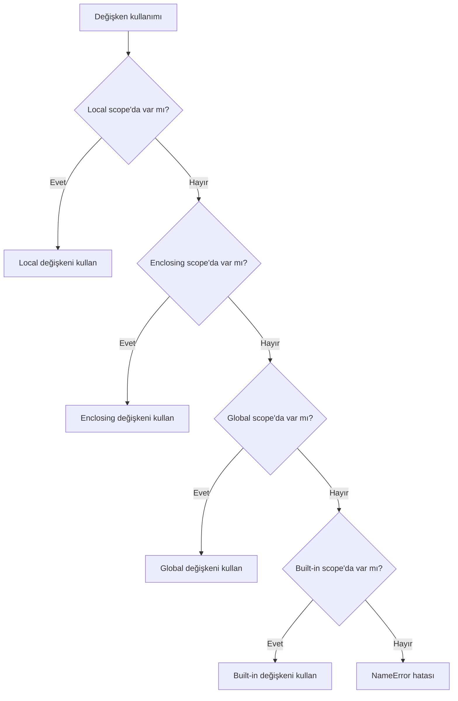

# Fonksiyonlar ve Modüller

## Bölüm Hedefleri

Bu bölümü tamamladığınızda aşağıdaki becerilere sahip olacaksınız:

1. **Fonksiyon Tanımlama:** Kendi kod bloklarınızı `def` anahtar kelimesiyle nasıl tanımlayıp çağıracağınızı bilmek.
2. **Parametre Kullanımı:** Fonksiyonlara girdi sağlamak için parametrelerin ve argümanların nasıl kullanıldığını anlamak.
3. **Değer Döndürme:** `return` ifadesiyle fonksiyonlardan nasıl değer alınacağını öğrenmek.
4. **Esnek Fonksiyonlar:** Değişken sayıda argüman almak için `*args` ve `**kwargs` yapılarını kullanabilmek.
5. **Lambda İfadeleri:** Kısa, tek kullanımlık fonksiyonlar oluşturmak için lambda ifadelerini öğrenmek.
6. **Fonksiyonel Araçlar:** `map()` ve `filter()` gibi fonksiyonları liste dönüşümlerinde kullanabilmek.
7. **Değişken Kapsamı (Scope):** Python'daki LEGB kuralını ve `global`/`nonlocal` anahtar kelimelerinin ne işe yaradığını anlamak.
8. **Modüler Programlama:** Hazır Python modüllerini (`math`, `random`, `datetime`) ve kendi modüllerinizi `import` ederek kodunuzu düzenlemek.

## Ön Bilgi

Bu bölüme başlamadan önce aşağıdaki konulara hakim olmanız beklenir:
- Temel veri tipleri (int, float, str, bool)
- Listeler ve sözlükler gibi veri yapıları
- `for` ve `while` döngüleri
- `if/elif/else` koşul ifadeleri


## Fonksiyon Nedir? (Temel Kavramlar)

### 1. Fonksiyon Tanımlama (`def`)

**TANIM:** Fonksiyon, belirli bir görevi yerine getirmek için bir araya getirilmiş, isimlendirilmiş ve tekrar kullanılabilir kod bloğudur.

**NEDEN VAR?** Aynı kodu defalarca yazmak yerine, bir kere yazıp istediğimiz yerde çağırarak zamandan tasarruf ederiz. Bu, kodun okunabilirliğini artırır ve hata yapma olasılığını azaltır. Java'daki "metot" kavramının Python'daki karşılığıdır.

**NASIL KULLANILIR?** Aşağıdaki örnekte, iki sayıyı toplayan bir fonksiyon tanımlayıp kullanıyoruz.


```python
# FonksiyonTemelleri.py

# 1. Fonksiyonu tanımla: 'def' anahtar kelimesi, fonksiyon adı ve parametreler
def ikiSayiyiTopla(sayi1, sayi2):
    """
    Bu fonksiyon, kendisine verilen iki sayıyı toplar.
    """
    sonuc = sayi1 + sayi2  # Toplama işlemini yap
    return sonuc           # Sonucu geri döndür

# 2. Fonksiyonu çağır ve sonucu bir değişkene ata
toplamDegeri = ikiSayiyiTopla(10, 25)

# 3. Sonucu ekrana yazdır
print("Toplam:", toplamDegeri)  # Çıktı: Toplam: 35

# 4. Fonksiyonu farklı argümanlarla tekrar çağır
baskaToplam = ikiSayiyiTopla(-5, 8)
print("Diğer Toplam:", baskaToplam)  # Çıktı: Diğer Toplam: 3
```


**Kod Açıklaması:**
- `def ikiSayiyiTopla(sayi1, sayi2):` satırı, `ikiSayiyiTopla` isminde bir fonksiyon tanımlar. `sayi1` ve `sayi2` parametrelerdir.
- `sonuc = sayi1 + sayi2` satırı, fonksiyonun asıl işini yapar.
- `return sonuc` satırı, hesaplanan değeri fonksiyonun çağrıldığı yere geri gönderir.
- `toplamDegeri = ikiSayiyiTopla(10, 25)` satırı, fonksiyonu `10` ve `25` argümanlarıyla çağırır. Fonksiyon çalışır ve `35` değerini döndürür, bu değer `toplamDegeri` değişkenine atanır.

**Günlük Hayat Analojisi:** Bir pastane düşünün. "Pasta yap" diye bir prosedürünüz var. Her müşteri geldiğinde "un al, yumurta kır, fırına ver" adımlarını tekrar söylemek yerine, "Pasta yap" prosedürünü bir kere tanımlayıp her siparişte onu çağırırsınız. İşte fonksiyon da budur.

**NE ZAMAN TERCİH EDİLİR?** Bir kod bloğunu programınızın birden fazla yerinde kullanmanız gerektiğinde her zaman fonksiyon tercih edilmelidir.

**ALTERNATİFLERİ:** Fonksiyon olmadan, aynı işlemi kopyala-yapıştır yapmak. Bu, kod tekrarına (code duplication) yol açar ve proje büyüdükçe bakımı zorlaştırır.

**YAYGIN HATALAR:**
- **Hata:** Fonksiyonu tanımlamadan çağırmak.
- **Çözüm:** Kodun yorumlayıcı tarafından yukarıdan aşağıya okunduğunu unutmayın. Fonksiyon tanımı, çağrılmadan önce gelmelidir.

### 2. Parametreler ve Argümanlar

**TANIM:** Parametre, fonksiyon tanımlanırken parantez içinde yazılan değişkendir. Argüman ise fonksiyon çağrılırken bu parametrelere gönderilen gerçek değerdir.

**NEDEN VAR?** Aynı fonksiyonu farklı verilerle çalıştırabilmek için bir girdi mekanizmasına ihtiyaç vardır. Parametreler bu girdiyi sağlar.

**NASIL KULLANILIR?** Python'da argümanlar üç farklı şekilde gönderilebilir: pozisyonel, anahtar kelimeli ve varsayılan değerli.


```python
# SiparisHesaplama.py

def siparisHesapla(urunAdi, adet=1, indirimOrani=0.0):
    """
    Bir ürün için toplam sipariş tutarını hesaplar.
    - urunAdi: Zorunlu pozisyonel argüman
    - adet: Varsayılan değeri 1 olan parametre
    - indirimOrani: Varsayılan değeri 0.0 olan parametre
    """
    fiyatlar = {"elma": 5.0, "armut": 7.5, "muz": 10.0}
    birimFiyat = fiyatlar.get(urunAdi, 0.0)

    # Varsayılan parametreler kullanıcı tarafından değiştirilebilir
    toplamTutar = birimFiyat * adet
    indirimMiktari = toplamTutar * indirimOrani
    odenecekTutar = toplamTutar - indirimMiktari

    print(f"{adet} adet {urunAdi} için ödenecek tutar: {odenecekTutar:.2f} TL")
    return odenecekTutar

# 1. Sadece zorunlu argümanla çağırma (pozisyonel)
siparisHesapla("elma")  # Çıktı: 1 adet elma için ödenecek tutar: 5.00 TL

# 2. Tüm argümanları pozisyonel olarak verme
siparisHesapla("armut", 3, 0.10)  # Çıktı: 3 adet armut için ödenecek tutar: 20.25 TL

# 3. Anahtar kelimeli argümanlarla çağırma (sıra önemli değil)
siparisHesapla(urunAdi="muz", indirimOrani=0.05, adet=5)  # Çıktı: 5 adet muz için ödenecek tutar: 47.50 TL
```


**Kod Açıklaması:**
- `adet=1` ve `indirimOrani=0.0` varsayılan parametrelerdir. Fonksiyon çağrılırken bu parametrelere argüman gönderilmezse, varsayılan değerleri kullanılır.
- Anahtar kelimeli argümanlar (`urunAdi="muz"`) sayesinde argümanların sırası önemini kaybeder. Bu, özellikle çok sayıda parametresi olan fonksiyonlarda okunabilirliği artırır.
- Java'da bu özellik yoktur, ancak Builder Pattern veya aşırı yüklenmiş (overloaded) metotlarla benzer bir esneklik sağlanabilir.

**NE ZAMAN TERCİH EDİLİR?**
- **Pozisyonel Argümanlar:** Parametre sayısı az ve sırası akılda kalıcıysa.
- **Anahtar Kelimeli Argümanlar:** Parametre sayısı fazlaysa veya sadece belirli parametrelere değer atamak istiyorsanız.
- **Varsayılan Parametreler:** Bir parametrenin çoğu zaman aynı değerle kullanılacağını biliyorsanız.

**ALTERNATİFLERİ:** Java'daki metot aşırı yükleme (method overloading) bu işi görür. Farklı parametre listelerine sahip aynı isimde birden fazla metot tanımlanır.

**YAYGIN HATALAR:**
- **Hata:** Varsayılan parametre olarak değiştirilebilir (mutable) bir nesne (örneğin boş bir liste `[]`) kullanmak.
- **Çözüm:** Bunun yerine `None` kullanıp fonksiyon içinde kontrol edin. `def fonk(liste=None): if liste is None: liste = []`

### 3. `return` İfadesi

**TANIM:** `return` ifadesi, bir fonksiyonun ürettiği değeri çağrıldığı yere geri göndermek için kullanılır.

**NEDEN VAR?** Bir fonksiyon sadece bir işlem yapıp bitmez; çoğu zaman bir sonuç üretir ve bu sonucu programın geri kalanında kullanmak isteriz. `return` bu sonucu dışarıya iletir.

**NASIL KULLANILIR?**


```python
# return kullanımı
def kareAl(sayi):
    """Verilen sayının karesini döndürür."""
    return sayi ** 2  # Değeri döndür

sonuc = kareAl(5)  # sonuc değişkeni 25 değerini alır
print(sonuc)       # Çıktı: 25

# return olmadan fonksiyon None döndürür
def sadeceYazdir(metin):
    """Sadece metni yazdırır, hiçbir şey döndürmez."""
    print(metin)

deger = sadeceYazdir("Merhaba")  # Çıktı: Merhaba
print(deger)                      # Çıktı: None (fonksiyon bir değer döndürmedi)

# Erken çıkış için return kullanımı
def yasKontrol(yas):
    """Yaş 18'den küçükse erken çık."""
    if yas < 18:
        return "Üzgünüm, giremezsiniz."  # Fonksiyon burada biter
    # Eğer yas >= 18 ise bu satır çalışır
    return "Hoş geldiniz!"

mesaj = yasKontrol(16)
print(mesaj)  # Çıktı: Üzgünüm, giremezsiniz.
```


**Kod Açıklaması:**
- `kareAl` fonksiyonu `return` ile bir değer döndürür, bu değer bir değişkene atanabilir.
- `sadeceYazdir` fonksiyonunda `return` ifadesi yoktur. Python bu durumda otomatik olarak `None` döndürür.
- `yasKontrol` fonksiyonunda `return`, bir koşul sağlandığında fonksiyondan erken çıkmak için kullanılır. Bu, gereksiz kod çalışmasını engeller.

**NE ZAMAN TERCİH EDİLİR?** Bir fonksiyonun bir değer hesaplaması ve bu değeri kullanmanız gerektiğinde `return` kullanmalısınız. Eğer fonksiyon sadece bir yan etki (ekrana yazdırma, dosyaya yazma) oluşturacaksa `return` kullanmanıza gerek yoktur.

**ALTERNATİFLERİ:** Fonksiyonun bir değer döndürmesi yerine, global bir değişkeni değiştirmesi. Ancak bu, kodun anlaşılmasını ve hata ayıklamasını zorlaştırdığı için önerilmez.

**YAYGIN HATALAR:**
- **Hata:** `return` yazmayı unutmak. Fonksiyon her zaman `None` döndürür.
- **Çözüm:** Fonksiyonun bir değer üretmesi gerekiyorsa, mutlaka `return` ifadesini ekleyin.


## Esnek Fonksiyonlar: `*args` ve `**kwargs`

### `*args` ve `**kwargs`

**TANIM:** `*args`, bir fonksiyona değişken sayıda pozisyonel argüman göndermenizi sağlar. `**kwargs` ise değişken sayıda anahtar kelimeli argüman göndermenizi sağlar.

**NEDEN VAR?** Bazen bir fonksiyonun kaç argüman alacağını önceden bilemeyiz. Örneğin, bir toplama fonksiyonu yazıyorsanız, 2 sayıyı da toplayabilmeli, 10 sayıyı da. `*args` ve `**kwargs` bu esnekliği sağlar.

**NASIL KULLANILIR?**


```python
# EsnekFonksiyon.py

# 1. *args: Değişken sayıda pozisyonel argüman alır ve bir tuple olarak saklar
def toplamaYap(*sayilar):
    """Gönderilen tüm sayıları toplar."""
    toplam = 0
    for sayi in sayilar:  # sayilar bir tuple'dır
        toplam += sayi
    return toplam

print(toplamaYap(1, 2, 3))       # Çıktı: 6
print(toplamaYap(10, 20))        # Çıktı: 30
print(toplamaYap(1, 2, 3, 4, 5)) # Çıktı: 15

# 2. **kwargs: Değişken sayıda anahtar kelimeli argüman alır ve bir sözlük olarak saklar
def kullaniciBilgisiGoster(**bilgiler):
    """Kullanıcı bilgilerini ekrana yazdırır."""
    print("Kullanıcı Bilgileri:")
    for anahtar, deger in bilgiler.items():  # bilgiler bir sözlüktür
        print(f"{anahtar}: {deger}")

kullaniciBilgisiGoster(ad="Ali", soyad="Yılmaz", yas=30)
# Çıktı:
# Kullanıcı Bilgileri:
# ad: Ali
# soyad: Yılmaz
# yas: 30

# 3. Paketleme ve Açma (Packing & Unpacking)
# Bir listeyi veya sözlüğü fonksiyona argüman olarak "açabilirsiniz"
sayiListesi = [1, 2, 3, 4]
print(toplamaYap(*sayiListesi))  # Liste, * ile açılır: toplamaYap(1,2,3,4) -> Çıktı: 10

bilgiSozlugu = {"sehir": "İstanbul", "meslek": "Mühendis"}
kullaniciBilgisiGoster(**bilgiSozlugu)
# Çıktı:
# Kullanıcı Bilgileri:
# sehir: İstanbul
# meslek: Mühendis
```


**Kod Açıklaması:**
- `*sayilar` parametresi, fonksiyona gönderilen tüm pozisyonel argümanları bir `tuple` (demet) olarak toplar.
- `**bilgiler` parametresi, tüm anahtar kelimeli argümanları bir `dict` (sözlük) olarak toplar.
- `*sayiListesi` ifadesi, `sayiListesi` isimli listeyi "açar" ve elemanlarını ayrı ayrı argümanlar halinde fonksiyona gönderir. Bu işleme **unpacking** (açma) denir.

**Günlük Hayat Analojisi:** Bir kargo şirketi düşünün. Bazen tek bir paket (`*args`), bazen de adres, telefon, not gibi etiketli bilgilerin olduğu bir form (`**kwargs`) gönderebilirsiniz. Kargo şirketi (fonksiyon) her iki durumu da işleyebilecek şekilde tasarlanmıştır.

**NE ZAMAN TERCİH EDİLİR?**
- **`*args`:** Bir liste üzerinde işlem yapan fonksiyonlarda (toplama, ortalama bulma, en büyük değeri bulma).
- **`**kwargs`:** Konfigürasyon ayarları, kullanıcı profili gibi adlandırılmış verileri işleyen fonksiyonlarda. Ayrıca, sınıf yapıcılarında (constructor) esneklik sağlamak için sıkça kullanılır.

**ALTERNATİFLERİ:** Fonksiyona her zaman bir liste veya sözlük göndermek. Örneğin, `toplamaYap(sayilar)` şeklinde. Ancak bu, fonksiyon çağrısını daha az esnek hale getirir.

**YAYGIN HATALAR:**
- **Hata:** `*args` ve `**kwargs`'ı karıştırmak. `*args` pozisyonel, `**kwargs` anahtar kelimeli argümanlar içindir.
- **Çözüm:** İsimlendirmeyi unutmayın. `args` (arguments) pozisyonel, `kwargs` (keyword arguments) anahtar kelimeli argümanlar içindir.


## Lambda ve Fonksiyonel Araçlar

### 1. Lambda Fonksiyonları

**TANIM:** Lambda ifadesi, tek bir ifadeden oluşan, isimsiz (anonim) bir fonksiyon oluşturmanın kısa bir yoludur.

**NEDEN VAR?** Küçük, basit ve bir kereye mahsus kullanılacak fonksiyonlar için ayrı bir `def` bloğu yazmak zahmetlidir. Lambda, bu tür durumlar için pratik bir çözümdür.

**NASIL KULLANILIR?**


```python
# LambdaDonusum.py

# 1. Normal fonksiyon ile lambda karşılaştırması
# Normal fonksiyon
def kareAlNormal(x):
    return x ** 2

# Lambda fonksiyonu
kareAlLambda = lambda x: x ** 2

print(kareAlNormal(5))  # Çıktı: 25
print(kareAlLambda(5))  # Çıktı: 25

# 2. Birden fazla parametreli lambda
topla = lambda a, b: a + b
print(topla(10, 20))  # Çıktı: 30

# 3. Koşullu lambda (ternary if)
buyukSayi = lambda x, y: x if x > y else y
print(buyukSayi(15, 30))  # Çıktı: 30
```


**Kod Açıklaması:**
- `lambda x: x ** 2` ifadesi, `x` parametresini alan ve `x ** 2` değerini döndüren isimsiz bir fonksiyon oluşturur.
- Lambda fonksiyonları bir değişkene atanabilir (`kareAlLambda`), ancak genellikle başka bir fonksiyona argüman olarak geçirilirler.

**NE ZAMAN TERCİH EDİLİR?** Lambda, genellikle `map()`, `filter()` gibi fonksiyonlarla birlikte kullanılır. Karmaşık mantığı olan, birden fazla ifade içeren fonksiyonlar için `def` kullanılmalıdır.

**ALTERNATİFLERİ:** `def` anahtar kelimesiyle tanımlanan normal fonksiyonlar.

**YAYGIN HATALAR:**
- **Hata:** Lambda içinde birden fazla ifade veya atama (`=`) kullanmaya çalışmak.
- **Çözüm:** Lambda sadece tek bir ifade içerebilir. Karmaşık işlemler için `def` kullanın.

### 2. `map()` ve `filter()` Fonksiyonları

**TANIM:** `map(fonksiyon, iterable)`, bir fonksiyonu bir iterable'ın (liste, demet vb.) her bir elemanına uygular. `filter(fonksiyon, iterable)`, bir fonksiyonun `True` döndürdüğü elemanları seçer.

**NEDEN VAR?** Bir liste üzerinde döngü kullanarak dönüşüm veya filtreleme yapmak yerine, daha kısa ve okunabilir bir yol sunarlar. Bu, fonksiyonel programlamanın temel araçlarıdır.

**NASIL KULLANILIR?**


```python
# LambdaDonusum.py

sayilar = [1, 2, 3, 4, 5, 6, 7, 8, 9, 10]

# 1. map() ile her sayının karesini al
# Lambda fonksiyonunu map'e argüman olarak geçiriyoruz
kareler = list(map(lambda x: x ** 2, sayilar))
print("Kareler:", kareler)  # Çıktı: Kareler: [1, 4, 9, 16, 25, 36, 49, 64, 81, 100]

# 2. filter() ile sadece çift sayıları seç
ciftSayilar = list(filter(lambda x: x % 2 == 0, sayilar))
print("Çift Sayılar:", ciftSayilar)  # Çıktı: Çift Sayılar: [2, 4, 6, 8, 10]

# 3. map() ve filter()'ı birleştirme: 3'ten büyük çift sayıların küplerini al
# Önce filter ile 3'ten büyük çiftleri seç, sonra map ile küpünü al
sonuc = list(map(lambda x: x ** 3, filter(lambda x: x > 3 and x % 2 == 0, sayilar)))
print("Sonuç:", sonuc)  # Çıktı: Sonuç: [64, 216, 512, 1000]
```


**Kod Açıklaması:**
- `map(lambda x: x**2, sayilar)`, `sayilar` listesinin her bir elemanı için lambda fonksiyonunu çalıştırır. Sonuç bir `map` nesnesidir; listeye çevirmek için `list()` kullanılır.
- `filter(lambda x: x % 2 == 0, sayilar)`, sadece koşulu sağlayan (çift olan) elemanları seçer.
- `map` ve `filter` birleştirilerek güçlü ve okunabilir veri dönüşüm zincirleri oluşturulabilir.

**NE ZAMAN TERCİH EDİLİR?** Bir listenin tüm elemanlarını dönüştürmek (`map`) veya bir koşula göre filtrelemek (`filter`) istediğinizde bu fonksiyonları tercih edin. Özellikle lambda ile birlikte kullanıldıklarında çok etkilidirler.

**ALTERNATİFLERİ:**
- **`map` için:** Liste kavrama (list comprehension): `[x**2 for x in sayilar]`
- **`filter` için:** Liste kavrama: `[x for x in sayilar if x % 2 == 0]`
- Liste kavramalar genellikle daha Pythonic ve okunabilir kabul edilir.

**YAYGIN HATALAR:**
- **Hata:** `map()` veya `filter()`'ın sonucunu bir listeye çevirmeden kullanmaya çalışmak.
- **Çözüm:** Bu fonksiyonlar tembel (lazy) değerlendirme yapar. Sonucu hemen kullanmak için `list()`, `tuple()` gibi bir dönüştürücü kullanın.


## Değişken Kapsamı (Scope) ve LEGB Kuralı

### 1. LEGB Kuralı

**TANIM:** LEGB, Python'da bir değişkene erişmeye çalıştığınızda yorumlayıcının hangi sırayla alanları (scope) taradığını belirten kuraldır: **L**ocal (Yerel) → **E**nclosing (Kapsayan) → **G**lobal (Küresel) → **B**uilt-in (Yerleşik).

**NEDEN VAR?** Farklı alanlarda aynı isimde değişkenler olabilir. LEGB kuralı, hangi değişkenin kullanılacağını belirleyerek karışıklığı önler.

**NASIL KULLANILIR?** Aşağıdaki örnek, LEGB kuralını adım adım gösterir.


```python
# DegiskenKapsami.py

# Global alan (Global Scope)
x = "küresel x"

def disFonksiyon():
    # Enclosing alan (Kapsayan Scope)
    x = "kapsayan x"

    def icFonksiyon():
        # Local alan (Yerel Scope)
        x = "yerel x"
        print("İç fonksiyonda x:", x)  # Önce Local alana bakar -> "yerel x"

    icFonksiyon()
    print("Dış fonksiyonda x:", x)  # Local'de bulamaz, Enclosing'e bakar -> "kapsayan x"

disFonksiyon()
print("Globalde x:", x)  # Local ve Enclosing'de bulamaz, Global'e bakar -> "küresel x"

# Built-in alan: print, len, int gibi Python'un hazır fonksiyonları
print("Built-in örnek: len([1,2,3]) =", len([1,2,3]))  # Çıktı: 3
```


**Kod Açıklaması:**
- `icFonksiyon` içinde `x` değişkenine erişilmek istendiğinde, Python önce bu fonksiyonun **Local** alanına bakar ve `"yerel x"` değerini bulur.
- `disFonksiyon` içinde `x` arandığında, Local alanında bulamaz, bir üstteki **Enclosing** alanına (yani `disFonksiyon`'un kendi alanına) bakar ve `"kapsayan x"` değerini bulur.
- En dışarıda `x` arandığında, Local ve Enclosing alanları olmadığı için doğrudan **Global** alana bakar ve `"küresel x"` değerini bulur.
- Eğer hiçbir yerde bulamazsa, **Built-in** alanına bakar. Orada da yoksa `NameError` hatası alırız.

**NE ZAMAN TERCİH EDİLİR?** Bu kuralı bilmek, özellikle iç içe fonksiyonlar ve değişkenlerle çalışırken beklenmedik hataları önler.

**ALTERNATİFLERİ:** Diğer dillerde de benzer kapsam kuralları vardır (Java'daki blok scope, sınıf scope'u). LEGB, Python'a özgü bir kuraldır.

**YAYGIN HATALAR:**
- **Hata:** Bir fonksiyon içinde global bir değişkeni değiştirmeye çalışmak ve `UnboundLocalError` almak.
- **Çözüm:** Eğer global değişkeni değiştirmek istiyorsanız, `global` anahtar kelimesini kullanın.

### 2. `global` ve `nonlocal` Anahtar Kelimeleri

**TANIM:** `global`, bir fonksiyon içinde global alandaki bir değişkeni değiştirmek için kullanılır. `nonlocal` ise iç içe fonksiyonlarda, içteki fonksiyonun dıştaki (enclosing) fonksiyonun değişkenini değiştirmesi için kullanılır.

**NEDEN VAR?** Varsayılan olarak, bir fonksiyon içinde bir değişkene değer atadığınızda, Python onu yerel bir değişken olarak kabul eder. Eğer global veya enclosing alandaki bir değişkeni değiştirmek isterseniz, bu anahtar kelimelerle niyetinizi belirtmeniz gerekir.

**NASIL KULLANILIR?**


```python
# DegiskenKapsami.py

sayac = 0  # Global değişken

def sayaciArttir():
    global sayac  # Bu satır olmazsa, Python yeni bir yerel 'sayac' oluşturur
    sayac += 1

sayaciArttir()
sayaciArttir()
print("Global sayaç:", sayac)  # Çıktı: Global sayaç: 2

# nonlocal örneği
def disFonksiyon():
    mesaj = "Dış mesaj"

    def icFonksiyon():
        nonlocal mesaj  # Bu satır olmazsa, Python yeni bir yerel 'mesaj' oluşturur
        mesaj = "İç mesaj (değiştirildi)"

    icFonksiyon()


    print("Dış fonksiyondaki mesaj:", mesaj)  # Çıktı: Dış fonksiyondaki mesaj: İç mesaj (değiştirildi)

disFonksiyon()
```


**Kod Açıklaması:**
- `global sayac` ifadesi, `sayaciArttir` fonksiyonuna "Bu `sayac` değişkeni global alandaki ile aynı" der. Aksi halde Python, `sayac += 1` satırında yeni bir yerel değişken oluşturur ve global değişken değişmez.
- `nonlocal mesaj` ifadesi, `icFonksiyon`'a "Bu `mesaj` değişkeni, beni kapsayan fonksiyonun (`disFonksiyon`) değişkeni" der. Bu sayede içteki fonksiyon, dıştaki fonksiyonun değişkenini değiştirebilir.

**NE ZAMAN TERCİH EDİLİR?** `global` ve `nonlocal` kullanımı genellikle önerilmez çünkü kodun takibini zorlaştırır. Ancak bazı durumlarda (örneğin, bir sayaç değişkenini güncellemek veya bir decorator yazmak) bu anahtar kelimeler gerekli olabilir.

**ALTERNATİFLERİ:** Fonksiyonlara parametre olarak değişken geçirip, geri dönüş değeri ile güncellemek daha temiz bir yaklaşımdır. `global` ve `nonlocal` kullanmak yerine, değişkenleri fonksiyon argümanı olarak geçirin ve sonucu `return` ile alın.

**YAYGIN HATALAR:**
- **Hata:** `global` veya `nonlocal` kullanmadan global/enclosing değişkeni değiştirmeye çalışmak ve `UnboundLocalError` almak.
- **Çözüm:** Değişkeni değiştirmeden önce, hangi kapsamda olduğunu belirtmek için `global` veya `nonlocal` anahtar kelimesini kullanın.


### 3. Scope Hiyerarşisi (LEGB) Diyagramı

Aşağıdaki diyagram, bir değişkene erişildiğinde Python'un hangi sırayla kapsamları taradığını gösterir.





**Diyagram Açıklaması:** Python, bir değişkene erişmek istediğinde önce Local (yerel) kapsama bakar. Bulamazsa Enclosing (kapsayan), ardından Global (küresel) ve en son Built-in (yerleşik) kapsamlarına bakar. Hiçbir yerde bulamazsa `NameError` hatası verir.


## Modüller ve Paketler

### 1. `import` ve `from` İfadeleri

**TANIM:** `import` ifadesi, başka bir Python dosyasındaki (modül) kodu mevcut programa dahil etmek için kullanılır. `from` ise bir modülden belirli bir öğeyi (fonksiyon, sınıf, değişken) doğrudan içe aktarmak için kullanılır.

**NEDEN VAR?** Kodları modüllere ayırmak, büyük projeleri yönetilebilir parçalara böler. `import` ve `from` ile bu parçaları ihtiyaç duyduğumuz yerde kullanabiliriz. Aksi halde tüm kod tek bir dosyada olur ve okunması, bakımı zorlaşır.

**NASIL KULLANILIR?**


```python
# KutuphaneKullanimi.py

# import ile tüm modülü içe aktarma
import math

# Modül adını kullanarak fonksiyonlara erişme
print("Pi sayısı:", math.pi)  # Çıktı: Pi sayısı: 3.141592653589793
print("Karekök 16:", math.sqrt(16))  # Çıktı: Karekök 16: 4.0

# from ile belirli bir fonksiyonu içe aktarma
from random import randint, choice

# Doğrudan fonksiyon adını kullanma
print("Rastgele sayı (1-10):", randint(1, 10))  # Çıktı: Rastgele sayı (1-10): 7 (örnek)
print("Rastgele seçim:", choice(["elma", "armut", "muz"]))  # Çıktı: Rastgele seçim: armut (örnek)

# from ile tüm öğeleri içe aktarma (önerilmez!)
from datetime import *

# Şimdi datetime modülündeki tüm fonksiyonlar doğrudan kullanılabilir
print("Bugün:", date.today())  # Çıktı: Bugün: 2023-10-27 (örnek)

# Alias (takma ad) kullanma
import numpy as np  # numpy modülüne 'np' takma adı verildi
# np.array([1, 2, 3]) şeklinde kullanılır
```


**Kod Açıklaması:**
- `import math` ile `math` modülünün tüm fonksiyonlarına `math.fonksiyonAdi` şeklinde erişiriz.
- `from random import randint` ile sadece `randint` fonksiyonunu içe aktarırız, böylece doğrudan `randint()` çağırabiliriz.
- `from datetime import *` tüm `datetime` öğelerini içe aktarır, ancak isim çakışmalarına neden olabileceği için genellikle önerilmez.
- `import numpy as np` ile modüle kısa bir takma ad veririz, bu özellikle uzun modül adlarında kullanışlıdır.

**NE ZAMAN TERCİH EDİLİR?**
- Modülün birçok fonksiyonunu kullanacaksanız `import modul` tercih edilir.
- Modülün sadece bir veya birkaç fonksiyonunu kullanacaksanız `from modul import fonksiyon` daha uygundur.
- `from modul import *` sadece küçük, özel modüllerde veya interaktif oturumlarda kullanılmalıdır.

**ALTERNATİFLERİ:** Modülleri içe aktarmanın alternatifi, kodu doğrudan aynı dosyaya yazmaktır. Ancak bu, büyük projeler için uygun değildir.

**YAYGIN HATALAR:**
- **Hata:** `import` ile içe aktarılan bir modülün fonksiyonuna modül adı olmadan erişmeye çalışmak (`sqrt(16)` yerine `math.sqrt(16)`).
- **Çözüm:** `import modul` kullanıldığında, her zaman `modul.fonksiyon` şeklinde erişin. Doğrudan erişim için `from modul import fonksiyon` kullanın.


### 2. Standart Kütüphane (math, random, datetime)

**TANIM:** Python Standart Kütüphanesi, Python ile birlikte gelen, sık kullanılan işlemler için hazır modüller ve fonksiyonlar koleksiyonudur.

**NEDEN VAR?** Standart kütüphane, tekerleği yeniden icat etmemizi engeller. Matematiksel işlemler, rastgele sayı üretimi, tarih/saat işlemleri, dosya işlemleri gibi yaygın görevler için hazır çözümler sunar.

**NASIL KULLANILIR?**


```python
# SiparisHesaplama.py

def siparisHesapla(urunAdi, adet=1, indirimOrani=0.0):
    """
    Bir ürün için toplam sipariş tutarını hesaplar.
    - urunAdi: Zorunlu pozisyonel argüman
    - adet: Varsayılan değeri 1 olan parametre
    - indirimOrani: Varsayılan değeri 0.0 olan parametre
    """
    fiyatlar = {"elma": 5.0, "armut": 7.5, "muz": 10.0}
    birimFiyat = fiyatlar.get(urunAdi, 0.0)

    # Varsayılan parametreler kullanıcı tarafından değiştirilebilir
    toplamTutar = birimFiyat * adet
    indirimMiktari = toplamTutar * indirimOrani
    odenecekTutar = toplamTutar - indirimMiktari

    print(f"{adet} adet {urunAdi} için ödenecek tutar: {odenecekTutar:.2f} TL")
    return odenecekTutar

# 1. Sadece zorunlu argümanla çağırma (pozisyonel)
siparisHesapla("elma")  # Çıktı: 1 adet elma için ödenecek tutar: 5.00 TL

# 2. Tüm argümanları pozisyonel olarak verme
siparisHesapla("armut", 3, 0.10)  # Çıktı: 3 adet armut için ödenecek tutar: 20.25 TL

# 3. Anahtar kelimeli argümanlarla çağırma (sıra önemli değil)
siparisHesapla(urunAdi="muz", indirimOrani=0.05, adet=5)  # Çıktı: 5 adet muz için ödenecek tutar: 47.50 TL
```

0


0


**Kod Açıklaması:**
- `math` modülü, trigonometrik fonksiyonlar (`sin`, `cos`), sabitler (`pi`, `e`), yuvarlama (`ceil`, `floor`) ve faktöriyel (`factorial`) gibi matematiksel işlemler sunar.
- `random` modülü, rastgele sayı üretmek (`random`, `randint`) ve bir listeden rastgele eleman seçmek (`choice`) için kullanılır.
- `datetime` modülü, tarih ve saat nesneleri (`datetime.now`, `date.today`), tarih farkı hesaplama (`timedelta`) ve tarih biçimlendirme işlemleri için kullanılır.

**NE ZAMAN TERCİH EDİLİR?** Bu modülleri, ihtiyacınız olan her an kullanabilirsiniz. Kendi çözümünüzü yazmak yerine standart kütüphaneyi kullanmak, kodunuzu daha güvenilir ve taşınabilir yapar.

**ALTERNATİFLERİ:** Bazı durumlarda, özel ihtiyaçlar için üçüncü parti kütüphaneler (NumPy, Pandas) daha uygun olabilir. Ancak temel işlemler için standart kütüphane yeterlidir.

**YAYGIN HATALAR:**
- **Hata:** `math` modülünün `ceil` ve `floor` fonksiyonlarını karıştırmak.
- **Çözüm:** `ceil` (tavan) her zaman yukarı yuvarlar, `floor` (taban) her zaman aşağı yuvarlar. `math.ceil(4.2) = 5`, `math.floor(4.8) = 4`.
- **Hata:** `datetime` modülünde `date` ve `datetime` nesnelerini karıştırmak.
- **Çözüm:** `date` sadece tarih (gün, ay, yıl) içerir, `datetime` ise tarih ve saat (saat, dakika, saniye) içerir.


## Bütünleşik Örnek: Hesap Makinesi Modülü

Bu bölümde öğrendiğimiz tüm kavramları birleştiren bir hesap makinesi modülü yazalım.


```python
# SiparisHesaplama.py

def siparisHesapla(urunAdi, adet=1, indirimOrani=0.0):
    """
    Bir ürün için toplam sipariş tutarını hesaplar.
    - urunAdi: Zorunlu pozisyonel argüman
    - adet: Varsayılan değeri 1 olan parametre
    - indirimOrani: Varsayılan değeri 0.0 olan parametre
    """
    fiyatlar = {"elma": 5.0, "armut": 7.5, "muz": 10.0}
    birimFiyat = fiyatlar.get(urunAdi, 0.0)

    # Varsayılan parametreler kullanıcı tarafından değiştirilebilir
    toplamTutar = birimFiyat * adet
    indirimMiktari = toplamTutar * indirimOrani
    odenecekTutar = toplamTutar - indirimMiktari

    print(f"{adet} adet {urunAdi} için ödenecek tutar: {odenecekTutar:.2f} TL")
    return odenecekTutar

# 1. Sadece zorunlu argümanla çağırma (pozisyonel)
siparisHesapla("elma")  # Çıktı: 1 adet elma için ödenecek tutar: 5.00 TL

# 2. Tüm argümanları pozisyonel olarak verme
siparisHesapla("armut", 3, 0.10)  # Çıktı: 3 adet armut için ödenecek tutar: 20.25 TL

# 3. Anahtar kelimeli argümanlarla çağırma (sıra önemli değil)
siparisHesapla(urunAdi="muz", indirimOrani=0.05, adet=5)  # Çıktı: 5 adet muz için ödenecek tutar: 47.50 TL
```

1


1


**Kod Açıklaması:**
- `toplama` ve `carpma` fonksiyonları `*args` kullanarak değişken sayıda argüman alır.
- `kareAl` ve `kupAl` fonksiyonları, `lambda` ve `map` kullanarak listeleri dönüştürür.
- `standartSapma` fonksiyonu, `math.sqrt` ile standart kütüphaneyi kullanır.
- `hesapMakinesi` fonksiyonu, tüm diğer fonksiyonları çağıran bir kullanıcı arayüzü sağlar.
- `if __name__ == "__main__":` bloğu, bu dosya doğrudan çalıştırıldığında hesap makinesini başlatır.

**Örnek Çıktı:**


```python
# SiparisHesaplama.py

def siparisHesapla(urunAdi, adet=1, indirimOrani=0.0):
    """
    Bir ürün için toplam sipariş tutarını hesaplar.
    - urunAdi: Zorunlu pozisyonel argüman
    - adet: Varsayılan değeri 1 olan parametre
    - indirimOrani: Varsayılan değeri 0.0 olan parametre
    """
    fiyatlar = {"elma": 5.0, "armut": 7.5, "muz": 10.0}
    birimFiyat = fiyatlar.get(urunAdi, 0.0)

    # Varsayılan parametreler kullanıcı tarafından değiştirilebilir
    toplamTutar = birimFiyat * adet
    indirimMiktari = toplamTutar * indirimOrani
    odenecekTutar = toplamTutar - indirimMiktari

    print(f"{adet} adet {urunAdi} için ödenecek tutar: {odenecekTutar:.2f} TL")
    return odenecekTutar

# 1. Sadece zorunlu argümanla çağırma (pozisyonel)
siparisHesapla("elma")  # Çıktı: 1 adet elma için ödenecek tutar: 5.00 TL

# 2. Tüm argümanları pozisyonel olarak verme
siparisHesapla("armut", 3, 0.10)  # Çıktı: 3 adet armut için ödenecek tutar: 20.25 TL

# 3. Anahtar kelimeli argümanlarla çağırma (sıra önemli değil)
siparisHesapla(urunAdi="muz", indirimOrani=0.05, adet=5)  # Çıktı: 5 adet muz için ödenecek tutar: 47.50 TL
```

2


2


## Bölüm Özeti

Bu bölümde, Python'da fonksiyon ve modül kavramlarını derinlemesine inceledik:

1. **Fonksiyon Tanımlama:** `def` anahtar kelimesi ile tekrar kullanılabilir kod blokları oluşturmayı öğrendik.
2. **Parametreler ve Argümanlar:** Zorunlu, varsayılan, anahtar kelimeli ve değişken sayıda argüman (`*args`, `**kwargs`) kullanımını gördük.
3. **return İfadesi:** Fonksiyonların değer döndürmesi ve erken çıkış için kullanımını inceledik.
4. **Lambda Fonksiyonları:** Tek ifadeli, isimsiz fonksiyonların kullanım alanlarını keşfettik.
5. **map() ve filter():** Fonksiyonel programlama yaklaşımıyla liste dönüşümlerini öğrendik.
6. **Scope Kuralları (LEGB):** Değişkenlerin görünürlük alanlarını ve `global`/`nonlocal` anahtar kelimelerini inceledik.
7. **Modüller ve import:** Kodları modüllere ayırma ve içe aktarma yöntemlerini gördük.
8. **Standart Kütüphane:** `math`, `random`, `datetime` gibi hazır modüllerin kullanımını öğrendik.

**Günlük Hayat Analojisi:** Fonksiyonlar, bir restoranın mutfağındaki tarifler gibidir. Her tarif (fonksiyon), belirli malzemeleri (parametreler) alır, belirli adımları uygular ve bir yemek (çıktı) üretir. Modüller ise farklı mutfak kültürlerini (İtalyan, Çin, Türk) temsil eder; her biri kendi tarif koleksiyonunu içerir ve istediğimizde kullanabiliriz.


## Sözlük

| Terim | Anlamı |
|-------|--------|
| **Fonksiyon** | İsimlendirilmiş, tekrar kullanılabilir kod bloğu |
| **Parametre** | Fonksiyon tanımında kullanılan değişken |
| **Argüman** | Fonksiyon çağrılırken gönderilen değer |
| **return** | Fonksiyonun ürettiği değeri geri döndüren ifade |
| **`*args`** | Değişken sayıda pozisyonel argüman almak için kullanılır |
| **`**kwargs`** | Değişken sayıda anahtar kelimeli argüman almak için kullanılır |
| **Lambda** | Tek ifadeli, isimsiz fonksiyon |
| **map()** | Bir fonksiyonu bir diziye uygulayan yerleşik fonksiyon |
| **filter()** | Bir koşula göre elemanları seçen yerleşik fonksiyon |
| **Scope (Kapsam)** | Bir değişkenin görünür olduğu alan |
| **LEGB** | Local, Enclosing, Global, Built-in kapsam hiyerarşisi |
| **global** | Global değişkeni fonksiyon içinde değiştirmek için kullanılır |
| **nonlocal** | Enclosing değişkeni iç fonksiyonda değiştirmek için kullanılır |
| **Modül** | Python kodları içeren dosya |
| **import** | Bir modülü programa dahil etme ifadesi |
| **Alias** | Modüle verilen kısa takma ad |
| **Standart Kütüphane** | Python ile gelen hazır modül koleksiyonu |


## Sorular

1. Bir fonksiyon `return` ifadesi içermiyorsa ne döndürür?
2. `*args` ve `**kwargs` arasındaki temel fark nedir?
3. Lambda fonksiyonları hangi durumlarda tercih edilir?
4. `global` anahtar kelimesi olmadan bir fonksiyon içinde global değişken değiştirilebilir mi?
5. `import math` ve `from math import sqrt` arasındaki fark nedir?


## Alıştırmalar

1. **Temel Fonksiyon:** Kullanıcıdan alınan iki sayının EBOB'unu hesaplayan bir fonksiyon yazın.
2. ***args Kullanımı:** Değişken sayıda sayının harmonik ortalamasını hesaplayan bir fonksiyon yazın.
3. **Lambda ve map:** Bir listedeki tüm sayıların faktöriyelini hesaplayan bir program yazın (lambda ve map kullanarak).
4. **Modül Oluşturma:** Kendi `stringIslemleri` modülünüzü oluşturun. İçinde `tersCevir`, `sesliHarfleriSay`, `palindromMu` fonksiyonları olsun.
5. **Kapsam Deneyi:** İç içe üç fonksiyon yazın. Her seviyede aynı isimde değişkenler oluşturun ve LEGB kuralını test edin.


## Yaygın Hatalar

1. **`return`'ü unutmak:** Fonksiyon bir değer hesaplıyor ancak `return` ile döndürmüyorsanız, fonksiyon `None` döndürür.
2. **Global değişkeni değiştirmeye çalışmak:** `global` anahtar kelimesi olmadan global değişkeni değiştirmeye çalışmak `UnboundLocalError` hatası verir.
3. **Lambda'da karmaşık ifadeler:** Lambda sadece tek bir ifade içerebilir. Birden fazla işlem için normal fonksiyon kullanın.
4. **`from modul import *` kullanımı:** Bu yöntem isim çakışmalarına neden olabilir, özellikle büyük projelerde kaçının.
5. **`*args` ve `**kwargs`'ı karıştırmak:** `*args` pozisyonel argümanları, `**kwargs` anahtar kelimeli argümanları toplar. İkisi aynı anda kullanılabilir ancak sıralama önemlidir: `fonksiyon(*args, **kwargs)`.

## Bir sonraki bolume kopru

Fonksiyonların ve modüllerin gücünü kavradığınız bu bölümde, artık tekrar eden işlemleri soyutlayıp kodunuzu düzenli ve yeniden kullanılabilir parçalara ayırmayı öğrendiniz. Bu temel üzerine, bir sonraki bölümde **Nesne Yönelimli Programlama (OOP)** kavramlarına geçerek, verileri ve bu veriler üzerinde işlem yapan fonksiyonları bir araya getiren sınıfları ve nesneleri keşfedeceksiniz. Böylece, bugün öğrendiğiniz modüler yapı, daha büyük ve karmaşık yazılım projelerinin temel yapı taşını oluşturacak.
