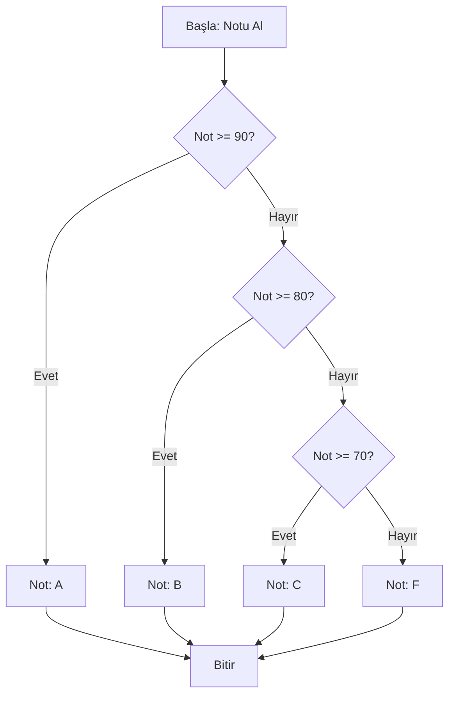

# Koşullar ve Döngüler

Programlama, çoğu zaman bir dizi talimatı yukarıdan aşağıya doğru okumaktan ibaret değildir. Gerçek dünyadaki problemler, kararlar almayı (örneğin, "yağmur yağıyorsa şemsiye al") ve belirli işlemleri tekrar tekrar yapmayı (örneğin, "her bir öğrenci için not hesapla") gerektirir. Bu bölümde, Java'ya bu karar verme ve tekrarlama yeteneklerini kazandıran temel yapı taşlarını keşfedeceğiz: **Koşullar** ve **Döngüler**.


## Karar Mekanizmaları: Koşullar

### 1. Karşılaştırma ve Mantıksal Operatörler

#### TANIM

**Karşılaştırma Operatörleri**, iki değeri birbiriyle karşılaştırarak `true` (doğru) veya `false` (yanlış) şeklinde bir mantıksal sonuç üreten sembollerdir (`==`, `!=`, `<`, `>`, `<=`, `>=`). **Mantıksal Operatörler** ise (`&&`, `||`, `!`), birden fazla karşılaştırma sonucunu birleştirerek daha karmaşık koşullar oluşturmamızı sağlar.

#### NEDEN VAR?

Bir programın akışını kontrol edebilmesi için öncelikle **karar verebilmesi** gerekir. "Eğer kullanıcının şifresi doğruysa giriş yap, değilse hata mesajı göster" gibi bir mantığı koda dökebilmek için, önce "kullanıcının şifresi doğru mu?" sorusunu sorup cevabını (`true` veya `false`) almamız gerekir. Karşılaştırma ve mantıksal operatörler, bu soruları sormamızı ve birden fazla koşulu birleştirmemizi sağlayan temel araçlardır.

> **Günlük Hayattan Analoji:** Bir kahve makinesi düşünün. "Sütlü kahve" yapmak için iki koşulun aynı anda sağlanması gerekir: `(kahve var) VE (süt var)`. Sadece "siyah kahve" için ise sadece `(kahve var)` koşulu yeterlidir. Burada `VE` bir mantıksal operatördür.

#### NASIL KULLANILIR?

Aşağıdaki örnek, bir öğrencinin notuna göre geçip geçmediğini belirlerken bu operatörleri nasıl kullanacağımızı gösterir.


```java
import java.util.Scanner; // Kullanıcıdan veri almak için Scanner sınıfını içe aktarıyoruz

public class NotDegerlendirme {
    public static void main(String[] args) {
        Scanner tarayici = new Scanner(System.in);

        System.out.print("Lütfen vize notunuzu giriniz: ");
        int vizeNotu = tarayici.nextInt(); // Kullanıcıdan bir tamsayı (vize notu) alıyoruz

        System.out.print("Lütfen final notunuzu giriniz: ");
        int finalNotu = tarayici.nextInt(); // Kullanıcıdan bir tamsayı (final notu) alıyoruz

        // Geçme notu 50 olarak kabul edilsin
        int gecmeNotu = 50;

        // Karşılaştırma (>=) ve mantıksal (&&) operatörleri bir arada kullanılıyor
        // Öğrencinin geçmesi için hem vize hem final notunun 50'den büyük veya eşit olması gerekir
        boolean gectiMi = (vizeNotu >= gecmeNotu) && (finalNotu >= gecmeNotu);

        System.out.println("Öğrencinin geçme durumu: " + gectiMi);
        // Örnek Çıktı: Öğrencinin geçme durumu: true (eğer her iki not da 50'den büyükse)

        // Alternatif olarak, veya (||) operatörü ile de kontrol edebiliriz
        // Örneğin, en az birinden geçtiyse "tebrikler" yazdıralım
        boolean enAzBirindenGectiMi = (vizeNotu >= gecmeNotu) || (finalNotu >= gecmeNotu);
        System.out.println("En az bir sınavdan geçme durumu: " + enAzBirindenGectiMi);
        // Örnek Çıktı: En az bir sınavdan geçme durumu: true

        tarayici.close(); // Kaynakları serbest bırakıyoruz
    }
}
```


**Kod Açıklaması:**

1. `Scanner tarayici = new Scanner(System.in);` ile klavyeden veri okumak için bir `Scanner` nesnesi oluşturuyoruz.
2. `int vizeNotu = tarayici.nextInt();` satırı, kullanıcının girdiği tamsayıyı okuyup `vizeNotu` değişkenine atıyor.
3. `(vizeNotu >= gecmeNotu) && (finalNotu >= gecmeNotu)` ifadesi kritik noktadır. `>=` karşılaştırma operatörü, her bir notun geçme notundan büyük veya eşit olup olmadığını kontrol eder. `&&` (VE) operatörü ise bu iki ayrı koşulun **her ikisinin de** doğru olması durumunda tüm ifadenin `true` olmasını sağlar. Eğer herhangi biri `false` ise sonuç `false` olur.

#### NE ZAMAN TERCİH EDİLİR?

- **`==` ve `!=`:** İki değerin eşitliğini veya eşitsizliğini kontrol ederken. Örneğin, `kullaniciAdi == "admin"`.
- **`<`, `>`, `<=`, `>=`:** Sayısal büyüklük/küçüklük karşılaştırmaları yaparken. Örneğin, `yas > 18`.
- **`&&` (VE):** Birden fazla koşulun **hepsinin** aynı anda doğru olması gerektiğinde. Örneğin, bir formu göndermek için `(isimDolu && soyisimDolu && yasGecerli)`.
- **`||` (VEYA):** Birden fazla koşuldan **en az birinin** doğru olması yeterli olduğunda. Örneğin, bir siteye erişim için `(rol == "admin" || rol == "moderator")`.
- **`!` (DEĞİL):** Bir koşulun tersini almak istediğimizde. Örneğin, `!(sifreBos)` ifadesi "şifre boş değilse" anlamına gelir.

#### ALTERNATİFLERİ

Bu operatörlerin yerine geçebilecek bir alternatif yoktur, programlamanın temel yapı taşlarıdır. Ancak, çok karmaşık mantıksal ifadeler, iç içe `if` blokları veya ayrı `boolean` değişkenleri kullanılarak daha okunabilir hale getirilebilir.

| Özellik | Karşılaştırma Operatörleri | Mantıksal Operatörler |
|:--- |:--- |:--- |
| **Görevi** | İki değeri karşılaştırır. | Birden çok `boolean` değeri birleştirir. |
| **Sonuç** | Her zaman `boolean` (`true`/`false`). | Her zaman `boolean` (`true`/`false`). |
| **Örnek** | `5 > 3` (sonuç: `true`) | `(5 > 3) && (2 < 1)` (sonuç: `false`) |

#### YAYGIN HATALAR

- **En Sık Hata:** `=` (atama operatörü) ile `==` (eşitlik operatörü) karıştırmak. `if (sayi = 5)` yazmak, `sayi` değişkenine 5 atar ve bu ifade her zaman `true` olarak değerlendirilir. Doğrusu `if (sayi == 5)` olmalıdır. Java'da bu derleme hatasına yol açar, ancak bazı dillerde bu çok tehlikeli bir hatadır.

### 2. if-else if-else Yapısı

#### TANIM

`if-else if-else` yapısı, programın akışını belirli bir koşulun doğruluğuna göre yönlendiren temel kontrol mekanizmasıdır. Eğer `if`'teki koşul doğruysa o blok çalışır, değilse sıradaki `else if` koşulları kontrol edilir. Hiçbir koşul doğru değilse, `else` bloğu (varsa) çalışır.

#### NEDEN VAR?

Bir program, tek bir doğru/yanlış sorusunun ötesinde, birden fazla olasılık arasından bir seçim yapmak zorunda kalabilir. Örneğin, bir sınav notuna göre "AA", "BA", "BB", "CB" gibi harf notları vermek. `if-else if-else` yapısı, bu tür çoktan seçmeli karar durumlarını net ve okunabilir bir şekilde kodlamamızı sağlar.

> **Günlük Hayattan Analoji:** Bir trafik lambası düşünün. Eğer `(ışık == kırmızı)` ise "Dur". Değilse eğer `(ışık == sarı)` ise "Hazırlan". Değilse (yani `(ışık == yeşil)`) "Geç". Bu, klasik bir `if-else if-else` örneğidir.

#### NASIL KULLANILIR?

Aşağıdaki örnek, bir öğrencinin vize ve final notlarına göre harf notunu hesaplar.


```java
import java.util.Scanner;

public class HarfNotuHesaplama {
    public static void main(String[] args) {
        Scanner tarayici = new Scanner(System.in);
        int vizeNotu, finalNotu;
        double ortalama;
        char harfNotu = 'F'; // Varsayılan değer

        // Kullanıcıdan notları al
        System.out.print("Vize notunuzu giriniz (0-100): ");
        vizeNotu = tarayici.nextInt();
        System.out.print("Final notunuzu giriniz (0-100): ");
        finalNotu = tarayici.nextInt();

        // Ortalamayı hesapla (vize %40, final %60 etkili)
        ortalama = (vizeNotu * 0.4) + (finalNotu * 0.6);

        // if-else if-else yapısı ile harf notunu belirle
        if (ortalama >= 90) {
            harfNotu = 'A';
        } else if (ortalama >= 80) {
            harfNotu = 'B';
        } else if (ortalama >= 70) {
            harfNotu = 'C';
        } else if (ortalama >= 60) {
            harfNotu = 'D';
        } else {
            harfNotu = 'F'; // 60'ın altındaki tüm notlar için
        }

        System.out.println("Ortalamanız: " + ortalama);
        System.out.println("Harf Notunuz: " + harfNotu);
        // Örnek Çıktı: Ortalamanız: 85.0
        //              Harf Notunuz: B

        tarayici.close();
    }
}
```


**Kod Açıklaması:**

1. Öncelikle vize ve final notları alınır, `ortalama` hesaplanır.
2. `if (ortalama >= 90)` satırı ilk kontrol noktasıdır. Eğer ortalama 90 veya üzeriyse, `harfNotu` 'A' olur ve kalan tüm `else if` ve `else` blokları atlanır.
3. Eğer ilk koşul yanlışsa (`ortalama < 90`), program `else if (ortalama >= 80)` satırına geçer. Bu şekilde, her bir koşul sırayla kontrol edilir.
4. `else` bloğu, yukarıdaki hiçbir koşulun doğru olmadığı durumda (yani `ortalama < 60`) çalışır ve 'F' atar.
5. Önemli olan, koşulların sırasıdır. Eğer `ortalama >= 80` kontrolünü `ortalama >= 90`'dan önce yazsaydık, 95 ortalaması olan bir öğrenci için `ortalama >= 80` koşulu da doğru olacağından, hatalı olarak 'B' notu verilirdi.

Aşağıdaki Mermaid diyagramı, `if-else if-else` yapısının karar akışını görselleştirmektedir.





**Diyagram Açıklaması:** Bu flowchart, bir not değerinin sırayla 90, 80 ve 70 eşikleriyle karşılaştırılarak uygun harf notunun nasıl belirlendiğini gösterir. Elmas şekiller karar noktalarını, dikdörtgenler ise gerçekleştirilen işlemleri temsil eder.

#### NE ZAMAN TERCİH EDİLİR?

- Birbirini dışlayan (mutually exclusive) ve sıralı kontrol gerektiren durumlarda idealdir.
- Kontrol edilecek koşul sayısı az (genelde 3-5 arası) ve koşullar karmaşık değilse `if-else if-else` en okunabilir seçenektir.
- Koşul sayısı çok fazlaysa (örneğin 10'dan fazla) veya koşullar belirli bir değişkenin değerine göre şekilleniyorsa, `switch-case` yapısı daha uygun olabilir.

#### ALTERNATİFLERİ

| Özellik | `if-else if-else` | `switch-case` (geleneksel) | `switch` Expression (Java 14+) |
|:--- |:--- |:--- |:--- |
| **Kullanım Amacı** | Karmaşık, aralıklı (`>=`, `<`) veya mantıksal (`&&`, `||`) koşullar için. | Bir değişkenin belirli, sabit değerlerine (`case 1:`, `case 'A':`) göre dallanma için. | `switch-case`'in daha modern, okunabilir ve ifade olarak kullanılabilen versiyonu. |
| **Koşul Türü** | Her türlü `boolean` ifade. | Sadece `int`, `char`, `String`, `enum` gibi türlerin eşitlik (`==`) kontrolü. | Aynı geleneksel `switch` gibi, ancak daha esnek. |
| **Okunabilirlik** | Az sayıda koşul için iyi, çok sayıda koşul için dağınık. | Çok sayıda sabit değer için daha düzenli. | En okunabilir ve hatasız olanıdır. |

#### YAYGIN HATALAR

- **En Sık Hata:** `if` bloğundan sonra noktalı virgül (;) kullanmak. `if (ortalama >= 90);` yazmak, `if`'in koşulunu boş bir ifadeye bağlar. Yani `if`'in bir etkisi olmaz ve onu takip eden blok her zaman çalışır.
- **İkinci Sık Hata:** `else if`'leri yanlış sıralamak. Yukarıdaki örnekte olduğu gibi, eşik değerlerini büyükten küçüğe doğru sıralamak gerekir. Aksi takdirde mantık hataları oluşur.


## Tekrar Eden İşlemler: Döngüler

### 1. while Döngüsü

#### TANIM

`while` döngüsü, kendisine verilen bir koşul `true` olduğu sürece, bir kod bloğunu tekrar tekrar çalıştıran bir kontrol yapısıdır. Koşul en başta kontrol edilir, eğer koşul en baştan `false` ise döngü gövdesi hiç çalıştırılmaz.

#### NEDEN VAR?

Bir işlemin kaç kez tekrarlanacağını önceden bilmediğimiz durumlar vardır. Örneğin, kullanıcı geçerli bir değer girene kadar veri girişi istemek. `while` döngüsü, bu tür "koşul devam ettiği sürece tekrarla" mantığını uygulamak için biçilmiş kaftandır.

> **Günlük Hayattan Analoji:** Bir arkadaşınızı arıyorsunuz ve telefonu meşgul. Telefonu kapatıp tekrar açıyorsunuz. Bu işlemi, "telefon meşgul olduğu sürece" (`while(telefonMesgul)`) tekrarlıyorsunuz. Telefon boşaldığında döngü sona erer.

#### NASIL KULLANILIR?

Aşağıdaki örnek, kullanıcı 0 ile 100 arasında bir sayı girene kadar giriş yapmasını isteyen bir doğrulama döngüsü göstermektedir.


```java
import java.util.Scanner;

public class DogrulamaDongusu {
    public static void main(String[] args) {
        Scanner tarayici = new Scanner(System.in);
        int girilenSayi = -1; // Döngüye girebilmesi için geçersiz bir başlangıç değeri

        // Kullanıcı geçerli bir sayı girene kadar döngü devam edecek
        while (girilenSayi < 0 || girilenSayi > 100) {
            System.out.print("Lütfen 0 ile 100 arasında bir sayı giriniz: ");
            girilenSayi = tarayici.nextInt();

            // Eğer geçersiz bir sayı girilirse, kullanıcıyı uyar
            if (girilenSayi < 0 || girilenSayi > 100) {
                System.out.println("Hatalı giriş! Sayı 0-100 aralığında olmalıdır.");
            }
        }

        System.out.println("Geçerli sayı girdiniz: " + girilenSayi);
        // Örnek Çıktı:
        // Lütfen 0 ile 100 arasında bir sayı giriniz: 150
        // Hatalı giriş! Sayı 0-100 aralığında olmalıdır.
        // Lütfen 0 ile 100 arasında bir sayı giriniz: 50
        // Geçerli sayı girdiniz: 50

        tarayici.close();
    }
}
```


**Kod Açıklaması:**

1. `int girilenSayi = -1;` ile döngü koşulunun (`girilenSayi < 0 || girilenSayi > 100`) en başta `true` olması sağlanır. Böylece döngüye en az bir kere girilir.
2. `while (girilenSayi < 0 || girilenSayi > 100)` satırı, döngünün devam edip etmeyeceğini belirleyen koşulu içerir. Koşul `true` olduğu sürece döngü gövdesi (`{}` içindeki kod) tekrarlanır.
3. Döngü gövdesinde kullanıcıdan bir sayı alınır. Eğer sayı geçersizse bir uyarı mesajı yazdırılır ve döngü başa döner (koşul tekrar kontrol edilir).
4. Kullanıcı geçerli bir sayı (örn. 50) girdiğinde, koşul `(50 < 0 || 50 > 100)` yani `false` olur ve döngü sona erer. Program akışı `System.out.println(…)` satırına geçer.

#### NE ZAMAN TERCİH EDİLİR?

- Bir işlemin kaç kez tekrarlanacağı önceden belli değilse.
- Bir koşulun sağlanması beklenirken (örneğin, bir dosyanın gelmesi, bir ağ bağlantısının kurulması) sürekli kontrol yapılması gerekiyorsa.
- Sonsuz döngüler oluşturmak için (örneğin, bir oyunun ana döngüsü) `while(true)` kullanılabilir.

#### ALTERNATİFLERİ

| Özellik | `while` Döngüsü | `do-while` Döngüsü | `for` Döngüsü |
|:--- |:--- |:--- |:--- |
| **Koşul Kontrol Zamanı** | Döngü gövdesinin başında (önce kontrol, sonra çalıştır). | Döngü gövdesinin sonunda (önce çalıştır, sonra kontrol). | Döngü gövdesinin başında. |
| **Çalışma Garantisi** | Koşul en baştan `false` ise hiç çalışmayabilir. | En az bir kere çalışır. | Koşul en baştan `false` ise hiç çalışmayabilir. |
| **Kullanım Amacı** | Koşula bağlı, belirsiz sayıda tekrar. | En az bir kere çalışması gereken koşula bağlı tekrar. | Belirli bir sayaç veya aralık üzerinde, genellikle belirli sayıda tekrar. |

#### YAYGIN HATALAR

- **En Sık Hata:** **Sonsuz döngü (infinite loop)** oluşturmak. Döngü koşulunu etkileyen bir değişkeni döngü içinde güncellemeyi unutmak. Örneğin, yukarıdaki örnekte `girilenSayi = tarayici.nextInt();` satırını yazmasaydık, `girilenSayi` hep `-1` kalır ve döngü sonsuza kadar "Lütfen 0 ile 100 arasında bir sayı giriniz: " mesajını basardı.

### 2. for Döngüsü

#### TANIM

`for` döngüsü, bir kod bloğunu belirli sayıda tekrarlamak için kullanılan, özellikle bir sayaç değişkeni üzerinde çalışan döngü türüdür. Başlangıç değeri, koşul ve artış/değişim ifadesi aynı satırda tanımlanır.

#### NEDEN VAR?

Bir dizideki tüm elemanları dolaşmak, 1'den 100'e kadar olan sayıları toplamak gibi işlemlerde, işlemin kaç kez tekrarlanacağı bellidir. `for` döngüsü, bu tür "belirli sayıda tekrar" gerektiren durumlar için daha derli toplu ve okunabilir bir sözdizimi sunar. `while` ile de aynı iş yapılabilir, ancak `for` döngüsü sayaç yönetimini merkezileştirerek hata olasılığını azaltır.

> **Günlük Hayattan Analoji:** Bir merdiveni çıkmak. Her bir basamak için "ayağını kaldır, bir üst basamağa koy" işlemini tekrarlarsınız. Bu işlemi, "1. basamaktan 10. basamağa kadar" (`for(basamak=1; basamak<=10; basamak++)`) yaparsınız. Kaç kez tekrarlanacağı (10 basamak) baştan bellidir.

#### NASIL KULLANILIR?

Aşağıdaki örnek, bir tamsayı dizisindeki tüm elemanları toplayıp ortalamasını hesaplar.


```java
public class DiziOrtalamasi {
    public static void main(String[] args) {
        // Bir tamsayı dizisi tanımlıyoruz
        int[] sayilar = {10, 20, 30, 40, 50};
        int toplam = 0;
        double ortalama;

        // for döngüsü ile dizinin her bir elemanını dolaşıyoruz
        // i = 0 başlangıç değeri, i < sayilar.length koşulu, i++ artış miktarı
        for (int i = 0; i < sayilar.length; i++) {
            // Her bir elemanı toplama ekliyoruz
            toplam += sayilar[i]; // Bu, toplam = toplam + sayilar[i]; ile aynıdır
        }

        // Ortalamayı hesaplıyoruz (double'a cast etmeyi unutmayın)
        ortalama = (double) toplam / sayilar.length;

        System.out.println("Dizinin elemanlarının toplamı: " + toplam);
        System.out.println("Dizinin elemanlarının ortalaması: " + ortalama);
        // Çıktı:
        // Dizinin elemanlarının toplamı: 150
        // Dizinin elemanlarının ortalaması: 30.0
    }
}
```


**Kod Açıklaması:**

1. `int[] sayilar = {10, 20, 30, 40, 50};` ile 5 elemanlı bir dizi oluşturulur.
2. `for (int i = 0; i < sayilar.length; i++)` döngü başlığı üç bölümden oluşur:
  - **Başlangıç:** `int i = 0` — Sayaç değişkeni `i` 0 olarak başlatılır. Bu kısım döngü başlamadan önce bir kez çalışır.
  - **Koşul:** `i < sayilar.length` — Her iterasyonun başında kontrol edilir. `true` ise döngü gövdesi çalışır, `false` ise döngü biter.
  - **Artış:** `i++` — Her iterasyonun sonunda çalıştırılır. Sayaç bir artırılır.
3. Döngü gövdesinde `toplam += sayilar[i];` ile `i`'ninci eleman toplama eklenir. `i` değişkeni sırayla 0, 1, 2, 3, 4 değerlerini alır ve dizinin tüm elemanlarına erişilir.

#### NE ZAMAN TERCİH EDİLİR?

- Bir dizi, liste veya herhangi bir koleksiyonun tüm elemanlarını sırayla dolaşmak gerektiğinde.
- Bir işlemin belirli bir sayıda tekrarlanması gerektiğinde (örneğin, "10 kere 'Merhaba' yazdır").
- Bir sayaç değişkeninin belirli bir aralıkta (örneğin, 1'den 100'e kadar) artarak veya azalarak ilerlemesi gerektiğinde.

#### ALTERNATİFLERİ

`for` döngüsünün en yaygın alternatifi `while` döngüsüdür. Ayrıca Java 5 ile gelen **for-each** döngüsü, bir koleksiyonun tüm elemanlarını sırayla dolaşmak için daha da okunabilir bir yöntem sunar.

| Özellik | Klasik `for` Döngüsü | `for-each` Döngüsü | `while` Döngüsü |
|:--- |:--- |:--- |:--- |
| **Sözdizimi** | `for(baslangic; kosul; artis)` | `for(Tip degisken: dizi)` | `while(kosul)` |
| **İndeks Erişimi** | Var (dizinin indeksine ihtiyaç duyulduğunda). | Yok (sadece elemanın değerine erişilir). | Sayaç elle yönetilir. |
| **Okunabilirlik** | Karmaşık sayaç işlemleri için. | Bir koleksiyonu baştan sona okumak için en okunabilir. | Belirsiz sayıda tekrar için daha uygun. |

#### YAYGIN HATALAR

- **En Sık Hata:** Döngü koşulunu yanlış yazmak. Örneğin, `i < sayilar.length` yerine `i <= sayilar.length` yazmak, dizinin boyutunu aşmaya (ArrayIndexOutOfBoundsException) neden olur. Dizilerde indeksler 0'dan başladığı için son indeks `length - 1`'dir.
- **İkinci Sık Hata:** Sayaç değişkenini yanlışlıkla döngü içinde değiştirmek, beklenmeyen davranışlara yol açabilir.

### 3. break ve continue

#### TANIM

`break` ve `continue`, döngülerin normal akışını kontrol etmek için kullanılan özel anahtar kelimelerdir. `break` içinde bulunduğu döngüyü tamamen sonlandırırken, `continue` sadece o anki iterasyonu atlayıp bir sonraki iterasyona geçer.

#### NEDEN VAR?

Bazen bir döngü içinde, belirli bir koşul oluştuğunda döngüyü erkenden sonlandırmak (örneğin, bir dizide aradığımız sayıyı bulduk, daha fazla aramaya gerek yok) veya belirli durumları atlamak (örneğin, bir listedeki tüm sayıları yazdırırken çift sayıları atla) isteriz. `break` ve `continue` bu tür durumlar için temiz ve etkili bir çözüm sunar.

> **Günlük Hayattan Analoji:**
> - **`break`:** Bir kitapta aradığınız bir cümleyi buldunuz. O cümleyi bulduktan sonra kitabın kalanını okumayı bırakırsınız. Bu `break` gibidir.
> - **`continue`:** Bir televizyon kanalında reklam çıktı. Reklam bitene kadar kanalı değiştir

ip, diğer kanallara geçersiniz. Reklam bitince tekrar izlemeye dönersiniz. Bu `continue` gibidir.

#### NASIL KULLANILIR?

Aşağıdaki örnekte, `break` ve `continue` kullanımını bir arada göreceğiz. Bir dizide belirli bir sayıyı ararken `break` ile döngüyü sonlandıracak, çift sayıları yazdırırken ise `continue` ile tek sayıları atlayacağız.


```java
public class SayiBulmaca {
    public static void main(String[] args) {
        // Bir dizi tanımlıyoruz
        int[] sayilar = {3, 7, 2, 9, 4, 6, 1, 8, 5};
        int arananSayi = 9;
        boolean bulundu = false;

        // Dizideki sayıları dolaşıyoruz
        for (int i = 0; i < sayilar.length; i++) {
            int mevcutSayi = sayilar[i];

            // Çift sayıları atla (continue örneği)
            if (mevcutSayi % 2 == 0) {
                System.out.println(mevcutSayi + " çift sayı, atlanıyor...");
                continue; // Bu iterasyonu sonlandır, bir sonrakine geç
            }

            // Tek sayıları yazdır
            System.out.println("Tek sayı: " + mevcutSayi);

            // Aranan sayıyı bulduk mu kontrol et (break örneği)
            if (mevcutSayi == arananSayi) {
                System.out.println(arananSayi + " bulundu! Döngü sonlandırılıyor.");
                bulundu = true;
                break; // Döngüyü tamamen sonlandır
            }
        }

        if (!bulundu) {
            System.out.println(arananSayi + " dizide bulunamadı.");
        }
    }
}
// Çıktı:
// Tek sayı: 3
// Tek sayı: 7
// 2 çift sayı, atlanıyor...
// Tek sayı: 9
// 9 bulundu! Döngü sonlandırılıyor.
```


**Kodun Satır Satır Açıklaması:**

1. `if (mevcutSayi % 2 == 0)` ile sayının çift olup olmadığını kontrol ediyoruz. Eğer çiftse, `continue;` komutu çalışır ve döngünün geri kalanı (tek sayı yazdırma ve `break` kontrolü) atlanır. Program doğrudan bir sonraki iterasyona geçer.
2. `if (mevcutSayi == arananSayi)` ile sayının aradığımız sayı olup olmadığını kontrol ediyoruz. Eğer bulunduysa, `break;` komutu çalışır ve `for` döngüsü tamamen sona erer. Artık dizinin kalan elemanlarına bakılmaz.

#### NE ZAMAN TERCİH EDİLİR?

- **`break`:** Bir döngüde aradığınız koşul sağlandığında ve daha fazla işlem yapmaya gerek olmadığında (örneğin, bir listede belirli bir değeri bulmak, bir kullanıcının geçersiz giriş yapması durumunda döngüyü sonlandırmak).
- **`continue`:** Bir döngüde belirli koşulları sağlayan elemanları işleme dahil etmek istemediğinizde (örneğin, bir listedeki sadece pozitif sayıları işlemek, belirli bir günü atlamak).

#### ALTERNATİFLERİ

`break` ve `continue` kullanmadan da aynı işlemleri daha karmaşık `if-else` yapıları ve bayrak değişkenler (flag variables) ile gerçekleştirebiliriz. Ancak bu, kodu daha az okunabilir ve daha hata yapmaya müsait hale getirir. `break` ve `continue`, bu tür akış kontrolünü çok daha temiz ve anlaşılır bir şekilde ifade etmemizi sağlar.

| Özellik | `break` / `continue` | Alternatif (Bayrak Değişkeni) |
|:--- |:--- |:--- |
| **Okunabilirlik** | Yüksek, niyeti açıkça belirtir. | Düşük, ekstra değişkenler ve iç içe `if` blokları gerektirir. |
| **Performans** | Döngüyü erken sonlandırarak veya iterasyonları atlayarak performansı artırabilir. | Genellikle daha fazla iterasyon yapılmasına neden olur. |
| **Karmaşıklık** | Düşük, tek bir anahtar kelime ile yönetilir. | Yüksek, birden fazla koşul ve değişken yönetimi gerektirir. |

#### YAYGIN HATALAR

- **En Sık Hata:** `continue` kullanırken sayaç değişkenini artırmayı unutmak. `while` döngülerinde `continue` komutundan önce sayaç artırılmazsa, sonsuz döngüye girilir. `for` döngülerinde bu sorun yaşanmaz çünkü artış işlemi döngü başlığında otomatik olarak yapılır.
- **İkinci Sık Hata:** İç içe döngülerde `break` kullanırken, sadece içteki döngüyü sonlandırdığını unutmak. Dıştaki döngüyü de sonlandırmak için etiketli `break` (labeled break) kullanılabilir.

### 4. List Comprehension (Java Stream API Alternatifi)

#### TANIM

List Comprehension, mevcut bir listeden yeni bir liste oluşturmak için kullanılan, özellikle Python gibi dillerde popüler olan kısa ve öz bir sözdizimidir. Java'da doğrudan bir List Comprehension yapısı bulunmamakla birlikte, Java 8 ile gelen **Stream API** ve onun `filter`, `map` gibi fonksiyonları aynı işlevi çok daha güçlü ve esnek bir şekilde yerine getirir.

#### NEDEN VAR?

Bir listeden belirli bir koşula uyan elemanları seçmek (filtreleme) veya her bir elemanı dönüştürmek (map) çok sık yapılan işlemlerdir. Geleneksel `for` döngüsü ile bu işlemler yapılabilir ancak kod genellikle uzar ve okunabilirliği azalır. Stream API, bu tür veri işleme operasyonlarını deklaratif bir şekilde, yani "nasıl yapılacağı" yerine "ne yapılacağı"na odaklanarak yazmamızı sağlar.

> **Günlük Hayattan Analoji:**
> Bir meyve sepetiniz var ve sadece kırmızı olan elmaları almak istiyorsunuz. Geleneksel yöntemle, sepeti tek tek karıştırır, her bir meyveye bakar, "Bu kırmızı mı?" diye sorar, kırmızıysa yeni bir sepete koyarsınız. Stream API ile ise sepetinize "Bana sadece kırmızı elmaları ver" dersiniz ve o da size doğrudan kırmızı elmalardan oluşan yeni bir sepet sunar.

#### NASIL KULLANILIR?

Aşağıdaki örnekte, bir tamsayı listesindeki sadece çift sayıları filtreleyerek yeni bir liste oluşturacağız. Önce geleneksel `for` döngüsü ile, ardından Stream API ile aynı işlemi yaparak iki yaklaşımı karşılaştıracağız.


```java
import java.util.ArrayList;
import java.util.List;
import java.util.stream.Collectors;

public class FiltrelemeOrnegi {
    public static void main(String[] args) {
        // Kaynak liste
        List<Integer> sayilar = List.of(1, 2, 3, 4, 5, 6, 7, 8, 9, 10);

        // --- Geleneksel yöntem (for döngüsü ile) ---
        List<Integer> ciftSayilarGeleneksel = new ArrayList<>();
        for (Integer sayi : sayilar) {
            if (sayi % 2 == 0) {
                ciftSayilarGeleneksel.add(sayi);
            }
        }
        System.out.println("Geleneksel: " + ciftSayilarGeleneksel);

        // --- Stream API ile (List Comprehension benzeri) ---
        List<Integer> ciftSayilarStream = sayilar.stream()
                .filter(sayi -> sayi % 2 == 0)  // Sadece çift sayıları geçir
                .collect(Collectors.toList()); // Sonucu bir listede topla
        System.out.println("Stream API: " + ciftSayilarStream);
    }
}
// Çıktı:
// Geleneksel: [2, 4, 6, 8, 10]
// Stream API: [2, 4, 6, 8, 10]
```


**Kodun Satır Satır Açıklaması:**

1. `sayilar.stream()` ile listemizi bir Stream'e dönüştürüyoruz. Stream, verilerin bir kanal üzerinden akması gibi düşünülebilir.
2. `.filter(sayi -> sayi % 2 == 0)` bir ara işlemdir (intermediate operation). Stream'deki her bir elemanı alır, verilen koşulu (lambda ifadesi) uygular. Koşul `true` ise elemanı bir sonraki aşamaya geçirir, `false` ise eler. `sayi -> sayi % 2 == 0` ifadesi bir lambda ifadesidir ve "gelen her `sayi` için, `sayi % 2 == 0` koşulunu kontrol et" anlamına gelir.
3. `.collect(Collectors.toList())` bir son işlemdir (terminal operation). Stream'den geçen elemanları toplar ve yeni bir `List` koleksiyonuna dönüştürür.

#### NE ZAMAN TERCİH EDİLİR?

- Bir koleksiyon üzerinde filtreleme, dönüştürme (map), sıralama (sorted), gruplama (groupingBy) gibi karmaşık veri işleme operasyonları yapılması gerektiğinde.
- Kodun daha okunabilir, kısa ve deklaratif olması istendiğinde.
- Paralel işleme (parallel streams) ile büyük veri kümelerinin performanslı bir şekilde işlenmesi gerektiğinde.

#### ALTERNATİFLERİ

Stream API'nin en temel alternatifi, yukarıda gösterildiği gibi geleneksel `for` döngüsü veya `for-each` döngüsüdür. Basit işlemler için `for` döngüsü yeterli ve anlaşılırdır. Ancak işlemler karmaşıklaştıkça Stream API'nin okunabilirlik ve ifade gücü avantajı ortaya çıkar.

| Özellik | Stream API | Geleneksel `for` Döngüsü |
|:--- |:--- |:--- |
| **Okunabilirlik** | Yüksek, işlemler zincirleme olarak ifade edilir. | Düşük, iç içe geçmiş kontroller ve geçici değişkenler içerebilir. |
| **Yan Etki** | Yok (Immutable). Stream işlemleri kaynak veriyi değiştirmez. | Var (Mutable). Genellikle yeni bir liste oluşturulur ve doldurulur. |
| **Paralel İşleme** | `.parallelStream()` ile çok kolay. | Manuel olarak thread yönetimi gerektirir. |
| **Performans** | Basit işlemlerde `for` döngüsü biraz daha hızlı olabilir. | Karmaşık işlemlerde ve büyük verilerde Stream API daha optimize olabilir. |

#### YAYGIN HATALAR

- **En Sık Hata:** Stream'i bir kereden fazla kullanmaya çalışmak. Bir Stream üzerinde bir son işlem (`collect`, `forEach`, `count` vb.) çağrıldıktan sonra o Stream tüketilmiş sayılır ve tekrar kullanılamaz. Bu durumda `IllegalStateException` hatası alınır. Her seferinde yeni bir Stream oluşturulmalıdır.
- **İkinci Sık Hata:** Stream işlemlerinin geçici (lazy) olduğunu unutmak. Bir son işlem çağrılana kadar `filter` veya `map` gibi ara işlemler çalıştırılmaz. Bu nedenle, bir son işlem olmadan Stream hiçbir işlem yapmaz.

### 5. match-case (Java 21+ Pattern Matching for Switch)

#### TANIM

`match-case`, Java 21 ile resmi olarak tam sürüme çıkan **Pattern Matching for Switch** özelliğidir. Bir değişkenin değerine göre birden fazla desenle (pattern) eşleşme yaparak ilgili kod bloğunu çalıştıran, geleneksel `switch-case` yapısına göre çok daha güçlü ve esnek bir kontrol yapısıdır.

#### NEDEN VAR?

Geleneksel `switch-case` yapısı, özellikle farklı türlerdeki nesnelerle veya karmaşık koşullarla çalışırken oldukça sınırlı ve hataya açıktı (örneğin, `break` unutulması). Pattern Matching for Switch, bu yapıyı modernleştirerek, sadece sabit değerlerle değil, aynı zamanda tür kontrolü (type pattern), null kontrolü gibi daha karmaşık desenlerle de eşleşme yapılmasını sağlar. Bu, kodu daha kısa, daha güvenli ve daha okunabilir hale getirir.

> **Günlük Hayattan Analoji:**
> Bir postanede paketleri boyutlarına göre ayırıyorsunuz. Geleneksel `switch-case`, "Bu paket küçük mü, orta mı, büyük mü?" gibi önceden belirlenmiş kategorilere göre ayırma yapar. Pattern Matching for Switch ise, "Bu paket bir kitap mı, yoksa bir kutu mu? İçinde kırılacak bir şey var mı?" gibi daha akıllıca ve nesnenin kendisine göre karar vermenizi sağlar.

#### NASIL KULLANILIR?

Aşağıdaki örnekte, bir gün numarasına (1-7) göre haftanın hangi günü olduğunu yazdırmak için hem geleneksel `switch-case` hem de modern `switch` expression (match-case) kullanacağız.


```java
public class GunBulma {
    public static void main(String[] args) {
        int gunNumarasi = 3;
        String gunAdi = "";

        // --- Geleneksel switch-case (break unutulmaya müsait) ---
        switch (gunNumarasi) {
            case 1:
                gunAdi = "Pazartesi";
                break;
            case 2:
                gunAdi = "Salı";
                break;
            case 3:
                gunAdi = "Çarşamba";
                break;
            case 4:
                gunAdi = "Perşembe";
                break;
            case 5:
                gunAdi = "Cuma";
                break;
            case 6:
                gunAdi = "Cumartesi";
                break;
            case 7:
                gunAdi = "Pazar";
                break;
            default:
                gunAdi = "Geçersiz gün";
                break;
        }
        System.out.println("Geleneksel: " + gunAdi);

        // --- Modern switch expression (match-case) ---
        gunAdi = switch (gunNumarasi) {
            case 1 -> "Pazartesi";
            case 2 -> "Salı";
            case 3 -> "Çarşamba";
            case 4 -> "Perşembe";
            case 5 -> "Cuma";
            case 6 -> "Cumartesi";
            case 7 -> "Pazar";
            default -> "Geçersiz gün";
        };
        System.out.println("Modern: " + gunAdi);
    }
}
// Çıktı:
// Geleneksel: Çarşamba
// Modern: Çarşamba
```


**Kodun Satır Satır Açıklaması:**

1. Modern `switch` expression, `switch` anahtar kelimesinden sonra parantez içinde kontrol edilecek değişkeni alır ve bir değer döndürür (bu nedenle bir değişkene atanabilir).
2. `case 3 -> "Çarşamba";` ifadesi, `gunNumarasi` değişkeninin değeri 3 olduğunda, `switch` ifadesinin `"Çarşamba"` değerini döndüreceğini belirtir. `->` (ok) operatörü, geleneksel `:` ve `break`'in yerini alır. Bu sayede `break` unutma hatası tamamen ortadan kalkar.
3. `default` durumu, hiçbir `case` ile eşleşme olmadığında çalışır.

#### NE ZAMAN TERCİH EDİLİR?

- Bir değişkenin değerine göre farklı işlemler yapılması gerektiğinde ve bu değerler sabit olduğunda (enum, int, String vb.).
- Kodun daha kısa, okunabilir ve güvenli olması istendiğinde. Modern `switch` expression, `break` hatalarını tamamen ortadan kaldırır.
- Java 21 ve sonrası için, özellikle tür desenleri (`instanceof` kontrolü) ile birleştiğinde çok daha güçlü hale gelir.

#### ALTERNATİFLERİ

`switch-case`'in en temel alternatifi, uzun `if-else if-else` zincirleridir. Ancak çok sayıda sabit değer kontrolü için `switch-case` hem daha okunabilir hem de genellikle daha performanslıdır (derleyici tarafından lookup table veya jump table'a dönüştürülebilir).

| Özellik | Modern `switch` Expression | Geleneksel `switch-case` | `if-else if-else` |
|:--- |:--- |:--- |:--- |
| **Sözdizimi** | `case X -> deger;` | `case X: deger; break;` | `if (kosul) {… } else if (…) {… }` |
| **break Hatası** | Yok (ok operatörü ile). | Var (break unutulursa fall-through olur). | Yok. |
| **Değer Döndürme** | Evet (expression olarak kullanılabilir). | Hayır (statement olarak kullanılır). | Hayır (statement olarak kullanılır). |
| **Desen Eşleme** | Evet (Java 21+ ile tür, null vb.). | Sadece sabit değerler. | Sadece boolean ifadeler. |

#### YAYGIN HATALAR

- **En Sık Hata (Geleneksel için):** `break` unutmak. Bu, "fall-through" (düşme) olarak adlandırılan bir duruma yol açar ve eşleşen `case`'den sonraki tüm `case`'lerin de sırayla çalıştırılmasına neden olur. Modern `switch` expression bu hatayı tamamen ortadan kaldırır.
- **İkinci Sık Hata:** `default` durumunu eklemeyi unutmak. Her zaman bir `default` durumu eklemek iyi bir pratiktir çünkü beklenmeyen bir değerle karşılaşıldığında programın nasıl davranacağını belirler.


## Bölüm Özeti

Bu bölümde, programlarımızın akışını kontrol etmemizi sağlayan temel yapı taşlarını öğrendik. Koşullar (if-else, switch) sayesinde programımızın farklı durumlarda farklı kararlar almasını sağladık. Döngüler (while, for) ile tekrarlayan işlemleri otomatikleştirdik. break ve continue ile döngülerin akışını daha ince ayarlı bir şekilde kontrol etmeyi, Stream API ile koleksiyonlar üzerinde güçlü ve okunabilir veri işleme operasyonları yapmayı ve son olarak Java 21'in modern switch expression özelliği ile daha güvenli ve esnek karar yapıları oluşturmayı öğrendik.

## Sözlük

- **Karşılaştırma Operatörü:** İki değeri karşılaştıran ve boolean (true/false) sonuç döndüren operatör (`==`, `!=`, `<`, `>`, `<=`, `>=`).
- **Mantıksal Operatör:** Birden fazla boolean ifadeyi birleştiren operatör (`&&`, `||`, `!`).
- **Koşul İfadesi (Conditional Statement):** Belirli bir koşula göre kod bloklarının çalıştırılmasını sağlayan yapı (`if`, `else`, `switch`).
- **Kod Bloğu (Code Block):** Süslü parantezler `{}` ile çevrelenmiş, bir bütün olarak çalıştırılan kod parçacığı.
- **Döngü (Loop):** Belirli bir koşul sağlandığı sürece bir kod bloğunu tekrar tekrar çalıştıran yapı (`for`, `while`).
- **İterasyon (Iteration):** Bir döngünün her bir tekrarına verilen ad.
- **Sonsuz Döngü:** Koşulu hiçbir zaman `false` olmayan ve bu nedenle sonsuza kadar çalışan döngü. Genellikle bir programlama hatasıdır.
- **Stream API:** Java 8 ile gelen, koleksiyonlar üzerinde fonksiyonel programlama tarzında veri işleme operasyonları yapmayı sağlayan bir API.
- **Lambda İfadesi:** Bir arayüzün tek soyut metodunu (Functional Interface) uygulayan, anonim bir fonksiyon olarak düşünülebilecek kısa bir kod bloğu (`(parametre) -> ifade`).
- **Pattern Matching for Switch (Java 21+):** `switch` ifadelerinin, sadece sabit değerlerle değil, aynı zamanda tür, null gibi desenlerle de eşleşme yapmasını sağlayan özellik.

## Sorular

1. `if (x = 5)` ifadesi neden yanlıştır ve doğrusu nasıl olmalıdır?
2. `&&` (ve) ile `||` (veya) operatörleri arasındaki temel fark nedir? Bir örnekle açıklayın.
3. Bir `while` döngüsünün sonsuza kadar çalışmasına neden olan durumlar nelerdir? Bir örnek verin.
4. Klasik `for` döngüsü ile `for-each` döngüsü arasındaki farkları ve her birinin hangi durumlarda tercih edilmesi gerektiğini açıklayın.
5. `break` ve `continue` ifadelerinin bir döngü üzerindeki etkileri nelerdir? Bir döngüde her ikisinin de kullanıldığı bir senaryo düşünün.
6. Java'da bir listedeki tüm çift sayıları filtreleyip yeni bir liste oluşturmak için Stream API'nin nasıl kullanılabileceğini adım adım açıklayın.
7. Geleneksel `switch-case` yapısının en büyük dezavantajı nedir? Modern `switch` expression bu dezavantajı nasıl giderir?

## Alıştırmalar

1. **Basit Hesap Makinesi:** Kullanıcıdan iki sayı ve bir işlem (+, -, *, /) alan bir program yazın. `switch` yapısını kullanarak işlemi gerçekleştirin ve sonucu ekrana yazdırın. (Bölme işlemi için sıfıra bölme kontrolü yapın.)
2. **Asal Sayı Bulma:** Kullanıcıdan bir pozitif tam sayı alan ve bu sayının asal olup olmadığını bulan bir program yazın. Bir `for` döngüsü ve `break` ifadesi kullanarak sayının bölenlerini kontrol edin.
3. **Fibonacci Dizisi:** Kullanıcıdan bir `n` sayısı alan ve Fibonacci dizisinin ilk `n` elemanını yazdıran bir program yazın. (Fibonacci: 0, 1, 1, 2, 3, 5, 8, 13…)
4. **Filtreleme ve Dönüştürme:** Bir tamsayı listesi oluşturun. Stream API kullanarak, listedeki tüm sayıların karesini alan ve bu karelerden sadece 50'den büyük olanları yeni bir listede toplayan bir program yazın.
5. **Harf Notu Hesaplama (Gelişmiş):** Kullanıcıdan bir sınav notu (0-100 arası) alan bir program yazın. `if-else if-else` kullanarak notu harf notuna çevirin. Kullanıcı geçerli bir not girene kadar giriş istemek için bir `while` döngüsü kullanın.
  - 90-100: AA
  - 80-89: BA
  - 70-79: BB
  - 60-69: CB
  - 50-59: CC
  - 0-49: FF

## Yaygın Hatalar ve Çözümleri

| Hata | Açıklama | Çözüm |
|:--- |:--- |:--- |
| **Atama ve Karşılaştırma Karışıklığı** | `if (x = 5)` yazmak. `=` atama, `==` karşılaştırma operatörüdür. | `if (x == 5)` kullanın. Derleyici uyarısına dikkat edin. |
| **break Unutmak** | Geleneksel `switch-case`'de `break` unutulursa "fall-through" olur. | Modern `switch` expression (`->`) kullanın veya her `case`'den sonra `break;` eklemeyi alışkanlık haline getirin. |
| **Sonsuz Döngü** | `while` döngüsünde koşulun `false` olmasını sağlayacak bir kod yazmamak. | Döngü içinde koşulu etkileyecek bir değişkeni güncellediğinizden emin olun. |
| **Dizi Sınırlarını Aşmak** | `for` döngüsünde `i <= dizi.length` yazmak. | `i < dizi.length` kullanın. Dizilerde son indeks `length - 1`'dir. |
| **Stream'i Tekrar Kullanmak** | Bir Stream üzerinde bir son işlem çağrıldıktan sonra tekrar kullanmaya çalışmak. | Her veri işleme operasyonu için yeni bir Stream oluşturun. |


Bu bölümle birlikte, Java'da program akışını kontrol etme ve veri işleme konusunda sağlam bir temel edindiniz. Şimdi sıradaki bölümde, bu bilgileri kullanarak daha karmaşık problemleri çözmeye hazırsınız!

## Bir sonraki bolume kopru

Bu bölümde öğrendiğiniz `if-else` karar yapıları ve `for` ile `while` döngüleri, artık programlarınıza mantık kazandırmanızı sağlıyor. Bir sonraki bölümde, bu akış kontrol mekanizmalarını kullanarak **Metotlar (Fonksiyonlar)** ile tanışacak, tekrar eden kod bloklarını nasıl paketleyip yeniden kullanabileceğinizi keşfedeceksiniz. Koşullar ve döngüler, metodların içindeki karar mekanizmalarını besleyen temel yapı taşları olarak sizinle olmaya devam edecek.
