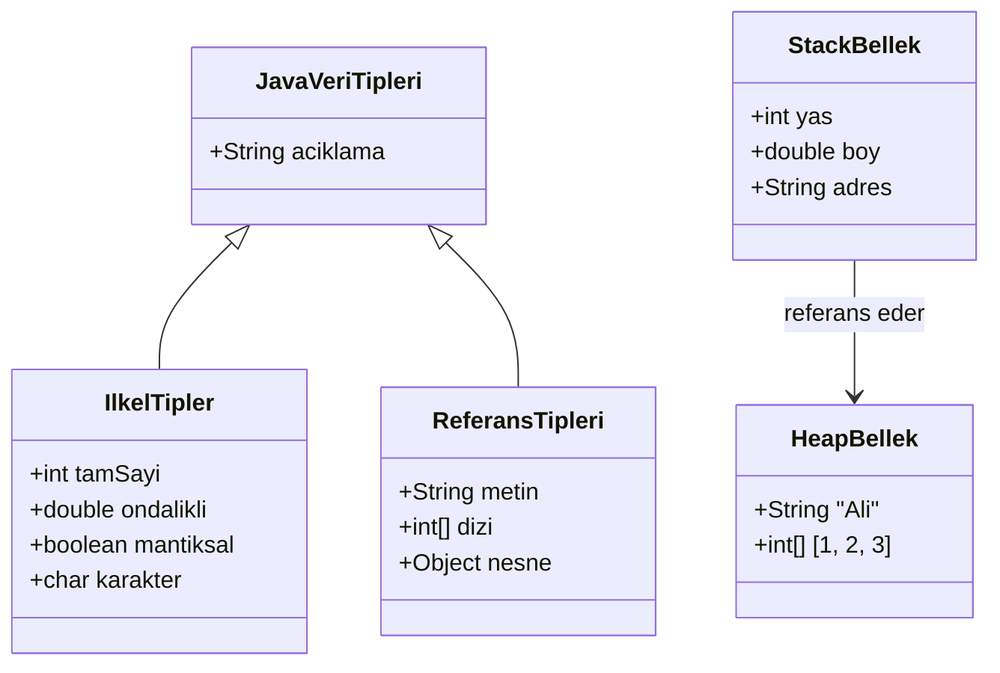
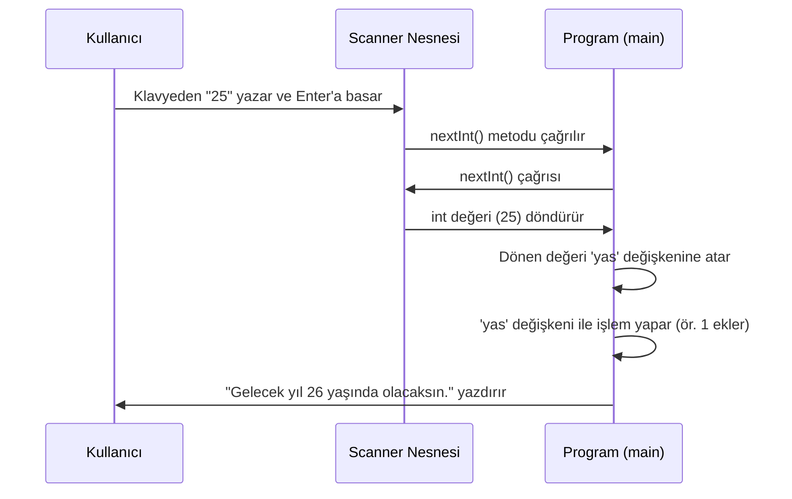

# Değişkenler ve Veri Tipleri

## Bu Bölümde Neler Öğreneceksiniz?

Bu bölümde, bir Java programının temel yapı taşları olan **değişkenler** ve **veri tipleri** kavramlarını derinlemesine inceleyeceğiz. Bilgisayarın hafızasında nasıl veri saklandığını, bu verilere nasıl isim verdiğimizi ve farklı türdeki verilerle (sayılar, metinler, mantıksal değerler) nasıl işlem yapacağımızı öğreneceğiz. Ayrıca, kullanıcıdan veri almayı, metinler üzerinde işlemler yapmayı ve değişkenlerin görünür olduğu alanları (kapsam) keşfedeceğiz.

### Ön Bilgi
Bu bölüme başlamadan önce, Java'da bir "merhaba dünya" programını yazıp çalıştırabiliyor olmanız beklenir. `main` metodu ve `System.out.println()` komutunun ne işe yaradığına dair temel bir fikriniz olması yeterlidir.

### Öğrenme Çıktıları
Bu bölümü tamamladığınızda aşağıdakileri yapabiliyor olacaksınız:
1. Farklı veri tiplerinde (int, double, String, boolean) değişken tanımlayıp değer atayabilirsiniz.
2. Değişkenler arasında otomatik ve manuel (casting) tip dönüşümü yapabilirsiniz.
3. `Scanner` sınıfını kullanarak kullanıcıdan klavye aracılığıyla veri alabilirsiniz.
4. `String` sınıfının hazır metodlarını (`length()`, `toUpperCase()`, `substring()` vb.) kullanarak metinler üzerinde işlem yapabilirsiniz.
5. `final` anahtar kelimesiyle sabitler tanımlayabilir ve `null` değerinin ne anlama geldiğini açıklayabilirsiniz.
6. Değişkenlerin kapsam (scope) kurallarını anlayarak, bir değişkene nerelerden erişilebileceğini belirleyebilirsiniz.


## Değişken Nedir? (Variable)

**TANIM:** Değişken, programlama dillerinde, bilgisayarın hafızasında (RAM) bir değeri saklamak için ayrılmış, isimlendirilmiş bir bellek bölgesidir. Bir kutuya benzetilebilir; kutunun üzerinde bir etiket (değişken adı) vardır ve kutunun içinde bir değer (sayı, metin, vb.) bulunur.

**NEDEN VAR?:**
Programlar, kullanıcıdan alınan bir sayı, bir hesaplamanın ara sonucu veya bir dosyadan okunan bir metin gibi sürekli değişen verilerle çalışır. Değişkenler olmasaydı, bu verileri geçici olarak saklayacak bir yerimiz olmazdı. Her veriyi doğrudan işlemek zorunda kalırdık, bu da programları son derece kısıtlı ve kullanışsız hale getirirdi. Örneğin, bir hesap makinesi programı, kullanıcının girdiği iki sayıyı hatırlamak ve onlarla işlem yapmak için değişkenlere ihtiyaç duyar.

**Günlük Hayat Analojisi:**
Bir mutfak düşünün. Yemek yaparken çeşitli malzemeleri (un, şeker, yumurta) kullanırsınız. Bu malzemeleri tezgahın üzerinde tutmak yerine, üzerinde "un", "şeker" yazan kaplara (değişkenlere) koyarsınız. Bu kaplar sayesinde ihtiyacınız olduğunda malzemeyi hemen bulur ve kullanırsınız. Programlardaki değişkenler de tam olarak bu kaplar gibidir.


## Java'da Veri Tipleri

**TANIM:** Veri tipi, bir değişkenin içinde hangi türde veri (tam sayı, ondalıklı sayı, metin, mantıksal değer) saklayabileceğini ve bu veri üzerinde hangi işlemlerin yapılabileceğini belirleyen bir kural kümesidir.

**NEDEN VAR?:**
Bilgisayar hafızası sınırlı bir kaynaktır. Farklı türdeki veriler farklı miktarlarda hafıza kaplar. Örneğin, bir tam sayıyı (25) saklamak için genelde 4 byte yeterliyken, bir metni ("Merhaba Dünya") saklamak için çok daha fazla alan gerekir. Veri tipleri sayesinde Java, her değişken için ne kadar hafıza ayıracağını bilir ve hafızayı verimli kullanır. Ayrıca, bir metin ile bir sayıyı toplamak gibi anlamsız işlemleri engelleyerek program hatalarının önüne geçer.

Java'daki veri tipleri iki ana kategoriye ayrılır: **İlkel Tipler (Primitive Types)** ve **Referans Tipleri (Reference Types)**.

### Diyagram 1: Java Veri Tipleri Hiyerarşisi ve Bellek Kullanımı

Aşağıdaki diyagram, Java'daki temel veri tiplerini, bunların alt türlerini ve hafızada nasıl konumlandıklarını göstermektedir.





* **Diyagram Açıklaması:** Bu diyagram, Java'daki veri tiplerinin hiyerarşik yapısını gösterir. `IlkelTipler` (int, double, boolean, char gibi) değerlerini doğrudan `StackBellek`'te (yığın) saklarken, `ReferansTipleri` (String, Diziler, Sınıflar gibi) nesnelerini `HeapBellek`'te (yığın) oluşturur ve bu nesnenin adresini (referansını) Stack'te tutar. Bu, performans ve bellek yönetimi açısından kritik bir farktır.

### Kavram 1: Değişken Tanımlama

**NASIL KULLANILIR?**
Java'da bir değişken tanımlamak için önce **veri tipini**, ardından **değişkenin adını** yazarız. İstersek hemen bir **değer atayarak** (başlangıç değeri) da tanımlayabiliriz. Bu işleme "değişken bildirimi" denir.


```java
// DegiskenTanimlama.java
public class DegiskenTanimlama {
    public static void main(String[] args) {

        // 1. Sadece bildirim (değer atanmamış)
        int yas; // 'yas' adında bir tamsayı değişkeni bildirildi, henüz değeri yok

        // 2. Bildirim ve değer atama
        yas = 25; // 'yas' değişkenine 25 değeri atandı

        // 3. Bildirim ve başlangıç değeri ataması tek satırda
        double boy = 1.78; // 'boy' adında ondalıklı bir değişken tanımlandı ve 1.78 değeri atandı

        // 4. Değişkenin değerini yazdırma
        System.out.println("Yaş: " + yas);   // Çıktı: Yaş: 25
        System.out.println("Boy: " + boy);   // Çıktı: Boy: 1.78

        // 5. Değişkene yeni değer atama (güncelleme)
        yas = 26; // Artık 'yas' değişkeninin değeri 26
        System.out.println("Yeni Yaş: " + yas); // Çıktı: Yeni Yaş: 26
    }
}
```


**Kod Açıklaması:**
- `int yas;`: `int` (tam sayı) tipinde, `yas` adında bir değişken "beyan ediyoruz" (declare). Bu, JVM'e "Benim `yas` adında bir tam sayı kutum olacak" demektir.
- `yas = 25;`: Atama operatörü (`=`) ile `yas` kutusunun içine `25` değerini koyuyoruz.
- `double boy = 1.78;`: Bu, bildirim ve atamayı tek seferde yapmanın kısa yoludur.
- `System.out.println("Yaş: " + yas);`: Burada `+` operatörü metin birleştirme (concatenation) için kullanılır. `yas` değişkeninin değeri (25) metne eklenerek ekrana yazdırılır.

**NE ZAMAN TERCİH EDİLİR?**
Programınızda herhangi bir veriyi (sayı, metin, mantıksal değer) saklamanız gerektiğinde değişken kullanırsınız. Neredeyse her programın temelidir. Alternatifi yoktur; veriyi doğrudan kullanmak (hard-coded) esnek olmayan ve tekrar kullanılamayan programlar üretir.

**ALTERNATİFLERİ:**
Değişkenin kendisinin bir alternatifi yoktur. Ancak, bir değeri sabit olarak saklamak istediğimizde `final` anahtar kelimesini kullanırız (bkz. Bölüm 2.7).

**YAYGIN HATALAR:**
- **Hata:** Değişkene değer atamadan kullanmaya çalışmak.


```java
  int sayi;
  System.out.println(sayi); // Derleme Hatası! (variable sayi might not have been initialized)
```


- **Çözüm:** Değişkeni kullanmadan önce her zaman bir başlangıç değeri atayın.

### Kavram 2: Veri Tipleri (int)

**TANIM:** `int`, Java'da -2.147.483.648 ile 2.147.483.647 arasındaki tam sayıları saklamak için kullanılan en yaygın ilkel veri tipidir. 32 bit (4 byte) bellek kaplar.


```java
// intVeriTipi.java
public class intVeriTipi {
    public static void main(String[] args) {
        int ogrenciSayisi = 120; // Bir sınıftaki öğrenci sayısı
        int yil = 2024;          // İçinde bulunduğumuz yıl
        int negatifSayi = -50;   // Negatif tam sayılar da saklanabilir

        int toplam = ogrenciSayisi + 10; // Değişkenlerle aritmetik işlem
        System.out.println("Toplam öğrenci: " + toplam); // Çıktı: Toplam öğrenci: 130

        int maxDeger = Integer.MAX_VALUE; // int tipinin alabileceği en büyük değer
        System.out.println("int Maksimum Değer: " + maxDeger); // Çıktı: int Maksimum Değer: 2147483647
    }
}
```


### Kavram 3: Veri Tipleri (double)

**TANIM:** `double`, ondalıklı (küsüratlı) sayıları yüksek hassasiyetle saklamak için kullanılan ilkel veri tipidir. 64 bit (8 byte) bellek kaplar ve bilimsel hesaplamalar için idealdir.


```java
// doubleVeriTipi.java
public class doubleVeriTipi {
    public static void main(String[] args) {
        double urunFiyati = 49.99;      // Bir ürünün fiyatı
        double piSayisi = 3.1415926535; // Pi sayısı gibi yüksek hassasiyetli değerler
        double ortalama = 85.5;         // Bir sınavın ortalaması

        double kdvliFiyat = urunFiyati * 1.18; // KDV (%18) ekleme işlemi
        System.out.println("KDV'li Fiyat: " + kdvliFiyat); // Çıktı: KDV'li Fiyat: 58.9882

        // Bilimsel gösterim (çok büyük/küçük sayılar için)
        double cokKucukSayi = 1.23e-5; // 0.0000123 anlamına gelir
        System.out.println("Çok Küçük Sayı: " + cokKucukSayi); // Çıktı: Çok Küçük Sayı: 1.23E-5
    }
}
```


### Kavram 4: Veri Tipleri (String)

**TANIM:** `String`, bir metin dizisini (karakterleri) saklamak için kullanılan bir **referans** veri tipidir. Java'da `String` bir sınıftır, bu yüzden büyük harfle başlar. Değerleri çift tırnak (`"`) içine yazılır.

**NEDEN VAR?**
Programlar sadece sayılarla değil, isimler, adresler, açıklamalar gibi metinsel verilerle de yoğun bir şekilde çalışır. `String` tipi, bu metinleri esnek bir şekilde saklamamızı ve işlememizi sağlar.


```java
// MetinVeMantik.java (String kısmı)
public class MetinVeMantik {
    public static void main(String[] args) {
        String isim = "Ali";        // Bir metin değişkeni
        String soyisim = "Yılmaz";

        // String birleştirme (concatenation)
        String tamIsim = isim + " " + soyisim;
        System.out.println("Tam İsim: " + tamIsim); // Çıktı: Tam İsim: Ali Yılmaz

        // String metodları
        int isimUzunlugu = tamIsim.length(); // Metnin uzunluğunu bulma (boşluklar dahil)
        System.out.println("İsim Uzunluğu: " + isimUzunlugu); // Çıktı: İsim Uzunluğu: 10

        boolean bosMu = isim.isEmpty(); // Metin boş mu? (uzunluğu 0 mı?)
        System.out.println("İsim boş mu? " + bosMu); // Çıktı: İsim boş mu? false
    }
}
```


### Kavram 5: Veri Tipleri (boolean)

**TANIM:** `boolean`, yalnızca iki değerden birini alabilen ilkel veri tipidir: `true` (doğru) veya `false` (yanlış). Karar verme mekanizmalarının (if-else, döngüler) temelini oluşturur.


```java
// MetinVeMantik.java (boolean kısmı)
public class MetinVeMantik {
    public static void main(String[] args) {
        boolean ogrenciMi = true;      // Kullanıcı öğrenci mi?
        boolean sinavGectiMi = false;  // Sınavdan geçti mi?

        int not = 85;
        boolean gecerNot = not >= 60; // Karşılaştırma sonucu boolean değer üretir
        System.out.println("Geçer not alındı mı? " + gecerNot); // Çıktı: Geçer not alındı mı? true

        // boolean değişkenler genellikle 'if' bloklarında kullanılır
        if (ogrenciMi) {
            System.out.println("Öğrenci indirimi uygulanabilir."); // Bu satır çalışır
        }
    }
}
```


## Tip Dönüşümleri (Type Casting)

**TANIM:** Tip dönüşümü, bir veri tipindeki bir değeri başka bir veri tipine dönüştürme işlemidir. Java'da iki tür dönüşüm vardır: **Otomatik (Widening)** ve **Manuel (Narrowing)**.

**NEDEN VAR?:**
Farklı tipteki değişkenlerle işlem yapmamız gerekebilir. Örneğin, bir `int` değişkeni bir `double` değişkene atamak veya bir `String` içindeki sayıyı gerçek bir sayıya çevirip matematiksel işlem yapmak.

### Diyagram 2: Tip Dönüşümü Karar Akışı


```mermaid
flowchart TD
    A[Başla: Dönüşüm Kararı] --> B{Dönüşüm Türü Nedir?}
    B -- Genişletme (Widening) --> C[Veri Kaybı Riski Var mı?]
    B -- Daraltma (Narrowing) --> D{Veri Kaybı Olabilir mi?}
    C -- Hayır --> E[Otomatik Dönüşüm Uygula]
    C -- Evet --> F[Kod Derlenmez / Uyarı]
    D -- Evet --> G[Açık Dönüşüm (Casting) Zorunlu]
    D -- Hayır --> G
    G --> H{Casting Doğru mu?}
    H -- Evet --> I[Dönüşüm Başarılı]
    H -- Hayır --> J[Veri Kaybı veya Hata]
    B -- String Dönüşümü --> K{parseInt/parseDouble Kullan}
    K --> L[Dönüşüm Başarılı]
    E --> M[Bitir]
    I --> M
    J --> M
    L --> M
```


* **Diyagram Açıklaması:** Bu akış diyagramı, bir tip dönüşümü yaparken izlenmesi gereken karar yolunu gösterir. Önce dönüşümün genişletme mi (küçük tipten büyük tipe, risksiz) yoksa daraltma mı (büyük tipten küçük tipe, riskli) olduğuna bakılır. Daraltma dönüşümlerinde, programcının veri kaybını kabul ettiğini belirtmek için açıkça `(tip)` yazması (casting) zorunludur. String'den sayıya dönüşümler özel metodlar (`Integer.parseInt()`) gerektirir.

**NASIL KULLANILIR?**


```java
// TipDonusumleri.java
public class TipDonusumleri {
    public static void main(String[] args) {

        // ---- 1. Otomatik Dönüşüm (Widening Casting) ----
        // Küçük tip -> Büyük tip. Veri kaybı olmaz, Java otomatik yapar.
        int sayi = 100;
        double ondalikliSayi = sayi; // int, double'a otomatik çevrilir
        System.out.println("Ondalıklı Sayı: " + ondalikliSayi); // Çıktı: Ondalıklı Sayı: 100.0

        // ---- 2. Manuel Dönüşüm (Narrowing Casting) ----
        // Büyük tip -> Küçük tip. Veri kaybı olabilir, programcının onayı gerekir.
        double yuksekHassasiyet = 9.78;
        int dusukHassasiyet = (int) yuksekHassasiyet; // (int) ile zorla dönüştürüyoruz
        System.out.println("Düşük Hassasiyet: " + dusukHassasiyet); // Çıktı: Düşük Hassasiyet: 9 (Ondalık kısım kayboldu!)

        // ---- 3. String'den Sayıya Dönüşüm ----
        String yasMetin = "25";
        // int yas = yasMetin; // HATA! String, int'e otomatik çevrilemez.
        int yas = Integer.parseInt(yasMetin); // parseInt metodu ile dönüşüm
        System.out.println("Gelecek yıl: " + (yas + 1)); // Çıktı: Gelecek yıl: 26

        String fiyatMetin = "19.99";
        double fiyat = Double.parseDouble(fiyatMetin);
        System.out.println("İndirimli fiyat: " + (fiyat - 2.50)); // Çıktı: İndirimli fiyat: 17.49
    }
}
```


**Kod Açıklaması:**
- `double ondalikliSayi = sayi;`: `int` (32 bit) → `double` (64 bit) dönüşümünde veri kaybı olmayacağı için Java bu işlemi otomatik olarak (arka planda) yapar.
- `int dusukHassasiyet = (int) yuksekHassasiyet;`: `double` (64 bit) → `int` (32 bit) dönüşümünde ondalık kısım kaybolacağı için programcının `(int)` yazarak bu durumu onaylaması gerekir. Buna **casting** denir.
- `Integer.parseInt(yasMetin);`: Bu, `Integer` sınıfının (int'in sarmalayıcı sınıfı) bir **static metodudur**. Metin içindeki sayıyı gerçek bir `int` değerine dönüştürür. Eğer metin sayısal bir değer içermiyorsa ("abc" gibi) çalışma zamanı hatası (`NumberFormatException`) oluşur.

**NE ZAMAN TERCİH EDİLİR?**
- **Otomatik Dönüşüm:** Daha dar bir tipi (int) daha geniş bir tipe (double) atarken her zaman tercih edilir ve güvenlidir.
- **Manuel Dönüşüm (Casting):** Sadece daha geniş bir tipi daha dar bir tipe atamak zorunda olduğunuzda ve olası veri kaybının (ondalık kısmın silinmesi gibi) farkında olduğunuzda kullanılır.
- **String Dönüşümü:** Kullanıcıdan gelen girdi gibi metin formatındaki sayısal verilerle matematiksel işlem yapmanız gerektiğinde kullanılır.

**ALTERNATİFLERİ:**
- `Integer.parseInt()` yerine `Integer.valueOf()` kullanılabilir. `parseInt` ilkel `int` döndürürken, `valueOf` bir `Integer` nesnesi döndürür.

**YAYGIN HATALAR:**
- **Hata:** Büyük bir `double` değeri, `int`'in sınırlarını aşan bir değere cast etmek. Örneğin `(int) 3.5e10` işlemi, `int`'in maksimum değerini aştığı için anlamsız bir sonuç üretir.
- **Çözüm:** Daraltma dönüşümü yapmadan önce değerin hedef tipin aralığında olduğundan emin olun.

### Kavram 6: Tip Dönüşümleri (Casting) - Devam

Yukarıdaki `TipDonusumleri.java` örneği bu kavramı kapsamaktadır.


## Kullanıcıdan Veri Alma (Scanner)

**TANIM:** `Scanner`, Java'nın `java.util` paketinde bulunan ve kullanıcıdan klavye aracılığıyla veri almayı sağlayan hazır bir sınıftır.

**NEDEN VAR?:**
Programların çoğu, kullanıcıyla etkileşime girer. Hesap makinesi için sayı girmek, bir forma isim yazmak gibi durumlarda programa dışarıdan veri aktarmamız gerekir. `Scanner` sınıfı, bu işlemi standart ve kolay bir hale getirir.

**Günlük Hayat Analojisi:**
Bir restoranda garsona sipariş vermek gibidir. Garson (Scanner), sizin (Kullanıcı) söylediklerinizi dinler ve mutfağa (Program) iletir.

### Diyagram 3: Scanner ile Kullanıcı Girdisi Alma Akışı





* **Diyagram Açıklaması:** Bu sıralama diyagramı, `Scanner` ile kullanıcıdan veri almanın adımlarını gösterir. Kullanıcı klavyeden bir değer girer, `Scanner` nesnesi bu değeri okur, programın çağırdığı `nextInt()` gibi bir metot aracılığıyla bu değeri uygun tipe dönüştürüp programa geri verir. Program bu değeri bir değişkende saklar ve kullanır.

**NASIL KULLANILIR?**


```java
// DegiskenTanimlama.java
public class DegiskenTanimlama {
    public static void main(String[] args) {

        // 1. Sadece bildirim (değer atanmamış)
        int yas; // 'yas' adında bir tamsayı değişkeni bildirildi, henüz değeri yok

        // 2. Bildirim ve değer atama
        yas = 25; // 'yas' değişkenine 25 değeri atandı

        // 3. Bildirim ve başlangıç değeri ataması tek satırda
        double boy = 1.78; // 'boy' adında ondalıklı bir değişken tanımlandı ve 1.78 değeri atandı

        // 4. Değişkenin değerini yazdırma
        System.out.println("Yaş: " + yas);   // Çıktı: Yaş: 25
        System.out.println("Boy: " + boy);   // Çıktı: Boy: 1.78

        // 5. Değişkene yeni değer atama (güncelleme)
        yas = 26; // Artık 'yas' değişkeninin değeri 26
        System.out.println("Yeni Yaş: " + yas); // Çıktı: Yeni Yaş: 26
    }
}
```

0


0


**Kod Açıklaması:**
- `import java.util.Scanner;`: Bu satır, Java'ya `Scanner` sınıfını nerede bulacağını söyler (java.util kütüphanesinde).
- `Scanner klavye = new Scanner(System.in);`: `Scanner` sınıfından `klavye` adında bir nesne oluşturuyoruz. Bu nesneye, klavyeden okuma yapacağını `System.in` ile belirtiyoruz.
- `klavye.nextInt();`: Bu, `Scanner` nesnesinin bir metodudur. Kullanıcının bir tam sayı girmesini bekler ve girdiği değeri `int` olarak döndürür. `nextLine()` (bir satır metin), `nextDouble()` gibi başka metodları da vardır.
- **Önemli Not:** `nextInt()` veya `nextDouble()` kullandıktan sonra `nextLine()` kullanırsanız, bir **tampon sorunu** yaşayabilirsiniz. Çünkü `nextInt()` sadece sayıyı okur, satır sonundaki "Enter" (newline) karakterini okumaz. Bir sonraki `nextLine()` bu boş satırı okur ve program beklendiği gibi çalışmaz. Bu sorunu çözmek için araya boş bir `klavye.nextLine()` eklenir.

**NE ZAMAN TERCİH EDİLİR?**
Kullanıcıdan programın çalışması sırasında dinamik olarak veri almanız gereken her durumda (form doldurma, oyun, hesap makinesi vb.) `Scanner` tercih edilir.

**ALTERNATİFLERİ:**
- `BufferedReader` sınıfı da benzer işlevi görür ancak kullanımı biraz daha karmaşıktır.
- Java 8 ile gelen `java.io.Console` sınıfı, özellikle konsol uygulamaları için daha güvenli bir yol sunar (örneğin, şifre okurken ekrana yazılmaz).

**YAYGIN HATALAR:**
- **Hata:** `Scanner`'ı kapattıktan (`klavye.close()`) sonra tekrar kullanmaya çalışmak.
- **Çözüm:** `Scanner`'ı programın en sonunda, bir daha kullanmayacağınızdan emin olduğunuzda kapatın.
- **Hata:** `nextInt()` sonrası `nextLine()` kullanmak (yukarıda açıklandı).


## String Metodları

**TANIM:** String metodları, `String` sınıfına ait olan ve metinler (String nesneleri) üzerinde çeşitli işlemler (uzunluk bulma, büyük harfe çevirme, bir parçasını alma, değiştirme vb.) yapmamızı sağlayan hazır fonksiyonlardır.

**NEDEN VAR?:**
Metinlerle çalışmak programlamanın temel bir parçasıdır. Kullanıcı girdisini düzenlemek, metin aramak, metinleri karşılaştırmak gibi işlemleri her seferinde sıfırdan yazmak yerine, Java bize bu işlemleri yapan, test edilmiş ve optimize edilmiş hazır metodlar sunar.

**NASIL KULLANILIR?**


```java
// DegiskenTanimlama.java
public class DegiskenTanimlama {
    public static void main(String[] args) {

        // 1. Sadece bildirim (değer atanmamış)
        int yas; // 'yas' adında bir tamsayı değişkeni bildirildi, henüz değeri yok

        // 2. Bildirim ve değer atama
        yas = 25; // 'yas' değişkenine 25 değeri atandı

        // 3. Bildirim ve başlangıç değeri ataması tek satırda
        double boy = 1.78; // 'boy' adında ondalıklı bir değişken tanımlandı ve 1.78 değeri atandı

        // 4. Değişkenin değerini yazdırma
        System.out.println("Yaş: " + yas);   // Çıktı: Yaş: 25
        System.out.println("Boy: " + boy);   // Çıktı: Boy: 1.78

        // 5. Değişkene yeni değer atama (güncelleme)
        yas = 26; // Artık 'yas' değişkeninin değeri 26
        System.out.println("Yeni Yaş: " + yas); // Çıktı: Yeni Yaş: 26
    }
}
```

1


1


**Kod Açıklaması:**
- `length()`: String'in karakter sayısını döndürür. Boşluklar da karakter sayılır.
- `trim()`: String'in başındaki ve sonundaki boşlukları kaldırır. Kullanıcı girdilerini temizlemek için çok kullanışlıdır.
- `toUpperCase()` / `toLowerCase()`: String'i tamamen büyük veya küçük harfe çevirir. Özellikle büyük/küçük harf duyarlılığı olmayan karşılaştırmalarda kullanılır.
- `substring(baslangicIndex, bitisIndex)`: String'in belirli bir aralığındaki metni alır. Unutmayın, index'ler 0'dan başlar ve `bitisIndex` dahil değildir.
- `replace(eski, yeni)`: String içindeki tüm `eski` metinleri `yeni` ile değiştirir.
- `contains(metin)`: String'in belirtilen metni içerip içermediğini `boolean` olarak döndürür.

**NE ZAMAN TERCİH EDİLİR?**
String metodları, metin işlemenin gerektiği her yerde kullanılır. Örneğin, bir e-posta adresinin geçerliliğini kontrol ederken (`contains("@")`), bir kullanıcı adını veritabanına kaydetmeden önce temizlerken (`trim()`), veya bir metnin belirli bir kısmını görüntülerken (`substring()`).

**ALTERNATİFLERİ:**
`StringBuilder` veya `StringBuffer` sınıfları, birçok String işlemi için daha verimli alternatifler sunar (özellikle çok sayıda metin birleştirme işleminde). Ancak temel metin sorgulama ve dönüştürme işlemleri için String metodları en pratik ve yaygın yoldur.

**YAYGIN HATALAR:**
- **Hata:** `substring()` metodunda başlangıç index'inin bitiş index'inden büyük olması (`StringIndexOutOfBoundsException`).
- **Çözüm:** `substring()` kullanmadan önce metnin uzunluğunu kontrol edin veya `try-catch` blokları ile hatayı yakalayın.
- **Hata:** `contains()` ile büyük/küçük harf duyarlılığını unutmak. `"Java".contains("java")` ifadesi `false` döndürür.
- **Çözüm:** Büyük/küçük harf duyarlılığı olmayan bir arama için metni önce `toLowerCase()` (veya `toUpperCase()`) ile dönüştürün: `"Java".toLowerCase().contains("java")` ifadesi `true` döndürür.


## String Birleştirme (Concatenation)

**TANIM:** String birleştirme, iki veya daha fazla String'i (veya bir String ile diğer veri tiplerini) tek bir String haline getirme işlemidir.

**NEDEN VAR?:**
Programlar genellikle dinamik çıktılar üretir. Örneğin, bir kullanıcıya "Hoş geldiniz, Ali!" mesajı göstermek için "Hoş geldiniz, " metni ile "Ali" metnini birleştirmeniz gerekir. String birleştirme olmasaydı, her farklı kullanıcı için ayrı ayrı mesaj yazmak zorunda kalırdık.

**NASIL KULLANILIR?**
Java'da String birleştirmenin iki ana yolu vardır:

1. **`+` Operatörü:** En yaygın ve basit yöntemdir.
2. **`concat()` Metodu:** String sınıfına ait bir metottur.


```java
// DegiskenTanimlama.java
public class DegiskenTanimlama {
    public static void main(String[] args) {

        // 1. Sadece bildirim (değer atanmamış)
        int yas; // 'yas' adında bir tamsayı değişkeni bildirildi, henüz değeri yok

        // 2. Bildirim ve değer atama
        yas = 25; // 'yas' değişkenine 25 değeri atandı

        // 3. Bildirim ve başlangıç değeri ataması tek satırda
        double boy = 1.78; // 'boy' adında ondalıklı bir değişken tanımlandı ve 1.78 değeri atandı

        // 4. Değişkenin değerini yazdırma
        System.out.println("Yaş: " + yas);   // Çıktı: Yaş: 25
        System.out.println("Boy: " + boy);   // Çıktı: Boy: 1.78

        // 5. Değişkene yeni değer atama (güncelleme)
        yas = 26; // Artık 'yas' değişkeninin değeri 26
        System.out.println("Yeni Yaş: " + yas); // Çıktı: Yeni Yaş: 26
    }
}
```

2


2


**Kod Açıklaması:**
- `+` operatörü, String'lerle kullanıldığında birleştirme işlemi yapar. Eğer bir String ile başka bir tür (int, double, boolean) birleştirilirse, diğer tür otomatik olarak String'e dönüştürülür.
- `concat()` metodu, çağrıldığı String'in sonuna parametre olarak verilen String'i ekler ve yeni bir String döndürür. `+` operatöründen farklı olarak, sadece String parametre alır.

**NE ZAMAN TERCİH EDİLİR?**
- **`+` Operatörü:** Basit ve hızlı birleştirmeler için idealdir. Okunabilirliği yüksektir.
- **`concat()` Metodu:** Çok sayıda birleştirme işlemi yapıldığında, `+` operatörüne göre biraz daha performanslı olabilir (ancak modern Java derleyicileri `+` operatörünü de optimize eder).

**ALTERNATİFLERİ:**
- **`StringBuilder` veya `StringBuffer`:** Döngüler içinde çok sayıda String birleştirilecekse, bu sınıflar `+` veya `concat()`'ten çok daha verimlidir. Çünkü her birleştirmede yeni bir String nesnesi oluşturmazlar.
- **`String.format()`:** Karmaşık metin şablonları oluşturmak için daha okunabilir bir yol sunar.

**YAYGIN HATALAR:**
- **Hata:** `+` operatörünün öncelik sırasını karıştırmak. Örneğin, `"Sonuç: " + 5 + 3` ifadesi `"Sonuç: 53"` olarak değerlendirilir (çünkü soldan sağa doğru gidilir ve ilk `+` String birleştirme olarak algılanır).
- **Çözüm:** Matematiksel işlemleri parantez içine alın: `"Sonuç: " + (5 + 3)` ifadesi `"Sonuç: 8"` olarak değerlendirilir.


## `null` Değeri

**TANIM:** `null`, bir referans değişkeninin (String, dizi, sınıf nesnesi gibi) bellekte herhangi bir nesneyi göstermediğini belirten özel bir değerdir. İlkel (primitive) tipler (int, double, boolean) `null` olamaz.

**NEDEN VAR?:**
Bir değişkenin henüz bir değere sahip olmadığını veya bir nesnenin var olmadığını belirtmek için kullanılır. Örneğin, bir kullanıcının profil resmi olmayabilir. Bu durumda `profilResmi` değişkeni `null` olarak ayarlanabilir.

**NASIL KULLANILIR?**


```java
// DegiskenTanimlama.java
public class DegiskenTanimlama {
    public static void main(String[] args) {

        // 1. Sadece bildirim (değer atanmamış)
        int yas; // 'yas' adında bir tamsayı değişkeni bildirildi, henüz değeri yok

        // 2. Bildirim ve değer atama
        yas = 25; // 'yas' değişkenine 25 değeri atandı

        // 3. Bildirim ve başlangıç değeri ataması tek satırda
        double boy = 1.78; // 'boy' adında ondalıklı bir değişken tanımlandı ve 1.78 değeri atandı

        // 4. Değişkenin değerini yazdırma
        System.out.println("Yaş: " + yas);   // Çıktı: Yaş: 25
        System.out.println("Boy: " + boy);   // Çıktı: Boy: 1.78

        // 5. Değişkene yeni değer atama (güncelleme)
        yas = 26; // Artık 'yas' değişkeninin değeri 26
        System.out.println("Yeni Yaş: " + yas); // Çıktı: Yeni Yaş: 26
    }
}
```

3


3


**Kod Açıklaması:**
- `String mesaj = null;` ifadesi, `mesaj` adlı değişkenin bellekte hiçbir String nesnesini göstermediğini belirtir.
- `mesaj.length()` gibi bir metodu `null` bir değişken üzerinden çağırmaya çalışmak **`NullPointerException`** (NPE) hatasına yol açar. Bu, Java'da en sık karşılaşılan hatalardan biridir.
- Bu hatayı önlemek için, bir referans değişkenini kullanmadan önce **mutlaka `null` kontrolü** yapılmalıdır (`if (degisken!= null)`).

**NE ZAMAN TERCİH EDİLİR?**
Bir değişkenin henüz başlatılmadığı veya geçerli bir değere sahip olmadığı durumları belirtmek için `null` kullanılır. Örneğin, bir veritabanı sorgusunda kullanıcı bulunamazsa, dönen sonuç `null` olabilir.

**ALTERNATİFLERİ:**
- **Java 8 ile gelen `Optional` sınıfı:** `null` referanslarını daha güvenli bir şekilde yönetmek için tasarlanmıştır. `Optional`, bir değerin var olabileceğini veya olmayabileceğini (`null`) temsil eder ve NPE'yi önlemeye yardımcı olur.
- **Varsayılan değerler:** `null` yerine, anlamsal olarak uygun bir varsayılan değer (örneğin, boş String `""`, sıfır `0`) kullanmak bazen daha güvenlidir.

**YAYGIN HATALAR:**
- **Hata:** `null` bir değişken üzerinde metot çağırmak veya özelliğe erişmek (`NullPointerException`).
- **Çözüm:** Her zaman bir referans değişkenini kullanmadan önce `null` kontrolü yapın. Özellikle metotlardan dönen değerlerin `null` olabileceğini varsayın.


## `final` Anahtar Kelimesi (Sabitler)

**TANIM:** `final` anahtar kelimesi, bir değişkenin değerinin yalnızca bir kez atanabileceğini ve daha sonra değiştirilemeyeceğini belirtir. Bu tür değişkenlere **sabit** denir.

**NEDEN VAR?:**
Programlarda, değeri asla değişmeyen sabitler (örneğin, Pi sayısı, bir okuldaki maksimum öğrenci sayısı, bir vergi oranı) bulunur. `final` kullanarak bu değerlerin yanlışlıkla değiştirilmesini engelleriz. Bu, kodun güvenilirliğini ve okunabilirliğini artırır.

**NASIL KULLANILIR?**


```java
// DegiskenTanimlama.java
public class DegiskenTanimlama {
    public static void main(String[] args) {

        // 1. Sadece bildirim (değer atanmamış)
        int yas; // 'yas' adında bir tamsayı değişkeni bildirildi, henüz değeri yok

        // 2. Bildirim ve değer atama
        yas = 25; // 'yas' değişkenine 25 değeri atandı

        // 3. Bildirim ve başlangıç değeri ataması tek satırda
        double boy = 1.78; // 'boy' adında ondalıklı bir değişken tanımlandı ve 1.78 değeri atandı

        // 4. Değişkenin değerini yazdırma
        System.out.println("Yaş: " + yas);   // Çıktı: Yaş: 25
        System.out.println("Boy: " + boy);   // Çıktı: Boy: 1.78

        // 5. Değişkene yeni değer atama (güncelleme)
        yas = 26; // Artık 'yas' değişkeninin değeri 26
        System.out.println("Yeni Yaş: " + yas); // Çıktı: Yeni Yaş: 26
    }
}
```

4


4


**Kod Açıklaması:**
- `final double PI_SAYISI = 3.14159;`: `PI_SAYISI` adında bir `double` sabiti tanımlanır ve değeri `3.14159` olarak atanır. Bu değer programın hiçbir yerinde değiştirilemez.
- `final` değişkenlerin isimleri genellikle **büyük harflerle** ve kelimeler arasında alt çizgi (`_`) kullanılarak yazılır (örneğin, `MAKSIMUM_OGRENCI_SAYISI`). Bu bir yazım kuralıdır ve sabitleri diğer değişkenlerden ayırt etmeyi kolaylaştırır.
- `final` bir değişkene değer atanması zorunlu değildir, ancak atanmamışsa (`final int GUN_SAYISI;`) daha sonra **sadece bir kez** değer atanabilir. İkinci bir atama derleme hatası verir.

**NE ZAMAN TERCİH EDİLİR?**
- **Matematiksel sabitler:** Pi, Euler sayısı (e) gibi.
- **Yapılandırma değerleri:** Uygulama adı, veritabanı bağlantı URL'si, dosya yolları.
- **Sihirli sayılar:** Kod içinde anlamı olmayan, rastgele sayılar yerine anlamlı sabit isimleri kullanmak (örneğin, `int beklemeSuresi = 5000;` yerine `final int BEKLEME_SURESI_MS = 5000;`).

**ALTERNATİFLERİ:**
- **`enum` (Sabit Listesi):** Birbiriyle ilişkili sabit değerler kümesini (örneğin, günler, aylar, yönler) tanımlamak için daha güçlü ve tip güvenliği sağlayan bir yapıdır. `final static` değişkenlere göre daha okunabilir ve yönetilebilirdir.

**YAYGIN HATALAR:**
- **Hata:** `final` bir değişkenin değerini değiştirmeye çalışmak.
- **Çözüm:** `final` değişkenlere yalnızca bir kez değer atayın ve bu değerin tüm program boyunca geçerli olduğunu unutmayın.
- **Hata:** Referans tipleri (`String` veya dizi) için `final` kullanıldığında, referansın kendisinin değiştirilemeyeceğini ancak referansın gösterdiği nesnenin içeriğinin değiştirilebileceğini unutmak. Örneğin, `final int[] sayilar = {1, 2, 3};` daha sonra `sayilar[0] = 99;` geçerlidir, ancak `sayilar = new int[5];` geçersizdir.


## Değişken Kapsamı (Scope)

**TANIM:** Bir değişkenin kapsamı (scope), program içinde o değişkene erişilebilen ve kullanılabildiği bölgedir. Değişken, tanımlandığı blok (süslü parantezler `{}` arası) içinde geçerlidir.

**NEDEN VAR?:**
Kapsam, değişkenlerin yaşam sürelerini ve görünürlüklerini kontrol eder. Bu, bellek yönetimine yardımcı olur ve aynı isimde değişkenlerin farklı bloklarda sorunsuzca kullanılmasını sağlar. Kapsam olmasaydı, tüm değişkenler programın her yerinden erişilebilir olurdu ve bu da büyük karışıklıklara yol açardı.

**NASIL KULLANILIR?**
Java'da üç temel değişken kapsamı vardır:

1. **Sınıf (Class) Kapsamı (Global):** Sınıfın içinde, tüm metotların dışında tanımlanan değişkenlerdir. Sınıfın tüm metotlarından erişilebilir.
2. **Metot (Method) Kapsamı (Yerel):** Bir metot içinde tanımlanan değişkenlerdir. Sadece o metot içinde geçerlidir.
3. **Blok (Block) Kapsamı:** Bir kod bloğu (örneğin, `if`, `for`, `while` blokları) içinde tanımlanan değişkenlerdir. Sadece o blok içinde geçerlidir.


```java
// DegiskenTanimlama.java
public class DegiskenTanimlama {
    public static void main(String[] args) {

        // 1. Sadece bildirim (değer atanmamış)
        int yas; // 'yas' adında bir tamsayı değişkeni bildirildi, henüz değeri yok

        // 2. Bildirim ve değer atama
        yas = 25; // 'yas' değişkenine 25 değeri atandı

        // 3. Bildirim ve başlangıç değeri ataması tek satırda
        double boy = 1.78; // 'boy' adında ondalıklı bir değişken tanımlandı ve 1.78 değeri atandı

        // 4. Değişkenin değerini yazdırma
        System.out.println("Yaş: " + yas);   // Çıktı: Yaş: 25
        System.out.println("Boy: " + boy);   // Çıktı: Boy: 1.78

        // 5. Değişkene yeni değer atama (güncelleme)
        yas = 26; // Artık 'yas' değişkeninin değeri 26
        System.out.println("Yeni Yaş: " + yas); // Çıktı: Yeni Yaş: 26
    }
}
```

5


5


**Kod Açıklaması:**
- `sinifDegiskeni` sınıf kapsamında olduğu için `main` ve `baskaMetot` metotlarından erişilebilir.
- `metotDegiskeni` `main` metodunun kapsamında olduğu için sadece `main` metodu içinden erişilebilir. `baskaMetot` içinden erişilemez.
- `blokDegiskeni` `if` bloğunun kapsamında olduğu için sadece o blok içinde geçerlidir. Blok bittiğinde hafızadan silinir ve blok dışından erişilemez.

**NE ZAMAN TERCİH EDİLİR?**
- Bir değişkeni sadece belirli bir kod parçasında kullanacaksanız, kapsamını olabildiğince dar tutun (blok veya metot kapsamı). Bu, bellek kullanımını optimize eder ve yanlışlıkla değişiklik yapma riskini azaltır.
- Bir değişkeni sınıfın birden fazla metodunda kullanacaksanız, sınıf kapsamında tanımlayın.

**ALTERNATİFLERİ:**
Farklı kapsam seviyeleri birbirinin alternatifi değil, tamamlayıcısıdır. Doğru kapsamı seçmek, kodun tasarımına ve ihtiyaca bağlıdır.

**YAYGIN HATALAR:**
- **Hata:** Bir blok içinde tanımlanan bir değişkene blok dışından erişmeye çalışmak.
- **Çözüm:** Değişkenin kapsamını iyi belirleyin. Bir değişkene blok dışından da erişmeniz gerekiyorsa, onu blok dışında (metot veya sınıf seviyesinde) tanımlayın.
- **Hata:** Aynı kapsamda aynı isimde iki değişken tanımlamak.
- **Çözüm:** Farklı kapsamlarda aynı isimde değişkenler tanımlanabilir (gölgeleme - shadowing), ancak bu durum kafa karışıklığına yol açabileceğinden genellikle önerilmez.


## Tip Dönüşümleri (Casting) - Detaylı İnceleme

**TANIM:** Tip dönüşümü (casting), bir veri tipindeki bir değeri başka bir veri tipine dönüştürme işlemidir.

**NEDEN VAR?:**
Farklı veri tipleriyle çalışırken, bir işlemin sonucunu veya bir değişkenin değerini uygun tipe dönüştürmek gerekebilir. Örneğin, bir tamsayı ile bir ondalıklı sayıyı toplarken, tamsayının otomatik olarak ondalıklı sayıya dönüştürülmesi gerekir.

**NASIL KULLANILIR?**
Java'da iki tür tip dönüşümü vardır:

1. **Otomatik (Genişletme - Widening) Dönüşüm:** Küçük veri tipinden büyük veri tipine yapılan dönüşümdür. Veri kaybı riski olmadığı için Java bunu otomatik olarak yapar.
  - `byte` -> `short` -> `int` -> `long` -> `float` -> `double`

2. **Manuel (Daraltma - Narrowing) Dönüşüm:** Büyük veri tipinden küçük veri tipine yapılan dönüşümdür. Veri kaybı riski olduğu için programcının açıkça belirtmesi gerekir.
  - `double` -> `float` -> `long` -> `int` -> `short` -> `byte`


```java
// DegiskenTanimlama.java
public class DegiskenTanimlama {
    public static void main(String[] args) {

        // 1. Sadece bildirim (değer atanmamış)
        int yas; // 'yas' adında bir tamsayı değişkeni bildirildi, henüz değeri yok

        // 2. Bildirim ve değer atama
        yas = 25; // 'yas' değişkenine 25 değeri atandı

        // 3. Bildirim ve başlangıç değeri ataması tek satırda
        double boy = 1.78; // 'boy' adında ondalıklı bir değişken tanımlandı ve 1.78 değeri atandı

        // 4. Değişkenin değerini yazdırma
        System.out.println("Yaş: " + yas);   // Çıktı: Yaş: 25
        System.out.println("Boy: " + boy);   // Çıktı: Boy: 1.78

        // 5. Değişkene yeni değer atama (güncelleme)
        yas = 26; // Artık 'yas' değişkeninin değeri 26
        System.out.println("Yeni Yaş: " + yas); // Çıktı: Yeni Yaş: 26
    }
}
```

6


6


**Kod Açıklaması:**
- **Otomatik Dönüşüm:** `int sayi1 = 100;` değeri, `double sayi2 = sayi1;` ifadesinde otomatik olarak `100.0`'a dönüştürülür. Bu güvenlidir çünkü `double`, `int`'in tüm değerlerini temsil edebilir.
- **Manuel Dönüşüm:** `int tamSayi = (int) ondalikliSayi;` ifadesinde, `double` değer `9.99`'un önüne `(int)` yazılarak manuel olarak `int`'e dönüştürülür. Bu işlemde ondalık kısım (`.99`) kaybolur.
- **String'den Sayıya:** `Integer.parseInt()` metodu bir String'i `int`'e, `Double.parseDouble()` metodu ise `double`'a dönüştürür. Eğer String geçerli bir sayı içermiyorsa (örneğin, "abc"), `NumberFormatException` hatası oluşur.
- **Sayıdan String'e:** `String.valueOf()` metodu, herhangi bir ilkel tipteki değeri String'e dönüştürmek için kullanılır.

**NE ZAMAN TERCİH EDİLİR?**
- **Otomatik Dönüşüm:** Bir işlemde farklı tiplerdeki değişkenleri kullanırken (örneğin, `int` ve `double`'ı toplamak).
- **Manuel Dönüşüm:** Bir `double` değeri `int` bir değişkene atamak gibi, veri kaybını göze alarak türü daraltmanız gerektiğinde.
- **String'den Sayıya:** Kullanıcıdan gelen veya bir dosyadan okunan metinsel verileri sayısal işlemlere sokmak için.

**ALTERNATİFLERİ:**
- **`NumberFormat` sınıfı:** Para birimi, yüzde gibi yerel ayarlara duyarlı sayı biçimlerini String'den sayıya dönüştürmek için daha esnek bir yoldur.

**YAYGIN HATALAR:**
- **Hata:** `NumberFormatException`: Geçerli bir sayı içermeyen bir String'i sayıya dönüştürmeye çalışmak.
- **Çözüm:** `parseInt()` veya `parseDouble()` kullanmadan önce String'i kontrol edin (örneğin, düzenli ifadelerle) veya `try-catch` blokları ile hatayı yakalayın.
- **Hata:** Daraltma dönüşümünde veri kaybını fark etmemek.
- **Çözüm:** Daraltma dönüşümü yaparken her zaman ver

kaybını göz önünde bulundurun ve bu işlemin geri döndürülemez olduğunu unutmayın. Her zaman önce büyük tipi küçük tipe atarken veri kaybı olup olmayacağını değerlendirin.

**Günlük Hayat Analojisi:** Otomatik dönüşüm, küçük bir bardaktaki suyu büyük bir kovaya boşaltmak gibidir - hiçbir şey dökülmez. Manuel dönüşüm ise büyük bir kovadaki suyu küçük bir bardağa boşaltmaya benzer - suyun bir kısmı mutlaka dökülecektir.


### 7. Scanner (Kullanıcıdan Veri Alma)

**TANIM:** `Scanner` sınıfı, Java'da kullanıcıdan klavye aracılığıyla veri almak için kullanılan hazır bir sınıftır.

**NEDEN VAR?** Programlar genellikle sabit verilerle değil, kullanıcının o an gireceği verilerle çalışır. Scanner olmadan, her farklı girdi için programı yeniden yazmak gerekirdi.

**NASIL KULLANILIR?**


```java
// DegiskenTanimlama.java
public class DegiskenTanimlama {
    public static void main(String[] args) {

        // 1. Sadece bildirim (değer atanmamış)
        int yas; // 'yas' adında bir tamsayı değişkeni bildirildi, henüz değeri yok

        // 2. Bildirim ve değer atama
        yas = 25; // 'yas' değişkenine 25 değeri atandı

        // 3. Bildirim ve başlangıç değeri ataması tek satırda
        double boy = 1.78; // 'boy' adında ondalıklı bir değişken tanımlandı ve 1.78 değeri atandı

        // 4. Değişkenin değerini yazdırma
        System.out.println("Yaş: " + yas);   // Çıktı: Yaş: 25
        System.out.println("Boy: " + boy);   // Çıktı: Boy: 1.78

        // 5. Değişkene yeni değer atama (güncelleme)
        yas = 26; // Artık 'yas' değişkeninin değeri 26
        System.out.println("Yeni Yaş: " + yas); // Çıktı: Yeni Yaş: 26
    }
}
```

7


7


**Kod Açıklaması:**
- `Scanner klavye = new Scanner(System.in);` ifadesi, klavyeden veri okumak için bir Scanner nesnesi oluşturur.
- `nextInt()`, `nextDouble()`, `next()` ve `nextLine()` metodları sırasıyla tam sayı, ondalıklı sayı, tek kelime ve tüm satırı okumak için kullanılır.
- **Önemli:** `nextInt()` veya `nextDouble()` kullandıktan sonra `nextLine()` kullanmadan önce, araya boş bir `nextLine()` eklemek gerekir. Bunun nedeni, sayı okuma metodlarının satır sonu karakterini (`\n`) okumamasıdır.
- `klavye.close()` ile Scanner nesnesini kapatmak, kaynak sızıntısını önler.

**NE ZAMAN TERCİH EDİLİR?**
- Kullanıcıdan dinamik veri alınması gereken her durumda (örneğin, kullanıcı kaydı, hesap makinesi, oyun skoru girişi).

**ALTERNATİFLERİ:**
- **`BufferedReader`:** Daha eski ama daha hızlı bir alternatiftir. Genellikle dosya okuma işlemlerinde tercih edilir.
- **`Console` sınıfı:** Konsoldan şifre okumak için idealdir (girilen karakterler ekranda görünmez).

| Özellik | Scanner | BufferedReader | Console |
|---------|---------|---------------|---------|
| Kullanım kolaylığı | Çok kolay | Orta | Kolay |
| Hız | Orta | Yüksek | Düşük |
| Şifre gizleme | Yok | Yok | Var |
| Veri tipi dönüşümü | Otomatik | Manuel (parse) | Manuel |

**YAYGIN HATALAR:**
- **Hata:** `InputMismatchException`: Beklenen veri tipiyle uyuşmayan bir giriş yapıldığında oluşur (örneğin, `nextInt()` beklerken kullanıcı "abc" yazarsa).
- **Çözüm:** Girişleri `try-catch` bloklarıyla sarmalayın veya `hasNextInt()`, `hasNextDouble()` gibi kontrol metodlarını kullanın.
- **Hata:** Scanner'ı kapatmayı unutmak.
- **Çözüm:** `klavye.close()` çağrısını her zaman ekleyin veya try-with-resources kullanın.

**Günlük Hayat Analojisi:** Scanner, bir restoranda garsonun siparişinizi alması gibidir. Siz (kullanıcı) ne istediğinizi söylersiniz, garson (Scanner) bunu alır ve mutfağa (programa) iletir.


### 8. String Metodları

**TANIM:** String sınıfı, metinler üzerinde çeşitli işlemler yapmak için hazır metodlar sunan bir Java sınıfıdır.

**NEDEN VAR?** Metinlerle çalışmak, programlamanın en temel ihtiyaçlarından biridir. String metodları olmasaydı, her metin işlemi için kendi algoritmamızı yazmak zorunda kalırdık.

**NASIL KULLANILIR?**


```java
// DegiskenTanimlama.java
public class DegiskenTanimlama {
    public static void main(String[] args) {

        // 1. Sadece bildirim (değer atanmamış)
        int yas; // 'yas' adında bir tamsayı değişkeni bildirildi, henüz değeri yok

        // 2. Bildirim ve değer atama
        yas = 25; // 'yas' değişkenine 25 değeri atandı

        // 3. Bildirim ve başlangıç değeri ataması tek satırda
        double boy = 1.78; // 'boy' adında ondalıklı bir değişken tanımlandı ve 1.78 değeri atandı

        // 4. Değişkenin değerini yazdırma
        System.out.println("Yaş: " + yas);   // Çıktı: Yaş: 25
        System.out.println("Boy: " + boy);   // Çıktı: Boy: 1.78

        // 5. Değişkene yeni değer atama (güncelleme)
        yas = 26; // Artık 'yas' değişkeninin değeri 26
        System.out.println("Yeni Yaş: " + yas); // Çıktı: Yeni Yaş: 26
    }
}
```

8


8


**Kod Açıklaması:**
- `length()` metodu, metnin karakter sayısını döndürür. Boşluklar da karakter sayılır.
- `toUpperCase()` ve `toLowerCase()` metinleri sırasıyla tamamen büyük veya tamamen küçük harfe çevirir.
- `trim()` metodu, metnin başındaki ve sonundaki boşlukları temizler. Kullanıcı girdilerini işlerken çok kullanışlıdır.
- `substring(bas, son)` metodu, belirtilen aralıktaki karakterleri alır. `substring(bas)` ise belirtilen indexten sonuna kadar alır.
- `replace(eski, yeni)` metodu, metindeki tüm eski değerleri yeni değerle değiştirir.
- `contains()` metodu, bir metnin başka bir metni içerip içermediğini kontrol eder.
- **Önemli:** String'leri karşılaştırırken `==` operatörü değil, `equals()` metodu kullanılmalıdır. `==` operatörü nesnelerin bellek adreslerini karşılaştırırken, `equals()` metodu içeriklerini karşılaştırır.

**NE ZAMAN TERCİH EDİLİR?**
- Metin düzenleme, arama, doğrulama ve dönüştürme işlemlerinde (örneğin, kullanıcı adı kontrolü, e-posta doğrulama, metin analizi).

**ALTERNATİFLERİ:**
- **`StringBuilder`:** Çok sayıda metin birleştirme işlemi yaparken daha verimlidir. String'ler immutable (değişmez) olduğu için her birleştirmede yeni bir nesne oluşur; StringBuilder ise aynı nesne üzerinde işlem yapar.
- **`StringBuffer`:** StringBuilder'a benzer ancak thread-safe (çoklu iş parçacığı için güvenli) bir alternatiftir.

| Metod | Kullanım Amacı | Örnek | Sonuç |
|-------|---------------|-------|-------|
| `length()` | Uzunluk bulma | "Java".length() | 4 |
| `toUpperCase()` | Büyük harfe çevirme | "Java".toUpperCase() | "JAVA" |
| `toLowerCase()` | Küçük harfe çevirme | "Java".toLowerCase() | "java" |
| `trim()` | Boşluk temizleme | " Java ".trim() | "Java" |
| `substring()` | Alt metin alma | "Java".substring(1,3) | "av" |
| `replace()` | Metin değiştirme | "Java".replace("J","K") | "Kava" |
| `contains()` | İçerme kontrolü | "Java".contains("av") | true |
| `equals()` | Eşitlik kontrolü | "Java".equals("java") | false |

**YAYGIN HATALAR:**
- **Hata:** String karşılaştırmada `==` kullanmak.
- **Çözüm:** Her zaman `equals()` metodunu kullanın. İstisna olarak, null kontrolü yaparken `==` kullanılabilir.
- **Hata:** `substring()` metodunda bitiş indeksini yanlış vermek (son indeks dahil değildir).
- **Çözüm:** `substring(bas, son)` metodunda `son` indeksinin dahil olmadığını unutmayın. Yani "Java".substring(0,3) = "Jav" (3. indeks olan 'a' dahil değil).

**Günlük Hayat Analojisi:** String metodları, bir metin belgesini düzenlemek için kullandığınız kelime işlemci araçları gibidir. `trim()` metni fazla boşluklardan arındırır, `toUpperCase()` tüm metni büyütür, `replace()` ise "bul ve değiştir" işlevi görür.


### 9. String Birleştirme (Concatenation)

**TANIM:** String birleştirme, iki veya daha fazla metni veya metin ile diğer veri tiplerini tek bir metinde birleştirme işlemidir.

**NEDEN VAR?** Programlar genellikle dinamik çıktılar üretir. Örneğin, "Merhaba Ali, yaşınız 25" gibi bir mesaj, sabit metinlerle değişken değerlerinin birleştirilmesiyle oluşur.

**NASIL KULLANILIR?**


```java
// DegiskenTanimlama.java
public class DegiskenTanimlama {
    public static void main(String[] args) {

        // 1. Sadece bildirim (değer atanmamış)
        int yas; // 'yas' adında bir tamsayı değişkeni bildirildi, henüz değeri yok

        // 2. Bildirim ve değer atama
        yas = 25; // 'yas' değişkenine 25 değeri atandı

        // 3. Bildirim ve başlangıç değeri ataması tek satırda
        double boy = 1.78; // 'boy' adında ondalıklı bir değişken tanımlandı ve 1.78 değeri atandı

        // 4. Değişkenin değerini yazdırma
        System.out.println("Yaş: " + yas);   // Çıktı: Yaş: 25
        System.out.println("Boy: " + boy);   // Çıktı: Boy: 1.78

        // 5. Değişkene yeni değer atama (güncelleme)
        yas = 26; // Artık 'yas' değişkeninin değeri 26
        System.out.println("Yeni Yaş: " + yas); // Çıktı: Yeni Yaş: 26
    }
}
```

9


9


**Kod Açıklaması:**
- `+` operatörü, String'leri birleştirmenin en yaygın ve kolay yoludur. Java, `+` operatörünü String'ler için aşırı yüklemiştir (overload).
- **Önemli:** `"Toplam: " + sayi1 + sayi2` ifadesinde, Java soldan sağa doğru işlem yapar. İlk olarak `"Toplam: " + sayi1` işlemi yapılır ve sonuç "Toplam: 10" olur. Ardından bu String'e `sayi2` (20) eklenir ve sonuç "Toplam: 1020" olur. Sayısal toplama yapmak istiyorsanız, parantez kullanmalısınız.
- `concat()` metodu, sadece String'leri birleştirebilir. `+` operatörü ise herhangi bir tipi otomatik olarak String'e dönüştürür.
- `StringBuilder`, çok sayıda birleştirme işlemi yaparken daha verimlidir. Her `append()` çağrısında yeni bir String nesnesi oluşturmaz.
- `String.format()`, C dilindeki `printf()` gibi çalışır. `%s` String, `%d` tam sayı, `%f` ondalıklı sayı için kullanılır.

**NE ZAMAN TERCİH EDİLİR?**
- **`+` operatörü:** Az sayıda (2-5 arası) birleştirme işlemi için.
- **`StringBuilder`:** Döngülerde veya çok sayıda birleştirme işlemi yaparken.
- **`String.format()`:** Karmaşık ve düzenli çıktılar oluştururken (örneğin, raporlama).

**ALTERNATİFLERİ:**

| Yöntem | Performans | Kullanım Kolaylığı | Esneklik |
|--------|-----------|-------------------|----------|
| `+` operatörü | Düşük (çok sayıda kullanımda) | Çok yüksek | Orta |
| `concat()` | Orta | Yüksek | Düşük (sadece String) |
| `StringBuilder` | Çok yüksek | Orta | Yüksek |
| `String.format()` | Düşük | Orta | Çok yüksek |

**YAYGIN HATALAR:**
- **Hata:** Sayısal toplama yaparken parantez kullanmamak.
- **Çözüm:** `"Sonuç: " + (sayi1 + sayi2)` şeklinde parantez kullanın.
- **Hata:** Döngülerde `+` operatörü kullanarak çok sayıda String oluşturmak (performans sorunu).
- **Çözüm:** Döngülerde `StringBuilder` kullanın.

**Günlük Hayat Analojisi:** String birleştirme, bir yemek tarifinde malzemeleri bir kasede karıştırmak gibidir. Her malzeme (değişken) ayrı bir kaptadır, ancak tarifin sonunda hepsi tek bir kasede (String) birleşir.


### 10. null Değeri

**TANIM:** `null`, bir referans değişkeninin herhangi bir nesneyi göstermediğini belirten özel bir değerdir.

**NEDEN VAR?** Bir değişkenin henüz bir değere sahip olmadığı durumları temsil etmek için kullanılır. Örneğin, bir öğrencinin henüz notu girilmemiş olabilir.

**NASIL KULLANILIR?**


```java
  int sayi;
  System.out.println(sayi); // Derleme Hatası! (variable sayi might not have been initialized)
```

0


0


**Kod Açıklaması:**
- `null`, bir referans değişkenine atanabilen özel bir değerdir. Hiçbir nesneyi göstermediğini belirtir.
- `null` kontrolü `==` operatörü ile yapılır. `equals()` metodu null için çağrılamaz çünkü bu NullPointerException'a yol açar.
- **Önemli:** İlkel tipler (`int`, `double`, `boolean` vb.) `null` olamaz. Sadece referans tipleri (`String`, diziler, sınıflar) `null` olabilir.
- `NullPointerException`, Java'daki en yaygın hatalardan biridir. null olan bir değişken üzerinde metod çağırmaya çalıştığınızda oluşur.

**NE ZAMAN TERCİH EDİLİR?**
- Bir değişkenin henüz bir değere sahip olmadığını belirtmek için (örneğin, veritabanından henüz yüklenmemiş bir kayıt).
- Opsiyonel alanlar için (örneğin, kullanıcının ikinci bir e-posta adresi yoksa).

**ALTERNATİFLERİ:**
- **`Optional` sınıfı (Java 8+):** null değerlerini daha güvenli bir şekilde yönetmek için kullanılır. NullPointerException riskini azaltır.

| Özellik | null | Optional |
|---------|------|----------|
| Tanım | Değer yokluğu | Değer yokluğu (sarmalanmış) |
| NullPointerException riski | Yüksek | Düşük |
| Kullanım kolaylığı | Kolay | Orta |
| Metod desteği | Yok | Var (isPresent(), orElse()) |

**YAYGIN HATALAR:**
- **Hata:** NullPointerException: null olan bir değişken üzerinde metod çağırmak.
- **Çözüm:** Her zaman null kontrolü yapın: `if (degisken!= null) { degisken.metod(); }`
- **Hata:** null değerini ilkel tipe atamaya çalışmak.
- **Çözüm:** İlkel tiplerin null olamayacağını unutmayın. Null olabilen değerler için wrapper sınıfları (`Integer`, `Double`, `Boolean`) kullanın.

**Günlük Hayat Analojisi:** null, bir otoparktaki boş park yeri gibidir. O yerde henüz bir araba (nesne) yoktur, ancak yer (değişken) mevcuttur. Bir arabayı (nesneyi) o yere park etmeye (atamaya) çalışmadan önce, yerin boş olup olmadığını kontrol etmelisiniz.


### 11. final Anahtar Kelimesi

**TANIM:** `final` anahtar kelimesi, bir değişkenin değerinin bir kez atandıktan sonra değiştirilemeyeceğini belirtir. Bu tür değişkenlere "sabit" (constant) denir.

**NEDEN VAR?** Programlarda bazı değerler asla değişmez (örneğin, pi sayısı, vergi oranı, sabit mesajlar). Bu değerlerin yanlışlıkla değiştirilmesini engellemek için `final` kullanılır.

**NASIL KULLANILIR?**


```java
  int sayi;
  System.out.println(sayi); // Derleme Hatası! (variable sayi might not have been initialized)
```

1


1


**Kod Açıklaması:**
- `final` değişkenler genellikle büyük harflerle ve alt çizgi ile yazılır (`MAX_KULLANICI`, `SABIT_MESAJ`). Bu bir kodlama geleneğidir.
- Bir `final` değişkene değer atandıktan sonra, başka bir değer atanamaz. Derleme zamanında hata oluşur.
- `final` referans değişkenleri için, referansın kendisi değiştirilemez ancak referansın gösterdiği nesnenin içeriği değiştirilebilir (eğer nesne mutable ise).
- `final` değişkenler, sabit değerleri merkezi bir yerde tanımlamak ve kodun her yerinde kullanmak için idealdir.

**NE ZAMAN TERCİH EDİLİR?**
- Matematiksel sabitler (PI, e sayısı)
- Yapılandırma değerleri (maksimum dosya boyutu, bağlantı zaman aşımı süresi)
- Sabit mesajlar (hata mesajları, uyarılar)
- Enum benzeri sabit değerler

**ALTERNATİFLERİ:**
- **`enum` (Java 5+):** Birbiriyle ilişkili sabit değerler kümesini tanımlamak için daha güçlü bir alternatiftir.

| Özellik | final | enum |
|---------|-------|------|
| Kullanım alanı | Tekil sabitler | İlişkili sabit grupları |
| Tip güvenliği | Düşük | Yüksek |
| Metod ekleme | Yok | Var |
| Örnek | final int PAZARTESI = 1; | enum Gun {PAZARTESI, SALI,…} |

**YAYGIN HATALAR:**
- **Hata:** `final` değişkene değer atamadan kullanmaya çalışmak.
- **Çözüm:** `final` değişkenlere ya tanımlandıkları anda ya da constructor içinde değer atayın.
- **Hata:** `final` referansın içeriğini değiştirmeye çalışmak.
- **Çözüm:** `final` referansın kendisinin değiştirilemeyeceğini, ancak referansın gösterdiği nesnenin içeriğinin (eğer mutable ise) değiştirilebileceğini unutmayın.

**Günlük Hayat Analojisi:** `final` değişken, bir binanın temelindeki sabit taşlar gibidir. Bu taşlar yerlerine yerleştirildikten sonra oynatılamaz. Binanın diğer kısımları (diğer değişkenler) değişebilir, ancak temel taşlar (final değişkenler) sabit kalır.


### 12. Değişken Kapsamı (Scope)

**TANIM:** Değişken kapsamı (scope), bir değişkenin program içinde erişilebilir olduğu bölgeyi tanımlar. Bir değişkene sadece tanımlandığı blok içinden erişilebilir.

**NEDEN VAR?** Kapsam, değişkenlerin yaşam süresini ve erişilebilirliğini kontrol eder. Bu sayede aynı isimde farklı değişkenler farklı bloklarda kullanılabilir ve bellek yönetimi daha verimli olur.

**NASIL KULLANILIR?**


```java
  int sayi;
  System.out.println(sayi); // Derleme Hatası! (variable sayi might not have been initialized)
```

2


2


**Kod Açıklaması:**
- **Sınıf değişkeni (`sinifDegiskeni`):** `static` anahtar kelimesiyle tanımlanır ve sınıfın tüm metodlarından erişilebilir. Program çalıştığı sürece bellekte kalır.
- **Metod değişkeni (`metodDegiskeni`):** Bir metod içinde tanımlanır ve sadece o metod içinde geçerlidir. Metod çağrıldığında oluşur, metod bittiğinde yok olur.
- **Blok değişkeni (`blokDegiskeni`):** Bir blok (`{}`) içinde tanımlanır ve sadece o blok içinde geçerlidir. Blok bittiğinde yok olur.
- **Kapsam hiyerarşisi:** İç bloklar, dış bloklardaki değişkenlere erişebilir. Ancak dış bloklar, iç bloklardaki değişkenlere erişemez.

**NE ZAMAN TERCİH EDİLİR?**
- **Sınıf değişkeni:** Birden çok metod tarafından paylaşılacak veriler için (örneğin, kullanıcı adı, veritabanı bağlantısı)
- **Metod değişkeni:** Sadece bir metod içinde kullanılacak geçici veriler için
- **Blok değişkeni:** Döngü sayaçları, koşullu işlemlerde geçici değişkenler için

**ALTERNATİFLERİ:**
- **Parametre geçişi:** Metodlar arasında veri paylaşmak için parametre kullanılabilir.
- **Dönüş değeri:** Bir metodun sonucunu başka bir metoda aktarmak için dönüş değeri kullanılabilir.

| Özellik | Sınıf Değişkeni | Metod Değişkeni | Blok Değişkeni |
|---------|-----------------|-----------------|----------------|
| Kapsam | Tüm sınıf | Metod içi | Blok içi |
| Yaşam süresi | Program boyunca | Metod çalıştığı sürece | Blok çalıştığı sürece |
| Erişim | Her yerden | Sadece metod içinden | Sadece blok içinden |
| Kullanım | Paylaşılan veriler | Geçici işlemler | Döngü sayaçları |

**YAYGIN HATALAR:**
- **Hata:** Bir blok dışından blok değişkenine erişmeye çalışmak.
- **Çözüm:** Değişkenin kapsamını kontrol edin. Eğer blok dışında da kullanılacaksa, değişkeni blok dışında tanımlayın.
- **Hata:** İç blokta dış bloktaki değişkenle aynı isimde değişken tanımlamak (shadowing).
- **Çözüm:** İç blokta farklı isimler kullanın veya dış bloktaki değişkene ihtiyacınız yoksa aynı ismi kullanabilirsiniz (ancak bu kod okunabilirliğini azaltır).

**Günlük Hayat Analojisi:** Değişken kapsamı, bir şirketteki çalışanların yetki alanları gibidir. Genel müdür (sınıf değişkeni) tüm şirkette yetkilidir. Departman müdürü (metod değişkeni) sadece kendi departmanında yetkilidir. Bir proje ekibi üyesi (blok değişkeni) sadece proje süresince yetkilidir.


## 2. Kod Örnekleri

Bu bölümde, öğrendiğimiz tüm kavramları bir arada kullanan bütünleşik bir örnek göreceğiz. Bu örnek, bir öğrenci bilgi sistemi uygulamasıdır.

### Örnek 1: Değişken Tanımlama (DegiskenTanimlama.java)

Bu örnekte, temel değişken tanımlama ve kullanma işlemlerini göreceğiz.


```java
  int sayi;
  System.out.println(sayi); // Derleme Hatası! (variable sayi might not have been initialized)
```

3


3


**Kod Açıklaması:**
- Her değişken, anlamlı bir isimle tanımlanmıştır (örneğin `ogrenciSayisi`, `ortalamaNot`).
- Farklı veri tipleri (int, double, String, boolean) kullanılarak farklı türde veriler saklanmıştır.
- Değişkenler, `System.out.println` ile yazdırılırken `+` operatörü ile birleştirilmiştir.

### Örnek 2: Metin ve Mantık (MetinVeMantik.java)

Bu örnekte, String ve boolean veri tiplerinin kullanımını detaylı olarak inceleyeceğiz.


```java
  int sayi;
  System.out.println(sayi); // Derleme Hatası! (variable sayi might not have been initialized)
```

4


4


**Kod Açıklaması:**
- String'ler `+` operatörü ile birleştirilebilir.
- `length()` metodu String'in karakter sayısını döndürür.
- `isEmpty()` metodu String'in boş olup olmadığını kontrol eder.
- boolean değişkenler, karşılaştırma operatörleri (`>=`, `==`, `&&`, `||`) ile birleştirilebilir.
- `equals()` metodu String'lerin içeriğini karşılaştırır (referans değil).

### Örnek 3: Tip Dönüşümleri (TipDonusumleri.java)

Bu örnekte, farklı veri tipleri arasında dönüşüm yapmayı öğreneceğiz.


```java
  int sayi;
  System.out.println(sayi); // Derleme Hatası! (variable sayi might not have been initialized)
```

5


5


**Kod Açıklaması:**
- **Otomatik dönüşüm:** Küçük tip (int) büyük tipe (double) otomatik olarak dönüşür.
- **Manuel dönüşüm:** Büyük tip (double) küçük tipe (int) manuel olarak dönüştürülür ve veri kaybı olabilir.
- **String ↔ sayı dönüşümü:** `Integer.parseInt()`, `Double.parseDouble()`, `String.valueOf()` metodları kullanılır.
- **char → int dönüşümü:** Karakterin ASCII değerini almak için kullanılır.

### Örnek 4: Kullanıcı Girdisi (KullaniciGirdisi.java)

Bu örnekte, Scanner sınıfını kullanarak kullanıcıdan veri almayı öğreneceğiz.


```java
  int sayi;
  System.out.println(sayi); // Derleme Hatası! (variable sayi might not have been initialized)
```

6


6


**Kod Açıklaması:**
- `Scanner` sınıfı, `java.util` paketinden import edilir.
- `new Scanner(System.in)` ile klavyeden veri okumak için bir Scanner nesnesi oluşturulur.
- `nextLine()`: Bir satır metin okur (String).
- `nextInt()`: Bir tam sayı okur (int).
- `nextDouble()`: Bir ondalıklı sayı okur (double).
- `nextBoolean()`: Bir boolean değer okur (true/false).
- `scanner.close()`: Scanner'ı kapatır ve kaynakları serbest bırakır.

### Örnek 5: String Metodları (StringMetodlari.java)

Bu örnekte, String sınıfının en çok kullanılan metodlarını inceleyeceğiz.


```java
  int sayi;
  System.out.println(sayi); // Derleme Hatası! (variable sayi might not have been initialized)
```

7


7


**Kod Açıklaması:**
- String metodları, metin işlemleri için hazır çözümler sunar.
- `trim()` metodu, kullanıcı girdilerinde sıkça karşılaşılan boşluk sorununu çözer.
- `substring()`, `replace()`, `contains()` gibi metodlar, metin analizi ve dönüşümü için kullanılır.
- `charAt()` ve `indexOf()` metodları, metin içinde arama yapmak için kullanılır.

### Örnek 6: Sabit ve Null (SabitVeNull.java)

Bu örnekte, final anahtar kelimesi ve null değerinin kullanımını inceleyeceğiz.


```java
  int sayi;
  System.out.println(sayi); // Derleme Hatası! (variable sayi might not have been initialized)
```

8


8


**Kod Açıklaması:**
- `final` değişkenler, bir kez değer atandıktan sonra değiştirilemez.
- `null`, bir referans değişkeninin henüz bir nesneyi göstermediğini belirtir.
- `null` kontrolü (`if (degisken!= null)`) yapmadan metot çağırmak `NullPointerException` hatasına yol açar.
- Dizilerde null elemanlar olabilir ve bunları kontrol etmek gerekir.

### Örnek 7: Değişken Kapsamı (DegiskenKapsami.java)

Bu örnekte, değişkenlerin kapsam (scope) kurallarını detaylı olarak inceleyeceğiz.


```java
  int sayi;
  System.out.println(sayi); // Derleme Hatası! (variable sayi might not have been initialized)
```

9


9


**Kod Açıklaması:**
- **Sınıf değişkenleri:** `static` ile tanımlanır ve tüm metodlardan erişilebilir.
- **Metod değişkenleri:** Metod içinde tanımlanır ve sadece o metod içinde geçerlidir.
- **Blok değişkenleri:** `{}` içinde tanımlanır ve sadece o blok içinde geçerlidir.
- **Kapsam gölgeleme:** İç blokta dış bloktaki değişkenle aynı isim kullanılamaz (Java'da aynı blokta aynı isimde değişken tanımlanamaz).

### Örnek 8: Bütünleşik Örnek - Öğrenci Bilgi Sistemi (OgrenciBilgiSistemi.java)

Bu örnekte, bu bölümde öğrendiğimiz tüm kavramları bir arada kullanacağız.


```java
// intVeriTipi.java
public class intVeriTipi {
    public static void main(String[] args) {
        int ogrenciSayisi = 120; // Bir sınıftaki öğrenci sayısı
        int yil = 2024;          // İçinde bulunduğumuz yıl
        int negatifSayi = -50;   // Negatif tam sayılar da saklanabilir

        int toplam = ogrenciSayisi + 10; // Değişkenlerle aritmetik işlem
        System.out.println("Toplam öğrenci: " + toplam); // Çıktı: Toplam öğrenci: 130

        int maxDeger = Integer.MAX_VALUE; // int tipinin alabileceği en büyük değer
        System.out.println("int Maksimum Değer: " + maxDeger); // Çıktı: int Maksimum Değer: 2147483647
    }
}
```

0


0


**Kod Açıklaması:**
- **Sabitler:** `GECME_NOTU`, `MAX_OGRENCI`, `OKUL_ADI` gibi değerler `final` ile sabitlenmiş.
- **Kullanıcı girdisi:** `Scanner` ile öğrenci bilgileri alınmış.
- **Veri tipleri:** `String`, `int`, `double`, `boolean` kullanılmış.
- **String birleştirme:** `+` operatörü ile dinamik mesaj oluşturulmuş.
- **null kontrolü:** `ekNot` değişkeni `null` olabilir, bu kontrol edilmiş.
- **Tip dönüşümü:** `ortalama` (`double`) → `yuvarlanmisOrtalama` (`int`) dönüşümü yapılmış.

**Örnek Çıktı:**


```java
// intVeriTipi.java
public class intVeriTipi {
    public static void main(String[] args) {
        int ogrenciSayisi = 120; // Bir sınıftaki öğrenci sayısı
        int yil = 2024;          // İçinde bulunduğumuz yıl
        int negatifSayi = -50;   // Negatif tam sayılar da saklanabilir

        int toplam = ogrenciSayisi + 10; // Değişkenlerle aritmetik işlem
        System.out.println("Toplam öğrenci: " + toplam); // Çıktı: Toplam öğrenci: 130

        int maxDeger = Integer.MAX_VALUE; // int tipinin alabileceği en büyük değer
        System.out.println("int Maksimum Değer: " + maxDeger); // Çıktı: int Maksimum Değer: 2147483647
    }
}
```

1


1


## Diyagramlar

### Diyagram 1: Java'da Veri Tiplerinin Hiyerarşisi ve Bellek Kullanımı


```java
// intVeriTipi.java
public class intVeriTipi {
    public static void main(String[] args) {
        int ogrenciSayisi = 120; // Bir sınıftaki öğrenci sayısı
        int yil = 2024;          // İçinde bulunduğumuz yıl
        int negatifSayi = -50;   // Negatif tam sayılar da saklanabilir

        int toplam = ogrenciSayisi + 10; // Değişkenlerle aritmetik işlem
        System.out.println("Toplam öğrenci: " + toplam); // Çıktı: Toplam öğrenci: 130

        int maxDeger = Integer.MAX_VALUE; // int tipinin alabileceği en büyük değer
        System.out.println("int Maksimum Değer: " + maxDeger); // Çıktı: int Maksimum Değer: 2147483647
    }
}
```

2


2


**Açıklama:** Bu diyagram, Java'daki veri tiplerinin hiyerarşik yapısını göstermektedir. İlkel tipler (8 adet) stack bellekte saklanırken, referans tipleri (String, diziler, sınıflar) heap bellekte saklanır. Her tipin kendine özgü bellek kullanımı ve özellikleri vardır.

### Diyagram 2: Tip Dönüşümü Karar Akışı


```java
// intVeriTipi.java
public class intVeriTipi {
    public static void main(String[] args) {
        int ogrenciSayisi = 120; // Bir sınıftaki öğrenci sayısı
        int yil = 2024;          // İçinde bulunduğumuz yıl
        int negatifSayi = -50;   // Negatif tam sayılar da saklanabilir

        int toplam = ogrenciSayisi + 10; // Değişkenlerle aritmetik işlem
        System.out.println("Toplam öğrenci: " + toplam); // Çıktı: Toplam öğrenci: 130

        int maxDeger = Integer.MAX_VALUE; // int tipinin alabileceği en büyük değer
        System.out.println("int Maksimum Değer: " + maxDeger); // Çıktı: int Maksimum Değer: 2147483647
    }
}
```

3


3


**Açıklama:** Bu akış diyagramı, tip dönüşümü yaparken izlenmesi gereken karar yolunu göstermektedir. Genişletme dönüşümleri otomatik yapılırken, daraltma dönüşümleri için explicit casting gereklidir. String dönüşümleri için `parseInt()` veya `String.valueOf()` kullanılır.

### Diyagram 3: Scanner ile Kullanıcı Girdisi Alma Akışı


```java
// intVeriTipi.java
public class intVeriTipi {
    public static void main(String[] args) {
        int ogrenciSayisi = 120; // Bir sınıftaki öğrenci sayısı
        int yil = 2024;          // İçinde bulunduğumuz yıl
        int negatifSayi = -50;   // Negatif tam sayılar da saklanabilir

        int toplam = ogrenciSayisi + 10; // Değişkenlerle aritmetik işlem
        System.out.println("Toplam öğrenci: " + toplam); // Çıktı: Toplam öğrenci: 130

        int maxDeger = Integer.MAX_VALUE; // int tipinin alabileceği en büyük değer
        System.out.println("int Maksimum Değer: " + maxDeger); // Çıktı: int Maksimum Değer: 2147483647
    }
}
```

4


4


**Açıklama:** Bu sıra diyagramı, Scanner sınıfı ile kullanıcıdan veri alma sürecini adım adım göstermektedir. Kullanıcı klavyeden veri girer, Scanner bu veriyi okur, uygun tipe dönüştürür ve programa iletir. Program bu değeri bir değişkene atar ve kullanır.

### Diyagram 4: Değişken Kapsamı ve Ömür Süresi


```java
// intVeriTipi.java
public class intVeriTipi {
    public static void main(String[] args) {
        int ogrenciSayisi = 120; // Bir sınıftaki öğrenci sayısı
        int yil = 2024;          // İçinde bulunduğumuz yıl
        int negatifSayi = -50;   // Negatif tam sayılar da saklanabilir

        int toplam = ogrenciSayisi + 10; // Değişkenlerle aritmetik işlem
        System.out.println("Toplam öğrenci: " + toplam); // Çıktı: Toplam öğrenci: 130

        int maxDeger = Integer.MAX_VALUE; // int tipinin alabileceği en büyük değer
        System.out.println("int Maksimum Değer: " + maxDeger); // Çıktı: int Maksimum Değer: 2147483647
    }
}
```

5


5


**Açıklama:** Bu akış diyagramı, değişkenlerin yaşam döngüsünü ve kapsam alanlarını göstermektedir. Sınıf değişkenleri program boyunca yaşarken, metod değişkenleri metod çağrısı süresince, blok değişkenleri ise sadece blok içinde var olur.


## Özet

Bu bölümde Java'da değişkenler ve veri tipleri konusunu derinlemesine inceledik:

1. **Değişken Tanımlama:** Programda veri saklamak için bellek alanına isim verme işlemi. `tip degiskenAdi = deger;` şablonu ile yapılır.

2. **Veri Tipleri:**
  - **İlkel Tipler:** `int`, `double`, `boolean`, `char`, `byte`, `short`, `long`, `float` — stack bellekte saklanır
  - **Referans Tipleri:** `String`, diziler, sınıflar — heap bellekte saklanır, null olabilir

3. **Tip Dönüşümleri:**
  - **Otomatik (Widening):** Küçük tip → Büyük tip (veri kaybı yok)
  - **Manuel (Narrowing):** Büyük tip → Küçük tip (veri kaybı olabilir, explicit casting gerekli)
  - **String dönüşümleri:** `Integer.parseInt()`, `Double.parseDouble()`, `String.valueOf()`

4. **String İşlemleri:**
  - Birleştirme (`+` operatörü)
  - Metodlar (`length()`, `toUpperCase()`, `substring()`, `replace()`, `trim()`)

5. **Özel Durumlar:**
  - `final` anahtar kelimesi ile sabit tanımlama
  - `null` değeri ve NullPointerException
  - Değişken kapsamı (scope) kuralları

6. **Kullanıcı Girdisi:** `Scanner` sınıfı ile klavyeden veri alma


## Sözlük

| Terim | İngilizce | Açıklama |
|-------|-----------|----------|
| Değişken | Variable | Veri saklamak için bellekte ayrılan alanın sembolik adı |
| Veri Tipi | Data Type | Değişkenin saklayabileceği veri türünü ve boyutunu belirten yapı |
| İlkel Tip | Primitive Type | Java'da önceden tanımlanmış 8 temel veri tipi |
| Referans Tipi | Reference Type | Nesneleri işaret eden, heap bellekte saklanan veri tipleri |
| Tip Dönüşümü | Type Casting | Bir veri tipini başka bir veri tipine dönüştürme işlemi |
| Otomatik Dönüşüm | Widening | Küçük tipin büyük tipe otomatik olarak dönüşmesi |
| Daraltma Dönüşümü | Narrowing | Büyük tipin küçük tipe manuel olarak dönüştürülmesi |
| String Birleştirme | String Concatenation | Birden çok metnin + operatörü ile birleştirilmesi |
| null | null | Bir referans değişkeninin hiçbir nesneyi göstermemesi durumu |
| final | final | Değeri değiştirilemeyen sabit değişken tanımlama anahtar kelimesi |
| Kapsam | Scope | Değişkenin program içinde geçerli olduğu bölge |
| Scanner | Scanner | Kullanıcıdan klavye ile veri almak için kullanılan sınıf |
| Stack Bellek | Stack Memory | Metod çağrıları ve ilkel tipler için kullanılan bellek bölgesi |
| Heap Bellek | Heap Memory | Nesnelerin ve referans tiplerinin saklandığı bellek bölgesi |
| Literal | Literal | Kod içinde doğrudan yazılan sabit değerler (42, "Merhaba", 3.14 gibi) |


## Doğru/Yanlış Soruları

1. **Java'da `int` tipi ondalıklı sayıları saklayabilir.** → **Yanlış** (`int` sadece tam sayıları saklar)

2. **`double` tipi `int` tipinden daha geniş bir değer aralığına sahiptir.** → **Doğru** (double 64 bit, int 32 bit)

3. **`String` bir ilkel (primitive) veri tipidir.** → **Yanlış** (String bir referans tipidir)

4. **Otomatik tip dönüşümünde veri kaybı olmaz.** → **Doğru** (küçük tip büyük tipe dönüşürken veri kaybı olmaz)

5. **`null` değeri herhangi bir ilkel tipe atanabilir.** → **Yanlış** (null sadece referans tiplerine atanabilir)

6. **`final` anahtar kelimesi ile tanımlanan değişkenin değeri sonradan değiştirilemez.** → **Doğru**

7. **Blok içinde tanımlanan bir değişkene blok dışından erişilebilir.** → **Yanlış** (kapsam kuralları gereği erişilemez)

8. **`boolean` tipi sadece `true` veya `false` değerlerini alabilir.** → **Doğru**

9. **`Scanner` sınıfı kullanıcıdan sadece sayısal veri alabilir.** → **Yanlış** (metin, sayı, boolean gibi her tür veriyi alabilir)

10. **String'ler immutable (değişmez) yapıya sahiptir.** → **Doğru** (bir String oluşturulduktan sonra içeriği değiştirilemez)


## Çoktan Seçmeli Sorular

1. **Aşağıdakilerden hangisi Java'da geçerli bir değişken tanımlama şeklidir?**
  a) `int 1sayi = 10;`
  b) `int sayi = 10;`
  c) `int sayi == 10;`
  d) `int sayi = "10";`

  **Cevap: b) `int sayi = 10;`**

2. **`double fiyat = 19.99;` ifadesinde `fiyat` değişkeninin veri tipi nedir?**
  a) int
  b) float
  c) double
  d) String

  **Cevap: c) double**

3. **Aşağıdaki kod parçasının çıktısı nedir?**


```java
// intVeriTipi.java
public class intVeriTipi {
    public static void main(String[] args) {
        int ogrenciSayisi = 120; // Bir sınıftaki öğrenci sayısı
        int yil = 2024;          // İçinde bulunduğumuz yıl
        int negatifSayi = -50;   // Negatif tam sayılar da saklanabilir

        int toplam = ogrenciSayisi + 10; // Değişkenlerle aritmetik işlem
        System.out.println("Toplam öğrenci: " + toplam); // Çıktı: Toplam öğrenci: 130

        int maxDeger = Integer.MAX_VALUE; // int tipinin alabileceği en büyük değer
        System.out.println("int Maksimum Değer: " + maxDeger); // Çıktı: int Maksimum Değer: 2147483647
    }
}
```

6


6


  a) Merhaba Ahmet
  b) "Merhaba Ahmet"
  c) Merhaba isim
  d) Hata verir

  **Cevap: a) Merhaba Ahmet**

4. **Hangi tip dönüşümü otomatik olarak gerçekleşir?**
  a) double → int
  b) int → double
  c) String → int
  d) boolean → int

  **Cevap: b) int → double**

5. **`final` anahtar kelimesi ile tanımlanan bir değişken için hangisi doğrudur?**
  a) Değeri sonradan değiştirilebilir
  b) Sadece bir kez değer atanabilir
  c) null değeri alamaz
  d) Sadece String tipleri için kullanılır

  **Cevap: b) Sadece bir kez değer atanabilir**

6. **Aşağıdaki kod parçasının çıktısı nedir?**


```java
// intVeriTipi.java
public class intVeriTipi {
    public static void main(String[] args) {
        int ogrenciSayisi = 120; // Bir sınıftaki öğrenci sayısı
        int yil = 2024;          // İçinde bulunduğumuz yıl
        int negatifSayi = -50;   // Negatif tam sayılar da saklanabilir

        int toplam = ogrenciSayisi + 10; // Değişkenlerle aritmetik işlem
        System.out.println("Toplam öğrenci: " + toplam); // Çıktı: Toplam öğrenci: 130

        int maxDeger = Integer.MAX_VALUE; // int tipinin alabileceği en büyük değer
        System.out.println("int Maksimum Değer: " + maxDeger); // Çıktı: int Maksimum Değer: 2147483647
    }
}
```

7


7


  a) 5
  b) 5.0
  c) Derleme hatası
  d) Çalışma zamanı hatası

  **Cevap: b) 5.0**

7. **Hangi durumda NullPointerException oluşabilir?**
  a) Bir int değişkene 0 değeri atandığında
  b) null olan bir String değişkenin metoduna erişildiğinde
  c) final bir değişkene değer atandığında
  d) Scanner kapatıldığında

  **Cevap: b) null olan bir String değişkenin metoduna erişildiğinde**

8. **Aşağıdaki kod parçasında hangi satır hata verir?**


```java
// intVeriTipi.java
public class intVeriTipi {
    public static void main(String[] args) {
        int ogrenciSayisi = 120; // Bir sınıftaki öğrenci sayısı
        int yil = 2024;          // İçinde bulunduğumuz yıl
        int negatifSayi = -50;   // Negatif tam sayılar da saklanabilir

        int toplam = ogrenciSayisi + 10; // Değişkenlerle aritmetik işlem
        System.out.println("Toplam öğrenci: " + toplam); // Çıktı: Toplam öğrenci: 130

        int maxDeger = Integer.MAX_VALUE; // int tipinin alabileceği en büyük değer
        System.out.println("int Maksimum Değer: " + maxDeger); // Çıktı: int Maksimum Değer: 2147483647
    }
}
```

8


8


  a) 1. satır
  b) 3. satır
  c) 4. satır
  d) 6. satır

  **Cevap: d) 6. satır** (b değişkeni blok dışında tanımlı değil)


## Alıştırmalar

### Alıştırma 1: Temel Değişken Tanımlama
Bir program yazın. Programda:
- `int` tipinde bir `ogrenciSayisi` değişkeni tanımlayın ve 150 değerini atayın
- `double` tipinde bir `ortalamaNot` değişkeni tanımlayın ve 85.5 değerini atayın
- `String` tipinde bir `okulAdi` değişkeni tanımlayın ve "Anadolu Lisesi" değerini atayın
- `boolean` tipinde bir `mezunMu` değişkeni tanımlayın ve `true` değerini atayın
- Tüm değişkenlerin değerlerini ekrana yazdırın

**Beklenen Çıktı:**


```java
// intVeriTipi.java
public class intVeriTipi {
    public static void main(String[] args) {
        int ogrenciSayisi = 120; // Bir sınıftaki öğrenci sayısı
        int yil = 2024;          // İçinde bulunduğumuz yıl
        int negatifSayi = -50;   // Negatif tam sayılar da saklanabilir

        int toplam = ogrenciSayisi + 10; // Değişkenlerle aritmetik işlem
        System.out.println("Toplam öğrenci: " + toplam); // Çıktı: Toplam öğrenci: 130

        int maxDeger = Integer.MAX_VALUE; // int tipinin alabileceği en büyük değer
        System.out.println("int Maksimum Değer: " + maxDeger); // Çıktı: int Maksimum Değer: 2147483647
    }
}
```

9


9


### Alıştırma 2: Tip Dönüşümleri
Bir program yazın. Programda:
- `int` tipinde bir `tamSayi` değişkeni tanımlayın ve 42 değerini atayın
- Bu değişkeni `double` tipine otomatik dönüştürün ve ekrana yazdırın
- `double` tipinde bir `ondalikliSayi` değişkeni tanımlayın ve 3.14159 değerini atayın
- Bu değişkeni `int` tipine manuel dönüştürün (casting) ve ekrana yazdırın
- İki dönüşüm arasındaki farkı açıklayan bir yorum ekleyin

**Beklenen Çıktı:**


```java
// doubleVeriTipi.java
public class doubleVeriTipi {
    public static void main(String[] args) {
        double urunFiyati = 49.99;      // Bir ürünün fiyatı
        double piSayisi = 3.1415926535; // Pi sayısı gibi yüksek hassasiyetli değerler
        double ortalama = 85.5;         // Bir sınavın ortalaması

        double kdvliFiyat = urunFiyati * 1.18; // KDV (%18) ekleme işlemi
        System.out.println("KDV'li Fiyat: " + kdvliFiyat); // Çıktı: KDV'li Fiyat: 58.9882

        // Bilimsel gösterim (çok büyük/küçük sayılar için)
        double cokKucukSayi = 1.23e-5; // 0.0000123 anlamına gelir
        System.out.println("Çok Küçük Sayı: " + cokKucukSayi); // Çıktı: Çok Küçük Sayı: 1.23E-5
    }
}
```

0


0


### Alıştırma 3: String Metodları
Bir program yazın. Programda:
- `String` tipinde bir `metin` değişkeni tanımlayın ve "Java Programlama Dili" değerini atayın
- Bu metnin uzunluğunu `length()` metodu ile bulun
- Metnin tamamını büyük harfe çevirin (`toUpperCase()`)
- Metnin ilk 4 karakterini alın (`substring()`)
- Metindeki "a" harflerini "e" ile değiştirin (`replace()`)
- Her işlemin sonucunu ekrana yazdırın

**Beklenen Çıktı:**


```java
// doubleVeriTipi.java
public class doubleVeriTipi {
    public static void main(String[] args) {
        double urunFiyati = 49.99;      // Bir ürünün fiyatı
        double piSayisi = 3.1415926535; // Pi sayısı gibi yüksek hassasiyetli değerler
        double ortalama = 85.5;         // Bir sınavın ortalaması

        double kdvliFiyat = urunFiyati * 1.18; // KDV (%18) ekleme işlemi
        System.out.println("KDV'li Fiyat: " + kdvliFiyat); // Çıktı: KDV'li Fiyat: 58.9882

        // Bilimsel gösterim (çok büyük/küçük sayılar için)
        double cokKucukSayi = 1.23e-5; // 0.0000123 anlamına gelir
        System.out.println("Çok Küçük Sayı: " + cokKucukSayi); // Çıktı: Çok Küçük Sayı: 1.23E-5
    }
}
```

1


1


### Alıştırma 4: Kullanıcı Girdisi ile Hesaplama
Bir program yazın. Programda:
- Kullanıcıdan adını, soyadını, doğum yılını ve maaşını alın
- Kullanıcının yaşını hesaplayın (2024 yılını kullanın)
- Kullanıcının bilgilerini formatlı bir şekilde ekrana yazdırın
- Maaşına %15 zam yaparak yeni maaşını hesaplayın

**Örnek Çalışma:**


```java
// doubleVeriTipi.java
public class doubleVeriTipi {
    public static void main(String[] args) {
        double urunFiyati = 49.99;      // Bir ürünün fiyatı
        double piSayisi = 3.1415926535; // Pi sayısı gibi yüksek hassasiyetli değerler
        double ortalama = 85.5;         // Bir sınavın ortalaması

        double kdvliFiyat = urunFiyati * 1.18; // KDV (%18) ekleme işlemi
        System.out.println("KDV'li Fiyat: " + kdvliFiyat); // Çıktı: KDV'li Fiyat: 58.9882

        // Bilimsel gösterim (çok büyük/küçük sayılar için)
        double cokKucukSayi = 1.23e-5; // 0.0000123 anlamına gelir
        System.out.println("Çok Küçük Sayı: " + cokKucukSayi); // Çıktı: Çok Küçük Sayı: 1.23E-5
    }
}
```

2


2


### Alıştırma 5: final ve null Kullanımı
Bir program yazın. Programda:
- `final` bir `double` sabiti tanımlayın: `KDV_ORANI = 0.18`
- Kullanıcıdan bir ürün fiyatı alın
- KDV'li fiyatı hesaplayın
- `null` olabilen bir `String` değişken tanımlayın (`indirimKodu`)
- Kullanıcıya indirim kodu olup olmadığını sorun (nextLine ile)
- İndirim kodu varsa ve "INDIRIM10" ise %10 indirim uygulayın
- null kontrolü yapmayı unutmayın

**Örnek Çalışma 1:**


```java
// doubleVeriTipi.java
public class doubleVeriTipi {
    public static void main(String[] args) {
        double urunFiyati = 49.99;      // Bir ürünün fiyatı
        double piSayisi = 3.1415926535; // Pi sayısı gibi yüksek hassasiyetli değerler
        double ortalama = 85.5;         // Bir sınavın ortalaması

        double kdvliFiyat = urunFiyati * 1.18; // KDV (%18) ekleme işlemi
        System.out.println("KDV'li Fiyat: " + kdvliFiyat); // Çıktı: KDV'li Fiyat: 58.9882

        // Bilimsel gösterim (çok büyük/küçük sayılar için)
        double cokKucukSayi = 1.23e-5; // 0.0000123 anlamına gelir
        System.out.println("Çok Küçük Sayı: " + cokKucukSayi); // Çıktı: Çok Küçük Sayı: 1.23E-5
    }
}
```

3


3


**Örnek Çalışma 2:**


```java
// doubleVeriTipi.java
public class doubleVeriTipi {
    public static void main(String[] args) {
        double urunFiyati = 49.99;      // Bir ürünün fiyatı
        double piSayisi = 3.1415926535; // Pi sayısı gibi yüksek hassasiyetli değerler
        double ortalama = 85.5;         // Bir sınavın ortalaması

        double kdvliFiyat = urunFiyati * 1.18; // KDV (%18) ekleme işlemi
        System.out.println("KDV'li Fiyat: " + kdvliFiyat); // Çıktı: KDV'li Fiyat: 58.9882

        // Bilimsel gösterim (çok büyük/küçük sayılar için)
        double cokKucukSayi = 1.23e-5; // 0.0000123 anlamına gelir
        System.out.println("Çok Küçük Sayı: " + cokKucukSayi); // Çıktı: Çok Küçük Sayı: 1.23E-5
    }
}
```

4


4


## Yaygın Hatalar ve Çözümleri

### Hata 1: Tip Uyuşmazlığı (Type Mismatch)
**Hata:** Farklı tipleri birbirine atamaya çalışmak.


```java
// doubleVeriTipi.java
public class doubleVeriTipi {
    public static void main(String[] args) {
        double urunFiyati = 49.99;      // Bir ürünün fiyatı
        double piSayisi = 3.1415926535; // Pi sayısı gibi yüksek hassasiyetli değerler
        double ortalama = 85.5;         // Bir sınavın ortalaması

        double kdvliFiyat = urunFiyati * 1.18; // KDV (%18) ekleme işlemi
        System.out.println("KDV'li Fiyat: " + kdvliFiyat); // Çıktı: KDV'li Fiyat: 58.9882

        // Bilimsel gösterim (çok büyük/küçük sayılar için)
        double cokKucukSayi = 1.23e-5; // 0.0000123 anlamına gelir
        System.out.println("Çok Küçük Sayı: " + cokKucukSayi); // Çıktı: Çok Küçük Sayı: 1.23E-5
    }
}
```

5


5


### Hata 2: NullPointerException
**Hata:** null olan bir referans değişkeninin metoduna erişmek.


```java
// doubleVeriTipi.java
public class doubleVeriTipi {
    public static void main(String[] args) {
        double urunFiyati = 49.99;      // Bir ürünün fiyatı
        double piSayisi = 3.1415926535; // Pi sayısı gibi yüksek hassasiyetli değerler
        double ortalama = 85.5;         // Bir sınavın ortalaması

        double kdvliFiyat = urunFiyati * 1.18; // KDV (%18) ekleme işlemi
        System.out.println("KDV'li Fiyat: " + kdvliFiyat); // Çıktı: KDV'li Fiyat: 58.9882

        // Bilimsel gösterim (çok büyük/küçük sayılar için)
        double cokKucukSayi = 1.23e-5; // 0.0000123 anlamına gelir
        System.out.println("Çok Küçük Sayı: " + cokKucukSayi); // Çıktı: Çok Küçük Sayı: 1.23E-5
    }
}
```

6


6


### Hata 3: Scanner.next() ve nextLine() Karışıklığı
**Hata:** nextInt()'den sonra nextLine() kullanırken sorun yaşamak.


```java
// doubleVeriTipi.java
public class doubleVeriTipi {
    public static void main(String[] args) {
        double urunFiyati = 49.99;      // Bir ürünün fiyatı
        double piSayisi = 3.1415926535; // Pi sayısı gibi yüksek hassasiyetli değerler
        double ortalama = 85.5;         // Bir sınavın ortalaması

        double kdvliFiyat = urunFiyati * 1.18; // KDV (%18) ekleme işlemi
        System.out.println("KDV'li Fiyat: " + kdvliFiyat); // Çıktı: KDV'li Fiyat: 58.9882

        // Bilimsel gösterim (çok büyük/küçük sayılar için)
        double cokKucukSayi = 1.23e-5; // 0.0000123 anlamına gelir
        System.out.println("Çok Küçük Sayı: " + cokKucukSayi); // Çıktı: Çok Küçük Sayı: 1.23E-5
    }
}
```

7


7


### Hata 4: Değişken Kapsamı İhlali
**Hata:** Bir blok içinde tanımlanan değişkene blok dışından erişmek.


```java
// doubleVeriTipi.java
public class doubleVeriTipi {
    public static void main(String[] args) {
        double urunFiyati = 49.99;      // Bir ürünün fiyatı
        double piSayisi = 3.1415926535; // Pi sayısı gibi yüksek hassasiyetli değerler
        double ortalama = 85.5;         // Bir sınavın ortalaması

        double kdvliFiyat = urunFiyati * 1.18; // KDV (%18) ekleme işlemi
        System.out.println("KDV'li Fiyat: " + kdvliFiyat); // Çıktı: KDV'li Fiyat: 58.9882

        // Bilimsel gösterim (çok büyük/küçük sayılar için)
        double cokKucukSayi = 1.23e-5; // 0.0000123 anlamına gelir
        System.out.println("Çok Küçük Sayı: " + cokKucukSayi); // Çıktı: Çok Küçük Sayı: 1.23E-5
    }
}
```

8


8


### Hata 5: final Değişkene Tekrar Atama
**Hata:** final olarak tanımlanan bir değişkene birden fazla değer atamak.


```java
// doubleVeriTipi.java
public class doubleVeriTipi {
    public static void main(String[] args) {
        double urunFiyati = 49.99;      // Bir ürünün fiyatı
        double piSayisi = 3.1415926535; // Pi sayısı gibi yüksek hassasiyetli değerler
        double ortalama = 85.5;         // Bir sınavın ortalaması

        double kdvliFiyat = urunFiyati * 1.18; // KDV (%18) ekleme işlemi
        System.out.println("KDV'li Fiyat: " + kdvliFiyat); // Çıktı: KDV'li Fiyat: 58.9882

        // Bilimsel gösterim (çok büyük/küçük sayılar için)
        double cokKucukSayi = 1.23e-5; // 0.0000123 anlamına gelir
        System.out.println("Çok Küçük Sayı: " + cokKucukSayi); // Çıktı: Çok Küçük Sayı: 1.23E-5
    }
}
```

9


9


## Kaynaklar

1. **Oracle Java Dokümantasyonu:**
  - [Primitive Data Types](https://docs.oracle.com/javase/tutorial/java/nutsandbolts/datatypes.html)
  - [Strings](https://docs.oracle.com/javase/tutorial/java/data/strings.html)
  - [Scanner](https://docs.oracle.com/javase/8/docs/api/java/util/Scanner.html)

2. **Önerilen Kitaplar:**
  - "Java: How to Program" - Paul Deitel, Harvey Deitel
  - "Head First Java" - Kathy Sierra, Bert Bates
  - "Effective Java" - Joshua Bloch

3. **Online Kaynaklar:**
  - [Java Tutorials - W3Schools](https://www.w3schools.com/java/)
  - [Java Programming - Programiz](https://www.programiz.com/java-programming)
  - [Baeldung Java Guides](https://www.baeldung.com/)

4. **Araçlar:**
  - [JDoodle - Online Java Compiler](https://www.jdoodle.com/online-java-compiler/)
  - [Replit - Online IDE](https://replit.com/)
  - [IntelliJ IDEA Community Edition](https://www.jetbrains.com/idea/download/)


Bu bölümde Java'da değişkenler ve veri tiplerini öğrendiniz. Bir sonraki bölümde, bu bilgileri kullanarak daha karmaşık programlar yazmayı ve kontrol akışını (if-else, döngüler) öğreneceksiniz. Unutmayın, programlama öğrenmenin en iyi yolu bol bol kod yazmaktır. Her alıştırmayı kendiniz yapmaya çalışın ve hata yapmaktan korkmayın!

## Bir sonraki bolume kopru
