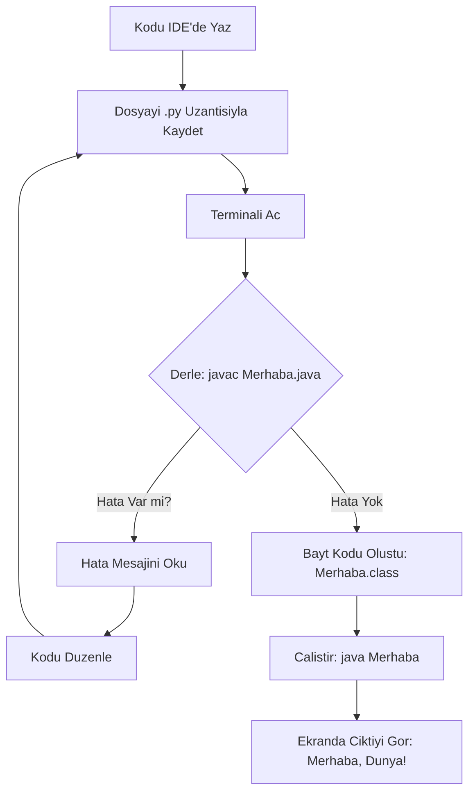

# Java'ya Giriş ve Kurulum

Java dünyasına hoş geldin! Bu bölümde, Java programlama dilini tanıyacak, geliştirme ortamını kuracak ve ilk Java programını yazıp çalıştıracaksın. Bu bölüm, bir inşaat ustasının temel araçlarını tanıması gibidir; sağlam bir temel, ilerideki tüm projelerini başarıya taşıyacaktır.

## Öğrenme Çıktıları

Bu bölümü tamamladığında aşağıdakileri yapabiliyor olacaksın:

- Java'nın ne olduğunu ve neden bu kadar yaygın kullanıldığını açıklamak.
- Bilgisayarına Java Geliştirme Kiti'ni (JDK) kurmak.
- Basit bir Java programını yazmak, derlemek ve çalıştırmak.
- `print()` benzeri temel çıktı fonksiyonlarını kullanmak.
- Koduna açıklama eklemek için yorum satırlarını kullanmak.
- Temel sözdizimi hatalarını tanımak ve düzeltmek.

## Ön Bilgi

Bu bölüm için herhangi bir programlama deneyimi gerekmez. Sadece bir bilgisayar, internet bağlantısı ve öğrenmeye istekli bir zihin yeterlidir.


## Java Programlama Dili: Tanım ve Tarihçe

### TANIM

Java, **yüksek seviyeli, nesne yönelimli, platform bağımsız** bir programlama dilidir. "Bir kere yaz, her yerde çalıştır" (Write Once, Run Anywhere - WORA) felsefesiyle tanınır. Bu, Java ile yazdığın bir programı Windows, macOS, Linux veya herhangi bir işletim sisteminde, üzerinde değişiklik yapmadan çalıştırabileceğin anlamına gelir.

**Tarihsel Bağlam:** Java, James Gosling ve ekibi tarafından 1995 yılında Sun Microsystems'te geliştirilmeye başlandı. İlk başta "Oak" (Meşe) adıyla, etkileşimli televizyonlar için tasarlanmıştı. Ancak internetin patlamasıyla birlikte Java, web üzerinde küçük programlar (Applet) çalıştırmak için mükemmel bir araç haline geldi. Java 1.0, 1996'da piyasaya sürüldü. O günden bu yana, Java 8 (2014) ve Java 11 (2018) gibi sürümlerle büyük yenilikler geldi. Java 8, Lambda ifadeleri ve Stream API'si ile fonksiyonel programlamaya kapı açarken; Java 11, Uzun Süreli Destek (LTS) sürümü olarak endüstride standart haline geldi.

### NEDEN VAR?

Java, C++ gibi daha karmaşık dillerin zorluklarını (örneğin, bellek yönetimi, platform bağımlılığı) ortadan kaldırmak için tasarlandı. Amaç, geliştiricilerin işletim sistemi detaylarıyla uğraşmadan, daha güvenli ve taşınabilir yazılımlar yazabilmesini sağlamaktı. Java olmasaydı, her işletim sistemi için ayrı ayrı kod yazman gerekirdi.

### NASIL KULLANILIR? (Kavramsal)

Java'yı doğrudan kullanmazsın; onunla kod yazarsın. Bu kodlar, Java Derleyicisi (`javac`) tarafından **bayt kodu (bytecode)** adı verilen ara bir dile dönüştürülür. Bu bayt kod, **Java Sanal Makinesi (JVM)** tarafından yorumlanarak çalıştırılır. JVM, her işletim sistemi için özel olarak yazılmıştır, bu sayede bayt kodun her yerde çalışmasını sağlar.

### NE ZAMAN TERCİH EDİLİR?

Java, aşağıdaki durumlar için idealdir:
- **Büyük ölçekli kurumsal uygulamalar (Enterprise Applications):** Bankacılık, sigorta, e-ticaret gibi sektörlerde.
- **Android Uygulama Geliştirme:** Android'in resmi dili olmasa da, Kotlin ile birlikte en yaygın kullanılan dildir.
- **Web Uygulamaları:** Spring, Hibernate gibi güçlü framework'ler sayesinde backend geliştirmede liderdir.
- **Bilimsel ve Akademik Projeler:** Sağlamlığı ve geniş kütüphane desteği sayesinde.

### ALTERNATİFLERİ

| Özellik | Java | Python | C# |
|:--- |:--- |:--- |:--- |
| **Çalışma Şekli** | Derlenen + Yorumlanan (JVM) | Yorumlanan | Derlenen (.NET) |
| **Hız** | Orta | Düşük (genelde) | Yüksek |
| **Öğrenme Kolaylığı** | Orta | Kolay | Orta |
| **Platform Bağımsızlığı** | Mükemmel (JVM sayesinde) | İyi | İyi (.NET sayesinde) |
| **Kullanım Alanı** | Kurumsal, Android, Web | Veri Bilimi, Yapay Zeka, Web | Windows Uygulamaları, Oyun |

### YAYGIN HATALAR

- **Hata:** "Java, JavaScript'in kısaltmasıdır."
- **Çözüm:** Bu çok yaygın bir yanılgıdır. Java ve JavaScript, birbirleriyle neredeyse hiçbir ortak yönü olmayan, tamamen farklı iki dildir. Java, bir araba motoruna benzer (sağlam ve karmaşık), JavaScript ise bir arabanın radyosuna benzer (web sayfalarına canlılık katar).

**Analoji:** Java'yı bir **evrensel tercüman** olarak düşünebilirsin. Sen Türkçe bir mektup yazarsın (Java kodu). Tercüman (Java Derleyicisi), bu mektubu Esperanto'ya çevirir (bayt kodu). Esperanto'yu anlayan başka bir tercüman (JVM) da mektubu, gittiği ülkenin diline (işletim sistemine) çevirir. Böylece mektubun her yerde okunabilir.


## Java Geliştirme Ortamı (JDK) Kurulumu

### TANIM

**JDK (Java Development Kit - Java Geliştirme Kiti)**, Java uygulamaları geliştirmek için ihtiyacın olan araçların (derleyici, hata ayıklayıcı, kütüphaneler) tamamını içeren bir yazılım paketidir. JRE (Java Runtime Environment - Java Çalışma Zamanı Ortamı) ise sadece Java programlarını **çalıştırmak** için gerekenleri içerir. Geliştirme yapacaksan JDK'ya ihtiyacın vardır.

### NEDEN VAR?

JDK olmadan Java kodu yazamazsın. Bir marangozun testeresi, çekici ve metreye ihtiyacı olduğu gibi, bir Java geliştiricisinin de derleyiciye (`javac`), kütüphanelere ve diğer araçlara ihtiyacı vardır. JDK, tüm bu araçları tek bir pakette sunar.

### NASIL KULLANILIR? (Kurulum Adımları)

1. **İndir:** Oracle JDK veya OpenJDK (ücretsiz) adreslerinden işletim sistemine uygun JDK sürümünü (Java 11 veya 17 LTS önerilir) indir.
2. **Kur:** İndirilen `.exe` (Windows) veya `.dmg` (macOS) dosyasını çalıştır. Linux'ta paket yöneticini kullan (ör: `sudo apt install openjdk-17-jdk`).
3. **Kontrol Et:** Terminal (Windows'ta CMD, macOS/Linux'ta Terminal) aç ve aşağıdaki komutu yaz:


```bash
    java -version
```


  Eğer JDK doğru kurulduysa, aşağıdakine benzer bir çıktı görmelisin:


```bash
    // Çıktı:
    // openjdk version "17.0.1" 2021-10-19 LTS
    // OpenJDK Runtime Environment (build 17.0.1+12-39)
    // OpenJDK 64-Bit Server VM (build 17.0.1+12-39, mixed mode, sharing)
```


  Eğer `java` komutu bulunamazsa (command not found), muhtemelen **PATH** ortam değişkenini ayarlaman gerekir. (Bu konuda "Java PATH Ayarı" araması yapabilirsin.)

### NE ZAMAN TERCİH EDİLİR?

- **JDK:** Java kodu yazacaksan (geliştirme yapacaksan).
- **JRE:** Sadece başkalarının yazdığı Java programlarını çalıştıracaksan (örneğin bir oyun oynayacaksan).

### ALTERNATİFLERİ

| Araç | Açıklama | Kullanım Amacı |
|:--- |:--- |:--- |
| **Oracle JDK** | Oracle şirketinin resmi JDK'sı. | Ticari kullanım için ücretli olabilir. |
| **OpenJDK** | Açık kaynaklı, ücretsiz JDK. | Çoğu geliştirici için önerilen seçenek. |
| **GraalVM** | Yüksek performanslı, çok dilli bir JVM. | Özel ihtiyaçlar (native image, polyglot). |

### YAYGIN HATALAR

- **Hata:** JDK yerine JRE kurmak.
- **Çözüm:** Sadece `java -version` komutu çalışıyorsa JRE kurmuş olabilirsin. Derleyiciyi (`javac`) kontrol et: `javac -version`. Eğer bu komut hata veriyorsa JDK kurman gerekir.

**Analoji:** JDK, bir **tamirhane** gibidir. İçinde bir arabayı (Java programını) sıfırdan inşa etmek için gereken her şey vardır: motor bloğu (derleyici), tekerlekler (kütüphaneler), tornavida seti (hata ayıklayıcı). JRE ise sadece bitmiş bir arabayı kullanabileceğin bir **yol** gibidir.


## İlk Java Programı: "Merhaba, Dünya!"

### TANIM

"Merhaba, Dünya!" programı, yeni bir programlama dilini öğrenirken yazılan ilk programdır. Amacı, geliştirme ortamının doğru çalıştığını ve dilin temel yapı taşlarını (sınıf, ana metot, çıktı fonksiyonu) anladığını doğrulamaktır.

### NEDEN VAR?

Bu program, bir nevi "sistem testi"dir. Eğer bu basit programı çalıştıramıyorsan, kurulumda bir sorun var demektir. Ayrıca, bir dilin temel sözdizimini (syntax) ilk kez görmeni sağlar.

### NASIL KULLANILIR? (Kod ve Açıklama)

İlk Java programımızı yazalım. Bunun için bir metin editörü (Notepad++, VS Code, IntelliJ IDEA gibi) aç ve aşağıdaki kodu yaz.


```java
// Dosya adi: Merhaba.java
// Her Java programi bir sinif (class) ile baslar.
public class Merhaba {
    // main metodu, programin baslangic noktasidir. JVM buradan baslatir.
    public static void main(String[] args) {
        // System.out.println() fonksiyonu, ekrana bir metin yazdirir ve alt satira gecer.
        System.out.println("Merhaba, Dunya!");
    }
}
```


**Kodu Satır Satır Açıklama:**

1. `// Dosya adi: Merhaba.java`: Bu bir **yorum satırıdır**. Java tarafından okunmaz, sadece kodu okuyan kişiye bilgi verir.
2. `public class Merhaba {`: Java'da her program bir **sınıf (class)** içinde yazılmalıdır. `public` anahtar kelimesi, bu sınıfa her yerden erişilebileceğini belirtir. `Merhaba` sınıfın adıdır ve dosya adıyla birebir aynı olmalıdır (`Merhaba.java`).
3. `public static void main(String[] args) {`: Bu, **ana metot (main method)**'dur. Java Sanal Makinesi (JVM), programı çalıştırmaya her zaman buradan başlar. `String[] args` kısmı, programa komut satırından argümanlar geçmek için kullanılır (şimdilik bunu bilmen yeterli).
4. `System.out.println("Merhaba, Dunya!");`: Bu satır, ekrana "Merhaba, Dunya!" yazısını yazdırır. `System.out` standart çıktı akışını (genelde ekranı) temsil eder. `println` ise "print line" (satır yazdır) anlamına gelir ve yazdırdıktan sonra imleci bir alt satıra taşır.

**Derleme ve Çalıştırma:**

1. Kodu `Merhaba.java` olarak kaydet.
2. Terminali aç ve dosyanın kaydedildiği klasöre git.
3. Derlemek için: `javac Merhaba.java` (Bu komut, `Merhaba.class` adlı bir **bayt kodu** dosyası oluşturur.)
4. Çalıştırmak için: `java Merhaba` (Dosya uzantısı `.class` olmadan!)

**Çıktı:**


```
Merhaba, Dunya!
```


### NE ZAMAN TERCİH EDİLİR?

Bu program, sadece başlangıçta değil, yeni bir IDE (Geliştirme Ortamı) kurduğunda veya bir projeye başlarken ortamının çalıştığından emin olmak için de kullanılır.

### ALTERNATİFLERİ

Bu programın alternatifi yoktur; her dildeki ilk programdır. Ancak çıktı fonksiyonu olarak `System.out.print()` (alt satıra geçmez) veya `System.out.printf()` (biçimlendirilmiş çıktı) kullanılabilir.

### YAYGIN HATALAR

- **Hata:** `javac: command not found` (Derleyici bulunamadı).
- **Çözüm:** JDK doğru kurulmamış veya PATH ayarları yapılmamıştır. JDK kurulumunu kontrol et.
- **Hata:** `Error: Could not find or load main class Merhaba`
- **Çözüm:** `java Merhaba` komutunu doğru klasörde çalıştırdığından ve dosya adının (`Merhaba.java`) sınıf adıyla (`Merhaba`) birebir aynı olduğundan emin ol.

**Analoji:** "Merhaba, Dünya!" programı, bir **bebeğin ilk kelimesi** gibidir. Bu, bebeğin (Java geliştiricisinin) dil yeteneğinin (geliştirme ortamının) çalıştığının ve iletişim kurabildiğinin ilk kanıtıdır.

Aşağıda, Java kodunun yazılmasından çalıştırılmasına kadar olan süreci gösteren bir akış diyagramı bulunmaktadır.





*Diyagram 1.1: Bir Java programının yazılması, derlenmesi ve çalıştırılması sürecini gösteren akış diyagramı. Karar noktası (elmas), derleme hatası durumunda kodu düzenleme adımına geri dönülmesi gerektiğini vurgular.*


## `print()` Ailesi: Çıktı Fonksiyonları

### TANIM

Java'da konsola çıktı vermek için `System.out` nesnesine ait üç temel fonksiyon kullanılır: `print()`, `println()` ve `printf()`. Bu fonksiyonlar, programın kullanıcıyla iletişim kurmasının en temel yoludur.

### NEDEN VAR?

Bir programın sonuçlarını kullanıcıya göstermesi gerekir. Bu fonksiyonlar olmadan, programın içinde hesapladığı değerleri, hataları veya bilgileri görmenin bir yolu olmazdı.

### NASIL KULLANILIR? (Kod ve Açıklama)

Aşağıdaki örnek, üç fonksiyonun da kullanımını göstermektedir.


```java
// Dosya adi: CiktiFonksiyonlari.java
public class CiktiFonksiyonlari {
    public static void main(String[] args) {

        // 1. println(): Ciktiyi yazdirir ve bir alt satira gecer.
        System.out.println("Bu bir alt satira gecer.");
        System.out.println("Bu da bir alt satirda.");

        // 2. print(): Ciktiyi yazdirir, ancak alt satira gecmez.
        // Bir sonraki cikti ayni satirda devam eder.
        System.out.print("Bu ayni satirda ");
        System.out.print("devam eder.");

        // Bir alt satira gecmek icin bos bir println() kullanilabilir.
        System.out.println();

        // 3. printf(): Biçimlendirilmis cikti icin kullanilir.
        // %s = String, %d = tam sayi (int), %f = ondalikli sayi (float/double)
        String isim = "Ali";
        int yas = 25;
        double boy = 1.85;

        System.out.printf("Benim adim %s, yasim %d ve boyum %.2f metredir.%n", isim, yas, boy);
        // %n, println() gibi alt satira gecer.
    }
}
```


**Çıktı:**


```
Bu bir alt satira gecer.
Bu da bir alt satirda.
Bu ayni satirda devam eder.
Benim adim Ali, yasim 25 ve boyum 1.85 metredir.
```


### NE ZAMAN TERCİH EDİLİR?

- **`println()`:** En sık kullanılanıdır. Hata ayıklama (debugging) için değişken değerlerini yazdırırken veya kullanıcıya net mesajlar verirken idealdir.
- **`print()`:** Bir kullanıcıdan aynı satırda veri girmesini istediğinde (örneğin, "Adınızı giriniz: " yazıp imleci aynı satırda bekletmek) kullanılır.
- **`printf()`:** Değişkenlerin belirli bir formatta (örneğin, ondalık kısmı 2 basamaklı, sağa yaslı) yazdırılması gerektiğinde kullanılır. Raporlama ve tablo oluşturmada çok kullanışlıdır.

### ALTERNATİFLERİ

Bu fonksiyonların alternatifi yoktur, ancak `String.format()` metodu ile bir metni biçimlendirip daha sonra `print()` ile yazdırabilirsin.

### YAYGIN HATALAR

- **Hata:** `System.out.Println()` (büyük 'P' harfi) yazmak.
- **Çözüm:** Java büyük/küçük harf duyarlıdır (case-sensitive). `println`'in 'p'si küçük olmalıdır.
- **Hata:** `printf()`'te yanlış biçimlendirme karakteri kullanmak (örneğin, bir sayı için `%s` kullanmak).
- **Çözüm:** Her veri türü için doğru biçimlendiriciyi kullan (`%d` int, `%f` float/double, `%s` String, `%c` char).

**Analoji:** `print()` ve `println()`'i bir **daktilo** gibi düşünebilirsin. `print()` yazmaya devam eder, `println()` ise satır başı (Enter) tuşuna basar. `printf()` ise bir **matbaa makinesi** gibidir; sayfanın neresine, hangi büyüklükte ve hangi yazı tipinde yazılacağını önceden belirleyebilirsin.


## REPL: Etkileşimli Çalışma Ortamı

### TANIM

**REPL (Read-Eval-Print Loop)**, kullanıcının yazdığı her bir kod satırını anında okuyan, değerlendiren (çalıştıran) ve sonucu ekrana yazdıran etkileşimli bir programlama ortamıdır. Java 9 ile birlikte `jshell` adıyla resmi olarak Java'ya eklenmiştir.

### NEDEN VAR?

Geleneksel Java geliştirmede, her değişiklikten sonra kodu derleyip çalıştırman gerekir. Bu, küçük testler yapmak veya bir kod parçasını denemek için zahmetlidir. REPL, bu süreci ortadan kaldırarak anında geri bildirim almanı sağlar.

### NASIL KULLANILIR? (Kod ve Açıklama)

Terminali aç ve `jshell` yaz.


```bash
$ jshell
|  JShell'e hos geldiniz -- v11.0.1
|  Genel bilgi icin /help yazin

jshell> int sayi1 = 10
sayi1 ==> 10

jshell> int sayi2 = 20
sayi2 ==> 20

jshell> int toplam = sayi1 + sayi2
toplam ==> 30

jshell> System.out.println("Toplam: " + toplam)
Toplam: 30

jshell> /exit
|  JShell'e veda ediyoruz
```


**Kodu Satır Satır Açıklama:**

1. `jshell>`: JShell'in sizden bir komut beklediğini gösteren istem (prompt).
2. `int sayi1 = 10`: `sayi1` adında bir tamsayı değişkeni oluşturup değerini 10 olarak atar. JShell, `sayi1 ==> 10` diyerek işlemin sonucunu anında gösterir.
3. `int toplam = sayi1 + sayi2`: İki değişkeni toplayıp `toplam` değişkenine atar.
4. `System.out.println(…)`: Normal bir Java kodu gibi çalışır ve sonucu yazdırır.
5. `/exit`: JShell'den çıkmak için kullanılan özel bir komuttur.

### NE ZAMAN TERCİH EDİLİR?

- **Küçük testler yapmak:** Bir algoritmanın veya bir Java API'sinin nasıl çalıştığını hızlıca test etmek için.
- **Yeni başlayanlar:** Dilin temel yapı taşlarını (değişkenler, döngüler, koşullar) deneyerek öğrenmek için mükemmeldir.
- **Hata ayıklama:** Karmaşık bir ifadenin küçük bir parçasını izole edip test etmek için.

### ALTERNATİFLERİ

| Özellik | JShell (REPL) | Geleneksel Java (IDE + Derleme) |
|:--- |:--- |:--- |
| **Geri Bildirim** | Anında, satır satır | Derleme ve çalıştırma sonrası |
| **Kullanım Amacı** | Keşif, öğrenme, hızlı test | Büyük projeler, uygulama geliştirme |
| **Hata Yönetimi** | Hata anında gösterilir, düzeltip devam edilir | Derleme hatası alınır, düzeltilip tekrar derlenir |
| **Dosya Yönetimi** | Gerekmez |.java dosyaları zorunludur |

### YAYGIN HATALAR

- **Hata:** JShell'de bir değişkeni yeniden tanımlamak (örneğin, `int sayi1 = 15` yazmak).
- **Çözüm:** JShell, bir değişkenin değerini değiştirmene izin verir, ancak türünü değiştiremezsin. Yeni bir değer atamak için sadece `sayi1 = 15` yazmalısın.

**Analoji:** REPL, bir **mutfak tadım kaşığı** gibidir. Büyük bir yemek (büyük bir Java projesi) yapmadan önce, tuzun, baharatın tadına bakmak (bir kod parçasını test etmek) için kullanırsın. Eğer tadı güzelse, tarife devam edersin; değilse, küçük bir düzeltme yapıp tekrar tadarsın.


## Sözdizimi (Syntax) ve Yorum Satırları

### TANIM

**Sözdizimi (Syntax)**, bir programlama dilinin doğru cümleler kurmak için uyulması gereken yazım kuralları bütünüdür. **Yorum satırları** ise, kodun ne yaptığını açıklamak için yazılan, derleyici tarafından tamamen yok sayılan metinlerdir.

### NEDEN VAR?

Sözdizimi, programlama dilinin grameridir. Dil bilgisi kuralları olmadan anlaşılır bir cümle kuramayacağın gibi, sözdizimi kuralları olmadan da çalışan bir program yazamazsın. Yorum satırları ise, kodun okunabilirliğini ve bakımını kolaylaştırır. Birkaç ay sonra kendi yazdığın koda baktığında, yorumlar sayesinde ne yapmak istediğini hatırlarsın.

### NASIL KULLANILIR? (Kod ve Açıklama)

Java'da üç tür yorum vardır:


```java
// Dosya adi: YorumVeSozdizimi.java
public class YorumVeSozdizimi {

    /**
     * Bu bir Javadoc yorumudur.
     * Bu yorumlar, HTML benzeri bir formatla
     * otomatik dokümantasyon olusturmak icin kullanilir.
     * @param args Komut satiri argumanlari
     */
    public static void main(String[] args) {

        // Bu bir tek satir yorumdur. (// ile baslar)
        // Derleyici bu satiri tamamen atlar.
        System.out.println("Yorum satirlari calistirilmaz.");

        /*
         * Bu bir cok satirli yorumdur.
         * Birden fazla satiri aciklamak icin kullanilir.
         * /* ic ice kullanilamaz! */
        System.out.println("Cok satirli yorum da calistirilmaz.");

        // Dogru Girintileme (Indentation):
        // Java'da kod bloklari {} ile belirtilir.
        // Girintileme, kodu okumayi kolaylastirir, zorunlu degildir ancak standarttir.
        if (true) {
            System.out.println("Bu satir if blogunun icinde.");
            System.out.println("Bu da.");
        } // if blogu burada biter.

        // Yanlis Girintileme (Calisir ama okumasi zordur):
        // Asagidaki kod calisir, ancak kotu bir uygulamadir.
        if (true) {
        System.out.println("Bu satir yanlis girintilenmis.");
        }

    } // main metodu burada biter.
} // sinif burada biter.
```


**Çıktı:**


```
Yorum satirlari calistirilmaz.
Cok satirli yorum da calistirilmaz.
Bu satir if blogunun icinde.
Bu da.
Bu satir yanlis girintilenmis.
```


### NE ZAMAN TERCİH EDİLİR?

- **Tek Satır Yorum (`//`):** Kısa ve öz açıklamalar için. Bir değişkenin ne işe yaradığını veya bir kod satırının amacını belirtmek için idealdir.
- **Çok Satırlı Yorum (`/* */`):** Daha uzun açıklamalar, bir algoritmanın mantığı veya geçici olarak devre dışı bırakmak istediğin bir kod bloğu için.
- **Javadoc Yorumu (`/** */`):** Sınıflar, metotlar ve alanlar için resmi dokümantasyon oluşturmak için kullanılır. IDE'ler bu yorumları okuyarak sana yardım ipuçları gösterebilir.

### ALTERNATİFLERİ

Yorum satırlarının alternatifi yoktur; ancak kötü yorum, yorumsuz koddan daha kötüdür. Kodun kendini açıklaması (self-documenting code) en iyi uygulamadır. Yani, değişken ve metot isimlerini o kadar anlamlı seçmelisin ki, yorum yazmaya gerek kalmasın.

### YAYGIN HATALAR

- **Hata:** Çok satırlı yorumları iç içe kullanmak (`/* /* */ */`).
- **Çözüm:** Bu, derleme hatasına neden olur. İlk `*/` ifadesi, yorumu sonlandırır ve kalan `*/` sözdizimi hatası olarak algılanır.
- **Hata:** Girintileme için boşluk ve tab karakterini karıştırmak.
- **Çözüm:** Bu teknik olarak hata değildir (kod çalışır), ancak okunabilirliği mahveder. Projede standart bir kural belirleyip (örneğin, 4 boşluk) ona uymak en iyisidir. IDE'ler bu konuda yardımcı olur.

**Analoji:** Sözdizimi, bir **yemek tarifinin kuralları** gibidir. "1 su bardağı şeker" yerine "1 tane şeker" yazarsan tarif anlaşılmaz olur. Yorum satırları ise tarifin kenarına yazdığın **küçük notlar** gibidir: "Bu aşamada tereyağ

soğukken eklenmeli" gibi. Bu notlar tarifin kendisini değiştirmez, sadece uygulayıcıya yardımcı olur.

### GÜNLÜK HAYAT ANALOJİSİ

Bir araba kullanmayı öğrenirken, direksiyonun üzerindeki semboller bir **sözdizimi**dir. Her sembolün belirli bir anlamı vardır ve bu anlamları bilmezsen arabayı kullanamazsın. Yorum satırları ise arabanın gösterge panelindeki **kullanım kılavuzu notları** gibidir: "Bu lamba yanarsa benzin bitmiş demektir" gibi. Semboller olmazsa araba çalışmaz; ama notlar olmazsa da araba çalışır, sadece kullanıcı ne yapacağını bilemez.


## 2. KOD ÖRNEKLERİ

### Örnek 1: İlk Program (ilk_program.py)

Python ile ilk programını yazmak için bir metin editörü aç ve aşağıdaki kodu yaz:


```bash
    // Çıktı:
    // openjdk version "17.0.1" 2021-10-19 LTS
    // OpenJDK Runtime Environment (build 17.0.1+12-39)
    // OpenJDK 64-Bit Server VM (build 17.0.1+12-39, mixed mode, sharing)
```

0


0


**Kodu satır satır açıklayalım:**

1. **`# ilk_program.py - Python'a ilk adim`**: Bu bir yorum satırıdır. Python bu satırı çalıştırmaz. Sadece kodu okuyan kişiye bilgi verir.
2. **`# Bu program ekrana "Merhaba, Dunya!" yazdirir`**: Yine bir yorum satırı. Programın ne yaptığını açıklar.
3. **`print("Merhaba, Dunya!")`**: İşte sihirli satır! `print()` fonksiyonu, parantez içindeki değeri ekrana yazdırır. Burada `"Merhaba, Dunya!"` metnini yazdırıyor.

**Çıktı:**


```bash
    // Çıktı:
    // openjdk version "17.0.1" 2021-10-19 LTS
    // OpenJDK Runtime Environment (build 17.0.1+12-39)
    // OpenJDK 64-Bit Server VM (build 17.0.1+12-39, mixed mode, sharing)
```

1


1


### Örnek 2: print() Çeşitlemeleri (print_ornekleri.py)

`print()` fonksiyonu sandığından çok daha güçlüdür. Farklı kullanım şekillerini görelim:


```bash
    // Çıktı:
    // openjdk version "17.0.1" 2021-10-19 LTS
    // OpenJDK Runtime Environment (build 17.0.1+12-39)
    // OpenJDK 64-Bit Server VM (build 17.0.1+12-39, mixed mode, sharing)
```

2


2


**Kodu satır satır açıklayalım:**

1. **`print("Merhaba, Python!")`**: Basit metin yazdırma. Çıktı: `Merhaba, Python!`
2. **`print(42)`**: Sayı yazdırma. Tırnak işareti kullanılmaz. Çıktı: `42`
3. **`print("Ad:", "Ahmet", "Yas:", 25)`**: Birden fazla değer. Virgülle ayrılan her değer, varsayılan olarak boşlukla ayrılarak yazdırılır. Çıktı: `Ad: Ahmet Yas: 25`
4. **`isim = "Ayse"`** ve **`print("Merhaba", isim)`**: Değişken kullanımı. Önce `isim` değişkenine "Ayse" değeri atanır, sonra bu değişken `print()` içinde kullanılır. Çıktı: `Merhaba Ayse`
5. **`print("Elma", "Armut", "Muz", sep=" - ")`**: `sep` parametresi. Varsayılan ayırıcı boşluk yerine " - " kullanılır. Çıktı: `Elma - Armut - Muz`
6. **`print("Birinci satir", end=" ")`** ve **`print("Ikinci satir (ama ayni satirda)")`**: `end` parametresi. Varsayılan olarak `print()` sonunda yeni satıra geçer (`\n`). `end=" "` ile bunu boşluğa çeviririz, böylece bir sonraki `print()` aynı satırda devam eder. Çıktı: `Birinci satir Ikinci satir (ama ayni satirda)`

**Tüm Çıktı:**


```bash
    // Çıktı:
    // openjdk version "17.0.1" 2021-10-19 LTS
    // OpenJDK Runtime Environment (build 17.0.1+12-39)
    // OpenJDK 64-Bit Server VM (build 17.0.1+12-39, mixed mode, sharing)
```

3


3


### Örnek 3: REPL Kullanımı (repl_ornekleri.py)

REPL ortamını kullanmak için terminali (komut satırını) aç ve `python` yaz. Karşında `>>>` işaretini göreceksin. İşte REPL böyle çalışır:


```bash
    // Çıktı:
    // openjdk version "17.0.1" 2021-10-19 LTS
    // OpenJDK Runtime Environment (build 17.0.1+12-39)
    // OpenJDK 64-Bit Server VM (build 17.0.1+12-39, mixed mode, sharing)
```

4


4


**Açıklama:** REPL'de her satırı yazdığında, Python hemen çalıştırır ve sonucu gösterir. Bu, küçük testler yapmak, matematiksel işlemler denemek veya bir fonksiyonun nasıl çalıştığını görmek için harikadır. `exit()` yazarak REPL'den çıkabilirsin.

### Örnek 4: Sözdizimi ve Yorum (sozdizimi_ve_yorum.py)

Python'da doğru ve yanlış sözdizimi kullanımını gösteren bir örnek:


```bash
    // Çıktı:
    // openjdk version "17.0.1" 2021-10-19 LTS
    // OpenJDK Runtime Environment (build 17.0.1+12-39)
    // OpenJDK 64-Bit Server VM (build 17.0.1+12-39, mixed mode, sharing)
```

5


5


**Çıktı:**


```bash
    // Çıktı:
    // openjdk version "17.0.1" 2021-10-19 LTS
    // OpenJDK Runtime Environment (build 17.0.1+12-39)
    // OpenJDK 64-Bit Server VM (build 17.0.1+12-39, mixed mode, sharing)
```

6


6


## 3. DİYAGRAMLAR

### Diyagram 1: Python Çalışma Akışı


```bash
    // Çıktı:
    // openjdk version "17.0.1" 2021-10-19 LTS
    // OpenJDK Runtime Environment (build 17.0.1+12-39)
    // OpenJDK 64-Bit Server VM (build 17.0.1+12-39, mixed mode, sharing)
```

7


7


**Açıklama:** Bu diyagram, bir Python programının yazılmasından çalıştırılmasına kadar geçen süreci gösterir. Kod yazılır, kaydedilir, yorumlayıcı tarafından okunur, sözdizimi hatası varsa düzeltilir, yoksa bytecode'a çevrilir ve sanal makinede çalıştırılarak çıktı üretilir.

### Diyagram 2: IDE vs REPL Karşılaştırması


```bash
    // Çıktı:
    // openjdk version "17.0.1" 2021-10-19 LTS
    // OpenJDK Runtime Environment (build 17.0.1+12-39)
    // OpenJDK 64-Bit Server VM (build 17.0.1+12-39, mixed mode, sharing)
```

8


8


**Açıklama:** Bu sıralı diyagram, IDE ve REPL arasındaki temel farkı gösterir. IDE'de tüm kod yazılır, kaydedilir ve sonra çalıştırılır. REPL'de ise her satır anında çalıştırılır ve sonuç hemen görülür.


## 4. ÖZET

Bu bölümde Python programlama dilinin temellerini öğrendik:

- **Python**, yorumlanan, nesne yönelimli, yüksek seviyeli bir programlama dilidir.
- **Kurulum** için python.org adresinden uygun sürüm indirilir ve kurulur.
- **IDE seçimi** kişisel tercihe bağlıdır; PyCharm, VS Code ve Thonny başlangıç için idealdir.
- **İlk program** `print()` fonksiyonu ile yazılır ve `.py` uzantısıyla kaydedilir.
- **REPL** ortamı, kod satır satır test etmek için kullanışlıdır.
- **Sözdizimi** kurallarına uymak zorunludur; girintileme, iki nokta ve tırnak işaretleri önemlidir.
- **Yorum satırları** kodun anlaşılmasını kolaylaştırır ve çalıştırılmaz.


## 5. SÖZLÜK (12 Terim)

| Terim | Açıklama |
|-------|----------|
| **Python** | Yorumlanan, nesne yönelimli, yüksek seviyeli bir programlama dili |
| **Yorumlayıcı (Interpreter)** | Python kodunu satır satır okuyup çalıştıran program |
| **IDE (Integrated Development Environment)** | Kod yazmayı, düzenlemeyi ve çalıştırmayı kolaylaştıran entegre geliştirme ortamı |
| **REPL** | Read-Eval-Print Loop: kod satır satır çalıştırma ortamı |
| **print()** | Ekrana metin veya değişken değeri yazdıran yerleşik fonksiyon |
| **Sözdizimi (Syntax)** | Python dilinin yazım kuralları |
| **Yorum satırı** | Kodun açıklaması için yazılan, çalıştırılmayan metinler |
| **Girintileme (Indentation)** | Kod bloklarını ayırmak için kullanılan boşluk veya tab |
| **String (metin)** | Tırnak içinde yazılan karakter dizisi |
| **Değişken** | Veri depolamak için kullanılan isimlendirilmiş bellek alanı |
| **Hata ayıklama (Debugging)** | Programdaki hataları bulma ve düzeltme süreci |
| **Konsol / Terminal** | Komut satırı arayüzü; Python kodlarını çalıştırmak için kullanılır |


## 6. DEĞERLENDİRME

### Doğru/Yanlış Soruları (8 adet)

1. **Python yorumlanan bir dildir.** → **Doğru** ✓
2. **Python kodları.java uzantısıyla kaydedilir.** → **Yanlış** ✗ (Python kodları.py uzantısıyla kaydedilir)
3. **print() fonksiyonu kullanıcıdan veri alır.** → **Yanlış** ✗ (print() veri yazdırır, kullanıcıdan veri almak için input() kullanılır)
4. **Python'da girintileme zorunludur.** → **Doğru** ✓
5. **REPL ortamında kod satır satır çalıştırılır.** → **Doğru** ✓
6. **Yorum satırları Python tarafından çalıştırılır.** → **Yanlış** ✗ (Yorum satırları tamamen atlanır)
7. **Python ücretsiz ve açık kaynaktır.** → **Doğru** ✓
8. **Python'da değişken tanımlarken tür belirtmek zorunludur.** → **Yanlış** ✗ (Python dinamik türleme kullanır, tür belirtmek gerekmez)

### Boşluk Doldurma Soruları (8 adet)

1. Python kodları **.py** uzantısıyla kaydedilir.
2. Ekrana yazı yazdırmak için **print()** fonksiyonu kullanılır.
3. Python'da tek satır yorum **#** işaretiyle başlar.
4. REPL açılımı **Read**, **Eval**, **Print**, **Loop**'dur.
5. Python'da kod blokları **girintileme** ile ayrılır.
6. IDE açılımı **Integrated Development Environment**'dir.
7. Python'da çok satırlı yorum **"""** veya **'''** ile yapılır.
8. Python ilk olarak **1991** yılında yayınlanmıştır.


## 7. ALIŞTIRMALAR

### Alıştırma 1: Kişisel Tanıtım (★☆☆☆☆)

**Amaç:** `print()` fonksiyonunu kullanarak kendini tanıtan bir program yazmak.

**İstenen:** Adını, yaşını ve sevdiğin bir aktiviteyi ekrana yazdıran bir Python programı yaz.

**Örnek Çıktı:**


```bash
    // Çıktı:
    // openjdk version "17.0.1" 2021-10-19 LTS
    // OpenJDK Runtime Environment (build 17.0.1+12-39)
    // OpenJDK 64-Bit Server VM (build 17.0.1+12-39, mixed mode, sharing)
```

9


9


**İpucu:** Üç ayrı `print()` ifadesi kullanabilir veya tek bir `print()` içinde `\n` (yeni satır) kullanabilirsin.

### Alıştırma 2: Hata Bulma (★★☆☆☆)

**Amaç:** Python sözdizimi hatalarını tanımayı öğrenmek.

**İstenen:** Aşağıdaki hatalı kodda kaç tane hata olduğunu bul ve düzeltilmiş halini yaz.


```java
// Dosya adi: Merhaba.java
// Her Java programi bir sinif (class) ile baslar.
public class Merhaba {
    // main metodu, programin baslangic noktasidir. JVM buradan baslatir.
    public static void main(String[] args) {
        // System.out.println() fonksiyonu, ekrana bir metin yazdirir ve alt satira gecer.
        System.out.println("Merhaba, Dunya!");
    }
}
```

0


0


**İpucu:** String kapatma, girintileme ve tırnak işareti hatalarına dikkat et.

### Alıştırma 3: REPL Deneyi (★★☆☆☆)

**Amaç:** REPL ortamında çalışmayı öğrenmek.

**İstenen:** REPL ortamında aşağıdaki işlemleri yap:
1. İki sayıyı topla ve sonucu bir değişkene ata
2. Bu değişkeni 3 ile çarp
3. Sonucu ekrana yazdır
4. Değişkenin türünü öğren

**Örnek REPL Oturumu:**


```java
// Dosya adi: Merhaba.java
// Her Java programi bir sinif (class) ile baslar.
public class Merhaba {
    // main metodu, programin baslangic noktasidir. JVM buradan baslatir.
    public static void main(String[] args) {
        // System.out.println() fonksiyonu, ekrana bir metin yazdirir ve alt satira gecer.
        System.out.println("Merhaba, Dunya!");
    }
}
```

1


1


## 8. SIK YAPILAN HATALAR

### Hata 1: Girintileme Hatası (IndentationError)

**Sorun:** Python'da kod blokları girintileme ile ayrılır. Boşluk ve tab karakterini karıştırmak veya girintiyi yanlış yapmak hata verir.

**Yanlış Kullanım:**


```java
// Dosya adi: Merhaba.java
// Her Java programi bir sinif (class) ile baslar.
public class Merhaba {
    // main metodu, programin baslangic noktasidir. JVM buradan baslatir.
    public static void main(String[] args) {
        // System.out.println() fonksiyonu, ekrana bir metin yazdirir ve alt satira gecer.
        System.out.println("Merhaba, Dunya!");
    }
}
```

2


2


**Doğru Kullanım:**


```java
// Dosya adi: Merhaba.java
// Her Java programi bir sinif (class) ile baslar.
public class Merhaba {
    // main metodu, programin baslangic noktasidir. JVM buradan baslatir.
    public static void main(String[] args) {
        // System.out.println() fonksiyonu, ekrana bir metin yazdirir ve alt satira gecer.
        System.out.println("Merhaba, Dunya!");
    }
}
```

3


3


**Çözüm:** Aynı projede tutarlı ol. Ya hep 4 boşluk kullan, ya da hep tab. IDE'nin otomatik düzenleme özelliğini kullan.

### Hata 2: String Kapatmama (SyntaxError)

**Sorun:** Tırnak işaretlerini kapatmamak.

**Yanlış Kullanım:**


```java
// Dosya adi: Merhaba.java
// Her Java programi bir sinif (class) ile baslar.
public class Merhaba {
    // main metodu, programin baslangic noktasidir. JVM buradan baslatir.
    public static void main(String[] args) {
        // System.out.println() fonksiyonu, ekrana bir metin yazdirir ve alt satira gecer.
        System.out.println("Merhaba, Dunya!");
    }
}
```

4


4


**Doğru Kullanım:**


```java
// Dosya adi: Merhaba.java
// Her Java programi bir sinif (class) ile baslar.
public class Merhaba {
    // main metodu, programin baslangic noktasidir. JVM buradan baslatir.
    public static void main(String[] args) {
        // System.out.println() fonksiyonu, ekrana bir metin yazdirir ve alt satira gecer.
        System.out.println("Merhaba, Dunya!");
    }
}
```

5


5


**Çözüm:** Her tırnak açtığında hemen kapatma alışkanlığı edin. IDE'ler bu hatayı genellikle renklendirme ile gösterir.

### Hata 3: Fonksiyon Adını Yanlış Yazma

**Sorun:** `print` yerine `prınt`, `Print` veya `prnt` yazmak.

**Yanlış Kullanım:**


```java
// Dosya adi: Merhaba.java
// Her Java programi bir sinif (class) ile baslar.
public class Merhaba {
    // main metodu, programin baslangic noktasidir. JVM buradan baslatir.
    public static void main(String[] args) {
        // System.out.println() fonksiyonu, ekrana bir metin yazdirir ve alt satira gecer.
        System.out.println("Merhaba, Dunya!");
    }
}
```

6


6


**Doğru Kullanım:**


```java
// Dosya adi: Merhaba.java
// Her Java programi bir sinif (class) ile baslar.
public class Merhaba {
    // main metodu, programin baslangic noktasidir. JVM buradan baslatir.
    public static void main(String[] args) {
        // System.out.println() fonksiyonu, ekrana bir metin yazdirir ve alt satira gecer.
        System.out.println("Merhaba, Dunya!");
    }
}
```

7


7


**Çözüm:** Python büyük/küçük harfe duyarlıdır (case-sensitive). `print` tamamen küçük harflerle yazılmalıdır.

### Hata 4: Dosya Uzantısını Yanlış Kaydetme

**Sorun:** Python kodunu `.py` yerine `.txt` veya başka bir uzantıyla kaydetmek.

**Çözüm:** Dosyayı her zaman `.py` uzantısıyla kaydet. Örneğin: `ilk_program.py`

### Hata 5: print() İçinde Değişkeni Tırnak İçine Alma

**Sorun:** Değişkenin değerini değil, ismini yazdırmak.

**Yanlış Kullanım:**


```java
// Dosya adi: Merhaba.java
// Her Java programi bir sinif (class) ile baslar.
public class Merhaba {
    // main metodu, programin baslangic noktasidir. JVM buradan baslatir.
    public static void main(String[] args) {
        // System.out.println() fonksiyonu, ekrana bir metin yazdirir ve alt satira gecer.
        System.out.println("Merhaba, Dunya!");
    }
}
```

8


8


**Doğru Kullanım:**


```java
// Dosya adi: Merhaba.java
// Her Java programi bir sinif (class) ile baslar.
public class Merhaba {
    // main metodu, programin baslangic noktasidir. JVM buradan baslatir.
    public static void main(String[] args) {
        // System.out.println() fonksiyonu, ekrana bir metin yazdirir ve alt satira gecer.
        System.out.println("Merhaba, Dunya!");
    }
}
```

9


9


**Çözüm:** Değişkenin değerini yazdırmak için tırnak kullanma. Tırnak içindeki her şey metin olarak yazdırılır.


## BÖLÜM SONU NOTLARI

Python'a giriş yaptığımız bu bölümde, dilin temel yapı taşlarını öğrendin. Artık:

- Python'u bilgisayarına kurabilir,
- İlk programını yazabilir,
- `print()` fonksiyonunu kullanabilir,
- REPL ortamında denemeler yapabilir,
- Python sözdizimi kurallarına uygun kod yazabilir,
- Yorum satırları ile kodunu açıklayabilirsin.

Bir sonraki bölümde, Python'da değişkenler ve veri türleri konusunu işleyeceğiz. Sayılar, metinler ve mantıksal değerlerle nasıl çalışacağını öğreneceksin.

**Unutma:** Programlama öğrenmenin en iyi yolu bol bol pratik yapmaktır. Bu bölümdeki alıştırmaları çözmeyi ihmal etme. Her hatanın bir öğrenme fırsatı olduğunu aklından çıkarma!


*Bir sonraki bölümde görüşmek üzere. Mutlu kodlamalar!* 🐍

## Kendini degerlendirme sorulari

## Bölüm 1: Python'a Giriş ve Kurulum - Kendini Değerlendirme Soruları

## Doğru/Yanlış Soruları

**Soru 1:** Python, yorumlanan (interpreted) bir programlama dilidir.
- Cevap: Doğru
- Açıklama: Python kodu, derlenmeden doğrudan yorumlayıcı tarafından çalıştırılır.

**Soru 2:** Java'da `print()` fonksiyonu, çıktı üretmek için kullanılan temel fonksiyondur.
- Cevap: Yanlış
- Açıklama: `print()` fonksiyonu Python'a aittir; Java'da çıktı için `System.out.println()` kullanılır.

**Soru 3:** JDK (Java Development Kit), Java uygulamaları geliştirmek için gerekli araçları içerir.
- Cevap: Doğru
- Açıklama: JDK, derleyici (javac), çalıştırıcı (java) ve kütüphaneleri bir arada sunar.

**Soru 4:** Python'da yorum satırları `#` işareti ile başlar.
- Cevap: Doğru
- Açıklama: Python'da tek satırlık yorumlar `#` karakteri ile yapılır.

**Soru 5:** REPL (Read-Eval-Print Loop), Python kodunu dosyaya kaydetmeden çalıştırmayı sağlar.
- Cevap: Doğru
- Açıklama: REPL, kullanıcının yazdığı her satırı anında çalıştırıp sonucu gösterir.

**Soru 6:** Java'da `System.out.println()` ifadesi, sadece metin değil, sayısal değerleri de yazdırabilir.
- Cevap: Doğru
- Açıklama: `println()` metodu, String, int, double gibi farklı veri türlerini parametre olarak alabilir.

**Soru 7:** Python'da `print("Merhaba")` ve `print('Merhaba')` aynı çıktıyı üretir.
- Cevap: Doğru
- Açıklama: Python'da tek tırnak (`'`) ve çift tırnak (`"`) string tanımlamada eşdeğerdir.

**Soru 8:** Java derleyicisi (`javac`), `.java` uzantılı dosyayı `.class` uzantılı bytecode dosyasına dönüştürür.
- Cevap: Doğru
- Açıklama: Java'da kaynak kod önce bytecode'a derlenir, ardından JVM tarafından çalıştırılır.

**Soru 9:** Python 3, Python 2 ile tamamen uyumludur ve Python 2 kodları aynen çalışır.
- Cevap: Yanlış
- Açıklama: Python 3, Python 2'den farklı sözdizimi ve kütüphane değişiklikleri içerir; geriye dönük tam uyumluluk yoktur.

**Soru 10:** Java'da `main` metodu, programın başlangıç noktasıdır.
- Cevap: Doğru
- Açıklama: Java'da `public static void main(String[] args)` metodu, JVM tarafından program başlatılırken çağrılır.

## Boşluk Doldurma Soruları

**Soru 1:** Python kodunu çalıştırmak için kullanılan komut satırı aracına __________ denir.
- Cevap: yorumlayıcı (interpreter)
- Açıklama: Python yorumlayıcısı, kaynak kodu satır satır okuyup çalıştırır.

**Soru 2:** Java'da çıktı üretmek için kullanılan temel ifade __________ 'dir.
- Cevap: System.out.println()
- Açıklama: Bu ifade, konsola bir satır yazdırmak için kullanılır.

**Soru 3:** Python'da birden fazla satırı yorum haline getirmek için __________ kullanılır.
- Cevap: üç tırnak (`"""` veya `'''`)
- Açıklama: Üç tırnak içine alınan metinler, çok satırlı yorum veya belgeleme (docstring) olarak işlev görür.

**Soru 4:** Java derleyicisi, `.java` dosyasını __________ uzantılı bytecode dosyasına dönüştürür.
- Cevap:.class
- Açıklama: Bytecode, JVM tarafından platformdan bağımsız olarak çalıştırılabilir.

**Soru 5:** Python'da kullanıcıdan veri almak için __________ fonksiyonu kullanılır.
- Cevap: input()
- Açıklama: `input()` fonksiyonu, klavyeden girilen değeri string olarak döndürür.

**Soru 6:** Java'da bir programın çalışmaya başladığı metot __________ olarak adlandırılır.
- Cevap: main metodu
- Açıklama: `public static void main(String[] args)` imzasına sahip bu metot, programın giriş noktasıdır.

**Soru 7:** Python'da `print()` fonksiyonunun varsayılan olarak satır sonuna eklediği karakter __________ 'dir.
- Cevap: yeni satır (`\n`)
- Açıklama: `print()` her çağrıldığında otomatik olarak bir alt satıra geçer.

**Soru 8:** Java'da `//` işareti ile başlayan satırlara __________ denir.
- Cevap: tek satırlık yorum
- Açıklama: `//` ile başlayan satırlar derleyici tarafından yok sayılır.

**Soru 9:** Python'da REPL açılımı __________ 'dir.
- Cevap: Read-Eval-Print Loop
- Açıklama: Bu döngü, kodu okur, değerlendirir, sonucu yazdırır ve tekrarlar.

**Soru 10:** Java'nın platform bağımsız çalışmasını sağlayan sanal makineye __________ denir.
- Cevap: JVM (Java Virtual Machine)
- Açıklama: JVM, bytecode'u çalıştırarak Java'nın "bir kere yaz, her yerde çalıştır" prensibini mümkün kılar.

## Bir sonraki bolume kopru

Bu bölümde Java'nın temel yapı taşlarını ve ilk programınızı nasıl yazacağınızı öğrendiniz. Artık bir Java dosyasının yapısını, derleme ve çalıştırma sürecini ve temel çıktı alma komutlarını biliyorsunuz. Bir sonraki bölümde, bu bilgilerin üzerine inşa ederek, programlarınıza dinamizm katacak **değişkenler, veri tipleri ve temel operatörler**i keşfedecek, kullanıcıdan nasıl veri alacağınızı öğreneceksiniz.
