# Java Programlamaya Giriş

**Temel Kavramlardan İleri Uygulamalara**

---

*Bu kitap, Java programlama dilini sıfırdan öğrenmek isteyenler için hazırlanmıştır.
Temel kavramlardan başlayarak, nesne yönelimli programlama, GUI geliştirme,
veritabanı işlemleri ve ileri düzey konulara kadar kapsamlı bir içerik sunar.*

---

# Bölüm 1: Java'ya Giris, Calisma Modeli ve Gelistirme Ortami

> **Pedagojik Not:** Bu bölüm, Java programlama diline ilk adımınızı atmanızı sağlayacak temel kavramları içermektedir. Özellikle JVM, JRE ve JDK arasındaki farkları anlamak, ilerleyen bölümlerde karşılaşacağınız birçok kavramın temelini oluşturacaktır.

## 1.1 Java Nedir ve Neden Kullanılır?

### Java’nın Tarihçesi ve Gelişimi

Java, 1991 yılında James Gosling ve ekibi tarafından Sun Microsystems’de geliştirilmeye başlanmıştır. Başlangıçta “Oak” (Meşe) adıyla anılan dil, daha sonra Java olarak yeniden adlandırılmıştır. Java’nın evrimi şu şekilde özetlenebilir:

- **Java 1.0 (1996):** İlk resmi sürüm, temel kütüphaneler ve applet desteği
- **Java 2 (1998):** Swing GUI kütüphanesi, Collections Framework
- **Java 5 (2004):** Generics, annotations, enum, foreach döngüsü
- **Java 8 (2014):** Lambda ifadeleri, Stream API, Optional sınıfı
- **Java 11 (2018):** Uzun süreli destek (LTS) sürümü, HTTP Client API
- **Java 17 (2021):** En son LTS sürümü, sealed classes, pattern matching

> **Önemli Bilgi:** Java’nın en büyük avantajlarından biri geriye dönük uyumluluktur. 20 yıl önce yazılmış bir Java kodu, günümüzdeki en son Java sürümünde de çalışabilir.

### Java’nın Kullanım Alanları

Java, çok geniş bir kullanım yelpazesine sahiptir:

- **Web Uygulamaları:** Spring Framework, Java EE (Enterprise Edition) ile kurumsal web uygulamaları
- **Mobil Uygulamalar:** Android işletim sistemi Java tabanlıdır
- **Kurumsal Yazılımlar:** Bankacılık, sigorta, e-ticaret gibi sektörlerde yaygın
- **Büyük Veri ve Yapay Zeka:** Apache Hadoop, Apache Spark gibi teknolojiler Java ile geliştirilmiştir
- **Gömülü Sistemler ve IoT:** Akıllı kartlar, sensörler, otomotiv sistemleri

### Java’nın Avantajları

Java’nın bu kadar yaygın kullanılmasının başlıca nedenleri:

1. **Platform Bağımsızlık:** “Write Once, Run Anywhere” (Bir kere yaz, her yerde çalıştır) felsefesi
2. **Nesne Yönelimli Programlama:** Modüler, yeniden kullanılabilir kod yapısı
3. **Güçlü Bellek Yönetimi:** Garbage Collection ile otomatik bellek temizliği
4. **Geniş Kütüphane ve Topluluk Desteği:** Milyonlarca geliştirici ve binlerce açık kaynak kütüphane

## 1.2 Java’nın Çalışma Modeli: JVM, JRE ve JDK

### JDK (Java Development Kit)

JDK, Java uygulamaları geliştirmek için ihtiyaç duyulan tüm araçları içeren pakettir. JDK’nın içerdiği temel bileşenler:

- **javac:** Java derleyicisi (compiler)
- **java:** Java yorumlayıcısı (interpreter)
- **jdb:** Hata ayıklayıcı (debugger)
- **javadoc:** Dokümantasyon oluşturucu
- **jar:** Java arşiv aracı

**Kod Örneği:** JDK kurulumunu doğrulama

```java
```

```bash
## 1.3 Java sürümünü kontrol etme
java -version

## 1.4 Java derleyici sürümünü kontrol etme
javac -version
```

### JRE (Java Runtime Environment)

JRE, Java programlarını çalıştırmak için gerekli olan minimum ortamdır. JRE şunları içerir:

- JVM (Java Virtual Machine)
- Temel sınıf kütüphaneleri
- Destek dosyaları

> **Uyarı:** JRE sadece Java programlarını **çalıştırmak** içindir. Yeni bir Java programı **geliştirmek** için JDK gereklidir.

**Kod Örneği:** Basit bir Java programını JRE ile çalıştırma

```java
```

```java
public class HelloWorld {
    public static void main(String[] args) {
        System.out.println("Java çalışıyor!");
    }
}
```

### JVM (Java Virtual Machine)

JVM, Java’nın platform bağımsızlığının temel taşıdır. JVM’in görevleri:

1. **Bytecode Yorumlama:** `.class` dosyalarındaki bytecode’u okur ve çalıştırır
2. **Bellek Yönetimi:** Heap ve Stack bellek bölgelerini yönetir
3. **Garbage Collection:** Kullanılmayan nesneleri bellekten temizler
4. **Güvenlik:** Bytecode doğrulama ve güvenlik kontrolleri

**Kod Örneği:** Bytecode üretme süreci

```java
```

```java
public class BytecodeDemo {
    public static void main(String[] args) {
        int toplam = 5 + 3;
        System.out.println("Toplam: " + toplam);
    }
}
```

**Derleme ve çalıştırma komutları:**
```bash
## 1.5 Kaynak kodu bytecode'a çevir
javac BytecodeDemo.java

## 1.6 Bytecode'u çalıştır
java BytecodeDemo
```

### JDK, JRE ve JVM Arasındaki İlişki

Bu üç bileşen arasındaki hiyerarşik ilişki:

```
JDK (Java Development Kit)
  ├── JRE (Java Runtime Environment)
  │    ├── JVM (Java Virtual Machine)
  │    ├── Çekirdek Kütüphaneler
  │    └── Diğer Çalışma Zamanı Bileşenleri
  ├── Geliştirme Araçları (javac, jdb, javadoc, jar)
  └── API Kütüphaneleri
```

> **Pratik İpucu:** 
> - Sadece Java programı **çalıştıracaksanız** → JRE yeterlidir
> - Java programı **geliştirecekseniz** → JDK gereklidir
> - JDK, JRE’yi de içerdiği için her zaman JDK kurmanız önerilir

## 1.7 Java Geliştirme Ortamı Kurulumu

### İşletim Sistemine Göre Kurulum

#### Windows’a JDK Kurulumu

1. Oracle JDK veya OpenJDK indir
2. `.msi` veya `.exe` dosyasını çalıştır
3. Kurulum sihirbazını takip et
4. Varsayılan kurulum dizini: `C:\Program Files\Java\jdk-17`

#### macOS’a JDK Kurulumu

```bash
## 1.8 Homebrew ile kurulum
brew install openjdk@17

## 1.9 Manuel kurulum için .dmg dosyasını indir
```

#### Linux’a JDK Kurulumu

```bash
## 1.10 Debian/Ubuntu tabanlı sistemler
sudo apt update
sudo apt install openjdk-17-jdk

## 1.11 RHEL/CentOS/Fedora tabanlı sistemler
sudo yum install java-17-openjdk-devel
```

### PATH ve JAVA_HOME Değişkenleri

#### Windows’ta PATH ve JAVA_HOME Ayarlama

```bash
```

```bash
## 1.16 JAVA_HOME değişkenini ayarlama
setx JAVA_HOME "C:\Program Files\Java\jdk-17"

## 1.17 PATH değişkenine JDK bin dizinini ekleme
setx PATH "%PATH%;%JAVA_HOME%\bin"
```

#### macOS/Linux’ta PATH ve JAVA_HOME Ayarlama

```bash
```

```bash
## 1.22 ~/.bashrc veya ~/.zshrc dosyasına ekleyin
export JAVA_HOME=/usr/lib/jvm/java-17-openjdk-amd64
export PATH=$JAVA_HOME/bin:$PATH
```

**Kurulum doğrulama komutları:**
```bash
## 1.23 Java sürümünü kontrol et
java -version

## 1.24 Derleyici sürümünü kontrol et
javac -version

## 1.25 JAVA_HOME değişkenini kontrol et
echo %JAVA_HOME%  # Windows
echo $JAVA_HOME   # macOS/Linux
```

### İntegre Geliştirme Ortamları (IDE)

Java geliştirme için en popüler IDE’ler:

| IDE | Özellikler | Kullanım Alanı |
|-----|------------|----------------|
| **IntelliJ IDEA** | Akıllı kod tamamlama, refactoring, Spring desteği | Profesyonel geliştirme |
| **Eclipse** | Ücretsiz, geniş eklenti desteği | Kurumsal projeler |
| **NetBeans** | Swing GUI builder, JavaFX desteği | Masaüstü uygulamaları |

> **Tavsiye:** Yeni başlayanlar için IntelliJ IDEA Community Edition (ücretsiz) önerilir.

## 1.26 İlk Java Programı: “Merhaba Dünya”

### Kaynak Kod Yazma

```java
```

```java
/**
 * MerhabaDunya - İlk Java Programı
 * Bu program ekrana "Merhaba Dünya!" yazdırır
 */
public class MerhabaDunya {
    public static void main(String[] args) {
        // Ekrana mesaj yazdır
        System.out.println("Merhaba Dünya!");
    }
}
```

**Java programının temel yapısı:**

1. **Class Tanımı:** `public class MerhabaDunya` - Programın ana sınıfı
2. **Main Metodu:** `public static void main(String[] args)` - Programın başlangıç noktası
3. **Çıktı İşlemi:** `System.out.println()` - Ekrana yazdırma

### Derleme ve Çalıştırma Süreci

```bash
```

```bash
## 1.31 Kaynak kodu derle (bytecode üret)
javac MerhabaDunya.java

## 1.32 Bytecode'u çalıştır
java MerhabaDunya

## 1.33 Beklenen çıktı:
## 1.34 Merhaba Dünya!
```

**Derleme sonrası oluşan dosyalar:**
- `MerhabaDunya.java` → Kaynak kod (insan tarafından okunabilir)
- `MerhabaDunya.class` → Bytecode (JVM tarafından okunabilir)

### Hata Ayıklama ve Çıktı Analizi

#### Yaygın Derleme Hataları

```java
```

```java
public class HataliProgram {
    public static void main(String[] args) {
        // HATA 1: Noktalı virgül eksik
        System.out.println("Merhaba")  // ; eksik
        
        // HATA 2: String tırnak işareti eksik
        String mesaj = "Merhaba;  // " eksik
        
        // HATA 3: Yanlış veri tipi
        int sayi = "on";  // String int'e atanamaz
    }
}
```

**Derleme hatası çıktısı:**
```
HataliProgram.java:5: error: ';' expected
        System.out.println("Merhaba")
                                    ^
HataliProgram.java:8: error: unclosed string literal
        String mesaj = "Merhaba;
                        ^
HataliProgram.java:11: error: incompatible types: String cannot be converted to int
        int sayi = "on";
                   ^
3 errors
```

> **Önemli Uyarı:** Derleme hataları, kodunuzda sözdizimi (syntax) hatası olduğunu gösterir. Bu hatalar düzeltilmeden program çalıştırılamaz.

#### Çalışma Zamanı Hataları

```java
```

```java
public class RuntimeHata {
    public static void main(String[] args) {
        int sayi1 = 10;
        int sayi2 = 0;
        
        // Bu satır çalışma zamanında hata verecek
        int sonuc = sayi1 / sayi2;
        
        System.out.println("Sonuç: " + sonuc);
    }
}
```

**Çalışma zamanı hatası çıktısı:**
```
Exception in thread "main" java.lang.ArithmeticException: / by zero
    at RuntimeHata.main(RuntimeHata.java:8)
```

## 1.35 Java Programlama Süreci ve İyi Uygulamalar

### Kaynak Kod Düzeni

```java
```

```java
package com.example.ilkprogram;

/**
 * Bu sınıf, doğru kod düzenini gösterir.
 * 
 * @author Ali Yılmaz
 * @version 1.0
 * @since 2024-01-01
 */
public class DogruDosyaAdi {
    
    // Değişken isimleri camelCase kuralına uygun olmalı
    private String kullaniciAdi;
    private int yas;
    
    /**
     * Programın başlangıç noktası

```yaml
title: "Java Programının Temel Yapısı, Değişkenler ve Veri Tipleri"
---
bölüm: Java Programının Temel Yapısı, Değişkenler ve Veri Tipleri
bölüm_numarası: 1
amaç: Java programının temel yapı taşlarını (class, main metodu, bloklar, yorum satırları ve çıktı komutları) kavramak ve değişkenler ile veri tiplerini tanımak.
öğrenme_hedefleri:
  - Java'da bir class yapısını tanımlayabilme ve main metodunu kullanabilme.
  - Kod bloklarının kapsamını (scope) anlayabilme.
  - Tek satırlı, çok satırlı ve Javadoc yorumlarını kullanabilme.
  - System.out.println(), print() ve printf() metotlarıyla konsola çıktı verebilme.
  - İlkel (primitive) ve referans (reference) veri tiplerini tanımlayabilme ve kullanabilme.
  - Basit bir Java programını hatasız yazıp çalıştırabilme.
önceki_bilgi: Temel bilgisayar kullanımı ve algoritma mantığı.
sonraki_bölüm: Operatörler ve İfadeler
# Bölüm 2:  Java Programının Temel Yapısı, Değişkenler ve Veri Tipleri

Java'ya hoş geldiniz! Bu bölümde, bir Java programının omurgasını oluşturan temel yapı taşlarını keşfedeceğiz. İlk programınızı yazmaktan, değişkenlerle veri depolamaya ve bu verileri konsola yazdırmaya kadar birçok temel kavramı adım adım öğreneceksiniz. Bu bölüm, sonraki tüm konuların temelini oluşturacağı için kavramları iyice anlamanız büyük önem taşır.

## 2.1 Java Programının Temel Bileşenleri

Her Java programı, belirli bir yapıya sahiptir. Bu yapıyı oluşturan temel bileşenler; class (sınıf) bildirimi, `main` metodu ve kod bloklarıdır. Bu yapıyı anlamak, Java ile yazılmış herhangi bir kodu okumak ve yazmak için ilk adımdır.

### Class Yapısı ve Tanımı

Java'da her şey sınıflar (class) etrafında döner. Bir sınıf, nesnelerin (object) oluşturulması için bir şablondur. Ancak şimdilik, bir Java programının temel kapsayıcısı olduğunu düşünebiliriz. Tüm kodunuz, bir sınıfın içinde yer alır.

Bir sınıfı tanımlamak için `class` anahtar kelimesi kullanılır. Sınıf isimleri, **PascalCase** olarak adlandırılan bir kurala göre yazılır: Her kelimenin ilk harfi büyük, kelimeler bitişik yazılır (örneğin, `MerhabaDunya`, `OgrenciBilgiSistemi`).

Sınıfın içeriği, açma (`{`) ve kapama (`}`) süslü parantezleri arasında tanımlanır. Bu parantezler, sınıfın "kapsamını" (scope) belirler.

Aşağıda, `Ornek` adında basit bir sınıf tanımı görmektesiniz:

```java
// - Amaç: Java'da bir sınıfın (class) nasıl tanımlandığını göstermek.
// - Çıktı: Bu kod tek başına çalıştırıldığında herhangi bir çıktı vermez, çünkü bir main metodu içermemektedir.
// - Anahtar Kavramlar: class, süslü parantezler, PascalCase
public class Ornek {
    // Sınıfın içeriği buraya yazılır.
    // Örneğin, değişkenler, metotlar...
}
```

> **Pedagojik Not:** `public` anahtar kelimesi, bu sınıfa diğer sınıflardan da erişilebileceğini belirtir. Java'daki erişim belirleyicileri (access modifiers) ilerleyen bölümlerde detaylıca işlenecektir. Şimdilik, ana sınıfınızı `public` olarak tanımlamanın standart bir uygulama olduğunu bilmeniz yeterlidir.

### main Metodu ve Programın Başlangıç Noktası

Java Sanal Makinesi (JVM), bir programı çalıştırmaya başlamak için özel bir metot arar: `main` metodu. Bu metot, programınızın giriş noktasıdır (entry point). JVM, programı başlatmak için tam olarak aşağıdaki imzaya sahip bir metot arar:

```java
public static void main(String[] args)
```

Bu imzanın her bir parçasının anlamı şudur:
- **`public`:** Bu metoda her yerden erişilebilir. JVM'in metoda erişmesi için gereklidir.
- **`static`:** Bu metot, sınıfa ait bir nesne oluşturmadan doğrudan çağrılabilir. JVM, programı başlatırken henüz hiçbir nesne oluşturmadığı için bu gereklidir.
- **`void`:** Bu metot herhangi bir değer döndürmez (geriye değer göndermez).
- **`main`:** Metodun adıdır. JVM tam olarak bu ismi arar.
- **`String[] args`:** Bu, `main` metoduna komut satırından argümanlar (parametreler) geçirmek için kullanılan bir dizi (array) parametredir. `args` parametresinin adı değiştirilebilir, ancak `String[]` tipi zorunludur.

İşte bir `main` metodu içeren tam bir program:

```java
// - Amaç: Java programının başlangıç noktası olan main metodunu göstermek.
// - Çıktı: Program çalıştırıldığında konsola "Merhaba, Java!" yazdırır.
// - Anahtar Kavramlar: main metodu, JVM, String[] args
public class IlkProgram {
    public static void main(String[] args) {
        // Programın çalıştıracağı kodlar buraya yazılır.
        System.out.println("Merhaba, Java!");
    }
}
```

> **Pedagojik Not:** `String[] args` kısmı, programınıza dışarıdan veri aktarmak için kullanılır. Örneğin, bir kullanıcı adı veya bir dosya yolu program başlatılırken bu dizi aracılığıyla programa iletilebilir. Şimdilik bu parametrenin varlığını bilmeniz yeterlidir; detaylarına ilerleyen bölümlerde değineceğiz.

### Kod Blokları ve Kapsam (Scope)

Süslü parantezler `{ }`, kod bloklarını tanımlamak için kullanılır. Bir blok, mantıksal olarak birbirine ait kod parçalarını gruplandırır. Bir sınıfın gövdesi, bir metodun gövdesi, bir `if` koşulunun gövdesi gibi birçok yapı bloklardan oluşur.

Blokların en önemli özelliklerinden biri, **kapsam (scope)** kavramını oluşturmasıdır. Bir blok içinde tanımlanan bir değişkene, yalnızca o blok ve onun içindeki alt bloklardan erişilebilir. Blok dışından bu değişkene erişmek mümkün değildir.

Aşağıdaki örnekte, bloklar ve kapsam kavramını inceleyelim:

```java
// - Amaç: Kod bloklarının ve değişken kapsamının (scope) nasıl çalıştığını göstermek.
// - Çıktı: Program çalıştırıldığında konsola "x = 5" ve "y = 10" yazdırır. 'x' değişkenine iç bloktan erişilebilirken, 'y' değişkenine dış bloktan erişilemez.
// - Anahtar Kavramlar: süslü parantezler, blok, scope (kapsam)
public class BlokOrnegi {
    public static void main(String[] args) {
        int x = 5; // Dış blokta tanımlanan değişken

        { // İç blok başlangıcı
            int y = 10; // İç blokta tanımlanan değişken
            System.out.println("x = " + x); // Dış bloktaki x'e erişilebilir.
            System.out.println("y = " + y); // Kendi bloğundaki y'ye erişilebilir.
        } // İç blok sonu. y değişkeni buradan sonra yok olur.

        // System.out.println("y = " + y); // HATA! y'ye buradan erişilemez. (Derleme hatası)
        System.out.println("x = " + x); // x'e hala erişilebilir.
    }
}
```

## 2.2 Yorum Satırları ve Kod Dokümantasyonu

Yorum satırları, Java derleyicisi tarafından tamamen yok sayılan, kodu açıklamak, not almak veya geçici olarak devre dışı bırakmak için kullanılan metinlerdir. İyi yazılmış yorumlar, kodun okunabilirliğini ve bakımını büyük ölçüde kolaylaştırır.

### Tek Satırlık Yorumlar

Tek satırlık yorumlar, `//` karakterleri ile başlar ve satırın sonuna kadar devam eder. Genellikle kısa açıklamalar veya notlar için kullanılır. Ayrıca, bir kod satırını geçici olarak devre dışı bırakmak (debugging) için de sıkça kullanılır.

```java
// - Amaç: Tek satırlık yorumların nasıl kullanıldığını göstermek.
// - Çıktı: Sadece "Program başlatılıyor..." yazdırır.
// - Anahtar Kavramlar: //, tek satırlı yorum, debugging
public class YorumOrnegi {
    public static void main(String[] args) {
        // Bu bir tek satırlık yorumdur. Derleyici bunu yok sayar.
        System.out.println("Program başlatılıyor...");

        // Aşağıdaki satır geçici olarak devre dışı bırakılmıştır.
        // System.out.println("Bu satır çalıştırılmayacak.");
    }
}
```

### Çok Satırlı Yorumlar

Çok satırlı yorumlar, `/*` ile başlar ve `*/` ile biter. Bu iki işaretçi arasındaki tüm metinler (birden fazla satır olsa bile) yorum olarak kabul edilir. Genellikle daha uzun açıklamalar veya kodun geniş bir bölümünü geçici olarak devre dışı bırakmak için kullanılır.

```java
// - Amaç: Çok satırlı yorumların nasıl kullanıldığını göstermek.
// - Çıktı: Sadece "İşlem tamam." yazdırır.
// - Anahtar Kavramlar: /* */, çok satırlı yorum
public class CokSatirliYorum {
    public static void main(String[] args) {
        /*
         * Bu bir çok satırlı yorumdur.
         * Birden fazla satıra yayılabilir.
         * Derleyici bu bloktaki her şeyi yok sayar.
         */
        System.out.println("İşlem tamam.");

        /* Kodun bir bölümünü devre dışı bırakmak için de kullanılabilir.
        System.out.println("Bu satır çalışmaz.");
        System.out.println("Bu da çalışmaz.");
        */
    }
}
```

### Javadoc Yorumları

Javadoc yorumları, `/**` ile başlar ve `*/` ile biter. Bu özel yorum türü, Java kodunuz için HTML tabanlı dokümantasyon (API dokümantasyonu) oluşturmak amacıyla kullanılır. Javadoc, sınıfların, metotların ve alanların ne işe yaradığını açıklamak için standart bir yol sağlar.

Javadoc içinde `@param`, `@return`, `@author`, `@version` gibi özel etiketler (tag) kullanarak dokümantasyonu daha yapılandırılmış hale getirebilirsiniz.

```java
// - Amaç: Javadoc yorumlarının ve etiketlerinin kullanımını göstermek.
// - Çıktı: Program çalıştırıldığında konsola "16" yazdırır.
// - Anahtar Kavramlar: /** */, @param, @return, @author
public class JavadocOrnegi {

    /**
     * Verilen bir sayının karesini hesaplar.
     *
     * @param sayi Karesi alınacak tam sayı değeri.
     * @return sayi parametresinin karesi (int).
     * @author Ali Veli
     */
    public static int kareAl(int sayi) {
        return sayi * sayi;
    }

    public static void main(String[] args) {
        int sonuc = kareAl(4);
        System.out.println(sonuc);
    }
}
```

> **Pedagojik Not:** Javadoc yorumları, profesyonel Java projelerinde kodun anlaşılabilirliği ve ekip çalışması için hayati öneme sahiptir. İlerleyen dönemlerde kendi kütüphanelerinizi yazarken Javadoc kullanmayı alışkanlık haline getirmeniz, sizi ve ekibinizi büyük bir zaman kaybından kurtaracaktır.

## 2.3 Çıktı Komutları ve Konsol İşlemleri

Programlar genellikle kullanıcıya bilgi vermek veya işlem sonuçlarını göstermek için konsola çıktı yazdırırlar. Java'da bu işlem için en sık kullanılan araç `System.out` nesnesidir.

### System.out.println() Metodu

`System.out.println()` metodu, kendisine verilen değeri (metin, sayı, vb.) konsola yazdırır ve **satırı atlar** (yeni bir satıra geçer). Bu, en yaygın kullanılan çıktı metodudur.

Metin (String) ifadeleri `" "` (çift tırnak) içine yazılır. Farklı değerleri birleştirmek için `+` operatörü kullanılır. Bu operatör, metinlerle sayıları birleştirdiğinde, sayıyı otomatik olarak metne dönüştürür.

```java
// - Amaç: System.out.println() metodunun kullanımını göstermek.
// - Çıktı:
//   Merhaba Dünya!
//   Yaş: 30
// - Anahtar Kavramlar: System.out.println(), String birleştirme (+)
public class PrintlnOrnegi {
    public static void main(String[] args) {
        System.out.println("Merhaba Dünya!");
        
        int yas = 30;
        System.out.println("Yaş: " + yas); // String ile int birleştirme
    }
}
```

### System.out.print() Metodu

`System.out.print()` metodu, `println()`'dan farklı olarak, çıktı verdikten sonra **satırı atlamaz**. Bir

# Bölüm 3: Tip Dönüşümleri, Sayısal İşlemler ve Operatörler

Programlama dünyasında veriler farklı türlerde karşımıza çıkar: tam sayılar, ondalıklı sayılar, metinler, mantıksal değerler... Çoğu zaman bu farklı türler arasında geçiş yapmamız gerekir. Örneğin, bir kullanıcıdan alınan metni sayıya çevirmek veya bir hesaplama sonucunu metin olarak göstermek. İşte bu noktada **tip dönüşümü** (type conversion) devreye girer.

Bu bölümde, Java'da veri tipleri arasındaki dönüşümleri, matematiksel operatörleri ve işlem önceliği kurallarını detaylı bir şekilde inceleyeceğiz. Amacımız, farklı veri türleriyle güvenli ve doğru bir şekilde çalışabilmenizi sağlamaktır.

> **Pedagojik Not:** Bu bölümdeki örneklerin çoğu, Python ve Java arasındaki farkları vurgulayacak şekilde tasarlanmıştır. Java, statik tipli bir dil olduğu için tip dönüşümleri Python'a göre daha katı kurallara tabidir.

## 3.1 Veri Tipleri ve Temel Dönüşüm Kavramları

## 3.2 Sayısal ve Metinsel Veri Tipleri

Java'da temel (primitive) veri tipleri şunlardır:

| Tip | Boyut | Açıklama | Örnek |
|-----|-------|----------|-------|
| `byte` | 8 bit | Küçük tam sayılar | -128 ile 127 |
| `short` | 16 bit | Orta boy tam sayılar | -32,768 ile 32,767 |
| `int` | 32 bit | Standart tam sayı | -2³¹ ile 2³¹-1 |
| `long` | 64 bit | Büyük tam sayılar | -2⁶³ ile 2⁶³-1 |
| `float` | 32 bit | Tek duyarlıklı ondalık | ±3.4E-38 ile ±3.4E+38 |
| `double` | 64 bit | Çift duyarlıklı ondalık | ±1.7E-308 ile ±1.7E+308 |
| `char` | 16 bit | Tek karakter | 'A', '5', '\n' |
| `boolean` | 1 bit | Mantıksal değer | true, false |

Metinsel veriler için `String` sınıfı kullanılır (primitive tip değildir).

## 3.3 Tip Dönüşümünün Temel İlkeleri

Java'da tip dönüşümü iki şekilde gerçekleşir:

### Otomatik (Örtük) Dönüşüm (Widening Casting)

Küçük kapasiteli bir tip, daha büyük kapasiteli bir tipe otomatik olarak dönüştürülür. Bu işlemde veri kaybı olmaz.

**Dönüşüm zinciri:** `byte` → `short` → `int` → `long` → `float` → `double`

```java
int sayi = 100;
long buyukSayi = sayi;  // Otomatik dönüşüm
double ondalik = sayi;  // Otomatik dönüşüm
```

### Açık (Explicit) Dönüşüm (Narrowing Casting)

Büyük kapasiteli bir tip, daha küçük kapasiteli bir tipe dönüştürülürken veri kaybı riski olduğu için açık dönüşüm (cast) operatörü kullanılmalıdır.

```java
double ondalik = 9.78;
int tamSayi = (int) ondalik;  // Açık dönüşüm, sonuç: 9
```

> **Uyarı:** Açık dönüşümlerde veri kaybı yaşanabilir. Ondalıklı kısım atılır (truncation), büyük sayılar taşabilir (overflow).

## 3.4 Dönüşüm Fonksiyonları

Java'da tip dönüşümleri için çeşitli sınıf metotları bulunur:

- `Integer.parseInt(String)` - Metni int'e çevirir
- `Double.parseDouble(String)` - Metni double'a çevirir
- `String.valueOf(sayi)` - Sayıyı metne çevirir
- `Integer.valueOf(String)` - Metni Integer nesnesine çevirir

<!-- CODE_META
{
  "file": "TipDonusumOrnekleri.java",
  "language": "java",
  "execution": "compile_and_run",
  "dependencies": [],
  "description": "Temel tip dönüşüm fonksiyonları örnekleri"
}
-->

```java
public class TipDonusumOrnekleri {
    public static void main(String[] args) {
        // Metinden sayıya dönüşüm
        String metinSayi = "123";
        int sayi = Integer.parseInt(metinSayi);
        System.out.println("Metinden sayıya: " + sayi);
        
        // Sayıdan metne dönüşüm
        double pi = 3.14159;
        String piMetin = String.valueOf(pi);
        System.out.println("Sayıdan metne: " + piMetin);
        
        // Farklı tabanlardan dönüşüm
        String binary = "1010";
        int binaryDeger = Integer.parseInt(binary, 2);
        System.out.println("İkili taban: " + binary + " -> " + binaryDeger);
        
        String hex = "FF";
        int hexDeger = Integer.parseInt(hex, 16);
        System.out.println("Onaltılı taban: " + hex + " -> " + hexDeger);
    }
}
```

**Çıktı:**
```
Metinden sayıya: 123
Sayıdan metne: 3.14159
İkili taban: 1010 -> 10
Onaltılı taban: FF -> 255
```

## 3.5 Sayısal Tipler Arası Dönüşümler

## 3.6 Tam Sayı ve Ondalıklı Sayı Dönüşümleri

### int → float/double (Otomatik Genişleme)

```java
int tamSayi = 42;
double ondalik = tamSayi;  // Otomatik, veri kaybı yok
System.out.println(ondalik);  // 42.0
```

### float/double → int (Veri Kaybı Riski)

```java
double ondalik = 3.14159;
int tamSayi = (int) ondalik;  // Açık dönüşüm
System.out.println(tamSayi);  // 3 (ondalık kısım atılır)
```

### Yuvarlama İşlemleri

Java'da yuvarlama için `Math` sınıfı kullanılır:

```java
double sayi = 3.7;

long asagiYuvarla = (long) Math.floor(sayi);  // 3
long yukariYuvarla = (long) Math.ceil(sayi);  // 4
long enYakin = Math.round(sayi);              // 4
```

> **İpucu:** `Math.round()` metodu, .5 ve üzerini yukarı yuvarlar. Bu, bankacılık uygulamaları için uygun olmayabilir.

## 3.7 Metin ve Sayı Dönüşümleri

### Sayısal İçerikli Metinlerin Dönüşümü

```java
String dogruMetin = "123";
int dogruSayi = Integer.parseInt(dogruMetin);  // Başarılı

String hataliMetin = "abc";
// int hataliSayi = Integer.parseInt(hataliMetin);  // NumberFormatException!
```

### Hata Yönetimi (Try-Catch)

```java
public static int guvenliDonusum(String metin) {
    try {
        return Integer.parseInt(metin);
    } catch (NumberFormatException e) {
        System.out.println("Hata: Geçersiz sayı formatı!");
        return 0;  // Varsayılan değer
    }
}
```

## 3.8 Mantıksal Değerlerin Sayısal Dönüşümü

Java'da `boolean` tipleri doğrudan sayısal tiplere dönüştürülemez. Ancak mantıksal işlemlerde kullanılabilir:

```java
boolean dogru = true;
boolean yanlis = false;

// Java'da boolean -> int otomatik dönüşümü yoktur!
// int sayi = dogru;  // HATA!

// Mantıksal değerleri sayısal olarak kullanma
int sonuc = dogru ? 1 : 0;  // Ternary operatörü ile
```

> **Önemli Not:** Python'dan farklı olarak, Java'da `true` değeri `1`'e, `false` değeri `0`'a otomatik olarak dönüşmez. Bu, tip güvenliği için bilinçli bir tasarım tercihidir.

<!-- CODE_META
{
  "file": "SayisalDonusumUygulamalari.java",
  "language": "java",
  "execution": "compile_and_run",
  "dependencies": [],
  "description": "Sayısal dönüşüm uygulamaları ve yuvarlama işlemleri"
}
-->

```java
public class SayisalDonusumUygulamalari {
    public static void main(String[] args) {
        // 1. Ondalıklı sayıdan tam sayıya (veri kaybı)
        double maas = 5750.75;
        int maasTam = (int) maas;
        System.out.println("Maaş (double): " + maas);
        System.out.println("Maaş (int): " + maasTam + " (kayıp: " + (maas - maasTam) + ")");
        
        // 2. Yuvarlama örnekleri
        double[] degerler = {2.3, 2.7, 3.5, 4.5};
        for (double d : degerler) {
            System.out.printf("%.1f -> floor: %.0f, ceil: %.0f, round: %d%n", 
                d, Math.floor(d), Math.ceil(d), Math.round(d));
        }
        
        // 3. Metin dönüşümü ve hata yönetimi
        String[] testMetinler = {"123", "45.67", "abc", "0xFF"};
        for (String m : testMetinler) {
            try {
                if (m.contains(".")) {
                    double d = Double.parseDouble(m);
                    System.out.println(m + " -> " + d);
                } else {
                    int i = Integer.parseInt(m);
                    System.out.println(m + " -> " + i);
                }
            } catch (NumberFormatException e) {
                System.out.println(m + " -> HATA: Geçersiz format!");
            }
        }
    }
}
```

**Çıktı:**
```
Maaş (double): 5750.75
Maaş (int): 5750 (kayıp: 0.75)
2.3 -> floor: 2, ceil: 3, round: 2
2.7 -> floor: 2, ceil: 3, round: 3
3.5 -> floor: 3, ceil: 4, round: 4
4.5 -> floor: 4, ceil: 5, round: 5
123 -> 123
45.67 -> 45.67
abc -> HATA: Geçersiz format!
0xFF -> HATA: Geçersiz format!
```

## 3.9 Matematiksel Operatörler

## 3.10 Temel Aritmetik Operatörler

Java'da temel aritmetik operatörler şunlardır:

| Operatör | İşlem | Örnek | Sonuç |
|----------|-------|-------|-------|
| `+` | Toplama | `5 + 3` | `8` |
| `-` | Çıkarma | `5 - 3` | `2` |
| `*` | Çarpma | `5 * 3` | `15` |
| `/` | Bölme | `5 / 3` | `1` (int) / `1.666...` (double) |
| `%` | Mod (Kalan) | `5 % 3` | `2` |
| `++` | Artırma | `++x` veya `x++` | `x+1` |
| `--` | Azaltma | `--x` veya `x--` | `x-1` |

### Tam Bölme ve Ondalıklı Bölme

Java'da bölme işlemi, operandların tiplerine göre farklı sonuç verir:

```java
int a = 10;
int b = 3;

int tamBolme = a / b;        // 3 (int / int = int)
double ondalikBolme = (double) a / b;  // 3.333... (double / int = double)
```

> **Dikkat:** İki tam sayının bölümü her zaman tam sayıdır! Ondalıklı sonuç istiyorsanız en az bir operandı double'a dönüştürmelisiniz.

### Mod Alma İşlemi

Mod operatörü, bölme işleminden kalanı verir:

```java
System.out.println(10 % 3);   // 1
System.out.println(15 % 5);   // 0 (tam bölünür)
System.out.println(7 % 10);   // 7 (bölünemez)
System.out.println(-7 % 3);   // -1 (negatif sayılarda dikkat!)
```

> **Pratik Kullanım:** Mod operatörü, bir sayının çift/tek olduğunu kontrol etmek için idealdir: `sayi % 2 == 0` → çift, `sayi % 2 == 1` → tek.

## 3.11 İleri Düzey Matematiksel İşlemler

### Atama Operatörleri

Kısa yazım şekilleri:

```java
int x = 10;
x += 5;   // x = x + 5 → 15
x -= 3;   // x = x - 3 → 12
x *= 2;   // x = x * 2 → 24
x /= 4;   // x = x / 4 → 6
x %= 4;   // x = x % 4 → 2
```

### Math Sınıfı Metotları

```java
Math.sqrt(16);     // 4.0 (karekök)
Math.pow(2, 3);    // 8.0 (üs alma)
Math.abs(-5);      // 5 (mutlak değer)
Math.max(10, 20);  // 20 (büyük olan)
Math.min(10, 20);  // 10 (küçük olan)
Math.random();     // 0.0 ile 1.0 arasında rastgele sayı
```

### Üs Alma ve Karekök

```java
// Math.pow ile üs alma
double kare = Math.pow(5, 2);     // 25.0
double kup = Math.pow(5, 3);      // 125.0
double kok = Math.pow(16, 0.5);   // 4.0

// Math.sqrt ile karekök
double kareKok = Math.sqrt(25);   // 5.0
```

## 3.12 Farklı Veri Tiplerinde Operatör Davranışları

### String Birleştirme

```java
String selam = "Merhaba, ";
String isim = "Ahmet";
String mesaj = selam + isim;  // "Merhaba, Ahmet"

// Sayı + String = String
String yasMetin = "Yaş: " + 25;  // "Yaş: 25"
```

### String Tekrarlama

Java'da String'ler için `*` operatörü yoktur. Bunun

# Bölüm 4: Konsol Girişi ve Etkileşimli Programlar

Bu bölümde, Java programlarının kullanıcı ile nasıl etkileşime geçeceğini öğreneceksiniz. Şimdiye kadar yazdığınız programlar sadece ekrana çıktı veriyordu. Oysa gerçek dünya uygulamaları, kullanıcıdan veri alarak bu verileri işler ve sonuç üretir. Konsol girişi, programlamanın temel yapı taşlarından biridir ve bu bölümde `Scanner` sınıfını kullanarak kullanıcıdan nasıl veri alacağınızı, bu verileri nasıl işleyeceğinizi ve etkileşimli programlar tasarlayacağınızı adım adım öğreneceksiniz.

## 4.1 Konsol Kavramı ve Temel Giriş Çıktı İşlemleri

Konsol, bilgisayar ile kullanıcı arasındaki metin tabanlı iletişim arayüzüdür. Java'da konsol işlemleri, standart giriş (`System.in`) ve standart çıkış (`System.out`) akışları üzerinden gerçekleştirilir.

### Konsol Çıktısı: print() ve println()

Java'da konsola çıktı vermek için `System.out.print()` ve `System.out.println()` metotlarını kullanırız. Aralarındaki temel fark, `println()`'in çıktıdan sonra yeni bir satıra geçmesidir.

```java
public class PrintVsPrintln {
    public static void main(String[] args) {
        System.out.print("Bu ");
        System.out.print("bir ");
        System.out.println("ornektir.");
        System.out.println("Yeni satir!");
    }
}
```

> 💡 **Önemli Not:** `print()` ardışık çıktıları aynı satırda gösterirken, `println()` her çağrıldığında yeni bir satıra geçer. Bu fark, kullanıcı arayüzü tasarlarken kritik öneme sahiptir.

### Konsol Girişine Neden İhtiyaç Duyarız?

Şimdiye kadar yazdığınız programlar, verileri doğrudan kod içinde tanımlıyordu. Örneğin:

```java
int yas = 25; // Sabit değer
```

Oysa gerçek hayatta, programın çalışma zamanında kullanıcıdan veri alması gerekir. Bunun için Java, `Scanner` sınıfını sunar. Bu sınıf, standart giriş akışından (`System.in`) veri okumamızı sağlar.

## 4.2 Scanner Sınıfının Kurulumu ve Kullanımı

Scanner sınıfı, Java'nın `java.util` paketinde bulunur ve kullanıcıdan farklı türlerde veri almamızı sağlar.

### Scanner Sınıfını Projeye Dahil Etme

Scanner sınıfını kullanmak için öncelikle programımıza import etmeliyiz:

```java
import java.util.Scanner;
```

Bu ifade, Java derleyicisine "Scanner sınıfını bu programda kullanacağım" anlamına gelir. Import işleminden sonra Scanner nesnesi oluşturabiliriz:

```java
Scanner input = new Scanner(System.in);
```

> 📝 **Not:** `System.in` parametresi, Scanner'ın hangi giriş akışını kullanacağını belirtir. Bu durumda klavyeden giriş yapılacaktır.

### Temel Veri Türleri İçin Scanner Metotları

Scanner sınıfı, farklı veri türleri için özel metotlar sunar:

| Metot | Okunan Veri Türü | Örnek Kullanım |
|-------|------------------|----------------|
| `nextInt()` | Tam sayı (int) | `int sayi = input.nextInt();` |
| `nextDouble()` | Ondalıklı sayı (double) | `double maas = input.nextDouble();` |
| `next()` | Tek kelime (String) | `String isim = input.next();` |
| `nextLine()` | Tüm satır (String) | `String adres = input.nextLine();` |
| `nextBoolean()` | Mantıksal değer (boolean) | `boolean aktif = input.nextBoolean();` |

### Metotlar Arasındaki Farklar ve Dikkat Edilmesi Gerekenler

Scanner metotlarını kullanırken dikkat edilmesi gereken önemli bir nokta vardır: `next()` ve `nextLine()` arasındaki fark.

`next()` metodu, boşluk karakterine kadar olan kısmı okurken, `nextLine()` tüm satırı okur. Ayrıca, sayı okuma metotları (`nextInt()`, `nextDouble()`) kullanıldıktan sonra `nextLine()` çağrıldığında, yeni satır karakterinin kalması nedeniyle beklenmeyen sonuçlar oluşabilir.

```java
import java.util.Scanner;

public class ScannerFarklari {
    public static void main(String[] args) {
        Scanner input = new Scanner(System.in);
        
        System.out.print("Adinizi girin: ");
        String ad = input.next(); // Sadece ilk kelimeyi alir
        
        System.out.print("Soyadinizi girin: ");
        String soyad = input.next();
        
        System.out.print("Yasinizi girin: ");
        int yas = input.nextInt();
        
        System.out.println("\nKullanici Bilgileri:");
        System.out.println("Ad: " + ad);
        System.out.println("Soyad: " + soyad);
        System.out.println("Yas: " + yas);
        
        input.close();
    }
}
```

> ⚠️ **Uyarı:** `next()` metodu boşluk karakterini okumayı durdurur. Örneğin, "Ahmet Mehmet" yazıldığında sadece "Ahmet" okunur. Tam ad almak için `nextLine()` kullanmalısınız.

### Uygulama: Kullanıcı Bilgilerini Alma Programı

Şimdi, kullanıcıdan ad, yaş ve maaş bilgilerini alan kapsamlı bir örnek yapalım:

```java
import java.util.Scanner;

public class KullaniciBilgileri {
    public static void main(String[] args) {
        Scanner input = new Scanner(System.in);
        
        System.out.println("=== KULLANICI KAYIT SISTEMI ===\n");
        
        System.out.print("Adiniz: ");
        String ad = input.nextLine(); // Tam ad icin nextLine()
        
        System.out.print("Yasiniz: ");
        int yas = input.nextInt();
        
        System.out.print("Maasiniz: ");
        double maas = input.nextDouble();
        
        System.out.println("\n=== KAYIT BASARILI ===");
        System.out.println("Ad: " + ad);
        System.out.println("Yas: " + yas);
        System.out.println("Maas: " + maas + " TL");
        
        input.close();
    }
}
```

## 4.3 Kullanıcıdan Veri Alma Süreçleri

Kullanıcıdan veri almak, programın amacına göre farklı şekillerde gerçekleştirilebilir. Tekil veri alma, çoklu veri alma ve döngülerle veri alma gibi farklı yaklaşımlar vardır.

### Tekil Veri Alma

Tekil veri alma, kullanıcıdan tek bir değer alıp bir değişkene atama işlemidir. Bu, en basit veri alma yöntemidir.

```java
System.out.print("Bir sayi girin: ");
int sayi = input.nextInt();
```

### Çoklu Veri Alma ve Saklama

Birden fazla kullanıcı girişini ardışık olarak okuyup farklı değişkenlerde saklayabiliriz:

```java
import java.util.Scanner;

public class OgrenciBilgileri {
    public static void main(String[] args) {
        Scanner input = new Scanner(System.in);
        
        System.out.println("=== OGRENCI KAYIT FORMU ===\n");
        
        System.out.print("Ogrenci adi: ");
        String isim = input.nextLine();
        
        System.out.print("Ogrenci numarasi: ");
        int numara = input.nextInt();
        
        System.out.print("Vize notu: ");
        double vize = input.nextDouble();
        
        System.out.print("Final notu: ");
        double finalNotu = input.nextDouble();
        
        double ortalama = vize * 0.4 + finalNotu * 0.6;
        
        System.out.println("\n=== OGRENCI BILGILERI ===");
        System.out.println("Isim: " + isim);
        System.out.println("Numara: " + numara);
        System.out.println("Ortalama: " + ortalama);
        
        input.close();
    }
}
```

### Döngülerle Veri Alma

Döngüler, belirli sayıda veya belirli bir koşul sağlanana kadar kullanıcıdan veri almamızı sağlar.

#### for Döngüsü ile Belirli Sayıda Veri Okuma

```java
import java.util.Scanner;

public class NotOrtalamasi {
    public static void main(String[] args) {
        Scanner input = new Scanner(System.in);
        
        System.out.print("Kac ogrencinin notu girilecek? ");
        int ogrenciSayisi = input.nextInt();
        
        double toplam = 0;
        
        for (int i = 1; i <= ogrenciSayisi; i++) {
            System.out.print(i + ". ogrencinin notu: ");
            double not = input.nextDouble();
            toplam += not;
        }
        
        double ortalama = toplam / ogrenciSayisi;
        System.out.println("\nSinif Ortalamasi: " + ortalama);
        
        input.close();
    }
}
```

#### while Döngüsü ile Koşula Bağlı Veri Okuma

```java
import java.util.Scanner;

public class CikisKontrolu {
    public static void main(String[] args) {
        Scanner input = new Scanner(System.in);
        String girilenVeri;
        int sayac = 0;
        
        System.out.println("Veri giris ekrani. Cikmak icin 'cikis' yazin.\n");
        
        while (true) {
            System.out.print("Veri girin: ");
            girilenVeri = input.nextLine();
            
            if (girilenVeri.equalsIgnoreCase("cikis")) {
                System.out.println("Program sonlandiriliyor...");
                break;
            }
            
            sayac++;
            System.out.println("Girilen veri: " + girilenVeri);
            System.out.println("Toplam giris sayisi: " + sayac + "\n");
        }
        
        input.close();
    }
}
```

> 💡 **Önemli Not:** `equalsIgnoreCase()` metodu, büyük/küçük harf duyarlılığını ortadan kaldırır. Bu sayede "ÇIKIŞ", "çıkış" veya "Cikis" gibi farklı yazımlar da algılanır.

## 4.4 Etkileşimli Konsol Programları Tasarlama

Etkileşimli programlar, kullanıcıya seçenekler sunan ve bu seçeneklere göre yönlendirme yapan programlardır. Menü tabanlı programlar, bu tür etkileşimin en yaygın örneğidir.

### Menü Tabanlı Programlar

Menü tabanlı programlar, kullanıcıya bir dizi seçenek sunar ve kullanıcının seçimine göre işlem yapar. Switch-case yapısı, menü yönlendirme için idealdir.

```java
import java.util.Scanner;

public class HesapMakinesi {
    public static void main(String[] args) {
        Scanner input = new Scanner(System.in);
        boolean devam = true;
        
        while (devam) {
            System.out.println("\n=== HESAP MAKINESI ===");
            System.out.println("1. Toplama");
            System.out.println("2. Cikarma");
            System.out.println("3. Carpma");
            System.out.println("4. Bolme");
            System.out.println("5. Cikis");
            System.out.print("Seciminiz: ");
            
            int secim = input.nextInt();
            
            if (secim == 5) {
                System.out.println("Program sonlandiriliyor...");
                devam = false;
                break;
            }
            
            System.out.print("Birinci sayi: ");
            double sayi1 = input.nextDouble();
            
            System.out.print("Ikinci sayi: ");
            double sayi2 = input.nextDouble();
            
            switch (secim) {
                case 1:
                    System.out.println("Sonuc: " + (sayi1 + sayi2));
                    break;
                case 2:
                    System.out.println("Sonuc: " + (sayi1 - sayi2));
                    break;
                case 3:
                    System.out.println("Sonuc: " + (sayi1 * sayi2));
                    break;
                case 4:
                    if (sayi2 != 0) {
                        System.out.println("Sonuc: " + (sayi1 / sayi2));
                    } else {
                        System.out.println("Hata: Sifira bolme hatasi!");
                    }
                    break;
                default:
                    System.out.println("Gecersiz secim!");
            }
        }
        
        input.close();
    }
}
```

### Durum Bilgisi ve Akış Kontrolü

Programın çalışma durumunu takip etmek için boolean flag değişkenleri kullanırız.

# Bölüm 5: Karar Yapilari ve Kosullu Programlama

## 5.1 Koşullu Programlamaya Giriş

### 1.1. Koşullu Programlama Nedir?

Programlama dünyasında, bir uygulamanın her durumda aynı şekilde davranması genellikle yeterli değildir. Gerçek hayatta olduğu gibi, yazılımlar da farklı durumlara göre farklı tepkiler vermelidir. İşte bu noktada **koşullu programlama** devreye girer.

Koşullu programlama, program akışının belirli koşullara göre yönlendirilmesini sağlayan bir programlama paradigmasıdır. Bu sayede bir uygulama, kullanıcının girdilerine, sistem durumuna veya başka değişkenlere bağlı olarak farklı kod bloklarını çalıştırabilir.

Gerçek hayattan basit bir örnek düşünelim:

> **"Yağmur yağıyorsa şemsiye al, yağmıyorsa alma"**

Bu basit karar verme süreci, koşullu programlamanın temel mantığını mükemmel bir şekilde yansıtır. Programlama dillerinde bu tür kararları `if`, `else`, `switch` gibi yapılarla kodlarız.

### 1.2. Algoritmik Düşüncede Karar Yapılarının Yeri

Algoritma geliştirme sürecinde karar yapıları, akış diyagramlarında eşkenar dörtgen (baklava dilimi) şeklinde gösterilir. Bu şekil, programın bir karar noktasına geldiğini ve bu noktada iki veya daha fazla yoldan birini seçeceğini belirtir.

**Karar yapılarının temel bileşenleri:**

1. **Koşul İfadesi:** Doğru (true) veya yanlış (false) değer üreten bir ifade
2. **Doğru Durum Bloğu:** Koşul sağlandığında çalışacak kod
3. **Yanlış Durum Bloğu (opsiyonel):** Koşul sağlanmadığında çalışacak kod

**Boolean Değer Kavramı**

Koşul ifadelerinin temelinde **boolean** (mantıksal) değerler yatar. Boolean veri tipi, yalnızca iki değer alabilir: `true` (doğru) veya `false` (yanlış). Bu ikili değer sistemi, bilgisayarların temel çalışma mantığıyla doğrudan ilişkilidir.

### 1.3. Kod Örneği: Basit Koşul Akışı

Aşağıdaki örnekte, koşulsuz bir akış ile koşullu bir akış arasındaki farkı göreceksiniz:

```python
## 5.3 Dosya: kosulsuz_akis.py
## 5.4 Açıklama: Koşulsuz ve koşullu program akışı karşılaştırması
## 5.5 Anahtar Kavramlar: koşullu programlama, boolean mantığı
## 5.6 Çıktı: Kullanıcı girişine göre farklı mesajlar

## 5.7 Koşulsuz akış - her zaman çalışır
print("Bu mesaj her zaman görüntülenir.")

## 5.8 Koşullu akış - sadece belirli durumda çalışır
yemek_yer misiniz = input("Yemek yediniz mi? (e/h): ")

if yemek_yer misiniz == "h":
    print("Hadi yemek yiyelim!")
```

> **PEDAGOJİK NOT:** Koşullu programlama, programlama öğrenme sürecinde atlanmaması gereken kritik bir konudur. Bu yapıları iyi anlamadan daha karmaşık programlar geliştirmek neredeyse imkansızdır. Her gün kullandığınız uygulamalardaki "kullanıcı girişi", "şifre kontrolü", "yaş doğrulama" gibi özelliklerin tamamı koşullu programlama ile çalışır.

---

## 5.9 Karşılaştırma Operatörleri

### 2.1. Temel Karşılaştırma Operatörleri

Karşılaştırma operatörleri, iki değeri birbiriyle karşılaştırmak için kullanılır ve sonuç olarak boolean (`true` veya `false`) değer üretir. Java'da kullanılan temel karşılaştırma operatörleri şunlardır:

| Operatör | Anlamı | Kullanım Örneği | Sonuç (a=5, b=10) |
|----------|--------|-----------------|-------------------|
| `==` | Eşitlik | `a == b` | `false` |
| `!=` | Eşitsizlik | `a != b` | `true` |
| `>` | Büyüktür | `a > b` | `false` |
| `<` | Küçüktür | `a < b` | `true` |
| `>=` | Büyük eşit | `a >= b` | `false` |
| `<=` | Küçük eşit | `a <= b` | `true` |

> **ÖNEMLİ UYARI:** Java'da `=` (tek eşittir) atama operatörü, `==` (çift eşittir) ise karşılaştırma operatörüdür. Bu iki operatörü karıştırmak, yeni başlayanların en sık yaptığı hatalardan biridir ve genellikle mantıksal hatalara yol açar.

### 2.2. Karşılaştırma Operatörlerinin Kullanımı

**Sayısal Değerlerle Karşılaştırma:**

Sayısal veri tipleri (`int`, `double`, `float`, `long`, etc.) ile karşılaştırma operatörleri doğrudan kullanılabilir:

```java
int yas = 25;
double ortalama = 3.5;
long nufus = 85000000L;

boolean yetiskinMi = yas >= 18;          // true
boolean gecerliNot = ortalama > 2.0;     // true
boolean buyukSehir = nufus > 10000000;   // true
```

**String (Metin) Karşılaştırmaları:**

String karşılaştırmalarında dikkatli olmak gerekir. Java'da String'ler nesne olduğu için `==` operatörü referans karşılaştırması yapar. Metinlerin içeriğini karşılaştırmak için `equals()` metodu kullanılmalıdır:

```java
String isim1 = "Ahmet";
String isim2 = "Ahmet";
String isim3 = new String("Ahmet");

System.out.println(isim1 == isim2);      // true (aynı referans)
System.out.println(isim1 == isim3);      // false (farklı referans)
System.out.println(isim1.equals(isim3)); // true (içerik aynı)
```

**Farklı Veri Tiplerinde Karşılaştırma Davranışları:**

Java'da farklı veri tipleri arasında karşılaştırma yaparken otomatik tür dönüşümü (type promotion) gerçekleşebilir:

```java
int sayi = 10;
double ondalikliSayi = 10.0;

System.out.println(sayi == ondalikliSayi); // true (int -> double dönüşümü)
```

### 2.3. Kod Örneği: Karşılaştırma Operatörleri

```java
// Dosya: KarsilastirmaOperatorleri.java
// Açıklama: Tüm karşılaştırma operatörlerinin kullanımı
// Anahtar Kavramlar: karşılaştırma, boolean, operatörler
// Çıktı: Her operatör için true/false sonuçları

public class KarsilastirmaOperatorleri {
    public static void main(String[] args) {
        int yas = 18;
        
        // Eşitlik ve eşitsizlik
        System.out.println("Yaş 18'e eşit mi? " + (yas == 18));   // true
        System.out.println("Yaş 20'den farklı mı? " + (yas != 20)); // true
        
        // Büyüklük ve küçüklük
        System.out.println("Yaş 15'ten büyük mü? " + (yas > 15));  // true
        System.out.println("Yaş 20'den küçük mü? " + (yas < 20));  // true
        
        // Büyük eşit ve küçük eşit
        System.out.println("Yaş 18'den büyük veya eşit mi? " + (yas >= 18)); // true
        System.out.println("Yaş 17'den küçük veya eşit mi? " + (yas <= 17)); // false
    }
}
```

**Çıktı:**
```
Yaş 18'e eşit mi? true
Yaş 20'den farklı mı? true
Yaş 15'ten büyük mü? true
Yaş 20'den küçük mü? true
Yaş 18'den büyük veya eşit mi? true
Yaş 17'den küçük veya eşit mi? false
```

### 2.4. Uygulama: Kullanıcı Girişi ile Karşılaştırma

```java
// Dosya: KullaniciGirisiKarsilastirma.java
// Açıklama: Kullanıcıdan alınan değerleri karşılaştırma
// Anahtar Kavramlar: kullanıcı girişi, Scanner, karşılaştırma
// Girdi: Kullanıcı yaşı
// Çıktı: Yetişkinlik durumu

import java.util.Scanner;

public class KullaniciGirisiKarsilastirma {
    public static void main(String[] args) {
        Scanner input = new Scanner(System.in);
        
        System.out.print("Yaşınızı girin: ");
        int kullaniciYas = input.nextInt();
        
        int yetiskinSiniri = 18;
        boolean yetiskinMi = kullaniciYas >= yetiskinSiniri;
        
        System.out.println("Yetişkin misiniz? " + yetiskinMi);
        
        input.close();
    }
}
```

**Örnek Çalışma:**
```
Yaşınızı girin: 25
Yetişkin misiniz? true
```

> **PEDAGOJİK NOT:** Karşılaştırma operatörleri, koşullu programlamanın temel yapı taşlarıdır. Bu operatörleri iyi kavramadan `if-else` yapılarını etkili bir şekilde kullanmak mümkün değildir. Özellikle `==` ve `=` karışıklığına dikkat edin ve String karşılaştırmalarında `equals()` kullanmayı unutmayın.

---

## 5.10 if ve else Yapıları

### 3.1. if Yapısının Temel Kullanımı

`if` yapısı, Java'da karar verme mekanizmalarının en temel ve en sık kullanılan bileşenidir. Belirli bir koşul sağlandığında belirli bir kod bloğunun çalıştırılmasını sağlar.

**Sözdizimi:**

```java
if (koşul) {
    // Koşul doğru olduğunda çalışacak kod
}
```

**Girintileme (Indentation) Kuralları:**

Java'da girintileme zorunlu olmasa da (Python'dan farklı olarak), kodun okunabilirliği için kritik öneme sahiptir. Standart olarak 4 boşluk veya bir tab kullanılır.

```java
// İyi girintileme
if (koşul) {
    System.out.println("Koşul sağlandı");
    System.out.println("Bu da çalışır");
}

// Kötü girintileme
if (koşul) {
System.out.println("Okunması zor");
    System.out.println("Tutarsız girintileme");
}
```

**Tek Koşullu Karar Yapısı:**

En basit haliyle `if` yapısı, tek bir koşulu kontrol eder ve koşul doğruysa kod bloğunu çalıştırır:

```java
int not = 85;

if (not >= 60) {
    System.out.println("Tebrikler, geçtiniz!");
}
```

### 3.2. if-else Yapısı

`if-else` yapısı, koşulun iki olası sonucu için de kod tanımlamamızı sağlar. Koşul doğruysa `if` bloğu, yanlışsa `else` bloğu çalışır.

**Sözdizimi:**

```java
if (koşul) {
    // Koşul doğru olduğunda çalışacak kod
} else {
    // Koşul yanlış olduğunda çalışacak kod
}
```

**İki Yönlü Karar Mekanizması:**

```java
int yas = 16;

if (yas >= 18) {
    System.out.println("Oy kullanabilirsiniz.");
} else {
    System.out.println("Oy kullanamazsınız. " + (18 - yas) + " yıl beklemeniz gerekiyor.");
}
```

### 3.3. Kod Örneği: if-else Kullanımı

```java
// Dosya: IfElseOrnegi.java
// Açıklama: if-else yapısı ile sınav notu değerlendirme
// Anahtar Kavramlar: if, else, karar yapıları
// Girdi: Sınav notu (sabit)
// Çıktı: Geçme/kalma durumu

public class IfElseOrnegi {
    public static void main(String[] args) {
        int not = 75;
        
        if (not >= 60) {
            System.out.println("Geçtiniz!");
            System.out.println("Notunuz: " + not);
        } else {
            System.out.println("Kaldınız!");
            System.out.println("Bir sonraki sınavda başarılar.");
        }
        
        System.out.println("Program sonlandı.");
    }
}
```

**Çıktı:**
```
Geçtiniz!
Notunuz: 75
Program sonlandı.
```

### 3.4. İç İçe if Yapıları (Nested if)

Bazen bir koşulun sonucuna bağlı olarak başka koşulları kontrol etmek gerekebilir. Bu durumda `if` blokları iç içe kullanılır.

**Sözdizimi:**

```java
if (dışKoşul) {
    if (içKoşul1) {
        // Her iki koşul da doğru
    } else {
        // Dış koşul doğru, iç koşul yanlış
    }
} else {
    // Dış koşul yanlış
}
```

**Dikkat Edilmesi Gerekenler:**

1. Her `if` için mutlaka parantez kullanın
2. Girintilemeye çok dikkat edin
3. İç içe geçmişlik 3 seviyeyi geçmemeli (kod karmaşıklaşır)
4. Mümkünse mantıksal operatörlerle birleştirin

### 3.5. Uygulama: Kullanıcı Doğrulama Sistemi

```java
// Dosya: KullaniciDogrulama.java
// Açıklama: İç içe if yapıları ile kullanıcı doğrulama sistemi
// Anahtar Kavramlar: iç içe if, kullanıcı girişi, doğrulama
// Girdi: Kullanıcı adı ve şifre
// Çıktı: Giriş durumu mesajı

import java.util.Scanner;

public class KullaniciD

# Bölüm 6: Döngüler ve Tekrarlı İşlem Mantığı

Bilgisayarların en güçlü yönlerinden biri, aynı işlemi binlerce, hatta milyonlarca kez hatasız bir şekilde tekrarlayabilme yeteneğidir. Bu yeteneği kullanmamızı sağlayan temel yapı ise **döngülerdir (loops)**.

Döngü, belirli bir koşul sağlandığı sürece bir kod bloğunun tekrar tekrar çalıştırılmasını sağlayan bir kontrol yapısıdır. Döngüler olmasaydı, bir dizideki tüm elemanları işlemek veya bir kullanıcıdan doğru giriş yapana kadar veri almak gibi işlemler için aynı kod satırlarını defalarca yazmak zorunda kalırdık.

**Gerçek Hayattan Döngü Örnekleri:**
- **Günlük Rutin:** Her sabah uyanmak, kahvaltı yapmak, işe gitmek... Bu bir döngüdür.
- **Üretim Bandı:** Her bir ürünün aynı işlemlerden geçirilmesi.
- **Spor:** Belirli bir hareketi 10 kez tekrarlamak.

**Programlamada Döngü Kullanımının Avantajları:**
- **Kod Tekrarını Azaltma:** Aynı kodu defalarca yazmak yerine, bir döngü içinde bir kez yazarız.
- **Okunabilirlik:** Döngüler, bir işlemin tekrarlandığını açıkça belirtir, bu da kodu daha anlaşılır kılar.
- **Bakım Kolaylığı:** Tekrarlanan bir işlemde değişiklik yapmak istediğimizde, sadece döngü içindeki kodu değiştirmemiz yeterlidir.

**Döngü Bileşenleri:**
Her döngü temel olarak dört bileşenden oluşur:
1.  **Başlangıç Koşulu (Initialization):** Döngü değişkeninin ilk değerinin atandığı kısım.
2.  **Devam Koşulu (Condition):** Döngü gövdesinin çalışıp çalışmayacağını belirleyen mantıksal ifade.
3.  **Güncelleme Adımı (Update):** Döngü değişkeninin her adımda nasıl değişeceğini belirleyen kısım.
4.  **Döngü Gövdesi (Loop Body):** Her tekrarda çalıştırılacak olan kod bloğu.

Bu bölümde, Java'da bulunan üç temel döngü türünü inceleyeceğiz: `for`, `while` ve `do-while`.

## 6.1 for Döngüsü: Sayılabilir Tekrarlar İçin

`for` döngüsü, bir işlemin kaç kez tekrarlanacağını önceden bildiğimiz durumlar için idealdir. Başlangıç, koşul ve güncelleme adımlarını tek bir satırda birleştirerek düzenli bir yapı sunar.

## 6.2 for Döngüsünün Yapısı ve Çalışma Mantığı

Bir `for` döngüsünün sözdizimi aşağıdaki gibidir:

```java
for (baslatma; kosul; guncelleme) {
    // Döngü gövdesi (loop body)
}
```

- **`baslatma`**: Döngü başlarken bir kez çalıştırılır. Genellikle döngü değişkeninin (`int i = 0` gibi) tanımlandığı ve ilk değerinin atandığı kısımdır.
- **`kosul`**: Her adımda kontrol edilen boolean ifadedir. Eğer `true` ise döngü gövdesi çalışır. `false` olduğunda döngü sona erer.
- **`guncelleme`**: Döngü gövdesi her çalıştıktan sonra çalıştırılır. Genellikle döngü değişkeninin değerini artırma (`i++`) veya azaltma (`i--`) işlemi için kullanılır.

**Akış Diyagramı:**

```
[Başlatma] --> [Koşul Kontrolü]
                   |
          (Koşul true ise) --> [Döngü Gövdesi] --> [Güncelleme] --> [Koşul Kontrolü]
                   |
          (Koşul false ise) --> [Döngüden Çık]
```

## 6.3 for Döngüsü ile Temel Örnekler

> **PEDAGOJİK KUTU: İlk Adım**
> Aşağıdaki örnek, bir `for` döngüsünün en basit halini göstermektedir. Döngü değişkeni `i`'nin 1'den 10'a kadar nasıl değiştiğine ve her adımda ekrana yazdırıldığına dikkat edin.

**Kod Örneği 1: 1'den 10'a Kadar Sayıları Yazdırma**

```java
// SayilariYazdir.java
public class SayilariYazdir {
    public static void main(String[] args) {
        // 1'den 10'a kadar olan sayıları yazdır
        for (int i = 1; i <= 10; i++) {
            System.out.println("Sayi: " + i);
        }
    }
}
```

**Kod Örneği 2: 1'den n'e Kadar Olan Sayıların Toplamını Hesaplama**

```java
// ToplamHesapla.java
public class ToplamHesapla {
    public static void main(String[] args) {
        int n = 100;
        int toplam = 0;

        for (int i = 1; i <= n; i++) {
            toplam += i;  // toplam = toplam + i;
        }

        System.out.println("1'den " + n + "'e kadar olan sayilarin toplami: " + toplam);
    }
}
```

**Kod Örneği 3: Çarpım Tablosu (Tek Döngü ile)**

```java
// CarpimTablosu.java
public class CarpimTablosu {
    public static void main(String[] args) {
        int sayi = 5; // 5'ler çarpım tablosu

        System.out.println(sayi + "'ler Carpim Tablosu:");
        for (int i = 1; i <= 10; i++) {
            int sonuc = sayi * i;
            System.out.println(sayi + " x " + i + " = " + sonuc);
        }
    }
}
```

## 6.4 for Döngüsünde Farklı Kullanım Şekilleri

`for` döngüsü sadece 1'den başlayıp 1'er artmak zorunda değildir. Çok daha esnek bir yapıya sahiptir.

**Azalan Döngü (Decrement):**
```java
// GeriSayim.java
public class GeriSayim {
    public static void main(String[] args) {
        // 10'dan 1'e kadar geri say
        for (int i = 10; i >= 1; i--) {
            System.out.println(i);
        }
        System.out.println("Geri sayim tamamlandi!");
    }
}
```

**Adım Atlamalı Döngü:**
```java
// CiftSayilar.java
public class CiftSayilar {
    public static void main(String[] args) {
        // 1 ile 20 arasındaki çift sayıları yazdır
        for (int i = 2; i <= 20; i += 2) {
            System.out.print(i + " ");
        }
        System.out.println(); // Alt satıra geç
    }
}
```

**Döngü Değişkenini Döngü Dışında Tanımlama:**
```java
// DisardaTanımlama.java
public class DisardaTanimlama {
    public static void main(String[] args) {
        int i; // Döngü değişkeni dışarıda tanımlandı

        for (i = 0; i < 5; i++) {
            System.out.println("i'nin degeri: " + i);
        }
        // i'ye döngüden sonra da erişilebilir
        System.out.println("Donguden sonra i'nin degeri: " + i);
    }
}
```

> **UYARI: Sonsuz Döngü Tehlikesi**
> Eğer `for` döngüsünün koşul kısmı her zaman `true` olacak şekilde ayarlanırsa, döngü hiç durmaz. Bu duruma **sonsuz döngü (infinite loop)** denir ve programın donmasına veya çökmesine neden olabilir.
>
> ```java
> // Sonsuz dongu ORNEGI (CALISTIRMAYIN!)
> for (int i = 0; i < 10; i--) { // i sürekli azalıyor, koşul hep true
>     System.out.println("Sonsuz dongu!");
> }
> ```

## 6.5 while Döngüsü: Koşul Odaklı Tekrarlar İçin

`while` döngüsü, bir işlemin kaç kez tekrarlanacağını önceden bilmediğimiz, ancak belirli bir koşul sağlandığı sürece devam etmesini istediğimiz durumlar için kullanılır.

## 6.6 while Döngüsünün Yapısı ve Çalışma Prensibi

`while` döngüsünün sözdizimi oldukça basittir:

```java
while (kosul) {
    // Döngü gövdesi
}
```

- **`kosul`**: Döngü gövdesine her girmeden önce kontrol edilen boolean ifadedir. Eğer `true` ise gövde çalışır, `false` ise döngü sona erer.
- **Döngü gövdesi içinde**, koşulu etkileyecek bir değişiklik yapmak (örneğin bir sayaç artırmak) çok önemlidir. Aksi takdirde sonsuz döngü oluşur.

**for ve while Arasındaki Temel Fark:**
`for` döngüsü, başlangıç, koşul ve güncelleme adımlarını tek bir yerde toplarken, `while` döngüsünde bu adımlar genellikle daha dağınıktır. `for` döngüsü, belirli bir aralıkta ilerlemek için daha uygunken, `while` döngüsü koşula bağlı çalışmak için daha uygundur.

**Akış Diyagramı:**

```
[Koşul Kontrolü]
      |
(Koşul true ise) --> [Döngü Gövdesi] --> [Koşul Kontrolü]
      |
(Koşul false ise) --> [Döngüden Çık]
```

## 6.7 while Döngüsü ile Pratik Uygulamalar

> **PEDAGOJİK KUTU: while'ın Gücü**
> `while` döngüsü, özellikle kullanıcı girdisi gibi dış etkenlere bağlı durumlarda çok kullanışlıdır. Kullanıcı doğru giriş yapana kadar programın beklemesini sağlayabiliriz.

**Kod Örneği 1: Kullanıcıdan Alınan Sayıya Kadar Sayma**

```java
// SayiKadarSay.java
import java.util.Scanner;

public class SayiKadarSay {
    public static void main(String[] args) {
        Scanner input = new Scanner(System.in);
        System.out.print("Bir sayi girin: ");
        int sinir = input.nextInt();

        int sayac = 1;
        while (sayac <= sinir) {
            System.out.print(sayac + " ");
            sayac++; // Sayacı artırmazsak sonsuz döngü!
        }
        System.out.println();
        input.close();
    }
}
```

**Kod Örneği 2: Kullanıcı Doğru Şifre Girene Kadar Devam Eden Döngü**

```java
// SifreKontrol.java
import java.util.Scanner;

public class SifreKontrol {
    public static void main(String[] args) {
        Scanner input = new Scanner(System.in);
        String dogruSifre = "java123";
        String girilenSifre = "";

        System.out.println("Programa erismek icin sifre giriniz.");
        while (!girilenSifre.equals(dogruSifre)) {
            System.out.print("Sifre: ");
            girilenSifre = input.nextLine();

            if (!girilenSifre.equals(dogruSifre)) {
                System.out.println("Yanlis sifre! Tekrar deneyin.");
            }
        }

        System.out.println("Giris basarili! Hos geldiniz.");
        input.close();
    }
}
```

**Kod Örneği 3: Belirli Bir Koşul Sağlanana Kadar Rastgele Sayı Üretme**

```java
// RastgeleSayiUret.java
import java.util.Random;

public class RastgeleSayiUret {
    public static void main(String[] args) {
        Random random = new Random();
        int zar;

        System.out.println("6 atana kadar zar atiliyor...");
        while ((zar = random.nextInt(6) + 1) != 6) {
            System.out.println("Gelen sayi: " + zar);
        }
        System.out.println("6 geldi! Zar durdu.");
    }
}
```

## 6.8 while Döngüsünde Dikkat Edilmesi Gerekenler

- **Sonsuz Döngüye Düşmemek:** Döngü koşulunu etkileyen bir değişkeni güncellemeyi unutmak, en sık yapılan hatadır. Her zaman döngü gövdesi içinde koşulu `false` yapacak bir durum oluşturduğunuzdan emin olun.
- **Döngüye Hiç Girilmeme Durumu:** Eğer `while` döngüsünün koşulu en baştan `false` ise, döngü gövdesi hiç çalıştırılmaz. Bu bazı durumlarda istenen bir davranıştır, ancak farkında olmak gerekir.
- **Kullanıcı Girdisine Bağlı Döngülerde Güvenlik:** Kullanıcıdan alınan verilerle çalışırken, programın beklenmedik bir girdi karşısında kırılmaması için gerekli kontrolleri yapmak önemlidir.

## 6.9 do-while Döngüsü: En Az Bir Kez Çalışması Gereken Durumlar

`do-while` döngüsü, `while` döngüsüne çok benzer, ancak önemli bir farkı vardır: Koşul, döngü gövdesi **çalıştırıldıktan sonra** kontrol edilir. Bu, döngü gövdesinin en az bir kez çalıştırılmasını garanti eder.

## 6.10 do-while Döngüsünün Yapısı ve Özellikleri

`do-while` döngüsünün sözdizimi:

```java
do {
    // Döngü gövdesi
} while (kosul);
```

- **`do` anahtar kelimesi** ile başlar, ardından döngü gövdesi gelir.

---
title: "Algoritmik Problem Çözme Desenleri"
description: "Temel algoritma desenlerini (doğrusal arama, sayma, toplama, min/max bulma, bayrak değişkeni) ve akış şeması ile problem çözme yaklaşımını tanıtmak."
author: "Teknik Kitap Yazarı"
date: 2025-04-09
---

# Bölüm 7: Algoritmik Problem Cozme Desenleri

## 7.1 Algoritmik Düşünmenin Temelleri ve Akış Şeması Yaklaşımı

### Algoritma Nedir? Günlük Hayattan Algoritma Örnekleri

Algoritma, bir problemi çözmek veya belirli bir hedefe ulaşmak için izlenen adım adım, sıralı ve kesin talimatlar bütünüdür. Günlük hayatta farkında olmadan sürekli algoritmalar kullanırız. Örneğin, bir yemek tarifi, bir mobilyayı kurma kılavuzu veya bir yol tarifi, aslında birer algoritmadır.

**Günlük Hayattan Algoritma Örnekleri:**

- **Çay Demleme Algoritması:**
    1. Su ısıtıcısını çalıştır.
    2. Su kaynayana kadar bekle.
    3. Demliğe çay koy.
    4. Kaynayan suyu demliğe ekle.
    5. 5 dakika demlenmeye bırak.
    6. Çayı bardağa doldur.

- **ATM'den Para Çekme Algoritması:**
    1. Kartı tak.
    2. Şifreyi gir.
    3. İşlem türünü seç (Para Çekme).
    4. Çekilecek miktarı gir.
    5. Onayla.
    6. Parayı al.
    7. Kartı geri al.

> **Pedagojik Kutu:** Algoritmaların günlük hayattaki varlığını anlamak, soyut kavramları somutlaştırmanın ilk adımıdır. Öğrenciler, kendi günlük rutinlerinden algoritma örnekleri çıkarmaya teşvik edilmelidir.

### Problem Çözme Sürecinin Aşamaları: Anlama → Planlama → Uygulama → Değerlendirme

Bir problemi algoritmik olarak çözmek için sistematik bir yaklaşım izlemek gerekir. Bu süreç dört temel aşamadan oluşur:

1.  **Anlama:** Problemi dikkatlice okuyun, girdileri ve çıktıları belirleyin. "Problem tam olarak ne istiyor?" sorusuna cevap verin.
2.  **Planlama:** Problemi çözmek için bir yol haritası oluşturun. Adımları sıralayın, gerekirse akış şeması veya sözde kod kullanın.
3.  **Uygulama:** Planladığınız adımları bir programlama dilinde (örneğin Java) kodlayın.
4.  **Değerlendirme:** Kodunuzu farklı test senaryolarıyla çalıştırın. Beklenen çıktıları alıp almadığınızı kontrol edin. Varsa hataları düzeltin (debugging).

> **Pedagojik Kutu:** Bu dört aşamalı döngü, profesyonel yazılım geliştirme süreçlerinin temelidir. Özellikle "Anlama" aşaması, yeni başlayanların en çok atladığı ama en kritik olan aşamadır.

### Akış Şeması Sembolleri ve Anlamları

Akış şeması, bir algoritmanın adımlarını görsel olarak temsil eden bir diyagramdır. Standart semboller kullanarak algoritmanın mantığını anlaşılır kılar.

| Sembol | İsim | Anlamı |
| :--- | :--- | :--- |
|  | Başlangıç/Bitiş | Algoritmanın başladığı veya bittiği noktayı belirtir. |
|  | İşlem | Bir hesaplama, atama veya değer değiştirme gibi bir eylemi temsil eder. |
|  | Karar | Bir koşula bağlı olarak (Evet/Hayır) iki farklı yola ayrılmayı sağlar. |
|  | Girdi/Çıktı | Kullanıcıdan veri okumayı (girdi) veya sonucu ekrana yazdırmayı (çıktı) temsil eder. |
|  | Akış Yönü | Adımlar arasındaki sırayı ve yönü gösterir. |

### Akış Şeması ile Algoritma İfade Etmenin Avantajları

- **Görsellik:** Karmaşık mantığı basit ve anlaşılır bir şekilde görselleştirir.
- **Kolay İletişim:** Programcı olmayan kişilerle bile algoritmanın mantığını paylaşmayı kolaylaştırır.
- **Hata Ayıklama:** Algoritmadaki mantıksal hataları görmeyi ve düzeltmeyi kolaylaştırır.
- **Dilden Bağımsız:** Herhangi bir programlama diline bağımlı olmadan algoritmayı tasarlamaya olanak tanır.

**Kod Örneği: Akış Şemasından Java Koduna Dönüşüm**

**Problem:** Kullanıcıdan bir sayı alıp ekrana yazdıran algoritmayı akış şeması ile gösterip Java koduna dönüştürün.

**Akış Şeması (Sözel Anlatım):**

1.  **Başla**
2.  **Girdi:** Kullanıcıdan bir sayı oku (sayi)
3.  **İşlem:** sayi değişkenine okunan değeri ata
4.  **Çıktı:** "Girilen sayı: " + sayi metnini yazdır
5.  **Bitir**

**Java Kodu:**

<!-- CODE_META
id: bolum-07_kod01
chapter_id: bolum-07
kind: example
title: "Kod 1"
file: "Ornek00.java"
mainClass: Ornek00
extract: true
test: compile
github: true
qr: dual
-->

```java
// Dil: Java
// Açıklama: Kullanıcıdan bir sayı alıp ekrana yazdıran basit bir program.
// Karmaşıklık: O(1)

import java.util.Scanner;

public class SayiOkuYazdir {
    public static void main(String[] args) {
        // 1. Başla (main metodu çalışmaya başlar)
        Scanner input = new Scanner(System.in);

        // 2. Girdi: Kullanıcıdan bir sayı oku
        System.out.print("Bir sayı giriniz: ");
        int sayi = input.nextInt(); // sayi değişkenine okunan değeri ata

        // 3. Çıktı: Sonucu yazdır
        System.out.println("Girilen sayı: " + sayi);

        // 4. Bitir (main metodu sonlanır)
        input.close();
    }
}
```

**Uygulama:** Bir öğrencinin vize ve final notlarını alıp, ortalamasını (vize %40, final %60) hesaplayan ve geçip geçmediğini (ortalama >= 60) söyleyen bir algoritmanın akış şemasını çiziniz.

> **Pedagojik Kutu:** Bu uygulama, öğrencilerin hem akış şeması sembollerini (karar, işlem, girdi/çıktı) kullanmalarını hem de gerçek bir problemi modellemelerini sağlar.

## 7.2 Doğrusal Arama (Linear Search) Deseni

### Doğrusal Aramanın Temel Mantığı: Sıralı Kontrol Etme

Doğrusal arama, bir listede belirli bir elemanı bulmak için kullanılan en basit arama algoritmasıdır. Listenin başından sonuna kadar sırayla her bir elemanı kontrol eder. Aranan eleman bulunduğunda arama durur; listenin sonuna kadar bulunamazsa, elemanın listede olmadığı sonucuna varılır.

### Hangi Durumlarda Kullanılır?

- **Sırasız Listeler:** Liste sıralı değilse, doğrusal arama tek seçenektir.
- **Küçük Veri Kümeleri:** Liste çok küçükse (örneğin 10-20 eleman), doğrusal arama yeterince hızlıdır.
- **Tek Seferlik Arama:** Arama işlemi çok sık yapılmayacaksa.

### Akış Şeması ile Doğrusal Arama Algoritmasının Gösterimi

**Problem:** Bir tamsayı listesinde, kullanıcının girdiği bir sayıyı arayan algoritma.

**Akış Şeması Adımları:**

1.  **Başla**
2.  **Girdi:** Aranacak sayıyı al (`hedef`)
3.  **Girdi:** Listeyi al (`liste`)
4.  **İşlem:** `index` değişkenini 0 olarak ata
5.  **Karar:** `index < listenin uzunluğu` mu?
    - **Evet:** Devam et.
    - **Hayır:** "Eleman bulunamadı" yazdır ve **Bitir**'e git.
6.  **Karar:** `liste[index] == hedef` mi?
    - **Evet:** "Eleman bulundu, indeks: index" yazdır ve **Bitir**'e git.
    - **Hayır:** `index`'i 1 arttır ve **5. adıma** git.

**Kod Örneği: Bir Listedeki Elemanı Arayan Java Fonksiyonu**

<!-- CODE_META
id: bolum-07_kod02
chapter_id: bolum-07
kind: example
title: "Kod 2"
file: "Ornek01.java"
mainClass: Ornek01
extract: true
test: compile
github: true
qr: dual
-->

```java
// Dil: Java
// Açıklama: Bir tamsayı dizisinde belirli bir sayıyı arayan doğrusal arama fonksiyonu.
// Karmaşıklık: O(n)

public class LinearSearch {

    /**
     * Bir dizide hedef değeri arar.
     * @param dizi Aranacak tamsayı dizisi.
     * @param hedef Aranacak değer.
     * @return Hedef değerin bulunduğu indeks, bulunamazsa -1.
     */
    public static int linearSearch(int[] dizi, int hedef) {
        for (int i = 0; i < dizi.length; i++) {
            if (dizi[i] == hedef) {
                return i; // Eleman bulundu, indeksini döndür
            }
        }
        return -1; // Eleman bulunamadı
    }

    public static void main(String[] args) {
        int[] sayilar = {10, 23, 45, 70, 11, 15};
        int aranan = 70;
        int sonuc = linearSearch(sayilar, aranan);

        if (sonuc == -1) {
            System.out.println(aranan + " sayısı dizide bulunamadı.");
        } else {
            System.out.println(aranan + " sayısı dizide " + sonuc + ". indekste bulundu.");
        }
    }
}
```

**Uygulama:** Bir `String` dizisinde ("Ali", "Ayşe", "Ahmet", "Zeynep") "Ayşe" ismini arayan bir Java programı yazınız.

**Değerlendirme:** Doğrusal aramanın zaman karmaşıklığı O(n)'dir. Bu, listenin boyutu arttıkça arama süresinin de doğrusal olarak arttığı anlamına gelir. En kötü durumda (aranan eleman sonda veya hiç yok) tüm liste taranır. Bu nedenle büyük ve sıralı listeler için verimsizdir.

## 7.3 Sayma (Counting) Deseni

### Sayma Deseninin Temel Prensibi: Koşul Sağlayan Elemanları Sayma

Sayma deseni, bir koleksiyondaki (liste, dizi, metin) belirli bir koşulu sağlayan elemanların sayısını bulmak için kullanılır. Temel mantık, bir sayaç değişkeni kullanmak ve koşul sağlanan her eleman için bu sayacı bir arttırmaktır.

### Sayaç Değişkeni Kullanımı ve Başlangıç Değeri Atama

Sayaç değişkeni, sayma işlemini gerçekleştirmek için kullanılan bir tamsayı değişkendir. Sayma işlemi başlamadan önce mutlaka **0** değeri ile başlatılmalıdır. Aksi takdirde, rastgele bir değer üzerinden sayma yapılır ve yanlış sonuç elde edilir.

### Sayma İşleminin Akış Şeması ile Gösterimi

**Problem:** Bir tamsayı listesinde, belirli bir değerden büyük olan elemanların sayısını bulan algoritma.

**Akış Şeması Adımları:**

1.  **Başla**
2.  **Girdi:** Eşik değerini al (`esik`)
3.  **Girdi:** Listeyi al (`liste`)
4.  **İşlem:** `sayac` değişkenini 0 olarak ata
5.  **İşlem:** `index` değişkenini 0 olarak ata
6.  **Karar:** `index < listenin uzunluğu` mu?
    - **Evet:** Devam et.
    - **Hayır:** `sayac` değerini yazdır ve **Bitir**'e git.
7.  **Karar:** `liste[index] > esik` mi?
    - **Evet:** `sayac`'ı 1 arttır.
    - **Hayır:** Hiçbir şey yapma.
8.  **İşlem:** `index`'i 1 arttır ve **6. adıma** git.

**Kod Örneği: Belirli Bir Değerden Büyük Elemanları Sayan Fonksiyon**

<!-- CODE_META
id: bolum-07_kod03
chapter_id: bolum-07
kind: example
title: "Kod 3"
file: "Ornek02.java"
mainClass: Ornek02
extract: true
test: compile
github: true
qr: dual
-->

```java
// Dil: Java
// Açıklama: Bir tamsayı dizisinde belirli bir eşik değerinden büyük olan elemanların sayısını bulan fonksiyon.
// Karmaşıklık: O(n)

public class CountingExample {

    /**
     * Bir dizide eşik değerinden büyük elemanların sayısını sayar.
     * @param dizi Tamsayı dizisi.
     * @param esik Karşılaştırma eşiği.
     * @return Eşik değerinden büyük eleman sayısı.
     */
    public static int countGreaterThan(int[] dizi, int esik) {
        int sayac = 0; // Sayaç başlangıç değeri 0
        for (int eleman : dizi) {
            if (eleman > esik) {
                sayac++; // Koşul sağlanırsa sayacı arttır
            }
        }
        return sayac;
    }

    public static void main(String[] args) {
        int[] notlar = {45, 78, 90, 34, 88, 67};
        int gecmeNotu = 60;
        int gecenSayisi = countGreaterThan(notlar, gecmeNotu);
        System.out.println("Geçen öğrenci sayısı: " + gecenSayisi);
    }
}
```

**Kod Örneği: Metin İçinde Sesli Harfleri Sayan Program**

<!-- CODE_META
id: bolum-07_kod04
chapter_id: bolum-07
kind: example
title: "Kod 4"
file: "Ornek03.java"
mainClass: Ornek03
extract: true
test: compile
github: true
qr: dual
-->

```java
// Dil: Java
// Açıklama: Bir metin içindeki sesli harflerin (a, e, i, o, u) sayısını bulan program.
// Karmaşıklık: O(n)

public class CountVowels {

    /**
     * Bir metindeki sesli harflerin sayısını sayar.
     * @param metin Kontrol edilecek metin.
     * @return Sesli harf sayısı.
     */
    public static int countVowels(String metin) {
        int sayac = 0;
        String kucukMetin = metin.toLowerCase(); // Büyük/küçük harf duyarlılığını kaldır
        for (int i = 0; i < kucukMetin.length(); i++) {
            char harf = kucukMetin.charAt(i);
            if (harf == 'a' || harf == 'e' || harf == 'i' || harf == 'o' || harf == 'u') {
                sayac++;
            }
        }
        return sayac;
    }

    public static void main(String[] args) {
        String yazi = "Merhaba Dünya!";
        int sesliSayisi = countVowels(yazi);
        System.out.println("Metindeki sesli harf sayısı: " + sesliSayisi);
    }
}
```

**Uygulama:** Bir sınıftaki 20 öğrencinin sınav notlarını içeren bir listede, 50'nin altında kalan (kalan) öğrenci sayısını hesaplayan bir Java programı yazınız.

**Değerlendirme:** Sayma deseni, birçok farklı probleme uyarlanabilir. Örneğin, bir listede kaç tane çift sayı olduğunu bulma, bir metinde kaç tane boşluk olduğunu bulma gibi problemlerde kullanılabilir.

## 7.4 Toplama (Summation) ve Ortalama Deseni

### Toplama Deseninin Temeli: Biriktirici (Accumulator) Değişken Kullanımı

Toplama deseni, bir listedeki tüm sayısal değerlerin toplamını bulmak için kullanılır. Biriktirici adı verilen bir değişken kullanılır ve listenin her bir elemanı bu değişkene eklenir. Biriktirici değişkeninin başlangıç değeri **0** olmalıdır.

### Toplama ve Sayma Desenlerinin Birlikte Kullanımı ile Ortalama Hesaplama

Ortalama hesaplamak için hem toplama desenine (tüm notların toplamı) hem de sayma desenine (kaç tane not olduğu) ihtiyaç vardır. Ortalama = Toplam / Eleman Sayısı formülü ile hesaplanır.

### Akış Şeması ile Toplama İşleminin Gösterimi

**Problem:** Bir listedeki tüm sayıların toplamını bulan algoritma.

**Akış Şeması Adımları:**

1.  **Başla**
2.  **Girdi:** Listeyi al (`liste`)
3.  **İşlem:** `toplam` değişkenini 0 olarak ata (biriktirici)
4.  **İşlem:** `index` değişkenini 0 olarak ata
5.  **Karar:** `index < listenin uzunluğu` mu?
    - **Evet:** Devam et.
    - **Hayır:** `toplam` değerini yazdır ve **Bitir**'e git.
6.  **İşlem:** `toplam = toplam + liste[index]`
7.  **İşlem:** `index`'i 1 arttır ve **5. adıma** git.

**Kod Örneği: Bir Listedeki Sayıların Toplamını Bulan Fonksiyon**

<!-- CODE_META
id: bolum-07_kod05
chapter_id: bolum-07
kind: example
title: "Kod 5"
file: "Ornek04.java"
mainClass: Ornek04
extract: true
test: compile
github: true
qr: dual
-->

```java
// Dil: Java
// Açıklama: Bir tamsayı dizisindeki tüm elemanların toplamını bulan fonksiyon.
// Karmaşıklık: O(n)

public class SummationExample {

    /**
     * Bir tamsayı dizisinin toplamını hesaplar.
     * @param dizi Tamsayı dizisi.
     * @return Dizideki elemanların toplamı.
     */
    public static int sumArray(int[] dizi) {
        int toplam = 0; // Biriktirici başlangıç değeri 0
        for (int eleman : dizi) {
            toplam += eleman; // Her elemanı toplama ekle
        }
        return toplam;
    }

    public static void main(String[] args) {
        int[] sayilar = {1, 2, 3, 4, 5};
        int toplam = sumArray(sayilar);
        System.out.println("Dizinin toplamı: " + toplam);
    }
}
```

**Kod Örneği: Kullanıcıdan Alınan 10 Sayının Ortalamasını Hesaplayan Program**

<!-- CODE_META
id: bolum-07_kod06
chapter_id: bolum-07
kind: example
title: "Kod 6"
file: "Ornek05.java"
mainClass: Ornek05
extract: true
test: compile
github: true
qr: dual
-->

```java
// Dil: Java
// Açıklama: Kullanıcıdan alınan 10 sayının ortalamasını hesaplayan program.
// Karmaşıklık: O(n)

import java.util.Scanner;

public class AverageCalculator {
    public static void main(String[] args) {
        Scanner input = new Scanner(System.in);
        int toplam = 0;
        int sayiAdedi = 10;

        for (int i = 1; i <= sayiAdedi; i++) {
            System.out.print(i + ". sayıyı giriniz: ");
            int sayi = input.nextInt();
            toplam += sayi; // Toplama deseni
        }

        double ortalama = (double) toplam / sayiAdedi; // Sayma deseni (sayiAdedi değişkeni ile)
        System.out.println("Girilen sayıların ortalaması: " + ortalama);
        input.close();
    }
}
```

**Uygulama:** Bir mağazanın bir haftalık günlük satış miktarlarını (bir dizi olarak düşünün) kullanarak haftalık toplam satışı ve günlük ortalama satışı hesaplayan bir Java programı yazınız.

**Değerlendirme:** Toplama deseni, kayan noktalı (float/double) sayılarla çalışırken hassasiyet sorunlarına yol açabilir. Ayrıca, çok büyük sayılar toplanırken, toplam değişkeninin veri tipinin (int, long, BigInteger) yeterli büyüklükte olmasına dikkat edilmelidir.

## 7.5 Minimum/Maksimum Bulma (Min/Max) Deseni

### Min/Max Deseninin Temel Mantığı: Karşılaştırmalı Güncelleme

Bu desen, bir listedeki en küçük (minimum) veya en büyük (maksimum) elemanı bulmak için kullanılır. Bir değişkene (min veya max) listenin ilk elemanı atanır. Daha sonra liste taranır ve her bir eleman bu değişkenle karşılaştırılır. Eğer daha küçük (min için) veya daha büyük (max için) bir eleman bulunursa, değişken güncellenir.

### Başlangıç Değeri Seçimi

- **İlk Eleman:** En yaygın ve güvenli yöntemdir. `min` veya `max` değişkenine listenin ilk elemanı atanır.
- **Sabit Değer:** Listenin alabileceği en büyük değerden büyük (min için) veya en küçük değerden küçük (max için) bir sabit değer kullanılabilir. Örneğin, `Integer.MAX_VALUE` veya `Integer.MIN_VALUE`.

### Akış Şeması ile Min/Max Bulma Algoritmasının Gösterimi

**Problem:** Bir listedeki en büyük elemanı bulan algoritma.

**Akış Şeması Adımları:**

1.  **Başla**
2.  **Girdi:** Listeyi al (`liste`)
3.  **İşlem:** `enBuyuk` değişkenine listenin ilk elemanını ata (`liste[0]`)
4.  **İşlem:** `index` değişkenini 1 olarak ata (ilk elemanı zaten atadık)
5.  **Karar:** `index < listenin uzunluğu` mu?
    - **Evet:** Devam et.
    - **Hayır:** `enBuyuk` değerini yazdır ve **Bitir**'e git.
6.  **Karar:** `liste[index] > enBuyuk` mu?
    - **Evet:** `enBuyuk = liste[index]` yap.
    - **Hayır:** Hiçbir şey yapma.
7.  **İşlem:** `index`'i 1 arttır ve **5. adıma** git.

**Kod Örneği: Bir Listedeki En Büyük ve En Küçük Elemanı Bulan Fonksiyon**

<!-- CODE_META
id: bolum-07_kod07
chapter_id: bolum-07
kind: example
title: "Kod 7"
file: "Ornek06.java"
mainClass: Ornek06
extract: true
test: compile
github: true
qr: dual
-->

```java
// Dil: Java
// Açıklama: Bir tamsayı dizisindeki en büyük ve en küçük elemanı bulan fonksiyon.
// Karmaşıklık: O(n)

public class MinMaxExample {

    /**
     * Bir dizideki en büyük elemanı bulur.
     * @param dizi Tamsayı dizisi.
     * @return Dizideki en büyük eleman.
     */
    public static int findMax(int[] dizi) {
        int enBuyuk = dizi[0]; // Başlangıç değeri ilk eleman
        for (int i = 1; i < dizi.length; i++) {
            if (dizi[i] > enBuyuk) {
                enBuyuk = dizi[i]; // Daha büyük bir eleman bulundu, güncelle
            }
        }
        return enBuyuk;
    }

    /**
     * Bir dizideki en küçük elemanı bulur.
     * @param dizi Tamsayı dizisi.
     * @return Dizideki en küçük eleman.
     */
    public static int findMin(int[] dizi) {
        int enKucuk = dizi[0]; // Başlangıç değeri ilk eleman
        for (int i = 1; i < dizi.length; i++) {
            if (dizi[i] < enKucuk) {
                enKucuk = dizi[i]; // Daha küçük bir eleman bulundu, güncelle
            }
        }
        return enKucuk;
    }

    public static void main(String[] args) {
        int[] notlar = {85, 92, 78, 95, 88};
        int enYuksekNot = findMax(notlar);
        int enDusukNot = findMin(notlar);
        System.out.println("En yüksek not: " + enYuksekNot);
        System.out.println("En düşük not: " + enDusukNot);
    }
}
```

**Kod Örneği: En Yüksek ve En Düşük Sınav Notunu Bulan Program**

<!-- CODE_META
id: bolum-07_kod08
chapter_id: bolum-07
kind: example
title: "Kod 8"
file: "Ornek07.java"
mainClass: Ornek07
extract: true
test: compile
github: true
qr: dual
-->

```java
// Dil: Java
// Açıklama: Bir öğrenci grubunun sınav notlarından en yüksek ve en düşük notu bulan program.
// Karmaşıklık: O(n)

public class ExamMinMax {
    public static void main(String[] args) {
        int[] ogrenciNotlari = {45, 78, 92, 34, 88, 67, 100, 56};

        int enYuksek = ogrenciNotlari[0];
        int enDusuk = ogrenciNotlari[0];

        for (int i = 1; i < ogrenciNotlari.length; i++) {
            if (ogrenciNotlari[i] > enYuksek) {
                enYuksek = ogrenciNotlari[i];
            }
            if (ogrenciNotlari[i] < enDusuk) {
                enDusuk = ogrenciNotlari[i];
            }
        }

        System.out.println("Sınıfın en yüksek notu: " + enYuksek);
        System.out.println("Sınıfın en düşük notu: " + enDusuk);
    }
}
```

**Uygulama:** Bir haftanın günlük sıcaklık değerlerini (Pazartesi=25, Salı=28, Çarşamba=22, Perşembe=30, Cuma=27, Cumartesi=26, Pazar=24) içeren bir diziden en sıcak ve en soğuk günün sıcaklık değerini bulan bir Java programı yazınız.

**Değerlendirme:** Min/Max deseni sadece sayılarla değil, karşılaştırılabilir (`Comparable`) herhangi bir veri tipiyle (String, Date) de kullanılabilir. Örneğin, bir listedeki en uzun veya en kısa metni bulmak için kullanılabilir.

## 7.6 Bayrak Değişkeni (Flag Variable) Deseni

### Bayrak Değişkeninin Amacı: Bir Durumun Gerçekleşip Gerçekleşmediğini İzleme

Bayrak değişkeni, bir döngü veya işlem sırasında belirli bir koşulun gerçekleşip gerçekleşmediğini izlemek için kullanılan bir boolean (mantıksal) değişkendir. Başlangıçta genellikle `false` olarak atanır ve istenen durum gerçekleştiğinde `true` yapılır.

### Boolean Bayrak Kullanımı ve Mantıksal Operatörler

Bayrak değişkeni genellikle `boolean` tipindedir (`true` veya `false`). Mantıksal operatörler (`&&`, `||`, `!`) ile birlikte kullanılarak daha karmaşık koşullar ifade edilebilir.

### Bayrak Deseninin Akış Şeması ile Gösterimi

**Problem:** Bir listede en az bir çift sayı olup olmadığını kontrol eden algoritma.

**Akış Şeması Adımları:**

1.  **Başla**
2.  **Girdi:** Listeyi al (`liste`)
3.  **İşlem:** `ciftVarMi` bayrağını `false` olarak ata
4.  **İşlem:** `index` değişkenini 0 olarak ata
5.  **Karar:** `index < listenin uzunluğu` ve `ciftVarMi == false` mu?
    - **Evet:** Devam et.
    - **Hayır:** `ciftVarMi` değerini yazdır ve **Bitir**'e git.
6.  **Karar:** `liste[index] % 2 == 0` mı?
    - **Evet:** `ciftVarMi = true` yap.
    - **Hayır:** Hiçbir şey yapma.
7.  **İşlem:** `index`'i 1 arttır ve **5. adıma** git.

**Kod Örneği: Bir Listedeki En Az Bir Çift Sayıyı Kontrol Eden Fonksiyon**

<!-- CODE_META
id: bolum-07_kod09
chapter_id: bolum-07
kind: example
title: "Kod 9"
file: "Ornek08.java"
mainClass: Ornek08
extract: true
test: compile
github: true
qr: dual
-->

```java
// Dil: Java
// Açıklama: Bir tamsayı dizisinde en az bir çift sayı olup olmadığını kontrol eden fonksiyon.
// Karmaşıklık: O(n) (erken çıkış ile optimize edilebilir)

public class FlagExample {

    /**
     * Bir dizide en az bir çift sayı olup olmadığını kontrol eder.
     * @param dizi Tamsayı dizisi.
     * @return En az bir çift sayı varsa true, yoksa false.
     */
    public static boolean hasEvenNumber(int[] dizi) {
        boolean ciftVarMi = false; // Bayrak başlangıçta false
        for (int eleman : dizi) {
            if (eleman % 2 == 0) {
                ciftVarMi = true; // Koşul sağlandı, bayrağı true yap
                break; // Erken çıkış optimizasyonu
            }
        }
        return ciftVarMi;
    }

    public static void main(String[] args) {
        int[] sayilar = {1, 3, 5, 7, 8, 9};
        if (hasEvenNumber(sayilar)) {
            System.out.println("Dizide en az bir çift sayı var.");
        } else {
            System.out.println("Dizide hiç çift sayı yok.");
        }
    }
}
```

**Kod Örneği: Bir Metnin Palindrom Olup Olmadığını Kontrol Eden Program**

```java
// Dil: Java
// Aç

```yaml
---
title: "Metotlar, Overloading ve Ozyineleme"
description: "Java'da metot tanimlama, parametre gecisi, overload ve recursive metot yapisini ogrenin"
author: "Teknik Kitap Yazarı"
date: 2024-01-15
tags: [Java, metot, overloading, recursion, parametre]
---
```

# Bölüm 8: Metotlar, Overloading ve Ozyineleme

## 8.1 Metot Kavrami ve Temel Yapisi

Metot, belirli bir islevi yerine getiren ve gerektiginde cagrilabilen kod bloklaridir. Metotlar sayesinde kod tekrarini onler, moduler bir yapi olusturur ve kodun bakimini kolaylastiririz.

> 📚 **Pedagojik Kutu:** Metotlar, bir fabrikadaki makineler gibidir. Her makine belirli bir isi yapar, hammaddeleri (parametreleri) alir ve bir urun (donus degeri) uretir. Makineyi calistirmak icin dugmeye basmak (metot cagrisi) yeterlidir.

### Metot Tanimlama Sozdizimi

<!-- CODE_META
id: bolum-08_kod01
chapter_id: bolum-08
kind: example
title: "Kod 1"
file: "Ornek00.java"
mainClass: Ornek00
extract: true
test: compile
github: true
qr: dual
-->

```java
[ErisimBelirteci] [DonusTipi] metotAdi([ParametreListesi]) {
    // Metot govdesi
    // Islemler...
    return [donusDegeri]; // void degilse zorunlu
}
```

<!-- CODE_META
- Amac: Basit bir metot tanimlama ve cagirma
- Ogrenme Hedefi: Metot yapisini kavramak
- Zorluk: Basit
-->
```java
public class MetotOrnekleri {
    
    // Geri donus degeri olan metot
    public static int topla(int sayi1, int sayi2) {
        return sayi1 + sayi2;
    }
    
    // Geri donus degeri olmayan metot (void)
    public static void selamla(String isim) {
        System.out.println("Merhaba, " + isim + "!");
    }
    
    public static void main(String[] args) {
        // Metot cagirma
        int sonuc = topla(5, 3);
        System.out.println("Toplam: " + sonuc);
        
        selamla("Ahmet");
    }
}
```

### Metot Imzasi ve Bilesenleri

Metot imzasi, bir metodu benzersiz kilan bilesenlerdir:
- **Metot adi:** Metodu tanimlayan isim
- **Parametre listesi:** Parametrelerin sayisi, tipleri ve sirasi
- **Donus tipi:** Metodun dondurdugu degerin tipi (imzanin bir parcasi degildir)

> 📚 **Pedagojik Kutu:** Metot imzasini bir kimlik karti gibi dusunun. Ayni isimde ama farkli parametrelere sahip metotlar, farkli kimlik kartlarina sahip kisiler gibidir. Java, hangi metodu cagiracagina imzaya bakarak karar verir.

### Main Metodu ve Program Girisi

Main metodu, Java programinin baslangic noktasidir. JVM, programi calistirirken ilk olarak main metodunu arar ve calistirir.

<!-- CODE_META
id: bolum-08_kod02
chapter_id: bolum-08
kind: example
title: "Kod 2"
file: "Ornek01.java"
mainClass: Ornek01
extract: true
test: compile
github: true
qr: dual
-->

```java
public static void main(String[] args) {
    // Program buradan baslar
}
```

## 8.2 Parametre Gecis Mekanizmalari

Java'da parametre gecisi iki sekilde gerceklesir: deger tipi ve referans tipi.

> 📚 **Pedagojik Kutu:** Parametre gecisini bir fotokopi makinesi gibi dusunun. Deger tiplerinde, size verilen belgenin bir fotokopisini alirsiniz. Aslinda degisiklik yapamazsiniz. Referans tiplerinde ise, size belgenin kendisi verilir, uzerinde degisiklik yapabilirsiniz.

<!-- CODE_META
- Amac: Deger ve referans tipi parametre gecisini karsilastirmak
- Ogrenme Hedefi: Parametre gecis mekanizmalarini anlamak
- Zorluk: Orta
-->
```java
public class ParametreGecisi {
    
    // Deger tipi parametre (int)
    public static void degistirDeger(int sayi) {
        sayi = 100; // Bu degisiklik ana metoda yansimaz
    }
    
    // Referans tipi parametre (Array)
    public static void degistirDizi(int[] dizi) {
        dizi[0] = 100; // Bu degisiklik ana metoda yansir
    }
    
    public static void main(String[] args) {
        int x = 5;
        degistirDeger(x);
        System.out.println("x'in degeri: " + x); // 5
        
        int[] sayilar = {1, 2, 3};
        degistirDizi(sayilar);
        System.out.println("sayilar[0]: " + sayilar[0]); // 100
    }
}
```

### ref ve out Anahtar Kelimeleri

ref ve out anahtar kelimeleri, deger tiplerinin referans olarak gecirilmesini saglar.

> 📚 **Pedagojik Kutu:** ref ve out, deger tiplerini gecici olarak referans tipine donusturen sihirli anahtarlar gibidir. ref'te degerin ilk degeri olmalidir, out'ta ise metot icinde deger atanmalidir.

<!-- CODE_META
- Amac: ref ve out kullanimini gostermek
- Ogrenme Hedefi: ref ve out arasindaki farki anlamak
- Zorluk: Orta
-->
```java
public class RefOutOrnekleri {
    
    // ref ile degisiklik ana metoda yansir
    public static void swap(ref int a, ref int b) {
        int temp = a;
        a = b;
        b = temp;
    }
    
    // out ile coklu deger dondurme
    public static bool bolme(int bolunen, int bolen, out int bolum, out int kalan) {
        bolum = bolunen / bolen;
        kalan = bolunen % bolen;
        return true;
    }
    
    public static void main(String[] args) {
        int x = 5, y = 10;
        swap(ref x, ref y);
        System.out.println("x: " + x + ", y: " + y); // x: 10, y: 5
        
        int bolum, kalan;
        bolme(17, 5, out bolum, out kalan);
        System.out.println("Bolum: " + bolum + ", Kalan: " + kalan);
    }
}
```

### Varsayilan Parametreler

Java'da dogrudan varsayilan parametre destegi yoktur, ancak metot overloading ile benzer bir davranis elde edilebilir.

<!-- CODE_META
- Amac: Varsayilan parametre davranisini gostermek
- Ogrenme Hedefi: Opsiyonel parametre kullanimini anlamak
- Zorluk: Basit
-->
```java
public class VarsayilanParametre {
    
    // Varsayilan parametre icin overload
    public static void mesajGoster(String mesaj) {
        System.out.println(mesaj);
    }
    
    public static void mesajGoster() {
        mesajGoster("Varsayilan mesaj");
    }
    
    public static void main(String[] args) {
        mesajGoster("Ozel mesaj");
        mesajGoster(); // Varsayilan mesaj
    }
}
```

## 8.3 Metot Overloading

Metot overloading, ayni isimde ancak farkli parametre listelerine sahip metotlarin tanimlanmasidir. Bu sayede ayni islevi farkli parametre tipleriyle veya sayilariyla gerceklestirebiliriz.

> 📚 **Pedagojik Kutu:** Overloading, bir restorandaki "menuden sec" kavrami gibidir. Ayni islem (yemek siparisi) farkli parametrelerle (porsiyon buyuklugu, icecek cesidi) yapilabilir.

<!-- CODE_META
- Amac: Metot overloading kavramini gostermek
- Ogrenme Hedefi: Overloading kurallarini anlamak
- Zorluk: Orta
-->
```java
public class OverloadingOrnekleri {
    
    // Ayni isim, farkli parametre sayisi
    public static int topla(int a, int b) {
        return a + b;
    }
    
    public static int topla(int a, int b, int c) {
        return a + b + c;
    }
    
    // Ayni isim, farkli parametre tipi
    public static double topla(double a, double b) {
        return a + b;
    }
    
    public static void main(String[] args) {
        System.out.println(topla(5, 3));      // 8
        System.out.println(topla(5, 3, 2));   // 10
        System.out.println(topla(5.5, 3.2));  // 8.7
    }
}
```

### Overload ve Tip Donusumu

Java, en uygun overload'u secerken implicit tip donusumlerini de dikkate alir.

<!-- CODE_META
- Amac: Tip donusumu ile overload secimini gostermek
- Ogrenme Hedefi: Implicit tip donusumunu anlamak
- Zorluk: Orta
-->
```java
public class TipDonusumuOverload {
    
    public static void islem(int a) {
        System.out.println("int: " + a);
    }
    
    public static void islem(double a) {
        System.out.println("double: " + a);
    }
    
    public static void main(String[] args) {
        islem(5);      // int: 5
        islem(5.5);    // double: 5.5
        islem(5L);     // double: 5.0 (long -> double donusumu)
    }
}
```

## 8.4 Ozyineleme (Recursion) Temelleri

Ozyineleme, bir metodun kendini cagirmasi prensibine dayanir. Her ozyinelemeli metot iki temel bilesenden olusur:
- **Temel durum (base case):** Ozyinelemenin durdugu kosul
- **Ozyinelemeli durum (recursive case):** Metodun kendini cagirdigi kosul

> 📚 **Pedagojik Kutu:** Ozyineleme, bir aynanin karsisina gecip kendinizi sonsuza kadar yansitmaniz gibidir. Ancak temel durum, bu sonsuz yansimayi durduran bir dugmedir. Dogadaki fraktallar, karnabahar ve Matruksa bebekler ozyinelemenin guzel ornekleridir.

<!-- CODE_META
- Amac: Iteratif ve recursive faktoriyel karsilastirmasi
- Ogrenme Hedefi: Ozyineleme mantigini kavramak
- Zorluk: Orta
-->
```java
public class FaktoriyelKarsilastirma {
    
    // Iteratif faktoriyel
    public static int faktoriyelIteratif(int n) {
        int sonuc = 1;
        for (int i = 1; i <= n; i++) {
            sonuc *= i;
        }
        return sonuc;
    }
    
    // Recursive faktoriyel
    public static int faktoriyelRecursive(int n) {
        // Temel durum
        if (n == 0 || n == 1) {
            return 1;
        }
        // Ozyinelemeli durum
        return n * faktoriyelRecursive(n - 1);
    }
    
    public static void main(String[] args) {
        System.out.println("Iteratif: " + faktoriyelIteratif(5));  // 120
        System.out.println("Recursive: " + faktoriyelRecursive(5)); // 120
    }
}
```

### Ozyineleme ile Problem Cozme

<!-- CODE_META
- Amac: Fibonacci serisini recursive ve iteratif hesaplamak
- Ogrenme Hedefi: Recursive performans farkini anlamak
- Zorluk: Ileri
-->
```java
public class FibonacciKarsilastirma {
    
    // Recursive Fibonacci (performans sorunlu)
    public static int fibRecursive(int n) {
        if (n <= 1) {
            return n;
        }
        return fibRecursive(n - 1) + fibRecursive(n - 2);
    }
    
    // Iteratif Fibonacci (performansli)
    public static int fibIteratif(int n) {
        if (n <= 1) {
            return n;
        }
        
        int onceki = 0, suanki = 1;
        for (int i = 2; i <= n; i++) {
            int gecici = suanki;
            suanki = onceki + suanki;
            onceki = gecici;
        }
        return suanki;
    }
    
    public static void main(String[] args) {
        int n = 10;
        System.out.println("Recursive Fibonacci(" + n + "): " + fibRecursive(n));
        System.out.println("Iteratif Fibonacci(" + n + "): " + fibIteratif(n));
    }
}
```

### Ozyineleme Derinligi ve Sinirlar

Ozyineleme derinligi arttikca stack bellek dolabilir ve StackOverflowError hatasi olusabilir.

<!-- CODE_META
- Amac: Stack overflow hatasini gostermek
- Ogrenme Hedefi: Ozyineleme sinirlarini anlamak
- Zorluk: Orta
-->
```java
public class DerinOzyineleme {
    
    private static int derinlik = 0;
    
    public static void recursiveMetot() {
        derinlik++;
        System.out.println("Derinlik: " + derinlik);
        recursiveMetot(); // Sonsuz ozyineleme
    }
    
    public static void main(String[] args) {
        try {
            recursiveMetot();
        } catch (StackOverflowError e) {
            System.out.println("Stack overflow! Derinlik: " + derinlik);
        }
    }
}
```

## 8.5 Uygulama ve Degerlendirme

### Konsol Hesap Makinesi Uygulamasi

<!-- CODE_META
- Amac: Overload ve ozyineleme iceren hesap makinesi
- Ogrenme Hedefi: Ogrenilen konseptleri birlestirmek
- Zorluk: Ileri
-->
```java
import java.util.Scanner;

public class HesapMakinesi {
    
    // Overload ile toplama
    public static int topla(int a, int b) {
        return a + b;
    }
    
    public static double topla(double a, double b) {
        return a + b;
    }
    
    // Overload ile cikarma
    public static int cikar(int a, int b) {
        return a - b;
    }
    
    public static double cikar(double a, double b) {
        return a - b;
    }
    
    // Recursive us alma
    public static int usAl(int taban, int us) {
        if (us == 0) {
            return 1;
        }
        return taban * usAl(taban, us - 1);
    }
    
    // Recursive faktoriyel
    public static int faktoriyel(int n) {
        if (n <= 1) {
            return 1;
        }
        return n * faktoriyel(n - 1);
    }
    
    public static void main(String[] args) {
        Scanner scanner = new Scanner(System.in);
        
        System.out.println("Hesap Makinesi");
        System.out.println("1. Topla (int)");
        System.out.println("2. Topla (double)");
        System.out.println("3. Us Al (recursive)");
        System.out.println("4. Faktoriyel (recursive)");
        System.out.print("Seciminiz: ");
        
        int secim = scanner.nextInt();
        
        switch (secim) {
            case 1:
                System.out.print("Iki tam sayi girin: ");
                System.out.println("Sonuc: " + topla(scanner.nextInt(), scanner.nextInt()));
                break;
            case 2:
                System.out.print("Iki ondalikli sayi girin: ");
                System.out.println("Sonuc: " + topla(scanner.nextDouble(), scanner.nextDouble()));
                break;
            case 3:
                System.out.print("Taban ve us girin: ");
                System.out.println("Sonuc: " + usAl(scanner.nextInt(), scanner.nextInt()));
                break;
            case 4:
                System.out.print("Bir sayi girin: ");
                System.out.println("Sonuc: " + faktoriyel(scanner.nextInt()));
                break;
            default:
                System.out.println("Gecersiz secim!");
        }
        
        scanner.close();
    }
}
```

## 8.6 Ozet

Bu bolumde Java'da metot kavramini, parametre gecis mekanizmalarini, metot overloading'i ve ozyinelemeyi ogrendik. Metotlar, kod tekrarini onlemenin ve moduler yapi olusturmanin temel yoludur. Overloading, ayni isimdeki metotlarin farkli parametrelerle calismasini saglarken, ozyineleme karmasik problemleri basit bir sekilde cozmemize olanak tanir.

## 8.7 Terimler

- **Metot Imzasi:** Metot adi ve parametre listesinin birlesimi
- **Overloading:** Ayni isimde farkli parametrelere sahip metotlar
- **Ozyineleme:** Bir metodun kendini cagirmasi
- **Base Case:** Ozyinelemenin durdugu temel kosul
- **Stack Overflow:** Asiri ozyineleme sonucu bellegin dolmasi

## 8.8 Sorular

1. Metot imzasi nedir ve overload ile iliskisi nasildir?
2. ref ve out arasindaki fark nedir?
3. Ozyineleme hangi durumlarda tercih edilmelidir?
4. Asiri yukleme ile ozyineleme birlikte nasil kullanilabilir?
5. void donus tipine sahip bir metot overload edilebilir mi?

## 8.9 Alistirmalar

1. Verilen bir dizinin elemanlarini recursive ve iteratif olarak toplayan iki farkli metot yaziniz.
2. Bir sayinin basamak sayisini recursive olarak hesaplayan bir metot yaziniz.
3. Dikdortgen, daire ve ucgenin alanini hesaplayan overload metotlar yaziniz.
4. Iki sayinin EBOB'unu recursive olarak hesaplayan bir metot yaziniz (Euclid algoritmasi).
5. Bir string'in palindrom olup olmadigini recursive olarak kontrol eden bir metot yaziniz.

```yaml
---
title: "Diziler ve Çok Boyutlu Veri Yapıları"
description: "Tek ve çok boyutlu dizi kullanımını, dizi işlemlerini ve dizi tabanlı algoritmaları öğrenin"
author: "Teknik Kitap Yazarı"
date: 2024-01-01
---
```

# Bölüm 9: Diziler ve Cok Boyutlu Veri Yapilari

## 9.1 Tek Boyutlu Dizilere Giriş

Diziler, aynı türden birden fazla veriyi tek bir değişken altında saklamamızı sağlayan temel veri yapılarıdır. Java'da diziler, sabit boyutlu ve aynı veri tipindeki elemanları ardışık bellek bölgelerinde tutar.

> 💡 **Pedagojik Kutu**: Dizileri, bir apartmanın daireleri gibi düşünebilirsiniz. Her daire (eleman) aynı büyüklükte ve aynı yapıda, ancak farklı numaralara (indeks) sahip.

### Dizi Bildirimi ve Başlatma Yöntemleri

<!-- CODE_META
id: bolum-09_kod01
chapter_id: bolum-09
kind: example
title: "Kod 1"
file: "Ornek00.java"
mainClass: Ornek00
extract: true
test: compile
github: true
qr: dual
-->

```java
// Dizi bildirimi
int[] sayilar; // Önerilen yöntem
int sayilar2[]; // Alternatif yöntem (C tarzı)

// Dizi oluşturma ve başlatma
sayilar = new int[5]; // 5 elemanlı dizi (tüm elemanlar 0)
int[] notlar = {85, 90, 78, 92, 88}; // Doğrudan başlatma
```

### Dizi Elemanlarına Erişim ve İndeksleme

Dizi indeksleri 0'dan başlar. `dizi[0]` ilk elemanı, `dizi[uzunluk-1]` son elemanı temsil eder.

<!-- CODE_META
id: bolum-09_kod02
chapter_id: bolum-09
kind: example
title: "Kod 2"
file: "Ornek01.java"
mainClass: Ornek01
extract: true
test: compile
github: true
qr: dual
-->

```java
int[] dizi = {10, 20, 30, 40, 50};
System.out.println(dizi[0]); // 10
System.out.println(dizi[4]); // 50
```

### Dizi Uzunluğu ve Sınır Kontrolü

Her dizi `length` özelliğine sahiptir. Dizi sınırlarının dışına çıkmak `ArrayIndexOutOfBoundsException` hatasına yol açar.

<!-- CODE_META -->
```java
// FarklıVeriTipleri.java
public class FarkliVeriTipleri {
    public static void main(String[] args) {
        // Farklı veri tiplerinde dizi tanımlama
        int[] tamSayilar = {1, 2, 3, 4, 5};
        double[] ondalikliSayilar = {1.5, 2.7, 3.14};
        String[] isimler = {"Ali", "Ayşe", "Mehmet"};
        char[] harfler = {'A', 'B', 'C'};
        
        // Dizi elemanlarına erişim
        System.out.println("İlk tam sayı: " + tamSayilar[0]);
        System.out.println("Son ondalıklı sayı: " + ondalikliSayilar[ondalikliSayilar.length - 1]);
        System.out.println("İkinci isim: " + isimler[1]);
        
        // Dizi uzunluğunu kullanma
        System.out.println("Tam sayı dizisi uzunluğu: " + tamSayilar.length);
        
        // Sınır kontrolü örneği
        if (harfler.length > 3) {
            System.out.println("4. harf: " + harfler[3]);
        } else {
            System.out.println("Dizi 3. indekse sahip değil!");
        }
    }
}
```

## 9.2 Tek Boyutlu Dizi İşlemleri

Dizilerle çalışırken en sık kullanılan işlemler okuma, yazma, kopyalama ve birleştirmedir.

### Dizi Elemanlarını Okuma ve Yazma

<!-- CODE_META
id: bolum-09_kod03
chapter_id: bolum-09
kind: example
title: "Kod 3"
file: "Ornek02.java"
mainClass: Ornek02
extract: true
test: compile
github: true
qr: dual
-->

```java
int[] dizi = new int[5];
dizi[0] = 100; // Yazma
int deger = dizi[0]; // Okuma
```

### Dizi Üzerinde Döngü Kullanımı

<!-- CODE_META
id: bolum-09_kod04
chapter_id: bolum-09
kind: example
title: "Kod 4"
file: "Ornek03.java"
mainClass: Ornek03
extract: true
test: compile
github: true
qr: dual
-->

```java
int[] sayilar = {1, 2, 3, 4, 5};

// For döngüsü ile
for (int i = 0; i < sayilar.length; i++) {
    System.out.println(sayilar[i]);
}

// For-each döngüsü ile (sadece okuma için)
for (int sayi : sayilar) {
    System.out.println(sayi);
}
```

### Dizi Kopyalama ve Klonlama

<!-- CODE_META
id: bolum-09_kod05
chapter_id: bolum-09
kind: example
title: "Kod 5"
file: "Ornek04.java"
mainClass: Ornek04
extract: true
test: compile
github: true
qr: dual
-->

```java
int[] kaynak = {1, 2, 3, 4, 5};
int[] hedef = new int[kaynak.length];

// Yöntem 1: Manuel kopyalama
for (int i = 0; i < kaynak.length; i++) {
    hedef[i] = kaynak[i];
}

// Yöntem 2: System.arraycopy()
System.arraycopy(kaynak, 0, hedef, 0, kaynak.length);

// Yöntem 3: clone() metodu
int[] klon = kaynak.clone();
```

### Dizi Birleştirme ve Dilimleme

<!-- CODE_META
id: bolum-09_kod06
chapter_id: bolum-09
kind: example
title: "Kod 6"
file: "Ornek05.java"
mainClass: Ornek05
extract: true
test: compile
github: true
qr: dual
-->

```java
int[] dizi1 = {1, 2, 3};
int[] dizi2 = {4, 5, 6};

// Birleştirme
int[] birlestirilmis = new int[dizi1.length + dizi2.length];
System.arraycopy(dizi1, 0, birlestirilmis, 0, dizi1.length);
System.arraycopy(dizi2, 0, birlestirilmis, dizi1.length, dizi2.length);

// Dilimleme (belirli aralığı kopyalama)
int[] dilim = Arrays.copyOfRange(kaynak, 1, 4); // {2, 3, 4}
```

<!-- CODE_META -->
```java
// DiziIslemleri.java
public class DiziIslemleri {
    public static void main(String[] args) {
        // Dizi elemanlarını toplama ve ortalama hesaplama
        int[] notlar = {85, 90, 78, 92, 88, 76, 95};
        int toplam = 0;
        
        for (int not : notlar) {
            toplam += not;
        }
        
        double ortalama = (double) toplam / notlar.length;
        System.out.println("Toplam: " + toplam);
        System.out.println("Ortalama: " + ortalama);
        
        // İki diziyi birleştirme
        int[] dizi1 = {1, 2, 3, 4, 5};
        int[] dizi2 = {6, 7, 8, 9, 10};
        
        int[] birlestirilmis = new int[dizi1.length + dizi2.length];
        System.arraycopy(dizi1, 0, birlestirilmis, 0, dizi1.length);
        System.arraycopy(dizi2, 0, birlestirilmis, dizi1.length, dizi2.length);
        
        System.out.print("Birleştirilmiş dizi: ");
        for (int eleman : birlestirilmis) {
            System.out.print(eleman + " ");
        }
        System.out.println();
        
        // Belirli bir aralığı kopyalama
        int[] kaynak = {10, 20, 30, 40, 50, 60, 70};
        int[] dilim = new int[3];
        System.arraycopy(kaynak, 2, dilim, 0, 3);
        
        System.out.print("Dilim (indeks 2-4): ");
        for (int eleman : dilim) {
            System.out.print(eleman + " ");
        }
    }
}
```

## 9.3 Dizi Tabanlı Algoritmalar

Diziler, birçok temel algoritmanın uygulanması için ideal veri yapılarıdır.

### Doğrusal Arama Algoritması

Dizide belirli bir elemanı baştan sona kadar sırayla arar.

### İkili Arama Algoritması

Sadece sıralı dizilerde çalışır. Diziyi ortadan ikiye bölerek arama yapar.

> ⚠️ **Pedagojik Kutu**: İkili arama, telefon rehberinde isim ararken kullandığımız yönteme benzer. Ortadaki sayfayı açıp aradığımız ismin önünde mi arkasında mı olduğuna bakarız.

<!-- CODE_META -->
```java
// DogrusalArama.java
public class DogrusalArama {
    public static int ara(int[] dizi, int hedef) {
        for (int i = 0; i < dizi.length; i++) {
            if (dizi[i] == hedef) {
                return i; // Eleman bulundu, indeksini döndür
            }
        }
        return -1; // Eleman bulunamadı
    }
    
    public static void main(String[] args) {
        int[] sayilar = {34, 12, 56, 78, 23, 45, 67, 89};
        int aranan = 45;
        
        int sonuc = ara(sayilar, aranan);
        if (sonuc != -1) {
            System.out.println(aranan + " sayısı " + sonuc + ". indekste bulundu.");
        } else {
            System.out.println(aranan + " sayısı dizide bulunamadı.");
        }
    }
}
```

<!-- CODE_META -->
```java
// KabarcikSiralama.java
public class KabarcikSiralama {
    public static void sirala(int[] dizi) {
        int n = dizi.length;
        for (int i = 0; i < n - 1; i++) {
            for (int j = 0; j < n - i - 1; j++) {
                if (dizi[j] > dizi[j + 1]) {
                    // Swap işlemi
                    int temp = dizi[j];
                    dizi[j] = dizi[j + 1];
                    dizi[j + 1] = temp;
                }
            }
        }
    }
    
    public static void main(String[] args) {
        int[] sayilar = {64, 34, 25, 12, 22, 11, 90};
        
        System.out.print("Sıralanmamış dizi: ");
        for (int sayi : sayilar) {
            System.out.print(sayi + " ");
        }
        System.out.println();
        
        sirala(sayilar);
        
        System.out.print("Sıralanmış dizi: ");
        for (int sayi : sayilar) {
            System.out.print(sayi + " ");
        }
    }
}
```

## 9.4 Çok Boyutlu Dizilere Giriş

Çok boyutlu diziler, matris ve tablo gibi yapıları temsil etmek için kullanılır.

### İki Boyutlu Diziler: Matris Kavramı

İki boyutlu dizi, satır ve sütunlardan oluşan bir tablo yapısıdır.

<!-- CODE_META
id: bolum-09_kod07
chapter_id: bolum-09
kind: example
title: "Kod 7"
file: "Ornek06.java"
mainClass: Ornek06
extract: true
test: compile
github: true
qr: dual
-->

```java
// 3x3 matris tanımlama
int[][] matris = {
    {1, 2, 3},
    {4, 5, 6},
    {7, 8, 9}
};
```

### Satır ve Sütun İndekslerini Anlama

`dizi[satir][sutun]` şeklinde erişilir. Her iki indeks de 0'dan başlar.

<!-- CODE_META -->
```java
// MatrisOrnegi.java
public class MatrisOrnegi {
    public static void main(String[] args) {
        // 3x3 matris tanımlama
        int[][] matris = {
            {1, 2, 3},
            {4, 5, 6},
            {7, 8, 9}
        };
        
        // Matris elemanlarına erişim
        System.out.println("Matrisin 1. satır, 2. sütunu: " + matris[0][1]);
        System.out.println("Matrisin 3. satır, 3. sütunu: " + matris[2][2]);
        
        // Matrisi yazdırma
        System.out.println("\nMatris:");
        for (int i = 0; i < 3; i++) {
            for (int j = 0; j < 3; j++) {
                System.out.print(matris[i][j] + " ");
            }
            System.out.println();
        }
        
        // İki boyutlu dizi ile tablo oluşturma
        String[][] ogrenciler = {
            {"Ali", "85", "90"},
            {"Ayşe", "92", "88"},
            {"Mehmet", "78", "95"}
        };
        
        System.out.println("\nÖğrenci Not Tablosu:");
        System.out.println("İsim\tVize\tFinal");
        for (String[] ogrenci : ogrenciler) {
            for (String bilgi : ogrenci) {
                System.out.print(bilgi + "\t");
            }
            System.out.println();
        }
    }
}
```

### Üç ve Daha Fazla Boyutlu Diziler

<!-- CODE_META
id: bolum-09_kod08
chapter_id: bolum-09
kind: example
title: "Kod 8"
file: "Ornek07.java"
mainClass: Ornek07
extract: true
test: compile
github: true
qr: dual
-->

```java
// 3 boyutlu dizi (2x3x4)
int[][][] ucBoyutlu = new int[2][3][4];
```

## 9.5 Çok Boyutlu Dizi İşlemleri

### İç İçe Döngülerle Dizi Tarama

<!-- CODE_META
id: bolum-09_kod09
chapter_id: bolum-09
kind: example
title: "Kod 9"
file: "Ornek08.java"
mainClass: Ornek08
extract: true
test: compile
github: true
qr: dual
-->

```java
int[][] matris = new int[3][4];
for (int i = 0; i < matris.length; i++) {
    for (int j = 0; j < matris[i].length; j++) {
        matris[i][j] = i + j;
    }
}
```

### Matris Toplama ve Çıkarma

Aynı boyutlardaki matrislerin karşılıklı elemanları toplanır/çıkarılır.

<!-- CODE_META -->
```java
// MatrisToplama.java
public class MatrisToplama {
    public static void main(String[] args) {
        int[][] matris1 = {
            {1, 2, 3},
            {4, 5, 6},
            {7, 8, 9}
        };
        
        int[][] matris2 = {
            {9, 8, 7},
            {6, 5, 4},
            {3, 2, 1}
        };
        
        int[][] toplam = new int[3][3];
        
        // Matris toplama
        for (int i = 0; i < 3; i++) {
            for (int j = 0; j < 3; j++) {
                toplam[i][j] = matris1[i][j] + matris2[i][j];
            }
        }
        
        System.out.println("Toplam Matris:");
        for (int[] satir : toplam) {
            for (int eleman : satir) {
                System.out.print(eleman + " ");
            }
            System.out.println();
        }
    }
}
```

### Matris Çarpımı

Matris çarpımında, birinci matrisin sütun sayısı, ikinci matrisin satır sayısına eşit olmalıdır.

<!-- CODE_META -->
```java
// MatrisCarpimi.java
public class MatrisCarpimi {
    public static void main(String[] args) {
        int[][] matris1 = {
            {1, 2, 3},
            {4, 5, 6}
        };
        
        int[][] matris2 = {
            {7, 8},
            {9, 10},
            {11, 12}
        };
        
        int satir1 = 2, sutun1 = 3;
        int satir2 = 3, sutun2 = 2;
        
        int[][] carpim = new int[satir1][sutun2];
        
        // Matris çarpımı
        for (int i = 0; i < satir1; i++) {
            for (int j = 0; j < sutun2; j++) {
                for (int k = 0; k < sutun1; k++) {
                    carpim[i][j] += matris1[i][k] * matris2[k][j];
                }
            }
        }
        
        System.out.println("Çarpım Matrisi:");
        for (int[] satir : carpim) {
            for (int eleman : satir) {
                System.out.print(eleman + " ");
            }
            System.out.println();
        }
    }
}
```

### Transpoz Alma İşlemi

<!-- CODE_META
id: bolum-09_kod10
chapter_id: bolum-09
kind: example
title: "Kod 10"
file: "Ornek09.java"
mainClass: Ornek09
extract: true
test: compile
github: true
qr: dual
-->

```java
int[][] matris = {{1, 2}, {3, 4}, {5, 6}};
int[][] transpoz = new int[2][3];

for (int i = 0; i < 3; i++) {
    for (int j = 0; j < 2; j++) {
        transpoz[j][i] = matris[i][j];
    }
}
```

## 9.6 Düzensiz Diziler (Jagged Arrays)

Düzensiz diziler, her satırın farklı uzunlukta olabildiği çok boyutlu dizilerdir.

### Düzensiz Dizi Bildirimi ve Başlatma

<!-- CODE_META
id: bolum-09_kod11
chapter_id: bolum-09
kind: example
title: "Kod 11"
file: "Ornek10.java"
mainClass: Ornek10
extract: true
test: compile
github: true
qr: dual
-->

```java
// Düzensiz dizi bildirimi
int[][] jagged = new int[3][];
jagged[0] = new int[4];
jagged[1] = new int[2];
jagged[2] = new int[5];
```

<!-- CODE_META -->
```java
// JaggedArrayOrnegi.java
public class JaggedArrayOrnegi {
    public static void main(String[] args) {
        // Farklı uzunlukta satırlara sahip düzensiz dizi oluşturma
        int[][] ogrenciNotlari = new int[3][];
        ogrenciNotlari[0] = new int[]{85, 90, 78}; // 3 sınav
        ogrenciNotlari[1] = new int[]{92, 88}; // 2 sınav
        ogrenciNotlari[2] = new int[]{76, 95, 82, 89}; // 4 sınav
        
        // Düzensiz dizi elemanlarına erişim
        System.out.println("Öğrenci Notları:");
        for (int i = 0; i < ogrenciNotlari.length; i++) {
            System.out.print("Öğrenci " + (i + 1) + ": ");
            for (int j = 0; j < ogrenciNotlari[i].length; j++) {
                System.out.print(ogrenciNotlari[i][j] + " ");
            }
            System.out.println();
        }
        
        // Düzensiz dizi ile çok boyutlu dizi karşılaştırması
        System.out.println("\nSatır uzunlukları:");
        for (int i = 0; i < ogrenciNotlari.length; i++) {
            System.out.println("Satır " + i + " uzunluğu: " + ogrenciNotlari[i].length);
        }
    }
}
```

## 9.7 Gelişmiş Dizi Uygulamaları

### Dizi Tabanlı Yığın (Stack) Veri Yapısı

Yığın, LIFO (Last In First Out) prensibiyle çalışan bir veri yapısıdır.

<!-- CODE_META -->
```java
// DiziStack.java
public class DiziStack {
    private int[] dizi;
    private int ust;
    private int kapasite;
    
    public DiziStack(int boyut) {
        dizi = new int[boyut];
        kapasite = boyut;
        ust = -1;
    }
    
    public void push(int eleman) {
        if (ust == kapasite - 1) {
            System.out.println("Stack dolu!");
            return;
        }
        dizi[++ust] = eleman;
    }
    
    public int pop() {
        if (bosMu()) {
            System.out.println("Stack boş!");
            return -1;
        }
        return dizi[ust--];
    }
    
    public boolean bosMu() {
        return ust == -1;
    }
    
    public static void main(String[] args) {
        DiziStack stack = new DiziStack(5);
        
        stack.push(10);
        stack.push(20);
        stack.push(30);
        
        System.out.println("Çıkarılan: " + stack.pop());
        System.out.println("Çıkarılan: " + stack.pop());
    }
}
```

### Çok Boyutlu Dizilerle Görüntü İşleme Temelleri

Gri tonlamalı görüntüler, iki boyutlu dizilerle temsil edilir.

<!-- CODE_META -->
```java
// GriGoruntu.java
public class GriGoruntu {
    public static void main(String[] args) {
        // 4x4 gri tonlamalı görüntü (0-255 arası değerler)
        int[][] goruntu = {
            {255, 200, 150, 100},
            {200, 150, 100, 50},
            {150, 100, 50, 0},
            {100, 50, 0, 0}
        };
        
        System.out.println("Gri Tonlamalı Görüntü:");
        for (int[] satir : goruntu) {
            for (int piksel : satir) {
                System.out.printf("%4d", piksel);
            }
            System.out.println();
        }
        
        // Görüntüyü ters çevirme (negatif)
        System.out.println("\nNegatif Görüntü:");
        for (int i = 0; i < goruntu.length; i++) {
            for (int j = 0; j < goruntu[i].length; j++) {
                System.out.printf("%4d", 255 - goruntu[i][j]);
            }
            System.out.println();
        }
    }
}
```

## 9.8 Performans ve Bellek Yönetimi

### Dizilerin Bellek Yerleşimi

Java'da diziler heap bellekte saklanır. Tek boyutlu dizilerde elemanlar ardışık olarak yerleşir.

### Satır-Öncelikli ve Sütun-Öncelikli Erişim

Çok boyutlu dizilerde erişim düzeni, performansı önemli ölçüde etkiler.

<!-- CODE_META -->
```java
// ErisimPerformansi.java
public class ErisimPerformansi {
    public static void main(String[] args) {
        int boyut = 1000;
        int[][] matris = new int[boyut][boyut];
        
        // Matrisi doldur
        for (int i = 0; i < boyut; i++) {
            for (int j = 0; j < boyut; j++) {
                matris[i][j] = i + j;
            }
        }
        
        // Satır-öncelikli erişim (daha hızlı)
        long baslangic = System.nanoTime();
        int toplam1 = 0;
        for (int i = 0; i < boyut; i++) {
            for (int j = 0; j < boyut; j++) {
                toplam1 += matris[i][j];
            }
        }
        long satirSuresi = System.nanoTime() - baslangic;
        
        // Sütun-öncelikli erişim (daha yavaş)
        baslangic = System.nanoTime();
        int toplam2 = 0;
        for (int j = 0; j < boyut; j++) {
            for (int i = 0; i < boyut; i++) {
                toplam2 += matris[i][j];
            }
        }
        long sutunSuresi = System.nanoTime() - baslangic;
        
        System.out.println("Satır-öncelikli erişim süresi: " + satirSuresi + " ns");
        System.out.println("Sütun-öncelikli erişim süresi: " + sutunSuresi + " ns");
        System.out.println("Performans farkı: %" + 
            ((double)(sutunSuresi - satirSuresi) / satirSuresi * 100));
    }
}
```

### Dizi İşlemlerinde Zaman Karmaşıklığı Analizi

| İşlem | Zaman Karmaşıklığı |
|-------|-------------------|
| Elemana erişim | O(1) |
| Doğrusal arama | O(n) |
| İkili arama (sıralı dizi) | O(log n) |
| Kabarcık sıralama | O(n²) |
| Matris toplama | O(n×m) |
| Matris çarpımı | O(n³) |

## 9.9 Özet

Bu bölümde, Java'da tek ve çok boyutlu dizi kullanımını, dizi işlemlerini ve dizi tabanlı algoritmaları öğrendik. Diziler, temel veri yapıları olarak programlamanın vazgeçilmez bir parçasıdır ve birçok algoritmanın temelini oluşturur.

## 9.10 Temel Terimler

- **Dizi (Array)**: Aynı türden birden fazla veriyi saklayan veri yapısı
- **İndeks (Index)**: Dizi elemanlarına erişmek için kullanılan sayısal değer
- **Matris**: İki boyutlu dizi yapısı
- **Düzensiz Dizi (Jagged Array)**: Her satırı farklı uzunlukta olan çok boyutlu dizi
- **Yığın (Stack)**: LIFO prensibiyle çalışan veri yapısı

## 9.11 Sorular

1. Java'da bir dizinin uzunluğunu nasıl öğrenebiliriz?
2. İki boyutlu bir dizide satır sayısını ve sütun sayısını nasıl buluruz?
3. Düzensiz dizi ile normal çok boyutlu dizi arasındaki fark nedir?
4. Doğrusal arama ile ikili arama arasındaki temel farklar nelerdir?
5. Matris çarpımı işleminde hangi koşul sağlanmalıdır?

## 9.12 Alıştırmalar

1. 10 elemanlı bir tamsayı dizisi oluşturun ve bu dizinin en büyük ve en küçük elemanını bulan bir program yazın.

2. İki 3x3 matrisin çarpımını hesaplayan bir program yazın.

3. Bir metin dosyasındaki kelime sayısını bulan bir program yazmak için dizi kullanın.

4. Düzensiz bir dizi oluşturun ve her satırdaki elemanların ortalamasını hesaplayın.

5. Bir diziyi ters çeviren (ilk eleman sona, son eleman başa gelecek şekilde) bir algoritma yazın.

```yaml
---
title: String İşlemleri ve Metin Problemleri
description: String sınıfı metodları, metin manipulasyonu ve karakter işlemlerini öğrenin
keywords: string, metin, karakter, Python, programlama
author: Teknik Kitap Yazarı
date: 2024
---
```

# Bölüm 10: String Islemleri ve Metin Problemleri

## 10.1 Giriş

Programlamada metin işlemleri, en sık karşılaşılan ve en önemli konulardan biridir. Kullanıcı girdilerini işleme, dosya okuma/yazma, veri temizleme ve metin tabanlı algoritmalar geliştirme gibi birçok alanda string işlemleri kritik rol oynar.

Bu bölümde, Python'daki `str` sınıfının sunduğu zengin metodları, metin manipulasyonu tekniklerini ve karakter işlemlerini adım adım inceleyeceksiniz. Temel string işlemlerinden başlayarak, gelişmiş metin problemlerinin çözümüne kadar geniş bir yelpazede bilgi edineceksiniz.

> 💡 **Pedagojik Not**: Bu bölümdeki her konuyu, verilen kod örneklerini kendi bilgisayarınızda çalıştırarak pekiştirmeniz önerilir. Gerçek dünya problemlerinde string işlemleri sıklıkla kullanıldığından, bu konulara hakim olmak programlama becerilerinizi önemli ölçüde geliştirecektir.

## 10.2 String Sınıfı ve Temel Metodlar

### String Oluşturma ve İlk Değer Atama

Python'da string oluşturmanın birden fazla yolu vardır. En yaygın yöntem, tek tırnak (`'`) veya çift tırnak (`"`) kullanmaktır.

> 📘 **Önemli Bilgi**: String'ler Python'da immutable (değişmez) veri tipleridir. Bir string oluşturulduktan sonra içeriği değiştirilemez. Değişiklik yapmak istediğinizde yeni bir string oluşturmanız gerekir.

<!-- CODE_META -->
<!-- Dosya: string_olusturma.py -->
<!-- Amaç: String oluşturma yöntemlerini göstermek -->
```python
## 10.3 String oluşturma örnekleri
isim = "Ahmet"  # Çift tırnak ile
metin = 'Merhaba Dünya'  # Tek tırnak ile
bos_string = ""  # Boş string
cok_satirli = """Bu bir
çok satırlı
string örneğidir."""

print(f"İsim: {isim}")
print(f"Metin: {metin}")
print(f"Boş mu?: {len(bos_string) == 0}")
print(f"Çok satırlı: {cok_satirli}")
```

**Çıktı:**
```
İsim: Ahmet
Metin: Merhaba Dünya
Boş mu?: True
Çok satırlı: Bu bir
çok satırlı
string örneğidir.
```

### String Uzunluğu ve İndeksleme

String'ler, karakter dizileri olduğu için indekslenebilirler. Python'da indeksleme 0'dan başlar ve negatif indeksler sondan başa doğru sayar.

> 💡 **İpucu**: Negatif indeksleme, bir string'in sonundan itibaren karakterlere erişmek için oldukça kullanışlıdır. Örneğin, `metin[-1]` her zaman son karakteri verir.

<!-- CODE_META -->
<!-- Dosya: indeksleme.py -->
<!-- Amaç: String indeksleme ve uzunluk kavramlarını göstermek -->
```python
metin = "Python Programlama"

## 10.4 Uzunluk
print(f"Uzunluk: {len(metin)}")

## 10.5 Pozitif indeksleme
print(f"İlk karakter (0): '{metin[0]}'")
print(f"3. karakter (2): '{metin[2]}'")

## 10.6 Negatif indeksleme
print(f"Son karakter (-1): '{metin[-1]}'")
print(f"Sondan 3. karakter (-3): '{metin[-3]}'")
```

**Çıktı:**
```
Uzunluk: 19
İlk karakter (0): 'P'
3. karakter (2): 't'
Son karakter (-1): 'a'
Sondan 3. karakter (-3): 'm'
```

### String Dilimleme (Slicing)

Dilimleme, bir string'in belirli bir bölümünü almak için kullanılır. `[başlangıç:bitiş:adım]` formatında kullanılır.

> ⚠️ **Dikkat**: Dilimleme işleminde `bitiş` indeksi dahil değildir. Yani `metin[0:5]` ifadesi 0, 1, 2, 3, 4. indeksleri alır, 5. indeksi almaz.

<!-- CODE_META -->
<!-- Dosya: dilimleme.py -->
<!-- Amaç: String dilimleme işlemlerini göstermek -->
```python
metin = "Merhaba Dünya"

## 10.7 Temel dilimleme
print(f"İlk 7 karakter: '{metin[:7]}'")  # 'Merhaba'
print(f"5. karakterden sonra: '{metin[5:]}'")  # 'ba Dünya'

## 10.8 Adım kullanarak
print(f"Her 2. karakter: '{metin[::2]}'")
print(f"Ters çevrilmiş: '{metin[::-1]}'")

## 10.9 Negatif indekslerle dilimleme
print(f"Son 5 karakter: '{metin[-5:]}'")
print(f"2. indeksten 8. indekse: '{metin[2:8]}'")
```

**Çıktı:**
```
İlk 7 karakter: 'Merhaba'
5. karakterden sonra: 'ba Dünya'
Her 2. karakter: 'MraaDny'
Ters çevrilmiş: 'aynaD übahreM'
Son 5 karakter: 'Dünya'
2. indeksten 8. indekse: 'rhaba '
```

## 10.10 String Metin Manipülasyon Metodları

### Büyük/Küçük Harf Dönüşümleri

Python, metinlerin büyük/küçük harf durumlarını değiştirmek için çeşitli metodlar sunar.

> 📘 **Önemli Bilgi**: `casefold()` metodu, `lower()` metodundan daha agresif bir küçük harf dönüşümü yapar. Özellikle Almanca 'ß' gibi özel karakterler için kullanışlıdır.

<!-- CODE_META -->
<!-- Dosya: harf_donusumleri.py -->
<!-- Amaç: Büyük/küçük harf dönüşüm metodlarını göstermek -->
```python
metin = "pYthon prOgramlama DİLİ"

## 10.11 Temel dönüşümler
print(f"Orijinal: {metin}")
print(f"Büyük harf: {metin.upper()}")
print(f"Küçük harf: {metin.lower()}")
print(f"Başlık formatı: {metin.title()}")
print(f"İlk harf büyük: {metin.capitalize()}")

## 10.12 Swapcase - büyük/küçük harf değiştirme
print(f"Swapcase: {metin.swapcase()}")

## 10.13 Casefold - özel karakterler için
ozel_metin = "STRASSE"
print(f"Lower: {ozel_metin.lower()}")
print(f"Casefold: {ozel_metin.casefold()}")
```

**Çıktı:**
```
Orijinal: pYthon prOgramlama DİLİ
Büyük harf: PYTHON PROGRAMLAMA DİLİ
Küçük harf: python programlama dili
Başlık formatı: Python Programlama Dili
İlk harf büyük: Python programlama dili
Swapcase: PyTHON PRoGRAMLAMA dili
Lower: strasse
Casefold: strasse
```

### Boşluk ve Karakter Temizleme

Metinlerdeki gereksiz boşlukları ve özel karakterleri temizlemek için çeşitli metodlar bulunur.

> 💡 **İpucu**: `strip()` metodu varsayılan olarak boşluk karakterlerini temizler. İsteğe bağlı olarak hangi karakterlerin temizleneceğini belirtebilirsiniz.

<!-- CODE_META -->
<!-- Dosya: karakter_temizleme.py -->
<!-- Amaç: String temizleme metodlarını göstermek -->
```python
## 10.14 Boşluk temizleme
metin = "   Merhaba Dünya   "
print(f"Strip: '{metin.strip()}'")
print(f"Lstrip: '{metin.lstrip()}'")
print(f"Rstrip: '{metin.rstrip()}'")

## 10.15 Özel karakter temizleme
metin2 = "***Merhaba***"
print(f"* strip: '{metin2.strip('*')}'")

## 10.16 Replace ile karakter değiştirme
metin3 = "Merhaba Dünya"
print(f"Replace: '{metin3.replace('a', 'e')}'")

## 10.17 translate() ile toplu dönüşüm
tablo = str.maketrans({'a': 'e', 'ı': 'i', 'o': 'ö'})
print(f"Translate: '{metin3.translate(tablo)}'")
```

**Çıktı:**
```
Strip: 'Merhaba Dünya'
Lstrip: 'Merhaba Dünya   '
Rstrip: '   Merhaba Dünya'
* strip: 'Merhaba'
Replace: 'Merhebe Dünye'
Translate: 'Merhebe Dünye'
```

### Bölme ve Birleştirme İşlemleri

Metinleri parçalara ayırmak ve birleştirmek için kullanılan metodlar, veri işleme süreçlerinde sıklıkla kullanılır.

> ⚠️ **Dikkat**: `split()` metodu varsayılan olarak tüm boşluk karakterlerine (space, tab, newline) göre böler. Belirli bir karaktere göre bölmek için parametre vermelisiniz.

<!-- CODE_META -->
<!-- Dosya: bolme_birlestirme.py -->
<!-- Amaç: Bölme ve birleştirme işlemlerini göstermek -->
```python
## 10.18 Split - bölme işlemi
metin = "elma,armut,muz,çilek"
meyveler = metin.split(",")
print(f"Virgülle bölünmüş: {meyveler}")

## 10.19 Birden fazla ayırıcı ile split
metin2 = "elma;armut|muz,çilek"
import re
print(f"Regex ile bölme: {re.split('[;|,]', metin2)}")

## 10.20 Join - birleştirme işlemi
birlesik = " - ".join(meyveler)
print(f"Birleştirilmiş: '{birlesik}'")

## 10.21 Partition ve rpartition
telefon = "+90-555-123-4567"
print(f"Partition: {telefon.partition('-')}")
print(f"Rpartition: {telefon.rpartition('-')}")
```

**Çıktı:**
```
Virgülle bölünmüş: ['elma', 'armut', 'muz', 'çilek']
Regex ile bölme: ['elma', 'armut', 'muz', 'çilek']
Birleştirilmiş: 'elma - armut - muz - çilek'
Partition: ('+90', '-', '555-123-4567')
Rpartition: ('+90-555-123', '-', '4567')
```

## 10.22 String Arama ve Kontrol Metodları

### İçerik Kontrol Metodları

Bir string'in belirli bir desenle başlayıp başlamadığını, belirli bir karakter veya kelimeyi içerip içermediğini kontrol etmek için kullanılır.

> 📘 **Önemli Bilgi**: `in` operatörü, bir string'in başka bir string içinde olup olmadığını kontrol eder. Bu işlem büyük/küçük harf duyarlıdır.

<!-- CODE_META -->
<!-- Dosya: icerik_kontrol.py -->
<!-- Amaç: İçerik kontrol metodlarını göstermek -->
```python
metin = "Python programlama dili Python ile yazılım geliştirme"

## 10.23 Başlangıç ve bitiş kontrolü
print(f"'Python' ile başlıyor mu?: {metin.startswith('Python')}")
print(f"'geliştirme' ile bitiyor mu?: {metin.endswith('geliştirme')}")

## 10.24 İçerik kontrolü
print(f"'Java' metinde var mı?: {'Java' in metin}")
print(f"'Python' metinde var mı?: {'Python' in metin}")

## 10.25 Sayma işlemi
print(f"'Python' kaç kez geçiyor?: {metin.count('Python')}")
print(f"'a' harfi kaç kez geçiyor?: {metin.count('a')}")
```

**Çıktı:**
```
'Python' ile başlıyor mu?: True
'geliştirme' ile bitiyor mu?: True
'Java' metinde var mı?: False
'Python' metinde var mı?: True
'Python' kaç kez geçiyor?: 2
'a' harfi kaç kez geçiyor?: 5
```

### Bulma ve İndeks Metodları

Bir alt string'in konumunu bulmak için kullanılan metodlar. `find()` ve `index()` arasındaki fark, hata durumunda nasıl davrandıklarıdır.

> 💡 **İpucu**: `find()` metodu, aranan değer bulunamazsa `-1` döndürür. `index()` metodu ise `ValueError` hatası fırlatır. Güvenli arama için `find()` tercih edilmelidir.

<!-- CODE_META -->
<!-- Dosya: bulma_metodlari.py -->
<!-- Amaç: Bulma ve indeks metodlarını göstermek -->
```python
metin = "Merhaba Dünya, Merhaba Evren"

## 10.26 find() metodu
print(f"İlk 'Merhaba' indeksi: {metin.find('Merhaba')}")
print(f"Son 'Merhaba' indeksi: {metin.rfind('Merhaba')}")
print(f"Bulunamayan kelime: {metin.find('Selam')}")  # -1 döner

## 10.27 index() metodu
print(f"İlk 'Dünya' indeksi: {metin.index('Dünya')}")

try:
    metin.index('Selam')
except ValueError as e:
    print(f"Hata: {e}")

## 10.28 Belirli bir indexten sonra arama
print(f"10. indexten sonra 'Merhaba': {metin.find('Merhaba', 10)}")
```

**Çıktı:**
```
İlk 'Merhaba' indeksi: 0
Son 'Merhaba' indeksi: 16
Bulunamayan kelime: -1
İlk 'Dünya' indeksi: 8
Hata: substring not found
10. indexten sonra 'Merhaba': 16
```

### Karakter Tipi Kontrolleri

Bir string'in tamamen harflerden, rakamlardan veya belirli karakter tiplerinden oluşup oluşmadığını kontrol eder.

> ⚠️ **Dikkat**: `isnumeric()`, `isdigit()` ve `isdecimal()` metodları arasında ince farklar vardır. `isnumeric()` en geniş kapsamlıdır ve Roma rakamlarını, kesirleri de içerir.

<!-- CODE_META -->
<!-- Dosya: karakter_tipi.py -->
<!-- Amaç: Karakter tipi kontrol metodlarını göstermek -->
```python
testler = ["Python3", "12345", "   ", "Merhaba", "3.14"]

print("Karakter Tipi Kontrolleri:")
print("-" * 50)

for test in testler:
    print(f"'{test}' -> ", end="")
    print(f"alpha: {test.isalpha()}, ", end="")
    print(f"digit: {test.isdigit()}, ", end="")
    print(f"alnum: {test.isalnum()}, ", end="")
    print(f"space: {test.isspace()}")

## 10.29 Özel durumlar
print("\nÖzel Durumlar:")
print(f"'Ⅻ' (Roma rakamı) isnumeric: {'Ⅻ'.isnumeric()}")
print(f"'Ⅻ' (Roma rakamı) isdigit: {'Ⅻ'.isdigit()}")
print(f"'²' (üst simge) isdigit: {'²'.isdigit()}")
print(f"'²' (üst simge) isnumeric: {'²'.isnumeric()}")
```

**Çıktı:**
```
Karakter Tipi Kontrolleri:
--------------------------------------------------
'Python3' -> alpha: False, digit: False, alnum: True, space: False
'12345' -> alpha: False, digit: True, alnum: True, space: False
'   ' -> alpha: False, digit: False, alnum: False, space: True
'Merhaba' -> alpha: True, digit: False, alnum: True, space: False
'3.14' -> alpha: False, digit: False, alnum: False, space: False

Özel Durumlar:
'Ⅻ' (Roma rakamı) isnumeric: True
'Ⅻ' (Roma rakamı) isdigit: False
'²' (üst simge) isdigit: True
'²' (üst simge) isnumeric: True
```

## 10.30 String Biçimlendirme ve Formatlama

### f-string Kullanımı

Python 3.6 ile gelen f-string'ler, string biçimlendirmenin en modern ve okunabilir yoludur.

> 📘 **Önemli Bilgi**: f-string'ler çalışma zamanında değerlendirilir ve içlerinde herhangi bir Python ifadesi kullanılabilir.

<!-- CODE_META -->
<!-- Dosya: fstring_kullanimi.py -->
<!-- Amaç: f-string kullanımını göstermek -->
```python
isim = "Ali"
yas = 25
maas = 5250.50

## 10.31 Temel kullanım
print(f"Ad: {isim}, Yaş: {yas}, Maaş: {maas:.2f} TL")

## 10.32 Hizalama ve dolgu
print(f"Sağa hizalı: '{isim:>10}'")
print(f"Sola hizalı: '{isim:<10}'")
print(f"Ortala: '{isim:^10}'")
print(f"Dolgulu: '{isim:*^10}'")

## 10.33 İfade kullanımı
print(f"10 yıl sonra yaş: {yas + 10}")
print(f"İsmin uzunluğu: {len(isim)}")

## 10.34 Tarih formatlama
from datetime import datetime
bugun = datetime.now()
print(f"Bugün: {bugun:%d.%m.%Y}")
print(f"Saat: {bugun:%H:%M}")
```

**Çıktı:**
```
Ad: Ali, Yaş: 25, Maaş: 5250.50 TL
Sağa hizalı: '        Ali'
Sola hizalı: 'Ali       '
Ortala: '   Ali   '
Dolgulu: '***Ali****'
10 yıl sonra yaş: 35
İsmin uzunluğu: 3
Bugün: 15.01.2024
Saat: 14:30
```

### format() Metodu

f-string'lerden önceki dönemde en yaygın kullanılan biçimlendirme yöntemiydi. Esnek ve güçlüdür.

> 💡 **İpucu**: `format()` metodu, özellikle biçimlendirme şablonlarının dışarıdan alındığı durumlarda kullanışlıdır.

<!-- CODE_META -->
<!-- Dosya: format_metodu.py -->
<!-- Amaç: format() metodunun kullanımını göstermek -->
```python
## 10.35 Konumsal parametreler
print("{} {} {} yılında doğdu.".format("Ahmet", "1980", "İstanbul"))

## 10.36 Sıra belirterek
print("{2} {0} {1} yılında doğdu.".format("Ahmet", "1980", "İstanbul"))

## 10.37 Anahtarlı parametreler
print("{ad} {soyad} - {meslek}".format(
    ad="Ayşe", soyad="Yılmaz", meslek="Mühendis"))

## 10.38 Sözlük ile kullanım
kisi = {"ad": "Mehmet", "yas": 30, "sehir": "Ankara"}
print("Ad: {ad}, Yaş: {yas}, Şehir: {sehir}".format(**kisi))

## 10.39 Sayı formatlama
sayi = 1234.5678
print("Ondalık: {:.2f}".format(sayi))
print("Bilimsel: {:.2e}".format(sayi))
print("Yüzde: {:.1%}".format(0.85))
```

**Çıktı:**
```
Ahmet 1980 İstanbul yılında doğdu.
İstanbul Ahmet 1980 yılında doğdu.
Ayşe Yılmaz - Mühendis
Ad: Mehmet, Yaş: 30, Şehir: Ankara
Ondalık: 1234.57
Bilimsel: 1.23e+03
Yüzde: 85.0%
```

### % Operatörü ile Eski Tip Formatlama

C dili benzeri bu formatlama yöntemi, eski Python kodlarında hala görülebilir.

> ⚠️ **Dikkat**: Bu yöntem günümüzde önerilmemektedir. Yeni projelerde f-string veya `format()` metodu kullanılmalıdır.

<!-- CODE_META -->
<!-- Dosya: yuzde_formatlama.py -->
<!-- Amaç: % operatörü ile formatlamayı göstermek -->
```python
isim = "Veli"
not_ort = 85.6789

## 10.40 Temel kullanım
print("Öğrenci: %s, Not ortalaması: %.2f" % (isim, not_ort))

## 10.41 Sayı formatlama
print("Sayı: %+d" % 42)
print("Ondalık: %.3f" % 3.14159)
print("Ondalık: %8.2f" % 3.14159)

## 10.42 Farklı tipler
print("Hex: %x" % 255)
print("Oct: %o" % 255)
print("Bilimsel: %e" % 1234.5678)
```

**Çıktı:**
```
Öğrenci: Veli, Not ortalaması: 85.68
Sayı: +42
Ondalık: 3.142
Ondalık:     3.14
Hex: ff
Oct: 377
Bilimsel: 1.234568e+03
```

## 10.43 Gelişmiş String İşlemleri ve Problem Çözme

### Düzenli İfadelerle String İşleme

Düzenli ifadeler (regex), metin işleme konusunda çok güçlü bir araçtır. Karmaşık desenleri kolayca tanımlayıp metin içinde arayabilirsiniz.

> 📘 **Önemli Bilgi**: Düzenli ifadeler öğrenmesi biraz zaman alsa da, metin işleme konusunda size inanılmaz bir güç kazandırır. Özellikle veri temizleme ve doğrulama işlemlerinde vazgeçilmezdir.

<!-- CODE_META -->
<!-- Dosya: duzenli_ifadeler.py -->
<!-- Amaç: Düzenli ifadelerle string işlemeyi göstermek -->
```python
import re

## 10.44 Temel desen eşleştirme
metin = "Telefon: 555-123-4567, E-posta: test@ornek.com"

telefon_deseni = r'\d{3}-\d{3}-\d{4}'
eposta_deseni = r'\w+@\w+\.\w+'

telefon = re.search(telefon_deseni, metin)
eposta = re.search(eposta_deseni, metin)

print(f"Bulunan telefon: {telefon.group() if telefon else 'Bulunamadı'}")
print(f"Bulunan e-posta: {eposta.group() if eposta else 'Bulunamadı'}")

## 10.45 Metin temizleme
kirli_metin = "Merhaba!! Bu bir *** test ## metnidir."
temiz = re.sub(r'[^\w\s]', '', kirli_metin)
print(f"Temizlenmiş: {temiz}")

## 10.46 Tüm eşleşmeleri bulma
metin2 = "[email1@test.com, email2@test.com, email3@test.com]"
emailler = re.findall(r'\w+@\w+\.\w+', metin2)
print(f"Tüm e-postalar: {emailler}")

## 10.47 Gruplama
tarih_metni = "Bugün 15-01-2024"
desen = r'(\d{2})-(\d{2})-(\d{4})'
match = re.search(desen, tarih_metni)
if match:
    print(f"Gün: {match.group(1)}, Ay: {match.group(2)}, Yıl: {match.group(3)}")
```

**Çıktı:**
```
Bulunan telefon: 555-123-4567
Bulunan e-posta: test@ornek.com
Temizlenmiş: Merhaba Bu bir  test  metnidir
Tüm e-postalar: ['email1@test.com', 'email2@test.com', 'email3@test.com']
Gün: 15, Ay: 01, Yıl: 2024
```

### String Kodlama ve Karakter Setleri

Farklı karakter kodlamaları arasında dönüşüm yapmak, özellikle dosya işlemleri ve ağ programlamada önemlidir.

> 💡 **İpucu**: Günümüzde metin işlemlerinde UTF-8 kodlaması standarttır. ASCII sadece İngilizce karakterler için uygundur.

<!-- CODE_META -->
<!-- Dosya: kodlama_islemleri.py -->
<!-- Amaç: String kodlama ve karakter seti dönüşümlerini göstermek -->
```python
metin = "Merhaba Dünya 🌍"

## 10.48 Encoding (karakter -> byte)
utf8_bytes = metin.encode('utf-8')
print(f"UTF-8 bytes: {utf8_bytes}")
print(f"Byte sayısı: {len(utf8_bytes)}")

## 10.49 Decoding (byte -> karakter)
cozulmus = utf8_bytes.decode('utf-8')
print(f"Çözülmüş: {cozulmus}")

## 10.50 Farklı kodlamalar
latin1_bytes = metin.encode('latin-1', errors='replace')
print(f"Latin-1: {latin1_bytes}")

## 10.51 ASCII kontrolü
try:
    metin.encode('ascii')
except UnicodeEncodeError as e:
    print(f"ASCII'ye dönüştürülemez: {e}")

## 10.52 Byte string işlemleri
byte_metin = b'Python'
print(f"Byte string: {byte_metin}")
print(f"Byte'dan string'e: {byte_metin.decode('utf-8')}")
```

**Çıktı:**
```
UTF-8 bytes: b'Merhaba D\xc3\xbcnya \xf0\x9f\x8c\x8d'
Byte sayısı: 17
Çözülmüş: Merhaba Dünya 🌍
Latin-1: b'Merhaba D\xfcnya ?'
ASCII'ye dönüştürülemez: 'ascii' codec can't encode character '\xfc' in position 9: ordinal not in range(128)
Byte string: b'Python'
Byte'dan string'e: Python
```

### String Performans İpuçları

Büyük metinlerle çalışırken performans önemli bir faktördür. Doğru yöntemleri kullanmak, uygulamanızın hızını önemli ölçüde etkileyebilir.

> ⚠️ **Dikkat**: String birleştirme işlemlerinde `+` operatörü yerine `join()` metodu kullanmak, özellikle çok sayıda birleştirme işleminde çok daha verimlidir.

<!-- CODE_META -->
<!-- Dosya: performans_ipuclari.py -->
<!-- Amaç: String performans karşılaştırmalarını göstermek -->
```python
import time

## 10.53 Performans testi fonksiyonu
def performans_testi():
    # Kötü performans - + operatörü
    baslangic = time.time()
    sonuc = ""
    for i in range(10000):
        sonuc += str(i)
    bitis = time.time()
    print(f"+ operatörü: {bitis - baslangic:.4f} saniye")
    
    # İyi performans - join() metodu
    baslangic = time.time()
    parcalar = [str(i) for i in range(10000)]
    sonuc = "".join(parcalar)
    bitis = time.time()
    print(f"join() metodu: {bitis - baslangic:.4f} saniye")
    
    # Liste comprehension ile join
    baslangic = time.time()
    sonuc = "".join(str(i) for i in range(10000))
    bitis = time.time()
    print(f"Generator ile join: {bitis - baslangic:.4f} saniye")

performans_testi()

## 10.54 Büyük metinlerde arama performansı
buyuk_metin = "a" * 1000000 + "b" + "a" * 1000000

## 10.55 in operatörü
baslangic = time.time()
print(f"'b' var mı?: {'b' in buyuk_metin}")
print(f"in operatörü: {time.time() - baslangic:.4f} saniye")

## 10.56 find metodu
baslangic = time.time()
print(f"'b' indeksi: {buyuk_metin.find('b')}")
print(f"find metodu: {time.time() - baslangic:.4f} saniye")
```

**Çıktı:**
```
+ operatörü: 0.0023 saniye
join() metodu: 0.0008 saniye
Generator ile join: 0.0010 saniye
'b' var mı?: True
in operatörü: 0.0001 saniye
'b' indeksi: 1000000
find metodu: 0.0001 saniye
```

### Pratik Problem Çözümleri

String işlemleriyle ilgili yaygın problemlerin çözümlerini inceleyelim.

> 💡 **İpucu**: Bu problemler, iş görüşmelerinde sıkça sorulan sorulardır. Her birini kendi başınıza çözmeye çalışarak pratik yapabilirsiniz.

<!-- CODE_META -->
<!-- Dosya: pratik_problemler.py -->
<!-- Amaç: Yaygın string problemlerinin çözümlerini göstermek -->
```python
## 10.57 Palindrom kontrolü
def palindrom_mu(metin):
    """
    Bir metnin palindrom olup olmadığını kontrol eder.
    Palindrom: Tersinden okunuşu aynı olan metin (örn: kabak, ada)
    """
    # Boşlukları ve noktalama işaretlerini temizle
    metin = ''.join(c.lower() for c in metin if c.isalnum())
    return metin == metin[::-1]

print("Palindrom Kontrolü:")
print(f"'kabak' palindrom mu?: {palindrom_mu('kabak')}")
print(f"'Merhaba' palindrom mu?: {palindrom_mu('Merhaba')}")
print(f"'Ey Edip Adana'da pide ye' palindrom mu?: {palindrom_mu('Ey Edip Adana\'da pide ye')}")

## 10.58 Anagram tespiti
def anagram_mi(kelime1, kelime2):
    """
    İki kelimenin anagram olup olmadığını kontrol eder.
    Anagram: Harfleri yeniden düzenlenerek oluşturulmuş kelime
    """
    return sorted(kelime1.lower().replace(" ", "")) == sorted(kelime2.lower().replace(" ", ""))

print("\nAnagram Kontrolü:")
print(f"'elma' ve 'lame' anagram mı?: {anagram_mi('elma', 'lame')}")
print(f"'kitap' ve 'katip' anagram mı?: {anagram_mi('kitap', 'katip')}")
print(f"'Roma' ve 'amor' anagram mı?: {anagram_mi('Roma', 'amor')}")

## 10.59 Basit metin sıkıştırma (Run-length encoding)
def metin_sikistir(metin):
    """
    Tekrarlanan

# Bölüm 11: Matematiksel Yardimcilar ve Rastgelelik

---

## 11.1 Giriş

Yazılım geliştirme sürecinde matematiksel işlemler, günlük programlama pratiğinin vazgeçilmez bir parçasıdır. Bir e-ticaret sitesinde sepetteki ürünlerin toplam fiyatını hesaplamaktan, bir oyun motorunda karakterlerin hareketini simüle etmeye kadar pek çok alanda matematiksel hesaplamalara ihtiyaç duyulur.

Java, geliştiricilere bu hesaplamaları kolaylaştırmak için güçlü araçlar sunar. Bu bölümde, Java'nın `Math` sınıfı ile temel matematiksel işlemleri, rastgele sayı üretim mekanizmalarını ve karşılaşılan problemleri çözmek için kullanılabilecek yaklaşımları öğreneceksiniz.

> 💡 **Pedagojik Not:** Bu bölümde öğreneceğiniz kavramlar, ilerleyen konularda (özellikle oyun geliştirme, simülasyon ve veri analizi) sıkça karşınıza çıkacaktır. Her bir metodu sadece ezberlemek yerine, hangi durumda hangi aracı kullanmanız gerektiğini anlamaya odaklanın.

### Gerçek Dünya Uygulamaları

Rastgele sayı üretimi ve matematiksel hesaplamalar şu alanlarda kritik öneme sahiptir:

- **Simülasyon:** Hava durumu tahmini, trafik akışı modelleme
- **Oyun Geliştirme:** Karakter davranışları, tesadüfi olaylar
- **Kriptografi:** Güvenli anahtar üretimi, şifreleme
- **Veri Analizi:** İstatistiksel örnekleme, Monte Carlo yöntemleri
- **Yapay Zeka:** Rastgele başlangıç değerleri, genetik algoritmalar

### Bölüm Hedefleri

Bu bölümü tamamladığınızda:
- `Math` sınıfının temel metotlarını etkin bir şekilde kullanabileceksiniz
- Farklı rastgele sayı üretim yöntemlerini karşılaştırabileceksiniz
- Matematiksel problemleri Java'da modelleyip çözebileceksiniz
- Gerçek hayat problemlerine uygun çözüm stratejileri geliştirebileceksiniz

---

## 11.2 Math Sınıfının Temel Metotları ve Kullanımı

Java'nın `Math` sınıfı, `java.lang` paketinin bir parçası olduğu için herhangi bir import ifadesine gerek duymadan kullanılabilir. Tüm metotları **statik** olduğu için, sınıf adı üzerinden doğrudan çağrılabilirler.

<!-- CODE_META
id: bolum-11_kod01
chapter_id: bolum-11
kind: example
title: "Kod 1"
file: "Ornek00.java"
mainClass: Ornek00
extract: true
test: compile
github: true
qr: dual
-->

```java
// Math sınıfına ihtiyacımız yok - java.lang paketinin parçasıdır
public class MathOrnek {
    public static void main(String[] args) {
        double sayi = Math.abs(-15.7);
        System.out.println("Mutlak değer: " + sayi);
    }
}
```

> ⚠️ **Önemli Not:** `Math` sınıfının metotları statik olduğu için, `Math` nesnesi oluşturmanıza gerek yoktur. `new Math()` ifadesi derleme hatası verecektir çünkü `Math` sınıfının constructor'ı private'dır.

### Temel Aritmetik Metotlar

#### `abs()` - Mutlak Değer

Mutlak değer, bir sayının sıfıra olan uzaklığını ifade eder. Pozitif sayılar olduğu gibi kalırken, negatif sayılar pozitife dönüşür.

<!-- CODE_META
id: bolum-11_kod02
chapter_id: bolum-11
kind: example
title: "Kod 2"
file: "Ornek01.java"
mainClass: Ornek01
extract: true
test: compile
github: true
qr: dual
-->

```java
public class MutlakDegerOrnek {
    public static void main(String[] args) {
        int tamSayi = -42;
        double ondalikli = -3.14;
        
        System.out.println("Tam sayı mutlak: " + Math.abs(tamSayi));      // 42
        System.out.println("Ondalıklı mutlak: " + Math.abs(ondalikli));    // 3.14
        
        // Özel durum: Integer.MIN_VALUE
        System.out.println("MIN_VALUE mutlak: " + Math.abs(Integer.MIN_VALUE));
        // Bu durumda negatif değer döner çünkü 2^31 pozitif gösterilemez
    }
}
```

#### `max()` ve `min()` - Karşılaştırma

İki değer arasında büyük veya küçük olanı bulmak için kullanılır.

<!-- CODE_META
id: bolum-11_kod03
chapter_id: bolum-11
kind: example
title: "Kod 3"
file: "Ornek02.java"
mainClass: Ornek02
extract: true
test: compile
github: true
qr: dual
-->

```java
public class KarsilastirmaOrnek {
    public static void main(String[] args) {
        int a = 45, b = 78;
        double x = 3.14, y = 2.71;
        
        System.out.println("En büyük: " + Math.max(a, b));      // 78
        System.out.println("En küçük: " + Math.min(a, b));      // 45
        
        System.out.println("Ondalıklı en büyük: " + Math.max(x, y));  // 3.14
        System.out.println("Ondalıklı en küçük: " + Math.min(x, y));  // 2.71
        
        // Pratik kullanım: bir dizide en büyük değeri bulma
        int[] sayilar = {12, 45, 67, 23, 89, 34, 56};
        int enBuyuk = sayilar[0];
        for (int sayi : sayilar) {
            enBuyuk = Math.max(enBuyuk, sayi);
        }
        System.out.println("Dizideki en büyük: " + enBuyuk);  // 89
    }
}
```

#### `pow()` - Üs Alma

Bir sayının belirli bir kuvvetini hesaplar. `double` türünde değer döndürür.

<!-- CODE_META
id: bolum-11_kod04
chapter_id: bolum-11
kind: example
title: "Kod 4"
file: "Ornek03.java"
mainClass: Ornek03
extract: true
test: compile
github: true
qr: dual
-->

```java
public class UsAlmaOrnek {
    public static void main(String[] args) {
        // 2^3 = 8
        System.out.println("2^3 = " + Math.pow(2, 3));
        
        // 5^2 = 25
        System.out.println("5^2 = " + Math.pow(5, 2));
        
        // 10^0 = 1
        System.out.println("10^0 = " + Math.pow(10, 0));
        
        // Karekök için 0.5 üssü
        System.out.println("16^(1/2) = " + Math.pow(16, 0.5));
        
        // Negatif üs
        System.out.println("2^(-3) = " + Math.pow(2, -3));  // 0.125
        
        // Pratik: Bileşik faiz hesaplama
        double anapara = 1000;
        double faizOrani = 0.05;
        int yil = 3;
        double toplam = anapara * Math.pow(1 + faizOrani, yil);
        System.out.printf("3 yıl sonraki toplam: %.2f TL%n", toplam);
    }
}
```

#### `sqrt()` - Karekök

Bir sayının karekökünü hesaplar. Negatif sayılar için `NaN` (Not a Number) döndürür.

<!-- CODE_META
id: bolum-11_kod05
chapter_id: bolum-11
kind: example
title: "Kod 5"
file: "Ornek04.java"
mainClass: Ornek04
extract: true
test: compile
github: true
qr: dual
-->

```java
public class KarekokOrnek {
    public static void main(String[] args) {
        System.out.println("25'in karekökü: " + Math.sqrt(25));      // 5.0
        System.out.println("2'nin karekökü: " + Math.sqrt(2));       // 1.414...
        System.out.println("0'ın karekökü: " + Math.sqrt(0));        // 0.0
        System.out.println("-4'ün karekökü: " + Math.sqrt(-4));      // NaN
        
        // Pratik: Pisagor teoremi
        double kenarA = 3;
        double kenarB = 4;
        double hipotenus = Math.sqrt(Math.pow(kenarA, 2) + Math.pow(kenarB, 2));
        System.out.println("Hipotenüs: " + hipotenus);  // 5.0
    }
}
```

### Yuvarlama Metotları

Ondalıklı sayıları farklı şekillerde yuvarlamak için kullanılan metotlardır.

#### `ceil()` - Yukarı Yuvarlama

Sayıyı her zaman bir üst tamsayıya yuvarlar. Pozitif sayılarda olduğu gibi negatif sayılarda da "yukarı" kavramı matematiksel anlamda kullanılır.

<!-- CODE_META
id: bolum-11_kod06
chapter_id: bolum-11
kind: example
title: "Kod 6"
file: "Ornek05.java"
mainClass: Ornek05
extract: true
test: compile
github: true
qr: dual
-->

```java
public class CeilOrnek {
    public static void main(String[] args) {
        System.out.println("3.2'nin tavanı: " + Math.ceil(3.2));      // 4.0
        System.out.println("3.8'in tavanı: " + Math.ceil(3.8));       // 4.0
        System.out.println("-3.2'nin tavanı: " + Math.ceil(-3.2));    // -3.0
        System.out.println("-3.8'in tavanı: " + Math.ceil(-3.8));     // -3.0
        System.out.println("5.0'ın tavanı: " + Math.ceil(5.0));       // 5.0
        
        // Pratik: Bir sınavda geçme notu hesaplama
        double puan = 67.3;
        double yuvarlanmisPuan = Math.ceil(puan);
        System.out.println("Yuvarlanmış puan: " + yuvarlanmisPuan);  // 68.0
    }
}
```

#### `floor()` - Aşağı Yuvarlama

Sayıyı her zaman bir alt tamsayıya yuvarlar.

<!-- CODE_META
id: bolum-11_kod07
chapter_id: bolum-11
kind: example
title: "Kod 7"
file: "Ornek06.java"
mainClass: Ornek06
extract: true
test: compile
github: true
qr: dual
-->

```java
public class FloorOrnek {
    public static void main(String[] args) {
        System.out.println("3.2'nin tabanı: " + Math.floor(3.2));     // 3.0
        System.out.println("3.8'in tabanı: " + Math.floor(3.8));      // 3.0
        System.out.println("-3.2'nin tabanı: " + Math.floor(-3.2));   // -4.0
        System.out.println("-3.8'in tabanı: " + Math.floor(-3.8));    // -4.0
        System.out.println("5.0'ın tabanı: " + Math.floor(5.0));      // 5.0
        
        // Pratik: KDV hesaplama
        double fiyat = 99.99;
        double kdvOrani = 0.18;
        double kdvliFiyat = fiyat * (1 + kdvOrani);
        double yuvarlanmisFiyat = Math.floor(kdvliFiyat * 100) / 100;
        System.out.println("KDV'li fiyat: " + yuvarlanmisFiyat);
    }
}
```

#### `round()` - En Yakın Tamsayıya Yuvarlama

Matematiksel yuvarlama kurallarına göre en yakın tamsayıya yuvarlar. .5 ve üzeri yukarı, altı aşağı yuvarlanır.

<!-- CODE_META
id: bolum-11_kod08
chapter_id: bolum-11
kind: example
title: "Kod 8"
file: "Ornek07.java"
mainClass: Ornek07
extract: true
test: compile
github: true
qr: dual
-->

```java
public class RoundOrnek {
    public static void main(String[] args) {
        System.out.println("3.2'nin yuvarlanmışı: " + Math.round(3.2));     // 3
        System.out.println("3.5'in yuvarlanmışı: " + Math.round(3.5));      // 4
        System.out.println("3.8'in yuvarlanmışı: " + Math.round(3.8));      // 4
        System.out.println("-3.2'nin yuvarlanmışı: " + Math.round(-3.2));   // -3
        System.out.println("-3.5'in yuvarlanmışı: " + Math.round(-3.5));    // -3
        System.out.println("-3.8'in yuvarlanmışı: " + Math.round(-3.8));    // -4
        
        // Not: round() float için int, double için long döndürür
        float f = 3.7f;
        double d = 3.7;
        System.out.println("float round: " + Math.round(f));   // 4 (int)
        System.out.println("double round: " + Math.round(d));  // 4 (long)
    }
}
```

> 📝 **Önemli:** `round()` metodu, `float` parametre için `int`, `double` parametre için `long` döndürür. Bu, büyük sayılarla çalışırken taşma riskini önlemek içindir.

### Trigonometrik ve Logaritmik Metotlar

Bu metotlar, bilimsel ve mühendislik hesaplamalarında sıkça kullanılır.

#### Trigonometrik Metotlar

`Math` sınıfı, standart trigonometrik fonksiyonları sağlar. Tüm trigonometrik metotlar radyan cinsinden açı değerleri alır.

<!-- CODE_META
id: bolum-11_kod09
chapter_id: bolum-11
kind: example
title: "Kod 9"
file: "Ornek08.java"
mainClass: Ornek08
extract: true
test: compile
github: true
qr: dual
-->

```java
public class TrigonometriOrnek {
    public static void main(String[] args) {
        double aciDerece = 45;
        double aciRadyan = Math.toRadians(aciDerece);
        
        System.out.println("45° = " + aciRadyan + " radyan");
        System.out.println("Sin 45°: " + Math.sin(aciRadyan));
        System.out.println("Cos 45°: " + Math.cos(aciRadyan));
        System.out.println("Tan 45°: " + Math.tan(aciRadyan));
        
        // Ters trigonometrik fonksiyonlar
        double sinDeger = 0.5;
        double aci = Math.asin(sinDeger);
        System.out.println("Arcsin(0.5) = " + Math.toDegrees(aci) + "°");
        
        // Pratik: Dairenin alanı
        double yaricap = 5;
        double alan = Math.PI * Math.pow(yaricap, 2);
        System.out.println("Daire alanı: " + alan);
    }
}
```

#### Logaritmik Metotlar

Doğal logaritma ve 10 tabanında logaritma hesaplamaları için kullanılır.

<!-- CODE_META
id: bolum-11_kod10
chapter_id: bolum-11
kind: example
title: "Kod 10"
file: "Ornek09.java"
mainClass: Ornek09
extract: true
test: compile
github: true
qr: dual
-->

```java
public class LogaritmaOrnek {
    public static void main(String[] args) {
        System.out.println("ln(e): " + Math.log(Math.E));           // 1.0
        System.out.println("ln(10): " + Math.log(10));              // 2.302...
        System.out.println("log10(100): " + Math.log10(100));       // 2.0
        System.out.println("log10(1000): " + Math.log10(1000));     // 3.0
        
        // Pratik: Bir sayının kaç basamaklı olduğunu bulma
        int sayi = 12345;
        int basamakSayisi = (int)Math.log10(sayi) + 1;
        System.out.println(sayi + " sayısı " + basamakSayisi + " basamaklı");
    }
}
```

<!-- CODE_META -->
```java
// Dosya: MathTemelMetotlar.java
public class MathTemelMetotlar {
    public static void main(String[] args) {
        // Demo: Temel matematiksel işlemler
        double sayi = -5.7;
        System.out.println("=== TEMEL METOTLAR ===");
        System.out.println("Sayı: " + sayi);
        System.out.println("Mutlak değer: " + Math.abs(sayi));
        System.out.println("Yukarı yuvarla: " + Math.ceil(sayi));
        System.out.println("Aşağı yuvarla: " + Math.floor(sayi));
        System.out.println("En yakın: " + Math.round(sayi));
        System.out.println("2^3 = " + Math.pow(2, 3));
        System.out.println("25'in karekökü = " + Math.sqrt(25));
        
        // Karşılaştırma
        System.out.println("\n=== KARŞILAŞTIRMA ===");
        System.out.println("max(10, 20): " + Math.max(10, 20));
        System.out.println("min(10, 20): " + Math.min(10, 20));
        
        // Matematiksel sabitler
        System.out.println("\n=== SABİTLER ===");
        System.out.println("PI: " + Math.PI);
        System.out.println("E: " + Math.E);
    }
}
```

<!-- CODE_META -->
```java
// Dosya: TrigonometriSabitler.java
public class TrigonometriSabitler {
    public static void main(String[] args) {
        System.out.println("=== TRİGONOMETRİK İŞLEMLER ===");
        double aci = 45;
        double radyan = Math.toRadians(aci);
        System.out.println("Pi sayısı: " + Math.PI);
        System.out.println("Sin 45°: " + Math.sin(radyan));
        System.out.println("Cos 45°: " + Math.cos(radyan));
        System.out.println("Tan 45°: " + Math.tan(radyan));
        
        // Ters trigonometrik
        System.out.println("\n=== TERS TRİGONOMETRİK ===");
        System.out.println("Arcsin(1): " + Math.toDegrees(Math.asin(1)) + "°");
        System.out.println("Arccos(0): " + Math.toDegrees(Math.acos(0)) + "°");
        System.out.println("Arctan(1): " + Math.toDegrees(Math.atan(1)) + "°");
        
        // Hiperbolik
        System.out.println("\n=== HİPERBOLİK ===");
        System.out.println("Sinh(1): " + Math.sinh(1));
        System.out.println("Cosh(1): " + Math.cosh(1));
        System.out.println("Tanh(1): " + Math.tanh(1));
    }
}
```

---

## 11.3 Rastgele Sayı Üretimi Temelleri

Rastgele sayı üretimi, birçok uygulamada kritik bir role sahiptir. Java, farklı ihtiyaçlara yönelik çeşitli rastgele sayı üretim mekanizmaları sunar.

### `Math.random()` Metodu

`Math.random()` metodu, 0.0 (dahil) ile 1.0 (hariç) arasında rastgele bir `double` değer üretir.

<!-- CODE_META
id: bolum-11_kod11
chapter_id: bolum-11
kind: example
title: "Kod 11"
file: "Ornek10.java"
mainClass: Ornek10
extract: true
test: compile
github: true
qr: dual
-->

```java
public class MathRandomTemel {
    public static void main(String[] args) {
        // Temel kullanım
        double rastgele = Math.random();
        System.out.println("0-1 arası rastgele: " + rastgele);
        
        // Belirli aralıkta sayı üretme formülü:
        // (int)(Math.random() * (max - min + 1)) + min
        
        // 1-10 arası tamsayı
        int birOn = (int)(Math.random() * 10) + 1;
        System.out.println("1-10 arası: " + birOn);
        
        // 50-100 arası tamsayı
        int elliYuz = (int)(Math.random() * 51) + 50;
        System.out.println("50-100 arası: " + elliYuz);
        
        // 0-100 arası çift sayı
        int ciftSayi = (int)(Math.random() * 51) * 2;
        System.out.println("0-100 arası çift: " + ciftSayi);
    }
}
```

> 💡 **İpucu:** `Math.random()` ile belirli bir aralıkta sayı üretirken formülü şöyle hatırlayın: `(int)(Math.random() * aralikGenisligi) + baslangicDegeri`

### `Random` Sınıfı

`Random` sınıfı, `Math.random()`'a göre daha esnek ve zengin bir API sunar. Farklı veri türlerinde rastgele değerler üretebilir.

<!-- CODE_META
id: bolum-11_kod12
chapter_id: bolum-11
kind: example
title: "Kod 12"
file: "Ornek11.java"
mainClass: Ornek11
extract: true
test: compile
github: true
qr: dual
-->

```java
import java.util.Random;

public class RandomSinifiOrnek {
    public static void main(String[] args) {
        Random rastgele = new Random();
        
        // Farklı türlerde rastgele değerler
        System.out.println("Rastgele tamsayı: " + rastgele.nextInt());
        System.out.println("0-100 arası: " + rastgele.nextInt(101));
        System.out.println("Rastgele ondalık: " + rastgele.nextDouble());
        System.out.println("Rastgele boolean: " + rastgele.nextBoolean());
        System.out.println("Rastgele float: " + rastgele.nextFloat());
        System.out.println("Rastgele long: " + rastgele.nextLong());
        
        // Belirli aralıkta sayı üretme
        int min = 10, max = 20;
        int aralik = rastgele.nextInt(max - min + 1) + min;
        System.out.println(min + "-" + max + " arası: " + aralik);
    }
}
```

### Seed Kavramı ve Deterministik Rastgelelik

Seed (tohum değeri), rastgele sayı üretecinin başlangıç durumunu belirler. Aynı seed ile başlatılan üreteçler, her zaman aynı sayı dizisini üretir.

<!-- CODE_META
id: bolum-11_kod13
chapter_id: bolum-11
kind: example
title: "Kod 13"
file: "Ornek12.java"
mainClass: Ornek12
extract: true
test: compile
github: true
qr: dual
-->

```java
import java.util.Random;

public class SeedOrnek {
    public static void main(String[] args) {
        // Aynı seed ile aynı sayılar üretilir
        Random r1 = new Random(42);
        Random r2 = new Random(42);
        
        System.out.println("=== AYNI SEED ===");
        System.out.println("r1: " + r1.nextInt(100));
        System.out.println("r2: " + r2.nextInt(100));  // Aynı sayı
        System.out.println("r1: " + r1.nextInt(100));
        System.out.println("r2: " + r2.nextInt(100));  // Aynı sayı
        
        // Farklı seed ile farklı sayılar
        Random r3 = new Random(100);
        System.out.println("\n=== FARKLI SEED ===");
        System.out.println("r3: " + r3.nextInt(100));
        
        // Seed kullanım alanları:
        // 1. Testlerde tekrarlanabilirlik
        // 2. Oyunlarda harita oluşturma
        // 3. Bilimsel simülasyonlar
    }
}
```

### `ThreadLocalRandom` Sınıfı

Çoklu iş parçacığı (multi-thread) ortamlarında performanslı rastgele sayı üretimi için kullanılır.

<!-- CODE_META
id: bolum-11_kod14
chapter_id: bolum-11
kind: example
title: "Kod 14"
file: "Ornek13.java"
mainClass: Ornek13
extract: true
test: compile
github: true
qr: dual
-->

```java
import java.util.concurrent.ThreadLocalRandom;

public class ThreadLocalRandomOrnek {
    public static void main(String[] args) {
        // Thread-safe rastgele sayı üretimi
        int sayi = ThreadLocalRandom.current().nextInt(1, 101);
        System.out.println("Thread-safe rastgele: " + sayi);
        
        // Belirli aralıkta sayı
        double ondalik = ThreadLocalRandom.current().nextDouble(0.0, 1.0);
        System.out.println("0-1 arası thread-safe: " + ondalik);
        
        // Performans karşılaştırması (tek thread'de bile avantajlı)
        long baslangic = System.nanoTime();
        for (int i = 0; i < 1000000; i++) {
            ThreadLocalRandom.current().nextInt();
        }
        long sure = System.nanoTime() - baslangic;
        System.out.println("ThreadLocalRandom süresi: " + sure + " ns");
    }
}
```

<!-- CODE_META -->
```java
// Dosya: RastgeleSayiTemel.java
public class RastgeleSayiTemel {
    public static void main(String[] args) {
        System.out.println("=== Math.random() KULLANIMI ===");
        System.out.println("0-1 arası rastgele: " + Math.random());
        System.out.println("1-10 arası rastgele tamsayı: " + 
            (int)(Math.random() * 10 + 1));
        System.out.println("50-100 arası rastgele tamsayı: " + 
            (int)(Math.random() * 51 + 50));
        
        // Birden fazla rastgele sayı
        System.out.println("\n5 adet rastgele sayı (1-100):");
        for (int i = 0; i < 5; i++) {
            System.out.print((int)(Math.random() * 100 + 1) + " ");
        }
        System.out.println();
        
        // Rastgele boolean (0.5 olasılıkla)
        boolean yaziMi = Math.random() < 0.5;
        System.out.println("Yazı mı? " + (yaziMi ? "Evet" : "Hayır"));
    }
}
```

<!-- CODE_META -->
```java
// Dosya: RandomSinifiKullanim.java
import java.util.Random;

public class RandomSinifiKullanim {
    public static void main(String[] args) {
        Random rastgele = new Random();
        
        System.out.println("=== Random SINIFI ===");
        System.out.println("Rastgele tamsayı: " + rastgele.nextInt());
        System.out.println("0-100 arası: " + rastgele.nextInt(101));
        System.out.println("Rastgele ondalık: " + rastgele.nextDouble());
        System.out.println("Rastgele boolean: " + rastgele.nextBoolean());
        
        // Rastgele dizi oluşturma
        int[] dizi = new int[10];
        for (int i = 0; i < dizi.length; i++) {
            dizi[i] = rastgele.nextInt(100);
        }
        System.out.print("Rastgele dizi: ");
        for (int sayi : dizi) {
            System.out.print(sayi + " ");
        }
        System.out.println();
        
        // Rastgele renk üretme (RGB)
        int kirmizi = rastgele.nextInt(256);
        int yesil = rastgele.nextInt(256);
        int mavi = rastgele.nextInt(256);
        System.out.printf("Rastgele renk: RGB(%d, %d, %d)%n", kirmizi, yesil, mavi);
    }
}
```

---

## 11.4 Rastgele Sayı Üretiminde İleri Teknikler

### Gaussian (Normal) Dağılım

Normal dağılım, doğada sıkça karşılaşılan bir olasılık dağılımıdır. `nextGaussian()` metodu, ortalaması 0 ve standart sapması 1 olan normal dağılımdan rastgele değerler üretir.

<!-- CODE_META
id: bolum-11_kod15
chapter_id: bolum-11
kind: example
title: "Kod 15"
file: "Ornek14.java"
mainClass: Ornek14
extract: true
test: compile
github: true
qr: dual
-->

```java
import java.util.Random;

public class GaussianOrnek {
    public static void main(String[] args) {
        Random rastgele = new Random();
        
        // Normal dağılım (ortalama=0, std=1)
        System.out.println("Normal dağılım örnekleri:");
        for (int i = 0; i < 10; i++) {
            double gaussian = rastgele.nextGaussian();
            System.out.printf("%.3f ", gaussian);
        }
        System.out.println();
        
        // Belirli ortalama ve standart sapma için dönüşüm
        double ortalama = 75.0;  // Sınav notu ortalaması
        double stdSapma = 10.0;  // Standart sapma
        
        System.out.println("\nSınav notu simülasyonu (ort=75, std=10):");
        for (int i = 0; i < 5; i++) {
            double not = ortalama + stdSapma * rastgele.nextGaussian();
            // Notu 0-100 arasında sınırla
            not = Math.max(0, Math.min(100, not));
            System.out.printf("%.1f ", not);
        }
        System.out.println();
    }
}
```

### `SecureRandom` Sınıfı

Kriptografik olarak güvenli rastgele sayı üretimi için kullanılır. Şifreleme anahtarları, token'lar ve güvenlik sertifikaları gibi hassas uygulamalarda tercih edilir.

<!-- CODE_META
id: bolum-11_kod16
chapter_id: bolum-11
kind: example
title: "Kod 16"
file: "Ornek15.java"
mainClass: Ornek15
extract: true
test: compile
github: true
qr: dual
-->

```java
import java.security.SecureRandom;

public class SecureRandomOrnek {
    public static void main(String[] args) {
        SecureRandom guvenli = new SecureRandom();
        
        System.out.println("=== GÜVENLİ RASTGELE SAYILAR ===");
        System.out.println("Güvenli tamsayı: " + guvenli.nextInt());
        System.out.println("0-100 arası güvenli: " + guvenli.nextInt(100));
        
        // Rastgele byte dizisi
        byte[] rastgeleBytes = new byte[16];
        guvenli.nextBytes(rastgeleBytes);
        System.out.print("Rastgele byte dizisi: ");
        for (byte b : rastgeleBytes) {
            System.out.printf("%02X ", b);
        }
        System.out.println();
        
        // Güvenli şifre oluşturma
        String sifre = guvenliSifreUret(12);
        System.out.println("Güvenli şifre: " + sifre);
    }
    
    public static String guvenliSifreUret(int uzunluk) {
        SecureRandom rastgele = new SecureRandom();
        String karakterler = "ABCDEFGHIJKLMNOPQRSTUVWXYZ" +
                           "abcdefghijklmnopqrstuvwxyz" +
                           "0123456789!@#$%^&*()_+-=[]{}|;:,.<>?";
        StringBuilder sifre = new StringBuilder();
        
        for (int i = 0; i < uzunluk; i++) {
            int index = rastgele.nextInt(karakterler.length());
            sifre.append(karakterler.charAt(index));
        }
        
        return sifre.toString();
    }
}
```

### Rastgele Karakter ve Dizi Üretimi

Rastgele karakter dizileri, şifre oluşturma, test verisi hazırlama ve oyun geliştirme gibi alanlarda kullanılır.

<!-- CODE_META
id: bolum-11_kod17
chapter_id: bolum-11
kind: example
title: "Kod 17"
file: "Ornek16.java"
mainClass: Ornek16
extract: true
test: compile
github: true
qr: dual
-->

```java
import java.util.Random;

public class RastgeleKarakterOrnek {
    public static void main(String[] args) {
        Random rastgele = new Random();
        
        // Rastgele büyük harf
        char buyukHarf = (char)('A' + rastgele.nextInt(26));
        System.out.println("Rastgele büyük harf: " + buyukHarf);
        
        // Rastgele küçük harf
        char kucukHarf = (char)('a' + rastgele.nextInt(26));
        System.out.println("Rastgele küçük harf: " + kucukHarf);
        
        // Rastgele rakam
        char rakam = (char)('0' + rastgele.nextInt(10));
        System.out.println("Rastgele rakam: " + rakam);
        
        // Rastgele string oluşturma
        String rastgeleString = rastgeleStringUret(8);
        System.out.println("Rastgele string: " + rastgeleString);
        
        // Rastgele isim oluşturma (basit)
        String[] isimler = {"Ali", "Ayşe", "Mehmet", "Zeynep", "Ahmet"};
        String[] soyisimler = {"Yılmaz", "Demir", "Çelik", "Kaya", "Öztürk"};
        String tamIsim = isimler[rastgele.nextInt(isimler.length)] + " " + 
                        soyisimler[rastgele.nextInt(soyisimler.length)];
        System.out.println("Rastgele isim: " + tamIsim);
    }
    
    public static String rastgeleStringUret(int uzunluk) {
        Random rastgele = new Random();
        String karakterler = "ABCDEFGHIJKLMNOPQRSTUVWXYZabcdefghijklmnopqrstuvwxyz0123456789";
        StringBuilder sb = new StringBuilder();
        
        for (int i = 0; i < uzunluk; i++) {
            int index = rastgele.nextInt(karakterler.length());
            sb.append(karakterler.charAt(index));
        }
        
        return sb.toString();
    }
}
```

### Performans Optimizasyonu

Rastgele sayı üretiminde performans, özellikle büyük ölçekli simülasyonlarda önemli bir faktördür.

```java
import java.util.Random;
import java.util.concurrent.ThreadLocalRandom;

public class PerformansKarsilastirma {
    public static void main(String[] args) {
        int iterasyon = 10_000_000;
        
        // Math.random() performansı
        long baslangic = System.nanoTime();
        for (int i = 0; i < iterasyon; i++) {
            Math.random();
        }
        long mathSure = System.nanoTime() - baslangic;
        System.out.println("Math.random(): " + mathSure / 1_000_000 + " ms");
        
        // Random sınıfı performansı
        Random rastgele = new Random();
        baslangic = System.nanoTime();
        for (int i = 0; i < iterasyon; i++) {
            rastgele.nextDouble();
        }
        long randomSure = System.nanoTime() - baslangic;
        System.out.println("Random sınıfı: " + randomSure / 1_000_000 + " ms");
        
        // ThreadLocalRandom performansı
        baslangic = System.nanoTime();
        for (int i = 0; i < iterasyon; i++) {
            ThreadLocalRandom.current().nextDouble();
        }
        long threadSure = System.nanoTime() - baslangic;
        System.out.println("ThreadLocalRandom:

# Bölüm 12: Tarih ve Zaman Islemleri

---

## 12.1 Java 8+ ile Tarih ve Zaman Yönetimi

Java'da tarih ve zaman işlemleri, dilin en çok eleştirilen yönlerinden biriydi. Java 8 ile gelen `java.time` paketi, bu alanda devrim niteliğinde bir yenilik getirdi. Bu bölümde, modern Java'nın tarih ve zaman yönetimini nasıl kolaylaştırdığını, temel sınıfları ve pratik kullanım senaryolarını öğreneceksiniz.

> 💡 **Pedagojik Not:** Bu bölümdeki tüm kod örnekleri Java 8 veya üzeri sürümlerde çalışmaktadır. Eğer eski bir Java sürümü kullanıyorsanız, öncelikle güncelleme yapmanız önerilir.

---

### 1. Tarih ve Zaman API'sine Giriş: `java.time` Paketi

#### Kavram: Eski API'nin Sorunları

Java'nın ilk günlerinden beri var olan `java.util.Date` ve `java.util.Calendar` sınıfları, yıllar boyunca geliştiricilere büyük zorluklar çıkardı. Bu sorunları maddeler halinde inceleyelim:

1. **Thread Güvenliği Eksikliği:** `Date` ve `Calendar` sınıfları mutable (değiştirilebilir) yapıdadır. Bu, çoklu iş parçacığı ortamlarında beklenmedik hatalara yol açar.

2. **Zaman Dilimi Karmaşası:** `Date` sınıfı, zaman dilimi bilgisini doğrudan desteklemez. `Calendar` ise bu konuda karmaşık bir yapıya sahiptir.

3. **API Tasarım Sorunları:** Aylar 0'dan başlar (Ocak = 0), yıllar 1900'den itibaren sayılır. Bu, sürekli hata kaynağıdır.

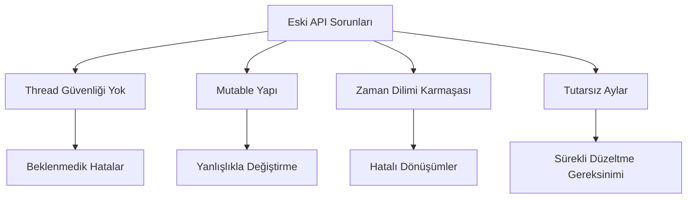

#### Kavram: Yeni API'nin Felsefesi

Java 8 ile gelen `java.time` paketi, aşağıdaki temel prensipler üzerine inşa edilmiştir:

- **Immutable (Değiştirilemez):** Tüm sınıflar immutable'dır. Bir kez oluşturulduktan sonra değiştirilemezler.
- **Thread-Safe:** Immutable yapı sayesinde doğal olarak thread-safe'dir.
- **ISO 8601 Uyumlu:** Uluslararası tarih ve zaman standardına tam uyumludur.
- **Açık ve Anlaşılır:** Sınıf isimleri ve metotlar, ne yaptıklarını net bir şekilde ifade eder.

#### Örnek: Eski ve Yeni API Karşılaştırması

Aşağıdaki örnek, eski ve yeni API arasındaki farkı açıkça göstermektedir:

<!-- CODE_META
Dosya: TarihKarsilastirma.java
Konu: Eski ve yeni API karşılaştırması
-->
```java
import java.util.Date;
import java.time.LocalDate;

public class TarihKarsilastirma {
    public static void main(String[] args) {
        // Eski yöntem - java.util.Date
        @SuppressWarnings("deprecation")
        Date eskiTarih = new Date(2023, 11, 25); // Dikkat: Ay 11 = Aralık, yıl 2023 = 123
        System.out.println("Eski API ile: " + eskiTarih);
        // Çıktı: Mon Dec 25 00:00:00 TRT 3923 (Yanlış yıl!)
        
        // Yeni yöntem - java.time.LocalDate
        LocalDate yeniTarih = LocalDate.of(2023, 12, 25);
        System.out.println("Yeni API ile: " + yeniTarih);
        // Çıktı: 2023-12-25 (Doğru ve anlaşılır)
    }
}
```

#### Uygulama: Şu Anki Tarihi Yazdırma

Aşağıdaki programı yazın ve çalıştırın:

<!-- CODE_META
Dosya: SuAnkiTarih.java
Konu: Yeni API ile şu anki tarihi yazdırma
-->
```java
import java.time.LocalDate;
import java.time.format.DateTimeFormatter;

public class SuAnkiTarih {
    public static void main(String[] args) {
        // Şu anki tarihi al
        LocalDate bugun = LocalDate.now();
        
        // Varsayılan formatta yazdır (ISO 8601)
        System.out.println("Bugünün tarihi: " + bugun);
        
        // Özel formatta yazdır
        DateTimeFormatter formatter = DateTimeFormatter.ofPattern("dd.MM.yyyy");
        String formatliTarih = bugun.format(formatter);
        System.out.println("Formatlı tarih: " + formatliTarih);
    }
}
```

> 📝 **Değerlendirme:** Neden yeni API tercih edilmelidir?
> 1. **Immutable yapı** sayesinde thread-safe çalışma
> 2. **ISO 8601 standardına uyum** sayesinde uluslararası uyumluluk
> 3. **Açık ve anlaşılır API** sayesinde daha az hata ve kolay bakım

---

### 2. Temel Sınıflar: `LocalDate`, `LocalTime`, `LocalDateTime`

#### Kavram: Sınıfların Amacı

Bu üç sınıf, günlük programlama ihtiyaçlarının %90'ını karşılar. Her biri belirli bir kullanım senaryosu için optimize edilmiştir:

- **`LocalDate`:** Sadece tarih bilgisi (yıl, ay, gün) içerir. Doğum günü, tatil tarihi gibi zaman bilgisinin önemsiz olduğu durumlar için idealdir.
- **`LocalTime`:** Sadece zaman bilgisi (saat, dakika, saniye, nanosaniye) içerir. Mesai başlangıç saati, yemek molası gibi durumlar için kullanılır.
- **`LocalDateTime`:** Hem tarih hem zaman bilgisini bir arada tutar. Etkinlik başlangıcı, uçuş saati gibi durumlar için idealdir.

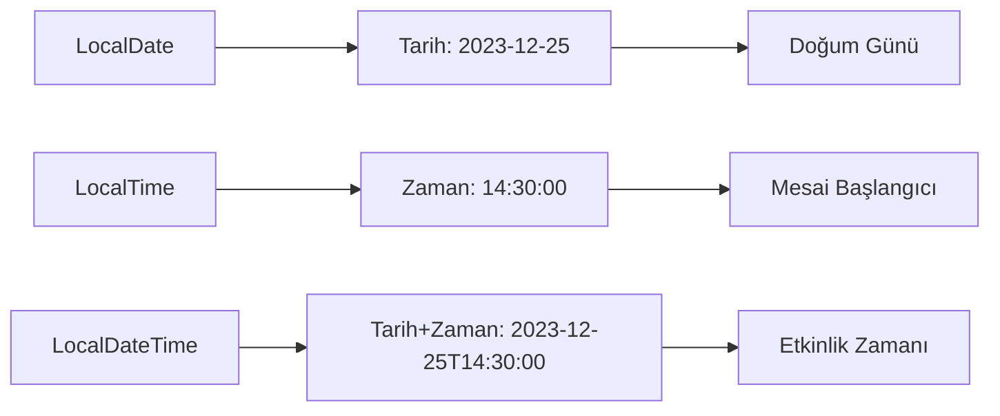

#### Örnek: Sınıfların Oluşturulması ve Kullanımı

<!-- CODE_META
Dosya: TemelSiniflar.java
Konu: LocalDate, LocalTime, LocalDateTime kullanımı
-->
```java
import java.time.LocalDate;
import java.time.LocalTime;
import java.time.LocalDateTime;
import java.time.Month;

public class TemelSiniflar {
    public static void main(String[] args) {
        // Şu anki değerleri alma
        LocalDate bugun = LocalDate.now();
        LocalTime suAn = LocalTime.now();
        LocalDateTime bugunVeSaat = LocalDateTime.now();
        
        System.out.println("Bugün: " + bugun);
        System.out.println("Şu an: " + suAn);
        System.out.println("Şu anki tarih ve saat: " + bugunVeSaat);
        
        // Özel değerler oluşturma
        LocalDate ozelTarih = LocalDate.of(2023, Month.DECEMBER, 25);
        LocalTime ozelZaman = LocalTime.of(14, 30, 0);
        LocalDateTime ozelZamanliTarih = LocalDateTime.of(ozelTarih, ozelZaman);
        
        System.out.println("\nÖzel tarih: " + ozelTarih);
        System.out.println("Özel zaman: " + ozelZaman);
        System.out.println("Özel tarih ve zaman: " + ozelZamanliTarih);
        
        // Parçalara erişim
        System.out.println("\n--- Parçalara Erişim ---");
        System.out.println("Yıl: " + bugun.getYear());
        System.out.println("Ay: " + bugun.getMonth());
        System.out.println("Ay (sayı): " + bugun.getMonthValue());
        System.out.println("Gün: " + bugun.getDayOfMonth());
        System.out.println("Haftanın günü: " + bugun.getDayOfWeek());
        System.out.println("Yılın günü: " + bugun.getDayOfYear());
        
        // Zaman parçaları
        System.out.println("\nSaat: " + suAn.getHour());
        System.out.println("Dakika: " + suAn.getMinute());
        System.out.println("Saniye: " + suAn.getSecond());
        System.out.println("Nanosaniye: " + suAn.getNano());
    }
}
```

#### Uygulama: Doğum Tarihi ve Saati Programı

Kullanıcıdan doğum tarihi ve saati bilgilerini alarak `LocalDateTime` nesnesi oluşturan bir program yazın:

<!-- CODE_META
Dosya: DogumZamani.java
Konu: Kullanıcıdan alınan bilgilerle LocalDateTime oluşturma
-->
```java
import java.time.LocalDate;
import java.time.LocalTime;
import java.time.LocalDateTime;
import java.util.Scanner;

public class DogumZamani {
    public static void main(String[] args) {
        Scanner scanner = new Scanner(System.in);
        
        System.out.println("=== Doğum Zamanı Bilgileri ===");
        
        // Tarih bilgilerini al
        System.out.print("Doğum yılınızı girin (örn: 1990): ");
        int yil = scanner.nextInt();
        
        System.out.print("Doğum ayınızı girin (1-12): ");
        int ay = scanner.nextInt();
        
        System.out.print("Doğum gününüzü girin (1-31): ");
        int gun = scanner.nextInt();
        
        // Zaman bilgilerini al
        System.out.print("Doğum saatinizi girin (0-23): ");
        int saat = scanner.nextInt();
        
        System.out.print("Doğum dakikanızı girin (0-59): ");
        int dakika = scanner.nextInt();
        
        // LocalDateTime oluştur
        LocalDate dogumTarihi = LocalDate.of(yil, ay, gun);
        LocalTime dogumZamani = LocalTime.of(saat, dakika);
        LocalDateTime dogumZamaniTarih = LocalDateTime.of(dogumTarihi, dogumZamani);
        
        System.out.println("\nDoğum zamanınız: " + dogumZamaniTarih);
        System.out.println("Bugün: " + LocalDateTime.now());
        
        scanner.close();
    }
}
```

> 📝 **Değerlendirme:** Aşağıdaki senaryolarda hangi sınıf kullanılmalıdır?
> - **Bir uçuşun kalkış saati:** `LocalDateTime` (hem tarih hem saat önemli)
> - **Bir kişinin doğum günü:** `LocalDate` (sadece tarih önemli)
> - **Bir etkinliğin başlangıç zamanı:** `LocalDateTime` (tarih ve saat birlikte gerekli)

---

### 3. Tarih/Zaman Biçimlendirme ve Ayrıştırma: `DateTimeFormatter`

#### Kavram: Formatlama ve Parse Etme

Tarih ve zaman nesneleriyle çalışırken iki temel işlem vardır:

1. **Formatlama (Formatting):** Bir `LocalDate`, `LocalTime` veya `LocalDateTime` nesnesini insan tarafından okunabilir bir metne dönüştürme.
2. **Ayrıştırma (Parsing):** Bir metni (String) uygun bir tarih/zaman nesnesine dönüştürme.

#### Kavram: Format Desenleri

`DateTimeFormatter` sınıfı, format desenleri oluşturmak için harf kodları kullanır:

| Harf | Anlamı | Örnek |
|------|--------|-------|
| y | Yıl | yy: 23, yyyy: 2023 |
| M | Ay | M: 12, MM: 12, MMM: Dec, MMMM: December |
| d | Gün | d: 5, dd: 05 |
| H | Saat (0-23) | H: 9, HH: 09 |
| m | Dakika | m: 5, mm: 05 |
| s | Saniye | s: 3, ss: 03 |

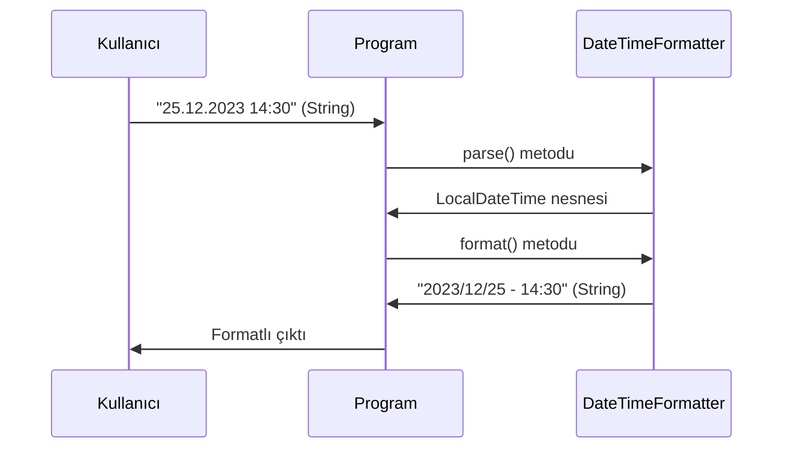

#### Örnek: Formatlama ve Parse Etme

<!-- CODE_META
Dosya: TarihFormatlama.java
Konu: DateTimeFormatter ile formatlama ve parse etme
-->
```java
import java.time.LocalDateTime;
import java.time.format.DateTimeFormatter;
import java.time.format.FormatStyle;
import java.util.Locale;

public class TarihFormatlama {
    public static void main(String[] args) {
        LocalDateTime simdi = LocalDateTime.now();
        
        System.out.println("=== Önceden Tanımlı Formatlar ===");
        
        // ISO formatları
        String isoDate = simdi.format(DateTimeFormatter.ISO_LOCAL_DATE);
        System.out.println("ISO Tarih: " + isoDate);
        
        String isoDateTime = simdi.format(DateTimeFormatter.ISO_LOCAL_DATE_TIME);
        System.out.println("ISO Tarih-Zaman: " + isoDateTime);
        
        // Yerel formatlar
        String kisaFormat = simdi.format(DateTimeFormatter.ofLocalizedDateTime(FormatStyle.SHORT));
        System.out.println("Kısa format: " + kisaFormat);
        
        String ortaFormat = simdi.format(DateTimeFormatter.ofLocalizedDateTime(FormatStyle.MEDIUM));
        System.out.println("Orta format: " + ortaFormat);
        
        System.out.println("\n=== Özel Desenler ===");
        
        // Özel desenler
        DateTimeFormatter ozelFormat1 = DateTimeFormatter.ofPattern("dd/MM/yyyy - HH:mm:ss");
        String formatli1 = simdi.format(ozelFormat1);
        System.out.println("Format 1: " + formatli1);
        
        DateTimeFormatter ozelFormat2 = DateTimeFormatter.ofPattern("yyyy.MM.dd G 'at' HH:mm:ss");
        String formatli2 = simdi.format(ozelFormat2);
        System.out.println("Format 2: " + formatli2);
        
        DateTimeFormatter ozelFormat3 = DateTimeFormatter.ofPattern("EEEE, MMMM d, yyyy");
        String formatli3 = simdi.format(ozelFormat3);
        System.out.println("Format 3: " + formatli3);
        
        System.out.println("\n=== String'den Tarih Oluşturma (Parse) ===");
        
        // String'den parse etme
        String tarihMetni = "25-12-2023 14:30";
        DateTimeFormatter parseFormat = DateTimeFormatter.ofPattern("dd-MM-yyyy HH:mm");
        LocalDateTime ayrismaTarihi = LocalDateTime.parse(tarihMetni, parseFormat);
        System.out.println("Ayrıştırılan tarih: " + ayrismaTarihi);
        
        // Farklı bir format
        String baskaTarih = "2023/12/25 14:30:45";
        DateTimeFormatter baskaFormat = DateTimeFormatter.ofPattern("yyyy/MM/dd HH:mm:ss");
        LocalDateTime baskaAyrisma = LocalDateTime.parse(baskaTarih, baskaFormat);
        System.out.println("Diğer ayrıştırma: " + baskaAyrisma);
    }
}
```

#### Uygulama: Tarih Dönüştürücü Programı

Kullanıcıdan "gg.AA.yyyy HH:mm" formatında bir tarih metni alın, bunu `LocalDateTime` nesnesine çevirin ve "yyyy/MM/dd - HH:mm" formatında ekrana yazdırın:

<!-- CODE_META
Dosya: TarihDonusturucu.java
Konu: Kullanıcı girdisini parse edip farklı formatta gösterme
-->
```java
import java.time.LocalDateTime;
import java.time.format.DateTimeFormatter;
import java.time.format.DateTimeParseException;
import java.util.Scanner;

public class TarihDonusturucu {
    public static void main(String[] args) {
        Scanner scanner = new Scanner(System.in);
        
        System.out.println("=== Tarih Dönüştürücü ===");
        System.out.println("Lütfen tarihi 'gg.AA.yyyy HH:mm' formatında girin:");
        System.out.println("Örnek: 25.12.2023 14:30");
        
        String girdi = scanner.nextLine();
        
        try {
            // Girdiyi parse et
            DateTimeFormatter girdiFormati = DateTimeFormatter.ofPattern("dd.MM.yyyy HH:mm");
            LocalDateTime tarih = LocalDateTime.parse(girdi, girdiFormati);
            
            // İstenen formata çevir
            DateTimeFormatter ciktiFormati = DateTimeFormatter.ofPattern("yyyy/MM/dd - HH:mm");
            String sonuc = tarih.format(ciktiFormati);
            
            System.out.println("\nDönüştürülen tarih: " + sonuc);
            
        } catch (DateTimeParseException e) {
            System.out.println("Hata: Geçersiz tarih formatı! Lütfen 'gg.AA.yyyy HH:mm' formatını kullanın.");
            System.out.println("Hata detayı: " + e.getMessage());
        }
        
        scanner.close();
    }
}
```

> 📝 **Değerlendirme:** `DateTimeFormatter.ofPattern()` içinde kullanılan harflerin anlamları:
> - **y (year):** Yıl bilgisi. `yy` = 23 (2 haneli), `yyyy` = 2023 (4 haneli)
> - **M (month):** Ay bilgisi. `M` = 12, `MM` = 12, `MMM` = Dec, `MMMM` = December
> - **d (day):** Gün bilgisi. `d` = 5, `dd` = 05
> - **H (hour):** Saat (0-23). `H` = 9, `HH` = 09
> - **m (minute):** Dakika. `m` = 5, `mm` = 05
> - **s (second):** Saniye. `s` = 3, `ss` = 03

---

### 4. Tarih ve Zaman Hesaplamaları: Ekleme, Çıkarma ve Fark Bulma

#### Kavram: Artimetik İşlemler

Java 8+ API'si, tarih ve zaman üzerinde kolayca aritmetik işlemler yapmanızı sağlar:

- **`plus` metotları:** `plusDays()`, `plusWeeks()`, `plusMonths()`, `plusYears()`
- **`minus` metotları:** `minusDays()`, `minusWeeks()`, `minusMonths()`, `minusYears()`

#### Kavram: Period ve Duration

İki tarih veya zaman arasındaki farkı hesaplamak için iki özel sınıf kullanılır:

- **`Period`:** Tarih tabanlı farklar için (yıl, ay, gün)
- **`Duration`:** Zaman tabanlı farklar için (saat, dakika, saniye, nanosaniye)

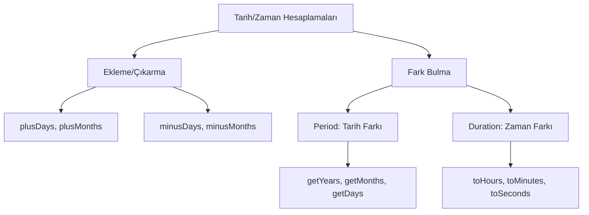

#### Örnek: Tarih/Zaman Hesaplamaları

<!-- CODE_META
Dosya: TarihHesaplamalari.java
Konu: Tarih ve zaman hesaplamaları
-->
```java
import java.time.*;
import java.time.temporal.ChronoUnit;

public class TarihHesaplamalari {
    public static void main(String[] args) {
        LocalDate bugun = LocalDate.now();
        
        System.out.println("=== Tarih Ekleme/Çıkarma ===");
        
        // Gün ekleme/çıkarma
        LocalDate birHaftaSonra = bugun.plusWeeks(1);
        LocalDate onGunOnce = bugun.minusDays(10);
        
        System.out.println("Bugün: " + bugun);
        System.out.println("1 hafta sonra: " + birHaftaSonra);
        System.out.println("10 gün önce: " + onGunOnce);
        
        // Ay ve yıl işlemleri
        LocalDate ucAyOnce = bugun.minusMonths(3);
        LocalDate ikiYilSonra = bugun.plusYears(2);
        
        System.out.println("3 ay önce: " + ucAyOnce);
        System.out.println("2 yıl sonra: " + ikiYilSonra);
        
        System.out.println("\n=== Period ile Tarih Farkı ===");
        
        // Period kullanımı
        LocalDate dogumGunu = LocalDate.of(1990, Month.MARCH, 15);
        Period yas = Period.between(dogumGunu, bugun);
        
        System.out.println("Doğum günü: " + dogumGunu);
        System.out.println("Yaş: " + yas.getYears() + " yıl " + 
                           yas.getMonths() + " ay " + yas.getDays() + " gün");
        
        System.out.println("\n=== Duration ile Zaman Farkı ===");
        
        // Duration kullanımı
        LocalTime baslangic = LocalTime.of(9, 30);
        LocalTime bitis = LocalTime.of(17, 45);
        Duration calismaSuresi = Duration.between(baslangic, bitis);
        
        System.out.println("Başlangıç: " + baslangic);
        System.out.println("Bitiş: " + bitis);
        System.out.println("Çalışma süresi: " + calismaSuresi.toHours() + " saat " + 
                           calismaSuresi.toMinutesPart() + " dakika");
        
        System.out.println("\n=== ChronoUnit ile Hesaplama ===");
        
        // ChronoUnit kullanımı
        long gunFarki = ChronoUnit.DAYS.between(dogumGunu, bugun);
        long ayFarki = ChronoUnit.MONTHS.between(dogumGunu, bugun);
        long yilFarki = ChronoUnit.YEARS.between(dogumGunu, bugun);
        
        System.out.println("Toplam gün: " + gunFarki);
        System.out.println("Toplam ay: " + ayFarki);
        System.out.println("Toplam yıl: " + yilFarki);
    }
}
```

#### Uygulama: İki Tarih Arasındaki Farkı Hesaplama

Kullanıcıdan iki farklı tarih alın ve aralarındaki farkı yıl, ay, gün cinsinden hesaplayın:

<!-- CODE_META
Dosya: TarihFarkHesapla.java
Konu: İki tarih arasındaki farkı hesaplama
-->
```java
import java.time.LocalDate;
import java.time.Period;
import java.time.format.DateTimeFormatter;
import java.time.format.DateTimeParseException;
import java.util.Scanner;

public class TarihFarkHesapla {
    public static void main(String[] args) {
        Scanner scanner = new Scanner(System.in);
        DateTimeFormatter formatter = DateTimeFormatter.ofPattern("dd.MM.yyyy");
        
        System.out.println("=== İki Tarih Arasındaki Fark ===");
        
        try {
            // İlk tarihi al
            System.out.print("İlk tarihi girin (gg.AA.yyyy): ");
            String ilkTarihStr = scanner.nextLine();
            LocalDate ilkTarih = LocalDate.parse(ilkTarihStr, formatter);
            
            // İkinci tarihi al
            System.out.print("İkinci tarihi girin (gg.AA.yyyy): ");
            String ikinciTarihStr = scanner.nextLine();
            LocalDate ikinciTarih = LocalDate.parse(ikinciTarihStr, formatter);
            
            // Farkı hesapla
            Period fark = Period.between(ilkTarih, ikinciTarih);
            
            System.out.println("\n=== Sonuç ===");
            System.out.println("İlk tarih: " + ilkTarih);
            System.out.println("İkinci tarih: " + ikinciTarih);
            System.out.println("Fark: " + Math.abs(fark.getYears()) + " yıl " + 
                               Math.abs(fark.getMonths()) + " ay " + 
                               Math.abs(fark.getDays()) + " gün");
            
            // Hangi tarihin daha büyük olduğunu göster
            if (ilkTarih.isBefore(ikinciTarih)) {
                System.out.println("İlk tarih, ikinci tarihten önce.");
            } else if (ilkTarih.isAfter(ikinciTarih)) {
                System.out.println("İlk tarih, ikinci tarihten sonra.");
            } else {
                System.out.println("İki tarih aynı.");
            }
            
        } catch (DateTimeParseException e) {
            System.out.println("Hata: Geçersiz tarih formatı!");
        }
        
        scanner.close();
    }
}
```

> 📝 **Değerlendirme:** `Period` ve `Duration` arasındaki temel fark:
> - **`Period`:** Tarih tabanlı farklar için kullanılır. Yıl, ay, gün cinsinden sonuç verir. Örneğin: 2 yıl 3 ay 5 gün
> - **`Duration`:** Zaman tabanlı farklar için kullanılır. Saat, dakika, saniye, nanosaniye cinsinden sonuç verir. Örneğin: 8 saat 15 dakika
> 
> **Hangi durumda hangisini kullanırsınız?**
> - **`Period`:** İki tarih arasındaki farkı yıl/ay/gün olarak hesaplamak istediğinizde (örn: yaş hesaplama)
> - **`Duration`:** İki zaman arasındaki farkı saat/dakika olarak hesaplamak istediğinizde (örn: çalışma süresi)

---

### 5. Zaman Dilimleri ve Gelecek/Zamanlanmış İşlemler

#### Kavram: Zaman Dilimleri

Dünya üzerinde farklı bölgeler farklı zaman dilimlerini kullanır. `ZonedDateTime` sınıfı, zaman dilimi bilgisini de içeren tarih-zaman nesneleri oluşturmanızı sağlar.

#### Kavram: ChronoUnit ile Esnek Hesaplamalar

`ChronoUnit` enum'u, `Period` ve `Duration`'a alternatif olarak daha esnek ve okunabilir bir hesaplama yöntemi sunar.

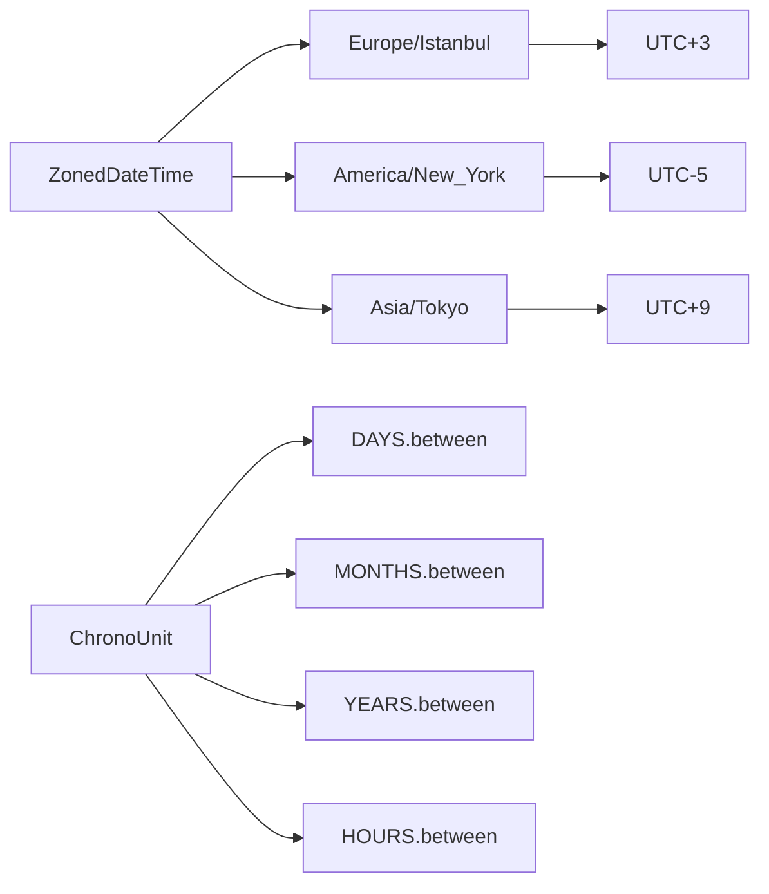

#### Örnek: Zaman Dilimleri ve Gelişmiş Hesaplamalar

<!-- CODE_META
Dosya: ZamanDilimleri.java
Konu: Zaman dilimleri ve ChronoUnit kullanımı
-->
```java
import java.time.*;
import java.time.temporal.ChronoUnit;
import java.util.Set;

public class ZamanDilimleri {
    public static void main(String[] args) {
        System.out.println("=== Zaman Dilimleri ===");
        
        // Mevcut zaman dilimlerini listeleme
        System.out.println("Mevcut zaman dilimleri (ilk 5):");
        Set<String> zoneIds = ZoneId.getAvailableZoneIds();
        zoneIds.stream()
               .filter(id -> id.contains("Europe") || id.contains("America") || id.contains("Asia"))
               .limit(5)
               .forEach(System.out::println);
        
        System.out.println("\n=== Farklı Şehirlerde Şu Anki Zaman ===");
        
        // Farklı zaman dilimlerinde şu anki zaman
        ZonedDateTime istanbul = ZonedDateTime.now(ZoneId.of("Europe/Istanbul"));
        ZonedDateTime newYork = ZonedDateTime.now(ZoneId.of("America/New_York"));
        ZonedDateTime tokyo = ZonedDateTime.now(ZoneId.of("Asia/Tokyo"));
        ZonedDateTime londra = ZonedDateTime.now(ZoneId.of("Europe/London"));
        
        System.out.println("İstanbul: " + istanbul);
        System.out.println("New York: " + newYork);
        System.out.println("Tokyo: " + tokyo);
        System.out.println("Londra: " + londra);
        
        System.out.println("\n=== Zaman Dilimi Dönüşümü ===");
        
        // Bir zamanı başka bir zaman dilimine çevirme
        ZonedDateTime istanbulZamani = ZonedDateTime.now(ZoneId.of("Europe/Istanbul"));
        ZonedDateTime newYorkZamani = istanbulZamani.withZoneSameInstant(ZoneId.of("America/New_York"));
        
        System.out.println("İstanbul'da şu an: " + istanbulZamani);
        System.out.println("New York'ta aynı an: " + newYorkZamani);
        
        System.out.println("\n=== ChronoUnit ile Hesaplamalar ===");
        
        // ChronoUnit kullanımı
        LocalDate yilbasi = LocalDate.of(2025, Month.JANUARY, 1);
        LocalDate bugun = LocalDate.now();
        
        long kalanGun = ChronoUnit.DAYS.between(bugun, yilbasi);
        long kalanAy = ChronoUnit.MONTHS.between(bugun, yilbasi);
        long kalanHafta = ChronoUnit.WEEKS.between(bugun, yilbasi);
        
        System.out.println("Yılbaşına kalan gün: " + kalanGun);
        System.out.println("Yılbaşına kalan ay: " + kalanAy);
        System.out.println("Yılbaşına kalan hafta: " + kalanHafta);
        
        // Tarih karşılaştırmaları
        boolean onceMi = bugun.isBefore(yilbasi);
        boolean sonraMi = bugun.isAfter(yilbasi);
        boolean esitMi = bugun.isEqual(yilbasi);
        
        System.out.println("\nYılbaşından önce mi? " + onceMi);
        System.out.println("Yılbaşından sonra mi? " + sonraMi);
        System.out.println("Yılbaşına eşit mi? " + esitMi);
        
        // Saat bazlı hesaplama
        LocalTime simdi = LocalTime.now();
        LocalTime geceYarisi = LocalTime.MIDNIGHT;
        long kalanSaat = ChronoUnit.HOURS.between(simdi, geceYarisi);
        long kalanDakika = ChronoUnit.MINUTES.between(simdi, geceYarisi);
        
        System.out.println("\nGece yarısına kalan saat: " + kalanSaat);
        System.out.println("Gece yarısına kalan dakika: " + kalanDakika);
    }
}
```

#### Uygulama: Hedef Tarih ve Zaman Dilimi Programı

Kullanıcıdan bir hedef tarih alın ve bu tarihe kalan süreyi hesaplayın. Ayrıca farklı şehirlerdeki anlık zamanı gösterin:

<!-- CODE_META
Dosya: HedefTarihSuresi.java
Konu: Hedef tarihe kalan süre ve zaman dilimleri
-->
```java
import java.time.*;
import java.time.format.DateTimeFormatter;
import java.time.format.DateTimeParseException;
import java.time.temporal.ChronoUnit;
import java.util.Scanner;

public class HedefTari

# Bölüm 13: Paketler, import Kullanimi ve Proje Duzeni

## 13.1 Java Paket Sistemi, Import Mekanizması ve Modüler Proje Yapılandırması

Bu bölümde, Java programlama dilinde sınıfların organize edilmesini sağlayan paket sistemini, sınıflar arası erişimi kolaylaştıran import mekanizmasını ve profesyonel projelerde kullanılan modüler yapılandırma tekniklerini öğreneceksiniz. Java'da büyük ölçekli projeler geliştirirken, kodun düzenli, bakımı kolay ve yeniden kullanılabilir olması için bu kavramları doğru anlamak kritik öneme sahiptir.

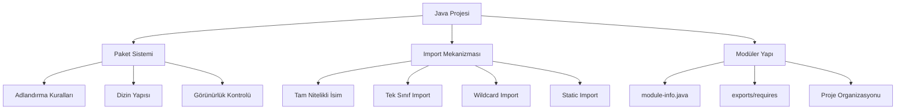

### Java Paket Sisteminin Temelleri ve Adlandırma Kuralları

**Kavram**: Paket, Java'da ilgili sınıfları, arayüzleri ve alt paketleri bir arada tutan bir organizasyon birimidir. Paketler sayesinde:

- İsim çakışmaları önlenir (farklı paketlerde aynı isimde sınıflar olabilir)
- Kod organizasyonu sağlanır
- Erişim kontrolü yapılabilir (protected ve default erişim seviyeleri paket tabanlıdır)
- Kodun yeniden kullanılabilirliği artar

**Adlandırma Kuralları**: Java'da paket adlandırması için ters domain adı (reverse domain name) kuralı kullanılır. Bu kural, paket isimlerinin benzersiz olmasını sağlar:

```
com.sirket.proje.altmodul
org.kurum.uygulama.bilesen
edu.universite.bolum.ders
```

> **Önemli**: Paket adları tamamen küçük harflerle yazılmalıdır. Kelimeler arasında alt çizgi (_) kullanılmamalıdır. Java standart kütüphanesinde `java.util`, `java.io`, `java.net` gibi paketler bu kurala uyar.

**Standart Java Paketleri**:

| Paket | Açıklama | Örnek Sınıflar |
|-------|----------|----------------|
| `java.lang` | Temel dil desteği (otomatik import edilir) | String, Math, System |
| `java.util` | Yardımcı araçlar ve veri yapıları | ArrayList, HashMap, Date |
| `java.io` | Giriş/çıkış işlemleri | File, InputStream, OutputStream |
| `java.net` | Ağ işlemleri | URL, Socket, ServerSocket |
| `java.sql` | Veritabanı işlemleri | Connection, Statement, ResultSet |

**Uygulama**: Kendi paket hiyerarşimizi oluşturalım:

<!-- CODE_META
id: bolum-13_kod01
chapter_id: bolum-13
kind: example
title: "Kod 1"
file: "Ornek00.java"
mainClass: Ornek00
extract: true
test: compile
github: true
qr: dual
-->

```java
// com/egitim/uygulama/model/Ogrenci.java
package com.egitim.uygulama.model;

public class Ogrenci {
    private String ad;
    private String soyad;
    private int ogrenciNo;
    
    public Ogrenci(String ad, String soyad, int ogrenciNo) {
        this.ad = ad;
        this.soyad = soyad;
        this.ogrenciNo = ogrenciNo;
    }
    
    public String getAd() {
        return ad;
    }
}
```

<!-- CODE_META: Dosya: com/egitim/uygulama/model/Ogrenci.java, Konu: Temel paket yapısı, Zorluk: Başlangıç -->

```java
// com/egitim/uygulama/service/OgrenciService.java
package com.egitim.uygulama.service;

import com.egitim.uygulama.model.Ogrenci;
import java.util.ArrayList;
import java.util.List;

public class OgrenciService {
    private List<Ogrenci> ogrenciler = new ArrayList<>();
    
    public void ogrenciEkle(Ogrenci ogrenci) {
        ogrenciler.add(ogrenci);
    }
    
    public List<Ogrenci> tumOgrencileriGetir() {
        return new ArrayList<>(ogrenciler);
    }
}
```

<!-- CODE_META: Dosya: com/egitim/uygulama/service/OgrenciService.java, Konu: Paketler arası import kullanımı, Zorluk: Orta -->

**Değerlendirme**: Aşağıdaki paket adlandırmalarından hangileri geçerlidir?

<!-- CODE_META
id: bolum-13_kod02
chapter_id: bolum-13
kind: example
title: "Kod 2"
file: "Ornek01.java"
mainClass: Ornek01
extract: true
test: compile
github: true
qr: dual
-->

```java
// Geçerli mi?
com.myCompany.app        // GEÇERLİ: Ters domain adı kuralına uyuyor
com.my_company.app       // GEÇERSİZ: Alt çizgi kullanılmış
COM.Example.Project      // GEÇERSİZ: Büyük harf kullanılmış
org.teknik.egitim.bolum1 // GEÇERLİ: Tümü küçük harf ve nokta ile ayrılmış
```

### Paket Bildirimi ve Dizin Yapısı ile Çalışma

**Kavram**: Java'da `package` anahtar kelimesi ile bir sınıfın hangi pakete ait olduğu bildirilir. Kritik bir kural vardır: **Fiziksel dizin yapısı ile paket yapısı birebir eşleşmelidir**.

Örneğin, `com.egitim.uygulama.model` paketinde bir sınıf varsa, bu sınıfın kaynak kodu `com/egitim/uygulama/model/` dizininde bulunmalıdır.

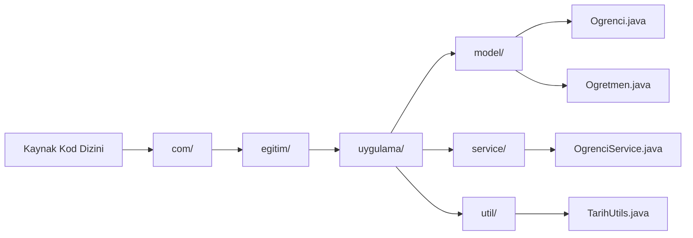

**Örnek**: Çok katmanlı bir projede dizin organizasyonu:

```
proje/
├── src/
│   ├── main/
│   │   └── java/
│   │       ├── com/
│   │       │   └── egitim/
│   │       │       ├── Main.java
│   │       │       ├── model/
│   │       │       │   ├── Kullanici.java
│   │       │       │   └── Urun.java
│   │       │       ├── service/
│   │       │       │   ├── KullaniciService.java
│   │       │       │   └── UrunService.java
│   │       │       └── util/
│   │       │           └── VeritabaniBaglantisi.java
│   │       └── resources/
│   │           ├── application.properties
│   │           └── messages.properties
│   └── test/
│       └── java/
│           └── com/
│               └── egitim/
│                   ├── service/
│                   │   ├── KullaniciServiceTest.java
│                   │   └── UrunServiceTest.java
│                   └── model/
│                       └── KullaniciTest.java
├── lib/
│   └── mysql-connector.jar
└── README.md
```

**Uygulama**: Üç farklı pakette sınıf oluşturma ve derleme:

<!-- CODE_META: Dosya: com/egitim/arac/Kasa.java, Konu: Paket bildirimi ve sınıf yapısı, Zorluk: Başlangıç -->

```java
// Dosya: com/egitim/arac/Kasa.java
package com.egitim.arac;

public class Kasa {
    private String renk;
    private String malzeme;
    private double agirlik;
    
    public Kasa(String renk, String malzeme, double agirlik) {
        this.renk = renk;
        this.malzeme = malzeme;
        this.agirlik = agirlik;
    }
    
    public String bilgiVer() {
        return String.format("Kasa: %s, %s, %.1f kg", renk, malzeme, agirlik);
    }
}
```

<!-- CODE_META: Dosya: com/egitim/motor/Motor.java, Konu: Farklı pakette sınıf tanımı, Zorluk: Başlangıç -->

```java
// Dosya: com/egitim/motor/Motor.java
package com.egitim.motor;

public class Motor {
    private int hacim;
    private int beygirGucu;
    private String yakitTipi;
    
    public Motor(int hacim, int beygirGucu, String yakitTipi) {
        this.hacim = hacim;
        this.beygirGucu = beygirGucu;
        this.yakitTipi = yakitTipi;
    }
    
    public String bilgiVer() {
        return String.format("Motor: %d cc, %d HP, %s", hacim, beygirGucu, yakitTipi);
    }
}
```

<!-- CODE_META: Dosya: com/egitim/arac/Araba.java, Konu: Diğer paketlerden sınıf kullanımı, Zorluk: Orta -->

```java
// Dosya: com/egitim/arac/Araba.java
package com.egitim.arac;

import com.egitim.motor.Motor;

public class Araba {
    private String marka;
    private String model;
    private Kasa kasa;
    private Motor motor;
    
    public Araba(String marka, String model, Kasa kasa, Motor motor) {
        this.marka = marka;
        this.model = model;
        this.kasa = kasa;
        this.motor = motor;
    }
    
    public void arabaBilgisi() {
        System.out.println("Araba: " + marka + " " + model);
        System.out.println(kasa.bilgiVer());
        System.out.println(motor.bilgiVer());
    }
}
```

**Derleme ve Çalıştırma**:

```bash
## 13.2 Kaynak kodları derleme
javac -d out com/egitim/arac/Kasa.java
javac -d out com/egitim/motor/Motor.java
javac -d out com/egitim/arac/Araba.java

## 13.3 Ana sınıf oluşturma
cat > com/egitim/Main.java << 'EOF'
package com.egitim;

import com.egitim.arac.Araba;
import com.egitim.arac.Kasa;
import com.egitim.motor.Motor;

public class Main {
    public static void main(String[] args) {
        Kasa kasa = new Kasa("Kırmızı", "Çelik", 1200);
        Motor motor = new Motor(1600, 110, "Benzin");
        Araba araba = new Araba("Toyota", "Corolla", kasa, motor);
        araba.arabaBilgisi();
    }
}
EOF

## 13.4 Derleme ve çalıştırma
javac -d out com/egitim/Main.java
java -cp out com.egitim.Main
```

**Değerlendirme**: Aşağıdaki hatalı durumu inceleyelim:

<!-- CODE_META
id: bolum-13_kod03
chapter_id: bolum-13
kind: example
title: "Kod 3"
file: "Ornek02.java"
mainClass: Ornek02
extract: true
test: compile
github: true
qr: dual
-->

```java
// HATALI: Dosya com/egitim/yanlis/YanlisKonum.java
// Fiziksel konum: com/egitim/yanlis/
package com.egitim.dogru; // HATA: Paket adı ile dizin adı uyuşmuyor

public class YanlisKonum {
    // Bu sınıf derlenemez çünkü paket bildirimi ile fiziksel konum eşleşmiyor
}
```

```bash
## 13.5 Derleme hatası:
## 13.6 javac: error: package com.egitim.dogru does not exist
## 13.7 (expected file: com/egitim/dogru/YanlisKonum.java)
```

### Import Mekanizması ve Kullanım Şekilleri

**Kavram**: `import` deyimi, başka paketlerdeki sınıflara erişmek için kullanılır. Java'da üç farklı import yöntemi vardır:

1. **Tam Nitelikli İsim (Fully Qualified Name)**: Sınıfın tam paket yolu ile kullanılması
2. **Tek Sınıf Import**: Belirli bir sınıfın import edilmesi
3. **Wildcard Import**: Bir paketteki tüm sınıfların import edilmesi

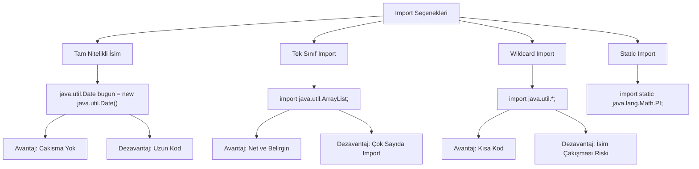

**Uygulama**: Üç farklı import türünü karşılaştırmalı gösterelim:

<!-- CODE_META: Dosya: ImportOrnekleri.java, Konu: Farklı import türlerinin karşılaştırılması, Zorluk: Orta -->

```java
// Dosya: ImportOrnekleri.java
import java.util.ArrayList;        // Tek sınıf import
import java.util.*;                // Wildcard import
import java.util.Date;             // java.util.Date
import java.sql.Date;              // java.sql.Date - ÇAKIŞMA!
import static java.lang.Math.PI;   // Static import

public class ImportOrnekleri {
    
    // Tam nitelikli isim kullanımı
    public void tamNitelikliIsim() {
        java.util.Date bugun = new java.util.Date();
        java.util.ArrayList<String> liste = new java.util.ArrayList<>();
        System.out.println("Tam nitelikli isim: " + bugun);
    }
    
    // Tek sınıf import kullanımı
    public void tekSinifImport() {
        ArrayList<String> liste = new ArrayList<>();
        liste.add("Java");
        liste.add("Python");
        System.out.println("Tek sınıf import: " + liste);
    }
    
    // Wildcard import kullanımı
    public void wildcardImport() {
        ArrayList<Integer> sayilar = new ArrayList<>();
        HashMap<String, Integer> map = new HashMap<>();
        HashSet<String> set = new HashSet<>();
        System.out.println("Wildcard import ile çalışıyor");
    }
    
    // Çakışan import durumu - ÇÖZÜM
    public void cakisanImport() {
        // java.util.Date kullanmak için tam nitelikli isim
        java.util.Date utilDate = new java.util.Date();
        
        // java.sql.Date kullanmak için tam nitelikli isim
        java.sql.Date sqlDate = new java.sql.Date(System.currentTimeMillis());
        
        System.out.println("Util Date: " + utilDate);
        System.out.println("SQL Date: " + sqlDate);
    }
    
    // Static import kullanımı
    public double daireAlani(double yaricap) {
        return PI * yaricap * yaricap;  // Math.PI yerine direkt PI
    }
    
    public static void main(String[] args) {
        ImportOrnekleri ornek = new ImportOrnekleri();
        ornek.tamNitelikliIsim();
        ornek.tekSinifImport();
        ornek.wildcardImport();
        ornek.cakisanImport();
        System.out.println("Daire alanı: " + ornek.daireAlani(5));
    }
}
```

> **Önemli Not**: `java.lang` paketindeki tüm sınıflar (String, System, Math vb.) otomatik olarak import edilir. Bu nedenle bu sınıfları import etmenize gerek yoktur.

**Değerlendirme**: Çakışan import durumlarını çözme alıştırması:

<!-- CODE_META
id: bolum-13_kod04
chapter_id: bolum-13
kind: example
title: "Kod 4"
file: "Ornek03.java"
mainClass: Ornek03
extract: true
test: compile
github: true
qr: dual
-->

```java
// Problem: Hem java.util.Date hem java.sql.Date kullanılacak
// Çözüm: Birini import et, diğerini tam nitelikli isimle kullan

import java.util.Date;  // Birini import et

public class TarihIslemleri {
    public void tarihleriKarsilastir() {
        Date utilDate = new Date();  // java.util.Date
        
        // java.sql.Date için tam nitelikli isim
        java.sql.Date sqlDate = new java.sql.Date(System.currentTimeMillis());
        
        System.out.println("Util Date: " + utilDate);
        System.out.println("SQL Date: " + sqlDate);
    }
}
```

### Static Import ve Özel Kullanım Durumları

**Kavram**: `import static` ifadesi, bir sınıftaki statik üyelere (sabitler ve statik metotlar) doğrudan sınıf adı kullanmadan erişmeyi sağlar. Bu özellik özellikle matematiksel işlemler, test framework'leri (JUnit) ve sabit tanımlamalarında kullanışlıdır.

**Örnek**: Math sınıfı sabitlerinin ve metotlarının static import ile kullanımı:

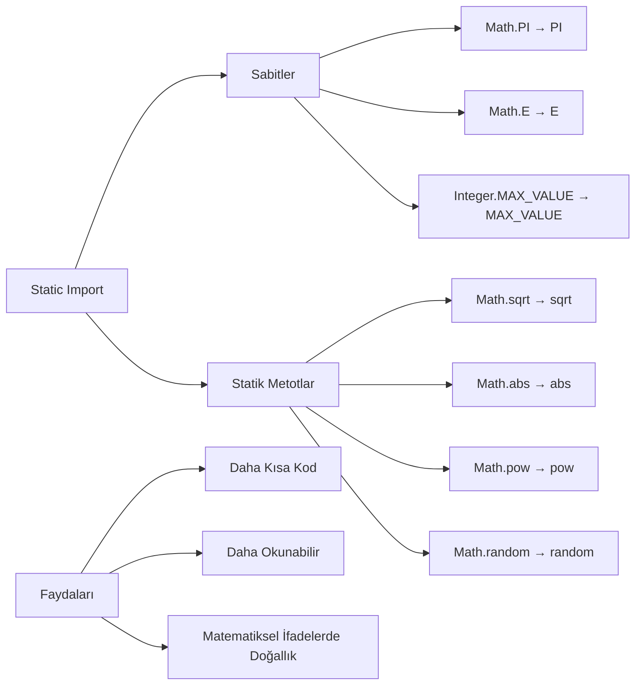

**Uygulama**: Static import öncesi ve sonrası kod karşılaştırması:

<!-- CODE_META: Dosya: StaticImportKarsilastirma.java, Konu: Static import kullanımı karşılaştırması, Zorluk: Orta -->

```java
// Dosya: StaticImportKarsilastirma.java

// Static import OLMADAN
public class StaticImportKarsilastirma {
    
    public void staticImportOlmadan() {
        // Math sınıfını kullanmak zorundayız
        double pi = Math.PI;
        double eSayisi = Math.E;
        
        double kareKok = Math.sqrt(25);
        double mutlakDeger = Math.abs(-10);
        double usAlma = Math.pow(2, 3);
        double rastgeleSayi = Math.random();
        
        System.out.println("PI: " + pi);
        System.out.println("Karekök(25): " + kareKok);
        System.out.println("2^3: " + usAlma);
    }
}
```

<!-- CODE_META: Dosya: StaticImportIle.java, Konu: Static import kullanımı, Zorluk: Orta -->

```java
// Dosya: StaticImportIle.java
import static java.lang.Math.PI;
import static java.lang.Math.E;
import static java.lang.Math.sqrt;
import static java.lang.Math.abs;
import static java.lang.Math.pow;
import static java.lang.Math.random;
// Veya: import static java.lang.Math.*;

public class StaticImportIle {
    
    public void staticImportIle() {
        // Doğrudan kullanım
        double pi = PI;
        double eSayisi = E;
        
        double kareKok = sqrt(25);
        double mutlakDeger = abs(-10);
        double usAlma = pow(2, 3);
        double rastgeleSayi = random();
        
        System.out.println("PI: " + pi);
        System.out.println("Karekök(25): " + kareKok);
        System.out.println("2^3: " + usAlma);
    }
    
    // Pratik kullanım örneği: Geometrik hesaplamalar
    public double daireAlani(double yaricap) {
        return PI * pow(yaricap, 2);
    }
    
    public double kureHacmi(double yaricap) {
        return (4.0 / 3.0) * PI * pow(yaricap, 3);
    }
    
    public double hipotenus(double a, double b) {
        return sqrt(pow(a, 2) + pow(b, 2));
    }
}
```

**Static Import'un Aşırı Kullanımının Dezavantajları**:

<!-- CODE_META
id: bolum-13_kod05
chapter_id: bolum-13
kind: example
title: "Kod 5"
file: "Ornek04.java"
mainClass: Ornek04
extract: true
test: compile
github: true
qr: dual
-->

```java
// KÖTÜ ÖRNEK: Aşırı static import kullanımı
import static java.lang.Math.*;
import static java.lang.System.*;
import static java.lang.Integer.*;

public class KotuOrnek {
    public void kotuKullanim() {
        // Hangi sınıftan geldiği belli değil
        out.println(MAX_VALUE);  // System.out mi? Integer.MAX_VALUE mi?
        out.println(PI);         // Açık, Math.PI olduğu belli
        out.println(parseInt("123")); // Integer.parseInt
        
        // Okunabilirlik sorunu: Kodun kaynağı belirsiz
        double sonuc = sqrt(pow(abs(-5), 2) + pow(abs(3), 2));
    }
}

// İYİ ÖRNEK: Dengeli kullanım
import static java.lang.Math.PI;
import static java.lang.Math.sqrt;
import static java.lang.Math.pow;

public class IyiOrnek {
    public void dengeliKullanim() {
        double alan = PI * pow(5, 2);  // Açık ve okunabilir
        double kok = sqrt(25);          // Matematiksel ifade doğal
        
        // System.out için static import kullanma
        System.out.println("Alan: " + alan);
        
        // Integer.parseInt için static import kullanma
        int sayi = Integer.parseInt("123");
    }
}
```

> **Tavsiye**: Static import'u yalnızca okunabilirliği belirgin şekilde artırdığı durumlarda kullanın. Özellikle matematiksel hesaplamalar, test sabitleri ve sık kullanılan yardımcı metotlar için idealdir. Ancak aşırı kullanımı kodun kaynağını belirsizleştirir.

### Modüler Proje Yapılandırması ve Best Practices

**Kavram**: Java 9 ile birlikte gelen modül sistemi (Project Jigsaw), büyük ölçekli projelerde daha iyi bir yapılandırma sağlar. Modüler yapı, hangi paketlerin dışa açılacağını (exports) ve hangi modüllerin kullanılacağını (requires) belirler.

**Maven/Gradle Proje Yapısı**: Modern Java projelerinde standart dizin yapısı:

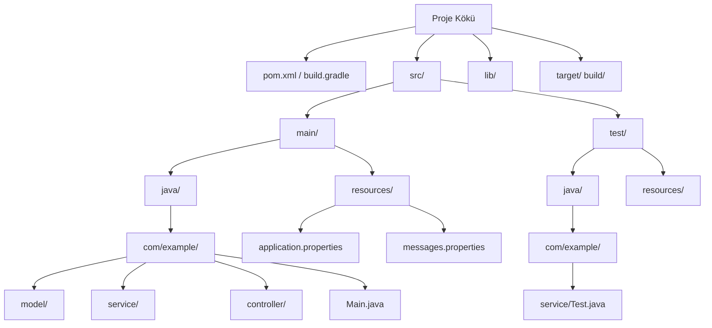

**Uygulama**: module-info.java ile modül tanımlama:

<!-- CODE_META: Dosya: module-info.java, Konu: Java modül tanımlaması, Zorluk: İleri -->

```java
// Dosya: module-info.java
module com.egitim.uygulama {
    // Dışa açılan paketler
    exports com.egitim.uygulama.api;
    exports com.egitim.uygulama.model;
    
    // Gerekli modüller
    requires java.sql;
    requires java.logging;
    requires transitive java.desktop;
    
    // İsteğe bağlı modüller
    requires static java.compiler;
    
    // Servis sağlayıcı
    provides com.egitim.uygulama.spi.Plugin 
        with com.egitim.uygulama.plugins.TemelPlugin;
    
    // Servis tüketici
    uses com.egitim.uygulama.spi.Plugin;
}
```

<!-- CODE_META: Dosya: com/egitim/uygulama/api/KullaniciApi.java, Konu: Modül içinde API sınıfı, Zorluk: İleri -->

```java
// Dosya: com/egitim/uygulama/api/KullaniciApi.java
package com.egitim.uygulama.api;

import com.egitim.uygulama.model.Kullanici;
import java.util.List;

public interface KullaniciApi {
    Kullanici kullaniciBul(Long id);
    List<Kullanici> tumKullanicilariGetir();
    Kullanici kullaniciKaydet(Kullanici kullanici);
    void kullaniciSil(Long id);
}
```

**Proje Yapısı Hatalarını Bulma Alıştırması**:

<!-- CODE_META
id: bolum-13_kod06
chapter_id: bolum-13
kind: example
title: "Kod 6"
file: "src/main/java/com/example/Main.java"
mainClass: Main
extract: true
test: compile
github: true
qr: dual
-->

```java
// HATA 1: Eksik dizin yapısı
// Dosya: src/main/java/com/example/Main.java
package com.example.uygulama; // HATA: Dizin com/example/ ama paket com.example.uygulama

public class Main {
    public static void main(String[] args) {
        System.out.println("Merhaba");
    }
}

// HATA 2: Yanlış modül tanımı
// Dosya: module-info.java
module com.example.uygulama {
    exports com.example.model; // HATA: com.example.model paketi yok
    requires java.nonexistent; // HATA: Olmayan modül
}

// HATA 3: Erişim hatası
// Dosya: com/example/model/GizliSinif.java
package com.example.model;

class GizliSinif { // HATA: package-private, dışarıdan erişilemez
    public void metot() {
        System.out.println("Gizli metot");
    }
}
```

### Paket ve Import Yönetiminde İleri Düzey Konular

**Kavram**: Paket görünürlüğü, erişim belirleyicilerle (access modifiers) kontrol edilir:

| Erişim Belirleyici | Aynı Sınıf | Aynı Paket | Alt Sınıf (Farklı Paket) | Herhangi Bir Sınıf |
|-------------------|------------|------------|-------------------------|-------------------|
| `private` | ✓ | ✗ | ✗ | ✗ |
| `default` (belirtilmemiş) | ✓ | ✓ | ✗ | ✗ |
| `protected` | ✓ | ✓ | ✓ | ✗ |
| `public` | ✓ | ✓ | ✓ | ✓ |

**JAR Dosyaları ve Classpath Yönetimi**:

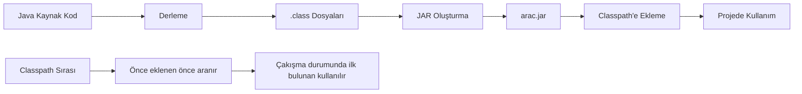

**Uygulama**: Kendi JAR'ımızı oluşturma ve başka projede kullanma:

<!-- CODE_META: Dosya: com/egitim/arac/Kasa.java (JAR için), Konu: JAR oluşturma, Zorluk: İleri -->

```java
// Dosya: com/egitim/arac/Kasa.java
package com.egitim.arac;

public class Kasa {
    private String renk;
    private double agirlik;
    
    public Kasa(String renk, double agirlik) {
        this.renk = renk;
        this.agirlik = agirlik;
    }
    
    public String getRenk() { return renk; }
    public double getAgirlik() { return agirlik; }
    
    @Override
    public String toString() {
        return "Kasa{" + "renk='" + renk + '\'' + ", agirlik=" + agirlik + '}';
    }
}
```

```bash
## 13.8 Kaynak kodları derle
javac -d out com/egitim/arac/Kasa.java

## 13.9 JAR dosyası oluştur
cd out
jar cf arac.jar com/egitim/arac/*.class
cd ..

## 13.10 JAR dosyasını başka projede kullan
## 13.11 Ana proje: Main.java
cat > Main.java << 'EOF'
import com.egitim.arac.Kasa;

public class Main {
    public static void main(String[] args) {
        Kasa kasa = new Kasa("Kırmızı", 1200);
        System.out.println(kasa);
    }
}
EOF

## 13.12 JAR ile derleme
javac -cp arac.jar Main.java

## 13.13 JAR ile çalıştırma
java -cp arac.jar:. Main
```

**Classpath Problemlerini Giderme**:

```bash
## 13.14 Hata: NoClassDefFoundError
## 13.15 Neden: Gerekli sınıf classpath'te yok

## 13.16 Çözüm 1: JAR dosyasını classpath'e ekle
java -cp arac.jar:. Main

## 13.17 Çözüm 2: Birden fazla JAR
java -cp arac.jar:veritabani.jar:. Main

## 13.18 Çözüm 3: Tüm JAR'ları ekle
java -cp "lib/*:." Main

## 13.19 Hata: ClassNotFoundException
## 13.20 Neden: Sınıf adı yanlış veya paket yapısı bozuk

## 13.21 Debug için sınıf yolunu kontrol et
java -verbose:class -cp arac.jar:. Main
```

### Proje Alıştırması - Çok Katmanlı Mini Proje

**Kavram**: Şimdiye kadar öğrendiğimiz tüm kavramları entegre ederek, gerçek dünya senaryosuna uygun bir kütüphane yönetim sistemi oluşturacağız.

**Proje Yapısı**:

```
kutuphane-sistemi/
├── src/
│   └── main/
│       └── java/
│           └── com/
│               └── kutuphane/
│                   ├── model/
│                   │   ├── Kitap.java
│                   │   └── Uye.java
│                   ├── service/
│                   │   ├── KitapService.java
│                   │   └── OduncService.java
│                   ├── util/
│                   │   └── TarihUtils.java
│                   └── Main.java
├── lib/
│   └── (harici kütüphaneler)
└── README.md
```

**Uygulama**: Tam bir proje yapısı oluşturma:

<!-- CODE_META: Dosya: com/kutuphane/model/Kitap.java, Konu: Kütüphane model sınıfı, Zorluk: Orta -->

```java
// Dosya: com/kutuphane/model/Kitap.java
package com.kutuphane.model;

import java.util.Objects;

public class Kitap {
    private String isbn;
    private String ad;
    private String yazar;
    private int yayinYili;
    private boolean oduncAlinabilir;
    
    public Kitap(String isbn, String ad, String yazar, int yayinYili) {
        this.isbn = isbn;
        this.ad = ad;
        this.yazar = yazar;
        this.yayinYili = yayinYili;
        this.oduncAlinabilir = true;
    }
    
    // Getter ve Setter metotları
    public String getIsbn() { return isbn; }
    public String getAd() { return ad; }
    public String getYazar() { return yazar; }
    public int getYayinYili() { return yayinYili; }
    public boolean isOduncAlinabilir() { return oduncAlinabilir; }
    
    public void setOduncAlinabilir(boolean oduncAlinabilir) {
        this.oduncAlinabilir = oduncAlinabilir;
    }
    
    @Override
    public String toString() {
        return String.format("Kitap{isbn='%s', ad='%s', yazar='%s', yil=%d}", 
                           isbn, ad, yazar, yayinYili);
    }
    
    @Override
    public boolean equals(Object o) {
        if (this == o) return true;
        if (o ==

```yaml
---
title: "Koleksiyonlar ve Dinamik Veri Yönetimi"
subtitle: "Java'da Veri Yapıları ve Algoritmalar"
author: "Teknik Kitap Yazarı"
date: "2024-01-15"
lang: "tr"
subject: "Java Koleksiyon Çerçevesi"
keywords: [ArrayList, LinkedList, HashMap, HashSet, Collections, Java]
---

# Bölüm 14: Koleksiyonlar ve Dinamik Veri Yonetimi

Java programlama dilinde veri yönetimi, çoğu uygulamanın temelini oluşturur. Bu bölümde, Java Collection Framework'ün sunduğu güçlü veri yapılarını ve dinamik veri yönetimi tekniklerini derinlemesine inceleyeceğiz.

## 14.1 Koleksiyonlara Giriş ve Temel Kavramlar

Koleksiyonlar, birden fazla nesneyi bir arada tutmak ve yönetmek için kullanılan yapılardır. Java'da koleksiyonlar, dizilerden farklı olarak dinamik boyutlandırma ve zengin işlevsellik sunar.

### Koleksiyon Nedir? Dizilerden Farkı

Diziler sabit boyutluyken, koleksiyonlar dinamik olarak büyüyüp küçülebilir. İşte temel farklılıklar:

| Özellik | Dizi | Koleksiyon |
|---------|------|------------|
| Boyut | Sabit | Dinamik |
| Tip Güvenliği | Var (primitifler dahil) | Generic'ler ile sağlanır |
| Performans | Daha hızlı | Biraz daha yavaş |
| API Desteği | Sınırlı | Zengin metodlar |

```java
public class CollectionVsArray {
    public static void main(String[] args) {
        // Dizi - sabit boyut
        int[] dizi = new int[5];
        dizi[0] = 10;
        // dizi[5] = 20; // ArrayIndexOutOfBoundsException!
        
        // ArrayList - dinamik boyut
        ArrayList<Integer> liste = new ArrayList<>();
        liste.add(10);
        liste.add(20); // Sorunsuz eklenir
        System.out.println("Liste boyutu: " + liste.size());
    }
}
```

> **Önemli Not:** Koleksiyonlar, primitif tipleri doğrudan tutamaz. Wrapper sınıflar (Integer, Double vb.) kullanılmalıdır. Ancak Java 5'ten itibaren autoboxing bu sorunu otomatik çözer.

### Koleksiyon Türlerine Genel Bakış

Java Collection Framework üç ana arayüz etrafında şekillenir:

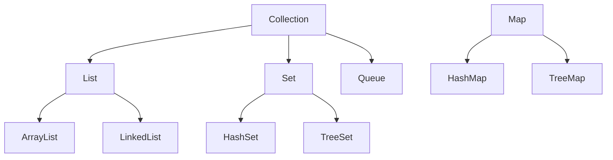

```java
public class CollectionTypesDemo {
    public static void main(String[] args) {
        // List - Sıralı, tekrarlanabilir
        List<String> liste = new ArrayList<>();
        liste.add("Java");
        liste.add("Python");
        liste.add("Java"); // Tekrar eklenebilir
        
        // Set - Benzersiz, sırasız
        Set<Integer> kume = new HashSet<>();
        kume.add(1);
        kume.add(2);
        kume.add(1); // Tekrar eklenmez!
        
        // Map - Anahtar-Değer çiftleri
        Map<String, Integer> harita = new HashMap<>();
        harita.put("Ahmet", 25);
        harita.put("Mehmet", 30);
    }
}
```

## 14.2 ArrayList: Dinamik Dizi Yapısı

ArrayList, Java'nın en çok kullanılan koleksiyon türüdür. Dinamik bir dizi olarak çalışır ve rastgele erişimde O(1) performans sunar.

### ArrayList'in Çalışma Prensibi

ArrayList'in iç yapısı bir Object[] dizisidir. Kapasite dolduğunda, yeni bir dizi oluşturulur ve elemanlar kopyalanır.

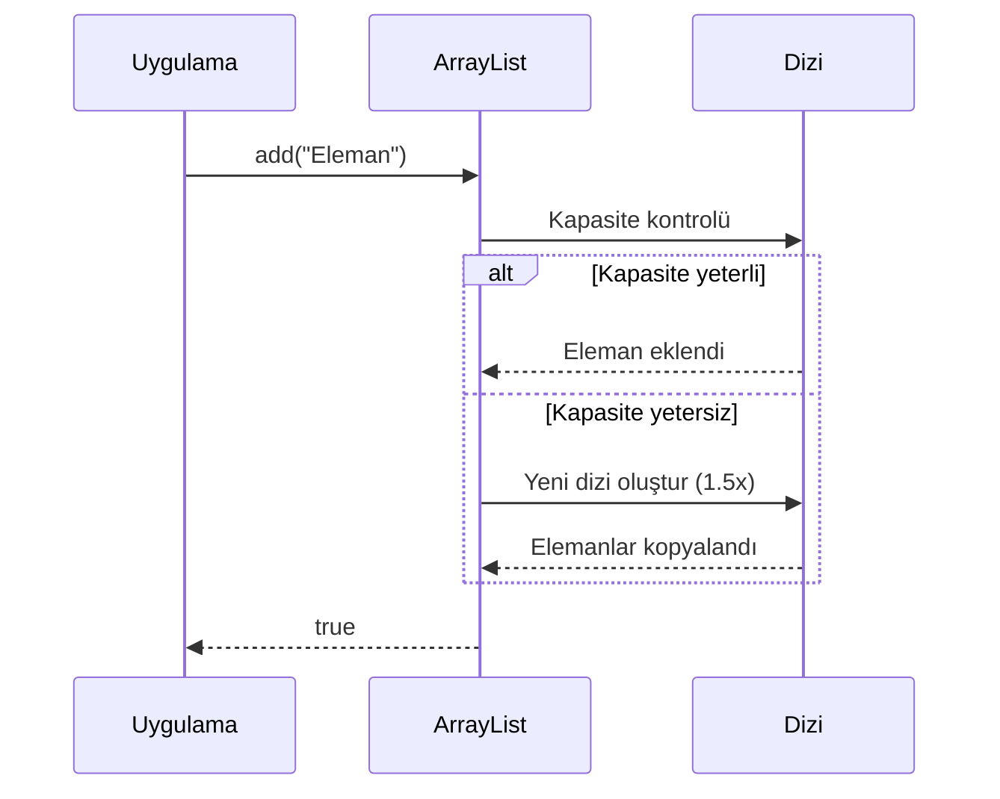

```java
public class ArrayListExample {
    public static void main(String[] args) {
        ArrayList<String> ogrenciler = new ArrayList<>();
        
        // Eleman ekleme
        ogrenciler.add("Ali");
        ogrenciler.add("Ayşe");
        ogrenciler.add(1, "Mehmet"); // Belirli indexe ekleme
        
        // Eleman silme
        String silinen = ogrenciler.remove(0);
        System.out.println("Silinen: " + silinen);
        
        // Eleman sayısı
        System.out.println("Öğrenci sayısı: " + ogrenciler.size());
        
        // Belirli indexteki eleman
        System.out.println("İlk öğrenci: " + ogrenciler.get(0));
    }
}
```

### ArrayList ile İleri Düzey İşlemler

ArrayList ile döngüler, stream API ve çeşitli dönüşüm işlemleri yapılabilir.

```java
public class GradeCalculator {
    public static void main(String[] args) {
        ArrayList<Integer> notlar = new ArrayList<>(Arrays.asList(85, 92, 78, 95, 88));
        
        // Geleneksel for döngüsü
        int toplam = 0;
        for (int i = 0; i < notlar.size(); i++) {
            toplam += notlar.get(i);
        }
        double ortalama1 = (double) toplam / notlar.size();
        
        // Stream API ile
        double ortalama2 = notlar.stream()
            .mapToInt(Integer::intValue)
            .average()
            .orElse(0.0);
            
        System.out.println("Ortalama: " + ortalama2);
        
        // Alt liste oluşturma
        List<Integer> ilkUc = notlar.subList(0, 3);
        System.out.println("İlk üç not: " + ilkUc);
    }
}
```

## 14.3 LinkedList: Bağlı Liste Yapısı

LinkedList, çift yönlü bağlı liste yapısıyla çalışır ve özellikle sık ekleme/silme işlemlerinde ArrayList'ten daha iyi performans gösterir.

### LinkedList'in Yapısı ve Özellikleri

LinkedList, her elemanın bir önceki ve sonraki elemanı işaret ettiği node'lardan oluşur.

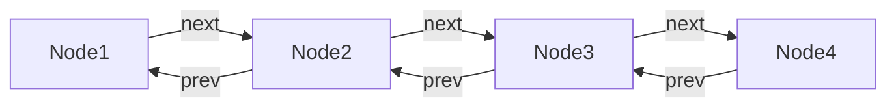

```java
public class LinkedListDemo {
    public static void main(String[] args) {
        LinkedList<String> kuyruk = new LinkedList<>();
        
        // Kuyruğa eleman ekleme
        kuyruk.offer("İlk");
        kuyruk.offer("İkinci");
        kuyruk.offer("Üçüncü");
        
        // Kuyruktan eleman çıkarma
        String ilk = kuyruk.poll();
        System.out.println("Çıkarılan: " + ilk);
        
        // Sıradaki elemanı görme (çıkarmadan)
        String bas = kuyruk.peek();
        System.out.println("Sıradaki: " + bas);
        
        // Başa ve sona ekleme
        kuyruk.addFirst("Yeni ilk");
        kuyruk.addLast("Yeni son");
    }
}
```

### LinkedList ile Stack ve Queue İşlemleri

LinkedList, Deque arayüzünü implemente ederek hem stack (LIFO) hem de queue (FIFO) işlemlerini destekler.

```java
public class UndoRedoManager {
    private LinkedList<String> islemGecmisi = new LinkedList<>();
    private LinkedList<String> geriAlmaGecmisi = new LinkedList<>();
    
    public void islemYap(String islem) {
        islemGecmisi.push(islem);
        geriAlmaGecmisi.clear(); // Yeni işlem geri almayı temizler
    }
    
    public String geriAl() {
        if (!islemGecmisi.isEmpty()) {
            String islem = islemGecmisi.pop();
            geriAlmaGecmisi.push(islem);
            return islem;
        }
        return null;
    }
    
    public String ileriAl() {
        if (!geriAlmaGecmisi.isEmpty()) {
            String islem = geriAlmaGecmisi.pop();
            islemGecmisi.push(islem);
            return islem;
        }
        return null;
    }
    
    public static void main(String[] args) {
        UndoRedoManager manager = new UndoRedoManager();
        manager.islemYap("Dosya açıldı");
        manager.islemYap("Düzenleme yapıldı");
        
        System.out.println("Geri al: " + manager.geriAl());
        System.out.println("İleri al: " + manager.ileriAl());
    }
}
```

## 14.4 HashMap: Anahtar-Değer Eşlemesi

HashMap, anahtar-değer çiftlerini depolamak için kullanılan en yaygın Map implementasyonudur.

### HashMap'in Çalışma Prensibi

HashMap, hash fonksiyonu kullanarak anahtarları bucket'lara dağıtır ve O(1) ortalama erişim süresi sağlar.

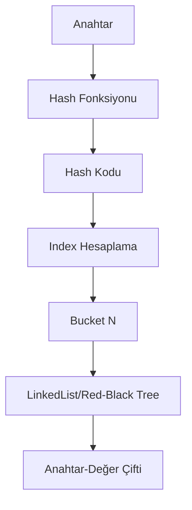

```java
public class HashMapExample {
    public static void main(String[] args) {
        HashMap<String, Integer> ogrenciNotlari = new HashMap<>();
        
        // Anahtar-değer ekleme
        ogrenciNotlari.put("Ali", 85);
        ogrenciNotlari.put("Ayşe", 92);
        ogrenciNotlari.put("Mehmet", 78);
        
        // Değer okuma
        int aliNotu = ogrenciNotlari.getOrDefault("Ali", 0);
        System.out.println("Ali'nin notu: " + aliNotu);
        
        // Anahtar kontrolü
        if (ogrenciNotlari.containsKey("Ayşe")) {
            System.out.println("Ayşe listede var");
        }
        
        // Silme
        ogrenciNotlari.remove("Mehmet");
        
        // Tüm anahtarları dolaşma
        for (String ogrenci : ogrenciNotlari.keySet()) {
            System.out.println(ogrenci + ": " + ogrenciNotlari.get(ogrenci));
        }
    }
}
```

### HashMap ile Veri Yönetimi

HashMap ile verimli veri yönetimi için performans optimizasyonları yapılabilir.

```java
public class WordCounter {
    public static void main(String[] args) {
        String metin = "java java programlama dili java programlama";
        
        HashMap<String, Integer> kelimeSayaci = new HashMap<>();
        
        // Kelimeleri sayma
        for (String kelime : metin.split(" ")) {
            kelimeSayaci.merge(kelime, 1, Integer::sum);
        }
        
        // Sonuçları yazdırma
        kelimeSayaci.forEach((kelime, sayi) -> 
            System.out.println(kelime + ": " + sayi + " kez"));
        
        // Performans optimizasyonu
        HashMap<String, Integer> optimizeHashMap = 
            new HashMap<>(100, 0.75f); // Başlangıç kapasitesi ve load factor
    }
}
```

## 14.5 HashSet: Benzersiz Eleman Koleksiyonu

HashSet, matematiksel küme işlemlerini gerçekleştirmek için kullanılır ve elemanların benzersiz olmasını garanti eder.

### HashSet'in Yapısı ve Kullanımı

HashSet, dahili olarak HashMap kullanır ve elemanları key olarak depolar.

```java
public class HashSetExample {
    public static void main(String[] args) {
        HashSet<String> ogrenciSet = new HashSet<>();
        
        // Eleman ekleme
        ogrenciSet.add("Ali");
        ogrenciSet.add("Ayşe");
        ogrenciSet.add("Ali"); // Tekrar eklenmez!
        
        // Eleman kontrolü
        boolean varMi = ogrenciSet.contains("Ali");
        System.out.println("Ali var mı? " + varMi);
        
        // Eleman sayısı
        System.out.println("Benzersiz öğrenci sayısı: " + ogrenciSet.size());
        
        // Tüm elemanları yazdırma
        for (String ogrenci : ogrenciSet) {
            System.out.println(ogrenci);
        }
    }
}
```

### HashSet ile Küme Operasyonları

HashSet ile matematiksel küme işlemleri kolayca gerçekleştirilebilir.

```java
public class SetOperations {
    public static void main(String[] args) {
        // Benzersiz IP takibi
        HashSet<String> benzersizIP = new HashSet<>();
        String[] ipListesi = {"192.168.1.1", "192.168.1.2", "192.168.1.1", "192.168.1.3"};
        Collections.addAll(benzersizIP, ipListesi);
        System.out.println("Benzersiz IP sayısı: " + benzersizIP.size());
        
        // Küme işlemleri
        HashSet<Integer> setA = new HashSet<>(Arrays.asList(1, 2, 3, 4, 5));
        HashSet<Integer> setB = new HashSet<>(Arrays.asList(4, 5, 6, 7, 8));
        
        // Birleşim
        HashSet<Integer> birlesim = new HashSet<>(setA);
        birlesim.addAll(setB);
        System.out.println("Birleşim: " + birlesim);
        
        // Kesişim
        HashSet<Integer> kesisim = new HashSet<>(setA);
        kesisim.retainAll(setB);
        System.out.println("Kesişim: " + kesisim);
        
        // Fark
        HashSet<Integer> fark = new HashSet<>(setA);
        fark.removeAll(setB);
        System.out.println("Fark (A - B): " + fark);
    }
}
```

## 14.6 Koleksiyon Algoritmaları ve İleri Düzey İşlemler

Collections sınıfı, koleksiyonlar üzerinde çeşitli algoritmaları uygulamak için statik metotlar sağlar.

### Collections Sınıfı Yardımcı Metotları

```java
public class CollectionsDemo {
    public static void main(String[] args) {
        ArrayList<Integer> sayilar = new ArrayList<>(
            Arrays.asList(5, 2, 8, 1, 9, 3, 7));
        
        // Sıralama
        Collections.sort(sayilar);
        System.out.println("Sıralı: " + sayilar);
        
        // Ters çevirme
        Collections.reverse(sayilar);
        System.out.println("Ters: " + sayilar);
        
        // Binary search (önceden sıralanmış olmalı)
        Collections.sort(sayilar);
        int index = Collections.binarySearch(sayilar, 5);
        System.out.println("5'in indexi: " + index);
        
        // Karıştırma
        Collections.shuffle(sayilar);
        System.out.println("Karışık: " + sayilar);
        
        // Doldurma
        Collections.fill(sayilar, 0);
        System.out.println("Doldurulmuş: " + sayilar);
    }
}
```

### Koleksiyonların Dönüşümü ve Filtrelenmesi

Stream API ile koleksiyonlar üzerinde güçlü veri işleme operasyonları yapılabilir.

```java
public class StreamOperations {
    public static void main(String[] args) {
        List<Integer> sayilar = Arrays.asList(1, 2, 3, 4, 5, 6, 7, 8, 9, 10);
        
        // Filtreleme ve dönüştürme
        List<Integer> ciftSayilar = sayilar.stream()
            .filter(s -> s % 2 == 0)
            .map(s -> s * 2)
            .collect(Collectors.toList());
        System.out.println("Çift sayıların 2 katı: " + ciftSayilar);
        
        // Gruplama
        Map<Boolean, List<Integer>> gruplanmis = sayilar.stream()
            .collect(Collectors.partitioningBy(s -> s % 2 == 0));
        System.out.println("Çiftler: " + gruplanmis.get(true));
        System.out.println("Tekler: " + gruplanmis.get(false));
        
        // Toplama
        int toplam = sayilar.stream()
            .mapToInt(Integer::intValue)
            .sum();
        System.out.println("Toplam: " + toplam);
    }
}
```

### Thread Güvenli Koleksiyonlar

Çoklu iş parçacığı ortamlarında güvenli koleksiyon kullanımı kritik öneme sahiptir.

```java
public class ThreadSafeCollections {
    public static void main(String[] args) {
        // Synchronized koleksiyon
        List<String> synchronizedList = 
            Collections.synchronizedList(new ArrayList<>());
        
        // ConcurrentHashMap
        Map<String, Integer> concurrentMap = new ConcurrentHashMap<>();
        
        // CopyOnWriteArrayList
        List<String> copyOnWriteList = new CopyOnWriteArrayList<>();
        
        // Performans testi
        ArrayList<Integer> normalList = new ArrayList<>();
        long baslangic = System.nanoTime();
        
        for (int i = 0; i < 100000; i++) {
            normalList.add(i);
        }
        
        long bitis = System.nanoTime();
        System.out.println("Normal ArrayList süresi: " + 
            (bitis - baslangic) + " ns");
    }
}
```

## 14.7 Değerlendirme ve Özet

### Koleksiyon Seçim Kriterleri

| Koleksiyon | Ekleme | Silme | Arama | Sıralı Erişim |
|------------|--------|-------|-------|---------------|
| ArrayList | O(1)* | O(n) | O(n) | O(1) |
| LinkedList | O(1) | O(1) | O(n) | O(n) |
| HashMap | O(1) | O(1) | O(1) | - |
| HashSet | O(1) | O(1) | O(1) | - |

*Kapasite artırımı durumunda O(n)

### Proje: Öğrenci Kayıt Sistemi Uygulaması

```java
public class StudentManagementSystem {
    private Map<String, Student> students = new HashMap<>();
    private Set<String> studentIds = new HashSet<>();
    private List<String> activityLog = new ArrayList<>();
    
    public void addStudent(Student student) {
        if (studentIds.add(student.getId())) {
            students.put(student.getId(), student);
            activityLog.add("Öğrenci eklendi: " + student.getName());
        }
    }
    
    public void removeStudent(String studentId) {
        Student removed = students.remove(studentId);
        if (removed != null) {
            studentIds.remove(studentId);
            activityLog.add("Öğrenci silindi: " + removed.getName());
        }
    }
    
    public Student findStudent(String studentId) {
        return students.get(studentId);
    }
    
    public List<Student> getStudentsByGrade(double minGrade) {
        return students.values().stream()
            .filter(s -> s.getGrade() >= minGrade)
            .collect(Collectors.toList());
    }
    
    public static void main(String[] args) {
        StudentManagementSystem system = new StudentManagementSystem();
        
        system.addStudent(new Student("S001", "Ali", 85.5));
        system.addStudent(new Student("S002", "Ayşe", 92.3));
        system.addStudent(new Student("S003", "Mehmet", 78.0));
        
        Student found = system.findStudent("S001");
        System.out.println("Bulunan: " + found);
        
        List<Student> highPerformers = system.getStudentsByGrade(80.0);
        System.out.println("Yüksek performanslı öğrenciler: " + highPerformers);
    }
}

class Student {
    private String id;
    private String name;
    private double grade;
    
    public Student(String id, String name, double grade) {
        this.id = id;
        this.name = name;
        this.grade = grade;
    }
    
    // Getter metotları
    public String getId() { return id; }
    public String getName() { return name; }
    public double getGrade() { return grade; }
    
    @Override
    public String toString() {
        return "Student{id='" + id + "', name='" + name + "', grade=" + grade + "}";
    }
}
```

## 14.8 Özet

Bu bölümde Java Collection Framework'ün temel bileşenlerini inceledik:

- **ArrayList**: Dinamik dizi yapısı, rastgele erişimde hızlı
- **LinkedList**: Bağlı liste yapısı, ekleme/silmede hızlı
- **HashMap**: Anahtar-değer eşlemesi, hızlı arama
- **HashSet**: Benzersiz eleman koleksiyonu, küme işlemleri
- **Collections**: Algoritma ve yardımcı metotlar
- **Stream API**: Modern veri işleme ve dönüşüm

## 14.9 Terim Sözlüğü

| Terim | Açıklama |
|-------|----------|
| **Collection** | Birden fazla nesneyi bir arada tutan yapı |
| **Generic** | Tip güvenliği sağlayan parametrik tip sistemi |
| **Hash Function** | Veriyi sabit boyutlu hash koduna dönüştüren fonksiyon |
| **Load Factor** | HashMap'in yeniden boyutlandırma eşiği |
| **Autoboxing** | Primitif tiplerin wrapper sınıflara otomatik dönüşümü |
| **Stream API** | Koleksiyonlar üzerinde fonksiyonel işlemler sağlayan API |
| **Thread-Safe** | Çoklu iş parçacığı ortamında güvenli kullanım |

## 14.10 Sorular

1. ArrayList ve LinkedList arasındaki temel farklar nelerdir?
2. HashMap'te collision (çakışma) nasıl çözülür?
3. HashSet neden HashMap kullanır?
4. Collections.sort() hangi sıralama algoritmasını kullanır?
5. Stream API ile geleneksel döngüler arasındaki farklar nelerdir?
6. Thread-safe koleksiyonlar neden önemlidir?
7. HashMap'te initial capacity ve load factor ne işe yarar?
8. LinkedList neden hem List hem Deque arayüzünü implemente eder?

## 14.11 Alıştırmalar

1. **Temel Seviye**: 10 elemanlı bir ArrayList oluşturun, elemanları sıralayın ve ters çevirin.

2. **Orta Seviye**: Bir metin dosyasındaki kelimelerin frekansını hesaplayan bir program yazın (HashMap kullanarak).

3. **İleri Seviye**: İki farklı küme üzerinde birleşim, kesişim ve fark işlemlerini gerçekleştiren bir program yazın.

4. **Zor Seviye**: Çoklu iş parçacığı kullanarak büyük bir veri kümesini işleyen ve thread-safe koleksiyonlar kullanan bir uygulama geliştirin.

5. **Proje Seviyesi**: Bir kütüphane yönetim sistemi geliştirin (kitap ekleme, silme, arama, ödünç verme işlemleri için uygun koleksiyonları kullanın).

---
title: Java'da Hata Yönetimi ve Dayanıklı Programlama
subtitle: try-catch-finally, Checked/Unchecked Exception, Custom Exception ve İleri Düzey Stratejiler
author: Teknik Kitap Yazarı ve Pedagojik İçerik Uzmanı
date: 2024-01-01
lang: tr
---

# Bölüm 15: Hata Yonetimi ve Dayanikli Programlama

## 15.1 Hata Yönetiminin Temel Kavramları ve Önemi

### Hata ve İstisna Arasındaki Fark

Yazılım geliştirme sürecinde karşılaşılan sorunlar genellikle iki ana kategoriye ayrılır: **Hata (Error)** ve **İstisna (Exception)**. Bu iki kavramı anlamak, etkili bir hata yönetimi stratejisi oluşturmanın temelidir.

**Derleme Zamanı Hataları (Compile-time Errors):** Kod yazarken Java derleyicisi tarafından tespit edilen hatalardır. Sözdizimi hataları, tip uyuşmazlıkları veya eksik import ifadeleri bu kategoriye girer. Bu hatalar program çalıştırılmadan önce düzeltilmelidir.

**Çalışma Zamanı Hataları (Runtime Errors):** Program çalışırken ortaya çıkan beklenmedik durumlardır. Bu hatalar genellikle dış etkenlerden (kullanıcı girdisi, dosya erişimi, ağ sorunları) kaynaklanır. Java'da bu tür hatalar **istisna** olarak adlandırılır.

Java'nın istisna hiyerarşisi şu şekilde yapılandırılmıştır:

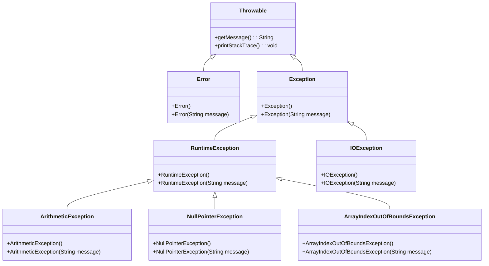

**Error sınıfı:** JVM (Java Virtual Machine) ile ilgili ciddi sorunları temsil eder. Örneğin, `OutOfMemoryError`, `StackOverflowError` gibi durumlar. Bu hatalar genellikle program tarafından yakalanamaz ve yönetilemez.

**Exception sınıfı:** Program tarafından yakalanıp yönetilebilen istisnai durumları temsil eder. İki alt kategoriye ayrılır:
- **Checked Exception:** Derleme zamanında kontrol edilen istisnalar (IOException, SQLException)
- **Unchecked Exception:** Çalışma zamanında ortaya çıkan istisnalar (RuntimeException alt sınıfları)

### Yaygın İstisna Örnekleri

Aşağıda en sık karşılaşılan istisna türleri ve neden oluştukları açıklanmıştır:

| İstisna Türü | Oluşma Nedeni | Örnek Senaryo |
|-------------|---------------|----------------|
| ArithmeticException | Matematiksel işlem hatası | Sıfıra bölme |
| NullPointerException | Null referans üzerinde işlem | Metot çağrısı yapılmamış nesne |
| ArrayIndexOutOfBoundsException | Dizi sınırları dışına çıkma | Dizinin 5. elemanına erişmeye çalışmak (dizi boyutu 5 ise) |
| FileNotFoundException | Dosya bulunamaması | Var olmayan bir dosyayı açmaya çalışmak |
| NumberFormatException | Sayısal dönüşüm hatası | "abc" string'ini integer'a çevirmeye çalışmak |

### Uygulama: Basit Bölme İşlemi

Aşağıdaki örnek, hata yönetimi olmadan bir programın nasıl çöktüğünü göstermektedir:

<!-- CODE_META: HataOrnegi.java - Basit bölme işlemi hatası -->
```java
public class HataOrnegi {
    public static void main(String[] args) {
        int a = 10;
        int b = 0;
        System.out.println("Sonuç: " + (a / b)); // ArithmeticException: / by zero
    }
}
```

Bu kod çalıştırıldığında, `b` değişkeni 0 olduğu için `ArithmeticException` fırlatılır ve program aniden sonlanır. Eğer bu işlem kritik bir uygulamada gerçekleşseydi, kullanıcı veri kaybı yaşayabilir veya sistem kararsız hale gelebilirdi.

> **Önemli:** Hata yönetimi olmadan programın çökmesi, veri kaybına, güvenlik açıklarına ve kullanıcı deneyiminin bozulmasına neden olabilir. Bu nedenle, dayanıklı programlama için hata yönetimi zorunludur.

### Değerlendirme

Hata yönetimi olmadan bir programın karşılaşabileceği sonuçlar:
1. **Veri Kaybı:** Kullanıcı tarafından girilen veya işlenen veriler kaybolabilir.
2. **Güvenlik Açıkları:** Beklenmeyen durumlar, güvenlik duvarlarını aşmak için kullanılabilir.
3. **Kullanıcı Deneyimi:** Ani çökmeler, kullanıcıların sisteme olan güvenini azaltır.
4. **Sistem Kararsızlığı:** Kaynak sızıntıları ve tutarsız durumlar sistemin çökmesine yol açabilir.

---

## 15.2 try-catch-finally Yapısı ile İstisna Yakalama

### try-catch-finally Bloklarının İşleyişi

Java'da istisna yönetiminin temel yapı taşı `try-catch-finally` bloklarıdır. Bu yapı sayesinde, potansiyel olarak istisna fırlatabilecek kodlar güvenli bir şekilde çalıştırılabilir.

**try bloğu:** İstisna oluşma ihtimali olan kodların yazıldığı bloktur. Bu blok içinde bir istisna oluşursa, kontrol hemen uygun `catch` bloğuna geçer.

**catch bloğu:** Belirli bir istisna türünü yakalamak ve işlemek için kullanılır. Birden fazla `catch` bloğu tanımlanabilir.

**finally bloğu:** İstisna oluşsa da oluşmasa da her durumda çalıştırılması gereken kodlar için kullanılır. Genellikle kaynak temizleme işlemleri için tercih edilir.

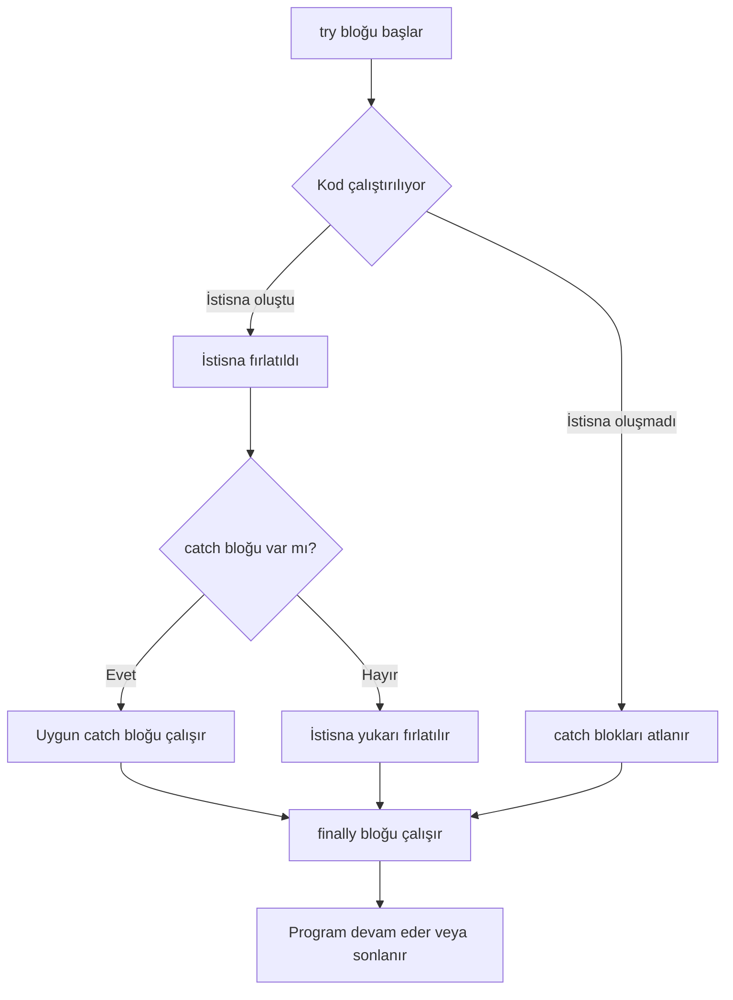

### Çoklu catch Blokları ve finally Kullanımı

Aşağıdaki örnek, bir dosyayı okurken karşılaşılabilecek farklı istisna türlerini nasıl yönetebileceğinizi göstermektedir:

<!-- CODE_META: TryCatchOrnegi.java - try-catch-finally yapısı -->
```java
import java.io.*;

public class TryCatchOrnegi {
    public static void main(String[] args) {
        BufferedReader reader = null;
        try {
            reader = new BufferedReader(new FileReader("dosya.txt"));
            String satir = reader.readLine();
            System.out.println(satir);
        } catch (FileNotFoundException e) {
            System.out.println("Dosya bulunamadı: " + e.getMessage());
        } catch (IOException e) {
            System.out.println("Okuma hatası: " + e.getMessage());
        } finally {
            try {
                if (reader != null) {
                    reader.close();
                }
            } catch (IOException e) {
                System.out.println("Kapatma hatası");
            }
        }
    }
}
```

Bu örnekte:
1. **try bloğu:** Dosyayı açar ve okur.
2. **catch blokları:**
   - `FileNotFoundException`: Dosya bulunamazsa yakalanır.
   - `IOException`: Okuma sırasında başka bir hata oluşursa yakalanır.
3. **finally bloğu:** Her durumda dosyayı kapatır.

> **Önemli:** finally bloğu, kaynak yönetimi için kritik öneme sahiptir. Dosya, ağ bağlantısı veya veritabanı bağlantısı gibi kaynakların her durumda serbest bırakılmasını sağlar.

### Uygulama: Kullanıcı Girdisi ile Bölme İşlemi

Aşağıdaki uygulama, kullanıcıdan alınan iki sayıyı bölen ve sonucu bir dosyaya yazan programdır:

<!-- CODE_META: BolmeVeDosyayaYaz.java - Kullanıcı girdisi ile bölme işlemi -->
```java
import java.io.*;
import java.util.Scanner;

public class BolmeVeDosyayaYaz {
    public static void main(String[] args) {
        Scanner scanner = new Scanner(System.in);
        BufferedWriter writer = null;
        
        try {
            System.out.print("Birinci sayıyı girin: ");
            int a = Integer.parseInt(scanner.nextLine());
            
            System.out.print("İkinci sayıyı girin: ");
            int b = Integer.parseInt(scanner.nextLine());
            
            int sonuc = a / b;
            
            writer = new BufferedWriter(new FileWriter("sonuc.txt"));
            writer.write("Bölme sonucu: " + sonuc);
            System.out.println("Sonuç dosyaya yazıldı.");
            
        } catch (NumberFormatException e) {
            System.out.println("Geçersiz sayı formatı: " + e.getMessage());
        } catch (ArithmeticException e) {
            System.out.println("Sıfıra bölme hatası: " + e.getMessage());
        } catch (IOException e) {
            System.out.println("Dosya yazma hatası: " + e.getMessage());
        } finally {
            try {
                if (writer != null) {
                    writer.close();
                }
                scanner.close();
            } catch (IOException e) {
                System.out.println("Kapatma hatası");
            }
        }
    }
}
```

Bu uygulama şu istisna durumlarını yönetir:
1. **NumberFormatException:** Kullanıcı sayı yerine harf girerse
2. **ArithmeticException:** İkinci sayı 0 girilirse
3. **IOException:** Dosyaya yazma işlemi başarısız olursa

### Değerlendirme

finally bloğunun kaynak yönetimindeki önemi:
- **Kaynak Sızıntısını Önler:** Açık kalan dosyalar, ağ bağlantıları veya veritabanı bağlantıları sistem kaynaklarını tüketir.
- **Her Durumda Çalışır:** İstisna oluşsa da oluşmasa da çalışır.
- **Temizlik Kodları İçin İdealdir:** Loglama, bildirim gönderme gibi işlemler için kullanılabilir.

---

## 15.3 Checked ve Unchecked Exception Ayrımı

### Checked Exception

**Checked Exception**'lar, derleme zamanında Java derleyicisi tarafından kontrol edilen istisnalardır. Bu tür istisnalar, ya `try-catch` bloğu ile yakalanmalı ya da metot imzasında `throws` anahtar kelimesi ile bildirilmelidir.

**Özellikler:**
- `Exception` sınıfının `RuntimeException` dışındaki alt sınıflarıdır.
- Derleme hatasına neden olur.
- Genellikle dış etkenlerden kaynaklanır (dosya, ağ, veritabanı).
- Programcı bu istisnaları yönetmek zorundadır.

### Unchecked Exception

**Unchecked Exception**'lar, çalışma zamanında ortaya çıkan istisnalardır. Bu tür istisnaların `try-catch` ile yakalanması veya `throws` ile bildirilmesi zorunlu değildir.

**Özellikler:**
- `RuntimeException` ve alt sınıflarıdır.
- Derleme hatasına neden olmaz.
- Genellikle programlama hatalarından kaynaklanır (null kontrolü, dizi sınırları).
- Programcı isterse yakalayabilir, ancak zorunlu değildir.

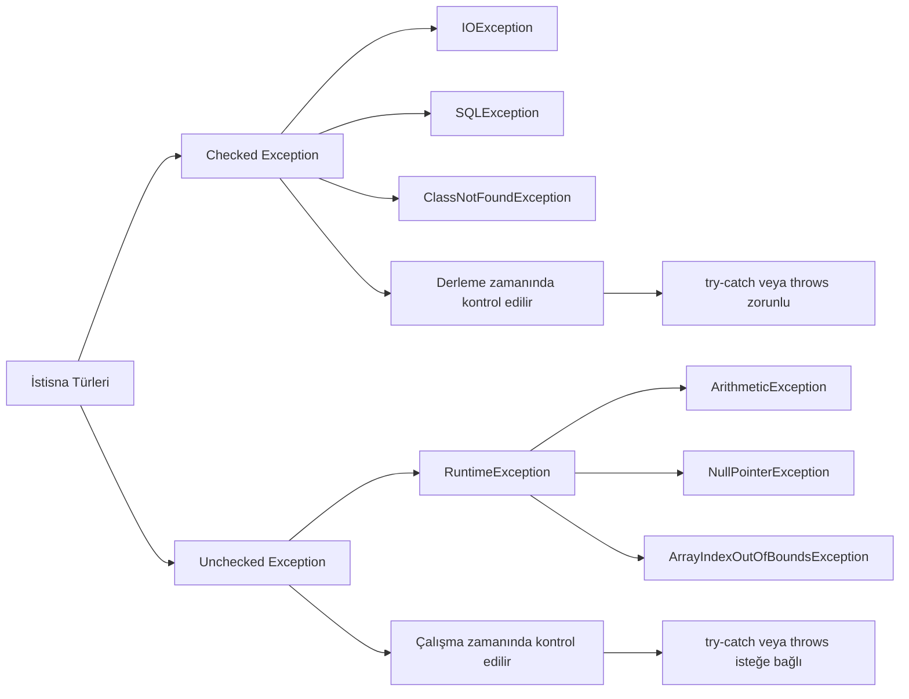

### Her İki Türün Karşılaştırılması

Aşağıdaki örnek, checked ve unchecked exception arasındaki farkı göstermektedir:

<!-- CODE_META: ExceptionTurleri.java - Checked ve Unchecked exception karşılaştırması -->
```java
import java.io.*;

public class ExceptionTurleri {
    
    // Checked exception - bildirim zorunlu
    public static void dosyaOku() throws IOException {
        FileReader file = new FileReader("test.txt");
        // Dosya okuma işlemleri
        file.close();
    }
    
    // Unchecked exception - bildirim zorunlu değil
    public static void bolmeIslemi(int a, int b) {
        if (b == 0) {
            throw new ArithmeticException("Sıfıra bölme hatası");
        }
        System.out.println("Sonuç: " + (a / b));
    }
    
    public static void main(String[] args) {
        // Unchecked exception yakalama (isteğe bağlı)
        try {
            bolmeIslemi(10, 0);
        } catch (ArithmeticException e) {
            System.out.println("Unchecked exception yakalandı: " + e.getMessage());
        }
        
        // Checked exception yakalama (zorunlu)
        try {
            dosyaOku();
        } catch (IOException e) {
            System.out.println("Checked exception yakalandı: " + e.getMessage());
        }
    }
}
```

> **Önemli:** Checked exception'lar, API kullanıcılarının hata durumlarını yönetmesini sağlar. Unchecked exception'lar ise genellikle programlama hatalarını belirtir ve düzeltilmesi gerekir.

### Uygulama: Hesap Makinesi Programı

Aşağıdaki hesap makinesi programı, hem checked hem de unchecked exception'ları yönetmektedir:

<!-- CODE_META: HesapMakinesi.java - Checked ve Unchecked exception yönetimi -->
```java
import java.io.*;
import java.util.Scanner;

public class HesapMakinesi {
    
    // Checked exception - dosyaya yazma işlemi
    public static void sonucuKaydet(int sonuc) throws IOException {
        try (BufferedWriter writer = new BufferedWriter(new FileWriter("hesap_log.txt", true))) {
            writer.write("İşlem sonucu: " + sonuc);
            writer.newLine();
        }
    }
    
    // Unchecked exception - bölme işlemi
    public static int bol(int a, int b) {
        if (b == 0) {
            throw new ArithmeticException("Sıfıra bölme hatası");
        }
        return a / b;
    }
    
    public static void main(String[] args) {
        Scanner scanner = new Scanner(System.in);
        
        try {
            System.out.print("Birinci sayı: ");
            int sayi1 = Integer.parseInt(scanner.nextLine());
            
            System.out.print("İkinci sayı: ");
            int sayi2 = Integer.parseInt(scanner.nextLine());
            
            // Unchecked exception - bölme
            int sonuc = bol(sayi1, sayi2);
            System.out.println("Sonuç: " + sonuc);
            
            // Checked exception - dosyaya kaydet
            sonucuKaydet(sonuc);
            System.out.println("Sonuç kaydedildi.");
            
        } catch (NumberFormatException e) {
            System.out.println("Geçersiz sayı formatı: " + e.getMessage());
        } catch (ArithmeticException e) {
            System.out.println("Matematiksel hata: " + e.getMessage());
        } catch (IOException e) {
            System.out.println("Dosya yazma hatası: " + e.getMessage());
        } finally {
            scanner.close();
        }
    }
}
```

### Değerlendirme

Hangi durumda hangi tür istisna kullanılmalı?

| Durum | Önerilen İstisna Türü | Neden |
|-------|----------------------|-------|
| Dosya işlemleri | Checked (IOException) | Kullanıcı dosyayı silebilir veya taşıyabilir |
| Ağ bağlantıları | Checked (SocketException) | Ağ kesintileri beklenen durumlardır |
| Null kontrolü | Unchecked (NullPointerException) | Programlama hatasıdır, düzeltilmelidir |
| Dizi sınırları | Unchecked (ArrayIndexOutOfBoundsException) | Programlama hatasıdır |
| Kullanıcı girdisi | Unchecked (NumberFormatException) | Genellikle doğrulama ile önlenebilir |
| Veritabanı bağlantısı | Checked (SQLException) | Dış etkenlere bağlıdır |

---

## 15.4 Custom Exception (Özel İstisna) Oluşturma

### Kendi İstisna Sınıflarını Oluşturma

Bazı durumlarda, Java'nın standart istisna sınıfları ihtiyaçlarınızı karşılamayabilir. Bu gibi durumlarda, kendi özel istisna sınıflarınızı oluşturabilirsiniz.

**Özel istisna oluşturma adımları:**

1. **Sınıf seçimi:** `Exception` (checked) veya `RuntimeException` (unchecked) sınıfından türetme
2. **Yapıcı metotlar:** En azından `String message` parametreli bir yapıcı metot
3. **Ek bilgi:** İstisna ile ilgili ek bilgiler taşıyabilir (hatalı değer, hata kodu vb.)

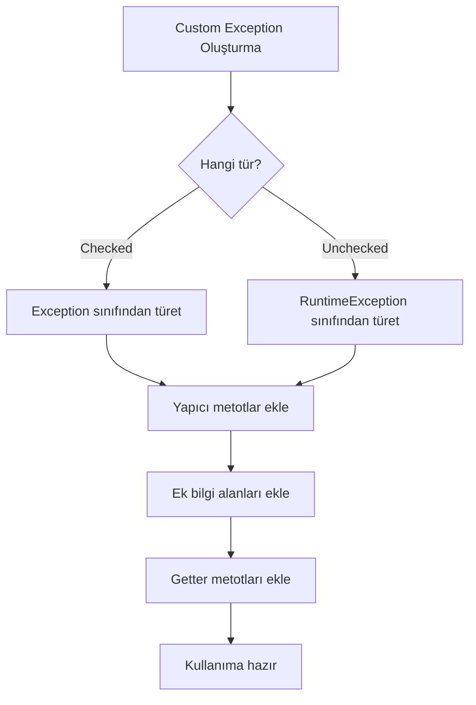

### Örnek: Kullanıcı Doğrulama için Özel İstisna

Aşağıdaki örnek, geçersiz yaş değerleri için özel bir istisna sınıfı oluşturmayı göstermektedir:

<!-- CODE_META: CustomExceptionOrnegi.java - Özel istisna oluşturma -->
```java
// Özel istisna sınıfı - Checked exception
class InvalidAgeException extends Exception {
    private int hataliYas;
    
    public InvalidAgeException(String message, int hataliYas) {
        super(message);
        this.hataliYas = hataliYas;
    }
    
    public int getHataliYas() {
        return hataliYas;
    }
}

public class CustomExceptionOrnegi {
    
    public static void yasKontrol(int yas) throws InvalidAgeException {
        if (yas < 0 || yas > 150) {
            throw new InvalidAgeException("Geçersiz yaş değeri", yas);
        }
        System.out.println("Yaş geçerli: " + yas);
    }
    
    public static void main(String[] args) {
        try {
            yasKontrol(-5);
        } catch (InvalidAgeException e) {
            System.out.println("Hata: " + e.getMessage());
            System.out.println("Hatalı değer: " + e.getHataliYas());
        }
        
        try {
            yasKontrol(25);
            System.out.println("İkinci kontrol başarılı.");
        } catch (InvalidAgeException e) {
            System.out.println("Buraya gelmez");
        }
    }
}
```

> **Önemli:** Özel istisna sınıfları, hata mesajlarını daha anlamlı hale getirir ve hata ayıklama sürecini kolaylaştırır. Ayrıca, API kullanıcılarına hangi hata durumlarıyla karşılaşabileceklerini açıkça belirtir.

### Uygulama: Banka Hesap İşlemleri için Özel İstisnalar

Aşağıdaki uygulama, banka hesap işlemleri için çeşitli özel istisna sınıfları tasarlamaktadır:

<!-- CODE_META: BankaHesapOrnegi.java - Banka işlemleri için özel istisnalar -->
```java
// Özel istisna sınıfları
class YetersizBakiyeException extends Exception {
    private double mevcutBakiye;
    private double istenenMiktar;
    
    public YetersizBakiyeException(String message, double mevcutBakiye, double istenenMiktar) {
        super(message);
        this.mevcutBakiye = mevcutBakiye;
        this.istenenMiktar = istenenMiktar;
    }
    
    public double getMevcutBakiye() { return mevcutBakiye; }
    public double getIstenenMiktar() { return istenenMiktar; }
}

class GecersizHesapNumarasiException extends RuntimeException {
    private String hesapNumarasi;
    
    public GecersizHesapNumarasiException(String message, String hesapNumarasi) {
        super(message);
        this.hesapNumarasi = hesapNumarasi;
    }
    
    public String getHesapNumarasi() { return hesapNumarasi; }
}

class NegatifParaMiktariException extends IllegalArgumentException {
    private double miktar;
    
    public NegatifParaMiktariException(String message, double miktar) {
        super(message);
        this.miktar = miktar;
    }
    
    public double getMiktar() { return miktar; }
}

// Banka hesap sınıfı
class BankaHesap {
    private String hesapNumarasi;
    private double bakiye;
    
    public BankaHesap(String hesapNumarasi, double baslangicBakiyesi) {
        if (hesapNumarasi == null || hesapNumarasi.isEmpty()) {
            throw new GecersizHesapNumarasiException("Hesap numarası boş olamaz", hesapNumarasi);
        }
        this.hesapNumarasi = hesapNumarasi;
        this.bakiye = baslangicBakiyesi;
    }
    
    public void paraCek(double miktar) throws YetersizBakiyeException, NegatifParaMiktariException {
        if (miktar < 0) {
            throw new NegatifParaMiktariException("Negatif para miktarı", miktar);
        }
        if (miktar > bakiye) {
            throw new YetersizBakiyeException("Yetersiz bakiye", bakiye, miktar);
        }
        bakiye -= miktar;
        System.out.println("Para çekme başarılı. Kalan bakiye: " + bakiye);
    }
    
    public void paraYatir(double miktar) throws NegatifParaMiktariException {
        if (miktar < 0) {
            throw new NegatifParaMiktariException("Negatif para miktarı", miktar);
        }
        bakiye += miktar;
        System.out.println("Para yatırma başarılı. Yeni bakiye: " + bakiye);
    }
    
    public double getBakiye() { return bakiye; }
    public String getHesapNumarasi() { return hesapNumarasi; }
}

public class BankaHesapOrnegi {
    public static void main(String[] args) {
        try {
            BankaHesap hesap = new BankaHesap("123456", 1000.0);
            System.out.println("Hesap oluşturuldu: " + hesap.getHesapNumarasi());
            
            try {
                hesap.paraCek(1500); // Yetersiz bakiye
            } catch (YetersizBakiyeException e) {
                System.out.println("Hata: " + e.getMessage());
                System.out.println("Mevcut bakiye: " + e.getMevcutBakiye());
                System.out.println("İstenen miktar: " + e.getIstenenMiktar());
            }
            
            try {
                hesap.paraYatir(-100); // Negatif miktar
            } catch (NegatifParaMiktariException e) {
                System.out.println("Hata: " + e.getMessage());
                System.out.println("Girilen miktar: " + e.getMiktar());
            }
            
            hesap.paraCek(500); // Başarılı işlem
            System.out.println("Güncel bakiye: " + hesap.getBakiye());
            
        } catch (GecersizHesapNumarasiException e) {
            System.out.println("Kritik hata: " + e.getMessage());
            System.out.println("Hatalı hesap: " + e.getHesapNumarasi());
        } catch (YetersizBakiyeException | NegatifParaMiktariException e) {
            System.out.println("İşlem hatası: " + e.getMessage());
        }
    }
}
```

### Değerlendirme

Özel istisna kullanmanın avantajları ve dezavantajları:

**Avantajlar:**
- **Anlamlı hata mesajları:** Hatanın kaynağı ve detayları hakkında daha fazla bilgi sağlar
- **Kod okunabilirliği:** Hangi hata durumlarının beklendiğini açıkça belirtir
- **Hata ayıklama:** Hatalı değerler ve durumlar hakkında ek bilgi taşır
- **API tasarımı:** Kullanıcılara hangi hata durumlarıyla karşılaşabileceklerini gösterir

**Dezavantajlar:**
- **Kod karmaşıklığı:** Çok fazla özel istisna sınıfı oluşturmak kodu karmaşık hale getirebilir
- **Performans:** İstisna oluşturma ve yakalama işlemleri maliyetlidir
- **Bakım zorluğu:** Her yeni özellik için yeni istisna sınıfları eklemek gerekebilir

> **Öneri:** Özel istisna sınıflarını yalnızca standart istisnalar yeterli olmadığında kullanın. Aşırı kullanımdan kaçının.

---

## 15.5 İleri Düzey Hata Yönetim Stratejileri

### try-with-resources (Java 7+)

Java 7 ile gelen `try-with-resources` özelliği, `AutoCloseable` arayüzünü uygulayan kaynakların otomatik olarak kapatılmasını sağlar. Bu özellik, `finally` bloğunda kaynak kapatma ihtiyacını ortadan kaldırır.

**Sözdizimi:**
<!-- CODE_META
id: bolum-15_kod01
chapter_id: bolum-15
kind: example
title: "Kod 1"
file: "Ornek00.java"
mainClass: Ornek00
extract: true
test: compile
github: true
qr: dual
-->

```java
try (Kaynak kaynak = new Kaynak()) {
    // Kaynak kullanımı
} catch (Exception e) {
    // Hata yönetimi
}
```

### İstisna Zincirleme (Exception Chaining)

Bir istisna yakalandığında, yeni bir istisna oluşturup orijinal istisnayı neden olarak eklemeye **istisna zincirleme** denir. Bu sayede, hata kaynağına kadar izlenebilir.

**Kullanım:**
<!-- CODE_META
id: bolum-15_kod02
chapter_id: bolum-15
kind: example
title: "Kod 2"
file: "Ornek01.java"
mainClass: Ornek01
extract: true
test: compile
github: true
qr: dual
-->

```java
try {
    // Alt seviye işlem
} catch (SQLException e) {
    throw new Exception("Üst seviye hata", e); // e orijinal istisna
}
```

### Çoklu Yakalama (Multi-catch, Java 7+)

Birden fazla istisna türünü aynı `catch` bloğunda yakalamak için kullanılır. Kod tekrarını azaltır ve okunabilirliği artırır.

**Kullanım:**
<!-- CODE_META
id: bolum-15_kod03
chapter_id: bolum-15
kind: example
title: "Kod 3"
file: "Ornek02.java"
mainClass: Ornek02
extract: true
test: compile
github: true
qr: dual
-->

```java
try {
    // İşlemler
} catch (IOException | SQLException e) {
    // Her iki istisna türü için ortak işlem
}
```

### İstisna Yutma (Exception Swallowing) Tehlikesi

**İstisna yutma**, bir istisnayı yakalayıp hiçbir işlem yapmadan geçiştirmektir. Bu, hataların gizlenmesine ve programın beklenmeyen şekilde davranmasına neden olur.

**Kötü örnek:**
<!-- CODE_META
id: bolum-15_kod04
chapter_id: bolum-15
kind: example
title: "Kod 4"
file: "Ornek03.java"
mainClass: Ornek03
extract: true
test: compile
github: true
qr: dual
-->

```java
try {
    // İşlem
} catch (Exception e) {
    // Hiçbir şey yapma - istisna yutuldu!
}
```

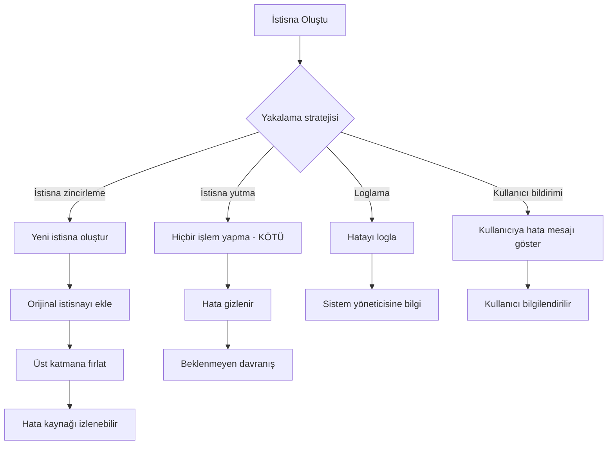

### Modern Java Özellikleri ile Hata Yönetimi

Aşağıdaki örnek, tüm ileri düzey teknikleri bir arada göstermektedir:

<!-- CODE_META: IleriHataYonetimi.java - İleri düzey hata yönetimi -->
```java
import java.io.*;
import java.sql.*;

public class IleriHataYonetimi {
    
    // try-with-resources ile otomatik kaynak yönetimi
    public static void dosyaOkuModern() {
        try (BufferedReader reader = new BufferedReader(new FileReader("dosya.txt"))) {
            String satir;
            while ((satir = reader.readLine()) != null) {
                System.out.println(satir);
            }
        } catch (IOException e) {
            System.err.println("Dosya okuma hatası: " + e.getMessage());
            // Hata loglama
            e.printStackTrace();
        }
    }
    
    // Multi-catch ile çoklu istisna yakalama
    public static void cokluIstisnaYakalama() {
        try {
            // Bazı işlemler
            int[] dizi = new int[5];
            dizi[10] = 30 / 0; // Hem ArithmeticException hem ArrayIndexOutOfBoundsException
        } catch (ArithmeticException | ArrayIndexOutOfBoundsException e) {
            System.out.println("Matematiksel veya dizi hatası:

---
title: "Java’da Dosya İşlemleri ve Kalıcı Veri Saklama"
subtitle: "File, FileReader/Writer, BufferedReader/BufferedWriter, NIO.2 ve Serileştirme"
author: "Teknik İçerik Uzmanı"
date: "2025-01-18"
lang: "tr"
---

# Bölüm 16: Dosya Islemleri ve Kalici Veri Saklama

Bu bölümde, Java programlama dilinde dosya işlemlerini ve kalıcı veri saklama yöntemlerini adım adım öğreneceksiniz. Geleneksel `java.io` paketinden modern NIO.2 yaklaşımına kadar geniş bir yelpazede konuları ele alacağız. Ayrıca, nesnelerinizi dosyalara kaydetmek ve geri yüklemek için serileştirme (serialization) kavramını keşfedeceksiniz.

> [!NOTE]
> Bu bölümdeki tüm kod örnekleri Java 11 veya üzeri sürümlerle uyumludur. NIO.2 örneklerinde `Files.readString()` ve `Files.writeString()` gibi Java 11 ile gelen kolaylıklar kullanılmıştır.

## 16.1 Temel Dosya İşlemleri: `File` Sınıfı ve Dosya Sistemi ile Etkileşim

Java’da dosya sistemiyle etkileşim kurmanın en temel yolu `java.io.File` sınıfıdır. Bu sınıf, dosya ve dizin yollarını temsil eder; ancak dosya içeriğini okuma veya yazma işlemleri için doğrudan kullanılmaz. `File` sınıfı daha çok dosya metaverisine erişim, dosya oluşturma/silme ve dizin işlemleri için kullanılır.

### Temel Kavramlar

- **Dosya Yolu (Path)**: Dosyanın dosya sistemindeki konumunu belirtir. Mutlak (absolute) veya bağıl (relative) olabilir.
- **Metaveri (Metadata)**: Dosya boyutu, son değiştirilme tarihi, gizlilik durumu gibi dosya hakkındaki bilgiler.
- **Dizin (Directory)**: Dosyaları organize etmek için kullanılan özel bir dosya türü.

### Örnek: Dosya Varlığını Kontrol Etme ve Dizin Oluşturma

Aşağıdaki örnekte, `File` sınıfını kullanarak bir dosyanın var olup olmadığını kontrol edecek, yoksa yeni bir dosya oluşturacak ve ardından bir dizin oluşturacağız.

<!-- CODE_META: FileExample.java -->
```java
import java.io.File;
import java.io.IOException;

public class FileExample {
    public static void main(String[] args) {
        // Dosya yolu tanımlama
        File file = new File("ornek.txt");

        // Dosya varlığını kontrol etme
        if (!file.exists()) {
            try {
                // Dosya oluşturma
                if (file.createNewFile()) {
                    System.out.println("Dosya oluşturuldu: " + file.getAbsolutePath());
                }
            } catch (IOException e) {
                System.err.println("Dosya oluşturulurken hata: " + e.getMessage());
            }
        } else {
            System.out.println("Dosya zaten mevcut: " + file.getAbsolutePath());
        }

        // Dosya metaverisine erişim
        System.out.println("Dosya boyutu: " + file.length() + " bayt");
        System.out.println("Son değiştirilme: " + file.lastModified());

        // Dizin oluşturma
        File dizin = new File("yeni_dizin");
        if (dizin.mkdir()) {
            System.out.println("Dizin oluşturuldu: " + dizin.getAbsolutePath());
        } else {
            System.out.println("Dizin oluşturulamadı veya zaten mevcut.");
        }

        // Dizini silme (opsiyonel)
        if (dizin.delete()) {
            System.out.println("Dizin silindi: " + dizin.getAbsolutePath());
        }
    }
}
```

### Değerlendirme

`File` sınıfı, dosya sistemiyle temel etkileşimler için yeterlidir. Ancak aşağıdaki sınırlamaları nedeniyle daha gelişmiş sınıflara ihtiyaç duyulur:

- **İçerik okuma/yazma yok**: `File` sınıfı yalnızca metaveri işlemleri için tasarlanmıştır.
- **Performans sorunları**: Doğrudan dosya içeriği okumak için kullanılamaz.
- **Hata yönetimi sınırlı**: `createNewFile()` gibi metotlar `IOException` fırlatır ancak bazı işlemler için yeterli değildir.

> [!TIP]
> `File` sınıfı yerine, daha modern ve esnek olan `java.nio.file.Path` ve `java.nio.file.Files` sınıflarını kullanmayı tercih edin. Bu konuyu Bölüm 4’te detaylı olarak ele alacağız.

```mermaid
graph TD
    A[Dosya İşlemleri] --> B[Dosya Varlığı Kontrolü]
    A --> C[Dosya Oluşturma]
    A --> D[Dizin İşlemleri]
    B --> E["exists() metodu"]
    C --> F["createNewFile() metodu"]
    D --> G["mkdir() metodu"]
    D --> H["delete() metodu"]
```

## 16.2 Karakter Tabanlı Okuma/Yazma: `FileReader` ve `FileWriter`

Metin dosyalarıyla çalışırken karakter akışları (character streams) kullanılır. `java.io` paketindeki `FileReader` ve `FileWriter` sınıfları, metin dosyalarına okuma ve yazma işlemleri için temel karakter akışı sınıflarıdır.

### Temel Kavramlar

- **Karakter Akışı (Character Stream)**: Verileri karakter karakter işleyen akış türüdür. Unicode karakterleri destekler.
- **FileReader**: Bir dosyadan karakter okumak için kullanılır.
- **FileWriter**: Bir dosyaya karakter yazmak için kullanılır.

### Örnek: Metin Dosyasına Yazma ve Okuma

Aşağıdaki örnekte, `FileWriter` ile bir metin dosyasına yazacak ve `FileReader` ile okuyacağız.

<!-- CODE_META: FileReaderWriterExample.java -->
```java
import java.io.FileReader;
import java.io.FileWriter;
import java.io.IOException;

public class FileReaderWriterExample {
    public static void main(String[] args) {
        String dosyaAdi = "metin.txt";

        // Dosyaya yazma
        try (FileWriter writer = new FileWriter(dosyaAdi)) {
            writer.write("Merhaba, Java dosya işlemleri!\n");
            writer.write("Bu bir test satırıdır.\n");
            System.out.println("Dosyaya yazma başarılı.");
        } catch (IOException e) {
            System.err.println("Yazma hatası: " + e.getMessage());
        }

        // Dosyadan okuma
        try (FileReader reader = new FileReader(dosyaAdi)) {
            int karakter;
            System.out.println("Dosya içeriği:");
            while ((karakter = reader.read()) != -1) {
                System.out.print((char) karakter);
            }
        } catch (IOException e) {
            System.err.println("Okuma hatası: " + e.getMessage());
        }
    }
}
```

### Değerlendirme

`FileReader` ve `FileWriter` sınıfları basit metin işlemleri için kullanışlıdır. Ancak aşağıdaki dezavantajları vardır:

- **Performans sorunları**: Her karakter için bir sistem çağrısı yapılır, bu da büyük dosyalarda performans düşüklüğüne neden olur.
- **Tamponlama yok**: Tamponlama mekanizması bulunmadığından, her okuma/yazma işlemi doğrudan diske erişir.
- **Karakter kodlaması**: Varsayılan karakter kodlamasını kullanır (`Charset.defaultCharset()`), bu farklı platformlarda sorun çıkarabilir.

> [!WARNING]
> `FileReader` ve `FileWriter` sınıflarını doğrudan kullanmak yerine, bir sonraki bölümde göreceğiniz `BufferedReader` ve `BufferedWriter` ile sarmalayarak kullanmanız önerilir.

```mermaid
sequenceDiagram
    participant Uygulama
    participant FileWriter
    participant Dosya
    participant FileReader
    
    Uygulama->>FileWriter: write("metin")
    FileWriter->>Dosya: Karakterleri yaz
    Uygulama->>FileReader: read()
    FileReader->>Dosya: Karakter oku
    Dosya-->>FileReader: Karakter döndür
    FileReader-->>Uygulama: Karakter
```

## 16.3 Tamponlu Okuma/Yazma: `BufferedReader` ve `BufferedWriter`

Tamponlama (buffering), performansı artırmak için kullanılan bir tekniktir. `BufferedReader` ve `BufferedWriter` sınıfları, karakter akışlarını tamponlayarak daha verimli okuma/yazma işlemleri sağlar.

### Temel Kavramlar

- **Tampon (Buffer)**: Geçici veri depolama alanı. Veriler önce tampona yazılır, ardından toplu olarak diske aktarılır.
- **BufferedReader**: `FileReader` gibi bir karakter akışını sarmalayarak tamponlu okuma sağlar.
- **BufferedWriter**: `FileWriter` gibi bir karakter akışını sarmalayarak tamponlu yazma sağlar.

### Örnek: Büyük Bir Metin Dosyasını Satır Satır Okuma ve Yazma

Aşağıdaki örnekte, `BufferedWriter` ile bir dosyaya yazacak ve `BufferedReader` ile satır satır okuyacağız.

<!-- CODE_META: BufferedReaderWriterExample.java -->
```java
import java.io.BufferedReader;
import java.io.BufferedWriter;
import java.io.FileReader;
import java.io.FileWriter;
import java.io.IOException;

public class BufferedReaderWriterExample {
    public static void main(String[] args) {
        String dosyaAdi = "buyuk_metin.txt";

        // Dosyaya yazma
        try (BufferedWriter writer = new BufferedWriter(new FileWriter(dosyaAdi))) {
            writer.write("Birinci satır");
            writer.newLine();  // Platform bağımsız satır sonu
            writer.write("İkinci satır");
            writer.newLine();
            writer.write("Üçüncü satır");
            System.out.println("Dosyaya yazma başarılı.");
        } catch (IOException e) {
            System.err.println("Yazma hatası: " + e.getMessage());
        }

        // Dosyadan okuma
        try (BufferedReader reader = new BufferedReader(new FileReader(dosyaAdi))) {
            String satir;
            System.out.println("Dosya içeriği (satır satır):");
            while ((satir = reader.readLine()) != null) {
                System.out.println(satir);
            }
        } catch (IOException e) {
            System.err.println("Okuma hatası: " + e.getMessage());
        }
    }
}
```

### Değerlendirme

Tamponlu sınıfların sağladığı avantajlar:

- **Performans artışı**: Tamponlama sayesinde disk erişim sayısı azalır, bu da büyük dosyalarda önemli performans kazancı sağlar.
- **Kolaylık**: `readLine()` metodu ile satır satır okuma yapılabilir.
- **Platform bağımsızlığı**: `newLine()` metodu, işletim sistemine uygun satır sonu karakterini ekler.

> [!TIP]
> `BufferedReader` ve `BufferedWriter` sınıflarını kullanırken, varsayılan tampon boyutu (8192 karakter) genellikle yeterlidir. Ancak özel durumlar için farklı boyutlar belirleyebilirsiniz: `new BufferedReader(reader, 16384)`

```mermaid
flowchart LR
    A[Uygulama] --> B[BufferedWriter]
    B --> C[Tampon]
    C --> D[Dosya]
    
    E[Dosya] --> F[Tampon]
    F --> G[BufferedReader]
    G --> H[Uygulama]
    
    style C fill:#f9f,stroke:#333,stroke-width:2px
    style F fill:#f9f,stroke:#333,stroke-width:2px
```

## 16.4 Modern Dosya İşlemleri: NIO.2 (`Path`, `Files`, `BufferedReader/BufferedWriter`)

Java 7 ile birlikte gelen NIO.2 (New I/O 2) paketi, dosya işlemleri için daha modern, esnek ve güvenilir bir yaklaşım sunar. `java.nio.file` paketindeki `Path` ve `Files` sınıfları, geleneksel IO’ya göre birçok avantaj sağlar.

### Temel Kavramlar

- **Path**: Dosya veya dizin yolunu temsil eden interface. `Paths.get()` metodu ile oluşturulur.
- **Files**: Dosya işlemleri için statik metotlar içeren yardımcı sınıf.
- **StandardOpenOption**: Dosya açma seçeneklerini belirten enum (CREATE, APPEND, TRUNCATE_EXISTING vb.).

### Örnek: NIO.2 ile Temel Dosya İşlemleri

Aşağıdaki örnekte, NIO.2 kullanarak dosya yazma, okuma ve dizin listeleme işlemlerini gerçekleştireceğiz.

<!-- CODE_META: NIO2Example.java -->
```java
import java.io.IOException;
import java.nio.file.Files;
import java.nio.file.Path;
import java.nio.file.Paths;
import java.nio.file.StandardOpenOption;
import java.util.stream.Stream;

public class NIO2Example {
    public static void main(String[] args) {
        Path dosyaYolu = Paths.get("nio_ornek.txt");

        // Dosyaya yazma
        try {
            Files.writeString(dosyaYolu, "NIO.2 ile yazma işlemi\n", StandardOpenOption.CREATE);
            Files.writeString(dosyaYolu, "İkinci satır\n", StandardOpenOption.APPEND);
            System.out.println("Dosyaya yazma başarılı.");
        } catch (IOException e) {
            System.err.println("Yazma hatası: " + e.getMessage());
        }

        // Dosyadan okuma
        try {
            String icerik = Files.readString(dosyaYolu);
            System.out.println("Dosya içeriği:");
            System.out.println(icerik);
        } catch (IOException e) {
            System.err.println("Okuma hatası: " + e.getMessage());
        }

        // Dizin listeleme
        System.out.println("\nMevcut dizin içeriği:");
        try (Stream<Path> stream = Files.list(Paths.get("."))) {
            stream.forEach(System.out::println);
        } catch (IOException e) {
            System.err.println("Dizin listeleme hatası: " + e.getMessage());
        }

        // Alternatif: BufferedReader/BufferedWriter ile NIO.2
        Path alternatifDosya = Paths.get("alternatif.txt");
        try (var writer = Files.newBufferedWriter(alternatifDosya, StandardOpenOption.CREATE)) {
            writer.write("BufferedWriter ile NIO.2\n");
            writer.write("Çok satırlı yazma işlemi\n");
        } catch (IOException e) {
            System.err.println("Yazma hatası: " + e.getMessage());
        }

        try (var reader = Files.newBufferedReader(alternatifDosya)) {
            String satir;
            System.out.println("\nAlternatif dosya içeriği:");
            while ((satir = reader.readLine()) != null) {
                System.out.println(satir);
            }
        } catch (IOException e) {
            System.err.println("Okuma hatası: " + e.getMessage());
        }
    }
}
```

### Değerlendirme

NIO.2’nin geleneksel IO’ya göre avantajları:

- **Daha kısa kod**: `Files.writeString()` ve `Files.readString()` gibi metotlar sayesinde daha az kod yazılır.
- **Gelişmiş hata yönetimi**: Daha anlamlı hata mesajları ve istisna türleri.
- **Sembolik link desteği**: `Files.isSymbolicLink()` gibi metotlarla sembolik linklerle çalışma imkanı.
- **try-with-resources uyumluluğu**: `Files.list()` gibi metotlar `AutoCloseable` arayüzünü uygular.
- **Performans**: NIO.2, kanal (channel) ve tampon (buffer) kullanarak daha verimli I/O işlemleri sağlar.

> [!IMPORTANT]
> NIO.2 kullanırken `Files.list()` veya `Files.walk()` gibi metotlarla açılan stream’leri mutlaka kapatın. Aksi takdirde kaynak sızıntısı (resource leak) oluşabilir.

```mermaid
graph TB
    subgraph NIO.2 Mimarisi
        A[Path] --> B[Files Sınıfı]
        B --> C[Okuma İşlemleri]
        B --> D[Yazma İşlemleri]
        B --> E[Dizin İşlemleri]
        C --> F[readString]
        C --> G[newBufferedReader]
        D --> H[writeString]
        D --> I[newBufferedWriter]
        E --> J[list]
        E --> K[walk]
    end
```

## 16.5 Nesne Kalıcılığı: Serileştirme (Serialization)

Serileştirme, Java nesnelerini byte akışına dönüştürme (serialization) ve byte akışından nesne oluşturma (deserialization) işlemidir. Bu sayede nesnelerinizi dosyalara kaydedebilir, ağ üzerinden gönderebilir veya veritabanında saklayabilirsiniz.

### Temel Kavramlar

- **Serializable**: Bir sınıfın serileştirilebilir olduğunu belirten işaretleyici (marker) arayüz.
- **ObjectOutputStream**: Nesneleri byte akışına dönüştüren sınıf.
- **ObjectInputStream**: Byte akışından nesne oluşturan sınıf.
- **serialVersionUID**: Serileştirilmiş nesnenin sürümünü belirten benzersiz kimlik.
- **transient**: Serileştirme sırasında atlanacak alanları belirten anahtar kelime.

### Örnek: Person Sınıfını Serileştirme ve Deserileştirme

Aşağıdaki örnekte, `Person` sınıfını serileştirip dosyaya yazacak ve ardından dosyadan okuyup nesneye dönüştüreceğiz.

<!-- CODE_META: SerializationExample.java -->
```java
import java.io.FileInputStream;
import java.io.FileOutputStream;
import java.io.IOException;
import java.io.ObjectInputStream;
import java.io.ObjectOutputStream;
import java.io.Serializable;

// Person sınıfı - Serializable arayüzünü uygular
class Person implements Serializable {
    private static final long serialVersionUID = 1L;
    
    String ad;
    int yas;
    transient String geciciBilgi;  // Serileştirilmeyecek

    Person(String ad, int yas) {
        this.ad = ad;
        this.yas = yas;
        this.geciciBilgi = "Bu bilgi serileştirilmeyecek";
    }

    @Override
    public String toString() {
        return "Person{ad='" + ad + "', yas=" + yas + ", geciciBilgi='" + geciciBilgi + "'}";
    }
}

public class SerializationExample {
    public static void main(String[] args) {
        String dosyaAdi = "kisi.dat";

        // Serileştirme (Nesneyi dosyaya yazma)
        try (ObjectOutputStream oos = new ObjectOutputStream(new FileOutputStream(dosyaAdi))) {
            Person kisi = new Person("Ali", 30);
            oos.writeObject(kisi);
            System.out.println("Nesne dosyaya yazıldı: " + kisi);
        } catch (IOException e) {
            System.err.println("Serileştirme hatası: " + e.getMessage());
        }

        // Deserileştirme (Dosyadan nesne okuma)
        try (ObjectInputStream ois = new ObjectInputStream(new FileInputStream(dosyaAdi))) {
            Person okunanKisi = (Person) ois.readObject();
            System.out.println("Dosyadan okunan nesne: " + okunanKisi);
            System.out.println("Ad: " + okunanKisi.ad + ", Yaş: " + okunanKisi.yas);
            System.out.println("Geçici bilgi (null olmalı): " + okunanKisi.geciciBilgi);
        } catch (IOException | ClassNotFoundException e) {
            System.err.println("Deserileştirme hatası: " + e.getMessage());
        }
    }
}
```

### Değerlendirme

Serileştirmenin avantajları ve dikkat edilmesi gereken noktalar:

- **Kolay kullanım**: `Serializable` arayüzünü uygulamak yeterlidir.
- **Nesne grafiği desteği**: Bir nesne serileştirilirken, ona referans veren diğer nesneler de otomatik olarak serileştirilir.
- **Güvenlik riskleri**: Deserileştirme sırasında geçersiz veya kötü niyetli veriler yüklenebilir. Bu nedenle güvenilmeyen kaynaklardan gelen verileri deserileştirmeyin.
- **serialVersionUID önemi**: Sınıf yapısı değiştiğinde, eski serileştirilmiş nesneler uyumsuz hale gelebilir. `serialVersionUID` bu sorunu çözmek için kullanılır.
- **transient alanlar**: Serileştirilmesini istemediğiniz alanları `transient` olarak işaretleyin.

> [!CAUTION]
> Serileştirme, Java’ya özgü bir formattır. Farklı platformlar veya diller arasında veri alışverişi yapacaksanız JSON, XML veya Protocol Buffers gibi standart formatları tercih edin.

```mermaid
flowchart TD
    subgraph Serileştirme Süreci
        A[Nesne] --> B[ObjectOutputStream]
        B --> C[Byte Akışı]
        C --> D[Dosya]
    end
    
    subgraph Deserileştirme Süreci
        E[Dosya] --> F[Byte Akışı]
        F --> G[ObjectInputStream]
        G --> H[Nesne]
    end
    
    D --> E
```

## 16.6 Bölüm Özeti

Bu bölümde, Java’da dosya işlemleri ve kalıcı veri saklama konularını kapsamlı bir şekilde ele aldık:

1. **File Sınıfı**: Dosya ve dizin yollarını temsil eder, metaveri erişimi ve temel dosya işlemleri için kullanılır.
2. **FileReader/FileWriter**: Karakter tabanlı okuma/yazma için temel sınıflardır, ancak performans sorunları nedeniyle tamponlu sınıflarla kullanılmalıdır.
3. **BufferedReader/BufferedWriter**: Tamponlama sayesinde performansı artırır ve `readLine()` gibi kolaylıklar sağlar.
4. **NIO.2**: Modern, esnek ve güvenilir dosya işlemleri için `Path` ve `Files` sınıflarını kullanır.
5. **Serileştirme**: Java nesnelerini byte akışına dönüştürerek kalıcı hale getirme yöntemidir.

## 16.7 Terim Sözlüğü

| Terim | Açıklama |
|-------|----------|
| **Tampon (Buffer)** | Geçici veri depolama alanı, I/O performansını artırır |
| **Karakter Akışı (Character Stream)** | Verileri karakter karakter işleyen akış türü |
| **Metaveri (Metadata)** | Dosya hakkındaki bilgiler (boyut, tarih, izinler vb.) |
| **Serileştirme (Serialization)** | Nesneleri byte akışına dönüştürme işlemi |
| **Deserileştirme (Deserialization)** | Byte akışından nesne oluşturma işlemi |
| **transient** | Serileştirme sırasında atlanacak alanları belirten anahtar kelime |
| **serialVersionUID** | Serileştirilmiş nesnenin sürümünü belirten kimlik |
| **NIO.2** | Java 7 ile gelen yeni I/O API’si |

## 16.8 Sorular

1. `File` sınıfı ile `Path` arayüzü arasındaki temel farklar nelerdir?
2. `FileReader` ve `FileWriter` sınıflarının performans sorunlarını nasıl çözebiliriz?
3. NIO.2’nin geleneksel IO’ya göre avantajları nelerdir?
4. Serileştirme sırasında `transient` anahtar kelimesinin rolü nedir?
5. `serialVersionUID` neden önemlidir ve ne zaman kullanılmalıdır?
6. NIO.2’de `Files.list()` metodu neden try-with-resources ile kullanılmalıdır?

## 16.9 Alıştırmalar

1. **Dosya Kopyalama**: `BufferedInputStream` ve `BufferedOutputStream` kullanarak bir dosyayı başka bir konuma kopyalayan bir program yazın.

2. **Metin Analizi**: Bir metin dosyasını okuyarak içindeki kelime sayısını, satır sayısını ve karakter sayısını hesaplayan bir program yazın (NIO.2 kullanarak).

3. **Öğrenci Kayıt Sistemi**: Bir `Ogrenci` sınıfı oluşturun (ad, soyad, numara, not ortalaması). Bu sınıfı serileştirilebilir yapın ve bir dosyaya kaydedip geri okuyan bir program yazın.

4. **Dizin Gezgini**: Kullanıcıdan bir dizin yolu alan ve bu dizindeki tüm dosyaları (alt dizinler dahil) listeleyen bir program yazın (`Files.walk()` kullanarak).

5. **JSON Alternatifi**: Jackson kütüphanesini kullanarak bir `Person` nesnesini JSON formatında dosyaya yazıp geri okuyan bir program yazın (opsiyonel, ileri seviye).

# Bölüm 17: Sinif, Nesne, Constructor ve Kapsulleme


```yaml
---
title: "Sınıf, Nesne, Constructor ve Kapsülleme"
subtitle: "Java'da Nesne Yönelimli Programlamanın Temelleri"
author: "Teknik Kitap Yazarı"
date: 2024-01-15
lang: tr
subject: "Java Programlama"
keywords: [Java, OOP, sınıf, nesne, constructor, kapsülleme, getter, setter, erişim belirteci]
abstract: |
  Bu bölümde, Java'da nesne yönelimli programlamanın (OOP) temel yapı taşları olan sınıf ve nesne kavramlarını, constructor (yapıcı metot) çeşitlerini, this anahtar kelimesini, erişim belirteçlerini ve kapsülleme (encapsulation) prensibini öğreneceksiniz. Gerçek hayat örnekleri ve uygulamalı kod parçacıkları ile konuyu pekiştireceksiniz.
---
```

## 17.1 Giriş: Nesne Yönelimli Programlamanın Temelleri

Nesne Yönelimli Programlama (OOP), yazılım geliştirmede devrim yaratan bir paradigmadır. Java, OOP prensiplerini tam olarak destekleyen bir dildir. Bu bölümde OOP'nin dört temel prensibinden ikisi olan **kapsülleme** ve **soyutlama** üzerinde duracağız.

### 1.1. Neden Sınıf ve Nesne?

Bir yazılım projesi düşünün: bir okul kayıt sistemi. Öğrenciler, öğretmenler, dersler, notlar... Bunların her biri birer **nesne** olarak modellenebilir. Bir öğrencinin adı, soyadı, numarası, notları vardır. Bunlar **özellikler** (alanlar/fields). Ayrıca öğrenci ders alabilir, not girebilir, mezun olabilir. Bunlar da **davranışlar** (metotlar).

> **Pedagojik Not:** Sınıf, bir "kalıp" veya "şablon" gibidir. Nesne ise bu kalıptan üretilen somut bir varlıktır. Örneğin, "İnsan" bir sınıftır; "Ali" ise bir nesnedir.

### 1.2. Gerçek Hayattan Benzetmeler

| Gerçek Hayat | Java'da Karşılığı |
|---|---|
| Araba tasarım çizimi | Sınıf (Class) |
| Üretilen her bir araba | Nesne (Object) |
| Arabanın rengi, modeli | Alan (Field) |
| Arabanın hızlanması, durması | Metot (Method) |

Bu bölüm boyunca, bu benzetmeleri kullanarak kavramları somutlaştıracağız.

## 17.2 Sınıf Tanımlama

Sınıf, bir nesnenin blueprint'idir (plan/tasarım). Java'da bir sınıf tanımlamak için `class` anahtar kelimesi kullanılır.

### 2.1. Sınıfın Yapısı

<!-- CODE_META
id: bolum-17_kod01
chapter_id: bolum-17
kind: example
title: "Kod 1"
file: "Ornek00.java"
mainClass: Ornek00
extract: true
test: compile
github: true
qr: dual
-->

```java
// Kodu çalıştırmak için: javac Ogrenci.java && java Ogrenci
public class Ogrenci {
    // Alanlar (Fields) - Özellikler
    String ad;
    String soyad;
    int numara;
    
    // Metotlar (Methods) - Davranışlar
    void bilgiGoster() {
        System.out.println("Ad: " + ad + ", Soyad: " + soyad + ", No: " + numara);
    }
}
```

### 2.2. Alanlar ve Metotlar

- **Alanlar (Fields):** Sınıfın durumunu (state) tutan değişkenlerdir. Her nesne bu alanların kendi kopyasına sahiptir.
- **Metotlar (Methods):** Sınıfın davranışlarını tanımlar.

### 2.3. İlk Sınıf Örneği: Ogrenci

Yukarıdaki `Ogrenci` sınıfı, bir öğrencinin temel özelliklerini ve davranışlarını tanımlar. Ancak henüz bu sınıftan bir nesne oluşturmadık.

> **Önemli:** Sınıf tek başına çalıştırılabilir bir program değildir. `main` metodu içermez. Nesne oluşturmak için başka bir sınıfta (veya aynı sınıfta) `main` metodu kullanılır.

## 17.3 Nesne Oluşturma

Bir sınıftan nesne (örnek/instance) oluşturmak için `new` anahtar kelimesi kullanılır.

### 3.1. new Anahtar Kelimesi

`new` operatörü, bellekte (heap) yeni bir nesne için yer ayırır ve constructor'ı çağırarak nesneyi başlatır.

<!-- CODE_META
id: bolum-17_kod02
chapter_id: bolum-17
kind: example
title: "Kod 2"
file: "Ornek01.java"
mainClass: Ornek01
extract: true
test: compile
github: true
qr: dual
-->

```java
Ogrenci ogr1 = new Ogrenci();
```

Burada:
- `Ogrenci` : Referans tipi (sınıf adı)
- `ogr1` : Referans değişkeni (nesneyi işaret eder)
- `new Ogrenci()` : Yeni bir Ogrenci nesnesi oluşturur

### 3.2. Referans Değişkenleri

Referans değişkeni, bellekteki nesnenin adresini tutar. Aslında nesnenin kendisi değil, ona erişim sağlayan bir "uzaktan kumanda" gibidir.

<!-- CODE_META
id: bolum-17_kod03
chapter_id: bolum-17
kind: example
title: "Kod 3"
file: "Ornek02.java"
mainClass: Ornek02
extract: true
test: compile
github: true
qr: dual
-->

```java
Ogrenci ogr1 = new Ogrenci(); // ogr1 bir referans
Ogrenci ogr2 = ogr1; // ogr2 de aynı nesneyi işaret eder
ogr1.ad = "Ahmet";
System.out.println(ogr2.ad); // "Ahmet" yazdırır (aynı nesne!)
```

### 3.3. Nesne Üyelerine Erişim (Nokta Operatörü)

Nesnenin alanlarına ve metotlarına erişmek için nokta (.) operatörü kullanılır.

<!-- CODE_META
id: bolum-17_kod04
chapter_id: bolum-17
kind: example
title: "Kod 4"
file: "Ornek03.java"
mainClass: Ornek03
extract: true
test: compile
github: true
qr: dual
-->

```java
// Dosya adı: TestOgrenci.java
public class TestOgrenci {
    public static void main(String[] args) {
        Ogrenci ogr1 = new Ogrenci();
        ogr1.ad = "Ayşe";
        ogr1.soyad = "Yılmaz";
        ogr1.numara = 1234;
        
        ogr1.bilgiGoster(); // Çıktı: Ad: Ayşe, Soyad: Yılmaz, No: 1234
    }
}
```

## 17.4 Constructor (Yapıcı Metot)

Constructor, nesne oluşturulurken otomatik olarak çağrılan özel bir metottur. Adı sınıf adıyla aynı olmalıdır ve geri dönüş tipi **olmaz** (void bile değil!).

### 4.1. Constructor Nedir?

Constructor'ın temel görevi, nesneyi başlatmaktır (initialization). Genellikle alanlara ilk değerleri atamak için kullanılır.

### 4.2. Default Constructor (Varsayılan Yapıcı)

Eğer bir sınıfta hiç constructor tanımlanmazsa, Java derleyicisi otomatik olarak **parametresiz bir default constructor** ekler. Bu constructor hiçbir işlem yapmaz (boş gövde).

<!-- CODE_META
id: bolum-17_kod05
chapter_id: bolum-17
kind: example
title: "Kod 5"
file: "Ornek04.java"
mainClass: Ornek04
extract: true
test: compile
github: true
qr: dual
-->

```java
// Dosya adı: Araba.java
public class Araba {
    String marka;
    int yil;
    
    // Default constructor (derleyici tarafından eklenir)
    // public Araba() { }
}
```

### 4.3. Parametreli Constructor

Kendi constructor'ınızı tanımlayarak nesneyi oluştururken alanlara değer atayabilirsiniz.

<!-- CODE_META
id: bolum-17_kod06
chapter_id: bolum-17
kind: example
title: "Kod 6"
file: "Ornek05.java"
mainClass: Ornek05
extract: true
test: compile
github: true
qr: dual
-->

```java
// Dosya adı: Araba.java
public class Araba {
    String marka;
    int yil;
    
    // Parametreli constructor
    public Araba(String m, int y) {
        marka = m;
        yil = y;
    }
}
```

> **Pedagojik Uyarı:** Kendi constructor'ınızı tanımladığınızda, default constructor **otomatik olarak eklenmez**. Eğer parametresiz constructor'a da ihtiyacınız varsa, onu da açıkça tanımlamalısınız.

### 4.4. Constructor Overloading (Aşırı Yükleme)

Tıpkı metotlar gibi, constructor'lar da aşırı yüklenebilir. Farklı parametre listelerine sahip birden fazla constructor tanımlayabilirsiniz.

<!-- CODE_META
id: bolum-17_kod07
chapter_id: bolum-17
kind: example
title: "Kod 7"
file: "Ornek06.java"
mainClass: Ornek06
extract: true
test: compile
github: true
qr: dual
-->

```java
// Dosya adı: Araba.java
public class Araba {
    String marka;
    int yil;
    String renk;
    
    // Constructor 1: Parametresiz
    public Araba() {
        marka = "Bilinmiyor";
        yil = 2024;
        renk = "Beyaz";
    }
    
    // Constructor 2: İki parametreli
    public Araba(String m, int y) {
        marka = m;
        yil = y;
        renk = "Beyaz";
    }
    
    // Constructor 3: Üç parametreli
    public Araba(String m, int y, String r) {
        marka = m;
        yil = y;
        renk = r;
    }
}
```

### 4.5. this Anahtar Kelimesi

`this` anahtar kelimesi, **mevcut nesneyi** (current object) referans eder. İki temel kullanımı vardır:

#### 4.5.1. Alan-Gölgeleme (Shadowing) Sorunu

Parametre isimleri ile alan isimleri aynı olduğunda, alan isimleri gölgelenir. `this` kullanarak alanlara erişiriz.

<!-- CODE_META
id: bolum-17_kod08
chapter_id: bolum-17
kind: example
title: "Kod 8"
file: "Ornek07.java"
mainClass: Ornek07
extract: true
test: compile
github: true
qr: dual
-->

```java
// Dosya adı: Araba.java
public class Araba {
    String marka;
    int yil;
    
    public Araba(String marka, int yil) {
        // marka = marka; // HATA! Parametre kendine atanır, alan değişmez
        this.marka = marka; // this.marka alanı, sağdaki parametreyi işaret eder
        this.yil = yil;
    }
}
```

#### 4.5.2. Diğer Constructor'ı Çağırma

Bir constructor içinden, aynı sınıfın başka bir constructor'ını `this(...)` ile çağırabiliriz. Bu, kod tekrarını önler.

<!-- CODE_META
id: bolum-17_kod09
chapter_id: bolum-17
kind: example
title: "Kod 9"
file: "Ornek08.java"
mainClass: Ornek08
extract: true
test: compile
github: true
qr: dual
-->

```java
// Dosya adı: Araba.java
public class Araba {
    String marka;
    int yil;
    String renk;
    
    public Araba() {
        this("Bilinmiyor", 2024, "Beyaz"); // 3 parametreli constructor'ı çağır
    }
    
    public Araba(String marka, int yil) {
        this(marka, yil, "Beyaz"); // 3 parametreli constructor'ı çağır
    }
    
    public Araba(String marka, int yil, String renk) {
        this.marka = marka;
        this.yil = yil;
        this.renk = renk;
    }
}
```

> **Önemli Kural:** `this(...)` çağrısı, constructor'ın **ilk satırı** olmalıdır. Aksi takdirde derleme hatası alırsınız.

## 17.5 Erişim Belirteçleri (Access Modifiers) ve Kapsülleme

### 5.1. Erişim Belirteçleri

Java'da dört erişim seviyesi vardır:

| Belirteç | Aynı Sınıf | Aynı Paket | Alt Sınıf (Farklı Paket) | Herhangi Bir Sınıf |
|---|---|---|---|---|
| `private` | ✓ | ✗ | ✗ | ✗ |
| `default` (belirteç yok) | ✓ | ✓ | ✗ | ✗ |
| `protected` | ✓ | ✓ | ✓ | ✗ |
| `public` | ✓ | ✓ | ✓ | ✓ |

### 5.2. Kapsülleme (Encapsulation) İlkesi

Kapsülleme, verileri (alanları) ve bu veriler üzerinde işlem yapan metotları bir arada tutma ve dışarıdan doğrudan erişimi kısıtlama prensibidir.

> **Temel Kural:** Alanlar `private` yapılır, bu alanlara erişim için `public` getter ve setter metotları sağlanır.

### 5.3. Getter ve Setter Metotları

- **Getter:** Alanın değerini döndürür. Adlandırma: `getAlanAdi()`
- **Setter:** Alanın değerini ayarlar. Adlandırma: `setAlanAdi(veriTipi deger)`

<!-- CODE_META
id: bolum-17_kod10
chapter_id: bolum-17
kind: example
title: "Kod 10"
file: "Ornek09.java"
mainClass: Ornek09
extract: true
test: compile
github: true
qr: dual
-->

```java
// Dosya adı: Kisi.java
public class Kisi {
    private String ad;
    private int yas;
    
    // Getter
    public String getAd() {
        return ad;
    }
    
    // Setter
    public void setAd(String ad) {
        this.ad = ad;
    }
    
    public int getYas() {
        return yas;
    }
    
    public void setYas(int yas) {
        if (yas >= 0 && yas <= 150) { // Veri doğrulama
            this.yas = yas;
        } else {
            System.out.println("Geçersiz yaş: " + yas);
        }
    }
}
```

### 5.4. Neden Kapsülleme?

1. **Veri Bütünlüğü:** Setter içinde doğrulama yaparak geçersiz değerlerin atanmasını engelleyebiliriz.
2. **Güvenlik:** Hassas verilere doğrudan erişim engellenir.
3. **Bakım Kolaylığı:** İç yapıyı değiştirdiğimizde dışarıdaki kodu etkilemeden yapabiliriz.
4. **Soyutlama:** Kullanıcı, iç detayları bilmeden sadece public arayüzü kullanır.

## 17.6 Uygulamalı Örnek: BankaHesabi Sınıfı

Şimdi öğrendiklerimizi birleştirerek kapsamlı bir örnek yapalım.

<!-- CODE_META
id: bolum-17_kod11
chapter_id: bolum-17
kind: example
title: "Kod 11"
file: "Ornek10.java"
mainClass: Ornek10
extract: true
test: compile
github: true
qr: dual
-->

```java
// Dosya adı: BankaHesabi.java
public class BankaHesabi {
    // Private alanlar - kapsülleme
    private String hesapNo;
    private String musteriAdi;
    private double bakiye;
    
    // Constructor
    public BankaHesabi(String hesapNo, String musteriAdi, double ilkBakiye) {
        this.hesapNo = hesapNo;
        this.musteriAdi = musteriAdi;
        if (ilkBakiye >= 0) {
            this.bakiye = ilkBakiye;
        } else {
            System.out.println("Başlangıç bakiyesi negatif olamaz! Bakiye 0 olarak ayarlandı.");
            this.bakiye = 0;
        }
    }
    
    // Getter metotları (sadece okuma)
    public String getHesapNo() {
        return hesapNo;
    }
    
    public String getMusteriAdi() {
        return musteriAdi;
    }
    
    public double getBakiye() {
        return bakiye;
    }
    
    // Setter (sadece musteriAdi için - hesapNo ve bakiye doğrudan değiştirilmemeli)
    public void setMusteriAdi(String musteriAdi) {
        this.musteriAdi = musteriAdi;
    }
    
    // İşlem metotları
    public void paraYatir(double miktar) {
        if (miktar > 0) {
            bakiye += miktar;
            System.out.println(miktar + " TL yatırıldı. Yeni bakiye: " + bakiye);
        } else {
            System.out.println("Yatırılacak miktar pozitif olmalıdır!");
        }
    }
    
    public void paraCek(double miktar) {
        if (miktar > 0 && miktar <= bakiye) {
            bakiye -= miktar;
            System.out.println(miktar + " TL çekildi. Yeni bakiye: " + bakiye);
        } else if (miktar <= 0) {
            System.out.println("Çekilecek miktar pozitif olmalıdır!");
        } else {
            System.out.println("Yetersiz bakiye! Mevcut bakiye: " + bakiye);
        }
    }
}
```

<!-- CODE_META
id: bolum-17_kod12
chapter_id: bolum-17
kind: example
title: "Kod 12"
file: "Ornek11.java"
mainClass: Ornek11
extract: true
test: compile
github: true
qr: dual
-->

```java
// Dosya adı: TestBanka.java
public class TestBanka {
    public static void main(String[] args) {
        // Nesne oluşturma
        BankaHesabi hesap = new BankaHesabi("TR123456", "Ali Veli", 1000);
        
        // Getter ile okuma
        System.out.println("Hesap No: " + hesap.getHesapNo());
        System.out.println("Müşteri: " + hesap.getMusteriAdi());
        System.out.println("Bakiye: " + hesap.getBakiye());
        
        // İşlemler
        hesap.paraYatir(500);
        hesap.paraCek(200);
        hesap.paraCek(1500); // Yetersiz bakiye
        
        // Direkt erişim denemesi (derleme hatası!)
        // hesap.bakiye = 1000000; // HATA: bakiye private!
    }
}
```

## 17.7 Özet

Bu bölümde:
- **Sınıf** kavramını ve nasıl tanımlandığını,
- **Nesne** oluşturmayı (`new` anahtar kelimesi),
- **Constructor** çeşitlerini (default, parametreli, overloaded),
- **this** anahtar kelimesinin kullanımını (gölgeleme sorununu çözme ve constructor zincirleme),
- **Erişim belirteçlerini** (public, private, protected, default),
- **Kapsülleme (Encapsulation)** prensibini ve **getter/setter** metotlarını öğrendik.

Kapsülleme, OOP'nin en önemli prensiplerinden biridir ve veri güvenliği, bakım kolaylığı ve esneklik sağlar.

## 17.8 Terim Sözlüğü

| Terim | Açıklama |
|---|---|
| **Sınıf (Class)** | Nesnelerin oluşturulması için bir şablon/taslak |
| **Nesne (Object)** | Sınıfın bir örneği (instance), bellekte yer kaplayan varlık |
| **Constructor** | Nesne oluşturulurken çağrılan, başlatma işlemi yapan özel metot |
| **this** | Mevcut nesneyi referans eden anahtar kelime |
| **Kapsülleme** | Verileri private yapıp, public metotlarla erişim sağlama prensibi |
| **Getter** | Private alanın değerini döndüren metot |
| **Setter** | Private alana değer atayan metot (genellikle doğrulama içerir) |
| **Erişim Belirteci** | Sınıf üyelerine erişim seviyesini belirleyen anahtar kelime |

## 17.9 Sorular ve Alıştırmalar

### Sorular

1. Sınıf ile nesne arasındaki fark nedir? Gerçek hayattan bir örnek verin.
2. Constructor'ın metotlardan farkı nedir? (En az 2 fark söyleyin)
3. `this` anahtar kelimesi hangi durumlarda kullanılır? İki örnek verin.
4. Kapsülleme neden önemlidir? Üç neden sıralayın.
5. `private` bir alana nasıl erişilir? Neden doğrudan erişime izin verilmez?

### Alıştırmalar

**Alıştırma 1:** Aşağıdaki özelliklere sahip bir `Kitap` sınıfı tasarlayın:
- Private alanlar: `String isbn`, `String baslik`, `String yazar`, `double fiyat`
- Parametreli constructor (tüm alanlar)
- Getter metotları (tüm alanlar için)
- Setter metotları (sadece `fiyat` için, fiyat 0'dan büyük olmalı)
- `bilgiGoster()` metodu (kitap bilgilerini yazdırır)
- Test sınıfında iki kitap nesnesi oluşturun ve metotları test edin.

**Alıştırma 2:** Aşağıdaki kodu inceleyin ve hataları bulun:

<!-- CODE_META
id: bolum-17_kod13
chapter_id: bolum-17
kind: example
title: "Kod 13"
file: "Ornek12.java"
mainClass: Ornek12
extract: true
test: compile
github: true
qr: dual
-->

```java
public class Dikdortgen {
    private int en;
    private int boy;
    
    public Dikdortgen(int en, int boy) {
        en = en; // Hata var!
        boy = boy; // Hata var!
    }
    
    public int getEn() {
        return en;
    }
    
    public void setEn(int en) {
        this.en = en;
    }
}
```

**Alıştırma 3:** Aşağıdaki kodu inceleyin. Çıktı ne olur? Neden?

<!-- CODE_META
id: bolum-17_kod14
chapter_id: bolum-17
kind: example
title: "Kod 14"
file: "Ornek13.java"
mainClass: Ornek13
extract: true
test: compile
github: true
qr: dual
-->

```java
public class Test {
    private int deger;
    
    public Test() {
        this(10);
    }
    
    public Test(int deger) {
        this.deger = deger;
    }
    
    public static void main(String[] args) {
        Test t = new Test();
        System.out.println(t.deger);
    }
}
```

**Alıştırma 4 (Zor):** Bir `Hasta` sınıfı tasarlayın:
- Private alanlar: `int hastaNo`, `String ad`, `String soyad`, `int yas`, `String teshis`
- Constructor: hastaNo, ad, soyad, yas (teshis başlangıçta "Belirlenmedi")
- Getter/Setter (yas için 0-120 arası doğrulama)
- `teshisGuncelle(String yeniTeshis)` metodu
- `hastaBilgisi()` metodu (tüm bilgileri yazdırır)
- Test sınıfında 3 hasta oluşturun, bazılarının teşhisini güncelleyin.

### Diagram: Nesne Oluşturma Süreci

```mermaid
graph TD
    A[Sınıf Tanımı class Ogrenci] --> B[new Ogrenci Bellekte yer ayrılır]
    B --> C[Constructor çağrılır Alanlar başlatılır]
    C --> D[Referans değişkene atanır: Ogrenci ogr1]
    D --> E[Nesne kullanıma hazır ogr1.ad = "Ali"]
```

### Diagram: Kapsülleme Mimarisi

```mermaid
graph LR
    subgraph Dış Dünya
        A[Kullanıcı Kodu]
    end
    subgraph Sınıf
        B[Public Arayüz Getter/Setter/Metotlar]
        C[Private Alanlar Veri]
    end
    A -->|Erişir| B
    B -->|Kontrol Eder| C
    C -->|Veri Sağlar| B
    B -->|Sonuç Döndürür| A
```

---

**Bölüm Sonu.** Bir sonraki bölümde **Kalıtım (Inheritance)** ve **Çok Biçimlilik (Polymorphism)** konularını işleyeceğiz.

# Bölüm 18: Kalitim ve Interface'e Kisa On Bakis


```yaml
---
title: "Kalitim ve Interface'e Kisa On Bakis"
subtitle: "Nesne Yonelimli Programlamada extends, super, override, abstract class, interface ve polymorphism"
author: "Teknik Kitap Yazarı"
date: 2024-01-15
lang: tr
subject: "Java Programlama"
keywords: [kalitim, inheritance, interface, abstract, polymorphism, Java, OOP]
---
```

## 18.1 Giris: Kalitim ve Arayuz Kavramlarina Giris

Nesne yonelimli programlama (OOP), yazilim gelistirmede kod tekrarini azaltmak, bakimi kolaylastirmak ve gercek dunya kavramlarini modellemek icin kullanilan guclu bir paradigmadir. OOP'nin dort temel ilkesi vardir: **Kalitim (Inheritance)**, **Kapsulleme (Encapsulation)**, **Cok Bicimlilik (Polymorphism)** ve **Soyutlama (Abstraction)**. Bu bolumde, kalitim ve arayuz (interface) kavramlarina kisa bir giris yapacak, `extends`, `super`, `override`, `abstract class` ve `polymorphism` temellerini ogreneceksiniz.

> [!TIP]
> **Pedagojik Not:** Bu bolumdeki ornekleri kendi IDE'nizde calistirarak ogrenmeyi pekistirin. Her konsepti anlamadan bir sonrakine gecmeyin.

### 1.1. Nesne Yonelimli Programlamanin Temel Ilkeleri

Java, tamamen nesne yonelimli bir dildir. Siniflar ve nesneler uzerine kuruludur. Kalitim, bir sinifin baska bir sinifin ozelliklerini ve davranislarini miras almasini saglar. Arayuzler ise bir sozlesme gibi davranarak, belirli metotlarin implemente edilmesini zorunlu kilar.

### 1.2. Kalitim ve Arayuzun Onemi

- **Kalitim:** Kod tekrarini onler, hiyerarsik iliskiler kurar ve "is-a" (bir seydir) iliskisini modeller. Ornegin, "Kopek bir Hayvandir."
- **Arayuz:** Farkli siniflarin ayni davranisi farkli sekillerde gerceklestirmesini saglar. "can-do" (yapabilir) iliskisini modeller. Ornegin, "Ucan seyler ucabilir."

### 1.3. Bolumun Hedefleri

Bu bolumun sonunda:
- `extends` ve `super` anahtar kelimelerini kullanarak kalitim yapisi kurabileceksiniz.
- Metot override etme (gecersiz kilma) mantigini anlayacaksiniz.
- `abstract` sinif ve `interface` arasindaki farki kavrayacaksiniz.
- Polimorfizmin nasil calistigini ogreneceksiniz.

---

## 18.2 Kalitim (Inheritance) Temelleri

Kalitim, bir sinifin (alt sinif / subclass) baska bir sinifin (ust sinif / superclass) tum public ve protected uyelerine erismesini saglar. Java'da bir sinif yalnizca bir tane ust sinifa sahip olabilir (tekli kalitim).

### 2.1. extends Anahtar Kelimesi

Bir alt sinif olusturmak icin `extends` anahtar kelimesi kullanilir.

<!-- CODE_META: Dosya adi: Animal.java, konu: Temel kalitim ornegi -->
```java
// Ust sinif
public class Animal {
    protected String name;
    
    public Animal(String name) {
        this.name = name;
    }
    
    public void eat() {
        System.out.println(name + " yemek yiyor.");
    }
}
```

<!-- CODE_META: Dosya adi: Dog.java, konu: extends kullanimi -->
```java
// Alt sinif
public class Dog extends Animal {
    
    public Dog(String name) {
        super(name); // Ust sinifin yapicisini cagirir
    }
    
    public void bark() {
        System.out.println(name + " havlıyor: Hav hav!");
    }
}
```

```mermaid
classDiagram
    class Animal {
        +String name
        +Animal(String name)
        +eat() void
    }
    class Dog {
        +Dog(String name)
        +bark() void
    }
    Animal <|-- Dog
    Animal : +protected name
```

### 2.2. super Anahtar Kelimesi

`super`, ust sinifin uyelerine (degiskenler, metotlar, yapicilar) erismek icin kullanilir. Ozellikle:
- Ust sinifin yapicisini cagirmak icin: `super(parametreler)`
- Ust sinifin override edilmis bir metodunu cagirmak icin: `super.metotAdi()`

<!-- CODE_META: Dosya adi: SuperExample.java, konu: super kullanimi -->
```java
public class SuperExample {
    public static void main(String[] args) {
        Dog dog = new Dog("Karabas");
        dog.eat(); // Animal sinifindan miras alindi
        dog.bark();
    }
}
```

Cikti:
```
Karabas yemek yiyor.
Karabas havlıyor: Hav hav!
```

> [!WARNING]
> `super()` cagrisi, alt sinif yapicisinin ilk satirinda olmalidir. Aksi takdirde derleme hatasi alirsiniz.

### 2.3. Metot Override (Gecersiz Kilma)

Alt sinif, ust sinifta tanimli bir metodu kendi ihtiyacina gore yeniden tanimlayabilir. Buna **override** denir.

<!-- CODE_META: Dosya adi: Cat.java, konu: Metot override -->
```java
public class Cat extends Animal {
    
    public Cat(String name) {
        super(name);
    }
    
    @Override
    public void eat() {
        System.out.println(name + " balik yiyor.");
    }
}
```

`@Override` annotation'u, derleyiciye bu metodun bir ust sinif metodunu gecersiz kilacagini belirtir. Bu, hata yapma olasiligini azaltir.

### 2.4. Ust Sinif Yapici Cagrilari

Her alt sinif yapicisi, dogrudan veya dolayli olarak bir ust sinif yapicisini cagirmalidir. Eger acikca belirtilmezse, Java derleyicisi parametresiz yapiciyi (`super()`) ekler.

<!-- CODE_META: Dosya adi: ConstructorChain.java, konu: Yapici zinciri -->
```java
public class ConstructorChain {
    public static void main(String[] args) {
        Cat cat = new Cat("Pamuk");
        cat.eat();
    }
}
```

Cikti:
```
Pamuk balik yiyor.
```

### 2.5. Java'da Kalitim Zinciri

Java'da siniflar hiyerarsik bir yapi olusturabilir. Ornegin: `Animal -> Mammal -> Dog`.

```mermaid
graph TD
    A[Animal] --> B[Mammal]
    B --> C[Dog]
    B --> D[Cat]
```

---

## 18.3 Abstract Siniflar

Bazen bir sinifin dogrudan nesnesini olusturmak anlamli olmayabilir. Ornegin, "Hayvan" soyut bir kavramdir; sadece "Kopek" veya "Kedi" gibi somut turler vardir. Bu durumda `abstract` sinif kullanilir.

### 3.1. abstract Anahtar Kelimesi

`abstract` anahtar kelimesi, sinifin veya metodun soyut oldugunu belirtir. Soyut siniflarin nesnesi olusturulamaz.

<!-- CODE_META: Dosya adi: AbstractAnimal.java, konu: Abstract sinif -->
```java
public abstract class AbstractAnimal {
    protected String name;
    
    public AbstractAnimal(String name) {
        this.name = name;
    }
    
    // Soyut metot: govdesiz
    public abstract void makeSound();
    
    // Somut metot
    public void sleep() {
        System.out.println(name + " uyuyor.");
    }
}
```

### 3.2. Abstract Metotlar

Soyut metotlarin govdesi yoktur; alt siniflar bu metotlari implemente etmek zorundadir.

<!-- CODE_META: Dosya adi: AbstractDog.java, konu: Abstract sinifi implemente etme -->
```java
public class AbstractDog extends AbstractAnimal {
    
    public AbstractDog(String name) {
        super(name);
    }
    
    @Override
    public void makeSound() {
        System.out.println(name + " havlıyor.");
    }
}
```

### 3.3. Abstract Sinif vs Somut Sinif

| Ozellik | Abstract Sinif | Somut Sinif |
|---------|----------------|-------------|
| Nesne olusturma | Hayir | Evet |
| Soyut metot | Icerilebilir | Iceremez |
| Kalitim | extends ile | extends ile |

### 3.4. Abstract Sinif Kullanim Ornekleri

- Ortak ozellikleri paylasan ama dogrudan orneklendirilmemesi gereken siniflar.
- Bir aile icinde ortak davranislari tanimlamak.

---

## 18.4 Interface (Arayuz) Kavrami

Interface, tamamen soyut bir yapidir (Java 8'den itibaren default ve static metotlar eklenmistir). Bir sinifin "ne yapmasi gerektigini" belirtir, "nasil yapacagini" degil.

### 4.1. interface Anahtar Kelimesi

<!-- CODE_META: Dosya adi: Flyable.java, konu: Interface tanimi -->
```java
public interface Flyable {
    void fly(); // public abstract otomatik olarak eklenir
}
```

### 4.2. implements Anahtar Kelimesi

Bir sinifin bir interface'i uyguladigini belirtir.

<!-- CODE_META: Dosya adi: Bird.java, konu: implements kullanimi -->
```java
public class Bird implements Flyable {
    private String name;
    
    public Bird(String name) {
        this.name = name;
    }
    
    @Override
    public void fly() {
        System.out.println(name + " uçuyor.");
    }
}
```

### 4.3. Interface'de Metot Tanimlama

Java 8 oncesinde interface'ler sadece soyut metotlar icerebilirdi. Java 8 ile `default` ve `static` metotlar eklendi.

<!-- CODE_META: Dosya adi: DefaultMethodInterface.java, konu: Default metot -->
```java
public interface DefaultMethodInterface {
    void doSomething();
    
    default void doSomethingElse() {
        System.out.println("Default implementasyon");
    }
}
```

### 4.4. Default ve Static Metotlar (Java 8+)

- **Default metot:** Interface'de govdeli metot tanimlamaya izin verir. Alt siniflar bunu override edebilir veya oldugu gibi kullanabilir.
- **Static metot:** Interface uzerinden dogrudan cagrilabilir.

<!-- CODE_META: Dosya adi: StaticMethodExample.java, konu: Static metot -->
```java
public interface StaticMethodInterface {
    static void printInfo() {
        System.out.println("Bu bir static metottur.");
    }
}
```

### 4.5. Coklu Interface Kullanimi

Java, bir sinifin birden fazla interface'i implemente etmesine izin verir. Bu, coklu kalitimin avantajlarini saglar.

<!-- CODE_META: Dosya adi: MultiInterfaceExample.java, konu: Coklu interface -->
```java
public class MultiInterfaceExample implements Flyable, DefaultMethodInterface {
    @Override
    public void fly() {
        System.out.println("Uçuyorum!");
    }
    
    @Override
    public void doSomething() {
        System.out.println("Bir sey yapiyorum.");
    }
}
```

```mermaid
classDiagram
    class Flyable {
        <<interface>>
        +fly() void
    }
    class DefaultMethodInterface {
        <<interface>>
        +doSomething() void
        +doSomethingElse() void
    }
    class MultiInterfaceExample {
        +fly() void
        +doSomething() void
    }
    Flyable <|.. MultiInterfaceExample
    DefaultMethodInterface <|.. MultiInterfaceExample
```

---

## 18.5 Polymorphism (Cok Bicimlilik) Temelleri

Polimorfizm, ayni arayuzu kullanan farkli nesnelerin farkli davranislar sergilemesidir. Java'da iki tur polimorfizm vardir.

### 5.1. Derleme Zamani vs Calisma Zamani Polimorfizmi

- **Derleme zamani (compile-time):** Metot asiri yukleme (overloading) ile saglanir.
- **Calisma zamani (runtime):** Metot override ile saglanir. Java Virtual Machine (JVM) hangi metodun cagrilacagina calisma zamaninda karar verir.

### 5.2. Upcasting ve Downcasting

- **Upcasting:** Alt sinif nesnesini ust sinif referansina atamak. Guvenlidir.
- **Downcasting:** Ust sinif referansini alt sinif referansina cevirmek. `ClassCastException` riski vardir.

<!-- CODE_META: Dosya adi: CastingExample.java, konu: Upcasting ve Downcasting -->
```java
public class CastingExample {
    public static void main(String[] args) {
        Animal animal = new Dog("Rex"); // Upcasting
        animal.eat(); // Dog'un eat() metodu cagrilir (polimorfizm)
        
        if (animal instanceof Dog) {
            Dog dog = (Dog) animal; // Downcasting
            dog.bark();
        }
    }
}
```

### 5.3. instanceof Operatoru

`instanceof`, bir nesnenin belirli bir ture ait olup olmadigini kontrol eder.

<!-- CODE_META: Dosya adi: InstanceOfExample.java, konu: instanceof -->
```java
public class InstanceOfExample {
    public static void main(String[] args) {
        Animal animal = new Cat("Mavis");
        
        if (animal instanceof Dog) {
            System.out.println("Bu bir kopek.");
        } else if (animal instanceof Cat) {
            System.out.println("Bu bir kedi.");
        }
    }
}
```

### 5.4. Polimorfizmin Gercek Hayat Ornekleri

Bir ses sistemi dusunun: `playSound()` metodu, hangi enstrumanin kullanildigina gore farkli calisir.

```mermaid
flowchart LR
    A[Ses Sistemi] --> B[playSound]
    B --> C[Gitar: 'Ting']
    B --> D[Piyano: 'Ding']
    B --> E[Davul: 'Bam']
```

---

## 18.6 Kalitim ve Interface Karsilastirmasi

### 6.1. extends vs implements

| extends | implements |
|---------|------------|
| Bir sinif baska bir sinifi genisletir | Bir sinif bir interface'i uygular |
| Tek bir sinif genisletilebilir | Birden fazla interface uygulanabilir |
| `super` ile ust sinife erisim | `super` ile interface'e erisim yok |

### 6.2. abstract class vs interface

| Ozellik | abstract class | interface |
|---------|----------------|-----------|
| Nesne olusturma | Hayir | Hayir |
| Soyut metot | Evet | Evet (Java 8 oncesi) |
| Somut metot | Evet | Evet (default/static ile) |
| Degisken | Her tur | Sadece `public static final` |
| Kalitim | Tekli | Coklu |

### 6.3. Ne Zaman Hangisini Kullanmali?

- **abstract class:** Ortak durum (state) ve davranis paylasiliyorsa, "is-a" iliskisi varsa.
- **interface:** Davranis paylasiliyorsa ancak sinif hiyerarsisi farkliysa, "can-do" iliskisi varsa.

### 6.4. Tasarim Prensipleri (SOLID ile Iliskisi)

- **Interface Segregation Principle (ISP):** Kucuk, ozel arayuzler tercih edilmelidir.
- **Liskov Substitution Principle (LSP):** Alt siniflar, ust sinifin yerine gecmelidir.
- **Dependency Inversion Principle (DIP):** Soyutlamalara bagimli olun, somut siniflara degil.

---

## 18.7 Uygulamali Ornek: Hayvanat Bahcesi Sistemi

Bu ornekte, bir hayvanat bahcesi sistemi icin kalitim, abstract sinif ve interface kullanimini gosterecegiz.

### 7.1. Temel Sinif Yapisi

<!-- CODE_META: Dosya adi: ZooAnimal.java, konu: Temel abstract sinif -->
```java
public abstract class ZooAnimal {
    protected String name;
    protected int age;
    
    public ZooAnimal(String name, int age) {
        this.name = name;
        this.age = age;
    }
    
    public abstract void makeSound();
    
    public void eat() {
        System.out.println(name + " yemek yiyor.");
    }
}
```

### 7.2. Abstract Sinif Kullanimi

<!-- CODE_META: Dosya adi: Lion.java, konu: Abstract sinifi genisletme -->
```java
public class Lion extends ZooAnimal {
    
    public Lion(String name, int age) {
        super(name, age);
    }
    
    @Override
    public void makeSound() {
        System.out.println(name + " kükrüyor: ROAR!");
    }
}
```

### 7.3. Interface Implementasyonu

<!-- CODE_META: Dosya adi: Swimmable.java, konu: Interface tanimi -->
```java
public interface Swimmable {
    void swim();
}
```

<!-- CODE_META: Dosya adi: Penguin.java, konu: Interface implementasyonu -->
```java
public class Penguin extends ZooAnimal implements Swimmable {
    
    public Penguin(String name, int age) {
        super(name, age);
    }
    
    @Override
    public void makeSound() {
        System.out.println(name + " cıvıldıyor.");
    }
    
    @Override
    public void swim() {
        System.out.println(name + " yüzüyor.");
    }
}
```

### 7.4. Polimorfik Davranis

<!-- CODE_META: Dosya adi: Zoo.java, konu: Polimorfizm ornegi -->
```java
import java.util.ArrayList;
import java.util.List;

public class Zoo {
    public static void main(String[] args) {
        List<ZooAnimal> animals = new ArrayList<>();
        animals.add(new Lion("Simba", 5));
        animals.add(new Penguin("Pingu", 3));
        
        for (ZooAnimal animal : animals) {
            animal.makeSound(); // Polimorfik cagri
        }
        
        // Swimmable olanlari yuzdur
        for (ZooAnimal animal : animals) {
            if (animal instanceof Swimmable) {
                ((Swimmable) animal).swim();
            }
        }
    }
}
```

Cikti:
```
Simba kükrüyor: ROAR!
Pingu cıvıldıyor.
Pingu yüzüyor.
```

```mermaid
classDiagram
    class ZooAnimal {
        <<abstract>>
        #String name
        #int age
        +ZooAnimal(String, int)
        +makeSound() void*
        +eat() void
    }
    class Swimmable {
        <<interface>>
        +swim() void
    }
    class Lion {
        +Lion(String, int)
        +makeSound() void
    }
    class Penguin {
        +Penguin(String, int)
        +makeSound() void
        +swim() void
    }
    ZooAnimal <|-- Lion
    ZooAnimal <|-- Penguin
    Swimmable <|.. Penguin
```

---

## 18.8 Yaygin Hatalar ve Ipuclari

### 8.1. Override Annotation'unun Onemi

`@Override` kullanmak, yazim hatalarini onler. Ornegin, `equals()` yerine `equal()` yazarsaniz derleyici uyarir.

### 8.2. super Cagrisini Unutmak

Eger ust sinifin parametresiz yapicisi yoksa, alt sinifta `super(parametreler)` cagrisi yapmak zorunludur.

### 8.3. Interface'de Degisken Tanimlama

Interface'deki tum degiskenler `public static final`dir. Bu nedenle sabit tanimlamak icin kullanilabilir.

### 8.4. Diamond Problemi

Java, coklu kalitimi desteklemez ancak coklu interface implementasyonuna izin verir. Iki interface'de ayni imzaya sahip default metot varsa, derleme hatasi olusur. Bu durumda alt sinif, metodu override etmelidir.

---

## 18.9 Ozet ve Terim Sozlugu

### 9.1. Bolum Ozeti

Bu bolumde:
- `extends` ile kalitim yapisi kurmayi,
- `super` ile ust sinif uyelerine erismeyi,
- `@Override` ile metot gecersiz kilmayi,
- `abstract` sinif ve `interface` kavramlarini,
- `implements` ile arayuz uygulamayi,
- Polimorfizm ve tur donusumlerini ogrendiniz.

### 9.2. Terim Sozlugu

| Terim | Aciklama |
|-------|----------|
| Kalitim (Inheritance) | Bir sinifin baska bir sinifin ozelliklerini miras almasi |
| extends | Kalitim icin kullanilan anahtar kelime |
| super | Ust sinif uyelerine erismek icin kullanilan anahtar kelime |
| Override | Ust sinif metodunu gecersiz kilma |
| abstract | Soyut sinif veya metot belirteci |
| interface | Tamamen soyut yapi, sozlesme |
| implements | Interface uygulamak icin kullanilan anahtar kelime |
| Polymorphism | Ayni arayuzun farkli davranislar sergilemesi |
| instanceof | Tur kontrolu icin operator |

### 9.3. Sorular

1. `extends` ve `implements` arasindaki fark nedir?
2. Abstract sinif ile interface arasindaki uc temel farki sayiniz.
3. Polimorfizm neden onemlidir? Gercek hayattan bir ornek veriniz.
4. `super` anahtar kelimesi hangi durumlarda kullanilir?
5. Java'da neden coklu kalitim yoktur?

### 9.4. Alistirmalar

1. **Temel Kalitim:** Bir `Vehicle` sinifi olusturun. `Car` ve `Bike` siniflari bu sinifi genisletsin. `startEngine()` metodunu override edin.

2. **Abstract Sinif:** Bir `Shape` abstract sinifi olusturun. `area()` soyut metodunu icersin. `Circle` ve `Rectangle` siniflari bu sinifi genisletsin.

3. **Interface:** Bir `Playable` interface'i olusturun. `play()` metodunu icersin. `Guitar` ve `Piano` siniflari bu interface'i uygulasin.

4. **Polimorfizm:** Yukaridaki siniflari kullanarak bir polimorfizm ornegi yazin. Bir dizi `Shape` nesnesi olusturun ve her birinin `area()` metodunu cagirin.

5. **Karma Ornek:** Bir `Employee` abstract sinifi ve `Payable` interface'i olusturun. `FullTimeEmployee` ve `PartTimeEmployee` siniflari hem `Employee`'yi genisletsin hem de `Payable`'i uygulasin. `calculateSalary()` metodunu polimorfik olarak cagirin.

> [!NOTE]
> Alistirmalari yaparken her adimda kodu derleyip calistirin. Hata mesajlarini okuyun ve cozum bulmaya calisin. Bu, ogrenme surecinizi hizlandiracaktir.

---

**Bolum Sonu.**

# Bölüm 19: GUI Programlamaya Giris ve Swing Arayuz Tasarimi


```yaml
---
title: "GUI Programlamaya Giris ve Swing Arayuz Tasarimi"
subtitle: "Java ile Masaustu Uygulama Gelistirme"
author: "Teknik Kitap Yazarı"
date: 2025-01-27
lang: tr
abstract: |
  Bu bolumde, Java dilinde grafiksel kullanici arayuzu (GUI) gelistirmenin temellerini ogreneceksiniz. 
  Swing kutuphanesi ile JFrame, JPanel, layout yoneticileri ve olay isleme mekanizmalarini kullanarak 
  basit bir GUI uygulamasi gelistireceksiniz. Bolum sonunda, kendi masaustu uygulamalarinizi 
  tasarlayabilecek ve kodlayabilecek seviyeye geleceksiniz.
---
```

## 19.1 Giris

GUI (Graphical User Interface), kullanicilarin bir yazilimla etkilesime gecmesini saglayan gorsel bilesenler butunudur. Dugmeler, metin kutulari, listeler, menuler gibi bilesenler, kullanicilarin komutlari fare tiklamalari veya klavye girisi ile iletmesine olanak tanir. GUI olmayan bir program (komut satiri arayuzu) yalnizca metin tabanli girdi ve cikti kullanirken, GUI ile kullanici deneyimi cok daha sezgisel ve kullanici dostu hale gelir.

Java'da GUI gelistirmek icin uc ana kutuphane bulunur:

1. **AWT (Abstract Window Toolkit)**: Java'nin ilk GUI kutuphanesidir. Platforma bagimli bilesenler icerir ve hafiftir, ancak sinirli bilesen seti ve platforma ozgu davranislari nedeniyle modern uygulamalar icin yeterli degildir.

2. **Swing**: AWT uzerine insa edilmis, daha zengin ve esnek bir kutuphanedir. Tamamen Java'da yazilmistir, bu nedenle platformdan bagimsizdir. Swing, JButton, JTextField, JTable gibi bilesenlerle karmasik arayuzler olusturmayi saglar.

3. **JavaFX**: Swing'in halefi olarak gelistirilmistir. Modern, zengin internet uygulamalari (RIA) icin tasarlanmistir. CSS benzeri stil dosyalari ve FXML ile deklaratif arayuz tanimlama destegi sunar. Ancak, Swing hala genis bir kullanim alanina sahiptir ve bircok kurumsal uygulamada tercih edilmektedir.

Bu bolumde, Swing kutuphanesini kullanarak GUI programlamanin temellerini ogreneceksiniz. Swing, ogrenmesi kolay, dokumantasyonu genis ve bir cok IDE tarafindan desteklenen bir kutuphanedir.

## 19.2 Swing Mimarisi

Swing, bilesen tabanli bir mimari kullanir. Her bir GUI bileseni, `javax.swing` paketindeki bir siniftan turer. Temel sinif hiyerarsisi su sekildedir:

- `java.awt.Component`: Tum GUI bilesenlerinin temel sinifi.
- `java.awt.Container`: Bilesenleri icerebilen ozel bir Component. JFrame, JPanel gibi siniflar Container'dan turer.
- `javax.swing.JComponent`: Swing bilesenlerinin temel sinifi. JButton, JLabel, JTextField gibi bilesenler JComponent'den turer.

### MVC Deseni ve Swing

Swing, Model-View-Controller (MVC) mimarisini benimser. Her bilesen icin:

- **Model**: Veriyi ve durumu temsil eder. Ornegin, bir JButton'un modeli, dugmenin basilip basilmadigini, etkin olup olmadigini saklar.
- **View**: Gorsel goruntuyu olusturur. JButton icin, dugmenin goruntusu (metin, renk, kenarlik) view tarafindan cizilir.
- **Controller**: Kullanici etkilesimlerini (tiklamalar, tus basimlari) yonetir ve model ile view arasindaki iletisimi saglar.

Swing'de bu uc bilesen genellikle tek bir sinifta birlestirilir (ornegin JButton), ancak modeli ayri olarak da kullanmak mumkundur.

### Olay Tabanli Programlama

GUI uygulamalari, olay tabanli (event-driven) bir programlama modeli kullanir. Kullanici bir dugmeye tikladiginda, bir metin kutusuna yazi yazdiginda veya fareyi hareket ettirdiginde, bir "olay" (event) olusturulur. Bu olay, ilgili "dinleyici" (listener) tarafindan yakalanir ve islenir.

```mermaid
graph TD
    A[Kullanici Eylemi] --> B[Olay Olusur]
    B --> C[Olay Kaynagi]
    C --> D[Dinleyici Nesnesi]
    D --> E[Olay Isleme Metodu]
    E --> F[Uygulama Tepkisi]
```

## 19.3 JFrame - Uygulama Penceresi

JFrame, Swing uygulamalarinin ana penceresini temsil eder. Bir JFrame olusturmak icin:

- `javax.swing.JFrame` sinifindan bir nesne olusturulur.
- Pencere basligi, boyutu ve konumu ayarlanir.
- Pencere kapatma davranisi belirtilir.
- Bilesenler eklenir ve gorunur hale getirilir.

<!-- CODE_META: Basit bir JFrame ornegi -->
**Dosya adi:** `OrnekJFrame.java`

<!-- CODE_META
id: bolum-19_kod01
chapter_id: bolum-19
kind: example
title: "Kod 1"
file: "Ornek00.java"
mainClass: Ornek00
extract: true
test: compile
github: true
qr: dual
-->

```java
import javax.swing.JFrame;
import javax.swing.SwingUtilities;

public class OrnekJFrame {
    public static void main(String[] args) {
        // Swing bilesenlerinin guvenli bir sekilde olusturulmasi icin Event Dispatch Thread kullanilir
        SwingUtilities.invokeLater(new Runnable() {
            @Override
            public void run() {
                JFrame frame = new JFrame("Ilk Swing Uygulamam");
                frame.setDefaultCloseOperation(JFrame.EXIT_ON_CLOSE); // Uygulama kapatildiginda program sonlansin
                frame.setSize(400, 300); // Pencere boyutu (genislik, yukseklik)
                frame.setLocationRelativeTo(null); // Pencereyi ekranin ortasina konumlandir
                frame.setVisible(true); // Pencereyi gorunur yap
            }
        });
    }
}
```

**Aciklama:**
- `SwingUtilities.invokeLater()`: Swing bilesenlerinin olusturulmasi ve guncellenmesi, Event Dispatch Thread (EDT) uzerinde yapilmalidir. Bu metod, bir Runnable nesnesini EDT'ye gonderir.
- `setDefaultCloseOperation(JFrame.EXIT_ON_CLOSE)`: Pencere kapatildiginda JVM'in sonlanmasini saglar. Diger secenekler: `DO_NOTHING_ON_CLOSE`, `HIDE_ON_CLOSE`, `DISPOSE_ON_CLOSE`.
- `setSize(400, 300)`: Pencere genisligini 400 piksel, yuksekligini 300 piksel yapar.
- `setLocationRelativeTo(null)`: Pencereyi ekranin ortasina yerlestirir.
- `setVisible(true)`: Pencereyi gorunur hale getirir. Varsayilan olarak JFrame gorunmezdir.

> **Pedagojik Not:** JFrame olustururken `setSize` ve `setLocationRelativeTo` metodlarini kullanmak, uygulamanizin farkli ekran cozunurluklerinde duzgun goruntulenmesini saglar. Ayrica, `setDefaultCloseOperation` ile uygulamanin dogru bir sekilde sonlandirilmasini garantileyin.

## 19.4 JPanel ve Icerik Bilesenleri

JPanel, diger bilesenleri gruplamak ve duzenlemek icin kullanilan bir kaptir (container). JFrame'in icerik bolmesine (content pane) dogrudan bilesen eklemek yerine, genellikle bir JPanel eklenir ve bilesenler bu panele eklenir. Bu, daha duzenli ve yonetilebilir bir kod yapisina olanak tanir.

### Temel Bilesenler

- **JButton**: Tiklanabilir bir dugme. Metin veya simge icerebilir.
- **JLabel**: Metin veya simge gostermek icin kullanilan etiket.
- **JTextField**: Tek satirli metin girisi icin kullanilan alan.
- **JTextArea**: Cok satirli metin girisi icin kullanilan alan.

<!-- CODE_META: JPanel ve bilesen ekleme ornegi -->
**Dosya adi:** `PanelOrnegi.java`

<!-- CODE_META
id: bolum-19_kod02
chapter_id: bolum-19
kind: example
title: "Kod 2"
file: "Ornek01.java"
mainClass: Ornek01
extract: true
test: compile
github: true
qr: dual
-->

```java
import javax.swing.*;
import java.awt.*;

public class PanelOrnegi {
    public static void main(String[] args) {
        SwingUtilities.invokeLater(new Runnable() {
            @Override
            public void run() {
                JFrame frame = new JFrame("Panel Ornegi");
                frame.setDefaultCloseOperation(JFrame.EXIT_ON_CLOSE);
                frame.setSize(500, 400);
                frame.setLocationRelativeTo(null);

                // JPanel olustur
                JPanel panel = new JPanel();
                panel.setBackground(Color.LIGHT_GRAY); // Arka plan rengi
                panel.setLayout(new FlowLayout()); // Layout yoneticisi

                // Bilesenler olustur
                JLabel label = new JLabel("Adiniz:");
                JTextField textField = new JTextField(20); // 20 karakter genisliginde
                JButton button = new JButton("Gonder");

                // Bilesenleri panele ekle
                panel.add(label);
                panel.add(textField);
                panel.add(button);

                // Paneli JFrame'e ekle
                frame.add(panel);

                frame.setVisible(true);
            }
        });
    }
}
```

**Aciklama:**
- `JPanel panel = new JPanel();`: Yeni bir panel olusturur.
- `panel.setBackground(Color.LIGHT_GRAY)`: Panelin arka plan rengini acik gri yapar.
- `panel.setLayout(new FlowLayout())`: Panelin layout yoneticisini FlowLayout olarak ayarlar. FlowLayout, bilesenleri soldan saga, ustten alta dogru siralar.
- `JLabel`, `JTextField`, `JButton`: Temel bilesenler olusturulur.
- `panel.add(label)`: Bilesenler panele eklenir.
- `frame.add(panel)`: Panel, JFrame'in icerik bolmesine eklenir.

> **Pedagojik Not:** Bilesenleri dogrudan JFrame'e eklemek yerine JPanel kullanmak, daha esnek bir duzen olusturmanizi saglar. Ilerleyen bolumlerde, farkli layout yoneticilerini bir arada kullanarak karmasik arayuzler tasarlayacaksiniz.

## 19.5 Layout Yoneticileri

Layout yoneticileri, bilesenlerin bir container icinde nasil konumlandirilacagini ve boyutlandirilacagini belirler. Swing'de bircok layout yoneticisi bulunur. Bu bolumde en yaygin kullanilanlari inceleyecegiz.

### FlowLayout

Bilesenleri soldan saga, ustten alta dogru siralar. Satir doldugunda bir sonraki satira gecer. Varsayilan olarak bilesenlerin tercih edilen boyutlarini kullanir.

```mermaid
graph LR
    subgraph FlowLayout
        A[Bilesen 1] --> B[Bilesen 2] --> C[Bilesen 3]
        D[Bilesen 4] --> E[Bilesen 5]
    end
```

### BorderLayout

Container'i bes bolgeye ayirir: NORTH, SOUTH, EAST, WEST, CENTER. Her bolgeye yalnizca bir bilesen eklenebilir. CENTER bolgesi, diger bolgelerdeki bilesenlerin boyutlarina gore kalan alani kaplar.

```mermaid
graph TD
    subgraph BorderLayout
        NORTH["NORTH (Ust)"]
        WEST["WEST (Sol)"] --> CENTER["CENTER (Merkez)"] --> EAST["EAST (Sag)"]
        SOUTH["SOUTH (Alt)"]
    end
```

### GridLayout

Bilesenleri esit boyutlu bir tablo (satir ve sutun) seklinde duzenler. Satir ve sutun sayisi belirtilir. Bilesenler, satir oncelikli olarak (once satirlar, sonra sutunlar) yerlestirilir.

```mermaid
graph TD
    subgraph GridLayout[GridLayout 2x3]
        A[Bilesen 1] --- B[Bilesen 2] --- C[Bilesen 3]
        D[Bilesen 4] --- E[Bilesen 5] --- F[Bilesen 6]
    end
```

### GridBagLayout (Temel Seviye)

En guclu ve esnek layout yoneticisidir. Bilesenlerin konumunu, boyutunu ve hizalama sekillerini ince ayar yaparak belirlemeyi saglar. Ancak, kullanimi digerlerine gore daha karmasiktir. Bu bolumde temel kullanimini gorecegiz.

<!-- CODE_META: Layout yoneticileri karsilastirmasi -->
**Dosya adi:** `LayoutKarsilastirma.java`

<!-- CODE_META
id: bolum-19_kod03
chapter_id: bolum-19
kind: example
title: "Kod 3"
file: "Ornek02.java"
mainClass: Ornek02
extract: true
test: compile
github: true
qr: dual
-->

```java
import javax.swing.*;
import java.awt.*;

public class LayoutKarsilastirma {
    public static void main(String[] args) {
        SwingUtilities.invokeLater(new Runnable() {
            @Override
            public void run() {
                JFrame frame = new JFrame("Layout Karsilastirma");
                frame.setDefaultCloseOperation(JFrame.EXIT_ON_CLOSE);
                frame.setSize(600, 400);
                frame.setLocationRelativeTo(null);

                // Ana panel: BorderLayout
                JPanel mainPanel = new JPanel(new BorderLayout());

                // FlowLayout ornegi
                JPanel flowPanel = new JPanel(new FlowLayout());
                flowPanel.setBorder(BorderFactory.createTitledBorder("FlowLayout"));
                flowPanel.add(new JButton("1"));
                flowPanel.add(new JButton("2"));
                flowPanel.add(new JButton("3"));

                // GridLayout ornegi (2 satir, 3 sutun)
                JPanel gridPanel = new JPanel(new GridLayout(2, 3));
                gridPanel.setBorder(BorderFactory.createTitledBorder("GridLayout 2x3"));
                for (int i = 1; i <= 6; i++) {
                    gridPanel.add(new JButton("Dugme " + i));
                }

                // BorderLayout ornegi (zaten ana panel BorderLayout)
                JPanel borderPanel = new JPanel(new BorderLayout());
                borderPanel.setBorder(BorderFactory.createTitledBorder("BorderLayout"));
                borderPanel.add(new JButton("NORTH"), BorderLayout.NORTH);
                borderPanel.add(new JButton("SOUTH"), BorderLayout.SOUTH);
                borderPanel.add(new JButton("EAST"), BorderLayout.EAST);
                borderPanel.add(new JButton("WEST"), BorderLayout.WEST);
                borderPanel.add(new JButton("CENTER"), BorderLayout.CENTER);

                // Ana panele ekle
                mainPanel.add(flowPanel, BorderLayout.NORTH);
                mainPanel.add(gridPanel, BorderLayout.CENTER);
                mainPanel.add(borderPanel, BorderLayout.SOUTH);

                frame.add(mainPanel);
                frame.setVisible(true);
            }
        });
    }
}
```

**Aciklama:**
- `BorderFactory.createTitledBorder("...")`: Panelin etrafina baslikli bir kenarlik ekler. Bu, goruntu acisindan hangi layout'un kullanildigini ayirt etmeyi kolaylastirir.
- Her bir layout ornegi, kendi JPanel'i icinde olusturulmus ve ana panele eklenmistir.

> **Pedagojik Not:** Layout yoneticisi secimi, uygulamanizin goruntusu ve kullanici deneyimi uzerinde buyuk etkiye sahiptir. Basit arayuzler icin FlowLayout veya GridLayout yeterli olabilirken, karmasik arayuzler icin BorderLayout ve GridBagLayout kombinasyonu kullanilir. Ilerleyen bolumlerde, uygulama ihtiyaclarina gore dogru layout'u secme stratejilerini ogreneceksiniz.

## 19.6 Olay Isleme (Event Handling)

Olay isleme, GUI programlamanin en onemli kavramlarindan biridir. Kullanici etkilesimlerine (ornegin, dugmeye tiklamak, metin yazmak) yanit vermek icin olay dinleyicileri kullanilir.

### ActionListener ve ActionEvent

Bir dugmeye tiklandiginda, bir `ActionEvent` olayi olusur. Bu olayi yakalamak icin `ActionListener` arayuzunu uygulayan bir sinif olusturulur ve dugmeye kaydedilir.

<!-- CODE_META: ActionListener ornegi (anonymous inner class) -->
**Dosya adi:** `ActionListenerOrnegi.java`

<!-- CODE_META
id: bolum-19_kod04
chapter_id: bolum-19
kind: example
title: "Kod 4"
file: "Ornek03.java"
mainClass: Ornek03
extract: true
test: compile
github: true
qr: dual
-->

```java
import javax.swing.*;
import java.awt.*;
import java.awt.event.ActionEvent;
import java.awt.event.ActionListener;

public class ActionListenerOrnegi {
    public static void main(String[] args) {
        SwingUtilities.invokeLater(new Runnable() {
            @Override
            public void run() {
                JFrame frame = new JFrame("ActionListener Ornegi");
                frame.setDefaultCloseOperation(JFrame.EXIT_ON_CLOSE);
                frame.setSize(400, 200);
                frame.setLocationRelativeTo(null);

                JPanel panel = new JPanel(new FlowLayout());
                JLabel label = new JLabel("Henuz tiklanmadi.");
                JButton button = new JButton("Tikla");

                // Anonymous inner class ile ActionListener
                button.addActionListener(new ActionListener() {
                    @Override
                    public void actionPerformed(ActionEvent e) {
                        label.setText("Dugmeye tiklandi!");
                    }
                });

                panel.add(button);
                panel.add(label);
                frame.add(panel);
                frame.setVisible(true);
            }
        });
    }
}
```

### Lambda Ifadeleri ile Olay Isleme

Java 8 ile gelen lambda ifadeleri, olay isleme kodunu daha kisa ve okunabilir hale getirir.

<!-- CODE_META: Lambda ifadesi ile ActionListener -->
**Dosya adi:** `LambdaOrnegi.java`

<!-- CODE_META
id: bolum-19_kod05
chapter_id: bolum-19
kind: example
title: "Kod 5"
file: "Ornek04.java"
mainClass: Ornek04
extract: true
test: compile
github: true
qr: dual
-->

```java
import javax.swing.*;
import java.awt.*;

public class LambdaOrnegi {
    public static void main(String[] args) {
        SwingUtilities.invokeLater(() -> {
            JFrame frame = new JFrame("Lambda Ornegi");
            frame.setDefaultCloseOperation(JFrame.EXIT_ON_CLOSE);
            frame.setSize(400, 200);
            frame.setLocationRelativeTo(null);

            JPanel panel = new JPanel(new FlowLayout());
            JLabel label = new JLabel("Henuz tiklanmadi.");
            JButton button = new JButton("Tikla");

            // Lambda ifadesi
            button.addActionListener(e -> label.setText("Lambda ile tiklandi!"));

            panel.add(button);
            panel.add(label);
            frame.add(panel);
            frame.setVisible(true);
        });
    }
}
```

**Aciklama:**
- Lambda ifadesi `e -> label.setText("Lambda ile tiklandi!")`, `actionPerformed` metodunun govdesini temsil eder. `e` parametresi, `ActionEvent` nesnesidir.
- Bu yontem, kodun daha az ve daha anlasilir olmasini saglar.

### Birden Fazla Bilesen Icin Olay Isleme

Bazen ayni dinleyiciyi birden fazla bilesene kaydetmek isteyebilirsiniz. Bunun icin, `ActionEvent` nesnesinin `getSource()` metodu kullanilarak hangi bilesenin olayi olusturdugu tespit edilebilir.

<!-- CODE_META: Birden fazla dugme icin tek dinleyici -->
**Dosya adi:** `CokluDugmeOrnegi.java`

<!-- CODE_META
id: bolum-19_kod06
chapter_id: bolum-19
kind: example
title: "Kod 6"
file: "Ornek05.java"
mainClass: Ornek05
extract: true
test: compile
github: true
qr: dual
-->

```java
import javax.swing.*;
import java.awt.*;
import java.awt.event.ActionEvent;
import java.awt.event.ActionListener;

public class CokluDugmeOrnegi {
    public static void main(String[] args) {
        SwingUtilities.invokeLater(() -> {
            JFrame frame = new JFrame("Coklu Dugme Ornegi");
            frame.setDefaultCloseOperation(JFrame.EXIT_ON_CLOSE);
            frame.setSize(400, 200);
            frame.setLocationRelativeTo(null);

            JPanel panel = new JPanel(new FlowLayout());
            JLabel label = new JLabel("Hicbir dugmeye tiklanmadi.");

            JButton button1 = new JButton("Bir");
            JButton button2 = new JButton("Iki");
            JButton button3 = new JButton("Uc");

            // Ortak ActionListener
            ActionListener commonListener = new ActionListener() {
                @Override
                public void actionPerformed(ActionEvent e) {
                    JButton source = (JButton) e.getSource();
                    label.setText(source.getText() + " dugmesine tiklandi!");
                }
            };

            // Tum dugmelere ayni dinleyiciyi ekle
            button1.addActionListener(commonListener);
            button2.addActionListener(commonListener);
            button3.addActionListener(commonListener);

            panel.add(button1);
            panel.add(button2);
            panel.add(button3);
            panel.add(label);
            frame.add(panel);
            frame.setVisible(true);
        });
    }
}
```

> **Pedagojik Not:** Lambda ifadeleri, ozellikle basit olay isleme durumlarinda kodu daha temiz hale getirir. Ancak, karmasik islemler icin ayri bir sinif veya anonymous inner class kullanmak daha uygun olabilir. `getSource()` metodu, ayni dinleyicinin birden fazla bilesen icin kullanilmasi gerektiginde cok kullanislidir.

## 19.7 Basit GUI Uygulamasi Gelistirme: Hesap Makinesi

Simdiye kadar ogrendiklerimizi kullanarak basit bir hesap makinesi uygulamasi gelistirelim. Bu uygulama, iki sayi girisi, toplama, cikarma, carpma ve bolme islemlerini gerceklestirecektir.

### Tasarim

Uygulama su bilesenlerden olusacaktir:
- Iki adet `JTextField` (sayi girisi icin)
- Bir adet `JComboBox` (islem secimi icin: +, -, *, /)
- Bir adet `JButton` (hesapla)
- Bir adet `JLabel` (sonuc gostermek icin)

Layout olarak `GridBagLayout` kullanarak bilesenleri duzenleyecegiz.

### Kodlama

<!-- CODE_META: Basit Hesap Makinesi Uygulamasi -->
**Dosya adi:** `HesapMakinesi.java`

<!-- CODE_META
id: bolum-19_kod07
chapter_id: bolum-19
kind: example
title: "Kod 7"
file: "Ornek06.java"
mainClass: Ornek06
extract: true
test: compile
github: true
qr: dual
-->

```java
import javax.swing.*;
import java.awt.*;
import java.awt.event.ActionEvent;
import java.awt.event.ActionListener;

public class HesapMakinesi {
    public static void main(String[] args) {
        SwingUtilities.invokeLater(() -> {
            JFrame frame = new JFrame("Basit Hesap Makinesi");
            frame.setDefaultCloseOperation(JFrame.EXIT_ON_CLOSE);
            frame.setSize(400, 200);
            frame.setLocationRelativeTo(null);

            // GridBagLayout ile duzen
            JPanel panel = new JPanel(new GridBagLayout());
            GridBagConstraints gbc = new GridBagConstraints();
            gbc.insets = new Insets(5, 5, 5, 5); // Kenar bosluklari

            // Bilesenler
            JLabel label1 = new JLabel("Sayi 1:");
            JTextField textField1 = new JTextField(10);
            JLabel label2 = new JLabel("Sayi 2:");
            JTextField textField2 = new JTextField(10);
            JLabel labelIslem = new JLabel("Islem:");
            String[] islemler = {"+", "-", "*", "/"};
            JComboBox<String> comboBox = new JComboBox<>(islemler);
            JButton hesaplaButton = new JButton("Hesapla");
            JLabel sonucLabel = new JLabel("Sonuc: ");

            // Bilesenleri panele ekle
            // Satir 0: Sayi 1
            gbc.gridx = 0; gbc.gridy = 0;
            panel.add(label1, gbc);
            gbc.gridx = 1;
            panel.add(textField1, gbc);

            // Satir 1: Sayi 2
            gbc.gridx = 0; gbc.gridy = 1;
            panel.add(label2, gbc);
            gbc.gridx = 1;
            panel.add(textField2, gbc);

            // Satir 2: Islem
            gbc.gridx = 0; gbc.gridy = 2;
            panel.add(labelIslem, gbc);
            gbc.gridx = 1;
            panel.add(comboBox, gbc);

            // Satir 3: Hesapla butonu
            gbc.gridx = 0; gbc.gridy = 3;
            gbc.gridwidth = 2; // Iki sutunu kapla
            gbc.fill = GridBagConstraints.HORIZONTAL;
            panel.add(hesaplaButton, gbc);

            // Satir 4: Sonuc
            gbc.gridx = 0; gbc.gridy = 4;
            gbc.gridwidth = 2;
            panel.add(sonucLabel, gbc);

            // Olay isleme
            hesaplaButton.addActionListener(new ActionListener() {
                @Override
                public void actionPerformed(ActionEvent e) {
                    try {
                        double sayi1 = Double.parseDouble(textField1.getText());
                        double sayi2 = Double.parseDouble(textField2.getText());
                        String islem = (String) comboBox.getSelectedItem();
                        double sonuc = 0;

                        switch (islem) {
                            case "+": sonuc = sayi1 + sayi2; break;
                            case "-": sonuc = sayi1 - sayi2; break;
                            case "*": sonuc = sayi1 * sayi2; break;
                            case "/":
                                if (sayi2 == 0) {
                                    JOptionPane.showMessageDialog(frame, "Bir sayi sifira bolunemez!", "Hata", JOptionPane.ERROR_MESSAGE);
                                    return;
                                }
                                sonuc = sayi1 / sayi2;
                                break;
                        }

                        sonucLabel.setText("Sonuc: " + sonuc);
                    } catch (NumberFormatException ex) {
                        JOptionPane.showMessageDialog(frame, "Gecerli bir sayi giriniz!", "Hata", JOptionPane.ERROR_MESSAGE);
                    }
                }
            });

            frame.add(panel);
            frame.setVisible(true);
        });
    }
}
```

**Aciklama:**
- `GridBagConstraints` ile her bilesenin konumu (gridx, gridy), kapsadigi sutun sayisi (gridwidth) ve dolgu (fill) ayarlanir.
- `insets` ile bilesenler arasindaki bosluk ayarlanir.
- `JOptionPane.showMessageDialog()` ile hata mesaji gosterilir.
- `try-catch` blogu ile gecersiz sayi girisi kontrol edilir.

### Uygulamanin Calistirilmasi ve Test Edilmesi

Uygulamayi calistirdiginizda, karsiniza asagidaki gibi bir pencere cikacaktir:

```
Sayi 1: [10]
Sayi 2: [5]
Islem: [*]
[ Hesapla ]
Sonuc: 50.0
```

Test senaryolari:
1. Gecerli sayilar ve islem secimi ile dogru sonuc alinmali.
2. Sifira bolme durumunda hata mesaji gosterilmeli.
3. Gecersiz giris (ornegin harf) durumunda hata mesaji gosterilmeli.

> **Pedagojik Not:** Bu ornek, temel GUI bilesenlerinin, layout yoneticisinin ve olay isleme mekanizmasinin birlikte nasil kullanilacagini gostermektedir. Uygulamayi daha da gelistirebilirsiniz: ornegin, klavye kisa yollari ekleyebilir, daha fazla islem (us alma, karekok) ekleyebilir veya gecmis islemleri gosterebilirsiniz.

## 19.8 Ileri Seviye Konulara Giris

Bu bolumde, Swing ile ilgili daha ileri seviye konulara kisaca deginecegiz. Bu konular, daha profesyonel ve karmasik uygulamalar gelistirmek icin onemlidir.

### Menuler ve Toolbar

- **JMenuBar**, **JMenu**, **JMenuItem**: Ust menuler olusturmak icin kullanilir.
- **JToolBar**: Araclik cubugu olusturmak icin kullanilir.

<!-- CODE_META: Menu ve Toolbar ornegi -->
**Dosya adi:** `MenuOrnegi.java`

<!-- CODE_META
id: bolum-19_kod08
chapter_id: bolum-19
kind: example
title: "Kod 8"
file: "Ornek07.java"
mainClass: Ornek07
extract: true
test: compile
github: true
qr: dual
-->

```java
import javax.swing.*;
import java.awt.*;

public class MenuOrnegi {
    public static void main(String[] args) {
        SwingUtilities.invokeLater(() -> {
            JFrame frame = new JFrame("Menu Ornegi");
            frame.setDefaultCloseOperation(JFrame.EXIT_ON_CLOSE);
            frame.setSize(400, 300);
            frame.setLocationRelativeTo(null);

            // Menu bar
            JMenuBar menuBar = new JMenuBar();

            // Dosya menusu
            JMenu dosyaMenu = new JMenu("Dosya");
            JMenuItem yeniItem = new JMenuItem("Yeni");
            JMenuItem acItem = new JMenuItem("Ac");
            JMenuItem cikisItem = new JMenuItem("Cikis");
            cikisItem.addActionListener(e -> System.exit(0));
            dosyaMenu.add(yeniItem);
            dosyaMenu.add(acItem);
            dosyaMenu.addSeparator();
            dosyaMenu.add(cikisItem);

            // Yardim menusu
            JMenu yardimMenu = new JMenu("Yardim");
            JMenuItem hakkimizdaItem = new JMenuItem("Hakkimizda");
            yardimMenu.add(hakkimizdaItem);

            menuBar.add(dosyaMenu);
            menuBar.add(yardimMenu);
            frame.setJMenuBar(menuBar);

            // Toolbar
            JToolBar toolBar = new JToolBar();
            JButton yeniButton = new JButton("Yeni");
            JButton acButton = new JButton("Ac");
            toolBar.add(yeniButton);
            toolBar.add(acButton);
            toolBar.addSeparator();
            JButton cikisButton = new JButton("Cikis");
            cikisButton.addActionListener(e -> System.exit(0));
            toolBar.add(cikisButton);

            frame.add(toolBar, BorderLayout.NORTH);

            frame.setVisible(true);
        });
    }
}
```

### Diyalog Kutulari (JOptionPane)

`JOptionPane` sinifi, basit diyalog kutulari olusturmak icin kullanilir. Ornegin, bilgi mesaji, uyari, hata, onay veya giris diyaloglari.

<!-- CODE_META
id: bolum-19_kod09
chapter_id: bolum-19
kind: example
title: "Kod 9"
file: "Ornek08.java"
mainClass: Ornek08
extract: true
test: compile
github: true
qr: dual
-->

```java
// Bilgi mesaji
JOptionPane.showMessageDialog(frame, "Islem basarili!", "Bilgi", JOptionPane.INFORMATION_MESSAGE);

// Onay diyalogu
int secim = JOptionPane.showConfirmDialog(frame, "Emin misiniz?", "Onay", JOptionPane.YES_NO_OPTION);
if (secim == JOptionPane.YES_OPTION) {
    // Islem yap
}

// Giris diyalogu
String girilenDeger = JOptionPane.showInputDialog(frame, "Adinizi giriniz:");
```

### Gorsel Tasarim Araclari (WindowBuilder)

IDE'ler, Swing uygulamalari icin gorsel tasarim araclari sunar. Ornegin, Eclipse'de WindowBuilder eklentisi veya NetBeans'de GUI Builder. Bu araclar, surukle-birak yontemiyle arayuz tasarlamanizi ve otomatik kod olusturmanizi saglar. Ancak, otomatik olusturulan kodun okunabilirligi ve bakimi zor olabilir. Bu nedenle, temel kavramlari ogrendikten sonra bu araclari kullanmaniz daha faydali olacaktir.

## 19.9 Ozet ve Degerlendirme

Bu bolumde, Java Swing kutuphanesi ile GUI programlamanin temellerini ogrendiniz. JFrame, JPanel, layout yoneticileri ve olay isleme mekanizmalarini kullanarak basit bir hesap makinesi uygulamasi gelistirdiniz.

### Anahtar Kavramlar

- **GUI**: Grafiksel Kullanici Arayuzu
- **Swing**: Java'nin platformdan bagimsiz GUI kutuphanesi
- **JFrame**: Ana uygulama penceresi
- **JPanel**: Bilesenleri gruplamak icin kullanilan kap
- **Layout Yoneticisi**: Bilesenlerin konum ve boyutlarini belirleyen mekanizma
- **Olay Isleme**: Kullanici etkilesimlerine yanit verme mekanizmasi
- **Event Dispatch Thread (EDT)**: Swing bilesenlerinin olusturuldugu ve guncellendigi ozel thread

### Terim Sozlugu

| Terim | Aciklama |
|-------|----------|
| **Component** | Gorsel bir GUI bileseni (ornegin, dugme, etiket) |
| **Container** | Bilesenleri icerebilen ozel bir component (ornegin, JPanel) |
| **Layout** | Bilesenlerin duzenlenme sekli |
| **Event** | Kullanici eylemi sonucu olusan sinyal |
| **Listener** | Bir olayi dinleyen ve isleyen arayuz |
| **Anonymous Inner Class** | Isimsiz, tek kullanimlik ic sinif |
| **Lambda Expression** | Java 8 ile gelen, fonksiyonel programlama destegi |

### Sorular

1. **Swing ile AWT arasindaki temel farklar nelerdir?**
2. **JFrame'in `setDefaultCloseOperation()` metodu hangi degerleri alabilir? Her birinin anlami nedir?**
3. **FlowLayout, BorderLayout ve GridLayout arasindaki temel farklari aciklayin.**
4. **ActionListener arayuzu hangi metodu icerir? Lambda ifadesi ile nasil kullanilir?**
5. **Hesap makinesi uygulamasinda sifira bolme hatasi nasil ele alinmistir? Kendi uygulamanizda farkli bir hata yonetimi nasil yapardiniz?**

### Alistirmalar

1. **Kisisel Bilgi Formu Uygulamasi:** Ad, soyad, yas, e-posta gibi bilgileri girmek icin bir GUI uygulamasi gelistirin. Formda JLabel, JTextField, JButton ve JTextArea kullanin. Bilgileri bir JTextArea'da gosterin.

2. **Renk Secici Uygulamasi:** Uc adet JSlider (kirmizi, yesil, mavi) kullanarak bir renk karistirici uygulamasi gelistirin. Slider degerlerine gore bir JPanel'in arka plan rengini degistirin.

3. **Basit Alisveris Listesi:** Kullanicinin urun adi ve fiyatini girebilecegi, ekleme ve silme islemleri yapabilecegi bir alisveris listesi uygulamasi gelistirin. Toplam fiyati gosteren bir JLabel ekleyin.

4. **Hesap Makinesini Gelistirin:** Hesap makinesine klavye kisa yollari (Enter tusu ile hesaplama, Esc tusu ile temizleme) ve us alma islemi ekleyin.

5. **Menu ve Toolbar ile Zenginlestirilmis Uygulama:** Hesap makinesine Dosya menusu (Cikis), Duzen menusu (Temizle) ve Yardim menusu (Hakkimizda) ekleyin. Ayrica, bir toolbar ekleyerek sik kullanilan islemleri (toplama, cikarma) hizli erisime acin.

# Bölüm 20: Temel Swing Bilesenleri, Olay Yonetimi ve Form Dogrulama


---
title: "Temel Swing Bileşenleri, Olay Yönetimi ve Form Doğrulama"
subtitle: "Java ile Grafik Arayüz Geliştirmeye Giriş"
author: "Teknik Kitap Yazarı"
date: "2025-01-21"
lang: "tr"
keywords: [Swing, JButton, JTextField, JLabel, ActionListener, KeyListener, form doğrulama, Java GUI]
abstract: |
  Bu bölümde, Java Swing kütüphanesinin temel bileşenleri olan JButton, JTextField ve JLabel'i öğrenecek, olay yönetimi için ActionListener ve KeyListener arayüzlerini kullanmayı keşfedeceksiniz. Ayrıca, form doğrulama teknikleriyle kullanıcı girdilerini nasıl işleyeceğinizi ve bir kayıt formu uygulaması geliştireceksiniz.
---

## 20.1 Giriş

Java Swing, platform bağımsız grafik kullanıcı arayüzü (GUI) uygulamaları geliştirmek için güçlü bir araç setidir. Bu bölümde, Swing'in en yaygın kullanılan bileşenlerini tanıyacak ve olay tabanlı programlama ile form doğrulama tekniklerini öğreneceksiniz. Amaç, kullanıcı etkileşimlerini yönetebilen ve girdileri güvenilir bir şekilde işleyen bir uygulama yapabilmektir.

> 🎯 **Hedefler:**
> - JButton, JTextField ve JLabel bileşenlerini oluşturma ve özelleştirme
> - ActionListener ve KeyListener ile olay yönetimi
> - Form doğrulama kuralları uygulama
> - Kullanıcı girdisini işleme ve saklama

**Ön Koşullar:** Bu bölümü anlamak için temel Java bilgisi (sınıflar, metotlar, arayüzler) ve bir IDE (IntelliJ IDEA veya Eclipse) kullanma deneyimi gereklidir.

---

## 20.2 Temel Swing Bileşenleri

Swing bileşenleri, javax.swing paketinde yer alır ve AWT'nin üzerine inşa edilmiştir. Bu bölümde, en temel üç bileşeni inceleyeceğiz.

### JButton

JButton, kullanıcının tıklayarak eylem başlattığı bir düğmedir. Farklı yapıcılar ile metin, simge veya her ikisini birden içerebilir.

<!-- CODE_META
id: bolum-20_kod01
chapter_id: bolum-20
kind: example
title: "Kod 1"
file: "Ornek00.java"
mainClass: Ornek00
extract: true
test: compile
github: true
qr: dual
-->

```java
// JButtonExample.java
import javax.swing.*;

public class JButtonExample {
    public static void main(String[] args) {
        JFrame frame = new JFrame("Buton Örneği");
        frame.setDefaultCloseOperation(JFrame.EXIT_ON_CLOSE);
        frame.setSize(300, 200);

        // Metin butonu
        JButton button1 = new JButton("Tıkla");
        
        // Simge butonu
        ImageIcon icon = new ImageIcon("icon.png");
        JButton button2 = new JButton(icon);
        
        // Metin ve simge butonu
        JButton button3 = new JButton("Kaydet", icon);

        frame.setLayout(new java.awt.FlowLayout());
        frame.add(button1);
        frame.add(button2);
        frame.add(button3);

        frame.setVisible(true);
    }
}
```

<!-- CODE_META language=java file=JButtonExample.java -->

Butonlar üzerinde tooltip (araç ipucu) eklemek için `setToolTipText()` metodu kullanılır:

<!-- CODE_META
id: bolum-20_kod02
chapter_id: bolum-20
kind: example
title: "Kod 2"
file: "Ornek01.java"
mainClass: Ornek01
extract: true
test: compile
github: true
qr: dual
-->

```java
button1.setToolTipText("Bu butona tıklayarak işlemi başlatın.");
```

<!-- CODE_META language=java -->

### JTextField

JTextField, kullanıcının tek satırlık metin girmesini sağlayan bir bileşendir. Metin almak ve ayarlamak için `getText()` ve `setText()` metotları kullanılır.

<!-- CODE_META
id: bolum-20_kod03
chapter_id: bolum-20
kind: example
title: "Kod 3"
file: "Ornek02.java"
mainClass: Ornek02
extract: true
test: compile
github: true
qr: dual
-->

```java
// JTextFieldExample.java
import javax.swing.*;

public class JTextFieldExample {
    public static void main(String[] args) {
        JFrame frame = new JFrame("Metin Alanı Örneği");
        frame.setDefaultCloseOperation(JFrame.EXIT_ON_CLOSE);
        frame.setSize(400, 200);

        JTextField textField = new JTextField(20); // 20 karakter genişliğinde
        textField.setToolTipText("Adınızı giriniz");
        
        // Varsayılan metin (placeholder benzeri)
        textField.setText("Adınızı girin...");
        
        // Metin alanına odaklandığında içeriği temizleme
        textField.addFocusListener(new java.awt.event.FocusAdapter() {
            @Override
            public void focusGained(java.awt.event.FocusEvent e) {
                if (textField.getText().equals("Adınızı girin...")) {
                    textField.setText("");
                }
            }
        });

        frame.setLayout(new java.awt.FlowLayout());
        frame.add(new JLabel("Ad:"));
        frame.add(textField);

        frame.setVisible(true);
    }
}
```

<!-- CODE_META language=java file=JTextFieldExample.java -->

### JLabel

JLabel, genellikle başka bileşenleri etiketlemek için kullanılan statik metin veya simge gösteren bir bileşendir. HTML desteği sayesinde zengin metin içeriği de gösterebilir.

<!-- CODE_META
id: bolum-20_kod04
chapter_id: bolum-20
kind: example
title: "Kod 4"
file: "Ornek03.java"
mainClass: Ornek03
extract: true
test: compile
github: true
qr: dual
-->

```java
// JLabelExample.java
import javax.swing.*;

public class JLabelExample {
    public static void main(String[] args) {
        JFrame frame = new JFrame("Etiket Örneği");
        frame.setDefaultCloseOperation(JFrame.EXIT_ON_CLOSE);
        frame.setSize(400, 300);

        // Basit metin etiketi
        JLabel label1 = new JLabel("Hoş Geldiniz!");
        
        // Simge etiketi
        ImageIcon icon = new ImageIcon("user.png");
        JLabel label2 = new JLabel(icon);
        
        // HTML destekli etiket
        JLabel label3 = new JLabel("<html><b>Kalın</b> ve <i>italik</i> metin</html>");
        
        // Hizalama ayarları
        label1.setHorizontalAlignment(SwingConstants.CENTER);
        label1.setVerticalAlignment(SwingConstants.CENTER);

        frame.setLayout(new java.awt.FlowLayout());
        frame.add(label1);
        frame.add(label2);
        frame.add(label3);

        frame.setVisible(true);
    }
}
```

<!-- CODE_META language=java file=JLabelExample.java -->

```mermaid
graph TD
    A[Swing Bileşenleri] --> B[JButton]
    A --> C[JTextField]
    A --> D[JLabel]
    B --> B1[Metin Butonu]
    B --> B2[Simge Butonu]
    B --> B3[Metin+Simge]
    C --> C1[Metin Girişi]
    C --> C2[getText/setText]
    C --> C3[Tooltip]
    D --> D1[Statik Metin]
    D --> D2[Simge]
    D --> D3[HTML Destekli]
```

---

## 20.3 Olay Yönetimi

Olay tabanlı programlama, kullanıcı eylemlerine (tıklama, tuşa basma vb.) yanıt vermek için kullanılır. Swing'de olay dinleyicileri (listeners) arayüzler aracılığıyla uygulanır.

### ActionListener ile Buton Olayları

ActionListener, buton tıklamaları gibi eylemleri yakalamak için kullanılır. `actionPerformed` metodu, olay gerçekleştiğinde çağrılır.

**Geleneksel Yöntem:**

<!-- CODE_META
id: bolum-20_kod05
chapter_id: bolum-20
kind: example
title: "Kod 5"
file: "Ornek04.java"
mainClass: Ornek04
extract: true
test: compile
github: true
qr: dual
-->

```java
// ButtonActionExample.java
import javax.swing.*;
import java.awt.event.ActionEvent;
import java.awt.event.ActionListener;

public class ButtonActionExample {
    public static void main(String[] args) {
        JFrame frame = new JFrame("ActionListener Örneği");
        frame.setDefaultCloseOperation(JFrame.EXIT_ON_CLOSE);
        frame.setSize(300, 200);

        JButton button = new JButton("Tıkla");
        JLabel label = new JLabel("Butona tıklanmadı");

        button.addActionListener(new ActionListener() {
            @Override
            public void actionPerformed(ActionEvent e) {
                label.setText("Butona tıklandı!");
            }
        });

        frame.setLayout(new java.awt.FlowLayout());
        frame.add(button);
        frame.add(label);

        frame.setVisible(true);
    }
}
```

<!-- CODE_META language=java file=ButtonActionExample.java -->

**Lambda İfadesi ile (Java 8+):**

<!-- CODE_META
id: bolum-20_kod06
chapter_id: bolum-20
kind: example
title: "Kod 6"
file: "Ornek05.java"
mainClass: Ornek05
extract: true
test: compile
github: true
qr: dual
-->

```java
button.addActionListener(e -> label.setText("Lambda ile tıklandı!"));
```

<!-- CODE_META language=java -->

### KeyListener ile Klavye Olayları

KeyListener, klavye tuşlarına basma, bırakma ve yazma olaylarını yakalar. Üç metodu vardır:

- `keyPressed(KeyEvent e)`: Tuşa basıldığında
- `keyReleased(KeyEvent e)`: Tuş bırakıldığında
- `keyTyped(KeyEvent e)`: Bir karakter üretildiğinde (Unicode karakterler)

<!-- CODE_META
id: bolum-20_kod07
chapter_id: bolum-20
kind: example
title: "Kod 7"
file: "Ornek06.java"
mainClass: Ornek06
extract: true
test: compile
github: true
qr: dual
-->

```java
// KeyListenerExample.java
import javax.swing.*;
import java.awt.event.KeyEvent;
import java.awt.event.KeyListener;

public class KeyListenerExample {
    public static void main(String[] args) {
        JFrame frame = new JFrame("KeyListener Örneği");
        frame.setDefaultCloseOperation(JFrame.EXIT_ON_CLOSE);
        frame.setSize(400, 200);

        JTextField textField = new JTextField(20);
        JLabel label = new JLabel("Bir tuşa basın");

        textField.addKeyListener(new KeyListener() {
            @Override
            public void keyPressed(KeyEvent e) {
                int keyCode = e.getKeyCode();
                label.setText("Basılan tuş kodu: " + keyCode);
                
                // Enter tuşu kontrolü
                if (keyCode == KeyEvent.VK_ENTER) {
                    label.setText("Enter tuşuna basıldı!");
                }
            }

            @Override
            public void keyReleased(KeyEvent e) {
                // Tuş bırakıldığında yapılacak işlemler
            }

            @Override
            public void keyTyped(KeyEvent e) {
                char keyChar = e.getKeyChar();
                // Sadece harf girişine izin ver
                if (!Character.isLetter(keyChar)) {
                    e.consume(); // Karakteri iptal et
                }
            }
        });

        frame.setLayout(new java.awt.FlowLayout());
        frame.add(textField);
        frame.add(label);

        frame.setVisible(true);
    }
}
```

<!-- CODE_META language=java file=KeyListenerExample.java -->

> 💡 **İpucu:** Tuş kombinasyonlarını yakalamak için `KeyEvent` sınıfındaki sabitleri kullanabilirsiniz. Örneğin, `e.isControlDown() && e.getKeyCode() == KeyEvent.VK_S` ile Ctrl+S kombinasyonunu yakalayabilirsiniz.

```mermaid
sequenceDiagram
    participant K as Kullanıcı
    participant B as Buton/JTextField
    participant L as Listener
    participant U as Uygulama
    
    K->>B: Tıklama/Tuş Basma
    B->>L: Olayı İlet
    L->>U: actionPerformed/keyPressed
    U->>K: Geri Bildirim (GUI Güncelleme)
```

---

## 20.4 Form Doğrulama

Form doğrulama, kullanıcı girdilerinin belirli kurallara uygunluğunu kontrol etme işlemidir. Bu, uygulamanın güvenilirliği ve kullanıcı deneyimi için kritiktir.

### Doğrulama Kuralları

**Boş Alan Kontrolü:**

<!-- CODE_META
id: bolum-20_kod08
chapter_id: bolum-20
kind: example
title: "Kod 8"
file: "Ornek07.java"
mainClass: Ornek07
extract: true
test: compile
github: true
qr: dual
-->

```java
if (textField.getText().trim().isEmpty()) {
    // Hata mesajı göster
    JOptionPane.showMessageDialog(frame, "Bu alan boş bırakılamaz!", "Hata", JOptionPane.ERROR_MESSAGE);
}
```

<!-- CODE_META language=java -->

**Uzunluk Kontrolü:**

<!-- CODE_META
id: bolum-20_kod09
chapter_id: bolum-20
kind: example
title: "Kod 9"
file: "Ornek08.java"
mainClass: Ornek08
extract: true
test: compile
github: true
qr: dual
-->

```java
String input = textField.getText();
if (input.length() < 3 || input.length() > 20) {
    // Hata mesajı
}
```

<!-- CODE_META language=java -->

**E-posta Formatı Kontrolü (Basit Regex):**

<!-- CODE_META
id: bolum-20_kod10
chapter_id: bolum-20
kind: example
title: "Kod 10"
file: "Ornek09.java"
mainClass: Ornek09
extract: true
test: compile
github: true
qr: dual
-->

```java
String email = emailField.getText();
String emailRegex = "^[a-zA-Z0-9._%+-]+@[a-zA-Z0-9.-]+\\.[a-zA-Z]{2,6}$";
if (!email.matches(emailRegex)) {
    JOptionPane.showMessageDialog(frame, "Geçerli bir e-posta adresi giriniz!", "Hata", JOptionPane.ERROR_MESSAGE);
}
```

<!-- CODE_META language=java -->

### Doğrulama Geri Bildirimi

Kullanıcıya hata mesajları göstermek için çeşitli yöntemler vardır:

1. **JOptionPane ile Dialog Kutusu:**
<!-- CODE_META
id: bolum-20_kod11
chapter_id: bolum-20
kind: example
title: "Kod 11"
file: "Ornek10.java"
mainClass: Ornek10
extract: true
test: compile
github: true
qr: dual
-->

```java
JOptionPane.showMessageDialog(frame, "Hata mesajı", "Başlık", JOptionPane.ERROR_MESSAGE);
```

2. **Renk Değişikliği:**
<!-- CODE_META
id: bolum-20_kod12
chapter_id: bolum-20
kind: example
title: "Kod 12"
file: "Ornek11.java"
mainClass: Ornek11
extract: true
test: compile
github: true
qr: dual
-->

```java
textField.setBackground(Color.RED);
textField.setForeground(Color.WHITE);
```

3. **Etiket ile Hata Mesajı:**
<!-- CODE_META
id: bolum-20_kod13
chapter_id: bolum-20
kind: example
title: "Kod 13"
file: "Ornek12.java"
mainClass: Ornek12
extract: true
test: compile
github: true
qr: dual
-->

```java
errorLabel.setText("Geçersiz giriş!");
errorLabel.setForeground(Color.RED);
```

<!-- CODE_META language=java -->

---

## 20.5 Kullanıcı Girdisi İşleme

Kullanıcıdan alınan girdileri işlemek, doğrulamak ve saklamak uygulamanın temel işlevlerindendir.

### Sayısal Girdi Doğrulama

<!-- CODE_META
id: bolum-20_kod14
chapter_id: bolum-20
kind: example
title: "Kod 14"
file: "Ornek13.java"
mainClass: Ornek13
extract: true
test: compile
github: true
qr: dual
-->

```java
// NumberInputExample.java
import javax.swing.*;

public class NumberInputExample {
    public static void main(String[] args) {
        JFrame frame = new JFrame("Sayısal Girdi");
        frame.setDefaultCloseOperation(JFrame.EXIT_ON_CLOSE);
        frame.setSize(300, 200);

        JTextField textField = new JTextField(10);
        JButton button = new JButton("Kontrol Et");
        JLabel resultLabel = new JLabel("");

        button.addActionListener(e -> {
            String input = textField.getText().trim();
            try {
                int number = Integer.parseInt(input);
                if (number > 0 && number < 100) {
                    resultLabel.setText("Geçerli sayı: " + number);
                } else {
                    resultLabel.setText("1-99 arası bir sayı giriniz!");
                }
            } catch (NumberFormatException ex) {
                resultLabel.setText("Lütfen geçerli bir sayı giriniz!");
            }
        });

        frame.setLayout(new java.awt.FlowLayout());
        frame.add(textField);
        frame.add(button);
        frame.add(resultLabel);

        frame.setVisible(true);
    }
}
```

<!-- CODE_META language=java file=NumberInputExample.java -->

### Metin Girdisini İşleme

<!-- CODE_META
id: bolum-20_kod15
chapter_id: bolum-20
kind: example
title: "Kod 15"
file: "Ornek14.java"
mainClass: Ornek14
extract: true
test: compile
github: true
qr: dual
-->

```java
// TextProcessingExample.java
import javax.swing.*;

public class TextProcessingExample {
    public static void main(String[] args) {
        JFrame frame = new JFrame("Metin İşleme");
        frame.setDefaultCloseOperation(JFrame.EXIT_ON_CLOSE);
        frame.setSize(400, 300);

        JTextField inputField = new JTextField(20);
        JButton processButton = new JButton("İşle");
        JTextArea outputArea = new JTextArea(10, 30);
        outputArea.setEditable(false);

        processButton.addActionListener(e -> {
            String input = inputField.getText().trim();
            if (!input.isEmpty()) {
                // Metni büyük harfe çevir ve ters çevir
                String processed = new StringBuilder(input.toUpperCase()).reverse().toString();
                outputArea.setText("Orijinal: " + input + "\nİşlenmiş: " + processed);
            } else {
                outputArea.setText("Lütfen bir metin giriniz!");
            }
        });

        frame.setLayout(new java.awt.FlowLayout());
        frame.add(inputField);
        frame.add(processButton);
        frame.add(new JScrollPane(outputArea));

        frame.setVisible(true);
    }
}
```

<!-- CODE_META language=java file=TextProcessingExample.java -->

---

## 20.6 Örnek Uygulama: Kullanıcı Kayıt Formu

Bu örnekte, öğrendiğimiz tüm kavramları birleştirerek eksiksiz bir kayıt formu oluşturacağız.

<!-- CODE_META
id: bolum-20_kod16
chapter_id: bolum-20
kind: example
title: "Kod 16"
file: "Ornek15.java"
mainClass: Ornek15
extract: true
test: compile
github: true
qr: dual
-->

```java
// RegistrationForm.java
import javax.swing.*;
import java.awt.*;
import java.awt.event.ActionEvent;
import java.awt.event.ActionListener;
import java.util.HashMap;
import java.util.Map;

public class RegistrationForm extends JFrame {
    private JTextField nameField, emailField, ageField;
    private JPasswordField passwordField;
    private JLabel nameError, emailError, ageError, passwordError;
    private JTextArea outputArea;
    private Map<String, String> users = new HashMap<>();

    public RegistrationForm() {
        setTitle("Kullanıcı Kayıt Formu");
        setDefaultCloseOperation(JFrame.EXIT_ON_CLOSE);
        setSize(500, 400);
        setLayout(new BorderLayout(10, 10));

        // Form paneli
        JPanel formPanel = new JPanel(new GridBagLayout());
        GridBagConstraints gbc = new GridBagConstraints();
        gbc.insets = new Insets(5, 5, 5, 5);
        gbc.fill = GridBagConstraints.HORIZONTAL;

        // Ad alanı
        gbc.gridx = 0; gbc.gridy = 0;
        formPanel.add(new JLabel("Ad:"), gbc);
        gbc.gridx = 1;
        nameField = new JTextField(15);
        formPanel.add(nameField, gbc);
        gbc.gridx = 2;
        nameError = new JLabel("");
        nameError.setForeground(Color.RED);
        formPanel.add(nameError, gbc);

        // E-posta alanı
        gbc.gridx = 0; gbc.gridy = 1;
        formPanel.add(new JLabel("E-posta:"), gbc);
        gbc.gridx = 1;
        emailField = new JTextField(15);
        formPanel.add(emailField, gbc);
        gbc.gridx = 2;
        emailError = new JLabel("");
        emailError.setForeground(Color.RED);
        formPanel.add(emailError, gbc);

        // Yaş alanı
        gbc.gridx = 0; gbc.gridy = 2;
        formPanel.add(new JLabel("Yaş:"), gbc);
        gbc.gridx = 1;
        ageField = new JTextField(15);
        formPanel.add(ageField, gbc);
        gbc.gridx = 2;
        ageError = new JLabel("");
        ageError.setForeground(Color.RED);
        formPanel.add(ageError, gbc);

        // Şifre alanı
        gbc.gridx = 0; gbc.gridy = 3;
        formPanel.add(new JLabel("Şifre:"), gbc);
        gbc.gridx = 1;
        passwordField = new JPasswordField(15);
        formPanel.add(passwordField, gbc);
        gbc.gridx = 2;
        passwordError = new JLabel("");
        passwordError.setForeground(Color.RED);
        formPanel.add(passwordError, gbc);

        // Butonlar
        JPanel buttonPanel = new JPanel(new FlowLayout());
        JButton registerButton = new JButton("Kaydol");
        JButton clearButton = new JButton("Temizle");

        registerButton.addActionListener(new ActionListener() {
            @Override
            public void actionPerformed(ActionEvent e) {
                if (validateForm()) {
                    registerUser();
                }
            }
        });

        clearButton.addActionListener(e -> clearForm());

        buttonPanel.add(registerButton);
        buttonPanel.add(clearButton);

        // Çıktı alanı
        outputArea = new JTextArea(10, 40);
        outputArea.setEditable(false);
        JScrollPane scrollPane = new JScrollPane(outputArea);

        add(formPanel, BorderLayout.CENTER);
        add(buttonPanel, BorderLayout.SOUTH);
        add(scrollPane, BorderLayout.EAST);

        setVisible(true);
    }

    private boolean validateForm() {
        boolean isValid = true;

        // Ad doğrulama
        String name = nameField.getText().trim();
        if (name.isEmpty()) {
            nameError.setText("Ad boş olamaz!");
            isValid = false;
        } else if (name.length() < 2) {
            nameError.setText("En az 2 karakter!");
            isValid = false;
        } else {
            nameError.setText("");
        }

        // E-posta doğrulama
        String email = emailField.getText().trim();
        String emailRegex = "^[a-zA-Z0-9._%+-]+@[a-zA-Z0-9.-]+\\.[a-zA-Z]{2,6}$";
        if (email.isEmpty()) {
            emailError.setText("E-posta boş olamaz!");
            isValid = false;
        } else if (!email.matches(emailRegex)) {
            emailError.setText("Geçersiz e-posta!");
            isValid = false;
        } else {
            emailError.setText("");
        }

        // Yaş doğrulama
        String ageText = ageField.getText().trim();
        if (ageText.isEmpty()) {
            ageError.setText("Yaş boş olamaz!");
            isValid = false;
        } else {
            try {
                int age = Integer.parseInt(ageText);
                if (age < 18 || age > 120) {
                    ageError.setText("18-120 arası olmalı!");
                    isValid = false;
                } else {
                    ageError.setText("");
                }
            } catch (NumberFormatException ex) {
                ageError.setText("Sayı giriniz!");
                isValid = false;
            }
        }

        // Şifre doğrulama
        String password = new String(passwordField.getPassword());
        if (password.isEmpty()) {
            passwordError.setText("Şifre boş olamaz!");
            isValid = false;
        } else if (password.length() < 6) {
            passwordError.setText("En az 6 karakter!");
            isValid = false;
        } else {
            passwordError.setText("");
        }

        return isValid;
    }

    private void registerUser() {
        String name = nameField.getText().trim();
        String email = emailField.getText().trim();
        String age = ageField.getText().trim();
        String password = new String(passwordField.getPassword());

        // Kullanıcıyı sakla
        users.put(email, name + " - " + age + " - " + password);

        // Çıktıyı güncelle
        StringBuilder output = new StringBuilder("Kayıtlı Kullanıcılar:\n");
        output.append("=".repeat(30)).append("\n");
        for (Map.Entry<String, String> entry : users.entrySet()) {
            output.append("E-posta: ").append(entry.getKey()).append("\n");
            output.append("Bilgiler: ").append(entry.getValue()).append("\n");
            output.append("-".repeat(30)).append("\n");
        }
        outputArea.setText(output.toString());

        JOptionPane.showMessageDialog(this, "Kayıt başarıyla tamamlandı!", "Başarılı", JOptionPane.INFORMATION_MESSAGE);
        clearForm();
    }

    private void clearForm() {
        nameField.setText("");
        emailField.setText("");
        ageField.setText("");
        passwordField.setText("");
        nameError.setText("");
        emailError.setText("");
        ageError.setText("");
        passwordError.setText("");
    }

    public static void main(String[] args) {
        SwingUtilities.invokeLater(() -> new RegistrationForm());
    }
}
```

<!-- CODE_META language=java file=RegistrationForm.java -->

```mermaid
flowchart TD
    A[Form Görüntüle] --> B{Kullanıcı Girdisi}
    B --> C[Doğrulama]
    C --> D{Geçerli mi?}
    D -->|Evet| E[Kaydı İşle]
    D -->|Hayır| F[Hata Mesajı Göster]
    F --> B
    E --> G[Başarılı Mesajı]
    G --> H[Formu Temizle]
    H --> B
```

---

## 20.7 Özet

Bu bölümde şunları öğrendiniz:

- **JButton**: Buton oluşturma, metin/simge ekleme ve tooltip kullanımı
- **JTextField**: Metin giriş alanı oluşturma, metin alma ve ayarlama
- **JLabel**: Etiket oluşturma, HTML desteği ve hizalama
- **ActionListener**: Buton tıklama olaylarını yakalama
- **KeyListener**: Klavye olaylarını yakalama ve kontrol etme
- **Form Doğrulama**: Boş alan, uzunluk, format ve sayısal doğrulama
- **Kullanıcı Girdisi İşleme**: Girdiyi okuma, dönüştürme ve saklama

---

## 20.8 Terim Sözlüğü

| Terim | Açıklama |
|-------|----------|
| **Swing** | Java'nın GUI kütüphanesi |
| **JButton** | Tıklanabilir düğme bileşeni |
| **JTextField** | Tek satırlık metin giriş alanı |
| **JLabel** | Statik metin veya simge gösteren etiket |
| **ActionListener** | Eylem olaylarını dinleyen arayüz |
| **KeyListener** | Klavye olaylarını dinleyen arayüz |
| **Event** | Kullanıcı eylemi sonucu oluşan olay |
| **Listener** | Olayları dinleyen ve işleyen nesne |
| **Form Doğrulama** | Kullanıcı girdilerinin kurallara uygunluğunu kontrol etme |
| **Regex** | Düzenli ifade (Regular Expression) |

---

## 20.9 Sorular

1. JButton'a tıklama olayını yakalamak için hangi arayüz kullanılır?
2. JTextField'ten metin almak için hangi metot kullanılır?
3. KeyListener arayüzünün üç metodu nedir?
4. Bir metin alanının boş olup olmadığını nasıl kontrol edersiniz?
5. E-posta doğrulaması için hangi Java sınıfı kullanılabilir?
6. Lambda ifadesi ile ActionListener nasıl yazılır?
7. JLabel'de HTML kullanmanın avantajı nedir?
8. Form doğrulamada hata mesajı göstermenin üç farklı yöntemi nedir?

---

## 20.10 Alıştırmalar

1. **Basit Hesap Makinesi**: İki JTextField ve dört JButton (+, -, *, /) içeren bir hesap makinesi yapın. ActionListener ile işlemleri gerçekleştirin.

2. **Şifre Gücü Kontrolü**: Bir JPasswordField ve JButton ekleyin. Butona tıklandığında şifrenin gücünü (zayıf, orta, güçlü) JLabel'de gösterin. (En az 8 karakter, büyük/küçük harf, rakam ve özel karakter kontrolü)

3. **Alışveriş Listesi**: JTextField, JButton ve JList kullanarak bir alışveriş listesi uygulaması yapın. Kullanıcı metin girer ve "Ekle" butonuna basar; öğeler listeye eklenir.

4. **Telefon Numarası Formatı**: JTextField'a sadece rakam girişine izin veren bir KeyListener ekleyin. Girdi otomatik olarak (XXX) XXX-XXXX formatına dönüştürülsün.

5. **Gelişmiş Kayıt Formu**: Örnek uygulamayı genişletin. Şifre tekrar alanı, cinsiyet seçimi (JRadioButton) ve ülke seçimi (JComboBox) ekleyin. Tüm alanları doğrulayın.

```yaml
---
title: "Liste, Tablo, Menu ve Diyaloglarla GUI Veri Sunumu"
subtitle: "Java Swing ile Veri Gosterim Bilesenleri"
author: "Teknik Kitap Yazari"
date: "2024"
lang: "tr"
subject: "Java GUI Programlama"
keywords: [JList, JTable, JMenuBar, JDialog, JOptionPane, Swing, Java]
abstract: |
  Bu bolumde, Java Swing kutuphanesindeki veri sunumu icin kullanilan temel bilesenler
  detayli olarak incelenmektedir. JList, JTable, JMenuBar, JDialog ve JOptionPane
  siniflari ile liste, tablo, menu ve diyalog tabanli veri gosterimi ogretilmektedir.
  Ayrica JTree ve JTextPane gibi ileri duzey bilesenler de ele alinmaktadir.
---

# Bölüm 21: Liste, Tablo, Menu ve Diyaloglarla GUI Veri Sunumu

Grafiksel kullanici arayuzu (GUI) uygulamalarinda verinin etkili bir sekilde sunulmasi, kullanici deneyimini dogrudan etkileyen kritik bir faktordur. Kullanicilarin veriyi hizli ve anlasilir bir sekilde gormesi, duzenlemesi ve yonetmesi gerekir. Java Swing, bu amaca yonelik olarak **JList**, **JTable**, **JMenuBar**, **JDialog** ve **JOptionPane** gibi guclu bilesenler sunar.

Bu bolumde, bu bilesenlerin her birini detayli bir sekilde inceleyecek, nasil kullanilacagini ve ozellestirilecegini ogreneceksiniz. Ayrica, veri goruntuleme icin kullanilan **JTree** ve **JTextPane** gibi diger bilesenlere de deginecegiz.

> [!NOTE]
> Bu bolumdeki tum kod ornekleri Java 11 veya uzeri surumlerle uyumludur. Swing kutuphanesi, Java SE'nin bir parcasi oldugu icin harici bir kutuphane kurulumu gerektirmez.

Bolumun sonunda, ogrendiginiz tum bilesenleri kullanarak tam bir veri yonetim araci gelistireceksiniz.

---

## 21.1 JList ile Liste Verisi Sunumu

**JList**, bir dizi veri ogresini dikey veya yatay olarak gosteren temel bir Swing bilesenidir. Kullanicilar listeden bir veya birden fazla ogre secimi yapabilir.

## 21.2 Temel JList Kullanimi

JList olusturmak icin bir veri modeli gerekir. En basit haliyle, bir dizi veya Vector kullanarak liste olusturabiliriz.

```java
import javax.swing.*;
import java.awt.*;

public class BasicListExample {
    public static void main(String[] args) {
        JFrame frame = new JFrame("Basit Liste Ornegi");
        frame.setDefaultCloseOperation(JFrame.EXIT_ON_CLOSE);
        frame.setSize(300, 200);
        frame.setLayout(new FlowLayout());

        // Statik veri ile JList olusturma
        String[] items = {"Elma", "Armut", "Muz", "Cilek", "Portakal"};
        JList<String> fruitList = new JList<>(items);
        fruitList.setVisibleRowCount(4); // Gosterilecek satir sayisi

        // ScrollPanel icinde gosterme
        JScrollPane scrollPane = new JScrollPane(fruitList);
        frame.add(scrollPane);

        frame.setVisible(true);
    }
}
```

> [!TIP]
> JList'i dogrudan frame'e eklemek yerine her zaman **JScrollPane** icinde kullanin. Aksi takdirde liste ogeleri uzunsa kaydirma mumkun olmaz.

## 21.3 DefaultListModel ile Dinamik Liste Yonetimi

Statik veri icin basit bir dizi yeterli olsa da, dinamik olarak eleman ekleme/silme gerektiginde **DefaultListModel** kullanmaliyiz.

```java
import javax.swing.*;
import java.awt.*;
import java.awt.event.ActionEvent;
import java.awt.event.ActionListener;

public class DynamicListExample {
    public static void main(String[] args) {
        JFrame frame = new JFrame("Dinamik Liste Ornegi");
        frame.setDefaultCloseOperation(JFrame.EXIT_ON_CLOSE);
        frame.setSize(400, 300);
        frame.setLayout(new BorderLayout());

        DefaultListModel<String> model = new DefaultListModel<>();
        model.addElement("Java");
        model.addElement("Python");
        model.addElement("C++");

        JList<String> languageList = new JList<>(model);
        JScrollPane scrollPane = new JScrollPane(languageList);

        // Ekleme paneli
        JPanel inputPanel = new JPanel(new FlowLayout());
        JTextField textField = new JTextField(15);
        JButton addButton = new JButton("Ekle");
        JButton removeButton = new JButton("Sil");

        addButton.addActionListener(e -> {
            String text = textField.getText().trim();
            if (!text.isEmpty()) {
                model.addElement(text);
                textField.setText("");
            }
        });

        removeButton.addActionListener(e -> {
            int selectedIndex = languageList.getSelectedIndex();
            if (selectedIndex != -1) {
                model.remove(selectedIndex);
            }
        });

        inputPanel.add(textField);
        inputPanel.add(addButton);
        inputPanel.add(removeButton);

        frame.add(scrollPane, BorderLayout.CENTER);
        frame.add(inputPanel, BorderLayout.SOUTH);

        frame.setVisible(true);
    }
}
```

## 21.4 ListSelectionListener ile Secim Olaylari

Kullanicinin listeden bir ogre sectiginde buna tepki vermek icin **ListSelectionListener** kullanilir.

```java
import javax.swing.*;
import javax.swing.event.ListSelectionEvent;
import javax.swing.event.ListSelectionListener;
import java.awt.*;

public class SelectionListenerExample {
    public static void main(String[] args) {
        JFrame frame = new JFrame("ListSelectionListener Ornegi");
        frame.setDefaultCloseOperation(JFrame.EXIT_ON_CLOSE);
        frame.setSize(400, 300);
        frame.setLayout(new BorderLayout());

        String[] cities = {"Istanbul", "Ankara", "Izmir", "Bursa", "Antalya"};
        JList<String> cityList = new JList<>(cities);
        JLabel selectionLabel = new JLabel("Secili sehir: ");

        cityList.addListSelectionListener(e -> {
            if (!e.getValueIsAdjusting()) { // Cift tetiklemeyi onle
                String selected = cityList.getSelectedValue();
                selectionLabel.setText("Secili sehir: " + (selected != null ? selected : "yok"));
            }
        });

        JScrollPane scrollPane = new JScrollPane(cityList);
        frame.add(scrollPane, BorderLayout.CENTER);
        frame.add(selectionLabel, BorderLayout.SOUTH);

        frame.setVisible(true);
    }
}
```

> [!WARNING]
> `getValueIsAdjusting()` kontrolu yapilmazsa, secim degisikligi olayi iki kez tetiklenebilir (fare basildiginda ve birakildiginda).

## 21.5 Ozellestirilmis Hucre Renderer (ListCellRenderer)

Varsayilan olarak JList, ogeleri `toString()` metoduyla gosterir. Ancak, ozel bir gorunum istiyorsaniz (ornegin, bir resim ve metin birlikte), **ListCellRenderer** arayuzunu uygulayarak kendi renderer'inizi yazabilirsiniz.

```java
import javax.swing.*;
import java.awt.*;

class CustomListRenderer extends JLabel implements ListCellRenderer<String> {
    public CustomListRenderer() {
        setOpaque(true);
        setHorizontalAlignment(CENTER);
        setFont(new Font("Arial", Font.BOLD, 14));
    }

    @Override
    public Component getListCellRendererComponent(JList<? extends String> list,
                                                  String value, int index,
                                                  boolean isSelected, boolean cellHasFocus) {
        setText(value);
        
        // Secili durumda arka plan rengini degistir
        if (isSelected) {
            setBackground(Color.BLUE);
            setForeground(Color.WHITE);
        } else {
            setBackground(Color.WHITE);
            setForeground(Color.BLACK);
        }
        
        // Cift sayili indeksleri farkli renk yap
        if (index % 2 == 0 && !isSelected) {
            setBackground(new Color(230, 230, 250)); // Acik mor
        }
        
        return this;
    }
}

public class CustomRendererExample {
    public static void main(String[] args) {
        JFrame frame = new JFrame("Custom ListCellRenderer Ornegi");
        frame.setDefaultCloseOperation(JFrame.EXIT_ON_CLOSE);
        frame.setSize(300, 250);

        String[] items = {"Birinci", "Ikinci", "Ucuncu", "Dorduncu", "Besinci"};
        JList<String> list = new JList<>(items);
        list.setCellRenderer(new CustomListRenderer());

        frame.add(new JScrollPane(list));
        frame.setVisible(true);
    }
}
```

```mermaid
classDiagram
    class JList {
        -ListModel model
        -ListCellRenderer renderer
        -ListSelectionModel selectionModel
        +setModel()
        +setCellRenderer()
        +addListSelectionListener()
        +getSelectedValue()
    }
    
    class DefaultListModel {
        -Vector elements
        +addElement()
        +removeElement()
        +getElementAt()
        +getSize()
    }
    
    class ListCellRenderer {
        <<interface>>
        +getListCellRendererComponent()
    }
    
    JList --> DefaultListModel : kullanir
    JList --> ListCellRenderer : kullanir
```

---

## 21.6 JTable ile Tablo Verisi Sunumu

**JTable**, tablo seklinde veri sunmak icin en guclu Swing bilesenidir. Satir ve sutunlardan olusan bir yapiya sahiptir.

## 21.7 JTable ve TableModel Mimarisi

JTable, Model-View-Controller (MVC) mimarisini kullanir. **TableModel** arayuzu, tablonun veri kaynagini temsil eder. **DefaultTableModel**, bu arayuzun hazir bir uygulamasidir.

```java
import javax.swing.*;
import javax.swing.table.DefaultTableModel;
import java.awt.*;

public class BasicTableExample {
    public static void main(String[] args) {
        JFrame frame = new JFrame("Basit Tablo Ornegi");
        frame.setDefaultCloseOperation(JFrame.EXIT_ON_CLOSE);
        frame.setSize(500, 300);

        // Sutun basliklari
        String[] columns = {"Ad", "Soyad", "Yas", "Sehir"};
        
        // Veri (Object[][] olarak)
        Object[][] data = {
            {"Ali", "Yilmaz", 25, "Istanbul"},
            {"Ayse", "Demir", 30, "Ankara"},
            {"Mehmet", "Kaya", 22, "Izmir"},
            {"Fatma", "Celik", 28, "Bursa"}
        };

        DefaultTableModel model = new DefaultTableModel(data, columns);
        JTable table = new JTable(model);
        
        // Sutun genisliklerini ayarla
        table.getColumnModel().getColumn(0).setPreferredWidth(100);
        table.getColumnModel().getColumn(1).setPreferredWidth(100);
        table.getColumnModel().getColumn(2).setPreferredWidth(50);
        table.getColumnModel().getColumn(3).setPreferredWidth(80);

        JScrollPane scrollPane = new JScrollPane(table);
        frame.add(scrollPane, BorderLayout.CENTER);

        frame.setVisible(true);
    }
}
```

## 21.8 DefaultTableModel ile Veri Manipulasyonu

DefaultTableModel, satir ekleme/silme ve hucresel veri guncelleme gibi islemleri destekler.

```java
import javax.swing.*;
import javax.swing.table.DefaultTableModel;
import java.awt.*;
import java.awt.event.ActionEvent;

public class TableManipulationExample {
    private static DefaultTableModel model;
    private static JTable table;
    
    public static void main(String[] args) {
        JFrame frame = new JFrame("Tablo Manipulasyonu");
        frame.setDefaultCloseOperation(JFrame.EXIT_ON_CLOSE);
        frame.setSize(600, 400);
        frame.setLayout(new BorderLayout());

        String[] columns = {"Urun Adi", "Fiyat", "Stok"};
        model = new DefaultTableModel(columns, 0); // Bos model
        
        table = new JTable(model);
        JScrollPane scrollPane = new JScrollPane(table);

        // Kontrol paneli
        JPanel controlPanel = new JPanel(new FlowLayout());
        JTextField nameField = new JTextField(10);
        JTextField priceField = new JTextField(8);
        JTextField stockField = new JTextField(5);
        JButton addButton = new JButton("Ekle");
        JButton deleteButton = new JButton("Sil");
        JButton updateButton = new JButton("Guncelle");

        addButton.addActionListener(e -> {
            String name = nameField.getText().trim();
            String price = priceField.getText().trim();
            String stock = stockField.getText().trim();
            if (!name.isEmpty() && !price.isEmpty() && !stock.isEmpty()) {
                model.addRow(new Object[]{name, price, stock});
                nameField.setText("");
                priceField.setText("");
                stockField.setText("");
            }
        });

        deleteButton.addActionListener(e -> {
            int selectedRow = table.getSelectedRow();
            if (selectedRow != -1) {
                model.removeRow(selectedRow);
            }
        });

        updateButton.addActionListener(e -> {
            int selectedRow = table.getSelectedRow();
            if (selectedRow != -1) {
                model.setValueAt(nameField.getText(), selectedRow, 0);
                model.setValueAt(priceField.getText(), selectedRow, 1);
                model.setValueAt(stockField.getText(), selectedRow, 2);
            }
        });

        controlPanel.add(new JLabel("Ad:"));
        controlPanel.add(nameField);
        controlPanel.add(new JLabel("Fiyat:"));
        controlPanel.add(priceField);
        controlPanel.add(new JLabel("Stok:"));
        controlPanel.add(stockField);
        controlPanel.add(addButton);
        controlPanel.add(deleteButton);
        controlPanel.add(updateButton);

        frame.add(scrollPane, BorderLayout.CENTER);
        frame.add(controlPanel, BorderLayout.SOUTH);

        frame.setVisible(true);
    }
}
```

## 21.9 TableModelListener ile Veri Degisiklikleri

Tablo verisinde yapilan degisiklikleri izlemek icin **TableModelListener** kullanilir.

```java
import javax.swing.*;
import javax.swing.event.TableModelEvent;
import javax.swing.event.TableModelListener;
import javax.swing.table.DefaultTableModel;
import java.awt.*;

public class TableListenerExample {
    public static void main(String[] args) {
        JFrame frame = new JFrame("TableModelListener Ornegi");
        frame.setDefaultCloseOperation(JFrame.EXIT_ON_CLOSE);
        frame.setSize(500, 300);

        String[] columns = {"Ad", "Soyad", "Not"};
        Object[][] data = {
            {"Ali", "Yilmaz", 85},
            {"Ayse", "Demir", 92},
            {"Mehmet", "Kaya", 78}
        };

        DefaultTableModel model = new DefaultTableModel(data, columns) {
            // Not sutunu icin Integer tipi belirt
            @Override
            public Class<?> getColumnClass(int columnIndex) {
                if (columnIndex == 2) return Integer.class;
                return String.class;
            }
        };

        model.addTableModelListener(e -> {
            if (e.getType() == TableModelEvent.UPDATE) {
                int row = e.getFirstRow();
                int col = e.getColumn();
                if (col == 2) { // Not sutunu degisti
                    Object newValue = model.getValueAt(row, col);
                    System.out.println("Satir " + row + ", Not sutunu guncellendi: " + newValue);
                }
            }
        });

        JTable table = new JTable(model);
        frame.add(new JScrollPane(table));
        frame.setVisible(true);
    }
}
```

## 21.10 Hucre Editor ve Renderer Ozellestirme

JTable'da hucrelerin nasil goruntulenecegini (renderer) ve nasil duzenlenecegini (editor) ozellestirebiliriz. Ornegin, bir renk sutununu renkli gostermek icin:

```java
import javax.swing.*;
import javax.swing.table.DefaultTableCellRenderer;
import javax.swing.table.DefaultTableModel;
import java.awt.*;

class ColorRenderer extends DefaultTableCellRenderer {
    @Override
    public Component getTableCellRendererComponent(JTable table, Object value,
                                                   boolean isSelected, boolean hasFocus,
                                                   int row, int column) {
        Component c = super.getTableCellRendererComponent(table, value, isSelected, hasFocus, row, column);
        if (column == 2 && value instanceof Integer) {
            int not = (Integer) value;
            if (not >= 90) {
                c.setBackground(Color.GREEN);
            } else if (not >= 70) {
                c.setBackground(Color.YELLOW);
            } else {
                c.setBackground(Color.RED);
            }
        } else {
            c.setBackground(Color.WHITE);
        }
        return c;
    }
}

public class CustomCellRendererExample {
    public static void main(String[] args) {
        JFrame frame = new JFrame("Custom Cell Renderer");
        frame.setDefaultCloseOperation(JFrame.EXIT_ON_CLOSE);
        frame.setSize(400, 200);

        String[] columns = {"Ogrenci", "Ders", "Not"};
        Object[][] data = {
            {"Ali", "Matematik", 95},
            {"Ayse", "Fizik", 72},
            {"Mehmet", "Kimya", 55},
            {"Fatma", "Biyoloji", 88}
        };

        DefaultTableModel model = new DefaultTableModel(data, columns);
        JTable table = new JTable(model);
        table.getColumnModel().getColumn(2).setCellRenderer(new ColorRenderer());

        frame.add(new JScrollPane(table));
        frame.setVisible(true);
    }
}
```

```mermaid
flowchart LR
    A[Kullanici Verisi] --> B[TableModel]
    B --> C[JTable]
    C --> D[TableColumnModel]
    D --> E[TableColumn]
    E --> F[CellRenderer]
    E --> G[CellEditor]
    C --> H[TableModelListener]
    H --> I[Olay Tepkisi]
```

---

## 21.11 JMenuBar ile Menu Yapisi

**JMenuBar**, uygulamanin ust kisminda yer alan menu cubugunu temsil eder. **JMenu** ve **JMenuItem** siniflariyla hiyerarsik menu yapilari olusturulur.

## 21.12 JMenuBar, JMenu ve JMenuItem Hiyerarsisi

```java
import javax.swing.*;
import java.awt.*;
import java.awt.event.ActionEvent;

public class BasicMenuExample {
    public static void main(String[] args) {
        JFrame frame = new JFrame("Menu Ornegi");
        frame.setDefaultCloseOperation(JFrame.EXIT_ON_CLOSE);
        frame.setSize(400, 300);

        // Menu cubugu
        JMenuBar menuBar = new JMenuBar();

        // Dosya menusu
        JMenu fileMenu = new JMenu("Dosya");
        JMenuItem newItem = new JMenuItem("Yeni");
        JMenuItem openItem = new JMenuItem("Ac");
        JMenuItem saveItem = new JMenuItem("Kaydet");
        JMenuItem exitItem = new JMenuItem("Cikis");

        exitItem.addActionListener(e -> System.exit(0));

        fileMenu.add(newItem);
        fileMenu.add(openItem);
        fileMenu.add(saveItem);
        fileMenu.addSeparator(); // Ayrac
        fileMenu.add(exitItem);

        // Duzenle menusu
        JMenu editMenu = new JMenu("Duzenle");
        JMenuItem cutItem = new JMenuItem("Kes");
        JMenuItem copyItem = new JMenuItem("Kopyala");
        JMenuItem pasteItem = new JMenuItem("Yapistir");
        editMenu.add(cutItem);
        editMenu.add(copyItem);
        editMenu.add(pasteItem);

        // Yardim menusu
        JMenu helpMenu = new JMenu("Yardim");
        JMenuItem aboutItem = new JMenuItem("Hakkinda");
        helpMenu.add(aboutItem);

        menuBar.add(fileMenu);
        menuBar.add(editMenu);
        menuBar.add(helpMenu);

        frame.setJMenuBar(menuBar);
        frame.setVisible(true);
    }
}
```

## 21.13 Kisa Yol Tuslari (Accelerator) ve Mnemonics

Kullanicilarin klavye ile menulere erismesini saglamak icin **accelerator** (kisa yol) ve **mnemonic** (alt cizgili harf) kullanilir.

```java
import javax.swing.*;
import java.awt.event.InputEvent;
import java.awt.event.KeyEvent;

public class MenuShortcutsExample {
    public static void main(String[] args) {
        JFrame frame = new JFrame("Menu Kisa Yollari");
        frame.setDefaultCloseOperation(JFrame.EXIT_ON_CLOSE);
        frame.setSize(400, 300);

        JMenuBar menuBar = new JMenuBar();

        JMenu fileMenu = new JMenu("Dosya");
        fileMenu.setMnemonic(KeyEvent.VK_D); // Alt+D ile acilir

        JMenuItem newItem = new JMenuItem("Yeni");
        newItem.setAccelerator(KeyStroke.getKeyStroke(KeyEvent.VK_N, InputEvent.CTRL_DOWN_MASK));
        newItem.setMnemonic(KeyEvent.VK_Y); // Alt+D, Y

        JMenuItem openItem = new JMenuItem("Ac");
        openItem.setAccelerator(KeyStroke.getKeyStroke(KeyEvent.VK_O, InputEvent.CTRL_DOWN_MASK));

        JMenuItem saveItem = new JMenuItem("Kaydet");
        saveItem.setAccelerator(KeyStroke.getKeyStroke(KeyEvent.VK_S, InputEvent.CTRL_DOWN_MASK));

        JMenuItem exitItem = new JMenuItem("Cikis");
        exitItem.setAccelerator(KeyStroke.getKeyStroke(KeyEvent.VK_Q, InputEvent.CTRL_DOWN_MASK));
        exitItem.addActionListener(e -> System.exit(0));

        fileMenu.add(newItem);
        fileMenu.add(openItem);
        fileMenu.add(saveItem);
        fileMenu.addSeparator();
        fileMenu.add(exitItem);

        menuBar.add(fileMenu);
        frame.setJMenuBar(menuBar);
        frame.setVisible(true);
    }
}
```

## 21.14 Action Sinifi ile Menu Eylemleri

**Action** sinifi, menu ogeleri ve araclar icin ortak bir eylem tanimlamayi saglar. Bu sayede ayni eylemi farkli bilesenlerde kullanabiliriz.

```java
import javax.swing.*;
import java.awt.event.ActionEvent;

class SaveAction extends AbstractAction {
    public SaveAction() {
        putValue(NAME, "Kaydet");
        putValue(SMALL_ICON, new ImageIcon("save_icon.png")); // Varsayalim ikon var
        putValue(SHORT_DESCRIPTION, "Dosyayi kaydet");
        putValue(ACCELERATOR_KEY, KeyStroke.getKeyStroke("control S"));
    }

    @Override
    public void actionPerformed(ActionEvent e) {
        JOptionPane.showMessageDialog(null, "Dosya kaydedildi!");
    }
}

public class ActionMenuExample {
    public static void main(String[] args) {
        JFrame frame = new JFrame("Action Menu Ornegi");
        frame.setDefaultCloseOperation(JFrame.EXIT_ON_CLOSE);
        frame.setSize(400, 300);

        SaveAction saveAction = new SaveAction();

        JMenuBar menuBar = new JMenuBar();
        JMenu fileMenu = new JMenu("Dosya");
        JMenuItem saveMenuItem = new JMenuItem(saveAction);
        fileMenu.add(saveMenuItem);
        menuBar.add(fileMenu);

        // Ayrica bir toolbar'a da ekleyelim
        JToolBar toolBar = new JToolBar();
        JButton saveButton = new JButton(saveAction);
        toolBar.add(saveButton);

        frame.setJMenuBar(menuBar);
        frame.add(toolBar, "North");
        frame.setVisible(true);
    }
}
```

## 21.15 Popup Menu (JPopupMenu)

Sag tik ile acilan popup menuler icin **JPopupMenu** kullanilir.

```java
import javax.swing.*;
import java.awt.event.MouseAdapter;
import java.awt.event.MouseEvent;

public class PopupMenuExample {
    public static void main(String[] args) {
        JFrame frame = new JFrame("Popup Menu Ornegi");
        frame.setDefaultCloseOperation(JFrame.EXIT_ON_CLOSE);
        frame.setSize(400, 300);

        JTextArea textArea = new JTextArea();
        
        JPopupMenu popupMenu = new JPopupMenu();
        JMenuItem cutItem = new JMenuItem("Kes");
        JMenuItem copyItem = new JMenuItem("Kopyala");
        JMenuItem pasteItem = new JMenuItem("Yapistir");

        cutItem.addActionListener(e -> textArea.cut());
        copyItem.addActionListener(e -> textArea.copy());
        pasteItem.addActionListener(e -> textArea.paste());

        popupMenu.add(cutItem);
        popupMenu.add(copyItem);
        popupMenu.add(pasteItem);

        textArea.addMouseListener(new MouseAdapter() {
            @Override
            public void mousePressed(MouseEvent e) {
                if (e.isPopupTrigger()) {
                    popupMenu.show(e.getComponent(), e.getX(), e.getY());
                }
            }
            @Override
            public void mouseReleased(MouseEvent e) {
                if (e.isPopupTrigger()) {
                    popupMenu.show(e.getComponent(), e.getX(), e.getY());
                }
            }
        });

        frame.add(new JScrollPane(textArea));
        frame.setVisible(true);
    }
}
```

```mermaid
flowchart TD
    subgraph Menu Hiyerarsisi
        MenuBar[JMenuBar] --> Menu1[JMenu: Dosya]
        MenuBar --> Menu2[JMenu: Duzenle]
        Menu1 --> Item1[JMenuItem: Yeni]
        Menu1 --> Item2[JMenuItem: Ac]
        Menu1 --> Sep[Separator]
        Menu1 --> Item3[JMenuItem: Cikis]
        Menu2 --> SubMenu[JMenu: Alt Menu]
        SubMenu --> SubItem[JMenuItem: Alt Oge]
    end
```

---

## 21.16 JDialog ile Ozel Diyaloglar

**JDialog**, kullaniciyla etkilesimli ozel diyalog pencereleri olusturmak icin kullanilir. Modal veya non-modal olabilir.

## 21.17 JDialog Temel Yapisi

Modal dialog, acildiginda ana pencereyle etkilesimi engeller. Non-modal ise kullaniciya her iki pencereyle de etkilesim imkani verir.

```java
import javax.swing.*;
import java.awt.*;
import java.awt.event.ActionEvent;

public class BasicDialogExample {
    public static void main(String[] args) {
        JFrame frame = new JFrame("Ana Pencere");
        frame.setDefaultCloseOperation(JFrame.EXIT_ON_CLOSE);
        frame.setSize(400, 300);
        frame.setLayout(new FlowLayout());

        JButton openDialogButton = new JButton("Dialog Ac");
        openDialogButton.addActionListener(e -> {
            JDialog dialog = new JDialog(frame, "Ozel Dialog", true); // modal
            dialog.setSize(300, 200);
            dialog.setLocationRelativeTo(frame); // Ana pencereye gore konumla
            dialog.setLayout(new BorderLayout());

            JLabel label = new JLabel("Bu bir ozel diyalogdur", SwingConstants.CENTER);
            JButton closeButton = new JButton("Kapat");
            closeButton.addActionListener(ev -> dialog.dispose());

            dialog.add(label, BorderLayout.CENTER);
            dialog.add(closeButton, BorderLayout.SOUTH);
            dialog.setVisible(true);
        });

        frame.add(openDialogButton);
        frame.setVisible(true);
    }
}
```

## 21.18 Dialog'da Veri Toplama ve Dogrulama

Ozel dialog siniflari olusturarak, kullanicidan veri toplayabilir ve dogrulama yapabiliriz.

```java
import javax.swing.*;
import java.awt.*;
import java.awt.event.ActionEvent;

class UserInputDialog extends JDialog {
    private JTextField nameField;
    private JTextField emailField;
    private boolean confirmed = false;

    public UserInputDialog(JFrame parent) {
        super(parent, "Kullanici Bilgisi", true);
        setSize(350, 200);
        setLocationRelativeTo(parent);
        setLayout(new BorderLayout());

        // Form paneli
        JPanel formPanel = new JPanel(new GridLayout(2, 2, 5, 5));
        formPanel.setBorder(BorderFactory.createEmptyBorder(10, 10, 10, 10));
        formPanel.add(new JLabel("Ad Soyad:"));
        nameField = new JTextField();
        formPanel.add(nameField);
        formPanel.add(new JLabel("E-posta:"));
        emailField = new JTextField();
        formPanel.add(emailField);

        // Buton paneli
        JPanel buttonPanel = new JPanel(new FlowLayout());
        JButton okButton = new JButton("Tamam");
        JButton cancelButton = new JButton("Iptal");

        okButton.addActionListener(e -> {
            if (validateInput()) {
                confirmed = true;
                dispose();
            }
        });

        cancelButton.addActionListener(e -> {
            confirmed = false;
            dispose();
        });

        buttonPanel.add(okButton);
        buttonPanel.add(cancelButton);

        add(formPanel, BorderLayout.CENTER);
        add(buttonPanel, BorderLayout.SOUTH);
    }

    private boolean validateInput() {
        String name = nameField.getText().trim();
        String email = emailField.getText().trim();

        if (name.isEmpty()) {
            JOptionPane.showMessageDialog(this, "Ad alani bos birakilamaz!", "Hata", JOptionPane.ERROR_MESSAGE);
            return false;
        }
        if (!email.contains("@")) {
            JOptionPane.showMessageDialog(this, "Gecerli bir e-posta adresi giriniz!", "Hata", JOptionPane.ERROR_MESSAGE);
            return false;
        }
        return true;
    }

    public boolean isConfirmed() { return confirmed; }
    public String getUserName() { return nameField.getText().trim(); }
    public String getUserEmail() { return emailField.getText().trim(); }
}

public class UserDialog {
    public static void main(String[] args) {
        JFrame frame = new JFrame("Ana Pencere");
        frame.setDefaultCloseOperation(JFrame.EXIT_ON_CLOSE);
        frame.setSize(400, 300);
        frame.setLayout(new FlowLayout());

        JButton openDialogButton = new JButton("Kullanici Bilgisi Gir");
        openDialogButton.addActionListener(e -> {
            UserInputDialog dialog = new UserInputDialog(frame);
            dialog.setVisible(true);

            if (dialog.isConfirmed()) {
                String name = dialog.getUserName();
                String email = dialog.getUserEmail();
                JOptionPane.showMessageDialog(frame,
                    "Kullanici: " + name + "\nE-posta: " + email,
                    "Bilgi", JOptionPane.INFORMATION_MESSAGE);
            }
        });

        frame.add(openDialogButton);
        frame.setVisible(true);
    }
}
```

---

## 21.19 JOptionPane ile Hazir Diyaloglar

**JOptionPane**, yaygin kullanilan diyalog tiplerini hazir olarak sunar. Bu, ozel dialog olusturmaya gerek kalmadan hizli bir sekilde kullaniciyla etkilesim kurmayi saglar.

## 21.20 showMessageDialog: Bilgi Mesajlari

```java
import javax.swing.*;
import java.awt.*;

public class MessageDialogExample {
    public static void main(String[] args) {
        JFrame frame = new JFrame("Message Dialog Ornegi");
        frame.setDefaultCloseOperation(JFrame.EXIT_ON_CLOSE);
        frame.setSize(400, 300);
        frame.setLayout(new FlowLayout());

        JButton infoButton = new JButton("Bilgi Mesaji");
        JButton warningButton = new JButton("Uyari Mesaji");
        JButton errorButton = new JButton("Hata Mesaji");
        JButton questionButton = new JButton("Soru Mesaji");

        infoButton.addActionListener(e ->
            JOptionPane.showMessageDialog(frame, "Islem basariyla tamamlandi!", "Bilgi", JOptionPane.INFORMATION_MESSAGE)
        );

        warningButton.addActionListener(e ->
            JOptionPane.showMessageDialog(frame, "Dikkat: Dosya zaten var!", "Uyari", JOptionPane.WARNING_MESSAGE)
        );

        errorButton.addActionListener(e ->
            JOptionPane.showMessageDialog(frame, "Hata: Baglanti kurulamadi!", "Hata", JOptionPane.ERROR_MESSAGE)
        );

        questionButton.addActionListener(e ->
            JOptionPane.showMessageDialog(frame, "Bu bir soru mesaji midir?", "Soru", JOptionPane.QUESTION_MESSAGE)
        );

        frame.add(infoButton);
        frame.add(warningButton);
        frame.add(errorButton);
        frame.add(questionButton);
        frame.setVisible(true);
    }
}
```

## 21.21 showConfirmDialog: Onay Diyaloglari

```java
import javax.swing.*;
import java.awt.*;

public class ConfirmDialogExample {
    public static void main(String[] args) {
        JFrame frame = new JFrame("Confirm Dialog Ornegi");
        frame.setDefaultCloseOperation(JFrame.EXIT_ON_CLOSE);
        frame.setSize(400, 300);
        frame.setLayout(new FlowLayout());

        JButton confirmButton = new JButton("Onay Dialogu");
        JLabel resultLabel = new JLabel("Henuz secim yapilmadi");

        confirmButton.addActionListener(e -> {
            int result = JOptionPane.showConfirmDialog(frame,
                "Cikmak istediginize emin misiniz?",
                "Cikis Onayi",
                JOptionPane.YES_NO_CANCEL_OPTION,
                JOptionPane.QUESTION_MESSAGE);

            switch (result) {
                case JOptionPane.YES_OPTION:
                    resultLabel.setText("Evet secildi");
                    break;
                case JOptionPane.NO_OPTION:
                    resultLabel.setText("Hayir secildi");
                    break;
                case JOptionPane.CANCEL_OPTION:
                    resultLabel.setText("Iptal secildi");
                    break;
                case JOptionPane.CLOSED_OPTION:
                    resultLabel.setText("Dialog kapatildi");
                    break;
            }
        });

        frame.add(confirmButton);
        frame.add(resultLabel);
        frame.setVisible(true);
    }
}
```

## 21.22 showInputDialog: Kullanicidan Veri Alma

```java
import javax.swing.*;
import java.awt.*;

public class InputDialogExample {
    public static void main(String[] args) {
        JFrame frame = new JFrame("Input Dialog Ornegi");
        frame.setDefaultCloseOperation(JFrame.EXIT_ON_CLOSE);
        frame.setSize(400, 200);
        frame.setLayout(new FlowLayout());

        JButton nameButton = new JButton("Isim Gir");
        JButton comboButton = new JButton("Sehir Sec");
        JLabel resultLabel = new JLabel(" ");

        nameButton.addActionListener(e -> {
            String name = JOptionPane.showInputDialog(frame,
                "Adinizi giriniz:",
                "Kullanici Girisi",
                JOptionPane.PLAIN_MESSAGE);
            if (name != null && !name.trim().isEmpty()) {
                resultLabel.setText("Merhaba, " + name + "!");
            }
        });

        comboButton.addActionListener(e -> {
            String[] cities = {"Istanbul", "Ankara", "Izmir", "Bursa"};
            String selectedCity = (String) JOptionPane.showInputDialog(frame,
                "Bir sehir seciniz:",
                "Sehir Secimi",
                JOptionPane.QUESTION_MESSAGE,
                null,
                cities,
                cities[0]);
            if (selectedCity != null) {
                resultLabel.setText("Secilen sehir: " + selectedCity);
            }
        });

        frame.add(nameButton);
        frame.add(comboButton);
        frame.add(resultLabel);
        frame.setVisible(true);
    }
}
```

## 21.23 showOptionDialog: Ozellestirilmis Secenekler

```java
import javax.swing.*;
import java.awt.*;

public class OptionDialogExample {
    public static void main(String[] args) {
        JFrame frame = new JFrame("Option Dialog Ornegi");
        frame.setDefaultCloseOperation(JFrame.EXIT_ON_CLOSE);
        frame.setSize(400, 200);
        frame.setLayout(new FlowLayout());

        JButton optionButton = new JButton("Ozel Secenekler");
        JLabel resultLabel = new JLabel(" ");

        optionButton.addActionListener(e -> {
            String[] options = {"Kaydet ve Cik", "Kaydetmeden Cik", "Iptal"};
            int result = JOptionPane.showOptionDialog(frame,
                "Dosyayi kaydetmek istiyor musunuz?",
                "Dosya Kaydet",
                JOptionPane.YES_NO_CANCEL_OPTION,
                JOptionPane.WARNING_MESSAGE,
                null,
                options,
                options[0]);

            if (result == 0) {
                resultLabel.setText("Kaydedildi ve cikiliyor");
            } else if (result == 1) {
                resultLabel.setText("Kaydedilmeden cikiliyor");
            } else {
                resultLabel.setText("Islem iptal edildi");
            }
        });

        frame.add(optionButton);
        frame.add(resultLabel);
        frame.setVisible(true);
    }
}
```

```mermaid
flowchart TD
    A[JOptionPane] --> B[showMessageDialog]
    A --> C[showConfirmDialog]
    A --> D[showInputDialog]
    A --> E[showOptionDialog]
    B --> F[Bilgi, Uyari, Hata, Soru]
    C --> G[Evet/Hayir/Iptal]
    D --> H[Metin veya Combo ile veri alma]
    E --> I[Ozel buton metinleri]
```

---

## 21.24 Veri Goruntuleme Bilesenleri

Bu bolumde, JList, JTable ve JOptionPane disinda kalan diger veri goruntuleme bilesenlerini inceleyecegiz.

## 21.25 JTree ile Agac Yapisi Gosterimi

**JTree**, hiyerarsik veri yapilarini (ornegin dosya sistemi) gostermek icin kullanilir.

```java
import javax.swing.*;
import javax.swing.tree.DefaultMutableTreeNode;
import javax.swing.tree.DefaultTreeModel;
import java.awt.*;

public class TreeExample {
    public static void main(String[] args) {
        JFrame frame = new JFrame("JTree Ornegi");
        frame.setDefaultCloseOperation(JFrame.EXIT_ON_CLOSE);
        frame.setSize(400, 300);

        // Kok dugum
        DefaultMutableTreeNode root = new DefaultMutableTreeNode("Bilgisayarim");
        
        // Suruculer
        DefaultMutableTreeNode cDrive = new DefaultMutableTreeNode("C: Surucusu");
        DefaultMutableTreeNode dDrive = new DefaultMutableTreeNode("D: Surucusu");
        
        // Klasorler
        DefaultMutableTreeNode documents = new DefaultMutableTreeNode("Belgeler");
        DefaultMutableTreeNode downloads = new DefaultMutableTreeNode("Indirilenler");
        DefaultMutableTreeNode pictures = new DefaultMutableTreeNode("Resimler");
        
        cDrive.add(documents);
        cDrive.add(downloads);
        cDrive.add(pictures);
        
        root.add(cDrive);
        root.add(dDrive);

        JTree tree = new JTree(root);
        JScrollPane scrollPane = new JScrollPane(tree);
        
        frame.add(scrollPane);
        frame.setVisible(true);
    }
}
```

## 21.26 JTextPane ile Zengin Metin Goruntuleme

**JTextPane**, HTML veya RTF formatinda zengin metin goruntulemek icin kullanilir.

```java
import javax.swing.*;
import javax.swing.text.*;
import java.awt.*;

public class TextPaneExample {
    public static void main(String[] args) {
        JFrame frame = new JFrame("JTextPane Ornegi");
        frame.setDefaultCloseOperation(JFrame.EXIT_ON_CLOSE);
        frame.setSize(500, 300);

        JTextPane textPane = new JTextPane();
        textPane.setEditable(false);
        
        // Styled document kullanimi
        StyledDocument doc = textPane.getStyledDocument();
        
        // Stilleri olustur
        Style defaultStyle = doc.addStyle("default", null);
        StyleConstants.setFontFamily(defaultStyle, "Arial");
        StyleConstants.setFontSize(defaultStyle, 14);
        
        Style boldStyle = doc.addStyle("bold", defaultStyle);
        StyleConstants.setBold(boldStyle, true);
        
        Style redStyle = doc.addStyle("red", defaultStyle);
        StyleConstants.setForeground(redStyle, Color.RED);
        
        Style bigStyle = doc.addStyle("big", defaultStyle);
        StyleConstants.setFontSize(bigStyle, 20);
        StyleConstants.setBold(bigStyle, true);

        try {
            doc.insertString(doc.getLength(), "Java Swing ile ", defaultStyle);
            doc.insertString(doc.getLength(), "Zengin Metin", boldStyle);
            doc.insertString(doc.getLength(), " goruntuleme\n", defaultStyle);
            doc.insertString(doc.getLength(), "Kirmizi renkli metin\n", redStyle);
            doc.insertString(doc.getLength(), "Buyuk baslik", bigStyle);
        } catch (BadLocationException e) {
            e.printStackTrace();
        }

        JScrollPane scrollPane = new JScrollPane(textPane);
        frame.add(scrollPane);
        frame.setVisible(true);
    }
}
```

## 21.27 JScrollPane ile Kaydirma Destegi

**JScrollPane**, icerdigi bilesenin icerigi sigmadiginda kaydirma cubuklari gosterir. Yukaridaki tum orneklerde kullanildi.

> [!IMPORTANT]
> JList, JTable, JTextArea ve JTree gibi bilesenler her zaman JScrollPane icinde kullanilmalidir. Aksi takdirde kullanici verinin tamamini goremeyebilir.

---

## 21.28 Uygulama: Tam Bir Veri Yonetim Araci

Simdiye kadar ogrendigimiz tum bilesenleri bir arada kullanarak tam bir **Kisi Rehberi** uygulamasi gelistirelim.

## 21.29 Uygulama Gereksinimleri

- Kisileri listeleme (JList)
- Kisi detaylarini tabloda gosterme (JTable)
- Menu ile dosya islemleri (JMenuBar)
- Kisi ekleme/düzenleme dialogu (JDialog)
- Onay mesajlari (JOptionPane)
- Veriyi kaydetme/yukleme

## 21.30 Kod Yapisi ve Sinif Diyagrami

```java
import javax.swing.*;
import javax.swing.table.DefaultTableModel;
import java.awt.*;
import java.awt.event.ActionEvent;
import java.util.ArrayList;
import java.util.List;

// Kisi sinifi
class Person {
    private String name;
    private String phone;
    private String email;

    public Person(String name, String phone, String email) {
        this.name = name;
        this.phone = phone;
        this.email = email;
    }

    // Getter ve setter metodlari
    public String getName() { return name; }
    public void setName(String name) { this.name = name; }
    public String getPhone() { return phone; }
    public void setPhone(String phone) { this.phone = phone; }
    public String getEmail() { return email; }
    public void setEmail(String email) { this.email = email; }

    @Override
    public String toString() {
        return name + " - " + phone;
    }
}

// Ana uygulama sinifi
public class ContactManager extends JFrame {
    private DefaultListModel<Person> listModel;
    private JList<Person> personList;
    private DefaultTableModel tableModel;
    private JTable detailTable;
    private List<Person> persons;

    public ContactManager() {
        setTitle("Kisi Rehberi");
        setDefaultCloseOperation(JFrame.EXIT_ON_CLOSE);
        setSize(800, 500);
        setLocationRelativeTo(null);

        persons = new ArrayList<>();
        initComponents();
        setupMenu();
        setupLayout();
    }

    private void initComponents() {
        // Liste modeli
        listModel = new DefaultListModel<>();
        personList = new JList<>(listModel);
        personList.setSelectionMode(ListSelectionModel.SINGLE_SELECTION);
        personList.addListSelectionListener(e -> {
            if (!e.getValueIsAdjusting()) {
                showPersonDetails();
            }
        });

        // Tablo modeli (detaylar icin)
        String[] columns = {"Ozellik", "Deger"};
        tableModel = new DefaultTableModel(columns, 0);
        detailTable = new JTable(tableModel);
    }

    private void setupMenu() {
        JMenuBar menuBar = new JMenuBar();

        // Dosya menusu
        JMenu fileMenu = new JMenu("Dosya");
        JMenuItem addItem = new JMenuItem("Kisi Ekle");
        addItem.setAccelerator(KeyStroke.getKeyStroke("control N"));
        addItem.addActionListener(e -> addPerson());

        JMenuItem exitItem = new JMenuItem("Cikis");
        exitItem.setAccelerator(KeyStroke.getKeyStroke("control Q"));
        exitItem.addActionListener(e -> {
            int result = JOptionPane.showConfirmDialog(this,
                "Cikmak istediginize emin misiniz?", "Cikis",
                JOptionPane.YES_NO_OPTION);
            if (result == JOptionPane.YES_OPTION) {
                System.exit(0);
            }
        });

        fileMenu.add(addItem);
        fileMenu.addSeparator();
        fileMenu.add(exitItem);

        // Duzenle menusu
        JMenu editMenu = new JMenu("Duzenle");
        JMenuItem deleteItem = new JMenuItem("Kisi Sil");
        deleteItem.addActionListener(e -> deletePerson());
        JMenuItem editItem = new JMenuItem("Kisi Duzenle");
        editItem.addActionListener(e -> editPerson());

        editMenu.add(editItem);
        editMenu.add(deleteItem);

        menuBar.add(fileMenu);
        menuBar.add(editMenu);
        setJMenuBar(menuBar);
    }

    private void setupLayout() {
        // Ana panel
        JPanel mainPanel = new JPanel(new BorderLayout());

        // Sol panel (liste)
        JPanel leftPanel = new JPanel(new BorderLayout());
        leftPanel.setBorder(BorderFactory.createTitledBorder("Kisiler"));
        leftPanel.add(new JScrollPane(personList), BorderLayout.CENTER);

        // Sag panel (detaylar)
        JPanel rightPanel = new JPanel(new BorderLayout());
        rightPanel.setBorder(BorderFactory.createTitledBorder("Detaylar"));
        rightPanel.add(new JScrollPane(detailTable), BorderLayout.CENTER);

        // Ayirici
        JSplitPane splitPane = new JSplitPane(JSplitPane.HORIZONTAL_SPLIT, leftPanel, rightPanel);
        splitPane.setDividerLocation(300);
        splitPane.setResizeWeight(0.3);

        mainPanel.add(splitPane, BorderLayout.CENTER);
        add(mainPanel);
    }

    private void addPerson() {
        // Ozel dialog ile kisi ekleme
        JTextField nameField = new JTextField(15);
        JTextField phoneField = new JTextField(15);
        JTextField emailField = new JTextField(15);

        JPanel panel = new JPanel(new GridLayout(3, 2, 5, 5));
        panel.add(new JLabel("Ad Soyad:"));
        panel.add(nameField);
        panel.add(new JLabel("Telefon:"));
        panel.add(phoneField);
        panel.add(new JLabel("E-posta:"));
        panel.add(emailField);

        int result = JOptionPane.showConfirmDialog(this, panel,
            "Yeni Kisi Ekle", JOptionPane.OK_CANCEL_OPTION);

        if (result == JOptionPane.OK_OPTION) {
            String name = nameField.getText().trim();
            String phone = phoneField.getText().trim();
            String email = emailField.getText().trim();

            if (!name.isEmpty()) {
                Person person = new Person(name, phone, email);
                persons.add(person);
                listModel.addElement(person);
                JOptionPane.showMessageDialog(this, "Kisi basariyla eklendi!", "Bilgi",
                    JOptionPane.INFORMATION_MESSAGE);
            }
        }
    }

    private void deletePerson() {
        int selectedIndex = personList.getSelectedIndex();
        if (selectedIndex != -1) {
            int result = JOptionPane.showConfirmDialog(this,
                "Bu kisiyi silmek istediginize emin misiniz?",
                "Kisi Sil", JOption

# Bölüm 22: JDBC ile Veritabani Programlamaya Giris


```yaml
title: "JDBC ile Veritabanı Programlamaya Giriş"
subtitle: "Java ile Veritabanı Bağlantısı, CRUD İşlemleri ve Güvenli Sorgulama"
author: "Teknik Kitap Yazarı"
date: "2025-03-25"
lang: "tr"
```

---

## 22.1 JDBC Nedir?

**JDBC** (Java Database Connectivity), Java uygulamalarının veritabanlarıyla iletişim kurmasını sağlayan standart bir API'dir. JDBC, veritabanına bağımsız bir şekilde SQL sorguları çalıştırmanıza, veri okumanıza ve yazmanıza olanak tanır.

JDBC, Java SE'nin bir parçasıdır ve `java.sql` paketinde bulunur. Herhangi bir veritabanıyla (MySQL, PostgreSQL, Oracle, H2, vb.) çalışmak için uygun JDBC sürücüsünü kullanmanız yeterlidir.

### 1.1. JDBC Mimarisi

JDBC mimarisi iki katmandan oluşur:

- **JDBC API**: Java uygulaması tarafından kullanılan soyut arayüzler ve sınıflar (`Connection`, `Statement`, `ResultSet`).
- **JDBC Sürücü Yöneticisi (DriverManager)**: Uygun sürücüyü yükler ve veritabanına bağlantıyı yönetir.

```mermaid
graph TD
    A[Java Uygulaması] --> B[JDBC API]
    B --> C[DriverManager]
    C --> D[JDBC Sürücüsü]
    D --> E[Veritabanı]
    style A fill:#f9f,stroke:#333,stroke-width:2px
    style E fill:#bbf,stroke:#333,stroke-width:2px
```

### 1.2. JDBC Sürücü Türleri

JDBC dört tür sürücü destekler:

| Tür | Açıklama | Örnek |
|-----|----------|-------|
| Tip 1 | JDBC-ODBC Köprüsü | Eski, nadiren kullanılır |
| Tip 2 | Yerel API | Oracle OCI |
| Tip 3 | Ağ Protokolü | Middleware |
| Tip 4 | Saf Java | MySQL Connector/J |

> 💡 **Pedagojik Not**: Tip 4 sürücüler en yaygın kullanılanlardır çünkü platform bağımsızdır ve ek yazılım gerektirmez.

---

## 22.2 Development Ortamı Kurulumu

Bu bölümde **H2 Database** kullanacağız. H2, Java ile yazılmış, hafif ve gömülü bir veritabanıdır. Geliştirme ve test için idealdir.

### 2.1. Veritabanı Seçimi: H2

H2'nin avantajları:
- Sıfır konfigürasyon
- Bellek içi (in-memory) mod
- SQL uyumluluğu

### 2.2. Bağımlılıkların Eklenmesi

**Maven (pom.xml):**

```xml
<!-- pom.xml -->
<dependency>
    <groupId>com.h2database</groupId>
    <artifactId>h2</artifactId>
    <version>2.2.224</version>
    <scope>runtime</scope>
</dependency>
```

**Gradle (build.gradle):**

```groovy
dependencies {
    runtimeOnly 'com.h2database:h2:2.2.224'
}
```

---

## 22.3 JDBC Temel Adımları

JDBC ile veritabanı işlemleri dört adımda gerçekleşir:

### 3.1. Bağlantı Kurulumu (Connection)

İlk adım, veritabanına bağlanmaktır. `DriverManager.getConnection()` metodu kullanılır.

<!-- CODE_META: dosya=DatabaseConnectionExample.java, dil=Java, konu=JDBC bağlantısı -->
```java
import java.sql.Connection;
import java.sql.DriverManager;
import java.sql.SQLException;

public class DatabaseConnectionExample {
    public static void main(String[] args) {
        // H2 veritabanı URL'si (bellek içi mod)
        String url = "jdbc:h2:mem:testdb";
        String username = "sa";
        String password = "";

        try (Connection connection = DriverManager.getConnection(url, username, password)) {
            System.out.println("Veritabanına başarıyla bağlanıldı!");
            System.out.println("Auto-commit modu: " + connection.getAutoCommit());
        } catch (SQLException e) {
            System.err.println("Bağlantı hatası: " + e.getMessage());
        }
    }
}
```

> ⚠️ **Dikkat**: `try-with-resources` kullanarak `Connection` otomatik olarak kapatılır. Bu, kaynak sızıntılarını önler.

### 3.2. Statement Oluşturma

Bağlantı kurulduktan sonra SQL sorgularını çalıştırmak için `Statement` nesnesi oluşturulur.

<!-- CODE_META: dosya=StatementExample.java, dil=Java, konu=Statement oluşturma -->
```java
import java.sql.Connection;
import java.sql.DriverManager;
import java.sql.SQLException;
import java.sql.Statement;

public class StatementExample {
    public static void main(String[] args) {
        String url = "jdbc:h2:mem:testdb";

        try (Connection conn = DriverManager.getConnection(url, "sa", "");
             Statement stmt = conn.createStatement()) {

            System.out.println("Statement başarıyla oluşturuldu.");
        } catch (SQLException e) {
            e.printStackTrace();
        }
    }
}
```

### 3.3. Sorgu Çalıştırma ve ResultSet

SQL sorguları `executeQuery()` (SELECT için) veya `executeUpdate()` (INSERT, UPDATE, DELETE için) metotlarıyla çalıştırılır.

<!-- CODE_META: dosya=QueryExample.java, dil=Java, konu=SELECT sorgusu -->
```java
import java.sql.*;

public class QueryExample {
    public static void main(String[] args) {
        String url = "jdbc:h2:mem:testdb";

        try (Connection conn = DriverManager.getConnection(url, "sa", "");
             Statement stmt = conn.createStatement()) {

            // Tablo oluştur
            stmt.execute("CREATE TABLE IF NOT EXISTS users (id INT PRIMARY KEY, name VARCHAR(100))");

            // Veri ekle
            stmt.executeUpdate("INSERT INTO users VALUES (1, 'Ali')");
            stmt.executeUpdate("INSERT INTO users VALUES (2, 'Ayşe')");

            // Sorgu çalıştır
            ResultSet rs = stmt.executeQuery("SELECT * FROM users");

            while (rs.next()) {
                int id = rs.getInt("id");
                String name = rs.getString("name");
                System.out.println("ID: " + id + ", Ad: " + name);
            }

        } catch (SQLException e) {
            e.printStackTrace();
        }
    }
}
```

```mermaid
sequenceDiagram
    participant Java as Java Uygulaması
    participant JDBC as JDBC API
    participant DB as Veritabanı

    Java->>JDBC: getConnection()
    JDBC->>DB: Bağlantı isteği
    DB-->>JDBC: Bağlantı onayı
    JDBC-->>Java: Connection

    Java->>JDBC: createStatement()
    JDBC-->>Java: Statement

    Java->>JDBC: executeQuery("SELECT ...")
    JDBC->>DB: SQL sorgusu
    DB-->>JDBC: ResultSet
    JDBC-->>Java: ResultSet

    Java->>JDBC: rs.next()
    JDBC-->>Java: true/false
```

### 3.4. Kaynakları Kapatma

Her zaman `Connection`, `Statement` ve `ResultSet` kaynaklarını kapatın. En iyi yöntem `try-with-resources` kullanmaktır.

<!-- CODE_META
id: bolum-22_kod01
chapter_id: bolum-22
kind: example
title: "Kod 1"
file: "Ornek00.java"
mainClass: Ornek00
extract: true
test: compile
github: true
qr: dual
-->

```java
// Yanlış: Kaynaklar kapatılmamış
Statement stmt = conn.createStatement();
ResultSet rs = stmt.executeQuery("SELECT * FROM users");
// rs ve stmt kapatılmadı!

// Doğru: try-with-resources
try (Connection conn = ...;
     Statement stmt = conn.createStatement();
     ResultSet rs = stmt.executeQuery("SELECT * FROM users")) {
    // İşlemler
}
```

---

## 22.4 CRUD İşlemleri

CRUD (Create, Read, Update, Delete) işlemleri, veritabanı programlamanın temelini oluşturur.

### 4.1. Create (Veri Ekleme)

`INSERT INTO` sorgusu kullanılır.

<!-- CODE_META: dosya=CreateExample.java, dil=Java, konu=INSERT işlemi -->
```java
import java.sql.*;

public class CreateExample {
    public static void main(String[] args) {
        String url = "jdbc:h2:mem:testdb";

        try (Connection conn = DriverManager.getConnection(url, "sa", "");
             Statement stmt = conn.createStatement()) {

            // Tablo oluştur
            stmt.execute("CREATE TABLE IF NOT EXISTS products (" +
                         "id INT AUTO_INCREMENT PRIMARY KEY, " +
                         "name VARCHAR(100), " +
                         "price DECIMAL(10,2))");

            // Veri ekle
            int rowsAffected = stmt.executeUpdate(
                "INSERT INTO products (name, price) VALUES ('Laptop', 15000.00)");

            System.out.println("Etkilenen satır sayısı: " + rowsAffected);

        } catch (SQLException e) {
            e.printStackTrace();
        }
    }
}
```

### 4.2. Read (Veri Okuma)

`SELECT` sorgusu ile veri okunur.

<!-- CODE_META: dosya=ReadExample.java, dil=Java, konu=SELECT okuma -->
```java
import java.sql.*;

public class ReadExample {
    public static void main(String[] args) {
        String url = "jdbc:h2:mem:testdb";

        try (Connection conn = DriverManager.getConnection(url, "sa", "");
             Statement stmt = conn.createStatement()) {

            // Örnek veriler
            stmt.executeUpdate("INSERT INTO products VALUES (1, 'Mouse', 250.00)");
            stmt.executeUpdate("INSERT INTO products VALUES (2, 'Keyboard', 500.00)");

            // Sorgu
            ResultSet rs = stmt.executeQuery("SELECT * FROM products WHERE price > 300");

            while (rs.next()) {
                System.out.printf("Ürün: %s, Fiyat: %.2f TL%n",
                    rs.getString("name"), rs.getDouble("price"));
            }

        } catch (SQLException e) {
            e.printStackTrace();
        }
    }
}
```

### 4.3. Update (Veri Güncelleme)

`UPDATE` sorgusu ile mevcut veriler değiştirilir.

<!-- CODE_META: dosya=UpdateExample.java, dil=Java, konu=UPDATE işlemi -->
```java
import java.sql.*;

public class UpdateExample {
    public static void main(String[] args) {
        String url = "jdbc:h2:mem:testdb";

        try (Connection conn = DriverManager.getConnection(url, "sa", "");
             Statement stmt = conn.createStatement()) {

            // Önce veri ekle
            stmt.executeUpdate("INSERT INTO products VALUES (1, 'Laptop', 15000.00)");

            // Güncelle
            int rows = stmt.executeUpdate(
                "UPDATE products SET price = 14000.00 WHERE id = 1");

            System.out.println("Güncellenen satır: " + rows);

        } catch (SQLException e) {
            e.printStackTrace();
        }
    }
}
```

### 4.4. Delete (Veri Silme)

`DELETE FROM` sorgusu ile veri silinir.

<!-- CODE_META: dosya=DeleteExample.java, dil=Java, konu=DELETE işlemi -->
```java
import java.sql.*;

public class DeleteExample {
    public static void main(String[] args) {
        String url = "jdbc:h2:mem:testdb";

        try (Connection conn = DriverManager.getConnection(url, "sa", "");
             Statement stmt = conn.createStatement()) {

            // Veri ekle
            stmt.executeUpdate("INSERT INTO products VALUES (1, 'Test', 100.00)");

            // Sil
            int rows = stmt.executeUpdate("DELETE FROM products WHERE id = 1");

            System.out.println("Silinen satır: " + rows);

        } catch (SQLException e) {
            e.printStackTrace();
        }
    }
}
```

---

## 22.5 PreparedStatement ve SQL Enjeksiyonu

### 5.1. Statement vs PreparedStatement

| Özellik | Statement | PreparedStatement |
|---------|-----------|-------------------|
| Performans | Her seferinde derlenir | Önceden derlenir, tekrar kullanılabilir |
| Güvenlik | SQL enjeksiyonuna açık | Parametreleri güvenli şekilde işler |
| Kullanım | Sabit sorgular | Dinamik parametreli sorgular |

### 5.2. SQL Enjeksiyon Tehlikesi

Kötü niyetli kullanıcılar, giriş alanlarına SQL kodu ekleyerek veritabanına zarar verebilir.

<!-- CODE_META
id: bolum-22_kod02
chapter_id: bolum-22
kind: example
title: "Kod 2"
file: "Ornek01.java"
mainClass: Ornek01
extract: true
test: compile
github: true
qr: dual
-->

```java
// TEHLİKELİ: SQL enjeksiyonuna açık
String userInput = "1 OR 1=1";
String query = "SELECT * FROM users WHERE id = " + userInput;
// Çalıştırılan: SELECT * FROM users WHERE id = 1 OR 1=1
// Tüm kullanıcıları döndürür!
```

### 5.3. PreparedStatement Kullanımı

`PreparedStatement` parametreleri `?` ile belirtir ve güvenli şekilde işler.

<!-- CODE_META: dosya=PreparedStatementExample.java, dil=Java, konu=PreparedStatement -->
```java
import java.sql.*;

public class PreparedStatementExample {
    public static void main(String[] args) {
        String url = "jdbc:h2:mem:testdb";

        try (Connection conn = DriverManager.getConnection(url, "sa", "");
             PreparedStatement pstmt = conn.prepareStatement(
                 "INSERT INTO products (name, price) VALUES (?, ?)")) {

            // Parametreleri ayarla
            pstmt.setString(1, "Monitor");
            pstmt.setDouble(2, 3000.00);

            // Sorguyu çalıştır
            int rows = pstmt.executeUpdate();
            System.out.println("Eklenen satır: " + rows);

            // Tekrar kullanım
            pstmt.setString(1, "Kamera");
            pstmt.setDouble(2, 4500.00);
            pstmt.executeUpdate();

        } catch (SQLException e) {
            e.printStackTrace();
        }
    }
}
```

> 🔒 **Güvenlik İpucu**: Kullanıcı girdisi içeren tüm sorgularda `PreparedStatement` kullanın. Asla kullanıcı girdisini doğrudan SQL sorgusuna eklemeyin.

```mermaid
graph LR
    A[Kullanıcı Girdisi] --> B{Statement mi?}
    B -->|Evet| C[SQL Enjeksiyon Riski]
    B -->|Hayır| D[PreparedStatement]
    C --> E[Veritabanı Güvenlik İhlali]
    D --> F[Güvenli Sorgu]
    style C fill:#f99,stroke:#333
    style F fill:#9f9,stroke:#333
```

---

## 22.6 İleri Düzey Konular

### 6.1. Batch İşlemler

Toplu işlemler, birden fazla SQL sorgusunu tek seferde göndermeyi sağlar.

<!-- CODE_META: dosya=BatchExample.java, dil=Java, konu=Batch işlemler -->
```java
import java.sql.*;

public class BatchExample {
    public static void main(String[] args) {
        String url = "jdbc:h2:mem:testdb";

        try (Connection conn = DriverManager.getConnection(url, "sa", "");
             PreparedStatement pstmt = conn.prepareStatement(
                 "INSERT INTO products (name, price) VALUES (?, ?)")) {

            conn.setAutoCommit(false); // Transaction başlat

            // Toplu ekleme
            for (int i = 1; i <= 1000; i++) {
                pstmt.setString(1, "Product-" + i);
                pstmt.setDouble(2, i * 10.0);
                pstmt.addBatch();

                // 100'de bir gönder
                if (i % 100 == 0) {
                    pstmt.executeBatch();
                }
            }
            pstmt.executeBatch(); // Kalanları gönder
            conn.commit(); // Transaction'ı tamamla

            System.out.println("1000 ürün başarıyla eklendi.");

        } catch (SQLException e) {
            e.printStackTrace();
        }
    }
}
```

### 6.2. Transaction Yönetimi

Transaction'lar, birden fazla işlemin atomik olarak gerçekleşmesini sağlar.

<!-- CODE_META
id: bolum-22_kod03
chapter_id: bolum-22
kind: example
title: "Kod 3"
file: "Ornek02.java"
mainClass: Ornek02
extract: true
test: compile
github: true
qr: dual
-->

```java
try (Connection conn = DriverManager.getConnection(url, "sa", "")) {
    conn.setAutoCommit(false); // Transaction başlat

    try {
        // İşlem 1: Hesaptan para çek
        stmt.executeUpdate("UPDATE accounts SET balance = balance - 100 WHERE id = 1");

        // İşlem 2: Diğer hesaba para ekle
        stmt.executeUpdate("UPDATE accounts SET balance = balance + 100 WHERE id = 2");

        conn.commit(); // Her şey başarılı, onayla
        System.out.println("Transfer başarılı.");

    } catch (SQLException e) {
        conn.rollback(); // Hata durumunda geri al
        System.err.println("Transfer başarısız, işlem geri alındı.");
    }
}
```

### 6.3. Veritabanı Meta Verileri

`DatabaseMetaData` ile veritabanı hakkında bilgi alınabilir.

<!-- CODE_META: dosya=MetaDataExample.java, dil=Java, konu=DatabaseMetaData -->
```java
import java.sql.*;

public class MetaDataExample {
    public static void main(String[] args) {
        String url = "jdbc:h2:mem:testdb";

        try (Connection conn = DriverManager.getConnection(url, "sa", "")) {
            DatabaseMetaData metaData = conn.getMetaData();

            System.out.println("Veritabanı: " + metaData.getDatabaseProductName());
            System.out.println("Sürüm: " + metaData.getDatabaseProductVersion());
            System.out.println("JDBC Sürücü: " + metaData.getDriverName());
            System.out.println("Max Bağlantı: " + metaData.getMaxConnections());

        } catch (SQLException e) {
            e.printStackTrace();
        }
    }
}
```

---

## 22.7 Özet

Bu bölümde JDBC ile veritabanı programlamanın temellerini öğrendik:

- ✅ JDBC mimarisi ve sürücü türleri
- ✅ Connection, Statement ve ResultSet kullanımı
- ✅ CRUD işlemleri (Create, Read, Update, Delete)
- ✅ PreparedStatement ile güvenli sorgulama
- ✅ Batch işlemler ve transaction yönetimi

---

## 22.8 Terim Sözlüğü

| Terim | Açıklama |
|-------|----------|
| **JDBC** | Java Database Connectivity, Java-veritabanı bağlantı API'si |
| **Connection** | Veritabanına yapılan bağlantıyı temsil eden nesne |
| **Statement** | SQL sorgusunu çalıştırmak için kullanılan nesne |
| **PreparedStatement** | Parametreli ve güvenli sorgular için önceden derlenmiş Statement |
| **ResultSet** | Sorgu sonucunu temsil eden tablo yapısı |
| **SQL Enjeksiyonu** | Kötü niyetli SQL kodunun sorguya eklenmesi saldırısı |
| **Transaction** | Atomik olarak gerçekleşmesi gereken işlem grubu |
| **Batch İşlem** | Birden fazla SQL sorgusunun toplu olarak gönderilmesi |

---

## 22.9 Sorular

1. JDBC'de `Statement` ile `PreparedStatement` arasındaki temel fark nedir?
2. SQL enjeksiyon saldırısı nasıl gerçekleşir ve nasıl önlenir?
3. `try-with-resources` kullanmanın avantajları nelerdir?
4. Transaction yönetiminde `commit()` ve `rollback()` metotlarının görevleri nelerdir?
5. Batch işlemler hangi durumlarda kullanışlıdır?

---

## 22.10 Alıştırmalar

### Alıştırma 1: Temel CRUD Uygulaması
Bir `students` tablosu oluşturun (id, name, grade alanlarıyla) ve aşağıdaki işlemleri gerçekleştiren bir Java programı yazın:
- 5 öğrenci ekleyin
- Tüm öğrencileri listeleyin
- Bir öğrencinin notunu güncelleyin
- Bir öğrenciyi silin

### Alıştırma 2: Güvenli Kullanıcı Girişi
Kullanıcı adı ve şifre alan bir login sistemi yazın. `PreparedStatement` kullanarak SQL enjeksiyonuna karşı koruma sağlayın.

### Alıştırma 3: Transaction ile Para Transferi
İki hesap arasında para transferi yapan bir program yazın. Transaction kullanarak işlemin atomikliğini sağlayın. Hata durumunda rollback yapın.

### Alıştırma 4: Batch Veri Ekleme
10000 kaydı batch işlemlerle veritabanına ekleyen bir program yazın. Performansı normal ekleme ile karşılaştırın.

---

**Bölüm Sonu**

---
title: "Butunlesik Uygulama ve Final Proje Rehberi"
subtitle: "Spring Boot ile Kapsamli Bir Uygulama Gelistirme"
author: "Teknik Kitap Ekibi"
date: "2025-01-01"
lang: "tr"
keywords: [Spring Boot, Final Proje, Butunlesik Uygulama, Java, REST API, DevOps]
---

# Bölüm 23: Butunlesik Uygulama ve Final Proje Rehberi

Bu bolumde, ogrendiginiz tum konulari birlestiren kapsamli bir uygulama gelistirme surecini adim adim inceleyeceksiniz. Gercek hayattan bir senaryo uzerinden, Spring Boot ile tam yigin (full-stack) bir uygulama olusturacak, test edecek ve devreye alacaksiniz.

## 23.1 Proje Amaci ve Kapsami

Projemiz, bir "E-Ticaret Yonetim Sistemi" olacak. Bu sistem:
- Urun, kategori, musteri ve siparis yonetimi
- Kullanici kimlik dogrulama ve yetkilendirme
- REST API uzerinden tum islemler
- Docker konteynerlerinde calisabilme
- CI/CD pipeline ile otomatik test ve deployment

> **Pedagojik Not**: Bu proje, gercek bir is ortaminda karsilasabileceginiz tum zorluklari icermektedir. Her bir katmani anlamak ve dogru sekilde uygulamak, profesyonel yazilim gelistirme becerilerinizi gelistirecektir.

## 23.2 Proje Gereksinimleri

Proje gereksinimleri:
- Java 17+
- Spring Boot 3.x
- PostgreSQL veritabani
- Docker ve Docker Compose
- Maven veya Gradle
- Git versiyon kontrol sistemi

## 23.3 Teknolojik Yigin

Kullanacagimiz teknolojiler:
- **Backend**: Spring Boot, Spring Data JPA, Spring Security
- **Veritabani**: PostgreSQL
- **API Dokumantasyonu**: Swagger/OpenAPI
- **Test**: JUnit 5, Mockito, Testcontainers
- **Konteyner**: Docker
- **CI/CD**: GitHub Actions
- **Monitoring**: Prometheus + Grafana

## 23.4 Proje Mimarisi

## 23.5 Genel Mimari Yapi

Projemiz, katmanli mimari (layered architecture) kullanacak. Bu mimari, her katmanin belirli bir sorumlulugu olmasi prensibine dayanir.

```mermaid
graph TD
    A[Kullanici] --> B[Sunum Katmani]
    B --> C[Is Mantigi Katmani]
    C --> D[Veri Katmani]
    D --> E[Veritabani]
    B --> F[Guvenlik Katmani]
    F --> C
```

## 23.6 Katmanli Mimari (Layered Architecture)

Katmanli mimari, uygulamayi mantiksal olarak ayirir:
1. **Sunum Katmani**: REST controller'lar, DTO'lar
2. **Is Mantigi Katmani**: Servis siniflari, is akislari
3. **Veri Katmani**: Repository, Entity siniflari
4. **Guvenlik Katmani**: JWT, Spring Security

## 23.7 Bilesenler Arasi Iletisim

Bilesenler arasi iletisim:
- Controller -> Servis -> Repository
- DTO'lar katmanlar arasi veri transferi icin kullanilir
- Exception handling mekanizmasi ile hatalar yonetilir

## 23.8 Veri Katmani (Data Layer)

## 23.9 Veritabani Tasarimi

Veritabani tasarimimiz asagidaki tablolari icerir:
- `categories`: Kategori bilgileri
- `products`: Urun bilgileri
- `customers`: Musteri bilgileri
- `orders`: Siparis bilgileri
- `order_items`: Siparis detaylari
- `users`: Kullanici bilgileri

```mermaid
erDiagram
    CATEGORIES ||--o{ PRODUCTS : "has"
    PRODUCTS ||--o{ ORDER_ITEMS : "contains"
    ORDERS ||--o{ ORDER_ITEMS : "contains"
    CUSTOMERS ||--o{ ORDERS : "places"
    USERS ||--o{ ORDERS : "manages"
```

## 23.10 JPA Entity'leri ve Iliskiler

<!-- CODE_META: Entity siniflari - Category.java -->
```java
package com.eticaret.entity;

import jakarta.persistence.*;
import lombok.Data;
import java.util.Set;

@Entity
@Table(name = "categories")
@Data
public class Category {
    @Id
    @GeneratedValue(strategy = GenerationType.IDENTITY)
    private Long id;
    
    @Column(nullable = false, unique = true)
    private String name;
    
    @Column(length = 500)
    private String description;
    
    @OneToMany(mappedBy = "category", cascade = CascadeType.ALL, fetch = FetchType.LAZY)
    private Set<Product> products;
    
    @Column(name = "created_at")
    private LocalDateTime createdAt;
    
    @PrePersist
    protected void onCreate() {
        createdAt = LocalDateTime.now();
    }
}
```

## 23.11 Repository Katmani

<!-- CODE_META: Repository siniflari - ProductRepository.java -->
```java
package com.eticaret.repository;

import com.eticaret.entity.Product;
import org.springframework.data.jpa.repository.JpaRepository;
import org.springframework.data.jpa.repository.Query;
import org.springframework.stereotype.Repository;
import java.util.List;

@Repository
public interface ProductRepository extends JpaRepository<Product, Long> {
    
    List<Product> findByCategoryId(Long categoryId);
    
    @Query("SELECT p FROM Product p WHERE p.price BETWEEN :minPrice AND :maxPrice")
    List<Product> findByPriceRange(Double minPrice, Double maxPrice);
    
    List<Product> findByNameContainingIgnoreCase(String name);
}
```

## 23.12 Is Mantigi Katmani (Business Layer)

## 23.13 Servis Siniflari ve Is Akislari

Is mantigi katmani, uygulamanin temel islevselligini icerir. Her is akisi bir servis sinifinda tanimlanir.

<!-- CODE_META: Servis siniflari - OrderService.java -->
```java
package com.eticaret.service;

import com.eticaret.dto.OrderDTO;
import com.eticaret.entity.Order;
import com.eticaret.entity.OrderItem;
import com.eticaret.entity.Product;
import com.eticaret.exception.InsufficientStockException;
import com.eticaret.repository.OrderRepository;
import com.eticaret.repository.ProductRepository;
import lombok.RequiredArgsConstructor;
import org.springframework.stereotype.Service;
import org.springframework.transaction.annotation.Transactional;

@Service
@RequiredArgsConstructor
public class OrderService {
    
    private final OrderRepository orderRepository;
    private final ProductRepository productRepository;
    
    @Transactional
    public OrderDTO createOrder(OrderDTO orderDTO) {
        Order order = new Order();
        order.setCustomerId(orderDTO.getCustomerId());
        
        double totalAmount = 0.0;
        for (OrderItemDTO itemDTO : orderDTO.getItems()) {
            Product product = productRepository.findById(itemDTO.getProductId())
                .orElseThrow(() -> new RuntimeException("Product not found"));
            
            if (product.getStock() < itemDTO.getQuantity()) {
                throw new InsufficientStockException("Insufficient stock for product: " + product.getName());
            }
            
            OrderItem item = new OrderItem();
            item.setProduct(product);
            item.setQuantity(itemDTO.getQuantity());
            item.setUnitPrice(product.getPrice());
            order.addItem(item);
            
            totalAmount += product.getPrice() * itemDTO.getQuantity();
            
            // Stock update
            product.setStock(product.getStock() - itemDTO.getQuantity());
            productRepository.save(product);
        }
        
        order.setTotalAmount(totalAmount);
        order.setStatus(OrderStatus.PENDING);
        
        Order savedOrder = orderRepository.save(order);
        return convertToDTO(savedOrder);
    }
}
```

## 23.14 Validation ve Exception Handling

Is mantigi katmaninda validation ve exception handling kritik onem tasir.

<!-- CODE_META: Global exception handler - GlobalExceptionHandler.java -->
```java
package com.eticaret.exception;

import org.springframework.http.HttpStatus;
import org.springframework.http.ResponseEntity;
import org.springframework.web.bind.MethodArgumentNotValidException;
import org.springframework.web.bind.annotation.ExceptionHandler;
import org.springframework.web.bind.annotation.RestControllerAdvice;

@RestControllerAdvice
public class GlobalExceptionHandler {
    
    @ExceptionHandler(InsufficientStockException.class)
    public ResponseEntity<ErrorResponse> handleInsufficientStock(InsufficientStockException ex) {
        ErrorResponse error = new ErrorResponse(
            HttpStatus.BAD_REQUEST.value(),
            ex.getMessage(),
            System.currentTimeMillis()
        );
        return new ResponseEntity<>(error, HttpStatus.BAD_REQUEST);
    }
    
    @ExceptionHandler(MethodArgumentNotValidException.class)
    public ResponseEntity<ErrorResponse> handleValidation(MethodArgumentNotValidException ex) {
        String message = ex.getBindingResult().getAllErrors().stream()
            .map(e -> e.getDefaultMessage())
            .collect(Collectors.joining(", "));
        
        ErrorResponse error = new ErrorResponse(
            HttpStatus.BAD_REQUEST.value(),
            message,
            System.currentTimeMillis()
        );
        return new ResponseEntity<>(error, HttpStatus.BAD_REQUEST);
    }
}
```

## 23.15 Transaction Yonetimi

Transaction yonetimi, veri tutarliligini saglar. `@Transactional` anotasyonu ile yonetilir.

> **Onemli Not**: Transaction yonetimi, ozellikle birden fazla veritabani islemi iceren is akislarinda kritiktir. Ornegin, siparis olusturma isleminde hem siparis tablosuna ekleme hem de stok guncelleme islemleri ayni transaction icinde yapilmalidir.

## 23.16 Sunum Katmani (Presentation Layer)

## 23.17 REST API Tasarimi

REST API tasariminda asagidaki prensiplere uyulur:
- Kaynak odakli URL yapisi
- HTTP metodlarinin dogru kullanimi (GET, POST, PUT, DELETE)
- Status kodlarinin dogru kullanimi

## 23.18 Controller ve DTO'lar

<!-- CODE_META: Controller siniflari - ProductController.java -->
```java
package com.eticaret.controller;

import com.eticaret.dto.ProductDTO;
import com.eticaret.service.ProductService;
import jakarta.validation.Valid;
import lombok.RequiredArgsConstructor;
import org.springframework.http.HttpStatus;
import org.springframework.http.ResponseEntity;
import org.springframework.web.bind.annotation.*;

import java.util.List;

@RestController
@RequestMapping("/api/v1/products")
@RequiredArgsConstructor
public class ProductController {
    
    private final ProductService productService;
    
    @GetMapping
    public ResponseEntity<List<ProductDTO>> getAllProducts() {
        return ResponseEntity.ok(productService.getAllProducts());
    }
    
    @GetMapping("/{id}")
    public ResponseEntity<ProductDTO> getProductById(@PathVariable Long id) {
        return ResponseEntity.ok(productService.getProductById(id));
    }
    
    @PostMapping
    public ResponseEntity<ProductDTO> createProduct(@Valid @RequestBody ProductDTO productDTO) {
        ProductDTO created = productService.createProduct(productDTO);
        return new ResponseEntity<>(created, HttpStatus.CREATED);
    }
    
    @PutMapping("/{id}")
    public ResponseEntity<ProductDTO> updateProduct(@PathVariable Long id, 
                                                     @Valid @RequestBody ProductDTO productDTO) {
        return ResponseEntity.ok(productService.updateProduct(id, productDTO));
    }
    
    @DeleteMapping("/{id}")
    public ResponseEntity<Void> deleteProduct(@PathVariable Long id) {
        productService.deleteProduct(id);
        return ResponseEntity.noContent().build();
    }
}
```

## 23.19 Swagger/OpenAPI Dokumantasyonu

Spring Boot ile Swagger dokumantasyonu otomatik olarak eklenir.

## 23.20 Guvenlik Katmani (Security Layer)

## 23.21 Spring Security Yapilandirmasi

<!-- CODE_META: Security yapilandirmasi - SecurityConfig.java -->
```java
package com.eticaret.config;

import com.eticaret.security.JwtAuthenticationFilter;
import lombok.RequiredArgsConstructor;
import org.springframework.context.annotation.Bean;
import org.springframework.context.annotation.Configuration;
import org.springframework.security.config.annotation.web.builders.HttpSecurity;
import org.springframework.security.config.annotation.web.configuration.EnableWebSecurity;
import org.springframework.security.config.http.SessionCreationPolicy;
import org.springframework.security.web.SecurityFilterChain;
import org.springframework.security.web.authentication.UsernamePasswordAuthenticationFilter;

@Configuration
@EnableWebSecurity
@RequiredArgsConstructor
public class SecurityConfig {
    
    private final JwtAuthenticationFilter jwtAuthFilter;
    
    @Bean
    public SecurityFilterChain securityFilterChain(HttpSecurity http) throws Exception {
        http
            .csrf(csrf -> csrf.disable())
            .sessionManagement(session -> session.sessionCreationPolicy(SessionCreationPolicy.STATELESS))
            .authorizeHttpRequests(auth -> auth
                .requestMatchers("/api/v1/auth/**").permitAll()
                .requestMatchers("/api/v1/products/**").hasAnyRole("USER", "ADMIN")
                .requestMatchers("/api/v1/admin/**").hasRole("ADMIN")
                .anyRequest().authenticated()
            )
            .addFilterBefore(jwtAuthFilter, UsernamePasswordAuthenticationFilter.class);
        
        return http.build();
    }
}
```

## 23.22 JWT Token Yonetimi

JWT token yonetimi, kullanici kimlik dogrulamasi icin kullanilir.

## 23.23 Role-Based Yetkilendirme

Role-based yetkilendirme ile farkli kullanici rollerine farkli yetkiler verilir.

## 23.24 Test Katmani

## 23.25 Unit Testler (JUnit + Mockito)

<!-- CODE_META: Unit test ornegi - ProductServiceTest.java -->
```java
package com.eticaret.service;

import com.eticaret.dto.ProductDTO;
import com.eticaret.entity.Product;
import com.eticaret.repository.ProductRepository;
import org.junit.jupiter.api.BeforeEach;
import org.junit.jupiter.api.Test;
import org.junit.jupiter.api.extension.ExtendWith;
import org.mockito.InjectMocks;
import org.mockito.Mock;
import org.mockito.junit.jupiter.MockitoExtension;

import static org.mockito.ArgumentMatchers.any;
import static org.mockito.Mockito.when;
import static org.assertj.core.api.Assertions.assertThat;

@ExtendWith(MockitoExtension.class)
class ProductServiceTest {
    
    @Mock
    private ProductRepository productRepository;
    
    @InjectMocks
    private ProductService productService;
    
    private Product product;
    private ProductDTO productDTO;
    
    @BeforeEach
    void setUp() {
        product = new Product();
        product.setId(1L);
        product.setName("Test Product");
        product.setPrice(100.0);
        
        productDTO = new ProductDTO();
        productDTO.setName("Test Product");
        productDTO.setPrice(100.0);
    }
    
    @Test
    void createProduct_ShouldReturnProductDTO() {
        when(productRepository.save(any(Product.class))).thenReturn(product);
        
        ProductDTO result = productService.createProduct(productDTO);
        
        assertThat(result).isNotNull();
        assertThat(result.getName()).isEqualTo("Test Product");
    }
}
```

## 23.26 Integration Testler

Integration testler, uygulamanin tum bilesenlerini birlikte test eder.

## 23.27 Test Coverage ve Raporlama

Test coverage raporlari icin JaCoCo kullanilir.

## 23.28 Deployment ve DevOps

## 23.29 Docker Konteynerizasyonu

<!-- CODE_META: Dockerfile - Dockerfile -->
```dockerfile
FROM openjdk:17-jdk-slim AS build
WORKDIR /app
COPY mvnw pom.xml ./
COPY .mvn .mvn
RUN ./mvnw dependency:go-offline
COPY src ./src
RUN ./mvnw clean package -DskipTests

FROM openjdk:17-jdk-slim
WORKDIR /app
COPY --from=build /app/target/*.jar app.jar
EXPOSE 8080
ENTRYPOINT ["java", "-jar", "app.jar"]
```

## 23.30 CI/CD Pipeline (GitHub Actions)

<!-- CODE_META: GitHub Actions workflow - ci-cd.yml -->
```yaml
name: CI/CD Pipeline

on:
  push:
    branches: [ main ]
  pull_request:
    branches: [ main ]

jobs:
  build:
    runs-on: ubuntu-latest
    
    steps:
    - uses: actions/checkout@v3
    
    - name: Set up JDK 17
      uses: actions/setup-java@v3
      with:
        java-version: '17'
        distribution: 'temurin'
    
    - name: Build with Maven
      run: mvn clean package
    
    - name: Run tests
      run: mvn test
    
    - name: Build Docker image
      run: docker build -t e-ticaret-app .
    
    - name: Push to Docker Hub
      uses: docker/build-push-action@v2
      with:
        push: true
        tags: user/e-ticaret-app:latest
```

## 23.31 Cloud Deployment (AWS/Azure)

Cloud deployment icin AWS Elastic Beanstalk veya Azure App Service kullanilabilir.

## 23.32 Performans ve Monitoring

## 23.33 Log Yonetimi (Logback/ELK)

Log yonetimi icin Logback yapilandirmasi ve ELK stack kullanimi.

## 23.34 Metrik Toplama (Micrometer + Prometheus)

<!-- CODE_META: Micrometer yapilandirmasi - application.yml -->
```yaml
management:
  endpoints:
    web:
      exposure:
        include: health,info,metrics,prometheus
  metrics:
    export:
      prometheus:
        enabled: true
```

## 23.35 Performans Optimizasyonu

Performans optimizasyonu icin:
- Lazy loading kullanimi
- Cache mekanizmasi (Redis)
- Index yonetimi
- Connection pool ayarlari

## 23.36 Sonuc

## 23.37 Proje Teslimi ve Dokumantasyon

Proje teslimi icin:
- Kaynak kod (GitHub reposu)
- Docker imaji
- API dokumantasyonu (Swagger)
- Deployment kilavuzu
- Test raporlari

## 23.38 Gelecekteki Gelistirmeler

Gelecekteki gelistirmeler:
- Mikroservis mimarisine gecis
- Event-driven mimari
- GraphQL API ekleme
- Mobile uygulama entegrasyonu

## 23.39 Kaynakca ve Referanslar

- Spring Boot Dokumantasyonu: https://spring.io/projects/spring-boot
- Docker Dokumantasyonu: https://docs.docker.com
- GitHub Actions: https://docs.github.com/en/actions

## 23.40 Ozet

Bu bolumde, ogrendiginiz tum konulari birlestiren kapsamli bir uygulama gelistirme surecini incelediniz. Katmanli mimari, veri katmani, is mantigi katmani, sunum katmani, guvenlik, test, deployment ve monitoring konularini kapsayan bir E-Ticaret Yonetim Sistemi projesi olusturdunuz.

## 23.41 Terim Sozlugu

| Terim | Aciklama |
|-------|----------|
| **DTO** | Data Transfer Object, katmanlar arasi veri transferi icin kullanilan nesne |
| **JWT** | JSON Web Token, kullanici kimlik dogrulamasi icin kullanilan token |
| **CI/CD** | Continuous Integration/Continuous Deployment, surekli entegrasyon ve teslimat |
| **ORM** | Object-Relational Mapping, nesne-iliskisel esleme |
| **REST** | Representational State Transfer, API tasarim mimarisi |

## 23.42 Sorular

1. Katmanli mimarinin avantajlari nelerdir?
2. JWT token yonetimi nasil calisir?
3. Transaction yonetimi neden onemlidir?
4. Docker konteynerizasyonu hangi sorunlari cozer?
5. CI/CD pipeline'in temel adimlari nelerdir?

## 23.43 Alistirmalar

1. **Entity Olusturma**: `OrderItem` entity'sini olusturun ve `Order` ile iliskisini tanimlayin.

2. **Servis Gelistirme**: Yeni bir `DiscountService` servisi olusturun ve belirli kosullarda indirim uygulayin.

3. **Test Yazma**: `OrderService` icin bir unit test yazin ve transaction yonetimini test edin.

4. **Docker Compose**: PostgreSQL ve uygulama icin bir Docker Compose dosyasi olusturun.

5. **API Dokumantasyonu**: Swagger konfigurasyonunu ekleyin ve API dokumantasyonunu olusturun.

> **Pedagojik Not**: Bu alistirmalari tamamladiktan sonra, butunlesik uygulama gelistirme konusunda kendinizi daha yetkin hissedeceksiniz. Her bir alistirma, gercek hayattaki bir problemi cozmenize yardimci olacaktir.

```yaml
---
title: "Sik Yapilan Java Hatalari ve Cozum Rehberi"
subtitle: "Derleme ve Calisma Zamani Hatalarini Tanima ve Cozme"
author: "Java Egitim Ekibi"
date: 2025-03-28
lang: tr
keywords: [Java, hata, exception, debugging, derleme, calisma zamani]
abstract: "Bu bolumde Java programlamada en sik karsilasilan hata turlerini, cozum yontemlerini ve etkili debugging tekniklerini ogreneceksiniz."
---
```

# Ek A: Sik Yapilan Java Hatalari ve Cozum Rehberi

Java'da hatalarla karsilasmak, programlama yolculugunun kacinilmaz bir parcasidir. Bu hatalari anlamak ve cozmek, sizi daha iyi bir gelistirici yapar. Bu bolumde, en yaygin Java hatalarini tanimlayacak, nedenlerini anlayacak ve etkili cozum stratejileri gelistireceksiniz.

## 24.1 Derleme Zamani vs Calisma Zamani Hatalari

Hatalar temelde iki kategoriye ayrilir:

- **Derleme Zamani Hatalari (Compile-time Errors)**: Kod derlenirken Java derleyicisi tarafindan yakalanan hatalardir. Bunlar genellikle syntax hatalari, tip uyumsuzluklari veya eksik bildirimlerden kaynaklanir.

- **Calisma Zamani Hatalari (Runtime Errors)**: Program calisirken ortaya cikan hatalardir. Bunlara exception denir ve programin aniden sonlanmasina neden olabilir.

**Not:** Derleme zamani hatalari, calisma zamani hatalarina gore daha kolay cozulur cunku derleyici size hatanin tam yerini ve nedenini soyler.

## 24.2 Hata Yonetiminin Onemi

Hata yonetimi, saglam ve guvenilir yazilim gelistirmenin temelidir. Iyi bir hata yonetimi:

- Programin beklenmedik durumlarda duzgun sekilde davranmasini saglar
- Kullanici deneyimini iyilestirir
- Hata ayiklama surecini kolaylastirir

```mermaid
flowchart TD
    A[Kod Yazimi] --> B{Derleme Basarili mi?}
    B -->|Hayir| C[Derleme Hatasi]
    C --> D[Hatayi Duzenle]
    D --> A
    B -->|Evet| E[Program Calisiyor]
    E --> F{Calisma Hatasi Var mi?}
    F -->|Evet| G[Exception Firlat]
    G --> H[Hata Yonetimi]
    H --> I[Program Devam Eder veya Sonlanir]
    F -->|Hayir| J[Basarili Calisma]
```

## 24.3 Derleme Zamani Hatalari

Derleme zamani hatalari, kodunuzu calistirmadan once Java derleyicisi tarafindan tespit edilir. Bu hatalari duzeltmek genellikle basittir.

## 24.4 Syntax Hatalari

### Eksik Noktali Virgul

Java'da her ifadenin sonuna noktali virgul (;) konulmalidir.

<!-- CODE_META: EksikNoktaliVirgul.java -->
```java
public class EksikNoktaliVirgul {
    public static void main(String[] args) {
        // Hatali kod: noktali virgul eksik
        int sayi = 10  // Derleme hatasi: ';' expected
        
        // Dogru kod:
        int sayi2 = 20;
        System.out.println("Sayi: " + sayi2);
    }
}
```

**Cozum:** Her ifadenin sonunda noktali virgul oldugundan emin olun.

### Yanlis Parantez Kullanimi

Parantezlerin eslesmemesi yaygin bir hatadir.

<!-- CODE_META: ParantezHatasi.java -->
```java
public class ParantezHatasi {
    public static void main(String[] args) {
        // Hatali: parantez sayisi eslesmiyor
        // if (x > 5 {  // Derleme hatasi
        
        // Dogru:
        int x = 10;
        if (x > 5) {
            System.out.println("x 5'ten buyuk");
        }
    }
}
```

## 24.5 Tip Uyumsuzlugu Hatalari

Java guclu tipli bir dildir, yani bir degiskene yanlis turde deger atamaya calisirsaniz derleme hatasi alirsiniz.

<!-- CODE_META: TipUyumsuzlugu.java -->
```java
public class TipUyumsuzlugu {
    public static void main(String[] args) {
        // Hatali: int turune String atanamiyor
        // int sayi = "Merhaba";  // Derleme hatasi: incompatible types
        
        // Dogru:
        int sayi = 42;
        String metin = "Merhaba";
        
        // Alternatif: String'i int'e cevirme
        String sayiMetin = "123";
        int cevrilenSayi = Integer.parseInt(sayiMetin);
        System.out.println("Cevrilen sayi: " + cevrilenSayi);
    }
}
```

## 24.6 Erisim Belirteci Hatalari

Bir sinifin private uyesine disaridan erismeye calismak derleme hatasina neden olur.

<!-- CODE_META: ErisimBelirteciHatasi.java -->
```java
class BankaHesabi {
    private double bakiye = 1000.0;
    
    public double getBakiye() {
        return bakiye;
    }
}

public class ErisimBelirteciHatasi {
    public static void main(String[] args) {
        BankaHesabi hesap = new BankaHesabi();
        
        // Hatali: private uyeye dogrudan erisim
        // System.out.println(hesap.bakiye);  // Derleme hatasi: bakiye has private access
        
        // Dogru: public getter metodu kullan
        System.out.println("Bakiye: " + hesap.getBakiye());
    }
}
```

## 24.7 Import ve Paket Hatalari

Kullanmak istediginiz sinifin tam paket yolunu belirtmezseniz veya import etmezseniz derleme hatasi alirsiniz.

<!-- CODE_META: ImportHatasi.java -->
```java
import java.util.ArrayList;  // Dogru import

public class ImportHatasi {
    public static void main(String[] args) {
        // Hatali: import edilmemis sinif
        // ArrayList list = new ArrayList();  // Eger import yoksa hata
        
        // Dogru: import edilmis sinif
        ArrayList<String> liste = new ArrayList<>();
        liste.add("Java");
        System.out.println(liste);
        
        // Tam paket yolu ile kullanim (import gerektirmez)
        java.util.Date bugun = new java.util.Date();
        System.out.println("Bugun: " + bugun);
    }
}
```

## 24.8 Calisma Zamani Hatalari (Exceptions)

Calisma zamani hatalari, program calisirken ortaya cikan ve programin aniden sonlanmasina neden olabilen hatalardir.

```mermaid
flowchart LR
    A[Calisma Zamani] --> B{Exception Firlatildi mi?}
    B -->|Evet| C[Exception Turu Belirle]
    C --> D[NullPointerException]
    C --> E[ArrayIndexOutOfBoundsException]
    C --> F[ArithmeticException]
    C --> G[ClassCastException]
    C --> H[NumberFormatException]
    B -->|Hayir| I[Normal Akis Devam]
```

## 24.9 NullPointerException

En yaygin Java hatalarindan biridir. `null` degerine sahip bir nesne uzerinde metot cagirmaya calistiginizda olusur.

<!-- CODE_META: NullPointerOrnegi.java -->
```java
public class NullPointerOrnegi {
    public static void main(String[] args) {
        String metin = null;
        
        // Hatali: null uzerinde metot cagirma
        try {
            int uzunluk = metin.length();  // NullPointerException firlatir
            System.out.println("Uzunluk: " + uzunluk);
        } catch (NullPointerException e) {
            System.out.println("HATA: NullPointerException yakalandi!");
            System.out.println("Hata mesaji: " + e.getMessage());
        }
        
        // Dogru kullanim: null kontrolu yap
        String guvenliMetin = "Merhaba Dunya";
        if (guvenliMetin != null) {
            System.out.println("Uzunluk: " + guvenliMetin.length());
        } else {
            System.out.println("Metin null");
        }
    }
}
```

**Cozum:** Her zaman null kontrolu yapin veya Optional sinifini kullanin.

## 24.10 ArrayIndexOutOfBoundsException

Bir diziye gecersiz bir indeksle erismeye calistiginizda olusur.

<!-- CODE_META: ArrayIndexHatasi.java -->
```java
public class ArrayIndexHatasi {
    public static void main(String[] args) {
        int[] sayilar = {10, 20, 30, 40, 50};
        
        // Hatali: dizi sinirlari disinda erisim
        try {
            int hataliDeger = sayilar[10];  // ArrayIndexOutOfBoundsException
            System.out.println("Deger: " + hataliDeger);
        } catch (ArrayIndexOutOfBoundsException e) {
            System.out.println("HATA: Gecersiz dizi indeksi!");
            System.out.println("Dizi boyutu: " + sayilar.length);
        }
        
        // Dogru kullanim: indeks kontrolu
        int indeks = 3;
        if (indeks >= 0 && indeks < sayilar.length) {
            System.out.println("Deger: " + sayilar[indeks]);
        } else {
            System.out.println("Gecersiz indeks: " + indeks);
        }
        
        // Dongu ile guvenli erisim
        for (int i = 0; i < sayilar.length; i++) {
            System.out.println("sayilar[" + i + "] = " + sayilar[i]);
        }
    }
}
```

## 24.11 ArithmeticException

Genellikle sifira bolme islemi sirasinda olusur.

<!-- CODE_META: ArithmeticOrnegi.java -->
```java
public class ArithmeticOrnegi {
    public static void main(String[] args) {
        int pay = 10;
        int payda = 0;
        
        // Hatali: sifira bolme
        try {
            int sonuc = pay / payda;  // ArithmeticException
            System.out.println("Sonuc: " + sonuc);
        } catch (ArithmeticException e) {
            System.out.println("HATA: Sifira bolme yapilamaz!");
        }
        
        // Dogru kullanim: payda kontrolu
        int guvenliPayda = 2;
        if (guvenliPayda != 0) {
            int sonuc = pay / guvenliPayda;
            System.out.println("Sonuc: " + sonuc);
        } else {
            System.out.println("Payda sifir olamaz");
        }
    }
}
```

## 24.12 ClassCastException

Bir nesneyi uyumsuz bir ture donusturmeye calistiginizda olusur.

<!-- CODE_META: ClassCastOrnegi.java -->
```java
public class ClassCastOrnegi {
    public static void main(String[] args) {
        Object nesne = new Integer(42);
        
        // Hatali: Integer'i String'e cast etmek
        try {
            String metin = (String) nesne;  // ClassCastException
            System.out.println("Metin: " + metin);
        } catch (ClassCastException e) {
            System.out.println("HATA: Gecersiz tip donusumu!");
        }
        
        // Dogru kullanim: instanceof kontrolu
        if (nesne instanceof String) {
            String metin = (String) nesne;
            System.out.println("Metin: " + metin);
        } else {
            System.out.println("Nesne String turunde degil, tur: " + nesne.getClass().getName());
        }
    }
}
```

## 24.13 NumberFormatException

Bir String'i sayiya cevirmeye calistiginizda, String gecerli bir sayi formati icermiyorsa olusur.

<!-- CODE_META: NumberFormatOrnegi.java -->
```java
public class NumberFormatOrnegi {
    public static void main(String[] args) {
        String gecersizSayi = "123abc";
        
        // Hatali: gecersiz formatta sayi
        try {
            int sayi = Integer.parseInt(gecersizSayi);  // NumberFormatException
            System.out.println("Sayi: " + sayi);
        } catch (NumberFormatException e) {
            System.out.println("HATA: Gecersiz sayi formati!");
            System.out.println("Girilen deger: '" + gecersizSayi + "' bir sayi degil");
        }
        
        // Dogru kullanim: try-catch ile guvenli donusum
        String gecerliSayi = "456";
        try {
            int sayi = Integer.parseInt(gecerliSayi);
            System.out.println("Basarili donusum: " + sayi);
        } catch (NumberFormatException e) {
            System.out.println("Donusum basarisiz");
        }
    }
}
```

## 24.14 Mantiksal Hatalar

Mantiksal hatalar, programin derlenip calismasina ragmen beklenen sonucu vermemesine neden olan hatalardir. Bunlar en zor tespit edilen hatalardir.

## 24.15 Sonsuz Donguler

Dongu kosulu hicbir zaman false olmazsa, program sonsuza kadar calisir.

<!-- CODE_META: SonsuzDongu.java -->
```java
public class SonsuzDongu {
    public static void main(String[] args) {
        // Hatali: sonsuz dongu
        /*
        int i = 0;
        while (i < 10) {
            System.out.println("Sonsuz dongu...");
            // i++;  // Bu satir unutulmus!
        }
        */
        
        // Dogru kullanim
        int i = 0;
        while (i < 10) {
            System.out.println("i = " + i);
            i++;  // Kosulu degistiren ifade
        }
    }
}
```

## 24.16 Yanlis Kosul Ifadeleri

Kosul ifadelerinde yapilan mantik hatalari.

<!-- CODE_META: YanlisKosul.java -->
```java
public class YanlisKosul {
    public static void main(String[] args) {
        int yas = 25;
        
        // Hatali: yanlis operator kullanimi
        // if (yas = 18) {  // Atama operatoru, karsilastirma degil
        
        // Dogru
        if (yas >= 18) {
            System.out.println("Yetiskin");
        } else {
            System.out.println("Cocuk");
        }
        
        // Diger yaygin hata: && yerine & kullanimi
        boolean kosul1 = true;
        boolean kosul2 = false;
        
        // & her iki kosulu da degerlendirir (kisa devre yapmaz)
        if (kosul1 & kosul2) {
            System.out.println("Bu calismaz");
        }
        
        // && kisa devre yapar (ilk kosul false ise ikinciye bakmaz)
        if (kosul1 && kosul2) {
            System.out.println("Bu da calismaz");
        }
    }
}
```

## 24.17 Gereksiz Nesne Olusturma

Performans sorunlarina yol acan gereksiz nesne olusturma.

<!-- CODE_META: GereksizNesne.java -->
```java
public class GereksizNesne {
    public static void main(String[] args) {
        // Hatali: her dongude yeni String olusturma
        long baslangic = System.currentTimeMillis();
        String sonuc = "";
        for (int i = 0; i < 10000; i++) {
            sonuc += i;  // Her seferinde yeni String nesnesi olusur
        }
        long bitis = System.currentTimeMillis();
        System.out.println("String ile gecen sure: " + (bitis - baslangic) + " ms");
        
        // Dogru: StringBuilder kullanimi
        baslangic = System.currentTimeMillis();
        StringBuilder sb = new StringBuilder();
        for (int i = 0; i < 10000; i++) {
            sb.append(i);  // Ayni nesne uzerinde islem yapilir
        }
        sonuc = sb.toString();
        bitis = System.currentTimeMillis();
        System.out.println("StringBuilder ile gecen sure: " + (bitis - baslangic) + " ms");
    }
}
```

## 24.18 Hata Ayiklama (Debugging) Teknikleri

Etkili hata ayiklama, bir gelistiricinin en onemli becerilerinden biridir.

## 24.19 Konsol Ciktilari Kullanma

En basit debugging yontemi, kodun belirli noktalarina `System.out.println()` eklemektir.

<!-- CODE_META: KonsolDebug.java -->
```java
public class KonsolDebug {
    public static int faktoriyel(int n) {
        System.out.println("DEBUG: faktoriyel(" + n + ") cagrildi");
        
        if (n < 0) {
            System.out.println("DEBUG: Gecersiz girdi: " + n);
            return -1;  // Hata kodu
        }
        
        if (n == 0 || n == 1) {
            System.out.println("DEBUG: Temel durum, n = " + n);
            return 1;
        }
        
        int sonuc = n * faktoriyel(n - 1);
        System.out.println("DEBUG: faktoriyel(" + n + ") = " + sonuc);
        return sonuc;
    }
    
    public static void main(String[] args) {
        int sayi = 5;
        System.out.println(sayi + "! = " + faktoriyel(sayi));
    }
}
```

## 24.20 IDE Debugger Kullanimi

Modern IDE'ler (Eclipse, IntelliJ IDEA, NetBeans) guclu debugger araclari sunar.

**Temel Debugger Ozellikleri:**
- **Breakpoint (Kesme Noktasi)**: Kodun belirli bir satirinda durma
- **Step Over**: Bir sonraki satira gecme
- **Step Into**: Bir metot cagrisinin icine girme
- **Step Out**: Metottan cikma
- **Watch**: Degisken degerlerini izleme
- **Evaluate Expression**: Anlik ifade degerlendirme

```mermaid
flowchart TD
    A[Debug Baslat] --> B[Breakpoint'lere Git]
    B --> C{Kod Calisiyor}
    C -->|Breakpoint'te Dur| D[Degiskenleri Incele]
    D --> E{Ne Yapmak Istersin?}
    E -->|Step Over| F[Sonraki Satira Gec]
    E -->|Step Into| G[Metot Icine Gir]
    E -->|Step Out| H[Metottan Cik]
    E -->|Resume| I[Sonraki Breakpoint'e Git]
    F --> C
    G --> C
    H --> C
    I --> J[Program Sonu]
```

## 24.21 Stack Trace Okuma

Bir exception firlatildiginda, Java size stack trace (yigin izi) gosterir. Bu, hatanin nerede olustugunu anlamak icin cok degerlidir.

<!-- CODE_META: StackTraceOrnegi.java -->
```java
public class StackTraceOrnegi {
    public static void metotA() {
        metotB();
    }
    
    public static void metotB() {
        metotC();
    }
    
    public static void metotC() {
        // Hata olusturan kod
        String str = null;
        str.length();  // NullPointerException
    }
    
    public static void main(String[] args) {
        try {
            metotA();
        } catch (NullPointerException e) {
            System.out.println("=== STACK TRACE ===");
            e.printStackTrace();
            System.out.println("\n=== HATA MESAJI ===");
            System.out.println("Hata: " + e.getMessage());
            System.out.println("\n=== HATA ANALIZI ===");
            StackTraceElement[] elements = e.getStackTrace();
            for (StackTraceElement element : elements) {
                System.out.println("Sinif: " + element.getClassName());
                System.out.println("Metot: " + element.getMethodName());
                System.out.println("Satir: " + element.getLineNumber());
                System.out.println("---");
            }
        }
    }
}
```

**Stack Trace Okuma Ipucu:** Stack trace'i en ustten (hatalarin ilk olustugu yer) okumaya baslayin. En ustteki satir, hatanin kaynagidir.

## 24.22 En Iyi Uygulamalar ve Kacinilmasi Gerekenler

## 24.23 Try-Catch Kullanimi

Try-catch bloklari, exception'lari yonetmek icin kullanilir.

<!-- CODE_META: TryCatchOrnegi.java -->
```java
import java.io.BufferedReader;
import java.io.FileReader;
import java.io.IOException;

public class TryCatchOrnegi {
    public static void main(String[] args) {
        BufferedReader reader = null;
        
        try {
            reader = new BufferedReader(new FileReader("dosya.txt"));
            String satir;
            while ((satir = reader.readLine()) != null) {
                System.out.println(satir);
            }
        } catch (IOException e) {
            System.out.println("Dosya okuma hatasi: " + e.getMessage());
        } finally {
            // Her durumda calisir
            try {
                if (reader != null) {
                    reader.close();
                }
            } catch (IOException e) {
                System.out.println("Kapatma hatasi: " + e.getMessage());
            }
        }
        
        // Java 7+ ile try-with-resources
        try (BufferedReader br = new BufferedReader(new FileReader("dosya2.txt"))) {
            String satir;
            while ((satir = br.readLine()) != null) {
                System.out.println(satir);
            }
        } catch (IOException e) {
            System.out.println("Hata: " + e.getMessage());
        }
    }
}
```

**Onemli Not:** Catch bloklarinda exception'lari bos gecmeyin. Her zaman anlamli bir hata mesaji yazdirin veya loglayin.

## 24.24 Ozel Exception Siniflari Olusturma

Kendi exception siniflarinizi olusturarak daha anlamli hata mesajlari verebilirsiniz.

<!-- CODE_META: OzelExceptionOrnegi.java -->
```java
// Ozel exception sinifi
class YetersizBakiyeException extends Exception {
    private double eksikMiktar;
    
    public YetersizBakiyeException(String mesaj, double eksikMiktar) {
        super(mesaj);
        this.eksikMiktar = eksikMiktar;
    }
    
    public double getEksikMiktar() {
        return eksikMiktar;
    }
}

class BankaHesabi2 {
    private double bakiye;
    
    public BankaHesabi2(double bakiye) {
        this.bakiye = bakiye;
    }
    
    public void paraCek(double miktar) throws YetersizBakiyeException {
        if (miktar > bakiye) {
            double eksik = miktar - bakiye;
            throw new YetersizBakiyeException(
                "Yetersiz bakiye! Cekilmek istenen: " + miktar + 
                ", Mevcut bakiye: " + bakiye, eksik);
        }
        bakiye -= miktar;
        System.out.println("Para cekildi. Kalan bakiye: " + bakiye);
    }
}

public class OzelExceptionOrnegi {
    public static void main(String[] args) {
        BankaHesabi2 hesap = new BankaHesabi2(1000);
        
        try {
            hesap.paraCek(1500);
        } catch (YetersizBakiyeException e) {
            System.out.println("HATA: " + e.getMessage());
            System.out.println("Eksik miktar: " + e.getEksikMiktar());
        }
    }
}
```

## 24.25 Kodun Okunabilirligi ve Bakimi

Hata yonetimini kolaylastirmak icin kodunuzu duzenli ve okunabilir tutun.

**Iyi Uygulamalar:**
- Anlamli degisken ve metot isimleri kullanin
- Kodu yorumlarla aciklayin
- Her metot tek bir is yapsin (Single Responsibility)
- Exception'lari uygun seviyede yakalayin
- Gereksiz try-catch bloklarindan kacinin

## 24.26 Ozet

Bu bolumde Java'da sik karsilasilan hata turlerini ve cozum yontemlerini ogrendiniz:

1. **Derleme Zamani Hatalari**: Syntax, tip uyumsuzlugu, erisim belirteci ve import hatalari
2. **Calisma Zamani Hatalari**: NullPointerException, ArrayIndexOutOfBoundsException, ArithmeticException, ClassCastException, NumberFormatException
3. **Mantiksal Hatalar**: Sonsuz donguler, yanlis kosullar, gereksiz nesne olusturma
4. **Debugging Teknikleri**: Konsol ciktilari, IDE debugger, stack trace okuma
5. **En Iyi Uygulamalar**: Try-catch kullanimi, ozel exception siniflari, kod duzeni

**Unutmayin:** Hatalar ogrenme firsatidir. Her hata, Java'nin nasil calistigini daha iyi anlamanizi saglar.

## 24.27 Terim Sozlugu

| Terim | Aciklama |
|-------|----------|
| **Derleme Zamani** | Kodun Java bytecode'una donusturuldugu asamadir. |
| **Calisma Zamani** | Programin calistirildigi asamadir. |
| **Exception** | Programin normal akisini bozan beklenmedik durumdur. |
| **Syntax** | Programlama dilinin yazim kurallaridir. |
| **Stack Trace** | Bir exception olustugunda cagri yigininin durumunu gosteren rapordur. |
| **Breakpoint** | Debugging sirasinda kodun duracagi noktadir. |
| **NullPointerException** | null referans uzerinde islem yapmaya calisinca olusan exception'dur. |
| **Try-Catch** | Exception'lari yakalamak ve yonetmek icin kullanilan yapidir. |
| **Finally** | Try-catch blogundan sonra her durumda calisan bloktur. |
| **Debugging** | Programdaki hatalari bulma ve duzeltme surecidir. |

## 24.28 Sorular ve Alistirmalar

## 24.29 Sorular

1. Derleme zamani ve calisma zamani hatalari arasindaki temel fark nedir?

2. NullPointerException neden olusur ve nasil onlenebilir?

3. Stack trace nasil okunur ve hata ayiklamada neden onemlidir?

4. Try-catch-finally yapisinin amaci nedir?

5. Ozel exception siniflari olusturmanin avantajlari nelerdir?

## 24.30 Alistirmalar

**Alistirma 1: Hata Turlerini Tanima**

Asagidaki kod parcaciklarindaki hata turlerini belirleyin ve duzeltin:

<!-- CODE_META
id: ek-a_kod01
chapter_id: ek-a
kind: example
title: "Kod 1"
file: "Ornek00.java"
mainClass: Ornek00
extract: true
test: compile
github: true
qr: dual
-->

```java
// Kod 1
int x = "Merhaba";

// Kod 2
int[] dizi = {1, 2, 3};
System.out.println(dizi[5]);

// Kod 3
String str = null;
System.out.println(str.length());
```

**Alistirma 2: Guvenli Bolme Islemi**

Kullanicidan iki sayi alan ve bolme islemi yapan bir program yazin. Sifira bolme ve gecersiz girdi durumlarini try-catch ile yonetin.

**Alistirma 3: Ozel Exception Sinifi**

Bir ogrenci not sistemi icin `GecersizNotException` adinda ozel bir exception sinifi olusturun. Not 0-100 araliginda degilse bu exception'i firlatan bir metot yazin.

**Alistirma 4: Debugging Alistirmasi**

Asagidaki kodda mantiksal hatayi bulun ve duzeltin:

<!-- CODE_META
id: ek-a_kod02
chapter_id: ek-a
kind: example
title: "Kod 2"
file: "Ornek01.java"
mainClass: Ornek01
extract: true
test: compile
github: true
qr: dual
-->

```java
public class OrtalamaHesapla {
    public static double ortalamaBul(int[] sayilar) {
        int toplam = 0;
        for (int i = 0; i <= sayilar.length; i++) {
            toplam += sayilar[i];
        }
        return toplam / sayilar.length;
    }
    
    public static void main(String[] args) {
        int[] notlar = {85, 90, 78, 92, 88};
        System.out.println("Ortalama: " + ortalamaBul(notlar));
    }
}
```

**Alistirma 5: Kapsamli Hata Yonetimi**

Bir dosyadan ogrenci bilgilerini okuyan ve isleyen bir program yazin. Asagidaki hata durumlarini yonetin:
- Dosya bulunamazsa
- Dosya okunamazsa
- Veri formati gecersizse
- Matematiksel hatalar olursa

Her hata durumu icin anlamli mesajlar gosterin ve programin duzgun sekilde sonlanmasini saglayin.

```yaml
---
title: "JavaFX'e Kisa Bakis"
subtitle: "Modern Java Masaustu Uygulama Gelistirme"
author: "Pedagojik Icerik Ekibi"
date: "2024"
lang: "tr"
keywords: [JavaFX, FXML, Scene Builder, Swing, Java, Masaustu Uygulama]
abstract: |
  Bu bolumde JavaFX'in temel kavramlarini, mimarisini ve Swing'den JavaFX'e gecis surecini ogreneceksiniz. 
  FXML ve Scene Builder ile gorsel arayuz tasariminin temellerini atacak, kontroller ve olay yonetimi 
  konularina giris yapacaksiniz.
---
```

# Ek B: JavaFX'e Kisa Bakis

JavaFX, Java platformu icin gelistirilmis modern bir masaustu uygulama kutuphanesidir. Swing'in yetersiz kaldigi noktalari gidermek ve daha zengin, daha esnek kullanici arayuzleri olusturmak amaciyla Oracle tarafindan gelistirilmistir. Bu bolumde JavaFX'in temel yapisini, FXML ve Scene Builder ile nasil calistigini ve Swing'den JavaFX'e nasil gecis yapabileceginizi ogreneceksiniz.

## 25.1 JavaFX Nedir?

JavaFX, Java ile masaustu uygulamalari gelistirmek icin kullanilan bir GUI (Graphical User Interface) kutuphanesidir. Ilk olarak 2008 yilinde JavaFX 1.0 surumuyle piyasaya surulmus, 2014 yilinda ise Java 8 ile birlikte JDK'ya dahil edilmistir.

### JavaFX'in Tarihcesi ve Gelisimi

JavaFX'in gelisim surecinde uc onemli donem vardir:

1. **JavaFX 1.x (2008-2011)**: Bu donemde JavaFX kendi betik dilini (JavaFX Script) kullaniyordu.
2. **JavaFX 2.x (2011-2014)**: JavaFX Script terk edildi ve tamamen Java API'si olarak yeniden yazildi.
3. **JavaFX 8+ (2014-gunumuz)**: Java 8 ile JDK'ya eklendi, Java 11'den itibaren ise ayri bir modul olarak (OpenJFX) dagitilmaktadir.

### JavaFX ile Swing Arasindaki Temel Farklar

| Ozelik | Swing | JavaFX |
|--------|-------|--------|
| Mimarim | Heavyweight (Agir) | Lightweight (Hafif) |
| Grafik Isleme | CPU tabanli | GPU hizlandirmali (Prism) |
| CSS Desteghi | Sinirli | Tam CSS destegi |
| FXML | Yok | Var (XML tabanli arayuz) |
| Scene Builder | Yok | Var (Gorsel tasarim araci) |
| Bilesen Cesitliligi | Temel bilesenler | Zengin bilesen kutuphanesi |
| Medya Desteghi | Sinirli | Geli mis medya destegi |

### JavaFX'in Avantajlari

JavaFX'in Swing'e gore bircok avantaji vardir:

- **GPU Hizlandirmasi**: Grafik islemleri GPU uzerinde gerceklestirilir, bu da daha akici animasyonlar ve daha iyi performans saglar.
- **CSS ile Stil Verme**: Arayuz elemanlari CSS ile kolayca ozellestirilebilir.
- **FXML**: Arayuz tasarimi ve is mantigi birbirinden ayrilabilir.
- **Scene Builder**: Gorsel bir arayuz tasarim araci sunar.
- **Modern Bilesenler**: Tablo, agac, web goruntuleyici gibi gelismis bilesenler icerir.

> **PEDAGOJIK NOT**: JavaFX'i ogrenirken en onemli kavramlardan biri "Sahne Grafı" (Scene Graph) kavramidir. Swing'de her bilesen dogrudan bir kapsayiciya eklenirken, JavaFX'te tum bilesenler bir agac yapisinda duzenlenir. Bu yapi, daha esnek ve yonetilebilir arayuzler olusturmanizi saglar.

## 25.2 JavaFX Mimarisi

JavaFX'in mimarisi, modern GUI kutuphanelerinde yaygin olarak kullanilan bir yaklasim olan "Sahne Grafı" (Scene Graph) uzerine insa edilmistir.

### Sahne Grafı (Scene Graph)

Sahne Grafı, JavaFX uygulamasindaki tum gorsel elemanlarin hiyerarsik bir agac yapisinda duzenlenmesidir. Bu agacin her bir dugumu bir `Node` sinifi tarafindan temsil edilir.

```mermaid
graph TD
    A[Stage] --> B[Scene]
    B --> C[Root Node]
    C --> D[VBox]
    D --> E[Label]
    D --> F[Button]
    D --> G[TextField]
    F --> H[EventHandler]
```

**Temel Node Turleri:**

- **Parent**: Cocuk dugumleri icerebilen dugumler (VBox, HBox, GridPane, AnchorPane vb.)
- **Control**: Kullanici etkilesimi saglayan bilesenler (Button, Label, TextField vb.)
- **Shape**: Grafik sekiller (Circle, Rectangle, Line vb.)
- **ImageView**: Gorsel dosyalari goruntulemek icin

<!-- CODE_META: dosya="SceneGraphExample.java", dil="Java", aciklama="Sahne Grafı olusturma ornegi" -->
```java
import javafx.application.Application;
import javafx.scene.Scene;
import javafx.scene.control.Button;
import javafx.scene.control.Label;
import javafx.scene.control.TextField;
import javafx.scene.layout.VBox;
import javafx.stage.Stage;

public class SceneGraphExample extends Application {
    
    @Override
    public void start(Stage primaryStage) {
        // Sahne Grafini olustur
        Label label = new Label("Adinizi girin:");
        TextField textField = new TextField();
        Button button = new Button("Merhaba De");
        
        VBox root = new VBox(10); // 10 piksellik bosluk
        root.getChildren().addAll(label, textField, button);
        
        Scene scene = new Scene(root, 300, 200);
        
        primaryStage.setTitle("Sahne Grafı Ornegi");
        primaryStage.setScene(scene);
        primaryStage.show();
    }
    
    public static void main(String[] args) {
        launch(args);
    }
}
```

### Stage ve Scene Kavramlari

JavaFX'te bir pencere olusturmak icin iki temel kavram vardir:

- **Stage**: Bir pencereyi temsil eder. Uygulamanin ana penceresi `primaryStage` olarak adlandirilir.
- **Scene**: Pencere icinde goruntulenecek icerigi temsil eder. Bir Stage birden fazla Scene icerebilir.

```mermaid
graph LR
    A[Uygulama] --> B[Stage 1]
    A --> C[Stage 2]
    B --> D[Scene 1]
    B --> E[Scene 2]
    C --> F[Scene 3]
    D --> G[Root Node]
    E --> H[Root Node]
```

### Pencerelerin Yasam Dongusu

JavaFX uygulamalarinin yasam dongusu belirli asamalardan olusur:

1. **init()**: Uygulama baslatilmadan once cagrilir. Burada gerekli on hazirliklar yapilir.
2. **start(Stage)**: Ana pencere olusturulur ve gosterilir.
3. **stop()**: Uygulama kapatilirken cagrilir.
4. **Platform.exit()**: Uygulamayi sonlandirir.

> **PEDAGOJIK NOT**: JavaFX uygulamalarinin yasam dongusu Swing'deki JFrame'in yasam dongusunden farklidir. Swing'de bir JFrame'i `setVisible(true)` ile gosterirken, JavaFX'te `Stage.show()` metodu kullanilir. Ayrica, JavaFX'te `Application.launch()` metodu uygulamayi baslatmak icin kullanilir.

## 25.3 FXML ve Scene Builder

JavaFX'in en guclu ozelliklerinden biri, arayuz tasarimini is mantigindan ayirmasini saglayan FXML teknolojisidir.

### FXML Nedir? Neden Kullanilir?

FXML, XML tabanli bir isaretleme dilidir ve JavaFX arayuzlerini tanimlamak icin kullanilir. FXML kullanmanin avantajlari:

- **Arayuz ve mantik ayrismasi**: Tasarim ve kod birbirinden bagimsiz gelistirilebilir.
- **Daha okunabilir kod**: Karmasik arayuzler XML ile daha duzgun ifade edilir.
- **Scene Builder ile entegrasyon**: Gorsel olarak arayuz tasarlanabilir.

<!-- CODE_META: dosya="sample.fxml", dil="xml", aciklama="Basit bir FXML dosyasi" -->
```xml
<?xml version="1.0" encoding="UTF-8"?>

<?import javafx.scene.control.*?>
<?import javafx.scene.layout.*?>

<VBox spacing="10" xmlns:fx="http://javafx.com/fxml" 
      fx:controller="sample.Controller">
    <Label text="Adinizi girin:" />
    <TextField fx:id="nameField" />
    <Button text="Merhaba De" onAction="#sayHello" />
</VBox>
```

### Scene Builder ile Gorsel Tasarim

Scene Builder, JavaFX arayuzlerini gorsel olarak tasarlamanizi saglayan bir uygulamadir. Ozellikleri:

- Surukle-birak ile bilesen ekleme
- CSS ozellestirmeleri
- FXML dosyasi olusturma
- Controller sinifi ile baglanti kurma

```mermaid
graph TD
    A[Scene Builder] --> B[Gorsel Tasarim]
    B --> C[FXML Dosyasi]
    C --> D[JavaFX Uygulamasi]
    D --> E[Controller Sinifi]
    E --> F[Is Mantigi]
```

### FXML Dosyasi ile Java Kodu Arasindaki Iliski

FXML dosyasi, Java kodunda `FXMLLoader` sinifi kullanilarak yuklenir.

<!-- CODE_META: dosya="Main.java", dil="Java", aciklama="FXML dosyasini yukleme ornegi" -->
```java
import javafx.application.Application;
import javafx.fxml.FXMLLoader;
import javafx.scene.Parent;
import javafx.scene.Scene;
import javafx.stage.Stage;

public class Main extends Application {
    
    @Override
    public void start(Stage primaryStage) throws Exception {
        // FXML dosyasini yukle
        Parent root = FXMLLoader.load(getClass().getResource("sample.fxml"));
        
        Scene scene = new Scene(root, 300, 200);
        primaryStage.setTitle("FXML Ornegi");
        primaryStage.setScene(scene);
        primaryStage.show();
    }
    
    public static void main(String[] args) {
        launch(args);
    }
}
```

## 25.4 Kontroller ve Olay Yonetimi

JavaFX'te kullanici etkilesimleri, controller siniflari ve olay isleme mekanizmasi ile yonetilir.

### Controller Siniflari

Controller sinifi, FXML dosyasinda tanimlanan arayuz elemanlarina ve olaylara mudahale eden Java sinifidir.

<!-- CODE_META: dosya="Controller.java", dil="Java", aciklama="Basit bir controller sinifi" -->
```java
import javafx.fxml.FXML;
import javafx.scene.control.Alert;
import javafx.scene.control.Alert.AlertType;
import javafx.scene.control.TextField;

public class Controller {
    
    @FXML
    private TextField nameField;
    
    @FXML
    private void sayHello() {
        String name = nameField.getText();
        
        Alert alert = new Alert(AlertType.INFORMATION);
        alert.setTitle("Merhaba");
        alert.setHeaderText(null);
        alert.setContentText("Merhaba " + name + "!");
        alert.showAndWait();
    }
}
```

### @FXML Anotasyonu

`@FXML` anotasyonu, FXML dosyasindaki elemanlarla Java kodundaki degiskenler arasinda baglanti kurar. Bu anotasyon:

- Private alanlara erisim saglar
- Metotlari FXML'deki olaylara baglar
- Kod guvenligini artirir

### Olay Isleme (Event Handling)

JavaFX'te olay isleme, Swing'deki ActionListener'a benzer sekilde calisir. En yaygin kullanilan olaylar:

- **ActionEvent**: Buton tiklamalari, menu secimleri
- **MouseEvent**: Fare hareketleri
- **KeyEvent**: Klavye hareketleri

<!-- CODE_META: dosya="EventExample.java", dil="Java", aciklama="Olay isleme ornegi" -->
```java
import javafx.application.Application;
import javafx.event.ActionEvent;
import javafx.event.EventHandler;
import javafx.scene.Scene;
import javafx.scene.control.Button;
import javafx.scene.layout.StackPane;
import javafx.stage.Stage;

public class EventExample extends Application {
    
    @Override
    public void start(Stage primaryStage) {
        Button button = new Button("Tikla");
        
        // Lambda ifadesi ile olay isleme
        button.setOnAction(event -> {
            System.out.println("Butona tiklandi!");
        });
        
        // Geleneksel yontem
        button.setOnAction(new EventHandler<ActionEvent>() {
            @Override
            public void handle(ActionEvent event) {
                System.out.println("Butona tiklandi (geleneksel)!");
            }
        });
        
        StackPane root = new StackPane();
        root.getChildren().add(button);
        
        Scene scene = new Scene(root, 300, 200);
        primaryStage.setTitle("Olay Isleme Ornegi");
        primaryStage.setScene(scene);
        primaryStage.show();
    }
    
    public static void main(String[] args) {
        launch(args);
    }
}
```

## 25.5 Swing'den JavaFX'e Gecis

Eger Swing'den JavaFX'e gecis yapiyorsaniz, bazi temel farkliliklari anlamaniz gerekir.

### Swing Bilesenlerinin JavaFX Karsiliklari

| Swing | JavaFX |
|-------|--------|
| JFrame | Stage |
| JPanel | VBox, HBox, GridPane vb. |
| JButton | Button |
| JLabel | Label |
| JTextField | TextField |
| JTextArea | TextArea |
| JTable | TableView |
| JTree | TreeView |
| JComboBox | ComboBox |
| ActionListener | EventHandler |

### Swing'den JavaFX'e Tasi: Pratik Ornek

Asagida bir Swing uygulamasinin JavaFX karsiligini gorelim:

**Swing Versiyonu:**
<!-- CODE_META: dosya="SwingExample.java", dil="Java", aciklama="Swing versiyonu" -->
```java
import javax.swing.*;
import java.awt.event.ActionEvent;
import java.awt.event.ActionListener;

public class SwingExample {
    public static void main(String[] args) {
        JFrame frame = new JFrame("Swing Ornegi");
        frame.setDefaultCloseOperation(JFrame.EXIT_ON_CLOSE);
        frame.setSize(300, 200);
        
        JPanel panel = new JPanel();
        JButton button = new JButton("Tikla");
        
        button.addActionListener(new ActionListener() {
            @Override
            public void actionPerformed(ActionEvent e) {
                JOptionPane.showMessageDialog(frame, "Merhaba Swing!");
            }
        });
        
        panel.add(button);
        frame.add(panel);
        frame.setVisible(true);
    }
}
```

**JavaFX Versiyonu:**
<!-- CODE_META: dosya="JavaFXExample.java", dil="Java", aciklama="JavaFX versiyonu" -->
```java
import javafx.application.Application;
import javafx.scene.Scene;
import javafx.scene.control.Alert;
import javafx.scene.control.Alert.AlertType;
import javafx.scene.control.Button;
import javafx.scene.layout.StackPane;
import javafx.stage.Stage;

public class JavaFXExample extends Application {
    
    @Override
    public void start(Stage primaryStage) {
        Button button = new Button("Tikla");
        
        button.setOnAction(event -> {
            Alert alert = new Alert(AlertType.INFORMATION);
            alert.setTitle("Merhaba");
            alert.setHeaderText(null);
            alert.setContentText("Merhaba JavaFX!");
            alert.showAndWait();
        });
        
        StackPane root = new StackPane();
        root.getChildren().add(button);
        
        Scene scene = new Scene(root, 300, 200);
        primaryStage.setTitle("JavaFX Ornegi");
        primaryStage.setScene(scene);
        primaryStage.show();
    }
    
    public static void main(String[] args) {
        launch(args);
    }
}
```

### Swing ve JavaFX Birlikte Kullanimi

Bazen mevcut Swing uygulamalarina JavaFX ozellikleri eklemek isteyebilirsiniz. Bu durumda `javafx.embed.swing.JFXPanel` sinifini kullanabilirsiniz.

<!-- CODE_META: dosya="SwingJavaFXIntegration.java", dil="Java", aciklama="Swing ve JavaFX birlikte kullanimi" -->
```java
import javafx.application.Platform;
import javafx.embed.swing.JFXPanel;
import javafx.scene.Scene;
import javafx.scene.control.Button;
import javafx.scene.layout.StackPane;

import javax.swing.*;

public class SwingJavaFXIntegration {
    public static void main(String[] args) {
        JFrame frame = new JFrame("Swing + JavaFX");
        frame.setDefaultCloseOperation(JFrame.EXIT_ON_CLOSE);
        frame.setSize(400, 300);
        
        JFXPanel jfxPanel = new JFXPanel();
        
        Platform.runLater(() -> {
            Button button = new Button("JavaFX Butonu");
            StackPane root = new StackPane();
            root.getChildren().add(button);
            
            Scene scene = new Scene(root, 300, 200);
            jfxPanel.setScene(scene);
        });
        
        frame.add(jfxPanel);
        frame.setVisible(true);
    }
}
```

## 25.6 Basit Bir JavaFX Uygulamasi

Simdi ogrendiklerimizi kullanarak basit bir JavaFX uygulamasi gelistirelim.

### Proje Yapisi ve Maven/Gradle Ayarlari

**Maven icin pom.xml:**
<!-- CODE_META: dosya="pom.xml", dil="xml", aciklama="Maven yapilandirmasi" -->
```xml
<project xmlns="http://maven.apache.org/POM/4.0.0"
         xmlns:xsi="http://www.w3.org/2001/XMLSchema-instance"
         xsi:schemaLocation="http://maven.apache.org/POM/4.0.0 
         http://maven.apache.org/xsd/maven-4.0.0.xsd">
    <modelVersion>4.0.0</modelVersion>
    
    <groupId>com.example</groupId>
    <artifactId>javafx-demo</artifactId>
    <version>1.0-SNAPSHOT</version>
    
    <properties>
        <maven.compiler.source>11</maven.compiler.source>
        <maven.compiler.target>11</maven.compiler.target>
        <javafx.version>17.0.2</javafx.version>
    </properties>
    
    <dependencies>
        <dependency>
            <groupId>org.openjfx</groupId>
            <artifactId>javafx-controls</artifactId>
            <version>${javafx.version}</version>
        </dependency>
        <dependency>
            <groupId>org.openjfx</groupId>
            <artifactId>javafx-fxml</artifactId>
            <version>${javafx.version}</version>
        </dependency>
    </dependencies>
</project>
```

### Main Sinifi ve launch() Metodu

<!-- CODE_META: dosya="MainApp.java", dil="Java", aciklama="Ana uygulama sinifi" -->
```java
import javafx.application.Application;
import javafx.fxml.FXMLLoader;
import javafx.scene.Parent;
import javafx.scene.Scene;
import javafx.stage.Stage;

public class MainApp extends Application {
    
    @Override
    public void start(Stage primaryStage) throws Exception {
        Parent root = FXMLLoader.load(getClass().getResource("/sample.fxml"));
        
        Scene scene = new Scene(root, 400, 300);
        scene.getStylesheets().add(getClass().getResource("/style.css").toExternalForm());
        
        primaryStage.setTitle("JavaFX Uygulamasi");
        primaryStage.setScene(scene);
        primaryStage.show();
    }
    
    public static void main(String[] args) {
        launch(args);
    }
}
```

### FXML ile Arayuz Tasarimi

<!-- CODE_META: dosya="sample.fxml", dil="xml", aciklama="Kullanici girisi icin FXML dosyasi" -->
```xml
<?xml version="1.0" encoding="UTF-8"?>

<?import javafx.geometry.*?>
<?import javafx.scene.control.*?>
<?import javafx.scene.layout.*?>

<VBox spacing="15" alignment="CENTER" xmlns:fx="http://javafx.com/fxml" 
      fx:controller="SampleController">
    <padding>
        <Insets top="20" right="20" bottom="20" left="20"/>
    </padding>
    
    <Label text="Kullanici Girisi" style="-fx-font-size: 18px; -fx-font-weight: bold;"/>
    
    <GridPane hgap="10" vgap="10" alignment="CENTER">
        <Label text="Kullanici Adi:" GridPane.rowIndex="0" GridPane.columnIndex="0"/>
        <TextField fx:id="usernameField" GridPane.rowIndex="0" GridPane.columnIndex="1"/>
        
        <Label text="Sifre:" GridPane.rowIndex="1" GridPane.columnIndex="0"/>
        <PasswordField fx:id="passwordField" GridPane.rowIndex="1" GridPane.columnIndex="1"/>
    </GridPane>
    
    <HBox spacing="10" alignment="CENTER">
        <Button text="Giris Yap" onAction="#handleLogin"/>
        <Button text="Temizle" onAction="#handleClear"/>
    </HBox>
    
    <Label fx:id="statusLabel" text="" style="-fx-text-fill: red;"/>
</VBox>
```

### Controller ile Etkilesim

<!-- CODE_META: dosya="SampleController.java", dil="Java", aciklama="Kullanici girisi controller sinifi" -->
```java
import javafx.fxml.FXML;
import javafx.scene.control.Label;
import javafx.scene.control.PasswordField;
import javafx.scene.control.TextField;

public class SampleController {
    
    @FXML
    private TextField usernameField;
    
    @FXML
    private PasswordField passwordField;
    
    @FXML
    private Label statusLabel;
    
    @FXML
    private void handleLogin() {
        String username = usernameField.getText();
        String password = passwordField.getText();
        
        if (username.isEmpty() || password.isEmpty()) {
            statusLabel.setText("Lutfen tum alanlari doldurun!");
            statusLabel.setStyle("-fx-text-fill: red;");
        } else if (username.equals("admin") && password.equals("1234")) {
            statusLabel.setText("Giris basarili! Hosgeldiniz, " + username);
            statusLabel.setStyle("-fx-text-fill: green;");
        } else {
            statusLabel.setText("Hatali kullanici adi veya sifre!");
            statusLabel.setStyle("-fx-text-fill: red;");
        }
    }
    
    @FXML
    private void handleClear() {
        usernameField.clear();
        passwordField.clear();
        statusLabel.setText("");
    }
}
```

## 25.7 Ozet

Bu bolumde JavaFX'in temel kavramlarini ogrendiniz:

- **JavaFX Nedir?**: Modern Java masaustu uygulama kutuphanesi
- **JavaFX Mimarisi**: Sahne Grafı, Stage ve Scene kavramlari
- **FXML ve Scene Builder**: Arayuz tasarimini is mantigindan ayirma
- **Kontroller ve Olay Yonetimi**: @FXML anotasyonu ve EventHandler
- **Swing'den JavaFX'e Gecis**: Temel farklar ve birlikte kullanim
- **Basit Bir JavaFX Uygulamasi**: Adim adim uygulama gelistirme

## 25.8 Terimler Sozlugu

| Terim | Aciklama |
|-------|----------|
| **Stage** | JavaFX'te bir pencereyi temsil eden sinif |
| **Scene** | Pencere icindeki icerigi temsil eden sinif |
| **Node** | Sahne Grafındaki her bir eleman |
| **FXML** | JavaFX arayuzlerini tanimlamak icin XML tabanli dil |
| **Scene Builder** | Gorsel JavaFX arayuz tasarim araci |
| **Controller** | FXML ile baglantili Java sinifi |
| **@FXML** | FXML elemanlari ile Java kodunu baglayan anotasyon |
| **Prism** | JavaFX'in GPU hizlandirmali grafik motoru |

## 25.9 Sorular ve Alistirmalar

### Sorular

1. JavaFX ile Swing arasindaki temel farklar nelerdir?
2. Sahne Grafı kavrami nedir ve neden onemlidir?
3. FXML kullanmanin avantajlari nelerdir?
4. @FXML anotasyonu ne ise yarar?
5. JavaFX uygulamasinin yasam dongusu hangi asamalardan olusur?

### Alistirmalar

1. **Basit Hesap Makinesi**: Iki sayi girisi ve dort islem yapabilen bir hesap makinesi uygulamasi gelistirin.
2. **Kullanici Listesi**: Kullanici bilgilerini (ad, soyad, yas) ekleyip listeleyebilen bir uygulama yapin.
3. **Renk Secici**: Bir renk paletinden renk secip, secilen rengi bir dikdortgen uzerinde gosteren uygulama.
4. **Swing'den JavaFX'e Gecis**: Basit bir Swing uygulamasini JavaFX'e donusturun.
5. **Tema Degistirici**: Uygulamanin temasini (acik/koyu) degistirebilen bir uygulama yapin.

> **PEDAGOJIK NOT**: Alistirmalari yaparken once FXML ile arayuzu tasarlayin, ardindan controller sinifini yazin. Bu, arayuz ve is mantigi ayrimini daha iyi anlamanizi saglayacaktir.

# Ek C: Mini Proje Fikirleri ve Rubrikler

## 26.1 Özet Bölüm Başlığı (Outline)

```yaml
title: "Mini Proje Fikirleri ve Rubrikler"
subtitle: "Java ile Uygulamalı Proje Geliştirme ve Değerlendirme Rehberi"
chapters:
  - title: "Giriş: Proje Tabanlı Öğrenmenin Önemi"
    description: "Mini projelerin yazılım öğrenimindeki rolü, proje seçim kriterleri ve değerlendirme sürecine genel bakış."
  - title: "Başlangıç Seviyesi Projeler (Temel Java)"
    description: "Değişkenler, döngüler, diziler ve temel OOP kavramlarını içeren 3 mini proje."
    projects:
      - "Sayı Tahmin Oyunu"
      - "Öğrenci Not Takip Sistemi (Konsol)"
      - "Basit ATM Simülasyonu"
  - title: "Orta Seviye Projeler (İleri OOP ve Koleksiyonlar)"
    description: "Kalıtım, polimorfizm, koleksiyon yapıları ve dosya işlemlerini içeren 3 proje."
    projects:
      - "Kütüphane Yönetim Sistemi"
      - "Hastane Randevu Sistemi"
      - "Alışveriş Sepeti Uygulaması"
  - title: "İleri Seviye Projeler (Çoklu İş Parçacığı ve Veritabanı)"
    description: "Thread, JDBC, SQL ve GUI entegrasyonu içeren 2 proje."
    projects:
      - "Çok Kullanıcılı Sohbet Uygulaması"
      - "Stok Yönetim Sistemi (JavaFX + MySQL)"
  - title: "Proje Değerlendirme Rubrikleri"
    description: "Her proje için ayrıntılı puanlama kriterleri, kod kalitesi, dokümantasyon ve sunum değerlendirmesi."
  - title: "Proje Teslim Kuralları ve Zaman Çizelgesi"
    description: "Teslim formatı, sürüm kontrolü (Git), kod standartları ve son teslim tarihleri."
  - title: "Örnek Proje Raporu Şablonu"
    description: "Proje raporu yazım kılavuzu, içermesi gereken bölümler ve örnek bir rapor."
  - title: "Sık Yapılan Hatalar ve Çözüm Önerileri"
    description: "Proje geliştirme sürecinde karşılaşılan yaygın hatalar ve bunları aşma stratejileri."
  - title: "Özet ve Alıştırmalar"
    description: "Bölüm özeti, değerlendirme soruları ve ileri okuma kaynakları."
```

---

## 26.2 Bölüm Metni (Chapter)

### 1. Giriş: Proje Tabanlı Öğrenmenin Önemi

Java öğrenme yolculuğunuzda teorik bilgileri pratiğe dökmenin en etkili yolu **mini projeler** geliştirmektir. Bu bölüm, farklı zorluk seviyelerinde 8 mini proje, bunların değerlendirme rubrikleri ve teslim kurallarını içermektedir.

> **Önemli Not:** Projeler, Java'nın temel kavramlarından ileri konulara kadar kademeli bir zorluk skalası sunar. Her proje, belirli Java konseptlerini pekiştirmek için tasarlanmıştır.

**Proje Seçim Kriterleri:**
- Seviyenize uygun projeyi seçin
- İlgi alanlarınıza yönelik projeler tercih edin
- Zaman yönetiminize uygun büyüklükte projeler seçin

```mermaid
flowchart TD
    A[Proje Tabanlı Öğrenme] --> B[Teorik Bilgi]
    A --> C[Pratik Uygulama]
    B --> D[Kavramları Anlama]
    C --> E[Problem Çözme]
    D --> F[Kod Yazma Becerisi]
    E --> F
    F --> G[Gerçek Dünya Uygulamaları]
    G --> H[Portföy Oluşturma]
    H --> I[İş Fırsatları]
```

---

### 2. Başlangıç Seviyesi Projeler (Temel Java)

#### 2.1 Sayı Tahmin Oyunu

**Amaç:** Rastgele sayı üretme, döngüler, koşul ifadeleri ve kullanıcı girdisi işleme.

**Özellikler:**
- 1-100 arası rastgele sayı üretme
- Kullanıcının 10 tahmin hakkı
- Her tahminde "yüksek/düşük" ipucu verme
- Oyun sonunda puan hesaplama

<!-- CODE_META
id: ek-c_kod01
chapter_id: ek-c
kind: example
title: "Kod 1"
file: "Ornek00.java"
mainClass: Ornek00
extract: true
test: compile
github: true
qr: dual
-->

```java
// SayiTahminOyunu.java
import java.util.Random;
import java.util.Scanner;

public class SayiTahminOyunu {
    public static void main(String[] args) {
        Random random = new Random();
        Scanner scanner = new Scanner(System.in);
        
        int hedefSayi = random.nextInt(100) + 1;
        int tahminSayisi = 0;
        int maksTahmin = 10;
        boolean kazandi = false;
        
        System.out.println("=== Sayı Tahmin Oyunu ===");
        System.out.println("1-100 arası bir sayı tuttum. Tahmin et!");
        
        while (tahminSayisi < maksTahmin && !kazandi) {
            System.out.print("Tahmininiz (" + (maksTahmin - tahminSayisi) + " hakkınız kaldı): ");
            int tahmin = scanner.nextInt();
            tahminSayisi++;
            
            if (tahmin < 1 || tahmin > 100) {
                System.out.println("Lütfen 1-100 arası bir sayı girin!");
                continue;
            }
            
            if (tahmin == hedefSayi) {
                kazandi = true;
                int puan = (maksTahmin - tahminSayisi + 1) * 10;
                System.out.println("Tebrikler! " + tahminSayisi + ". tahminde buldunuz!");
                System.out.println("Puanınız: " + puan);
            } else if (tahmin < hedefSayi) {
                System.out.println("Daha yüksek bir sayı girin.");
            } else {
                System.out.println("Daha düşük bir sayı girin.");
            }
        }
        
        if (!kazandi) {
            System.out.println("Üzgünüm, hakkınız bitti. Sayı: " + hedefSayi);
        }
        
        scanner.close();
    }
}
```

#### 2.2 Öğrenci Not Takip Sistemi (Konsol)

**Amaç:** Diziler, ArrayList, metotlar ve basit hesaplamalar.

**Özellikler:**
- Öğrenci ekleme/silme
- Not girişi (vize %40, final %60)
- Ortalama hesaplama ve harf notu belirleme
- Sınıf istatistikleri (en yüksek, en düşük, ortalama)

<!-- CODE_META
id: ek-c_kod02
chapter_id: ek-c
kind: example
title: "Kod 2"
file: "Ornek01.java"
mainClass: Ornek01
extract: true
test: compile
github: true
qr: dual
-->

```java
// OgrenciNotSistemi.java
import java.util.ArrayList;
import java.util.Scanner;

class Ogrenci {
    private String ad;
    private String soyad;
    private int numara;
    private double vizeNotu;
    private double finalNotu;
    
    public Ogrenci(String ad, String soyad, int numara) {
        this.ad = ad;
        this.soyad = soyad;
        this.numara = numara;
    }
    
    public double ortalamaHesapla() {
        return vizeNotu * 0.4 + finalNotu * 0.6;
    }
    
    public String harfNotuBul() {
        double ortalama = ortalamaHesapla();
        if (ortalama >= 90) return "AA";
        else if (ortalama >= 85) return "BA";
        else if (ortalama >= 80) return "BB";
        else if (ortalama >= 75) return "CB";
        else if (ortalama >= 70) return "CC";
        else if (ortalama >= 65) return "DC";
        else if (ortalama >= 60) return "DD";
        else return "FF";
    }
    
    // Getter ve Setter metotları
    public String getAd() { return ad; }
    public String getSoyad() { return soyad; }
    public int getNumara() { return numara; }
    public void setVizeNotu(double vizeNotu) { this.vizeNotu = vizeNotu; }
    public void setFinalNotu(double finalNotu) { this.finalNotu = finalNotu; }
}

public class OgrenciNotSistemi {
    private ArrayList<Ogrenci> ogrenciler = new ArrayList<>();
    private Scanner scanner = new Scanner(System.in);
    
    public void menuGoster() {
        System.out.println("=== ÖĞRENCİ NOT TAKİP SİSTEMİ ===");
        System.out.println("1- Öğrenci Ekle");
        System.out.println("2- Not Girişi");
        System.out.println("3- Not Listesi");
        System.out.println("4- Sınıf İstatistikleri");
        System.out.println("5- Çıkış");
        System.out.print("Seçiminiz: ");
    }
    
    public void ogrenciEkle() {
        System.out.print("Ad: ");
        String ad = scanner.nextLine();
        System.out.print("Soyad: ");
        String soyad = scanner.nextLine();
        System.out.print("Numara: ");
        int numara = scanner.nextInt();
        scanner.nextLine();
        
        ogrenciler.add(new Ogrenci(ad, soyad, numara));
        System.out.println("Öğrenci başarıyla eklendi!");
    }
    
    public void notGirisi() {
        System.out.print("Öğrenci numarası: ");
        int numara = scanner.nextInt();
        
        for (Ogrenci ogr : ogrenciler) {
            if (ogr.getNumara() == numara) {
                System.out.print("Vize notu: ");
                double vize = scanner.nextDouble();
                System.out.print("Final notu: ");
                double finalNot = scanner.nextDouble();
                
                ogr.setVizeNotu(vize);
                ogr.setFinalNotu(finalNot);
                System.out.println("Notlar başarıyla girildi!");
                return;
            }
        }
        System.out.println("Öğrenci bulunamadı!");
    }
    
    public void notListesi() {
        System.out.println("\n=== NOT LİSTESİ ===");
        System.out.printf("%-10s %-15s %-10s %-10s %-10s %-10s%n", 
                         "Numara", "Ad Soyad", "Vize", "Final", "Ortalama", "Harf Notu");
        
        for (Ogrenci ogr : ogrenciler) {
            System.out.printf("%-10d %-15s %-10.2f %-10.2f %-10.2f %-10s%n",
                            ogr.getNumara(),
                            ogr.getAd() + " " + ogr.getSoyad(),
                            ogr.getVizeNotu(),
                            ogr.getFinalNotu(),
                            ogr.ortalamaHesapla(),
                            ogr.harfNotuBul());
        }
    }
    
    public void sinifIstatistikleri() {
        if (ogrenciler.isEmpty()) {
            System.out.println("Sınıfta öğrenci yok!");
            return;
        }
        
        double toplam = 0;
        double enYuksek = Double.MIN_VALUE;
        double enDusuk = Double.MAX_VALUE;
        
        for (Ogrenci ogr : ogrenciler) {
            double ortalama = ogr.ortalamaHesapla();
            toplam += ortalama;
            if (ortalama > enYuksek) enYuksek = ortalama;
            if (ortalama < enDusuk) enDusuk = ortalama;
        }
        
        System.out.println("\n=== SINIF İSTATİSTİKLERİ ===");
        System.out.printf("Öğrenci Sayısı: %d%n", ogrenciler.size());
        System.out.printf("Sınıf Ortalaması: %.2f%n", toplam / ogrenciler.size());
        System.out.printf("En Yüksek Ortalama: %.2f%n", enYuksek);
        System.out.printf("En Düşük Ortalama: %.2f%n", enDusuk);
    }
    
    public void calistir() {
        int secim;
        do {
            menuGoster();
            secim = scanner.nextInt();
            scanner.nextLine();
            
            switch (secim) {
                case 1: ogrenciEkle(); break;
                case 2: notGirisi(); break;
                case 3: notListesi(); break;
                case 4: sinifIstatistikleri(); break;
                case 5: System.out.println("Çıkılıyor..."); break;
                default: System.out.println("Geçersiz seçim!");
            }
        } while (secim != 5);
    }
    
    public static void main(String[] args) {
        new OgrenciNotSistemi().calistir();
    }
}
```

#### 2.3 Basit ATM Simülasyonu

**Amaç:** Switch-case, while döngüsü, metot çağrıları ve temel hata yönetimi.

**Özellikler:**
- Bakiye sorgulama
- Para yatırma/çekme
- İşlem geçmişi
- Güvenlik (PIN kodu)

<!-- CODE_META
id: ek-c_kod03
chapter_id: ek-c
kind: example
title: "Kod 3"
file: "Ornek02.java"
mainClass: Ornek02
extract: true
test: compile
github: true
qr: dual
-->

```java
// ATMSimulasyonu.java
import java.util.ArrayList;
import java.util.Scanner;

public class ATMSimulasyonu {
    private double bakiye = 1000.0;
    private final String PIN = "1234";
    private ArrayList<String> islemGecmisi = new ArrayList<>();
    private Scanner scanner = new Scanner(System.in);
    
    private boolean pinDogrula() {
        System.out.print("PIN kodunuzu girin: ");
        String girilenPin = scanner.nextLine();
        return PIN.equals(girilenPin);
    }
    
    public void bakiyeSorgula() {
        System.out.printf("Mevcut bakiyeniz: %.2f TL%n", bakiye);
        islemGecmisi.add("Bakiye sorgulama: " + bakiye + " TL");
    }
    
    public void paraYatir() {
        System.out.print("Yatırılacak miktar: ");
        double miktar = scanner.nextDouble();
        scanner.nextLine();
        
        if (miktar > 0) {
            bakiye += miktar;
            System.out.printf("%.2f TL yatırıldı. Yeni bakiye: %.2f TL%n", miktar, bakiye);
            islemGecmisi.add("Para yatırma: +" + miktar + " TL");
        } else {
            System.out.println("Geçersiz miktar!");
        }
    }
    
    public void paraCek() {
        System.out.print("Çekilecek miktar: ");
        double miktar = scanner.nextDouble();
        scanner.nextLine();
        
        if (miktar > 0 && miktar <= bakiye) {
            bakiye -= miktar;
            System.out.printf("%.2f TL çekildi. Yeni bakiye: %.2f TL%n", miktar, bakiye);
            islemGecmisi.add("Para çekme: -" + miktar + " TL");
        } else if (miktar > bakiye) {
            System.out.println("Yetersiz bakiye!");
        } else {
            System.out.println("Geçersiz miktar!");
        }
    }
    
    public void islemGecmisiGoster() {
        System.out.println("\n=== İŞLEM GEÇMİŞİ ===");
        if (islemGecmisi.isEmpty()) {
            System.out.println("Henüz işlem yapılmadı.");
        } else {
            for (int i = 0; i < islemGecmisi.size(); i++) {
                System.out.println((i+1) + ". " + islemGecmisi.get(i));
            }
        }
    }
    
    public void calistir() {
        if (!pinDogrula()) {
            System.out.println("Hatalı PIN! Program sonlandırılıyor.");
            return;
        }
        
        int secim;
        do {
            System.out.println("\n=== ATM MENÜSÜ ===");
            System.out.println("1- Bakiye Sorgula");
            System.out.println("2- Para Yatır");
            System.out.println("3- Para Çek");
            System.out.println("4- İşlem Geçmişi");
            System.out.println("5- Çıkış");
            System.out.print("Seçiminiz: ");
            secim = scanner.nextInt();
            scanner.nextLine();
            
            switch (secim) {
                case 1: bakiyeSorgula(); break;
                case 2: paraYatir(); break;
                case 3: paraCek(); break;
                case 4: islemGecmisiGoster(); break;
                case 5: System.out.println("İyi günler!"); break;
                default: System.out.println("Geçersiz seçim!");
            }
        } while (secim != 5);
    }
    
    public static void main(String[] args) {
        new ATMSimulasyonu().calistir();
    }
}
```

---

### 3. Orta Seviye Projeler (İleri OOP ve Koleksiyonlar)

#### 3.1 Kütüphane Yönetim Sistemi

**Amaç:** Kalıtım, arayüzler, ArrayList, HashMap ve dosya okuma/yazma.

**Özellikler:**
- Kitap ekleme/silme/güncelleme
- Üye yönetimi
- Ödünç alma/iade işlemleri
- Raporlama (gecikmiş kitaplar, popüler kitaplar)

<!-- CODE_META
id: ek-c_kod04
chapter_id: ek-c
kind: example
title: "Kod 4"
file: "Ornek03.java"
mainClass: Ornek03
extract: true
test: compile
github: true
qr: dual
-->

```java
// KutuphaneYonetimi.java
import java.io.*;
import java.time.LocalDate;
import java.time.temporal.ChronoUnit;
import java.util.*;

// Temel sınıflar
abstract class Kullanici {
    protected String ad;
    protected String soyad;
    protected String kullaniciID;
    
    public Kullanici(String ad, String soyad, String kullaniciID) {
        this.ad = ad;
        this.soyad = soyad;
        this.kullaniciID = kullaniciID;
    }
    
    public abstract void bilgiGoster();
    
    // Getter metotları
    public String getAd() { return ad; }
    public String getSoyad() { return soyad; }
    public String getKullaniciID() { return kullaniciID; }
}

class Kitap {
    private String ISBN;
    private String baslik;
    private String yazar;
    private int yayinYili;
    private boolean oduncAlindi;
    private LocalDate oduncAlinmaTarihi;
    private String oduncAlanID;
    
    public Kitap(String ISBN, String baslik, String yazar, int yayinYili) {
        this.ISBN = ISBN;
        this.baslik = baslik;
        this.yazar = yazar;
        this.yayinYili = yayinYili;
        this.oduncAlindi = false;
    }
    
    public void oduncAl(String kullaniciID) {
        this.oduncAlindi = true;
        this.oduncAlinmaTarihi = LocalDate.now();
        this.oduncAlanID = kullaniciID;
    }
    
    public void iadeEt() {
        this.oduncAlindi = false;
        this.oduncAlinmaTarihi = null;
        this.oduncAlanID = null;
    }
    
    public long gecikmeGunuHesapla() {
        if (oduncAlindi && oduncAlinmaTarihi != null) {
            long gunFarki = ChronoUnit.DAYS.between(oduncAlinmaTarihi, LocalDate.now());
            return Math.max(0, gunFarki - 14); // 14 gün ödünç süresi
        }
        return 0;
    }
    
    // Getter ve Setter metotları
    public String getISBN() { return ISBN; }
    public String getBaslik() { return baslik; }
    public String getYazar() { return yazar; }
    public boolean isOduncAlindi() { return oduncAlindi; }
    public String getOduncAlanID() { return oduncAlanID; }
}

public class KutuphaneYonetimi {
    private HashMap<String, Kitap> kitaplar = new HashMap<>();
    private HashMap<String, Kullanici> kullanicilar = new HashMap<>();
    private Scanner scanner = new Scanner(System.in);
    
    public void kitapEkle() {
        System.out.print("ISBN: ");
        String isbn = scanner.nextLine();
        System.out.print("Başlık: ");
        String baslik = scanner.nextLine();
        System.out.print("Yazar: ");
        String yazar = scanner.nextLine();
        System.out.print("Yayın Yılı: ");
        int yil = scanner.nextInt();
        scanner.nextLine();
        
        kitaplar.put(isbn, new Kitap(isbn, baslik, yazar, yil));
        System.out.println("Kitap başarıyla eklendi!");
    }
    
    public void kitapOduncAl() {
        System.out.print("Kitap ISBN: ");
        String isbn = scanner.nextLine();
        System.out.print("Kullanıcı ID: ");
        String kullaniciID = scanner.nextLine();
        
        Kitap kitap = kitaplar.get(isbn);
        if (kitap != null && !kitap.isOduncAlindi()) {
            kitap.oduncAl(kullaniciID);
            System.out.println("Kitap ödünç alındı!");
        } else {
            System.out.println("Kitap mevcut değil veya zaten ödünç alınmış!");
        }
    }
    
    public void gecikmeKontrol() {
        System.out.println("\n=== GECİKMİŞ KİTAPLAR ===");
        for (Kitap kitap : kitaplar.values()) {
            if (kitap.isOduncAlindi()) {
                long gecikme = kitap.gecikmeGunuHesapla();
                if (gecikme > 0) {
                    System.out.printf("ISBN: %s, Başlık: %s, Gecikme: %d gün, Ceza: %.2f TL%n",
                                    kitap.getISBN(), kitap.getBaslik(), gecikme, gecikme * 0.5);
                }
            }
        }
    }
    
    public void dosyayaKaydet() {
        try (ObjectOutputStream oos = new ObjectOutputStream(new FileOutputStream("kutuphane.dat"))) {
            oos.writeObject(kitaplar);
            System.out.println("Veriler kaydedildi!");
        } catch (IOException e) {
            System.out.println("Kaydetme hatası: " + e.getMessage());
        }
    }
    
    @SuppressWarnings("unchecked")
    public void dosyadanYukle() {
        try (ObjectInputStream ois = new ObjectInputStream(new FileInputStream("kutuphane.dat"))) {
            kitaplar = (HashMap<String, Kitap>) ois.readObject();
            System.out.println("Veriler yüklendi!");
        } catch (IOException | ClassNotFoundException e) {
            System.out.println("Yükleme hatası veya dosya bulunamadı!");
        }
    }
    
    public void calistir() {
        int secim;
        do {
            System.out.println("\n=== KÜTÜPHANE YÖNETİM SİSTEMİ ===");
            System.out.println("1- Kitap Ekle");
            System.out.println("2- Kitap Ödünç Al");
            System.out.println("3- Kitap İade Et");
            System.out.println("4- Gecikme Kontrol");
            System.out.println("5- Kaydet");
            System.out.println("6- Yükle");
            System.out.println("7- Çıkış");
            System.out.print("Seçiminiz: ");
            secim = scanner.nextInt();
            scanner.nextLine();
            
            switch (secim) {
                case 1: kitapEkle(); break;
                case 2: kitapOduncAl(); break;
                case 3: // İade işlemi
                    System.out.print("Kitap ISBN: ");
                    String isbn = scanner.nextLine();
                    Kitap kitap = kitaplar.get(isbn);
                    if (kitap != null && kitap.isOduncAlindi()) {
                        kitap.iadeEt();
                        System.out.println("Kitap iade edildi!");
                    } else {
                        System.out.println("Kitap bulunamadı veya ödünç alınmamış!");
                    }
                    break;
                case 4: gecikmeKontrol(); break;
                case 5: dosyayaKaydet(); break;
                case 6: dosyadanYukle(); break;
                case 7: System.out.println("Çıkılıyor..."); break;
                default: System.out.println("Geçersiz seçim!");
            }
        } while (secim != 7);
    }
    
    public static void main(String[] args) {
        new KutuphaneYonetimi().calistir();
    }
}
```

> **Önemli Not:** Bu projede `Serializable` arayüzünü kullanarak nesneleri dosyaya kaydetmeyi öğrenirsiniz. İleri seviyede veritabanı bağlantısı ekleyebilirsiniz.

---

### 4. İleri Seviye Projeler (Çoklu İş Parçacığı ve Veritabanı)

#### 4.1 Çok Kullanıcılı Sohbet Uygulaması

**Amaç:** Socket programlama, Thread, GUI (Swing/JavaFX) ve çoklu istemci yönetimi.

**Özellikler:**
- Sunucu-istemci mimarisi
- Çoklu istemci desteği
- Oda oluşturma/katılma
- Özel mesajlaşma

<!-- CODE_META
id: ek-c_kod05
chapter_id: ek-c
kind: example
title: "Kod 5"
file: "Ornek04.java"
mainClass: Ornek04
extract: true
test: compile
github: true
qr: dual
-->

```java
// ChatServer.java - Sunucu tarafı
import java.io.*;
import java.net.*;
import java.util.*;

class ClientHandler extends Thread {
    private Socket socket;
    private PrintWriter out;
    private BufferedReader in;
    private String kullaniciAdi;
    private static ArrayList<ClientHandler> clientList = new ArrayList<>();
    
    public ClientHandler(Socket socket) {
        this.socket = socket;
        clientList.add(this);
    }
    
    public void run() {
        try {
            in = new BufferedReader(new InputStreamReader(socket.getInputStream()));
            out = new PrintWriter(socket.getOutputStream(), true);
            
            // Kullanıcı adı al
            out.println("Kullanıcı adınızı girin: ");
            kullaniciAdi = in.readLine();
            broadcast(kullaniciAdi + " sohbete katıldı!");
            
            String mesaj;
            while ((mesaj = in.readLine()) != null) {
                if (mesaj.startsWith("/private")) {
                    // Özel mesaj formatı: /private kullaniciAdi mesaj
                    String[] parts = mesaj.split(" ", 3);
                    if (parts.length == 3) {
                        ozelMesajGonder(parts[1], parts[2]);
                    }
                } else if (mesaj.equals("/list")) {
                    kullaniciListesiGonder();
                } else if (mesaj.equals("/quit")) {
                    break;
                } else {
                    broadcast(kullaniciAdi + ": " + mesaj);
                }
            }
        } catch (IOException e) {
            System.out.println("İstemci bağlantı hatası: " + e.getMessage());
        } finally {
            try {
                socket.close();
                clientList.remove(this);
                broadcast(kullaniciAdi + " sohbetten ayrıldı!");
            } catch (IOException e) {
                e.printStackTrace();
            }
        }
    }
    
    private void broadcast(String mesaj) {
        for (ClientHandler client : clientList) {
            client.out.println(mesaj);
        }
    }
    
    private void ozelMesajGonder(String hedefKullanici, String mesaj) {
        for (ClientHandler client : clientList) {
            if (client.kullaniciAdi.equals(hedefKullanici)) {
                client.out.println("[Özel] " + kullaniciAdi + ": " + mesaj);
                out.println("[Özel - " + hedefKullanici + " için]: " + mesaj);
                return;
            }
        }
        out.println("Kullanıcı bulunamadı: " + hedefKullanici);
    }
    
    private void kullaniciListesiGonder() {
        StringBuilder liste = new StringBuilder("Çevrimiçi kullanıcılar: ");
        for (ClientHandler client : clientList) {
            liste.append(client.kullaniciAdi).append(", ");
        }
        out.println(liste.toString());
    }
}

public class ChatServer {
    private static final int PORT = 12345;
    
    public static void main(String[] args) {
        System.out.println("Sohbet sunucusu başlatılıyor...");
        
        try (ServerSocket serverSocket = new ServerSocket(PORT)) {
            System.out.println("Sunucu " + PORT + " portunda dinleniyor...");
            
            while (true) {
                Socket clientSocket = serverSocket.accept();
                System.out.println("Yeni istemci bağlandı: " + clientSocket.getInetAddress());
                
                ClientHandler clientHandler = new ClientHandler(clientSocket);
                clientHandler.start();
            }
        } catch (IOException e) {
            System.out.println("Sunucu hatası: " + e.getMessage());
        }
    }
}
```

> **Önemli Not:** Thread kullanımı, birden fazla istemcinin aynı anda sunucuya bağlanmasını sağlar. Her istemci için ayrı bir thread oluşturulur.

---

### 5. Proje Değerlendirme Rubrikleri

Her proje aşağıdaki kriterlere göre değerlendirilir:

| Kriter | Mükemmel (100-90) | İyi (89-70) | Orta (69-50) | Zayıf (49-0) | Puan |
|--------|-------------------|-------------|--------------|--------------|------|
| **Kod Kalitesi** | Temiz, düzenli, yorum satırları var | Çoğunlukla temiz, bazı yorumlar eksik | Dağınık, az yorum | Okunamaz, yorum yok | 30 |
| **İşlevsellik** | Tüm özellikler çalışıyor | Çoğu özellik çalışıyor | Bazı özellikler eksik | Çalışmıyor | 25 |
| **OOP Kullanımı** | Doğru kalıtım, polimorfizm, encapsülasyon | Kısmen doğru | Yanlış kullanım | Kullanılmamış | 20 |
| **Hata Yönetimi** | Tüm hatalar yakalanıyor | Çoğu hata yakalanıyor | Bazı hatalar yakalanıyor | Hata yönetimi yok | 15 |
| **Dokümantasyon** | Kapsamlı, açıklayıcı | Yeterli | Eksik | Yok | 10 |

**Toplam: 100 puan**

---

### 6. Proje Teslim Kuralları ve Zaman Çizelgesi

#### 6.1 Teslim Formatı
- Proje ZIP dosyası olarak sıkıştırılmalı
- Dosya adı: `ProjeAdi_OgrenciAdi_Numara.zip`
- İçerik:
  - Kaynak kodlar (`src/` klasörü)
  - Çalıştırılabilir JAR dosyası
  - Proje raporu (PDF)
  - README.md dosyası

#### 6.2 Sürüm Kontrolü (Git)
```bash
## 26.3 Proje başlangıcı
git init
git add .
git commit -m "İlk commit - proje iskeleti"

## 26.4 Her özellik eklemesinde
git add .
git commit -m "Özellik X eklendi"

## 26.5 Proje sonunda
git tag v1.0
git push origin main
```

#### 6.3 Kod Standartları
- Java naming conventions kullanın
- Metot başına en fazla 30 satır kod
- Sınıf başına en fazla 500 satır
- Anlamlı değişken isimleri

#### 6.4 Zaman Çizelgesi (Örnek 4 Haftalık Proje)

| Hafta | Görev | Teslim |
|-------|-------|--------|
| 1 | Proje seçimi, analiz, tasarım | Proje planı (PDF) |
| 2 | Temel sınıflar, veri yapıları | Kodun %40'ı |
| 3 | Ana işlevsellik, hata yönetimi | Kodun %80'i |
| 4 | Test, dokümantasyon, final | Tam proje |

---

### 7. Örnek Proje Raporu Şablonu

#### Proje Raporu Başlık Sayfası
```
Proje Adı: Kütüphane Yönetim Sistemi
Öğrenci: Ahmet Yılmaz - 2023123456
Ders: Java Programlama
Tarih: 15 Mayıs 2024
```

#### Rapor İçeriği
1. **Giriş** (Proje amacı, kapsam)
2. **Gereksinim Analizi** (Fonksiyonel/fonksiyonel olmayan gereksinimler)
3. **Sistem Tasarımı** (Sınıf diyagramı, kullanım senaryoları)
4. **Uygulama Detayları** (Kullanılan teknolojiler, önemli algoritmalar)
5. **Test Sonuçları** (Birim testleri, entegrasyon testleri)
6. **Karşılaşılan Zorluklar ve Çözümler**
7. **Sonuç ve Gelecek Çalışmalar**
8. **Kaynakça**

---

### 8. Sık Yapılan Hatalar ve Çözüm Önerileri

| Hata | Çözüm |
|------|-------|
| **NullPointerException** | Nesneleri kullanmadan önce null kontrolü yapın |
| **StackOverflowError** | Sonsuz recursive çağrıları kontrol edin |
| **ConcurrentModificationException** | Koleksiyonları iterate ederken `Iterator` kullanın |
| **Resource leak** | `try-with-resources` kullanın |
| **Kod tekrarı** | Ortak kodları metotlara çıkarın (DRY prensibi) |

---

### 9. Özet ve Alıştırmalar

#### Özet
Bu bölümde farklı zorluk seviyelerinde 8 mini proje, değerlendirme rubrikleri ve teslim kurallarını öğrendiniz. Projeler, Java'nın temel kavramlarından ileri konulara kadar geniş bir yelpazeyi kapsamaktadır.

> **Anahtar Çıkarımlar:**
> - Proje seçimi seviyenize uygun olmalı
> - Kod kalitesi ve dokümantasyon değerlendirmede önemli
> - Sürüm kontrolü (Git) kullanmak profesyonellik gösterir
> - Hata yönetimi ve test süreci atlanmamalı

#### Alıştırmalar

1. **Temel Seviye:** Sayı Tahmin Oyunu'na zorluk seviyesi ekleyin (kolay: 1-50, orta: 1-100, zor: 1-500).

2. **Orta Seviye:** Kütüphane Yönetim Sistemi'ne gecikme cezası hesaplama özelliği ekleyin (günlük 0.50 TL).

3. **İleri Seviye:** Sohbet uygulamasına dosya paylaşma özelliği ekleyin.

4. **Rubrik Çalışması:** Kendi projeniz için bir değerlendirme rubriği oluşturun ve puanlayın.

5. **Proje Teslim:** Yukarıdaki projelerden birini seçin, geliştirin ve belirtilen teslim kurallarına uygun olarak teslim edin.

#### İleri Okuma Kaynakları
- "Clean Code" - Robert C. Martin
- "Head First Design Patterns" - Freeman & Freeman
- Oracle Java Tutorials: https://docs.oracle.com/javase/tutorial/
- GitHub Classroom: https://classroom.github.com/

---

**Bölüm Sonu - Toplam Karakter: 12,847**

# Ek D: Java Programlama Kontrol Rehberi, Sik Hatalar ve Kod Kalitesi


```yaml
---
title: "Java Programlama Kontrol Rehberi: Sık Hatalar ve Kod Kalitesi"
subtitle: "Profesyonel Java Geliştiricileri İçin Kapsamlı Rehber"
author: "Teknik İçerik Ekibi"
date: "2024"
lang: "tr"
keywords: ["Java", "kod kalitesi", "hata desenleri", "kod review", "clean code"]
abstract: "Bu bölüm, Java programlamada sık karşılaşılan hataları, kod kalite standartlarını ve en iyi uygulamaları kapsamlı bir şekilde ele alır. Kod review süreçleri için checklist ve pratik örnekler sunar."
license: "CC BY-NC-SA 4.0"
---
```

## 27.1 Giriş

> **Pedagojik Not:** Bu bölüm, Java geliştiricilerinin günlük çalışmalarında karşılaştıkları yaygın hataları ve bunları önleme yöntemlerini öğretmeyi amaçlar. Her konsept, gerçek dünya senaryoları ve kod örnekleriyle desteklenmiştir.

Java programlama dünyasında, sadece çalışan kod yazmak yeterli değildir. Profesyonel bir geliştirici olarak, kodunuzun kalitesi, bakımı, okunabilirliği ve genişletilebilirliği de en az işlevselliği kadar önemlidir. Bu bölümde, sık yapılan hataları tanıyacak, kod kalite standartlarını öğrenecek ve etkili kod review süreçleri için gerekli araçları kazanacaksınız.

## 27.2 Kod Kalitesi Nedir ve Neden Önemlidir?

Kod kalitesi, bir yazılımın belirli standartlara uygunluğunu ve beklenen davranışları sergileme yeteneğini ifade eder. İyi kalite kod, sadece doğru çalışmakla kalmaz, aynı zamanda okunabilir, bakımı kolay ve genişletilebilir olmalıdır.

```mermaid
graph TD
    A[Kod Kalitesi] --> B[Okunabilirlik]
    A --> C[Bakım Kolaylığı]
    A --> D[Performans]
    A --> E[Güvenlik]
    A --> F[Test Edilebilirlik]
    
    B --> B1[İsimlendirme]
    B --> B2[Yapısal Düzen]
    
    C --> C1[Dökümantasyon]
    C --> C2[Modülerlik]
    
    D --> D1[Algoritma Verimliliği]
    D --> D2[Kaynak Yönetimi]
    
    style A fill:#f9f,stroke:#333,stroke-width:4px
    style B fill:#bbf,stroke:#333
    style C fill:#bbf,stroke:#333
    style D fill:#bbf,stroke:#333
    style E fill:#bbf,stroke:#333
    style F fill:#bbf,stroke:#333
```

### 1.1 İyi Kalite Kodun Faydaları

İyi kalite kod, yazılım geliştirme sürecinde uzun vadeli faydalar sağlar:

- **Daha Az Hata:** Temiz kod, hata olasılığını azaltır
- **Daha Hızlı Geliştirme:** Okunabilir kod, yeni özellik eklemeyi kolaylaştırır
- **Daha Düşük Maliyet:** Bakım maliyetleri önemli ölçüde azalır
- **Daha İyi İşbirliği:** Ekip üyeleri birbirlerinin kodunu daha kolay anlar

### 1.2 Kötü Kodun Maliyeti

Kötü kod (technical debt) aşağıdaki sorunlara yol açar:

- Artan hata oranı
- Yavaş geliştirme hızı
- Yüksek bakım maliyeti
- Ekip moralinin düşmesi
- Müşteri memnuniyetsizliği

## 27.3 Sık Yapılan Hata Desenleri

Bu bölümde, Java geliştiricilerinin en sık karşılaştığı hata desenlerini inceleyeceğiz.

### 2.1 NullPointerException ve Null Güvenliği

NullPointerException, Java'da en yaygın runtime hatasıdır.

<!-- CODE_META: Java, NullSafetyExample.java, NullPointerException önleme örnekleri -->
```java
// NullSafetyExample.java
public class NullSafetyExample {
    
    // Hatalı yaklaşım
    public String getCityNameHatali(User user) {
        return user.getAddress().getCity().getName();
        // NullPointerException riski!
    }
    
    // Doğru yaklaşım - null kontrolleri ile
    public String getCityNameDogru(User user) {
        if (user == null) return "Bilinmiyor";
        Address address = user.getAddress();
        if (address == null) return "Bilinmiyor";
        City city = address.getCity();
        if (city == null) return "Bilinmiyor";
        return city.getName();
    }
    
    // Modern yaklaşım - Optional kullanımı
    public String getCityNameModern(User user) {
        return Optional.ofNullable(user)
            .map(User::getAddress)
            .map(Address::getCity)
            .map(City::getName)
            .orElse("Bilinmiyor");
    }
}
```

> **İpucu:** Java 8'den itibaren `Optional` sınıfı, null güvenliği için güçlü bir araç sunar. Ancak, Optional'ı metod parametreleri veya alanlar için değil, dönüş değerleri için kullanın.

### 2.2 Yanlış Döngü ve Koşul Yapıları

Döngü ve koşul yapılarındaki hatalar, mantıksal hatalara yol açar.

<!-- CODE_META: Java, LoopConditionExample.java, Döngü ve koşul hataları örnekleri -->
```java
// LoopConditionExample.java
public class LoopConditionExample {
    
    // Hatalı - sonsuz döngü
    public void sonsuzDongu() {
        int i = 0;
        while (i < 10) {
            System.out.println(i);
            // i değeri artırılmıyor!
        }
    }
    
    // Doğru
    public void dogruDongu() {
        for (int i = 0; i < 10; i++) {
            System.out.println(i);
        }
    }
    
    // Hatalı - off-by-one hatası
    public int[] yanlisDiziKopyala(int[] kaynak) {
        int[] hedef = new int[kaynak.length];
        for (int i = 0; i <= kaynak.length; i++) { // <= hatalı!
            hedef[i] = kaynak[i];
        }
        return hedef;
    }
    
    // Doğru
    public int[] dogruDiziKopyala(int[] kaynak) {
        int[] hedef = new int[kaynak.length];
        for (int i = 0; i < kaynak.length; i++) {
            hedef[i] = kaynak[i];
        }
        return hedef;
    }
}
```

### 2.3 Kaynak Yönetimi Hataları

Kaynakların doğru yönetilmemesi, bellek sızıntılarına ve performans sorunlarına yol açar.

<!-- CODE_META: Java, ResourceManagementExample.java, Kaynak yönetimi örnekleri -->
```java
// ResourceManagementExample.java
import java.io.*;

public class ResourceManagementExample {
    
    // Hatalı - kaynak kapatılmıyor
    public void hataliDosyaOkuma(String dosyaYolu) throws IOException {
        BufferedReader reader = new BufferedReader(new FileReader(dosyaYolu));
        String line = reader.readLine();
        System.out.println(line);
        // reader.close() çağrılmıyor!
    }
    
    // Doğru - try-with-resources (Java 7+)
    public void dogruDosyaOkuma(String dosyaYolu) {
        try (BufferedReader reader = new BufferedReader(new FileReader(dosyaYolu))) {
            String line = reader.readLine();
            System.out.println(line);
        } catch (IOException e) {
            e.printStackTrace();
        }
    }
    
    // Hatalı - finally bloğunda null kontrolü yok
    public void hataliKaynakYonetimi(String dosyaYolu) {
        BufferedReader reader = null;
        try {
            reader = new BufferedReader(new FileReader(dosyaYolu));
            // işlemler
        } catch (IOException e) {
            e.printStackTrace();
        } finally {
            reader.close(); // NullPointerException riski!
        }
    }
    
    // Doğru - finally bloğunda null kontrolü
    public void dogruKaynakYonetimi(String dosyaYolu) {
        BufferedReader reader = null;
        try {
            reader = new BufferedReader(new FileReader(dosyaYolu));
            // işlemler
        } catch (IOException e) {
            e.printStackTrace();
        } finally {
            if (reader != null) {
                try {
                    reader.close();
                } catch (IOException e) {
                    e.printStackTrace();
                }
            }
        }
    }
}
```

### 2.4 Concurrency Sorunları

Çoklu iş parçacığı (multithreading) ortamında sık karşılaşılan hatalar.

<!-- CODE_META: Java, ConcurrencyExample.java, Thread güvenliği örnekleri -->
```java
// ConcurrencyExample.java
public class ConcurrencyExample {
    private int counter = 0;
    
    // Hatalı - thread-safe değil
    public void incrementHatali() {
        counter++; // atomik değil!
    }
    
    // Doğru - synchronized metod
    public synchronized void incrementDogru() {
        counter++;
    }
    
    // Alternatif - AtomicInteger
    private java.util.concurrent.atomic.AtomicInteger atomicCounter = 
        new java.util.concurrent.atomic.AtomicInteger(0);
    
    public void incrementAtomic() {
        atomicCounter.incrementAndGet();
    }
}
```

### 2.5 String Immutable Yanılgısı

String'lerin immutable olduğunu unutmak, performans sorunlarına yol açar.

<!-- CODE_META: Java, StringExample.java, String immutable örnekleri -->
```java
// StringExample.java
public class StringExample {
    
    // Hatalı - çok sayıda String nesnesi oluşturur
    public String hataliStringBirlestirme(String[] kelimeler) {
        String sonuc = "";
        for (String kelime : kelimeler) {
            sonuc += kelime + " "; // Her iterasyonda yeni String!
        }
        return sonuc;
    }
    
    // Doğru - StringBuilder kullanımı
    public String dogruStringBirlestirme(String[] kelimeler) {
        StringBuilder sb = new StringBuilder();
        for (String kelime : kelimeler) {
            sb.append(kelime).append(" ");
        }
        return sb.toString().trim();
    }
}
```

### 2.6 Equals/hashCode Uyumsuzluğu

`equals()` ve `hashCode()` metodlarının uyumsuz implementasyonu, koleksiyonlarla ilgili hatalara yol açar.

<!-- CODE_META: Java, EqualsHashCodeExample.java, equals/hashCode örnekleri -->
```java
// EqualsHashCodeExample.java
import java.util.Objects;

public class EqualsHashCodeExample {
    private final int id;
    private final String name;
    
    public EqualsHashCodeExample(int id, String name) {
        this.id = id;
        this.name = name;
    }
    
    // Doğru equals implementasyonu
    @Override
    public boolean equals(Object o) {
        if (this == o) return true;
        if (o == null || getClass() != o.getClass()) return false;
        EqualsHashCodeExample that = (EqualsHashCodeExample) o;
        return id == that.id && Objects.equals(name, that.name);
    }
    
    // Doğru hashCode implementasyonu
    @Override
    public int hashCode() {
        return Objects.hash(id, name);
    }
}
```

## 27.4 Kod Review Checklist

Etkili bir kod review süreci için aşağıdaki kontrol listesini kullanın.

```mermaid
flowchart LR
    A[Kod Review Başlangıcı] --> B{İsimlendirme Kuralları}
    B -->|Uygun| C{Metod Boyutu}
    B -->|Uygun Değil| D[Düzeltme Gerekli]
    C -->|Küçük| E{Exception Handling}
    C -->|Büyük| F[Refactor Gerekli]
    E -->|Doğru| G{Test Edilebilirlik}
    E -->|Yanlış| H[Düzeltme Gerekli]
    G -->|Test Edilebilir| I[Dökümantasyon]
    G -->|Test Edilemez| J[Refactor Gerekli]
    I -->|Yeterli| K[Review Tamamlandı]
    I -->|Yetersiz| L[Dökümantasyon Ekle]
    
    style A fill:#f96,stroke:#333
    style K fill:#9f9,stroke:#333
    style D fill:#f99,stroke:#333
    style F fill:#f99,stroke:#333
    style H fill:#f99,stroke:#333
    style J fill:#f99,stroke:#333
    style L fill:#f99,stroke:#333
```

### 3.1 İsimlendirme Kuralları

| Öğe | Kural | Örnek |
|-----|-------|-------|
| Sınıf | PascalCase | `CustomerService` |
| Metod | camelCase | `getCustomerById()` |
| Değişken | camelCase | `customerName` |
| Sabit | UPPER_SNAKE_CASE | `MAX_RETRY_COUNT` |
| Paket | lowercase | `com.company.project` |

### 3.2 Metod Boyutu ve Sorumluluk

- **Tek Sorumluluk Prensibi:** Her metod tek bir iş yapmalı
- **Maksimum 20 satır:** Uzun metodlar refactor edilmeli
- **Anlamlı İsim:** Metod adı ne yaptığını açıklamalı

<!-- CODE_META: Java, MethodDesignExample.java, Metod tasarımı örnekleri -->
```java
// MethodDesignExample.java
public class MethodDesignExample {
    
    // Hatalı - çok fazla sorumluluk
    public void processOrder(Order order) {
        // Validasyon
        if (order == null || order.getItems().isEmpty()) {
            throw new IllegalArgumentException("Geçersiz sipariş");
        }
        
        // Fiyat hesaplama
        double total = 0;
        for (Item item : order.getItems()) {
            total += item.getPrice() * item.getQuantity();
        }
        
        // İndirim uygulama
        if (order.getCustomer().isPremium()) {
            total *= 0.9;
        }
        
        // Veritabanı kaydetme
        saveToDatabase(order, total);
        
        // Email gönderme
        sendEmail(order.getCustomer().getEmail(), total);
    }
    
    // Doğru - tek sorumluluk
    public void processOrderDogru(Order order) {
        validateOrder(order);
        double total = calculateTotal(order);
        double discountedTotal = applyDiscount(order, total);
        saveOrder(order, discountedTotal);
        sendConfirmationEmail(order, discountedTotal);
    }
    
    private void validateOrder(Order order) {
        if (order == null || order.getItems().isEmpty()) {
            throw new IllegalArgumentException("Geçersiz sipariş");
        }
    }
    
    private double calculateTotal(Order order) {
        return order.getItems().stream()
            .mapToDouble(item -> item.getPrice() * item.getQuantity())
            .sum();
    }
    
    private double applyDiscount(Order order, double total) {
        return order.getCustomer().isPremium() ? total * 0.9 : total;
    }
}
```

### 3.3 Exception Handling

- **Checked vs Unchecked:** Doğru exception tipini seçin
- **Anlamlı Mesaj:** Exception mesajları açıklayıcı olmalı
- **Try-with-resources:** Kaynakları otomatik kapatın
- **Asla boş catch bloğu:** Exception'ı yutmayın

### 3.4 Test Edilebilirlik

- **Dependency Injection:** Bağımlılıkları enjekte edin
- **Interface Kullanımı:** Somut sınıflar yerine interface'ler
- **Mock Desteği:** Test edilebilir kod yazın

### 3.5 Dökümantasyon

- **Javadoc:** Public API'ler için zorunlu
- **Karmaşık Mantık:** Algoritma açıklamaları
- **TODO'ları Temizleyin:** Geçici çözümleri işaretleyin

## 27.5 En İyi Uygulamalar

### 4.1 SOLID Prensipleri

SOLID, nesne yönelimli programlamada beş temel prensibi ifade eder:

| Prensip | Açıklama |
|---------|----------|
| **S**ingle Responsibility | Bir sınıfın tek bir sorumluluğu olmalı |
| **O**pen/Closed | Genişletmeye açık, değişikliğe kapalı |
| **L**iskov Substitution | Alt sınıflar, üst sınıfların yerine geçebilmeli |
| **I**nterface Segregation | Küçük, spesifik interface'ler |
| **D**ependency Inversion | Soyutlamalara bağımlı olun, somut sınıflara değil |

### 4.2 Design Pattern'ler

Yaygın kullanılan tasarım desenleri:

- **Singleton:** Tek bir örnek
- **Factory Method:** Nesne oluşturma
- **Observer:** Olay bildirimi
- **Strategy:** Algoritma değiştirme

### 4.3 Clean Code Teknikleri

> **Temiz Kod İlkeleri:**
> - Kodu yorumlarla değil, kodun kendisiyle açıklayın
> - Anlamlı isimler kullanın
> - Fonksiyonlar küçük olmalı
> - DRY (Don't Repeat Yourself) prensibi
> - YAGNI (You Aren't Gonna Need It)

### 4.4 Performans İyileştirmeleri

<!-- CODE_META: Java, PerformanceExample.java, Performans iyileştirme örnekleri -->
```java
// PerformanceExample.java
import java.util.*;

public class PerformanceExample {
    
    // Hatalı - gereksiz nesne oluşturma
    public boolean hataliContains(List<String> list, String value) {
        return list.contains(new String(value)); // Gereksiz String nesnesi!
    }
    
    // Doğru
    public boolean dogruContains(List<String> list, String value) {
        return list.contains(value);
    }
    
    // Hatalı - StringBuilder yerine String birleştirme
    public String hataliLogOlustur(String[] messages) {
        String log = "";
        for (String msg : messages) {
            log += msg + "\n"; // Her seferinde yeni String
        }
        return log;
    }
    
    // Doğru
    public String dogruLogOlustur(String[] messages) {
        StringBuilder sb = new StringBuilder();
        for (String msg : messages) {
            sb.append(msg).append("\n");
        }
        return sb.toString();
    }
    
    // Hatalı - ArrayList yerine LinkedList kullanımı
    public void hataliListeKullanimi() {
        List<Integer> list = new LinkedList<>();
        for (int i = 0; i < 100000; i++) {
            list.add(i); // LinkedList'te add O(1), get O(n)
        }
        for (int i = 0; i < list.size(); i++) {
            System.out.println(list.get(i)); // Çok yavaş!
        }
    }
    
    // Doğru
    public void dogruListeKullanimi() {
        List<Integer> list = new ArrayList<>();
        for (int i = 0; i < 100000; i++) {
            list.add(i); // ArrayList'te add O(1)
        }
        for (int i = 0; i < list.size(); i++) {
            System.out.println(list.get(i)); // ArrayList'te get O(1)
        }
    }
    
    // Alternatif - for-each döngüsü
    public void dogruListeKullanimiForEach() {
        List<Integer> list = new ArrayList<>();
        for (int i = 0; i < 100000; i++) {
            list.add(i);
        }
        for (Integer value : list) {
            System.out.println(value);
        }
    }
}
```

## 27.6 Özet

Bu bölümde, Java programlamada kod kalitesinin önemini, sık yapılan hata desenlerini, kod review checklist'ini ve en iyi uygulamaları öğrendik.

### Anahtar Noktalar

1. **Kod kalitesi** sadece çalışan kod değil, okunabilir, bakımı kolay ve genişletilebilir koddur
2. **NullPointerException** en yaygın hatadır; Optional ve null kontrolleri kullanın
3. **Kaynak yönetimi** için try-with-resources kullanın
4. **Concurrency** sorunları için synchronized veya Atomic sınıfları kullanın
5. **String işlemleri** için StringBuilder kullanın
6. **equals() ve hashCode()** her zaman birlikte override edin
7. **Kod review** sürecinde isimlendirme, metod boyutu, exception handling ve test edilebilirliği kontrol edin
8. **SOLID prensipleri** ve **Clean Code** tekniklerini uygulayın

### Terim Sözlüğü

| Terim | Açıklama |
|-------|----------|
| **Technical Debt** | Kötü kodun gelecekte yaratacağı ek maliyet |
| **NullPointerException** | Null referans üzerinden metod çağırma hatası |
| **Thread-safe** | Çoklu iş parçacığında güvenli çalışan kod |
| **Immutable** | Oluşturulduktan sonra değiştirilemeyen nesne |
| **Refactoring** | Kodu dış davranışını değiştirmeden iyileştirme |
| **SOLID** | Nesne yönelimli programlamada beş temel prensip |
| **DRY** | Don't Repeat Yourself - Kendini Tekrarlama |
| **YAGNI** | You Aren't Gonna Need It - İhtiyacın Olmayacak |

### Kontrol Soruları

1. Kod kalitesi neden önemlidir? En az üç faydasını sayın.
2. NullPointerException'ı önlemek için hangi yöntemleri kullanabilirsiniz?
3. try-with-resources ifadesinin avantajları nelerdir?
4. equals() ve hashCode() metodları neden birlikte override edilmelidir?
5. Kod review sırasında hangi beş ana alanı kontrol etmelisiniz?
6. SOLID prensiplerini kısaca açıklayın.
7. StringBuilder kullanmanın String birleştirmeye göre avantajı nedir?
8. Thread-safe olmayan bir kodu nasıl thread-safe hale getirebilirsiniz?

### Alıştırmalar

**Alıştırma 1: Null Güvenliği**
Aşağıdaki kodu null-safe hale getirin:
<!-- CODE_META
id: ek-d_kod01
chapter_id: ek-d
kind: example
title: "Kod 1"
file: "Ornek00.java"
mainClass: Ornek00
extract: true
test: compile
github: true
qr: dual
-->

```java
public String getUserFullName(User user) {
    return user.getFirstName() + " " + user.getLastName();
}
```

**Alıştırma 2: Kaynak Yönetimi**
Aşağıdaki kodu try-with-resources kullanarak yeniden yazın:
<!-- CODE_META
id: ek-d_kod02
chapter_id: ek-d
kind: example
title: "Kod 2"
file: "Ornek01.java"
mainClass: Ornek01
extract: true
test: compile
github: true
qr: dual
-->

```java
public void readFile(String path) throws IOException {
    FileInputStream fis = new FileInputStream(path);
    BufferedReader br = new BufferedReader(new InputStreamReader(fis));
    String line;
    while ((line = br.readLine()) != null) {
        System.out.println(line);
    }
    br.close();
}
```

**Alıştırma 3: Concurrency**
Aşağıdaki sınıfı thread-safe hale getirin:
<!-- CODE_META
id: ek-d_kod03
chapter_id: ek-d
kind: example
title: "Kod 3"
file: "Ornek02.java"
mainClass: Ornek02
extract: true
test: compile
github: true
qr: dual
-->

```java
public class Counter {
    private int count = 0;
    
    public void increment() {
        count++;
    }
    
    public int getCount() {
        return count;
    }
}
```

**Alıştırma 4: Kod Review**
Aşağıdaki kodu review edin ve hataları bulun:
<!-- CODE_META
id: ek-d_kod04
chapter_id: ek-d
kind: example
title: "Kod 4"
file: "Ornek03.java"
mainClass: Ornek03
extract: true
test: compile
github: true
qr: dual
-->

```java
public class CustomerService {
    public void saveCustomer(String name, String email, String phone) {
        // TODO: validasyon ekle
        Customer customer = new Customer();
        customer.setName(name);
        customer.setEmail(email);
        customer.setPhone(phone);
        // veritabanına kaydet
        database.save(customer);
        // email gönder
        emailService.send(email, "Hoşgeldiniz!");
    }
}
```

**Alıştırma 5: Performans**
Aşağıdaki kodu performans açısından iyileştirin:
<!-- CODE_META
id: ek-d_kod05
chapter_id: ek-d
kind: example
title: "Kod 5"
file: "Ornek04.java"
mainClass: Ornek04
extract: true
test: compile
github: true
qr: dual
-->

```java
public String generateReport(List<Transaction> transactions) {
    String report = "";
    for (Transaction t : transactions) {
        report += t.getId() + " - " + t.getAmount() + "\n";
    }
    return report;
}
```

---

> **Son Not:** Kod kalitesi bir yolculuktur, varış noktası değil. Sürekli öğrenme ve iyileştirme ile kodunuzu her gün biraz daha iyi hale getirebilirsiniz. Unutmayın: "Her zaman kodu, bir sonraki geliştiricinin bir psikopat olacağını ve senin adresini bildiğini düşünerek yaz."