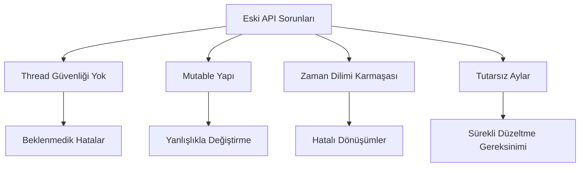
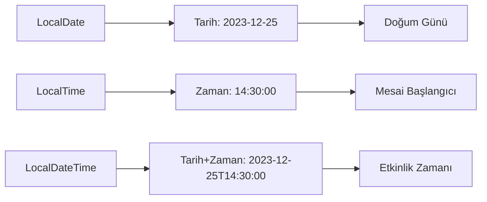
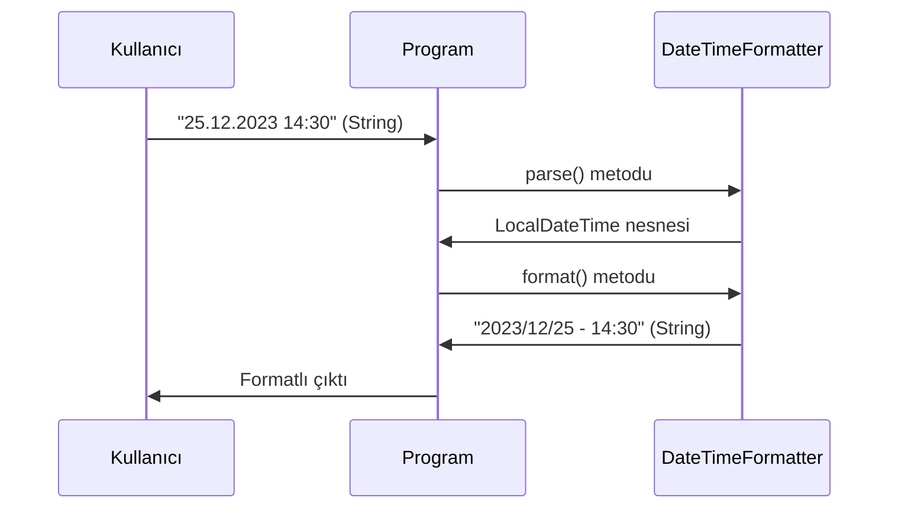
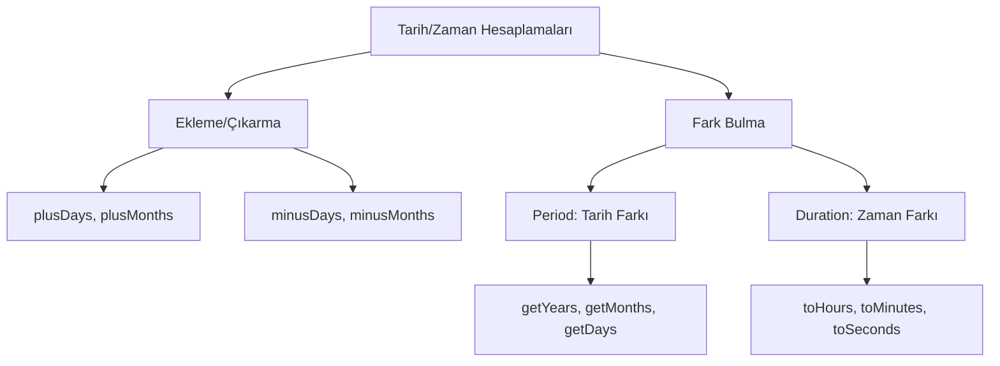
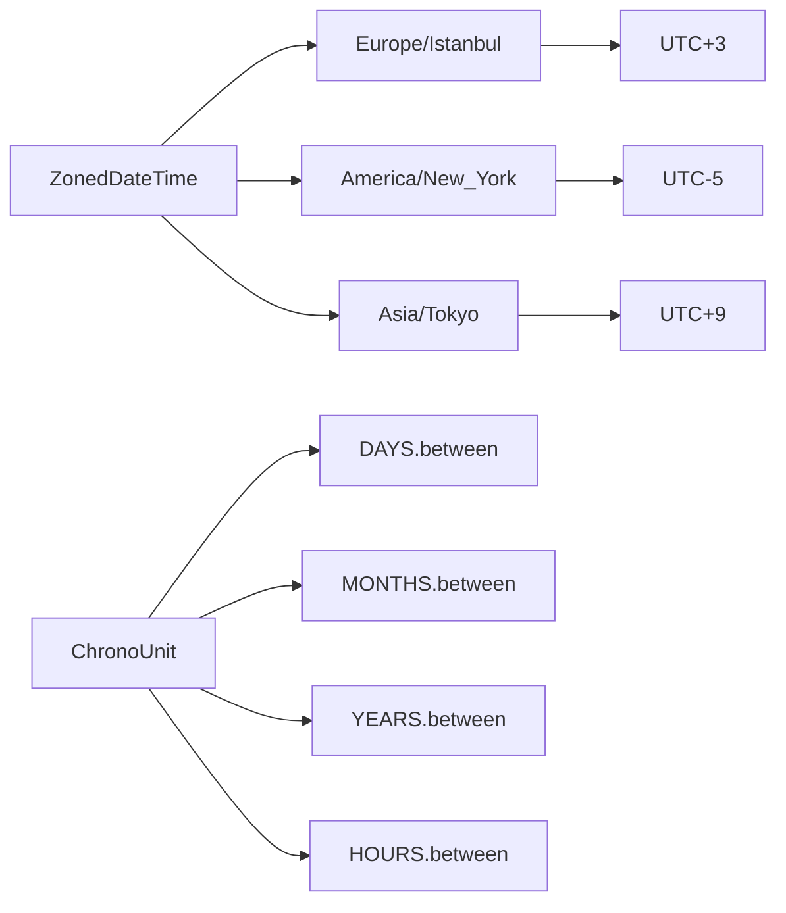

# Bölüm 12: Tarih ve Zaman Islemleri

---

## 12.1 Java 8+ ile Tarih ve Zaman Yönetimi

Java'da tarih ve zaman işlemleri, dilin en çok eleştirilen yönlerinden biriydi. Java 8 ile gelen `java.time` paketi, bu alanda devrim niteliğinde bir yenilik getirdi. Bu bölümde, modern Java'nın tarih ve zaman yönetimini nasıl kolaylaştırdığını, temel sınıfları ve pratik kullanım senaryolarını öğreneceksiniz.

> 💡 **Pedagojik Not:** Bu bölümdeki tüm kod örnekleri Java 8 veya üzeri sürümlerde çalışmaktadır. Eğer eski bir Java sürümü kullanıyorsanız, öncelikle güncelleme yapmanız önerilir.

---

### 1. Tarih ve Zaman API'sine Giriş: `java.time` Paketi

#### Kavram: Eski API'nin Sorunları

Java'nın ilk günlerinden beri var olan `java.util.Date` ve `java.util.Calendar` sınıfları, yıllar boyunca geliştiricilere büyük zorluklar çıkardı. Bu sorunları maddeler halinde inceleyelim:

1. **Thread Güvenliği Eksikliği:** `Date` ve `Calendar` sınıfları mutable (değiştirilebilir) yapıdadır. Bu, çoklu iş parçacığı ortamlarında beklenmedik hatalara yol açar.

2. **Zaman Dilimi Karmaşası:** `Date` sınıfı, zaman dilimi bilgisini doğrudan desteklemez. `Calendar` ise bu konuda karmaşık bir yapıya sahiptir.

3. **API Tasarım Sorunları:** Aylar 0'dan başlar (Ocak = 0), yıllar 1900'den itibaren sayılır. Bu, sürekli hata kaynağıdır.



#### Kavram: Yeni API'nin Felsefesi

Java 8 ile gelen `java.time` paketi, aşağıdaki temel prensipler üzerine inşa edilmiştir:

- **Immutable (Değiştirilemez):** Tüm sınıflar immutable'dır. Bir kez oluşturulduktan sonra değiştirilemezler.
- **Thread-Safe:** Immutable yapı sayesinde doğal olarak thread-safe'dir.
- **ISO 8601 Uyumlu:** Uluslararası tarih ve zaman standardına tam uyumludur.
- **Açık ve Anlaşılır:** Sınıf isimleri ve metotlar, ne yaptıklarını net bir şekilde ifade eder.

#### Örnek: Eski ve Yeni API Karşılaştırması

Aşağıdaki örnek, eski ve yeni API arasındaki farkı açıkça göstermektedir:

<!-- CODE_META
Dosya: TarihKarsilastirma.java
Konu: Eski ve yeni API karşılaştırması
-->
```java
import java.util.Date;
import java.time.LocalDate;

public class TarihKarsilastirma {
    public static void main(String[] args) {
        // Eski yöntem - java.util.Date
        @SuppressWarnings("deprecation")
        Date eskiTarih = new Date(2023, 11, 25); // Dikkat: Ay 11 = Aralık, yıl 2023 = 123
        System.out.println("Eski API ile: " + eskiTarih);
        // Çıktı: Mon Dec 25 00:00:00 TRT 3923 (Yanlış yıl!)
        
        // Yeni yöntem - java.time.LocalDate
        LocalDate yeniTarih = LocalDate.of(2023, 12, 25);
        System.out.println("Yeni API ile: " + yeniTarih);
        // Çıktı: 2023-12-25 (Doğru ve anlaşılır)
    }
}
```

#### Uygulama: Şu Anki Tarihi Yazdırma

Aşağıdaki programı yazın ve çalıştırın:

<!-- CODE_META
Dosya: SuAnkiTarih.java
Konu: Yeni API ile şu anki tarihi yazdırma
-->
```java
import java.time.LocalDate;
import java.time.format.DateTimeFormatter;

public class SuAnkiTarih {
    public static void main(String[] args) {
        // Şu anki tarihi al
        LocalDate bugun = LocalDate.now();
        
        // Varsayılan formatta yazdır (ISO 8601)
        System.out.println("Bugünün tarihi: " + bugun);
        
        // Özel formatta yazdır
        DateTimeFormatter formatter = DateTimeFormatter.ofPattern("dd.MM.yyyy");
        String formatliTarih = bugun.format(formatter);
        System.out.println("Formatlı tarih: " + formatliTarih);
    }
}
```

> 📝 **Değerlendirme:** Neden yeni API tercih edilmelidir?
> 1. **Immutable yapı** sayesinde thread-safe çalışma
> 2. **ISO 8601 standardına uyum** sayesinde uluslararası uyumluluk
> 3. **Açık ve anlaşılır API** sayesinde daha az hata ve kolay bakım

---

### 2. Temel Sınıflar: `LocalDate`, `LocalTime`, `LocalDateTime`

#### Kavram: Sınıfların Amacı

Bu üç sınıf, günlük programlama ihtiyaçlarının %90'ını karşılar. Her biri belirli bir kullanım senaryosu için optimize edilmiştir:

- **`LocalDate`:** Sadece tarih bilgisi (yıl, ay, gün) içerir. Doğum günü, tatil tarihi gibi zaman bilgisinin önemsiz olduğu durumlar için idealdir.
- **`LocalTime`:** Sadece zaman bilgisi (saat, dakika, saniye, nanosaniye) içerir. Mesai başlangıç saati, yemek molası gibi durumlar için kullanılır.
- **`LocalDateTime`:** Hem tarih hem zaman bilgisini bir arada tutar. Etkinlik başlangıcı, uçuş saati gibi durumlar için idealdir.



#### Örnek: Sınıfların Oluşturulması ve Kullanımı

<!-- CODE_META
Dosya: TemelSiniflar.java
Konu: LocalDate, LocalTime, LocalDateTime kullanımı
-->
```java
import java.time.LocalDate;
import java.time.LocalTime;
import java.time.LocalDateTime;
import java.time.Month;

public class TemelSiniflar {
    public static void main(String[] args) {
        // Şu anki değerleri alma
        LocalDate bugun = LocalDate.now();
        LocalTime suAn = LocalTime.now();
        LocalDateTime bugunVeSaat = LocalDateTime.now();
        
        System.out.println("Bugün: " + bugun);
        System.out.println("Şu an: " + suAn);
        System.out.println("Şu anki tarih ve saat: " + bugunVeSaat);
        
        // Özel değerler oluşturma
        LocalDate ozelTarih = LocalDate.of(2023, Month.DECEMBER, 25);
        LocalTime ozelZaman = LocalTime.of(14, 30, 0);
        LocalDateTime ozelZamanliTarih = LocalDateTime.of(ozelTarih, ozelZaman);
        
        System.out.println("\nÖzel tarih: " + ozelTarih);
        System.out.println("Özel zaman: " + ozelZaman);
        System.out.println("Özel tarih ve zaman: " + ozelZamanliTarih);
        
        // Parçalara erişim
        System.out.println("\n--- Parçalara Erişim ---");
        System.out.println("Yıl: " + bugun.getYear());
        System.out.println("Ay: " + bugun.getMonth());
        System.out.println("Ay (sayı): " + bugun.getMonthValue());
        System.out.println("Gün: " + bugun.getDayOfMonth());
        System.out.println("Haftanın günü: " + bugun.getDayOfWeek());
        System.out.println("Yılın günü: " + bugun.getDayOfYear());
        
        // Zaman parçaları
        System.out.println("\nSaat: " + suAn.getHour());
        System.out.println("Dakika: " + suAn.getMinute());
        System.out.println("Saniye: " + suAn.getSecond());
        System.out.println("Nanosaniye: " + suAn.getNano());
    }
}
```

#### Uygulama: Doğum Tarihi ve Saati Programı

Kullanıcıdan doğum tarihi ve saati bilgilerini alarak `LocalDateTime` nesnesi oluşturan bir program yazın:

<!-- CODE_META
Dosya: DogumZamani.java
Konu: Kullanıcıdan alınan bilgilerle LocalDateTime oluşturma
-->
```java
import java.time.LocalDate;
import java.time.LocalTime;
import java.time.LocalDateTime;
import java.util.Scanner;

public class DogumZamani {
    public static void main(String[] args) {
        Scanner scanner = new Scanner(System.in);
        
        System.out.println("=== Doğum Zamanı Bilgileri ===");
        
        // Tarih bilgilerini al
        System.out.print("Doğum yılınızı girin (örn: 1990): ");
        int yil = scanner.nextInt();
        
        System.out.print("Doğum ayınızı girin (1-12): ");
        int ay = scanner.nextInt();
        
        System.out.print("Doğum gününüzü girin (1-31): ");
        int gun = scanner.nextInt();
        
        // Zaman bilgilerini al
        System.out.print("Doğum saatinizi girin (0-23): ");
        int saat = scanner.nextInt();
        
        System.out.print("Doğum dakikanızı girin (0-59): ");
        int dakika = scanner.nextInt();
        
        // LocalDateTime oluştur
        LocalDate dogumTarihi = LocalDate.of(yil, ay, gun);
        LocalTime dogumZamani = LocalTime.of(saat, dakika);
        LocalDateTime dogumZamaniTarih = LocalDateTime.of(dogumTarihi, dogumZamani);
        
        System.out.println("\nDoğum zamanınız: " + dogumZamaniTarih);
        System.out.println("Bugün: " + LocalDateTime.now());
        
        scanner.close();
    }
}
```

> 📝 **Değerlendirme:** Aşağıdaki senaryolarda hangi sınıf kullanılmalıdır?
> - **Bir uçuşun kalkış saati:** `LocalDateTime` (hem tarih hem saat önemli)
> - **Bir kişinin doğum günü:** `LocalDate` (sadece tarih önemli)
> - **Bir etkinliğin başlangıç zamanı:** `LocalDateTime` (tarih ve saat birlikte gerekli)

---

### 3. Tarih/Zaman Biçimlendirme ve Ayrıştırma: `DateTimeFormatter`

#### Kavram: Formatlama ve Parse Etme

Tarih ve zaman nesneleriyle çalışırken iki temel işlem vardır:

1. **Formatlama (Formatting):** Bir `LocalDate`, `LocalTime` veya `LocalDateTime` nesnesini insan tarafından okunabilir bir metne dönüştürme.
2. **Ayrıştırma (Parsing):** Bir metni (String) uygun bir tarih/zaman nesnesine dönüştürme.

#### Kavram: Format Desenleri

`DateTimeFormatter` sınıfı, format desenleri oluşturmak için harf kodları kullanır:

| Harf | Anlamı | Örnek |
|------|--------|-------|
| y | Yıl | yy: 23, yyyy: 2023 |
| M | Ay | M: 12, MM: 12, MMM: Dec, MMMM: December |
| d | Gün | d: 5, dd: 05 |
| H | Saat (0-23) | H: 9, HH: 09 |
| m | Dakika | m: 5, mm: 05 |
| s | Saniye | s: 3, ss: 03 |



#### Örnek: Formatlama ve Parse Etme

<!-- CODE_META
Dosya: TarihFormatlama.java
Konu: DateTimeFormatter ile formatlama ve parse etme
-->
```java
import java.time.LocalDateTime;
import java.time.format.DateTimeFormatter;
import java.time.format.FormatStyle;
import java.util.Locale;

public class TarihFormatlama {
    public static void main(String[] args) {
        LocalDateTime simdi = LocalDateTime.now();
        
        System.out.println("=== Önceden Tanımlı Formatlar ===");
        
        // ISO formatları
        String isoDate = simdi.format(DateTimeFormatter.ISO_LOCAL_DATE);
        System.out.println("ISO Tarih: " + isoDate);
        
        String isoDateTime = simdi.format(DateTimeFormatter.ISO_LOCAL_DATE_TIME);
        System.out.println("ISO Tarih-Zaman: " + isoDateTime);
        
        // Yerel formatlar
        String kisaFormat = simdi.format(DateTimeFormatter.ofLocalizedDateTime(FormatStyle.SHORT));
        System.out.println("Kısa format: " + kisaFormat);
        
        String ortaFormat = simdi.format(DateTimeFormatter.ofLocalizedDateTime(FormatStyle.MEDIUM));
        System.out.println("Orta format: " + ortaFormat);
        
        System.out.println("\n=== Özel Desenler ===");
        
        // Özel desenler
        DateTimeFormatter ozelFormat1 = DateTimeFormatter.ofPattern("dd/MM/yyyy - HH:mm:ss");
        String formatli1 = simdi.format(ozelFormat1);
        System.out.println("Format 1: " + formatli1);
        
        DateTimeFormatter ozelFormat2 = DateTimeFormatter.ofPattern("yyyy.MM.dd G 'at' HH:mm:ss");
        String formatli2 = simdi.format(ozelFormat2);
        System.out.println("Format 2: " + formatli2);
        
        DateTimeFormatter ozelFormat3 = DateTimeFormatter.ofPattern("EEEE, MMMM d, yyyy");
        String formatli3 = simdi.format(ozelFormat3);
        System.out.println("Format 3: " + formatli3);
        
        System.out.println("\n=== String'den Tarih Oluşturma (Parse) ===");
        
        // String'den parse etme
        String tarihMetni = "25-12-2023 14:30";
        DateTimeFormatter parseFormat = DateTimeFormatter.ofPattern("dd-MM-yyyy HH:mm");
        LocalDateTime ayrismaTarihi = LocalDateTime.parse(tarihMetni, parseFormat);
        System.out.println("Ayrıştırılan tarih: " + ayrismaTarihi);
        
        // Farklı bir format
        String baskaTarih = "2023/12/25 14:30:45";
        DateTimeFormatter baskaFormat = DateTimeFormatter.ofPattern("yyyy/MM/dd HH:mm:ss");
        LocalDateTime baskaAyrisma = LocalDateTime.parse(baskaTarih, baskaFormat);
        System.out.println("Diğer ayrıştırma: " + baskaAyrisma);
    }
}
```

#### Uygulama: Tarih Dönüştürücü Programı

Kullanıcıdan "gg.AA.yyyy HH:mm" formatında bir tarih metni alın, bunu `LocalDateTime` nesnesine çevirin ve "yyyy/MM/dd - HH:mm" formatında ekrana yazdırın:

<!-- CODE_META
Dosya: TarihDonusturucu.java
Konu: Kullanıcı girdisini parse edip farklı formatta gösterme
-->
```java
import java.time.LocalDateTime;
import java.time.format.DateTimeFormatter;
import java.time.format.DateTimeParseException;
import java.util.Scanner;

public class TarihDonusturucu {
    public static void main(String[] args) {
        Scanner scanner = new Scanner(System.in);
        
        System.out.println("=== Tarih Dönüştürücü ===");
        System.out.println("Lütfen tarihi 'gg.AA.yyyy HH:mm' formatında girin:");
        System.out.println("Örnek: 25.12.2023 14:30");
        
        String girdi = scanner.nextLine();
        
        try {
            // Girdiyi parse et
            DateTimeFormatter girdiFormati = DateTimeFormatter.ofPattern("dd.MM.yyyy HH:mm");
            LocalDateTime tarih = LocalDateTime.parse(girdi, girdiFormati);
            
            // İstenen formata çevir
            DateTimeFormatter ciktiFormati = DateTimeFormatter.ofPattern("yyyy/MM/dd - HH:mm");
            String sonuc = tarih.format(ciktiFormati);
            
            System.out.println("\nDönüştürülen tarih: " + sonuc);
            
        } catch (DateTimeParseException e) {
            System.out.println("Hata: Geçersiz tarih formatı! Lütfen 'gg.AA.yyyy HH:mm' formatını kullanın.");
            System.out.println("Hata detayı: " + e.getMessage());
        }
        
        scanner.close();
    }
}
```

> 📝 **Değerlendirme:** `DateTimeFormatter.ofPattern()` içinde kullanılan harflerin anlamları:
> - **y (year):** Yıl bilgisi. `yy` = 23 (2 haneli), `yyyy` = 2023 (4 haneli)
> - **M (month):** Ay bilgisi. `M` = 12, `MM` = 12, `MMM` = Dec, `MMMM` = December
> - **d (day):** Gün bilgisi. `d` = 5, `dd` = 05
> - **H (hour):** Saat (0-23). `H` = 9, `HH` = 09
> - **m (minute):** Dakika. `m` = 5, `mm` = 05
> - **s (second):** Saniye. `s` = 3, `ss` = 03

---

### 4. Tarih ve Zaman Hesaplamaları: Ekleme, Çıkarma ve Fark Bulma

#### Kavram: Artimetik İşlemler

Java 8+ API'si, tarih ve zaman üzerinde kolayca aritmetik işlemler yapmanızı sağlar:

- **`plus` metotları:** `plusDays()`, `plusWeeks()`, `plusMonths()`, `plusYears()`
- **`minus` metotları:** `minusDays()`, `minusWeeks()`, `minusMonths()`, `minusYears()`

#### Kavram: Period ve Duration

İki tarih veya zaman arasındaki farkı hesaplamak için iki özel sınıf kullanılır:

- **`Period`:** Tarih tabanlı farklar için (yıl, ay, gün)
- **`Duration`:** Zaman tabanlı farklar için (saat, dakika, saniye, nanosaniye)



#### Örnek: Tarih/Zaman Hesaplamaları

<!-- CODE_META
Dosya: TarihHesaplamalari.java
Konu: Tarih ve zaman hesaplamaları
-->
```java
import java.time.*;
import java.time.temporal.ChronoUnit;

public class TarihHesaplamalari {
    public static void main(String[] args) {
        LocalDate bugun = LocalDate.now();
        
        System.out.println("=== Tarih Ekleme/Çıkarma ===");
        
        // Gün ekleme/çıkarma
        LocalDate birHaftaSonra = bugun.plusWeeks(1);
        LocalDate onGunOnce = bugun.minusDays(10);
        
        System.out.println("Bugün: " + bugun);
        System.out.println("1 hafta sonra: " + birHaftaSonra);
        System.out.println("10 gün önce: " + onGunOnce);
        
        // Ay ve yıl işlemleri
        LocalDate ucAyOnce = bugun.minusMonths(3);
        LocalDate ikiYilSonra = bugun.plusYears(2);
        
        System.out.println("3 ay önce: " + ucAyOnce);
        System.out.println("2 yıl sonra: " + ikiYilSonra);
        
        System.out.println("\n=== Period ile Tarih Farkı ===");
        
        // Period kullanımı
        LocalDate dogumGunu = LocalDate.of(1990, Month.MARCH, 15);
        Period yas = Period.between(dogumGunu, bugun);
        
        System.out.println("Doğum günü: " + dogumGunu);
        System.out.println("Yaş: " + yas.getYears() + " yıl " + 
                           yas.getMonths() + " ay " + yas.getDays() + " gün");
        
        System.out.println("\n=== Duration ile Zaman Farkı ===");
        
        // Duration kullanımı
        LocalTime baslangic = LocalTime.of(9, 30);
        LocalTime bitis = LocalTime.of(17, 45);
        Duration calismaSuresi = Duration.between(baslangic, bitis);
        
        System.out.println("Başlangıç: " + baslangic);
        System.out.println("Bitiş: " + bitis);
        System.out.println("Çalışma süresi: " + calismaSuresi.toHours() + " saat " + 
                           calismaSuresi.toMinutesPart() + " dakika");
        
        System.out.println("\n=== ChronoUnit ile Hesaplama ===");
        
        // ChronoUnit kullanımı
        long gunFarki = ChronoUnit.DAYS.between(dogumGunu, bugun);
        long ayFarki = ChronoUnit.MONTHS.between(dogumGunu, bugun);
        long yilFarki = ChronoUnit.YEARS.between(dogumGunu, bugun);
        
        System.out.println("Toplam gün: " + gunFarki);
        System.out.println("Toplam ay: " + ayFarki);
        System.out.println("Toplam yıl: " + yilFarki);
    }
}
```

#### Uygulama: İki Tarih Arasındaki Farkı Hesaplama

Kullanıcıdan iki farklı tarih alın ve aralarındaki farkı yıl, ay, gün cinsinden hesaplayın:

<!-- CODE_META
Dosya: TarihFarkHesapla.java
Konu: İki tarih arasındaki farkı hesaplama
-->
```java
import java.time.LocalDate;
import java.time.Period;
import java.time.format.DateTimeFormatter;
import java.time.format.DateTimeParseException;
import java.util.Scanner;

public class TarihFarkHesapla {
    public static void main(String[] args) {
        Scanner scanner = new Scanner(System.in);
        DateTimeFormatter formatter = DateTimeFormatter.ofPattern("dd.MM.yyyy");
        
        System.out.println("=== İki Tarih Arasındaki Fark ===");
        
        try {
            // İlk tarihi al
            System.out.print("İlk tarihi girin (gg.AA.yyyy): ");
            String ilkTarihStr = scanner.nextLine();
            LocalDate ilkTarih = LocalDate.parse(ilkTarihStr, formatter);
            
            // İkinci tarihi al
            System.out.print("İkinci tarihi girin (gg.AA.yyyy): ");
            String ikinciTarihStr = scanner.nextLine();
            LocalDate ikinciTarih = LocalDate.parse(ikinciTarihStr, formatter);
            
            // Farkı hesapla
            Period fark = Period.between(ilkTarih, ikinciTarih);
            
            System.out.println("\n=== Sonuç ===");
            System.out.println("İlk tarih: " + ilkTarih);
            System.out.println("İkinci tarih: " + ikinciTarih);
            System.out.println("Fark: " + Math.abs(fark.getYears()) + " yıl " + 
                               Math.abs(fark.getMonths()) + " ay " + 
                               Math.abs(fark.getDays()) + " gün");
            
            // Hangi tarihin daha büyük olduğunu göster
            if (ilkTarih.isBefore(ikinciTarih)) {
                System.out.println("İlk tarih, ikinci tarihten önce.");
            } else if (ilkTarih.isAfter(ikinciTarih)) {
                System.out.println("İlk tarih, ikinci tarihten sonra.");
            } else {
                System.out.println("İki tarih aynı.");
            }
            
        } catch (DateTimeParseException e) {
            System.out.println("Hata: Geçersiz tarih formatı!");
        }
        
        scanner.close();
    }
}
```

> 📝 **Değerlendirme:** `Period` ve `Duration` arasındaki temel fark:
> - **`Period`:** Tarih tabanlı farklar için kullanılır. Yıl, ay, gün cinsinden sonuç verir. Örneğin: 2 yıl 3 ay 5 gün
> - **`Duration`:** Zaman tabanlı farklar için kullanılır. Saat, dakika, saniye, nanosaniye cinsinden sonuç verir. Örneğin: 8 saat 15 dakika
> 
> **Hangi durumda hangisini kullanırsınız?**
> - **`Period`:** İki tarih arasındaki farkı yıl/ay/gün olarak hesaplamak istediğinizde (örn: yaş hesaplama)
> - **`Duration`:** İki zaman arasındaki farkı saat/dakika olarak hesaplamak istediğinizde (örn: çalışma süresi)

---

### 5. Zaman Dilimleri ve Gelecek/Zamanlanmış İşlemler

#### Kavram: Zaman Dilimleri

Dünya üzerinde farklı bölgeler farklı zaman dilimlerini kullanır. `ZonedDateTime` sınıfı, zaman dilimi bilgisini de içeren tarih-zaman nesneleri oluşturmanızı sağlar.

#### Kavram: ChronoUnit ile Esnek Hesaplamalar

`ChronoUnit` enum'u, `Period` ve `Duration`'a alternatif olarak daha esnek ve okunabilir bir hesaplama yöntemi sunar.



#### Örnek: Zaman Dilimleri ve Gelişmiş Hesaplamalar

<!-- CODE_META
Dosya: ZamanDilimleri.java
Konu: Zaman dilimleri ve ChronoUnit kullanımı
-->
```java
import java.time.*;
import java.time.temporal.ChronoUnit;
import java.util.Set;

public class ZamanDilimleri {
    public static void main(String[] args) {
        System.out.println("=== Zaman Dilimleri ===");
        
        // Mevcut zaman dilimlerini listeleme
        System.out.println("Mevcut zaman dilimleri (ilk 5):");
        Set<String> zoneIds = ZoneId.getAvailableZoneIds();
        zoneIds.stream()
               .filter(id -> id.contains("Europe") || id.contains("America") || id.contains("Asia"))
               .limit(5)
               .forEach(System.out::println);
        
        System.out.println("\n=== Farklı Şehirlerde Şu Anki Zaman ===");
        
        // Farklı zaman dilimlerinde şu anki zaman
        ZonedDateTime istanbul = ZonedDateTime.now(ZoneId.of("Europe/Istanbul"));
        ZonedDateTime newYork = ZonedDateTime.now(ZoneId.of("America/New_York"));
        ZonedDateTime tokyo = ZonedDateTime.now(ZoneId.of("Asia/Tokyo"));
        ZonedDateTime londra = ZonedDateTime.now(ZoneId.of("Europe/London"));
        
        System.out.println("İstanbul: " + istanbul);
        System.out.println("New York: " + newYork);
        System.out.println("Tokyo: " + tokyo);
        System.out.println("Londra: " + londra);
        
        System.out.println("\n=== Zaman Dilimi Dönüşümü ===");
        
        // Bir zamanı başka bir zaman dilimine çevirme
        ZonedDateTime istanbulZamani = ZonedDateTime.now(ZoneId.of("Europe/Istanbul"));
        ZonedDateTime newYorkZamani = istanbulZamani.withZoneSameInstant(ZoneId.of("America/New_York"));
        
        System.out.println("İstanbul'da şu an: " + istanbulZamani);
        System.out.println("New York'ta aynı an: " + newYorkZamani);
        
        System.out.println("\n=== ChronoUnit ile Hesaplamalar ===");
        
        // ChronoUnit kullanımı
        LocalDate yilbasi = LocalDate.of(2025, Month.JANUARY, 1);
        LocalDate bugun = LocalDate.now();
        
        long kalanGun = ChronoUnit.DAYS.between(bugun, yilbasi);
        long kalanAy = ChronoUnit.MONTHS.between(bugun, yilbasi);
        long kalanHafta = ChronoUnit.WEEKS.between(bugun, yilbasi);
        
        System.out.println("Yılbaşına kalan gün: " + kalanGun);
        System.out.println("Yılbaşına kalan ay: " + kalanAy);
        System.out.println("Yılbaşına kalan hafta: " + kalanHafta);
        
        // Tarih karşılaştırmaları
        boolean onceMi = bugun.isBefore(yilbasi);
        boolean sonraMi = bugun.isAfter(yilbasi);
        boolean esitMi = bugun.isEqual(yilbasi);
        
        System.out.println("\nYılbaşından önce mi? " + onceMi);
        System.out.println("Yılbaşından sonra mi? " + sonraMi);
        System.out.println("Yılbaşına eşit mi? " + esitMi);
        
        // Saat bazlı hesaplama
        LocalTime simdi = LocalTime.now();
        LocalTime geceYarisi = LocalTime.MIDNIGHT;
        long kalanSaat = ChronoUnit.HOURS.between(simdi, geceYarisi);
        long kalanDakika = ChronoUnit.MINUTES.between(simdi, geceYarisi);
        
        System.out.println("\nGece yarısına kalan saat: " + kalanSaat);
        System.out.println("Gece yarısına kalan dakika: " + kalanDakika);
    }
}
```

#### Uygulama: Hedef Tarih ve Zaman Dilimi Programı

Kullanıcıdan bir hedef tarih alın ve bu tarihe kalan süreyi hesaplayın. Ayrıca farklı şehirlerdeki anlık zamanı gösterin:

<!-- CODE_META
Dosya: HedefTarihSuresi.java
Konu: Hedef tarihe kalan süre ve zaman dilimleri
-->
```java
import java.time.*;
import java.time.format.DateTimeFormatter;
import java.time.format.DateTimeParseException;
import java.time.temporal.ChronoUnit;
import java.util.Scanner;

public class HedefTari