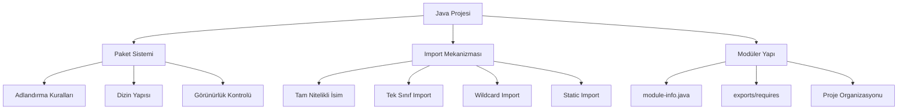
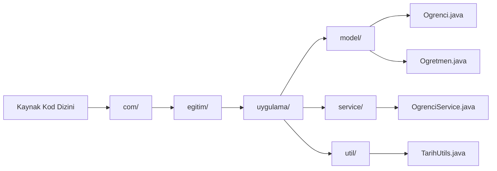
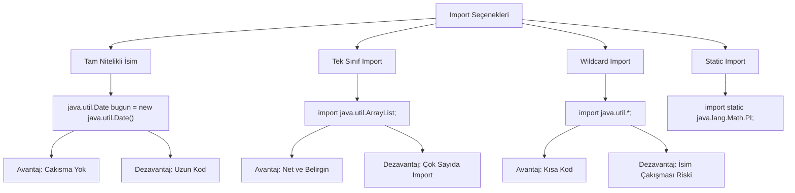
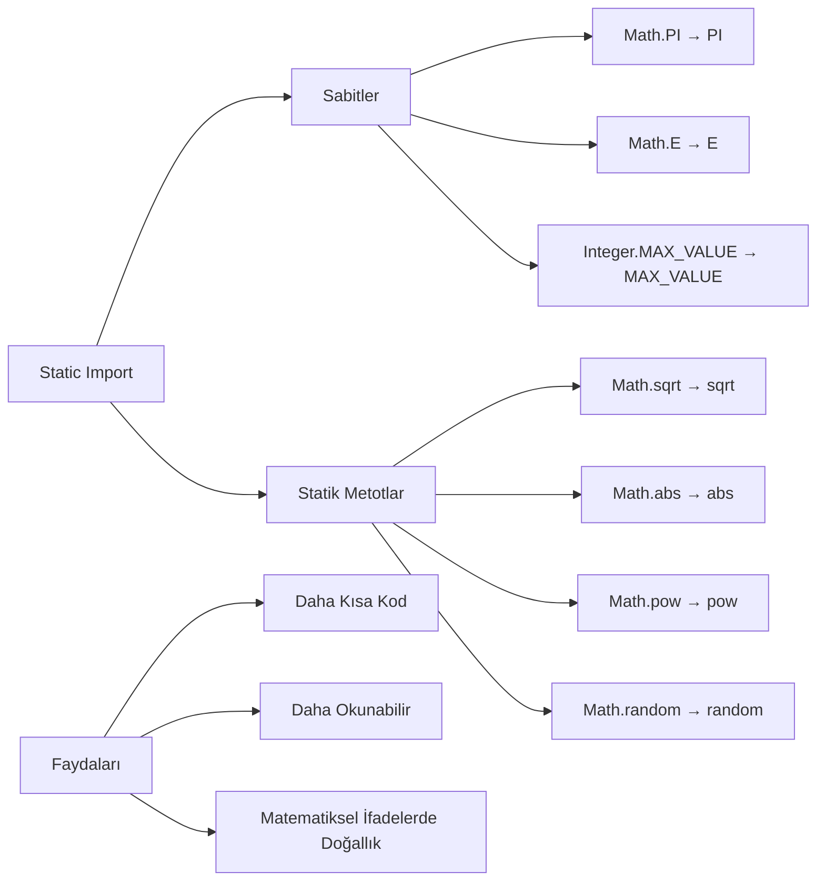
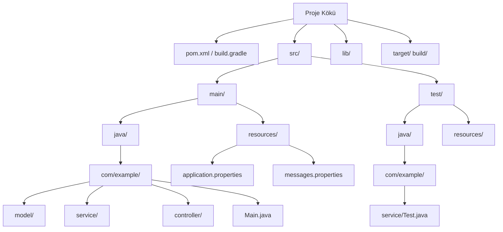
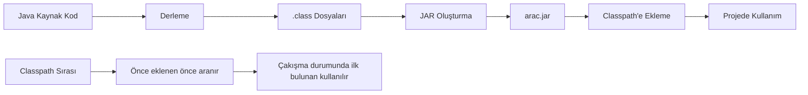

# Bölüm 13: Paketler, import Kullanimi ve Proje Duzeni

## 13.1 Java Paket Sistemi, Import Mekanizması ve Modüler Proje Yapılandırması

Bu bölümde, Java programlama dilinde sınıfların organize edilmesini sağlayan paket sistemini, sınıflar arası erişimi kolaylaştıran import mekanizmasını ve profesyonel projelerde kullanılan modüler yapılandırma tekniklerini öğreneceksiniz. Java'da büyük ölçekli projeler geliştirirken, kodun düzenli, bakımı kolay ve yeniden kullanılabilir olması için bu kavramları doğru anlamak kritik öneme sahiptir.



### Java Paket Sisteminin Temelleri ve Adlandırma Kuralları

**Kavram**: Paket, Java'da ilgili sınıfları, arayüzleri ve alt paketleri bir arada tutan bir organizasyon birimidir. Paketler sayesinde:

- İsim çakışmaları önlenir (farklı paketlerde aynı isimde sınıflar olabilir)
- Kod organizasyonu sağlanır
- Erişim kontrolü yapılabilir (protected ve default erişim seviyeleri paket tabanlıdır)
- Kodun yeniden kullanılabilirliği artar

**Adlandırma Kuralları**: Java'da paket adlandırması için ters domain adı (reverse domain name) kuralı kullanılır. Bu kural, paket isimlerinin benzersiz olmasını sağlar:

```
com.sirket.proje.altmodul
org.kurum.uygulama.bilesen
edu.universite.bolum.ders
```

> **Önemli**: Paket adları tamamen küçük harflerle yazılmalıdır. Kelimeler arasında alt çizgi (_) kullanılmamalıdır. Java standart kütüphanesinde `java.util`, `java.io`, `java.net` gibi paketler bu kurala uyar.

**Standart Java Paketleri**:

| Paket | Açıklama | Örnek Sınıflar |
|-------|----------|----------------|
| `java.lang` | Temel dil desteği (otomatik import edilir) | String, Math, System |
| `java.util` | Yardımcı araçlar ve veri yapıları | ArrayList, HashMap, Date |
| `java.io` | Giriş/çıkış işlemleri | File, InputStream, OutputStream |
| `java.net` | Ağ işlemleri | URL, Socket, ServerSocket |
| `java.sql` | Veritabanı işlemleri | Connection, Statement, ResultSet |

**Uygulama**: Kendi paket hiyerarşimizi oluşturalım:

<!-- CODE_META
id: bolum-13_kod01
chapter_id: bolum-13
kind: example
title: "Kod 1"
file: "Ornek00.java"
mainClass: Ornek00
extract: true
test: compile
github: true
qr: dual
-->

```java
// com/egitim/uygulama/model/Ogrenci.java
package com.egitim.uygulama.model;

public class Ogrenci {
    private String ad;
    private String soyad;
    private int ogrenciNo;
    
    public Ogrenci(String ad, String soyad, int ogrenciNo) {
        this.ad = ad;
        this.soyad = soyad;
        this.ogrenciNo = ogrenciNo;
    }
    
    public String getAd() {
        return ad;
    }
}
```

<!-- CODE_META: Dosya: com/egitim/uygulama/model/Ogrenci.java, Konu: Temel paket yapısı, Zorluk: Başlangıç -->

```java
// com/egitim/uygulama/service/OgrenciService.java
package com.egitim.uygulama.service;

import com.egitim.uygulama.model.Ogrenci;
import java.util.ArrayList;
import java.util.List;

public class OgrenciService {
    private List<Ogrenci> ogrenciler = new ArrayList<>();
    
    public void ogrenciEkle(Ogrenci ogrenci) {
        ogrenciler.add(ogrenci);
    }
    
    public List<Ogrenci> tumOgrencileriGetir() {
        return new ArrayList<>(ogrenciler);
    }
}
```

<!-- CODE_META: Dosya: com/egitim/uygulama/service/OgrenciService.java, Konu: Paketler arası import kullanımı, Zorluk: Orta -->

**Değerlendirme**: Aşağıdaki paket adlandırmalarından hangileri geçerlidir?

<!-- CODE_META
id: bolum-13_kod02
chapter_id: bolum-13
kind: example
title: "Kod 2"
file: "Ornek01.java"
mainClass: Ornek01
extract: true
test: compile
github: true
qr: dual
-->

```java
// Geçerli mi?
com.myCompany.app        // GEÇERLİ: Ters domain adı kuralına uyuyor
com.my_company.app       // GEÇERSİZ: Alt çizgi kullanılmış
COM.Example.Project      // GEÇERSİZ: Büyük harf kullanılmış
org.teknik.egitim.bolum1 // GEÇERLİ: Tümü küçük harf ve nokta ile ayrılmış
```

### Paket Bildirimi ve Dizin Yapısı ile Çalışma

**Kavram**: Java'da `package` anahtar kelimesi ile bir sınıfın hangi pakete ait olduğu bildirilir. Kritik bir kural vardır: **Fiziksel dizin yapısı ile paket yapısı birebir eşleşmelidir**.

Örneğin, `com.egitim.uygulama.model` paketinde bir sınıf varsa, bu sınıfın kaynak kodu `com/egitim/uygulama/model/` dizininde bulunmalıdır.



**Örnek**: Çok katmanlı bir projede dizin organizasyonu:

```
proje/
├── src/
│   ├── main/
│   │   └── java/
│   │       ├── com/
│   │       │   └── egitim/
│   │       │       ├── Main.java
│   │       │       ├── model/
│   │       │       │   ├── Kullanici.java
│   │       │       │   └── Urun.java
│   │       │       ├── service/
│   │       │       │   ├── KullaniciService.java
│   │       │       │   └── UrunService.java
│   │       │       └── util/
│   │       │           └── VeritabaniBaglantisi.java
│   │       └── resources/
│   │           ├── application.properties
│   │           └── messages.properties
│   └── test/
│       └── java/
│           └── com/
│               └── egitim/
│                   ├── service/
│                   │   ├── KullaniciServiceTest.java
│                   │   └── UrunServiceTest.java
│                   └── model/
│                       └── KullaniciTest.java
├── lib/
│   └── mysql-connector.jar
└── README.md
```

**Uygulama**: Üç farklı pakette sınıf oluşturma ve derleme:

<!-- CODE_META: Dosya: com/egitim/arac/Kasa.java, Konu: Paket bildirimi ve sınıf yapısı, Zorluk: Başlangıç -->

```java
// Dosya: com/egitim/arac/Kasa.java
package com.egitim.arac;

public class Kasa {
    private String renk;
    private String malzeme;
    private double agirlik;
    
    public Kasa(String renk, String malzeme, double agirlik) {
        this.renk = renk;
        this.malzeme = malzeme;
        this.agirlik = agirlik;
    }
    
    public String bilgiVer() {
        return String.format("Kasa: %s, %s, %.1f kg", renk, malzeme, agirlik);
    }
}
```

<!-- CODE_META: Dosya: com/egitim/motor/Motor.java, Konu: Farklı pakette sınıf tanımı, Zorluk: Başlangıç -->

```java
// Dosya: com/egitim/motor/Motor.java
package com.egitim.motor;

public class Motor {
    private int hacim;
    private int beygirGucu;
    private String yakitTipi;
    
    public Motor(int hacim, int beygirGucu, String yakitTipi) {
        this.hacim = hacim;
        this.beygirGucu = beygirGucu;
        this.yakitTipi = yakitTipi;
    }
    
    public String bilgiVer() {
        return String.format("Motor: %d cc, %d HP, %s", hacim, beygirGucu, yakitTipi);
    }
}
```

<!-- CODE_META: Dosya: com/egitim/arac/Araba.java, Konu: Diğer paketlerden sınıf kullanımı, Zorluk: Orta -->

```java
// Dosya: com/egitim/arac/Araba.java
package com.egitim.arac;

import com.egitim.motor.Motor;

public class Araba {
    private String marka;
    private String model;
    private Kasa kasa;
    private Motor motor;
    
    public Araba(String marka, String model, Kasa kasa, Motor motor) {
        this.marka = marka;
        this.model = model;
        this.kasa = kasa;
        this.motor = motor;
    }
    
    public void arabaBilgisi() {
        System.out.println("Araba: " + marka + " " + model);
        System.out.println(kasa.bilgiVer());
        System.out.println(motor.bilgiVer());
    }
}
```

**Derleme ve Çalıştırma**:

```bash
## 13.2 Kaynak kodları derleme
javac -d out com/egitim/arac/Kasa.java
javac -d out com/egitim/motor/Motor.java
javac -d out com/egitim/arac/Araba.java

## 13.3 Ana sınıf oluşturma
cat > com/egitim/Main.java << 'EOF'
package com.egitim;

import com.egitim.arac.Araba;
import com.egitim.arac.Kasa;
import com.egitim.motor.Motor;

public class Main {
    public static void main(String[] args) {
        Kasa kasa = new Kasa("Kırmızı", "Çelik", 1200);
        Motor motor = new Motor(1600, 110, "Benzin");
        Araba araba = new Araba("Toyota", "Corolla", kasa, motor);
        araba.arabaBilgisi();
    }
}
EOF

## 13.4 Derleme ve çalıştırma
javac -d out com/egitim/Main.java
java -cp out com.egitim.Main
```

**Değerlendirme**: Aşağıdaki hatalı durumu inceleyelim:

<!-- CODE_META
id: bolum-13_kod03
chapter_id: bolum-13
kind: example
title: "Kod 3"
file: "Ornek02.java"
mainClass: Ornek02
extract: true
test: compile
github: true
qr: dual
-->

```java
// HATALI: Dosya com/egitim/yanlis/YanlisKonum.java
// Fiziksel konum: com/egitim/yanlis/
package com.egitim.dogru; // HATA: Paket adı ile dizin adı uyuşmuyor

public class YanlisKonum {
    // Bu sınıf derlenemez çünkü paket bildirimi ile fiziksel konum eşleşmiyor
}
```

```bash
## 13.5 Derleme hatası:
## 13.6 javac: error: package com.egitim.dogru does not exist
## 13.7 (expected file: com/egitim/dogru/YanlisKonum.java)
```

### Import Mekanizması ve Kullanım Şekilleri

**Kavram**: `import` deyimi, başka paketlerdeki sınıflara erişmek için kullanılır. Java'da üç farklı import yöntemi vardır:

1. **Tam Nitelikli İsim (Fully Qualified Name)**: Sınıfın tam paket yolu ile kullanılması
2. **Tek Sınıf Import**: Belirli bir sınıfın import edilmesi
3. **Wildcard Import**: Bir paketteki tüm sınıfların import edilmesi



**Uygulama**: Üç farklı import türünü karşılaştırmalı gösterelim:

<!-- CODE_META: Dosya: ImportOrnekleri.java, Konu: Farklı import türlerinin karşılaştırılması, Zorluk: Orta -->

```java
// Dosya: ImportOrnekleri.java
import java.util.ArrayList;        // Tek sınıf import
import java.util.*;                // Wildcard import
import java.util.Date;             // java.util.Date
import java.sql.Date;              // java.sql.Date - ÇAKIŞMA!
import static java.lang.Math.PI;   // Static import

public class ImportOrnekleri {
    
    // Tam nitelikli isim kullanımı
    public void tamNitelikliIsim() {
        java.util.Date bugun = new java.util.Date();
        java.util.ArrayList<String> liste = new java.util.ArrayList<>();
        System.out.println("Tam nitelikli isim: " + bugun);
    }
    
    // Tek sınıf import kullanımı
    public void tekSinifImport() {
        ArrayList<String> liste = new ArrayList<>();
        liste.add("Java");
        liste.add("Python");
        System.out.println("Tek sınıf import: " + liste);
    }
    
    // Wildcard import kullanımı
    public void wildcardImport() {
        ArrayList<Integer> sayilar = new ArrayList<>();
        HashMap<String, Integer> map = new HashMap<>();
        HashSet<String> set = new HashSet<>();
        System.out.println("Wildcard import ile çalışıyor");
    }
    
    // Çakışan import durumu - ÇÖZÜM
    public void cakisanImport() {
        // java.util.Date kullanmak için tam nitelikli isim
        java.util.Date utilDate = new java.util.Date();
        
        // java.sql.Date kullanmak için tam nitelikli isim
        java.sql.Date sqlDate = new java.sql.Date(System.currentTimeMillis());
        
        System.out.println("Util Date: " + utilDate);
        System.out.println("SQL Date: " + sqlDate);
    }
    
    // Static import kullanımı
    public double daireAlani(double yaricap) {
        return PI * yaricap * yaricap;  // Math.PI yerine direkt PI
    }
    
    public static void main(String[] args) {
        ImportOrnekleri ornek = new ImportOrnekleri();
        ornek.tamNitelikliIsim();
        ornek.tekSinifImport();
        ornek.wildcardImport();
        ornek.cakisanImport();
        System.out.println("Daire alanı: " + ornek.daireAlani(5));
    }
}
```

> **Önemli Not**: `java.lang` paketindeki tüm sınıflar (String, System, Math vb.) otomatik olarak import edilir. Bu nedenle bu sınıfları import etmenize gerek yoktur.

**Değerlendirme**: Çakışan import durumlarını çözme alıştırması:

<!-- CODE_META
id: bolum-13_kod04
chapter_id: bolum-13
kind: example
title: "Kod 4"
file: "Ornek03.java"
mainClass: Ornek03
extract: true
test: compile
github: true
qr: dual
-->

```java
// Problem: Hem java.util.Date hem java.sql.Date kullanılacak
// Çözüm: Birini import et, diğerini tam nitelikli isimle kullan

import java.util.Date;  // Birini import et

public class TarihIslemleri {
    public void tarihleriKarsilastir() {
        Date utilDate = new Date();  // java.util.Date
        
        // java.sql.Date için tam nitelikli isim
        java.sql.Date sqlDate = new java.sql.Date(System.currentTimeMillis());
        
        System.out.println("Util Date: " + utilDate);
        System.out.println("SQL Date: " + sqlDate);
    }
}
```

### Static Import ve Özel Kullanım Durumları

**Kavram**: `import static` ifadesi, bir sınıftaki statik üyelere (sabitler ve statik metotlar) doğrudan sınıf adı kullanmadan erişmeyi sağlar. Bu özellik özellikle matematiksel işlemler, test framework'leri (JUnit) ve sabit tanımlamalarında kullanışlıdır.

**Örnek**: Math sınıfı sabitlerinin ve metotlarının static import ile kullanımı:



**Uygulama**: Static import öncesi ve sonrası kod karşılaştırması:

<!-- CODE_META: Dosya: StaticImportKarsilastirma.java, Konu: Static import kullanımı karşılaştırması, Zorluk: Orta -->

```java
// Dosya: StaticImportKarsilastirma.java

// Static import OLMADAN
public class StaticImportKarsilastirma {
    
    public void staticImportOlmadan() {
        // Math sınıfını kullanmak zorundayız
        double pi = Math.PI;
        double eSayisi = Math.E;
        
        double kareKok = Math.sqrt(25);
        double mutlakDeger = Math.abs(-10);
        double usAlma = Math.pow(2, 3);
        double rastgeleSayi = Math.random();
        
        System.out.println("PI: " + pi);
        System.out.println("Karekök(25): " + kareKok);
        System.out.println("2^3: " + usAlma);
    }
}
```

<!-- CODE_META: Dosya: StaticImportIle.java, Konu: Static import kullanımı, Zorluk: Orta -->

```java
// Dosya: StaticImportIle.java
import static java.lang.Math.PI;
import static java.lang.Math.E;
import static java.lang.Math.sqrt;
import static java.lang.Math.abs;
import static java.lang.Math.pow;
import static java.lang.Math.random;
// Veya: import static java.lang.Math.*;

public class StaticImportIle {
    
    public void staticImportIle() {
        // Doğrudan kullanım
        double pi = PI;
        double eSayisi = E;
        
        double kareKok = sqrt(25);
        double mutlakDeger = abs(-10);
        double usAlma = pow(2, 3);
        double rastgeleSayi = random();
        
        System.out.println("PI: " + pi);
        System.out.println("Karekök(25): " + kareKok);
        System.out.println("2^3: " + usAlma);
    }
    
    // Pratik kullanım örneği: Geometrik hesaplamalar
    public double daireAlani(double yaricap) {
        return PI * pow(yaricap, 2);
    }
    
    public double kureHacmi(double yaricap) {
        return (4.0 / 3.0) * PI * pow(yaricap, 3);
    }
    
    public double hipotenus(double a, double b) {
        return sqrt(pow(a, 2) + pow(b, 2));
    }
}
```

**Static Import'un Aşırı Kullanımının Dezavantajları**:

<!-- CODE_META
id: bolum-13_kod05
chapter_id: bolum-13
kind: example
title: "Kod 5"
file: "Ornek04.java"
mainClass: Ornek04
extract: true
test: compile
github: true
qr: dual
-->

```java
// KÖTÜ ÖRNEK: Aşırı static import kullanımı
import static java.lang.Math.*;
import static java.lang.System.*;
import static java.lang.Integer.*;

public class KotuOrnek {
    public void kotuKullanim() {
        // Hangi sınıftan geldiği belli değil
        out.println(MAX_VALUE);  // System.out mi? Integer.MAX_VALUE mi?
        out.println(PI);         // Açık, Math.PI olduğu belli
        out.println(parseInt("123")); // Integer.parseInt
        
        // Okunabilirlik sorunu: Kodun kaynağı belirsiz
        double sonuc = sqrt(pow(abs(-5), 2) + pow(abs(3), 2));
    }
}

// İYİ ÖRNEK: Dengeli kullanım
import static java.lang.Math.PI;
import static java.lang.Math.sqrt;
import static java.lang.Math.pow;

public class IyiOrnek {
    public void dengeliKullanim() {
        double alan = PI * pow(5, 2);  // Açık ve okunabilir
        double kok = sqrt(25);          // Matematiksel ifade doğal
        
        // System.out için static import kullanma
        System.out.println("Alan: " + alan);
        
        // Integer.parseInt için static import kullanma
        int sayi = Integer.parseInt("123");
    }
}
```

> **Tavsiye**: Static import'u yalnızca okunabilirliği belirgin şekilde artırdığı durumlarda kullanın. Özellikle matematiksel hesaplamalar, test sabitleri ve sık kullanılan yardımcı metotlar için idealdir. Ancak aşırı kullanımı kodun kaynağını belirsizleştirir.

### Modüler Proje Yapılandırması ve Best Practices

**Kavram**: Java 9 ile birlikte gelen modül sistemi (Project Jigsaw), büyük ölçekli projelerde daha iyi bir yapılandırma sağlar. Modüler yapı, hangi paketlerin dışa açılacağını (exports) ve hangi modüllerin kullanılacağını (requires) belirler.

**Maven/Gradle Proje Yapısı**: Modern Java projelerinde standart dizin yapısı:



**Uygulama**: module-info.java ile modül tanımlama:

<!-- CODE_META: Dosya: module-info.java, Konu: Java modül tanımlaması, Zorluk: İleri -->

```java
// Dosya: module-info.java
module com.egitim.uygulama {
    // Dışa açılan paketler
    exports com.egitim.uygulama.api;
    exports com.egitim.uygulama.model;
    
    // Gerekli modüller
    requires java.sql;
    requires java.logging;
    requires transitive java.desktop;
    
    // İsteğe bağlı modüller
    requires static java.compiler;
    
    // Servis sağlayıcı
    provides com.egitim.uygulama.spi.Plugin 
        with com.egitim.uygulama.plugins.TemelPlugin;
    
    // Servis tüketici
    uses com.egitim.uygulama.spi.Plugin;
}
```

<!-- CODE_META: Dosya: com/egitim/uygulama/api/KullaniciApi.java, Konu: Modül içinde API sınıfı, Zorluk: İleri -->

```java
// Dosya: com/egitim/uygulama/api/KullaniciApi.java
package com.egitim.uygulama.api;

import com.egitim.uygulama.model.Kullanici;
import java.util.List;

public interface KullaniciApi {
    Kullanici kullaniciBul(Long id);
    List<Kullanici> tumKullanicilariGetir();
    Kullanici kullaniciKaydet(Kullanici kullanici);
    void kullaniciSil(Long id);
}
```

**Proje Yapısı Hatalarını Bulma Alıştırması**:

<!-- CODE_META
id: bolum-13_kod06
chapter_id: bolum-13
kind: example
title: "Kod 6"
file: "src/main/java/com/example/Main.java"
mainClass: Main
extract: true
test: compile
github: true
qr: dual
-->

```java
// HATA 1: Eksik dizin yapısı
// Dosya: src/main/java/com/example/Main.java
package com.example.uygulama; // HATA: Dizin com/example/ ama paket com.example.uygulama

public class Main {
    public static void main(String[] args) {
        System.out.println("Merhaba");
    }
}

// HATA 2: Yanlış modül tanımı
// Dosya: module-info.java
module com.example.uygulama {
    exports com.example.model; // HATA: com.example.model paketi yok
    requires java.nonexistent; // HATA: Olmayan modül
}

// HATA 3: Erişim hatası
// Dosya: com/example/model/GizliSinif.java
package com.example.model;

class GizliSinif { // HATA: package-private, dışarıdan erişilemez
    public void metot() {
        System.out.println("Gizli metot");
    }
}
```

### Paket ve Import Yönetiminde İleri Düzey Konular

**Kavram**: Paket görünürlüğü, erişim belirleyicilerle (access modifiers) kontrol edilir:

| Erişim Belirleyici | Aynı Sınıf | Aynı Paket | Alt Sınıf (Farklı Paket) | Herhangi Bir Sınıf |
|-------------------|------------|------------|-------------------------|-------------------|
| `private` | ✓ | ✗ | ✗ | ✗ |
| `default` (belirtilmemiş) | ✓ | ✓ | ✗ | ✗ |
| `protected` | ✓ | ✓ | ✓ | ✗ |
| `public` | ✓ | ✓ | ✓ | ✓ |

**JAR Dosyaları ve Classpath Yönetimi**:



**Uygulama**: Kendi JAR'ımızı oluşturma ve başka projede kullanma:

<!-- CODE_META: Dosya: com/egitim/arac/Kasa.java (JAR için), Konu: JAR oluşturma, Zorluk: İleri -->

```java
// Dosya: com/egitim/arac/Kasa.java
package com.egitim.arac;

public class Kasa {
    private String renk;
    private double agirlik;
    
    public Kasa(String renk, double agirlik) {
        this.renk = renk;
        this.agirlik = agirlik;
    }
    
    public String getRenk() { return renk; }
    public double getAgirlik() { return agirlik; }
    
    @Override
    public String toString() {
        return "Kasa{" + "renk='" + renk + '\'' + ", agirlik=" + agirlik + '}';
    }
}
```

```bash
## 13.8 Kaynak kodları derle
javac -d out com/egitim/arac/Kasa.java

## 13.9 JAR dosyası oluştur
cd out
jar cf arac.jar com/egitim/arac/*.class
cd ..

## 13.10 JAR dosyasını başka projede kullan
## 13.11 Ana proje: Main.java
cat > Main.java << 'EOF'
import com.egitim.arac.Kasa;

public class Main {
    public static void main(String[] args) {
        Kasa kasa = new Kasa("Kırmızı", 1200);
        System.out.println(kasa);
    }
}
EOF

## 13.12 JAR ile derleme
javac -cp arac.jar Main.java

## 13.13 JAR ile çalıştırma
java -cp arac.jar:. Main
```

**Classpath Problemlerini Giderme**:

```bash
## 13.14 Hata: NoClassDefFoundError
## 13.15 Neden: Gerekli sınıf classpath'te yok

## 13.16 Çözüm 1: JAR dosyasını classpath'e ekle
java -cp arac.jar:. Main

## 13.17 Çözüm 2: Birden fazla JAR
java -cp arac.jar:veritabani.jar:. Main

## 13.18 Çözüm 3: Tüm JAR'ları ekle
java -cp "lib/*:." Main

## 13.19 Hata: ClassNotFoundException
## 13.20 Neden: Sınıf adı yanlış veya paket yapısı bozuk

## 13.21 Debug için sınıf yolunu kontrol et
java -verbose:class -cp arac.jar:. Main
```

### Proje Alıştırması - Çok Katmanlı Mini Proje

**Kavram**: Şimdiye kadar öğrendiğimiz tüm kavramları entegre ederek, gerçek dünya senaryosuna uygun bir kütüphane yönetim sistemi oluşturacağız.

**Proje Yapısı**:

```
kutuphane-sistemi/
├── src/
│   └── main/
│       └── java/
│           └── com/
│               └── kutuphane/
│                   ├── model/
│                   │   ├── Kitap.java
│                   │   └── Uye.java
│                   ├── service/
│                   │   ├── KitapService.java
│                   │   └── OduncService.java
│                   ├── util/
│                   │   └── TarihUtils.java
│                   └── Main.java
├── lib/
│   └── (harici kütüphaneler)
└── README.md
```

**Uygulama**: Tam bir proje yapısı oluşturma:

<!-- CODE_META: Dosya: com/kutuphane/model/Kitap.java, Konu: Kütüphane model sınıfı, Zorluk: Orta -->

```java
// Dosya: com/kutuphane/model/Kitap.java
package com.kutuphane.model;

import java.util.Objects;

public class Kitap {
    private String isbn;
    private String ad;
    private String yazar;
    private int yayinYili;
    private boolean oduncAlinabilir;
    
    public Kitap(String isbn, String ad, String yazar, int yayinYili) {
        this.isbn = isbn;
        this.ad = ad;
        this.yazar = yazar;
        this.yayinYili = yayinYili;
        this.oduncAlinabilir = true;
    }
    
    // Getter ve Setter metotları
    public String getIsbn() { return isbn; }
    public String getAd() { return ad; }
    public String getYazar() { return yazar; }
    public int getYayinYili() { return yayinYili; }
    public boolean isOduncAlinabilir() { return oduncAlinabilir; }
    
    public void setOduncAlinabilir(boolean oduncAlinabilir) {
        this.oduncAlinabilir = oduncAlinabilir;
    }
    
    @Override
    public String toString() {
        return String.format("Kitap{isbn='%s', ad='%s', yazar='%s', yil=%d}", 
                           isbn, ad, yazar, yayinYili);
    }
    
    @Override
    public boolean equals(Object o) {
        if (this == o) return true;
        if (o ==