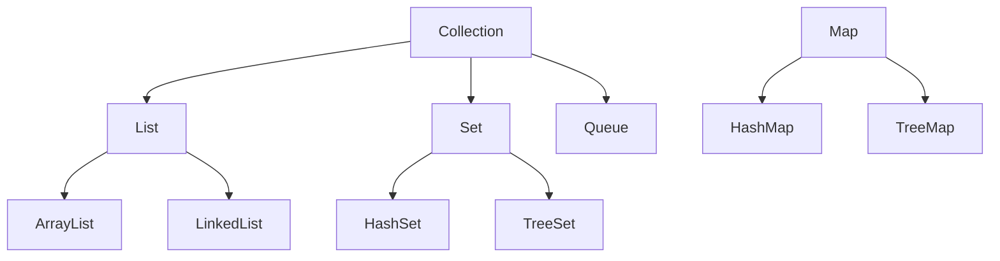
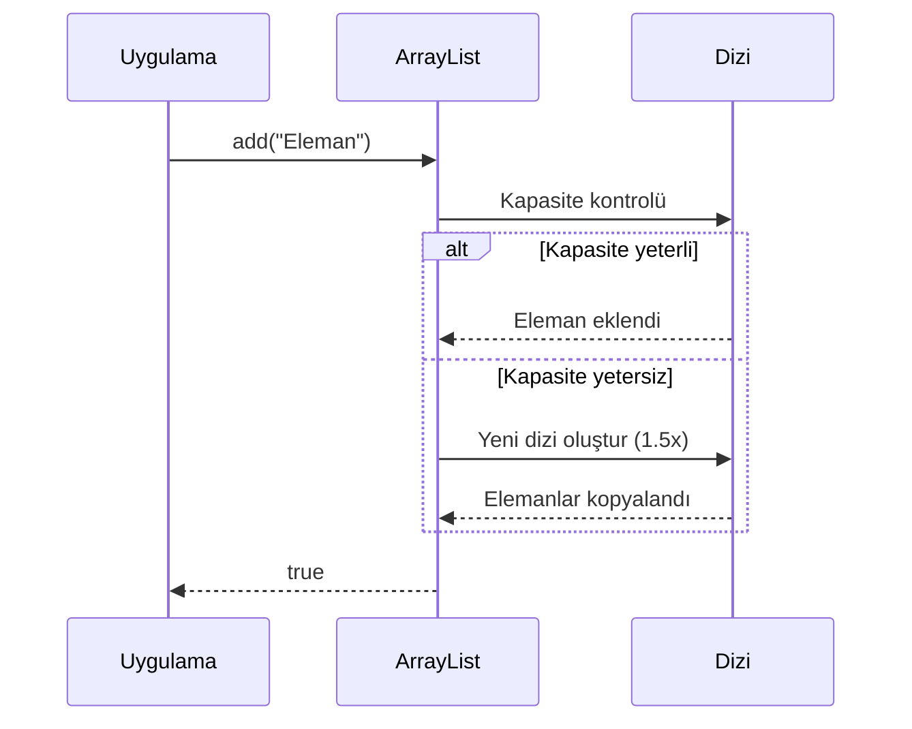
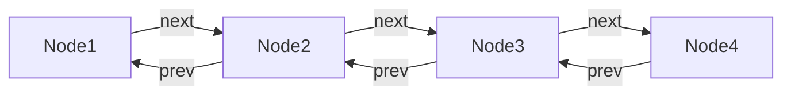
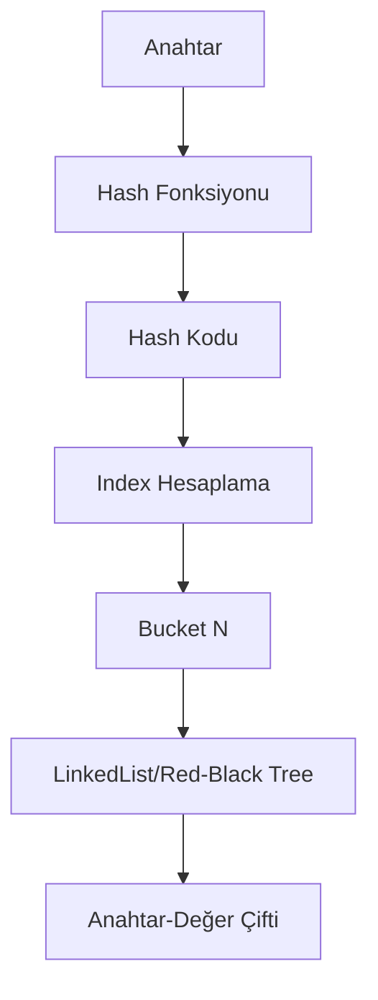

```yaml
---
title: "Koleksiyonlar ve Dinamik Veri Yönetimi"
subtitle: "Java'da Veri Yapıları ve Algoritmalar"
author: "Teknik Kitap Yazarı"
date: "2024-01-15"
lang: "tr"
subject: "Java Koleksiyon Çerçevesi"
keywords: [ArrayList, LinkedList, HashMap, HashSet, Collections, Java]
---

# Koleksiyonlar ve Dinamik Veri Yönetimi

Java programlama dilinde veri yönetimi, çoğu uygulamanın temelini oluşturur. Bu bölümde, Java Collection Framework'ün sunduğu güçlü veri yapılarını ve dinamik veri yönetimi tekniklerini derinlemesine inceleyeceğiz.

## Koleksiyonlara Giriş ve Temel Kavramlar

Koleksiyonlar, birden fazla nesneyi bir arada tutmak ve yönetmek için kullanılan yapılardır. Java'da koleksiyonlar, dizilerden farklı olarak dinamik boyutlandırma ve zengin işlevsellik sunar.

### Koleksiyon Nedir? Dizilerden Farkı

Diziler sabit boyutluyken, koleksiyonlar dinamik olarak büyüyüp küçülebilir. İşte temel farklılıklar:

| Özellik | Dizi | Koleksiyon |
|---------|------|------------|
| Boyut | Sabit | Dinamik |
| Tip Güvenliği | Var (primitifler dahil) | Generic'ler ile sağlanır |
| Performans | Daha hızlı | Biraz daha yavaş |
| API Desteği | Sınırlı | Zengin metodlar |

<!-- CODE_META: language=java, fileName=CollectionVsArray.java, description=Dizi ve koleksiyon karşılaştırması -->
```java
public class CollectionVsArray {
    public static void main(String[] args) {
        // Dizi - sabit boyut
        int[] dizi = new int[5];
        dizi[0] = 10;
        // dizi[5] = 20; // ArrayIndexOutOfBoundsException!
        
        // ArrayList - dinamik boyut
        ArrayList<Integer> liste = new ArrayList<>();
        liste.add(10);
        liste.add(20); // Sorunsuz eklenir
        System.out.println("Liste boyutu: " + liste.size());
    }
}
```

> **Önemli Not:** Koleksiyonlar, primitif tipleri doğrudan tutamaz. Wrapper sınıflar (Integer, Double vb.) kullanılmalıdır. Ancak Java 5'ten itibaren autoboxing bu sorunu otomatik çözer.

### Koleksiyon Türlerine Genel Bakış

Java Collection Framework üç ana arayüz etrafında şekillenir:



<!-- CODE_META: language=java, fileName=CollectionTypesDemo.java, description=Farklı koleksiyon türlerinin temel kullanımı -->
```java
public class CollectionTypesDemo {
    public static void main(String[] args) {
        // List - Sıralı, tekrarlanabilir
        List<String> liste = new ArrayList<>();
        liste.add("Java");
        liste.add("Python");
        liste.add("Java"); // Tekrar eklenebilir
        
        // Set - Benzersiz, sırasız
        Set<Integer> kume = new HashSet<>();
        kume.add(1);
        kume.add(2);
        kume.add(1); // Tekrar eklenmez!
        
        // Map - Anahtar-Değer çiftleri
        Map<String, Integer> harita = new HashMap<>();
        harita.put("Ahmet", 25);
        harita.put("Mehmet", 30);
    }
}
```

## ArrayList: Dinamik Dizi Yapısı

ArrayList, Java'nın en çok kullanılan koleksiyon türüdür. Dinamik bir dizi olarak çalışır ve rastgele erişimde O(1) performans sunar.

### ArrayList'in Çalışma Prensibi

ArrayList'in iç yapısı bir Object[] dizisidir. Kapasite dolduğunda, yeni bir dizi oluşturulur ve elemanlar kopyalanır.



<!-- CODE_META: language=java, fileName=ArrayListExample.java, description=ArrayList oluşturma ve temel işlemler -->
```java
public class ArrayListExample {
    public static void main(String[] args) {
        ArrayList<String> ogrenciler = new ArrayList<>();
        
        // Eleman ekleme
        ogrenciler.add("Ali");
        ogrenciler.add("Ayşe");
        ogrenciler.add(1, "Mehmet"); // Belirli indexe ekleme
        
        // Eleman silme
        String silinen = ogrenciler.remove(0);
        System.out.println("Silinen: " + silinen);
        
        // Eleman sayısı
        System.out.println("Öğrenci sayısı: " + ogrenciler.size());
        
        // Belirli indexteki eleman
        System.out.println("İlk öğrenci: " + ogrenciler.get(0));
    }
}
```

### ArrayList ile İleri Düzey İşlemler

ArrayList ile döngüler, stream API ve çeşitli dönüşüm işlemleri yapılabilir.

<!-- CODE_META: language=java, fileName=GradeCalculator.java, description=Öğrenci not ortalaması hesaplama -->
```java
public class GradeCalculator {
    public static void main(String[] args) {
        ArrayList<Integer> notlar = new ArrayList<>(Arrays.asList(85, 92, 78, 95, 88));
        
        // Geleneksel for döngüsü
        int toplam = 0;
        for (int i = 0; i < notlar.size(); i++) {
            toplam += notlar.get(i);
        }
        double ortalama1 = (double) toplam / notlar.size();
        
        // Stream API ile
        double ortalama2 = notlar.stream()
            .mapToInt(Integer::intValue)
            .average()
            .orElse(0.0);
            
        System.out.println("Ortalama: " + ortalama2);
        
        // Alt liste oluşturma
        List<Integer> ilkUc = notlar.subList(0, 3);
        System.out.println("İlk üç not: " + ilkUc);
    }
}
```

## LinkedList: Bağlı Liste Yapısı

LinkedList, çift yönlü bağlı liste yapısıyla çalışır ve özellikle sık ekleme/silme işlemlerinde ArrayList'ten daha iyi performans gösterir.

### LinkedList'in Yapısı ve Özellikleri

LinkedList, her elemanın bir önceki ve sonraki elemanı işaret ettiği node'lardan oluşur.



<!-- CODE_META: language=java, fileName=LinkedListDemo.java, description=LinkedList oluşturma ve kuyruk işlemleri -->
```java
public class LinkedListDemo {
    public static void main(String[] args) {
        LinkedList<String> kuyruk = new LinkedList<>();
        
        // Kuyruğa eleman ekleme
        kuyruk.offer("İlk");
        kuyruk.offer("İkinci");
        kuyruk.offer("Üçüncü");
        
        // Kuyruktan eleman çıkarma
        String ilk = kuyruk.poll();
        System.out.println("Çıkarılan: " + ilk);
        
        // Sıradaki elemanı görme (çıkarmadan)
        String bas = kuyruk.peek();
        System.out.println("Sıradaki: " + bas);
        
        // Başa ve sona ekleme
        kuyruk.addFirst("Yeni ilk");
        kuyruk.addLast("Yeni son");
    }
}
```

### LinkedList ile Stack ve Queue İşlemleri

LinkedList, Deque arayüzünü implemente ederek hem stack (LIFO) hem de queue (FIFO) işlemlerini destekler.

<!-- CODE_META: language=java, fileName=UndoRedoManager.java, description=İşlem geçmişi yönetimi (Undo/Redo) -->
```java
public class UndoRedoManager {
    private LinkedList<String> islemGecmisi = new LinkedList<>();
    private LinkedList<String> geriAlmaGecmisi = new LinkedList<>();
    
    public void islemYap(String islem) {
        islemGecmisi.push(islem);
        geriAlmaGecmisi.clear(); // Yeni işlem geri almayı temizler
    }
    
    public String geriAl() {
        if (!islemGecmisi.isEmpty()) {
            String islem = islemGecmisi.pop();
            geriAlmaGecmisi.push(islem);
            return islem;
        }
        return null;
    }
    
    public String ileriAl() {
        if (!geriAlmaGecmisi.isEmpty()) {
            String islem = geriAlmaGecmisi.pop();
            islemGecmisi.push(islem);
            return islem;
        }
        return null;
    }
    
    public static void main(String[] args) {
        UndoRedoManager manager = new UndoRedoManager();
        manager.islemYap("Dosya açıldı");
        manager.islemYap("Düzenleme yapıldı");
        
        System.out.println("Geri al: " + manager.geriAl());
        System.out.println("İleri al: " + manager.ileriAl());
    }
}
```

## HashMap: Anahtar-Değer Eşlemesi

HashMap, anahtar-değer çiftlerini depolamak için kullanılan en yaygın Map implementasyonudur.

### HashMap'in Çalışma Prensibi

HashMap, hash fonksiyonu kullanarak anahtarları bucket'lara dağıtır ve O(1) ortalama erişim süresi sağlar.



<!-- CODE_META: language=java, fileName=HashMapExample.java, description=HashMap oluşturma ve temel işlemler -->
```java
public class HashMapExample {
    public static void main(String[] args) {
        HashMap<String, Integer> ogrenciNotlari = new HashMap<>();
        
        // Anahtar-değer ekleme
        ogrenciNotlari.put("Ali", 85);
        ogrenciNotlari.put("Ayşe", 92);
        ogrenciNotlari.put("Mehmet", 78);
        
        // Değer okuma
        int aliNotu = ogrenciNotlari.getOrDefault("Ali", 0);
        System.out.println("Ali'nin notu: " + aliNotu);
        
        // Anahtar kontrolü
        if (ogrenciNotlari.containsKey("Ayşe")) {
            System.out.println("Ayşe listede var");
        }
        
        // Silme
        ogrenciNotlari.remove("Mehmet");
        
        // Tüm anahtarları dolaşma
        for (String ogrenci : ogrenciNotlari.keySet()) {
            System.out.println(ogrenci + ": " + ogrenciNotlari.get(ogrenci));
        }
    }
}
```

### HashMap ile Veri Yönetimi

HashMap ile verimli veri yönetimi için performans optimizasyonları yapılabilir.

<!-- CODE_META: language=java, fileName=WordCounter.java, description=Kelime sayacı uygulaması -->
```java
public class WordCounter {
    public static void main(String[] args) {
        String metin = "java java programlama dili java programlama";
        
        HashMap<String, Integer> kelimeSayaci = new HashMap<>();
        
        // Kelimeleri sayma
        for (String kelime : metin.split(" ")) {
            kelimeSayaci.merge(kelime, 1, Integer::sum);
        }
        
        // Sonuçları yazdırma
        kelimeSayaci.forEach((kelime, sayi) -> 
            System.out.println(kelime + ": " + sayi + " kez"));
        
        // Performans optimizasyonu
        HashMap<String, Integer> optimizeHashMap = 
            new HashMap<>(100, 0.75f); // Başlangıç kapasitesi ve load factor
    }
}
```

## HashSet: Benzersiz Eleman Koleksiyonu

HashSet, matematiksel küme işlemlerini gerçekleştirmek için kullanılır ve elemanların benzersiz olmasını garanti eder.

### HashSet'in Yapısı ve Kullanımı

HashSet, dahili olarak HashMap kullanır ve elemanları key olarak depolar.

<!-- CODE_META: language=java, fileName=HashSetExample.java, description=HashSet oluşturma ve küme işlemleri -->
```java
public class HashSetExample {
    public static void main(String[] args) {
        HashSet<String> ogrenciSet = new HashSet<>();
        
        // Eleman ekleme
        ogrenciSet.add("Ali");
        ogrenciSet.add("Ayşe");
        ogrenciSet.add("Ali"); // Tekrar eklenmez!
        
        // Eleman kontrolü
        boolean varMi = ogrenciSet.contains("Ali");
        System.out.println("Ali var mı? " + varMi);
        
        // Eleman sayısı
        System.out.println("Benzersiz öğrenci sayısı: " + ogrenciSet.size());
        
        // Tüm elemanları yazdırma
        for (String ogrenci : ogrenciSet) {
            System.out.println(ogrenci);
        }
    }
}
```

### HashSet ile Küme Operasyonları

HashSet ile matematiksel küme işlemleri kolayca gerçekleştirilebilir.

<!-- CODE_META: language=java, fileName=SetOperations.java, description=Küme operasyonları ve benzersiz IP takibi -->
```java
public class SetOperations {
    public static void main(String[] args) {
        // Benzersiz IP takibi
        HashSet<String> benzersizIP = new HashSet<>();
        String[] ipListesi = {"192.168.1.1", "192.168.1.2", "192.168.1.1", "192.168.1.3"};
        Collections.addAll(benzersizIP, ipListesi);
        System.out.println("Benzersiz IP sayısı: " + benzersizIP.size());
        
        // Küme işlemleri
        HashSet<Integer> setA = new HashSet<>(Arrays.asList(1, 2, 3, 4, 5));
        HashSet<Integer> setB = new HashSet<>(Arrays.asList(4, 5, 6, 7, 8));
        
        // Birleşim
        HashSet<Integer> birlesim = new HashSet<>(setA);
        birlesim.addAll(setB);
        System.out.println("Birleşim: " + birlesim);
        
        // Kesişim
        HashSet<Integer> kesisim = new HashSet<>(setA);
        kesisim.retainAll(setB);
        System.out.println("Kesişim: " + kesisim);
        
        // Fark
        HashSet<Integer> fark = new HashSet<>(setA);
        fark.removeAll(setB);
        System.out.println("Fark (A - B): " + fark);
    }
}
```

## Koleksiyon Algoritmaları ve İleri Düzey İşlemler

Collections sınıfı, koleksiyonlar üzerinde çeşitli algoritmaları uygulamak için statik metotlar sağlar.

### Collections Sınıfı Yardımcı Metotları

<!-- CODE_META: language=java, fileName=CollectionsDemo.java, description=Collections sınıfı kullanımı -->
```java
public class CollectionsDemo {
    public static void main(String[] args) {
        ArrayList<Integer> sayilar = new ArrayList<>(
            Arrays.asList(5, 2, 8, 1, 9, 3, 7));
        
        // Sıralama
        Collections.sort(sayilar);
        System.out.println("Sıralı: " + sayilar);
        
        // Ters çevirme
        Collections.reverse(sayilar);
        System.out.println("Ters: " + sayilar);
        
        // Binary search (önceden sıralanmış olmalı)
        Collections.sort(sayilar);
        int index = Collections.binarySearch(sayilar, 5);
        System.out.println("5'in indexi: " + index);
        
        // Karıştırma
        Collections.shuffle(sayilar);
        System.out.println("Karışık: " + sayilar);
        
        // Doldurma
        Collections.fill(sayilar, 0);
        System.out.println("Doldurulmuş: " + sayilar);
    }
}
```

### Koleksiyonların Dönüşümü ve Filtrelenmesi

Stream API ile koleksiyonlar üzerinde güçlü veri işleme operasyonları yapılabilir.

<!-- CODE_META: language=java, fileName=StreamOperations.java, description=Stream API ile veri analizi -->
```java
public class StreamOperations {
    public static void main(String[] args) {
        List<Integer> sayilar = Arrays.asList(1, 2, 3, 4, 5, 6, 7, 8, 9, 10);
        
        // Filtreleme ve dönüştürme
        List<Integer> ciftSayilar = sayilar.stream()
            .filter(s -> s % 2 == 0)
            .map(s -> s * 2)
            .collect(Collectors.toList());
        System.out.println("Çift sayıların 2 katı: " + ciftSayilar);
        
        // Gruplama
        Map<Boolean, List<Integer>> gruplanmis = sayilar.stream()
            .collect(Collectors.partitioningBy(s -> s % 2 == 0));
        System.out.println("Çiftler: " + gruplanmis.get(true));
        System.out.println("Tekler: " + gruplanmis.get(false));
        
        // Toplama
        int toplam = sayilar.stream()
            .mapToInt(Integer::intValue)
            .sum();
        System.out.println("Toplam: " + toplam);
    }
}
```

### Thread Güvenli Koleksiyonlar

Çoklu iş parçacığı ortamlarında güvenli koleksiyon kullanımı kritik öneme sahiptir.

<!-- CODE_META: language=java, fileName=ThreadSafeCollections.java, description=Thread güvenli koleksiyonlar ve performans karşılaştırması -->
```java
public class ThreadSafeCollections {
    public static void main(String[] args) {
        // Synchronized koleksiyon
        List<String> synchronizedList = 
            Collections.synchronizedList(new ArrayList<>());
        
        // ConcurrentHashMap
        Map<String, Integer> concurrentMap = new ConcurrentHashMap<>();
        
        // CopyOnWriteArrayList
        List<String> copyOnWriteList = new CopyOnWriteArrayList<>();
        
        // Performans testi
        ArrayList<Integer> normalList = new ArrayList<>();
        long baslangic = System.nanoTime();
        
        for (int i = 0; i < 100000; i++) {
            normalList.add(i);
        }
        
        long bitis = System.nanoTime();
        System.out.println("Normal ArrayList süresi: " + 
            (bitis - baslangic) + " ns");
    }
}
```

## Değerlendirme ve Özet

### Koleksiyon Seçim Kriterleri

| Koleksiyon | Ekleme | Silme | Arama | Sıralı Erişim |
|------------|--------|-------|-------|---------------|
| ArrayList | O(1)* | O(n) | O(n) | O(1) |
| LinkedList | O(1) | O(1) | O(n) | O(n) |
| HashMap | O(1) | O(1) | O(1) | - |
| HashSet | O(1) | O(1) | O(1) | - |

*Kapasite artırımı durumunda O(n)

### Proje: Öğrenci Kayıt Sistemi Uygulaması

<!-- CODE_META: language=java, fileName=StudentManagementSystem.java, description=Tam çalışan öğrenci yönetim sistemi -->
```java
public class StudentManagementSystem {
    private Map<String, Student> students = new HashMap<>();
    private Set<String> studentIds = new HashSet<>();
    private List<String> activityLog = new ArrayList<>();
    
    public void addStudent(Student student) {
        if (studentIds.add(student.getId())) {
            students.put(student.getId(), student);
            activityLog.add("Öğrenci eklendi: " + student.getName());
        }
    }
    
    public void removeStudent(String studentId) {
        Student removed = students.remove(studentId);
        if (removed != null) {
            studentIds.remove(studentId);
            activityLog.add("Öğrenci silindi: " + removed.getName());
        }
    }
    
    public Student findStudent(String studentId) {
        return students.get(studentId);
    }
    
    public List<Student> getStudentsByGrade(double minGrade) {
        return students.values().stream()
            .filter(s -> s.getGrade() >= minGrade)
            .collect(Collectors.toList());
    }
    
    public static void main(String[] args) {
        StudentManagementSystem system = new StudentManagementSystem();
        
        system.addStudent(new Student("S001", "Ali", 85.5));
        system.addStudent(new Student("S002", "Ayşe", 92.3));
        system.addStudent(new Student("S003", "Mehmet", 78.0));
        
        Student found = system.findStudent("S001");
        System.out.println("Bulunan: " + found);
        
        List<Student> highPerformers = system.getStudentsByGrade(80.0);
        System.out.println("Yüksek performanslı öğrenciler: " + highPerformers);
    }
}

class Student {
    private String id;
    private String name;
    private double grade;
    
    public Student(String id, String name, double grade) {
        this.id = id;
        this.name = name;
        this.grade = grade;
    }
    
    // Getter metotları
    public String getId() { return id; }
    public String getName() { return name; }
    public double getGrade() { return grade; }
    
    @Override
    public String toString() {
        return "Student{id='" + id + "', name='" + name + "', grade=" + grade + "}";
    }
}
```

## Özet

Bu bölümde Java Collection Framework'ün temel bileşenlerini inceledik:

- **ArrayList**: Dinamik dizi yapısı, rastgele erişimde hızlı
- **LinkedList**: Bağlı liste yapısı, ekleme/silmede hızlı
- **HashMap**: Anahtar-değer eşlemesi, hızlı arama
- **HashSet**: Benzersiz eleman koleksiyonu, küme işlemleri
- **Collections**: Algoritma ve yardımcı metotlar
- **Stream API**: Modern veri işleme ve dönüşüm

## Terim Sözlüğü

| Terim | Açıklama |
|-------|----------|
| **Collection** | Birden fazla nesneyi bir arada tutan yapı |
| **Generic** | Tip güvenliği sağlayan parametrik tip sistemi |
| **Hash Function** | Veriyi sabit boyutlu hash koduna dönüştüren fonksiyon |
| **Load Factor** | HashMap'in yeniden boyutlandırma eşiği |
| **Autoboxing** | Primitif tiplerin wrapper sınıflara otomatik dönüşümü |
| **Stream API** | Koleksiyonlar üzerinde fonksiyonel işlemler sağlayan API |
| **Thread-Safe** | Çoklu iş parçacığı ortamında güvenli kullanım |

## Sorular

1. ArrayList ve LinkedList arasındaki temel farklar nelerdir?
2. HashMap'te collision (çakışma) nasıl çözülür?
3. HashSet neden HashMap kullanır?
4. Collections.sort() hangi sıralama algoritmasını kullanır?
5. Stream API ile geleneksel döngüler arasındaki farklar nelerdir?
6. Thread-safe koleksiyonlar neden önemlidir?
7. HashMap'te initial capacity ve load factor ne işe yarar?
8. LinkedList neden hem List hem Deque arayüzünü implemente eder?

## Alıştırmalar

1. **Temel Seviye**: 10 elemanlı bir ArrayList oluşturun, elemanları sıralayın ve ters çevirin.

2. **Orta Seviye**: Bir metin dosyasındaki kelimelerin frekansını hesaplayan bir program yazın (HashMap kullanarak).

3. **İleri Seviye**: İki farklı küme üzerinde birleşim, kesişim ve fark işlemlerini gerçekleştiren bir program yazın.

4. **Zor Seviye**: Çoklu iş parçacığı kullanarak büyük bir veri kümesini işleyen ve thread-safe koleksiyonlar kullanan bir uygulama geliştirin.

5. **Proje Seviyesi**: Bir kütüphane yönetim sistemi geliştirin (kitap ekleme, silme, arama, ödünç verme işlemleri için uygun koleksiyonları kullanın).