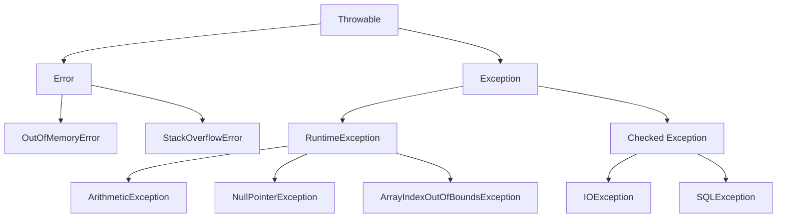
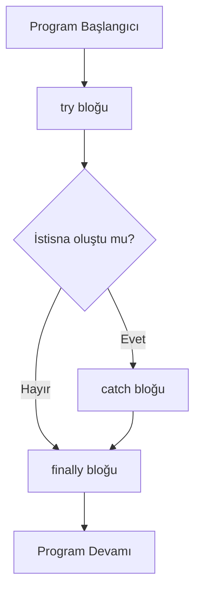
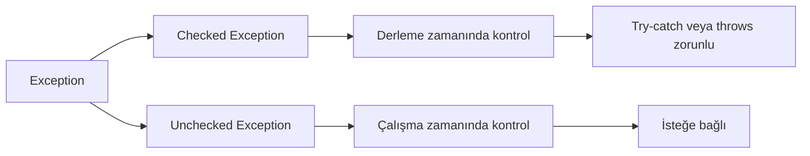
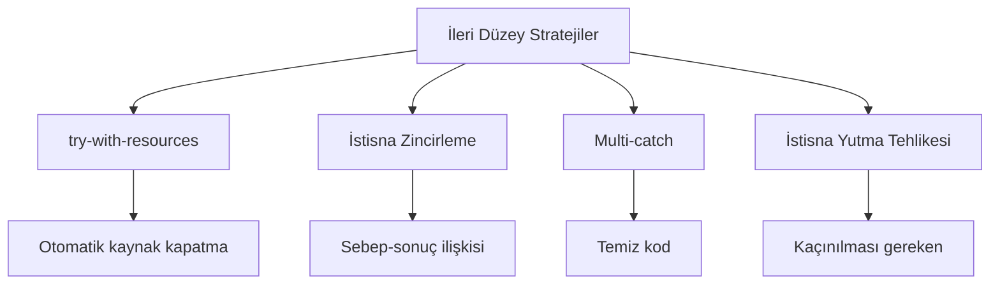

---
title: "Java'da Hata Yönetimi ve Dayanıklı Programlama"
subtitle: "try-catch-finally, Checked/Unchecked Exception, Custom Exception ve İleri Düzey Stratejiler"
author: "Teknik Kitap Yazarı"
date: "2024-01-15"
lang: "tr"
subject: "Java Programlama"
keywords: ["Java", "Hata Yönetimi", "Exception", "try-catch-finally", "Dayanıklı Programlama"]
---

# Java'da Hata Yönetimi ve Dayanıklı Programlama

## Hata Yönetiminin Temel Kavramları ve Önemi

**Kavram**: Hata (Error) ve İstisna (Exception) arasındaki farkı anlamak, dayanıklı programlama için kritik öneme sahiptir.

Hatalar ve istisnalar, programın normal akışını bozan olaylardır. Java'da bu iki kavram farklı şekilde ele alınır:

- **Derleme Zamanı Hataları**: Kod yazılırken fark edilen sentaks hataları. Örneğin, noktalı virgül eksikliği, yanlış anahtar kelime kullanımı.
- **Çalışma Zamanı Hataları**: Program çalışırken ortaya çıkan hatalar. Bunlar `Error` ve `Exception` olarak ikiye ayrılır.

**İstisna Hiyerarşisi**:
```
Throwable
├── Error (JVM seviyesinde kritik hatalar)
│   ├── OutOfMemoryError
│   └── StackOverflowError
└── Exception (Program tarafından yönetilebilir hatalar)
    ├── RuntimeException (Unchecked)
    │   ├── ArithmeticException
    │   ├── NullPointerException
    │   └── ArrayIndexOutOfBoundsException
    └── Checked Exception
        ├── IOException
        └── SQLException
```



**Örnek**: Yaygın istisnaların gösterimi

<!-- CODE_META: Dosya=HataOrnegi.java, Java, Hata yönetimi olmadan program çökmesi -->
```java
public class HataOrnegi {
    public static void main(String[] args) {
        // ArithmeticException örneği
        int a = 10;
        int b = 0;
        System.out.println("Sonuç: " + (a / b)); // ArithmeticException: / by zero
        
        // NullPointerException örneği
        String str = null;
        System.out.println(str.length()); // NullPointerException
        
        // ArrayIndexOutOfBoundsException örneği
        int[] dizi = {1, 2, 3};
        System.out.println(dizi[5]); // ArrayIndexOutOfBoundsException
    }
}
```

> **Pedagojik Not**: Hata yönetimi olmadan yazılan programlar, beklenmedik durumlarda çöker ve kullanıcıya anlamsız hata mesajları gösterir. Bu nedenle, profesyonel yazılım geliştirmede hata yönetimi hayati önem taşır.

**Değerlendirme**: Hata yönetimi olmadan programın çökmesinin sonuçları:
- Kullanıcı deneyimi olumsuz etkilenir
- Veri kaybı yaşanabilir
- Güvenlik açıkları oluşabilir
- Sistem kararlılığı bozulur

## try-catch-finally Yapısı ile İstisna Yakalama

**Kavram**: try-catch-finally blokları, istisnaları yakalamak ve yönetmek için kullanılan temel yapılardır.

- **try bloğu**: İstisna oluşma olasılığı olan kodları içerir
- **catch bloğu**: Belirli bir istisna türünü yakalar ve işler
- **finally bloğu**: İstisna oluşsa da oluşmasa da her durumda çalışan temizlik kodlarını içerir



**Örnek**: Çoklu catch blokları ve finally kullanımı

<!-- CODE_META: Dosya=TryCatchOrnegi.java, Java, try-catch-finally yapısıyla dosya okuma -->
```java
import java.io.*;

public class TryCatchOrnegi {
    public static void main(String[] args) {
        BufferedReader reader = null;
        try {
            reader = new BufferedReader(new FileReader("dosya.txt"));
            String satir = reader.readLine();
            System.out.println("Okunan satır: " + satir);
        } catch (FileNotFoundException e) {
            System.out.println("Dosya bulunamadı: " + e.getMessage());
        } catch (IOException e) {
            System.out.println("Okuma hatası: " + e.getMessage());
        } finally {
            try {
                if (reader != null) {
                    reader.close();
                    System.out.println("Kaynak başarıyla kapatıldı.");
                }
            } catch (IOException e) {
                System.out.println("Kapatma hatası: " + e.getMessage());
            }
        }
    }
}
```

**Uygulama**: Kullanıcıdan alınan iki sayıyı bölen ve sonucu dosyaya yazan program

<!-- CODE_META: Dosya=KullaniciGirisliBolme.java, Java, Kullanıcı girişli bölme işlemi -->
```java
import java.util.Scanner;
import java.io.*;

public class KullaniciGirisliBolme {
    public static void main(String[] args) {
        Scanner scanner = new Scanner(System.in);
        
        try {
            System.out.print("Birinci sayıyı girin: ");
            int sayi1 = Integer.parseInt(scanner.nextLine());
            
            System.out.print("İkinci sayıyı girin: ");
            int sayi2 = Integer.parseInt(scanner.nextLine());
            
            int sonuc = sayi1 / sayi2;
            System.out.println("Sonuç: " + sonuc);
            
            // Sonucu dosyaya yaz
            try (PrintWriter writer = new PrintWriter(new FileWriter("sonuc.txt"))) {
                writer.println("Bölme işlemi sonucu: " + sonuc);
                System.out.println("Sonuç dosyaya yazıldı.");
            }
            
        } catch (ArithmeticException e) {
            System.out.println("Hata: Sıfıra bölme yapılamaz!");
        } catch (NumberFormatException e) {
            System.out.println("Hata: Geçersiz sayı formatı!");
        } catch (IOException e) {
            System.out.println("Hata: Dosya yazma işlemi başarısız!");
        } finally {
            scanner.close();
            System.out.println("Program sonlandırıldı.");
        }
    }
}
```

> **Pedagojik Not**: finally bloğu, özellikle dosya, ağ bağlantısı veya veritabanı gibi kaynakların kapatılması için kritik öneme sahiptir. Kaynak sızıntılarını önler.

**Değerlendirme**: finally bloğunun kaynak yönetimindeki önemi:
- Kaynakların her durumda kapatılmasını garanti eder
- Bellek sızıntılarını önler
- Sistem kaynaklarının verimli kullanılmasını sağlar

## Checked ve Unchecked Exception Ayrımı

**Kavram**: Java'daki istisnalar iki ana kategoriye ayrılır:

- **Checked Exception**: Derleme zamanında kontrol edilen istisnalardır. `IOException`, `SQLException` gibi. Bu istisnalar ya try-catch ile yakalanmalı ya da `throws` ile bildirilmelidir.
- **Unchecked Exception**: Çalışma zamanında ortaya çıkan istisnalardır. `RuntimeException` ve alt sınıfları. Bildirimi zorunlu değildir.



**Örnek**: Her iki tür istisnanın karşılaştırılması

<!-- CODE_META: Dosya=ExceptionTurleri.java, Java, Checked ve Unchecked exception karşılaştırması -->
```java
import java.io.*;

public class ExceptionTurleri {
    // Checked exception - bildirim zorunlu
    public static void dosyaOku() throws IOException {
        FileReader file = new FileReader("test.txt");
        BufferedReader reader = new BufferedReader(file);
        String line = reader.readLine();
        System.out.println("Okunan: " + line);
        reader.close();
    }
    
    // Unchecked exception - bildirim zorunlu değil
    public static void bolmeIslemi(int a, int b) {
        if (b == 0) {
            throw new ArithmeticException("Sıfıra bölme hatası");
        }
        System.out.println("Sonuç: " + (a / b));
    }
    
    public static void main(String[] args) {
        // Unchecked exception yakalama
        try {
            bolmeIslemi(10, 0);
        } catch (ArithmeticException e) {
            System.out.println("Unchecked exception yakalandı: " + e.getMessage());
        }
        
        // Checked exception yakalama
        try {
            dosyaOku();
        } catch (IOException e) {
            System.out.println("Checked exception yakalandı: " + e.getMessage());
        }
    }
}
```

**Uygulama**: Bir hesap makinesi programında her iki tür istisnayı yönetme

<!-- CODE_META: Dosya=HesapMakinesi.java, Java, Hesap makinesi uygulaması -->
```java
import java.util.Scanner;

public class HesapMakinesi {
    public static double bolme(double a, double b) throws ArithmeticException {
        if (b == 0) {
            throw new ArithmeticException("Sıfıra bölme hatası");
        }
        return a / b;
    }
    
    public static double karekok(double a) throws IllegalArgumentException {
        if (a < 0) {
            throw new IllegalArgumentException("Negatif sayının karekökü alınamaz");
        }
        return Math.sqrt(a);
    }
    
    public static void main(String[] args) {
        Scanner scanner = new Scanner(System.in);
        
        try {
            System.out.print("Birinci sayı: ");
            double sayi1 = Double.parseDouble(scanner.nextLine());
            
            System.out.print("İkinci sayı: ");
            double sayi2 = Double.parseDouble(scanner.nextLine());
            
            // Checked exception örneği (NumberFormatException aslında unchecked)
            // Unchecked exception örneği
            double sonuc = bolme(sayi1, sayi2);
            System.out.println("Bölme sonucu: " + sonuc);
            
        } catch (ArithmeticException e) {
            System.out.println("Matematiksel hata: " + e.getMessage());
        } catch (NumberFormatException e) {
            System.out.println("Geçersiz sayı formatı!");
        } finally {
            scanner.close();
        }
    }
}
```

> **Pedagojik Not**: Checked exception'lar, geliştiriciyi hata yönetimi yapmaya zorlar. Bu, daha güvenli kod yazılmasını sağlar. Unchecked exception'lar ise genellikle programlama hatalarından kaynaklanır (null kontrolü, dizi sınırları gibi).

**Değerlendirme**: Hangi durumda hangi tür istisna kullanılmalı?
- **Checked Exception**: Dış kaynaklı, kurtarılabilir hatalar için (dosya okuma, ağ bağlantısı)
- **Unchecked Exception**: Programlama hataları veya önlenebilir durumlar için (null kontrolü, geçersiz parametre)

## Custom Exception (Özel İstisna) Oluşturma

**Kavram**: Kendi istisna sınıflarınızı oluşturarak daha anlamlı ve özel hata mesajları verebilirsiniz.

- `Exception` veya `RuntimeException` sınıflarından türetme
- Özel mesaj ve ek bilgi taşıma
- Daha anlamlı hata raporlaması

**Örnek**: Kullanıcı doğrulama için özel istisna

<!-- CODE_META: Dosya=CustomExceptionOrnegi.java, Java, Custom exception oluşturma -->
```java
// Özel istisna sınıfı
class InvalidAgeException extends Exception {
    private int hataliYas;
    
    public InvalidAgeException(String message, int hataliYas) {
        super(message);
        this.hataliYas = hataliYas;
    }
    
    public int getHataliYas() {
        return hataliYas;
    }
    
    @Override
    public String toString() {
        return "InvalidAgeException: " + getMessage() + " (Hatalı değer: " + hataliYas + ")";
    }
}

public class CustomExceptionOrnegi {
    public static void yasKontrol(int yas) throws InvalidAgeException {
        if (yas < 0 || yas > 150) {
            throw new InvalidAgeException("Geçersiz yaş değeri", yas);
        }
        System.out.println("Yaş geçerli: " + yas);
    }
    
    public static void main(String[] args) {
        // Hatalı durum testi
        try {
            yasKontrol(-5);
        } catch (InvalidAgeException e) {
            System.out.println("Hata: " + e.getMessage());
            System.out.println("Hatalı değer: " + e.getHataliYas());
            System.out.println("Detay: " + e.toString());
        }
        
        // Geçerli durum testi
        try {
            yasKontrol(25);
        } catch (InvalidAgeException e) {
            System.out.println("Buraya gelmez");
        }
    }
}
```

**Uygulama**: Banka hesap işlemleri için özel istisnalar

<!-- CODE_META: Dosya=BankaIslemleri.java, Java, Banka işlemleri için custom exception -->
```java
// Özel istisna sınıfları
class YetersizBakiyeException extends Exception {
    private double mevcutBakiye;
    private double istenenMiktar;
    
    public YetersizBakiyeException(double mevcutBakiye, double istenenMiktar) {
        super("Yetersiz bakiye! Mevcut: " + mevcutBakiye + ", İstenen: " + istenenMiktar);
        this.mevcutBakiye = mevcutBakiye;
        this.istenenMiktar = istenenMiktar;
    }
    
    public double getMevcutBakiye() { return mevcutBakiye; }
    public double getIstenenMiktar() { return istenenMiktar; }
}

class GecersizHesapNumarasiException extends Exception {
    private String hesapNo;
    
    public GecersizHesapNumarasiException(String hesapNo) {
        super("Geçersiz hesap numarası: " + hesapNo);
        this.hesapNo = hesapNo;
    }
    
    public String getHesapNo() { return hesapNo; }
}

// Banka hesabı sınıfı
class BankaHesabi {
    private String hesapNo;
    private double bakiye;
    
    public BankaHesabi(String hesapNo, double bakiye) throws GecersizHesapNumarasiException {
        if (hesapNo == null || hesapNo.length() != 10) {
            throw new GecersizHesapNumarasiException(hesapNo);
        }
        this.hesapNo = hesapNo;
        this.bakiye = bakiye;
    }
    
    public void paraCek(double miktar) throws YetersizBakiyeException {
        if (miktar > bakiye) {
            throw new YetersizBakiyeException(bakiye, miktar);
        }
        bakiye -= miktar;
        System.out.println("Para çekildi. Kalan bakiye: " + bakiye);
    }
}

public class BankaIslemleri {
    public static void main(String[] args) {
        try {
            BankaHesabi hesap = new BankaHesabi("1234567890", 1000.0);
            System.out.println("Hesap oluşturuldu: " + hesap);
            
            try {
                hesap.paraCek(1500.0);
            } catch (YetersizBakiyeException e) {
                System.out.println("Hata: " + e.getMessage());
                System.out.println("Mevcut bakiye: " + e.getMevcutBakiye());
                System.out.println("İstenen miktar: " + e.getIstenenMiktar());
            }
            
        } catch (GecersizHesapNumarasiException e) {
            System.out.println("Hesap oluşturma hatası: " + e.getMessage());
        }
    }
}
```

> **Pedagojik Not**: Custom exception kullanımı, kodun okunabilirliğini artırır ve hata ayıklama sürecini kolaylaştırır. Ancak gereksiz yere çok fazla özel istisna oluşturmak, kod karmaşıklığını artırabilir.

**Değerlendirme**: Custom exception kullanmanın avantajları ve dezavantajları
- **Avantajları**: Anlamlı hata mesajları, ek bilgi taşıma, kod okunabilirliği
- **Dezavantajları**: Fazla sayıda sınıf oluşturma, gereksiz karmaşıklık

## İleri Düzey Hata Yönetim Stratejileri

**Kavram**: Modern Java özellikleri ile daha etkili hata yönetimi

- **try-with-resources** (Java 7+): Otomatik kaynak yönetimi
- **İstisna Zincirleme**: Bir istisnayı başka bir istisnaya sarmalama
- **Çoklu Yakalama** (Multi-catch, Java 7+): Tek catch bloğunda birden fazla istisna türü
- **İstisna Yutma** Tehlikesi: İstisnayı yakalayıp hiçbir şey yapmamak



**Örnek**: Modern Java özellikleri ile hata yönetimi

<!-- CODE_META: Dosya=IleriHataYonetimi.java, Java, İleri düzey hata yönetim teknikleri -->
```java
import java.io.*;
import java.sql.*;

public class IleriHataYonetimi {
    // try-with-resources ile otomatik kaynak yönetimi
    public static void dosyaOkuModern() {
        try (BufferedReader reader = new BufferedReader(new FileReader("dosya.txt"))) {
            String satir;
            while ((satir = reader.readLine()) != null) {
                System.out.println(satir);
            }
        } catch (IOException e) {
            System.err.println("Dosya okuma hatası: " + e.getMessage());
            e.printStackTrace();
        }
    }
    
    // Multi-catch ile çoklu istisna yakalama
    public static void cokluIstisnaYakalama() {
        try {
            int[] dizi = new int[5];
            dizi[10] = 30 / 0;
        } catch (ArithmeticException | ArrayIndexOutOfBoundsException e) {
            System.out.println("Matematiksel veya dizi hatası: " + e.getClass().getSimpleName());
            System.out.println("Hata mesajı: " + e.getMessage());
        }
    }
    
    // İstisna zincirleme
    public static void islemYap() throws Exception {
        try {
            throw new SQLException("Veritabanı bağlantı hatası");
        } catch (SQLException e) {
            throw new Exception("İşlem başarısız", e); // Zincirleme
        }
    }
    
    // İstisna yutma - KAÇINILMASI GEREKEN
    public static void kotuOrnek() {
        try {
            int sonuc = 10 / 0;
        } catch (ArithmeticException e) {
            // Hiçbir şey yapma - İSTİSNA YUTMA!
        }
    }
    
    public static void main(String[] args) {
        // İstisna zincirleme testi
        try {
            islemYap();
        } catch (Exception e) {
            System.out.println("Ana hata: " + e.getMessage());
            System.out.println("Sebep: " + e.getCause().getMessage());
            System.out.println("Sebep sınıfı: " + e.getCause().getClass().getSimpleName());
        }
        
        dosyaOkuModern();
        cokluIstisnaYakalama();
        
        System.out.println("Program başarıyla tamamlandı.");
    }
}
```

> **Pedagojik Not**: İstisna yutma (exception swallowing), hataların gizlenmesine ve programın beklenmedik durumlarda çalışmaya devam etmesine neden olur. Bu, hata ayıklamayı zorlaştırır ve güvenlik açıklarına yol açabilir.

**Uygulama**: Bir e-ticaret uygulamasında tüm hata yönetim stratejilerini birleştiren kapsamlı örnek

<!-- CODE_META: Dosya=ETicaretSistemi.java, Java, E-ticaret sistemi hata yönetimi -->
```java
import java.util.*;

// Özel istisna sınıfları
class StokYetersizException extends Exception {
    private String urunAdi;
    private int mevcutStok;
    
    public StokYetersizException(String urunAdi, int mevcutStok) {
        super("Stok yetersiz: " + urunAdi + " (Mevcut: " + mevcutStok + ")");
        this.urunAdi = urunAdi;
        this.mevcutStok = mevcutStok;
    }
}

class OdemeHatasiException extends Exception {
    private String odemeTipi;
    
    public OdemeHatasiException(String odemeTipi, String mesaj) {
        super("Ödeme hatası (" + odemeTipi + "): " + mesaj);
        this.odemeTipi = odemeTipi;
    }
}

// E-ticaret sistemi
public class ETicaretSistemi {
    private Map<String, Integer> stok = new HashMap<>();
    private List<String> siparisler = new ArrayList<>();
    
    public ETicaretSistemi() {
        stok.put("Laptop", 5);
        stok.put("Telefon", 10);
        stok.put("Kulaklık", 20);
    }
    
    public void stokKontrol(String urun, int adet) throws StokYetersizException {
        Integer mevcutStok = stok.get(urun);
        if (mevcutStok == null || mevcutStok < adet) {
            throw new StokYetersizException(urun, mevcutStok != null ? mevcutStok : 0);
        }
    }
    
    public void odemeIsle(String odemeTipi, double miktar) throws OdemeHatasiException {
        if (odemeTipi.equals("KrediKarti") && miktar > 10000) {
            throw new OdemeHatasiException(odemeTipi, "Limit aşımı");
        }
        System.out.println("Ödeme başarılı: " + miktar + " TL (" + odemeTipi + ")");
    }
    
    public void siparisVer(String urun, int adet, String odemeTipi) 
            throws StokYetersizException, OdemeHatasiException {
        stokKontrol(urun, adet);
        odemeIsle(odemeTipi, adet * 1000.0);
        
        stok.put(urun, stok.get(urun) - adet);
        siparisler.add(urun + " x" + adet);
        System.out.println("Sipariş başarıyla oluşturuldu.");
    }
    
    public static void main(String[] args) {
        ETicaretSistemi sistem = new ETicaretSistemi();
        
        try (Scanner scanner = new Scanner(System.in)) {
            System.out.print("Ürün adı: ");
            String urun = scanner.nextLine();
            
            System.out.print("Adet: ");
            int adet = Integer.parseInt(scanner.nextLine());
            
            System.out.print("Ödeme tipi (KrediKarti/Nakit): ");
            String odemeTipi = scanner.nextLine();
            
            try {
                sistem.siparisVer(urun, adet, odemeTipi);
            } catch (StokYetersizException | OdemeHatasiException e) {
                System.out.println("Sipariş hatası: " + e.getMessage());
            } catch (NumberFormatException e) {
                System.out.println("Geçersiz sayı formatı!");
            }
            
        } catch (Exception e) {
            System.out.println("Beklenmeyen hata: " + e.getMessage());
            e.printStackTrace();
        }
    }
}
```

**Değerlendirme**: 
- **Hangi durumda hangi strateji kullanılmalı?**
  - try-with-resources: Otomatik kapatılabilir kaynaklar için
  - Multi-catch: Benzer işlem gerektiren istisnalar için
  - İstisna zincirleme: Hata kaynağını korumak için

- **Performans ve okunabilirlik dengesi**
  - Çok fazla try-catch bloğu performansı etkileyebilir
  - Ancak iyi yapılandırılmış hata yönetimi, bakım maliyetini düşürür

- **Loglama ve hata raporlama en iyi uygulamaları**
  - Hataları log dosyasına kaydetme
  - Kullanıcıya anlamlı mesajlar gösterme
  - Hassas bilgileri log'lamama

## Proje: Dayanıklı Dosya İşleme Sistemi

**Uygulama**: Tüm öğrenilen kavramları içeren kapsamlı bir proje

<!-- CODE_META: Dosya=DosyaIslemeSistemi.java, Java, Dayanıklı dosya işleme sistemi -->
```java
import java.io.*;
import java.util.*;

// Özel istisna sınıfları
class DosyaBulunamadiException extends Exception {
    private String dosyaAdi;
    
    public DosyaBulunamadiException(String dosyaAdi, Throwable cause) {
        super("Dosya bulunamadı: " + dosyaAdi, cause);
        this.dosyaAdi = dosyaAdi;
    }
    
    public String getDosyaAdi() { return dosyaAdi; }
}

class DosyaOkumaException extends Exception {
    private String dosyaAdi;
    private int hataliSatir;
    
    public DosyaOkumaException(String dosyaAdi, int hataliSatir, Throwable cause) {
        super("Dosya okuma hatası: " + dosyaAdi + " (Satır: " + hataliSatir + ")", cause);
        this.dosyaAdi = dosyaAdi;
        this.hataliSatir = hataliSatir;
    }
    
    public String getDosyaAdi() { return dosyaAdi; }
    public int getHataliSatir() { return hataliSatir; }
}

// Ana sistem sınıfı
public class DosyaIslemeSistemi {
    private List<String> satirlar = new ArrayList<>();
    
    public void dosyaOku(String dosyaAdi) throws DosyaBulunamadiException, DosyaOkumaException {
        try (BufferedReader reader = new BufferedReader(new FileReader(dosyaAdi))) {
            String satir;
            int satirNo = 0;
            
            while ((satir = reader.readLine()) != null) {
                satirNo++;
                try {
                    // Satır işleme
                    if (satir.trim().isEmpty()) {
                        continue; // Boş satırları atla
                    }
                    satirlar.add(satir);
                } catch (Exception e) {
                    throw new DosyaOkumaException(dosyaAdi, satirNo, e);
                }
            }
            
            System.out.println("Dosya başarıyla okundu. Toplam " + satirlar.size() + " satır.");
            
        } catch (FileNotFoundException e) {
            throw new DosyaBulunamadiException(dosyaAdi, e);
        } catch (IOException e) {
            throw new DosyaOkumaException(dosyaAdi, -1, e);
        }
    }
    
    public void dosyayaYaz(String dosyaAdi) throws IOException {
        try (PrintWriter writer = new PrintWriter(new FileWriter(dosyaAdi))) {
            for (String satir : satirlar) {
                writer.println(satir.toUpperCase());
            }
            System.out.println("Dosyaya yazma işlemi tamamlandı.");
        }
    }
    
    public void satirlariGoster() {
        System.out.println("\n=== Okunan Satırlar ===");
        for (int i = 0; i < satirlar.size(); i++) {
            System.out.println((i + 1) + ": " + satirlar.get(i));
        }
    }
    
    public static void main(String[] args) {
        DosyaIslemeSistemi sistem = new DosyaIslemeSistemi();
        Scanner scanner = new Scanner(System.in);
        
        System.out.println("=== Dayanıklı Dosya İşleme Sistemi ===");
        System.out.print("Okunacak dosya adını girin: ");
        String dosyaAdi = scanner.nextLine();
        
        try {
            // Dosyayı oku
            sistem.dosyaOku(dosyaAdi);
            
            // Satırları göster
            sistem.satirlariGoster();
            
            // Yeni dosyaya yaz
            String yeniDosyaAdi = "islenmis_" + dosyaAdi;
            sistem.dosyayaYaz(yeniDosyaAdi);
            
            System.out.println("\nİşlem başarıyla tamamlandı!");
            
        } catch (DosyaBulunamadiException e) {
            System.out.println("Hata: " + e.getMessage());
            System.out.println("Dosya adı: " + e.getDosyaAdi());
            System.out.println("Sebep: " + e.getCause().getMessage());
            
        } catch (DosyaOkumaException e) {
            System.out.println("Hata: " + e.getMessage());
            System.out.println("Dosya: " + e.getDosyaAdi());
            System.out.println("Hatalı satır: " + e.getHataliSatir());
            
        } catch (IOException e) {
            System.out.println("Dosya yazma hatası: " + e.getMessage());
            
        } catch (Exception e) {
            System.out.println("Beklenmeyen hata: " + e.getMessage());
            e.printStackTrace();
            
        } finally {
            scanner.close();
            System.out.println("Program sonlandırıldı.");
        }
    }
}
```

**Değerlendirme**: Kod incelemesi ve hata senaryoları testi
- **Test Senaryoları**:
  1. Var olan bir dosyayı okuma
  2. Var olmayan bir dosyayı okuma (DosyaBulunamadiException)
  3. Boş bir dosyayı okuma
  4. Özel karakterler içeren dosyayı okuma
  5. Çok büyük bir dosyayı okuma

## Özet

Bu bölümde Java'da hata yönetimi ve dayanıklı programlama konularını detaylı olarak inceledik:

1. **Hata Yönetiminin Temel Kavramları**: Error ve Exception arasındaki fark, istisna hiyerarşisi
2. **try-catch-finally Yapısı**: İstisna yakalama, çoklu catch blokları, finally kullanımı
3. **Checked ve Unchecked Exception**: Derleme ve çalışma zamanı istisnaları, throws anahtar kelimesi
4. **Custom Exception**: Özel istisna sınıfları oluşturma, ek bilgi taşıma
5. **İleri Düzey Stratejiler**: try-with-resources, multi-catch, istisna zincirleme
6. **Proje Uygulaması**: Dayanıklı dosya işleme sistemi

## Terim Sözlüğü

| Terim | Açıklama |
|-------|----------|
| **Exception** | Program ç