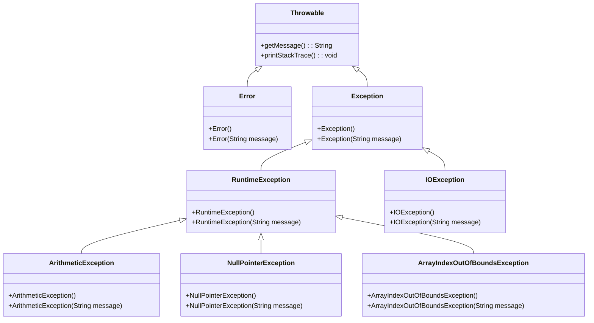
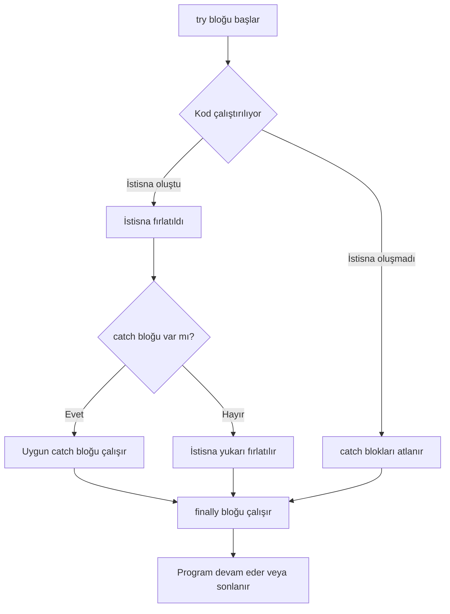
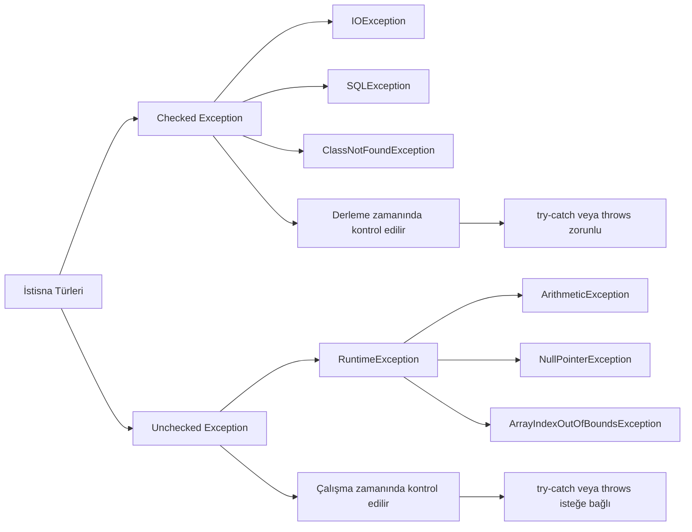
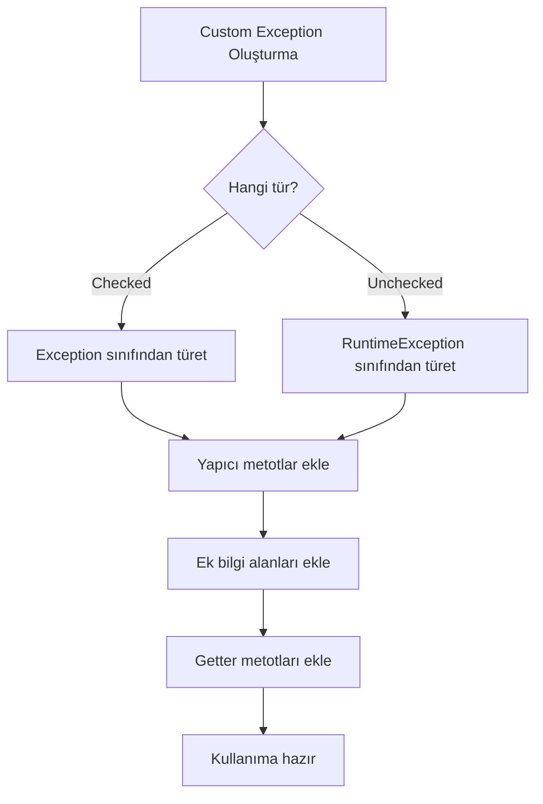
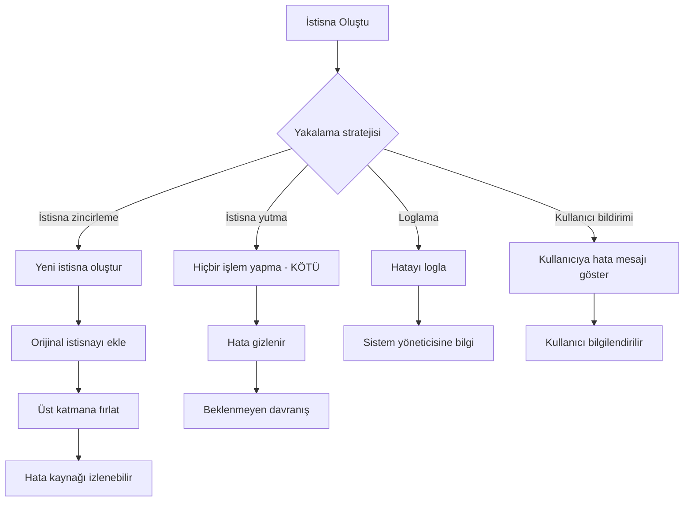

---
title: Java'da Hata Yönetimi ve Dayanıklı Programlama
subtitle: try-catch-finally, Checked/Unchecked Exception, Custom Exception ve İleri Düzey Stratejiler
author: Teknik Kitap Yazarı ve Pedagojik İçerik Uzmanı
date: 2024-01-01
lang: tr
---

# Bölüm 15: Hata Yonetimi ve Dayanikli Programlama

## 15.1 Hata Yönetiminin Temel Kavramları ve Önemi

### Hata ve İstisna Arasındaki Fark

Yazılım geliştirme sürecinde karşılaşılan sorunlar genellikle iki ana kategoriye ayrılır: **Hata (Error)** ve **İstisna (Exception)**. Bu iki kavramı anlamak, etkili bir hata yönetimi stratejisi oluşturmanın temelidir.

**Derleme Zamanı Hataları (Compile-time Errors):** Kod yazarken Java derleyicisi tarafından tespit edilen hatalardır. Sözdizimi hataları, tip uyuşmazlıkları veya eksik import ifadeleri bu kategoriye girer. Bu hatalar program çalıştırılmadan önce düzeltilmelidir.

**Çalışma Zamanı Hataları (Runtime Errors):** Program çalışırken ortaya çıkan beklenmedik durumlardır. Bu hatalar genellikle dış etkenlerden (kullanıcı girdisi, dosya erişimi, ağ sorunları) kaynaklanır. Java'da bu tür hatalar **istisna** olarak adlandırılır.

Java'nın istisna hiyerarşisi şu şekilde yapılandırılmıştır:



**Error sınıfı:** JVM (Java Virtual Machine) ile ilgili ciddi sorunları temsil eder. Örneğin, `OutOfMemoryError`, `StackOverflowError` gibi durumlar. Bu hatalar genellikle program tarafından yakalanamaz ve yönetilemez.

**Exception sınıfı:** Program tarafından yakalanıp yönetilebilen istisnai durumları temsil eder. İki alt kategoriye ayrılır:
- **Checked Exception:** Derleme zamanında kontrol edilen istisnalar (IOException, SQLException)
- **Unchecked Exception:** Çalışma zamanında ortaya çıkan istisnalar (RuntimeException alt sınıfları)

### Yaygın İstisna Örnekleri

Aşağıda en sık karşılaşılan istisna türleri ve neden oluştukları açıklanmıştır:

| İstisna Türü | Oluşma Nedeni | Örnek Senaryo |
|-------------|---------------|----------------|
| ArithmeticException | Matematiksel işlem hatası | Sıfıra bölme |
| NullPointerException | Null referans üzerinde işlem | Metot çağrısı yapılmamış nesne |
| ArrayIndexOutOfBoundsException | Dizi sınırları dışına çıkma | Dizinin 5. elemanına erişmeye çalışmak (dizi boyutu 5 ise) |
| FileNotFoundException | Dosya bulunamaması | Var olmayan bir dosyayı açmaya çalışmak |
| NumberFormatException | Sayısal dönüşüm hatası | "abc" string'ini integer'a çevirmeye çalışmak |

### Uygulama: Basit Bölme İşlemi

Aşağıdaki örnek, hata yönetimi olmadan bir programın nasıl çöktüğünü göstermektedir:

<!-- CODE_META: HataOrnegi.java - Basit bölme işlemi hatası -->
```java
public class HataOrnegi {
    public static void main(String[] args) {
        int a = 10;
        int b = 0;
        System.out.println("Sonuç: " + (a / b)); // ArithmeticException: / by zero
    }
}
```

Bu kod çalıştırıldığında, `b` değişkeni 0 olduğu için `ArithmeticException` fırlatılır ve program aniden sonlanır. Eğer bu işlem kritik bir uygulamada gerçekleşseydi, kullanıcı veri kaybı yaşayabilir veya sistem kararsız hale gelebilirdi.

> **Önemli:** Hata yönetimi olmadan programın çökmesi, veri kaybına, güvenlik açıklarına ve kullanıcı deneyiminin bozulmasına neden olabilir. Bu nedenle, dayanıklı programlama için hata yönetimi zorunludur.

### Değerlendirme

Hata yönetimi olmadan bir programın karşılaşabileceği sonuçlar:
1. **Veri Kaybı:** Kullanıcı tarafından girilen veya işlenen veriler kaybolabilir.
2. **Güvenlik Açıkları:** Beklenmeyen durumlar, güvenlik duvarlarını aşmak için kullanılabilir.
3. **Kullanıcı Deneyimi:** Ani çökmeler, kullanıcıların sisteme olan güvenini azaltır.
4. **Sistem Kararsızlığı:** Kaynak sızıntıları ve tutarsız durumlar sistemin çökmesine yol açabilir.

---

## 15.2 try-catch-finally Yapısı ile İstisna Yakalama

### try-catch-finally Bloklarının İşleyişi

Java'da istisna yönetiminin temel yapı taşı `try-catch-finally` bloklarıdır. Bu yapı sayesinde, potansiyel olarak istisna fırlatabilecek kodlar güvenli bir şekilde çalıştırılabilir.

**try bloğu:** İstisna oluşma ihtimali olan kodların yazıldığı bloktur. Bu blok içinde bir istisna oluşursa, kontrol hemen uygun `catch` bloğuna geçer.

**catch bloğu:** Belirli bir istisna türünü yakalamak ve işlemek için kullanılır. Birden fazla `catch` bloğu tanımlanabilir.

**finally bloğu:** İstisna oluşsa da oluşmasa da her durumda çalıştırılması gereken kodlar için kullanılır. Genellikle kaynak temizleme işlemleri için tercih edilir.



### Çoklu catch Blokları ve finally Kullanımı

Aşağıdaki örnek, bir dosyayı okurken karşılaşılabilecek farklı istisna türlerini nasıl yönetebileceğinizi göstermektedir:

<!-- CODE_META: TryCatchOrnegi.java - try-catch-finally yapısı -->
```java
import java.io.*;

public class TryCatchOrnegi {
    public static void main(String[] args) {
        BufferedReader reader = null;
        try {
            reader = new BufferedReader(new FileReader("dosya.txt"));
            String satir = reader.readLine();
            System.out.println(satir);
        } catch (FileNotFoundException e) {
            System.out.println("Dosya bulunamadı: " + e.getMessage());
        } catch (IOException e) {
            System.out.println("Okuma hatası: " + e.getMessage());
        } finally {
            try {
                if (reader != null) {
                    reader.close();
                }
            } catch (IOException e) {
                System.out.println("Kapatma hatası");
            }
        }
    }
}
```

Bu örnekte:
1. **try bloğu:** Dosyayı açar ve okur.
2. **catch blokları:**
   - `FileNotFoundException`: Dosya bulunamazsa yakalanır.
   - `IOException`: Okuma sırasında başka bir hata oluşursa yakalanır.
3. **finally bloğu:** Her durumda dosyayı kapatır.

> **Önemli:** finally bloğu, kaynak yönetimi için kritik öneme sahiptir. Dosya, ağ bağlantısı veya veritabanı bağlantısı gibi kaynakların her durumda serbest bırakılmasını sağlar.

### Uygulama: Kullanıcı Girdisi ile Bölme İşlemi

Aşağıdaki uygulama, kullanıcıdan alınan iki sayıyı bölen ve sonucu bir dosyaya yazan programdır:

<!-- CODE_META: BolmeVeDosyayaYaz.java - Kullanıcı girdisi ile bölme işlemi -->
```java
import java.io.*;
import java.util.Scanner;

public class BolmeVeDosyayaYaz {
    public static void main(String[] args) {
        Scanner scanner = new Scanner(System.in);
        BufferedWriter writer = null;
        
        try {
            System.out.print("Birinci sayıyı girin: ");
            int a = Integer.parseInt(scanner.nextLine());
            
            System.out.print("İkinci sayıyı girin: ");
            int b = Integer.parseInt(scanner.nextLine());
            
            int sonuc = a / b;
            
            writer = new BufferedWriter(new FileWriter("sonuc.txt"));
            writer.write("Bölme sonucu: " + sonuc);
            System.out.println("Sonuç dosyaya yazıldı.");
            
        } catch (NumberFormatException e) {
            System.out.println("Geçersiz sayı formatı: " + e.getMessage());
        } catch (ArithmeticException e) {
            System.out.println("Sıfıra bölme hatası: " + e.getMessage());
        } catch (IOException e) {
            System.out.println("Dosya yazma hatası: " + e.getMessage());
        } finally {
            try {
                if (writer != null) {
                    writer.close();
                }
                scanner.close();
            } catch (IOException e) {
                System.out.println("Kapatma hatası");
            }
        }
    }
}
```

Bu uygulama şu istisna durumlarını yönetir:
1. **NumberFormatException:** Kullanıcı sayı yerine harf girerse
2. **ArithmeticException:** İkinci sayı 0 girilirse
3. **IOException:** Dosyaya yazma işlemi başarısız olursa

### Değerlendirme

finally bloğunun kaynak yönetimindeki önemi:
- **Kaynak Sızıntısını Önler:** Açık kalan dosyalar, ağ bağlantıları veya veritabanı bağlantıları sistem kaynaklarını tüketir.
- **Her Durumda Çalışır:** İstisna oluşsa da oluşmasa da çalışır.
- **Temizlik Kodları İçin İdealdir:** Loglama, bildirim gönderme gibi işlemler için kullanılabilir.

---

## 15.3 Checked ve Unchecked Exception Ayrımı

### Checked Exception

**Checked Exception**'lar, derleme zamanında Java derleyicisi tarafından kontrol edilen istisnalardır. Bu tür istisnalar, ya `try-catch` bloğu ile yakalanmalı ya da metot imzasında `throws` anahtar kelimesi ile bildirilmelidir.

**Özellikler:**
- `Exception` sınıfının `RuntimeException` dışındaki alt sınıflarıdır.
- Derleme hatasına neden olur.
- Genellikle dış etkenlerden kaynaklanır (dosya, ağ, veritabanı).
- Programcı bu istisnaları yönetmek zorundadır.

### Unchecked Exception

**Unchecked Exception**'lar, çalışma zamanında ortaya çıkan istisnalardır. Bu tür istisnaların `try-catch` ile yakalanması veya `throws` ile bildirilmesi zorunlu değildir.

**Özellikler:**
- `RuntimeException` ve alt sınıflarıdır.
- Derleme hatasına neden olmaz.
- Genellikle programlama hatalarından kaynaklanır (null kontrolü, dizi sınırları).
- Programcı isterse yakalayabilir, ancak zorunlu değildir.



### Her İki Türün Karşılaştırılması

Aşağıdaki örnek, checked ve unchecked exception arasındaki farkı göstermektedir:

<!-- CODE_META: ExceptionTurleri.java - Checked ve Unchecked exception karşılaştırması -->
```java
import java.io.*;

public class ExceptionTurleri {
    
    // Checked exception - bildirim zorunlu
    public static void dosyaOku() throws IOException {
        FileReader file = new FileReader("test.txt");
        // Dosya okuma işlemleri
        file.close();
    }
    
    // Unchecked exception - bildirim zorunlu değil
    public static void bolmeIslemi(int a, int b) {
        if (b == 0) {
            throw new ArithmeticException("Sıfıra bölme hatası");
        }
        System.out.println("Sonuç: " + (a / b));
    }
    
    public static void main(String[] args) {
        // Unchecked exception yakalama (isteğe bağlı)
        try {
            bolmeIslemi(10, 0);
        } catch (ArithmeticException e) {
            System.out.println("Unchecked exception yakalandı: " + e.getMessage());
        }
        
        // Checked exception yakalama (zorunlu)
        try {
            dosyaOku();
        } catch (IOException e) {
            System.out.println("Checked exception yakalandı: " + e.getMessage());
        }
    }
}
```

> **Önemli:** Checked exception'lar, API kullanıcılarının hata durumlarını yönetmesini sağlar. Unchecked exception'lar ise genellikle programlama hatalarını belirtir ve düzeltilmesi gerekir.

### Uygulama: Hesap Makinesi Programı

Aşağıdaki hesap makinesi programı, hem checked hem de unchecked exception'ları yönetmektedir:

<!-- CODE_META: HesapMakinesi.java - Checked ve Unchecked exception yönetimi -->
```java
import java.io.*;
import java.util.Scanner;

public class HesapMakinesi {
    
    // Checked exception - dosyaya yazma işlemi
    public static void sonucuKaydet(int sonuc) throws IOException {
        try (BufferedWriter writer = new BufferedWriter(new FileWriter("hesap_log.txt", true))) {
            writer.write("İşlem sonucu: " + sonuc);
            writer.newLine();
        }
    }
    
    // Unchecked exception - bölme işlemi
    public static int bol(int a, int b) {
        if (b == 0) {
            throw new ArithmeticException("Sıfıra bölme hatası");
        }
        return a / b;
    }
    
    public static void main(String[] args) {
        Scanner scanner = new Scanner(System.in);
        
        try {
            System.out.print("Birinci sayı: ");
            int sayi1 = Integer.parseInt(scanner.nextLine());
            
            System.out.print("İkinci sayı: ");
            int sayi2 = Integer.parseInt(scanner.nextLine());
            
            // Unchecked exception - bölme
            int sonuc = bol(sayi1, sayi2);
            System.out.println("Sonuç: " + sonuc);
            
            // Checked exception - dosyaya kaydet
            sonucuKaydet(sonuc);
            System.out.println("Sonuç kaydedildi.");
            
        } catch (NumberFormatException e) {
            System.out.println("Geçersiz sayı formatı: " + e.getMessage());
        } catch (ArithmeticException e) {
            System.out.println("Matematiksel hata: " + e.getMessage());
        } catch (IOException e) {
            System.out.println("Dosya yazma hatası: " + e.getMessage());
        } finally {
            scanner.close();
        }
    }
}
```

### Değerlendirme

Hangi durumda hangi tür istisna kullanılmalı?

| Durum | Önerilen İstisna Türü | Neden |
|-------|----------------------|-------|
| Dosya işlemleri | Checked (IOException) | Kullanıcı dosyayı silebilir veya taşıyabilir |
| Ağ bağlantıları | Checked (SocketException) | Ağ kesintileri beklenen durumlardır |
| Null kontrolü | Unchecked (NullPointerException) | Programlama hatasıdır, düzeltilmelidir |
| Dizi sınırları | Unchecked (ArrayIndexOutOfBoundsException) | Programlama hatasıdır |
| Kullanıcı girdisi | Unchecked (NumberFormatException) | Genellikle doğrulama ile önlenebilir |
| Veritabanı bağlantısı | Checked (SQLException) | Dış etkenlere bağlıdır |

---

## 15.4 Custom Exception (Özel İstisna) Oluşturma

### Kendi İstisna Sınıflarını Oluşturma

Bazı durumlarda, Java'nın standart istisna sınıfları ihtiyaçlarınızı karşılamayabilir. Bu gibi durumlarda, kendi özel istisna sınıflarınızı oluşturabilirsiniz.

**Özel istisna oluşturma adımları:**

1. **Sınıf seçimi:** `Exception` (checked) veya `RuntimeException` (unchecked) sınıfından türetme
2. **Yapıcı metotlar:** En azından `String message` parametreli bir yapıcı metot
3. **Ek bilgi:** İstisna ile ilgili ek bilgiler taşıyabilir (hatalı değer, hata kodu vb.)



### Örnek: Kullanıcı Doğrulama için Özel İstisna

Aşağıdaki örnek, geçersiz yaş değerleri için özel bir istisna sınıfı oluşturmayı göstermektedir:

<!-- CODE_META: CustomExceptionOrnegi.java - Özel istisna oluşturma -->
```java
// Özel istisna sınıfı - Checked exception
class InvalidAgeException extends Exception {
    private int hataliYas;
    
    public InvalidAgeException(String message, int hataliYas) {
        super(message);
        this.hataliYas = hataliYas;
    }
    
    public int getHataliYas() {
        return hataliYas;
    }
}

public class CustomExceptionOrnegi {
    
    public static void yasKontrol(int yas) throws InvalidAgeException {
        if (yas < 0 || yas > 150) {
            throw new InvalidAgeException("Geçersiz yaş değeri", yas);
        }
        System.out.println("Yaş geçerli: " + yas);
    }
    
    public static void main(String[] args) {
        try {
            yasKontrol(-5);
        } catch (InvalidAgeException e) {
            System.out.println("Hata: " + e.getMessage());
            System.out.println("Hatalı değer: " + e.getHataliYas());
        }
        
        try {
            yasKontrol(25);
            System.out.println("İkinci kontrol başarılı.");
        } catch (InvalidAgeException e) {
            System.out.println("Buraya gelmez");
        }
    }
}
```

> **Önemli:** Özel istisna sınıfları, hata mesajlarını daha anlamlı hale getirir ve hata ayıklama sürecini kolaylaştırır. Ayrıca, API kullanıcılarına hangi hata durumlarıyla karşılaşabileceklerini açıkça belirtir.

### Uygulama: Banka Hesap İşlemleri için Özel İstisnalar

Aşağıdaki uygulama, banka hesap işlemleri için çeşitli özel istisna sınıfları tasarlamaktadır:

<!-- CODE_META: BankaHesapOrnegi.java - Banka işlemleri için özel istisnalar -->
```java
// Özel istisna sınıfları
class YetersizBakiyeException extends Exception {
    private double mevcutBakiye;
    private double istenenMiktar;
    
    public YetersizBakiyeException(String message, double mevcutBakiye, double istenenMiktar) {
        super(message);
        this.mevcutBakiye = mevcutBakiye;
        this.istenenMiktar = istenenMiktar;
    }
    
    public double getMevcutBakiye() { return mevcutBakiye; }
    public double getIstenenMiktar() { return istenenMiktar; }
}

class GecersizHesapNumarasiException extends RuntimeException {
    private String hesapNumarasi;
    
    public GecersizHesapNumarasiException(String message, String hesapNumarasi) {
        super(message);
        this.hesapNumarasi = hesapNumarasi;
    }
    
    public String getHesapNumarasi() { return hesapNumarasi; }
}

class NegatifParaMiktariException extends IllegalArgumentException {
    private double miktar;
    
    public NegatifParaMiktariException(String message, double miktar) {
        super(message);
        this.miktar = miktar;
    }
    
    public double getMiktar() { return miktar; }
}

// Banka hesap sınıfı
class BankaHesap {
    private String hesapNumarasi;
    private double bakiye;
    
    public BankaHesap(String hesapNumarasi, double baslangicBakiyesi) {
        if (hesapNumarasi == null || hesapNumarasi.isEmpty()) {
            throw new GecersizHesapNumarasiException("Hesap numarası boş olamaz", hesapNumarasi);
        }
        this.hesapNumarasi = hesapNumarasi;
        this.bakiye = baslangicBakiyesi;
    }
    
    public void paraCek(double miktar) throws YetersizBakiyeException, NegatifParaMiktariException {
        if (miktar < 0) {
            throw new NegatifParaMiktariException("Negatif para miktarı", miktar);
        }
        if (miktar > bakiye) {
            throw new YetersizBakiyeException("Yetersiz bakiye", bakiye, miktar);
        }
        bakiye -= miktar;
        System.out.println("Para çekme başarılı. Kalan bakiye: " + bakiye);
    }
    
    public void paraYatir(double miktar) throws NegatifParaMiktariException {
        if (miktar < 0) {
            throw new NegatifParaMiktariException("Negatif para miktarı", miktar);
        }
        bakiye += miktar;
        System.out.println("Para yatırma başarılı. Yeni bakiye: " + bakiye);
    }
    
    public double getBakiye() { return bakiye; }
    public String getHesapNumarasi() { return hesapNumarasi; }
}

public class BankaHesapOrnegi {
    public static void main(String[] args) {
        try {
            BankaHesap hesap = new BankaHesap("123456", 1000.0);
            System.out.println("Hesap oluşturuldu: " + hesap.getHesapNumarasi());
            
            try {
                hesap.paraCek(1500); // Yetersiz bakiye
            } catch (YetersizBakiyeException e) {
                System.out.println("Hata: " + e.getMessage());
                System.out.println("Mevcut bakiye: " + e.getMevcutBakiye());
                System.out.println("İstenen miktar: " + e.getIstenenMiktar());
            }
            
            try {
                hesap.paraYatir(-100); // Negatif miktar
            } catch (NegatifParaMiktariException e) {
                System.out.println("Hata: " + e.getMessage());
                System.out.println("Girilen miktar: " + e.getMiktar());
            }
            
            hesap.paraCek(500); // Başarılı işlem
            System.out.println("Güncel bakiye: " + hesap.getBakiye());
            
        } catch (GecersizHesapNumarasiException e) {
            System.out.println("Kritik hata: " + e.getMessage());
            System.out.println("Hatalı hesap: " + e.getHesapNumarasi());
        } catch (YetersizBakiyeException | NegatifParaMiktariException e) {
            System.out.println("İşlem hatası: " + e.getMessage());
        }
    }
}
```

### Değerlendirme

Özel istisna kullanmanın avantajları ve dezavantajları:

**Avantajlar:**
- **Anlamlı hata mesajları:** Hatanın kaynağı ve detayları hakkında daha fazla bilgi sağlar
- **Kod okunabilirliği:** Hangi hata durumlarının beklendiğini açıkça belirtir
- **Hata ayıklama:** Hatalı değerler ve durumlar hakkında ek bilgi taşır
- **API tasarımı:** Kullanıcılara hangi hata durumlarıyla karşılaşabileceklerini gösterir

**Dezavantajlar:**
- **Kod karmaşıklığı:** Çok fazla özel istisna sınıfı oluşturmak kodu karmaşık hale getirebilir
- **Performans:** İstisna oluşturma ve yakalama işlemleri maliyetlidir
- **Bakım zorluğu:** Her yeni özellik için yeni istisna sınıfları eklemek gerekebilir

> **Öneri:** Özel istisna sınıflarını yalnızca standart istisnalar yeterli olmadığında kullanın. Aşırı kullanımdan kaçının.

---

## 15.5 İleri Düzey Hata Yönetim Stratejileri

### try-with-resources (Java 7+)

Java 7 ile gelen `try-with-resources` özelliği, `AutoCloseable` arayüzünü uygulayan kaynakların otomatik olarak kapatılmasını sağlar. Bu özellik, `finally` bloğunda kaynak kapatma ihtiyacını ortadan kaldırır.

**Sözdizimi:**
<!-- CODE_META
id: bolum-15_kod01
chapter_id: bolum-15
kind: example
title: "Kod 1"
file: "Ornek00.java"
mainClass: Ornek00
extract: true
test: compile
github: true
qr: dual
-->

```java
try (Kaynak kaynak = new Kaynak()) {
    // Kaynak kullanımı
} catch (Exception e) {
    // Hata yönetimi
}
```

### İstisna Zincirleme (Exception Chaining)

Bir istisna yakalandığında, yeni bir istisna oluşturup orijinal istisnayı neden olarak eklemeye **istisna zincirleme** denir. Bu sayede, hata kaynağına kadar izlenebilir.

**Kullanım:**
<!-- CODE_META
id: bolum-15_kod02
chapter_id: bolum-15
kind: example
title: "Kod 2"
file: "Ornek01.java"
mainClass: Ornek01
extract: true
test: compile
github: true
qr: dual
-->

```java
try {
    // Alt seviye işlem
} catch (SQLException e) {
    throw new Exception("Üst seviye hata", e); // e orijinal istisna
}
```

### Çoklu Yakalama (Multi-catch, Java 7+)

Birden fazla istisna türünü aynı `catch` bloğunda yakalamak için kullanılır. Kod tekrarını azaltır ve okunabilirliği artırır.

**Kullanım:**
<!-- CODE_META
id: bolum-15_kod03
chapter_id: bolum-15
kind: example
title: "Kod 3"
file: "Ornek02.java"
mainClass: Ornek02
extract: true
test: compile
github: true
qr: dual
-->

```java
try {
    // İşlemler
} catch (IOException | SQLException e) {
    // Her iki istisna türü için ortak işlem
}
```

### İstisna Yutma (Exception Swallowing) Tehlikesi

**İstisna yutma**, bir istisnayı yakalayıp hiçbir işlem yapmadan geçiştirmektir. Bu, hataların gizlenmesine ve programın beklenmeyen şekilde davranmasına neden olur.

**Kötü örnek:**
<!-- CODE_META
id: bolum-15_kod04
chapter_id: bolum-15
kind: example
title: "Kod 4"
file: "Ornek03.java"
mainClass: Ornek03
extract: true
test: compile
github: true
qr: dual
-->

```java
try {
    // İşlem
} catch (Exception e) {
    // Hiçbir şey yapma - istisna yutuldu!
}
```



### Modern Java Özellikleri ile Hata Yönetimi

Aşağıdaki örnek, tüm ileri düzey teknikleri bir arada göstermektedir:

<!-- CODE_META: IleriHataYonetimi.java - İleri düzey hata yönetimi -->
```java
import java.io.*;
import java.sql.*;

public class IleriHataYonetimi {
    
    // try-with-resources ile otomatik kaynak yönetimi
    public static void dosyaOkuModern() {
        try (BufferedReader reader = new BufferedReader(new FileReader("dosya.txt"))) {
            String satir;
            while ((satir = reader.readLine()) != null) {
                System.out.println(satir);
            }
        } catch (IOException e) {
            System.err.println("Dosya okuma hatası: " + e.getMessage());
            // Hata loglama
            e.printStackTrace();
        }
    }
    
    // Multi-catch ile çoklu istisna yakalama
    public static void cokluIstisnaYakalama() {
        try {
            // Bazı işlemler
            int[] dizi = new int[5];
            dizi[10] = 30 / 0; // Hem ArithmeticException hem ArrayIndexOutOfBoundsException
        } catch (ArithmeticException | ArrayIndexOutOfBoundsException e) {
            System.out.println("Matematiksel veya dizi hatası: