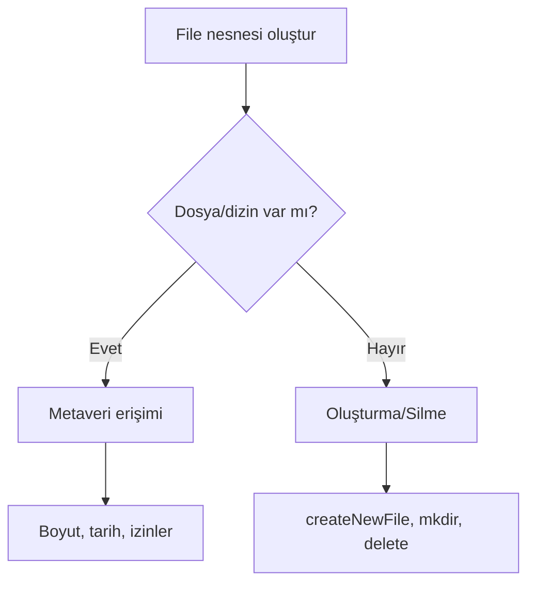
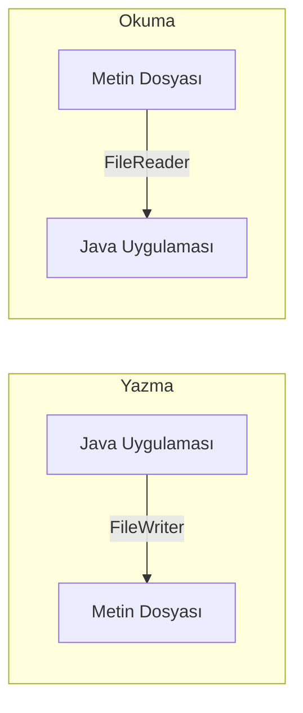
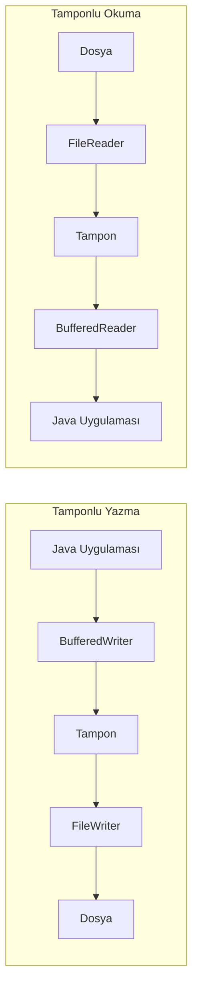
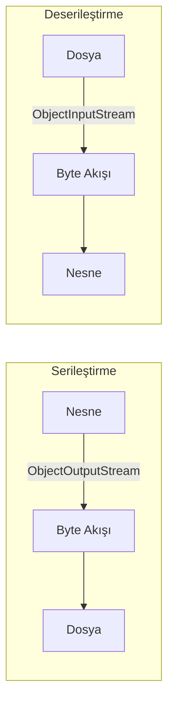

---
title: "Java’da Dosya İşlemleri ve Kalıcı Veri Saklama"
subtitle: "File, FileReader/Writer, BufferedReader/BufferedWriter, NIO.2 ve Serileştirme"
author: "Teknik Kitap Yazarı"
date: 2025-04-06
lang: tr
---

# Java’da Dosya İşlemleri ve Kalıcı Veri Saklama

Bu bölümde, Java programlama dilinde dosya ve dizin işlemlerini gerçekleştirmek için kullanılan temel ve modern yaklaşımları öğreneceksiniz. İlk olarak `java.io.File` sınıfı ile dosya sistemi metaverilerine erişmeyi, ardından karakter tabanlı okuma/yazma işlemleri için `FileReader`/`FileWriter` ve `BufferedReader`/`BufferedWriter` sınıflarını inceleyeceğiz. Daha sonra Java NIO.2 (New I/O 2) paketi ile daha esnek ve performanslı dosya işlemlerine geçeceğiz. Son olarak, nesnelerin kalıcı hale getirilmesi için serileştirme (serialization) kavramını ve uygulamasını ele alacağız.

> **Pedagojik Not:** Bu bölümdeki tüm kod örnekleri Java 17 ile test edilmiştir. Kodları kendi geliştirme ortamınızda çalıştırarak öğrenmeyi pekiştirebilirsiniz.

## Temel Dosya İşlemleri: `File` Sınıfı ve Dosya Sistemi ile Etkileşim

Java'da dosya ve dizin yollarını temsil etmek için `java.io.File` sınıfı kullanılır. Bu sınıf, dosya sistemindeki bir öğenin (dosya veya dizin) varlığını kontrol etme, oluşturma, silme ve metaveri (boyut, son değiştirilme tarihi, izinler) bilgilerine erişme gibi işlemleri sağlar. Ancak `File` sınıfı, dosyanın içeriğini okuma veya yazma işlemleri için doğrudan bir yöntem sunmaz; bu nedenle daha gelişmiş sınıflara ihtiyaç duyulur.



Aşağıdaki kod örneğinde, bir dosyanın var olup olmadığını kontrol ediyor, yoksa oluşturuyor ve ardından dosyanın mutlak yolunu ve boyutunu yazdırıyoruz.

<!-- CODE_META: FileOrnek.java -->
```java
import java.io.File;
import java.io.IOException;

public class FileOrnek {
    public static void main(String[] args) {
        File file = new File("ornek.txt");
        
        if (!file.exists()) {
            try {
                file.createNewFile();
                System.out.println("Dosya oluşturuldu: " + file.getAbsolutePath());
            } catch (IOException e) {
                System.err.println("Dosya oluşturulurken hata: " + e.getMessage());
            }
        } else {
            System.out.println("Dosya zaten mevcut: " + file.getAbsolutePath());
        }
        
        System.out.println("Dosya boyutu: " + file.length() + " bayt");
        System.out.println("Son değiştirilme: " + file.lastModified());
    }
}
```

> **Değerlendirme:** `File` sınıfı, dosya sistemi hakkında temel bilgiler edinmek için kullanışlıdır. Ancak aşağıdaki sınırlamaları nedeniyle modern Java uygulamalarında yerini NIO.2'ye bırakmıştır:
> - Dosya içeriğini okuyamaz/yazamaz.
> - Hata yönetimi zayıftır (örneğin, `createNewFile()` başarısız olursa `IOException` fırlatır).
> - Sembolik linkler gibi gelişmiş özellikleri desteklemez.

## Karakter Tabanlı Okuma/Yazma: `FileReader` ve `FileWriter`

Metin dosyalarıyla çalışırken karakter akışları (character streams) kullanılır. `FileReader` ve `FileWriter` sınıfları, sırasıyla metin dosyalarından karakter karakter okuma ve yazma işlemleri için temel sınıflardır. Bu sınıflar, platformun varsayılan karakter kodlamasını (genellikle UTF-8) kullanır.



Aşağıdaki örnekte, bir metin dosyasına yazma ve ardından okuma işlemi gösterilmektedir.

<!-- CODE_META: FileReaderWriterOrnek.java -->
```java
import java.io.FileReader;
import java.io.FileWriter;
import java.io.IOException;

public class FileReaderWriterOrnek {
    public static void main(String[] args) {
        String dosyaAdi = "metin.txt";
        
        // Dosyaya yazma
        try (FileWriter writer = new FileWriter(dosyaAdi)) {
            writer.write("Merhaba, Java dosya işlemleri!\n");
            writer.write("Bu ikinci satır.");
            System.out.println("Dosyaya yazıldı: " + dosyaAdi);
        } catch (IOException e) {
            System.err.println("Yazma hatası: " + e.getMessage());
        }
        
        // Dosyadan okuma
        try (FileReader reader = new FileReader(dosyaAdi)) {
            int karakter;
            System.out.print("Dosya içeriği: ");
            while ((karakter = reader.read()) != -1) {
                System.out.print((char) karakter);
            }
        } catch (IOException e) {
            System.err.println("Okuma hatası: " + e.getMessage());
        }
    }
}
```

> **Değerlendirme:** `FileReader`/`FileWriter` kullanırken dikkat edilmesi gereken bazı noktalar:
> - **Performans:** Her karakter için bir sistem çağrısı yapıldığından büyük dosyalarda yavaş çalışır.
> - **Tamponlama İhtiyacı:** Bu nedenle, tamponlu sınıflarla (`BufferedReader`/`BufferedWriter`) birlikte kullanılması önerilir.
> - **Karakter Kodlaması:** Varsayılan kodlama kullanılır; farklı bir kodlama gerekiyorsa `InputStreamReader`/`OutputStreamWriter` kullanılmalıdır.

## Tamponlu Okuma/Yazma: `BufferedReader` ve `BufferedWriter`

Tamponlu sınıflar, okuma/yazma işlemlerinde bir ara bellek (buffer) kullanarak sistem çağrılarının sayısını azaltır ve böylece performansı artırır. `BufferedReader` ve `BufferedWriter`, sırasıyla `Reader` ve `Writer` sınıflarını sararak (wrap) çalışır. Özellikle `BufferedReader`'ın `readLine()` metodu, satır satır okuma işlemini kolaylaştırır.



Aşağıdaki örnekte, büyük bir metin dosyasını satır satır okuma ve yazma işlemi gösterilmektedir.

<!-- CODE_META: BufferedIOrnek.java -->
```java
import java.io.BufferedReader;
import java.io.BufferedWriter;
import java.io.FileReader;
import java.io.FileWriter;
import java.io.IOException;

public class BufferedIOrnek {
    public static void main(String[] args) {
        String dosyaAdi = "buyuk_metin.txt";
        
        // Tamponlu yazma
        try (BufferedWriter writer = new BufferedWriter(new FileWriter(dosyaAdi))) {
            writer.write("Birinci satır");
            writer.newLine();  // Satır sonu ekler
            writer.write("İkinci satır");
            writer.newLine();
            writer.write("Üçüncü satır");
            System.out.println("Dosyaya yazıldı: " + dosyaAdi);
        } catch (IOException e) {
            System.err.println("Yazma hatası: " + e.getMessage());
        }
        
        // Tamponlu okuma
        try (BufferedReader reader = new BufferedReader(new FileReader(dosyaAdi))) {
            String satir;
            System.out.println("Dosya içeriği (satır satır):");
            while ((satir = reader.readLine()) != null) {
                System.out.println(satir);
            }
        } catch (IOException e) {
            System.err.println("Okuma hatası: " + e.getMessage());
        }
    }
}
```

> **Değerlendirme:** Tamponlu sınıfların avantajları:
> - **Performans:** Büyük dosyalarda %90'a varan hız artışı sağlar.
> - **Kullanım Kolaylığı:** `readLine()` gibi metotlar sayesinde kod daha okunabilir hale gelir.
> - **Esneklik:** Farklı `Reader`/`Writer` türleriyle kullanılabilir (örneğin, `InputStreamReader` ile).

## Modern Dosya İşlemleri: NIO.2 (`Path`, `Files`, `BufferedReader/BufferedWriter`)

Java 7 ile gelen NIO.2 (New I/O 2) paketi (`java.nio.file`), dosya işlemleri için daha modern, esnek ve hatalara dayanıklı bir yaklaşım sunar. Temel bileşenler:
- **`Path`**: Dosya veya dizin yolunu temsil eder.
- **`Files`**: Dosya işlemleri için statik yardımcı metotlar içerir.
- **`FileSystem`**: Dosya sistemine erişim sağlar.

```mermaid
flowchart TD
    A[Path nesnesi oluştur] --> B{Files.exists()}
    B -->|Evet| C[Dosya işlemleri]
    B -->|Hayır| D[Oluştur]
    C --> E[readString, writeString]
    C --> F[list, walk]
    C --> G[copy, move, delete]
```

Aşağıdaki örnekte, NIO.2 ile basit metin işlemleri ve dizin listeleme gösterilmektedir.

<!-- CODE_META: NioOrnek.java -->
```java
import java.io.IOException;
import java.nio.file.Files;
import java.nio.file.Path;
import java.nio.file.Paths;
import java.nio.file.StandardOpenOption;
import java.util.stream.Stream;

public class NioOrnek {
    public static void main(String[] args) {
        Path dosyaYolu = Paths.get("nio_ornek.txt");
        
        // Dosyaya yazma
        try {
            Files.writeString(dosyaYolu, "NIO.2 ile yazma işlemi\nİkinci satır", 
                            StandardOpenOption.CREATE, StandardOpenOption.TRUNCATE_EXISTING);
            System.out.println("Dosyaya yazıldı: " + dosyaYolu.toAbsolutePath());
        } catch (IOException e) {
            System.err.println("Yazma hatası: " + e.getMessage());
        }
        
        // Dosyadan okuma
        try {
            String icerik = Files.readString(dosyaYolu);
            System.out.println("Dosya içeriği:\n" + icerik);
        } catch (IOException e) {
            System.err.println("Okuma hatası: " + e.getMessage());
        }
        
        // Dizin listeleme
        System.out.println("\nMevcut dizin içeriği:");
        try (Stream<Path> stream = Files.list(Paths.get("."))) {
            stream.forEach(System.out::println);
        } catch (IOException e) {
            System.err.println("Dizin listeleme hatası: " + e.getMessage());
        }
    }
}
```

> **Değerlendirme:** NIO.2'nin geleneksel IO'ya göre avantajları:
> - **Daha Kısa Kod:** `Files.readString()` ve `Files.writeString()` gibi metotlar sayesinde daha az kod yazılır.
> - **Gelişmiş Hata Yönetimi:** `IOException` daha tutarlı bir şekilde işlenir.
> - **Esneklik:** Sembolik linkler, dosya izinleri, zaman damgaları gibi gelişmiş özellikler desteklenir.
> - **Performans:** `try-with-resources` ile otomatik kaynak yönetimi sağlanır.

## Nesne Kalıcılığı: Serileştirme (Serialization)

Serileştirme, Java nesnelerini byte akışına dönüştürme (serileştirme) ve byte akışından nesne oluşturma (deserileştirme) işlemidir. Bu sayede nesneler dosyaya yazılabilir, ağ üzerinden gönderilebilir veya veritabanında saklanabilir. Bir sınıfın serileştirilebilir olması için `java.io.Serializable` arayüzünü uygulaması gerekir.



Aşağıdaki örnekte, bir `Person` sınıfı serileştirilip dosyaya yazılmakta ve ardından dosyadan okunup nesneye dönüştürülmektedir.

<!-- CODE_META: SerilestirmeOrnek.java -->
```java
import java.io.FileInputStream;
import java.io.FileOutputStream;
import java.io.IOException;
import java.io.ObjectInputStream;
import java.io.ObjectOutputStream;
import java.io.Serializable;

class Person implements Serializable {
    private static final long serialVersionUID = 1L;
    String ad;
    int yas;
    transient String geciciAlan;  // Serileştirilmeyecek alan
    
    Person(String ad, int yas) {
        this.ad = ad;
        this.yas = yas;
        this.geciciAlan = "Bu alan serileştirilmeyecek";
    }
    
    @Override
    public String toString() {
        return "Person{ad='" + ad + "', yas=" + yas + ", geciciAlan='" + geciciAlan + "'}";
    }
}

public class SerilestirmeOrnek {
    public static void main(String[] args) {
        String dosyaAdi = "kisi.dat";
        
        // Serileştirme (Nesneyi dosyaya yazma)
        try (ObjectOutputStream oos = new ObjectOutputStream(new FileOutputStream(dosyaAdi))) {
            Person kisi = new Person("Ali", 30);
            oos.writeObject(kisi);
            System.out.println("Nesne dosyaya yazıldı: " + kisi);
        } catch (IOException e) {
            System.err.println("Serileştirme hatası: " + e.getMessage());
        }
        
        // Deserileştirme (Dosyadan nesne okuma)
        try (ObjectInputStream ois = new ObjectInputStream(new FileInputStream(dosyaAdi))) {
            Person okunanKisi = (Person) ois.readObject();
            System.out.println("Dosyadan okunan nesne: " + okunanKisi);
        } catch (IOException | ClassNotFoundException e) {
            System.err.println("Deserileştirme hatası: " + e.getMessage());
        }
    }
}
```

> **Değerlendirme:** Serileştirme kullanırken dikkat edilmesi gereken önemli noktalar:
> - **Güvenlik:** Deserileştirme sırasında geçersiz veya kötü amaçlı veriler yüklenebilir. Bu nedenle, yalnızca güvenilir kaynaklardan gelen veriler deserileştirilmelidir.
> - **`serialVersionUID`:** Sınıfın sürümünü belirtir. Farklı sürümler arasında uyumluluk sağlamak için tanımlanması önerilir.
> - **`transient` Anahtar Kelimesi:** `transient` olarak işaretlenen alanlar serileştirilmez. Bu, hassas bilgilerin (şifre gibi) korunması için kullanılabilir.
> - **Alternatifler:** JSON (Jackson, Gson), XML (JAXB) gibi formatlar, serileştirmeye göre daha okunabilir ve platform bağımsızdır.

## Bölüm Özeti

Bu bölümde, Java'da dosya işlemleri ve kalıcı veri saklama konularını ele aldık:

1. **`File` Sınıfı:** Dosya ve dizin metaverilerine erişim sağlar, ancak içerik okuma/yazma yapamaz.
2. **Karakter Tabanlı IO:** `FileReader`/`FileWriter` ile metin dosyalarına temel okuma/yazma.
3. **Tamponlu IO:** `BufferedReader`/`BufferedWriter` ile performanslı ve satır bazlı işlemler.
4. **NIO.2:** Modern, esnek ve kısa kodlu dosya işlemleri (`Path`, `Files`).
5. **Serileştirme:** Nesnelerin byte akışına dönüştürülerek kalıcı hale getirilmesi.

## Terim Sözlüğü

| Terim | Açıklama |
|-------|----------|
| **Buffer** | Geçici veri depolama alanı; okuma/yazma performansını artırır. |
| **Character Stream** | Karakter tabanlı veri akışı; metin dosyaları için kullanılır. |
| **Deserialization** | Byte akışından nesne oluşturma işlemi. |
| **Metaveri** | Dosya hakkında bilgi (boyut, tarih, izinler). |
| **NIO.2** | Java 7 ile gelen yeni dosya API'si. |
| **Serialization** | Nesneyi byte akışına dönüştürme işlemi. |
| **`transient`** | Serileştirme sırasında atlanacak alanları işaretler. |
| **`try-with-resources`** | Otomatik kaynak yönetimi sağlayan yapı. |

## Sorular

1. `File` sınıfı ile bir dosyanın içeriğini nasıl okuyabilirsiniz?
2. `FileReader` ve `BufferedReader` arasındaki temel fark nedir?
3. NIO.2'de `Files.writeString()` metodu hangi durumlarda tercih edilmelidir?
4. Bir sınıfın serileştirilebilir olması için hangi arayüzü uygulaması gerekir?
5. `serialVersionUID` neden önemlidir?
6. `transient` anahtar kelimesinin amacı nedir?

## Alıştırmalar

1. **Temel Dosya İşlemleri:** Kullanıcıdan bir dosya adı alan ve dosyanın var olup olmadığını, boyutunu ve son değiştirilme tarihini gösteren bir program yazın.

2. **Metin Dosyası İşlemleri:** Bir metin dosyasındaki tüm satırları okuyan ve her satırı ters çevirerek yeni bir dosyaya yazan program geliştirin.

3. **NIO.2 ile Dizin Gezme:** Belirtilen bir dizindeki tüm `.java` dosyalarını listeleyen ve her bir dosyanın satır sayısını hesaplayan bir program yazın.

4. **Serileştirme Uygulaması:** Bir `Ogrenci` sınıfı oluşturun (ad, soyad, numara, not ortalaması). Bu sınıfı serileştirip dosyaya yazan ve ardından dosyadan okuyup ekrana yazdıran bir program geliştirin.

5. **Performans Karşılaştırması:** 1 milyon satırlık bir metin dosyası oluşturun. Bu dosyayı `FileReader` ve `BufferedReader` ile okuma sürelerini karşılaştıran bir program yazın.

> **Pedagojik Not:** Alıştırmaları çözerken önce kendi mantığınızı oluşturun, ardından kodunuzu yazın ve test edin. Hata mesajlarını dikkatlice okuyarak sorunları çözmeye çalışın.