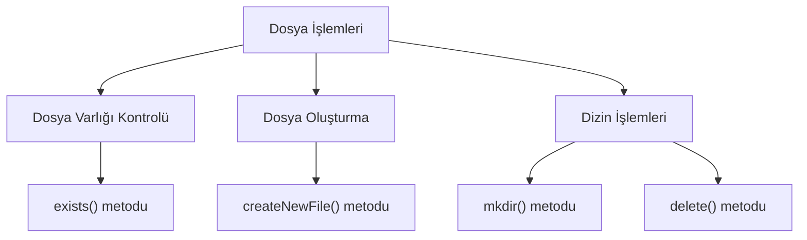
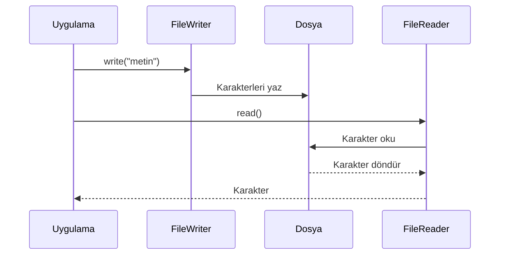
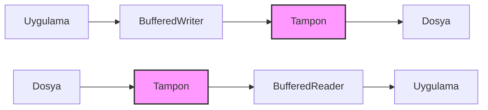
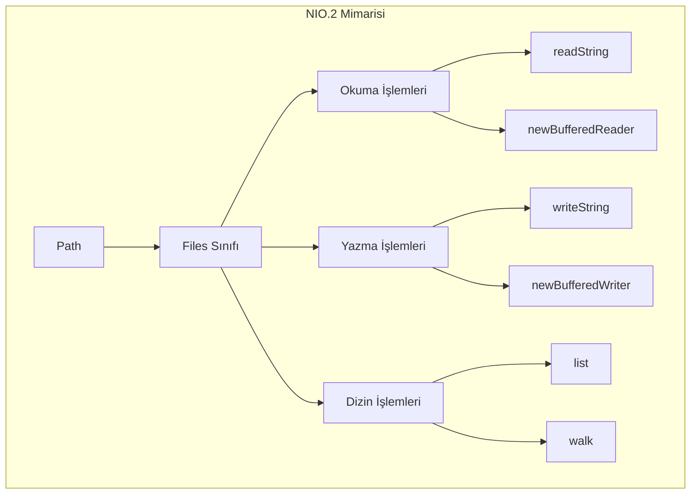
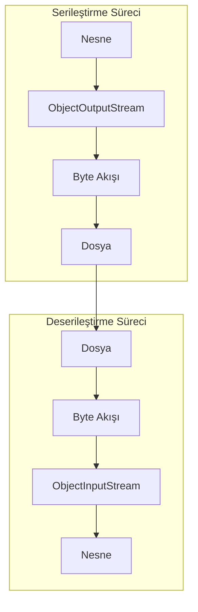

---
title: "Java’da Dosya İşlemleri ve Kalıcı Veri Saklama"
subtitle: "File, FileReader/Writer, BufferedReader/BufferedWriter, NIO.2 ve Serileştirme"
author: "Teknik İçerik Uzmanı"
date: "2025-01-18"
lang: "tr"
---

# Bölüm 16: Dosya Islemleri ve Kalici Veri Saklama

Bu bölümde, Java programlama dilinde dosya işlemlerini ve kalıcı veri saklama yöntemlerini adım adım öğreneceksiniz. Geleneksel `java.io` paketinden modern NIO.2 yaklaşımına kadar geniş bir yelpazede konuları ele alacağız. Ayrıca, nesnelerinizi dosyalara kaydetmek ve geri yüklemek için serileştirme (serialization) kavramını keşfedeceksiniz.

> [!NOTE]
> Bu bölümdeki tüm kod örnekleri Java 11 veya üzeri sürümlerle uyumludur. NIO.2 örneklerinde `Files.readString()` ve `Files.writeString()` gibi Java 11 ile gelen kolaylıklar kullanılmıştır.

## 16.1 Temel Dosya İşlemleri: `File` Sınıfı ve Dosya Sistemi ile Etkileşim

Java’da dosya sistemiyle etkileşim kurmanın en temel yolu `java.io.File` sınıfıdır. Bu sınıf, dosya ve dizin yollarını temsil eder; ancak dosya içeriğini okuma veya yazma işlemleri için doğrudan kullanılmaz. `File` sınıfı daha çok dosya metaverisine erişim, dosya oluşturma/silme ve dizin işlemleri için kullanılır.

### Temel Kavramlar

- **Dosya Yolu (Path)**: Dosyanın dosya sistemindeki konumunu belirtir. Mutlak (absolute) veya bağıl (relative) olabilir.
- **Metaveri (Metadata)**: Dosya boyutu, son değiştirilme tarihi, gizlilik durumu gibi dosya hakkındaki bilgiler.
- **Dizin (Directory)**: Dosyaları organize etmek için kullanılan özel bir dosya türü.

### Örnek: Dosya Varlığını Kontrol Etme ve Dizin Oluşturma

Aşağıdaki örnekte, `File` sınıfını kullanarak bir dosyanın var olup olmadığını kontrol edecek, yoksa yeni bir dosya oluşturacak ve ardından bir dizin oluşturacağız.

<!-- CODE_META: FileExample.java -->
```java
import java.io.File;
import java.io.IOException;

public class FileExample {
    public static void main(String[] args) {
        // Dosya yolu tanımlama
        File file = new File("ornek.txt");

        // Dosya varlığını kontrol etme
        if (!file.exists()) {
            try {
                // Dosya oluşturma
                if (file.createNewFile()) {
                    System.out.println("Dosya oluşturuldu: " + file.getAbsolutePath());
                }
            } catch (IOException e) {
                System.err.println("Dosya oluşturulurken hata: " + e.getMessage());
            }
        } else {
            System.out.println("Dosya zaten mevcut: " + file.getAbsolutePath());
        }

        // Dosya metaverisine erişim
        System.out.println("Dosya boyutu: " + file.length() + " bayt");
        System.out.println("Son değiştirilme: " + file.lastModified());

        // Dizin oluşturma
        File dizin = new File("yeni_dizin");
        if (dizin.mkdir()) {
            System.out.println("Dizin oluşturuldu: " + dizin.getAbsolutePath());
        } else {
            System.out.println("Dizin oluşturulamadı veya zaten mevcut.");
        }

        // Dizini silme (opsiyonel)
        if (dizin.delete()) {
            System.out.println("Dizin silindi: " + dizin.getAbsolutePath());
        }
    }
}
```

### Değerlendirme

`File` sınıfı, dosya sistemiyle temel etkileşimler için yeterlidir. Ancak aşağıdaki sınırlamaları nedeniyle daha gelişmiş sınıflara ihtiyaç duyulur:

- **İçerik okuma/yazma yok**: `File` sınıfı yalnızca metaveri işlemleri için tasarlanmıştır.
- **Performans sorunları**: Doğrudan dosya içeriği okumak için kullanılamaz.
- **Hata yönetimi sınırlı**: `createNewFile()` gibi metotlar `IOException` fırlatır ancak bazı işlemler için yeterli değildir.

> [!TIP]
> `File` sınıfı yerine, daha modern ve esnek olan `java.nio.file.Path` ve `java.nio.file.Files` sınıflarını kullanmayı tercih edin. Bu konuyu Bölüm 4’te detaylı olarak ele alacağız.



## 16.2 Karakter Tabanlı Okuma/Yazma: `FileReader` ve `FileWriter`

Metin dosyalarıyla çalışırken karakter akışları (character streams) kullanılır. `java.io` paketindeki `FileReader` ve `FileWriter` sınıfları, metin dosyalarına okuma ve yazma işlemleri için temel karakter akışı sınıflarıdır.

### Temel Kavramlar

- **Karakter Akışı (Character Stream)**: Verileri karakter karakter işleyen akış türüdür. Unicode karakterleri destekler.
- **FileReader**: Bir dosyadan karakter okumak için kullanılır.
- **FileWriter**: Bir dosyaya karakter yazmak için kullanılır.

### Örnek: Metin Dosyasına Yazma ve Okuma

Aşağıdaki örnekte, `FileWriter` ile bir metin dosyasına yazacak ve `FileReader` ile okuyacağız.

<!-- CODE_META: FileReaderWriterExample.java -->
```java
import java.io.FileReader;
import java.io.FileWriter;
import java.io.IOException;

public class FileReaderWriterExample {
    public static void main(String[] args) {
        String dosyaAdi = "metin.txt";

        // Dosyaya yazma
        try (FileWriter writer = new FileWriter(dosyaAdi)) {
            writer.write("Merhaba, Java dosya işlemleri!\n");
            writer.write("Bu bir test satırıdır.\n");
            System.out.println("Dosyaya yazma başarılı.");
        } catch (IOException e) {
            System.err.println("Yazma hatası: " + e.getMessage());
        }

        // Dosyadan okuma
        try (FileReader reader = new FileReader(dosyaAdi)) {
            int karakter;
            System.out.println("Dosya içeriği:");
            while ((karakter = reader.read()) != -1) {
                System.out.print((char) karakter);
            }
        } catch (IOException e) {
            System.err.println("Okuma hatası: " + e.getMessage());
        }
    }
}
```

### Değerlendirme

`FileReader` ve `FileWriter` sınıfları basit metin işlemleri için kullanışlıdır. Ancak aşağıdaki dezavantajları vardır:

- **Performans sorunları**: Her karakter için bir sistem çağrısı yapılır, bu da büyük dosyalarda performans düşüklüğüne neden olur.
- **Tamponlama yok**: Tamponlama mekanizması bulunmadığından, her okuma/yazma işlemi doğrudan diske erişir.
- **Karakter kodlaması**: Varsayılan karakter kodlamasını kullanır (`Charset.defaultCharset()`), bu farklı platformlarda sorun çıkarabilir.

> [!WARNING]
> `FileReader` ve `FileWriter` sınıflarını doğrudan kullanmak yerine, bir sonraki bölümde göreceğiniz `BufferedReader` ve `BufferedWriter` ile sarmalayarak kullanmanız önerilir.



## 16.3 Tamponlu Okuma/Yazma: `BufferedReader` ve `BufferedWriter`

Tamponlama (buffering), performansı artırmak için kullanılan bir tekniktir. `BufferedReader` ve `BufferedWriter` sınıfları, karakter akışlarını tamponlayarak daha verimli okuma/yazma işlemleri sağlar.

### Temel Kavramlar

- **Tampon (Buffer)**: Geçici veri depolama alanı. Veriler önce tampona yazılır, ardından toplu olarak diske aktarılır.
- **BufferedReader**: `FileReader` gibi bir karakter akışını sarmalayarak tamponlu okuma sağlar.
- **BufferedWriter**: `FileWriter` gibi bir karakter akışını sarmalayarak tamponlu yazma sağlar.

### Örnek: Büyük Bir Metin Dosyasını Satır Satır Okuma ve Yazma

Aşağıdaki örnekte, `BufferedWriter` ile bir dosyaya yazacak ve `BufferedReader` ile satır satır okuyacağız.

<!-- CODE_META: BufferedReaderWriterExample.java -->
```java
import java.io.BufferedReader;
import java.io.BufferedWriter;
import java.io.FileReader;
import java.io.FileWriter;
import java.io.IOException;

public class BufferedReaderWriterExample {
    public static void main(String[] args) {
        String dosyaAdi = "buyuk_metin.txt";

        // Dosyaya yazma
        try (BufferedWriter writer = new BufferedWriter(new FileWriter(dosyaAdi))) {
            writer.write("Birinci satır");
            writer.newLine();  // Platform bağımsız satır sonu
            writer.write("İkinci satır");
            writer.newLine();
            writer.write("Üçüncü satır");
            System.out.println("Dosyaya yazma başarılı.");
        } catch (IOException e) {
            System.err.println("Yazma hatası: " + e.getMessage());
        }

        // Dosyadan okuma
        try (BufferedReader reader = new BufferedReader(new FileReader(dosyaAdi))) {
            String satir;
            System.out.println("Dosya içeriği (satır satır):");
            while ((satir = reader.readLine()) != null) {
                System.out.println(satir);
            }
        } catch (IOException e) {
            System.err.println("Okuma hatası: " + e.getMessage());
        }
    }
}
```

### Değerlendirme

Tamponlu sınıfların sağladığı avantajlar:

- **Performans artışı**: Tamponlama sayesinde disk erişim sayısı azalır, bu da büyük dosyalarda önemli performans kazancı sağlar.
- **Kolaylık**: `readLine()` metodu ile satır satır okuma yapılabilir.
- **Platform bağımsızlığı**: `newLine()` metodu, işletim sistemine uygun satır sonu karakterini ekler.

> [!TIP]
> `BufferedReader` ve `BufferedWriter` sınıflarını kullanırken, varsayılan tampon boyutu (8192 karakter) genellikle yeterlidir. Ancak özel durumlar için farklı boyutlar belirleyebilirsiniz: `new BufferedReader(reader, 16384)`



## 16.4 Modern Dosya İşlemleri: NIO.2 (`Path`, `Files`, `BufferedReader/BufferedWriter`)

Java 7 ile birlikte gelen NIO.2 (New I/O 2) paketi, dosya işlemleri için daha modern, esnek ve güvenilir bir yaklaşım sunar. `java.nio.file` paketindeki `Path` ve `Files` sınıfları, geleneksel IO’ya göre birçok avantaj sağlar.

### Temel Kavramlar

- **Path**: Dosya veya dizin yolunu temsil eden interface. `Paths.get()` metodu ile oluşturulur.
- **Files**: Dosya işlemleri için statik metotlar içeren yardımcı sınıf.
- **StandardOpenOption**: Dosya açma seçeneklerini belirten enum (CREATE, APPEND, TRUNCATE_EXISTING vb.).

### Örnek: NIO.2 ile Temel Dosya İşlemleri

Aşağıdaki örnekte, NIO.2 kullanarak dosya yazma, okuma ve dizin listeleme işlemlerini gerçekleştireceğiz.

<!-- CODE_META: NIO2Example.java -->
```java
import java.io.IOException;
import java.nio.file.Files;
import java.nio.file.Path;
import java.nio.file.Paths;
import java.nio.file.StandardOpenOption;
import java.util.stream.Stream;

public class NIO2Example {
    public static void main(String[] args) {
        Path dosyaYolu = Paths.get("nio_ornek.txt");

        // Dosyaya yazma
        try {
            Files.writeString(dosyaYolu, "NIO.2 ile yazma işlemi\n", StandardOpenOption.CREATE);
            Files.writeString(dosyaYolu, "İkinci satır\n", StandardOpenOption.APPEND);
            System.out.println("Dosyaya yazma başarılı.");
        } catch (IOException e) {
            System.err.println("Yazma hatası: " + e.getMessage());
        }

        // Dosyadan okuma
        try {
            String icerik = Files.readString(dosyaYolu);
            System.out.println("Dosya içeriği:");
            System.out.println(icerik);
        } catch (IOException e) {
            System.err.println("Okuma hatası: " + e.getMessage());
        }

        // Dizin listeleme
        System.out.println("\nMevcut dizin içeriği:");
        try (Stream<Path> stream = Files.list(Paths.get("."))) {
            stream.forEach(System.out::println);
        } catch (IOException e) {
            System.err.println("Dizin listeleme hatası: " + e.getMessage());
        }

        // Alternatif: BufferedReader/BufferedWriter ile NIO.2
        Path alternatifDosya = Paths.get("alternatif.txt");
        try (var writer = Files.newBufferedWriter(alternatifDosya, StandardOpenOption.CREATE)) {
            writer.write("BufferedWriter ile NIO.2\n");
            writer.write("Çok satırlı yazma işlemi\n");
        } catch (IOException e) {
            System.err.println("Yazma hatası: " + e.getMessage());
        }

        try (var reader = Files.newBufferedReader(alternatifDosya)) {
            String satir;
            System.out.println("\nAlternatif dosya içeriği:");
            while ((satir = reader.readLine()) != null) {
                System.out.println(satir);
            }
        } catch (IOException e) {
            System.err.println("Okuma hatası: " + e.getMessage());
        }
    }
}
```

### Değerlendirme

NIO.2’nin geleneksel IO’ya göre avantajları:

- **Daha kısa kod**: `Files.writeString()` ve `Files.readString()` gibi metotlar sayesinde daha az kod yazılır.
- **Gelişmiş hata yönetimi**: Daha anlamlı hata mesajları ve istisna türleri.
- **Sembolik link desteği**: `Files.isSymbolicLink()` gibi metotlarla sembolik linklerle çalışma imkanı.
- **try-with-resources uyumluluğu**: `Files.list()` gibi metotlar `AutoCloseable` arayüzünü uygular.
- **Performans**: NIO.2, kanal (channel) ve tampon (buffer) kullanarak daha verimli I/O işlemleri sağlar.

> [!IMPORTANT]
> NIO.2 kullanırken `Files.list()` veya `Files.walk()` gibi metotlarla açılan stream’leri mutlaka kapatın. Aksi takdirde kaynak sızıntısı (resource leak) oluşabilir.



## 16.5 Nesne Kalıcılığı: Serileştirme (Serialization)

Serileştirme, Java nesnelerini byte akışına dönüştürme (serialization) ve byte akışından nesne oluşturma (deserialization) işlemidir. Bu sayede nesnelerinizi dosyalara kaydedebilir, ağ üzerinden gönderebilir veya veritabanında saklayabilirsiniz.

### Temel Kavramlar

- **Serializable**: Bir sınıfın serileştirilebilir olduğunu belirten işaretleyici (marker) arayüz.
- **ObjectOutputStream**: Nesneleri byte akışına dönüştüren sınıf.
- **ObjectInputStream**: Byte akışından nesne oluşturan sınıf.
- **serialVersionUID**: Serileştirilmiş nesnenin sürümünü belirten benzersiz kimlik.
- **transient**: Serileştirme sırasında atlanacak alanları belirten anahtar kelime.

### Örnek: Person Sınıfını Serileştirme ve Deserileştirme

Aşağıdaki örnekte, `Person` sınıfını serileştirip dosyaya yazacak ve ardından dosyadan okuyup nesneye dönüştüreceğiz.

<!-- CODE_META: SerializationExample.java -->
```java
import java.io.FileInputStream;
import java.io.FileOutputStream;
import java.io.IOException;
import java.io.ObjectInputStream;
import java.io.ObjectOutputStream;
import java.io.Serializable;

// Person sınıfı - Serializable arayüzünü uygular
class Person implements Serializable {
    private static final long serialVersionUID = 1L;
    
    String ad;
    int yas;
    transient String geciciBilgi;  // Serileştirilmeyecek

    Person(String ad, int yas) {
        this.ad = ad;
        this.yas = yas;
        this.geciciBilgi = "Bu bilgi serileştirilmeyecek";
    }

    @Override
    public String toString() {
        return "Person{ad='" + ad + "', yas=" + yas + ", geciciBilgi='" + geciciBilgi + "'}";
    }
}

public class SerializationExample {
    public static void main(String[] args) {
        String dosyaAdi = "kisi.dat";

        // Serileştirme (Nesneyi dosyaya yazma)
        try (ObjectOutputStream oos = new ObjectOutputStream(new FileOutputStream(dosyaAdi))) {
            Person kisi = new Person("Ali", 30);
            oos.writeObject(kisi);
            System.out.println("Nesne dosyaya yazıldı: " + kisi);
        } catch (IOException e) {
            System.err.println("Serileştirme hatası: " + e.getMessage());
        }

        // Deserileştirme (Dosyadan nesne okuma)
        try (ObjectInputStream ois = new ObjectInputStream(new FileInputStream(dosyaAdi))) {
            Person okunanKisi = (Person) ois.readObject();
            System.out.println("Dosyadan okunan nesne: " + okunanKisi);
            System.out.println("Ad: " + okunanKisi.ad + ", Yaş: " + okunanKisi.yas);
            System.out.println("Geçici bilgi (null olmalı): " + okunanKisi.geciciBilgi);
        } catch (IOException | ClassNotFoundException e) {
            System.err.println("Deserileştirme hatası: " + e.getMessage());
        }
    }
}
```

### Değerlendirme

Serileştirmenin avantajları ve dikkat edilmesi gereken noktalar:

- **Kolay kullanım**: `Serializable` arayüzünü uygulamak yeterlidir.
- **Nesne grafiği desteği**: Bir nesne serileştirilirken, ona referans veren diğer nesneler de otomatik olarak serileştirilir.
- **Güvenlik riskleri**: Deserileştirme sırasında geçersiz veya kötü niyetli veriler yüklenebilir. Bu nedenle güvenilmeyen kaynaklardan gelen verileri deserileştirmeyin.
- **serialVersionUID önemi**: Sınıf yapısı değiştiğinde, eski serileştirilmiş nesneler uyumsuz hale gelebilir. `serialVersionUID` bu sorunu çözmek için kullanılır.
- **transient alanlar**: Serileştirilmesini istemediğiniz alanları `transient` olarak işaretleyin.

> [!CAUTION]
> Serileştirme, Java’ya özgü bir formattır. Farklı platformlar veya diller arasında veri alışverişi yapacaksanız JSON, XML veya Protocol Buffers gibi standart formatları tercih edin.



## 16.6 Bölüm Özeti

Bu bölümde, Java’da dosya işlemleri ve kalıcı veri saklama konularını kapsamlı bir şekilde ele aldık:

1. **File Sınıfı**: Dosya ve dizin yollarını temsil eder, metaveri erişimi ve temel dosya işlemleri için kullanılır.
2. **FileReader/FileWriter**: Karakter tabanlı okuma/yazma için temel sınıflardır, ancak performans sorunları nedeniyle tamponlu sınıflarla kullanılmalıdır.
3. **BufferedReader/BufferedWriter**: Tamponlama sayesinde performansı artırır ve `readLine()` gibi kolaylıklar sağlar.
4. **NIO.2**: Modern, esnek ve güvenilir dosya işlemleri için `Path` ve `Files` sınıflarını kullanır.
5. **Serileştirme**: Java nesnelerini byte akışına dönüştürerek kalıcı hale getirme yöntemidir.

## 16.7 Terim Sözlüğü

| Terim | Açıklama |
|-------|----------|
| **Tampon (Buffer)** | Geçici veri depolama alanı, I/O performansını artırır |
| **Karakter Akışı (Character Stream)** | Verileri karakter karakter işleyen akış türü |
| **Metaveri (Metadata)** | Dosya hakkındaki bilgiler (boyut, tarih, izinler vb.) |
| **Serileştirme (Serialization)** | Nesneleri byte akışına dönüştürme işlemi |
| **Deserileştirme (Deserialization)** | Byte akışından nesne oluşturma işlemi |
| **transient** | Serileştirme sırasında atlanacak alanları belirten anahtar kelime |
| **serialVersionUID** | Serileştirilmiş nesnenin sürümünü belirten kimlik |
| **NIO.2** | Java 7 ile gelen yeni I/O API’si |

## 16.8 Sorular

1. `File` sınıfı ile `Path` arayüzü arasındaki temel farklar nelerdir?
2. `FileReader` ve `FileWriter` sınıflarının performans sorunlarını nasıl çözebiliriz?
3. NIO.2’nin geleneksel IO’ya göre avantajları nelerdir?
4. Serileştirme sırasında `transient` anahtar kelimesinin rolü nedir?
5. `serialVersionUID` neden önemlidir ve ne zaman kullanılmalıdır?
6. NIO.2’de `Files.list()` metodu neden try-with-resources ile kullanılmalıdır?

## 16.9 Alıştırmalar

1. **Dosya Kopyalama**: `BufferedInputStream` ve `BufferedOutputStream` kullanarak bir dosyayı başka bir konuma kopyalayan bir program yazın.

2. **Metin Analizi**: Bir metin dosyasını okuyarak içindeki kelime sayısını, satır sayısını ve karakter sayısını hesaplayan bir program yazın (NIO.2 kullanarak).

3. **Öğrenci Kayıt Sistemi**: Bir `Ogrenci` sınıfı oluşturun (ad, soyad, numara, not ortalaması). Bu sınıfı serileştirilebilir yapın ve bir dosyaya kaydedip geri okuyan bir program yazın.

4. **Dizin Gezgini**: Kullanıcıdan bir dizin yolu alan ve bu dizindeki tüm dosyaları (alt dizinler dahil) listeleyen bir program yazın (`Files.walk()` kullanarak).

5. **JSON Alternatifi**: Jackson kütüphanesini kullanarak bir `Person` nesnesini JSON formatında dosyaya yazıp geri okuyan bir program yazın (opsiyonel, ileri seviye).