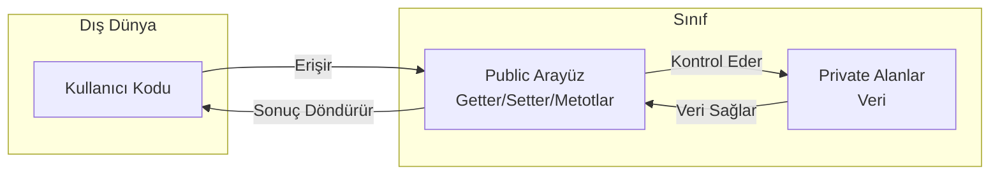

```yaml
---
title: "Sınıf, Nesne, Constructor ve Kapsülleme"
subtitle: "Java'da Nesne Yönelimli Programlamanın Temelleri"
author: "Teknik Kitap Yazarı"
date: 2024-01-15
lang: tr
subject: "Java Programlama"
keywords: [Java, OOP, sınıf, nesne, constructor, kapsülleme, getter, setter, erişim belirteci]
abstract: |
  Bu bölümde, Java'da nesne yönelimli programlamanın (OOP) temel yapı taşları olan sınıf ve nesne kavramlarını, constructor (yapıcı metot) çeşitlerini, this anahtar kelimesini, erişim belirteçlerini ve kapsülleme (encapsulation) prensibini öğreneceksiniz. Gerçek hayat örnekleri ve uygulamalı kod parçacıkları ile konuyu pekiştireceksiniz.
---
```

## 1. Giriş: Nesne Yönelimli Programlamanın Temelleri

Nesne Yönelimli Programlama (OOP), yazılım geliştirmede devrim yaratan bir paradigmadır. Java, OOP prensiplerini tam olarak destekleyen bir dildir. Bu bölümde OOP'nin dört temel prensibinden ikisi olan **kapsülleme** ve **soyutlama** üzerinde duracağız.

### 1.1. Neden Sınıf ve Nesne?

Bir yazılım projesi düşünün: bir okul kayıt sistemi. Öğrenciler, öğretmenler, dersler, notlar... Bunların her biri birer **nesne** olarak modellenebilir. Bir öğrencinin adı, soyadı, numarası, notları vardır. Bunlar **özellikler** (alanlar/fields). Ayrıca öğrenci ders alabilir, not girebilir, mezun olabilir. Bunlar da **davranışlar** (metotlar).

> **Pedagojik Not:** Sınıf, bir "kalıp" veya "şablon" gibidir. Nesne ise bu kalıptan üretilen somut bir varlıktır. Örneğin, "İnsan" bir sınıftır; "Ali" ise bir nesnedir.

### 1.2. Gerçek Hayattan Benzetmeler

| Gerçek Hayat | Java'da Karşılığı |
|---|---|
| Araba tasarım çizimi | Sınıf (Class) |
| Üretilen her bir araba | Nesne (Object) |
| Arabanın rengi, modeli | Alan (Field) |
| Arabanın hızlanması, durması | Metot (Method) |

Bu bölüm boyunca, bu benzetmeleri kullanarak kavramları somutlaştıracağız.

## 2. Sınıf Tanımlama

Sınıf, bir nesnenin blueprint'idir (plan/tasarım). Java'da bir sınıf tanımlamak için `class` anahtar kelimesi kullanılır.

### 2.1. Sınıfın Yapısı

<!-- CODE_META
id: bolum-17_kod01
chapter_id: bolum-17
kind: example
title: "Kod 1"
file: "Ornek00.java"
mainClass: Ornek00
extract: true
test: compile
github: true
qr: dual
-->

```java
// Kodu çalıştırmak için: javac Ogrenci.java && java Ogrenci
public class Ogrenci {
    // Alanlar (Fields) - Özellikler
    String ad;
    String soyad;
    int numara;
    
    // Metotlar (Methods) - Davranışlar
    void bilgiGoster() {
        System.out.println("Ad: " + ad + ", Soyad: " + soyad + ", No: " + numara);
    }
}
```

### 2.2. Alanlar ve Metotlar

- **Alanlar (Fields):** Sınıfın durumunu (state) tutan değişkenlerdir. Her nesne bu alanların kendi kopyasına sahiptir.
- **Metotlar (Methods):** Sınıfın davranışlarını tanımlar.

### 2.3. İlk Sınıf Örneği: Ogrenci

Yukarıdaki `Ogrenci` sınıfı, bir öğrencinin temel özelliklerini ve davranışlarını tanımlar. Ancak henüz bu sınıftan bir nesne oluşturmadık.

> **Önemli:** Sınıf tek başına çalıştırılabilir bir program değildir. `main` metodu içermez. Nesne oluşturmak için başka bir sınıfta (veya aynı sınıfta) `main` metodu kullanılır.

## 3. Nesne Oluşturma

Bir sınıftan nesne (örnek/instance) oluşturmak için `new` anahtar kelimesi kullanılır.

### 3.1. new Anahtar Kelimesi

`new` operatörü, bellekte (heap) yeni bir nesne için yer ayırır ve constructor'ı çağırarak nesneyi başlatır.

<!-- CODE_META
id: bolum-17_kod02
chapter_id: bolum-17
kind: example
title: "Kod 2"
file: "Ornek01.java"
mainClass: Ornek01
extract: true
test: compile
github: true
qr: dual
-->

```java
Ogrenci ogr1 = new Ogrenci();
```

Burada:
- `Ogrenci` : Referans tipi (sınıf adı)
- `ogr1` : Referans değişkeni (nesneyi işaret eder)
- `new Ogrenci()` : Yeni bir Ogrenci nesnesi oluşturur

### 3.2. Referans Değişkenleri

Referans değişkeni, bellekteki nesnenin adresini tutar. Aslında nesnenin kendisi değil, ona erişim sağlayan bir "uzaktan kumanda" gibidir.

<!-- CODE_META
id: bolum-17_kod03
chapter_id: bolum-17
kind: example
title: "Kod 3"
file: "Ornek02.java"
mainClass: Ornek02
extract: true
test: compile
github: true
qr: dual
-->

```java
Ogrenci ogr1 = new Ogrenci(); // ogr1 bir referans
Ogrenci ogr2 = ogr1; // ogr2 de aynı nesneyi işaret eder
ogr1.ad = "Ahmet";
System.out.println(ogr2.ad); // "Ahmet" yazdırır (aynı nesne!)
```

### 3.3. Nesne Üyelerine Erişim (Nokta Operatörü)

Nesnenin alanlarına ve metotlarına erişmek için nokta (.) operatörü kullanılır.

<!-- CODE_META
id: bolum-17_kod04
chapter_id: bolum-17
kind: example
title: "Kod 4"
file: "Ornek03.java"
mainClass: Ornek03
extract: true
test: compile
github: true
qr: dual
-->

```java
// Dosya adı: TestOgrenci.java
public class TestOgrenci {
    public static void main(String[] args) {
        Ogrenci ogr1 = new Ogrenci();
        ogr1.ad = "Ayşe";
        ogr1.soyad = "Yılmaz";
        ogr1.numara = 1234;
        
        ogr1.bilgiGoster(); // Çıktı: Ad: Ayşe, Soyad: Yılmaz, No: 1234
    }
}
```

## 4. Constructor (Yapıcı Metot)

Constructor, nesne oluşturulurken otomatik olarak çağrılan özel bir metottur. Adı sınıf adıyla aynı olmalıdır ve geri dönüş tipi **olmaz** (void bile değil!).

### 4.1. Constructor Nedir?

Constructor'ın temel görevi, nesneyi başlatmaktır (initialization). Genellikle alanlara ilk değerleri atamak için kullanılır.

### 4.2. Default Constructor (Varsayılan Yapıcı)

Eğer bir sınıfta hiç constructor tanımlanmazsa, Java derleyicisi otomatik olarak **parametresiz bir default constructor** ekler. Bu constructor hiçbir işlem yapmaz (boş gövde).

<!-- CODE_META
id: bolum-17_kod05
chapter_id: bolum-17
kind: example
title: "Kod 5"
file: "Ornek04.java"
mainClass: Ornek04
extract: true
test: compile
github: true
qr: dual
-->

```java
// Dosya adı: Araba.java
public class Araba {
    String marka;
    int yil;
    
    // Default constructor (derleyici tarafından eklenir)
    // public Araba() { }
}
```

### 4.3. Parametreli Constructor

Kendi constructor'ınızı tanımlayarak nesneyi oluştururken alanlara değer atayabilirsiniz.

<!-- CODE_META
id: bolum-17_kod06
chapter_id: bolum-17
kind: example
title: "Kod 6"
file: "Ornek05.java"
mainClass: Ornek05
extract: true
test: compile
github: true
qr: dual
-->

```java
// Dosya adı: Araba.java
public class Araba {
    String marka;
    int yil;
    
    // Parametreli constructor
    public Araba(String m, int y) {
        marka = m;
        yil = y;
    }
}
```

> **Pedagojik Uyarı:** Kendi constructor'ınızı tanımladığınızda, default constructor **otomatik olarak eklenmez**. Eğer parametresiz constructor'a da ihtiyacınız varsa, onu da açıkça tanımlamalısınız.

### 4.4. Constructor Overloading (Aşırı Yükleme)

Tıpkı metotlar gibi, constructor'lar da aşırı yüklenebilir. Farklı parametre listelerine sahip birden fazla constructor tanımlayabilirsiniz.

<!-- CODE_META
id: bolum-17_kod07
chapter_id: bolum-17
kind: example
title: "Kod 7"
file: "Ornek06.java"
mainClass: Ornek06
extract: true
test: compile
github: true
qr: dual
-->

```java
// Dosya adı: Araba.java
public class Araba {
    String marka;
    int yil;
    String renk;
    
    // Constructor 1: Parametresiz
    public Araba() {
        marka = "Bilinmiyor";
        yil = 2024;
        renk = "Beyaz";
    }
    
    // Constructor 2: İki parametreli
    public Araba(String m, int y) {
        marka = m;
        yil = y;
        renk = "Beyaz";
    }
    
    // Constructor 3: Üç parametreli
    public Araba(String m, int y, String r) {
        marka = m;
        yil = y;
        renk = r;
    }
}
```

### 4.5. this Anahtar Kelimesi

`this` anahtar kelimesi, **mevcut nesneyi** (current object) referans eder. İki temel kullanımı vardır:

#### 4.5.1. Alan-Gölgeleme (Shadowing) Sorunu

Parametre isimleri ile alan isimleri aynı olduğunda, alan isimleri gölgelenir. `this` kullanarak alanlara erişiriz.

<!-- CODE_META
id: bolum-17_kod08
chapter_id: bolum-17
kind: example
title: "Kod 8"
file: "Ornek07.java"
mainClass: Ornek07
extract: true
test: compile
github: true
qr: dual
-->

```java
// Dosya adı: Araba.java
public class Araba {
    String marka;
    int yil;
    
    public Araba(String marka, int yil) {
        // marka = marka; // HATA! Parametre kendine atanır, alan değişmez
        this.marka = marka; // this.marka alanı, sağdaki parametreyi işaret eder
        this.yil = yil;
    }
}
```

#### 4.5.2. Diğer Constructor'ı Çağırma

Bir constructor içinden, aynı sınıfın başka bir constructor'ını `this(...)` ile çağırabiliriz. Bu, kod tekrarını önler.

<!-- CODE_META
id: bolum-17_kod09
chapter_id: bolum-17
kind: example
title: "Kod 9"
file: "Ornek08.java"
mainClass: Ornek08
extract: true
test: compile
github: true
qr: dual
-->

```java
// Dosya adı: Araba.java
public class Araba {
    String marka;
    int yil;
    String renk;
    
    public Araba() {
        this("Bilinmiyor", 2024, "Beyaz"); // 3 parametreli constructor'ı çağır
    }
    
    public Araba(String marka, int yil) {
        this(marka, yil, "Beyaz"); // 3 parametreli constructor'ı çağır
    }
    
    public Araba(String marka, int yil, String renk) {
        this.marka = marka;
        this.yil = yil;
        this.renk = renk;
    }
}
```

> **Önemli Kural:** `this(...)` çağrısı, constructor'ın **ilk satırı** olmalıdır. Aksi takdirde derleme hatası alırsınız.

## 5. Erişim Belirteçleri (Access Modifiers) ve Kapsülleme

### 5.1. Erişim Belirteçleri

Java'da dört erişim seviyesi vardır:

| Belirteç | Aynı Sınıf | Aynı Paket | Alt Sınıf (Farklı Paket) | Herhangi Bir Sınıf |
|---|---|---|---|---|
| `private` | ✓ | ✗ | ✗ | ✗ |
| `default` (belirteç yok) | ✓ | ✓ | ✗ | ✗ |
| `protected` | ✓ | ✓ | ✓ | ✗ |
| `public` | ✓ | ✓ | ✓ | ✓ |

### 5.2. Kapsülleme (Encapsulation) İlkesi

Kapsülleme, verileri (alanları) ve bu veriler üzerinde işlem yapan metotları bir arada tutma ve dışarıdan doğrudan erişimi kısıtlama prensibidir.

> **Temel Kural:** Alanlar `private` yapılır, bu alanlara erişim için `public` getter ve setter metotları sağlanır.

### 5.3. Getter ve Setter Metotları

- **Getter:** Alanın değerini döndürür. Adlandırma: `getAlanAdi()`
- **Setter:** Alanın değerini ayarlar. Adlandırma: `setAlanAdi(veriTipi deger)`

<!-- CODE_META
id: bolum-17_kod10
chapter_id: bolum-17
kind: example
title: "Kod 10"
file: "Ornek09.java"
mainClass: Ornek09
extract: true
test: compile
github: true
qr: dual
-->

```java
// Dosya adı: Kisi.java
public class Kisi {
    private String ad;
    private int yas;
    
    // Getter
    public String getAd() {
        return ad;
    }
    
    // Setter
    public void setAd(String ad) {
        this.ad = ad;
    }
    
    public int getYas() {
        return yas;
    }
    
    public void setYas(int yas) {
        if (yas >= 0 && yas <= 150) { // Veri doğrulama
            this.yas = yas;
        } else {
            System.out.println("Geçersiz yaş: " + yas);
        }
    }
}
```

### 5.4. Neden Kapsülleme?

1. **Veri Bütünlüğü:** Setter içinde doğrulama yaparak geçersiz değerlerin atanmasını engelleyebiliriz.
2. **Güvenlik:** Hassas verilere doğrudan erişim engellenir.
3. **Bakım Kolaylığı:** İç yapıyı değiştirdiğimizde dışarıdaki kodu etkilemeden yapabiliriz.
4. **Soyutlama:** Kullanıcı, iç detayları bilmeden sadece public arayüzü kullanır.

## 6. Uygulamalı Örnek: BankaHesabi Sınıfı

Şimdi öğrendiklerimizi birleştirerek kapsamlı bir örnek yapalım.

<!-- CODE_META
id: bolum-17_kod11
chapter_id: bolum-17
kind: example
title: "Kod 11"
file: "Ornek10.java"
mainClass: Ornek10
extract: true
test: compile
github: true
qr: dual
-->

```java
// Dosya adı: BankaHesabi.java
public class BankaHesabi {
    // Private alanlar - kapsülleme
    private String hesapNo;
    private String musteriAdi;
    private double bakiye;
    
    // Constructor
    public BankaHesabi(String hesapNo, String musteriAdi, double ilkBakiye) {
        this.hesapNo = hesapNo;
        this.musteriAdi = musteriAdi;
        if (ilkBakiye >= 0) {
            this.bakiye = ilkBakiye;
        } else {
            System.out.println("Başlangıç bakiyesi negatif olamaz! Bakiye 0 olarak ayarlandı.");
            this.bakiye = 0;
        }
    }
    
    // Getter metotları (sadece okuma)
    public String getHesapNo() {
        return hesapNo;
    }
    
    public String getMusteriAdi() {
        return musteriAdi;
    }
    
    public double getBakiye() {
        return bakiye;
    }
    
    // Setter (sadece musteriAdi için - hesapNo ve bakiye doğrudan değiştirilmemeli)
    public void setMusteriAdi(String musteriAdi) {
        this.musteriAdi = musteriAdi;
    }
    
    // İşlem metotları
    public void paraYatir(double miktar) {
        if (miktar > 0) {
            bakiye += miktar;
            System.out.println(miktar + " TL yatırıldı. Yeni bakiye: " + bakiye);
        } else {
            System.out.println("Yatırılacak miktar pozitif olmalıdır!");
        }
    }
    
    public void paraCek(double miktar) {
        if (miktar > 0 && miktar <= bakiye) {
            bakiye -= miktar;
            System.out.println(miktar + " TL çekildi. Yeni bakiye: " + bakiye);
        } else if (miktar <= 0) {
            System.out.println("Çekilecek miktar pozitif olmalıdır!");
        } else {
            System.out.println("Yetersiz bakiye! Mevcut bakiye: " + bakiye);
        }
    }
}
```

<!-- CODE_META
id: bolum-17_kod12
chapter_id: bolum-17
kind: example
title: "Kod 12"
file: "Ornek11.java"
mainClass: Ornek11
extract: true
test: compile
github: true
qr: dual
-->

```java
// Dosya adı: TestBanka.java
public class TestBanka {
    public static void main(String[] args) {
        // Nesne oluşturma
        BankaHesabi hesap = new BankaHesabi("TR123456", "Ali Veli", 1000);
        
        // Getter ile okuma
        System.out.println("Hesap No: " + hesap.getHesapNo());
        System.out.println("Müşteri: " + hesap.getMusteriAdi());
        System.out.println("Bakiye: " + hesap.getBakiye());
        
        // İşlemler
        hesap.paraYatir(500);
        hesap.paraCek(200);
        hesap.paraCek(1500); // Yetersiz bakiye
        
        // Direkt erişim denemesi (derleme hatası!)
        // hesap.bakiye = 1000000; // HATA: bakiye private!
    }
}
```

## 7. Özet

Bu bölümde:
- **Sınıf** kavramını ve nasıl tanımlandığını,
- **Nesne** oluşturmayı (`new` anahtar kelimesi),
- **Constructor** çeşitlerini (default, parametreli, overloaded),
- **this** anahtar kelimesinin kullanımını (gölgeleme sorununu çözme ve constructor zincirleme),
- **Erişim belirteçlerini** (public, private, protected, default),
- **Kapsülleme (Encapsulation)** prensibini ve **getter/setter** metotlarını öğrendik.

Kapsülleme, OOP'nin en önemli prensiplerinden biridir ve veri güvenliği, bakım kolaylığı ve esneklik sağlar.

## 8. Terim Sözlüğü

| Terim | Açıklama |
|---|---|
| **Sınıf (Class)** | Nesnelerin oluşturulması için bir şablon/taslak |
| **Nesne (Object)** | Sınıfın bir örneği (instance), bellekte yer kaplayan varlık |
| **Constructor** | Nesne oluşturulurken çağrılan, başlatma işlemi yapan özel metot |
| **this** | Mevcut nesneyi referans eden anahtar kelime |
| **Kapsülleme** | Verileri private yapıp, public metotlarla erişim sağlama prensibi |
| **Getter** | Private alanın değerini döndüren metot |
| **Setter** | Private alana değer atayan metot (genellikle doğrulama içerir) |
| **Erişim Belirteci** | Sınıf üyelerine erişim seviyesini belirleyen anahtar kelime |

## 9. Sorular ve Alıştırmalar

### Sorular

1. Sınıf ile nesne arasındaki fark nedir? Gerçek hayattan bir örnek verin.
2. Constructor'ın metotlardan farkı nedir? (En az 2 fark söyleyin)
3. `this` anahtar kelimesi hangi durumlarda kullanılır? İki örnek verin.
4. Kapsülleme neden önemlidir? Üç neden sıralayın.
5. `private` bir alana nasıl erişilir? Neden doğrudan erişime izin verilmez?

### Alıştırmalar

**Alıştırma 1:** Aşağıdaki özelliklere sahip bir `Kitap` sınıfı tasarlayın:
- Private alanlar: `String isbn`, `String baslik`, `String yazar`, `double fiyat`
- Parametreli constructor (tüm alanlar)
- Getter metotları (tüm alanlar için)
- Setter metotları (sadece `fiyat` için, fiyat 0'dan büyük olmalı)
- `bilgiGoster()` metodu (kitap bilgilerini yazdırır)
- Test sınıfında iki kitap nesnesi oluşturun ve metotları test edin.

**Alıştırma 2:** Aşağıdaki kodu inceleyin ve hataları bulun:

<!-- CODE_META
id: bolum-17_kod13
chapter_id: bolum-17
kind: example
title: "Kod 13"
file: "Ornek12.java"
mainClass: Ornek12
extract: true
test: compile
github: true
qr: dual
-->

```java
public class Dikdortgen {
    private int en;
    private int boy;
    
    public Dikdortgen(int en, int boy) {
        en = en; // Hata var!
        boy = boy; // Hata var!
    }
    
    public int getEn() {
        return en;
    }
    
    public void setEn(int en) {
        this.en = en;
    }
}
```

**Alıştırma 3:** Aşağıdaki kodu inceleyin. Çıktı ne olur? Neden?

<!-- CODE_META
id: bolum-17_kod14
chapter_id: bolum-17
kind: example
title: "Kod 14"
file: "Ornek13.java"
mainClass: Ornek13
extract: true
test: compile
github: true
qr: dual
-->

```java
public class Test {
    private int deger;
    
    public Test() {
        this(10);
    }
    
    public Test(int deger) {
        this.deger = deger;
    }
    
    public static void main(String[] args) {
        Test t = new Test();
        System.out.println(t.deger);
    }
}
```

**Alıştırma 4 (Zor):** Bir `Hasta` sınıfı tasarlayın:
- Private alanlar: `int hastaNo`, `String ad`, `String soyad`, `int yas`, `String teshis`
- Constructor: hastaNo, ad, soyad, yas (teshis başlangıçta "Belirlenmedi")
- Getter/Setter (yas için 0-120 arası doğrulama)
- `teshisGuncelle(String yeniTeshis)` metodu
- `hastaBilgisi()` metodu (tüm bilgileri yazdırır)
- Test sınıfında 3 hasta oluşturun, bazılarının teşhisini güncelleyin.

### Diagram: Nesne Oluşturma Süreci

```mermaid
graph TD
    A[Sınıf Tanımı<br/>class Ogrenci] --> B[new Ogrenci<br/>Bellekte yer ayrılır]
    B --> C[Constructor çağrılır<br/>Alanlar başlatılır]
    C --> D[Referans değişkene<br/>atanır: Ogrenci ogr1]
    D --> E[Nesne kullanıma hazır<br/>ogr1.ad = "Ali"]
```

### Diagram: Kapsülleme Mimarisi



---

**Bölüm Sonu.** Bir sonraki bölümde **Kalıtım (Inheritance)** ve **Çok Biçimlilik (Polymorphism)** konularını işleyeceğiz.