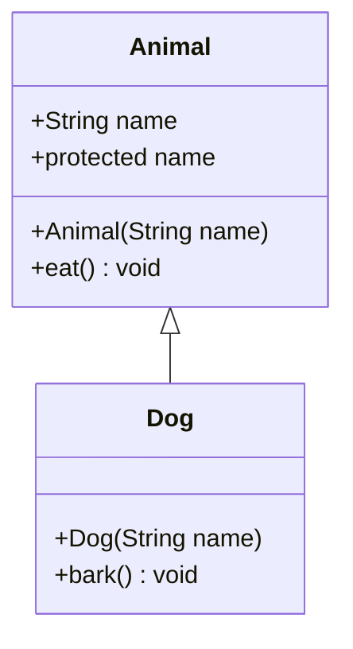
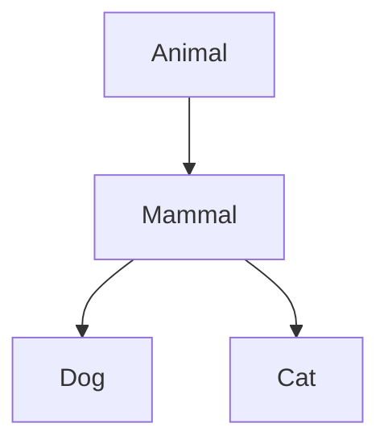
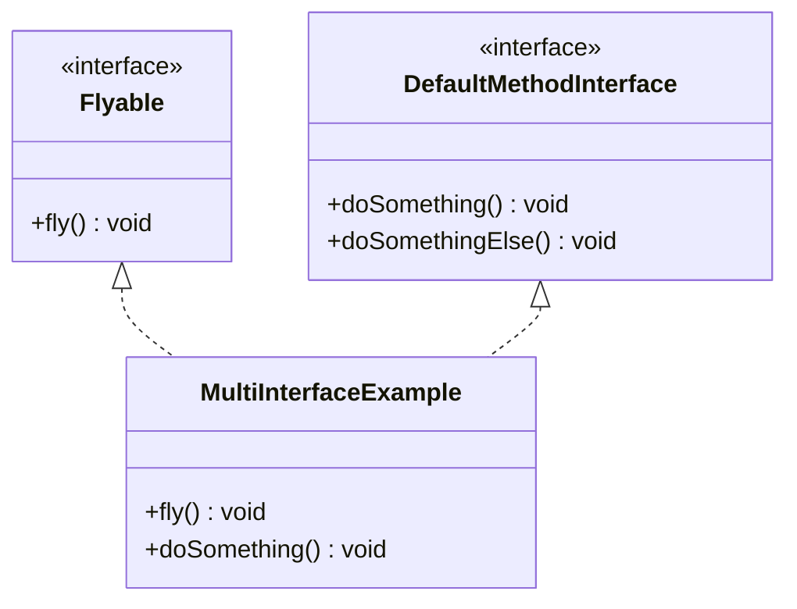
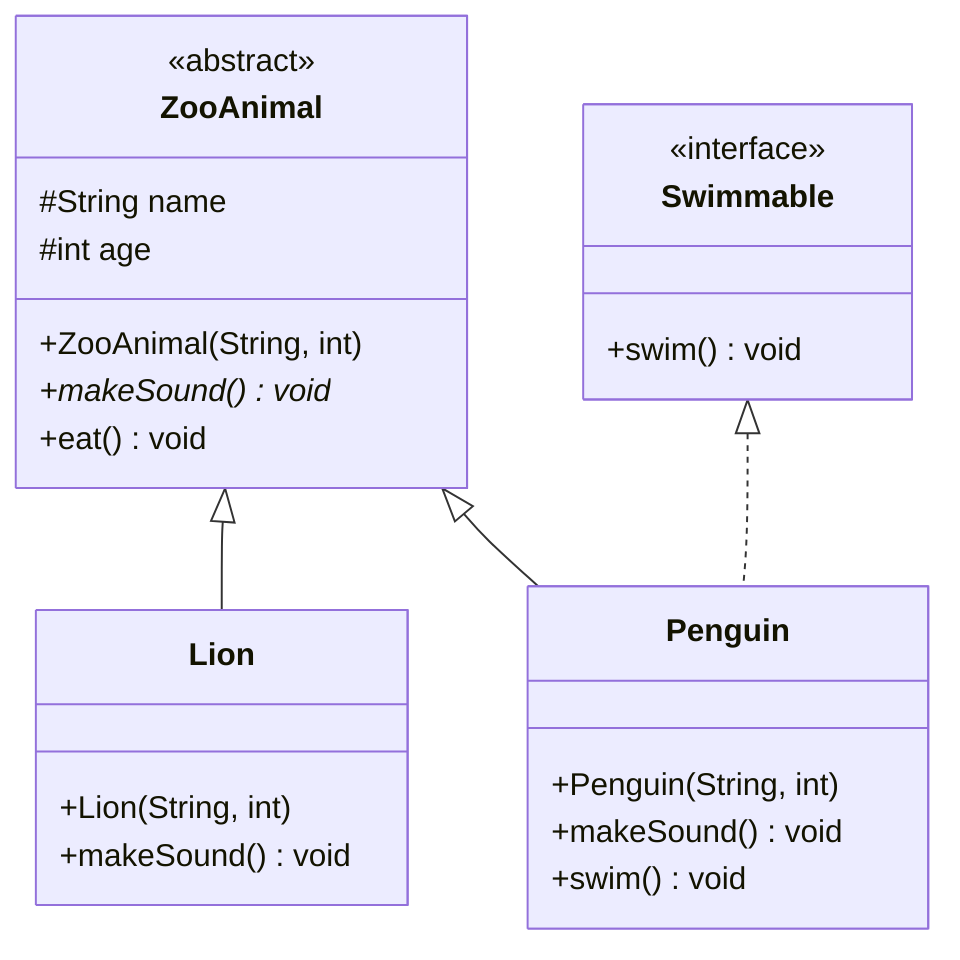

```yaml
---
title: "Kalitim ve Interface'e Kisa On Bakis"
subtitle: "Nesne Yonelimli Programlamada extends, super, override, abstract class, interface ve polymorphism"
author: "Teknik Kitap Yazarı"
date: 2024-01-15
lang: tr
subject: "Java Programlama"
keywords: [kalitim, inheritance, interface, abstract, polymorphism, Java, OOP]
---
```

## 1. Giris: Kalitim ve Arayuz Kavramlarina Giris

Nesne yonelimli programlama (OOP), yazilim gelistirmede kod tekrarini azaltmak, bakimi kolaylastirmak ve gercek dunya kavramlarini modellemek icin kullanilan guclu bir paradigmadir. OOP'nin dort temel ilkesi vardir: **Kalitim (Inheritance)**, **Kapsulleme (Encapsulation)**, **Cok Bicimlilik (Polymorphism)** ve **Soyutlama (Abstraction)**. Bu bolumde, kalitim ve arayuz (interface) kavramlarina kisa bir giris yapacak, `extends`, `super`, `override`, `abstract class` ve `polymorphism` temellerini ogreneceksiniz.

> [!TIP]
> **Pedagojik Not:** Bu bolumdeki ornekleri kendi IDE'nizde calistirarak ogrenmeyi pekistirin. Her konsepti anlamadan bir sonrakine gecmeyin.

### 1.1. Nesne Yonelimli Programlamanin Temel Ilkeleri

Java, tamamen nesne yonelimli bir dildir. Siniflar ve nesneler uzerine kuruludur. Kalitim, bir sinifin baska bir sinifin ozelliklerini ve davranislarini miras almasini saglar. Arayuzler ise bir sozlesme gibi davranarak, belirli metotlarin implemente edilmesini zorunlu kilar.

### 1.2. Kalitim ve Arayuzun Onemi

- **Kalitim:** Kod tekrarini onler, hiyerarsik iliskiler kurar ve "is-a" (bir seydir) iliskisini modeller. Ornegin, "Kopek bir Hayvandir."
- **Arayuz:** Farkli siniflarin ayni davranisi farkli sekillerde gerceklestirmesini saglar. "can-do" (yapabilir) iliskisini modeller. Ornegin, "Ucan seyler ucabilir."

### 1.3. Bolumun Hedefleri

Bu bolumun sonunda:
- `extends` ve `super` anahtar kelimelerini kullanarak kalitim yapisi kurabileceksiniz.
- Metot override etme (gecersiz kilma) mantigini anlayacaksiniz.
- `abstract` sinif ve `interface` arasindaki farki kavrayacaksiniz.
- Polimorfizmin nasil calistigini ogreneceksiniz.

---

## 2. Kalitim (Inheritance) Temelleri

Kalitim, bir sinifin (alt sinif / subclass) baska bir sinifin (ust sinif / superclass) tum public ve protected uyelerine erismesini saglar. Java'da bir sinif yalnizca bir tane ust sinifa sahip olabilir (tekli kalitim).

### 2.1. extends Anahtar Kelimesi

Bir alt sinif olusturmak icin `extends` anahtar kelimesi kullanilir.

<!-- CODE_META: Dosya adi: Animal.java, konu: Temel kalitim ornegi -->
```java
// Ust sinif
public class Animal {
    protected String name;
    
    public Animal(String name) {
        this.name = name;
    }
    
    public void eat() {
        System.out.println(name + " yemek yiyor.");
    }
}
```

<!-- CODE_META: Dosya adi: Dog.java, konu: extends kullanimi -->
```java
// Alt sinif
public class Dog extends Animal {
    
    public Dog(String name) {
        super(name); // Ust sinifin yapicisini cagirir
    }
    
    public void bark() {
        System.out.println(name + " havlıyor: Hav hav!");
    }
}
```



### 2.2. super Anahtar Kelimesi

`super`, ust sinifin uyelerine (degiskenler, metotlar, yapicilar) erismek icin kullanilir. Ozellikle:
- Ust sinifin yapicisini cagirmak icin: `super(parametreler)`
- Ust sinifin override edilmis bir metodunu cagirmak icin: `super.metotAdi()`

<!-- CODE_META: Dosya adi: SuperExample.java, konu: super kullanimi -->
```java
public class SuperExample {
    public static void main(String[] args) {
        Dog dog = new Dog("Karabas");
        dog.eat(); // Animal sinifindan miras alindi
        dog.bark();
    }
}
```

Cikti:
```
Karabas yemek yiyor.
Karabas havlıyor: Hav hav!
```

> [!WARNING]
> `super()` cagrisi, alt sinif yapicisinin ilk satirinda olmalidir. Aksi takdirde derleme hatasi alirsiniz.

### 2.3. Metot Override (Gecersiz Kilma)

Alt sinif, ust sinifta tanimli bir metodu kendi ihtiyacina gore yeniden tanimlayabilir. Buna **override** denir.

<!-- CODE_META: Dosya adi: Cat.java, konu: Metot override -->
```java
public class Cat extends Animal {
    
    public Cat(String name) {
        super(name);
    }
    
    @Override
    public void eat() {
        System.out.println(name + " balik yiyor.");
    }
}
```

`@Override` annotation'u, derleyiciye bu metodun bir ust sinif metodunu gecersiz kilacagini belirtir. Bu, hata yapma olasiligini azaltir.

### 2.4. Ust Sinif Yapici Cagrilari

Her alt sinif yapicisi, dogrudan veya dolayli olarak bir ust sinif yapicisini cagirmalidir. Eger acikca belirtilmezse, Java derleyicisi parametresiz yapiciyi (`super()`) ekler.

<!-- CODE_META: Dosya adi: ConstructorChain.java, konu: Yapici zinciri -->
```java
public class ConstructorChain {
    public static void main(String[] args) {
        Cat cat = new Cat("Pamuk");
        cat.eat();
    }
}
```

Cikti:
```
Pamuk balik yiyor.
```

### 2.5. Java'da Kalitim Zinciri

Java'da siniflar hiyerarsik bir yapi olusturabilir. Ornegin: `Animal -> Mammal -> Dog`.



---

## 3. Abstract Siniflar

Bazen bir sinifin dogrudan nesnesini olusturmak anlamli olmayabilir. Ornegin, "Hayvan" soyut bir kavramdir; sadece "Kopek" veya "Kedi" gibi somut turler vardir. Bu durumda `abstract` sinif kullanilir.

### 3.1. abstract Anahtar Kelimesi

`abstract` anahtar kelimesi, sinifin veya metodun soyut oldugunu belirtir. Soyut siniflarin nesnesi olusturulamaz.

<!-- CODE_META: Dosya adi: AbstractAnimal.java, konu: Abstract sinif -->
```java
public abstract class AbstractAnimal {
    protected String name;
    
    public AbstractAnimal(String name) {
        this.name = name;
    }
    
    // Soyut metot: govdesiz
    public abstract void makeSound();
    
    // Somut metot
    public void sleep() {
        System.out.println(name + " uyuyor.");
    }
}
```

### 3.2. Abstract Metotlar

Soyut metotlarin govdesi yoktur; alt siniflar bu metotlari implemente etmek zorundadir.

<!-- CODE_META: Dosya adi: AbstractDog.java, konu: Abstract sinifi implemente etme -->
```java
public class AbstractDog extends AbstractAnimal {
    
    public AbstractDog(String name) {
        super(name);
    }
    
    @Override
    public void makeSound() {
        System.out.println(name + " havlıyor.");
    }
}
```

### 3.3. Abstract Sinif vs Somut Sinif

| Ozellik | Abstract Sinif | Somut Sinif |
|---------|----------------|-------------|
| Nesne olusturma | Hayir | Evet |
| Soyut metot | Icerilebilir | Iceremez |
| Kalitim | extends ile | extends ile |

### 3.4. Abstract Sinif Kullanim Ornekleri

- Ortak ozellikleri paylasan ama dogrudan orneklendirilmemesi gereken siniflar.
- Bir aile icinde ortak davranislari tanimlamak.

---

## 4. Interface (Arayuz) Kavrami

Interface, tamamen soyut bir yapidir (Java 8'den itibaren default ve static metotlar eklenmistir). Bir sinifin "ne yapmasi gerektigini" belirtir, "nasil yapacagini" degil.

### 4.1. interface Anahtar Kelimesi

<!-- CODE_META: Dosya adi: Flyable.java, konu: Interface tanimi -->
```java
public interface Flyable {
    void fly(); // public abstract otomatik olarak eklenir
}
```

### 4.2. implements Anahtar Kelimesi

Bir sinifin bir interface'i uyguladigini belirtir.

<!-- CODE_META: Dosya adi: Bird.java, konu: implements kullanimi -->
```java
public class Bird implements Flyable {
    private String name;
    
    public Bird(String name) {
        this.name = name;
    }
    
    @Override
    public void fly() {
        System.out.println(name + " uçuyor.");
    }
}
```

### 4.3. Interface'de Metot Tanimlama

Java 8 oncesinde interface'ler sadece soyut metotlar icerebilirdi. Java 8 ile `default` ve `static` metotlar eklendi.

<!-- CODE_META: Dosya adi: DefaultMethodInterface.java, konu: Default metot -->
```java
public interface DefaultMethodInterface {
    void doSomething();
    
    default void doSomethingElse() {
        System.out.println("Default implementasyon");
    }
}
```

### 4.4. Default ve Static Metotlar (Java 8+)

- **Default metot:** Interface'de govdeli metot tanimlamaya izin verir. Alt siniflar bunu override edebilir veya oldugu gibi kullanabilir.
- **Static metot:** Interface uzerinden dogrudan cagrilabilir.

<!-- CODE_META: Dosya adi: StaticMethodExample.java, konu: Static metot -->
```java
public interface StaticMethodInterface {
    static void printInfo() {
        System.out.println("Bu bir static metottur.");
    }
}
```

### 4.5. Coklu Interface Kullanimi

Java, bir sinifin birden fazla interface'i implemente etmesine izin verir. Bu, coklu kalitimin avantajlarini saglar.

<!-- CODE_META: Dosya adi: MultiInterfaceExample.java, konu: Coklu interface -->
```java
public class MultiInterfaceExample implements Flyable, DefaultMethodInterface {
    @Override
    public void fly() {
        System.out.println("Uçuyorum!");
    }
    
    @Override
    public void doSomething() {
        System.out.println("Bir sey yapiyorum.");
    }
}
```



---

## 5. Polymorphism (Cok Bicimlilik) Temelleri

Polimorfizm, ayni arayuzu kullanan farkli nesnelerin farkli davranislar sergilemesidir. Java'da iki tur polimorfizm vardir.

### 5.1. Derleme Zamani vs Calisma Zamani Polimorfizmi

- **Derleme zamani (compile-time):** Metot asiri yukleme (overloading) ile saglanir.
- **Calisma zamani (runtime):** Metot override ile saglanir. Java Virtual Machine (JVM) hangi metodun cagrilacagina calisma zamaninda karar verir.

### 5.2. Upcasting ve Downcasting

- **Upcasting:** Alt sinif nesnesini ust sinif referansina atamak. Guvenlidir.
- **Downcasting:** Ust sinif referansini alt sinif referansina cevirmek. `ClassCastException` riski vardir.

<!-- CODE_META: Dosya adi: CastingExample.java, konu: Upcasting ve Downcasting -->
```java
public class CastingExample {
    public static void main(String[] args) {
        Animal animal = new Dog("Rex"); // Upcasting
        animal.eat(); // Dog'un eat() metodu cagrilir (polimorfizm)
        
        if (animal instanceof Dog) {
            Dog dog = (Dog) animal; // Downcasting
            dog.bark();
        }
    }
}
```

### 5.3. instanceof Operatoru

`instanceof`, bir nesnenin belirli bir ture ait olup olmadigini kontrol eder.

<!-- CODE_META: Dosya adi: InstanceOfExample.java, konu: instanceof -->
```java
public class InstanceOfExample {
    public static void main(String[] args) {
        Animal animal = new Cat("Mavis");
        
        if (animal instanceof Dog) {
            System.out.println("Bu bir kopek.");
        } else if (animal instanceof Cat) {
            System.out.println("Bu bir kedi.");
        }
    }
}
```

### 5.4. Polimorfizmin Gercek Hayat Ornekleri

Bir ses sistemi dusunun: `playSound()` metodu, hangi enstrumanin kullanildigina gore farkli calisir.

```mermaid
flowchart LR
    A[Ses Sistemi] --> B[playSound]
    B --> C[Gitar: "Ting"]
    B --> D[Piyano: "Ding"]
    B --> E[Davul: "Bam"]
```

---

## 6. Kalitim ve Interface Karsilastirmasi

### 6.1. extends vs implements

| extends | implements |
|---------|------------|
| Bir sinif baska bir sinifi genisletir | Bir sinif bir interface'i uygular |
| Tek bir sinif genisletilebilir | Birden fazla interface uygulanabilir |
| `super` ile ust sinife erisim | `super` ile interface'e erisim yok |

### 6.2. abstract class vs interface

| Ozellik | abstract class | interface |
|---------|----------------|-----------|
| Nesne olusturma | Hayir | Hayir |
| Soyut metot | Evet | Evet (Java 8 oncesi) |
| Somut metot | Evet | Evet (default/static ile) |
| Degisken | Her tur | Sadece `public static final` |
| Kalitim | Tekli | Coklu |

### 6.3. Ne Zaman Hangisini Kullanmali?

- **abstract class:** Ortak durum (state) ve davranis paylasiliyorsa, "is-a" iliskisi varsa.
- **interface:** Davranis paylasiliyorsa ancak sinif hiyerarsisi farkliysa, "can-do" iliskisi varsa.

### 6.4. Tasarim Prensipleri (SOLID ile Iliskisi)

- **Interface Segregation Principle (ISP):** Kucuk, ozel arayuzler tercih edilmelidir.
- **Liskov Substitution Principle (LSP):** Alt siniflar, ust sinifin yerine gecmelidir.
- **Dependency Inversion Principle (DIP):** Soyutlamalara bagimli olun, somut siniflara degil.

---

## 7. Uygulamali Ornek: Hayvanat Bahcesi Sistemi

Bu ornekte, bir hayvanat bahcesi sistemi icin kalitim, abstract sinif ve interface kullanimini gosterecegiz.

### 7.1. Temel Sinif Yapisi

<!-- CODE_META: Dosya adi: ZooAnimal.java, konu: Temel abstract sinif -->
```java
public abstract class ZooAnimal {
    protected String name;
    protected int age;
    
    public ZooAnimal(String name, int age) {
        this.name = name;
        this.age = age;
    }
    
    public abstract void makeSound();
    
    public void eat() {
        System.out.println(name + " yemek yiyor.");
    }
}
```

### 7.2. Abstract Sinif Kullanimi

<!-- CODE_META: Dosya adi: Lion.java, konu: Abstract sinifi genisletme -->
```java
public class Lion extends ZooAnimal {
    
    public Lion(String name, int age) {
        super(name, age);
    }
    
    @Override
    public void makeSound() {
        System.out.println(name + " kükrüyor: ROAR!");
    }
}
```

### 7.3. Interface Implementasyonu

<!-- CODE_META: Dosya adi: Swimmable.java, konu: Interface tanimi -->
```java
public interface Swimmable {
    void swim();
}
```

<!-- CODE_META: Dosya adi: Penguin.java, konu: Interface implementasyonu -->
```java
public class Penguin extends ZooAnimal implements Swimmable {
    
    public Penguin(String name, int age) {
        super(name, age);
    }
    
    @Override
    public void makeSound() {
        System.out.println(name + " cıvıldıyor.");
    }
    
    @Override
    public void swim() {
        System.out.println(name + " yüzüyor.");
    }
}
```

### 7.4. Polimorfik Davranis

<!-- CODE_META: Dosya adi: Zoo.java, konu: Polimorfizm ornegi -->
```java
import java.util.ArrayList;
import java.util.List;

public class Zoo {
    public static void main(String[] args) {
        List<ZooAnimal> animals = new ArrayList<>();
        animals.add(new Lion("Simba", 5));
        animals.add(new Penguin("Pingu", 3));
        
        for (ZooAnimal animal : animals) {
            animal.makeSound(); // Polimorfik cagri
        }
        
        // Swimmable olanlari yuzdur
        for (ZooAnimal animal : animals) {
            if (animal instanceof Swimmable) {
                ((Swimmable) animal).swim();
            }
        }
    }
}
```

Cikti:
```
Simba kükrüyor: ROAR!
Pingu cıvıldıyor.
Pingu yüzüyor.
```



---

## 8. Yaygin Hatalar ve Ipuclari

### 8.1. Override Annotation'unun Onemi

`@Override` kullanmak, yazim hatalarini onler. Ornegin, `equals()` yerine `equal()` yazarsaniz derleyici uyarir.

### 8.2. super Cagrisini Unutmak

Eger ust sinifin parametresiz yapicisi yoksa, alt sinifta `super(parametreler)` cagrisi yapmak zorunludur.

### 8.3. Interface'de Degisken Tanimlama

Interface'deki tum degiskenler `public static final`dir. Bu nedenle sabit tanimlamak icin kullanilabilir.

### 8.4. Diamond Problemi

Java, coklu kalitimi desteklemez ancak coklu interface implementasyonuna izin verir. Iki interface'de ayni imzaya sahip default metot varsa, derleme hatasi olusur. Bu durumda alt sinif, metodu override etmelidir.

---

## 9. Ozet ve Terim Sozlugu

### 9.1. Bolum Ozeti

Bu bolumde:
- `extends` ile kalitim yapisi kurmayi,
- `super` ile ust sinif uyelerine erismeyi,
- `@Override` ile metot gecersiz kilmayi,
- `abstract` sinif ve `interface` kavramlarini,
- `implements` ile arayuz uygulamayi,
- Polimorfizm ve tur donusumlerini ogrendiniz.

### 9.2. Terim Sozlugu

| Terim | Aciklama |
|-------|----------|
| Kalitim (Inheritance) | Bir sinifin baska bir sinifin ozelliklerini miras almasi |
| extends | Kalitim icin kullanilan anahtar kelime |
| super | Ust sinif uyelerine erismek icin kullanilan anahtar kelime |
| Override | Ust sinif metodunu gecersiz kilma |
| abstract | Soyut sinif veya metot belirteci |
| interface | Tamamen soyut yapi, sozlesme |
| implements | Interface uygulamak icin kullanilan anahtar kelime |
| Polymorphism | Ayni arayuzun farkli davranislar sergilemesi |
| instanceof | Tur kontrolu icin operator |

### 9.3. Sorular

1. `extends` ve `implements` arasindaki fark nedir?
2. Abstract sinif ile interface arasindaki uc temel farki sayiniz.
3. Polimorfizm neden onemlidir? Gercek hayattan bir ornek veriniz.
4. `super` anahtar kelimesi hangi durumlarda kullanilir?
5. Java'da neden coklu kalitim yoktur?

### 9.4. Alistirmalar

1. **Temel Kalitim:** Bir `Vehicle` sinifi olusturun. `Car` ve `Bike` siniflari bu sinifi genisletsin. `startEngine()` metodunu override edin.

2. **Abstract Sinif:** Bir `Shape` abstract sinifi olusturun. `area()` soyut metodunu icersin. `Circle` ve `Rectangle` siniflari bu sinifi genisletsin.

3. **Interface:** Bir `Playable` interface'i olusturun. `play()` metodunu icersin. `Guitar` ve `Piano` siniflari bu interface'i uygulasin.

4. **Polimorfizm:** Yukaridaki siniflari kullanarak bir polimorfizm ornegi yazin. Bir dizi `Shape` nesnesi olusturun ve her birinin `area()` metodunu cagirin.

5. **Karma Ornek:** Bir `Employee` abstract sinifi ve `Payable` interface'i olusturun. `FullTimeEmployee` ve `PartTimeEmployee` siniflari hem `Employee`'yi genisletsin hem de `Payable`'i uygulasin. `calculateSalary()` metodunu polimorfik olarak cagirin.

> [!NOTE]
> Alistirmalari yaparken her adimda kodu derleyip calistirin. Hata mesajlarini okuyun ve cozum bulmaya calisin. Bu, ogrenme surecinizi hizlandiracaktir.

---

**Bolum Sonu.**