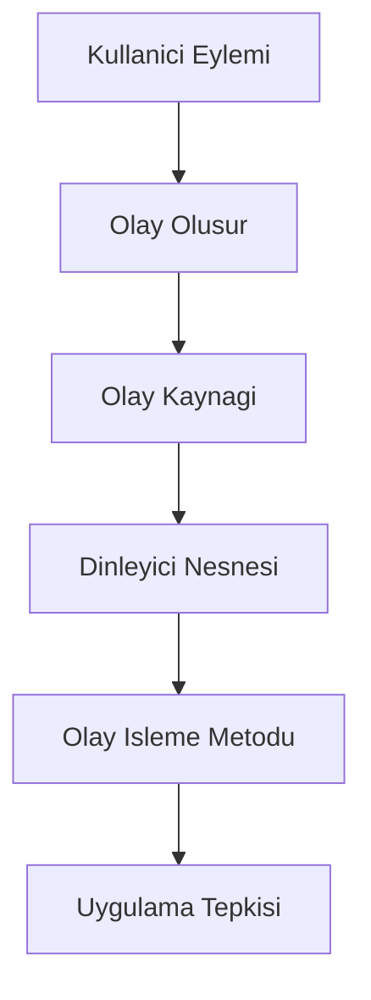
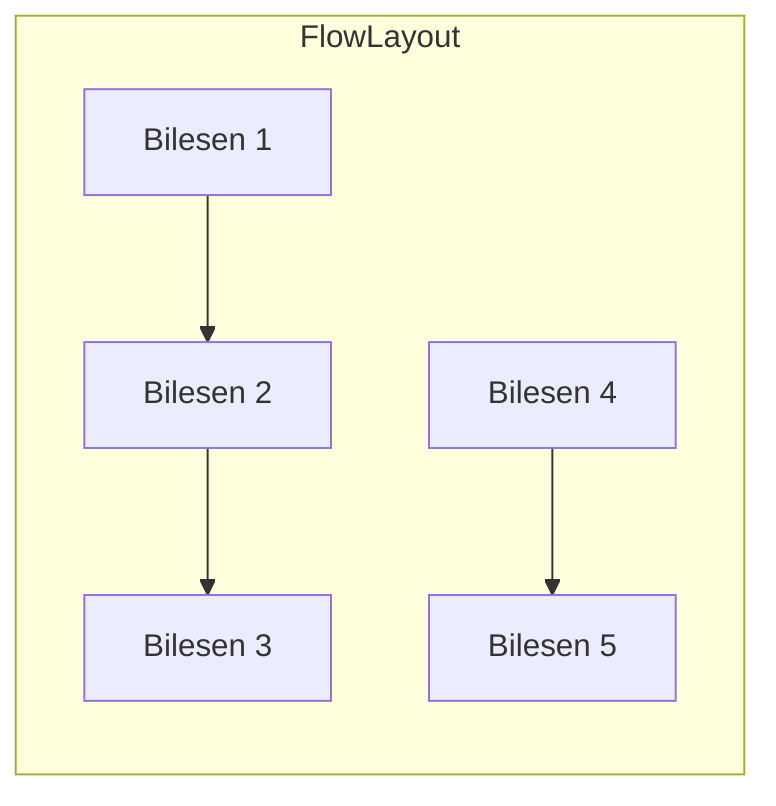
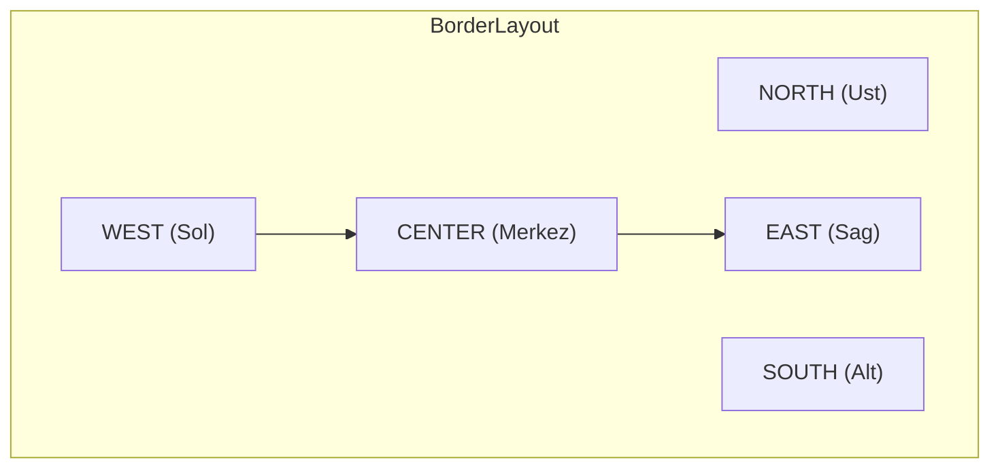
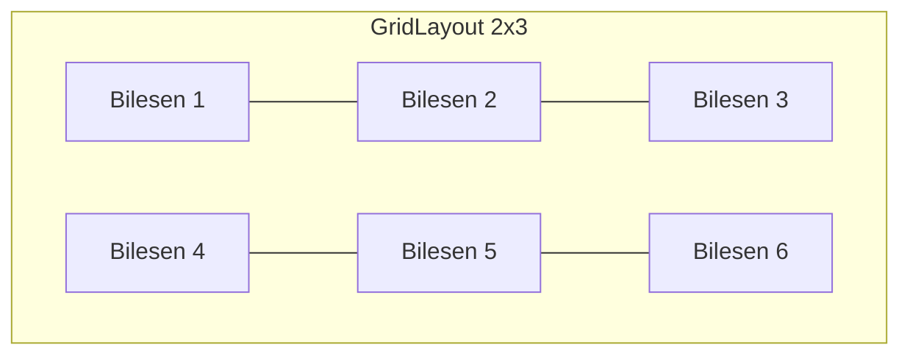

# Bölüm 19: GUI Programlamaya Giris ve Swing Arayuz Tasarimi


```yaml
---
title: "GUI Programlamaya Giris ve Swing Arayuz Tasarimi"
subtitle: "Java ile Masaustu Uygulama Gelistirme"
author: "Teknik Kitap Yazarı"
date: 2025-01-27
lang: tr
abstract: |
  Bu bolumde, Java dilinde grafiksel kullanici arayuzu (GUI) gelistirmenin temellerini ogreneceksiniz. 
  Swing kutuphanesi ile JFrame, JPanel, layout yoneticileri ve olay isleme mekanizmalarini kullanarak 
  basit bir GUI uygulamasi gelistireceksiniz. Bolum sonunda, kendi masaustu uygulamalarinizi 
  tasarlayabilecek ve kodlayabilecek seviyeye geleceksiniz.
---
```

## 19.1 Giris

GUI (Graphical User Interface), kullanicilarin bir yazilimla etkilesime gecmesini saglayan gorsel bilesenler butunudur. Dugmeler, metin kutulari, listeler, menuler gibi bilesenler, kullanicilarin komutlari fare tiklamalari veya klavye girisi ile iletmesine olanak tanir. GUI olmayan bir program (komut satiri arayuzu) yalnizca metin tabanli girdi ve cikti kullanirken, GUI ile kullanici deneyimi cok daha sezgisel ve kullanici dostu hale gelir.

Java'da GUI gelistirmek icin uc ana kutuphane bulunur:

1. **AWT (Abstract Window Toolkit)**: Java'nin ilk GUI kutuphanesidir. Platforma bagimli bilesenler icerir ve hafiftir, ancak sinirli bilesen seti ve platforma ozgu davranislari nedeniyle modern uygulamalar icin yeterli degildir.

2. **Swing**: AWT uzerine insa edilmis, daha zengin ve esnek bir kutuphanedir. Tamamen Java'da yazilmistir, bu nedenle platformdan bagimsizdir. Swing, JButton, JTextField, JTable gibi bilesenlerle karmasik arayuzler olusturmayi saglar.

3. **JavaFX**: Swing'in halefi olarak gelistirilmistir. Modern, zengin internet uygulamalari (RIA) icin tasarlanmistir. CSS benzeri stil dosyalari ve FXML ile deklaratif arayuz tanimlama destegi sunar. Ancak, Swing hala genis bir kullanim alanina sahiptir ve bircok kurumsal uygulamada tercih edilmektedir.

Bu bolumde, Swing kutuphanesini kullanarak GUI programlamanin temellerini ogreneceksiniz. Swing, ogrenmesi kolay, dokumantasyonu genis ve bir cok IDE tarafindan desteklenen bir kutuphanedir.

## 19.2 Swing Mimarisi

Swing, bilesen tabanli bir mimari kullanir. Her bir GUI bileseni, `javax.swing` paketindeki bir siniftan turer. Temel sinif hiyerarsisi su sekildedir:

- `java.awt.Component`: Tum GUI bilesenlerinin temel sinifi.
- `java.awt.Container`: Bilesenleri icerebilen ozel bir Component. JFrame, JPanel gibi siniflar Container'dan turer.
- `javax.swing.JComponent`: Swing bilesenlerinin temel sinifi. JButton, JLabel, JTextField gibi bilesenler JComponent'den turer.

### MVC Deseni ve Swing

Swing, Model-View-Controller (MVC) mimarisini benimser. Her bilesen icin:

- **Model**: Veriyi ve durumu temsil eder. Ornegin, bir JButton'un modeli, dugmenin basilip basilmadigini, etkin olup olmadigini saklar.
- **View**: Gorsel goruntuyu olusturur. JButton icin, dugmenin goruntusu (metin, renk, kenarlik) view tarafindan cizilir.
- **Controller**: Kullanici etkilesimlerini (tiklamalar, tus basimlari) yonetir ve model ile view arasindaki iletisimi saglar.

Swing'de bu uc bilesen genellikle tek bir sinifta birlestirilir (ornegin JButton), ancak modeli ayri olarak da kullanmak mumkundur.

### Olay Tabanli Programlama

GUI uygulamalari, olay tabanli (event-driven) bir programlama modeli kullanir. Kullanici bir dugmeye tikladiginda, bir metin kutusuna yazi yazdiginda veya fareyi hareket ettirdiginde, bir "olay" (event) olusturulur. Bu olay, ilgili "dinleyici" (listener) tarafindan yakalanir ve islenir.



## 19.3 JFrame - Uygulama Penceresi

JFrame, Swing uygulamalarinin ana penceresini temsil eder. Bir JFrame olusturmak icin:

- `javax.swing.JFrame` sinifindan bir nesne olusturulur.
- Pencere basligi, boyutu ve konumu ayarlanir.
- Pencere kapatma davranisi belirtilir.
- Bilesenler eklenir ve gorunur hale getirilir.

<!-- CODE_META: Basit bir JFrame ornegi -->
**Dosya adi:** `OrnekJFrame.java`

<!-- CODE_META
id: bolum-19_kod01
chapter_id: bolum-19
kind: example
title: "Kod 1"
file: "Ornek00.java"
mainClass: Ornek00
extract: true
test: compile
github: true
qr: dual
-->

```java
import javax.swing.JFrame;
import javax.swing.SwingUtilities;

public class OrnekJFrame {
    public static void main(String[] args) {
        // Swing bilesenlerinin guvenli bir sekilde olusturulmasi icin Event Dispatch Thread kullanilir
        SwingUtilities.invokeLater(new Runnable() {
            @Override
            public void run() {
                JFrame frame = new JFrame("Ilk Swing Uygulamam");
                frame.setDefaultCloseOperation(JFrame.EXIT_ON_CLOSE); // Uygulama kapatildiginda program sonlansin
                frame.setSize(400, 300); // Pencere boyutu (genislik, yukseklik)
                frame.setLocationRelativeTo(null); // Pencereyi ekranin ortasina konumlandir
                frame.setVisible(true); // Pencereyi gorunur yap
            }
        });
    }
}
```

**Aciklama:**
- `SwingUtilities.invokeLater()`: Swing bilesenlerinin olusturulmasi ve guncellenmesi, Event Dispatch Thread (EDT) uzerinde yapilmalidir. Bu metod, bir Runnable nesnesini EDT'ye gonderir.
- `setDefaultCloseOperation(JFrame.EXIT_ON_CLOSE)`: Pencere kapatildiginda JVM'in sonlanmasini saglar. Diger secenekler: `DO_NOTHING_ON_CLOSE`, `HIDE_ON_CLOSE`, `DISPOSE_ON_CLOSE`.
- `setSize(400, 300)`: Pencere genisligini 400 piksel, yuksekligini 300 piksel yapar.
- `setLocationRelativeTo(null)`: Pencereyi ekranin ortasina yerlestirir.
- `setVisible(true)`: Pencereyi gorunur hale getirir. Varsayilan olarak JFrame gorunmezdir.

> **Pedagojik Not:** JFrame olustururken `setSize` ve `setLocationRelativeTo` metodlarini kullanmak, uygulamanizin farkli ekran cozunurluklerinde duzgun goruntulenmesini saglar. Ayrica, `setDefaultCloseOperation` ile uygulamanin dogru bir sekilde sonlandirilmasini garantileyin.

## 19.4 JPanel ve Icerik Bilesenleri

JPanel, diger bilesenleri gruplamak ve duzenlemek icin kullanilan bir kaptir (container). JFrame'in icerik bolmesine (content pane) dogrudan bilesen eklemek yerine, genellikle bir JPanel eklenir ve bilesenler bu panele eklenir. Bu, daha duzenli ve yonetilebilir bir kod yapisina olanak tanir.

### Temel Bilesenler

- **JButton**: Tiklanabilir bir dugme. Metin veya simge icerebilir.
- **JLabel**: Metin veya simge gostermek icin kullanilan etiket.
- **JTextField**: Tek satirli metin girisi icin kullanilan alan.
- **JTextArea**: Cok satirli metin girisi icin kullanilan alan.

<!-- CODE_META: JPanel ve bilesen ekleme ornegi -->
**Dosya adi:** `PanelOrnegi.java`

<!-- CODE_META
id: bolum-19_kod02
chapter_id: bolum-19
kind: example
title: "Kod 2"
file: "Ornek01.java"
mainClass: Ornek01
extract: true
test: compile
github: true
qr: dual
-->

```java
import javax.swing.*;
import java.awt.*;

public class PanelOrnegi {
    public static void main(String[] args) {
        SwingUtilities.invokeLater(new Runnable() {
            @Override
            public void run() {
                JFrame frame = new JFrame("Panel Ornegi");
                frame.setDefaultCloseOperation(JFrame.EXIT_ON_CLOSE);
                frame.setSize(500, 400);
                frame.setLocationRelativeTo(null);

                // JPanel olustur
                JPanel panel = new JPanel();
                panel.setBackground(Color.LIGHT_GRAY); // Arka plan rengi
                panel.setLayout(new FlowLayout()); // Layout yoneticisi

                // Bilesenler olustur
                JLabel label = new JLabel("Adiniz:");
                JTextField textField = new JTextField(20); // 20 karakter genisliginde
                JButton button = new JButton("Gonder");

                // Bilesenleri panele ekle
                panel.add(label);
                panel.add(textField);
                panel.add(button);

                // Paneli JFrame'e ekle
                frame.add(panel);

                frame.setVisible(true);
            }
        });
    }
}
```

**Aciklama:**
- `JPanel panel = new JPanel();`: Yeni bir panel olusturur.
- `panel.setBackground(Color.LIGHT_GRAY)`: Panelin arka plan rengini acik gri yapar.
- `panel.setLayout(new FlowLayout())`: Panelin layout yoneticisini FlowLayout olarak ayarlar. FlowLayout, bilesenleri soldan saga, ustten alta dogru siralar.
- `JLabel`, `JTextField`, `JButton`: Temel bilesenler olusturulur.
- `panel.add(label)`: Bilesenler panele eklenir.
- `frame.add(panel)`: Panel, JFrame'in icerik bolmesine eklenir.

> **Pedagojik Not:** Bilesenleri dogrudan JFrame'e eklemek yerine JPanel kullanmak, daha esnek bir duzen olusturmanizi saglar. Ilerleyen bolumlerde, farkli layout yoneticilerini bir arada kullanarak karmasik arayuzler tasarlayacaksiniz.

## 19.5 Layout Yoneticileri

Layout yoneticileri, bilesenlerin bir container icinde nasil konumlandirilacagini ve boyutlandirilacagini belirler. Swing'de bircok layout yoneticisi bulunur. Bu bolumde en yaygin kullanilanlari inceleyecegiz.

### FlowLayout

Bilesenleri soldan saga, ustten alta dogru siralar. Satir doldugunda bir sonraki satira gecer. Varsayilan olarak bilesenlerin tercih edilen boyutlarini kullanir.



### BorderLayout

Container'i bes bolgeye ayirir: NORTH, SOUTH, EAST, WEST, CENTER. Her bolgeye yalnizca bir bilesen eklenebilir. CENTER bolgesi, diger bolgelerdeki bilesenlerin boyutlarina gore kalan alani kaplar.



### GridLayout

Bilesenleri esit boyutlu bir tablo (satir ve sutun) seklinde duzenler. Satir ve sutun sayisi belirtilir. Bilesenler, satir oncelikli olarak (once satirlar, sonra sutunlar) yerlestirilir.



### GridBagLayout (Temel Seviye)

En guclu ve esnek layout yoneticisidir. Bilesenlerin konumunu, boyutunu ve hizalama sekillerini ince ayar yaparak belirlemeyi saglar. Ancak, kullanimi digerlerine gore daha karmasiktir. Bu bolumde temel kullanimini gorecegiz.

<!-- CODE_META: Layout yoneticileri karsilastirmasi -->
**Dosya adi:** `LayoutKarsilastirma.java`

<!-- CODE_META
id: bolum-19_kod03
chapter_id: bolum-19
kind: example
title: "Kod 3"
file: "Ornek02.java"
mainClass: Ornek02
extract: true
test: compile
github: true
qr: dual
-->

```java
import javax.swing.*;
import java.awt.*;

public class LayoutKarsilastirma {
    public static void main(String[] args) {
        SwingUtilities.invokeLater(new Runnable() {
            @Override
            public void run() {
                JFrame frame = new JFrame("Layout Karsilastirma");
                frame.setDefaultCloseOperation(JFrame.EXIT_ON_CLOSE);
                frame.setSize(600, 400);
                frame.setLocationRelativeTo(null);

                // Ana panel: BorderLayout
                JPanel mainPanel = new JPanel(new BorderLayout());

                // FlowLayout ornegi
                JPanel flowPanel = new JPanel(new FlowLayout());
                flowPanel.setBorder(BorderFactory.createTitledBorder("FlowLayout"));
                flowPanel.add(new JButton("1"));
                flowPanel.add(new JButton("2"));
                flowPanel.add(new JButton("3"));

                // GridLayout ornegi (2 satir, 3 sutun)
                JPanel gridPanel = new JPanel(new GridLayout(2, 3));
                gridPanel.setBorder(BorderFactory.createTitledBorder("GridLayout 2x3"));
                for (int i = 1; i <= 6; i++) {
                    gridPanel.add(new JButton("Dugme " + i));
                }

                // BorderLayout ornegi (zaten ana panel BorderLayout)
                JPanel borderPanel = new JPanel(new BorderLayout());
                borderPanel.setBorder(BorderFactory.createTitledBorder("BorderLayout"));
                borderPanel.add(new JButton("NORTH"), BorderLayout.NORTH);
                borderPanel.add(new JButton("SOUTH"), BorderLayout.SOUTH);
                borderPanel.add(new JButton("EAST"), BorderLayout.EAST);
                borderPanel.add(new JButton("WEST"), BorderLayout.WEST);
                borderPanel.add(new JButton("CENTER"), BorderLayout.CENTER);

                // Ana panele ekle
                mainPanel.add(flowPanel, BorderLayout.NORTH);
                mainPanel.add(gridPanel, BorderLayout.CENTER);
                mainPanel.add(borderPanel, BorderLayout.SOUTH);

                frame.add(mainPanel);
                frame.setVisible(true);
            }
        });
    }
}
```

**Aciklama:**
- `BorderFactory.createTitledBorder("...")`: Panelin etrafina baslikli bir kenarlik ekler. Bu, goruntu acisindan hangi layout'un kullanildigini ayirt etmeyi kolaylastirir.
- Her bir layout ornegi, kendi JPanel'i icinde olusturulmus ve ana panele eklenmistir.

> **Pedagojik Not:** Layout yoneticisi secimi, uygulamanizin goruntusu ve kullanici deneyimi uzerinde buyuk etkiye sahiptir. Basit arayuzler icin FlowLayout veya GridLayout yeterli olabilirken, karmasik arayuzler icin BorderLayout ve GridBagLayout kombinasyonu kullanilir. Ilerleyen bolumlerde, uygulama ihtiyaclarina gore dogru layout'u secme stratejilerini ogreneceksiniz.

## 19.6 Olay Isleme (Event Handling)

Olay isleme, GUI programlamanin en onemli kavramlarindan biridir. Kullanici etkilesimlerine (ornegin, dugmeye tiklamak, metin yazmak) yanit vermek icin olay dinleyicileri kullanilir.

### ActionListener ve ActionEvent

Bir dugmeye tiklandiginda, bir `ActionEvent` olayi olusur. Bu olayi yakalamak icin `ActionListener` arayuzunu uygulayan bir sinif olusturulur ve dugmeye kaydedilir.

<!-- CODE_META: ActionListener ornegi (anonymous inner class) -->
**Dosya adi:** `ActionListenerOrnegi.java`

<!-- CODE_META
id: bolum-19_kod04
chapter_id: bolum-19
kind: example
title: "Kod 4"
file: "Ornek03.java"
mainClass: Ornek03
extract: true
test: compile
github: true
qr: dual
-->

```java
import javax.swing.*;
import java.awt.*;
import java.awt.event.ActionEvent;
import java.awt.event.ActionListener;

public class ActionListenerOrnegi {
    public static void main(String[] args) {
        SwingUtilities.invokeLater(new Runnable() {
            @Override
            public void run() {
                JFrame frame = new JFrame("ActionListener Ornegi");
                frame.setDefaultCloseOperation(JFrame.EXIT_ON_CLOSE);
                frame.setSize(400, 200);
                frame.setLocationRelativeTo(null);

                JPanel panel = new JPanel(new FlowLayout());
                JLabel label = new JLabel("Henuz tiklanmadi.");
                JButton button = new JButton("Tikla");

                // Anonymous inner class ile ActionListener
                button.addActionListener(new ActionListener() {
                    @Override
                    public void actionPerformed(ActionEvent e) {
                        label.setText("Dugmeye tiklandi!");
                    }
                });

                panel.add(button);
                panel.add(label);
                frame.add(panel);
                frame.setVisible(true);
            }
        });
    }
}
```

### Lambda Ifadeleri ile Olay Isleme

Java 8 ile gelen lambda ifadeleri, olay isleme kodunu daha kisa ve okunabilir hale getirir.

<!-- CODE_META: Lambda ifadesi ile ActionListener -->
**Dosya adi:** `LambdaOrnegi.java`

<!-- CODE_META
id: bolum-19_kod05
chapter_id: bolum-19
kind: example
title: "Kod 5"
file: "Ornek04.java"
mainClass: Ornek04
extract: true
test: compile
github: true
qr: dual
-->

```java
import javax.swing.*;
import java.awt.*;

public class LambdaOrnegi {
    public static void main(String[] args) {
        SwingUtilities.invokeLater(() -> {
            JFrame frame = new JFrame("Lambda Ornegi");
            frame.setDefaultCloseOperation(JFrame.EXIT_ON_CLOSE);
            frame.setSize(400, 200);
            frame.setLocationRelativeTo(null);

            JPanel panel = new JPanel(new FlowLayout());
            JLabel label = new JLabel("Henuz tiklanmadi.");
            JButton button = new JButton("Tikla");

            // Lambda ifadesi
            button.addActionListener(e -> label.setText("Lambda ile tiklandi!"));

            panel.add(button);
            panel.add(label);
            frame.add(panel);
            frame.setVisible(true);
        });
    }
}
```

**Aciklama:**
- Lambda ifadesi `e -> label.setText("Lambda ile tiklandi!")`, `actionPerformed` metodunun govdesini temsil eder. `e` parametresi, `ActionEvent` nesnesidir.
- Bu yontem, kodun daha az ve daha anlasilir olmasini saglar.

### Birden Fazla Bilesen Icin Olay Isleme

Bazen ayni dinleyiciyi birden fazla bilesene kaydetmek isteyebilirsiniz. Bunun icin, `ActionEvent` nesnesinin `getSource()` metodu kullanilarak hangi bilesenin olayi olusturdugu tespit edilebilir.

<!-- CODE_META: Birden fazla dugme icin tek dinleyici -->
**Dosya adi:** `CokluDugmeOrnegi.java`

<!-- CODE_META
id: bolum-19_kod06
chapter_id: bolum-19
kind: example
title: "Kod 6"
file: "Ornek05.java"
mainClass: Ornek05
extract: true
test: compile
github: true
qr: dual
-->

```java
import javax.swing.*;
import java.awt.*;
import java.awt.event.ActionEvent;
import java.awt.event.ActionListener;

public class CokluDugmeOrnegi {
    public static void main(String[] args) {
        SwingUtilities.invokeLater(() -> {
            JFrame frame = new JFrame("Coklu Dugme Ornegi");
            frame.setDefaultCloseOperation(JFrame.EXIT_ON_CLOSE);
            frame.setSize(400, 200);
            frame.setLocationRelativeTo(null);

            JPanel panel = new JPanel(new FlowLayout());
            JLabel label = new JLabel("Hicbir dugmeye tiklanmadi.");

            JButton button1 = new JButton("Bir");
            JButton button2 = new JButton("Iki");
            JButton button3 = new JButton("Uc");

            // Ortak ActionListener
            ActionListener commonListener = new ActionListener() {
                @Override
                public void actionPerformed(ActionEvent e) {
                    JButton source = (JButton) e.getSource();
                    label.setText(source.getText() + " dugmesine tiklandi!");
                }
            };

            // Tum dugmelere ayni dinleyiciyi ekle
            button1.addActionListener(commonListener);
            button2.addActionListener(commonListener);
            button3.addActionListener(commonListener);

            panel.add(button1);
            panel.add(button2);
            panel.add(button3);
            panel.add(label);
            frame.add(panel);
            frame.setVisible(true);
        });
    }
}
```

> **Pedagojik Not:** Lambda ifadeleri, ozellikle basit olay isleme durumlarinda kodu daha temiz hale getirir. Ancak, karmasik islemler icin ayri bir sinif veya anonymous inner class kullanmak daha uygun olabilir. `getSource()` metodu, ayni dinleyicinin birden fazla bilesen icin kullanilmasi gerektiginde cok kullanislidir.

## 19.7 Basit GUI Uygulamasi Gelistirme: Hesap Makinesi

Simdiye kadar ogrendiklerimizi kullanarak basit bir hesap makinesi uygulamasi gelistirelim. Bu uygulama, iki sayi girisi, toplama, cikarma, carpma ve bolme islemlerini gerceklestirecektir.

### Tasarim

Uygulama su bilesenlerden olusacaktir:
- Iki adet `JTextField` (sayi girisi icin)
- Bir adet `JComboBox` (islem secimi icin: +, -, *, /)
- Bir adet `JButton` (hesapla)
- Bir adet `JLabel` (sonuc gostermek icin)

Layout olarak `GridBagLayout` kullanarak bilesenleri duzenleyecegiz.

### Kodlama

<!-- CODE_META: Basit Hesap Makinesi Uygulamasi -->
**Dosya adi:** `HesapMakinesi.java`

<!-- CODE_META
id: bolum-19_kod07
chapter_id: bolum-19
kind: example
title: "Kod 7"
file: "Ornek06.java"
mainClass: Ornek06
extract: true
test: compile
github: true
qr: dual
-->

```java
import javax.swing.*;
import java.awt.*;
import java.awt.event.ActionEvent;
import java.awt.event.ActionListener;

public class HesapMakinesi {
    public static void main(String[] args) {
        SwingUtilities.invokeLater(() -> {
            JFrame frame = new JFrame("Basit Hesap Makinesi");
            frame.setDefaultCloseOperation(JFrame.EXIT_ON_CLOSE);
            frame.setSize(400, 200);
            frame.setLocationRelativeTo(null);

            // GridBagLayout ile duzen
            JPanel panel = new JPanel(new GridBagLayout());
            GridBagConstraints gbc = new GridBagConstraints();
            gbc.insets = new Insets(5, 5, 5, 5); // Kenar bosluklari

            // Bilesenler
            JLabel label1 = new JLabel("Sayi 1:");
            JTextField textField1 = new JTextField(10);
            JLabel label2 = new JLabel("Sayi 2:");
            JTextField textField2 = new JTextField(10);
            JLabel labelIslem = new JLabel("Islem:");
            String[] islemler = {"+", "-", "*", "/"};
            JComboBox<String> comboBox = new JComboBox<>(islemler);
            JButton hesaplaButton = new JButton("Hesapla");
            JLabel sonucLabel = new JLabel("Sonuc: ");

            // Bilesenleri panele ekle
            // Satir 0: Sayi 1
            gbc.gridx = 0; gbc.gridy = 0;
            panel.add(label1, gbc);
            gbc.gridx = 1;
            panel.add(textField1, gbc);

            // Satir 1: Sayi 2
            gbc.gridx = 0; gbc.gridy = 1;
            panel.add(label2, gbc);
            gbc.gridx = 1;
            panel.add(textField2, gbc);

            // Satir 2: Islem
            gbc.gridx = 0; gbc.gridy = 2;
            panel.add(labelIslem, gbc);
            gbc.gridx = 1;
            panel.add(comboBox, gbc);

            // Satir 3: Hesapla butonu
            gbc.gridx = 0; gbc.gridy = 3;
            gbc.gridwidth = 2; // Iki sutunu kapla
            gbc.fill = GridBagConstraints.HORIZONTAL;
            panel.add(hesaplaButton, gbc);

            // Satir 4: Sonuc
            gbc.gridx = 0; gbc.gridy = 4;
            gbc.gridwidth = 2;
            panel.add(sonucLabel, gbc);

            // Olay isleme
            hesaplaButton.addActionListener(new ActionListener() {
                @Override
                public void actionPerformed(ActionEvent e) {
                    try {
                        double sayi1 = Double.parseDouble(textField1.getText());
                        double sayi2 = Double.parseDouble(textField2.getText());
                        String islem = (String) comboBox.getSelectedItem();
                        double sonuc = 0;

                        switch (islem) {
                            case "+": sonuc = sayi1 + sayi2; break;
                            case "-": sonuc = sayi1 - sayi2; break;
                            case "*": sonuc = sayi1 * sayi2; break;
                            case "/":
                                if (sayi2 == 0) {
                                    JOptionPane.showMessageDialog(frame, "Bir sayi sifira bolunemez!", "Hata", JOptionPane.ERROR_MESSAGE);
                                    return;
                                }
                                sonuc = sayi1 / sayi2;
                                break;
                        }

                        sonucLabel.setText("Sonuc: " + sonuc);
                    } catch (NumberFormatException ex) {
                        JOptionPane.showMessageDialog(frame, "Gecerli bir sayi giriniz!", "Hata", JOptionPane.ERROR_MESSAGE);
                    }
                }
            });

            frame.add(panel);
            frame.setVisible(true);
        });
    }
}
```

**Aciklama:**
- `GridBagConstraints` ile her bilesenin konumu (gridx, gridy), kapsadigi sutun sayisi (gridwidth) ve dolgu (fill) ayarlanir.
- `insets` ile bilesenler arasindaki bosluk ayarlanir.
- `JOptionPane.showMessageDialog()` ile hata mesaji gosterilir.
- `try-catch` blogu ile gecersiz sayi girisi kontrol edilir.

### Uygulamanin Calistirilmasi ve Test Edilmesi

Uygulamayi calistirdiginizda, karsiniza asagidaki gibi bir pencere cikacaktir:

```
Sayi 1: [10]
Sayi 2: [5]
Islem: [*]
[ Hesapla ]
Sonuc: 50.0
```

Test senaryolari:
1. Gecerli sayilar ve islem secimi ile dogru sonuc alinmali.
2. Sifira bolme durumunda hata mesaji gosterilmeli.
3. Gecersiz giris (ornegin harf) durumunda hata mesaji gosterilmeli.

> **Pedagojik Not:** Bu ornek, temel GUI bilesenlerinin, layout yoneticisinin ve olay isleme mekanizmasinin birlikte nasil kullanilacagini gostermektedir. Uygulamayi daha da gelistirebilirsiniz: ornegin, klavye kisa yollari ekleyebilir, daha fazla islem (us alma, karekok) ekleyebilir veya gecmis islemleri gosterebilirsiniz.

## 19.8 Ileri Seviye Konulara Giris

Bu bolumde, Swing ile ilgili daha ileri seviye konulara kisaca deginecegiz. Bu konular, daha profesyonel ve karmasik uygulamalar gelistirmek icin onemlidir.

### Menuler ve Toolbar

- **JMenuBar**, **JMenu**, **JMenuItem**: Ust menuler olusturmak icin kullanilir.
- **JToolBar**: Araclik cubugu olusturmak icin kullanilir.

<!-- CODE_META: Menu ve Toolbar ornegi -->
**Dosya adi:** `MenuOrnegi.java`

<!-- CODE_META
id: bolum-19_kod08
chapter_id: bolum-19
kind: example
title: "Kod 8"
file: "Ornek07.java"
mainClass: Ornek07
extract: true
test: compile
github: true
qr: dual
-->

```java
import javax.swing.*;
import java.awt.*;

public class MenuOrnegi {
    public static void main(String[] args) {
        SwingUtilities.invokeLater(() -> {
            JFrame frame = new JFrame("Menu Ornegi");
            frame.setDefaultCloseOperation(JFrame.EXIT_ON_CLOSE);
            frame.setSize(400, 300);
            frame.setLocationRelativeTo(null);

            // Menu bar
            JMenuBar menuBar = new JMenuBar();

            // Dosya menusu
            JMenu dosyaMenu = new JMenu("Dosya");
            JMenuItem yeniItem = new JMenuItem("Yeni");
            JMenuItem acItem = new JMenuItem("Ac");
            JMenuItem cikisItem = new JMenuItem("Cikis");
            cikisItem.addActionListener(e -> System.exit(0));
            dosyaMenu.add(yeniItem);
            dosyaMenu.add(acItem);
            dosyaMenu.addSeparator();
            dosyaMenu.add(cikisItem);

            // Yardim menusu
            JMenu yardimMenu = new JMenu("Yardim");
            JMenuItem hakkimizdaItem = new JMenuItem("Hakkimizda");
            yardimMenu.add(hakkimizdaItem);

            menuBar.add(dosyaMenu);
            menuBar.add(yardimMenu);
            frame.setJMenuBar(menuBar);

            // Toolbar
            JToolBar toolBar = new JToolBar();
            JButton yeniButton = new JButton("Yeni");
            JButton acButton = new JButton("Ac");
            toolBar.add(yeniButton);
            toolBar.add(acButton);
            toolBar.addSeparator();
            JButton cikisButton = new JButton("Cikis");
            cikisButton.addActionListener(e -> System.exit(0));
            toolBar.add(cikisButton);

            frame.add(toolBar, BorderLayout.NORTH);

            frame.setVisible(true);
        });
    }
}
```

### Diyalog Kutulari (JOptionPane)

`JOptionPane` sinifi, basit diyalog kutulari olusturmak icin kullanilir. Ornegin, bilgi mesaji, uyari, hata, onay veya giris diyaloglari.

<!-- CODE_META
id: bolum-19_kod09
chapter_id: bolum-19
kind: example
title: "Kod 9"
file: "Ornek08.java"
mainClass: Ornek08
extract: true
test: compile
github: true
qr: dual
-->

```java
// Bilgi mesaji
JOptionPane.showMessageDialog(frame, "Islem basarili!", "Bilgi", JOptionPane.INFORMATION_MESSAGE);

// Onay diyalogu
int secim = JOptionPane.showConfirmDialog(frame, "Emin misiniz?", "Onay", JOptionPane.YES_NO_OPTION);
if (secim == JOptionPane.YES_OPTION) {
    // Islem yap
}

// Giris diyalogu
String girilenDeger = JOptionPane.showInputDialog(frame, "Adinizi giriniz:");
```

### Gorsel Tasarim Araclari (WindowBuilder)

IDE'ler, Swing uygulamalari icin gorsel tasarim araclari sunar. Ornegin, Eclipse'de WindowBuilder eklentisi veya NetBeans'de GUI Builder. Bu araclar, surukle-birak yontemiyle arayuz tasarlamanizi ve otomatik kod olusturmanizi saglar. Ancak, otomatik olusturulan kodun okunabilirligi ve bakimi zor olabilir. Bu nedenle, temel kavramlari ogrendikten sonra bu araclari kullanmaniz daha faydali olacaktir.

## 19.9 Ozet ve Degerlendirme

Bu bolumde, Java Swing kutuphanesi ile GUI programlamanin temellerini ogrendiniz. JFrame, JPanel, layout yoneticileri ve olay isleme mekanizmalarini kullanarak basit bir hesap makinesi uygulamasi gelistirdiniz.

### Anahtar Kavramlar

- **GUI**: Grafiksel Kullanici Arayuzu
- **Swing**: Java'nin platformdan bagimsiz GUI kutuphanesi
- **JFrame**: Ana uygulama penceresi
- **JPanel**: Bilesenleri gruplamak icin kullanilan kap
- **Layout Yoneticisi**: Bilesenlerin konum ve boyutlarini belirleyen mekanizma
- **Olay Isleme**: Kullanici etkilesimlerine yanit verme mekanizmasi
- **Event Dispatch Thread (EDT)**: Swing bilesenlerinin olusturuldugu ve guncellendigi ozel thread

### Terim Sozlugu

| Terim | Aciklama |
|-------|----------|
| **Component** | Gorsel bir GUI bileseni (ornegin, dugme, etiket) |
| **Container** | Bilesenleri icerebilen ozel bir component (ornegin, JPanel) |
| **Layout** | Bilesenlerin duzenlenme sekli |
| **Event** | Kullanici eylemi sonucu olusan sinyal |
| **Listener** | Bir olayi dinleyen ve isleyen arayuz |
| **Anonymous Inner Class** | Isimsiz, tek kullanimlik ic sinif |
| **Lambda Expression** | Java 8 ile gelen, fonksiyonel programlama destegi |

### Sorular

1. **Swing ile AWT arasindaki temel farklar nelerdir?**
2. **JFrame'in `setDefaultCloseOperation()` metodu hangi degerleri alabilir? Her birinin anlami nedir?**
3. **FlowLayout, BorderLayout ve GridLayout arasindaki temel farklari aciklayin.**
4. **ActionListener arayuzu hangi metodu icerir? Lambda ifadesi ile nasil kullanilir?**
5. **Hesap makinesi uygulamasinda sifira bolme hatasi nasil ele alinmistir? Kendi uygulamanizda farkli bir hata yonetimi nasil yapardiniz?**

### Alistirmalar

1. **Kisisel Bilgi Formu Uygulamasi:** Ad, soyad, yas, e-posta gibi bilgileri girmek icin bir GUI uygulamasi gelistirin. Formda JLabel, JTextField, JButton ve JTextArea kullanin. Bilgileri bir JTextArea'da gosterin.

2. **Renk Secici Uygulamasi:** Uc adet JSlider (kirmizi, yesil, mavi) kullanarak bir renk karistirici uygulamasi gelistirin. Slider degerlerine gore bir JPanel'in arka plan rengini degistirin.

3. **Basit Alisveris Listesi:** Kullanicinin urun adi ve fiyatini girebilecegi, ekleme ve silme islemleri yapabilecegi bir alisveris listesi uygulamasi gelistirin. Toplam fiyati gosteren bir JLabel ekleyin.

4. **Hesap Makinesini Gelistirin:** Hesap makinesine klavye kisa yollari (Enter tusu ile hesaplama, Esc tusu ile temizleme) ve us alma islemi ekleyin.

5. **Menu ve Toolbar ile Zenginlestirilmis Uygulama:** Hesap makinesine Dosya menusu (Cikis), Duzen menusu (Temizle) ve Yardim menusu (Hakkimizda) ekleyin. Ayrica, bir toolbar ekleyerek sik kullanilan islemleri (toplama, cikarma) hizli erisime acin.