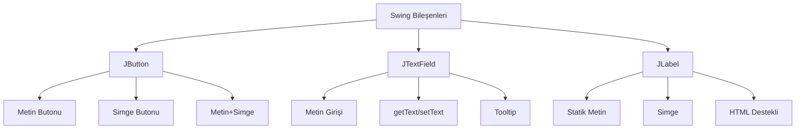
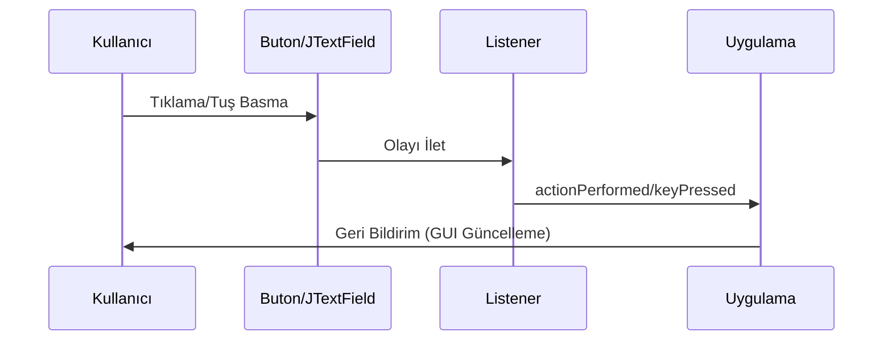
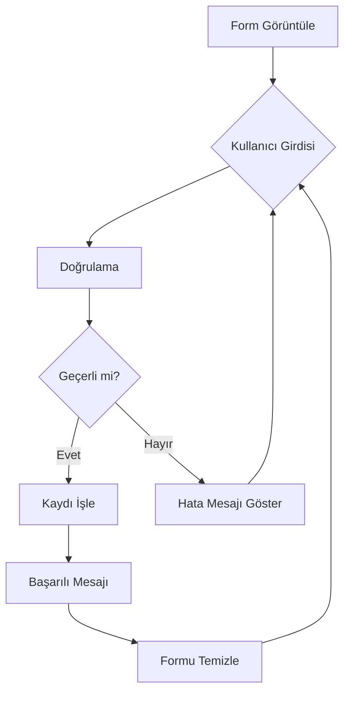

# Bölüm 20: Temel Swing Bilesenleri, Olay Yonetimi ve Form Dogrulama


---
title: "Temel Swing Bileşenleri, Olay Yönetimi ve Form Doğrulama"
subtitle: "Java ile Grafik Arayüz Geliştirmeye Giriş"
author: "Teknik Kitap Yazarı"
date: "2025-01-21"
lang: "tr"
keywords: [Swing, JButton, JTextField, JLabel, ActionListener, KeyListener, form doğrulama, Java GUI]
abstract: |
  Bu bölümde, Java Swing kütüphanesinin temel bileşenleri olan JButton, JTextField ve JLabel'i öğrenecek, olay yönetimi için ActionListener ve KeyListener arayüzlerini kullanmayı keşfedeceksiniz. Ayrıca, form doğrulama teknikleriyle kullanıcı girdilerini nasıl işleyeceğinizi ve bir kayıt formu uygulaması geliştireceksiniz.
---

## 20.1 Giriş

Java Swing, platform bağımsız grafik kullanıcı arayüzü (GUI) uygulamaları geliştirmek için güçlü bir araç setidir. Bu bölümde, Swing'in en yaygın kullanılan bileşenlerini tanıyacak ve olay tabanlı programlama ile form doğrulama tekniklerini öğreneceksiniz. Amaç, kullanıcı etkileşimlerini yönetebilen ve girdileri güvenilir bir şekilde işleyen bir uygulama yapabilmektir.

> 🎯 **Hedefler:**
> - JButton, JTextField ve JLabel bileşenlerini oluşturma ve özelleştirme
> - ActionListener ve KeyListener ile olay yönetimi
> - Form doğrulama kuralları uygulama
> - Kullanıcı girdisini işleme ve saklama

**Ön Koşullar:** Bu bölümü anlamak için temel Java bilgisi (sınıflar, metotlar, arayüzler) ve bir IDE (IntelliJ IDEA veya Eclipse) kullanma deneyimi gereklidir.

---

## 20.2 Temel Swing Bileşenleri

Swing bileşenleri, javax.swing paketinde yer alır ve AWT'nin üzerine inşa edilmiştir. Bu bölümde, en temel üç bileşeni inceleyeceğiz.

### JButton

JButton, kullanıcının tıklayarak eylem başlattığı bir düğmedir. Farklı yapıcılar ile metin, simge veya her ikisini birden içerebilir.

<!-- CODE_META
id: bolum-20_kod01
chapter_id: bolum-20
kind: example
title: "Kod 1"
file: "Ornek00.java"
mainClass: Ornek00
extract: true
test: compile
github: true
qr: dual
-->

```java
// JButtonExample.java
import javax.swing.*;

public class JButtonExample {
    public static void main(String[] args) {
        JFrame frame = new JFrame("Buton Örneği");
        frame.setDefaultCloseOperation(JFrame.EXIT_ON_CLOSE);
        frame.setSize(300, 200);

        // Metin butonu
        JButton button1 = new JButton("Tıkla");
        
        // Simge butonu
        ImageIcon icon = new ImageIcon("icon.png");
        JButton button2 = new JButton(icon);
        
        // Metin ve simge butonu
        JButton button3 = new JButton("Kaydet", icon);

        frame.setLayout(new java.awt.FlowLayout());
        frame.add(button1);
        frame.add(button2);
        frame.add(button3);

        frame.setVisible(true);
    }
}
```

<!-- CODE_META language=java file=JButtonExample.java -->

Butonlar üzerinde tooltip (araç ipucu) eklemek için `setToolTipText()` metodu kullanılır:

<!-- CODE_META
id: bolum-20_kod02
chapter_id: bolum-20
kind: example
title: "Kod 2"
file: "Ornek01.java"
mainClass: Ornek01
extract: true
test: compile
github: true
qr: dual
-->

```java
button1.setToolTipText("Bu butona tıklayarak işlemi başlatın.");
```

<!-- CODE_META language=java -->

### JTextField

JTextField, kullanıcının tek satırlık metin girmesini sağlayan bir bileşendir. Metin almak ve ayarlamak için `getText()` ve `setText()` metotları kullanılır.

<!-- CODE_META
id: bolum-20_kod03
chapter_id: bolum-20
kind: example
title: "Kod 3"
file: "Ornek02.java"
mainClass: Ornek02
extract: true
test: compile
github: true
qr: dual
-->

```java
// JTextFieldExample.java
import javax.swing.*;

public class JTextFieldExample {
    public static void main(String[] args) {
        JFrame frame = new JFrame("Metin Alanı Örneği");
        frame.setDefaultCloseOperation(JFrame.EXIT_ON_CLOSE);
        frame.setSize(400, 200);

        JTextField textField = new JTextField(20); // 20 karakter genişliğinde
        textField.setToolTipText("Adınızı giriniz");
        
        // Varsayılan metin (placeholder benzeri)
        textField.setText("Adınızı girin...");
        
        // Metin alanına odaklandığında içeriği temizleme
        textField.addFocusListener(new java.awt.event.FocusAdapter() {
            @Override
            public void focusGained(java.awt.event.FocusEvent e) {
                if (textField.getText().equals("Adınızı girin...")) {
                    textField.setText("");
                }
            }
        });

        frame.setLayout(new java.awt.FlowLayout());
        frame.add(new JLabel("Ad:"));
        frame.add(textField);

        frame.setVisible(true);
    }
}
```

<!-- CODE_META language=java file=JTextFieldExample.java -->

### JLabel

JLabel, genellikle başka bileşenleri etiketlemek için kullanılan statik metin veya simge gösteren bir bileşendir. HTML desteği sayesinde zengin metin içeriği de gösterebilir.

<!-- CODE_META
id: bolum-20_kod04
chapter_id: bolum-20
kind: example
title: "Kod 4"
file: "Ornek03.java"
mainClass: Ornek03
extract: true
test: compile
github: true
qr: dual
-->

```java
// JLabelExample.java
import javax.swing.*;

public class JLabelExample {
    public static void main(String[] args) {
        JFrame frame = new JFrame("Etiket Örneği");
        frame.setDefaultCloseOperation(JFrame.EXIT_ON_CLOSE);
        frame.setSize(400, 300);

        // Basit metin etiketi
        JLabel label1 = new JLabel("Hoş Geldiniz!");
        
        // Simge etiketi
        ImageIcon icon = new ImageIcon("user.png");
        JLabel label2 = new JLabel(icon);
        
        // HTML destekli etiket
        JLabel label3 = new JLabel("<html><b>Kalın</b> ve <i>italik</i> metin</html>");
        
        // Hizalama ayarları
        label1.setHorizontalAlignment(SwingConstants.CENTER);
        label1.setVerticalAlignment(SwingConstants.CENTER);

        frame.setLayout(new java.awt.FlowLayout());
        frame.add(label1);
        frame.add(label2);
        frame.add(label3);

        frame.setVisible(true);
    }
}
```

<!-- CODE_META language=java file=JLabelExample.java -->



---

## 20.3 Olay Yönetimi

Olay tabanlı programlama, kullanıcı eylemlerine (tıklama, tuşa basma vb.) yanıt vermek için kullanılır. Swing'de olay dinleyicileri (listeners) arayüzler aracılığıyla uygulanır.

### ActionListener ile Buton Olayları

ActionListener, buton tıklamaları gibi eylemleri yakalamak için kullanılır. `actionPerformed` metodu, olay gerçekleştiğinde çağrılır.

**Geleneksel Yöntem:**

<!-- CODE_META
id: bolum-20_kod05
chapter_id: bolum-20
kind: example
title: "Kod 5"
file: "Ornek04.java"
mainClass: Ornek04
extract: true
test: compile
github: true
qr: dual
-->

```java
// ButtonActionExample.java
import javax.swing.*;
import java.awt.event.ActionEvent;
import java.awt.event.ActionListener;

public class ButtonActionExample {
    public static void main(String[] args) {
        JFrame frame = new JFrame("ActionListener Örneği");
        frame.setDefaultCloseOperation(JFrame.EXIT_ON_CLOSE);
        frame.setSize(300, 200);

        JButton button = new JButton("Tıkla");
        JLabel label = new JLabel("Butona tıklanmadı");

        button.addActionListener(new ActionListener() {
            @Override
            public void actionPerformed(ActionEvent e) {
                label.setText("Butona tıklandı!");
            }
        });

        frame.setLayout(new java.awt.FlowLayout());
        frame.add(button);
        frame.add(label);

        frame.setVisible(true);
    }
}
```

<!-- CODE_META language=java file=ButtonActionExample.java -->

**Lambda İfadesi ile (Java 8+):**

<!-- CODE_META
id: bolum-20_kod06
chapter_id: bolum-20
kind: example
title: "Kod 6"
file: "Ornek05.java"
mainClass: Ornek05
extract: true
test: compile
github: true
qr: dual
-->

```java
button.addActionListener(e -> label.setText("Lambda ile tıklandı!"));
```

<!-- CODE_META language=java -->

### KeyListener ile Klavye Olayları

KeyListener, klavye tuşlarına basma, bırakma ve yazma olaylarını yakalar. Üç metodu vardır:

- `keyPressed(KeyEvent e)`: Tuşa basıldığında
- `keyReleased(KeyEvent e)`: Tuş bırakıldığında
- `keyTyped(KeyEvent e)`: Bir karakter üretildiğinde (Unicode karakterler)

<!-- CODE_META
id: bolum-20_kod07
chapter_id: bolum-20
kind: example
title: "Kod 7"
file: "Ornek06.java"
mainClass: Ornek06
extract: true
test: compile
github: true
qr: dual
-->

```java
// KeyListenerExample.java
import javax.swing.*;
import java.awt.event.KeyEvent;
import java.awt.event.KeyListener;

public class KeyListenerExample {
    public static void main(String[] args) {
        JFrame frame = new JFrame("KeyListener Örneği");
        frame.setDefaultCloseOperation(JFrame.EXIT_ON_CLOSE);
        frame.setSize(400, 200);

        JTextField textField = new JTextField(20);
        JLabel label = new JLabel("Bir tuşa basın");

        textField.addKeyListener(new KeyListener() {
            @Override
            public void keyPressed(KeyEvent e) {
                int keyCode = e.getKeyCode();
                label.setText("Basılan tuş kodu: " + keyCode);
                
                // Enter tuşu kontrolü
                if (keyCode == KeyEvent.VK_ENTER) {
                    label.setText("Enter tuşuna basıldı!");
                }
            }

            @Override
            public void keyReleased(KeyEvent e) {
                // Tuş bırakıldığında yapılacak işlemler
            }

            @Override
            public void keyTyped(KeyEvent e) {
                char keyChar = e.getKeyChar();
                // Sadece harf girişine izin ver
                if (!Character.isLetter(keyChar)) {
                    e.consume(); // Karakteri iptal et
                }
            }
        });

        frame.setLayout(new java.awt.FlowLayout());
        frame.add(textField);
        frame.add(label);

        frame.setVisible(true);
    }
}
```

<!-- CODE_META language=java file=KeyListenerExample.java -->

> 💡 **İpucu:** Tuş kombinasyonlarını yakalamak için `KeyEvent` sınıfındaki sabitleri kullanabilirsiniz. Örneğin, `e.isControlDown() && e.getKeyCode() == KeyEvent.VK_S` ile Ctrl+S kombinasyonunu yakalayabilirsiniz.



---

## 20.4 Form Doğrulama

Form doğrulama, kullanıcı girdilerinin belirli kurallara uygunluğunu kontrol etme işlemidir. Bu, uygulamanın güvenilirliği ve kullanıcı deneyimi için kritiktir.

### Doğrulama Kuralları

**Boş Alan Kontrolü:**

<!-- CODE_META
id: bolum-20_kod08
chapter_id: bolum-20
kind: example
title: "Kod 8"
file: "Ornek07.java"
mainClass: Ornek07
extract: true
test: compile
github: true
qr: dual
-->

```java
if (textField.getText().trim().isEmpty()) {
    // Hata mesajı göster
    JOptionPane.showMessageDialog(frame, "Bu alan boş bırakılamaz!", "Hata", JOptionPane.ERROR_MESSAGE);
}
```

<!-- CODE_META language=java -->

**Uzunluk Kontrolü:**

<!-- CODE_META
id: bolum-20_kod09
chapter_id: bolum-20
kind: example
title: "Kod 9"
file: "Ornek08.java"
mainClass: Ornek08
extract: true
test: compile
github: true
qr: dual
-->

```java
String input = textField.getText();
if (input.length() < 3 || input.length() > 20) {
    // Hata mesajı
}
```

<!-- CODE_META language=java -->

**E-posta Formatı Kontrolü (Basit Regex):**

<!-- CODE_META
id: bolum-20_kod10
chapter_id: bolum-20
kind: example
title: "Kod 10"
file: "Ornek09.java"
mainClass: Ornek09
extract: true
test: compile
github: true
qr: dual
-->

```java
String email = emailField.getText();
String emailRegex = "^[a-zA-Z0-9._%+-]+@[a-zA-Z0-9.-]+\\.[a-zA-Z]{2,6}$";
if (!email.matches(emailRegex)) {
    JOptionPane.showMessageDialog(frame, "Geçerli bir e-posta adresi giriniz!", "Hata", JOptionPane.ERROR_MESSAGE);
}
```

<!-- CODE_META language=java -->

### Doğrulama Geri Bildirimi

Kullanıcıya hata mesajları göstermek için çeşitli yöntemler vardır:

1. **JOptionPane ile Dialog Kutusu:**
<!-- CODE_META
id: bolum-20_kod11
chapter_id: bolum-20
kind: example
title: "Kod 11"
file: "Ornek10.java"
mainClass: Ornek10
extract: true
test: compile
github: true
qr: dual
-->

```java
JOptionPane.showMessageDialog(frame, "Hata mesajı", "Başlık", JOptionPane.ERROR_MESSAGE);
```

2. **Renk Değişikliği:**
<!-- CODE_META
id: bolum-20_kod12
chapter_id: bolum-20
kind: example
title: "Kod 12"
file: "Ornek11.java"
mainClass: Ornek11
extract: true
test: compile
github: true
qr: dual
-->

```java
textField.setBackground(Color.RED);
textField.setForeground(Color.WHITE);
```

3. **Etiket ile Hata Mesajı:**
<!-- CODE_META
id: bolum-20_kod13
chapter_id: bolum-20
kind: example
title: "Kod 13"
file: "Ornek12.java"
mainClass: Ornek12
extract: true
test: compile
github: true
qr: dual
-->

```java
errorLabel.setText("Geçersiz giriş!");
errorLabel.setForeground(Color.RED);
```

<!-- CODE_META language=java -->

---

## 20.5 Kullanıcı Girdisi İşleme

Kullanıcıdan alınan girdileri işlemek, doğrulamak ve saklamak uygulamanın temel işlevlerindendir.

### Sayısal Girdi Doğrulama

<!-- CODE_META
id: bolum-20_kod14
chapter_id: bolum-20
kind: example
title: "Kod 14"
file: "Ornek13.java"
mainClass: Ornek13
extract: true
test: compile
github: true
qr: dual
-->

```java
// NumberInputExample.java
import javax.swing.*;

public class NumberInputExample {
    public static void main(String[] args) {
        JFrame frame = new JFrame("Sayısal Girdi");
        frame.setDefaultCloseOperation(JFrame.EXIT_ON_CLOSE);
        frame.setSize(300, 200);

        JTextField textField = new JTextField(10);
        JButton button = new JButton("Kontrol Et");
        JLabel resultLabel = new JLabel("");

        button.addActionListener(e -> {
            String input = textField.getText().trim();
            try {
                int number = Integer.parseInt(input);
                if (number > 0 && number < 100) {
                    resultLabel.setText("Geçerli sayı: " + number);
                } else {
                    resultLabel.setText("1-99 arası bir sayı giriniz!");
                }
            } catch (NumberFormatException ex) {
                resultLabel.setText("Lütfen geçerli bir sayı giriniz!");
            }
        });

        frame.setLayout(new java.awt.FlowLayout());
        frame.add(textField);
        frame.add(button);
        frame.add(resultLabel);

        frame.setVisible(true);
    }
}
```

<!-- CODE_META language=java file=NumberInputExample.java -->

### Metin Girdisini İşleme

<!-- CODE_META
id: bolum-20_kod15
chapter_id: bolum-20
kind: example
title: "Kod 15"
file: "Ornek14.java"
mainClass: Ornek14
extract: true
test: compile
github: true
qr: dual
-->

```java
// TextProcessingExample.java
import javax.swing.*;

public class TextProcessingExample {
    public static void main(String[] args) {
        JFrame frame = new JFrame("Metin İşleme");
        frame.setDefaultCloseOperation(JFrame.EXIT_ON_CLOSE);
        frame.setSize(400, 300);

        JTextField inputField = new JTextField(20);
        JButton processButton = new JButton("İşle");
        JTextArea outputArea = new JTextArea(10, 30);
        outputArea.setEditable(false);

        processButton.addActionListener(e -> {
            String input = inputField.getText().trim();
            if (!input.isEmpty()) {
                // Metni büyük harfe çevir ve ters çevir
                String processed = new StringBuilder(input.toUpperCase()).reverse().toString();
                outputArea.setText("Orijinal: " + input + "\nİşlenmiş: " + processed);
            } else {
                outputArea.setText("Lütfen bir metin giriniz!");
            }
        });

        frame.setLayout(new java.awt.FlowLayout());
        frame.add(inputField);
        frame.add(processButton);
        frame.add(new JScrollPane(outputArea));

        frame.setVisible(true);
    }
}
```

<!-- CODE_META language=java file=TextProcessingExample.java -->

---

## 20.6 Örnek Uygulama: Kullanıcı Kayıt Formu

Bu örnekte, öğrendiğimiz tüm kavramları birleştirerek eksiksiz bir kayıt formu oluşturacağız.

<!-- CODE_META
id: bolum-20_kod16
chapter_id: bolum-20
kind: example
title: "Kod 16"
file: "Ornek15.java"
mainClass: Ornek15
extract: true
test: compile
github: true
qr: dual
-->

```java
// RegistrationForm.java
import javax.swing.*;
import java.awt.*;
import java.awt.event.ActionEvent;
import java.awt.event.ActionListener;
import java.util.HashMap;
import java.util.Map;

public class RegistrationForm extends JFrame {
    private JTextField nameField, emailField, ageField;
    private JPasswordField passwordField;
    private JLabel nameError, emailError, ageError, passwordError;
    private JTextArea outputArea;
    private Map<String, String> users = new HashMap<>();

    public RegistrationForm() {
        setTitle("Kullanıcı Kayıt Formu");
        setDefaultCloseOperation(JFrame.EXIT_ON_CLOSE);
        setSize(500, 400);
        setLayout(new BorderLayout(10, 10));

        // Form paneli
        JPanel formPanel = new JPanel(new GridBagLayout());
        GridBagConstraints gbc = new GridBagConstraints();
        gbc.insets = new Insets(5, 5, 5, 5);
        gbc.fill = GridBagConstraints.HORIZONTAL;

        // Ad alanı
        gbc.gridx = 0; gbc.gridy = 0;
        formPanel.add(new JLabel("Ad:"), gbc);
        gbc.gridx = 1;
        nameField = new JTextField(15);
        formPanel.add(nameField, gbc);
        gbc.gridx = 2;
        nameError = new JLabel("");
        nameError.setForeground(Color.RED);
        formPanel.add(nameError, gbc);

        // E-posta alanı
        gbc.gridx = 0; gbc.gridy = 1;
        formPanel.add(new JLabel("E-posta:"), gbc);
        gbc.gridx = 1;
        emailField = new JTextField(15);
        formPanel.add(emailField, gbc);
        gbc.gridx = 2;
        emailError = new JLabel("");
        emailError.setForeground(Color.RED);
        formPanel.add(emailError, gbc);

        // Yaş alanı
        gbc.gridx = 0; gbc.gridy = 2;
        formPanel.add(new JLabel("Yaş:"), gbc);
        gbc.gridx = 1;
        ageField = new JTextField(15);
        formPanel.add(ageField, gbc);
        gbc.gridx = 2;
        ageError = new JLabel("");
        ageError.setForeground(Color.RED);
        formPanel.add(ageError, gbc);

        // Şifre alanı
        gbc.gridx = 0; gbc.gridy = 3;
        formPanel.add(new JLabel("Şifre:"), gbc);
        gbc.gridx = 1;
        passwordField = new JPasswordField(15);
        formPanel.add(passwordField, gbc);
        gbc.gridx = 2;
        passwordError = new JLabel("");
        passwordError.setForeground(Color.RED);
        formPanel.add(passwordError, gbc);

        // Butonlar
        JPanel buttonPanel = new JPanel(new FlowLayout());
        JButton registerButton = new JButton("Kaydol");
        JButton clearButton = new JButton("Temizle");

        registerButton.addActionListener(new ActionListener() {
            @Override
            public void actionPerformed(ActionEvent e) {
                if (validateForm()) {
                    registerUser();
                }
            }
        });

        clearButton.addActionListener(e -> clearForm());

        buttonPanel.add(registerButton);
        buttonPanel.add(clearButton);

        // Çıktı alanı
        outputArea = new JTextArea(10, 40);
        outputArea.setEditable(false);
        JScrollPane scrollPane = new JScrollPane(outputArea);

        add(formPanel, BorderLayout.CENTER);
        add(buttonPanel, BorderLayout.SOUTH);
        add(scrollPane, BorderLayout.EAST);

        setVisible(true);
    }

    private boolean validateForm() {
        boolean isValid = true;

        // Ad doğrulama
        String name = nameField.getText().trim();
        if (name.isEmpty()) {
            nameError.setText("Ad boş olamaz!");
            isValid = false;
        } else if (name.length() < 2) {
            nameError.setText("En az 2 karakter!");
            isValid = false;
        } else {
            nameError.setText("");
        }

        // E-posta doğrulama
        String email = emailField.getText().trim();
        String emailRegex = "^[a-zA-Z0-9._%+-]+@[a-zA-Z0-9.-]+\\.[a-zA-Z]{2,6}$";
        if (email.isEmpty()) {
            emailError.setText("E-posta boş olamaz!");
            isValid = false;
        } else if (!email.matches(emailRegex)) {
            emailError.setText("Geçersiz e-posta!");
            isValid = false;
        } else {
            emailError.setText("");
        }

        // Yaş doğrulama
        String ageText = ageField.getText().trim();
        if (ageText.isEmpty()) {
            ageError.setText("Yaş boş olamaz!");
            isValid = false;
        } else {
            try {
                int age = Integer.parseInt(ageText);
                if (age < 18 || age > 120) {
                    ageError.setText("18-120 arası olmalı!");
                    isValid = false;
                } else {
                    ageError.setText("");
                }
            } catch (NumberFormatException ex) {
                ageError.setText("Sayı giriniz!");
                isValid = false;
            }
        }

        // Şifre doğrulama
        String password = new String(passwordField.getPassword());
        if (password.isEmpty()) {
            passwordError.setText("Şifre boş olamaz!");
            isValid = false;
        } else if (password.length() < 6) {
            passwordError.setText("En az 6 karakter!");
            isValid = false;
        } else {
            passwordError.setText("");
        }

        return isValid;
    }

    private void registerUser() {
        String name = nameField.getText().trim();
        String email = emailField.getText().trim();
        String age = ageField.getText().trim();
        String password = new String(passwordField.getPassword());

        // Kullanıcıyı sakla
        users.put(email, name + " - " + age + " - " + password);

        // Çıktıyı güncelle
        StringBuilder output = new StringBuilder("Kayıtlı Kullanıcılar:\n");
        output.append("=".repeat(30)).append("\n");
        for (Map.Entry<String, String> entry : users.entrySet()) {
            output.append("E-posta: ").append(entry.getKey()).append("\n");
            output.append("Bilgiler: ").append(entry.getValue()).append("\n");
            output.append("-".repeat(30)).append("\n");
        }
        outputArea.setText(output.toString());

        JOptionPane.showMessageDialog(this, "Kayıt başarıyla tamamlandı!", "Başarılı", JOptionPane.INFORMATION_MESSAGE);
        clearForm();
    }

    private void clearForm() {
        nameField.setText("");
        emailField.setText("");
        ageField.setText("");
        passwordField.setText("");
        nameError.setText("");
        emailError.setText("");
        ageError.setText("");
        passwordError.setText("");
    }

    public static void main(String[] args) {
        SwingUtilities.invokeLater(() -> new RegistrationForm());
    }
}
```

<!-- CODE_META language=java file=RegistrationForm.java -->



---

## 20.7 Özet

Bu bölümde şunları öğrendiniz:

- **JButton**: Buton oluşturma, metin/simge ekleme ve tooltip kullanımı
- **JTextField**: Metin giriş alanı oluşturma, metin alma ve ayarlama
- **JLabel**: Etiket oluşturma, HTML desteği ve hizalama
- **ActionListener**: Buton tıklama olaylarını yakalama
- **KeyListener**: Klavye olaylarını yakalama ve kontrol etme
- **Form Doğrulama**: Boş alan, uzunluk, format ve sayısal doğrulama
- **Kullanıcı Girdisi İşleme**: Girdiyi okuma, dönüştürme ve saklama

---

## 20.8 Terim Sözlüğü

| Terim | Açıklama |
|-------|----------|
| **Swing** | Java'nın GUI kütüphanesi |
| **JButton** | Tıklanabilir düğme bileşeni |
| **JTextField** | Tek satırlık metin giriş alanı |
| **JLabel** | Statik metin veya simge gösteren etiket |
| **ActionListener** | Eylem olaylarını dinleyen arayüz |
| **KeyListener** | Klavye olaylarını dinleyen arayüz |
| **Event** | Kullanıcı eylemi sonucu oluşan olay |
| **Listener** | Olayları dinleyen ve işleyen nesne |
| **Form Doğrulama** | Kullanıcı girdilerinin kurallara uygunluğunu kontrol etme |
| **Regex** | Düzenli ifade (Regular Expression) |

---

## 20.9 Sorular

1. JButton'a tıklama olayını yakalamak için hangi arayüz kullanılır?
2. JTextField'ten metin almak için hangi metot kullanılır?
3. KeyListener arayüzünün üç metodu nedir?
4. Bir metin alanının boş olup olmadığını nasıl kontrol edersiniz?
5. E-posta doğrulaması için hangi Java sınıfı kullanılabilir?
6. Lambda ifadesi ile ActionListener nasıl yazılır?
7. JLabel'de HTML kullanmanın avantajı nedir?
8. Form doğrulamada hata mesajı göstermenin üç farklı yöntemi nedir?

---

## 20.10 Alıştırmalar

1. **Basit Hesap Makinesi**: İki JTextField ve dört JButton (+, -, *, /) içeren bir hesap makinesi yapın. ActionListener ile işlemleri gerçekleştirin.

2. **Şifre Gücü Kontrolü**: Bir JPasswordField ve JButton ekleyin. Butona tıklandığında şifrenin gücünü (zayıf, orta, güçlü) JLabel'de gösterin. (En az 8 karakter, büyük/küçük harf, rakam ve özel karakter kontrolü)

3. **Alışveriş Listesi**: JTextField, JButton ve JList kullanarak bir alışveriş listesi uygulaması yapın. Kullanıcı metin girer ve "Ekle" butonuna basar; öğeler listeye eklenir.

4. **Telefon Numarası Formatı**: JTextField'a sadece rakam girişine izin veren bir KeyListener ekleyin. Girdi otomatik olarak (XXX) XXX-XXXX formatına dönüştürülsün.

5. **Gelişmiş Kayıt Formu**: Örnek uygulamayı genişletin. Şifre tekrar alanı, cinsiyet seçimi (JRadioButton) ve ülke seçimi (JComboBox) ekleyin. Tüm alanları doğrulayın.