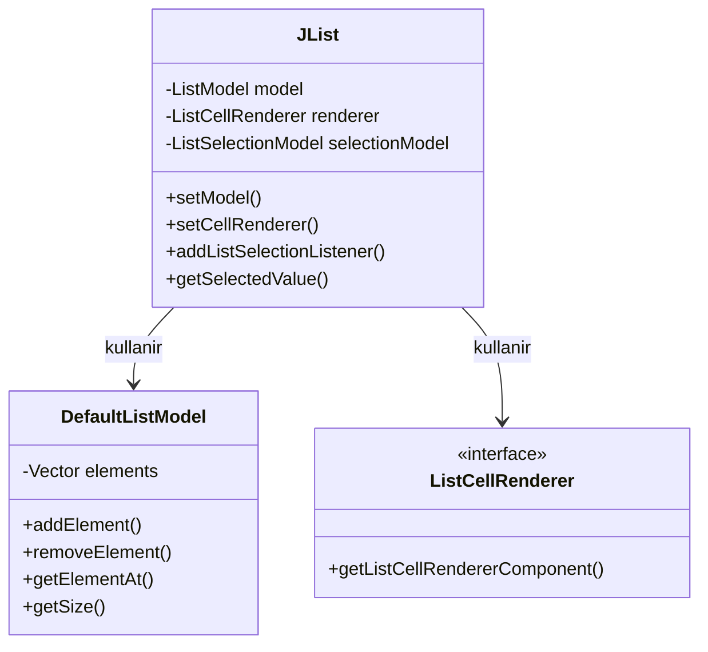
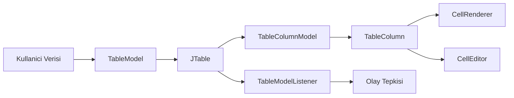
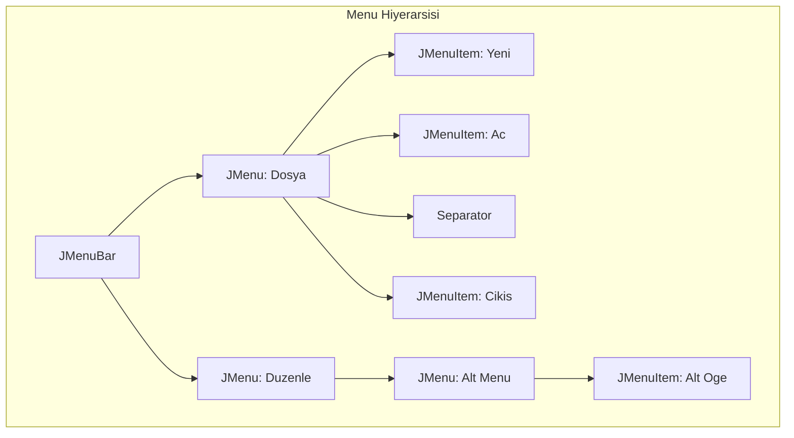
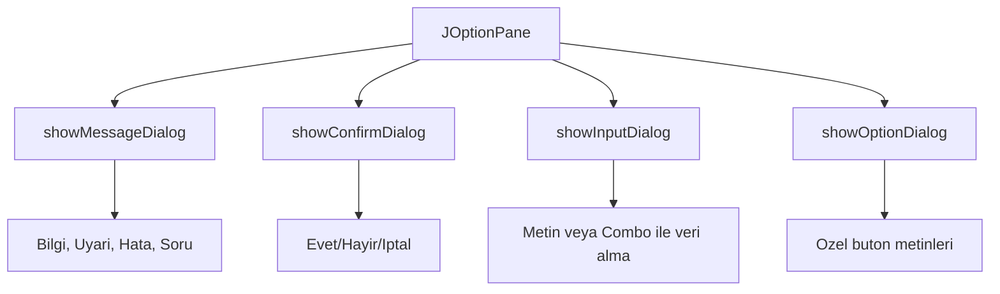

```yaml
---
title: "Liste, Tablo, Menu ve Diyaloglarla GUI Veri Sunumu"
subtitle: "Java Swing ile Veri Gosterim Bilesenleri"
author: "Teknik Kitap Yazari"
date: "2024"
lang: "tr"
subject: "Java GUI Programlama"
keywords: [JList, JTable, JMenuBar, JDialog, JOptionPane, Swing, Java]
abstract: |
  Bu bolumde, Java Swing kutuphanesindeki veri sunumu icin kullanilan temel bilesenler
  detayli olarak incelenmektedir. JList, JTable, JMenuBar, JDialog ve JOptionPane
  siniflari ile liste, tablo, menu ve diyalog tabanli veri gosterimi ogretilmektedir.
  Ayrica JTree ve JTextPane gibi ileri duzey bilesenler de ele alinmaktadir.
---

# Bölüm 21: Liste, Tablo, Menu ve Diyaloglarla GUI Veri Sunumu

Grafiksel kullanici arayuzu (GUI) uygulamalarinda verinin etkili bir sekilde sunulmasi, kullanici deneyimini dogrudan etkileyen kritik bir faktordur. Kullanicilarin veriyi hizli ve anlasilir bir sekilde gormesi, duzenlemesi ve yonetmesi gerekir. Java Swing, bu amaca yonelik olarak **JList**, **JTable**, **JMenuBar**, **JDialog** ve **JOptionPane** gibi guclu bilesenler sunar.

Bu bolumde, bu bilesenlerin her birini detayli bir sekilde inceleyecek, nasil kullanilacagini ve ozellestirilecegini ogreneceksiniz. Ayrica, veri goruntuleme icin kullanilan **JTree** ve **JTextPane** gibi diger bilesenlere de deginecegiz.

> [!NOTE]
> Bu bolumdeki tum kod ornekleri Java 11 veya uzeri surumlerle uyumludur. Swing kutuphanesi, Java SE'nin bir parcasi oldugu icin harici bir kutuphane kurulumu gerektirmez.

Bolumun sonunda, ogrendiginiz tum bilesenleri kullanarak tam bir veri yonetim araci gelistireceksiniz.

---

## 21.1 JList ile Liste Verisi Sunumu

**JList**, bir dizi veri ogresini dikey veya yatay olarak gosteren temel bir Swing bilesenidir. Kullanicilar listeden bir veya birden fazla ogre secimi yapabilir.

## 21.2 Temel JList Kullanimi

JList olusturmak icin bir veri modeli gerekir. En basit haliyle, bir dizi veya Vector kullanarak liste olusturabiliriz.

<!-- CODE_META: BasicListExample.java, JList temel kullanimi -->
```java
import javax.swing.*;
import java.awt.*;

public class BasicListExample {
    public static void main(String[] args) {
        JFrame frame = new JFrame("Basit Liste Ornegi");
        frame.setDefaultCloseOperation(JFrame.EXIT_ON_CLOSE);
        frame.setSize(300, 200);
        frame.setLayout(new FlowLayout());

        // Statik veri ile JList olusturma
        String[] items = {"Elma", "Armut", "Muz", "Cilek", "Portakal"};
        JList<String> fruitList = new JList<>(items);
        fruitList.setVisibleRowCount(4); // Gosterilecek satir sayisi

        // ScrollPanel icinde gosterme
        JScrollPane scrollPane = new JScrollPane(fruitList);
        frame.add(scrollPane);

        frame.setVisible(true);
    }
}
```

> [!TIP]
> JList'i dogrudan frame'e eklemek yerine her zaman **JScrollPane** icinde kullanin. Aksi takdirde liste ogeleri uzunsa kaydirma mumkun olmaz.

## 21.3 DefaultListModel ile Dinamik Liste Yonetimi

Statik veri icin basit bir dizi yeterli olsa da, dinamik olarak eleman ekleme/silme gerektiginde **DefaultListModel** kullanmaliyiz.

<!-- CODE_META: DynamicListExample.java, DefaultListModel kullanimi -->
```java
import javax.swing.*;
import java.awt.*;
import java.awt.event.ActionEvent;
import java.awt.event.ActionListener;

public class DynamicListExample {
    public static void main(String[] args) {
        JFrame frame = new JFrame("Dinamik Liste Ornegi");
        frame.setDefaultCloseOperation(JFrame.EXIT_ON_CLOSE);
        frame.setSize(400, 300);
        frame.setLayout(new BorderLayout());

        DefaultListModel<String> model = new DefaultListModel<>();
        model.addElement("Java");
        model.addElement("Python");
        model.addElement("C++");

        JList<String> languageList = new JList<>(model);
        JScrollPane scrollPane = new JScrollPane(languageList);

        // Ekleme paneli
        JPanel inputPanel = new JPanel(new FlowLayout());
        JTextField textField = new JTextField(15);
        JButton addButton = new JButton("Ekle");
        JButton removeButton = new JButton("Sil");

        addButton.addActionListener(e -> {
            String text = textField.getText().trim();
            if (!text.isEmpty()) {
                model.addElement(text);
                textField.setText("");
            }
        });

        removeButton.addActionListener(e -> {
            int selectedIndex = languageList.getSelectedIndex();
            if (selectedIndex != -1) {
                model.remove(selectedIndex);
            }
        });

        inputPanel.add(textField);
        inputPanel.add(addButton);
        inputPanel.add(removeButton);

        frame.add(scrollPane, BorderLayout.CENTER);
        frame.add(inputPanel, BorderLayout.SOUTH);

        frame.setVisible(true);
    }
}
```

## 21.4 ListSelectionListener ile Secim Olaylari

Kullanicinin listeden bir ogre sectiginde buna tepki vermek icin **ListSelectionListener** kullanilir.

<!-- CODE_META: SelectionListenerExample.java, ListSelectionListener kullanimi -->
```java
import javax.swing.*;
import javax.swing.event.ListSelectionEvent;
import javax.swing.event.ListSelectionListener;
import java.awt.*;

public class SelectionListenerExample {
    public static void main(String[] args) {
        JFrame frame = new JFrame("ListSelectionListener Ornegi");
        frame.setDefaultCloseOperation(JFrame.EXIT_ON_CLOSE);
        frame.setSize(400, 300);
        frame.setLayout(new BorderLayout());

        String[] cities = {"Istanbul", "Ankara", "Izmir", "Bursa", "Antalya"};
        JList<String> cityList = new JList<>(cities);
        JLabel selectionLabel = new JLabel("Secili sehir: ");

        cityList.addListSelectionListener(e -> {
            if (!e.getValueIsAdjusting()) { // Cift tetiklemeyi onle
                String selected = cityList.getSelectedValue();
                selectionLabel.setText("Secili sehir: " + (selected != null ? selected : "yok"));
            }
        });

        JScrollPane scrollPane = new JScrollPane(cityList);
        frame.add(scrollPane, BorderLayout.CENTER);
        frame.add(selectionLabel, BorderLayout.SOUTH);

        frame.setVisible(true);
    }
}
```

> [!WARNING]
> `getValueIsAdjusting()` kontrolu yapilmazsa, secim degisikligi olayi iki kez tetiklenebilir (fare basildiginda ve birakildiginda).

## 21.5 Ozellestirilmis Hucre Renderer (ListCellRenderer)

Varsayilan olarak JList, ogeleri `toString()` metoduyla gosterir. Ancak, ozel bir gorunum istiyorsaniz (ornegin, bir resim ve metin birlikte), **ListCellRenderer** arayuzunu uygulayarak kendi renderer'inizi yazabilirsiniz.

<!-- CODE_META: CustomRendererExample.java, ListCellRenderer kullanimi -->
```java
import javax.swing.*;
import java.awt.*;

class CustomListRenderer extends JLabel implements ListCellRenderer<String> {
    public CustomListRenderer() {
        setOpaque(true);
        setHorizontalAlignment(CENTER);
        setFont(new Font("Arial", Font.BOLD, 14));
    }

    @Override
    public Component getListCellRendererComponent(JList<? extends String> list,
                                                  String value, int index,
                                                  boolean isSelected, boolean cellHasFocus) {
        setText(value);
        
        // Secili durumda arka plan rengini degistir
        if (isSelected) {
            setBackground(Color.BLUE);
            setForeground(Color.WHITE);
        } else {
            setBackground(Color.WHITE);
            setForeground(Color.BLACK);
        }
        
        // Cift sayili indeksleri farkli renk yap
        if (index % 2 == 0 && !isSelected) {
            setBackground(new Color(230, 230, 250)); // Acik mor
        }
        
        return this;
    }
}

public class CustomRendererExample {
    public static void main(String[] args) {
        JFrame frame = new JFrame("Custom ListCellRenderer Ornegi");
        frame.setDefaultCloseOperation(JFrame.EXIT_ON_CLOSE);
        frame.setSize(300, 250);

        String[] items = {"Birinci", "Ikinci", "Ucuncu", "Dorduncu", "Besinci"};
        JList<String> list = new JList<>(items);
        list.setCellRenderer(new CustomListRenderer());

        frame.add(new JScrollPane(list));
        frame.setVisible(true);
    }
}
```



---

## 21.6 JTable ile Tablo Verisi Sunumu

**JTable**, tablo seklinde veri sunmak icin en guclu Swing bilesenidir. Satir ve sutunlardan olusan bir yapiya sahiptir.

## 21.7 JTable ve TableModel Mimarisi

JTable, Model-View-Controller (MVC) mimarisini kullanir. **TableModel** arayuzu, tablonun veri kaynagini temsil eder. **DefaultTableModel**, bu arayuzun hazir bir uygulamasidir.

<!-- CODE_META: BasicTableExample.java, JTable temel kullanimi -->
```java
import javax.swing.*;
import javax.swing.table.DefaultTableModel;
import java.awt.*;

public class BasicTableExample {
    public static void main(String[] args) {
        JFrame frame = new JFrame("Basit Tablo Ornegi");
        frame.setDefaultCloseOperation(JFrame.EXIT_ON_CLOSE);
        frame.setSize(500, 300);

        // Sutun basliklari
        String[] columns = {"Ad", "Soyad", "Yas", "Sehir"};
        
        // Veri (Object[][] olarak)
        Object[][] data = {
            {"Ali", "Yilmaz", 25, "Istanbul"},
            {"Ayse", "Demir", 30, "Ankara"},
            {"Mehmet", "Kaya", 22, "Izmir"},
            {"Fatma", "Celik", 28, "Bursa"}
        };

        DefaultTableModel model = new DefaultTableModel(data, columns);
        JTable table = new JTable(model);
        
        // Sutun genisliklerini ayarla
        table.getColumnModel().getColumn(0).setPreferredWidth(100);
        table.getColumnModel().getColumn(1).setPreferredWidth(100);
        table.getColumnModel().getColumn(2).setPreferredWidth(50);
        table.getColumnModel().getColumn(3).setPreferredWidth(80);

        JScrollPane scrollPane = new JScrollPane(table);
        frame.add(scrollPane, BorderLayout.CENTER);

        frame.setVisible(true);
    }
}
```

## 21.8 DefaultTableModel ile Veri Manipulasyonu

DefaultTableModel, satir ekleme/silme ve hucresel veri guncelleme gibi islemleri destekler.

<!-- CODE_META: TableManipulationExample.java, DefaultTableModel manipulasyonu -->
```java
import javax.swing.*;
import javax.swing.table.DefaultTableModel;
import java.awt.*;
import java.awt.event.ActionEvent;

public class TableManipulationExample {
    private static DefaultTableModel model;
    private static JTable table;
    
    public static void main(String[] args) {
        JFrame frame = new JFrame("Tablo Manipulasyonu");
        frame.setDefaultCloseOperation(JFrame.EXIT_ON_CLOSE);
        frame.setSize(600, 400);
        frame.setLayout(new BorderLayout());

        String[] columns = {"Urun Adi", "Fiyat", "Stok"};
        model = new DefaultTableModel(columns, 0); // Bos model
        
        table = new JTable(model);
        JScrollPane scrollPane = new JScrollPane(table);

        // Kontrol paneli
        JPanel controlPanel = new JPanel(new FlowLayout());
        JTextField nameField = new JTextField(10);
        JTextField priceField = new JTextField(8);
        JTextField stockField = new JTextField(5);
        JButton addButton = new JButton("Ekle");
        JButton deleteButton = new JButton("Sil");
        JButton updateButton = new JButton("Guncelle");

        addButton.addActionListener(e -> {
            String name = nameField.getText().trim();
            String price = priceField.getText().trim();
            String stock = stockField.getText().trim();
            if (!name.isEmpty() && !price.isEmpty() && !stock.isEmpty()) {
                model.addRow(new Object[]{name, price, stock});
                nameField.setText("");
                priceField.setText("");
                stockField.setText("");
            }
        });

        deleteButton.addActionListener(e -> {
            int selectedRow = table.getSelectedRow();
            if (selectedRow != -1) {
                model.removeRow(selectedRow);
            }
        });

        updateButton.addActionListener(e -> {
            int selectedRow = table.getSelectedRow();
            if (selectedRow != -1) {
                model.setValueAt(nameField.getText(), selectedRow, 0);
                model.setValueAt(priceField.getText(), selectedRow, 1);
                model.setValueAt(stockField.getText(), selectedRow, 2);
            }
        });

        controlPanel.add(new JLabel("Ad:"));
        controlPanel.add(nameField);
        controlPanel.add(new JLabel("Fiyat:"));
        controlPanel.add(priceField);
        controlPanel.add(new JLabel("Stok:"));
        controlPanel.add(stockField);
        controlPanel.add(addButton);
        controlPanel.add(deleteButton);
        controlPanel.add(updateButton);

        frame.add(scrollPane, BorderLayout.CENTER);
        frame.add(controlPanel, BorderLayout.SOUTH);

        frame.setVisible(true);
    }
}
```

## 21.9 TableModelListener ile Veri Degisiklikleri

Tablo verisinde yapilan degisiklikleri izlemek icin **TableModelListener** kullanilir.

<!-- CODE_META: TableListenerExample.java, TableModelListener kullanimi -->
```java
import javax.swing.*;
import javax.swing.event.TableModelEvent;
import javax.swing.event.TableModelListener;
import javax.swing.table.DefaultTableModel;
import java.awt.*;

public class TableListenerExample {
    public static void main(String[] args) {
        JFrame frame = new JFrame("TableModelListener Ornegi");
        frame.setDefaultCloseOperation(JFrame.EXIT_ON_CLOSE);
        frame.setSize(500, 300);

        String[] columns = {"Ad", "Soyad", "Not"};
        Object[][] data = {
            {"Ali", "Yilmaz", 85},
            {"Ayse", "Demir", 92},
            {"Mehmet", "Kaya", 78}
        };

        DefaultTableModel model = new DefaultTableModel(data, columns) {
            // Not sutunu icin Integer tipi belirt
            @Override
            public Class<?> getColumnClass(int columnIndex) {
                if (columnIndex == 2) return Integer.class;
                return String.class;
            }
        };

        model.addTableModelListener(e -> {
            if (e.getType() == TableModelEvent.UPDATE) {
                int row = e.getFirstRow();
                int col = e.getColumn();
                if (col == 2) { // Not sutunu degisti
                    Object newValue = model.getValueAt(row, col);
                    System.out.println("Satir " + row + ", Not sutunu guncellendi: " + newValue);
                }
            }
        });

        JTable table = new JTable(model);
        frame.add(new JScrollPane(table));
        frame.setVisible(true);
    }
}
```

## 21.10 Hucre Editor ve Renderer Ozellestirme

JTable'da hucrelerin nasil goruntulenecegini (renderer) ve nasil duzenlenecegini (editor) ozellestirebiliriz. Ornegin, bir renk sutununu renkli gostermek icin:

<!-- CODE_META: CustomCellRendererExample.java, Hucre renderer ozellestirme -->
```java
import javax.swing.*;
import javax.swing.table.DefaultTableCellRenderer;
import javax.swing.table.DefaultTableModel;
import java.awt.*;

class ColorRenderer extends DefaultTableCellRenderer {
    @Override
    public Component getTableCellRendererComponent(JTable table, Object value,
                                                   boolean isSelected, boolean hasFocus,
                                                   int row, int column) {
        Component c = super.getTableCellRendererComponent(table, value, isSelected, hasFocus, row, column);
        if (column == 2 && value instanceof Integer) {
            int not = (Integer) value;
            if (not >= 90) {
                c.setBackground(Color.GREEN);
            } else if (not >= 70) {
                c.setBackground(Color.YELLOW);
            } else {
                c.setBackground(Color.RED);
            }
        } else {
            c.setBackground(Color.WHITE);
        }
        return c;
    }
}

public class CustomCellRendererExample {
    public static void main(String[] args) {
        JFrame frame = new JFrame("Custom Cell Renderer");
        frame.setDefaultCloseOperation(JFrame.EXIT_ON_CLOSE);
        frame.setSize(400, 200);

        String[] columns = {"Ogrenci", "Ders", "Not"};
        Object[][] data = {
            {"Ali", "Matematik", 95},
            {"Ayse", "Fizik", 72},
            {"Mehmet", "Kimya", 55},
            {"Fatma", "Biyoloji", 88}
        };

        DefaultTableModel model = new DefaultTableModel(data, columns);
        JTable table = new JTable(model);
        table.getColumnModel().getColumn(2).setCellRenderer(new ColorRenderer());

        frame.add(new JScrollPane(table));
        frame.setVisible(true);
    }
}
```



---

## 21.11 JMenuBar ile Menu Yapisi

**JMenuBar**, uygulamanin ust kisminda yer alan menu cubugunu temsil eder. **JMenu** ve **JMenuItem** siniflariyla hiyerarsik menu yapilari olusturulur.

## 21.12 JMenuBar, JMenu ve JMenuItem Hiyerarsisi

<!-- CODE_META: BasicMenuExample.java, Temel menu yapisi -->
```java
import javax.swing.*;
import java.awt.*;
import java.awt.event.ActionEvent;

public class BasicMenuExample {
    public static void main(String[] args) {
        JFrame frame = new JFrame("Menu Ornegi");
        frame.setDefaultCloseOperation(JFrame.EXIT_ON_CLOSE);
        frame.setSize(400, 300);

        // Menu cubugu
        JMenuBar menuBar = new JMenuBar();

        // Dosya menusu
        JMenu fileMenu = new JMenu("Dosya");
        JMenuItem newItem = new JMenuItem("Yeni");
        JMenuItem openItem = new JMenuItem("Ac");
        JMenuItem saveItem = new JMenuItem("Kaydet");
        JMenuItem exitItem = new JMenuItem("Cikis");

        exitItem.addActionListener(e -> System.exit(0));

        fileMenu.add(newItem);
        fileMenu.add(openItem);
        fileMenu.add(saveItem);
        fileMenu.addSeparator(); // Ayrac
        fileMenu.add(exitItem);

        // Duzenle menusu
        JMenu editMenu = new JMenu("Duzenle");
        JMenuItem cutItem = new JMenuItem("Kes");
        JMenuItem copyItem = new JMenuItem("Kopyala");
        JMenuItem pasteItem = new JMenuItem("Yapistir");
        editMenu.add(cutItem);
        editMenu.add(copyItem);
        editMenu.add(pasteItem);

        // Yardim menusu
        JMenu helpMenu = new JMenu("Yardim");
        JMenuItem aboutItem = new JMenuItem("Hakkinda");
        helpMenu.add(aboutItem);

        menuBar.add(fileMenu);
        menuBar.add(editMenu);
        menuBar.add(helpMenu);

        frame.setJMenuBar(menuBar);
        frame.setVisible(true);
    }
}
```

## 21.13 Kisa Yol Tuslari (Accelerator) ve Mnemonics

Kullanicilarin klavye ile menulere erismesini saglamak icin **accelerator** (kisa yol) ve **mnemonic** (alt cizgili harf) kullanilir.

<!-- CODE_META: MenuShortcutsExample.java, Kisa yol ve mnemonic kullanimi -->
```java
import javax.swing.*;
import java.awt.event.InputEvent;
import java.awt.event.KeyEvent;

public class MenuShortcutsExample {
    public static void main(String[] args) {
        JFrame frame = new JFrame("Menu Kisa Yollari");
        frame.setDefaultCloseOperation(JFrame.EXIT_ON_CLOSE);
        frame.setSize(400, 300);

        JMenuBar menuBar = new JMenuBar();

        JMenu fileMenu = new JMenu("Dosya");
        fileMenu.setMnemonic(KeyEvent.VK_D); // Alt+D ile acilir

        JMenuItem newItem = new JMenuItem("Yeni");
        newItem.setAccelerator(KeyStroke.getKeyStroke(KeyEvent.VK_N, InputEvent.CTRL_DOWN_MASK));
        newItem.setMnemonic(KeyEvent.VK_Y); // Alt+D, Y

        JMenuItem openItem = new JMenuItem("Ac");
        openItem.setAccelerator(KeyStroke.getKeyStroke(KeyEvent.VK_O, InputEvent.CTRL_DOWN_MASK));

        JMenuItem saveItem = new JMenuItem("Kaydet");
        saveItem.setAccelerator(KeyStroke.getKeyStroke(KeyEvent.VK_S, InputEvent.CTRL_DOWN_MASK));

        JMenuItem exitItem = new JMenuItem("Cikis");
        exitItem.setAccelerator(KeyStroke.getKeyStroke(KeyEvent.VK_Q, InputEvent.CTRL_DOWN_MASK));
        exitItem.addActionListener(e -> System.exit(0));

        fileMenu.add(newItem);
        fileMenu.add(openItem);
        fileMenu.add(saveItem);
        fileMenu.addSeparator();
        fileMenu.add(exitItem);

        menuBar.add(fileMenu);
        frame.setJMenuBar(menuBar);
        frame.setVisible(true);
    }
}
```

## 21.14 Action Sinifi ile Menu Eylemleri

**Action** sinifi, menu ogeleri ve araclar icin ortak bir eylem tanimlamayi saglar. Bu sayede ayni eylemi farkli bilesenlerde kullanabiliriz.

<!-- CODE_META: ActionMenuExample.java, Action sinifi kullanimi -->
```java
import javax.swing.*;
import java.awt.event.ActionEvent;

class SaveAction extends AbstractAction {
    public SaveAction() {
        putValue(NAME, "Kaydet");
        putValue(SMALL_ICON, new ImageIcon("save_icon.png")); // Varsayalim ikon var
        putValue(SHORT_DESCRIPTION, "Dosyayi kaydet");
        putValue(ACCELERATOR_KEY, KeyStroke.getKeyStroke("control S"));
    }

    @Override
    public void actionPerformed(ActionEvent e) {
        JOptionPane.showMessageDialog(null, "Dosya kaydedildi!");
    }
}

public class ActionMenuExample {
    public static void main(String[] args) {
        JFrame frame = new JFrame("Action Menu Ornegi");
        frame.setDefaultCloseOperation(JFrame.EXIT_ON_CLOSE);
        frame.setSize(400, 300);

        SaveAction saveAction = new SaveAction();

        JMenuBar menuBar = new JMenuBar();
        JMenu fileMenu = new JMenu("Dosya");
        JMenuItem saveMenuItem = new JMenuItem(saveAction);
        fileMenu.add(saveMenuItem);
        menuBar.add(fileMenu);

        // Ayrica bir toolbar'a da ekleyelim
        JToolBar toolBar = new JToolBar();
        JButton saveButton = new JButton(saveAction);
        toolBar.add(saveButton);

        frame.setJMenuBar(menuBar);
        frame.add(toolBar, "North");
        frame.setVisible(true);
    }
}
```

## 21.15 Popup Menu (JPopupMenu)

Sag tik ile acilan popup menuler icin **JPopupMenu** kullanilir.

<!-- CODE_META: PopupMenuExample.java, JPopupMenu kullanimi -->
```java
import javax.swing.*;
import java.awt.event.MouseAdapter;
import java.awt.event.MouseEvent;

public class PopupMenuExample {
    public static void main(String[] args) {
        JFrame frame = new JFrame("Popup Menu Ornegi");
        frame.setDefaultCloseOperation(JFrame.EXIT_ON_CLOSE);
        frame.setSize(400, 300);

        JTextArea textArea = new JTextArea();
        
        JPopupMenu popupMenu = new JPopupMenu();
        JMenuItem cutItem = new JMenuItem("Kes");
        JMenuItem copyItem = new JMenuItem("Kopyala");
        JMenuItem pasteItem = new JMenuItem("Yapistir");

        cutItem.addActionListener(e -> textArea.cut());
        copyItem.addActionListener(e -> textArea.copy());
        pasteItem.addActionListener(e -> textArea.paste());

        popupMenu.add(cutItem);
        popupMenu.add(copyItem);
        popupMenu.add(pasteItem);

        textArea.addMouseListener(new MouseAdapter() {
            @Override
            public void mousePressed(MouseEvent e) {
                if (e.isPopupTrigger()) {
                    popupMenu.show(e.getComponent(), e.getX(), e.getY());
                }
            }
            @Override
            public void mouseReleased(MouseEvent e) {
                if (e.isPopupTrigger()) {
                    popupMenu.show(e.getComponent(), e.getX(), e.getY());
                }
            }
        });

        frame.add(new JScrollPane(textArea));
        frame.setVisible(true);
    }
}
```



---

## 21.16 JDialog ile Ozel Diyaloglar

**JDialog**, kullaniciyla etkilesimli ozel diyalog pencereleri olusturmak icin kullanilir. Modal veya non-modal olabilir.

## 21.17 JDialog Temel Yapisi

Modal dialog, acildiginda ana pencereyle etkilesimi engeller. Non-modal ise kullaniciya her iki pencereyle de etkilesim imkani verir.

<!-- CODE_META: BasicDialogExample.java, JDialog temel kullanimi -->
```java
import javax.swing.*;
import java.awt.*;
import java.awt.event.ActionEvent;

public class BasicDialogExample {
    public static void main(String[] args) {
        JFrame frame = new JFrame("Ana Pencere");
        frame.setDefaultCloseOperation(JFrame.EXIT_ON_CLOSE);
        frame.setSize(400, 300);
        frame.setLayout(new FlowLayout());

        JButton openDialogButton = new JButton("Dialog Ac");
        openDialogButton.addActionListener(e -> {
            JDialog dialog = new JDialog(frame, "Ozel Dialog", true); // modal
            dialog.setSize(300, 200);
            dialog.setLocationRelativeTo(frame); // Ana pencereye gore konumla
            dialog.setLayout(new BorderLayout());

            JLabel label = new JLabel("Bu bir ozel diyalogdur", SwingConstants.CENTER);
            JButton closeButton = new JButton("Kapat");
            closeButton.addActionListener(ev -> dialog.dispose());

            dialog.add(label, BorderLayout.CENTER);
            dialog.add(closeButton, BorderLayout.SOUTH);
            dialog.setVisible(true);
        });

        frame.add(openDialogButton);
        frame.setVisible(true);
    }
}
```

## 21.18 Dialog'da Veri Toplama ve Dogrulama

Ozel dialog siniflari olusturarak, kullanicidan veri toplayabilir ve dogrulama yapabiliriz.

<!-- CODE_META: UserDialog.java, Veri toplama dialogu -->
```java
import javax.swing.*;
import java.awt.*;
import java.awt.event.ActionEvent;

class UserInputDialog extends JDialog {
    private JTextField nameField;
    private JTextField emailField;
    private boolean confirmed = false;

    public UserInputDialog(JFrame parent) {
        super(parent, "Kullanici Bilgisi", true);
        setSize(350, 200);
        setLocationRelativeTo(parent);
        setLayout(new BorderLayout());

        // Form paneli
        JPanel formPanel = new JPanel(new GridLayout(2, 2, 5, 5));
        formPanel.setBorder(BorderFactory.createEmptyBorder(10, 10, 10, 10));
        formPanel.add(new JLabel("Ad Soyad:"));
        nameField = new JTextField();
        formPanel.add(nameField);
        formPanel.add(new JLabel("E-posta:"));
        emailField = new JTextField();
        formPanel.add(emailField);

        // Buton paneli
        JPanel buttonPanel = new JPanel(new FlowLayout());
        JButton okButton = new JButton("Tamam");
        JButton cancelButton = new JButton("Iptal");

        okButton.addActionListener(e -> {
            if (validateInput()) {
                confirmed = true;
                dispose();
            }
        });

        cancelButton.addActionListener(e -> {
            confirmed = false;
            dispose();
        });

        buttonPanel.add(okButton);
        buttonPanel.add(cancelButton);

        add(formPanel, BorderLayout.CENTER);
        add(buttonPanel, BorderLayout.SOUTH);
    }

    private boolean validateInput() {
        String name = nameField.getText().trim();
        String email = emailField.getText().trim();

        if (name.isEmpty()) {
            JOptionPane.showMessageDialog(this, "Ad alani bos birakilamaz!", "Hata", JOptionPane.ERROR_MESSAGE);
            return false;
        }
        if (!email.contains("@")) {
            JOptionPane.showMessageDialog(this, "Gecerli bir e-posta adresi giriniz!", "Hata", JOptionPane.ERROR_MESSAGE);
            return false;
        }
        return true;
    }

    public boolean isConfirmed() { return confirmed; }
    public String getUserName() { return nameField.getText().trim(); }
    public String getUserEmail() { return emailField.getText().trim(); }
}

public class UserDialog {
    public static void main(String[] args) {
        JFrame frame = new JFrame("Ana Pencere");
        frame.setDefaultCloseOperation(JFrame.EXIT_ON_CLOSE);
        frame.setSize(400, 300);
        frame.setLayout(new FlowLayout());

        JButton openDialogButton = new JButton("Kullanici Bilgisi Gir");
        openDialogButton.addActionListener(e -> {
            UserInputDialog dialog = new UserInputDialog(frame);
            dialog.setVisible(true);

            if (dialog.isConfirmed()) {
                String name = dialog.getUserName();
                String email = dialog.getUserEmail();
                JOptionPane.showMessageDialog(frame,
                    "Kullanici: " + name + "\nE-posta: " + email,
                    "Bilgi", JOptionPane.INFORMATION_MESSAGE);
            }
        });

        frame.add(openDialogButton);
        frame.setVisible(true);
    }
}
```

---

## 21.19 JOptionPane ile Hazir Diyaloglar

**JOptionPane**, yaygin kullanilan diyalog tiplerini hazir olarak sunar. Bu, ozel dialog olusturmaya gerek kalmadan hizli bir sekilde kullaniciyla etkilesim kurmayi saglar.

## 21.20 showMessageDialog: Bilgi Mesajlari

<!-- CODE_META: MessageDialogExample.java, showMessageDialog kullanimi -->
```java
import javax.swing.*;
import java.awt.*;

public class MessageDialogExample {
    public static void main(String[] args) {
        JFrame frame = new JFrame("Message Dialog Ornegi");
        frame.setDefaultCloseOperation(JFrame.EXIT_ON_CLOSE);
        frame.setSize(400, 300);
        frame.setLayout(new FlowLayout());

        JButton infoButton = new JButton("Bilgi Mesaji");
        JButton warningButton = new JButton("Uyari Mesaji");
        JButton errorButton = new JButton("Hata Mesaji");
        JButton questionButton = new JButton("Soru Mesaji");

        infoButton.addActionListener(e ->
            JOptionPane.showMessageDialog(frame, "Islem basariyla tamamlandi!", "Bilgi", JOptionPane.INFORMATION_MESSAGE)
        );

        warningButton.addActionListener(e ->
            JOptionPane.showMessageDialog(frame, "Dikkat: Dosya zaten var!", "Uyari", JOptionPane.WARNING_MESSAGE)
        );

        errorButton.addActionListener(e ->
            JOptionPane.showMessageDialog(frame, "Hata: Baglanti kurulamadi!", "Hata", JOptionPane.ERROR_MESSAGE)
        );

        questionButton.addActionListener(e ->
            JOptionPane.showMessageDialog(frame, "Bu bir soru mesaji midir?", "Soru", JOptionPane.QUESTION_MESSAGE)
        );

        frame.add(infoButton);
        frame.add(warningButton);
        frame.add(errorButton);
        frame.add(questionButton);
        frame.setVisible(true);
    }
}
```

## 21.21 showConfirmDialog: Onay Diyaloglari

<!-- CODE_META: ConfirmDialogExample.java, showConfirmDialog kullanimi -->
```java
import javax.swing.*;
import java.awt.*;

public class ConfirmDialogExample {
    public static void main(String[] args) {
        JFrame frame = new JFrame("Confirm Dialog Ornegi");
        frame.setDefaultCloseOperation(JFrame.EXIT_ON_CLOSE);
        frame.setSize(400, 300);
        frame.setLayout(new FlowLayout());

        JButton confirmButton = new JButton("Onay Dialogu");
        JLabel resultLabel = new JLabel("Henuz secim yapilmadi");

        confirmButton.addActionListener(e -> {
            int result = JOptionPane.showConfirmDialog(frame,
                "Cikmak istediginize emin misiniz?",
                "Cikis Onayi",
                JOptionPane.YES_NO_CANCEL_OPTION,
                JOptionPane.QUESTION_MESSAGE);

            switch (result) {
                case JOptionPane.YES_OPTION:
                    resultLabel.setText("Evet secildi");
                    break;
                case JOptionPane.NO_OPTION:
                    resultLabel.setText("Hayir secildi");
                    break;
                case JOptionPane.CANCEL_OPTION:
                    resultLabel.setText("Iptal secildi");
                    break;
                case JOptionPane.CLOSED_OPTION:
                    resultLabel.setText("Dialog kapatildi");
                    break;
            }
        });

        frame.add(confirmButton);
        frame.add(resultLabel);
        frame.setVisible(true);
    }
}
```

## 21.22 showInputDialog: Kullanicidan Veri Alma

<!-- CODE_META: InputDialogExample.java, showInputDialog kullanimi -->
```java
import javax.swing.*;
import java.awt.*;

public class InputDialogExample {
    public static void main(String[] args) {
        JFrame frame = new JFrame("Input Dialog Ornegi");
        frame.setDefaultCloseOperation(JFrame.EXIT_ON_CLOSE);
        frame.setSize(400, 200);
        frame.setLayout(new FlowLayout());

        JButton nameButton = new JButton("Isim Gir");
        JButton comboButton = new JButton("Sehir Sec");
        JLabel resultLabel = new JLabel(" ");

        nameButton.addActionListener(e -> {
            String name = JOptionPane.showInputDialog(frame,
                "Adinizi giriniz:",
                "Kullanici Girisi",
                JOptionPane.PLAIN_MESSAGE);
            if (name != null && !name.trim().isEmpty()) {
                resultLabel.setText("Merhaba, " + name + "!");
            }
        });

        comboButton.addActionListener(e -> {
            String[] cities = {"Istanbul", "Ankara", "Izmir", "Bursa"};
            String selectedCity = (String) JOptionPane.showInputDialog(frame,
                "Bir sehir seciniz:",
                "Sehir Secimi",
                JOptionPane.QUESTION_MESSAGE,
                null,
                cities,
                cities[0]);
            if (selectedCity != null) {
                resultLabel.setText("Secilen sehir: " + selectedCity);
            }
        });

        frame.add(nameButton);
        frame.add(comboButton);
        frame.add(resultLabel);
        frame.setVisible(true);
    }
}
```

## 21.23 showOptionDialog: Ozellestirilmis Secenekler

<!-- CODE_META: OptionDialogExample.java, showOptionDialog kullanimi -->
```java
import javax.swing.*;
import java.awt.*;

public class OptionDialogExample {
    public static void main(String[] args) {
        JFrame frame = new JFrame("Option Dialog Ornegi");
        frame.setDefaultCloseOperation(JFrame.EXIT_ON_CLOSE);
        frame.setSize(400, 200);
        frame.setLayout(new FlowLayout());

        JButton optionButton = new JButton("Ozel Secenekler");
        JLabel resultLabel = new JLabel(" ");

        optionButton.addActionListener(e -> {
            String[] options = {"Kaydet ve Cik", "Kaydetmeden Cik", "Iptal"};
            int result = JOptionPane.showOptionDialog(frame,
                "Dosyayi kaydetmek istiyor musunuz?",
                "Dosya Kaydet",
                JOptionPane.YES_NO_CANCEL_OPTION,
                JOptionPane.WARNING_MESSAGE,
                null,
                options,
                options[0]);

            if (result == 0) {
                resultLabel.setText("Kaydedildi ve cikiliyor");
            } else if (result == 1) {
                resultLabel.setText("Kaydedilmeden cikiliyor");
            } else {
                resultLabel.setText("Islem iptal edildi");
            }
        });

        frame.add(optionButton);
        frame.add(resultLabel);
        frame.setVisible(true);
    }
}
```



---

## 21.24 Veri Goruntuleme Bilesenleri

Bu bolumde, JList, JTable ve JOptionPane disinda kalan diger veri goruntuleme bilesenlerini inceleyecegiz.

## 21.25 JTree ile Agac Yapisi Gosterimi

**JTree**, hiyerarsik veri yapilarini (ornegin dosya sistemi) gostermek icin kullanilir.

<!-- CODE_META: TreeExample.java, JTree kullanimi -->
```java
import javax.swing.*;
import javax.swing.tree.DefaultMutableTreeNode;
import javax.swing.tree.DefaultTreeModel;
import java.awt.*;

public class TreeExample {
    public static void main(String[] args) {
        JFrame frame = new JFrame("JTree Ornegi");
        frame.setDefaultCloseOperation(JFrame.EXIT_ON_CLOSE);
        frame.setSize(400, 300);

        // Kok dugum
        DefaultMutableTreeNode root = new DefaultMutableTreeNode("Bilgisayarim");
        
        // Suruculer
        DefaultMutableTreeNode cDrive = new DefaultMutableTreeNode("C: Surucusu");
        DefaultMutableTreeNode dDrive = new DefaultMutableTreeNode("D: Surucusu");
        
        // Klasorler
        DefaultMutableTreeNode documents = new DefaultMutableTreeNode("Belgeler");
        DefaultMutableTreeNode downloads = new DefaultMutableTreeNode("Indirilenler");
        DefaultMutableTreeNode pictures = new DefaultMutableTreeNode("Resimler");
        
        cDrive.add(documents);
        cDrive.add(downloads);
        cDrive.add(pictures);
        
        root.add(cDrive);
        root.add(dDrive);

        JTree tree = new JTree(root);
        JScrollPane scrollPane = new JScrollPane(tree);
        
        frame.add(scrollPane);
        frame.setVisible(true);
    }
}
```

## 21.26 JTextPane ile Zengin Metin Goruntuleme

**JTextPane**, HTML veya RTF formatinda zengin metin goruntulemek icin kullanilir.

<!-- CODE_META: TextPaneExample.java, JTextPane kullanimi -->
```java
import javax.swing.*;
import javax.swing.text.*;
import java.awt.*;

public class TextPaneExample {
    public static void main(String[] args) {
        JFrame frame = new JFrame("JTextPane Ornegi");
        frame.setDefaultCloseOperation(JFrame.EXIT_ON_CLOSE);
        frame.setSize(500, 300);

        JTextPane textPane = new JTextPane();
        textPane.setEditable(false);
        
        // Styled document kullanimi
        StyledDocument doc = textPane.getStyledDocument();
        
        // Stilleri olustur
        Style defaultStyle = doc.addStyle("default", null);
        StyleConstants.setFontFamily(defaultStyle, "Arial");
        StyleConstants.setFontSize(defaultStyle, 14);
        
        Style boldStyle = doc.addStyle("bold", defaultStyle);
        StyleConstants.setBold(boldStyle, true);
        
        Style redStyle = doc.addStyle("red", defaultStyle);
        StyleConstants.setForeground(redStyle, Color.RED);
        
        Style bigStyle = doc.addStyle("big", defaultStyle);
        StyleConstants.setFontSize(bigStyle, 20);
        StyleConstants.setBold(bigStyle, true);

        try {
            doc.insertString(doc.getLength(), "Java Swing ile ", defaultStyle);
            doc.insertString(doc.getLength(), "Zengin Metin", boldStyle);
            doc.insertString(doc.getLength(), " goruntuleme\n", defaultStyle);
            doc.insertString(doc.getLength(), "Kirmizi renkli metin\n", redStyle);
            doc.insertString(doc.getLength(), "Buyuk baslik", bigStyle);
        } catch (BadLocationException e) {
            e.printStackTrace();
        }

        JScrollPane scrollPane = new JScrollPane(textPane);
        frame.add(scrollPane);
        frame.setVisible(true);
    }
}
```

## 21.27 JScrollPane ile Kaydirma Destegi

**JScrollPane**, icerdigi bilesenin icerigi sigmadiginda kaydirma cubuklari gosterir. Yukaridaki tum orneklerde kullanildi.

> [!IMPORTANT]
> JList, JTable, JTextArea ve JTree gibi bilesenler her zaman JScrollPane icinde kullanilmalidir. Aksi takdirde kullanici verinin tamamini goremeyebilir.

---

## 21.28 Uygulama: Tam Bir Veri Yonetim Araci

Simdiye kadar ogrendigimiz tum bilesenleri bir arada kullanarak tam bir **Kisi Rehberi** uygulamasi gelistirelim.

## 21.29 Uygulama Gereksinimleri

- Kisileri listeleme (JList)
- Kisi detaylarini tabloda gosterme (JTable)
- Menu ile dosya islemleri (JMenuBar)
- Kisi ekleme/düzenleme dialogu (JDialog)
- Onay mesajlari (JOptionPane)
- Veriyi kaydetme/yukleme

## 21.30 Kod Yapisi ve Sinif Diyagrami

<!-- CODE_META: ContactManager.java, Tam uygulama -->
```java
import javax.swing.*;
import javax.swing.table.DefaultTableModel;
import java.awt.*;
import java.awt.event.ActionEvent;
import java.util.ArrayList;
import java.util.List;

// Kisi sinifi
class Person {
    private String name;
    private String phone;
    private String email;

    public Person(String name, String phone, String email) {
        this.name = name;
        this.phone = phone;
        this.email = email;
    }

    // Getter ve setter metodlari
    public String getName() { return name; }
    public void setName(String name) { this.name = name; }
    public String getPhone() { return phone; }
    public void setPhone(String phone) { this.phone = phone; }
    public String getEmail() { return email; }
    public void setEmail(String email) { this.email = email; }

    @Override
    public String toString() {
        return name + " - " + phone;
    }
}

// Ana uygulama sinifi
public class ContactManager extends JFrame {
    private DefaultListModel<Person> listModel;
    private JList<Person> personList;
    private DefaultTableModel tableModel;
    private JTable detailTable;
    private List<Person> persons;

    public ContactManager() {
        setTitle("Kisi Rehberi");
        setDefaultCloseOperation(JFrame.EXIT_ON_CLOSE);
        setSize(800, 500);
        setLocationRelativeTo(null);

        persons = new ArrayList<>();
        initComponents();
        setupMenu();
        setupLayout();
    }

    private void initComponents() {
        // Liste modeli
        listModel = new DefaultListModel<>();
        personList = new JList<>(listModel);
        personList.setSelectionMode(ListSelectionModel.SINGLE_SELECTION);
        personList.addListSelectionListener(e -> {
            if (!e.getValueIsAdjusting()) {
                showPersonDetails();
            }
        });

        // Tablo modeli (detaylar icin)
        String[] columns = {"Ozellik", "Deger"};
        tableModel = new DefaultTableModel(columns, 0);
        detailTable = new JTable(tableModel);
    }

    private void setupMenu() {
        JMenuBar menuBar = new JMenuBar();

        // Dosya menusu
        JMenu fileMenu = new JMenu("Dosya");
        JMenuItem addItem = new JMenuItem("Kisi Ekle");
        addItem.setAccelerator(KeyStroke.getKeyStroke("control N"));
        addItem.addActionListener(e -> addPerson());

        JMenuItem exitItem = new JMenuItem("Cikis");
        exitItem.setAccelerator(KeyStroke.getKeyStroke("control Q"));
        exitItem.addActionListener(e -> {
            int result = JOptionPane.showConfirmDialog(this,
                "Cikmak istediginize emin misiniz?", "Cikis",
                JOptionPane.YES_NO_OPTION);
            if (result == JOptionPane.YES_OPTION) {
                System.exit(0);
            }
        });

        fileMenu.add(addItem);
        fileMenu.addSeparator();
        fileMenu.add(exitItem);

        // Duzenle menusu
        JMenu editMenu = new JMenu("Duzenle");
        JMenuItem deleteItem = new JMenuItem("Kisi Sil");
        deleteItem.addActionListener(e -> deletePerson());
        JMenuItem editItem = new JMenuItem("Kisi Duzenle");
        editItem.addActionListener(e -> editPerson());

        editMenu.add(editItem);
        editMenu.add(deleteItem);

        menuBar.add(fileMenu);
        menuBar.add(editMenu);
        setJMenuBar(menuBar);
    }

    private void setupLayout() {
        // Ana panel
        JPanel mainPanel = new JPanel(new BorderLayout());

        // Sol panel (liste)
        JPanel leftPanel = new JPanel(new BorderLayout());
        leftPanel.setBorder(BorderFactory.createTitledBorder("Kisiler"));
        leftPanel.add(new JScrollPane(personList), BorderLayout.CENTER);

        // Sag panel (detaylar)
        JPanel rightPanel = new JPanel(new BorderLayout());
        rightPanel.setBorder(BorderFactory.createTitledBorder("Detaylar"));
        rightPanel.add(new JScrollPane(detailTable), BorderLayout.CENTER);

        // Ayirici
        JSplitPane splitPane = new JSplitPane(JSplitPane.HORIZONTAL_SPLIT, leftPanel, rightPanel);
        splitPane.setDividerLocation(300);
        splitPane.setResizeWeight(0.3);

        mainPanel.add(splitPane, BorderLayout.CENTER);
        add(mainPanel);
    }

    private void addPerson() {
        // Ozel dialog ile kisi ekleme
        JTextField nameField = new JTextField(15);
        JTextField phoneField = new JTextField(15);
        JTextField emailField = new JTextField(15);

        JPanel panel = new JPanel(new GridLayout(3, 2, 5, 5));
        panel.add(new JLabel("Ad Soyad:"));
        panel.add(nameField);
        panel.add(new JLabel("Telefon:"));
        panel.add(phoneField);
        panel.add(new JLabel("E-posta:"));
        panel.add(emailField);

        int result = JOptionPane.showConfirmDialog(this, panel,
            "Yeni Kisi Ekle", JOptionPane.OK_CANCEL_OPTION);

        if (result == JOptionPane.OK_OPTION) {
            String name = nameField.getText().trim();
            String phone = phoneField.getText().trim();
            String email = emailField.getText().trim();

            if (!name.isEmpty()) {
                Person person = new Person(name, phone, email);
                persons.add(person);
                listModel.addElement(person);
                JOptionPane.showMessageDialog(this, "Kisi basariyla eklendi!", "Bilgi",
                    JOptionPane.INFORMATION_MESSAGE);
            }
        }
    }

    private void deletePerson() {
        int selectedIndex = personList.getSelectedIndex();
        if (selectedIndex != -1) {
            int result = JOptionPane.showConfirmDialog(this,
                "Bu kisiyi silmek istediginize emin misiniz?",
                "Kisi Sil", JOption