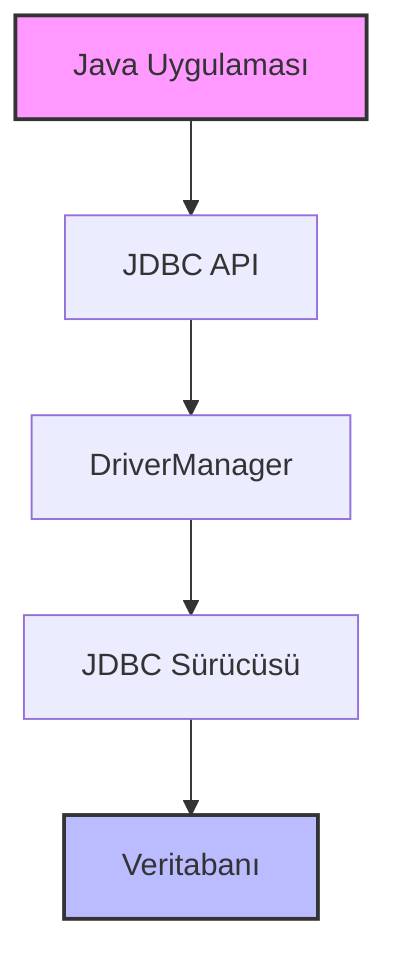
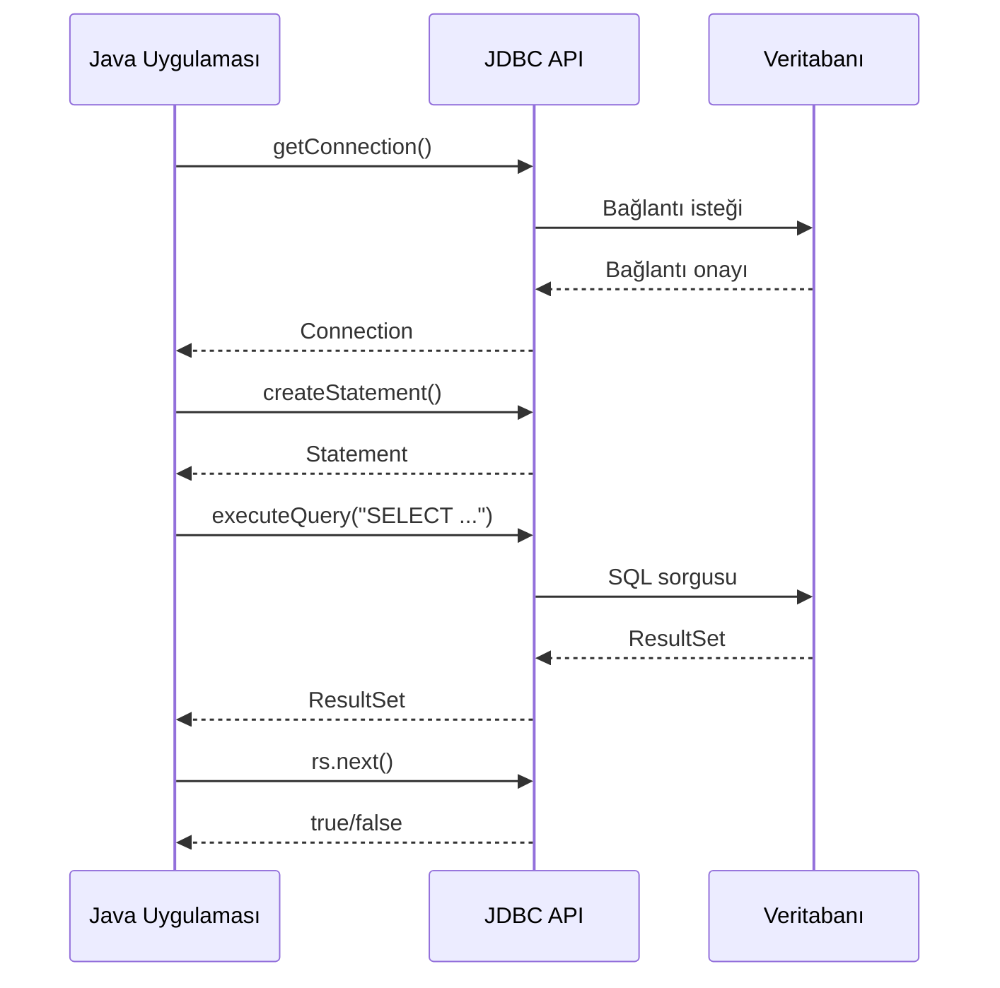
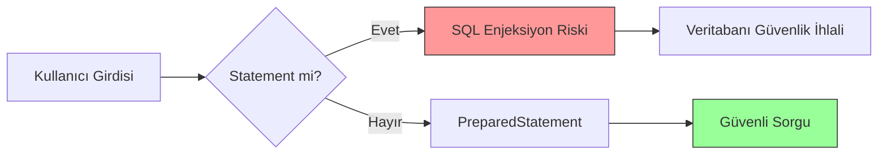

# Bölüm 22: JDBC ile Veritabani Programlamaya Giris


```yaml
title: "JDBC ile Veritabanı Programlamaya Giriş"
subtitle: "Java ile Veritabanı Bağlantısı, CRUD İşlemleri ve Güvenli Sorgulama"
author: "Teknik Kitap Yazarı"
date: "2025-03-25"
lang: "tr"
```

---

## 22.1 JDBC Nedir?

**JDBC** (Java Database Connectivity), Java uygulamalarının veritabanlarıyla iletişim kurmasını sağlayan standart bir API'dir. JDBC, veritabanına bağımsız bir şekilde SQL sorguları çalıştırmanıza, veri okumanıza ve yazmanıza olanak tanır.

JDBC, Java SE'nin bir parçasıdır ve `java.sql` paketinde bulunur. Herhangi bir veritabanıyla (MySQL, PostgreSQL, Oracle, H2, vb.) çalışmak için uygun JDBC sürücüsünü kullanmanız yeterlidir.

### 1.1. JDBC Mimarisi

JDBC mimarisi iki katmandan oluşur:

- **JDBC API**: Java uygulaması tarafından kullanılan soyut arayüzler ve sınıflar (`Connection`, `Statement`, `ResultSet`).
- **JDBC Sürücü Yöneticisi (DriverManager)**: Uygun sürücüyü yükler ve veritabanına bağlantıyı yönetir.



### 1.2. JDBC Sürücü Türleri

JDBC dört tür sürücü destekler:

| Tür | Açıklama | Örnek |
|-----|----------|-------|
| Tip 1 | JDBC-ODBC Köprüsü | Eski, nadiren kullanılır |
| Tip 2 | Yerel API | Oracle OCI |
| Tip 3 | Ağ Protokolü | Middleware |
| Tip 4 | Saf Java | MySQL Connector/J |

> 💡 **Pedagojik Not**: Tip 4 sürücüler en yaygın kullanılanlardır çünkü platform bağımsızdır ve ek yazılım gerektirmez.

---

## 22.2 Development Ortamı Kurulumu

Bu bölümde **H2 Database** kullanacağız. H2, Java ile yazılmış, hafif ve gömülü bir veritabanıdır. Geliştirme ve test için idealdir.

### 2.1. Veritabanı Seçimi: H2

H2'nin avantajları:
- Sıfır konfigürasyon
- Bellek içi (in-memory) mod
- SQL uyumluluğu

### 2.2. Bağımlılıkların Eklenmesi

**Maven (pom.xml):**

```xml
<!-- pom.xml -->
<dependency>
    <groupId>com.h2database</groupId>
    <artifactId>h2</artifactId>
    <version>2.2.224</version>
    <scope>runtime</scope>
</dependency>
```

**Gradle (build.gradle):**

```groovy
dependencies {
    runtimeOnly 'com.h2database:h2:2.2.224'
}
```

---

## 22.3 JDBC Temel Adımları

JDBC ile veritabanı işlemleri dört adımda gerçekleşir:

### 3.1. Bağlantı Kurulumu (Connection)

İlk adım, veritabanına bağlanmaktır. `DriverManager.getConnection()` metodu kullanılır.

<!-- CODE_META: dosya=DatabaseConnectionExample.java, dil=Java, konu=JDBC bağlantısı -->
```java
import java.sql.Connection;
import java.sql.DriverManager;
import java.sql.SQLException;

public class DatabaseConnectionExample {
    public static void main(String[] args) {
        // H2 veritabanı URL'si (bellek içi mod)
        String url = "jdbc:h2:mem:testdb";
        String username = "sa";
        String password = "";

        try (Connection connection = DriverManager.getConnection(url, username, password)) {
            System.out.println("Veritabanına başarıyla bağlanıldı!");
            System.out.println("Auto-commit modu: " + connection.getAutoCommit());
        } catch (SQLException e) {
            System.err.println("Bağlantı hatası: " + e.getMessage());
        }
    }
}
```

> ⚠️ **Dikkat**: `try-with-resources` kullanarak `Connection` otomatik olarak kapatılır. Bu, kaynak sızıntılarını önler.

### 3.2. Statement Oluşturma

Bağlantı kurulduktan sonra SQL sorgularını çalıştırmak için `Statement` nesnesi oluşturulur.

<!-- CODE_META: dosya=StatementExample.java, dil=Java, konu=Statement oluşturma -->
```java
import java.sql.Connection;
import java.sql.DriverManager;
import java.sql.SQLException;
import java.sql.Statement;

public class StatementExample {
    public static void main(String[] args) {
        String url = "jdbc:h2:mem:testdb";

        try (Connection conn = DriverManager.getConnection(url, "sa", "");
             Statement stmt = conn.createStatement()) {

            System.out.println("Statement başarıyla oluşturuldu.");
        } catch (SQLException e) {
            e.printStackTrace();
        }
    }
}
```

### 3.3. Sorgu Çalıştırma ve ResultSet

SQL sorguları `executeQuery()` (SELECT için) veya `executeUpdate()` (INSERT, UPDATE, DELETE için) metotlarıyla çalıştırılır.

<!-- CODE_META: dosya=QueryExample.java, dil=Java, konu=SELECT sorgusu -->
```java
import java.sql.*;

public class QueryExample {
    public static void main(String[] args) {
        String url = "jdbc:h2:mem:testdb";

        try (Connection conn = DriverManager.getConnection(url, "sa", "");
             Statement stmt = conn.createStatement()) {

            // Tablo oluştur
            stmt.execute("CREATE TABLE IF NOT EXISTS users (id INT PRIMARY KEY, name VARCHAR(100))");

            // Veri ekle
            stmt.executeUpdate("INSERT INTO users VALUES (1, 'Ali')");
            stmt.executeUpdate("INSERT INTO users VALUES (2, 'Ayşe')");

            // Sorgu çalıştır
            ResultSet rs = stmt.executeQuery("SELECT * FROM users");

            while (rs.next()) {
                int id = rs.getInt("id");
                String name = rs.getString("name");
                System.out.println("ID: " + id + ", Ad: " + name);
            }

        } catch (SQLException e) {
            e.printStackTrace();
        }
    }
}
```



### 3.4. Kaynakları Kapatma

Her zaman `Connection`, `Statement` ve `ResultSet` kaynaklarını kapatın. En iyi yöntem `try-with-resources` kullanmaktır.

<!-- CODE_META
id: bolum-22_kod01
chapter_id: bolum-22
kind: example
title: "Kod 1"
file: "Ornek00.java"
mainClass: Ornek00
extract: true
test: compile
github: true
qr: dual
-->

```java
// Yanlış: Kaynaklar kapatılmamış
Statement stmt = conn.createStatement();
ResultSet rs = stmt.executeQuery("SELECT * FROM users");
// rs ve stmt kapatılmadı!

// Doğru: try-with-resources
try (Connection conn = ...;
     Statement stmt = conn.createStatement();
     ResultSet rs = stmt.executeQuery("SELECT * FROM users")) {
    // İşlemler
}
```

---

## 22.4 CRUD İşlemleri

CRUD (Create, Read, Update, Delete) işlemleri, veritabanı programlamanın temelini oluşturur.

### 4.1. Create (Veri Ekleme)

`INSERT INTO` sorgusu kullanılır.

<!-- CODE_META: dosya=CreateExample.java, dil=Java, konu=INSERT işlemi -->
```java
import java.sql.*;

public class CreateExample {
    public static void main(String[] args) {
        String url = "jdbc:h2:mem:testdb";

        try (Connection conn = DriverManager.getConnection(url, "sa", "");
             Statement stmt = conn.createStatement()) {

            // Tablo oluştur
            stmt.execute("CREATE TABLE IF NOT EXISTS products (" +
                         "id INT AUTO_INCREMENT PRIMARY KEY, " +
                         "name VARCHAR(100), " +
                         "price DECIMAL(10,2))");

            // Veri ekle
            int rowsAffected = stmt.executeUpdate(
                "INSERT INTO products (name, price) VALUES ('Laptop', 15000.00)");

            System.out.println("Etkilenen satır sayısı: " + rowsAffected);

        } catch (SQLException e) {
            e.printStackTrace();
        }
    }
}
```

### 4.2. Read (Veri Okuma)

`SELECT` sorgusu ile veri okunur.

<!-- CODE_META: dosya=ReadExample.java, dil=Java, konu=SELECT okuma -->
```java
import java.sql.*;

public class ReadExample {
    public static void main(String[] args) {
        String url = "jdbc:h2:mem:testdb";

        try (Connection conn = DriverManager.getConnection(url, "sa", "");
             Statement stmt = conn.createStatement()) {

            // Örnek veriler
            stmt.executeUpdate("INSERT INTO products VALUES (1, 'Mouse', 250.00)");
            stmt.executeUpdate("INSERT INTO products VALUES (2, 'Keyboard', 500.00)");

            // Sorgu
            ResultSet rs = stmt.executeQuery("SELECT * FROM products WHERE price > 300");

            while (rs.next()) {
                System.out.printf("Ürün: %s, Fiyat: %.2f TL%n",
                    rs.getString("name"), rs.getDouble("price"));
            }

        } catch (SQLException e) {
            e.printStackTrace();
        }
    }
}
```

### 4.3. Update (Veri Güncelleme)

`UPDATE` sorgusu ile mevcut veriler değiştirilir.

<!-- CODE_META: dosya=UpdateExample.java, dil=Java, konu=UPDATE işlemi -->
```java
import java.sql.*;

public class UpdateExample {
    public static void main(String[] args) {
        String url = "jdbc:h2:mem:testdb";

        try (Connection conn = DriverManager.getConnection(url, "sa", "");
             Statement stmt = conn.createStatement()) {

            // Önce veri ekle
            stmt.executeUpdate("INSERT INTO products VALUES (1, 'Laptop', 15000.00)");

            // Güncelle
            int rows = stmt.executeUpdate(
                "UPDATE products SET price = 14000.00 WHERE id = 1");

            System.out.println("Güncellenen satır: " + rows);

        } catch (SQLException e) {
            e.printStackTrace();
        }
    }
}
```

### 4.4. Delete (Veri Silme)

`DELETE FROM` sorgusu ile veri silinir.

<!-- CODE_META: dosya=DeleteExample.java, dil=Java, konu=DELETE işlemi -->
```java
import java.sql.*;

public class DeleteExample {
    public static void main(String[] args) {
        String url = "jdbc:h2:mem:testdb";

        try (Connection conn = DriverManager.getConnection(url, "sa", "");
             Statement stmt = conn.createStatement()) {

            // Veri ekle
            stmt.executeUpdate("INSERT INTO products VALUES (1, 'Test', 100.00)");

            // Sil
            int rows = stmt.executeUpdate("DELETE FROM products WHERE id = 1");

            System.out.println("Silinen satır: " + rows);

        } catch (SQLException e) {
            e.printStackTrace();
        }
    }
}
```

---

## 22.5 PreparedStatement ve SQL Enjeksiyonu

### 5.1. Statement vs PreparedStatement

| Özellik | Statement | PreparedStatement |
|---------|-----------|-------------------|
| Performans | Her seferinde derlenir | Önceden derlenir, tekrar kullanılabilir |
| Güvenlik | SQL enjeksiyonuna açık | Parametreleri güvenli şekilde işler |
| Kullanım | Sabit sorgular | Dinamik parametreli sorgular |

### 5.2. SQL Enjeksiyon Tehlikesi

Kötü niyetli kullanıcılar, giriş alanlarına SQL kodu ekleyerek veritabanına zarar verebilir.

<!-- CODE_META
id: bolum-22_kod02
chapter_id: bolum-22
kind: example
title: "Kod 2"
file: "Ornek01.java"
mainClass: Ornek01
extract: true
test: compile
github: true
qr: dual
-->

```java
// TEHLİKELİ: SQL enjeksiyonuna açık
String userInput = "1 OR 1=1";
String query = "SELECT * FROM users WHERE id = " + userInput;
// Çalıştırılan: SELECT * FROM users WHERE id = 1 OR 1=1
// Tüm kullanıcıları döndürür!
```

### 5.3. PreparedStatement Kullanımı

`PreparedStatement` parametreleri `?` ile belirtir ve güvenli şekilde işler.

<!-- CODE_META: dosya=PreparedStatementExample.java, dil=Java, konu=PreparedStatement -->
```java
import java.sql.*;

public class PreparedStatementExample {
    public static void main(String[] args) {
        String url = "jdbc:h2:mem:testdb";

        try (Connection conn = DriverManager.getConnection(url, "sa", "");
             PreparedStatement pstmt = conn.prepareStatement(
                 "INSERT INTO products (name, price) VALUES (?, ?)")) {

            // Parametreleri ayarla
            pstmt.setString(1, "Monitor");
            pstmt.setDouble(2, 3000.00);

            // Sorguyu çalıştır
            int rows = pstmt.executeUpdate();
            System.out.println("Eklenen satır: " + rows);

            // Tekrar kullanım
            pstmt.setString(1, "Kamera");
            pstmt.setDouble(2, 4500.00);
            pstmt.executeUpdate();

        } catch (SQLException e) {
            e.printStackTrace();
        }
    }
}
```

> 🔒 **Güvenlik İpucu**: Kullanıcı girdisi içeren tüm sorgularda `PreparedStatement` kullanın. Asla kullanıcı girdisini doğrudan SQL sorgusuna eklemeyin.



---

## 22.6 İleri Düzey Konular

### 6.1. Batch İşlemler

Toplu işlemler, birden fazla SQL sorgusunu tek seferde göndermeyi sağlar.

<!-- CODE_META: dosya=BatchExample.java, dil=Java, konu=Batch işlemler -->
```java
import java.sql.*;

public class BatchExample {
    public static void main(String[] args) {
        String url = "jdbc:h2:mem:testdb";

        try (Connection conn = DriverManager.getConnection(url, "sa", "");
             PreparedStatement pstmt = conn.prepareStatement(
                 "INSERT INTO products (name, price) VALUES (?, ?)")) {

            conn.setAutoCommit(false); // Transaction başlat

            // Toplu ekleme
            for (int i = 1; i <= 1000; i++) {
                pstmt.setString(1, "Product-" + i);
                pstmt.setDouble(2, i * 10.0);
                pstmt.addBatch();

                // 100'de bir gönder
                if (i % 100 == 0) {
                    pstmt.executeBatch();
                }
            }
            pstmt.executeBatch(); // Kalanları gönder
            conn.commit(); // Transaction'ı tamamla

            System.out.println("1000 ürün başarıyla eklendi.");

        } catch (SQLException e) {
            e.printStackTrace();
        }
    }
}
```

### 6.2. Transaction Yönetimi

Transaction'lar, birden fazla işlemin atomik olarak gerçekleşmesini sağlar.

<!-- CODE_META
id: bolum-22_kod03
chapter_id: bolum-22
kind: example
title: "Kod 3"
file: "Ornek02.java"
mainClass: Ornek02
extract: true
test: compile
github: true
qr: dual
-->

```java
try (Connection conn = DriverManager.getConnection(url, "sa", "")) {
    conn.setAutoCommit(false); // Transaction başlat

    try {
        // İşlem 1: Hesaptan para çek
        stmt.executeUpdate("UPDATE accounts SET balance = balance - 100 WHERE id = 1");

        // İşlem 2: Diğer hesaba para ekle
        stmt.executeUpdate("UPDATE accounts SET balance = balance + 100 WHERE id = 2");

        conn.commit(); // Her şey başarılı, onayla
        System.out.println("Transfer başarılı.");

    } catch (SQLException e) {
        conn.rollback(); // Hata durumunda geri al
        System.err.println("Transfer başarısız, işlem geri alındı.");
    }
}
```

### 6.3. Veritabanı Meta Verileri

`DatabaseMetaData` ile veritabanı hakkında bilgi alınabilir.

<!-- CODE_META: dosya=MetaDataExample.java, dil=Java, konu=DatabaseMetaData -->
```java
import java.sql.*;

public class MetaDataExample {
    public static void main(String[] args) {
        String url = "jdbc:h2:mem:testdb";

        try (Connection conn = DriverManager.getConnection(url, "sa", "")) {
            DatabaseMetaData metaData = conn.getMetaData();

            System.out.println("Veritabanı: " + metaData.getDatabaseProductName());
            System.out.println("Sürüm: " + metaData.getDatabaseProductVersion());
            System.out.println("JDBC Sürücü: " + metaData.getDriverName());
            System.out.println("Max Bağlantı: " + metaData.getMaxConnections());

        } catch (SQLException e) {
            e.printStackTrace();
        }
    }
}
```

---

## 22.7 Özet

Bu bölümde JDBC ile veritabanı programlamanın temellerini öğrendik:

- ✅ JDBC mimarisi ve sürücü türleri
- ✅ Connection, Statement ve ResultSet kullanımı
- ✅ CRUD işlemleri (Create, Read, Update, Delete)
- ✅ PreparedStatement ile güvenli sorgulama
- ✅ Batch işlemler ve transaction yönetimi

---

## 22.8 Terim Sözlüğü

| Terim | Açıklama |
|-------|----------|
| **JDBC** | Java Database Connectivity, Java-veritabanı bağlantı API'si |
| **Connection** | Veritabanına yapılan bağlantıyı temsil eden nesne |
| **Statement** | SQL sorgusunu çalıştırmak için kullanılan nesne |
| **PreparedStatement** | Parametreli ve güvenli sorgular için önceden derlenmiş Statement |
| **ResultSet** | Sorgu sonucunu temsil eden tablo yapısı |
| **SQL Enjeksiyonu** | Kötü niyetli SQL kodunun sorguya eklenmesi saldırısı |
| **Transaction** | Atomik olarak gerçekleşmesi gereken işlem grubu |
| **Batch İşlem** | Birden fazla SQL sorgusunun toplu olarak gönderilmesi |

---

## 22.9 Sorular

1. JDBC'de `Statement` ile `PreparedStatement` arasındaki temel fark nedir?
2. SQL enjeksiyon saldırısı nasıl gerçekleşir ve nasıl önlenir?
3. `try-with-resources` kullanmanın avantajları nelerdir?
4. Transaction yönetiminde `commit()` ve `rollback()` metotlarının görevleri nelerdir?
5. Batch işlemler hangi durumlarda kullanışlıdır?

---

## 22.10 Alıştırmalar

### Alıştırma 1: Temel CRUD Uygulaması
Bir `students` tablosu oluşturun (id, name, grade alanlarıyla) ve aşağıdaki işlemleri gerçekleştiren bir Java programı yazın:
- 5 öğrenci ekleyin
- Tüm öğrencileri listeleyin
- Bir öğrencinin notunu güncelleyin
- Bir öğrenciyi silin

### Alıştırma 2: Güvenli Kullanıcı Girişi
Kullanıcı adı ve şifre alan bir login sistemi yazın. `PreparedStatement` kullanarak SQL enjeksiyonuna karşı koruma sağlayın.

### Alıştırma 3: Transaction ile Para Transferi
İki hesap arasında para transferi yapan bir program yazın. Transaction kullanarak işlemin atomikliğini sağlayın. Hata durumunda rollback yapın.

### Alıştırma 4: Batch Veri Ekleme
10000 kaydı batch işlemlerle veritabanına ekleyen bir program yazın. Performansı normal ekleme ile karşılaştırın.

---

**Bölüm Sonu**