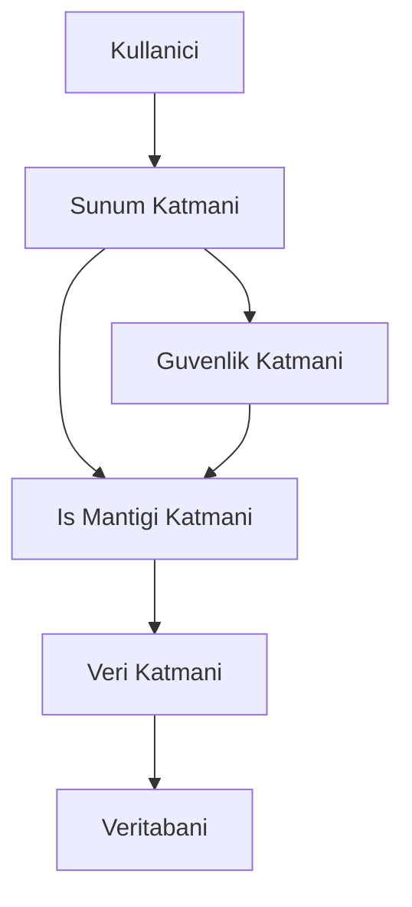
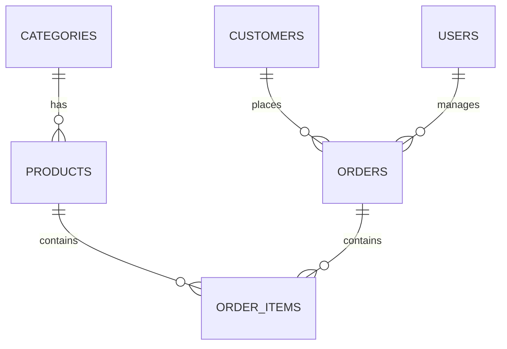

---
title: "Butunlesik Uygulama ve Final Proje Rehberi"
subtitle: "Spring Boot ile Kapsamli Bir Uygulama Gelistirme"
author: "Teknik Kitap Ekibi"
date: "2025-01-01"
lang: "tr"
keywords: [Spring Boot, Final Proje, Butunlesik Uygulama, Java, REST API, DevOps]
---

# Bölüm 23: Butunlesik Uygulama ve Final Proje Rehberi

Bu bolumde, ogrendiginiz tum konulari birlestiren kapsamli bir uygulama gelistirme surecini adim adim inceleyeceksiniz. Gercek hayattan bir senaryo uzerinden, Spring Boot ile tam yigin (full-stack) bir uygulama olusturacak, test edecek ve devreye alacaksiniz.

## 23.1 Proje Amaci ve Kapsami

Projemiz, bir "E-Ticaret Yonetim Sistemi" olacak. Bu sistem:
- Urun, kategori, musteri ve siparis yonetimi
- Kullanici kimlik dogrulama ve yetkilendirme
- REST API uzerinden tum islemler
- Docker konteynerlerinde calisabilme
- CI/CD pipeline ile otomatik test ve deployment

> **Pedagojik Not**: Bu proje, gercek bir is ortaminda karsilasabileceginiz tum zorluklari icermektedir. Her bir katmani anlamak ve dogru sekilde uygulamak, profesyonel yazilim gelistirme becerilerinizi gelistirecektir.

## 23.2 Proje Gereksinimleri

Proje gereksinimleri:
- Java 17+
- Spring Boot 3.x
- PostgreSQL veritabani
- Docker ve Docker Compose
- Maven veya Gradle
- Git versiyon kontrol sistemi

## 23.3 Teknolojik Yigin

Kullanacagimiz teknolojiler:
- **Backend**: Spring Boot, Spring Data JPA, Spring Security
- **Veritabani**: PostgreSQL
- **API Dokumantasyonu**: Swagger/OpenAPI
- **Test**: JUnit 5, Mockito, Testcontainers
- **Konteyner**: Docker
- **CI/CD**: GitHub Actions
- **Monitoring**: Prometheus + Grafana

## 23.4 Proje Mimarisi

## 23.5 Genel Mimari Yapi

Projemiz, katmanli mimari (layered architecture) kullanacak. Bu mimari, her katmanin belirli bir sorumlulugu olmasi prensibine dayanir.



## 23.6 Katmanli Mimari (Layered Architecture)

Katmanli mimari, uygulamayi mantiksal olarak ayirir:
1. **Sunum Katmani**: REST controller'lar, DTO'lar
2. **Is Mantigi Katmani**: Servis siniflari, is akislari
3. **Veri Katmani**: Repository, Entity siniflari
4. **Guvenlik Katmani**: JWT, Spring Security

## 23.7 Bilesenler Arasi Iletisim

Bilesenler arasi iletisim:
- Controller -> Servis -> Repository
- DTO'lar katmanlar arasi veri transferi icin kullanilir
- Exception handling mekanizmasi ile hatalar yonetilir

## 23.8 Veri Katmani (Data Layer)

## 23.9 Veritabani Tasarimi

Veritabani tasarimimiz asagidaki tablolari icerir:
- `categories`: Kategori bilgileri
- `products`: Urun bilgileri
- `customers`: Musteri bilgileri
- `orders`: Siparis bilgileri
- `order_items`: Siparis detaylari
- `users`: Kullanici bilgileri



## 23.10 JPA Entity'leri ve Iliskiler

<!-- CODE_META: Entity siniflari - Category.java -->
```java
package com.eticaret.entity;

import jakarta.persistence.*;
import lombok.Data;
import java.util.Set;

@Entity
@Table(name = "categories")
@Data
public class Category {
    @Id
    @GeneratedValue(strategy = GenerationType.IDENTITY)
    private Long id;
    
    @Column(nullable = false, unique = true)
    private String name;
    
    @Column(length = 500)
    private String description;
    
    @OneToMany(mappedBy = "category", cascade = CascadeType.ALL, fetch = FetchType.LAZY)
    private Set<Product> products;
    
    @Column(name = "created_at")
    private LocalDateTime createdAt;
    
    @PrePersist
    protected void onCreate() {
        createdAt = LocalDateTime.now();
    }
}
```

## 23.11 Repository Katmani

<!-- CODE_META: Repository siniflari - ProductRepository.java -->
```java
package com.eticaret.repository;

import com.eticaret.entity.Product;
import org.springframework.data.jpa.repository.JpaRepository;
import org.springframework.data.jpa.repository.Query;
import org.springframework.stereotype.Repository;
import java.util.List;

@Repository
public interface ProductRepository extends JpaRepository<Product, Long> {
    
    List<Product> findByCategoryId(Long categoryId);
    
    @Query("SELECT p FROM Product p WHERE p.price BETWEEN :minPrice AND :maxPrice")
    List<Product> findByPriceRange(Double minPrice, Double maxPrice);
    
    List<Product> findByNameContainingIgnoreCase(String name);
}
```

## 23.12 Is Mantigi Katmani (Business Layer)

## 23.13 Servis Siniflari ve Is Akislari

Is mantigi katmani, uygulamanin temel islevselligini icerir. Her is akisi bir servis sinifinda tanimlanir.

<!-- CODE_META: Servis siniflari - OrderService.java -->
```java
package com.eticaret.service;

import com.eticaret.dto.OrderDTO;
import com.eticaret.entity.Order;
import com.eticaret.entity.OrderItem;
import com.eticaret.entity.Product;
import com.eticaret.exception.InsufficientStockException;
import com.eticaret.repository.OrderRepository;
import com.eticaret.repository.ProductRepository;
import lombok.RequiredArgsConstructor;
import org.springframework.stereotype.Service;
import org.springframework.transaction.annotation.Transactional;

@Service
@RequiredArgsConstructor
public class OrderService {
    
    private final OrderRepository orderRepository;
    private final ProductRepository productRepository;
    
    @Transactional
    public OrderDTO createOrder(OrderDTO orderDTO) {
        Order order = new Order();
        order.setCustomerId(orderDTO.getCustomerId());
        
        double totalAmount = 0.0;
        for (OrderItemDTO itemDTO : orderDTO.getItems()) {
            Product product = productRepository.findById(itemDTO.getProductId())
                .orElseThrow(() -> new RuntimeException("Product not found"));
            
            if (product.getStock() < itemDTO.getQuantity()) {
                throw new InsufficientStockException("Insufficient stock for product: " + product.getName());
            }
            
            OrderItem item = new OrderItem();
            item.setProduct(product);
            item.setQuantity(itemDTO.getQuantity());
            item.setUnitPrice(product.getPrice());
            order.addItem(item);
            
            totalAmount += product.getPrice() * itemDTO.getQuantity();
            
            // Stock update
            product.setStock(product.getStock() - itemDTO.getQuantity());
            productRepository.save(product);
        }
        
        order.setTotalAmount(totalAmount);
        order.setStatus(OrderStatus.PENDING);
        
        Order savedOrder = orderRepository.save(order);
        return convertToDTO(savedOrder);
    }
}
```

## 23.14 Validation ve Exception Handling

Is mantigi katmaninda validation ve exception handling kritik onem tasir.

<!-- CODE_META: Global exception handler - GlobalExceptionHandler.java -->
```java
package com.eticaret.exception;

import org.springframework.http.HttpStatus;
import org.springframework.http.ResponseEntity;
import org.springframework.web.bind.MethodArgumentNotValidException;
import org.springframework.web.bind.annotation.ExceptionHandler;
import org.springframework.web.bind.annotation.RestControllerAdvice;

@RestControllerAdvice
public class GlobalExceptionHandler {
    
    @ExceptionHandler(InsufficientStockException.class)
    public ResponseEntity<ErrorResponse> handleInsufficientStock(InsufficientStockException ex) {
        ErrorResponse error = new ErrorResponse(
            HttpStatus.BAD_REQUEST.value(),
            ex.getMessage(),
            System.currentTimeMillis()
        );
        return new ResponseEntity<>(error, HttpStatus.BAD_REQUEST);
    }
    
    @ExceptionHandler(MethodArgumentNotValidException.class)
    public ResponseEntity<ErrorResponse> handleValidation(MethodArgumentNotValidException ex) {
        String message = ex.getBindingResult().getAllErrors().stream()
            .map(e -> e.getDefaultMessage())
            .collect(Collectors.joining(", "));
        
        ErrorResponse error = new ErrorResponse(
            HttpStatus.BAD_REQUEST.value(),
            message,
            System.currentTimeMillis()
        );
        return new ResponseEntity<>(error, HttpStatus.BAD_REQUEST);
    }
}
```

## 23.15 Transaction Yonetimi

Transaction yonetimi, veri tutarliligini saglar. `@Transactional` anotasyonu ile yonetilir.

> **Onemli Not**: Transaction yonetimi, ozellikle birden fazla veritabani islemi iceren is akislarinda kritiktir. Ornegin, siparis olusturma isleminde hem siparis tablosuna ekleme hem de stok guncelleme islemleri ayni transaction icinde yapilmalidir.

## 23.16 Sunum Katmani (Presentation Layer)

## 23.17 REST API Tasarimi

REST API tasariminda asagidaki prensiplere uyulur:
- Kaynak odakli URL yapisi
- HTTP metodlarinin dogru kullanimi (GET, POST, PUT, DELETE)
- Status kodlarinin dogru kullanimi

## 23.18 Controller ve DTO'lar

<!-- CODE_META: Controller siniflari - ProductController.java -->
```java
package com.eticaret.controller;

import com.eticaret.dto.ProductDTO;
import com.eticaret.service.ProductService;
import jakarta.validation.Valid;
import lombok.RequiredArgsConstructor;
import org.springframework.http.HttpStatus;
import org.springframework.http.ResponseEntity;
import org.springframework.web.bind.annotation.*;

import java.util.List;

@RestController
@RequestMapping("/api/v1/products")
@RequiredArgsConstructor
public class ProductController {
    
    private final ProductService productService;
    
    @GetMapping
    public ResponseEntity<List<ProductDTO>> getAllProducts() {
        return ResponseEntity.ok(productService.getAllProducts());
    }
    
    @GetMapping("/{id}")
    public ResponseEntity<ProductDTO> getProductById(@PathVariable Long id) {
        return ResponseEntity.ok(productService.getProductById(id));
    }
    
    @PostMapping
    public ResponseEntity<ProductDTO> createProduct(@Valid @RequestBody ProductDTO productDTO) {
        ProductDTO created = productService.createProduct(productDTO);
        return new ResponseEntity<>(created, HttpStatus.CREATED);
    }
    
    @PutMapping("/{id}")
    public ResponseEntity<ProductDTO> updateProduct(@PathVariable Long id, 
                                                     @Valid @RequestBody ProductDTO productDTO) {
        return ResponseEntity.ok(productService.updateProduct(id, productDTO));
    }
    
    @DeleteMapping("/{id}")
    public ResponseEntity<Void> deleteProduct(@PathVariable Long id) {
        productService.deleteProduct(id);
        return ResponseEntity.noContent().build();
    }
}
```

## 23.19 Swagger/OpenAPI Dokumantasyonu

Spring Boot ile Swagger dokumantasyonu otomatik olarak eklenir.

## 23.20 Guvenlik Katmani (Security Layer)

## 23.21 Spring Security Yapilandirmasi

<!-- CODE_META: Security yapilandirmasi - SecurityConfig.java -->
```java
package com.eticaret.config;

import com.eticaret.security.JwtAuthenticationFilter;
import lombok.RequiredArgsConstructor;
import org.springframework.context.annotation.Bean;
import org.springframework.context.annotation.Configuration;
import org.springframework.security.config.annotation.web.builders.HttpSecurity;
import org.springframework.security.config.annotation.web.configuration.EnableWebSecurity;
import org.springframework.security.config.http.SessionCreationPolicy;
import org.springframework.security.web.SecurityFilterChain;
import org.springframework.security.web.authentication.UsernamePasswordAuthenticationFilter;

@Configuration
@EnableWebSecurity
@RequiredArgsConstructor
public class SecurityConfig {
    
    private final JwtAuthenticationFilter jwtAuthFilter;
    
    @Bean
    public SecurityFilterChain securityFilterChain(HttpSecurity http) throws Exception {
        http
            .csrf(csrf -> csrf.disable())
            .sessionManagement(session -> session.sessionCreationPolicy(SessionCreationPolicy.STATELESS))
            .authorizeHttpRequests(auth -> auth
                .requestMatchers("/api/v1/auth/**").permitAll()
                .requestMatchers("/api/v1/products/**").hasAnyRole("USER", "ADMIN")
                .requestMatchers("/api/v1/admin/**").hasRole("ADMIN")
                .anyRequest().authenticated()
            )
            .addFilterBefore(jwtAuthFilter, UsernamePasswordAuthenticationFilter.class);
        
        return http.build();
    }
}
```

## 23.22 JWT Token Yonetimi

JWT token yonetimi, kullanici kimlik dogrulamasi icin kullanilir.

## 23.23 Role-Based Yetkilendirme

Role-based yetkilendirme ile farkli kullanici rollerine farkli yetkiler verilir.

## 23.24 Test Katmani

## 23.25 Unit Testler (JUnit + Mockito)

<!-- CODE_META: Unit test ornegi - ProductServiceTest.java -->
```java
package com.eticaret.service;

import com.eticaret.dto.ProductDTO;
import com.eticaret.entity.Product;
import com.eticaret.repository.ProductRepository;
import org.junit.jupiter.api.BeforeEach;
import org.junit.jupiter.api.Test;
import org.junit.jupiter.api.extension.ExtendWith;
import org.mockito.InjectMocks;
import org.mockito.Mock;
import org.mockito.junit.jupiter.MockitoExtension;

import static org.mockito.ArgumentMatchers.any;
import static org.mockito.Mockito.when;
import static org.assertj.core.api.Assertions.assertThat;

@ExtendWith(MockitoExtension.class)
class ProductServiceTest {
    
    @Mock
    private ProductRepository productRepository;
    
    @InjectMocks
    private ProductService productService;
    
    private Product product;
    private ProductDTO productDTO;
    
    @BeforeEach
    void setUp() {
        product = new Product();
        product.setId(1L);
        product.setName("Test Product");
        product.setPrice(100.0);
        
        productDTO = new ProductDTO();
        productDTO.setName("Test Product");
        productDTO.setPrice(100.0);
    }
    
    @Test
    void createProduct_ShouldReturnProductDTO() {
        when(productRepository.save(any(Product.class))).thenReturn(product);
        
        ProductDTO result = productService.createProduct(productDTO);
        
        assertThat(result).isNotNull();
        assertThat(result.getName()).isEqualTo("Test Product");
    }
}
```

## 23.26 Integration Testler

Integration testler, uygulamanin tum bilesenlerini birlikte test eder.

## 23.27 Test Coverage ve Raporlama

Test coverage raporlari icin JaCoCo kullanilir.

## 23.28 Deployment ve DevOps

## 23.29 Docker Konteynerizasyonu

<!-- CODE_META: Dockerfile - Dockerfile -->
```dockerfile
FROM openjdk:17-jdk-slim AS build
WORKDIR /app
COPY mvnw pom.xml ./
COPY .mvn .mvn
RUN ./mvnw dependency:go-offline
COPY src ./src
RUN ./mvnw clean package -DskipTests

FROM openjdk:17-jdk-slim
WORKDIR /app
COPY --from=build /app/target/*.jar app.jar
EXPOSE 8080
ENTRYPOINT ["java", "-jar", "app.jar"]
```

## 23.30 CI/CD Pipeline (GitHub Actions)

<!-- CODE_META: GitHub Actions workflow - ci-cd.yml -->
```yaml
name: CI/CD Pipeline

on:
  push:
    branches: [ main ]
  pull_request:
    branches: [ main ]

jobs:
  build:
    runs-on: ubuntu-latest
    
    steps:
    - uses: actions/checkout@v3
    
    - name: Set up JDK 17
      uses: actions/setup-java@v3
      with:
        java-version: '17'
        distribution: 'temurin'
    
    - name: Build with Maven
      run: mvn clean package
    
    - name: Run tests
      run: mvn test
    
    - name: Build Docker image
      run: docker build -t e-ticaret-app .
    
    - name: Push to Docker Hub
      uses: docker/build-push-action@v2
      with:
        push: true
        tags: user/e-ticaret-app:latest
```

## 23.31 Cloud Deployment (AWS/Azure)

Cloud deployment icin AWS Elastic Beanstalk veya Azure App Service kullanilabilir.

## 23.32 Performans ve Monitoring

## 23.33 Log Yonetimi (Logback/ELK)

Log yonetimi icin Logback yapilandirmasi ve ELK stack kullanimi.

## 23.34 Metrik Toplama (Micrometer + Prometheus)

<!-- CODE_META: Micrometer yapilandirmasi - application.yml -->
```yaml
management:
  endpoints:
    web:
      exposure:
        include: health,info,metrics,prometheus
  metrics:
    export:
      prometheus:
        enabled: true
```

## 23.35 Performans Optimizasyonu

Performans optimizasyonu icin:
- Lazy loading kullanimi
- Cache mekanizmasi (Redis)
- Index yonetimi
- Connection pool ayarlari

## 23.36 Sonuc

## 23.37 Proje Teslimi ve Dokumantasyon

Proje teslimi icin:
- Kaynak kod (GitHub reposu)
- Docker imaji
- API dokumantasyonu (Swagger)
- Deployment kilavuzu
- Test raporlari

## 23.38 Gelecekteki Gelistirmeler

Gelecekteki gelistirmeler:
- Mikroservis mimarisine gecis
- Event-driven mimari
- GraphQL API ekleme
- Mobile uygulama entegrasyonu

## 23.39 Kaynakca ve Referanslar

- Spring Boot Dokumantasyonu: https://spring.io/projects/spring-boot
- Docker Dokumantasyonu: https://docs.docker.com
- GitHub Actions: https://docs.github.com/en/actions

## 23.40 Ozet

Bu bolumde, ogrendiginiz tum konulari birlestiren kapsamli bir uygulama gelistirme surecini incelediniz. Katmanli mimari, veri katmani, is mantigi katmani, sunum katmani, guvenlik, test, deployment ve monitoring konularini kapsayan bir E-Ticaret Yonetim Sistemi projesi olusturdunuz.

## 23.41 Terim Sozlugu

| Terim | Aciklama |
|-------|----------|
| **DTO** | Data Transfer Object, katmanlar arasi veri transferi icin kullanilan nesne |
| **JWT** | JSON Web Token, kullanici kimlik dogrulamasi icin kullanilan token |
| **CI/CD** | Continuous Integration/Continuous Deployment, surekli entegrasyon ve teslimat |
| **ORM** | Object-Relational Mapping, nesne-iliskisel esleme |
| **REST** | Representational State Transfer, API tasarim mimarisi |

## 23.42 Sorular

1. Katmanli mimarinin avantajlari nelerdir?
2. JWT token yonetimi nasil calisir?
3. Transaction yonetimi neden onemlidir?
4. Docker konteynerizasyonu hangi sorunlari cozer?
5. CI/CD pipeline'in temel adimlari nelerdir?

## 23.43 Alistirmalar

1. **Entity Olusturma**: `OrderItem` entity'sini olusturun ve `Order` ile iliskisini tanimlayin.

2. **Servis Gelistirme**: Yeni bir `DiscountService` servisi olusturun ve belirli kosullarda indirim uygulayin.

3. **Test Yazma**: `OrderService` icin bir unit test yazin ve transaction yonetimini test edin.

4. **Docker Compose**: PostgreSQL ve uygulama icin bir Docker Compose dosyasi olusturun.

5. **API Dokumantasyonu**: Swagger konfigurasyonunu ekleyin ve API dokumantasyonunu olusturun.

> **Pedagojik Not**: Bu alistirmalari tamamladiktan sonra, butunlesik uygulama gelistirme konusunda kendinizi daha yetkin hissedeceksiniz. Her bir alistirma, gercek hayattaki bir problemi cozmenize yardimci olacaktir.