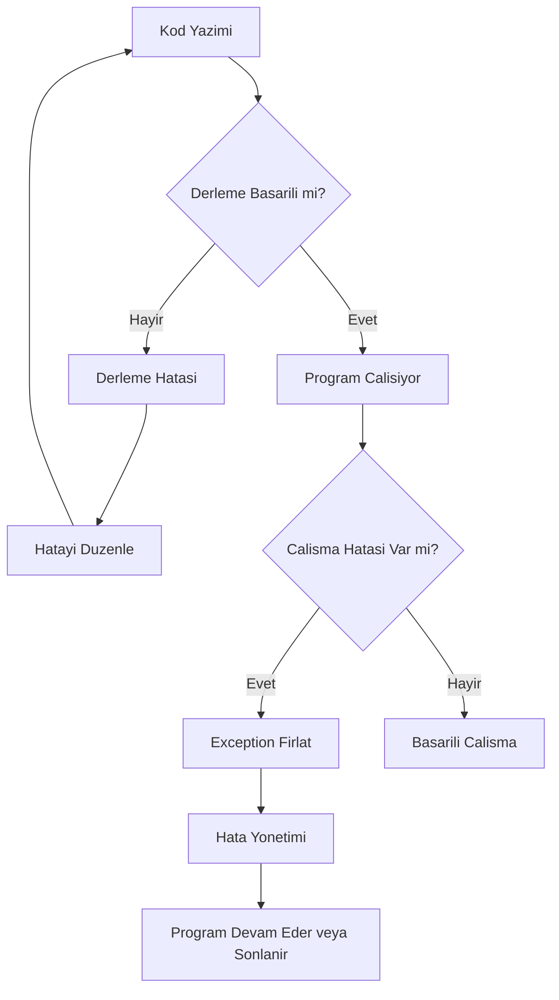
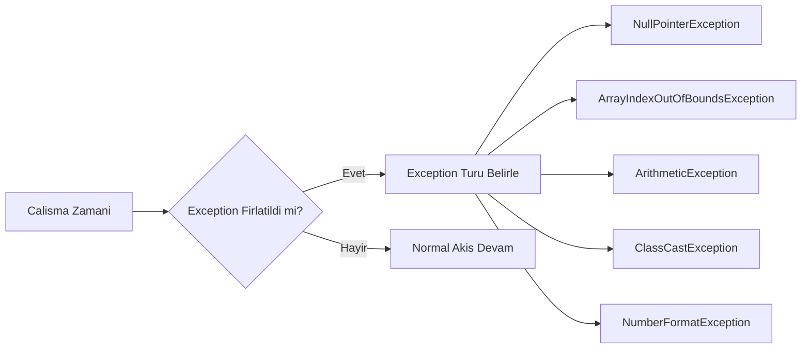
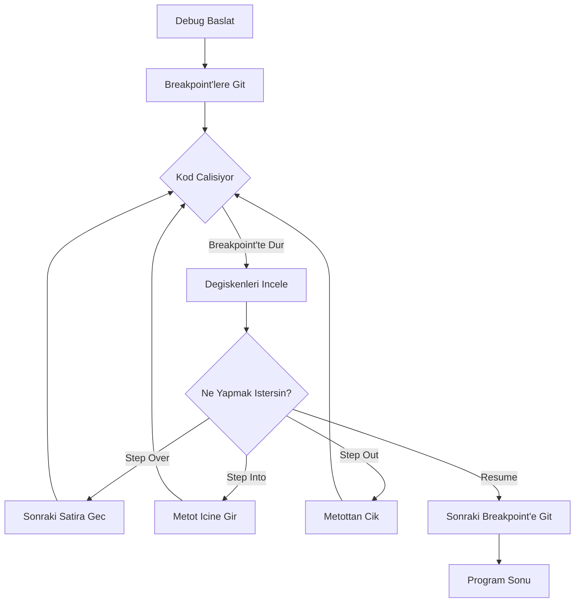

```yaml
---
title: "Sik Yapilan Java Hatalari ve Cozum Rehberi"
subtitle: "Derleme ve Calisma Zamani Hatalarini Tanima ve Cozme"
author: "Java Egitim Ekibi"
date: 2025-03-28
lang: tr
keywords: [Java, hata, exception, debugging, derleme, calisma zamani]
abstract: "Bu bolumde Java programlamada en sik karsilasilan hata turlerini, cozum yontemlerini ve etkili debugging tekniklerini ogreneceksiniz."
---
```

# 1. Giris: Hata Turlerine Genel Bakis

Java'da hatalarla karsilasmak, programlama yolculugunun kacinilmaz bir parcasidir. Bu hatalari anlamak ve cozmek, sizi daha iyi bir gelistirici yapar. Bu bolumde, en yaygin Java hatalarini tanimlayacak, nedenlerini anlayacak ve etkili cozum stratejileri gelistireceksiniz.

## 1.1 Derleme Zamani vs Calisma Zamani Hatalari

Hatalar temelde iki kategoriye ayrilir:

- **Derleme Zamani Hatalari (Compile-time Errors)**: Kod derlenirken Java derleyicisi tarafindan yakalanan hatalardir. Bunlar genellikle syntax hatalari, tip uyumsuzluklari veya eksik bildirimlerden kaynaklanir.

- **Calisma Zamani Hatalari (Runtime Errors)**: Program calisirken ortaya cikan hatalardir. Bunlara exception denir ve programin aniden sonlanmasina neden olabilir.

**Not:** Derleme zamani hatalari, calisma zamani hatalarina gore daha kolay cozulur cunku derleyici size hatanin tam yerini ve nedenini soyler.

## 1.2 Hata Yonetiminin Onemi

Hata yonetimi, saglam ve guvenilir yazilim gelistirmenin temelidir. Iyi bir hata yonetimi:

- Programin beklenmedik durumlarda duzgun sekilde davranmasini saglar
- Kullanici deneyimini iyilestirir
- Hata ayiklama surecini kolaylastirir



## 2. Derleme Zamani Hatalari

Derleme zamani hatalari, kodunuzu calistirmadan once Java derleyicisi tarafindan tespit edilir. Bu hatalari duzeltmek genellikle basittir.

## 2.1 Syntax Hatalari

### Eksik Noktali Virgul

Java'da her ifadenin sonuna noktali virgul (;) konulmalidir.

<!-- CODE_META: EksikNoktaliVirgul.java -->
```java
public class EksikNoktaliVirgul {
    public static void main(String[] args) {
        // Hatali kod: noktali virgul eksik
        int sayi = 10  // Derleme hatasi: ';' expected
        
        // Dogru kod:
        int sayi2 = 20;
        System.out.println("Sayi: " + sayi2);
    }
}
```

**Cozum:** Her ifadenin sonunda noktali virgul oldugundan emin olun.

### Yanlis Parantez Kullanimi

Parantezlerin eslesmemesi yaygin bir hatadir.

<!-- CODE_META: ParantezHatasi.java -->
```java
public class ParantezHatasi {
    public static void main(String[] args) {
        // Hatali: parantez sayisi eslesmiyor
        // if (x > 5 {  // Derleme hatasi
        
        // Dogru:
        int x = 10;
        if (x > 5) {
            System.out.println("x 5'ten buyuk");
        }
    }
}
```

## 2.2 Tip Uyumsuzlugu Hatalari

Java guclu tipli bir dildir, yani bir degiskene yanlis turde deger atamaya calisirsaniz derleme hatasi alirsiniz.

<!-- CODE_META: TipUyumsuzlugu.java -->
```java
public class TipUyumsuzlugu {
    public static void main(String[] args) {
        // Hatali: int turune String atanamiyor
        // int sayi = "Merhaba";  // Derleme hatasi: incompatible types
        
        // Dogru:
        int sayi = 42;
        String metin = "Merhaba";
        
        // Alternatif: String'i int'e cevirme
        String sayiMetin = "123";
        int cevrilenSayi = Integer.parseInt(sayiMetin);
        System.out.println("Cevrilen sayi: " + cevrilenSayi);
    }
}
```

## 2.3 Erisim Belirteci Hatalari

Bir sinifin private uyesine disaridan erismeye calismak derleme hatasina neden olur.

<!-- CODE_META: ErisimBelirteciHatasi.java -->
```java
class BankaHesabi {
    private double bakiye = 1000.0;
    
    public double getBakiye() {
        return bakiye;
    }
}

public class ErisimBelirteciHatasi {
    public static void main(String[] args) {
        BankaHesabi hesap = new BankaHesabi();
        
        // Hatali: private uyeye dogrudan erisim
        // System.out.println(hesap.bakiye);  // Derleme hatasi: bakiye has private access
        
        // Dogru: public getter metodu kullan
        System.out.println("Bakiye: " + hesap.getBakiye());
    }
}
```

## 2.4 Import ve Paket Hatalari

Kullanmak istediginiz sinifin tam paket yolunu belirtmezseniz veya import etmezseniz derleme hatasi alirsiniz.

<!-- CODE_META: ImportHatasi.java -->
```java
import java.util.ArrayList;  // Dogru import

public class ImportHatasi {
    public static void main(String[] args) {
        // Hatali: import edilmemis sinif
        // ArrayList list = new ArrayList();  // Eger import yoksa hata
        
        // Dogru: import edilmis sinif
        ArrayList<String> liste = new ArrayList<>();
        liste.add("Java");
        System.out.println(liste);
        
        // Tam paket yolu ile kullanim (import gerektirmez)
        java.util.Date bugun = new java.util.Date();
        System.out.println("Bugun: " + bugun);
    }
}
```

## 3. Calisma Zamani Hatalari (Exceptions)

Calisma zamani hatalari, program calisirken ortaya cikan ve programin aniden sonlanmasina neden olabilen hatalardir.



## 3.1 NullPointerException

En yaygin Java hatalarindan biridir. `null` degerine sahip bir nesne uzerinde metot cagirmaya calistiginizda olusur.

<!-- CODE_META: NullPointerOrnegi.java -->
```java
public class NullPointerOrnegi {
    public static void main(String[] args) {
        String metin = null;
        
        // Hatali: null uzerinde metot cagirma
        try {
            int uzunluk = metin.length();  // NullPointerException firlatir
            System.out.println("Uzunluk: " + uzunluk);
        } catch (NullPointerException e) {
            System.out.println("HATA: NullPointerException yakalandi!");
            System.out.println("Hata mesaji: " + e.getMessage());
        }
        
        // Dogru kullanim: null kontrolu yap
        String guvenliMetin = "Merhaba Dunya";
        if (guvenliMetin != null) {
            System.out.println("Uzunluk: " + guvenliMetin.length());
        } else {
            System.out.println("Metin null");
        }
    }
}
```

**Cozum:** Her zaman null kontrolu yapin veya Optional sinifini kullanin.

## 3.2 ArrayIndexOutOfBoundsException

Bir diziye gecersiz bir indeksle erismeye calistiginizda olusur.

<!-- CODE_META: ArrayIndexHatasi.java -->
```java
public class ArrayIndexHatasi {
    public static void main(String[] args) {
        int[] sayilar = {10, 20, 30, 40, 50};
        
        // Hatali: dizi sinirlari disinda erisim
        try {
            int hataliDeger = sayilar[10];  // ArrayIndexOutOfBoundsException
            System.out.println("Deger: " + hataliDeger);
        } catch (ArrayIndexOutOfBoundsException e) {
            System.out.println("HATA: Gecersiz dizi indeksi!");
            System.out.println("Dizi boyutu: " + sayilar.length);
        }
        
        // Dogru kullanim: indeks kontrolu
        int indeks = 3;
        if (indeks >= 0 && indeks < sayilar.length) {
            System.out.println("Deger: " + sayilar[indeks]);
        } else {
            System.out.println("Gecersiz indeks: " + indeks);
        }
        
        // Dongu ile guvenli erisim
        for (int i = 0; i < sayilar.length; i++) {
            System.out.println("sayilar[" + i + "] = " + sayilar[i]);
        }
    }
}
```

## 3.3 ArithmeticException

Genellikle sifira bolme islemi sirasinda olusur.

<!-- CODE_META: ArithmeticOrnegi.java -->
```java
public class ArithmeticOrnegi {
    public static void main(String[] args) {
        int pay = 10;
        int payda = 0;
        
        // Hatali: sifira bolme
        try {
            int sonuc = pay / payda;  // ArithmeticException
            System.out.println("Sonuc: " + sonuc);
        } catch (ArithmeticException e) {
            System.out.println("HATA: Sifira bolme yapilamaz!");
        }
        
        // Dogru kullanim: payda kontrolu
        int guvenliPayda = 2;
        if (guvenliPayda != 0) {
            int sonuc = pay / guvenliPayda;
            System.out.println("Sonuc: " + sonuc);
        } else {
            System.out.println("Payda sifir olamaz");
        }
    }
}
```

## 3.4 ClassCastException

Bir nesneyi uyumsuz bir ture donusturmeye calistiginizda olusur.

<!-- CODE_META: ClassCastOrnegi.java -->
```java
public class ClassCastOrnegi {
    public static void main(String[] args) {
        Object nesne = new Integer(42);
        
        // Hatali: Integer'i String'e cast etmek
        try {
            String metin = (String) nesne;  // ClassCastException
            System.out.println("Metin: " + metin);
        } catch (ClassCastException e) {
            System.out.println("HATA: Gecersiz tip donusumu!");
        }
        
        // Dogru kullanim: instanceof kontrolu
        if (nesne instanceof String) {
            String metin = (String) nesne;
            System.out.println("Metin: " + metin);
        } else {
            System.out.println("Nesne String turunde degil, tur: " + nesne.getClass().getName());
        }
    }
}
```

## 3.5 NumberFormatException

Bir String'i sayiya cevirmeye calistiginizda, String gecerli bir sayi formati icermiyorsa olusur.

<!-- CODE_META: NumberFormatOrnegi.java -->
```java
public class NumberFormatOrnegi {
    public static void main(String[] args) {
        String gecersizSayi = "123abc";
        
        // Hatali: gecersiz formatta sayi
        try {
            int sayi = Integer.parseInt(gecersizSayi);  // NumberFormatException
            System.out.println("Sayi: " + sayi);
        } catch (NumberFormatException e) {
            System.out.println("HATA: Gecersiz sayi formati!");
            System.out.println("Girilen deger: '" + gecersizSayi + "' bir sayi degil");
        }
        
        // Dogru kullanim: try-catch ile guvenli donusum
        String gecerliSayi = "456";
        try {
            int sayi = Integer.parseInt(gecerliSayi);
            System.out.println("Basarili donusum: " + sayi);
        } catch (NumberFormatException e) {
            System.out.println("Donusum basarisiz");
        }
    }
}
```

## 4. Mantiksal Hatalar

Mantiksal hatalar, programin derlenip calismasina ragmen beklenen sonucu vermemesine neden olan hatalardir. Bunlar en zor tespit edilen hatalardir.

## 4.1 Sonsuz Donguler

Dongu kosulu hicbir zaman false olmazsa, program sonsuza kadar calisir.

<!-- CODE_META: SonsuzDongu.java -->
```java
public class SonsuzDongu {
    public static void main(String[] args) {
        // Hatali: sonsuz dongu
        /*
        int i = 0;
        while (i < 10) {
            System.out.println("Sonsuz dongu...");
            // i++;  // Bu satir unutulmus!
        }
        */
        
        // Dogru kullanim
        int i = 0;
        while (i < 10) {
            System.out.println("i = " + i);
            i++;  // Kosulu degistiren ifade
        }
    }
}
```

## 4.2 Yanlis Kosul Ifadeleri

Kosul ifadelerinde yapilan mantik hatalari.

<!-- CODE_META: YanlisKosul.java -->
```java
public class YanlisKosul {
    public static void main(String[] args) {
        int yas = 25;
        
        // Hatali: yanlis operator kullanimi
        // if (yas = 18) {  // Atama operatoru, karsilastirma degil
        
        // Dogru
        if (yas >= 18) {
            System.out.println("Yetiskin");
        } else {
            System.out.println("Cocuk");
        }
        
        // Diger yaygin hata: && yerine & kullanimi
        boolean kosul1 = true;
        boolean kosul2 = false;
        
        // & her iki kosulu da degerlendirir (kisa devre yapmaz)
        if (kosul1 & kosul2) {
            System.out.println("Bu calismaz");
        }
        
        // && kisa devre yapar (ilk kosul false ise ikinciye bakmaz)
        if (kosul1 && kosul2) {
            System.out.println("Bu da calismaz");
        }
    }
}
```

## 4.3 Gereksiz Nesne Olusturma

Performans sorunlarina yol acan gereksiz nesne olusturma.

<!-- CODE_META: GereksizNesne.java -->
```java
public class GereksizNesne {
    public static void main(String[] args) {
        // Hatali: her dongude yeni String olusturma
        long baslangic = System.currentTimeMillis();
        String sonuc = "";
        for (int i = 0; i < 10000; i++) {
            sonuc += i;  // Her seferinde yeni String nesnesi olusur
        }
        long bitis = System.currentTimeMillis();
        System.out.println("String ile gecen sure: " + (bitis - baslangic) + " ms");
        
        // Dogru: StringBuilder kullanimi
        baslangic = System.currentTimeMillis();
        StringBuilder sb = new StringBuilder();
        for (int i = 0; i < 10000; i++) {
            sb.append(i);  // Ayni nesne uzerinde islem yapilir
        }
        sonuc = sb.toString();
        bitis = System.currentTimeMillis();
        System.out.println("StringBuilder ile gecen sure: " + (bitis - baslangic) + " ms");
    }
}
```

## 5. Hata Ayiklama (Debugging) Teknikleri

Etkili hata ayiklama, bir gelistiricinin en onemli becerilerinden biridir.

## 5.1 Konsol Ciktilari Kullanma

En basit debugging yontemi, kodun belirli noktalarina `System.out.println()` eklemektir.

<!-- CODE_META: KonsolDebug.java -->
```java
public class KonsolDebug {
    public static int faktoriyel(int n) {
        System.out.println("DEBUG: faktoriyel(" + n + ") cagrildi");
        
        if (n < 0) {
            System.out.println("DEBUG: Gecersiz girdi: " + n);
            return -1;  // Hata kodu
        }
        
        if (n == 0 || n == 1) {
            System.out.println("DEBUG: Temel durum, n = " + n);
            return 1;
        }
        
        int sonuc = n * faktoriyel(n - 1);
        System.out.println("DEBUG: faktoriyel(" + n + ") = " + sonuc);
        return sonuc;
    }
    
    public static void main(String[] args) {
        int sayi = 5;
        System.out.println(sayi + "! = " + faktoriyel(sayi));
    }
}
```

## 5.2 IDE Debugger Kullanimi

Modern IDE'ler (Eclipse, IntelliJ IDEA, NetBeans) guclu debugger araclari sunar.

**Temel Debugger Ozellikleri:**
- **Breakpoint (Kesme Noktasi)**: Kodun belirli bir satirinda durma
- **Step Over**: Bir sonraki satira gecme
- **Step Into**: Bir metot cagrisinin icine girme
- **Step Out**: Metottan cikma
- **Watch**: Degisken degerlerini izleme
- **Evaluate Expression**: Anlik ifade degerlendirme



## 5.3 Stack Trace Okuma

Bir exception firlatildiginda, Java size stack trace (yigin izi) gosterir. Bu, hatanin nerede olustugunu anlamak icin cok degerlidir.

<!-- CODE_META: StackTraceOrnegi.java -->
```java
public class StackTraceOrnegi {
    public static void metotA() {
        metotB();
    }
    
    public static void metotB() {
        metotC();
    }
    
    public static void metotC() {
        // Hata olusturan kod
        String str = null;
        str.length();  // NullPointerException
    }
    
    public static void main(String[] args) {
        try {
            metotA();
        } catch (NullPointerException e) {
            System.out.println("=== STACK TRACE ===");
            e.printStackTrace();
            System.out.println("\n=== HATA MESAJI ===");
            System.out.println("Hata: " + e.getMessage());
            System.out.println("\n=== HATA ANALIZI ===");
            StackTraceElement[] elements = e.getStackTrace();
            for (StackTraceElement element : elements) {
                System.out.println("Sinif: " + element.getClassName());
                System.out.println("Metot: " + element.getMethodName());
                System.out.println("Satir: " + element.getLineNumber());
                System.out.println("---");
            }
        }
    }
}
```

**Stack Trace Okuma Ipucu:** Stack trace'i en ustten (hatalarin ilk olustugu yer) okumaya baslayin. En ustteki satir, hatanin kaynagidir.

## 6. En Iyi Uygulamalar ve Kacinilmasi Gerekenler

## 6.1 Try-Catch Kullanimi

Try-catch bloklari, exception'lari yonetmek icin kullanilir.

<!-- CODE_META: TryCatchOrnegi.java -->
```java
import java.io.BufferedReader;
import java.io.FileReader;
import java.io.IOException;

public class TryCatchOrnegi {
    public static void main(String[] args) {
        BufferedReader reader = null;
        
        try {
            reader = new BufferedReader(new FileReader("dosya.txt"));
            String satir;
            while ((satir = reader.readLine()) != null) {
                System.out.println(satir);
            }
        } catch (IOException e) {
            System.out.println("Dosya okuma hatasi: " + e.getMessage());
        } finally {
            // Her durumda calisir
            try {
                if (reader != null) {
                    reader.close();
                }
            } catch (IOException e) {
                System.out.println("Kapatma hatasi: " + e.getMessage());
            }
        }
        
        // Java 7+ ile try-with-resources
        try (BufferedReader br = new BufferedReader(new FileReader("dosya2.txt"))) {
            String satir;
            while ((satir = br.readLine()) != null) {
                System.out.println(satir);
            }
        } catch (IOException e) {
            System.out.println("Hata: " + e.getMessage());
        }
    }
}
```

**Onemli Not:** Catch bloklarinda exception'lari bos gecmeyin. Her zaman anlamli bir hata mesaji yazdirin veya loglayin.

## 6.2 Ozel Exception Siniflari Olusturma

Kendi exception siniflarinizi olusturarak daha anlamli hata mesajlari verebilirsiniz.

<!-- CODE_META: OzelExceptionOrnegi.java -->
```java
// Ozel exception sinifi
class YetersizBakiyeException extends Exception {
    private double eksikMiktar;
    
    public YetersizBakiyeException(String mesaj, double eksikMiktar) {
        super(mesaj);
        this.eksikMiktar = eksikMiktar;
    }
    
    public double getEksikMiktar() {
        return eksikMiktar;
    }
}

class BankaHesabi2 {
    private double bakiye;
    
    public BankaHesabi2(double bakiye) {
        this.bakiye = bakiye;
    }
    
    public void paraCek(double miktar) throws YetersizBakiyeException {
        if (miktar > bakiye) {
            double eksik = miktar - bakiye;
            throw new YetersizBakiyeException(
                "Yetersiz bakiye! Cekilmek istenen: " + miktar + 
                ", Mevcut bakiye: " + bakiye, eksik);
        }
        bakiye -= miktar;
        System.out.println("Para cekildi. Kalan bakiye: " + bakiye);
    }
}

public class OzelExceptionOrnegi {
    public static void main(String[] args) {
        BankaHesabi2 hesap = new BankaHesabi2(1000);
        
        try {
            hesap.paraCek(1500);
        } catch (YetersizBakiyeException e) {
            System.out.println("HATA: " + e.getMessage());
            System.out.println("Eksik miktar: " + e.getEksikMiktar());
        }
    }
}
```

## 6.3 Kodun Okunabilirligi ve Bakimi

Hata yonetimini kolaylastirmak icin kodunuzu duzenli ve okunabilir tutun.

**Iyi Uygulamalar:**
- Anlamli degisken ve metot isimleri kullanin
- Kodu yorumlarla aciklayin
- Her metot tek bir is yapsin (Single Responsibility)
- Exception'lari uygun seviyede yakalayin
- Gereksiz try-catch bloklarindan kacinin

## 7. Ozet

Bu bolumde Java'da sik karsilasilan hata turlerini ve cozum yontemlerini ogrendiniz:

1. **Derleme Zamani Hatalari**: Syntax, tip uyumsuzlugu, erisim belirteci ve import hatalari
2. **Calisma Zamani Hatalari**: NullPointerException, ArrayIndexOutOfBoundsException, ArithmeticException, ClassCastException, NumberFormatException
3. **Mantiksal Hatalar**: Sonsuz donguler, yanlis kosullar, gereksiz nesne olusturma
4. **Debugging Teknikleri**: Konsol ciktilari, IDE debugger, stack trace okuma
5. **En Iyi Uygulamalar**: Try-catch kullanimi, ozel exception siniflari, kod duzeni

**Unutmayin:** Hatalar ogrenme firsatidir. Her hata, Java'nin nasil calistigini daha iyi anlamanizi saglar.

## 8. Terim Sozlugu

| Terim | Aciklama |
|-------|----------|
| **Derleme Zamani** | Kodun Java bytecode'una donusturuldugu asamadir. |
| **Calisma Zamani** | Programin calistirildigi asamadir. |
| **Exception** | Programin normal akisini bozan beklenmedik durumdur. |
| **Syntax** | Programlama dilinin yazim kurallaridir. |
| **Stack Trace** | Bir exception olustugunda cagri yigininin durumunu gosteren rapordur. |
| **Breakpoint** | Debugging sirasinda kodun duracagi noktadir. |
| **NullPointerException** | null referans uzerinde islem yapmaya calisinca olusan exception'dur. |
| **Try-Catch** | Exception'lari yakalamak ve yonetmek icin kullanilan yapidir. |
| **Finally** | Try-catch blogundan sonra her durumda calisan bloktur. |
| **Debugging** | Programdaki hatalari bulma ve duzeltme surecidir. |

## 9. Sorular ve Alistirmalar

## Sorular

1. Derleme zamani ve calisma zamani hatalari arasindaki temel fark nedir?

2. NullPointerException neden olusur ve nasil onlenebilir?

3. Stack trace nasil okunur ve hata ayiklamada neden onemlidir?

4. Try-catch-finally yapisinin amaci nedir?

5. Ozel exception siniflari olusturmanin avantajlari nelerdir?

## Alistirmalar

**Alistirma 1: Hata Turlerini Tanima**

Asagidaki kod parcaciklarindaki hata turlerini belirleyin ve duzeltin:

<!-- CODE_META
id: ek-a_kod01
chapter_id: ek-a
kind: example
title: "Kod 1"
file: "Ornek00.java"
mainClass: Ornek00
extract: true
test: compile
github: true
qr: dual
-->

```java
// Kod 1
int x = "Merhaba";

// Kod 2
int[] dizi = {1, 2, 3};
System.out.println(dizi[5]);

// Kod 3
String str = null;
System.out.println(str.length());
```

**Alistirma 2: Guvenli Bolme Islemi**

Kullanicidan iki sayi alan ve bolme islemi yapan bir program yazin. Sifira bolme ve gecersiz girdi durumlarini try-catch ile yonetin.

**Alistirma 3: Ozel Exception Sinifi**

Bir ogrenci not sistemi icin `GecersizNotException` adinda ozel bir exception sinifi olusturun. Not 0-100 araliginda degilse bu exception'i firlatan bir metot yazin.

**Alistirma 4: Debugging Alistirmasi**

Asagidaki kodda mantiksal hatayi bulun ve duzeltin:

<!-- CODE_META
id: ek-a_kod02
chapter_id: ek-a
kind: example
title: "Kod 2"
file: "Ornek01.java"
mainClass: Ornek01
extract: true
test: compile
github: true
qr: dual
-->

```java
public class OrtalamaHesapla {
    public static double ortalamaBul(int[] sayilar) {
        int toplam = 0;
        for (int i = 0; i <= sayilar.length; i++) {
            toplam += sayilar[i];
        }
        return toplam / sayilar.length;
    }
    
    public static void main(String[] args) {
        int[] notlar = {85, 90, 78, 92, 88};
        System.out.println("Ortalama: " + ortalamaBul(notlar));
    }
}
```

**Alistirma 5: Kapsamli Hata Yonetimi**

Bir dosyadan ogrenci bilgilerini okuyan ve isleyen bir program yazin. Asagidaki hata durumlarini yonetin:
- Dosya bulunamazsa
- Dosya okunamazsa
- Veri formati gecersizse
- Matematiksel hatalar olursa

Her hata durumu icin anlamli mesajlar gosterin ve programin duzgun sekilde sonlanmasini saglayin.