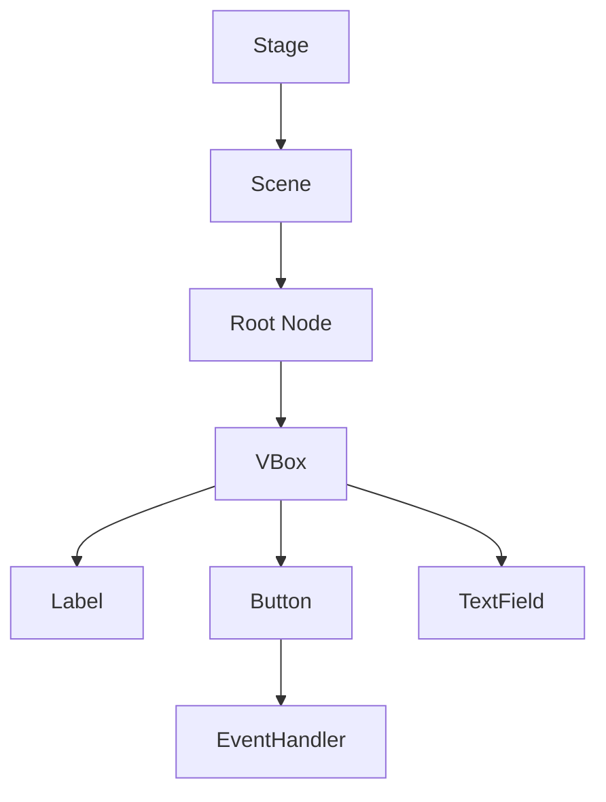
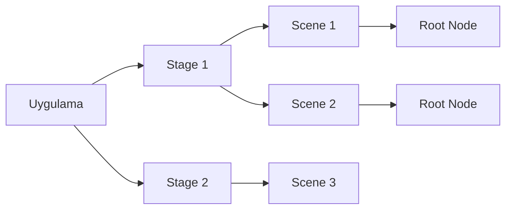
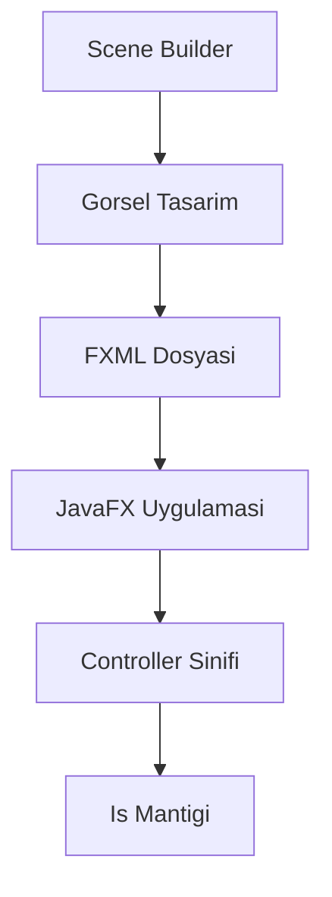

```yaml
---
title: "JavaFX'e Kisa Bakis"
subtitle: "Modern Java Masaustu Uygulama Gelistirme"
author: "Pedagojik Icerik Ekibi"
date: "2024"
lang: "tr"
keywords: [JavaFX, FXML, Scene Builder, Swing, Java, Masaustu Uygulama]
abstract: |
  Bu bolumde JavaFX'in temel kavramlarini, mimarisini ve Swing'den JavaFX'e gecis surecini ogreneceksiniz. 
  FXML ve Scene Builder ile gorsel arayuz tasariminin temellerini atacak, kontroller ve olay yonetimi 
  konularina giris yapacaksiniz.
---
```

# Ek B: JavaFX'e Kisa Bakis

JavaFX, Java platformu icin gelistirilmis modern bir masaustu uygulama kutuphanesidir. Swing'in yetersiz kaldigi noktalari gidermek ve daha zengin, daha esnek kullanici arayuzleri olusturmak amaciyla Oracle tarafindan gelistirilmistir. Bu bolumde JavaFX'in temel yapisini, FXML ve Scene Builder ile nasil calistigini ve Swing'den JavaFX'e nasil gecis yapabileceginizi ogreneceksiniz.

## 25.1 JavaFX Nedir?

JavaFX, Java ile masaustu uygulamalari gelistirmek icin kullanilan bir GUI (Graphical User Interface) kutuphanesidir. Ilk olarak 2008 yilinde JavaFX 1.0 surumuyle piyasaya surulmus, 2014 yilinda ise Java 8 ile birlikte JDK'ya dahil edilmistir.

### JavaFX'in Tarihcesi ve Gelisimi

JavaFX'in gelisim surecinde uc onemli donem vardir:

1. **JavaFX 1.x (2008-2011)**: Bu donemde JavaFX kendi betik dilini (JavaFX Script) kullaniyordu.
2. **JavaFX 2.x (2011-2014)**: JavaFX Script terk edildi ve tamamen Java API'si olarak yeniden yazildi.
3. **JavaFX 8+ (2014-gunumuz)**: Java 8 ile JDK'ya eklendi, Java 11'den itibaren ise ayri bir modul olarak (OpenJFX) dagitilmaktadir.

### JavaFX ile Swing Arasindaki Temel Farklar

| Ozelik | Swing | JavaFX |
|--------|-------|--------|
| Mimarim | Heavyweight (Agir) | Lightweight (Hafif) |
| Grafik Isleme | CPU tabanli | GPU hizlandirmali (Prism) |
| CSS Desteghi | Sinirli | Tam CSS destegi |
| FXML | Yok | Var (XML tabanli arayuz) |
| Scene Builder | Yok | Var (Gorsel tasarim araci) |
| Bilesen Cesitliligi | Temel bilesenler | Zengin bilesen kutuphanesi |
| Medya Desteghi | Sinirli | Geli mis medya destegi |

### JavaFX'in Avantajlari

JavaFX'in Swing'e gore bircok avantaji vardir:

- **GPU Hizlandirmasi**: Grafik islemleri GPU uzerinde gerceklestirilir, bu da daha akici animasyonlar ve daha iyi performans saglar.
- **CSS ile Stil Verme**: Arayuz elemanlari CSS ile kolayca ozellestirilebilir.
- **FXML**: Arayuz tasarimi ve is mantigi birbirinden ayrilabilir.
- **Scene Builder**: Gorsel bir arayuz tasarim araci sunar.
- **Modern Bilesenler**: Tablo, agac, web goruntuleyici gibi gelismis bilesenler icerir.

> **PEDAGOJIK NOT**: JavaFX'i ogrenirken en onemli kavramlardan biri "Sahne Grafı" (Scene Graph) kavramidir. Swing'de her bilesen dogrudan bir kapsayiciya eklenirken, JavaFX'te tum bilesenler bir agac yapisinda duzenlenir. Bu yapi, daha esnek ve yonetilebilir arayuzler olusturmanizi saglar.

## 25.2 JavaFX Mimarisi

JavaFX'in mimarisi, modern GUI kutuphanelerinde yaygin olarak kullanilan bir yaklasim olan "Sahne Grafı" (Scene Graph) uzerine insa edilmistir.

### Sahne Grafı (Scene Graph)

Sahne Grafı, JavaFX uygulamasindaki tum gorsel elemanlarin hiyerarsik bir agac yapisinda duzenlenmesidir. Bu agacin her bir dugumu bir `Node` sinifi tarafindan temsil edilir.



**Temel Node Turleri:**

- **Parent**: Cocuk dugumleri icerebilen dugumler (VBox, HBox, GridPane, AnchorPane vb.)
- **Control**: Kullanici etkilesimi saglayan bilesenler (Button, Label, TextField vb.)
- **Shape**: Grafik sekiller (Circle, Rectangle, Line vb.)
- **ImageView**: Gorsel dosyalari goruntulemek icin

<!-- CODE_META: dosya="SceneGraphExample.java", dil="Java", aciklama="Sahne Grafı olusturma ornegi" -->
```java
import javafx.application.Application;
import javafx.scene.Scene;
import javafx.scene.control.Button;
import javafx.scene.control.Label;
import javafx.scene.control.TextField;
import javafx.scene.layout.VBox;
import javafx.stage.Stage;

public class SceneGraphExample extends Application {
    
    @Override
    public void start(Stage primaryStage) {
        // Sahne Grafini olustur
        Label label = new Label("Adinizi girin:");
        TextField textField = new TextField();
        Button button = new Button("Merhaba De");
        
        VBox root = new VBox(10); // 10 piksellik bosluk
        root.getChildren().addAll(label, textField, button);
        
        Scene scene = new Scene(root, 300, 200);
        
        primaryStage.setTitle("Sahne Grafı Ornegi");
        primaryStage.setScene(scene);
        primaryStage.show();
    }
    
    public static void main(String[] args) {
        launch(args);
    }
}
```

### Stage ve Scene Kavramlari

JavaFX'te bir pencere olusturmak icin iki temel kavram vardir:

- **Stage**: Bir pencereyi temsil eder. Uygulamanin ana penceresi `primaryStage` olarak adlandirilir.
- **Scene**: Pencere icinde goruntulenecek icerigi temsil eder. Bir Stage birden fazla Scene icerebilir.



### Pencerelerin Yasam Dongusu

JavaFX uygulamalarinin yasam dongusu belirli asamalardan olusur:

1. **init()**: Uygulama baslatilmadan once cagrilir. Burada gerekli on hazirliklar yapilir.
2. **start(Stage)**: Ana pencere olusturulur ve gosterilir.
3. **stop()**: Uygulama kapatilirken cagrilir.
4. **Platform.exit()**: Uygulamayi sonlandirir.

> **PEDAGOJIK NOT**: JavaFX uygulamalarinin yasam dongusu Swing'deki JFrame'in yasam dongusunden farklidir. Swing'de bir JFrame'i `setVisible(true)` ile gosterirken, JavaFX'te `Stage.show()` metodu kullanilir. Ayrica, JavaFX'te `Application.launch()` metodu uygulamayi baslatmak icin kullanilir.

## 25.3 FXML ve Scene Builder

JavaFX'in en guclu ozelliklerinden biri, arayuz tasarimini is mantigindan ayirmasini saglayan FXML teknolojisidir.

### FXML Nedir? Neden Kullanilir?

FXML, XML tabanli bir isaretleme dilidir ve JavaFX arayuzlerini tanimlamak icin kullanilir. FXML kullanmanin avantajlari:

- **Arayuz ve mantik ayrismasi**: Tasarim ve kod birbirinden bagimsiz gelistirilebilir.
- **Daha okunabilir kod**: Karmasik arayuzler XML ile daha duzgun ifade edilir.
- **Scene Builder ile entegrasyon**: Gorsel olarak arayuz tasarlanabilir.

<!-- CODE_META: dosya="sample.fxml", dil="xml", aciklama="Basit bir FXML dosyasi" -->
```xml
<?xml version="1.0" encoding="UTF-8"?>

<?import javafx.scene.control.*?>
<?import javafx.scene.layout.*?>

<VBox spacing="10" xmlns:fx="http://javafx.com/fxml" 
      fx:controller="sample.Controller">
    <Label text="Adinizi girin:" />
    <TextField fx:id="nameField" />
    <Button text="Merhaba De" onAction="#sayHello" />
</VBox>
```

### Scene Builder ile Gorsel Tasarim

Scene Builder, JavaFX arayuzlerini gorsel olarak tasarlamanizi saglayan bir uygulamadir. Ozellikleri:

- Surukle-birak ile bilesen ekleme
- CSS ozellestirmeleri
- FXML dosyasi olusturma
- Controller sinifi ile baglanti kurma



### FXML Dosyasi ile Java Kodu Arasindaki Iliski

FXML dosyasi, Java kodunda `FXMLLoader` sinifi kullanilarak yuklenir.

<!-- CODE_META: dosya="Main.java", dil="Java", aciklama="FXML dosyasini yukleme ornegi" -->
```java
import javafx.application.Application;
import javafx.fxml.FXMLLoader;
import javafx.scene.Parent;
import javafx.scene.Scene;
import javafx.stage.Stage;

public class Main extends Application {
    
    @Override
    public void start(Stage primaryStage) throws Exception {
        // FXML dosyasini yukle
        Parent root = FXMLLoader.load(getClass().getResource("sample.fxml"));
        
        Scene scene = new Scene(root, 300, 200);
        primaryStage.setTitle("FXML Ornegi");
        primaryStage.setScene(scene);
        primaryStage.show();
    }
    
    public static void main(String[] args) {
        launch(args);
    }
}
```

## 25.4 Kontroller ve Olay Yonetimi

JavaFX'te kullanici etkilesimleri, controller siniflari ve olay isleme mekanizmasi ile yonetilir.

### Controller Siniflari

Controller sinifi, FXML dosyasinda tanimlanan arayuz elemanlarina ve olaylara mudahale eden Java sinifidir.

<!-- CODE_META: dosya="Controller.java", dil="Java", aciklama="Basit bir controller sinifi" -->
```java
import javafx.fxml.FXML;
import javafx.scene.control.Alert;
import javafx.scene.control.Alert.AlertType;
import javafx.scene.control.TextField;

public class Controller {
    
    @FXML
    private TextField nameField;
    
    @FXML
    private void sayHello() {
        String name = nameField.getText();
        
        Alert alert = new Alert(AlertType.INFORMATION);
        alert.setTitle("Merhaba");
        alert.setHeaderText(null);
        alert.setContentText("Merhaba " + name + "!");
        alert.showAndWait();
    }
}
```

### @FXML Anotasyonu

`@FXML` anotasyonu, FXML dosyasindaki elemanlarla Java kodundaki degiskenler arasinda baglanti kurar. Bu anotasyon:

- Private alanlara erisim saglar
- Metotlari FXML'deki olaylara baglar
- Kod guvenligini artirir

### Olay Isleme (Event Handling)

JavaFX'te olay isleme, Swing'deki ActionListener'a benzer sekilde calisir. En yaygin kullanilan olaylar:

- **ActionEvent**: Buton tiklamalari, menu secimleri
- **MouseEvent**: Fare hareketleri
- **KeyEvent**: Klavye hareketleri

<!-- CODE_META: dosya="EventExample.java", dil="Java", aciklama="Olay isleme ornegi" -->
```java
import javafx.application.Application;
import javafx.event.ActionEvent;
import javafx.event.EventHandler;
import javafx.scene.Scene;
import javafx.scene.control.Button;
import javafx.scene.layout.StackPane;
import javafx.stage.Stage;

public class EventExample extends Application {
    
    @Override
    public void start(Stage primaryStage) {
        Button button = new Button("Tikla");
        
        // Lambda ifadesi ile olay isleme
        button.setOnAction(event -> {
            System.out.println("Butona tiklandi!");
        });
        
        // Geleneksel yontem
        button.setOnAction(new EventHandler<ActionEvent>() {
            @Override
            public void handle(ActionEvent event) {
                System.out.println("Butona tiklandi (geleneksel)!");
            }
        });
        
        StackPane root = new StackPane();
        root.getChildren().add(button);
        
        Scene scene = new Scene(root, 300, 200);
        primaryStage.setTitle("Olay Isleme Ornegi");
        primaryStage.setScene(scene);
        primaryStage.show();
    }
    
    public static void main(String[] args) {
        launch(args);
    }
}
```

## 25.5 Swing'den JavaFX'e Gecis

Eger Swing'den JavaFX'e gecis yapiyorsaniz, bazi temel farkliliklari anlamaniz gerekir.

### Swing Bilesenlerinin JavaFX Karsiliklari

| Swing | JavaFX |
|-------|--------|
| JFrame | Stage |
| JPanel | VBox, HBox, GridPane vb. |
| JButton | Button |
| JLabel | Label |
| JTextField | TextField |
| JTextArea | TextArea |
| JTable | TableView |
| JTree | TreeView |
| JComboBox | ComboBox |
| ActionListener | EventHandler |

### Swing'den JavaFX'e Tasi: Pratik Ornek

Asagida bir Swing uygulamasinin JavaFX karsiligini gorelim:

**Swing Versiyonu:**
<!-- CODE_META: dosya="SwingExample.java", dil="Java", aciklama="Swing versiyonu" -->
```java
import javax.swing.*;
import java.awt.event.ActionEvent;
import java.awt.event.ActionListener;

public class SwingExample {
    public static void main(String[] args) {
        JFrame frame = new JFrame("Swing Ornegi");
        frame.setDefaultCloseOperation(JFrame.EXIT_ON_CLOSE);
        frame.setSize(300, 200);
        
        JPanel panel = new JPanel();
        JButton button = new JButton("Tikla");
        
        button.addActionListener(new ActionListener() {
            @Override
            public void actionPerformed(ActionEvent e) {
                JOptionPane.showMessageDialog(frame, "Merhaba Swing!");
            }
        });
        
        panel.add(button);
        frame.add(panel);
        frame.setVisible(true);
    }
}
```

**JavaFX Versiyonu:**
<!-- CODE_META: dosya="JavaFXExample.java", dil="Java", aciklama="JavaFX versiyonu" -->
```java
import javafx.application.Application;
import javafx.scene.Scene;
import javafx.scene.control.Alert;
import javafx.scene.control.Alert.AlertType;
import javafx.scene.control.Button;
import javafx.scene.layout.StackPane;
import javafx.stage.Stage;

public class JavaFXExample extends Application {
    
    @Override
    public void start(Stage primaryStage) {
        Button button = new Button("Tikla");
        
        button.setOnAction(event -> {
            Alert alert = new Alert(AlertType.INFORMATION);
            alert.setTitle("Merhaba");
            alert.setHeaderText(null);
            alert.setContentText("Merhaba JavaFX!");
            alert.showAndWait();
        });
        
        StackPane root = new StackPane();
        root.getChildren().add(button);
        
        Scene scene = new Scene(root, 300, 200);
        primaryStage.setTitle("JavaFX Ornegi");
        primaryStage.setScene(scene);
        primaryStage.show();
    }
    
    public static void main(String[] args) {
        launch(args);
    }
}
```

### Swing ve JavaFX Birlikte Kullanimi

Bazen mevcut Swing uygulamalarina JavaFX ozellikleri eklemek isteyebilirsiniz. Bu durumda `javafx.embed.swing.JFXPanel` sinifini kullanabilirsiniz.

<!-- CODE_META: dosya="SwingJavaFXIntegration.java", dil="Java", aciklama="Swing ve JavaFX birlikte kullanimi" -->
```java
import javafx.application.Platform;
import javafx.embed.swing.JFXPanel;
import javafx.scene.Scene;
import javafx.scene.control.Button;
import javafx.scene.layout.StackPane;

import javax.swing.*;

public class SwingJavaFXIntegration {
    public static void main(String[] args) {
        JFrame frame = new JFrame("Swing + JavaFX");
        frame.setDefaultCloseOperation(JFrame.EXIT_ON_CLOSE);
        frame.setSize(400, 300);
        
        JFXPanel jfxPanel = new JFXPanel();
        
        Platform.runLater(() -> {
            Button button = new Button("JavaFX Butonu");
            StackPane root = new StackPane();
            root.getChildren().add(button);
            
            Scene scene = new Scene(root, 300, 200);
            jfxPanel.setScene(scene);
        });
        
        frame.add(jfxPanel);
        frame.setVisible(true);
    }
}
```

## 25.6 Basit Bir JavaFX Uygulamasi

Simdi ogrendiklerimizi kullanarak basit bir JavaFX uygulamasi gelistirelim.

### Proje Yapisi ve Maven/Gradle Ayarlari

**Maven icin pom.xml:**
<!-- CODE_META: dosya="pom.xml", dil="xml", aciklama="Maven yapilandirmasi" -->
```xml
<project xmlns="http://maven.apache.org/POM/4.0.0"
         xmlns:xsi="http://www.w3.org/2001/XMLSchema-instance"
         xsi:schemaLocation="http://maven.apache.org/POM/4.0.0 
         http://maven.apache.org/xsd/maven-4.0.0.xsd">
    <modelVersion>4.0.0</modelVersion>
    
    <groupId>com.example</groupId>
    <artifactId>javafx-demo</artifactId>
    <version>1.0-SNAPSHOT</version>
    
    <properties>
        <maven.compiler.source>11</maven.compiler.source>
        <maven.compiler.target>11</maven.compiler.target>
        <javafx.version>17.0.2</javafx.version>
    </properties>
    
    <dependencies>
        <dependency>
            <groupId>org.openjfx</groupId>
            <artifactId>javafx-controls</artifactId>
            <version>${javafx.version}</version>
        </dependency>
        <dependency>
            <groupId>org.openjfx</groupId>
            <artifactId>javafx-fxml</artifactId>
            <version>${javafx.version}</version>
        </dependency>
    </dependencies>
</project>
```

### Main Sinifi ve launch() Metodu

<!-- CODE_META: dosya="MainApp.java", dil="Java", aciklama="Ana uygulama sinifi" -->
```java
import javafx.application.Application;
import javafx.fxml.FXMLLoader;
import javafx.scene.Parent;
import javafx.scene.Scene;
import javafx.stage.Stage;

public class MainApp extends Application {
    
    @Override
    public void start(Stage primaryStage) throws Exception {
        Parent root = FXMLLoader.load(getClass().getResource("/sample.fxml"));
        
        Scene scene = new Scene(root, 400, 300);
        scene.getStylesheets().add(getClass().getResource("/style.css").toExternalForm());
        
        primaryStage.setTitle("JavaFX Uygulamasi");
        primaryStage.setScene(scene);
        primaryStage.show();
    }
    
    public static void main(String[] args) {
        launch(args);
    }
}
```

### FXML ile Arayuz Tasarimi

<!-- CODE_META: dosya="sample.fxml", dil="xml", aciklama="Kullanici girisi icin FXML dosyasi" -->
```xml
<?xml version="1.0" encoding="UTF-8"?>

<?import javafx.geometry.*?>
<?import javafx.scene.control.*?>
<?import javafx.scene.layout.*?>

<VBox spacing="15" alignment="CENTER" xmlns:fx="http://javafx.com/fxml" 
      fx:controller="SampleController">
    <padding>
        <Insets top="20" right="20" bottom="20" left="20"/>
    </padding>
    
    <Label text="Kullanici Girisi" style="-fx-font-size: 18px; -fx-font-weight: bold;"/>
    
    <GridPane hgap="10" vgap="10" alignment="CENTER">
        <Label text="Kullanici Adi:" GridPane.rowIndex="0" GridPane.columnIndex="0"/>
        <TextField fx:id="usernameField" GridPane.rowIndex="0" GridPane.columnIndex="1"/>
        
        <Label text="Sifre:" GridPane.rowIndex="1" GridPane.columnIndex="0"/>
        <PasswordField fx:id="passwordField" GridPane.rowIndex="1" GridPane.columnIndex="1"/>
    </GridPane>
    
    <HBox spacing="10" alignment="CENTER">
        <Button text="Giris Yap" onAction="#handleLogin"/>
        <Button text="Temizle" onAction="#handleClear"/>
    </HBox>
    
    <Label fx:id="statusLabel" text="" style="-fx-text-fill: red;"/>
</VBox>
```

### Controller ile Etkilesim

<!-- CODE_META: dosya="SampleController.java", dil="Java", aciklama="Kullanici girisi controller sinifi" -->
```java
import javafx.fxml.FXML;
import javafx.scene.control.Label;
import javafx.scene.control.PasswordField;
import javafx.scene.control.TextField;

public class SampleController {
    
    @FXML
    private TextField usernameField;
    
    @FXML
    private PasswordField passwordField;
    
    @FXML
    private Label statusLabel;
    
    @FXML
    private void handleLogin() {
        String username = usernameField.getText();
        String password = passwordField.getText();
        
        if (username.isEmpty() || password.isEmpty()) {
            statusLabel.setText("Lutfen tum alanlari doldurun!");
            statusLabel.setStyle("-fx-text-fill: red;");
        } else if (username.equals("admin") && password.equals("1234")) {
            statusLabel.setText("Giris basarili! Hosgeldiniz, " + username);
            statusLabel.setStyle("-fx-text-fill: green;");
        } else {
            statusLabel.setText("Hatali kullanici adi veya sifre!");
            statusLabel.setStyle("-fx-text-fill: red;");
        }
    }
    
    @FXML
    private void handleClear() {
        usernameField.clear();
        passwordField.clear();
        statusLabel.setText("");
    }
}
```

## 25.7 Ozet

Bu bolumde JavaFX'in temel kavramlarini ogrendiniz:

- **JavaFX Nedir?**: Modern Java masaustu uygulama kutuphanesi
- **JavaFX Mimarisi**: Sahne Grafı, Stage ve Scene kavramlari
- **FXML ve Scene Builder**: Arayuz tasarimini is mantigindan ayirma
- **Kontroller ve Olay Yonetimi**: @FXML anotasyonu ve EventHandler
- **Swing'den JavaFX'e Gecis**: Temel farklar ve birlikte kullanim
- **Basit Bir JavaFX Uygulamasi**: Adim adim uygulama gelistirme

## 25.8 Terimler Sozlugu

| Terim | Aciklama |
|-------|----------|
| **Stage** | JavaFX'te bir pencereyi temsil eden sinif |
| **Scene** | Pencere icindeki icerigi temsil eden sinif |
| **Node** | Sahne Grafındaki her bir eleman |
| **FXML** | JavaFX arayuzlerini tanimlamak icin XML tabanli dil |
| **Scene Builder** | Gorsel JavaFX arayuz tasarim araci |
| **Controller** | FXML ile baglantili Java sinifi |
| **@FXML** | FXML elemanlari ile Java kodunu baglayan anotasyon |
| **Prism** | JavaFX'in GPU hizlandirmali grafik motoru |

## 25.9 Sorular ve Alistirmalar

### Sorular

1. JavaFX ile Swing arasindaki temel farklar nelerdir?
2. Sahne Grafı kavrami nedir ve neden onemlidir?
3. FXML kullanmanin avantajlari nelerdir?
4. @FXML anotasyonu ne ise yarar?
5. JavaFX uygulamasinin yasam dongusu hangi asamalardan olusur?

### Alistirmalar

1. **Basit Hesap Makinesi**: Iki sayi girisi ve dort islem yapabilen bir hesap makinesi uygulamasi gelistirin.
2. **Kullanici Listesi**: Kullanici bilgilerini (ad, soyad, yas) ekleyip listeleyebilen bir uygulama yapin.
3. **Renk Secici**: Bir renk paletinden renk secip, secilen rengi bir dikdortgen uzerinde gosteren uygulama.
4. **Swing'den JavaFX'e Gecis**: Basit bir Swing uygulamasini JavaFX'e donusturun.
5. **Tema Degistirici**: Uygulamanin temasini (acik/koyu) degistirebilen bir uygulama yapin.

> **PEDAGOJIK NOT**: Alistirmalari yaparken once FXML ile arayuzu tasarlayin, ardindan controller sinifini yazin. Bu, arayuz ve is mantigi ayrimini daha iyi anlamanizi saglayacaktir.