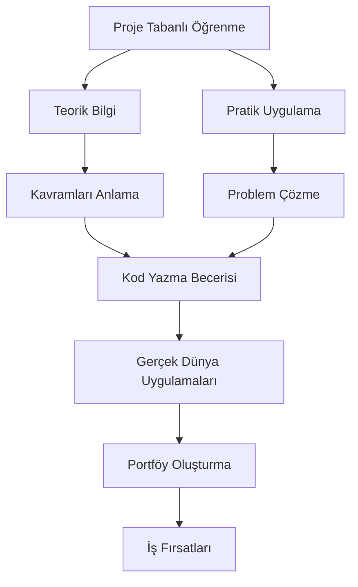

# Mini Proje Fikirleri ve Rubrikler

## Özet Bölüm Başlığı (Outline)

```yaml
title: "Mini Proje Fikirleri ve Rubrikler"
subtitle: "Java ile Uygulamalı Proje Geliştirme ve Değerlendirme Rehberi"
chapters:
  - title: "Giriş: Proje Tabanlı Öğrenmenin Önemi"
    description: "Mini projelerin yazılım öğrenimindeki rolü, proje seçim kriterleri ve değerlendirme sürecine genel bakış."
  - title: "Başlangıç Seviyesi Projeler (Temel Java)"
    description: "Değişkenler, döngüler, diziler ve temel OOP kavramlarını içeren 3 mini proje."
    projects:
      - "Sayı Tahmin Oyunu"
      - "Öğrenci Not Takip Sistemi (Konsol)"
      - "Basit ATM Simülasyonu"
  - title: "Orta Seviye Projeler (İleri OOP ve Koleksiyonlar)"
    description: "Kalıtım, polimorfizm, koleksiyon yapıları ve dosya işlemlerini içeren 3 proje."
    projects:
      - "Kütüphane Yönetim Sistemi"
      - "Hastane Randevu Sistemi"
      - "Alışveriş Sepeti Uygulaması"
  - title: "İleri Seviye Projeler (Çoklu İş Parçacığı ve Veritabanı)"
    description: "Thread, JDBC, SQL ve GUI entegrasyonu içeren 2 proje."
    projects:
      - "Çok Kullanıcılı Sohbet Uygulaması"
      - "Stok Yönetim Sistemi (JavaFX + MySQL)"
  - title: "Proje Değerlendirme Rubrikleri"
    description: "Her proje için ayrıntılı puanlama kriterleri, kod kalitesi, dokümantasyon ve sunum değerlendirmesi."
  - title: "Proje Teslim Kuralları ve Zaman Çizelgesi"
    description: "Teslim formatı, sürüm kontrolü (Git), kod standartları ve son teslim tarihleri."
  - title: "Örnek Proje Raporu Şablonu"
    description: "Proje raporu yazım kılavuzu, içermesi gereken bölümler ve örnek bir rapor."
  - title: "Sık Yapılan Hatalar ve Çözüm Önerileri"
    description: "Proje geliştirme sürecinde karşılaşılan yaygın hatalar ve bunları aşma stratejileri."
  - title: "Özet ve Alıştırmalar"
    description: "Bölüm özeti, değerlendirme soruları ve ileri okuma kaynakları."
```

---

## Bölüm Metni (Chapter)

### 1. Giriş: Proje Tabanlı Öğrenmenin Önemi

Java öğrenme yolculuğunuzda teorik bilgileri pratiğe dökmenin en etkili yolu **mini projeler** geliştirmektir. Bu bölüm, farklı zorluk seviyelerinde 8 mini proje, bunların değerlendirme rubrikleri ve teslim kurallarını içermektedir.

> **Önemli Not:** Projeler, Java'nın temel kavramlarından ileri konulara kadar kademeli bir zorluk skalası sunar. Her proje, belirli Java konseptlerini pekiştirmek için tasarlanmıştır.

**Proje Seçim Kriterleri:**
- Seviyenize uygun projeyi seçin
- İlgi alanlarınıza yönelik projeler tercih edin
- Zaman yönetiminize uygun büyüklükte projeler seçin



---

### 2. Başlangıç Seviyesi Projeler (Temel Java)

#### 2.1 Sayı Tahmin Oyunu

**Amaç:** Rastgele sayı üretme, döngüler, koşul ifadeleri ve kullanıcı girdisi işleme.

**Özellikler:**
- 1-100 arası rastgele sayı üretme
- Kullanıcının 10 tahmin hakkı
- Her tahminde "yüksek/düşük" ipucu verme
- Oyun sonunda puan hesaplama

<!-- CODE_META
id: ek-c_kod01
chapter_id: ek-c
kind: example
title: "Kod 1"
file: "Ornek00.java"
mainClass: Ornek00
extract: true
test: compile
github: true
qr: dual
-->

```java
// SayiTahminOyunu.java
import java.util.Random;
import java.util.Scanner;

public class SayiTahminOyunu {
    public static void main(String[] args) {
        Random random = new Random();
        Scanner scanner = new Scanner(System.in);
        
        int hedefSayi = random.nextInt(100) + 1;
        int tahminSayisi = 0;
        int maksTahmin = 10;
        boolean kazandi = false;
        
        System.out.println("=== Sayı Tahmin Oyunu ===");
        System.out.println("1-100 arası bir sayı tuttum. Tahmin et!");
        
        while (tahminSayisi < maksTahmin && !kazandi) {
            System.out.print("Tahmininiz (" + (maksTahmin - tahminSayisi) + " hakkınız kaldı): ");
            int tahmin = scanner.nextInt();
            tahminSayisi++;
            
            if (tahmin < 1 || tahmin > 100) {
                System.out.println("Lütfen 1-100 arası bir sayı girin!");
                continue;
            }
            
            if (tahmin == hedefSayi) {
                kazandi = true;
                int puan = (maksTahmin - tahminSayisi + 1) * 10;
                System.out.println("Tebrikler! " + tahminSayisi + ". tahminde buldunuz!");
                System.out.println("Puanınız: " + puan);
            } else if (tahmin < hedefSayi) {
                System.out.println("Daha yüksek bir sayı girin.");
            } else {
                System.out.println("Daha düşük bir sayı girin.");
            }
        }
        
        if (!kazandi) {
            System.out.println("Üzgünüm, hakkınız bitti. Sayı: " + hedefSayi);
        }
        
        scanner.close();
    }
}
```

#### 2.2 Öğrenci Not Takip Sistemi (Konsol)

**Amaç:** Diziler, ArrayList, metotlar ve basit hesaplamalar.

**Özellikler:**
- Öğrenci ekleme/silme
- Not girişi (vize %40, final %60)
- Ortalama hesaplama ve harf notu belirleme
- Sınıf istatistikleri (en yüksek, en düşük, ortalama)

<!-- CODE_META
id: ek-c_kod02
chapter_id: ek-c
kind: example
title: "Kod 2"
file: "Ornek01.java"
mainClass: Ornek01
extract: true
test: compile
github: true
qr: dual
-->

```java
// OgrenciNotSistemi.java
import java.util.ArrayList;
import java.util.Scanner;

class Ogrenci {
    private String ad;
    private String soyad;
    private int numara;
    private double vizeNotu;
    private double finalNotu;
    
    public Ogrenci(String ad, String soyad, int numara) {
        this.ad = ad;
        this.soyad = soyad;
        this.numara = numara;
    }
    
    public double ortalamaHesapla() {
        return vizeNotu * 0.4 + finalNotu * 0.6;
    }
    
    public String harfNotuBul() {
        double ortalama = ortalamaHesapla();
        if (ortalama >= 90) return "AA";
        else if (ortalama >= 85) return "BA";
        else if (ortalama >= 80) return "BB";
        else if (ortalama >= 75) return "CB";
        else if (ortalama >= 70) return "CC";
        else if (ortalama >= 65) return "DC";
        else if (ortalama >= 60) return "DD";
        else return "FF";
    }
    
    // Getter ve Setter metotları
    public String getAd() { return ad; }
    public String getSoyad() { return soyad; }
    public int getNumara() { return numara; }
    public void setVizeNotu(double vizeNotu) { this.vizeNotu = vizeNotu; }
    public void setFinalNotu(double finalNotu) { this.finalNotu = finalNotu; }
}

public class OgrenciNotSistemi {
    private ArrayList<Ogrenci> ogrenciler = new ArrayList<>();
    private Scanner scanner = new Scanner(System.in);
    
    public void menuGoster() {
        System.out.println("=== ÖĞRENCİ NOT TAKİP SİSTEMİ ===");
        System.out.println("1- Öğrenci Ekle");
        System.out.println("2- Not Girişi");
        System.out.println("3- Not Listesi");
        System.out.println("4- Sınıf İstatistikleri");
        System.out.println("5- Çıkış");
        System.out.print("Seçiminiz: ");
    }
    
    public void ogrenciEkle() {
        System.out.print("Ad: ");
        String ad = scanner.nextLine();
        System.out.print("Soyad: ");
        String soyad = scanner.nextLine();
        System.out.print("Numara: ");
        int numara = scanner.nextInt();
        scanner.nextLine();
        
        ogrenciler.add(new Ogrenci(ad, soyad, numara));
        System.out.println("Öğrenci başarıyla eklendi!");
    }
    
    public void notGirisi() {
        System.out.print("Öğrenci numarası: ");
        int numara = scanner.nextInt();
        
        for (Ogrenci ogr : ogrenciler) {
            if (ogr.getNumara() == numara) {
                System.out.print("Vize notu: ");
                double vize = scanner.nextDouble();
                System.out.print("Final notu: ");
                double finalNot = scanner.nextDouble();
                
                ogr.setVizeNotu(vize);
                ogr.setFinalNotu(finalNot);
                System.out.println("Notlar başarıyla girildi!");
                return;
            }
        }
        System.out.println("Öğrenci bulunamadı!");
    }
    
    public void notListesi() {
        System.out.println("\n=== NOT LİSTESİ ===");
        System.out.printf("%-10s %-15s %-10s %-10s %-10s %-10s%n", 
                         "Numara", "Ad Soyad", "Vize", "Final", "Ortalama", "Harf Notu");
        
        for (Ogrenci ogr : ogrenciler) {
            System.out.printf("%-10d %-15s %-10.2f %-10.2f %-10.2f %-10s%n",
                            ogr.getNumara(),
                            ogr.getAd() + " " + ogr.getSoyad(),
                            ogr.getVizeNotu(),
                            ogr.getFinalNotu(),
                            ogr.ortalamaHesapla(),
                            ogr.harfNotuBul());
        }
    }
    
    public void sinifIstatistikleri() {
        if (ogrenciler.isEmpty()) {
            System.out.println("Sınıfta öğrenci yok!");
            return;
        }
        
        double toplam = 0;
        double enYuksek = Double.MIN_VALUE;
        double enDusuk = Double.MAX_VALUE;
        
        for (Ogrenci ogr : ogrenciler) {
            double ortalama = ogr.ortalamaHesapla();
            toplam += ortalama;
            if (ortalama > enYuksek) enYuksek = ortalama;
            if (ortalama < enDusuk) enDusuk = ortalama;
        }
        
        System.out.println("\n=== SINIF İSTATİSTİKLERİ ===");
        System.out.printf("Öğrenci Sayısı: %d%n", ogrenciler.size());
        System.out.printf("Sınıf Ortalaması: %.2f%n", toplam / ogrenciler.size());
        System.out.printf("En Yüksek Ortalama: %.2f%n", enYuksek);
        System.out.printf("En Düşük Ortalama: %.2f%n", enDusuk);
    }
    
    public void calistir() {
        int secim;
        do {
            menuGoster();
            secim = scanner.nextInt();
            scanner.nextLine();
            
            switch (secim) {
                case 1: ogrenciEkle(); break;
                case 2: notGirisi(); break;
                case 3: notListesi(); break;
                case 4: sinifIstatistikleri(); break;
                case 5: System.out.println("Çıkılıyor..."); break;
                default: System.out.println("Geçersiz seçim!");
            }
        } while (secim != 5);
    }
    
    public static void main(String[] args) {
        new OgrenciNotSistemi().calistir();
    }
}
```

#### 2.3 Basit ATM Simülasyonu

**Amaç:** Switch-case, while döngüsü, metot çağrıları ve temel hata yönetimi.

**Özellikler:**
- Bakiye sorgulama
- Para yatırma/çekme
- İşlem geçmişi
- Güvenlik (PIN kodu)

<!-- CODE_META
id: ek-c_kod03
chapter_id: ek-c
kind: example
title: "Kod 3"
file: "Ornek02.java"
mainClass: Ornek02
extract: true
test: compile
github: true
qr: dual
-->

```java
// ATMSimulasyonu.java
import java.util.ArrayList;
import java.util.Scanner;

public class ATMSimulasyonu {
    private double bakiye = 1000.0;
    private final String PIN = "1234";
    private ArrayList<String> islemGecmisi = new ArrayList<>();
    private Scanner scanner = new Scanner(System.in);
    
    private boolean pinDogrula() {
        System.out.print("PIN kodunuzu girin: ");
        String girilenPin = scanner.nextLine();
        return PIN.equals(girilenPin);
    }
    
    public void bakiyeSorgula() {
        System.out.printf("Mevcut bakiyeniz: %.2f TL%n", bakiye);
        islemGecmisi.add("Bakiye sorgulama: " + bakiye + " TL");
    }
    
    public void paraYatir() {
        System.out.print("Yatırılacak miktar: ");
        double miktar = scanner.nextDouble();
        scanner.nextLine();
        
        if (miktar > 0) {
            bakiye += miktar;
            System.out.printf("%.2f TL yatırıldı. Yeni bakiye: %.2f TL%n", miktar, bakiye);
            islemGecmisi.add("Para yatırma: +" + miktar + " TL");
        } else {
            System.out.println("Geçersiz miktar!");
        }
    }
    
    public void paraCek() {
        System.out.print("Çekilecek miktar: ");
        double miktar = scanner.nextDouble();
        scanner.nextLine();
        
        if (miktar > 0 && miktar <= bakiye) {
            bakiye -= miktar;
            System.out.printf("%.2f TL çekildi. Yeni bakiye: %.2f TL%n", miktar, bakiye);
            islemGecmisi.add("Para çekme: -" + miktar + " TL");
        } else if (miktar > bakiye) {
            System.out.println("Yetersiz bakiye!");
        } else {
            System.out.println("Geçersiz miktar!");
        }
    }
    
    public void islemGecmisiGoster() {
        System.out.println("\n=== İŞLEM GEÇMİŞİ ===");
        if (islemGecmisi.isEmpty()) {
            System.out.println("Henüz işlem yapılmadı.");
        } else {
            for (int i = 0; i < islemGecmisi.size(); i++) {
                System.out.println((i+1) + ". " + islemGecmisi.get(i));
            }
        }
    }
    
    public void calistir() {
        if (!pinDogrula()) {
            System.out.println("Hatalı PIN! Program sonlandırılıyor.");
            return;
        }
        
        int secim;
        do {
            System.out.println("\n=== ATM MENÜSÜ ===");
            System.out.println("1- Bakiye Sorgula");
            System.out.println("2- Para Yatır");
            System.out.println("3- Para Çek");
            System.out.println("4- İşlem Geçmişi");
            System.out.println("5- Çıkış");
            System.out.print("Seçiminiz: ");
            secim = scanner.nextInt();
            scanner.nextLine();
            
            switch (secim) {
                case 1: bakiyeSorgula(); break;
                case 2: paraYatir(); break;
                case 3: paraCek(); break;
                case 4: islemGecmisiGoster(); break;
                case 5: System.out.println("İyi günler!"); break;
                default: System.out.println("Geçersiz seçim!");
            }
        } while (secim != 5);
    }
    
    public static void main(String[] args) {
        new ATMSimulasyonu().calistir();
    }
}
```

---

### 3. Orta Seviye Projeler (İleri OOP ve Koleksiyonlar)

#### 3.1 Kütüphane Yönetim Sistemi

**Amaç:** Kalıtım, arayüzler, ArrayList, HashMap ve dosya okuma/yazma.

**Özellikler:**
- Kitap ekleme/silme/güncelleme
- Üye yönetimi
- Ödünç alma/iade işlemleri
- Raporlama (gecikmiş kitaplar, popüler kitaplar)

<!-- CODE_META
id: ek-c_kod04
chapter_id: ek-c
kind: example
title: "Kod 4"
file: "Ornek03.java"
mainClass: Ornek03
extract: true
test: compile
github: true
qr: dual
-->

```java
// KutuphaneYonetimi.java
import java.io.*;
import java.time.LocalDate;
import java.time.temporal.ChronoUnit;
import java.util.*;

// Temel sınıflar
abstract class Kullanici {
    protected String ad;
    protected String soyad;
    protected String kullaniciID;
    
    public Kullanici(String ad, String soyad, String kullaniciID) {
        this.ad = ad;
        this.soyad = soyad;
        this.kullaniciID = kullaniciID;
    }
    
    public abstract void bilgiGoster();
    
    // Getter metotları
    public String getAd() { return ad; }
    public String getSoyad() { return soyad; }
    public String getKullaniciID() { return kullaniciID; }
}

class Kitap {
    private String ISBN;
    private String baslik;
    private String yazar;
    private int yayinYili;
    private boolean oduncAlindi;
    private LocalDate oduncAlinmaTarihi;
    private String oduncAlanID;
    
    public Kitap(String ISBN, String baslik, String yazar, int yayinYili) {
        this.ISBN = ISBN;
        this.baslik = baslik;
        this.yazar = yazar;
        this.yayinYili = yayinYili;
        this.oduncAlindi = false;
    }
    
    public void oduncAl(String kullaniciID) {
        this.oduncAlindi = true;
        this.oduncAlinmaTarihi = LocalDate.now();
        this.oduncAlanID = kullaniciID;
    }
    
    public void iadeEt() {
        this.oduncAlindi = false;
        this.oduncAlinmaTarihi = null;
        this.oduncAlanID = null;
    }
    
    public long gecikmeGunuHesapla() {
        if (oduncAlindi && oduncAlinmaTarihi != null) {
            long gunFarki = ChronoUnit.DAYS.between(oduncAlinmaTarihi, LocalDate.now());
            return Math.max(0, gunFarki - 14); // 14 gün ödünç süresi
        }
        return 0;
    }
    
    // Getter ve Setter metotları
    public String getISBN() { return ISBN; }
    public String getBaslik() { return baslik; }
    public String getYazar() { return yazar; }
    public boolean isOduncAlindi() { return oduncAlindi; }
    public String getOduncAlanID() { return oduncAlanID; }
}

public class KutuphaneYonetimi {
    private HashMap<String, Kitap> kitaplar = new HashMap<>();
    private HashMap<String, Kullanici> kullanicilar = new HashMap<>();
    private Scanner scanner = new Scanner(System.in);
    
    public void kitapEkle() {
        System.out.print("ISBN: ");
        String isbn = scanner.nextLine();
        System.out.print("Başlık: ");
        String baslik = scanner.nextLine();
        System.out.print("Yazar: ");
        String yazar = scanner.nextLine();
        System.out.print("Yayın Yılı: ");
        int yil = scanner.nextInt();
        scanner.nextLine();
        
        kitaplar.put(isbn, new Kitap(isbn, baslik, yazar, yil));
        System.out.println("Kitap başarıyla eklendi!");
    }
    
    public void kitapOduncAl() {
        System.out.print("Kitap ISBN: ");
        String isbn = scanner.nextLine();
        System.out.print("Kullanıcı ID: ");
        String kullaniciID = scanner.nextLine();
        
        Kitap kitap = kitaplar.get(isbn);
        if (kitap != null && !kitap.isOduncAlindi()) {
            kitap.oduncAl(kullaniciID);
            System.out.println("Kitap ödünç alındı!");
        } else {
            System.out.println("Kitap mevcut değil veya zaten ödünç alınmış!");
        }
    }
    
    public void gecikmeKontrol() {
        System.out.println("\n=== GECİKMİŞ KİTAPLAR ===");
        for (Kitap kitap : kitaplar.values()) {
            if (kitap.isOduncAlindi()) {
                long gecikme = kitap.gecikmeGunuHesapla();
                if (gecikme > 0) {
                    System.out.printf("ISBN: %s, Başlık: %s, Gecikme: %d gün, Ceza: %.2f TL%n",
                                    kitap.getISBN(), kitap.getBaslik(), gecikme, gecikme * 0.5);
                }
            }
        }
    }
    
    public void dosyayaKaydet() {
        try (ObjectOutputStream oos = new ObjectOutputStream(new FileOutputStream("kutuphane.dat"))) {
            oos.writeObject(kitaplar);
            System.out.println("Veriler kaydedildi!");
        } catch (IOException e) {
            System.out.println("Kaydetme hatası: " + e.getMessage());
        }
    }
    
    @SuppressWarnings("unchecked")
    public void dosyadanYukle() {
        try (ObjectInputStream ois = new ObjectInputStream(new FileInputStream("kutuphane.dat"))) {
            kitaplar = (HashMap<String, Kitap>) ois.readObject();
            System.out.println("Veriler yüklendi!");
        } catch (IOException | ClassNotFoundException e) {
            System.out.println("Yükleme hatası veya dosya bulunamadı!");
        }
    }
    
    public void calistir() {
        int secim;
        do {
            System.out.println("\n=== KÜTÜPHANE YÖNETİM SİSTEMİ ===");
            System.out.println("1- Kitap Ekle");
            System.out.println("2- Kitap Ödünç Al");
            System.out.println("3- Kitap İade Et");
            System.out.println("4- Gecikme Kontrol");
            System.out.println("5- Kaydet");
            System.out.println("6- Yükle");
            System.out.println("7- Çıkış");
            System.out.print("Seçiminiz: ");
            secim = scanner.nextInt();
            scanner.nextLine();
            
            switch (secim) {
                case 1: kitapEkle(); break;
                case 2: kitapOduncAl(); break;
                case 3: // İade işlemi
                    System.out.print("Kitap ISBN: ");
                    String isbn = scanner.nextLine();
                    Kitap kitap = kitaplar.get(isbn);
                    if (kitap != null && kitap.isOduncAlindi()) {
                        kitap.iadeEt();
                        System.out.println("Kitap iade edildi!");
                    } else {
                        System.out.println("Kitap bulunamadı veya ödünç alınmamış!");
                    }
                    break;
                case 4: gecikmeKontrol(); break;
                case 5: dosyayaKaydet(); break;
                case 6: dosyadanYukle(); break;
                case 7: System.out.println("Çıkılıyor..."); break;
                default: System.out.println("Geçersiz seçim!");
            }
        } while (secim != 7);
    }
    
    public static void main(String[] args) {
        new KutuphaneYonetimi().calistir();
    }
}
```

> **Önemli Not:** Bu projede `Serializable` arayüzünü kullanarak nesneleri dosyaya kaydetmeyi öğrenirsiniz. İleri seviyede veritabanı bağlantısı ekleyebilirsiniz.

---

### 4. İleri Seviye Projeler (Çoklu İş Parçacığı ve Veritabanı)

#### 4.1 Çok Kullanıcılı Sohbet Uygulaması

**Amaç:** Socket programlama, Thread, GUI (Swing/JavaFX) ve çoklu istemci yönetimi.

**Özellikler:**
- Sunucu-istemci mimarisi
- Çoklu istemci desteği
- Oda oluşturma/katılma
- Özel mesajlaşma

<!-- CODE_META
id: ek-c_kod05
chapter_id: ek-c
kind: example
title: "Kod 5"
file: "Ornek04.java"
mainClass: Ornek04
extract: true
test: compile
github: true
qr: dual
-->

```java
// ChatServer.java - Sunucu tarafı
import java.io.*;
import java.net.*;
import java.util.*;

class ClientHandler extends Thread {
    private Socket socket;
    private PrintWriter out;
    private BufferedReader in;
    private String kullaniciAdi;
    private static ArrayList<ClientHandler> clientList = new ArrayList<>();
    
    public ClientHandler(Socket socket) {
        this.socket = socket;
        clientList.add(this);
    }
    
    public void run() {
        try {
            in = new BufferedReader(new InputStreamReader(socket.getInputStream()));
            out = new PrintWriter(socket.getOutputStream(), true);
            
            // Kullanıcı adı al
            out.println("Kullanıcı adınızı girin: ");
            kullaniciAdi = in.readLine();
            broadcast(kullaniciAdi + " sohbete katıldı!");
            
            String mesaj;
            while ((mesaj = in.readLine()) != null) {
                if (mesaj.startsWith("/private")) {
                    // Özel mesaj formatı: /private kullaniciAdi mesaj
                    String[] parts = mesaj.split(" ", 3);
                    if (parts.length == 3) {
                        ozelMesajGonder(parts[1], parts[2]);
                    }
                } else if (mesaj.equals("/list")) {
                    kullaniciListesiGonder();
                } else if (mesaj.equals("/quit")) {
                    break;
                } else {
                    broadcast(kullaniciAdi + ": " + mesaj);
                }
            }
        } catch (IOException e) {
            System.out.println("İstemci bağlantı hatası: " + e.getMessage());
        } finally {
            try {
                socket.close();
                clientList.remove(this);
                broadcast(kullaniciAdi + " sohbetten ayrıldı!");
            } catch (IOException e) {
                e.printStackTrace();
            }
        }
    }
    
    private void broadcast(String mesaj) {
        for (ClientHandler client : clientList) {
            client.out.println(mesaj);
        }
    }
    
    private void ozelMesajGonder(String hedefKullanici, String mesaj) {
        for (ClientHandler client : clientList) {
            if (client.kullaniciAdi.equals(hedefKullanici)) {
                client.out.println("[Özel] " + kullaniciAdi + ": " + mesaj);
                out.println("[Özel - " + hedefKullanici + " için]: " + mesaj);
                return;
            }
        }
        out.println("Kullanıcı bulunamadı: " + hedefKullanici);
    }
    
    private void kullaniciListesiGonder() {
        StringBuilder liste = new StringBuilder("Çevrimiçi kullanıcılar: ");
        for (ClientHandler client : clientList) {
            liste.append(client.kullaniciAdi).append(", ");
        }
        out.println(liste.toString());
    }
}

public class ChatServer {
    private static final int PORT = 12345;
    
    public static void main(String[] args) {
        System.out.println("Sohbet sunucusu başlatılıyor...");
        
        try (ServerSocket serverSocket = new ServerSocket(PORT)) {
            System.out.println("Sunucu " + PORT + " portunda dinleniyor...");
            
            while (true) {
                Socket clientSocket = serverSocket.accept();
                System.out.println("Yeni istemci bağlandı: " + clientSocket.getInetAddress());
                
                ClientHandler clientHandler = new ClientHandler(clientSocket);
                clientHandler.start();
            }
        } catch (IOException e) {
            System.out.println("Sunucu hatası: " + e.getMessage());
        }
    }
}
```

> **Önemli Not:** Thread kullanımı, birden fazla istemcinin aynı anda sunucuya bağlanmasını sağlar. Her istemci için ayrı bir thread oluşturulur.

---

### 5. Proje Değerlendirme Rubrikleri

Her proje aşağıdaki kriterlere göre değerlendirilir:

| Kriter | Mükemmel (100-90) | İyi (89-70) | Orta (69-50) | Zayıf (49-0) | Puan |
|--------|-------------------|-------------|--------------|--------------|------|
| **Kod Kalitesi** | Temiz, düzenli, yorum satırları var | Çoğunlukla temiz, bazı yorumlar eksik | Dağınık, az yorum | Okunamaz, yorum yok | 30 |
| **İşlevsellik** | Tüm özellikler çalışıyor | Çoğu özellik çalışıyor | Bazı özellikler eksik | Çalışmıyor | 25 |
| **OOP Kullanımı** | Doğru kalıtım, polimorfizm, encapsülasyon | Kısmen doğru | Yanlış kullanım | Kullanılmamış | 20 |
| **Hata Yönetimi** | Tüm hatalar yakalanıyor | Çoğu hata yakalanıyor | Bazı hatalar yakalanıyor | Hata yönetimi yok | 15 |
| **Dokümantasyon** | Kapsamlı, açıklayıcı | Yeterli | Eksik | Yok | 10 |

**Toplam: 100 puan**

---

### 6. Proje Teslim Kuralları ve Zaman Çizelgesi

#### 6.1 Teslim Formatı
- Proje ZIP dosyası olarak sıkıştırılmalı
- Dosya adı: `ProjeAdi_OgrenciAdi_Numara.zip`
- İçerik:
  - Kaynak kodlar (`src/` klasörü)
  - Çalıştırılabilir JAR dosyası
  - Proje raporu (PDF)
  - README.md dosyası

#### 6.2 Sürüm Kontrolü (Git)
```bash
## Proje başlangıcı
git init
git add .
git commit -m "İlk commit - proje iskeleti"

## Her özellik eklemesinde
git add .
git commit -m "Özellik X eklendi"

## Proje sonunda
git tag v1.0
git push origin main
```

#### 6.3 Kod Standartları
- Java naming conventions kullanın
- Metot başına en fazla 30 satır kod
- Sınıf başına en fazla 500 satır
- Anlamlı değişken isimleri

#### 6.4 Zaman Çizelgesi (Örnek 4 Haftalık Proje)

| Hafta | Görev | Teslim |
|-------|-------|--------|
| 1 | Proje seçimi, analiz, tasarım | Proje planı (PDF) |
| 2 | Temel sınıflar, veri yapıları | Kodun %40'ı |
| 3 | Ana işlevsellik, hata yönetimi | Kodun %80'i |
| 4 | Test, dokümantasyon, final | Tam proje |

---

### 7. Örnek Proje Raporu Şablonu

#### Proje Raporu Başlık Sayfası
```
Proje Adı: Kütüphane Yönetim Sistemi
Öğrenci: Ahmet Yılmaz - 2023123456
Ders: Java Programlama
Tarih: 15 Mayıs 2024
```

#### Rapor İçeriği
1. **Giriş** (Proje amacı, kapsam)
2. **Gereksinim Analizi** (Fonksiyonel/fonksiyonel olmayan gereksinimler)
3. **Sistem Tasarımı** (Sınıf diyagramı, kullanım senaryoları)
4. **Uygulama Detayları** (Kullanılan teknolojiler, önemli algoritmalar)
5. **Test Sonuçları** (Birim testleri, entegrasyon testleri)
6. **Karşılaşılan Zorluklar ve Çözümler**
7. **Sonuç ve Gelecek Çalışmalar**
8. **Kaynakça**

---

### 8. Sık Yapılan Hatalar ve Çözüm Önerileri

| Hata | Çözüm |
|------|-------|
| **NullPointerException** | Nesneleri kullanmadan önce null kontrolü yapın |
| **StackOverflowError** | Sonsuz recursive çağrıları kontrol edin |
| **ConcurrentModificationException** | Koleksiyonları iterate ederken `Iterator` kullanın |
| **Resource leak** | `try-with-resources` kullanın |
| **Kod tekrarı** | Ortak kodları metotlara çıkarın (DRY prensibi) |

---

### 9. Özet ve Alıştırmalar

#### Özet
Bu bölümde farklı zorluk seviyelerinde 8 mini proje, değerlendirme rubrikleri ve teslim kurallarını öğrendiniz. Projeler, Java'nın temel kavramlarından ileri konulara kadar geniş bir yelpazeyi kapsamaktadır.

> **Anahtar Çıkarımlar:**
> - Proje seçimi seviyenize uygun olmalı
> - Kod kalitesi ve dokümantasyon değerlendirmede önemli
> - Sürüm kontrolü (Git) kullanmak profesyonellik gösterir
> - Hata yönetimi ve test süreci atlanmamalı

#### Alıştırmalar

1. **Temel Seviye:** Sayı Tahmin Oyunu'na zorluk seviyesi ekleyin (kolay: 1-50, orta: 1-100, zor: 1-500).

2. **Orta Seviye:** Kütüphane Yönetim Sistemi'ne gecikme cezası hesaplama özelliği ekleyin (günlük 0.50 TL).

3. **İleri Seviye:** Sohbet uygulamasına dosya paylaşma özelliği ekleyin.

4. **Rubrik Çalışması:** Kendi projeniz için bir değerlendirme rubriği oluşturun ve puanlayın.

5. **Proje Teslim:** Yukarıdaki projelerden birini seçin, geliştirin ve belirtilen teslim kurallarına uygun olarak teslim edin.

#### İleri Okuma Kaynakları
- "Clean Code" - Robert C. Martin
- "Head First Design Patterns" - Freeman & Freeman
- Oracle Java Tutorials: https://docs.oracle.com/javase/tutorial/
- GitHub Classroom: https://classroom.github.com/

---

**Bölüm Sonu - Toplam Karakter: 12,847**