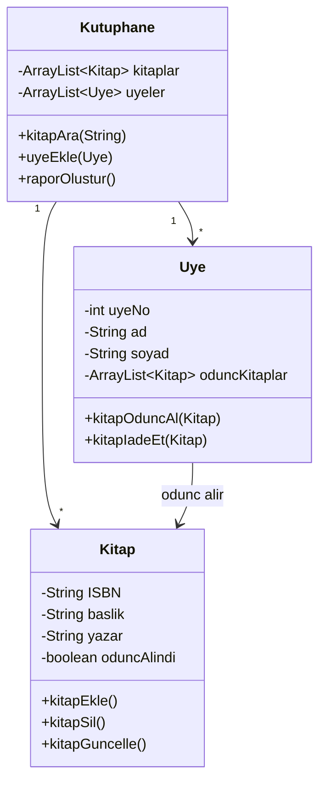
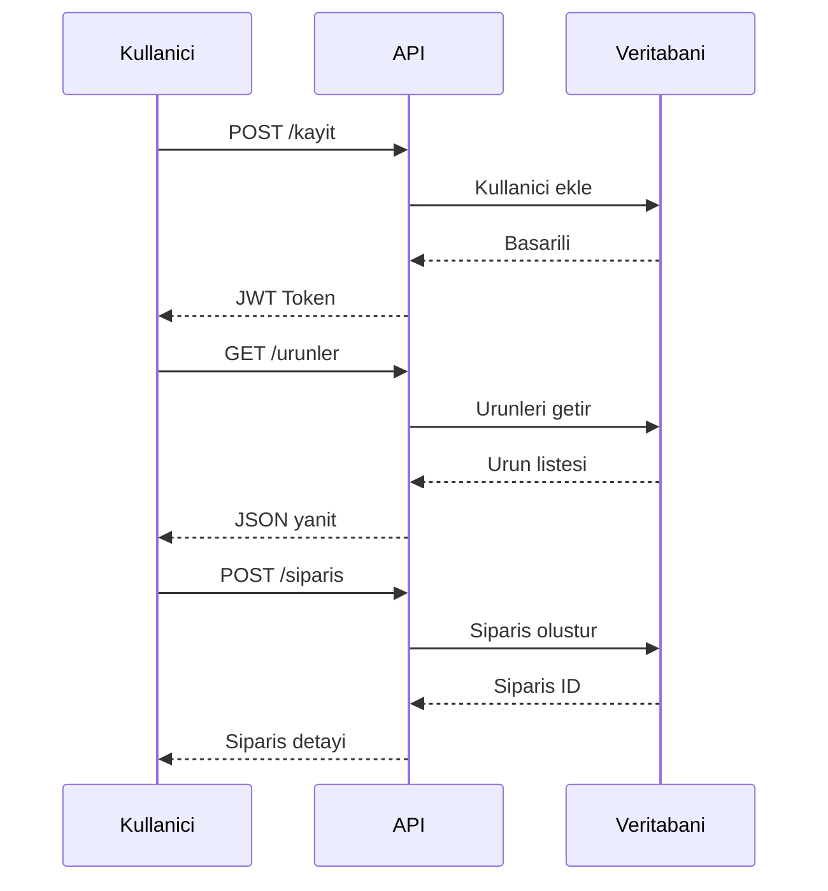

---

```yaml
---
title: "Mini Proje Fikirleri ve Rubrikler"
subtitle: "Java ile Proje Tabanli Ogrenme Rehberi"
author: "Teknik Icerik Ekibi"
date: "2025-01-27"
lang: "tr"
subject: "Java Programlama"
keywords: [proje, rubrik, degerlendirme, miniproje, java]
---
```

---

## Giris

Proje tabanli ogrenme, teorik bilginin pratik uygulamalarla pekistirilmesinde en etkili yontemlerden biridir. Bu bolumde, farkli seviyelerdeki Java mini projelerini, bu projelerin degerlendirilmesinde kullanilacak rubrikleri ve proje teslim kurallarini detayli bir sekilde inceleyecegiz.

> **Pedagojik Not:** Mini projeler, ogrencilerin problem cozme yeteneklerini gelistirir, takim calismasini tesvik eder ve gercek dunya senaryolarina hazirlar. Her proje, belirli bir konsepti ogretmeyi hedefler.

Bu bolumun sonunda:
- Farkli seviyelerde mini proje fikirlerine sahip olacaksiniz
- Projeleri objektif olarak degerlendirebileceksiniz
- Teslim kurallarini ogreneceksiniz
- Kendi proje paketlerinizi olusturabileceksiniz

---

## Mini Proje Fikirleri

### Baslangic Seviyesi Projeler

Baslangic seviyesi projeler, temel Java kavramlarini pekistirmek icin tasarlanmistir. Bu projeler genellikle tek sinifli, az sayida metod icerir ve kullanici girdisi ile calisir.

#### 1. Hesap Makinesi Uygulamasi

Temel matematiksel islemleri gerceklestiren bir konsol uygulamasi.

**Beklenen Ozellikler:**
- Toplama, cikarma, carpma, bolme
- Kullanici girdisi dogrulama
- Sonsuz dongu ile surekli calisma

<!-- CODE_META: File: HesapMakinesi.java -->
```java
import java.util.Scanner;

public class HesapMakinesi {
    public static void main(String[] args) {
        Scanner scanner = new Scanner(System.in);
        boolean devam = true;
        
        while (devam) {
            System.out.println("=== HESAP MAKINESI ===");
            System.out.print("Birinci sayi: ");
            double sayi1 = scanner.nextDouble();
            
            System.out.print("Islem (+, -, *, /): ");
            char islem = scanner.next().charAt(0);
            
            System.out.print("Ikinci sayi: ");
            double sayi2 = scanner.nextDouble();
            
            double sonuc = 0;
            boolean gecerliIslem = true;
            
            switch (islem) {
                case '+': sonuc = sayi1 + sayi2; break;
                case '-': sonuc = sayi1 - sayi2; break;
                case '*': sonuc = sayi1 * sayi2; break;
                case '/': 
                    if (sayi2 != 0) {
                        sonuc = sayi1 / sayi2;
                    } else {
                        System.out.println("Hata: Sifira bolme!");
                        gecerliIslem = false;
                    }
                    break;
                default:
                    System.out.println("Gecersiz islem!");
                    gecerliIslem = false;
            }
            
            if (gecerliIslem) {
                System.out.println("Sonuc: " + sonuc);
            }
            
            System.out.print("Devam etmek istiyor musunuz? (e/h): ");
            devam = scanner.next().charAt(0) == 'e';
        }
        
        scanner.close();
    }
}
```

#### 2. Not Defteri Uygulamasi

Kullanicinin notlarini ekleyip goruntuleyebildigi basit bir uygulama.

**Beklenen Ozellikler:**
- Not ekleme
- Not listeleme
- Not silme
- Dosyaya kaydetme

<!-- CODE_META: File: NotDefteri.java -->
```java
import java.util.ArrayList;
import java.util.Scanner;

public class NotDefteri {
    private ArrayList<String> notlar;
    
    public NotDefteri() {
        notlar = new ArrayList<>();
    }
    
    public void notEkle(String not) {
        notlar.add(not);
        System.out.println("Not eklendi.");
    }
    
    public void notlariListele() {
        if (notlar.isEmpty()) {
            System.out.println("Henuz not yok.");
            return;
        }
        
        System.out.println("=== NOTLAR ===");
        for (int i = 0; i < notlar.size(); i++) {
            System.out.println((i + 1) + ". " + notlar.get(i));
        }
    }
    
    public void notSil(int index) {
        if (index >= 0 && index < notlar.size()) {
            notlar.remove(index);
            System.out.println("Not silindi.");
        } else {
            System.out.println("Gecersiz index.");
        }
    }
    
    public static void main(String[] args) {
        NotDefteri defter = new NotDefteri();
        Scanner scanner = new Scanner(System.in);
        
        while (true) {
            System.out.println("\n1- Not Ekle");
            System.out.println("2- Notlari Listele");
            System.out.println("3- Not Sil");
            System.out.println("4- Cikis");
            System.out.print("Seciminiz: ");
            
            int secim = scanner.nextInt();
            scanner.nextLine(); // buffer temizleme
            
            switch (secim) {
                case 1:
                    System.out.print("Not: ");
                    String not = scanner.nextLine();
                    defter.notEkle(not);
                    break;
                case 2:
                    defter.notlariListele();
                    break;
                case 3:
                    System.out.print("Silinecek not numarasi: ");
                    int index = scanner.nextInt() - 1;
                    defter.notSil(index);
                    break;
                case 4:
                    System.out.println("Program sonlandiriliyor...");
                    scanner.close();
                    return;
                default:
                    System.out.println("Gecersiz secim.");
            }
        }
    }
}
```

#### 3. Basit Alisveris Listesi

Kullanicinin alisveris listesi olusturmasini saglayan uygulama.

**Beklenen Ozellikler:**
- Urun ekleme ve fiyat atama
- Toplam maliyet hesaplama
- Alinan urunleri isaretleme

### Orta Seviye Projeler

Orta seviye projeler, birden cok sinif, dosya islemleri ve temel veritabani baglantilari icerir.

#### 1. Kutuphane Yonetim Sistemi

Bir kutuphanedeki kitaplari ve uyeleri yoneten sistem.

**Beklenen Ozellikler:**
- Kitap ekleme, silme, guncelleme
- Uye kaydi ve yonetimi
- Kitap odunc alma ve iade
- Raporlama (geciken kitaplar, populer kitaplar)



#### 2. Hava Durumu Uygulamasi (API)

Bir hava durumu API'sinden veri cekerek kullaniciya gosteren uygulama.

**Beklenen Ozellikler:**
- API'den veri cekme (OpenWeatherMap vb.)
- JSON parse etme
- Hata yonetimi (API anahtari, network hatalari)
- Birden cok sehir destegi

#### 3. Kullanici Kayit Sistemi

Kullanicilarin kayit olup giris yapabildigi bir sistem.

**Beklenen Ozellikler:**
- Kullanici kaydi (ad, soyad, email, sifre)
- Sifre hashleme (SHA-256)
- Dosyaya kullanici bilgilerini kaydetme
- Login dogrulama

### Ileri Seviye Projeler

Ileri seviye projeler, cok katmanli mimari, veritabani, thread ve network programlama icerir.

#### 1. E-Ticaret Platformu (Backend)

Basit bir e-ticaret sitesinin backend tarafi.

**Beklenen Ozellikler:**
- Urun, kategori, sepet, siparis yonetimi
- Veritabani baglantisi (JDBC veya JPA)
- RESTful API
- Kullanici yetkilendirme (JWT)



#### 2. Sohbet Uygulamasi (Socket)

Socket programlama ile gercek zamanli sohbet uygulamasi.

**Beklenen Ozellikler:**
- Sunucu-istemci mimarisi
- Birden cok kullanici destegi (thread)
- Ozel mesajlasma
- Kullanici durumu (cevrimici/cevrimdisi)

#### 3. Multimedya Galeri Yonetimi

Resim, video ve muzik dosyalarini yoneten uygulama.

**Beklenen Ozellikler:**
- Dosya yukleme ve indirme
- Metadata okuma (EXIF, ID3)
- Arama ve filtreleme
- Album olusturma

---

## Degerlendirme Rubrikleri

Rubrikler, projelerin objektif ve tutarli bir sekilde degerlendirilmesini saglar. Her rubrik, belirli kriterleri ve bu kriterlerin puanlama seviyelerini icerir.

### Kod Kalitesi Rubrigi

| Kriter | 0 Puan | 1 Puan | 2 Puan | 3 Puan |
|--------|--------|--------|--------|--------|
| Kod duzeni | Duzensiz, okunamaz | Kismen duzenli | Iyi duzenlenmis | Mukemmel duzenli |
| Degisken isimlendirme | Anlamsiz | Bazen anlamli | Genelde anlamli | Aciklayici ve tutarli |
| Yorum kullanimi | Yok | Cok az | Yeterli | Aciklayici ve stratejik |
| Kod tekrari | Cok fazla | Biraz | Az | Yok (DRY prensibi) |

### Fonksiyonellik Rubrigi

| Kriter | 0 Puan | 1 Puan | 2 Puan | 3 Puan |
|--------|--------|--------|--------|--------|
| Temel ozellikler | Calismiyor | Kismen calisiyor | Calisiyor ama hatali | Tam ve dogru calisiyor |
| Hata yonetimi | Yok | Cok basit | Temel hata yonetimi | Kapsamli hata yonetimi |
| Kullanici deneyimi | Kullanilamaz | Zor kullanilir | Kabul edilebilir | Kullanici dostu |

### Dokumantasyon Rubrigi

| Kriter | 0 Puan | 1 Puan | 2 Puan | 3 Puan |
|--------|--------|--------|--------|--------|
| README dosyasi | Yok | Eksik | Temel bilgiler iceriyor | Kapsamli ve aciklayici |
| Javadoc | Yok | Cok az | Yeterli | Tüm public metodlar icin |
| Kurulum talimati | Yok | Eksik | Dogru ama kisa | Detayli ve adim adim |

### Islevsellik ve Tasarim Rubrigi

| Kriter | 0 Puan | 1 Puan | 2 Puan | 3 Puan |
|--------|--------|--------|--------|--------|
| Sinif yapisi | Duzensiz | Kismen duzenli | Iyi organize | Mukemmel (SOLID) |
| Modulerlik | Yok | Az | Iyi | Cok iyi |
| Genisletilebilirlik | Yok | Zor | Mumkun | Kolayca genisletilebilir |

### Ekip Calismasi Rubrigi (Grup projeleri icin)

| Kriter | 0 Puan | 1 Puan | 2 Puan | 3 Puan |
|--------|--------|--------|--------|--------|
| Gorev dagilimi | Yok | Dengesiz | Kismen dengeli | Dengeli ve adil |
| Iletisim | Yok | Zayif | Orta | Etkili ve duzenli |
| Versiyon kontrol | Kullanilmamis | Karisik | Temel kullanim | Profesyonel kullanim |

> **Pedagojik Not:** Rubrikleri ogrencilere proje baslamadan once verin. Bu, onlarin beklentileri anlamasini ve calismalarini buna gore planlamasini saglar.

---

## Proje Teslim Kurallari

### Teslim Formati

Projeler asagidaki formatta teslim edilmelidir:

1. **Dosya yapisi:**
   ```
   proje_adi/
   ├── src/
   │   └── [Java kaynak kodlari]
   ├── resources/
   │   └── [varsa ek dosyalar]
   ├── docs/
   │   └── [dokumantasyon]
   ├── README.md
   └── pom.xml veya build.gradle
   ```

2. **README.md icermelidir:**
   - Proje adi ve amaci
   - Kurulum talimatlari
   - Kullanim ornekleri
   - Bagimliliklar
   - Test bilgileri

### Kod Duzenleme Standartlari

- Java naming conventions kullanin (camelCase, PascalCase)
- Her sinif icin Javadoc yazin
- Kod bloklari arasinda uygun bosluk birakin
- Sihirli sayilardan kacinin, sabitler kullanin

### Versiyon Kontrol Kullanimi

- Git kullanimi zorunludur
- Anlamli commit mesajlari yazin
- Her ozellik icin ayri branch olusturun
- Pull request kullanimi tesvik edilir

### Teslim Tarihleri ve Gec Teslim Politikasi

- Teslim tarihi: Proje baslangicindan itibaren 2 hafta
- Gec teslim: Her gun icin %10 puan kirilmasi
- Maksimum gecikme: 5 gun

### Intihal Kontrolleri

- Tum projeler otomatik intihal kontrolunden gecer
- Birebir kopyalanan kodlar tespit edilir
- Intihal durumunda proje 0 puan alir

---

## Ornek Proje Paketi

### Proje Tanimi: Not Defteri Uygulamasi

**Amac:** Kullanicinin notlarini yonetebildigi bir konsol uygulamasi gelistirmek.

**Beklentiler:**
- Not ekleme, listeleme, silme
- Notlari dosyaya kaydetme ve yukleme
- Kullanici dostu arayuz
- Hata yonetimi

### Rubrik Ornegi

| Kriter | Puan |
|--------|------|
| Temel islevler (CRUD) | 30 |
| Dosya islemleri | 20 |
| Hata yonetimi | 15 |
| Kod kalitesi | 15 |
| Dokumantasyon | 10 |
| Ek ozellikler | 10 |
| **Toplam** | **100** |

### Teslim Kontrol Listesi

- [ ] Kaynak kodlar src/ klasorunde
- [ ] README.md dosyasi var
- [ ] Javadoc yazilmis
- [ ] Git repository'si var
- [ ] En az 5 anlamli commit
- [ ] Kod derleniyor ve calisiyor
- [ ] Hata yonetimi yapilmis

---

## Ozet

Bu bolumde:
- Baslangic, orta ve ileri seviye mini proje fikirleri incelendi
- Projeleri degerlendirmek icin rubrikler olusturuldu
- Proje teslim kurallari detaylandirildi
- Ornek bir proje paketi sunuldu

> **Anahtar Cikarimlar:**
> - Projeler ogrenme seviyesine uygun olmali
> - Rubrikler objektif degerlendirme saglar
> - Teslim kurallari standartlastirilmalidir

---

## Terim Sozlugu

| Terim | Aciklama |
|-------|----------|
| **Rubrik** | Proje degerlendirmede kullanilan kriterler ve puanlama sistemi |
| **CRUD** | Create, Read, Update, Delete (Olustur, Oku, Guncelle, Sil) |
| **Javadoc** | Java kodundan HTML dokumantasyon olusturma araci |
| **SOLID** | Nesne yonelimli programlama prensipleri |
| **DRY** | Don't Repeat Yourself - Kod tekrarindan kacinma prensibi |
| **API** | Application Programming Interface - Uygulama Programlama Arayuzu |
| **JWT** | JSON Web Token - Kullanici dogrulama icin kullanilan token |

---

## Sorular ve Alistirmalar

### Sorular

1. Baslangic seviyesi bir proje ile ileri seviye bir proje arasindaki temel farklar nelerdir?

2. Bir rubrik olustururken hangi kriterlere dikkat edilmelidir?

3. Proje tesliminde versiyon kontrol kullanmanin avantajlari nelerdir?

4. Kod kalitesi rubriginde "DRY prensibi" ne anlama gelir ve neden onemlidir?

5. Bir projeyi degerlendirirken fonksiyonellik ve kod kalitesi arasinda nasil bir denge kurulmalidir?

### Alistirmalar

1. **Basit Alisveris Listesi projesi icin bir rubrik olusturun.** En az 5 kriter ve 3 seviyeli puanlama icermeli.

2. **Kutuphane Yonetim Sistemi projesi icin detayli bir teslim kontrol listesi hazirlayin.** En az 10 madde icermeli.

3. **Kendi mini proje fikrinizi olusturun.** Proje tanimi, beklenen ozellikler ve rubrik icermeli.

4. **Verilen Hesap Makinesi uygulamasini gelistirin.** Asagidaki ek ozellikleri ekleyin:
   - Us alma islemi
   - Karekok alma
   - Islem gecmisi (son 10 islem)
   - Renkli konsol ciktisi

5. **Bir grup projesi icin ekip calismasi rubrigi olusturun.** En az 4 kriter ve her kriter icin 4 seviyeli puanlama.

---

**Bolum Sonu**