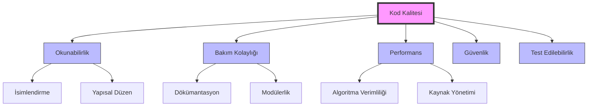
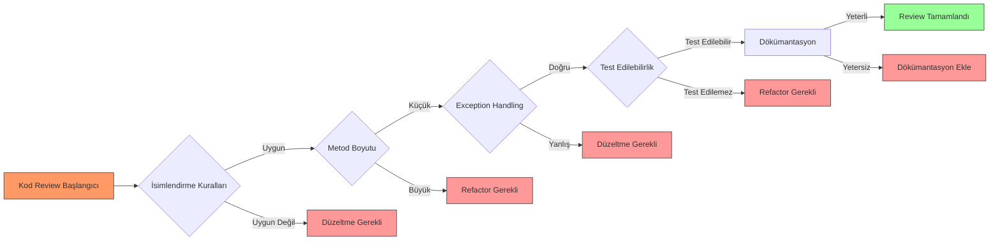

# Ek D: Java Programlama Kontrol Rehberi, Sik Hatalar ve Kod Kalitesi


```yaml
---
title: "Java Programlama Kontrol Rehberi: Sık Hatalar ve Kod Kalitesi"
subtitle: "Profesyonel Java Geliştiricileri İçin Kapsamlı Rehber"
author: "Teknik İçerik Ekibi"
date: "2024"
lang: "tr"
keywords: ["Java", "kod kalitesi", "hata desenleri", "kod review", "clean code"]
abstract: "Bu bölüm, Java programlamada sık karşılaşılan hataları, kod kalite standartlarını ve en iyi uygulamaları kapsamlı bir şekilde ele alır. Kod review süreçleri için checklist ve pratik örnekler sunar."
license: "CC BY-NC-SA 4.0"
---
```

## 27.1 Giriş

> **Pedagojik Not:** Bu bölüm, Java geliştiricilerinin günlük çalışmalarında karşılaştıkları yaygın hataları ve bunları önleme yöntemlerini öğretmeyi amaçlar. Her konsept, gerçek dünya senaryoları ve kod örnekleriyle desteklenmiştir.

Java programlama dünyasında, sadece çalışan kod yazmak yeterli değildir. Profesyonel bir geliştirici olarak, kodunuzun kalitesi, bakımı, okunabilirliği ve genişletilebilirliği de en az işlevselliği kadar önemlidir. Bu bölümde, sık yapılan hataları tanıyacak, kod kalite standartlarını öğrenecek ve etkili kod review süreçleri için gerekli araçları kazanacaksınız.

## 27.2 Kod Kalitesi Nedir ve Neden Önemlidir?

Kod kalitesi, bir yazılımın belirli standartlara uygunluğunu ve beklenen davranışları sergileme yeteneğini ifade eder. İyi kalite kod, sadece doğru çalışmakla kalmaz, aynı zamanda okunabilir, bakımı kolay ve genişletilebilir olmalıdır.



### 1.1 İyi Kalite Kodun Faydaları

İyi kalite kod, yazılım geliştirme sürecinde uzun vadeli faydalar sağlar:

- **Daha Az Hata:** Temiz kod, hata olasılığını azaltır
- **Daha Hızlı Geliştirme:** Okunabilir kod, yeni özellik eklemeyi kolaylaştırır
- **Daha Düşük Maliyet:** Bakım maliyetleri önemli ölçüde azalır
- **Daha İyi İşbirliği:** Ekip üyeleri birbirlerinin kodunu daha kolay anlar

### 1.2 Kötü Kodun Maliyeti

Kötü kod (technical debt) aşağıdaki sorunlara yol açar:

- Artan hata oranı
- Yavaş geliştirme hızı
- Yüksek bakım maliyeti
- Ekip moralinin düşmesi
- Müşteri memnuniyetsizliği

## 27.3 Sık Yapılan Hata Desenleri

Bu bölümde, Java geliştiricilerinin en sık karşılaştığı hata desenlerini inceleyeceğiz.

### 2.1 NullPointerException ve Null Güvenliği

NullPointerException, Java'da en yaygın runtime hatasıdır.

<!-- CODE_META: Java, NullSafetyExample.java, NullPointerException önleme örnekleri -->
```java
// NullSafetyExample.java
public class NullSafetyExample {
    
    // Hatalı yaklaşım
    public String getCityNameHatali(User user) {
        return user.getAddress().getCity().getName();
        // NullPointerException riski!
    }
    
    // Doğru yaklaşım - null kontrolleri ile
    public String getCityNameDogru(User user) {
        if (user == null) return "Bilinmiyor";
        Address address = user.getAddress();
        if (address == null) return "Bilinmiyor";
        City city = address.getCity();
        if (city == null) return "Bilinmiyor";
        return city.getName();
    }
    
    // Modern yaklaşım - Optional kullanımı
    public String getCityNameModern(User user) {
        return Optional.ofNullable(user)
            .map(User::getAddress)
            .map(Address::getCity)
            .map(City::getName)
            .orElse("Bilinmiyor");
    }
}
```

> **İpucu:** Java 8'den itibaren `Optional` sınıfı, null güvenliği için güçlü bir araç sunar. Ancak, Optional'ı metod parametreleri veya alanlar için değil, dönüş değerleri için kullanın.

### 2.2 Yanlış Döngü ve Koşul Yapıları

Döngü ve koşul yapılarındaki hatalar, mantıksal hatalara yol açar.

<!-- CODE_META: Java, LoopConditionExample.java, Döngü ve koşul hataları örnekleri -->
```java
// LoopConditionExample.java
public class LoopConditionExample {
    
    // Hatalı - sonsuz döngü
    public void sonsuzDongu() {
        int i = 0;
        while (i < 10) {
            System.out.println(i);
            // i değeri artırılmıyor!
        }
    }
    
    // Doğru
    public void dogruDongu() {
        for (int i = 0; i < 10; i++) {
            System.out.println(i);
        }
    }
    
    // Hatalı - off-by-one hatası
    public int[] yanlisDiziKopyala(int[] kaynak) {
        int[] hedef = new int[kaynak.length];
        for (int i = 0; i <= kaynak.length; i++) { // <= hatalı!
            hedef[i] = kaynak[i];
        }
        return hedef;
    }
    
    // Doğru
    public int[] dogruDiziKopyala(int[] kaynak) {
        int[] hedef = new int[kaynak.length];
        for (int i = 0; i < kaynak.length; i++) {
            hedef[i] = kaynak[i];
        }
        return hedef;
    }
}
```

### 2.3 Kaynak Yönetimi Hataları

Kaynakların doğru yönetilmemesi, bellek sızıntılarına ve performans sorunlarına yol açar.

<!-- CODE_META: Java, ResourceManagementExample.java, Kaynak yönetimi örnekleri -->
```java
// ResourceManagementExample.java
import java.io.*;

public class ResourceManagementExample {
    
    // Hatalı - kaynak kapatılmıyor
    public void hataliDosyaOkuma(String dosyaYolu) throws IOException {
        BufferedReader reader = new BufferedReader(new FileReader(dosyaYolu));
        String line = reader.readLine();
        System.out.println(line);
        // reader.close() çağrılmıyor!
    }
    
    // Doğru - try-with-resources (Java 7+)
    public void dogruDosyaOkuma(String dosyaYolu) {
        try (BufferedReader reader = new BufferedReader(new FileReader(dosyaYolu))) {
            String line = reader.readLine();
            System.out.println(line);
        } catch (IOException e) {
            e.printStackTrace();
        }
    }
    
    // Hatalı - finally bloğunda null kontrolü yok
    public void hataliKaynakYonetimi(String dosyaYolu) {
        BufferedReader reader = null;
        try {
            reader = new BufferedReader(new FileReader(dosyaYolu));
            // işlemler
        } catch (IOException e) {
            e.printStackTrace();
        } finally {
            reader.close(); // NullPointerException riski!
        }
    }
    
    // Doğru - finally bloğunda null kontrolü
    public void dogruKaynakYonetimi(String dosyaYolu) {
        BufferedReader reader = null;
        try {
            reader = new BufferedReader(new FileReader(dosyaYolu));
            // işlemler
        } catch (IOException e) {
            e.printStackTrace();
        } finally {
            if (reader != null) {
                try {
                    reader.close();
                } catch (IOException e) {
                    e.printStackTrace();
                }
            }
        }
    }
}
```

### 2.4 Concurrency Sorunları

Çoklu iş parçacığı (multithreading) ortamında sık karşılaşılan hatalar.

<!-- CODE_META: Java, ConcurrencyExample.java, Thread güvenliği örnekleri -->
```java
// ConcurrencyExample.java
public class ConcurrencyExample {
    private int counter = 0;
    
    // Hatalı - thread-safe değil
    public void incrementHatali() {
        counter++; // atomik değil!
    }
    
    // Doğru - synchronized metod
    public synchronized void incrementDogru() {
        counter++;
    }
    
    // Alternatif - AtomicInteger
    private java.util.concurrent.atomic.AtomicInteger atomicCounter = 
        new java.util.concurrent.atomic.AtomicInteger(0);
    
    public void incrementAtomic() {
        atomicCounter.incrementAndGet();
    }
}
```

### 2.5 String Immutable Yanılgısı

String'lerin immutable olduğunu unutmak, performans sorunlarına yol açar.

<!-- CODE_META: Java, StringExample.java, String immutable örnekleri -->
```java
// StringExample.java
public class StringExample {
    
    // Hatalı - çok sayıda String nesnesi oluşturur
    public String hataliStringBirlestirme(String[] kelimeler) {
        String sonuc = "";
        for (String kelime : kelimeler) {
            sonuc += kelime + " "; // Her iterasyonda yeni String!
        }
        return sonuc;
    }
    
    // Doğru - StringBuilder kullanımı
    public String dogruStringBirlestirme(String[] kelimeler) {
        StringBuilder sb = new StringBuilder();
        for (String kelime : kelimeler) {
            sb.append(kelime).append(" ");
        }
        return sb.toString().trim();
    }
}
```

### 2.6 Equals/hashCode Uyumsuzluğu

`equals()` ve `hashCode()` metodlarının uyumsuz implementasyonu, koleksiyonlarla ilgili hatalara yol açar.

<!-- CODE_META: Java, EqualsHashCodeExample.java, equals/hashCode örnekleri -->
```java
// EqualsHashCodeExample.java
import java.util.Objects;

public class EqualsHashCodeExample {
    private final int id;
    private final String name;
    
    public EqualsHashCodeExample(int id, String name) {
        this.id = id;
        this.name = name;
    }
    
    // Doğru equals implementasyonu
    @Override
    public boolean equals(Object o) {
        if (this == o) return true;
        if (o == null || getClass() != o.getClass()) return false;
        EqualsHashCodeExample that = (EqualsHashCodeExample) o;
        return id == that.id && Objects.equals(name, that.name);
    }
    
    // Doğru hashCode implementasyonu
    @Override
    public int hashCode() {
        return Objects.hash(id, name);
    }
}
```

## 27.4 Kod Review Checklist

Etkili bir kod review süreci için aşağıdaki kontrol listesini kullanın.



### 3.1 İsimlendirme Kuralları

| Öğe | Kural | Örnek |
|-----|-------|-------|
| Sınıf | PascalCase | `CustomerService` |
| Metod | camelCase | `getCustomerById()` |
| Değişken | camelCase | `customerName` |
| Sabit | UPPER_SNAKE_CASE | `MAX_RETRY_COUNT` |
| Paket | lowercase | `com.company.project` |

### 3.2 Metod Boyutu ve Sorumluluk

- **Tek Sorumluluk Prensibi:** Her metod tek bir iş yapmalı
- **Maksimum 20 satır:** Uzun metodlar refactor edilmeli
- **Anlamlı İsim:** Metod adı ne yaptığını açıklamalı

<!-- CODE_META: Java, MethodDesignExample.java, Metod tasarımı örnekleri -->
```java
// MethodDesignExample.java
public class MethodDesignExample {
    
    // Hatalı - çok fazla sorumluluk
    public void processOrder(Order order) {
        // Validasyon
        if (order == null || order.getItems().isEmpty()) {
            throw new IllegalArgumentException("Geçersiz sipariş");
        }
        
        // Fiyat hesaplama
        double total = 0;
        for (Item item : order.getItems()) {
            total += item.getPrice() * item.getQuantity();
        }
        
        // İndirim uygulama
        if (order.getCustomer().isPremium()) {
            total *= 0.9;
        }
        
        // Veritabanı kaydetme
        saveToDatabase(order, total);
        
        // Email gönderme
        sendEmail(order.getCustomer().getEmail(), total);
    }
    
    // Doğru - tek sorumluluk
    public void processOrderDogru(Order order) {
        validateOrder(order);
        double total = calculateTotal(order);
        double discountedTotal = applyDiscount(order, total);
        saveOrder(order, discountedTotal);
        sendConfirmationEmail(order, discountedTotal);
    }
    
    private void validateOrder(Order order) {
        if (order == null || order.getItems().isEmpty()) {
            throw new IllegalArgumentException("Geçersiz sipariş");
        }
    }
    
    private double calculateTotal(Order order) {
        return order.getItems().stream()
            .mapToDouble(item -> item.getPrice() * item.getQuantity())
            .sum();
    }
    
    private double applyDiscount(Order order, double total) {
        return order.getCustomer().isPremium() ? total * 0.9 : total;
    }
}
```

### 3.3 Exception Handling

- **Checked vs Unchecked:** Doğru exception tipini seçin
- **Anlamlı Mesaj:** Exception mesajları açıklayıcı olmalı
- **Try-with-resources:** Kaynakları otomatik kapatın
- **Asla boş catch bloğu:** Exception'ı yutmayın

### 3.4 Test Edilebilirlik

- **Dependency Injection:** Bağımlılıkları enjekte edin
- **Interface Kullanımı:** Somut sınıflar yerine interface'ler
- **Mock Desteği:** Test edilebilir kod yazın

### 3.5 Dökümantasyon

- **Javadoc:** Public API'ler için zorunlu
- **Karmaşık Mantık:** Algoritma açıklamaları
- **TODO'ları Temizleyin:** Geçici çözümleri işaretleyin

## 27.5 En İyi Uygulamalar

### 4.1 SOLID Prensipleri

SOLID, nesne yönelimli programlamada beş temel prensibi ifade eder:

| Prensip | Açıklama |
|---------|----------|
| **S**ingle Responsibility | Bir sınıfın tek bir sorumluluğu olmalı |
| **O**pen/Closed | Genişletmeye açık, değişikliğe kapalı |
| **L**iskov Substitution | Alt sınıflar, üst sınıfların yerine geçebilmeli |
| **I**nterface Segregation | Küçük, spesifik interface'ler |
| **D**ependency Inversion | Soyutlamalara bağımlı olun, somut sınıflara değil |

### 4.2 Design Pattern'ler

Yaygın kullanılan tasarım desenleri:

- **Singleton:** Tek bir örnek
- **Factory Method:** Nesne oluşturma
- **Observer:** Olay bildirimi
- **Strategy:** Algoritma değiştirme

### 4.3 Clean Code Teknikleri

> **Temiz Kod İlkeleri:**
> - Kodu yorumlarla değil, kodun kendisiyle açıklayın
> - Anlamlı isimler kullanın
> - Fonksiyonlar küçük olmalı
> - DRY (Don't Repeat Yourself) prensibi
> - YAGNI (You Aren't Gonna Need It)

### 4.4 Performans İyileştirmeleri

<!-- CODE_META: Java, PerformanceExample.java, Performans iyileştirme örnekleri -->
```java
// PerformanceExample.java
import java.util.*;

public class PerformanceExample {
    
    // Hatalı - gereksiz nesne oluşturma
    public boolean hataliContains(List<String> list, String value) {
        return list.contains(new String(value)); // Gereksiz String nesnesi!
    }
    
    // Doğru
    public boolean dogruContains(List<String> list, String value) {
        return list.contains(value);
    }
    
    // Hatalı - StringBuilder yerine String birleştirme
    public String hataliLogOlustur(String[] messages) {
        String log = "";
        for (String msg : messages) {
            log += msg + "\n"; // Her seferinde yeni String
        }
        return log;
    }
    
    // Doğru
    public String dogruLogOlustur(String[] messages) {
        StringBuilder sb = new StringBuilder();
        for (String msg : messages) {
            sb.append(msg).append("\n");
        }
        return sb.toString();
    }
    
    // Hatalı - ArrayList yerine LinkedList kullanımı
    public void hataliListeKullanimi() {
        List<Integer> list = new LinkedList<>();
        for (int i = 0; i < 100000; i++) {
            list.add(i); // LinkedList'te add O(1), get O(n)
        }
        for (int i = 0; i < list.size(); i++) {
            System.out.println(list.get(i)); // Çok yavaş!
        }
    }
    
    // Doğru
    public void dogruListeKullanimi() {
        List<Integer> list = new ArrayList<>();
        for (int i = 0; i < 100000; i++) {
            list.add(i); // ArrayList'te add O(1)
        }
        for (int i = 0; i < list.size(); i++) {
            System.out.println(list.get(i)); // ArrayList'te get O(1)
        }
    }
    
    // Alternatif - for-each döngüsü
    public void dogruListeKullanimiForEach() {
        List<Integer> list = new ArrayList<>();
        for (int i = 0; i < 100000; i++) {
            list.add(i);
        }
        for (Integer value : list) {
            System.out.println(value);
        }
    }
}
```

## 27.6 Özet

Bu bölümde, Java programlamada kod kalitesinin önemini, sık yapılan hata desenlerini, kod review checklist'ini ve en iyi uygulamaları öğrendik.

### Anahtar Noktalar

1. **Kod kalitesi** sadece çalışan kod değil, okunabilir, bakımı kolay ve genişletilebilir koddur
2. **NullPointerException** en yaygın hatadır; Optional ve null kontrolleri kullanın
3. **Kaynak yönetimi** için try-with-resources kullanın
4. **Concurrency** sorunları için synchronized veya Atomic sınıfları kullanın
5. **String işlemleri** için StringBuilder kullanın
6. **equals() ve hashCode()** her zaman birlikte override edin
7. **Kod review** sürecinde isimlendirme, metod boyutu, exception handling ve test edilebilirliği kontrol edin
8. **SOLID prensipleri** ve **Clean Code** tekniklerini uygulayın

### Terim Sözlüğü

| Terim | Açıklama |
|-------|----------|
| **Technical Debt** | Kötü kodun gelecekte yaratacağı ek maliyet |
| **NullPointerException** | Null referans üzerinden metod çağırma hatası |
| **Thread-safe** | Çoklu iş parçacığında güvenli çalışan kod |
| **Immutable** | Oluşturulduktan sonra değiştirilemeyen nesne |
| **Refactoring** | Kodu dış davranışını değiştirmeden iyileştirme |
| **SOLID** | Nesne yönelimli programlamada beş temel prensip |
| **DRY** | Don't Repeat Yourself - Kendini Tekrarlama |
| **YAGNI** | You Aren't Gonna Need It - İhtiyacın Olmayacak |

### Kontrol Soruları

1. Kod kalitesi neden önemlidir? En az üç faydasını sayın.
2. NullPointerException'ı önlemek için hangi yöntemleri kullanabilirsiniz?
3. try-with-resources ifadesinin avantajları nelerdir?
4. equals() ve hashCode() metodları neden birlikte override edilmelidir?
5. Kod review sırasında hangi beş ana alanı kontrol etmelisiniz?
6. SOLID prensiplerini kısaca açıklayın.
7. StringBuilder kullanmanın String birleştirmeye göre avantajı nedir?
8. Thread-safe olmayan bir kodu nasıl thread-safe hale getirebilirsiniz?

### Alıştırmalar

**Alıştırma 1: Null Güvenliği**
Aşağıdaki kodu null-safe hale getirin:
<!-- CODE_META
id: ek-d_kod01
chapter_id: ek-d
kind: example
title: "Kod 1"
file: "Ornek00.java"
mainClass: Ornek00
extract: true
test: compile
github: true
qr: dual
-->

```java
public String getUserFullName(User user) {
    return user.getFirstName() + " " + user.getLastName();
}
```

**Alıştırma 2: Kaynak Yönetimi**
Aşağıdaki kodu try-with-resources kullanarak yeniden yazın:
<!-- CODE_META
id: ek-d_kod02
chapter_id: ek-d
kind: example
title: "Kod 2"
file: "Ornek01.java"
mainClass: Ornek01
extract: true
test: compile
github: true
qr: dual
-->

```java
public void readFile(String path) throws IOException {
    FileInputStream fis = new FileInputStream(path);
    BufferedReader br = new BufferedReader(new InputStreamReader(fis));
    String line;
    while ((line = br.readLine()) != null) {
        System.out.println(line);
    }
    br.close();
}
```

**Alıştırma 3: Concurrency**
Aşağıdaki sınıfı thread-safe hale getirin:
<!-- CODE_META
id: ek-d_kod03
chapter_id: ek-d
kind: example
title: "Kod 3"
file: "Ornek02.java"
mainClass: Ornek02
extract: true
test: compile
github: true
qr: dual
-->

```java
public class Counter {
    private int count = 0;
    
    public void increment() {
        count++;
    }
    
    public int getCount() {
        return count;
    }
}
```

**Alıştırma 4: Kod Review**
Aşağıdaki kodu review edin ve hataları bulun:
<!-- CODE_META
id: ek-d_kod04
chapter_id: ek-d
kind: example
title: "Kod 4"
file: "Ornek03.java"
mainClass: Ornek03
extract: true
test: compile
github: true
qr: dual
-->

```java
public class CustomerService {
    public void saveCustomer(String name, String email, String phone) {
        // TODO: validasyon ekle
        Customer customer = new Customer();
        customer.setName(name);
        customer.setEmail(email);
        customer.setPhone(phone);
        // veritabanına kaydet
        database.save(customer);
        // email gönder
        emailService.send(email, "Hoşgeldiniz!");
    }
}
```

**Alıştırma 5: Performans**
Aşağıdaki kodu performans açısından iyileştirin:
<!-- CODE_META
id: ek-d_kod05
chapter_id: ek-d
kind: example
title: "Kod 5"
file: "Ornek04.java"
mainClass: Ornek04
extract: true
test: compile
github: true
qr: dual
-->

```java
public String generateReport(List<Transaction> transactions) {
    String report = "";
    for (Transaction t : transactions) {
        report += t.getId() + " - " + t.getAmount() + "\n";
    }
    return report;
}
```

---

> **Son Not:** Kod kalitesi bir yolculuktur, varış noktası değil. Sürekli öğrenme ve iyileştirme ile kodunuzu her gün biraz daha iyi hale getirebilirsiniz. Unutmayın: "Her zaman kodu, bir sonraki geliştiricinin bir psikopat olacağını ve senin adresini bildiğini düşünerek yaz."