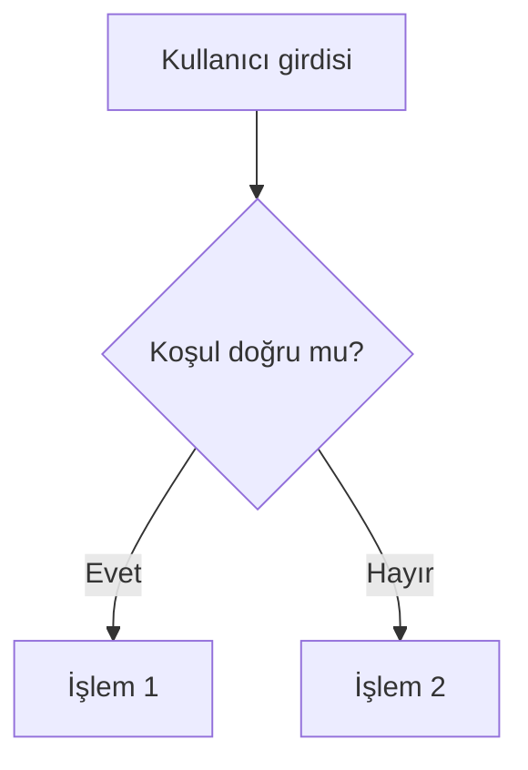

# Java'nın Temelleri — Çıktı Format Standardı v1.3

**Amaç:** Bölüm içeriklerinin Markdown biçiminde, Pandoc/DOCX'e sorunsuz dönüştürülebilir, akademik ders kitabına uygun ve otomasyon tarafından güvenle ayrıştırılabilir şekilde üretilmesini sağlamak.

---

## 1. Temel ilke

- Model yalnızca **Markdown** üretir.
- Görünen bölüm, alt başlık, şekil, tablo, diyagram ve kod numaraları Markdown içinde elle verilmez.
- Numaralar `book_manifest.yaml` sırasına göre build sırasında atanır.
- Otomasyon bilgileri HTML yorum blokları içinde tutulmalıdır.
- Kod blokları, tablolar, diyagramlar ve uyarı kutuları Markdown sözdizimine uygun olmalıdır.

---

## 2. YAML front matter

```yaml
---
title: "Karar Yapıları: if, else-if ve switch"
subtitle: "Java'nın Temelleri"
author: "İsmail Kırbaş"
date: "2026"
lang: tr-TR
documentclass: report
toc: true
toc-depth: 3
numbersections: true

chapter_id: "karar-yapilari"
chapter_type: "core"
automation_profile: "java_book_v1_3"
numbering: "auto"
github_slug: "karar-yapilari"
qr_policy: "dual_for_code_examples"
asset_policy: "manual_override"
---
```

Zorunlu otomasyon alanları: `chapter_id`, `automation_profile`, `numbering`, `github_slug`, `qr_policy`, `asset_policy`.

---

## 3. Başlık hiyerarşisi

Doğru:

```markdown
# Karar Yapıları: if, else-if ve switch

## Bölümün yol haritası

## Öğrenme çıktıları

### if yapısının temel kullanımı
```

Yanlış:

```markdown
# Bölüm 8: Karar Yapıları: if, else-if ve switch

## 8.1 Bölümün yol haritası
```

---

## 4. Java kod blokları

Çıkarılacak veya test edilecek her Java kod bloğundan hemen önce `CODE_META` bulunmalıdır.

````markdown
<!-- CODE_META
id: karar-yapilari_kod01
chapter_id: karar-yapilari
kind: example
title: "Temel if kullanımı"
file: "TemelIfKullanimi.java"
mainClass: "TemelIfKullanimi"
extract: true
test: compile
github: true
qr: dual
-->

```java
// Dosya: TemelIfKullanimi.java
public class TemelIfKullanimi {
    public static void main(String[] args) {
        int notDegeri = 75;

        if (notDegeri >= 60) {
            System.out.println("Geçti");
        } else {
            System.out.println("Kaldı");
        }
    }
}
```
````

### CODE_META alanları

| Alan | Zorunlu | Açıklama |
|---|---:|---|
| `id` | Evet | Kalıcı kod kimliği |
| `chapter_id` | Evet | Bölüm kimliği |
| `kind` | Evet | `example`, `application`, `snippet`, `broken_example`, `fixed_example` |
| `title` | Evet | Kod başlığı |
| `file` | Evet | Üretilecek `.java` dosyası |
| `mainClass` | Derlenecekse evet | `public class` adı |
| `extract` | Evet | Kod dosyaya çıkarılacak mı? |
| `test` | Evet | `compile`, `run`, `skip` |
| `github` | Evet | GitHub'a gönderilecek mi? |
| `qr` | Evet | `dual`, `source`, `page`, `none` |

Hatalı kodlar `kind: broken_example`, `test: skip`, `github: false`, `qr: none` olarak işaretlenmelidir.

---

## 5. Mermaid diyagramları

Her Mermaid bloğundan önce `MERMAID_META` bulunmalıdır.

````markdown
<!-- MERMAID_META
id: karar-yapilari_diyagram01
chapter_id: karar-yapilari
title: "Karar yapılarında program akışı"
auto_path: "assets/auto/mermaid/karar-yapilari_diyagram01.png"
manual_path: "assets/manual/mermaid/karar-yapilari_diyagram01.png"
locked_path: "assets/locked/mermaid/karar-yapilari_diyagram01.png"
final_path: "assets/final/mermaid/karar-yapilari_diyagram01.png"
manual_override: true
width_cm: 12.5
-->



**Diyagram:** Karar yapılarında program akışı.
````

Final DOCX/PDF içinde ham Mermaid kodu görünmemelidir.

---

## 6. Görsel ve screenshot varlıkları

Mermaid dışındaki görseller için `ASSET_META` kullanılabilir.

```markdown
<!-- ASSET_META
id: gui-form_screenshot01
chapter_id: gui-formlar
type: screenshot
title: "Öğrenci kayıt formu ekranı"
auto_path: "assets/auto/screenshots/gui-form_screenshot01.png"
manual_path: "assets/manual/screenshots/gui-form_screenshot01.png"
locked_path: "assets/locked/screenshots/gui-form_screenshot01.png"
final_path: "assets/final/screenshots/gui-form_screenshot01.png"
manual_override: true
width_cm: 13
caption: "Öğrenci kayıt formunun temel bileşenleri"
-->
```

Markdown içinde final asset yolu kullanılmalıdır:

```markdown

```

---

## 7. Manuel görsel önceliği

Öncelik sırası:

1. `assets/manual/`
2. `assets/locked/`
3. `assets/auto/`
4. kaynak tanım

`assets/manual/` ve `assets/locked/` hiçbir otomatik temizlik işleminde silinmez. QR kod görsellerinin matrisi manuel değiştirilmemelidir.

---

## 8. QR politikası

QR kodları `CODE_META.qr` değerine göre build sırasında üretilir.

| Değer | Anlam |
|---|---|
| `dual` | Kod sayfası QR + kaynak kod QR |
| `source` | Yalnızca kaynak kod QR |
| `page` | Yalnızca açıklamalı kod sayfası QR |
| `none` | QR üretilmez |

QR üretimi GitHub URL manifesti kesinleşmeden yapılmamalıdır.

---

## 9. Tablo ve şekil başlıkları

Tablo, şekil, diyagram ve kod numaraları elle verilmemelidir.

Doğru:

```markdown
**Tablo:** Karar yapılarının karşılaştırılması.
```

Yanlış:

```markdown
**Tablo 8.2:** Karar yapılarının karşılaştırılması.
```

---

## 10. Bölüm sonu

Kaynak Markdown sonunda elle `BÖLÜM SONU` yazılmamalıdır. Bölüm sonu etiketi, sayfa sonu ve yeni bölüm başlangıcı build/Pandoc aşamasında yönetilmelidir.
