# Bölüm 1: Java’ya Giriş, Çalışma Modeli ve Geliştirme Ortamı

## 1.1 Bölümün yol haritası

Programlama öğrenmeye başlarken yalnızca bir dilin komutlarını ezberlemek yeterli değildir. Bir programın nasıl yazıldığını, nasıl derlendiğini, nasıl çalıştırıldığını ve hata verdiğinde nasıl inceleneceğini anlamak gerekir. Bu bölüm, Java’ya başlangıç için gerekli kavramsal ve uygulamalı zemini birlikte kurar.

Bu bölümde şu sorulara yanıt aranacaktır:

1. Java nedir ve neden yaygın olarak kullanılır?
2. Java hangi tür uygulamalarda karşımıza çıkar?
3. Programlama mantığı temel düzeyde nasıl açıklanabilir?
4. Kaynak kod, derleyici, bytecode ve JVM ne anlama gelir?
5. JVM, JRE ve JDK kavramları birbirinden nasıl ayrılır?
6. Java’nın platform bağımsız çalışması ne demektir?
7. Java geliştirme ortamında JDK, IDE ve terminalin rolleri nelerdir?
8. `javac` ve `java` komutları arasındaki fark nedir?
9. PATH ayarı Java geliştirme sürecinde neden önemlidir?
10. Debug ve breakpoint kavramları başlangıç düzeyinde nasıl anlaşılmalıdır?

> **🎯 Bölüm Hedefi:** Bu bölümün sonunda öğrenci, Java programlarının kaynak koddan çalışan programa dönüşme sürecini açıklayabilecek, JDK tabanlı temel geliştirme ortamını tanıyabilecek ve basit bir Java programını IDE veya terminal üzerinden çalıştırma akışını yorumlayabilecektir.

Bu bölümde kurulum ekranları, ileri IDE ayarları, Maven, Gradle, modüler Java ve profesyonel build süreçleri ele alınmayacaktır. Amaç, öğrencinin Java dünyasına sağlam ve sade bir başlangıç yapmasıdır.

## 1.2 Bölümün konumu ve pedagojik rolü

Bu bölüm, kitabın başlangıç bölümüdür. Öğrencinin daha önce Java bildiği varsayılmaz. Öğrenciden beklenen yalnızca temel bilgisayar kullanımı, dosya ve klasör kavramına aşinalık ve programlama öğrenmeye istekli olmasıdır.

Bölüm iki temel rol üstlenir. İlk olarak Java’nın ne olduğu, hangi amaçlarla kullanıldığı ve programlama mantığının nasıl düşünülmesi gerektiği açıklanır. İkinci olarak bu kavramsal çerçeve JDK, IDE, terminal, derleme, çalıştırma ve debug kavramlarıyla uygulama ortamına taşınır.

> **⚠️ Dikkat:** Bu bölümde sınıf ve nesne kavramları ayrıntılı biçimde işlenmeyecektir. Şimdilik `class`, Java programının yazıldığı temel yapı olarak görülmelidir.

Kitabın ilerleyen bölümlerinde değişkenler, veri tipleri, operatörler, kullanıcı girdisi, karar yapıları, döngüler, metotlar, diziler ve metin işlemleri adım adım ele alınacaktır. Bu bölüm, tüm bu konuların üzerinde yükseleceği ilk teknik zemini hazırlar.

## 1.3 Öğrenme çıktıları

Bu bölüm tamamlandığında öğrenci:

1. Java’nın genel kullanım alanlarını sade biçimde açıklayabilir.
2. Programlama sürecini girdi, işlem ve çıktı mantığıyla yorumlayabilir.
3. Kaynak kod, derleyici, bytecode ve JVM kavramlarını sıralı biçimde açıklayabilir.
4. `.java` ve `.class` dosyalarının rollerini karşılaştırabilir.
5. Java SE, JVM, JRE ve JDK kavramlarını ayırt edebilir.
6. Java kodu geliştirmek için JDK’nın neden gerekli olduğunu gerekçelendirebilir.
7. IDE ile terminal arasındaki temel farkı açıklayabilir.
8. `javac` ve `java` komutlarının görevlerini ayırt edebilir.
9. PATH ayarı yanlış olduğunda oluşabilecek temel hataları yorumlayabilir.
10. Dosya adı ile `public class` adı arasındaki ilişkiyi açıklayabilir.
11. Debug ve breakpoint kavramlarını başlangıç düzeyinde kullanabilir.
12. Basit bir Java programını hem IDE hem terminal akışıyla test edebilir.

## 1.4 Ön bilgi ve başlangıç varsayımları

Bu bölüm, öğrencinin aşağıdaki konularda temel düzeyde bilgiye sahip olduğunu varsayar:

1. Bilgisayarda dosya ve klasör oluşturma
2. Bir metin dosyasını kaydetme
3. Program ve uygulama kavramını ayırt edebilme
4. Klavye ve ekran üzerinden temel bilgisayar kullanımı
5. Terminal veya komut satırı kavramını en azından duymuş olma
6. Programlama öğrenmeye başlangıç düzeyinde motivasyon

Bu bölümde Java sözdiziminin tüm ayrıntıları açıklanmayacaktır. `class`, `main`, süslü parantez ve noktalı virgül gibi yapılar kullanılacak; ancak bunların sistematik açıklaması sonraki bölümde genişletilecektir.

## 1.5 Java nedir ve neden önemlidir?

Java, genel amaçlı bir programlama dilidir. Genel amaçlı olması, yalnızca tek bir uygulama türüne bağlı kalmadığını gösterir. Java ile konsol uygulamaları, masaüstü uygulamaları, kurumsal yazılımlar, web arka uç sistemleri ve veritabanı bağlantılı uygulamalar geliştirilebilir.

Java, özellikle taşınabilirlik, güçlü standart kütüphane desteği, geniş geliştirici topluluğu ve uzun yıllardır kullanılan kurumsal altyapısı nedeniyle bilgisayar mühendisliği eğitiminde önemli bir yere sahiptir. Bu kitapta Java, hem temel programlama mantığını öğretmek hem de küçük ama tamamlanabilir uygulamalar geliştirmek için kullanılacaktır.

> **💡 İpucu:** Bu kitapta Java, yalnızca komut ezberletmek için değil, programlama mantığını adım adım kurmak için kullanılacaktır.

### 1.5.1 Java’nın kullanım alanları

Java farklı alanlarda kullanılabilir. Başlangıç düzeyinde bunların tamamını ayrıntılı bilmek gerekmez; ancak dilin neden yaygın olduğunu anlamak için kullanım alanlarını görmek faydalıdır.

| Kullanım alanı | Kısa açıklama |
|---|---|
| Konsol uygulamaları | Komut satırında çalışan temel programlar |
| Masaüstü uygulamaları | Swing gibi araçlarla arayüzlü uygulamalar |
| Kurumsal yazılımlar | Büyük ölçekli iş uygulamaları |
| Web arka uç sistemleri | Sunucu tarafında çalışan servisler |
| Eğitim uygulamaları | Algoritma ve programlama öğretimi |
| Veritabanı uygulamaları | JDBC ile veri tabanı bağlantılı programlar |

Bu kitapta önce konsol uygulamalarıyla başlanacak, daha sonra dosya işlemleri, koleksiyonlar, basit sınıf kullanımı, Swing tabanlı GUI ve temel JDBC konularına geçilecektir.

### 1.5.2 Java öğrenmenin programlama mantığına katkısı

Java, programlama mantığını öğrenmek için düzenli bir yapı sunar. Kod yazarken değişken tanımlama, işlem yapma, koşul kurma, döngü oluşturma, metot yazma ve veriyi düzenli biçimde yönetme gibi temel beceriler kazanılır.

Bir programlama dili öğrenirken amaç yalnızca sözdizimini bilmek değildir. Önemli olan, bir problemi küçük parçalara ayırabilmek ve bu parçaları bilgisayarın anlayacağı adımlara dönüştürebilmektir.

Örneğin “öğrencinin not ortalamasını hesaplama” problemi şu adımlara ayrılabilir:

1. Öğrencinin notlarını al.
2. Notları topla.
3. Not sayısına böl.
4. Ortalamayı ekrana yazdır.
5. Gerekirse başarı durumunu yorumla.

Bu adımlar, daha sonra Java koduna dönüştürülebilir. Bu nedenle programlama, düşünme biçimiyle yakından ilişkilidir.

## 1.6 Programlama mantığına ilk bakış

Programlama, bir problemi bilgisayara adım adım çözdürme sürecidir. Bilgisayar kendi başına problemi anlamaz. Programcı, problemi açık ve kesin adımlara dönüştürür.

Bir program genellikle üç temel bölümden oluşur:

1. Girdi
2. İşlem
3. Çıktı

Girdi, programın kullandığı başlangıç bilgisidir. İşlem, bu bilgi üzerinde yapılan hesaplama veya düzenlemedir. Çıktı ise programın kullanıcıya sunduğu sonuçtur.

| Programlama öğesi | Günlük karşılığı | Java’daki karşılığı |
|---|---|---|
| Girdi | Kullanıcının verdiği bilgi | Klavye girdisi veya sabit değer |
| İşlem | Bilgiyi düzenleme | Java ifadeleri |
| Çıktı | Sonucu gösterme | `System.out.println()` |
| Program | Adımlar bütünü | `.java` dosyası |

Başlangıçta bazı programlar kullanıcıdan veri almayabilir. Örneğin yalnızca ekrana bilgi yazdıran bir programda girdi sabit metinlerden oluşabilir. İlerleyen bölümlerde kullanıcıdan veri alma, karar verme ve tekrar eden işlemler daha ayrıntılı ele alınacaktır.

> **🎯 Sınav Notu:** Bir programı anlamanın en pratik yollarından biri, programı girdi–işlem–çıktı mantığıyla incelemektir.

## 1.7 Java çalışma modeli: kaynak koddan çalışan programa

Java programlama sürecini anlamak için kaynak koddan çalışan programa uzanan yolu bilmek gerekir. Öğrenci Java kodunu yazar; ancak bilgisayar bu kodu doğrudan çalıştırmaz. Kod önce derlenir, sonra Java çalışma ortamı tarafından çalıştırılır.

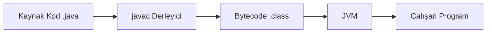

**Diyagram 1.1:** Java programının kaynak koddan çalışan programa dönüşme akışı.

**Görsel üretim notu:** Bu Mermaid diyagramı final DOCX/PDF üretiminden önce PNG’ye dönüştürülmeli; ham `flowchart LR` kodu final çıktıda görünmemelidir. Önerilen görsel genişliği 12–13 cm aralığında tutulmalıdır.

### 1.7.1 Kaynak kod nedir?

Kaynak kod, programcının yazdığı okunabilir komutlardan oluşur. Java’da kaynak kod dosyaları genellikle `.java` uzantısıyla kaydedilir.

Örneğin aşağıdaki dosya bir Java kaynak kod dosyası olabilir:

```text
MerhabaJava.java
```

Bu dosyanın içinde Java sözdizimine uygun komutlar bulunur. Kaynak kod, programcı tarafından okunabilir ve düzenlenebilir.

### 1.7.2 Derleyici nedir?

Derleyici, kaynak kodu başka bir biçime dönüştüren araçtır. Java’da bu görevi genellikle `javac` adlı derleyici üstlenir. `javac`, `.java` uzantılı kaynak kod dosyasını derleyerek `.class` uzantılı bytecode dosyası üretir.

### 1.7.3 Bytecode nedir?

Bytecode, Java kaynak kodunun derlendikten sonra dönüştüğü ara biçimdir. Bu dosyalar genellikle `.class` uzantılıdır. Bytecode, doğrudan belirli bir işletim sistemine ait makine kodu değildir. Java Sanal Makinesi tarafından çalıştırılmak üzere tasarlanmıştır.

Bu yapı, Java’nın platform bağımsızlık yaklaşımının temelini oluşturur. Aynı bytecode, uygun JVM bulunan farklı sistemlerde çalıştırılabilir.

### 1.7.4 JVM’nin rolü nedir?

JVM, Java Virtual Machine ifadesinin kısaltmasıdır. Türkçede Java Sanal Makinesi olarak ifade edilir. JVM’nin temel görevi, derlenmiş Java bytecode’unu çalıştırmaktır.

Bir Java programı Windows, Linux veya macOS üzerinde çalışabilir. Ancak bunun için ilgili sistemde Java programlarını çalıştırabilecek uygun bir Java çalışma ortamı bulunmalıdır.

### 1.7.5 Java hem derlenen hem yorumlanan bir dil midir?

Java kodu önce derlenir. Derleme sonucunda bytecode üretilir. Bu bytecode, JVM tarafından çalışma zamanında yürütülür. Bu nedenle Java için çoğu zaman hem derleme hem de çalışma zamanı yürütme süreci birlikte düşünülür.

Başlangıç düzeyinde şu ayrımı bilmek yeterlidir:

1. Programcı `.java` dosyasını yazar.
2. Derleyici `.class` dosyasını üretir.
3. JVM `.class` dosyasındaki bytecode’u çalıştırır.

> **🔍 Derinlemesine:** JVM yalnızca komutları satır satır yorumlayan basit bir yapı değildir. Modern JVM’ler çalışma zamanı optimizasyonları da yapabilir. Ancak bu kitabın başlangıç bölümlerinde JVM’nin temel rolünü bytecode çalıştırma olarak düşünmek yeterlidir.

## 1.8 JVM, JRE ve JDK ayrımı

Java öğrenmeye başlayan öğrencilerin en sık karıştırdığı kavramlardan üçü JVM, JRE ve JDK’dır. Bu kavramlar birbirine bağlıdır; ancak görevleri aynı değildir.

| Kavram | Açılım | Temel görev | Öğrenci için anlamı |
|---|---|---|---|
| JVM | Java Virtual Machine | Bytecode çalıştırır | Programın platformda çalışmasını sağlar |
| JRE | Java Runtime Environment | Çalışma ortamı sağlar | Java uygulamasını çalıştırmak için gerekir |
| JDK | Java Development Kit | Geliştirme araçları sağlar | Java kodu yazmak ve derlemek için gerekir |

### 1.8.1 JVM: Java Sanal Makinesi

JVM, Java bytecode’unu çalıştıran yapıdır. `.class` dosyası JVM tarafından işlenir ve program çalıştırılır. Platform bağımsızlık fikrinin merkezinde JVM bulunur.

### 1.8.2 JRE: Java Çalışma Ortamı

JRE, Java Runtime Environment ifadesinin kısaltmasıdır. Java uygulamalarını çalıştırmak için gerekli ortamı sağlar. Kavramsal olarak JRE içinde JVM ve çalışma zamanı kütüphaneleri yer alır.

Güncel Java dağıtımlarında kurulum paketlerinin yapısı değişebilse de, başlangıç düzeyinde JRE kavramı “Java uygulamasını çalıştırmak için gerekli ortam” olarak düşünülmelidir.

### 1.8.3 JDK: Java Geliştirme Kiti

JDK, Java Development Kit ifadesinin kısaltmasıdır. Java programı geliştirmek için gerekli araçları içerir. Derleyici, çalışma araçları ve standart kütüphaneler bu geliştirme ortamının parçalarıdır.

Java kodu yazmak, derlemek ve çalıştırmak isteyen bir öğrenci için temel ihtiyaç JDK’dır.

> **🎯 Sınav Notu:** Java kodu geliştirmek için JDK gerekir. JRE tek başına uygulama çalıştırmaya yöneliktir; derleme araçlarını içermez.

## 1.9 Java SE ve kitabın kapsamı

Java ekosistemi oldukça geniştir. Bu nedenle başlangıç düzeyinde hangi alanın öğrenileceğini netleştirmek gerekir. Bu kitapta temel alınan alan Java SE’dir.

Java SE, Java Standard Edition anlamına gelir. Temel dil yapıları, standart kütüphaneler, veri tipleri, koleksiyonlar, dosya işlemleri ve temel masaüstü geliştirme gibi konular Java SE kapsamında ele alınabilir.

Bu kitapta ağırlıklı olarak şu beceriler kazandırılacaktır:

1. Java programının temel yapısını anlama
2. Değişken ve veri tipi kullanma
3. Operatörlerle işlem yapma
4. Kullanıcıdan veri alma
5. Karar yapıları ve döngülerle akış kontrolü kurma
6. Metotlarla kodu parçalara ayırma
7. Diziler, String işlemleri ve koleksiyonlarla veri yönetme
8. Hata yönetimi ve dosya işlemleri yapma
9. Basit sınıf ve nesne kullanımı
10. Swing ile temel GUI uygulaması geliştirme
11. JDBC ile başlangıç düzeyinde veritabanı bağlantısı kurma

> **🔍 Derinlemesine:** Java ekosistemi oldukça geniştir. Bu kitap, öğrencinin önce sağlam bir Java SE temeli kazanmasına odaklanır.

Bu kitap, ileri düzey nesneye yönelik tasarım kitabı değildir. Kalıtım, çok biçimlilik, soyut sınıflar, tasarım desenleri ve ileri mimari konular yalnızca gerektiği ölçüde ele alınacaktır.

## 1.10 Java geliştirme ortamının temel bileşenleri

Java kodunu yazmak ve çalıştırmak için yalnızca kavramları bilmek yeterli değildir. Öğrencinin temel geliştirme araçlarını da tanıması gerekir.

| Bileşen | Görevi | Başlangıç düzeyi yorum |
|---|---|---|
| JDK | Java geliştirme araçlarını sağlar | Kod yazmak ve derlemek için gerekir |
| IDE | Kod yazma ve proje yönetimini kolaylaştırır | Hataları erken görmeye yardımcı olur |
| Terminal | Komutlarla derleme ve çalıştırma sağlar | Arka plandaki süreci görünür kılar |
| `javac` | `.java` dosyasını derler | `.class` dosyası üretir |
| `java` | Derlenmiş sınıfı çalıştırır | Program çıktısını gösterir |
| PATH | Komutların sistemce bulunmasını sağlar | Yanlışsa `javac` bulunamayabilir |

### 1.10.1 JDK neden gereklidir?

JDK, Java programı geliştirmek için gerekli temel araçları sağlar. Öğrenci bir `.java` dosyası yazdığında bu dosyanın derlenmesi gerekir. Derleme için kullanılan temel araç `javac` komutudur ve bu araç JDK içinde bulunur.

Yalnızca hazır bir Java uygulamasını çalıştırmak isteyen kullanıcı için çalışma ortamı yeterli olabilir. Ancak bu kitabı takip eden öğrenci kod yazacağı, derleyeceği ve test edeceği için JDK kullanmalıdır.

### 1.10.2 IDE nedir?

IDE, Integrated Development Environment ifadesinin kısaltmasıdır. Türkçede bütünleşik geliştirme ortamı olarak ifade edilebilir. IDE, kod yazma, dosya yönetme, hata görme, program çalıştırma ve debug yapma gibi işlemleri tek bir ortamda sunar.

Başlangıç düzeyinde bir IDE’nin sağladığı temel kolaylıklar şunlardır:

1. Kod renklendirme
2. Otomatik tamamlama
3. Yazım hatalarını erken gösterme
4. Programı tek düğmeyle çalıştırma
5. Proje dosyalarını düzenli gösterme
6. Debug ve breakpoint desteği

> **💡 İpucu:** IDE kullanmak işleri kolaylaştırır; ancak derleme ve çalıştırma mantığını anlamak için terminal akışını da görmek gerekir.

### 1.10.3 Terminalde derleme ve çalıştırma

Terminal, Java programının arka planda hangi adımlarla çalıştığını görmek için yararlıdır. En temel akış şu şekildedir:

```bash
javac MerhabaJava.java
java MerhabaJava
```

İlk komut kaynak kodu derler. İkinci komut derlenmiş sınıfı çalıştırır.

> **⚠️ Dikkat:** `java MerhabaJava.class` komutu başlangıç düzeyinde yaygın bir hatadır. `java` komutu sınıf adını uzantısız biçimde alır.

### 1.10.4 PATH ayarı neden önemlidir?

PATH, işletim sisteminin terminal komutlarını hangi klasörlerde arayacağını belirleyen ortam bilgisidir. JDK doğru kurulsa bile terminal `javac` komutunu bulamıyorsa PATH ayarı kontrol edilmelidir.

PATH ayarı doğru değilse şu tür hata mesajları görülebilir:

```text
'javac' is not recognized as an internal or external command
```

veya Unix tabanlı sistemlerde şu tür bir mesaj alınabilir:

```text
javac: command not found
```

Bu hata çoğu zaman Java kodundan değil, geliştirme ortamı ayarından kaynaklanır.

> **💡 İpucu:** Terminal hatasını görür görmez kodu değiştirmeyin. Önce hata mesajının koddan mı, klasörden mi yoksa ortam ayarından mı kaynaklandığını anlamaya çalışın.

### 1.10.5 Terminalde çalışma dizini

Terminalde her komut bir çalışma dizini içinde çalıştırılır. Eğer terminal, Java dosyasının bulunduğu klasörde değilse `javac` komutu dosyayı bulamayabilir.

Örneğin `MerhabaJava.java` dosyası `src` klasörü içindeyse, terminalin de bu klasöre yönlendirilmesi veya dosya yolunun doğru verilmesi gerekir.

```bash
cd java-ilk-proje/src
javac MerhabaJava.java
java MerhabaJava
```

Bu akışta `cd` komutu terminali dosyanın bulunduğu klasöre taşır. Ayrıntılı terminal kullanımı işletim sistemine göre değişebilir; ancak temel mantık aynıdır.

## 1.11 Adım adım kod örnekleri

Bu bölümde dört küçük örnek incelenecektir. Amaç, öğrencinin ilk anda tüm ayrıntıları ezberlemesi değildir. Kodların temel görevi, Java programının çalıştırılabilir bir yapı içinde yazıldığını ve geliştirme ortamında test edilebildiğini göstermektir.

### Kod 1.1: En küçük çalışan Java örneği

Aşağıdaki örnek, ekrana kısa bir mesaj yazdıran basit bir Java programıdır.

**Kod kimliği:** `b01_kod01_en_kucuk_calisan_java_ornegi`

**Kod erişimi:** [Kod sayfası](https://github.com/bmdersleri/javaninTemelleri/tree/main/kodlar/bolum01/kod01/) | [Kaynak kod](https://github.com/bmdersleri/javaninTemelleri/blob/main/kodlar/bolum01/kod01/MerhabaJava.java) | 

**QR erişimi:** Kod sayfası ve kaynak kod için aşağıdaki iki QR kod kullanılabilir.

{width=2.8cm} {width=2.8cm}


```java
// Dosya: MerhabaJava.java
public class MerhabaJava {
    public static void main(String[] args) {
        System.out.println("Merhaba Java!");
    }
}
```

**Kodun amacı:** Java’da en küçük çalışan program yapısını göstermek.

**Kritik satırlar:**

1. `public class MerhabaJava` satırı, programın sınıf yapısı içinde yazıldığını gösterir.
2. `main` metodu, programın çalışmaya başladığı yerdir.
3. `System.out.println()` komutu, ekrana çıktı gönderir.

**Beklenen çıktı:**

```text
Merhaba Java!
```

**Dikkat noktası:** Dosya adı `MerhabaJava.java`, sınıf adı ise `MerhabaJava` olmalıdır.

### Kod 1.2: Java çalışma akışını yazdırma

Bu örnek, bölümde öğrenilen temel çalışma akışını program çıktısı olarak gösterir.

**Kod kimliği:** `b01_kod02_java_calisma_akisini_yazdirma`

**Kod erişimi:** [Kod sayfası](https://github.com/bmdersleri/javaninTemelleri/tree/main/kodlar/bolum01/kod02/) | [Kaynak kod](https://github.com/bmdersleri/javaninTemelleri/blob/main/kodlar/bolum01/kod02/JavaCalismaAkisi.java) | 

**QR erişimi:** Kod sayfası ve kaynak kod için aşağıdaki iki QR kod kullanılabilir.

{width=2.8cm} {width=2.8cm}


```java
// Dosya: JavaCalismaAkisi.java
public class JavaCalismaAkisi {
    public static void main(String[] args) {
        System.out.println("1. Kaynak kod yazılır: .java");
        System.out.println("2. javac ile derlenir.");
        System.out.println("3. Bytecode oluşur: .class");
        System.out.println("4. JVM bytecode'u çalıştırır.");
    }
}
```

**Kodun amacı:** `.java -> .class -> JVM -> çalışan program` zincirini görünür hâle getirmek.

**Kritik satırlar:**

1. Her `System.out.println()` komutu ayrı bir satır üretir.
2. Çift tırnak içindeki ifadeler metin olarak değerlendirilir.
3. Her komut noktalı virgül ile tamamlanır.

**Beklenen çıktı:**

```text
1. Kaynak kod yazılır: .java
2. javac ile derlenir.
3. Bytecode oluşur: .class
4. JVM bytecode'u çalıştırır.
```

**Dikkat noktası:** Çift tırnak veya noktalı virgül eksikliği derleme hatasına yol açabilir.

### Kod 1.3: Ortam bilgisi yazdırma

Bu örnek, JDK, IDE ve terminal kavramlarını kısa açıklamalarla ekrana yazdırır.

**Kod kimliği:** `b01_kod03_ortam_bilgisi_yazdirma`

**Kod erişimi:** [Kod sayfası](https://github.com/bmdersleri/javaninTemelleri/tree/main/kodlar/bolum01/kod03/) | [Kaynak kod](https://github.com/bmdersleri/javaninTemelleri/blob/main/kodlar/bolum01/kod03/OrtamBilgisi.java) | 

**QR erişimi:** Kod sayfası ve kaynak kod için aşağıdaki iki QR kod kullanılabilir.

{width=2.8cm} {width=2.8cm}


```java
// Dosya: OrtamBilgisi.java
public class OrtamBilgisi {
    public static void main(String[] args) {
        System.out.println("JDK: Java programı geliştirmek için kullanılır.");
        System.out.println("IDE: Kod yazmayı ve çalıştırmayı kolaylaştırır.");
        System.out.println("Terminal: Komutlarla derleme ve çalıştırma sağlar.");
        System.out.println("javac: Java kaynak kodunu derler.");
        System.out.println("java: Derlenmiş sınıfı çalıştırır.");
    }
}
```

**Kodun amacı:** Java geliştirme ortamındaki temel bileşenleri tekrar etmek.

**Beklenen çıktı:**

```text
JDK: Java programı geliştirmek için kullanılır.
IDE: Kod yazmayı ve çalıştırmayı kolaylaştırır.
Terminal: Komutlarla derleme ve çalıştırma sağlar.
javac: Java kaynak kodunu derler.
java: Derlenmiş sınıfı çalıştırır.
```

**Dikkat noktası:** Bu program IDE üzerinde tek düğmeyle çalıştırılabilir. Terminalde çalıştırmak için önce derlenmelidir.

```bash
javac OrtamBilgisi.java
java OrtamBilgisi
```

### Kod 1.4: Hatalı ve düzeltilmiş örnek

Aşağıdaki kodda başlangıç öğrencilerinin sık yapabileceği iki hata vardır.

**Kod kimliği:** `b01_kod04_hatali_ve_duzeltilmis_ornek`

**Kod erişimi:** [Kod sayfası](https://github.com/bmdersleri/javaninTemelleri/tree/main/kodlar/bolum01/kod04/) | [Kaynak kod](https://github.com/bmdersleri/javaninTemelleri/blob/main/kodlar/bolum01/kod04/IlkProgram.java) | 

**QR erişimi:** Kod sayfası ve kaynak kod için aşağıdaki iki QR kod kullanılabilir.

{width=2.8cm} {width=2.8cm}


```java
// Dosya: IlkProgram.java
public class ilkprogram {
    public static void main(String[] args) {
        System.out.println("İlk program")
    }
}
```

Bu kodda iki temel sorun bulunur:

1. Dosya adı `IlkProgram.java` iken `public class` adı `ilkprogram` yazılmıştır.
2. `System.out.println()` satırının sonunda noktalı virgül yoktur.

Düzeltilmiş biçim aşağıdaki gibidir:

**Kod kimliği:** `b01_kod04_hatali_ve_duzeltilmis_ornek_2`

**Kod erişimi:** [Kod sayfası](https://github.com/bmdersleri/javaninTemelleri/tree/main/kodlar/bolum01/kod04_2/) | [Kaynak kod](https://github.com/bmdersleri/javaninTemelleri/blob/main/kodlar/bolum01/kod04_2/IlkProgram.java) | 

**QR erişimi:** Kod sayfası ve kaynak kod için aşağıdaki iki QR kod kullanılabilir.

{width=2.8cm} {width=2.8cm}


```java
// Dosya: IlkProgram.java
public class IlkProgram {
    public static void main(String[] args) {
        System.out.println("İlk program");
    }
}
```

**Kodun amacı:** Dosya adı-sınıf adı uyumu ve noktalı virgül kullanımını görünür kılmak.

**Beklenen çıktı:**

```text
İlk program
```

**Dikkat noktası:** Java büyük/küçük harfe duyarlıdır. `IlkProgram` ile `ilkprogram` aynı ad değildir.

## 1.12 Kodun çalışma mantığı ve beklenen çıktı

Bir Java programı çalıştırıldığında JVM, programın başlangıç noktasını arar. Başlangıç düzeyinde bu nokta `main` metodudur.

Aşağıdaki tablo, basit bir Java programının çalışma sırasını özetler.

| Adım | Kod veya araç | Program davranışı |
|---:|---|---|
| 1 | `.java` dosyası | Kaynak kod dosyası hazırlanır |
| 2 | `javac` | Kaynak kod derlenir |
| 3 | `.class` dosyası | Bytecode oluşur |
| 4 | `java` | Derlenmiş sınıf çalıştırılır |
| 5 | `main` | Programın başlangıç noktası bulunur |
| 6 | `println` | Metin konsola gönderilir |
| 7 | Program sonu | Çalışma tamamlanır |

Örneğin şu satır:

```java
System.out.println("Merhaba Java!");
```

ekrana şu çıktıyı gönderir:

```text
Merhaba Java!
```

Burada `System.out.println()` ifadesinin tüm ayrıntılarını bu bölümde derinlemesine incelemeye gerek yoktur. Şimdilik bu komutun ekrana yazı yazdırmak için kullanıldığını bilmek yeterlidir.

> **⚠️ Dikkat:** `println` ile `print` aynı davranışı göstermez. `println` yazdırdıktan sonra bir alt satıra geçer. Bu ayrım sonraki bölümde daha ayrıntılı ele alınacaktır.

## 1.13 Debug ve breakpoint kavramlarına giriş

Programlama öğrenirken hatalar kaçınılmazdır. Önemli olan, hatayı yalnızca “program çalışmıyor” şeklinde görmek değil, hatanın nerede ve neden oluştuğunu bulabilmektir. Debug, programın çalışmasını adım adım inceleme sürecidir.

Breakpoint, programın belirli bir satırda durmasını sağlayan işarettir. Öğrenci breakpoint kullanarak programın hangi satıra kadar geldiğini, hangi satırdan sonra hata verdiğini veya çıktının nerede beklenenden farklılaştığını gözlemleyebilir.

Başlangıç düzeyinde debug süreci şu sorulara yanıt arar:

1. Program hangi satırda çalışmaya başladı?
2. Hangi satıra kadar sorunsuz ilerledi?
3. Hangi satırda beklenen sonuç değişti?
4. Değişkenlerin anlık değerleri nelerdir?
5. Hata koddan mı, dosya adından mı, komuttan mı, ortam ayarından mı kaynaklandı?

Aşağıdaki küçük örnek debug mantığını göstermek için kullanılabilir.

**Kod kimliği:** `b01_kod07_debug_ve_breakpoint_kavramlarina_giris`

**Kod erişimi:** [Kod sayfası](https://github.com/bmdersleri/javaninTemelleri/tree/main/kodlar/bolum01/kod07/) | [Kaynak kod](https://github.com/bmdersleri/javaninTemelleri/blob/main/kodlar/bolum01/kod07/DebugIlkBakis.java) | 

**QR erişimi:** Kod sayfası ve kaynak kod için aşağıdaki iki QR kod kullanılabilir.

{width=2.8cm} {width=2.8cm}


```java
// Dosya: DebugIlkBakis.java
public class DebugIlkBakis {
    public static void main(String[] args) {
        int sayi = 10;
        int sonuc = sayi + 5;

        System.out.println("Sonuç: " + sonuc);
    }
}
```

**Debug önerisi:** IDE üzerinde `int sonuc = sayi + 5;` satırına breakpoint koyunuz. Programı debug modunda başlatınız. `sayi` ve `sonuc` değerlerinin hangi satırdan sonra oluştuğunu gözlemleyiniz.

> **🎯 Sınav Notu:** Breakpoint, programı belirli bir satırda durdurmak için kullanılır. Debug ise programın çalışmasını adım adım inceleme sürecidir.

## 1.14 Uçtan uca mini uygulama: Java Bilgi Kartı ve Ortam Doğrulama

Bu bölümün mini uygulaması iki amaç taşır. İlk amaç, Java ile ilgili temel kavramları düzenli biçimde ekrana yazdırmaktır. İkinci amaç, aynı programı IDE ve terminal üzerinden çalıştırarak geliştirme ortamının doğru çalıştığını doğrulamaktır.

**Uygulama adı:** Java Bilgi Kartı ve Ortam Doğrulama

**Dosya adı:** `JavaBilgiKarti.java`

**Amaç:** Java, JDK, JRE, JVM, bytecode, IDE ve terminal kavramlarını tek bir küçük program çıktısı içinde düzenli biçimde sunmak ve programı iki farklı çalıştırma yoluyla test etmek.

**Kod kimliği:** `b01_kod08_java_bilgi_karti_ve_ortam_dogrulama`

**Kod erişimi:** [Kod sayfası](https://github.com/bmdersleri/javaninTemelleri/tree/main/kodlar/bolum01/kod08/) | [Kaynak kod](https://github.com/bmdersleri/javaninTemelleri/blob/main/kodlar/bolum01/kod08/JavaBilgiKarti.java) | 

**QR erişimi:** Kod sayfası ve kaynak kod için aşağıdaki iki QR kod kullanılabilir.

{width=2.8cm} {width=2.8cm}


```java
// Dosya: JavaBilgiKarti.java
public class JavaBilgiKarti {
    public static void main(String[] args) {
        System.out.println("=== Java Bilgi Kartı ===");
        System.out.println();

        System.out.println("Java:");
        System.out.println("Genel amaçlı bir programlama dilidir.");
        System.out.println();

        System.out.println("JDK:");
        System.out.println("Java programı geliştirmek için kullanılır.");
        System.out.println();

        System.out.println("JRE:");
        System.out.println("Java programlarını çalıştırmak için ortam sağlar.");
        System.out.println();

        System.out.println("JVM:");
        System.out.println("Bytecode çalıştıran Java Sanal Makinesi'dir.");
        System.out.println();

        System.out.println("IDE:");
        System.out.println("Kod yazmayı ve çalıştırmayı kolaylaştırır.");
        System.out.println();

        System.out.println("Terminal:");
        System.out.println("Derleme ve çalıştırma adımlarını görünür kılar.");
        System.out.println();

        System.out.println("Akış:");
        System.out.println(".java -> .class -> JVM -> çalışan program");
    }
}
```

**Beklenen çıktı:**

```text
=== Java Bilgi Kartı ===

Java:
Genel amaçlı bir programlama dilidir.

JDK:
Java programı geliştirmek için kullanılır.

JRE:
Java programlarını çalıştırmak için ortam sağlar.

JVM:
Bytecode çalıştıran Java Sanal Makinesi'dir.

IDE:
Kod yazmayı ve çalıştırmayı kolaylaştırır.

Terminal:
Derleme ve çalıştırma adımlarını görünür kılar.

Akış:
.java -> .class -> JVM -> çalışan program
```

### 1.14.1 Mini uygulamanın IDE üzerinde çalıştırılması

IDE üzerinde yeni bir Java dosyası oluşturunuz. Dosya adını `JavaBilgiKarti.java` yapınız. Kodu dosyaya yapıştırınız ve çalıştırınız. Çıktının IDE konsolunda görünüp görünmediğini kontrol ediniz.

**Kontrol soruları:**

1. Dosya adı ile sınıf adı aynı mı?
2. Program konsolda beklenen çıktıyı üretiyor mu?
3. IDE herhangi bir sözdizimi hatası gösteriyor mu?
4. Çıktı düzenli ve okunabilir mi?

### 1.14.2 Mini uygulamanın terminalde çalıştırılması

Program dosyasının bulunduğu klasöre terminalden gidiniz ve aşağıdaki komutları çalıştırınız:

```bash
javac JavaBilgiKarti.java
java JavaBilgiKarti
```

İlk komuttan sonra aynı klasörde `JavaBilgiKarti.class` dosyası oluşmalıdır. İkinci komuttan sonra program çıktısı terminalde görünmelidir.

**Önerilen test durumları:**

| Test | Açıklama | Beklenen sonuç |
|---:|---|---|
| 1 | IDE üzerinde çalıştırma | Program çıktısı IDE konsolunda görünür |
| 2 | Terminalde derleme | `.class` dosyası oluşur |
| 3 | Terminalde çalıştırma | Program çıktısı terminalde görünür |
| 4 | Yanlış klasörde derleme denemesi | Dosya bulunamadı hatası yorumlanır |
| 5 | `java JavaBilgiKarti.class` denemesi | Komut kullanım hatası fark edilir |

> **Alıştırma Molası:** Bilgi kartına “bytecode ne işe yarar?” cümlesini ekleyin ve programı hem IDE hem terminal üzerinden yeniden çalıştırın.

## 1.15 Sık yapılan hatalar ve yanlış sezgiler

Java öğrenmeye başlayan öğrenciler, bazı kavramları doğal olarak karıştırabilir. Bu hatalar öğrenme sürecinin parçasıdır. Önemli olan, hatayı fark edip doğru kavramla değiştirmektir.

### 1.15.1 JDK ile JRE’yi karıştırmak

Yanlış düşünce:

```text
JRE kuruluysa Java kodu yazıp derleyebilirim.
```

Düzeltme:

JRE, Java uygulamasını çalıştırmaya yöneliktir. Java kodu geliştirmek ve derlemek için JDK gerekir.

### 1.15.2 JVM’yi kod yazılan ortam sanmak

Yanlış düşünce:

```text
JVM, Java kodu yazdığımız editördür.
```

Düzeltme:

JVM bir editör değildir. JVM, derlenmiş bytecode’u çalıştıran sanal makinedir. Kod yazmak için bir metin editörü veya IDE kullanılır.

### 1.15.3 `.java` dosyasını çalışan program sanmak

Yanlış düşünce:

```text
.java dosyası doğrudan çalışan programdır.
```

Düzeltme:

`.java` dosyası kaynak koddur. Bu dosya derlenerek `.class` dosyasına dönüştürülür. JVM, bytecode içeren `.class` dosyasını çalıştırır.

### 1.15.4 IDE kullanmanın terminali tamamen gereksiz kıldığını düşünmek

Yanlış düşünce:

```text
Program IDE'de çalışıyorsa terminal mantığını bilmem gerekmez.
```

Düzeltme:

IDE birçok işlemi kolaylaştırır; ancak bu işlemlerin çoğu arka planda derleme ve çalıştırma mantığına dayanır. Terminal akışını bilen öğrenci IDE hatalarını daha kolay yorumlar.

### 1.15.5 `java` komutunda `.class` uzantısını kullanmak

Yanlış kullanım:

```bash
java JavaBilgiKarti.class
```

Doğru kullanım:

```bash
java JavaBilgiKarti
```

Düzeltme:

`javac` komutu dosya adını uzantısıyla alır. `java` komutu ise çalıştırılacak sınıf adını uzantısız biçimde alır.

### 1.15.6 Yanlış klasörde derleme yapmaya çalışmak

Yanlış düşünce:

```text
Terminal dosyayı her klasörden otomatik olarak bulur.
```

Düzeltme:

Terminal, bulunduğu çalışma dizininden komutları çalıştırır. Java dosyası farklı klasördeyse önce doğru klasöre gidilmeli veya dosya yolu doğru verilmelidir.

### 1.15.7 Dosya adı ile sınıf adını uyumsuz kullanmak

Yanlış düşünce:

```text
Dosya adı farklı olsa da public class adı önemli değildir.
```

Düzeltme:

Java’da `public class` adı ile dosya adı aynı olmalıdır. Örneğin sınıf adı `JavaBilgiKarti` ise dosya adı `JavaBilgiKarti.java` olmalıdır.

## 1.16 Hata ayıklama egzersizi

Aşağıdaki kodun `JavaBilgiKarti.java` adlı dosyaya kaydedildiğini düşünelim.

**Kod kimliği:** `b01_kod09_hata_ayiklama_egzersizi`

**Kod erişimi:** [Kod sayfası](https://github.com/bmdersleri/javaninTemelleri/tree/main/kodlar/bolum01/kod09/) | [Kaynak kod](https://github.com/bmdersleri/javaninTemelleri/blob/main/kodlar/bolum01/kod09/JavaBilgiKarti.java) | 

**QR erişimi:** Kod sayfası ve kaynak kod için aşağıdaki iki QR kod kullanılabilir.

{width=2.8cm} {width=2.8cm}


```java
// Dosya: JavaBilgiKarti.java
public class BilgiKarti {
    public static void main(String[] args) {
        System.out.println("Java bilgi kartı")
    }
}
```

Bu kodda iki hata vardır:

1. Dosya adı `JavaBilgiKarti.java` olduğu hâlde `public class` adı `BilgiKarti` yazılmıştır.
2. `System.out.println("Java bilgi kartı")` satırının sonunda noktalı virgül eksiktir.

**Hata belirtisi:** Program derlenmeyebilir. Derleyici, sınıf adı-dosya adı uyumsuzluğu veya noktalı virgül eksikliği nedeniyle hata mesajı verebilir.

**Öğrenciye yöneltilecek sorular:**

1. Derleyici neden hata verir?
2. Dosya adı ile sınıf adı arasında nasıl bir ilişki vardır?
3. Noktalı virgül hangi satırda eksiktir?
4. Bu hata IDE üzerinde nasıl görünür?
5. Terminalde bu hata alındığında önce hangi satır kontrol edilmelidir?

Düzeltilmiş kod aşağıdaki gibidir:

**Kod kimliği:** `b01_kod10_hata_ayiklama_egzersizi`

**Kod erişimi:** [Kod sayfası](https://github.com/bmdersleri/javaninTemelleri/tree/main/kodlar/bolum01/kod10/) | [Kaynak kod](https://github.com/bmdersleri/javaninTemelleri/blob/main/kodlar/bolum01/kod10/JavaBilgiKarti.java) | 

**QR erişimi:** Kod sayfası ve kaynak kod için aşağıdaki iki QR kod kullanılabilir.

{width=2.8cm} {width=2.8cm}


```java
// Dosya: JavaBilgiKarti.java
public class JavaBilgiKarti {
    public static void main(String[] args) {
        System.out.println("Java bilgi kartı");
    }
}
```

**Kısa açıklama:** Dosya adı ile `public class` adı aynı yapılmış ve çıktı satırı noktalı virgül ile tamamlanmıştır.

> **💡 İpucu:** Java büyük/küçük harfe duyarlıdır. `JavaBilgiKarti` ile `javabilgikarti` aynı ad değildir.

## 1.17 Bölümün sonraki bölümlerle ilişkisi

Bu bölümde Java programlarının genel çalışma mantığı ve temel geliştirme ortamı birlikte ele alındı. Kaynak kod, derleyici, bytecode, JVM, JRE ve JDK kavramları tanıtıldı. Ayrıca IDE, terminal, `javac`, `java`, PATH, debug ve breakpoint kavramları başlangıç düzeyinde açıklandı.

Bu bölümdeki bilgiler, sonraki bölümlerde yazılacak tüm Java programları için temel oluşturur. Artık öğrenci bir Java programının yalnızca yazılan metinden ibaret olmadığını; dosya adı, sınıf adı, derleme, çalıştırma ve ortam ayarlarıyla birlikte düşünülmesi gerektiğini görmüş olur.

Bir sonraki bölümde, bu ortamda yazılan Java programının iç yapısı daha ayrıntılı biçimde incelenecektir. `class`, `main`, blok yapısı, süslü parantezler, noktalı virgül, yorum satırları, `print`, `println` ve `printf` komutları sistematik biçimde ele alınacaktır.

## 1.18 Bölüm özeti

Bu bölümde Java’ya giriş yapılmış ve programlama mantığının temel çerçevesi kurulmuştur. Java’nın genel amaçlı bir programlama dili olduğu, farklı uygulama alanlarında kullanılabildiği ve bilgisayar mühendisliği öğrencileri için güçlü bir öğrenme zemini sunduğu açıklanmıştır.

Programlama süreci girdi, işlem ve çıktı mantığıyla ele alınmıştır. Bu yaklaşım, ilerleyen bölümlerde yazılacak programları daha kolay anlamayı sağlayacaktır.

Java programının çalışma akışı kaynak kod, derleyici, bytecode ve JVM kavramları üzerinden açıklanmıştır. `.java` dosyasının kaynak kodu, `.class` dosyasının ise derlenmiş bytecode’u temsil ettiği belirtilmiştir.

JVM, JRE ve JDK kavramları karşılaştırılmıştır. JVM bytecode’u çalıştırır, JRE Java uygulamasının çalışması için ortam sağlar, JDK ise Java programı geliştirmek için gerekli araçları içerir.

JDK, IDE, terminal, `javac`, `java`, PATH, debug ve breakpoint kavramları başlangıç düzeyinde ele alınmıştır. Öğrencinin aynı programı hem IDE hem terminal üzerinden çalıştırarak geliştirme ortamını doğrulaması hedeflenmiştir.

Son olarak küçük Java programları üzerinden `main` metodu, `System.out.println()` komutu, dosya adı-sınıf adı uyumu, noktalı virgül, terminal komutları ve hata yorumlama alışkanlığı gösterilmiştir.

## 1.19 Terim sözlüğü

| Terim | Açıklama |
|---|---|
| Java | Genel amaçlı, yaygın kullanılan bir programlama dili |
| Java SE | Java’nın temel standart sürümü |
| Kaynak kod | Programcının yazdığı okunabilir kod |
| Derleyici | Kaynak kodu başka bir biçime dönüştüren araç |
| `javac` | Java kaynak kodunu derleyen araç |
| Bytecode | JVM üzerinde çalıştırılmak üzere üretilen ara kod |
| JVM | Java bytecode’unu çalıştıran sanal makine |
| JRE | Java programlarını çalıştırmak için gerekli ortam |
| JDK | Java programı geliştirmek için kullanılan araç takımı |
| IDE | Kod yazma, çalıştırma ve debug işlemlerini kolaylaştıran ortam |
| Terminal | Komutlarla işlem yapmayı sağlayan arayüz |
| PATH | Komutların sistem tarafından bulunmasını sağlayan ortam bilgisi |
| `.java` dosyası | Java kaynak kod dosyası |
| `.class` dosyası | Derlenmiş bytecode dosyası |
| `main` metodu | Programın başlangıç noktası |
| Konsol çıktısı | Programın ekrana yazdırdığı metin |
| Debug | Programın çalışmasını adım adım inceleme süreci |
| Breakpoint | Programın belirli satırda durmasını sağlayan işaret |

## 1.20 Kendini değerlendirme soruları

### 1.20.1 Çoktan seçmeli sorular

1. Java kaynak kod dosyalarının uzantısı aşağıdakilerden hangisidir?

A) `.java`  
B) `.class`  
C) `.exe`  
D) `.txt`  
E) `.jvm`

2. Java derleyicisinin temel görevi aşağıdakilerden hangisidir?

A) Kaynak kodu bytecode’a dönüştürmek  
B) Bilgisayarı kapatmak  
C) Ekran kartını yönetmek  
D) Veritabanı oluşturmak  
E) İnternet bağlantısını hızlandırmak

3. JVM’nin temel görevi nedir?

A) Bytecode’u çalıştırmak  
B) Java kodunu yazmak  
C) IDE kurmak  
D) Dosya adını değiştirmek  
E) Klavyeden veri almak

4. Java programı geliştirmek isteyen bir öğrencinin temel olarak hangi araca ihtiyacı vardır?

A) JDK  
B) Sadece PDF okuyucu  
C) Sadece web tarayıcısı  
D) Sadece hesap makinesi  
E) Sadece resim düzenleyici

5. Aşağıdakilerden hangisi Java’nın platform bağımsızlık yaklaşımıyla en yakından ilişkilidir?

A) Bytecode ve JVM  
B) Sadece dosya adı  
C) Sadece ekran çözünürlüğü  
D) Sadece klavye türü  
E) Sadece internet hızı

6. `javac MerhabaJava.java` komutunun temel görevi nedir?

A) Java kaynak kodunu derlemek  
B) Programı veritabanına kaydetmek  
C) IDE açmak  
D) PATH ayarını silmek  
E) Ekranı temizlemek

7. `java MerhabaJava` komutu ne yapar?

A) Derlenmiş sınıfı çalıştırır  
B) Kaynak dosyayı düzenler  
C) JDK kurar  
D) Dosya uzantısını değiştirir  
E) Proje klasörünü siler

8. Breakpoint ne için kullanılır?

A) Programı belirli bir satırda durdurmak için  
B) Programı otomatik olarak internete yüklemek için  
C) Dosya adını değiştirmek için  
D) JDK’yı kaldırmak için  
E) Konsol çıktısını büyütmek için

### 1.20.2 Doğru/Yanlış soruları

1. Java’da kaynak kod dosyaları genellikle `.java` uzantısına sahiptir. (D/Y)
2. `.class` dosyası Java kaynak kodunun derlenmiş biçimidir. (D/Y)
3. JDK yalnızca hazır Java programlarını çalıştırmak için kullanılır. (D/Y)
4. JVM, bytecode çalıştırır. (D/Y)
5. Java’da büyük/küçük harf farkı önemli değildir. (D/Y)
6. `println` komutu ekrana çıktı yazdırmak için kullanılabilir. (D/Y)
7. PATH ayarı yanlışsa terminal Java komutlarını bulamayabilir. (D/Y)
8. IDE kullanmak terminal mantığını tamamen gereksiz hâle getirir. (D/Y)
9. Terminalde yanlış klasörde olmak dosya bulunamadı hatasına yol açabilir. (D/Y)

### 1.20.3 Açık uçlu kavramsal sorular

1. Java’nın platform bağımsızlık yaklaşımını kendi cümlelerinizle açıklayınız.
2. JDK, JRE ve JVM kavramlarını birer cümleyle tanımlayınız.
3. `.java` ve `.class` dosyaları arasındaki fark nedir?
4. Bir Java programında `main` metodunun rolü nedir?
5. Programlama sürecini girdi–işlem–çıktı yaklaşımıyla açıklayınız.
6. IDE ile terminal arasındaki temel fark nedir?
7. `javac` ve `java` komutları arasındaki farkı açıklayınız.
8. PATH ayarının Java geliştirme ortamındaki rolünü açıklayınız.
9. Debug süreci öğrencinin hata bulmasına nasıl yardımcı olur?

### 1.20.4 Yanlış gerekçeyi bulma soruları

Aşağıdaki ifadelerdeki yanlış gerekçeyi bulunuz ve düzeltiniz.

1. “JRE kuruluysa Java kodu yazıp derleyebilirim.”
2. “JVM, Java kodu yazdığımız editördür.”
3. “`.java` dosyası doğrudan JVM tarafından çalıştırılır.”
4. “Java’da sınıf adı ile dosya adı arasında hiçbir ilişki yoktur.”
5. “Noktalı virgül yalnızca görsel düzen için kullanılır.”
6. “Program IDE’de çalışıyorsa terminalde mutlaka çalışır.”
7. “`java MerhabaJava.class` komutu her zaman doğru kullanımdır.”
8. “PATH yalnızca internet bağlantısı için gereklidir.”
9. “Breakpoint yalnızca büyük projelerde işe yarar.”
10. “Terminal dosyayı her klasörden otomatik olarak bulur.”

## 1.21 Programlama alıştırmaları

### 1.21.1 Kolay düzey

1. `MerhabaOgrenci.java` adlı bir program yazınız. Program ekrana adınızı, bölümünüzü ve öğrenmek istediğiniz programlama dilini yazdırsın.
2. `JavaKavramlari.java` adlı bir program yazınız. Program ekrana Java, JVM ve JDK kavramlarını birer satırda açıklasın.
3. `MerhabaJava.java` adlı programı IDE üzerinde çalıştırınız ve çıktısını kaydediniz.
4. Programdaki sınıf adını yanlış yazarak oluşan hatayı gözlemleyiniz.
5. Hatanın nedenini kısa bir cümleyle açıklayınız.

### 1.21.2 Orta düzey

1. `JavaCalismaAkisi.java` adlı bir program yazınız. Program ekrana şu akışı yazdırsın:

```text
.java dosyası yazılır.
javac ile derlenir.
.class dosyası oluşur.
JVM bytecode'u çalıştırır.
```

2. `OrtamBilgisi.java` adlı bir program yazınız. Program JDK, IDE ve terminal kavramlarını ekrana yazdırsın.
3. Programı terminalden `javac` komutu ile derleyiniz.
4. Programı terminalden `java` komutu ile çalıştırınız.
5. `java` komutunda yanlışlıkla `.class` uzantısını kullanınız ve oluşan hatayı not ediniz.
6. Doğru komutu yazarak programı tekrar çalıştırınız.

### 1.21.3 Zor düzey

1. `IdeTerminalKarsilastirma.java` adlı bir program yazınız. Program IDE ve terminalin rollerini karşılaştıran en az beş satırlık çıktı üretsin.
2. Aynı programı hem IDE üzerinde hem terminalde çalıştırınız.
3. IDE çıktısı ile terminal çıktısını karşılaştıran kısa bir rapor yazınız.
4. Üç farklı hata senaryosu oluşturunuz: yanlış klasör, yanlış sınıf adı ve yanlış komut.
5. Her hata senaryosu için hata belirtisini ve çözümünü açıklayınız.
6. `JavaBilgiKarti.java` uygulamasını geliştiriniz. Program çıktısında en az sekiz Java kavramı bulunsun ve her kavram bir cümleyle açıklansın.

## 1.22 Haftalık laboratuvar / proje görevi

**Görev başlığı:** Java Bilgi Kartı ve Ortam Doğrulama Laboratuvarı

**Amaç:** Bu laboratuvarın amacı, öğrencinin Java’ya giriş bölümünde öğrendiği temel kavramları küçük, çalıştırılabilir ve okunabilir bir Java programında birleştirmesi; aynı programı IDE ve terminal üzerinde çalıştırarak geliştirme ortamını doğrulamasıdır.

**Beklenen adımlar:**

1. Java ile ilgili en az sekiz temel kavram seçiniz.
2. Her kavram için bir cümlelik açıklama hazırlayınız.
3. `JavaBilgiKarti.java` adlı bir Java dosyası oluşturunuz.
4. Program çıktısını başlıklar ve boş satırlarla okunabilir hâle getiriniz.
5. Programı IDE üzerinde çalıştırınız.
6. Programı terminalde `javac` ile derleyiniz.
7. Programı terminalde `java` ile çalıştırınız.
8. IDE ve terminal çıktılarının aynı olup olmadığını kontrol ediniz.
9. En az üç test durumu raporlayınız.
10. Bir hata senaryosu oluşturup çözümünü yazınız.
11. Kısa bir `README.md` dosyası hazırlayınız.

**Önerilen test durumları:**

| Test | Açıklama | Beklenen sonuç |
|---:|---|---|
| 1 | IDE üzerinde çalıştırma | Program çıktısı IDE konsolunda görünür |
| 2 | Terminalde derleme | `.class` dosyası oluşur |
| 3 | Terminalde çalıştırma | Program çıktısı terminalde görünür |
| 4 | Yanlış klasörde derleme denemesi | Dosya bulunamadı hatası yorumlanır |
| 5 | Yanlış sınıf adı denemesi | Derleme hatası açıklanır |

**Teslim edilecek dosyalar:**

1. `JavaBilgiKarti.java`
2. `README.md`
3. IDE çıktısı
4. Terminal çıktısı
5. Hata ve çözüm notu
6. Kısa kavram listesi

**README içeriği şu başlıkları içermelidir:**

1. Programın amacı
2. Kullanılan Java kavramları
3. Kullanılan geliştirme ortamı
4. IDE çalıştırma sonucu
5. Terminal derleme ve çalıştırma sonucu
6. Karşılaşılan hata ve çözümü
7. Beklenen çıktı

## 1.23 Değerlendirme rubriği

| Ölçüt | Açıklama | Puan |
|---|---|---:|
| Kavramsal doğruluk | Java, JVM, JRE, JDK, IDE ve terminal kavramlarının doğru kullanılması | 20 |
| Çalışabilirlik | Kodun derlenebilir ve çalıştırılabilir olması | 20 |
| IDE üzerinde çalıştırma | Programın IDE üzerinde sorunsuz çalışması | 10 |
| Terminalde çalıştırma | Kodun `javac` ile derlenip `java` ile çalıştırılması | 15 |
| Hata yorumlama | En az bir hata senaryosunun doğru açıklanması | 15 |
| Kod okunabilirliği | Sınıf adı, dosya adı, girinti ve çıktı düzeninin uygunluğu | 10 |
| Raporlama | README ve test çıktılarının açık hazırlanması | 10 |
| **Toplam** |  | **100** |

## 1.24 İleri okuma ve kaynaklar

Bu bölümde temel kavramlar sadeleştirilerek verilmiştir. Daha ayrıntılı bilgi için aşağıdaki kaynak türleri incelenebilir:

1. **Java SE dokümantasyonu:** Java platformunun temel bileşenleri, araçları ve standart kütüphaneleri hakkında resmî teknik başvuru kaynağıdır.
2. **Dev.java öğrenme kaynakları:** Java’ya başlangıç ve geliştirme ortamı kurma konusunda güncel öğrenme materyalleri sunar.
3. **Oracle Java Tutorials:** Basit Java programı yazma, derleme ve çalıştırma sürecini örneklerle tekrar etmek için kullanılabilir.
4. **IDE belgeleri:** Kullanılan IDE’ye göre proje oluşturma, çalıştırma ve debug işlemlerini öğrenmek için yararlıdır.
5. **Ders içi ek notlar:** Windows, macOS ve Linux terminal farklarını görmek için kullanılabilir.

> **💡 İpucu:** Başlangıç aşamasında kaynak okurken tüm ayrıntıları ezberlemeye çalışmayınız. Öncelikle kavramların görevlerini ve birbirleriyle ilişkilerini anlamaya odaklanınız.

## 1.25 Bir sonraki bölüme köprü

Bu bölümde Java programlarının genel çalışma mantığı, kaynak koddan bytecode’a ve JVM üzerinde çalışmaya uzanan süreçle ele alındı. Ardından bu kavramsal akış JDK, IDE, terminal, `javac`, `java`, PATH, debug ve breakpoint kavramlarıyla geliştirme ortamına taşındı.

Bir sonraki bölümde, çalıştırılan Java dosyasının iç yapısı ayrıntılı biçimde incelenecektir. `class`, `main`, blok yapısı, yorum satırları, çıktı komutları, değişkenler ve temel veri tipleri sistematik biçimde ele alınacaktır. Böylece öğrenci yalnızca programı çalıştırmakla kalmayacak, yazdığı kodun yapısını da bilinçli biçimde anlamaya başlayacaktır.

**BÖLÜM SONU**


\newpage


# Bölüm 2: Java Programının Temel Yapısı, Değişkenler ve Veri Tipleri

## 2.1 Bölümün yol haritası

Bir önceki bölümde Java’nın ne olduğu, kaynak koddan çalışan programa nasıl dönüştüğü ve temel geliştirme ortamının hangi bileşenlerden oluştuğu ele alındı. Artık çalıştırılan Java dosyasının içine bakma zamanı gelmiştir. Bu bölümde bir Java programının temel iskeleti, yorum satırları, çıktı komutları, değişkenler, veri tipleri ve sabitler birlikte incelenecektir.

Bu bölümde şu sorulara yanıt aranacaktır:

1. Java programında `class` neyi temsil eder?
2. `main` metodu neden programın başlangıç noktasıdır?
3. `public static void main(String[] args)` satırı başlangıç düzeyinde nasıl okunmalıdır?
4. Süslü parantezler `{ }` hangi blokları oluşturur?
5. Noktalı virgül `;` neden önemlidir?
6. Yorum satırları ne işe yarar?
7. `print`, `println` ve `printf` komutları arasındaki fark nedir?
8. Değişken nedir ve neden kullanılır?
9. Veri tipi ne anlama gelir?
10. `int`, `double`, `float`, `char`, `boolean` ve `String` ne için kullanılır?
11. Sabit değerler `final` ile nasıl tanımlanır?
12. Değer atanmamış değişkenler neden hata oluşturur?

> **🎯 Bölüm Hedefi:** Bu bölümün sonunda öğrenci, basit bir Java programının temel parçalarını tanıyabilecek, çıktı komutlarını kullanabilecek, temel veri tipleriyle değişken tanımlayabilecek ve sabitleri kullanarak düzenli konsol çıktıları üretebilecektir.

Bu bölümde sınıf tasarımı, nesne oluşturma, constructor, kalıtım, wrapper sınıflar, bellek modeli, tip dönüşümleri ve operatör ayrıntılarına girilmeyecektir. `class` kavramı bu aşamada Java programının yazıldığı temel yapı; değişkenler ise programda veriyi temsil eden isimlendirilmiş alanlar olarak ele alınacaktır.

## 2.2 Bölümün konumu ve pedagojik rolü

Bu bölüm, kitabın ilk bölümünde kurulan kavramsal ve teknik zemini doğrudan Java kodunun yapısına taşır. Önceki bölümde öğrenci bir Java programının `.java` dosyasından `.class` dosyasına, oradan da JVM üzerinde çalışan programa dönüşmesini öğrenmişti. Bu bölümde ise o `.java` dosyasının içinde hangi yapıların bulunduğu açıklanacaktır.

Öğrenci bu bölümden sonra Java dosyasını yalnızca kopyalanacak bir kalıp olarak görmemelidir. `class`, `main`, blok, noktalı virgül, yorum satırı, çıktı komutu, değişken ve veri tipi kavramlarının görevlerini ayırt edebilmelidir.

> **⚠️ Dikkat:** Bu bölümde `class` kavramı nesneye yönelik programlama ayrıntılarıyla değil, basit Java programının zorunlu yapısı olarak ele alınacaktır.

Bölümün ikinci yarısı, program iskeletine veri eklemeyi öğretir. Programlar yalnızca hazır metinler yazdıran örnekler olmaktan çıkar; öğrenci adı, numarası, not bilgisi, geçme durumu ve sabit değerler gibi verileri temsil eden küçük uygulamalara dönüşür.

Bu bölüm, bir sonraki kompakt bölümde ele alınacak tip dönüşümleri, sayısal işlemler ve operatörler için doğrudan hazırlık sağlar. Değişken ve veri tipi kavramı anlaşılmadan kullanıcı girdisi, karar yapıları, döngüler ve algoritmik problem çözme sağlıklı biçimde öğrenilemez.

## 2.3 Öğrenme çıktıları

Bu bölüm tamamlandığında öğrenci:

1. Basit bir Java programının temel iskeletini tanıyabilir.
2. `class` ve dosya adı ilişkisini açıklayabilir.
3. `main` metodunun programın başlangıç noktası olduğunu ifade edebilir.
4. `public static void main(String[] args)` satırını başlangıç düzeyinde yorumlayabilir.
5. Süslü parantezlerin blok oluşturmadaki rolünü açıklayabilir.
6. Noktalı virgülün Java ifadelerindeki önemini gösterebilir.
7. Tek satırlı ve çok satırlı yorumları kullanabilir.
8. `print`, `println` ve `printf` komutlarını karşılaştırabilir.
9. Değişken kavramını kendi cümleleriyle açıklayabilir.
10. Veri tipi kavramının neden gerekli olduğunu ifade edebilir.
11. `int`, `double`, `float`, `char`, `boolean` ve `String` türlerini uygun örneklerle kullanabilir.
12. Geçerli ve geçersiz değişken adlarını ayırt edebilir.
13. `final` ile sabit tanımlayabilir.
14. Değer atanmamış değişken, hatalı isimlendirme ve noktalı virgül hatalarını tanıyabilir.
15. Öğrenci Tanıtım ve Not Bilgisi uygulamasını sade, okunabilir ve test edilebilir biçimde geliştirebilir.

## 2.4 Ön bilgi ve başlangıç varsayımları

Bu bölüm, öğrencinin aşağıdaki konuları temel düzeyde bildiğini varsayar:

1. Java’nın genel çalışma modelini
2. `.java` ve `.class` dosyalarının genel anlamını
3. JDK, JVM ve terminal kavramlarını
4. Dosya adı ile `public class` adı uyumunun önemini
5. Basit bir Java programını IDE veya terminalde çalıştırma mantığını

Bu bölümde kullanıcıdan veri alma kullanılmayacaktır. Değerler doğrudan kod içinde tanımlanacaktır. Kullanıcıdan veri alma daha sonraki bölümde ele alınacaktır.

## 2.5 Java programının temel iskeleti

Bir Java programı, belirli kurallara göre düzenlenmiş yapılardan oluşur. Başlangıç düzeyinde en küçük çalışan Java programı şu parçalardan meydana gelir:

1. Sınıf bildirimi
2. `main` metodu
3. Kod bloğu
4. Komut satırı
5. Çıktı komutu

Aşağıdaki örnek, bu yapının en sade biçimini gösterir.

**Kod kimliği:** `b02_kod01_java_programinin_temel_iskeleti`

**Kod erişimi:** [Kod sayfası](https://github.com/bmdersleri/javaninTemelleri/tree/main/kodlar/bolum02/kod01/) | [Kaynak kod](https://github.com/bmdersleri/javaninTemelleri/blob/main/kodlar/bolum02/kod01/Bolum02Ornek01TemelIskelet.java) | 

**QR erişimi:** Kod sayfası ve kaynak kod için aşağıdaki iki QR kod kullanılabilir.

{width=2.8cm} {width=2.8cm}


```java
// Dosya: Bolum02Ornek01TemelIskelet.java
public class Bolum02Ornek01TemelIskelet {
    public static void main(String[] args) {
        System.out.println("Java programının temel iskeleti");
    }
}
```

Bu örnekte `public class Bolum02Ornek01TemelIskelet` satırı sınıfı başlatır. `main` metodu programın başlangıç noktasıdır. Süslü parantezler sınıf ve metot bloklarını belirler. `System.out.println()` ise ekrana çıktı verir.

> **🎯 Sınav Notu:** Başlangıç düzeyindeki Java konsol programlarında çalışma noktası `main` metodudur.

## 2.6 Dosya adı, sınıf adı ve `main` metodu

Java’da `public class` adı ile dosya adı aynı olmalıdır. Örneğin sınıf adı `Bolum02Ornek01TemelIskelet` ise dosya adı şu olmalıdır:

```text
Bolum02Ornek01TemelIskelet.java
```

Aşağıdaki tablo temel eşleşmeyi gösterir.

| Dosya adı | `public class` adı | Durum |
|---|---|---|
| `Merhaba.java` | `Merhaba` | Doğru |
| `OgrenciKart.java` | `OgrenciKart` | Doğru |
| `OgrenciKart.java` | `OgrenciBilgi` | Hatalı |
| `ilkProgram.java` | `IlkProgram` | Büyük/küçük harf farkı nedeniyle hatalı olabilir |

Java büyük/küçük harfe duyarlıdır. Bu nedenle `IlkProgram` ile `ilkProgram` aynı ad değildir.

### 2.6.1 `main` metodunu başlangıç düzeyinde okumak

Aşağıdaki satır başlangıçta karmaşık görünebilir:

```java
public static void main(String[] args)
```

Bu satırı bu aşamada ayrıntılı OOP bilgisiyle açıklamaya gerek yoktur. Başlangıç düzeyinde şu şekilde okunabilir:

| Parça | Başlangıç düzeyi anlamı |
|---|---|
| `public` | Programın başlangıç metoduna dışarıdan erişilebilir olduğunu gösterir |
| `static` | Program başlarken nesne oluşturmadan çağrılabileceğini gösterir |
| `void` | Bu metodun geriye değer döndürmediğini gösterir |
| `main` | Programın başlangıç noktasıdır |
| `String[] args` | Komut satırı argümanları için kullanılan parametredir |

> **🔍 Derinlemesine:** `static`, `String[] args` ve metot kavramları ilerleyen bölümlerde daha anlamlı hâle gelecektir. Bu bölümde önemli olan, `main` satırının Java programının başlangıç noktası olduğunu bilmektir.

## 2.7 Bloklar, süslü parantezler ve noktalı virgül

Java’da süslü parantezler `{ }`, kod bloklarını belirler. Sınıfın gövdesi bir bloktur. `main` metodunun gövdesi de ayrı bir bloktur.


```java
public class Ornek {
    public static void main(String[] args) {
        System.out.println("Blok örneği");
    }
}
```

Bu kodda dıştaki süslü parantezler sınıf bloğunu, içteki süslü parantezler ise `main` metodunun bloğunu oluşturur.

Noktalı virgül `;`, Java’da çoğu komut satırının bittiğini gösterir.

```java
System.out.println("Merhaba");
```

Ancak blok başlatan `class` ve `main` satırları noktalı virgülle bitmez.

> **⚠️ Dikkat:** Başlangıç düzeyindeki derleme hatalarının önemli bir bölümü eksik noktalı virgül veya eksik süslü parantezden kaynaklanır.

## 2.8 Yorum satırları

Yorum satırları, kodun içinde açıklama yazmak için kullanılır. Yorumlar derleyici tarafından çalıştırılmaz. Programın davranışını doğrudan değiştirmezler; ancak kodun okunmasını ve anlaşılmasını kolaylaştırırlar.

### 2.8.1 Tek satırlı yorum

Tek satırlı yorumlar `//` ile başlar. Bu işaretten sonra yazılan bölüm, o satırın sonuna kadar yorum kabul edilir.

```java
// Bu satır ekrana mesaj yazdırır.
System.out.println("Yorum satırı örneği");
```

### 2.8.2 Çok satırlı yorum

Birden fazla satırdan oluşan açıklamalar için `/* ... */` yapısı kullanılır.


```java
/*
 Bu program Java programının
 temel yapısını göstermek için yazılmıştır.
*/
public class CokSatirliYorum {
    public static void main(String[] args) {
        System.out.println("Çok satırlı yorum örneği");
    }
}
```

### 2.8.3 Yorum yazarken ölçü

Yorum satırları yararlıdır; ancak her satıra yorum yazmak iyi bir alışkanlık değildir. Yorumlar, kodun zaten açıkça anlattığı şeyi tekrar etmemelidir. Özellikle öğretim amaçlı örneklerde, öğrencinin anlamakta zorlanabileceği yerleri açıklamak için kullanılmalıdır.

İyi bir yorum:

```java
// println yazdırdıktan sonra alt satıra geçer.
System.out.println("Birinci satır");
```

Gereksiz yorum:

```java
// Ekrana Merhaba yazar.
System.out.println("Merhaba");
```

İkinci örnekte yorum, kodun zaten çok açık olan davranışını tekrar etmektedir.

> **⚠️ Dikkat:** Yorum satırları derleyici tarafından çalıştırılmaz. Bu nedenle hatalı kodu yorum içine almak, hatayı çözmek değil yalnızca geçici olarak devre dışı bırakmaktır.

## 2.9 Çıktı komutları: `print`, `println`, `printf`

Java’da konsola çıktı vermek için farklı komutlar kullanılabilir. Bu bölümde üç temel çıktı komutu ele alınacaktır:

1. `System.out.print()`
2. `System.out.println()`
3. `System.out.printf()`

### 2.9.1 `println`

`println`, parantez içindeki ifadeyi ekrana yazdırır ve sonra bir alt satıra geçer.

```java
System.out.println("Birinci satır");
System.out.println("İkinci satır");
```

Beklenen çıktı:

```text
Birinci satır
İkinci satır
```

### 2.9.2 `print`

`print`, parantez içindeki ifadeyi ekrana yazdırır; ancak satır sonunda otomatik olarak alt satıra geçmez.

```java
System.out.print("Java ");
System.out.print("öğreniyorum.");
```

Beklenen çıktı:

```text
Java öğreniyorum.
```

### 2.9.3 `printf`

`printf`, biçimlendirilmiş çıktı üretmek için kullanılır. Özellikle sayıları, metinleri ve sabit biçimli çıktıları düzenlemek için yararlıdır.

```java
System.out.printf("Ad: %s, Yaş: %d%n", "Ayşe", 20);
```

Beklenen çıktı:

```text
Ad: Ayşe, Yaş: 20
```

Bu örnekte `%s` metin, `%d` tam sayı için kullanılmıştır. `%n` ise yeni satır anlamına gelir.

> **💡 İpucu:** Başlangıçta çoğu örnekte `println` yeterlidir. Daha düzenli tablo benzeri çıktılar üretmek istediğinizde `printf` kullanışlı hâle gelir.

## 2.10 Değişken kavramı

Değişken, program içinde bir değeri temsil eden isimlendirilmiş alandır. Değişkenler sayesinde programdaki verileri daha okunabilir ve düzenli biçimde kullanabiliriz.

Örneğin bir öğrencinin adını, numarasını ve notunu doğrudan metin olarak yazdırmak yerine değişkenlerde saklayabiliriz.

```java
String ad = "Ayşe";
int numara = 1024;
double notOrtalamasi = 84.5;
```

Bu tanımlamalarda:

1. `String` metin türünü,
2. `int` tam sayı türünü,
3. `double` ondalıklı sayı türünü,
4. `ad`, `numara` ve `notOrtalamasi` değişken adlarını,
5. sağ taraftaki değerler ise değişkenlere atanan başlangıç değerlerini gösterir.

### 2.10.1 Değişken tanımlama biçimi

Genel değişken tanımlama biçimi şöyledir:

```text
veri_tipi degisken_adi = deger;
```

Örnekler:

```java
int yas = 20;
double ortalama = 76.5;
String adSoyad = "Mehmet Demir";
boolean aktifMi = true;
```

Değişken tanımlarken önce veri tipi, sonra değişken adı yazılır. Başlangıç değeri verilecekse eşittir işaretinden sonra değer yazılır.

### 2.10.2 Değişken adlandırma kuralları

Değişken adları okunabilir ve anlamlı olmalıdır. Aşağıdaki kurallar başlangıç düzeyinde özellikle önemlidir.

| Kural | Doğru örnek | Hatalı / önerilmeyen örnek |
|---|---|---|
| Sayı ile başlamamalıdır | `not1` | `1not` |
| Boşluk içermemelidir | `ogrenciAdi` | `ogrenci adi` |
| Türkçe karakter kullanılmamalıdır | `ogrenciNo` | `öğrenciNo` |
| Anlamlı olmalıdır | `finalNotu` | `x` |
| Büyük/küçük harfe dikkat edilmelidir | `ortalama` | `Ortalama` farklı addır |

Java’da değişken adlarında Türkçe karakter teknik olarak bazı durumlarda hata vermeyebilir; ancak taşınabilirlik ve okunabilirlik açısından kullanılmaması önerilir.

> **🎯 Sınav Notu:** Java büyük/küçük harfe duyarlıdır. `not`, `Not` ve `NOT` farklı isimlerdir.

## 2.11 Veri tipi kavramı

Veri tipi, bir değişkenin hangi türden veri tutacağını belirtir. Java güçlü tipli bir dildir. Bu nedenle her değişkenin bir tipi olmalıdır.

Aşağıdaki tablo başlangıç düzeyinde sık kullanılacak veri tiplerini özetler.

| Veri tipi | Kullanım amacı | Örnek |
|---|---|---|
| `byte` | Küçük tam sayılar | `byte seviye = 5;` |
| `short` | Orta büyüklükte tam sayılar | `short yil = 2026;` |
| `int` | Yaygın kullanılan tam sayılar | `int ogrenciNo = 1024;` |
| `long` | Büyük tam sayılar | `long nufus = 85000000L;` |
| `float` | Ondalıklı sayı | `float sicaklik = 23.5f;` |
| `double` | Daha hassas ondalıklı sayı | `double ortalama = 82.75;` |
| `char` | Tek karakter | `char harfNotu = 'A';` |
| `boolean` | Doğru/yanlış değer | `boolean gectiMi = true;` |
| `String` | Metin | `String ad = "Zeynep";` |

Bu bölümde veri tipleri temel kullanım düzeyinde ele alınacaktır. Sayısal sınırlar, tip dönüşümleri ve aritmetik ayrıntıları bir sonraki kompakt bölümde daha sistematik biçimde işlenecektir.

### 2.11.1 Tam sayı türleri

Tam sayı türleri kesirli kısmı olmayan sayılar için kullanılır. Başlangıç düzeyindeki çoğu örnekte `int` yeterlidir.

```java
int ogrenciNo = 245;
int sinifDuzeyi = 1;
```

Daha büyük sayılar gerektiğinde `long` kullanılabilir.

```java
long okulKayitNumarasi = 202600012345L;
```

`long` değerlerde sayının sonuna `L` eklemek okunabilirliği artırır.

### 2.11.2 Ondalıklı sayı türleri

Ondalıklı sayılar için `float` veya `double` kullanılabilir. Başlangıç düzeyinde çoğu durumda `double` tercih edilir.

```java
double vizeNotu = 78.5;
double finalNotu = 85.0;
```

`float` kullanıldığında değerin sonuna `f` veya `F` eklenir.

```java
float sicaklik = 24.5f;
```

### 2.11.3 `char` türü

`char`, tek karakterlik değerleri saklamak için kullanılır. Karakter değerleri tek tırnak içinde yazılır.

```java
char harfNotu = 'B';
```

Çift tırnak kullanılırsa bu değer `String` olarak değerlendirilir.

```java
String harfNotuMetin = "B";
```

### 2.11.4 `boolean` türü

`boolean`, yalnızca iki değer alabilir:

1. `true`
2. `false`

Örnek:

```java
boolean gectiMi = true;
boolean kayitAktifMi = false;
```

Karar yapıları bölümünde `boolean` değerlerin program akışını yönlendirmede nasıl kullanılacağı daha ayrıntılı görülecektir.

### 2.11.5 `String` türü

`String`, metin verilerini tutmak için kullanılır.

```java
String adSoyad = "Ayşe Yılmaz";
String dersAdi = "Java'nın Temelleri";
```

`String` teknik olarak primitif bir tip değildir; ancak başlangıç düzeyinde metin tutmak için en sık kullanılan yapı olarak ele alınacaktır.

> **⚠️ Dikkat:** `char` tek karakter için tek tırnak kullanır: `'A'`. `String` metin için çift tırnak kullanır: `"A"`.

## 2.12 Sabitler ve `final` kullanımı

Bazı değerlerin program boyunca değişmemesi istenir. Örneğin üniversite adı, ders adı, geçme notu veya sabit bir katsayı program içinde değişmemesi gereken değerler olabilir. Java’da bu tür değerleri tanımlamak için `final` anahtar kelimesi kullanılır.

```java
final String UNIVERSITE_ADI = "Mehmet Akif Ersoy Üniversitesi";
final String DERS_ADI = "Java'nın Temelleri";
final int GECME_NOTU = 60;
```

`final` ile tanımlanan değişkene bir kez değer verildikten sonra yeniden değer atanamaz.

```java
final int GECME_NOTU = 60;
// GECME_NOTU = 70;  // Hatalıdır.
```

Sabit adlarının büyük harfle yazılması yaygın ve okunabilir bir kullanımdır.

> **💡 İpucu:** Değeri değişmeyecek bilgiler için `final` kullanmak, kodun niyetini açık hâle getirir.

## 2.13 Yerel değişken ve başlangıç değeri

Bu bölümde kullanılan değişkenler `main` metodunun içinde tanımlanmaktadır. Bir metodun içinde tanımlanan değişkenlere yerel değişken denir.

Yerel değişkenler değer atanmadan kullanılamaz.

Hatalı kullanım:

```java
int notDegeri;
System.out.println(notDegeri);
```

Bu kod derleme hatasına neden olur. Çünkü `notDegeri` değişkenine değer atanmadan ekrana yazdırılmaya çalışılmıştır.

Doğru kullanım:

```java
int notDegeri = 85;
System.out.println(notDegeri);
```

> **⚠️ Dikkat:** Değişken tanımlamak ile değişkene değer atamak aynı şey değildir. Yerel değişkenler kullanılmadan önce mutlaka değer almalıdır.

## 2.14 Program akışı: iskelet, veri ve çıktı

Bir Java programını başlangıç düzeyinde üç katmanlı düşünebiliriz:

1. Program iskeleti
2. Veriler
3. Çıktılar

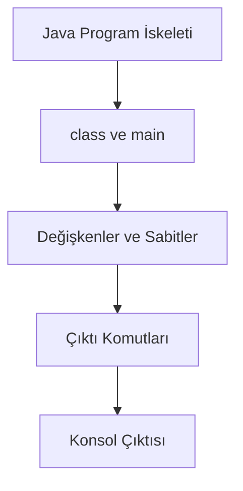

**Diyagram 2.1:** Basit bir Java programında iskelet, veri ve çıktı ilişkisi.

**Görsel üretim notu:** Bu Mermaid diyagramı final DOCX/PDF üretiminden önce PNG’ye dönüştürülmeli; ham `flowchart TD` kodu final çıktıda görünmemelidir. Önerilen görsel genişliği 12–13 cm aralığında tutulmalıdır.

Bu bölümde yazılacak programlar, önce iskelet oluşturma, sonra değişken ve sabit tanımlama, son olarak çıktıyı düzenli biçimde gösterme mantığıyla ilerleyecektir.

## 2.15 Adım adım kod örnekleri

Bu bölümde program iskeleti ve veri temsilini bir arada gösteren örnekler kullanılacaktır.

### Kod 2.1: Java program iskeleti ve çıktı

Aşağıdaki örnek, Java programının temel iskeletini ve `println` kullanımını gösterir.

**Kod kimliği:** `b02_kod01_java_program_iskeleti_ve_cikti`

**Kod erişimi:** [Kod sayfası](https://github.com/bmdersleri/javaninTemelleri/tree/main/kodlar/bolum02/kod01/) | [Kaynak kod](https://github.com/bmdersleri/javaninTemelleri/blob/main/kodlar/bolum02/kod01/Bolum02Ornek01ProgramIskeleti.java) | 

**QR erişimi:** Kod sayfası ve kaynak kod için aşağıdaki iki QR kod kullanılabilir.

{width=2.8cm} {width=2.8cm}


```java
// Dosya: Bolum02Ornek01ProgramIskeleti.java
public class Bolum02Ornek01ProgramIskeleti {
    public static void main(String[] args) {
        System.out.println("Bölüm 2: Java programının temel yapısı");
        System.out.println("Bu program class, main ve println kullanır.");
    }
}
```

**Kodun amacı:** `class`, `main`, blok yapısı ve `println` komutunu birlikte göstermek.

**Kritik satırlar:**

1. `public class Bolum02Ornek01ProgramIskeleti` satırı sınıfı başlatır.
2. `main` metodu programın başlangıç noktasıdır.
3. `println` komutları her çıktıyı ayrı satıra yazar.

**Beklenen çıktı:**

```text
Bölüm 2: Java programının temel yapısı
Bu program class, main ve println kullanır.
```

**Dikkat noktası:** Dosya adı ile `public class` adı aynı olmalıdır.

### Kod 2.2: `print`, `println` ve `printf` karşılaştırması

Aşağıdaki örnek üç çıktı komutunun farkını gösterir.

**Kod kimliği:** `b02_kod02_ve_karsilastirmasi`

**Kod erişimi:** [Kod sayfası](https://github.com/bmdersleri/javaninTemelleri/tree/main/kodlar/bolum02/kod02/) | [Kaynak kod](https://github.com/bmdersleri/javaninTemelleri/blob/main/kodlar/bolum02/kod02/Bolum02Ornek02CiktiKomutlari.java) | 

**QR erişimi:** Kod sayfası ve kaynak kod için aşağıdaki iki QR kod kullanılabilir.

{width=2.8cm} {width=2.8cm}


```java
// Dosya: Bolum02Ornek02CiktiKomutlari.java
public class Bolum02Ornek02CiktiKomutlari {
    public static void main(String[] args) {
        System.out.print("Java ");
        System.out.print("öğreniyorum.");
        System.out.println();

        System.out.println("println yeni satıra geçer.");

        System.out.printf("Ad: %s, Yaş: %d%n", "Ali", 19);
    }
}
```

**Kodun amacı:** `print`, `println` ve `printf` komutlarının davranış farkını göstermek.

**Kritik satırlar:**

1. `print` alt satıra geçmeden yazar.
2. `println` yazdırdıktan sonra yeni satıra geçer.
3. `printf` biçimlendirilmiş çıktı üretir.

**Beklenen çıktı:**

```text
Java öğreniyorum.
println yeni satıra geçer.
Ad: Ali, Yaş: 19
```

**Dikkat noktası:** `printf` içinde kullanılan biçim belirteçleri ile verilen değerlerin türleri uyumlu olmalıdır.

### Kod 2.3: Değişkenlerle öğrenci bilgisi

Aşağıdaki örnek, öğrenci bilgilerini değişkenlerde saklayıp ekrana yazdırır.

**Kod kimliği:** `b02_kod03_degiskenlerle_ogrenci_bilgisi`

**Kod erişimi:** [Kod sayfası](https://github.com/bmdersleri/javaninTemelleri/tree/main/kodlar/bolum02/kod03/) | [Kaynak kod](https://github.com/bmdersleri/javaninTemelleri/blob/main/kodlar/bolum02/kod03/Bolum02Ornek03Degiskenler.java) | 

**QR erişimi:** Kod sayfası ve kaynak kod için aşağıdaki iki QR kod kullanılabilir.

{width=2.8cm} {width=2.8cm}


```java
// Dosya: Bolum02Ornek03Degiskenler.java
public class Bolum02Ornek03Degiskenler {
    public static void main(String[] args) {
        String adSoyad = "Zeynep Kaya";
        int ogrenciNo = 1024;
        int sinifDuzeyi = 1;
        double notOrtalamasi = 82.5;
        char harfNotu = 'B';
        boolean aktifKayit = true;

        System.out.println("=== Öğrenci Bilgisi ===");
        System.out.println("Ad Soyad: " + adSoyad);
        System.out.println("Öğrenci No: " + ogrenciNo);
        System.out.println("Sınıf Düzeyi: " + sinifDuzeyi);
        System.out.println("Not Ortalaması: " + notOrtalamasi);
        System.out.println("Harf Notu: " + harfNotu);
        System.out.println("Aktif Kayıt: " + aktifKayit);
    }
}
```

**Kodun amacı:** Farklı veri tiplerinin temel kullanımını göstermek.

**Kritik satırlar:**

1. `String` metin verisi tutar.
2. `int` tam sayı verisi tutar.
3. `double` ondalıklı sayı verisi tutar.
4. `char` tek karakter tutar.
5. `boolean` doğru/yanlış değer tutar.

**Beklenen çıktı:**

```text
=== Öğrenci Bilgisi ===
Ad Soyad: Zeynep Kaya
Öğrenci No: 1024
Sınıf Düzeyi: 1
Not Ortalaması: 82.5
Harf Notu: B
Aktif Kayıt: true
```

**Dikkat noktası:** `char` değerleri tek tırnak içinde, `String` değerleri çift tırnak içinde yazılır.

### Kod 2.4: Sabitlerle ders bilgisi

Aşağıdaki örnek, `final` ile sabit tanımlamayı gösterir.

**Kod kimliği:** `b02_kod04_sabitlerle_ders_bilgisi`

**Kod erişimi:** [Kod sayfası](https://github.com/bmdersleri/javaninTemelleri/tree/main/kodlar/bolum02/kod04/) | [Kaynak kod](https://github.com/bmdersleri/javaninTemelleri/blob/main/kodlar/bolum02/kod04/Bolum02Ornek04Sabitler.java) | 

**QR erişimi:** Kod sayfası ve kaynak kod için aşağıdaki iki QR kod kullanılabilir.

{width=2.8cm} {width=2.8cm}


```java
// Dosya: Bolum02Ornek04Sabitler.java
public class Bolum02Ornek04Sabitler {
    public static void main(String[] args) {
        final String UNIVERSITE_ADI = "Mehmet Akif Ersoy Üniversitesi";
        final String DERS_ADI = "Java'nın Temelleri";
        final int GECME_NOTU = 60;

        String ogrenciAdi = "Mehmet";
        int ogrenciNotu = 75;

        System.out.println("Üniversite: " + UNIVERSITE_ADI);
        System.out.println("Ders: " + DERS_ADI);
        System.out.println("Geçme Notu: " + GECME_NOTU);
        System.out.println("Öğrenci: " + ogrenciAdi);
        System.out.println("Öğrenci Notu: " + ogrenciNotu);
    }
}
```

**Kodun amacı:** Değeri değişmeyecek bilgileri `final` ile tanımlamayı göstermek.

**Kritik satırlar:**

1. `UNIVERSITE_ADI`, `DERS_ADI` ve `GECME_NOTU` sabittir.
2. `ogrenciAdi` ve `ogrenciNotu` normal değişkendir.
3. Sabit adları büyük harfle yazılarak daha görünür hâle getirilmiştir.

**Beklenen çıktı:**

```text
Üniversite: Mehmet Akif Ersoy Üniversitesi
Ders: Java'nın Temelleri
Geçme Notu: 60
Öğrenci: Mehmet
Öğrenci Notu: 75
```

**Dikkat noktası:** `final` ile tanımlanan bir değere daha sonra yeniden atama yapılamaz.

### Kod 2.5: Hatalı ve düzeltilmiş örnek

Aşağıdaki kodda üç farklı başlangıç hatası vardır.

**Kod kimliği:** `b02_kod05_hatali_ve_duzeltilmis_ornek`

**Kod erişimi:** [Kod sayfası](https://github.com/bmdersleri/javaninTemelleri/tree/main/kodlar/bolum02/kod05/) | [Kaynak kod](https://github.com/bmdersleri/javaninTemelleri/blob/main/kodlar/bolum02/kod05/Bolum02Ornek05HataDuzeltme.java) | 

**QR erişimi:** Kod sayfası ve kaynak kod için aşağıdaki iki QR kod kullanılabilir.

{width=2.8cm} {width=2.8cm}


```java
// Dosya: Bolum02Ornek05HataDuzeltme.java
public class Bolum02Ornek05HataDuzeltme {
    public static void main(String[] args) {
        int 1not = 80;
        String ad soyad = "Ayşe Yılmaz";
        int ortalama;
        System.out.println(ortalama);
    }
}
```

Bu kodda:

1. `1not` değişken adı sayı ile başlamıştır.
2. `ad soyad` değişken adında boşluk vardır.
3. `ortalama` değişkeni değer atanmadan kullanılmaya çalışılmıştır.

Düzeltilmiş kod aşağıdaki gibidir:

**Kod kimliği:** `b02_kod05_hatali_ve_duzeltilmis_ornek_2`

**Kod erişimi:** [Kod sayfası](https://github.com/bmdersleri/javaninTemelleri/tree/main/kodlar/bolum02/kod05_2/) | [Kaynak kod](https://github.com/bmdersleri/javaninTemelleri/blob/main/kodlar/bolum02/kod05_2/Bolum02Ornek05HataDuzeltme.java) | 

**QR erişimi:** Kod sayfası ve kaynak kod için aşağıdaki iki QR kod kullanılabilir.

{width=2.8cm} {width=2.8cm}


```java
// Dosya: Bolum02Ornek05HataDuzeltme.java
public class Bolum02Ornek05HataDuzeltme {
    public static void main(String[] args) {
        int not1 = 80;
        String adSoyad = "Ayşe Yılmaz";
        int ortalama = 80;

        System.out.println("Ad Soyad: " + adSoyad);
        System.out.println("Not: " + not1);
        System.out.println("Ortalama: " + ortalama);
    }
}
```

**Kodun amacı:** Hatalı değişken adlarını ve değer atanmamış yerel değişken kullanımını görünür kılmak.

**Beklenen çıktı:**

```text
Ad Soyad: Ayşe Yılmaz
Not: 80
Ortalama: 80
```

**Dikkat noktası:** Değişken adları anlamlı, boşluksuz ve Java adlandırma kurallarına uygun olmalıdır.

## 2.16 Kodun çalışma mantığı ve beklenen çıktı

Bir Java programının çıktısını tahmin etmek için önce değişkenlere atanan değerler izlenir, sonra çıktı komutlarının sırası takip edilir.

Aşağıdaki örneği inceleyelim:

```java
String ad = "Elif";
int yas = 20;
System.out.println("Ad: " + ad);
System.out.println("Yaş: " + yas);
```

İz sürme tablosu:

| Adım | Kod parçası | Açıklama |
|---:|---|---|
| 1 | `String ad = "Elif";` | `ad` değişkenine metin atanır |
| 2 | `int yas = 20;` | `yas` değişkenine tam sayı atanır |
| 3 | `println` | `ad` değeri ekrana yazdırılır |
| 4 | `println` | `yas` değeri ekrana yazdırılır |

Beklenen çıktı:

```text
Ad: Elif
Yaş: 20
```

> **💡 İpucu:** Kodun çıktısını tahmin ederken önce değişkenleri, sonra çıktı komutlarının sırasını takip edin.

## 2.17 Uçtan uca mini uygulama: Öğrenci Tanıtım ve Not Bilgisi

Bu bölümün mini uygulaması, Java program iskeletini, yorum satırlarını, çıktı komutlarını, değişkenleri, veri tiplerini ve sabitleri birlikte kullanır.

**Uygulama adı:** Öğrenci Tanıtım ve Not Bilgisi

**Dosya adı:** `OgrenciTanitimiVeNotBilgisi.java`

**Amaç:** Bir öğrencinin temel kimlik ve ders bilgilerini uygun veri tipleriyle temsil etmek ve düzenli biçimde konsola yazdırmak.

**Kod kimliği:** `b02_kod33_ogrenci_tanitim_ve_not_bilgisi`

**Kod erişimi:** [Kod sayfası](https://github.com/bmdersleri/javaninTemelleri/tree/main/kodlar/bolum02/kod33/) | [Kaynak kod](https://github.com/bmdersleri/javaninTemelleri/blob/main/kodlar/bolum02/kod33/OgrenciTanitimiVeNotBilgisi.java) | 

**QR erişimi:** Kod sayfası ve kaynak kod için aşağıdaki iki QR kod kullanılabilir.

{width=2.8cm} {width=2.8cm}


```java
// Dosya: OgrenciTanitimiVeNotBilgisi.java
public class OgrenciTanitimiVeNotBilgisi {
    public static void main(String[] args) {
        // Sabit bilgiler
        final String UNIVERSITE_ADI = "Mehmet Akif Ersoy Üniversitesi";
        final String DERS_ADI = "Java'nın Temelleri";
        final int GECME_NOTU = 60;

        // Öğrenci bilgileri
        String adSoyad = "Zeynep Kaya";
        int ogrenciNo = 2026001;
        int sinifDuzeyi = 1;
        boolean aktifKayit = true;

        // Ders not bilgileri
        double vizeNotu = 78.5;
        double finalNotu = 86.0;
        double ortalama = 82.25;
        char harfNotu = 'B';
        boolean gectiMi = true;

        System.out.println("=== Öğrenci Tanıtım ve Not Bilgisi ===");
        System.out.println();

        System.out.println("Üniversite: " + UNIVERSITE_ADI);
        System.out.println("Ders: " + DERS_ADI);
        System.out.println("Geçme Notu: " + GECME_NOTU);
        System.out.println();

        System.out.println("Ad Soyad: " + adSoyad);
        System.out.println("Öğrenci No: " + ogrenciNo);
        System.out.println("Sınıf Düzeyi: " + sinifDuzeyi);
        System.out.println("Aktif Kayıt: " + aktifKayit);
        System.out.println();

        System.out.println("Vize Notu: " + vizeNotu);
        System.out.println("Final Notu: " + finalNotu);
        System.out.println("Ortalama: " + ortalama);
        System.out.println("Harf Notu: " + harfNotu);
        System.out.println("Geçti mi?: " + gectiMi);
    }
}
```

**Beklenen çıktı:**

```text
=== Öğrenci Tanıtım ve Not Bilgisi ===

Üniversite: Mehmet Akif Ersoy Üniversitesi
Ders: Java'nın Temelleri
Geçme Notu: 60

Ad Soyad: Zeynep Kaya
Öğrenci No: 2026001
Sınıf Düzeyi: 1
Aktif Kayıt: true

Vize Notu: 78.5
Final Notu: 86.0
Ortalama: 82.25
Harf Notu: B
Geçti mi?: true
```

### 2.17.1 Mini uygulamanın parçalara ayrılması

Bu program beş temel parçadan oluşur:

1. Program iskeleti
2. Sabit bilgilerin tanımlanması
3. Öğrenci bilgilerinin tanımlanması
4. Ders not bilgilerinin tanımlanması
5. Bilgilerin düzenli biçimde yazdırılması

Bu parçalama, ilerleyen bölümlerde metotlar ve daha büyük uygulamalar ele alındığında önemli hâle gelecektir.

### 2.17.2 Mini uygulamada veri tipi seçimi

Uygulamada kullanılan veri tipleri bilinçli seçilmiştir:

| Veri | Kullanılan tip | Gerekçe |
|---|---|---|
| Üniversite adı | `String` | Metin bilgisi |
| Geçme notu | `int` | Tam sayı |
| Öğrenci no | `int` | Sayısal kimlik |
| Vize notu | `double` | Ondalıklı not olabilir |
| Harf notu | `char` | Tek karakter |
| Aktif kayıt | `boolean` | Doğru/yanlış durum |

> **🎯 Sınav Notu:** Veri tipi, değişkenin hangi türden değer tutacağını belirler. Yanlış veri tipi seçimi programın okunabilirliğini ve doğruluğunu olumsuz etkiler.

## 2.18 Sık yapılan hatalar ve yanlış sezgiler

Bu bölümdeki kavramlar basit görünse de başlangıç öğrencileri bazı hataları sık yapar.

### 2.18.1 `main` metodunu yanlış yazmak

Yanlış kullanım:

```java
public static void Main(String[] args) {
    System.out.println("Merhaba");
}
```

Düzeltme:

```java
public static void main(String[] args) {
    System.out.println("Merhaba");
}
```

Java’da `main` küçük harfle yazılmalıdır.

### 2.18.2 Noktalı virgül unutmak

Yanlış kullanım:

```java
System.out.println("Merhaba")
```

Düzeltme:

```java
System.out.println("Merhaba");
```

### 2.18.3 Süslü parantezi eksik bırakmak

Yanlış kullanım:


```java
public class Ornek {
    public static void main(String[] args) {
        System.out.println("Merhaba");
}
```

Düzeltme:


```java
public class Ornek {
    public static void main(String[] args) {
        System.out.println("Merhaba");
    }
}
```

### 2.18.4 Değişkeni değer atamadan kullanmak

Yanlış kullanım:

```java
int yas;
System.out.println(yas);
```

Düzeltme:

```java
int yas = 20;
System.out.println(yas);
```

### 2.18.5 `char` ve `String` tırnaklarını karıştırmak

Yanlış kullanım:

```java
char harf = "A";
String ad = 'Ali';
```

Düzeltme:

```java
char harf = 'A';
String ad = "Ali";
```

### 2.18.6 `final` sabite yeniden değer atamak

Yanlış kullanım:

```java
final int GECME_NOTU = 60;
GECME_NOTU = 70;
```

Düzeltme:

```java
final int GECME_NOTU = 60;
```

`GECME_NOTU` değeri program içinde değiştirilmeye çalışılmamalıdır.

## 2.19 Hata ayıklama egzersizi

Aşağıdaki kodun `OgrenciBilgisi.java` adlı dosyaya kaydedildiğini düşünelim.

**Kod kimliği:** `b02_kod46_hata_ayiklama_egzersizi`

**Kod erişimi:** [Kod sayfası](https://github.com/bmdersleri/javaninTemelleri/tree/main/kodlar/bolum02/kod46/) | [Kaynak kod](https://github.com/bmdersleri/javaninTemelleri/blob/main/kodlar/bolum02/kod46/OgrenciBilgisi.java) | 

**QR erişimi:** Kod sayfası ve kaynak kod için aşağıdaki iki QR kod kullanılabilir.

{width=2.8cm} {width=2.8cm}


```java
// Dosya: OgrenciBilgisi.java
public class OgrenciBilgi {
    public static void Main(String[] args) {
        String ad soyad = "Ayşe Yılmaz";
        int yas;
        char harfNotu = "A";
        final int GECME_NOTU = 60;
        GECME_NOTU = 70;

        System.out.println("Ad Soyad: " + ad soyad);
        System.out.println("Yaş: " + yas)
        System.out.println("Harf Notu: " + harfNotu);
    }
}
```

Bu kodda birden fazla hata vardır. Öğrenciden beklenen, hataları tek tek bulması ve gerekçeli biçimde düzeltmesidir.

**Hata türleri:**

1. Dosya adı ve `public class` adı uyumsuzluğu
2. `main` metodunun yanlış yazılması
3. Değişken adında boşluk kullanılması
4. Değer atanmamış yerel değişken kullanımı
5. `char` değerinde çift tırnak kullanılması
6. `final` sabite yeniden değer atanması
7. Noktalı virgül eksikliği

**Düzeltilmiş kod:**

**Kod kimliği:** `b02_kod47_hata_ayiklama_egzersizi`

**Kod erişimi:** [Kod sayfası](https://github.com/bmdersleri/javaninTemelleri/tree/main/kodlar/bolum02/kod47/) | [Kaynak kod](https://github.com/bmdersleri/javaninTemelleri/blob/main/kodlar/bolum02/kod47/OgrenciBilgisi.java) | 

**QR erişimi:** Kod sayfası ve kaynak kod için aşağıdaki iki QR kod kullanılabilir.

{width=2.8cm} {width=2.8cm}


```java
// Dosya: OgrenciBilgisi.java
public class OgrenciBilgisi {
    public static void main(String[] args) {
        String adSoyad = "Ayşe Yılmaz";
        int yas = 20;
        char harfNotu = 'A';
        final int GECME_NOTU = 60;

        System.out.println("Ad Soyad: " + adSoyad);
        System.out.println("Yaş: " + yas);
        System.out.println("Harf Notu: " + harfNotu);
        System.out.println("Geçme Notu: " + GECME_NOTU);
    }
}
```

**Beklenen çıktı:**

```text
Ad Soyad: Ayşe Yılmaz
Yaş: 20
Harf Notu: A
Geçme Notu: 60
```

**Kendinize sorunuz:**

1. Derleyici bu hatalardan hangisini ilk önce gösterebilir?
2. Hataları düzeltirken neden tek tek ilerlemek gerekir?
3. Değişken adı ile metin değeri arasındaki fark nedir?
4. Sabit tanımlamak programın okunabilirliğini nasıl etkiler?

> **💡 İpucu:** Birden çok hata içeren programlarda önce dosya adı-sınıf adı uyumunu, sonra `main` metodunu, sonra satır sonlarını ve değişken tanımlarını kontrol edin.

## 2.20 Bölümün sonraki bölümlerle ilişkisi

Bu bölümde Java programının temel iskeleti ve veri temsilinin ilk adımları ele alındı. Öğrenci artık bir Java dosyasında `class`, `main`, blok, yorum, çıktı komutu, değişken, veri tipi ve sabit kavramlarını birlikte görebilir.

Bu bilgiler, sonraki kompakt bölümde tip dönüşümleri, sayısal işlemler ve operatörler anlatılırken doğrudan kullanılacaktır. Çünkü bir işlem yapabilmek için önce işleme katılacak verilerin hangi tipte tutulduğunu bilmek gerekir.

Bu bölümde değerler doğrudan kod içinde tanımlandı. İlerleyen bölümlerde bu değerler kullanıcıdan alınacak, koşullara göre yorumlanacak ve döngülerle tekrar eden işlemlerde kullanılacaktır.

## 2.21 Bölüm özeti

Bu bölümde Java programının temel yapısı ve değişkenlerle veri temsil etme becerisi birlikte ele alınmıştır. Önce `class`, `main`, süslü parantez, noktalı virgül, yorum satırları ve çıktı komutları açıklanmıştır. Böylece öğrencinin çalıştırdığı Java dosyasının hangi parçalardan oluştuğu gösterilmiştir.

Daha sonra değişken kavramı tanıtılmıştır. Değişkenlerin programdaki verileri isimlendirilmiş biçimde temsil ettiği, her değişkenin bir veri tipine sahip olması gerektiği ve yerel değişkenlerin değer atanmadan kullanılamayacağı vurgulanmıştır.

`int`, `double`, `float`, `char`, `boolean` ve `String` veri tipleri başlangıç düzeyinde örneklerle gösterilmiştir. `char` ve `String` arasındaki tırnak farkı, `boolean` değerlerin doğru/yanlış durumları temsil etmesi ve `double` türünün ondalıklı değerlerde kullanılması açıklanmıştır.

`final` anahtar kelimesiyle sabit tanımlama gösterilmiş ve değeri değişmeyecek bilgilerin sabit olarak yazılmasının kodun okunabilirliğini artırdığı belirtilmiştir.

Son olarak Öğrenci Tanıtım ve Not Bilgisi mini uygulamasıyla program iskeleti, yorum satırları, değişkenler, sabitler ve çıktı komutları tek bir çalıştırılabilir örnekte birleştirilmiştir.

## 2.22 Terim sözlüğü

| Terim | Açıklama |
|---|---|
| `class` | Java programında kodun yazıldığı temel yapı |
| `main` metodu | Programın başlangıç noktası |
| Blok | Süslü parantezler arasında kalan kod bölümü |
| Noktalı virgül | Java’da çoğu komut satırının bittiğini gösteren işaret |
| Yorum satırı | Kod içinde açıklama yazmak için kullanılan, çalıştırılmayan metin |
| `print` | Yazdırır ancak otomatik olarak alt satıra geçmez |
| `println` | Yazdırır ve alt satıra geçer |
| `printf` | Biçimlendirilmiş çıktı üretir |
| Değişken | Programda bir değeri temsil eden isimlendirilmiş alan |
| Veri tipi | Değişkenin hangi türden değer tutacağını belirten yapı |
| `int` | Tam sayı veri tipi |
| `double` | Ondalıklı sayı veri tipi |
| `float` | Ondalıklı sayı veri tipi |
| `char` | Tek karakter veri tipi |
| `boolean` | `true` veya `false` değerlerini tutan veri tipi |
| `String` | Metin değerlerini tutan yapı |
| `final` | Sabit tanımlamak için kullanılan anahtar kelime |
| Yerel değişken | Bir metodun içinde tanımlanan değişken |
| Sabit | Değeri program boyunca değişmemesi gereken değişken |

## 2.23 Kendini değerlendirme soruları

### 2.23.1 Çoktan seçmeli sorular

1. Java programlarında başlangıç noktası genellikle hangi metottur?

A) `main`  
B) `start`  
C) `runProgram`  
D) `begin`  
E) `java`

2. Aşağıdakilerden hangisi ekrana yazı yazdırdıktan sonra yeni satıra geçer?

A) `System.out.println()`  
B) `System.out.print()`  
C) `System.in.read()`  
D) `System.exit()`  
E) `System.out.scan()`

3. Aşağıdaki değişken tanımlarından hangisi geçerlidir?

A) `int ogrenciNo = 1001;`  
B) `int 1ogrenci = 1001;`  
C) `String ad soyad = "Ali";`  
D) `double final-not = 80.5;`  
E) `boolean kayıt aktif = true;`

4. Tek karakter saklamak için hangi veri tipi kullanılır?

A) `char`  
B) `String`  
C) `int`  
D) `boolean`  
E) `double`

5. Değeri değişmeyecek bir sabit tanımlamak için hangi anahtar kelime kullanılır?

A) `final`  
B) `const`  
C) `fixed`  
D) `constant`  
E) `staticOnly`

6. Aşağıdakilerden hangisi `boolean` türü için geçerli bir değerdir?

A) `true`  
B) `"true"`  
C) `'true'`  
D) `1.5`  
E) `yes`

7. `String` değerleri hangi tırnakla yazılır?

A) Çift tırnak  
B) Tek tırnak  
C) Tırnaksız  
D) Köşeli parantez  
E) Süslü parantez

8. Aşağıdakilerden hangisi değer atanmamış yerel değişken kullanımıyla ilgili doğrudur?

A) Kullanılmadan önce değer atanmalıdır.  
B) Her zaman otomatik olarak 0 olur.  
C) Her zaman otomatik olarak boş metin olur.  
D) Sadece `String` için değer atanmalıdır.  
E) Derleyici bunu hiçbir zaman kontrol etmez.

### 2.23.2 Doğru/Yanlış soruları

1. `public class` adı ile dosya adı aynı olmalıdır. (D/Y)
2. Java büyük/küçük harfe duyarlı değildir. (D/Y)
3. `println` yazdırdıktan sonra alt satıra geçer. (D/Y)
4. Yorum satırları derleyici tarafından çalıştırılır. (D/Y)
5. `char` değerleri çift tırnak içinde yazılır. (D/Y)
6. `String` metin verileri için kullanılabilir. (D/Y)
7. `final` ile tanımlanan bir değişkene yeniden değer atanabilir. (D/Y)
8. Yerel değişkenler değer atanmadan kullanılabilir. (D/Y)
9. `boolean` yalnızca `true` veya `false` değerlerini alır. (D/Y)
10. Değişken adlarında boşluk kullanılmamalıdır. (D/Y)

### 2.23.3 Açık uçlu kavramsal sorular

1. Bir Java programında `main` metodunun rolünü açıklayınız.
2. Süslü parantezlerin Java programındaki görevini örnekle açıklayınız.
3. `print`, `println` ve `printf` komutları arasındaki farkları yazınız.
4. Değişken kavramını günlük hayattan bir benzetmeyle açıklayınız.
5. Veri tipi seçimi neden önemlidir?
6. `int` ve `double` veri tipleri hangi durumlarda tercih edilir?
7. `char` ve `String` arasındaki fark nedir?
8. `final` anahtar kelimesinin bu bölümdeki kullanım amacı nedir?
9. Değişken adlandırmada okunabilirlik neden önemlidir?

### 2.23.4 Yanlış gerekçeyi bulma soruları

Aşağıdaki ifadelerdeki yanlış gerekçeyi bulunuz ve düzeltiniz.

1. “`main` yerine `Main` yazmak fark oluşturmaz.”
2. “Yorum satırları program çalışırken ekrana yazdırılır.”
3. “Değişken adı sayı ile başlayabilir.”
4. “`char` ile uzun metinler saklanabilir.”
5. “`String` değerleri tek tırnak içinde yazılmalıdır.”
6. “Yerel değişkenler değer atanmadan ekrana yazdırılabilir.”
7. “`final` ile tanımlanan sabitler programın herhangi bir yerinde değiştirilebilir.”
8. “`print` ve `println` tamamen aynı davranır.”
9. “Değişken adı anlamlı olmasa da büyük programlarda sorun oluşturmaz.”
10. “Veri tipi yalnızca görsel düzen için kullanılır.”

## 2.24 Programlama alıştırmaları

### 2.24.1 Kolay düzey

1. `MerhabaBolum2.java` adlı bir program yazınız. Program ekrana bölüm adını ve adınızı yazdırsın.
2. `CiktiKomutlari.java` adlı bir program yazınız. `print`, `println` ve `printf` komutlarını en az birer kez kullanınız.
3. `KisiselBilgi.java` adlı bir program yazınız. Ad, yaş ve bölüm bilgilerinizi değişkenlerde saklayıp ekrana yazdırınız.
4. `DersBilgisi.java` adlı bir program yazınız. Ders adı, ders kodu ve kredi bilgisini uygun veri tipleriyle tanımlayınız.
5. `CharBooleanOrnek.java` adlı bir program yazınız. Bir harf notu ve bir geçme durumunu ekrana yazdırınız.

### 2.24.2 Orta düzey

1. `OgrenciKart.java` adlı bir program yazınız. Öğrenci adı, numarası, sınıf düzeyi, not ortalaması ve aktif kayıt durumunu değişkenlerde saklayınız.
2. `SabitDersBilgisi.java` adlı bir program yazınız. Üniversite adı, ders adı ve geçme notunu `final` ile tanımlayınız.
3. `PrintfTablo.java` adlı bir program yazınız. `printf` kullanarak öğrenci adı, numarası ve not bilgisini düzenli biçimde yazdırınız.
4. Hatalı değişken adları içeren üç örnek yazınız ve her birini düzeltiniz.
5. Değer atanmamış yerel değişken hatasını bilinçli olarak oluşturunuz, sonra düzeltilmiş hâlini yazınız.

### 2.24.3 Zor düzey

1. `OgrenciTanitimiVeNotBilgisi.java` uygulamasını geliştiriniz. En az sekiz değişken ve üç sabit kullanınız.
2. Aynı programda `println` ve `printf` komutlarını birlikte kullanarak düzenli bir çıktı üretiniz.
3. Programda kullanılan her değişkenin veri tipini neden seçtiğinizi `README.md` dosyasında açıklayınız.
4. Üç farklı öğrenci senaryosu için değişken değerlerini değiştirerek çıktıları karşılaştırınız.
5. Hatalı bir sürüm oluşturunuz. Bu sürümde en az üç hata bulunsun: yanlış sınıf adı, eksik noktalı virgül ve değer atanmamış değişken. Sonra düzeltilmiş sürümü yazınız.

## 2.25 Haftalık laboratuvar / proje görevi

**Görev başlığı:** Öğrenci Tanıtım ve Not Bilgisi Laboratuvarı

**Amaç:** Bu laboratuvarın amacı, öğrencinin Java program iskeletini, yorum satırlarını, çıktı komutlarını, değişkenleri, veri tiplerini ve sabitleri küçük ama tamamlanabilir bir Java programında birleştirmesidir.

**Beklenen adımlar:**

1. `OgrenciTanitimiVeNotBilgisi.java` adlı bir Java dosyası oluşturunuz.
2. Programda en az üç sabit tanımlayınız.
3. Öğrenci adı, öğrenci numarası, sınıf düzeyi, vize notu, final notu, ortalama, harf notu ve başarı durumunu uygun veri tipleriyle tanımlayınız.
4. Program çıktısını okunabilir başlıklarla düzenleyiniz.
5. `print`, `println` ve `printf` komutlarından en az ikisini kullanınız.
6. Programı en az üç farklı öğrenci senaryosu için değiştirerek test ediniz.
7. Karşılaştığınız en az bir hatayı ve çözümünü not ediniz.
8. Kısa bir `README.md` dosyası hazırlayınız.

**Teslim edilecek dosyalar:**

1. `OgrenciTanitimiVeNotBilgisi.java`
2. `README.md`
3. Üç farklı test çıktısı
4. Hata ve çözüm notu

**README içeriği şu başlıkları içermelidir:**

1. Programın amacı
2. Kullanılan değişkenler ve veri tipleri
3. Kullanılan sabitler
4. Kullanılan çıktı komutları
5. Test senaryoları
6. Karşılaşılan hata ve çözümü

## 2.26 Değerlendirme rubriği

| Ölçüt | Açıklama | Puan |
|---|---|---:|
| Program iskeleti | `class`, `main`, blok yapısı ve dosya adı uyumunun doğru olması | 15 |
| Kavramların doğru kullanımı | Değişken, veri tipi ve sabitlerin doğru kullanılması | 20 |
| Kodun çalışması | Programın derlenebilir ve çalıştırılabilir olması | 20 |
| Çıktı düzeni | `print`, `println` veya `printf` ile okunabilir çıktı üretilmesi | 15 |
| Hata farkındalığı | Tipik hataların fark edilip düzeltilmesi | 15 |
| Kod okunabilirliği | İsimlendirme, girinti ve açıklama satırlarının uygunluğu | 10 |
| Raporlama | README ve test çıktılarının yeterliliği | 5 |
| **Toplam** |  | **100** |

## 2.27 İleri okuma ve kaynaklar

Bu bölümde Java programının temel yapısı ve temel veri türleri başlangıç düzeyinde ele alınmıştır. Daha ayrıntılı bilgi için aşağıdaki kaynak türleri incelenebilir:

1. **Java SE dokümantasyonu:** Java dilindeki temel türler, sınıflar ve standart yapıların resmî başvuru kaynağıdır.
2. **Dev.java öğrenme kaynakları:** Java’ya başlangıç konularını güncel ve sade örneklerle desteklemek için kullanılabilir.
3. **Oracle Java Tutorials:** Basit Java programı yazma, çıktı üretme ve değişken kullanma konularını tekrar etmek için kullanılabilir.
4. **IDE yardım belgeleri:** Kod biçimlendirme, hata işaretleri ve çalıştırma ayarları için incelenebilir.
5. **Ders içi notlar:** Bu bölümdeki örneklerin laboratuvar ortamında tekrar edilmesi için kullanılmalıdır.

> **💡 İpucu:** Bu bölümdeki amaç tüm Java sözdizimini ezberlemek değildir. Öncelikle program iskeletini, veriyi temsil etmeyi ve çıktıyı düzenli üretmeyi öğrenmeye odaklanınız.

## 2.28 Bir sonraki bölüme köprü

Bu bölümde Java programının temel yapısı, çıktı komutları, değişkenler, veri tipleri ve sabitler ele alındı. Artık öğrenci, küçük bir Java programında veriyi uygun türlerle temsil edebilir ve bu verileri düzenli biçimde ekrana yazdırabilir.

Bir sonraki bölümde bu değişkenler üzerinde işlem yapma konusu ele alınacaktır. Tip dönüşümleri, sayısal işlemler, aritmetik operatörler, ilişkisel operatörler ve mantıksal ifadeler sayesinde programlar yalnızca veri saklamakla kalmayacak, bu veriler üzerinde hesaplama ve karşılaştırma yapabilecek hâle gelecektir.

**BÖLÜM SONU**


\newpage


# Bölüm 3: Tip Dönüşümleri, Sayısal İşlemler ve Operatörler

## 3.1 Bölümün yol haritası

Önceki bölümde Java programının temel yapısı, değişkenler, veri tipleri ve sabitler ele alındı. Bu bölümde artık değişkenlerde tutulan değerler üzerinde işlem yapılacaktır. Bir değeri başka bir tipe dönüştürmek, sayılarla işlem yapmak, sonucu yorumlamak, karşılaştırma yapmak ve birden fazla koşulu birleştirmek programlama mantığının temel adımlarındandır.

Bu bölümde şu sorulara yanıt aranacaktır:

1. Tip dönüşümü nedir ve neden gerekir?
2. Genişleyen dönüşüm ile daralan dönüşüm arasındaki fark nedir?
3. Daralan dönüşüm neden veri kaybına yol açabilir?
4. Metin biçimindeki sayılar `int` veya `double` değere nasıl dönüştürülür?
5. Sayılar metne nasıl dönüştürülür?
6. Tam sayı bölmesi neden ondalıklı sonuç üretmeyebilir?
7. `(int)` dönüşümü ile `Math.round()` arasındaki fark nedir?
8. Aritmetik operatörlerle temel hesaplamalar nasıl yapılır?
9. `%` operatörü hangi durumlarda kullanılır?
10. Atama ve birleşik atama operatörleri kodu nasıl sadeleştirir?
11. `++` ve `--` operatörleri sayaç mantığında nasıl kullanılır?
12. İlişkisel ve mantıksal operatörler nasıl `boolean` sonuç üretir?
13. İşlem önceliği program çıktısını nasıl etkiler?
14. Operatör hataları nasıl fark edilir ve düzeltilir?

> **🎯 Bölüm Hedefi:** Bu bölümün sonunda öğrenci, Java’da tip dönüşümlerini güvenli biçimde yorumlayabilecek, sayısal değerler üzerinde işlem yapabilecek, karşılaştırma ve mantıksal ifadeler kurabilecek ve küçük bir dönüşüm-hesaplama uygulaması geliştirebilecektir.

Bu bölümde kullanıcıdan veri alma ayrıntılı olarak işlenmeyecektir. Örneklerde değerler doğrudan kod içinde tanımlanacaktır. Kullanıcıdan veri alma konusu bir sonraki bölümde `Scanner` sınıfı ile ele alınacaktır.

## 3.2 Bölümün konumu ve pedagojik rolü

Bu bölüm, değişkenleri yalnızca veri saklayan yapılar olmaktan çıkarıp program içinde işlem yapılan değerlere dönüştürür. Önceki bölümde öğrenci `int`, `double`, `char`, `boolean` ve `String` gibi türleri tanıdı. Bu bölümde ise farklı türlerin birlikte kullanıldığında nasıl davrandığı, bazı dönüşümlerin neden otomatik yapılabildiği, bazı dönüşümlerin ise neden açıkça yazılması gerektiği açıklanacaktır.

Bölümün ikinci ana ekseni operatörlerdir. Operatörler, programların hesaplama yapmasını, değerleri karşılaştırmasını ve koşulları birleştirmesini sağlar. `not >= 60`, `sayi % 2 == 0`, `toplam += fiyat` ve `gectiMi && devamEttiMi` gibi ifadeler ilerleyen bölümlerde sürekli kullanılacaktır.

> **⚠️ Dikkat:** Tip dönüşümleri ve operatörler ezberlenecek semboller olarak görülmemelidir. Her dönüşüm ve her operatör, bir veri veya problem bağlamı içinde anlam kazanır.

Bu bölüm, sonraki bölümlerde kullanılacak karar yapıları, döngüler, kullanıcı girdisi, algoritmik problem çözme ve hata yönetimi için doğrudan temel oluşturur.

## 3.3 Öğrenme çıktıları

Bu bölüm tamamlandığında öğrenci:

1. Tip dönüşümü kavramını kendi cümleleriyle açıklayabilir.
2. Widening ve narrowing dönüşümlerini örneklerle ayırt edebilir.
3. Daralan dönüşümde veri kaybı riskini yorumlayabilir.
4. `Integer.parseInt()` ve `Double.parseDouble()` metotlarını kullanabilir.
5. `String.valueOf()` ile sayısal değerleri metne dönüştürebilir.
6. Tam sayı bölmesi ile ondalıklı bölme arasındaki farkı açıklayabilir.
7. `(int)` dönüşümünün yuvarlama yapmadığını gösterebilir.
8. `Math.round()` ile temel yuvarlama yapabilir.
9. Aritmetik operatörlerle temel hesaplamalar yapabilir.
10. `%` operatörünü kalan bulma ve bölünebilme kontrolünde kullanabilir.
11. Atama, birleşik atama, artırma ve azaltma operatörlerini uygulayabilir.
12. İlişkisel operatörlerle `boolean` sonuç üreten ifadeler kurabilir.
13. Mantıksal operatörlerle birden fazla koşulu birleştirebilir.
14. İşlem önceliğini dikkate alarak kodun çıktısını tahmin edebilir.
15. Tip dönüşümü ve operatör hatalarını ayıklayabilir.
16. Birim, KDV ve indirim hesaplayan küçük bir Java uygulaması geliştirebilir.

## 3.4 Ön bilgi ve başlangıç varsayımları

Bu bölüm, öğrencinin aşağıdaki konuları temel düzeyde bildiğini varsayar:

1. Java program iskeleti
2. `class` ve `main` yapısı
3. `System.out.println()` ile çıktı üretme
4. Değişken tanımlama
5. `int`, `double`, `char`, `boolean` ve `String` veri tipleri
6. `final` ile sabit tanımlama
7. Dosya adı ve `public class` adı uyumu

Bu bölümde kullanılan tüm örnekler tek dosyalı konsol programlarıdır. Harici kütüphane, GUI, kullanıcı girdisi, dosya işlemleri veya nesneye yönelik tasarım ayrıntılarına girilmeyecektir.

## 3.5 Tip dönüşümü kavramı

Tip dönüşümü, bir veri tipindeki değerin başka bir veri tipiyle kullanılabilir hâle getirilmesidir. Örneğin `int` türündeki bir değer `double` türünde kullanılabilir. Benzer biçimde, metin olarak saklanan `"42"` değeri sayısal işleme katılacaksa önce sayıya dönüştürülmelidir.

Tip dönüşümü her zaman masum bir işlem değildir. Bazı dönüşümlerde bilgi korunur, bazı dönüşümlerde ise değer kaybı oluşabilir.

```java
int sayi = 10;
double ondalikli = sayi;
```

Bu örnekte `int` değer `double` değişkene aktarılmıştır. `10` değeri `10.0` olarak temsil edilebilir. Bu tür dönüşüm genellikle güvenlidir.

Buna karşılık aşağıdaki dönüşümde dikkat gerekir:

```java
double ortalama = 84.75;
int tamSayiOrtalama = (int) ortalama;
```

Bu örnekte `84.75` değeri `84` olur. Ondalıklı kısım atılır.

> **🎯 Sınav Notu:** `(int)` dönüşümü yuvarlama yapmaz; ondalıklı kısmı atar.

## 3.6 Genişleyen ve daralan dönüşümler

Tip dönüşümleri başlangıç düzeyinde iki ana başlık altında düşünülebilir:

1. Genişleyen dönüşüm
2. Daralan dönüşüm

| Dönüşüm türü | Açıklama | Örnek | Risk |
|---|---|---|---|
| Genişleyen dönüşüm | Daha geniş temsil kapasitesine geçiş | `int` → `double` | Genellikle düşük |
| Daralan dönüşüm | Daha dar temsil kapasitesine geçiş | `double` → `int` | Veri kaybı olabilir |

### 3.6.1 Genişleyen dönüşüm

Genişleyen dönüşümde daha dar kapsamlı bir türden daha geniş kapsamlı bir türe geçilir. Java bu dönüşümleri çoğu zaman otomatik yapabilir.

```java
int adet = 25;
double adetOndalikli = adet;
```

Bu örnekte `25` değeri `25.0` biçiminde temsil edilebilir.

### 3.6.2 Daralan dönüşüm

Daralan dönüşümde daha geniş kapsamlı bir türden daha dar kapsamlı bir türe geçilir. Bu dönüşümde bilgi kaybı yaşanabilir. Bu nedenle dönüşüm açıkça yazılır.

```java
double fiyat = 19.99;
int tamFiyat = (int) fiyat;
```

Bu örnekte `tamFiyat` değeri `19` olur. `0.99` kısmı kaybolur.

> **⚠️ Dikkat:** Daralan dönüşümde oluşan veri kaybı derleme hatası olmayabilir; ancak programın sonucunu mantıksal olarak yanlış hâle getirebilir.

## 3.7 Metinden sayıya ve sayıdan metne dönüşüm

Gerçek uygulamalarda bazı sayısal değerler metin biçiminde gelebilir. Örneğin bir dosyada, form alanında veya ileride kullanıcı girdisinde `"42"` gibi bir değer bulunabilir. Bu değer metin gibi görünür; ancak hesaplama yapılacaksa sayıya dönüştürülmelidir.

### 3.7.1 `Integer.parseInt()`

`Integer.parseInt()` metin biçimindeki tam sayıyı `int` değerine dönüştürür.

```java
String yasMetni = "20";
int yas = Integer.parseInt(yasMetni);
```

Bu dönüşümden sonra `yas` değişkeni sayısal işlemlerde kullanılabilir.

### 3.7.2 `Double.parseDouble()`

`Double.parseDouble()` metin biçimindeki ondalıklı değeri `double` değerine dönüştürür.

```java
String metreMetni = "3.75";
double metre = Double.parseDouble(metreMetni);
```

Bu değer artık çarpma, bölme ve diğer sayısal işlemlerde kullanılabilir.

### 3.7.3 `String.valueOf()`

`String.valueOf()` sayısal veya mantıksal bir değeri metin biçimine dönüştürmek için kullanılabilir.

```java
int sonuc = 375;
String sonucMetni = String.valueOf(sonuc);
```

Bu dönüşüm, sonucu metin olarak saklamak veya başka metinlerle birleştirmek için kullanılabilir.

> **⚠️ Dikkat:** `Integer.parseInt("12a")` gibi geçerli sayı olmayan bir metni sayıya dönüştürmeye çalışmak çalışma zamanı hatasına neden olur. Hata yönetimi ilerleyen bölümlerde ayrıntılı olarak ele alınacaktır.

## 3.8 Sayısal işlemler ve bölme davranışı

Java’da sayısal işlemlerde kullanılan veri tipleri sonucu doğrudan etkileyebilir. Özellikle bölme işlemi başlangıç öğrencileri için sık hata kaynağıdır.

```java
int sonuc = 5 / 2;
System.out.println(sonuc);
```

Beklenen çıktı:

```text
2
```

Bu sonuç bazı öğrenciler için şaşırtıcı olabilir. Çünkü `5` ve `2` değerleri `int` türündedir. İki tam sayının bölünmesi tam sayı bölmesi olarak değerlendirilir ve ondalıklı kısım üretilmez.

Ondalıklı sonuç isteniyorsa değerlerden en az biri `double` olmalıdır.

```java
double sonuc = 5.0 / 2;
System.out.println(sonuc);
```

Beklenen çıktı:

```text
2.5
```

> **💡 İpucu:** Bölme işleminde ondalıklı sonuç bekliyorsanız, işleme katılan değerlerin türlerini kontrol edin.

## 3.9 Yuvarlama ve ondalıklı kısmı atma

Daralan dönüşüm ile yuvarlama aynı şey değildir.

```java
double deger = 9.8;
int sonuc = (int) deger;
System.out.println(sonuc);
```

Beklenen çıktı:

```text
9
```

Bu kodda `9.8` değeri `9` olur. En yakın tam sayıya yuvarlanmaz.

Yuvarlama isteniyorsa `Math.round()` kullanılabilir.

```java
double deger = 9.8;
long sonuc = Math.round(deger);
System.out.println(sonuc);
```

Beklenen çıktı:

```text
10
```

Bu ayrım özellikle not hesaplama, birim dönüşümü ve fiyat hesaplama gibi örneklerde önemlidir.

## 3.10 Operatör ve ifade kavramı

Operatör, değerler üzerinde işlem yapan sembol veya yapıdır. İfade ise operatörler, değişkenler ve değerler kullanılarak oluşturulan hesaplama veya karşılaştırma bütünüdür.

Örnek:

```java
int toplam = 40 + 25;
boolean gectiMi = toplam >= 60;
```

Burada `+` aritmetik operatördür. `>=` ilişkisel operatördür. `40 + 25` ve `toplam >= 60` birer ifadedir.

Operatörler yalnızca matematiksel hesaplama yapmaz. Karşılaştırma, mantıksal birleştirme, değer güncelleme ve kalan bulma gibi farklı görevleri de vardır.

## 3.11 Aritmetik operatörler

Aritmetik operatörler temel matematiksel işlemler için kullanılır.

| Operatör | Anlamı | Örnek |
|---|---|---|
| `+` | Toplama | `a + b` |
| `-` | Çıkarma | `a - b` |
| `*` | Çarpma | `a * b` |
| `/` | Bölme | `a / b` |
| `%` | Kalan bulma | `a % b` |

Örnek:

```java
int x = 8;
int y = 5;

System.out.println("Toplam: " + (x + y));
System.out.println("Fark: " + (x - y));
System.out.println("Çarpım: " + (x * y));
System.out.println("Bölüm: " + (x / y));
System.out.println("Kalan: " + (x % y));
```

Beklenen çıktı:

```text
Toplam: 13
Fark: 3
Çarpım: 40
Bölüm: 1
Kalan: 3
```

Burada `x / y` işleminin sonucu `1` olur. Çünkü iki değer de `int` türündedir.

> **⚠️ Dikkat:** Metinle sayı birleştirirken toplama işlemini paranteze almak çoğu zaman gerekir. `"Toplam: " + x + y` ifadesi toplama yerine metin birleştirme sonucunu doğurabilir.

## 3.12 Mod operatörü `%`

`%` operatörü, bölme işleminden kalanı verir. Bu operatör özellikle çift/tek sayı kontrolü, bölünebilme testi ve döngü örüntülerinde sık kullanılır.

```java
int sayi = 17;
int kalan = sayi % 2;

System.out.println("Kalan: " + kalan);
```

Beklenen çıktı:

```text
Kalan: 1
```

Bir sayı 2’ye bölündüğünde kalan 0 ise sayı çifttir. Kalan 1 ise sayı tektir.

Bu bölümde henüz karar yapıları ayrıntılı olarak işlenmediği için yalnızca kalan değerini hesaplayacağız. Koşullu yorumlama sonraki bölümlerde `if` yapısı ile yapılacaktır.

## 3.13 Atama ve birleşik atama operatörleri

Atama operatörü `=`, sağ taraftaki değeri sol taraftaki değişkene aktarır.

```java
int puan = 70;
```

Birleşik atama operatörleri, değişkenin mevcut değeri üzerinde işlem yapıp sonucu aynı değişkene aktarır.

| Operatör | Uzun yazım | Kısa yazım |
|---|---|---|
| `+=` | `toplam = toplam + 10;` | `toplam += 10;` |
| `-=` | `toplam = toplam - 5;` | `toplam -= 5;` |
| `*=` | `toplam = toplam * 2;` | `toplam *= 2;` |
| `/=` | `toplam = toplam / 4;` | `toplam /= 4;` |

Örnek:

```java
int toplam = 100;

toplam += 20;
toplam -= 10;
toplam *= 2;
toplam /= 5;

System.out.println("Sonuç: " + toplam);
```

Beklenen çıktı:

```text
Sonuç: 44
```

İzleme:

1. Başlangıç: `100`
2. `toplam += 20`: `120`
3. `toplam -= 10`: `110`
4. `toplam *= 2`: `220`
5. `toplam /= 5`: `44`

## 3.14 Artırma ve azaltma operatörleri

`++` operatörü bir değişkenin değerini 1 artırır. `--` operatörü ise bir değişkenin değerini 1 azaltır.

```java
int sayac = 5;
sayac++;
System.out.println(sayac);
```

Beklenen çıktı:

```text
6
```

Benzer şekilde:

```java
int sayac = 5;
sayac--;
System.out.println(sayac);
```

Beklenen çıktı:

```text
4
```

### 3.14.1 Ön ek ve son ek farkı

`++` operatörü değişkenin başına veya sonuna yazılabilir. Başlangıç düzeyinde en güvenli yaklaşım, artırma işlemini ayrı satırda kullanmaktır.

```java
int sayi = 10;
int a = sayi++;
int b = sayi;

System.out.println("a: " + a);
System.out.println("b: " + b);
```

Beklenen çıktı:

```text
a: 10
b: 11
```

Çünkü `sayi++` ifadesinde önce mevcut değer kullanılır, sonra artırma yapılır.

> **💡 İpucu:** Başlangıçta `++` ve `--` operatörlerini karmaşık ifadelerin içinde değil, ayrı satırda kullanmak daha okunabilir ve güvenlidir.

## 3.15 İlişkisel operatörler

İlişkisel operatörler iki değeri karşılaştırır ve `boolean` sonuç üretir.

| Operatör | Anlamı | Örnek |
|---|---|---|
| `==` | Eşit mi? | `a == b` |
| `!=` | Eşit değil mi? | `a != b` |
| `>` | Büyük mü? | `a > b` |
| `<` | Küçük mü? | `a < b` |
| `>=` | Büyük veya eşit mi? | `a >= b` |
| `<=` | Küçük veya eşit mi? | `a <= b` |

Örnek:

```java
int not = 75;
boolean gectiMi = not >= 60;

System.out.println("Geçti mi?: " + gectiMi);
```

Beklenen çıktı:

```text
Geçti mi?: true
```

Bu tür karşılaştırmalar, karar yapıları bölümünde program akışını yönlendirmek için kullanılacaktır.

> **🎯 Sınav Notu:** `=` atama operatörüdür; `==` eşitlik karşılaştırması yapar. Bu ikisi aynı anlama gelmez.

## 3.16 Mantıksal operatörler

Mantıksal operatörler birden fazla `boolean` ifadeyi birleştirmek için kullanılır.

| Operatör | Anlamı | Açıklama |
|---|---|---|
| `&&` | ve | İki koşul da doğruysa sonuç doğrudur |
| `||` | veya | Koşullardan en az biri doğruysa sonuç doğrudur |
| `!` | değil | Doğruyu yanlışa, yanlışı doğruya çevirir |

Örnek:

```java
double ortalama = 72.5;
int devamsizlik = 2;

boolean notYeterli = ortalama >= 60;
boolean devamsizlikUygun = devamsizlik <= 5;
boolean basariliMi = notYeterli && devamsizlikUygun;

System.out.println("Not yeterli mi?: " + notYeterli);
System.out.println("Devamsızlık uygun mu?: " + devamsizlikUygun);
System.out.println("Başarılı mı?: " + basariliMi);
```

Beklenen çıktı:

```text
Not yeterli mi?: true
Devamsızlık uygun mu?: true
Başarılı mı?: true
```

Bu örnekte başarı için iki koşulun da doğru olması gerekir.

> **⚠️ Dikkat:** `&&` ile `||` operatörleri birbirinin yerine kullanılmaz. Problemde “ve” mi “veya” mı gerektiği dikkatle okunmalıdır.

## 3.17 İşlem önceliği ve parantez kullanımı

Java’da işlemler belirli bir öncelik sırasına göre değerlendirilir. Örneğin çarpma ve bölme, toplama ve çıkarmadan önce yapılır.

```java
int sonuc = 10 + 5 * 2;
System.out.println(sonuc);
```

Beklenen çıktı:

```text
20
```

Çünkü önce `5 * 2` yapılır, sonra `10` eklenir.

Parantez kullanıldığında işlem sırası değişir.

```java
int sonuc = (10 + 5) * 2;
System.out.println(sonuc);
```

Beklenen çıktı:

```text
30
```

Parantez yalnızca sonucu değiştirmek için değil, okunabilirliği artırmak için de kullanılmalıdır.

> **💡 İpucu:** Karışık ifadelerde parantez kullanmak, hem hataları azaltır hem de kodu okuyan kişinin niyetinizi anlamasını kolaylaştırır.

## 3.18 Tip dönüşümü ve operatör akışı

Tip dönüşümü ve operatör kullanımı çoğu zaman birlikte görülür. Özellikle metin biçimindeki değerler sayıya çevrilir, sonra hesaplama yapılır, ardından sonuç karşılaştırılır veya metne dönüştürülür.

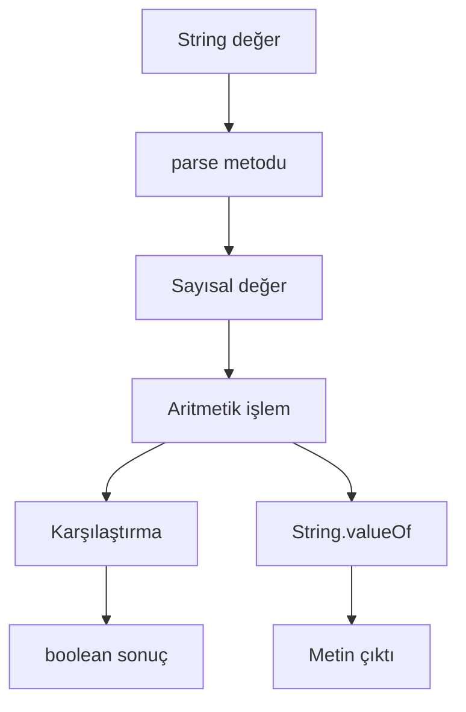

**Diyagram 3.1:** Tip dönüşümünden operatör kullanımına temel akış.

**Görsel üretim notu:** Bu Mermaid diyagramı final DOCX/PDF üretiminden önce PNG’ye dönüştürülmeli; ham `flowchart TD` kodu final çıktıda görünmemelidir. Önerilen görsel genişliği 12–13 cm aralığında tutulmalıdır.

## 3.19 Adım adım kod örnekleri

Bu bölümde dönüşüm, sayısal işlem ve operatör kullanımını gösteren örnekler birlikte verilecektir.

### Kod 3.1: Genişleyen ve daralan dönüşüm

**Kod kimliği:** `b03_kod01_genisleyen_ve_daralan_donusum`

**Kod erişimi:** [Kod sayfası](https://github.com/bmdersleri/javaninTemelleri/tree/main/kodlar/bolum03/kod01/) | [Kaynak kod](https://github.com/bmdersleri/javaninTemelleri/blob/main/kodlar/bolum03/kod01/Bolum03Ornek01TipDonusumu.java) | 

**QR erişimi:** Kod sayfası ve kaynak kod için aşağıdaki iki QR kod kullanılabilir.

{width=2.8cm} {width=2.8cm}


```java
// Dosya: Bolum03Ornek01TipDonusumu.java
public class Bolum03Ornek01TipDonusumu {
    public static void main(String[] args) {
        int tamSayi = 42;
        double genisleyenSonuc = tamSayi;

        double ondalikliSayi = 9.8;
        int daralanSonuc = (int) ondalikliSayi;

        System.out.println("Tam sayı: " + tamSayi);
        System.out.println("Genişleyen sonuç: " + genisleyenSonuc);
        System.out.println("Ondalıklı sayı: " + ondalikliSayi);
        System.out.println("Daralan sonuç: " + daralanSonuc);
    }
}
```

**Kodun amacı:** Genişleyen ve daralan dönüşüm arasındaki farkı göstermek.

**Kritik satırlar:**

1. `double genisleyenSonuc = tamSayi;` otomatik dönüşüm örneğidir.
2. `int daralanSonuc = (int) ondalikliSayi;` açık dönüşüm örneğidir.
3. Daralan dönüşümde ondalıklı kısım atılır.

**Beklenen çıktı:**

```text
Tam sayı: 42
Genişleyen sonuç: 42.0
Ondalıklı sayı: 9.8
Daralan sonuç: 9
```

**Dikkat noktası:** `(int)` dönüşümü yuvarlama yapmaz.

**Mini alıştırma:** `ondalikliSayi` değerini `9.2`, `9.5` ve `9.9` yaparak çıktıyı karşılaştırınız.

### Kod 3.2: Metinden sayıya dönüşüm

**Kod kimliği:** `b03_kod02_metinden_sayiya_donusum`

**Kod erişimi:** [Kod sayfası](https://github.com/bmdersleri/javaninTemelleri/tree/main/kodlar/bolum03/kod02/) | [Kaynak kod](https://github.com/bmdersleri/javaninTemelleri/blob/main/kodlar/bolum03/kod02/Bolum03Ornek02MetindenSayi.java) | 

**QR erişimi:** Kod sayfası ve kaynak kod için aşağıdaki iki QR kod kullanılabilir.

{width=2.8cm} {width=2.8cm}


```java
// Dosya: Bolum03Ornek02MetindenSayi.java
public class Bolum03Ornek02MetindenSayi {
    public static void main(String[] args) {
        String adetMetni = "12";
        String fiyatMetni = "19.75";

        int adet = Integer.parseInt(adetMetni);
        double fiyat = Double.parseDouble(fiyatMetni);
        double toplam = adet * fiyat;

        String toplamMetni = String.valueOf(toplam);

        System.out.println("Adet: " + adet);
        System.out.println("Fiyat: " + fiyat);
        System.out.println("Toplam: " + toplamMetni);
    }
}
```

**Kodun amacı:** Metin biçimindeki sayısal değerleri sayıya dönüştürmek ve işlem yapmak.

**Kritik satırlar:**

1. `Integer.parseInt(adetMetni)` metni `int` değere dönüştürür.
2. `Double.parseDouble(fiyatMetni)` metni `double` değere dönüştürür.
3. `String.valueOf(toplam)` sonucu metin biçimine dönüştürür.

**Beklenen çıktı:**

```text
Adet: 12
Fiyat: 19.75
Toplam: 237.0
```

**Dikkat noktası:** `adetMetni` değeri `"12a"` olursa dönüşüm çalışma zamanı hatasına yol açar.

**Mini alıştırma:** `adetMetni` değerini `"5"`, `fiyatMetni` değerini `"42.50"` yaparak sonucu hesaplayınız.

### Kod 3.3: Aritmetik operatörler ve mod

**Kod kimliği:** `b03_kod03_aritmetik_operatorler_ve_mod`

**Kod erişimi:** [Kod sayfası](https://github.com/bmdersleri/javaninTemelleri/tree/main/kodlar/bolum03/kod03/) | [Kaynak kod](https://github.com/bmdersleri/javaninTemelleri/blob/main/kodlar/bolum03/kod03/Bolum03Ornek03AritmetikOperatorler.java) | 

**QR erişimi:** Kod sayfası ve kaynak kod için aşağıdaki iki QR kod kullanılabilir.

{width=2.8cm} {width=2.8cm}


```java
// Dosya: Bolum03Ornek03AritmetikOperatorler.java
public class Bolum03Ornek03AritmetikOperatorler {
    public static void main(String[] args) {
        int x = 17;
        int y = 5;

        System.out.println("Toplam: " + (x + y));
        System.out.println("Fark: " + (x - y));
        System.out.println("Çarpım: " + (x * y));
        System.out.println("Tam sayı bölmesi: " + (x / y));
        System.out.println("Ondalıklı bölme: " + (x / 5.0));
        System.out.println("Kalan: " + (x % y));
    }
}
```

**Kodun amacı:** Temel aritmetik operatörleri ve `%` operatörünü göstermek.

**Kritik satırlar:**

1. `x / y` tam sayı bölmesi yapar.
2. `x / 5.0` ondalıklı sonuç üretir.
3. `x % y` bölme işleminden kalanı verir.

**Beklenen çıktı:**

```text
Toplam: 22
Fark: 12
Çarpım: 85
Tam sayı bölmesi: 3
Ondalıklı bölme: 3.4
Kalan: 2
```

**Dikkat noktası:** Metinle sayı birleştirme yapılan satırlarda hesaplama parantez içine alınmıştır.

**Mini alıştırma:** `x` değerini `20`, `y` değerini `6` yaparak sonuçları yeniden yorumlayınız.

### Kod 3.4: Atama, artırma ve azaltma

**Kod kimliği:** `b03_kod04_atama_artirma_ve_azaltma`

**Kod erişimi:** [Kod sayfası](https://github.com/bmdersleri/javaninTemelleri/tree/main/kodlar/bolum03/kod04/) | [Kaynak kod](https://github.com/bmdersleri/javaninTemelleri/blob/main/kodlar/bolum03/kod04/Bolum03Ornek04AtamaOperatorleri.java) | 

**QR erişimi:** Kod sayfası ve kaynak kod için aşağıdaki iki QR kod kullanılabilir.

{width=2.8cm} {width=2.8cm}


```java
// Dosya: Bolum03Ornek04AtamaOperatorleri.java
public class Bolum03Ornek04AtamaOperatorleri {
    public static void main(String[] args) {
        int toplam = 100;

        toplam += 25;
        toplam -= 10;
        toplam *= 2;
        toplam /= 5;

        int sayac = 3;
        sayac++;
        sayac--;

        System.out.println("Toplam: " + toplam);
        System.out.println("Sayaç: " + sayac);
    }
}
```

**Kodun amacı:** Birleşik atama operatörleri ile `++` ve `--` kullanımını göstermek.

**Kritik satırlar:**

1. `toplam += 25` ifadesi `toplam = toplam + 25` ile aynı mantıktadır.
2. `sayac++` değeri 1 artırır.
3. `sayac--` değeri 1 azaltır.

**Beklenen çıktı:**

```text
Toplam: 46
Sayaç: 3
```

**Dikkat noktası:** Kodun sonucunu bulmak için her satırdan sonra değişkenin yeni değerini izlemek gerekir.

### Kod 3.5: İlişkisel ve mantıksal operatörler

**Kod kimliği:** `b03_kod05_iliskisel_ve_mantiksal_operatorler`

**Kod erişimi:** [Kod sayfası](https://github.com/bmdersleri/javaninTemelleri/tree/main/kodlar/bolum03/kod05/) | [Kaynak kod](https://github.com/bmdersleri/javaninTemelleri/blob/main/kodlar/bolum03/kod05/Bolum03Ornek05MantiksalIfadeler.java) | 

**QR erişimi:** Kod sayfası ve kaynak kod için aşağıdaki iki QR kod kullanılabilir.

{width=2.8cm} {width=2.8cm}


```java
// Dosya: Bolum03Ornek05MantiksalIfadeler.java
public class Bolum03Ornek05MantiksalIfadeler {
    public static void main(String[] args) {
        double ortalama = 72.5;
        int devamsizlik = 2;

        boolean notYeterli = ortalama >= 60;
        boolean devamsizlikUygun = devamsizlik <= 5;
        boolean basariliMi = notYeterli && devamsizlikUygun;

        System.out.println("Not yeterli mi?: " + notYeterli);
        System.out.println("Devamsızlık uygun mu?: " + devamsizlikUygun);
        System.out.println("Başarılı mı?: " + basariliMi);
    }
}
```

**Kodun amacı:** Karşılaştırma ve mantıksal birleştirme sonucunda `boolean` değer üretmek.

**Kritik satırlar:**

1. `ortalama >= 60` ilişkisel ifadedir.
2. `devamsizlik <= 5` ilişkisel ifadedir.
3. `notYeterli && devamsizlikUygun` iki koşulu birlikte değerlendirir.

**Beklenen çıktı:**

```text
Not yeterli mi?: true
Devamsızlık uygun mu?: true
Başarılı mı?: true
```

**Dikkat noktası:** `&&` kullanıldığında sonucun doğru olması için iki koşulun da doğru olması gerekir.

### Kod 3.6: Hatalı ve düzeltilmiş örnek

Aşağıdaki örnekte tip dönüşümü ve operatör kullanımıyla ilgili yaygın hatalar vardır.

**Kod kimliği:** `b03_kod06_hatali_ve_duzeltilmis_ornek`

**Kod erişimi:** [Kod sayfası](https://github.com/bmdersleri/javaninTemelleri/tree/main/kodlar/bolum03/kod06/) | [Kaynak kod](https://github.com/bmdersleri/javaninTemelleri/blob/main/kodlar/bolum03/kod06/Bolum03Ornek06HataDuzeltme.java) | 

**QR erişimi:** Kod sayfası ve kaynak kod için aşağıdaki iki QR kod kullanılabilir.

{width=2.8cm} {width=2.8cm}


```java
// Dosya: Bolum03Ornek06HataDuzeltme.java
public class Bolum03Ornek06HataDuzeltme {
    public static void main(String[] args) {
        String metreMetni = "3.75";
        int metre = Integer.parseInt(metreMetni);

        int bolum = 5 / 2;
        int yuvarlanmis = (int) 9.8;

        System.out.println("Metre: " + metre);
        System.out.println("Bölüm: " + bolum);
        System.out.println("Yuvarlanmış: " + yuvarlanmis);
    }
}
```

Bu kodda üç temel sorun vardır:

1. `"3.75"` değeri `Integer.parseInt()` ile dönüştürülemez.
2. `5 / 2` tam sayı bölmesi yaptığı için `2.5` üretmez.
3. `(int) 9.8` yuvarlama yapmaz; sonuç `9` olur.

Düzeltilmiş kod:

**Kod kimliği:** `b03_kod06_hatali_ve_duzeltilmis_ornek_2`

**Kod erişimi:** [Kod sayfası](https://github.com/bmdersleri/javaninTemelleri/tree/main/kodlar/bolum03/kod06_2/) | [Kaynak kod](https://github.com/bmdersleri/javaninTemelleri/blob/main/kodlar/bolum03/kod06_2/Bolum03Ornek06HataDuzeltme.java) | 

**QR erişimi:** Kod sayfası ve kaynak kod için aşağıdaki iki QR kod kullanılabilir.

{width=2.8cm} {width=2.8cm}


```java
// Dosya: Bolum03Ornek06HataDuzeltme.java
public class Bolum03Ornek06HataDuzeltme {
    public static void main(String[] args) {
        String metreMetni = "3.75";
        double metre = Double.parseDouble(metreMetni);

        double bolum = 5.0 / 2;
        long yuvarlanmis = Math.round(9.8);

        System.out.println("Metre: " + metre);
        System.out.println("Bölüm: " + bolum);
        System.out.println("Yuvarlanmış: " + yuvarlanmis);
    }
}
```

**Beklenen çıktı:**

```text
Metre: 3.75
Bölüm: 2.5
Yuvarlanmış: 10
```

**Dikkat noktası:** Dönüştürülecek metnin biçimi ile kullanılacak parse metodu uyumlu olmalıdır.

## 3.20 Kodun çalışma mantığı ve beklenen çıktı

Tip dönüşümü ve operatör içeren kodları okurken satırların hangi sırayla çalıştığını ve her satırdan sonra değişkenlerin hangi değeri aldığını izlemek önemlidir.

Aşağıdaki tablo, metinden sayıya dönüşüm ve hesaplama akışını özetler.

| Adım | Kod parçası | Sonuç |
|---:|---|---|
| 1 | `String metreMetni = "12.5";` | Metin değer saklanır |
| 2 | `Double.parseDouble(metreMetni)` | `12.5` değeri `double` olur |
| 3 | `double santimetre = metre * 100;` | `1250.0` sonucu oluşur |
| 4 | `Math.round(santimetre)` | `1250` sonucu elde edilir |
| 5 | `String.valueOf(...)` | Sayısal sonuç metne dönüştürülür |
| 6 | `println` | Sonuçlar konsola yazdırılır |

Kodun beklenen çıktısını elle izlemek, derleme ve çalışma zamanı hatalarını daha kolay fark etmeyi sağlar. Öğrenci özellikle şu soruları sormalıdır:

1. Metin gerçekten sayı biçiminde mi?
2. Dönüşüm sonucu hangi tipte tutuluyor?
3. İşlem tam sayı mı ondalıklı mı yapılıyor?
4. Ondalıklı kısım korunuyor mu?
5. Yuvarlama mı yapılıyor, yoksa ondalıklı kısım mı atılıyor?
6. Karşılaştırma sonucu `true` mu `false` mu üretiyor?
7. Mantıksal operatör problem koşuluna uygun mu?

## 3.21 Uçtan uca mini uygulama: Birim, KDV ve İndirim Hesaplayıcı

Bu bölümün mini uygulaması, tip dönüşümlerini, sayısal işlemleri ve operatörleri tek bir küçük konsol programında birleştirir.

**Uygulama adı:** Birim, KDV ve İndirim Hesaplayıcı

**Dosya adı:** `BirimKdvIndirimHesaplayici.java`

**Amaç:** Metin biçiminde verilen metre ve fiyat değerlerini sayıya dönüştürmek, birim dönüşümü yapmak, KDV ve indirim hesaplamak, sonucu karşılaştırma ve mantıksal ifadelerle yorumlamaktır.

**Kod kimliği:** `b03_kod31_birim_kdv_ve_indirim_hesaplayici`

**Kod erişimi:** [Kod sayfası](https://github.com/bmdersleri/javaninTemelleri/tree/main/kodlar/bolum03/kod31/) | [Kaynak kod](https://github.com/bmdersleri/javaninTemelleri/blob/main/kodlar/bolum03/kod31/BirimKdvIndirimHesaplayici.java) | 

**QR erişimi:** Kod sayfası ve kaynak kod için aşağıdaki iki QR kod kullanılabilir.

{width=2.8cm} {width=2.8cm}


```java
// Dosya: BirimKdvIndirimHesaplayici.java
public class BirimKdvIndirimHesaplayici {
    public static void main(String[] args) {
        final double KDV_ORANI = 0.20;
        final double INDIRIM_ORANI = 0.10;
        final double UCRETSIZ_KARGO_ESIGI = 500.0;

        String metreMetni = "3.75";
        String birimFiyatMetni = "120.50";
        String adetMetni = "4";

        double metre = Double.parseDouble(metreMetni);
        double birimFiyat = Double.parseDouble(birimFiyatMetni);
        int adet = Integer.parseInt(adetMetni);

        double santimetre = metre * 100;
        double milimetre = metre * 1000;

        double araToplam = birimFiyat * adet;
        double indirimTutari = araToplam * INDIRIM_ORANI;
        double indirimliTutar = araToplam - indirimTutari;
        double kdvTutari = indirimliTutar * KDV_ORANI;
        double genelToplam = indirimliTutar + kdvTutari;

        long yuvarlanmisToplam = Math.round(genelToplam);

        boolean ucretsizKargo = genelToplam >= UCRETSIZ_KARGO_ESIGI;
        boolean yuksekTutar = genelToplam > 400.0;
        boolean dikkatGerekir = yuksekTutar && !ucretsizKargo;

        System.out.println("=== Birim, KDV ve İndirim Hesaplayıcı ===");
        System.out.println();

        System.out.println("Metre: " + metre);
        System.out.println("Santimetre: " + santimetre);
        System.out.println("Milimetre: " + milimetre);
        System.out.println();

        System.out.println("Birim Fiyat: " + birimFiyat);
        System.out.println("Adet: " + adet);
        System.out.println("Ara Toplam: " + araToplam);
        System.out.println("İndirim Tutarı: " + indirimTutari);
        System.out.println("İndirimli Tutar: " + indirimliTutar);
        System.out.println("KDV Tutarı: " + kdvTutari);
        System.out.println("Genel Toplam: " + genelToplam);
        System.out.println("Yuvarlanmış Toplam: " + yuvarlanmisToplam);
        System.out.println();

        System.out.println("Ücretsiz Kargo: " + ucretsizKargo);
        System.out.println("Yüksek Tutar: " + yuksekTutar);
        System.out.println("Dikkat Gerekir: " + dikkatGerekir);
    }
}
```

**Beklenen çıktı:**

```text
=== Birim, KDV ve İndirim Hesaplayıcı ===

Metre: 3.75
Santimetre: 375.0
Milimetre: 3750.0

Birim Fiyat: 120.5
Adet: 4
Ara Toplam: 482.0
İndirim Tutarı: 48.2
İndirimli Tutar: 433.8
KDV Tutarı: 86.76
Genel Toplam: 520.56
Yuvarlanmış Toplam: 521

Ücretsiz Kargo: true
Yüksek Tutar: true
Dikkat Gerekir: false
```

### 3.21.1 Mini uygulamanın kavram eşleştirmesi

| Kullanılan yapı | Uygulamadaki rolü |
|---|---|
| `String` | Metin biçimindeki giriş değerlerini temsil eder |
| `Double.parseDouble()` | Metni ondalıklı sayıya dönüştürür |
| `Integer.parseInt()` | Metni tam sayıya dönüştürür |
| `double` | Fiyat ve ölçü hesaplarında kullanılır |
| `int` | Adet gibi tam sayı değerlerde kullanılır |
| `final` | KDV, indirim ve eşik değerleri sabitler |
| `*`, `+`, `-` | Sayısal hesaplamalar yapar |
| `>=`, `>` | Karşılaştırma sonucu üretir |
| `&&`, `!` | Mantıksal yorumlama yapar |
| `Math.round()` | Toplam tutarı yuvarlar |

### 3.21.2 Mini uygulama test senaryoları

| Test | `metreMetni` | `birimFiyatMetni` | `adetMetni` | Kontrol |
|---:|---:|---:|---:|---|
| 1 | `"1.25"` | `"100.00"` | `"2"` | Düşük toplam |
| 2 | `"3.75"` | `"120.50"` | `"4"` | Ücretsiz kargo eşiği |
| 3 | `"10.75"` | `"80.25"` | `"7"` | Yüksek toplam |
| 4 | `"2.5"` | `"19.99"` | `"5"` | Ondalıklı fiyat |

> **Alıştırma Molası:** `INDIRIM_ORANI` değerini `0.15` yapınız. Hangi değerlerin değiştiğini ve hangi değerlerin aynı kaldığını not ediniz.

## 3.22 Sık yapılan hatalar ve yanlış sezgiler

Tip dönüşümleri ve operatörler, başlangıç öğrencileri için küçük görünen ancak önemli sonuçlar doğuran hatalara neden olabilir.

### 3.22.1 Daralan dönüşümde veri kaybını fark etmemek

Yanlış düşünce:

```text
(int) 9.8 işlemi 10 sonucunu üretir.
```

Düzeltme:

```text
(int) 9.8 işlemi 9 sonucunu üretir.
```

Açık tip dönüşümü yuvarlama değildir. Ondalıklı kısmı atar.

### 3.22.2 Tam sayı bölmesini yanlış yorumlamak

Yanlış düşünce:

```text
5 / 2 işlemi her zaman 2.5 sonucunu üretir.
```

Düzeltme:

```text
5 / 2 işlemi Java'da iki int ile yapılırsa 2 sonucunu üretir.
```

Ondalıklı sonuç için değerlerden en az biri ondalıklı türde olmalıdır.

### 3.22.3 Geçersiz metni sayıya çevirmeye çalışmak

Yanlış kullanım:

```java
int sayi = Integer.parseInt("12a");
```

Bu kullanım çalışma zamanı hatasına neden olur. Metin gerçekten tam sayı biçiminde olmalıdır.

### 3.22.4 `+` operatöründe parantez kullanmamak

Yanlış kullanım:

```java
int x = 8;
int y = 5;
System.out.println("Toplam: " + x + y);
```

Beklenen toplam `13` olsa da çıktı şu olur:

```text
Toplam: 85
```

Düzeltme:

```java
System.out.println("Toplam: " + (x + y));
```

### 3.22.5 `=` ile `==` kavramlarını karıştırmak

Yanlış düşünce:

```text
= ve == aynı anlama gelir.
```

Düzeltme:

`=` atama yapar. `==` iki değerin eşit olup olmadığını karşılaştırır.

### 3.22.6 `&&` ile `||` operatörlerini rastgele seçmek

Yanlış düşünce:

```text
Koşulları birleştirmek için && veya || kullanmam fark etmez.
```

Düzeltme:

`&&` için tüm koşullar doğru olmalıdır. `||` için koşullardan en az birinin doğru olması yeterlidir.

### 3.22.7 Ön ek ve son ek artırmayı aynı sanmak

Yanlış düşünce:

```text
sayi++ ve ++sayi her zaman aynı çıktıyı üretir.
```

Düzeltme:

Ayrı satırda kullanıldığında etkileri benzer görünür; ancak başka bir atamanın içinde kullanıldıklarında çıktı farklılaşabilir.

## 3.23 Hata ayıklama egzersizi

Aşağıdaki kodun `HesaplamaHatasi.java` adlı dosyaya kaydedildiğini düşünelim.

**Kod kimliği:** `b03_kod35_hata_ayiklama_egzersizi`

**Kod erişimi:** [Kod sayfası](https://github.com/bmdersleri/javaninTemelleri/tree/main/kodlar/bolum03/kod35/) | [Kaynak kod](https://github.com/bmdersleri/javaninTemelleri/blob/main/kodlar/bolum03/kod35/HesaplamaHatasi.java) | 

**QR erişimi:** Kod sayfası ve kaynak kod için aşağıdaki iki QR kod kullanılabilir.

{width=2.8cm} {width=2.8cm}


```java
// Dosya: HesaplamaHatasi.java
public class HesaplamaHatasi {
    public static void main(String[] args) {
        String fiyatMetni = "120.50";
        String adetMetni = "4";

        int fiyat = Integer.parseInt(fiyatMetni);
        int adet = Integer.parseInt(adetMetni);

        int araToplam = fiyat * adet;
        int ortalama = 5 / 2;
        int yuvarlanmis = (int) 9.8;

        boolean kargoUygun = araToplam => 500;

        System.out.println("Ara Toplam: " + araToplam);
        System.out.println("Ortalama: " + ortalama);
        System.out.println("Yuvarlanmış: " + yuvarlanmis);
        System.out.println("Kargo Uygun: " + kargoUygun);
    }
}
```

Bu kodda derleme hatası, çalışma zamanı hatası ve mantık hatası birlikte bulunmaktadır.

**Hatalar:**

1. `"120.50"` değeri `Integer.parseInt()` ile dönüştürülemez.
2. Fiyat ondalıklı olduğu için `double` kullanılmalıdır.
3. `5 / 2` tam sayı bölmesi yapar.
4. `(int) 9.8` yuvarlama değildir.
5. `=>` Java’da geçerli bir ilişkisel operatör değildir; `>=` kullanılmalıdır.

**Düzeltilmiş kod:**

**Kod kimliği:** `b03_kod36_hata_ayiklama_egzersizi`

**Kod erişimi:** [Kod sayfası](https://github.com/bmdersleri/javaninTemelleri/tree/main/kodlar/bolum03/kod36/) | [Kaynak kod](https://github.com/bmdersleri/javaninTemelleri/blob/main/kodlar/bolum03/kod36/HesaplamaHatasi.java) | 

**QR erişimi:** Kod sayfası ve kaynak kod için aşağıdaki iki QR kod kullanılabilir.

{width=2.8cm} {width=2.8cm}


```java
// Dosya: HesaplamaHatasi.java
public class HesaplamaHatasi {
    public static void main(String[] args) {
        String fiyatMetni = "120.50";
        String adetMetni = "4";

        double fiyat = Double.parseDouble(fiyatMetni);
        int adet = Integer.parseInt(adetMetni);

        double araToplam = fiyat * adet;
        double ortalama = 5.0 / 2;
        long yuvarlanmis = Math.round(9.8);

        boolean kargoUygun = araToplam >= 500;

        System.out.println("Ara Toplam: " + araToplam);
        System.out.println("Ortalama: " + ortalama);
        System.out.println("Yuvarlanmış: " + yuvarlanmis);
        System.out.println("Kargo Uygun: " + kargoUygun);
    }
}
```

**Beklenen çıktı:**

```text
Ara Toplam: 482.0
Ortalama: 2.5
Yuvarlanmış: 10
Kargo Uygun: false
```

**Kendinize sorunuz:**

1. Hangi hata derleme aşamasında yakalanır?
2. Hangi hata program çalışırken ortaya çıkar?
3. Hangi hata program çalışsa bile yanlış sonuç üretir?
4. `Integer.parseInt()` yerine neden `Double.parseDouble()` kullanıldı?
5. `=>` yerine neden `>=` yazıldı?
6. `(int)` ile `Math.round()` arasındaki fark nedir?

> **Laboratuvar İpucu:** Birden fazla hata varsa önce derleme hatasını, sonra çalışma zamanı hatasını, en son mantık hatasını düzeltmek daha sistematik bir yaklaşımdır.

## 3.24 Bölümün sonraki bölümlerle ilişkisi

Bu bölümde tip dönüşümleri, sayısal işlemler ve operatörler birlikte ele alındı. Öğrenci artık değişkenlerde saklanan değerleri yalnızca ekrana yazdırmakla kalmayıp bu değerler üzerinde hesaplama, dönüşüm, karşılaştırma ve mantıksal yorumlama yapabilir.

Bir sonraki bölümde bu beceriler kullanıcıdan alınan gerçek veriler üzerinde uygulanacaktır. `Scanner` sınıfı ile klavyeden metin ve sayı okunacak; bu bölümde öğrenilen `parse`, aritmetik işlem, karşılaştırma ve mantıksal ifade kurma becerileri etkileşimli konsol programlarına taşınacaktır.

Bu bölümde sabit değerlerle çalışıldı. Sonraki bölümde aynı hesaplama mantığı, kullanıcı tarafından girilen değerlere uygulanacaktır.

## 3.25 Bölüm özeti

Bu bölümde tip dönüşümleri ve operatörler birlikte ele alınmıştır. Önce farklı veri tipleri arasında dönüşüm yapmanın program sonucunu doğrudan etkileyebileceği açıklanmıştır. Genişleyen dönüşümlerin çoğu zaman otomatik yapılabildiği, daralan dönüşümlerde ise veri kaybı oluşabileceği gösterilmiştir.

`Integer.parseInt()` ve `Double.parseDouble()` metotlarıyla metin biçimindeki sayısal değerlerin sayıya dönüştürülebileceği gösterilmiştir. Buna karşılık, metnin gerçekten geçerli sayı biçiminde olması gerektiği vurgulanmıştır. `String.valueOf()` ile sayısal değerlerin metne dönüştürülebileceği görülmüştür.

Tam sayı bölmesi ile ondalıklı bölme arasındaki fark açıklanmış, `(int)` dönüşümünün yuvarlama yapmadığı belirtilmiştir. Yuvarlama için `Math.round()` kullanılabileceği gösterilmiştir.

Bölümün ikinci kısmında aritmetik, atama, artırma-azaltma, ilişkisel ve mantıksal operatörler incelenmiştir. `%` operatörünün kalan bulma ve bölünebilme kontrolünde kullanılabileceği, ilişkisel operatörlerin `boolean` sonuç ürettiği ve mantıksal operatörlerle birden fazla koşulun birleştirilebildiği gösterilmiştir.

İşlem önceliğinin program çıktısını değiştirebileceği örneklerle gösterilmiş ve karışık ifadelerde parantez kullanmanın hem doğruluk hem de okunabilirlik açısından yararlı olduğu vurgulanmıştır.

Son olarak Birim, KDV ve İndirim Hesaplayıcı mini uygulamasıyla bölümdeki kavramlar tek bir çalıştırılabilir programda birleştirilmiştir.

## 3.26 Terim sözlüğü

| Terim | Açıklama |
|---|---|
| Tip dönüşümü | Bir veri tipindeki değeri başka bir tipte kullanma işlemi |
| Type casting | Açık tip dönüşümü için kullanılan genel ifade |
| Widening | Daha geniş temsil kapasitesine sahip tipe dönüşüm |
| Narrowing | Daha dar tipe dönüşüm; veri kaybı oluşturabilir |
| `Integer.parseInt()` | Metin biçimindeki tam sayıyı `int` tipine çevirir |
| `Double.parseDouble()` | Metin biçimindeki ondalıklı sayıyı `double` tipine çevirir |
| `String.valueOf()` | Verilen değeri `String` biçimine dönüştürür |
| Veri kaybı | Dönüşüm sırasında bilginin bir kısmının kaybolması |
| Yuvarlama | Sayıyı yakın bir tam sayıya yaklaştırma işlemi |
| Tam sayı bölmesi | İki tam sayı ile yapılan bölmede ondalıklı kısmın üretilmemesi |
| Ondalıklı işlem | En az bir ondalıklı değerle yapılan sayısal işlem |
| Operatör | Değerler üzerinde işlem yapan sembol veya yapı |
| İfade | Değer, değişken ve operatörlerden oluşan işlem bütünü |
| Aritmetik operatör | Toplama, çıkarma, çarpma, bölme gibi işlem operatörleri |
| Mod operatörü | Bölme işleminden kalanı veren `%` operatörü |
| Atama operatörü | Sağdaki değeri soldaki değişkene aktaran `=` operatörü |
| Birleşik atama | İşlem ve atamayı birlikte yapan `+=`, `-=`, `*=`, `/=` yapıları |
| Artırma operatörü | Değeri 1 artıran `++` operatörü |
| Azaltma operatörü | Değeri 1 azaltan `--` operatörü |
| İlişkisel operatör | Karşılaştırma yaparak `boolean` sonuç üreten operatör |
| Mantıksal operatör | `boolean` ifadeleri birleştiren `&&`, `||`, `!` operatörleri |
| İşlem önceliği | İfadelerde hangi işlemin önce yapılacağını belirleyen kural |

## 3.27 Kendini değerlendirme soruları

### 3.27.1 Çoktan seçmeli sorular

1. Aşağıdakilerden hangisi widening dönüşüme örnektir?

A) `int` değeri `double` değişkene atamak  
B) `double` değeri `int` değişkene açık dönüşümle atamak  
C) `String` değeri `boolean` yapmak  
D) `char` değeri yorum satırına almak  
E) `boolean` değeri `double` yapmak  

2. `(int) 9.8` ifadesinin sonucu aşağıdakilerden hangisidir?

A) `9`  
B) `10`  
C) `9.8`  
D) `0`  
E) Derleme hatası  

3. `Integer.parseInt("42")` ifadesinin sonucu hangi tiptedir?

A) `int`  
B) `double`  
C) `String`  
D) `boolean`  
E) `char`  

4. `5 / 2` işleminin sonucu Java’da iki değer de `int` ise kaçtır?

A) `2`  
B) `2.5`  
C) `3`  
D) `0`  
E) Derleme hatası  

5. Bölme işleminden kalanı veren operatör hangisidir?

A) `%`  
B) `/`  
C) `*`  
D) `+`  
E) `&&`  

6. Aşağıdakilerden hangisi eşitlik karşılaştırması yapar?

A) `==`  
B) `=`  
C) `+=`  
D) `++`  
E) `!`  

7. `&&` operatörü hangi durumda `true` üretir?

A) İki koşul da doğruysa  
B) İki koşul da yanlışsa  
C) En az bir koşul doğruysa  
D) Hiçbir koşul yazılmazsa  
E) İlk koşul yanlışsa her zaman  

8. `Math.round(9.8)` ifadesinin sonucu aşağıdakilerden hangisine yakındır?

A) `10`  
B) `9`  
C) `9.8`  
D) `"9.8"`  
E) `false`  

### 3.27.2 Doğru/Yanlış soruları

1. Daralan dönüşümde veri kaybı oluşabilir. (D/Y)
2. `(int) 7.9` ifadesi `8` sonucunu üretir. (D/Y)
3. `Double.parseDouble("3.14")` geçerli bir dönüşüm örneğidir. (D/Y)
4. `Integer.parseInt("12a")` güvenli bir tam sayı dönüşümüdür. (D/Y)
5. `5 / 2` iki `int` değerle yapılırsa `2.5` sonucunu üretir. (D/Y)
6. `%` operatörü kalan bulmak için kullanılır. (D/Y)
7. `=` ve `==` aynı anlama gelir. (D/Y)
8. `&&` operatöründe iki koşulun da doğru olması gerekir. (D/Y)
9. `||` operatöründe en az bir koşulun doğru olması yeterlidir. (D/Y)
10. Parantez kullanımı işlem sonucunu değiştirebilir. (D/Y)

### 3.27.3 Açık uçlu kavramsal sorular

1. Tip dönüşümü kavramını kendi cümlelerinizle açıklayınız.
2. Widening ve narrowing dönüşümleri arasındaki fark nedir?
3. Daralan dönüşümde neden veri kaybı oluşabilir?
4. `(int)` dönüşümü ile `Math.round()` arasındaki farkı açıklayınız.
5. Tam sayı bölmesi ile ondalıklı bölme arasındaki farkı örnekle gösteriniz.
6. `%` operatörünün çift/tek sayı kontrolünde nasıl kullanılabileceğini açıklayınız.
7. `=` ve `==` arasındaki farkı yazınız.
8. `&&` ve `||` operatörleri hangi durumlarda tercih edilir?
9. İşlem önceliği neden program sonucunu etkileyebilir?
10. Tip dönüşümü ve operatör bilgisinin karar yapıları için neden önemli olduğunu açıklayınız.

### 3.27.4 Yanlış gerekçeyi bulma soruları

Aşağıdaki ifadelerdeki yanlış gerekçeyi bulunuz ve düzeltiniz.

1. “`(int) 9.8` ifadesi en yakın tam sayıya yuvarlar.”
2. “`5 / 2` işlemi Java’da her zaman `2.5` üretir.”
3. “`Integer.parseInt("3.75")` ondalıklı değeri güvenle dönüştürür.”
4. “`+` operatörü metinle birlikte kullanıldığında her zaman toplama yapar.”
5. “`=` ve `==` aynı operatördür.”
6. “`&&` ve `||` operatörleri rastgele seçilebilir.”
7. “`++` operatörü karmaşık ifadelerde her zaman kolay anlaşılır sonuç üretir.”
8. “Parantez yalnızca görsel düzenleme için kullanılır.”
9. “Metin biçimindeki her değer sayıya dönüştürülebilir.”
10. “İşlem sonucu yanlışsa veri tiplerini kontrol etmeye gerek yoktur.”

## 3.28 Programlama alıştırmaları

### 3.28.1 Kolay düzey

1. `TipDonusumuDeneme.java` adlı bir program yazınız. Bir `int` değeri `double` değişkene aktarınız ve sonucu yazdırınız.
2. `DaralanDonusum.java` adlı bir program yazınız. `double` bir değeri `(int)` ile dönüştürünüz ve sonucu açıklayınız.
3. `MetindenSayi.java` adlı bir program yazınız. `"45"` metnini `int` değere dönüştürüp ekrana yazdırınız.
4. `OndalikliBolme.java` adlı bir program yazınız. `5 / 2` ve `5.0 / 2` sonuçlarını karşılaştırınız.
5. `ModOperatoru.java` adlı bir program yazınız. Bir sayının 2’ye bölümünden kalanı yazdırınız.

### 3.28.2 Orta düzey

1. `BirimDonusumAraci.java` adlı bir program yazınız. Metin biçimindeki metre değerini `double` türüne dönüştürünüz; santimetre ve milimetre karşılığını hesaplayınız.
2. `KdvHesaplama.java` adlı bir program yazınız. Bir ürün fiyatı için KDV tutarını ve KDV’li fiyatı hesaplayınız.
3. `IndirimHesaplama.java` adlı bir program yazınız. Bir ürünün indirim tutarını ve indirimli fiyatını hesaplayınız.
4. `NotKarsilastirma.java` adlı bir program yazınız. Bir öğrencinin ortalamasının 60 veya üzerinde olup olmadığını `boolean` değişkende saklayınız.
5. `MantiksalKosullar.java` adlı bir program yazınız. Ortalama ve devamsızlık değerleriyle başarı durumunu `&&` operatörüyle hesaplayınız.

### 3.28.3 Zor düzey

1. `BirimKdvIndirimHesaplayici.java` uygulamasını geliştiriniz. Metre, birim fiyat ve adet değerlerini `String` olarak tanımlayınız; sonra uygun türlere dönüştürünüz.
2. Uygulamada en az üç sabit kullanınız: KDV oranı, indirim oranı ve ücretsiz kargo eşiği.
3. Genel toplamı hem ondalıklı hem `Math.round()` ile yuvarlanmış biçimde yazdırınız.
4. `boolean` değişkenlerle ücretsiz kargo, yüksek tutar ve dikkat gerekir durumlarını hesaplayınız.
5. Aynı programı en az dört farklı test senaryosu ile çalıştırınız ve çıktıları karşılaştırınız.
6. Programın hatalı bir sürümünü oluşturunuz. Hatalı sürümde en az üç hata bulunsun: yanlış parse metodu, tam sayı bölmesi ve yanlış ilişkisel operatör. Sonra düzeltilmiş sürümü yazınız.

## 3.29 Haftalık laboratuvar / proje görevi

**Görev başlığı:** Tip Dönüşümü ve Operatörlerle Hesaplama Laboratuvarı

**Amaç:** Bu laboratuvarın amacı, öğrencinin tip dönüşümlerini, sayısal işlemleri, aritmetik operatörleri, ilişkisel operatörleri ve mantıksal operatörleri küçük ama tamamlanabilir bir Java programında birleştirmesidir.

**Beklenen adımlar:**

1. `BirimKdvIndirimHesaplayici.java` adlı bir Java dosyası oluşturunuz.
2. Metre, birim fiyat ve adet değerlerini başlangıçta `String` olarak tanımlayınız.
3. Metin değerlerini uygun biçimde `double` veya `int` değerlere dönüştürünüz.
4. Metre değerini santimetre ve milimetreye çeviriniz.
5. Ara toplam, indirim tutarı, indirimli tutar, KDV tutarı ve genel toplamı hesaplayınız.
6. Genel toplamı `Math.round()` ile yuvarlayınız.
7. Ücretsiz kargo ve yüksek tutar durumlarını `boolean` değişkenlerle hesaplayınız.
8. En az dört farklı test senaryosu çalıştırınız.
9. En az bir hatalı dönüşüm veya yanlış operatör senaryosu oluşturup çözümünü yazınız.
10. Kısa bir `README.md` dosyası hazırlayınız.

**Teslim edilecek dosyalar:**

1. `BirimKdvIndirimHesaplayici.java`
2. `README.md`
3. Dört farklı test çıktısı
4. Hata ve çözüm notu

**README içeriği şu başlıkları içermelidir:**

1. Programın amacı
2. Kullanılan veri tipleri
3. Kullanılan tip dönüşümleri
4. Kullanılan operatörler
5. Test senaryoları
6. Karşılaşılan hata ve çözümü
7. Beklenen çıktı örneği

## 3.30 Değerlendirme rubriği

| Ölçüt | Açıklama | Puan |
|---|---|---:|
| Tip dönüşümü doğruluğu | `parse`, widening, narrowing ve metne dönüşümün doğru kullanılması | 20 |
| Sayısal hesaplama | Birim dönüşümü, KDV, indirim ve toplam hesaplarının doğruluğu | 20 |
| Operatör kullanımı | Aritmetik, ilişkisel, mantıksal ve atama operatörlerinin doğru kullanılması | 20 |
| Kodun çalışması | Programın derlenebilir ve çalıştırılabilir olması | 15 |
| Hata farkındalığı | Hatalı dönüşüm, tam sayı bölmesi ve operatör hatalarının açıklanması | 10 |
| Kod okunabilirliği | Anlamlı isimlendirme, girinti, sabit kullanımı ve çıktı düzeni | 10 |
| Raporlama | README, test çıktıları ve hata notunun yeterliliği | 5 |
| **Toplam** |  | **100** |

## 3.31 İleri okuma ve kaynaklar

Bu bölümde tip dönüşümleri ve operatörler başlangıç düzeyinde ele alınmıştır. Daha ayrıntılı bilgi için aşağıdaki kaynak türleri incelenebilir:

1. **Java Language Specification:** Tip dönüşümleri, ifadeler ve operatör önceliği gibi konuların resmî dil tanımını içerir. Başlangıçta tamamını okumak zor olabilir; ancak teknik doğrulama için en güçlü kaynaktır.
2. **Java SE API dokümantasyonu:** `Integer`, `Double`, `String` ve `Math` sınıflarındaki ilgili metotların davranışını kontrol etmek için kullanılabilir.
3. **Dev.java öğrenme kaynakları:** Modern Java öğrenme akışı içinde temel dil yapıları ve ifadeleri tekrar etmek için yararlıdır.
4. **Oracle Java Tutorials:** Değişkenler, operatörler ve temel ifadeler için örnek odaklı ek çalışma sağlar.
5. **Ders içi ek notlar:** Bu bölümdeki hesaplama örneklerini farklı test değerleriyle çoğaltmak için kullanılmalıdır.

> **💡 İpucu:** Operatörleri ezberlemek yerine, her operatörün hangi problemi çözdüğünü düşünerek çalışmak daha kalıcı öğrenme sağlar.

## 3.32 Bir sonraki bölüme köprü

Bu bölümde verileri dönüştürmeyi, sayısal işlem yapmayı, değerleri karşılaştırmayı ve mantıksal ifadeler kurmayı öğrendik. Şimdiye kadar örneklerde kullanılan değerler çoğunlukla kod içinde sabit olarak verilmişti.

Bir sonraki bölümde bu değerler kullanıcıdan alınacaktır. `Scanner` sınıfı ile klavyeden metin ve sayı okunacak; bu bölümde öğrenilen tip dönüşümü, aritmetik işlem ve mantıksal ifade becerileri etkileşimli konsol programlarına taşınacaktır. Böylece Java programları sabit değerlerle çalışan örneklerden, kullanıcıyla iletişim kuran küçük uygulamalara dönüşecektir.

**BÖLÜM SONU**


\newpage


# Bölüm 4: Konsol Girişi ve Etkileşimli Programlar

## 4.1 Bölümün yol haritası

Önceki bölümlerde Java programlarının temel yapısını, değişkenleri, veri tiplerini, tip dönüşümlerini ve operatörleri öğrendik. Bu bilgilerle ekrana çıktı üreten, sabit değerlerle işlem yapan ve sayısal hesaplamalar gerçekleştiren programlar yazabiliriz. Ancak gerçek programların önemli bir kısmı kullanıcıyla etkileşim kurar. Kullanıcıdan ad, yaş, not, miktar, fiyat veya tercih gibi bilgiler alınır ve program bu bilgilere göre çıktı üretir.

Bu bölümde Java’da konsol üzerinden kullanıcıdan veri almayı öğreneceğiz. Bunun için Java’nın `Scanner` sınıfından yararlanacağız. Bölüm boyunca özellikle şu sorulara yanıt aranacaktır:

1. Konsol girişi nedir?
2. `Scanner` sınıfı ne işe yarar?
3. `Scanner` kullanmak için neden `import` gerekir?
4. `System.in` ne anlama gelir?
5. `nextInt()`, `nextDouble()`, `next()` ve `nextLine()` metotları arasında ne fark vardır?
6. Kullanıcıdan alınan değerler değişkenlerde nasıl saklanır?
7. Kullanıcıdan alınan değerlerle temel hesaplama nasıl yapılır?
8. Giriş tamponu sorunu neden ortaya çıkar?
9. `nextInt()` sonrasında `nextLine()` kullanırken neden dikkatli olunmalıdır?
10. Hatalı türde giriş yapılırsa program nasıl davranır?
11. Kullanıcıdan veri alan küçük bir öğrenci kayıt programı nasıl yazılır?

> **🎯 Bölüm Hedefi:** Bu bölümün sonunda öğrenci, konsol üzerinden kullanıcıdan metin ve sayı türünde veri alabilen, aldığı verileri değişkenlerde saklayan ve düzenli çıktı üreten küçük Java programları geliştirebilecektir.

Bu bölümde GUI ile veri alma, dosyadan okuma, ileri düzey hata yönetimi ve gelişmiş giriş doğrulama konularına girilmeyecektir. Bu bölümün amacı, öğrencinin temel konsol etkileşimini doğru ve güvenli biçimde öğrenmesidir.

## 4.2 Bölümün konumu ve pedagojik rolü

Bu bölüm, kitabın temel sözdizimi ve veriyle çalışma kısmında önemli bir geçiş noktasıdır. Önceki bölümde tip dönüşümleri, sayısal işlemler ve operatörler öğrenildi. Artık programlarımız yalnızca sabit değerlerle değil, kullanıcının girdiği değerlerle çalışabilir hâle gelecektir.

Bu bölüm, sonraki bölüm için de doğrudan hazırlık sağlar. Çünkü karar yapıları çoğu zaman kullanıcıdan alınan verilere göre çalışır. Örneğin kullanıcıdan not alınıp geçme durumu belirlenebilir, yaş alınıp yaş grubu hesaplanabilir veya menü seçimine göre farklı işlem yapılabilir.

> **⚠️ Dikkat:** Bu bölümde kullanıcıdan veri alma işlemi konsol üzerinden yapılacaktır. Pencere, buton veya metin kutusu gibi GUI bileşenleri bu bölümün kapsamı dışındadır.

Bu bölümde ayrıca hata üzerinden öğrenme yaklaşımı sürdürülecektir. `Scanner` kullanımında başlangıç öğrencilerinin en sık karşılaştığı sorunlardan biri `nextInt()` veya `nextDouble()` sonrasında `nextLine()` kullanıldığında beklenmeyen boş satır okunmasıdır. Bu hata bölüm içinde özellikle görünür hâle getirilecektir.

## 4.3 Öğrenme çıktıları

Bu bölüm tamamlandığında öğrenci:

1. Konsol girişi kavramını kendi cümleleriyle açıklayabilir.
2. `Scanner` sınıfının temel kullanım amacını ifade edebilir.
3. `Scanner` kullanmak için gerekli `import` satırını yazabilir.
4. `System.in` ifadesinin standart giriş kaynağını temsil ettiğini açıklayabilir.
5. `Scanner` nesnesi oluşturabilir.
6. `nextInt()`, `nextDouble()`, `next()` ve `nextLine()` metotlarını ayırt edebilir.
7. Kullanıcıdan alınan verileri uygun veri tipindeki değişkenlerde saklayabilir.
8. Kullanıcı girdisi ile çıktı üretme arasındaki ilişkiyi açıklayabilir.
9. `nextInt()` sonrasında ortaya çıkabilen giriş tamponu sorununu tanıyabilir.
10. Hatalı türde girişlerin programı nasıl etkileyebileceğini yorumlayabilir.
11. Kullanıcıdan alınan sayısal değerlerle temel hesaplama yapabilir.
12. Etkileşimli Öğrenci Kayıt Programı adlı mini uygulamayı geliştirebilir.
13. Konsol girdisi alan programları en az üç farklı test durumu ile sınayabilir.

## 4.4 Ön bilgi ve başlangıç varsayımları

Bu bölüm, öğrencinin aşağıdaki konuları temel düzeyde bildiğini varsayar:

1. Java programının temel iskeleti
2. `class` ve `main` yapısı
3. `System.out.print()` ve `System.out.println()` kullanımı
4. Değişken tanımlama
5. `int`, `double`, `String` ve `boolean` gibi temel veri tipleri
6. Tip dönüşümlerinin temel mantığı
7. Aritmetik ve ilişkisel operatörler
8. Dosya adı ile `public class` adı uyumu

Bu bölümde kullanıcıdan alınan girdiler yalnızca temel veri tiplerinde saklanacaktır. Liste, dizi, dosya, GUI, JDBC veya nesne modeli gibi konulara girilmeyecektir.

## 4.5 Konsol girişi nedir?

Konsol girişi, kullanıcının klavye aracılığıyla programa veri göndermesidir. Önceki bölümlerde programlarımız çoğunlukla kod içinde yazılmış sabit değerlerle çalışıyordu. Örneğin:

```java
int yas = 20;
double ortalama = 78.5;
```

Bu biçimde yazılan değerler program çalışırken kullanıcı tarafından değiştirilemez. Oysa etkileşimli bir programda kullanıcıdan değer alınır:

```text
Yaşınızı giriniz: 20
```

Program bu değeri okur, uygun değişkende saklar ve daha sonra işlemde kullanır.

Konsol girişi özellikle başlangıç düzeyinde programlama mantığını öğretmek için çok yararlıdır. Çünkü öğrenci, programın yalnızca çıktı üreten bir yapı olmadığını; kullanıcıdan gelen veriye göre davranan bir yapı olduğunu görür.

> **🎯 Sınav Notu:** Konsol girişi, kullanıcının klavyeden programa veri göndermesidir. Konsol çıktısı ise programın kullanıcıya ekranda bilgi göstermesidir.

## 4.6 `Scanner` sınıfı ve `import` kullanımı

Java’da konsoldan veri almak için en sık kullanılan yapılardan biri `Scanner` sınıfıdır. `Scanner`, farklı kaynaklardan veri okumak için kullanılabilir. Bu bölümde `Scanner` yalnızca klavyeden veri almak için kullanılacaktır.

`Scanner` sınıfını kullanabilmek için programın başına şu `import` satırı eklenir:

```java
import java.util.Scanner;
```

Bu satır, `Scanner` sınıfının `java.util` paketi içinde bulunduğunu ve programda kullanılacağını belirtir.

### 4.6.1 `Scanner` nesnesi oluşturma

Konsoldan veri okumak için `Scanner` nesnesi şu şekilde oluşturulur:

```java
Scanner scanner = new Scanner(System.in);
```

Bu satırda:

| Parça | Anlamı |
|---|---|
| `Scanner` | Kullanılacak sınıfın adı |
| `scanner` | Oluşturulan nesnenin değişken adı |
| `new Scanner(...)` | Yeni bir `Scanner` nesnesi oluşturur |
| `System.in` | Standart giriş kaynağını, yani klavyeyi temsil eder |

Başlangıç düzeyinde bu satırı “klavyeden veri okumak için bir okuyucu oluştur” şeklinde düşünebilirsiniz.

### 4.6.2 `Scanner` nesnesini kapatma

Program sonunda `Scanner` nesnesi kapatılabilir.

```java
scanner.close();
```

Bu satır, kullanılan kaynağın kapatıldığını gösterir. Küçük konsol programlarında etkisi hemen görünmeyebilir; ancak kaynak kullanım alışkanlığı açısından önemlidir.

> **💡 İpucu:** `Scanner` nesnesi genellikle programın başında oluşturulur, kullanıcıdan veriler alınır ve program sonunda `scanner.close()` ile kapatılır.

## 4.7 Temel `Scanner` metotları

`Scanner` sınıfı farklı veri türlerini okumak için farklı metotlar sunar. Başlangıç düzeyinde en sık kullanılan metotlar şunlardır:

| Metot | Okuduğu veri | Açıklama |
|---|---|---|
| `nextInt()` | `int` | Tam sayı okur |
| `nextDouble()` | `double` | Ondalıklı sayı okur |
| `next()` | `String` | Boşluğa kadar olan tek kelimeyi okur |
| `nextLine()` | `String` | Satırın tamamını okur |
| `nextBoolean()` | `boolean` | `true` veya `false` değerini okur |

Bu metotları seçerken kullanıcının girmesi beklenen veri türü dikkate alınmalıdır. Örneğin yaş için `nextInt()`, not ortalaması için `nextDouble()`, ad-soyad için `nextLine()` daha uygundur.

> **⚠️ Dikkat:** `next()` yalnızca boşluğa kadar olan kısmı okur. Ad-soyad gibi boşluk içerebilen bilgiler için çoğu zaman `nextLine()` tercih edilmelidir.

## 4.8 `next()` ve `nextLine()` farkı

`next()` metodu, kullanıcının girdiği metni boşluğa kadar okur. `nextLine()` ise satırın tamamını okur.

Örneğin kullanıcı şu değeri girsin:

```text
Ayşe Yılmaz
```

`next()` kullanılırsa yalnızca `Ayşe` okunur. `nextLine()` kullanılırsa `Ayşe Yılmaz` tamamı okunur.

Bu fark özellikle ad-soyad, adres, bölüm adı veya açıklama gibi boşluk içerebilen metinlerde önemlidir.

> **🎯 Sınav Notu:** `next()` tek kelime okur; `nextLine()` satırın tamamını okur.

## 4.9 Giriş tamponu sorunu

`Scanner` kullanırken başlangıç öğrencilerinin en sık karşılaştığı sorunlardan biri, `nextInt()` veya `nextDouble()` sonrasında `nextLine()` çağrıldığında beklenmeyen boş satır okunmasıdır.

Bu durumun nedeni, kullanıcının sayı girdikten sonra Enter tuşuna basmasıyla oluşan satır sonu bilgisinin giriş tamponunda kalmasıdır. `nextLine()` çağrısı bu kalan satır sonunu okuyabilir ve kullanıcıdan yeni giriş almadan boş değer döndürebilir.

Sorunlu örnek:

```java
int yas = scanner.nextInt();
String adSoyad = scanner.nextLine();
```

Bu kodda `adSoyad` beklenenden farklı olarak boş kalabilir.

Çözüm için sayı okuduktan sonra fazladan bir `nextLine()` çağrısı yapılabilir:

```java
int yas = scanner.nextInt();
scanner.nextLine();
String adSoyad = scanner.nextLine();
```

Buradaki ara `scanner.nextLine();` çağrısı tamponda kalan satır sonunu temizler.

> **💡 İpucu:** `nextInt()` veya `nextDouble()` sonrasında tam satır metin okuyacaksanız, araya bir `scanner.nextLine();` çağrısı eklemeyi düşünün.

## 4.10 Hatalı giriş türleri

Kullanıcıdan beklenen veri tipi ile girilen veri tipi uyuşmazsa program hata verebilir. Örneğin program `nextInt()` ile tam sayı beklerken kullanıcı `abc` yazarsa program çalışmayı sürdüremeyebilir.

```text
Yaşınızı giriniz: abc
```

Bu durumda program, beklenen türde veri alamadığı için çalışma zamanı hatası üretebilir. Bu bölümde ileri düzey hata yakalama yapıları ele alınmayacaktır. Ancak öğrencinin şunu bilmesi gerekir: kullanıcı girdisi her zaman beklenen biçimde olmayabilir.

Bu farkındalık, ilerleyen hata yönetimi bölümünde daha güvenli programlar yazmak için temel oluşturacaktır.

> **⚠️ Dikkat:** Kullanıcıdan alınan veri her zaman doğru kabul edilmemelidir. Bu bölümde yalnızca temel okuma işlemi yapılacak; gelişmiş doğrulama daha sonraki bölümlerde ele alınacaktır.

## 4.11 Konsol girişi akışı

Konsol girdisi alan bir program genellikle şu adımlarla ilerler:

1. Kullanıcıya hangi bilginin istendiği söylenir.
2. `Scanner` ile veri okunur.
3. Okunan veri uygun değişkende saklanır.
4. Gerekirse veri üzerinde işlem yapılır.
5. Sonuç kullanıcıya gösterilir.
6. Program sonunda `Scanner` kapatılır.

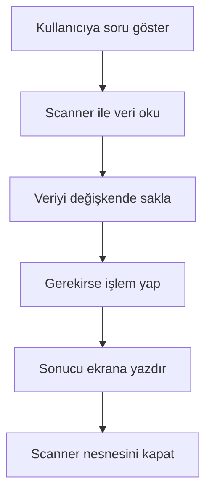

**Diyagram 4.1:** Konsol girdisi alan basit bir Java programının akışı.

**Görsel üretim notu:** Bu Mermaid diyagramı final DOCX/PDF üretiminden önce PNG’ye dönüştürülmeli; ham `flowchart TD` kodu final çıktıda görünmemelidir. Önerilen görsel genişliği 12–13 cm aralığında tutulmalıdır.

## 4.12 Adım adım kod örnekleri

Bu bölümde `Scanner` kullanımını adım adım gösteren örnekler verilecektir. Örnekler basitten daha gerçekçi etkileşimli uygulamalara doğru ilerler.

### Kod 4.1: Kullanıcıdan ad alma

Bu örnek, kullanıcıdan bir satır metin alıp ekrana selamlama mesajı yazdırır.

**Kod kimliği:** `b04_kod01_kullanicidan_ad_alma`

**Kod erişimi:** [Kod sayfası](https://github.com/bmdersleri/javaninTemelleri/tree/main/kodlar/bolum04/kod01/) | [Kaynak kod](https://github.com/bmdersleri/javaninTemelleri/blob/main/kodlar/bolum04/kod01/Bolum04Ornek01AdAlma.java) | 

**QR erişimi:** Kod sayfası ve kaynak kod için aşağıdaki iki QR kod kullanılabilir.

{width=2.8cm} {width=2.8cm}


```java
// Dosya: Bolum04Ornek01AdAlma.java
import java.util.Scanner;

public class Bolum04Ornek01AdAlma {
    public static void main(String[] args) {
        Scanner scanner = new Scanner(System.in);

        System.out.print("Adınızı giriniz: ");
        String ad = scanner.nextLine();

        System.out.println("Merhaba " + ad + "!");
        scanner.close();
    }
}
```

**Kodun amacı:** `Scanner` ile kullanıcıdan metin almak ve alınan metni çıktıda kullanmak.

**Kritik satırlar:**

1. `import java.util.Scanner;` satırı `Scanner` sınıfını programa dâhil eder.
2. `new Scanner(System.in)` klavyeden veri okumak için nesne oluşturur.
3. `scanner.nextLine()` kullanıcının girdiği satırın tamamını okur.
4. `scanner.close()` program sonunda okuyucuyu kapatır.

**Örnek çalışma:**

```text
Adınızı giriniz: Ayşe
Merhaba Ayşe!
```

**Dikkat noktası:** Ad-soyad gibi boşluk içerebilen değerler için `nextLine()` daha uygundur.

### Kod 4.2: Kullanıcıdan tam sayı ve ondalıklı sayı alma

Bu örnek, kullanıcıdan yaş ve not ortalaması alır.

**Kod kimliği:** `b04_kod02_kullanicidan_tam_sayi_ve_ondalikli_sayi_alma`

**Kod erişimi:** [Kod sayfası](https://github.com/bmdersleri/javaninTemelleri/tree/main/kodlar/bolum04/kod02/) | [Kaynak kod](https://github.com/bmdersleri/javaninTemelleri/blob/main/kodlar/bolum04/kod02/Bolum04Ornek02SayiAlma.java) | 

**QR erişimi:** Kod sayfası ve kaynak kod için aşağıdaki iki QR kod kullanılabilir.

{width=2.8cm} {width=2.8cm}


```java
// Dosya: Bolum04Ornek02SayiAlma.java
import java.util.Scanner;

public class Bolum04Ornek02SayiAlma {
    public static void main(String[] args) {
        Scanner scanner = new Scanner(System.in);

        System.out.print("Yaşınızı giriniz: ");
        int yas = scanner.nextInt();

        System.out.print("Not ortalamanızı giriniz: ");
        double ortalama = scanner.nextDouble();

        System.out.println("Yaş: " + yas);
        System.out.println("Not ortalaması: " + ortalama);

        scanner.close();
    }
}
```

**Kodun amacı:** `nextInt()` ve `nextDouble()` metotlarını kullanarak sayı türünde veri almak.

**Kritik satırlar:**

1. `nextInt()` tam sayı okur.
2. `nextDouble()` ondalıklı sayı okur.
3. Okunan değerler uygun veri tipindeki değişkenlerde saklanır.

**Örnek çalışma:**

```text
Yaşınızı giriniz: 20
Not ortalamanızı giriniz: 82.5
Yaş: 20
Not ortalaması: 82.5
```

**Dikkat noktası:** Program sayı beklerken metin girilirse çalışma zamanı hatası oluşabilir.

### Kod 4.3: `next()` ve `nextLine()` farkı

Bu örnek, tek kelime okuma ile satırın tamamını okuma arasındaki farkı gösterir.

**Kod kimliği:** `b04_kod03_ve_farki`

**Kod erişimi:** [Kod sayfası](https://github.com/bmdersleri/javaninTemelleri/tree/main/kodlar/bolum04/kod03/) | [Kaynak kod](https://github.com/bmdersleri/javaninTemelleri/blob/main/kodlar/bolum04/kod03/Bolum04Ornek03NextFarki.java) | 

**QR erişimi:** Kod sayfası ve kaynak kod için aşağıdaki iki QR kod kullanılabilir.

{width=2.8cm} {width=2.8cm}


```java
// Dosya: Bolum04Ornek03NextFarki.java
import java.util.Scanner;

public class Bolum04Ornek03NextFarki {
    public static void main(String[] args) {
        Scanner scanner = new Scanner(System.in);

        System.out.print("Bir kelime giriniz: ");
        String kelime = scanner.next();

        scanner.nextLine();

        System.out.print("Bir cümle giriniz: ");
        String cumle = scanner.nextLine();

        System.out.println("Kelime: " + kelime);
        System.out.println("Cümle: " + cumle);

        scanner.close();
    }
}
```

**Kodun amacı:** `next()` ve `nextLine()` metotlarının farkını göstermek.

**Kritik satırlar:**

1. `next()` boşluğa kadar olan kısmı okur.
2. Ara `scanner.nextLine();` kalan satırı temizler.
3. Sonraki `nextLine()` satırın tamamını okur.

**Örnek çalışma:**

```text
Bir kelime giriniz: Java
Bir cümle giriniz: Java öğreniyorum
Kelime: Java
Cümle: Java öğreniyorum
```

**Dikkat noktası:** `next()` sonrası `nextLine()` kullanılacaksa aradaki satır sonu davranışı test edilmelidir.

### Kod 4.4: Giriş tamponu sorunu ve çözümü

Aşağıdaki örnek, `nextInt()` sonrasında `nextLine()` kullanırken dikkat edilmesi gereken durumu gösterir.

**Kod kimliği:** `b04_kod04_giris_tamponu_sorunu_ve_cozumu`

**Kod erişimi:** [Kod sayfası](https://github.com/bmdersleri/javaninTemelleri/tree/main/kodlar/bolum04/kod04/) | [Kaynak kod](https://github.com/bmdersleri/javaninTemelleri/blob/main/kodlar/bolum04/kod04/Bolum04Ornek04TamponSorunu.java) | 

**QR erişimi:** Kod sayfası ve kaynak kod için aşağıdaki iki QR kod kullanılabilir.

{width=2.8cm} {width=2.8cm}


```java
// Dosya: Bolum04Ornek04TamponSorunu.java
import java.util.Scanner;

public class Bolum04Ornek04TamponSorunu {
    public static void main(String[] args) {
        Scanner scanner = new Scanner(System.in);

        System.out.print("Yaşınızı giriniz: ");
        int yas = scanner.nextInt();

        scanner.nextLine();

        System.out.print("Ad soyad giriniz: ");
        String adSoyad = scanner.nextLine();

        System.out.println("Ad Soyad: " + adSoyad);
        System.out.println("Yaş: " + yas);

        scanner.close();
    }
}
```

**Kodun amacı:** `nextInt()` sonrasında `nextLine()` kullanırken tampon temizleme alışkanlığını göstermek.

**Kritik satırlar:**

1. `scanner.nextInt()` sayıyı okur.
2. `scanner.nextLine();` tamponda kalan satır sonunu temizler.
3. İkinci `scanner.nextLine()` gerçek ad-soyad girişini okur.

**Örnek çalışma:**

```text
Yaşınızı giriniz: 21
Ad soyad giriniz: Mehmet Demir
Ad Soyad: Mehmet Demir
Yaş: 21
```

**Dikkat noktası:** Ara `scanner.nextLine();` satırı kaldırılırsa `adSoyad` boş okunabilir.

### Kod 4.5: Kullanıcıdan alınan değerlerle hesaplama

Bu örnek, kullanıcıdan alınan fiyat ve adet bilgisiyle toplam tutar hesaplar.

**Kod kimliği:** `b04_kod05_kullanicidan_alinan_degerlerle_hesaplama`

**Kod erişimi:** [Kod sayfası](https://github.com/bmdersleri/javaninTemelleri/tree/main/kodlar/bolum04/kod05/) | [Kaynak kod](https://github.com/bmdersleri/javaninTemelleri/blob/main/kodlar/bolum04/kod05/Bolum04Ornek05EtkilesimliHesaplama.java) | 

**QR erişimi:** Kod sayfası ve kaynak kod için aşağıdaki iki QR kod kullanılabilir.

{width=2.8cm} {width=2.8cm}


```java
// Dosya: Bolum04Ornek05EtkilesimliHesaplama.java
import java.util.Scanner;

public class Bolum04Ornek05EtkilesimliHesaplama {
    public static void main(String[] args) {
        Scanner scanner = new Scanner(System.in);

        System.out.print("Birim fiyatı giriniz: ");
        double birimFiyat = scanner.nextDouble();

        System.out.print("Adet giriniz: ");
        int adet = scanner.nextInt();

        double toplam = birimFiyat * adet;

        System.out.println("Birim fiyat: " + birimFiyat);
        System.out.println("Adet: " + adet);
        System.out.println("Toplam tutar: " + toplam);

        scanner.close();
    }
}
```

**Kodun amacı:** Kullanıcı girdisi ile aritmetik işlemi birleştirmek.

**Kritik satırlar:**

1. `birimFiyat` ondalıklı sayı olarak alınır.
2. `adet` tam sayı olarak alınır.
3. `toplam` değişkeni, kullanıcıdan alınan değerlere göre hesaplanır.

**Örnek çalışma:**

```text
Birim fiyatı giriniz: 125.5
Adet giriniz: 3
Birim fiyat: 125.5
Adet: 3
Toplam tutar: 376.5
```

**Dikkat noktası:** Bu programda kullanıcı sayı yerine metin girerse hata oluşabilir.

### Kod 4.6: Hatalı ve düzeltilmiş örnek

Aşağıdaki kodda `nextInt()` sonrasında `nextLine()` kullanımıyla ilgili yaygın bir hata vardır.

**Kod kimliği:** `b04_kod06_hatali_ve_duzeltilmis_ornek`

**Kod erişimi:** [Kod sayfası](https://github.com/bmdersleri/javaninTemelleri/tree/main/kodlar/bolum04/kod06/) | [Kaynak kod](https://github.com/bmdersleri/javaninTemelleri/blob/main/kodlar/bolum04/kod06/Bolum04Ornek06HataDuzeltme.java) | 

**QR erişimi:** Kod sayfası ve kaynak kod için aşağıdaki iki QR kod kullanılabilir.

{width=2.8cm} {width=2.8cm}


```java
// Dosya: Bolum04Ornek06HataDuzeltme.java
import java.util.Scanner;

public class Bolum04Ornek06HataDuzeltme {
    public static void main(String[] args) {
        Scanner scanner = new Scanner(System.in);

        System.out.print("Yaşınızı giriniz: ");
        int yas = scanner.nextInt();

        System.out.print("Ad soyad giriniz: ");
        String adSoyad = scanner.nextLine();

        System.out.println("Ad Soyad: " + adSoyad);
        System.out.println("Yaş: " + yas);

        scanner.close();
    }
}
```

Bu kodda `adSoyad` beklenen biçimde okunmayabilir. Çünkü `nextInt()` sonrasında Enter tuşundan kalan satır sonu bilgisi `nextLine()` tarafından okunabilir.

Düzeltilmiş kod:

**Kod kimliği:** `b04_kod06_hatali_ve_duzeltilmis_ornek_2`

**Kod erişimi:** [Kod sayfası](https://github.com/bmdersleri/javaninTemelleri/tree/main/kodlar/bolum04/kod06_2/) | [Kaynak kod](https://github.com/bmdersleri/javaninTemelleri/blob/main/kodlar/bolum04/kod06_2/Bolum04Ornek06HataDuzeltme.java) | 

**QR erişimi:** Kod sayfası ve kaynak kod için aşağıdaki iki QR kod kullanılabilir.

{width=2.8cm} {width=2.8cm}


```java
// Dosya: Bolum04Ornek06HataDuzeltme.java
import java.util.Scanner;

public class Bolum04Ornek06HataDuzeltme {
    public static void main(String[] args) {
        Scanner scanner = new Scanner(System.in);

        System.out.print("Yaşınızı giriniz: ");
        int yas = scanner.nextInt();

        scanner.nextLine();

        System.out.print("Ad soyad giriniz: ");
        String adSoyad = scanner.nextLine();

        System.out.println("Ad Soyad: " + adSoyad);
        System.out.println("Yaş: " + yas);

        scanner.close();
    }
}
```

**Beklenen çalışma:**

```text
Yaşınızı giriniz: 20
Ad soyad giriniz: Ayşe Yılmaz
Ad Soyad: Ayşe Yılmaz
Yaş: 20
```

**Dikkat noktası:** Sayısal okumalardan sonra tam satır metin okunacaksa tampon davranışı mutlaka test edilmelidir.

## 4.13 Kodun çalışma mantığı ve beklenen çıktı

Konsol girdisi alan programlarda kodun çalışma mantığı, kullanıcının girdiği değerlerle birlikte düşünülmelidir. Aynı program farklı girdilerle farklı çıktılar üretebilir.

Aşağıdaki örneği düşünelim:

```java
System.out.print("Yaşınızı giriniz: ");
int yas = scanner.nextInt();

System.out.println("Yaş: " + yas);
```

Bu kodun çıktısı, kullanıcının girdiği değere bağlıdır.

| Kullanıcı girdisi | Değişkene atanan değer | Program çıktısı |
|---|---:|---|
| `18` | `18` | `Yaş: 18` |
| `25` | `25` | `Yaş: 25` |
| `abc` | Okunamaz | Çalışma zamanı hatası oluşabilir |

Etkileşimli programları test ederken yalnızca kodu okumak yeterli değildir. Farklı giriş değerleri denenmeli ve programın her durumda nasıl davrandığı gözlemlenmelidir.

> **🔍 Derinlemesine:** Kullanıcı girdisi programı dış dünyaya açar. Bu nedenle girdinin türü, sırası ve biçimi programın doğru çalışması için önemlidir.

## 4.14 Uçtan uca mini uygulama: Etkileşimli Öğrenci Kayıt Programı

Bu bölümün mini uygulaması, kullanıcıdan farklı türlerde veri alır ve düzenli bir kayıt özeti üretir.

**Uygulama adı:** Etkileşimli Öğrenci Kayıt Programı

**Dosya adı:** `EtkilesimliOgrenciKayit.java`

**Amaç:** Kullanıcıdan ad-soyad, bölüm, sınıf düzeyi, not ortalaması ve ilgi alanı bilgilerini alarak düzenli bir öğrenci kayıt özeti üretmek.

**Kod kimliği:** `b04_kod15_etkilesimli_ogrenci_kayit_programi`

**Kod erişimi:** [Kod sayfası](https://github.com/bmdersleri/javaninTemelleri/tree/main/kodlar/bolum04/kod15/) | [Kaynak kod](https://github.com/bmdersleri/javaninTemelleri/blob/main/kodlar/bolum04/kod15/EtkilesimliOgrenciKayit.java) | 

**QR erişimi:** Kod sayfası ve kaynak kod için aşağıdaki iki QR kod kullanılabilir.

{width=2.8cm} {width=2.8cm}


```java
// Dosya: EtkilesimliOgrenciKayit.java
import java.util.Scanner;

public class EtkilesimliOgrenciKayit {
    public static void main(String[] args) {
        Scanner scanner = new Scanner(System.in);

        System.out.println("=== Etkileşimli Öğrenci Kayıt Programı ===");
        System.out.println();

        System.out.print("Ad soyad giriniz: ");
        String adSoyad = scanner.nextLine();

        System.out.print("Bölüm adını giriniz: ");
        String bolum = scanner.nextLine();

        System.out.print("Sınıf düzeyini giriniz: ");
        int sinifDuzeyi = scanner.nextInt();

        System.out.print("Not ortalamasını giriniz: ");
        double notOrtalamasi = scanner.nextDouble();

        scanner.nextLine();

        System.out.print("İlgi alanınızı giriniz: ");
        String ilgiAlani = scanner.nextLine();

        boolean ortalamaGecerli =
                notOrtalamasi >= 0.0 && notOrtalamasi <= 100.0;

        System.out.println();
        System.out.println("=== Kayıt Özeti ===");
        System.out.println("Ad Soyad: " + adSoyad);
        System.out.println("Bölüm: " + bolum);
        System.out.println("Sınıf Düzeyi: " + sinifDuzeyi);
        System.out.println("Not Ortalaması: " + notOrtalamasi);
        System.out.println("İlgi Alanı: " + ilgiAlani);
        System.out.println("Ortalama Geçerli Aralıkta mı?: " + ortalamaGecerli);

        scanner.close();
    }
}
```

**Beklenen çalışma örneği:**

```text
=== Etkileşimli Öğrenci Kayıt Programı ===

Ad soyad giriniz: Zeynep Kaya
Bölüm adını giriniz: Bilgisayar Mühendisliği
Sınıf düzeyini giriniz: 1
Not ortalamasını giriniz: 82.5
İlgi alanınızı giriniz: Yapay zekâ

=== Kayıt Özeti ===
Ad Soyad: Zeynep Kaya
Bölüm: Bilgisayar Mühendisliği
Sınıf Düzeyi: 1
Not Ortalaması: 82.5
İlgi Alanı: Yapay zekâ
Ortalama Geçerli Aralıkta mı?: true
```

### 4.14.1 Mini uygulamanın parçalara ayrılması

Bu program beş temel parçadan oluşur:

1. `Scanner` nesnesinin oluşturulması
2. Kullanıcıdan metin türünde veri alınması
3. Kullanıcıdan sayı türünde veri alınması
4. Giriş tamponunun temizlenmesi
5. Kayıt özetinin düzenli biçimde yazdırılması

Bu parçalama, ilerleyen bölümlerde karar yapıları ve metotlar kullanıldığında daha da önemli hâle gelecektir.

### 4.14.2 Mini uygulama test senaryoları

| Test | Girdi durumu | Beklenen sonuç |
|---:|---|---|
| 1 | Ad-soyad tek kelime | Program kayıt özetini üretir |
| 2 | Ad-soyad iki kelime | `nextLine()` sayesinde tam ad okunur |
| 3 | Bölüm adı boşluk içerir | `nextLine()` sayesinde tam bölüm adı okunur |
| 4 | Not ortalaması `82.5` | Geçerli aralık sonucu `true` olur |
| 5 | Not ortalaması `120.0` | Geçerli aralık sonucu `false` olur |
| 6 | Sınıf düzeyi yerine metin girilir | Program çalışma zamanı hatası verebilir |

> **Alıştırma Molası:** Mini uygulamada `notOrtalamasi` değerini `-5`, `50`, `100` ve `120` için test ediniz. `ortalamaGecerli` çıktısının nasıl değiştiğini gözlemleyiniz.

## 4.15 Sık yapılan hatalar ve yanlış sezgiler

Konsol girdisi basit görünse de `Scanner` kullanımında bazı hatalar çok sık görülür.

### 4.15.1 `import` satırını unutmak

Yanlış kullanım:


```java
public class Ornek {
    public static void main(String[] args) {
        Scanner scanner = new Scanner(System.in);
    }
}
```

Düzeltme:


```java
import java.util.Scanner;

public class Ornek {
    public static void main(String[] args) {
        Scanner scanner = new Scanner(System.in);
        scanner.close();
    }
}
```

`Scanner` sınıfı kullanılacaksa `import java.util.Scanner;` satırı programın başına eklenmelidir.

### 4.15.2 `System.in` yerine yanlış kaynak yazmak

Yanlış düşünce:

```text
Scanner nesnesi herhangi bir kaynak belirtmeden klavyeden okur.
```

Düzeltme:

Klavye üzerinden veri almak için `new Scanner(System.in)` kullanılır.

### 4.15.3 `next()` ile ad-soyad okumaya çalışmak

Yanlış kullanım:

```java
String adSoyad = scanner.next();
```

Kullanıcı `Ayşe Yılmaz` girerse yalnızca `Ayşe` okunur.

Düzeltme:

```java
String adSoyad = scanner.nextLine();
```

### 4.15.4 `nextInt()` sonrasında `nextLine()` sorununu fark etmemek

Yanlış kullanım:

```java
int yas = scanner.nextInt();
String adSoyad = scanner.nextLine();
```

Düzeltme:

```java
int yas = scanner.nextInt();
scanner.nextLine();
String adSoyad = scanner.nextLine();
```

### 4.15.5 Beklenen tür dışında giriş yapılmasını yok saymak

Yanlış düşünce:

```text
Program sayı istiyorsa kullanıcı mutlaka sayı girer.
```

Düzeltme:

Kullanıcı yanlışlıkla metin girebilir. Bu durumda program hata verebilir. Bu bölümde yalnızca temel farkındalık oluşturulur; hataları yakalama ilerleyen bölümlerde ele alınacaktır.

### 4.15.6 `scanner.close()` çağrısını programın ortasında kullanmak

`scanner.close()` program sonunda kullanılmalıdır. Programın ortasında çağrılırsa sonraki okuma işlemleri sorun oluşturabilir.

## 4.16 Hata ayıklama egzersizi

Aşağıdaki kodun `KayitHatasi.java` adlı dosyaya kaydedildiğini düşünelim.

**Kod kimliği:** `b04_kod22_hata_ayiklama_egzersizi`

**Kod erişimi:** [Kod sayfası](https://github.com/bmdersleri/javaninTemelleri/tree/main/kodlar/bolum04/kod22/) | [Kaynak kod](https://github.com/bmdersleri/javaninTemelleri/blob/main/kodlar/bolum04/kod22/KayitHatasi.java) | 

**QR erişimi:** Kod sayfası ve kaynak kod için aşağıdaki iki QR kod kullanılabilir.

{width=2.8cm} {width=2.8cm}


```java
// Dosya: KayitHatasi.java
import java.util.Scanner;

public class KayitHatasi {
    public static void main(String[] args) {
        Scanner scanner = new Scanner(System.in);

        System.out.print("Yaşınızı giriniz: ");
        int yas = scanner.nextInt();

        System.out.print("Ad soyad giriniz: ");
        String adSoyad = scanner.nextLine();

        System.out.print("Bölüm giriniz: ");
        String bolum = scanner.next();

        System.out.println("Ad Soyad: " + adSoyad);
        System.out.println("Bölüm: " + bolum);
        System.out.println("Yaş: " + yas);

        scanner.close();
    }
}
```

Bu kodda iki temel mantık sorunu vardır:

1. `nextInt()` sonrasında `nextLine()` çağrıldığı için `adSoyad` boş okunabilir.
2. `bolum` bilgisi `next()` ile okunduğu için boşluk içeren bölüm adlarında yalnızca ilk kelime alınır.

**Düzeltilmiş kod:**

**Kod kimliği:** `b04_kod23_hata_ayiklama_egzersizi`

**Kod erişimi:** [Kod sayfası](https://github.com/bmdersleri/javaninTemelleri/tree/main/kodlar/bolum04/kod23/) | [Kaynak kod](https://github.com/bmdersleri/javaninTemelleri/blob/main/kodlar/bolum04/kod23/KayitHatasi.java) | 

**QR erişimi:** Kod sayfası ve kaynak kod için aşağıdaki iki QR kod kullanılabilir.

{width=2.8cm} {width=2.8cm}


```java
// Dosya: KayitHatasi.java
import java.util.Scanner;

public class KayitHatasi {
    public static void main(String[] args) {
        Scanner scanner = new Scanner(System.in);

        System.out.print("Yaşınızı giriniz: ");
        int yas = scanner.nextInt();

        scanner.nextLine();

        System.out.print("Ad soyad giriniz: ");
        String adSoyad = scanner.nextLine();

        System.out.print("Bölüm giriniz: ");
        String bolum = scanner.nextLine();

        System.out.println("Ad Soyad: " + adSoyad);
        System.out.println("Bölüm: " + bolum);
        System.out.println("Yaş: " + yas);

        scanner.close();
    }
}
```

**Örnek çalışma:**

```text
Yaşınızı giriniz: 20
Ad soyad giriniz: Ali Demir
Bölüm giriniz: Bilgisayar Mühendisliği
Ad Soyad: Ali Demir
Bölüm: Bilgisayar Mühendisliği
Yaş: 20
```

**Kendinize sorunuz:**

1. `adSoyad` neden boş okunabilir?
2. `next()` bölüm adını neden eksik okuyabilir?
3. Ara `scanner.nextLine();` satırı hangi problemi çözer?
4. Hangi bilgiler için `nextLine()` kullanmak daha uygundur?
5. Bu programda kullanıcı yaş yerine metin girerse ne olabilir?

> **Laboratuvar İpucu:** Konsol girdisi alan programları yalnızca bir kez çalıştırmak yeterli değildir. Boşluk içeren metinler, ondalıklı sayılar ve hatalı türde girişler mutlaka denenmelidir.

## 4.17 Bölümün sonraki bölümlerle ilişkisi

Bu bölümde kullanıcıdan veri alma becerisi kazanıldı. Artık Java programları yalnızca kod içinde yazılmış sabit değerlerle çalışmak zorunda değildir. Kullanıcıdan alınan metin ve sayılar değişkenlerde saklanabilir, bu değerlerle hesaplama yapılabilir ve sonuçlar düzenli biçimde ekrana yazdırılabilir.

Bir sonraki bölümde karar yapıları ele alınacaktır. `if`, `else-if` ve `switch` yapıları çoğu zaman kullanıcıdan alınan verilere göre çalışır. Örneğin kullanıcıdan not alınıp harf notu hesaplanabilir, yaş alınıp yaş grubu belirlenebilir veya menü seçimine göre farklı işlem yapılabilir.

Bu nedenle `Scanner` kullanımı, karar yapıları bölümünün doğal ön koşullarından biridir.

## 4.18 Bölüm özeti

Bu bölümde Java’da konsol üzerinden kullanıcıdan veri alma konusu ele alındı. `Scanner` sınıfının klavyeden veri okumak için kullanılabileceği gösterildi. `Scanner` kullanmak için `java.util.Scanner` paketinin import edilmesi gerektiği açıklandı.

`Scanner scanner = new Scanner(System.in);` satırı ile klavyeden veri okuyacak bir `Scanner` nesnesi oluşturuldu. `System.in` ifadesinin standart giriş kaynağını temsil ettiği belirtildi.

`nextInt()`, `nextDouble()`, `next()`, `nextLine()` ve `nextBoolean()` metotları karşılaştırıldı. `nextInt()` tam sayı, `nextDouble()` ondalıklı sayı, `next()` tek kelime, `nextLine()` satırın tamamı ve `nextBoolean()` mantıksal değer okumak için kullanılır.

Bölümde özellikle `nextInt()` veya `nextDouble()` sonrasında `nextLine()` kullanıldığında oluşabilecek giriş tamponu sorunu incelendi. Bu sorunun çözümü için araya fazladan bir `nextLine()` çağrısı eklenebileceği gösterildi.

Kullanıcıdan alınan değerlerle temel hesaplama yapılabileceği örneklerle gösterildi. Ayrıca hatalı türde giriş yapılması durumunda programın çalışma zamanı hatası üretebileceği vurgulandı.

Uçtan uca mini uygulama olarak Etkileşimli Öğrenci Kayıt Programı geliştirildi. Bu uygulama, kullanıcıdan ad-soyad, bölüm, sınıf düzeyi, not ortalaması ve ilgi alanı bilgilerini alarak düzenli bir kayıt özeti üretmektedir.

## 4.19 Terim sözlüğü

| Terim | Açıklama |
|---|---|
| Konsol girişi | Kullanıcının klavyeden programa veri girmesi |
| Konsol çıktısı | Programın ekranda kullanıcıya bilgi göstermesi |
| `Scanner` | Java’da farklı kaynaklardan veri okumak için kullanılan sınıf |
| `import` | Başka paketlerdeki sınıfları programa dâhil etme ifadesi |
| `java.util.Scanner` | `Scanner` sınıfının bulunduğu paket yolu |
| `System.in` | Standart giriş kaynağı, yani klavye |
| `nextInt()` | Tam sayı okuyan `Scanner` metodu |
| `nextDouble()` | Ondalıklı sayı okuyan `Scanner` metodu |
| `next()` | Boşluğa kadar olan tek kelimeyi okuyan metot |
| `nextLine()` | Satırın tamamını okuyan metot |
| `nextBoolean()` | `true` veya `false` değeri okuyan metot |
| Giriş tamponu | Kullanıcı girdisinden sonra bellekte kalabilen okuma alanı |
| Tampon temizleme | Kalan satır sonunu okumak için ek `nextLine()` kullanma |
| Hatalı giriş | Beklenen veri tipinden farklı giriş yapılması |
| Etkileşimli program | Kullanıcıdan veri alıp buna göre çıktı üreten program |

## 4.20 Kendini değerlendirme soruları

### 4.20.1 Çoktan seçmeli sorular

1. Java’da konsoldan veri almak için bu bölümde hangi sınıf kullanılmıştır?

A) `Scanner`  
B) `Printer`  
C) `ReaderWindow`  
D) `ConsoleButton`  
E) `InputPanel`

2. `Scanner` sınıfını kullanmak için hangi import satırı yazılır?

A) `import java.util.Scanner;`  
B) `import java.scanner.Input;`  
C) `include Scanner;`  
D) `using Scanner;`  
E) `import java.input.Keyboard;`

3. Klavyeden veri almak için `Scanner` nesnesi hangi kaynakla oluşturulur?

A) `System.in`  
B) `System.out`  
C) `System.err`  
D) `File.out`  
E) `Keyboard.print`

4. Tam sayı okumak için hangi metot kullanılır?

A) `nextInt()`  
B) `nextDouble()`  
C) `nextLine()`  
D) `nextWord()`  
E) `readIntegerLine()`

5. Satırın tamamını okumak için hangi metot kullanılır?

A) `nextLine()`  
B) `next()`  
C) `nextInt()`  
D) `nextBoolean()`  
E) `lineInt()`

6. `next()` metodu nasıl veri okur?

A) Boşluğa kadar olan tek kelimeyi okur  
B) Her zaman tüm satırı okur  
C) Yalnızca tam sayı okur  
D) Yalnızca ondalıklı sayı okur  
E) Hiç veri okumaz

7. `nextInt()` sonrasında `nextLine()` kullanılacaksa hangi durum dikkate alınmalıdır?

A) Giriş tamponunda kalan satır sonu  
B) Sınıf adının küçük yazılması  
C) `String` değerlerin tek tırnakla yazılması  
D) `main` metodunun kaldırılması  
E) Dosyanın `.txt` yapılması

8. Kullanıcı `nextInt()` bekleyen programa `abc` girerse ne olabilir?

A) Çalışma zamanı hatası oluşabilir  
B) Program her zaman `0` kabul eder  
C) Program otomatik olarak metne çevirir  
D) Program karar yapısına geçer  
E) Program kendini düzeltir

### 4.20.2 Doğru/Yanlış soruları

1. `Scanner` kullanmak için `java.util.Scanner` import edilebilir. (D/Y)
2. `System.in` standart giriş kaynağını temsil eder. (D/Y)
3. `nextLine()` satırın tamamını okumak için kullanılır. (D/Y)
4. `next()` boşluk içeren tüm cümleyi eksiksiz okur. (D/Y)
5. `nextInt()` tam sayı okumak için kullanılabilir. (D/Y)
6. `nextDouble()` ondalıklı sayı okumak için kullanılabilir. (D/Y)
7. `nextInt()` sonrasında `nextLine()` kullanırken tampon sorunu yaşanabilir. (D/Y)
8. Kullanıcıdan alınan veri her zaman beklenen türdedir. (D/Y)
9. `scanner.close()` program sonunda kullanılabilir. (D/Y)
10. Konsol girişi GUI bileşenleriyle yapılır. (D/Y)

### 4.20.3 Açık uçlu kavramsal sorular

1. Konsol girişi kavramını kendi cümlelerinizle açıklayınız.
2. `Scanner` sınıfı ne işe yarar?
3. `System.in` ifadesinin görevini açıklayınız.
4. `next()` ve `nextLine()` arasındaki fark nedir?
5. `nextInt()` ve `nextDouble()` hangi tür verileri okumak için kullanılır?
6. Giriş tamponu sorunu neden ortaya çıkar?
7. `nextInt()` sonrasında neden bazen fazladan `nextLine()` çağrısı gerekir?
8. Kullanıcıdan beklenen tür dışında veri alınırsa ne olabilir?
9. Etkileşimli program yazmak neden önemlidir?
10. Scanner bilgisinin karar yapıları bölümüne nasıl hazırlık sağladığını açıklayınız.

### 4.20.4 Yanlış gerekçeyi bulma soruları

Aşağıdaki ifadelerdeki yanlış gerekçeyi bulunuz ve düzeltiniz.

1. “`Scanner` kullanmak için import satırına gerek yoktur.”
2. “`System.in`, ekrana çıktı yazdırmak için kullanılır.”
3. “`next()` her zaman satırın tamamını okur.”
4. “Ad-soyad okumak için `next()` her zaman yeterlidir.”
5. “`nextInt()` sonrasında `nextLine()` kullanırken hiçbir özel durum yoktur.”
6. “Kullanıcı sayı yerine metin girerse Java bunu otomatik düzeltir.”
7. “`scanner.close()` programın başında çağrılmalıdır.”
8. “Konsol girdisi yalnızca metin okumak için kullanılır.”
9. “Kullanıcıdan alınan değer değişkende saklanamaz.”
10. “Etkileşimli programlarda test yapmaya gerek yoktur.”

## 4.21 Programlama alıştırmaları

### 4.21.1 Kolay düzey

1. `AdSelamlama.java` adlı bir program yazınız. Kullanıcıdan adını alıp selamlama mesajı yazdırınız.
2. `YasOkuma.java` adlı bir program yazınız. Kullanıcıdan yaşını alıp ekrana yazdırınız.
3. `NotOrtalamasiOkuma.java` adlı bir program yazınız. Kullanıcıdan ondalıklı not ortalaması alınız.
4. `KelimeVeCumle.java` adlı bir program yazınız. `next()` ve `nextLine()` farkını gösterecek bir örnek oluşturunuz.
5. `BooleanOkuma.java` adlı bir program yazınız. Kullanıcıdan `true` veya `false` değeri okuyunuz.

### 4.21.2 Orta düzey

1. `KullaniciKart.java` adlı bir program yazınız. Kullanıcıdan ad-soyad, yaş ve bölüm bilgilerini alıp düzenli biçimde yazdırınız.
2. `UrunToplamHesaplama.java` adlı bir program yazınız. Kullanıcıdan birim fiyat ve adet alıp toplam tutarı hesaplayınız.
3. `MetreDonusumScanner.java` adlı bir program yazınız. Kullanıcıdan metre değeri alıp santimetre ve milimetre karşılığını yazdırınız.
4. `ScannerTamponTesti.java` adlı bir program yazınız. `nextInt()` sonrasında `nextLine()` sorununu gösteriniz ve düzeltilmiş hâlini yazınız.
5. `DersKayitBilgisi.java` adlı bir program yazınız. Kullanıcıdan ders adı, kredi, öğretim yılı ve aktiflik bilgisi alınız.

### 4.21.3 Zor düzey

1. `EtkilesimliOgrenciKayit.java` uygulamasını geliştiriniz. Kullanıcıdan en az altı farklı bilgi alınız.
2. Programda hem `nextInt()` hem `nextDouble()` hem de `nextLine()` kullanınız.
3. `nextInt()` veya `nextDouble()` sonrasında `nextLine()` tampon sorununu bilinçli olarak test ediniz.
4. Kullanıcıdan alınan not ortalamasının 0 ile 100 arasında olup olmadığını `boolean` değişkenle hesaplayınız.
5. Programı en az dört farklı test senaryosu ile çalıştırınız.
6. Programın hatalı bir sürümünü oluşturunuz. Bu sürümde `next()` ve `nextLine()` hatası bulunsun. Sonra düzeltilmiş sürümü yazınız.

## 4.22 Haftalık laboratuvar / proje görevi

**Görev başlığı:** Etkileşimli Öğrenci Kayıt Laboratuvarı

**Amaç:** Bu laboratuvarın amacı, öğrencinin `Scanner` sınıfını kullanarak kullanıcıdan farklı türlerde veri alması, aldığı verileri değişkenlerde saklaması, temel hesaplama veya doğrulama yapması ve düzenli çıktı üretmesidir.

**Beklenen adımlar:**

1. `EtkilesimliOgrenciKayit.java` adlı bir Java dosyası oluşturunuz.
2. Programın başına `import java.util.Scanner;` satırını ekleyiniz.
3. `Scanner` nesnesini `System.in` ile oluşturunuz.
4. Kullanıcıdan ad-soyad bilgisini `nextLine()` ile alınız.
5. Kullanıcıdan bölüm bilgisini `nextLine()` ile alınız.
6. Kullanıcıdan sınıf düzeyini `nextInt()` ile alınız.
7. Kullanıcıdan not ortalamasını `nextDouble()` ile alınız.
8. `nextDouble()` sonrasında gerekli tampon temizleme işlemini yapınız.
9. Kullanıcıdan ilgi alanını `nextLine()` ile alınız.
10. Not ortalamasının geçerli aralıkta olup olmadığını `boolean` değişkenle hesaplayınız.
11. Kayıt özetini düzenli biçimde ekrana yazdırınız.
12. Programı en az dört farklı test girdisiyle çalıştırınız.
13. Bir hatalı giriş senaryosu oluşturup sonucu not ediniz.
14. Kısa bir `README.md` dosyası hazırlayınız.

**Teslim edilecek dosyalar:**

1. `EtkilesimliOgrenciKayit.java`
2. `README.md`
3. En az dört test çıktısı
4. Hata ve çözüm notu

**README içeriği şu başlıkları içermelidir:**

1. Programın amacı
2. Kullanılan `Scanner` metotları
3. Kullanılan veri tipleri
4. Tampon sorunu ve çözümü
5. Test senaryoları
6. Karşılaşılan hata ve çözümü
7. Beklenen çıktı örneği

## 4.23 Değerlendirme rubriği

| Ölçüt | Açıklama | Puan |
|---|---|---:|
| `Scanner` kurulumu | `import`, `System.in` ve `Scanner` nesnesinin doğru kullanılması | 15 |
| Veri okuma doğruluğu | `nextInt()`, `nextDouble()`, `next()` ve `nextLine()` metotlarının uygun seçilmesi | 20 |
| Tampon sorunu yönetimi | Sayısal giriş sonrası `nextLine()` kullanımının doğru ele alınması | 15 |
| Kodun çalışması | Programın derlenebilir ve çalıştırılabilir olması | 15 |
| Çıktı düzeni | Kullanıcıya açık sorular sorulması ve kayıt özetinin düzenli verilmesi | 15 |
| Hata farkındalığı | Hatalı türde giriş ve `next()`/`nextLine()` farkının açıklanması | 10 |
| Kod okunabilirliği | Anlamlı değişken adları, girinti ve yorum satırlarının uygunluğu | 5 |
| Raporlama | README ve test çıktılarının yeterliliği | 5 |
| **Toplam** |  | **100** |

## 4.24 İleri okuma ve kaynaklar

Bu bölümde `Scanner` sınıfı başlangıç düzeyinde ele alınmıştır. Daha ayrıntılı bilgi için aşağıdaki kaynak türleri incelenebilir:

1. **Java SE API dokümantasyonu:** `java.util.Scanner` sınıfının metotlarını ve davranışlarını ayrıntılı olarak incelemek için kullanılabilir.
2. **Dev.java öğrenme kaynakları:** Java’da temel giriş-çıkış ve başlangıç düzeyi konsol uygulamaları için yararlı ek kaynaklar sunar.
3. **Oracle Java Tutorials:** Konsol girdisi, temel sınıflar ve giriş-çıkış mantığını pekiştirmek için incelenebilir.
4. **Ders içi ek notlar:** `nextInt()` sonrası `nextLine()` tampon sorunu farklı örneklerle tekrar edilmelidir.
5. **Laboratuvar test notları:** Öğrenciler farklı giriş türlerini deneyerek programın davranışını gözlemlemelidir.

> **💡 İpucu:** `Scanner` konusunu yalnızca okuyarak öğrenmek zordur. Farklı giriş değerleriyle çok sayıda küçük program çalıştırmak gerekir.

## 4.25 Bir sonraki bölüme köprü

Bu bölümde kullanıcıdan veri alma becerisi kazanıldı. Artık programlar kullanıcıyla etkileşim kurabilir ve girilen değerlere göre çıktı üretebilir.

Bir sonraki bölümde karar yapıları ele alınacaktır. `if`, `else-if` ve `switch` yapıları sayesinde program, kullanıcıdan alınan değerlere göre farklı yollar izleyebilecektir. Örneğin bu bölümde kullanıcıdan alınan not ortalaması, sonraki bölümde geçme-kalma veya harf notu hesaplamak için kullanılacaktır.

Böylece Java programları yalnızca veri alan ve gösteren yapılar olmaktan çıkıp, koşullara göre karar veren uygulamalara dönüşecektir.

**BÖLÜM SONU**


\newpage


# Bölüm 5: Karar Yapıları ve Koşullu Programlama

## 5.1 Bölümün yol haritası

Önceki bölümde kullanıcıdan veri almayı ve bu verileri değişkenlerde saklamayı öğrendik. Artık programlarımız yalnızca sabit değerlerle değil, kullanıcıdan gelen değerlere göre de çalışabilir. Ancak gerçek programlar çoğu zaman yalnızca veri almakla kalmaz; alınan veriye göre karar verir.

Bu bölümde Java’da koşullu programlama mantığı ele alınacaktır. Bir öğrencinin notuna göre geçtiğini veya kaldığını belirlemek, girilen sayının pozitif ya da negatif olduğunu bulmak, kullanıcının menü seçimine göre farklı işlem yapmak veya harf notu hesaplamak karar yapılarının tipik kullanım alanlarıdır.

Bu bölümde şu sorulara yanıt aranacaktır:

1. Karar yapısı nedir ve neden kullanılır?
2. `if` ifadesi nasıl çalışır?
3. `else` bloğu hangi durumda kullanılır?
4. `else if` yapısı çoklu koşulları nasıl sıralar?
5. İç içe `if` yapıları ne zaman gerekli olur?
6. Koşul sırası program sonucunu nasıl etkiler?
7. `switch` yapısı hangi durumlarda tercih edilir?
8. `case`, `default` ve `break` ifadeleri ne işe yarar?
9. Menü tabanlı program mantığı nasıl kurulur?
10. `=` ile `==` farkı karar yapılarında neden önemlidir?
11. `&&`, `||` ve `!` operatörleri koşullarda nasıl kullanılır?
12. Kullanıcıdan alınan not bilgisine göre harf notu nasıl hesaplanır?

> **🎯 Bölüm Hedefi:** Bu bölümün sonunda öğrenci, kullanıcıdan veya program içinden gelen değerlere göre farklı kod bloklarını çalıştıran Java programları yazabilecek; `if`, `else-if`, iç içe koşul ve `switch` yapılarını doğru biçimde kullanabilecektir.

Bu bölümde döngüler, metotlara bölme, koleksiyonlar, GUI olayları ve ileri düzey hata yönetimi ele alınmayacaktır. Amaç, koşullu akış mantığını sade ve çalıştırılabilir örneklerle öğrenmektir.

## 5.2 Bölümün konumu ve pedagojik rolü

Bu bölüm, program akışını doğrusal yapıdan koşullu yapıya taşır. Önceki bölümlerde kod satırları çoğunlukla yukarıdan aşağıya sırayla çalışıyordu. Karar yapılarıyla birlikte program artık belirli koşullara göre farklı yollardan ilerleyebilir.

Örneğin kullanıcıdan bir not değeri alındığında programın davranışı şu şekilde değişebilir:

1. Not 60 veya üzerindeyse “geçti” yazdır.
2. Not 60’ın altındaysa “kaldı” yazdır.
3. Not geçersiz aralıktaysa uyarı ver.

Bu yaklaşım, ilerleyen bölümlerde döngüler, algoritmik problem çözme, hata yönetimi, kullanıcı menüleri ve GUI form doğrulama için temel oluşturur.

> **⚠️ Dikkat:** Karar yapıları yalnızca sözdizimi konusu değildir. En önemli beceri, problemi doğru koşullara ayırmak ve koşulları doğru sıraya koymaktır.

Bu bölümde kullanılan örneklerin çoğu, önce sabit değerlerle sonra kullanıcı girdisiyle verilecektir. Böylece öğrenci hem koşul mantığını hem de etkileşimli program geliştirme alışkanlığını birlikte pekiştirecektir.

## 5.3 Öğrenme çıktıları

Bu bölüm tamamlandığında öğrenci:

1. Karar yapısı kavramını kendi cümleleriyle açıklayabilir.
2. `if` yapısını kullanarak tek koşullu program akışı kurabilir.
3. `if-else` yapısını kullanarak iki seçenekli karar verebilir.
4. `else if` yapısıyla çoklu koşulları sıralayabilir.
5. İç içe `if` yapılarını basit örneklerde kullanabilir.
6. Koşul sırasının program sonucunu nasıl etkilediğini açıklayabilir.
7. İlişkisel ve mantıksal operatörleri koşul ifadelerinde kullanabilir.
8. `switch`, `case`, `default` ve `break` ifadelerinin görevlerini açıklayabilir.
9. Menü tabanlı küçük bir konsol programı yazabilir.
10. `=` ile `==` farkını karar yapıları bağlamında ayırt edebilir.
11. `switch` içinde `break` unutulmasının sonuçlarını yorumlayabilir.
12. Kullanıcıdan alınan not değerine göre harf notu hesaplayan program geliştirebilir.
13. Hatalı karar yapısı kodlarını bulup düzeltebilir.
14. Karar yapısı kullanan programları farklı test girdileriyle sınayabilir.

## 5.4 Ön bilgi ve başlangıç varsayımları

Bu bölüm, öğrencinin aşağıdaki konuları temel düzeyde bildiğini varsayar:

1. Java program iskeleti
2. Değişkenler ve veri tipleri
3. `boolean` türü
4. İlişkisel operatörler
5. Mantıksal operatörler
6. `Scanner` ile kullanıcıdan veri alma
7. `System.out.print()` ve `System.out.println()` kullanımı

Bu bölümde kullanıcı girdileri temel düzeyde alınacaktır. Kullanıcı hatalı türde veri girerse gelişmiş hata yakalama yapılmayacaktır. Hata yönetimi ilerleyen bölümlerde ayrıca ele alınacaktır.

## 5.5 Karar yapısı nedir?

Karar yapısı, programın belirli bir koşula göre farklı kod bloklarını çalıştırmasını sağlayan yapıdır. Koşul doğruysa bir işlem, yanlışsa başka bir işlem yapılabilir.

Günlük hayattan örnek düşünelim:

1. Hava yağmurluysa şemsiye al.
2. Hava yağmurlu değilse şemsiye alma.

Programlama açısından bu yapı şu mantığa karşılık gelir:

```text
Eğer koşul doğruysa
    bir işlem yap
Değilse
    başka bir işlem yap
```

Java’da bu mantık `if`, `else`, `else if` ve bazı durumlarda `switch` yapılarıyla kurulur.

Karar yapıları, programın daha akıllı görünmesini sağlar. Çünkü program artık yalnızca sabit sırayla çalışan komutlardan oluşmaz; veriye göre farklı davranabilir.

## 5.6 `if` yapısı

`if` yapısı, bir koşul doğru olduğunda belirli kod bloğunun çalışmasını sağlar. Genel biçimi şöyledir:

```java
if (kosul) {
    // koşul doğruysa çalışacak kodlar
}
```

Koşul ifadesi `boolean` sonuç üretmelidir. Yani koşulun sonucu ya `true` ya da `false` olmalıdır.

Örnek:

```java
int not = 75;

if (not >= 60) {
    System.out.println("Geçtiniz.");
}
```

Bu örnekte `not >= 60` ifadesi `true` olduğu için ekrana `Geçtiniz.` yazdırılır.

> **🎯 Sınav Notu:** `if` parantezinin içindeki ifade `boolean` sonuç üretmelidir.

## 5.7 `if-else` yapısı

`if-else` yapısı, koşul doğruysa bir bloğun, yanlışsa başka bir bloğun çalışmasını sağlar.

Genel biçim:

```java
if (kosul) {
    // koşul doğruysa
} else {
    // koşul yanlışsa
}
```

Örnek:

```java
int not = 45;

if (not >= 60) {
    System.out.println("Geçtiniz.");
} else {
    System.out.println("Kaldınız.");
}
```

Bu örnekte `not >= 60` koşulu yanlış olduğu için `else` bloğu çalışır.

`if-else` yapısı iki olasılığın olduğu durumlarda uygundur. Örneğin:

1. Geçti / kaldı
2. Pozitif / pozitif değil
3. Şifre doğru / şifre yanlış
4. Ürün stokta var / stokta yok

## 5.8 `else if` yapısı

Birden fazla koşulun sırayla kontrol edilmesi gerektiğinde `else if` yapısı kullanılır.

Genel biçim:

```java
if (kosul1) {
    // birinci koşul doğruysa
} else if (kosul2) {
    // ikinci koşul doğruysa
} else {
    // hiçbir koşul doğru değilse
}
```

Örnek:

```java
int not = 85;

if (not >= 90) {
    System.out.println("Harf notu: AA");
} else if (not >= 80) {
    System.out.println("Harf notu: BA");
} else if (not >= 70) {
    System.out.println("Harf notu: BB");
} else if (not >= 60) {
    System.out.println("Harf notu: CB");
} else {
    System.out.println("Harf notu: FF");
}
```

Bu örnekte `not` değeri `85` olduğu için `not >= 80` koşulu sağlanır ve `Harf notu: BA` yazdırılır.

> **⚠️ Dikkat:** `else if` yapılarında koşul sırası çok önemlidir. Daha genel bir koşul önce yazılırsa daha özel koşullar hiç çalışmayabilir.

## 5.9 Koşul sırasının önemi

Koşul sırası, özellikle aralık kontrolü yapılan programlarda önemlidir. Aşağıdaki hatalı örneği inceleyelim:

```java
int not = 95;

if (not >= 60) {
    System.out.println("Geçti");
} else if (not >= 90) {
    System.out.println("Çok başarılı");
}
```

Bu kodda `not` değeri `95` olsa bile ilk koşul olan `not >= 60` doğru olduğu için program `Geçti` yazar ve sonraki koşula geçmez. `not >= 90` koşulu hiç çalışmaz.

Daha doğru sıralama şöyle olmalıdır:

```java
int not = 95;

if (not >= 90) {
    System.out.println("Çok başarılı");
} else if (not >= 60) {
    System.out.println("Geçti");
}
```

Bu nedenle koşullar genellikle özelden genele veya en yüksek aralıktan en düşük aralığa doğru sıralanmalıdır.

> **💡 İpucu:** Not aralığı gibi problemlerde koşulları yazmadan önce aralıkları kâğıt üzerinde sıralamak hata riskini azaltır.

## 5.10 İç içe `if` yapıları

Bazı durumlarda bir koşulun içinde başka bir koşulun kontrol edilmesi gerekir. Bu durumda iç içe `if` yapısı kullanılabilir.

Örnek:

```java
int not = 75;
int devamsizlik = 3;

if (not >= 60) {
    if (devamsizlik <= 5) {
        System.out.println("Başarılı.");
    } else {
        System.out.println("Not yeterli, ancak devamsızlık fazla.");
    }
} else {
    System.out.println("Not yetersiz.");
}
```

Bu örnekte önce not kontrol edilir. Not yeterliyse devamsızlık kontrolüne geçilir. Not yetersizse devamsızlık kontrolü yapılmaz.

İç içe `if` kullanımı bazen gereklidir; ancak fazla derinleşirse kodun okunması zorlaşabilir. Basit koşullar mantıksal operatörlerle birleştirilebilir.

```java
if (not >= 60 && devamsizlik <= 5) {
    System.out.println("Başarılı.");
}
```

> **⚠️ Dikkat:** İç içe `if` yapıları gereksiz yere çoğaltılırsa kod karmaşık hâle gelir. Önce problemin gerçekten iç içe karar gerektirip gerektirmediğini düşünün.

## 5.11 Mantıksal operatörlerle koşul kurma

Karar yapılarında çoğu zaman birden fazla koşul birlikte değerlendirilir. Bunun için `&&`, `||` ve `!` operatörleri kullanılır.

| Operatör | Anlamı | Örnek |
|---|---|---|
| `&&` | ve | İki koşul da doğru olmalı |
| `||` | veya | En az bir koşul doğru olmalı |
| `!` | değil | Koşulun tersini alır |

Örnek:

```java
double ortalama = 72.5;
int devamsizlik = 2;

if (ortalama >= 60 && devamsizlik <= 5) {
    System.out.println("Başarılı.");
} else {
    System.out.println("Başarısız.");
}
```

Bu örnekte öğrencinin başarılı sayılması için hem not ortalaması yeterli olmalı hem de devamsızlık sınırı aşılmamalıdır.

`||` örneği:

```java
boolean raporlu = true;
boolean izinli = false;

if (raporlu || izinli) {
    System.out.println("Devamsızlık mazeretli.");
}
```

`!` örneği:

```java
boolean aktifKayit = false;

if (!aktifKayit) {
    System.out.println("Kayıt aktif değildir.");
}
```

## 5.12 `switch` yapısı

`switch`, bir değişkenin veya ifadenin belirli değerlerine göre farklı kod blokları çalıştırmak için kullanılır. Genellikle menü seçimi, gün numarası, işlem türü veya kısa kodlar gibi ayrık değerlerde kullanılır.

Genel biçim:

```java
switch (ifade) {
    case deger1:
        // deger1 için çalışacak kodlar
        break;
    case deger2:
        // deger2 için çalışacak kodlar
        break;
    default:
        // hiçbir case eşleşmezse çalışacak kodlar
}
```

Örnek:

```java
int secim = 2;

switch (secim) {
    case 1:
        System.out.println("Yeni kayıt");
        break;
    case 2:
        System.out.println("Kayıt listeleme");
        break;
    case 3:
        System.out.println("Çıkış");
        break;
    default:
        System.out.println("Geçersiz seçim");
}
```

Bu örnekte `secim` değeri `2` olduğu için ekrana `Kayıt listeleme` yazdırılır.

## 5.13 `case`, `default` ve `break`

`switch` içinde üç ifade özellikle önemlidir:

| İfade | Görevi |
|---|---|
| `case` | Eşleşecek değeri belirtir |
| `break` | Eşleşen işlemden sonra `switch` yapısından çıkmayı sağlar |
| `default` | Hiçbir `case` eşleşmezse çalışır |

### 5.13.1 `break` unutulursa ne olur?

`break` unutulursa program eşleşen `case` sonrasındaki kodları da çalıştırmaya devam edebilir. Bu davranış başlangıç öğrencileri için sık hata kaynağıdır.

```java
int secim = 1;

switch (secim) {
    case 1:
        System.out.println("Yeni kayıt");
    case 2:
        System.out.println("Kayıt listeleme");
    default:
        System.out.println("Geçersiz seçim");
}
```

Beklenen çıktı çoğu öğrenciye göre yalnızca `Yeni kayıt` olabilir; ancak `break` olmadığı için sonraki satırlar da çalışabilir.

Doğru kullanım:

```java
int secim = 1;

switch (secim) {
    case 1:
        System.out.println("Yeni kayıt");
        break;
    case 2:
        System.out.println("Kayıt listeleme");
        break;
    default:
        System.out.println("Geçersiz seçim");
}
```

> **🎯 Sınav Notu:** `switch` içinde `break` unutulması, istenmeyen şekilde sonraki `case` bloklarının da çalışmasına neden olabilir.

## 5.14 Menü tabanlı karar mantığı

Konsol programlarında kullanıcıya seçenekler sunulabilir. Kullanıcı bir sayı girer ve program bu sayıya göre işlem seçer.

Örnek menü:

```text
1. Toplama
2. Çıkarma
3. Çarpma
4. Bölme
Seçiminiz:
```

Bu tür yapılarda `switch` kullanımı okunabilirlik sağlar. Menü seçimi belirli ayrık değerlerden oluştuğu için `switch` çoğu zaman uygundur.

Ancak aralık kontrolü gerekiyorsa `if-else` daha uygundur. Örneğin not aralıkları, yaş grupları veya fiyat aralıkları genellikle `if-else` ile daha doğal ifade edilir.

| Problem türü | Uygun yapı |
|---|---|
| Not aralığı hesaplama | `if-else` |
| Yaş grubu belirleme | `if-else` |
| Menü seçimi | `switch` |
| Gün numarası seçimi | `switch` |
| Eşik değeri kontrolü | `if` |
| Birden fazla koşul | `if` + mantıksal operatörler |

## 5.15 Karar yapılarında akış

Bir karar yapısı, koşul sonucuna göre farklı yollardan ilerler.

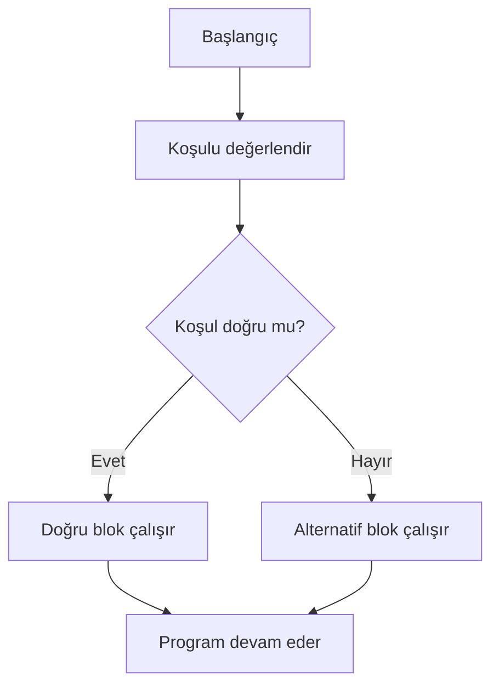

**Diyagram 5.1:** `if-else` yapısında temel karar akışı.

**Görsel üretim notu:** Bu Mermaid diyagramı final DOCX/PDF üretiminden önce PNG’ye dönüştürülmeli; ham `flowchart TD` kodu final çıktıda görünmemelidir. Önerilen görsel genişliği 12–13 cm aralığında tutulmalıdır.

## 5.16 Adım adım kod örnekleri

Bu bölümde karar yapıları, basit koşuldan etkileşimli menüye doğru ilerleyen örneklerle gösterilecektir.

### Kod 5.1: Temel `if` örneği

**Kod kimliği:** `b05_kod01_temel_ornegi`

**Kod erişimi:** [Kod sayfası](https://github.com/bmdersleri/javaninTemelleri/tree/main/kodlar/bolum05/kod01/) | [Kaynak kod](https://github.com/bmdersleri/javaninTemelleri/blob/main/kodlar/bolum05/kod01/Bolum05Ornek01TemelIf.java) | 

**QR erişimi:** Kod sayfası ve kaynak kod için aşağıdaki iki QR kod kullanılabilir.

{width=2.8cm} {width=2.8cm}


```java
// Dosya: Bolum05Ornek01TemelIf.java
public class Bolum05Ornek01TemelIf {
    public static void main(String[] args) {
        int not = 75;

        if (not >= 60) {
            System.out.println("Geçtiniz.");
        }

        System.out.println("Program tamamlandı.");
    }
}
```

**Kodun amacı:** Tek koşullu `if` yapısını göstermek.

**Kritik satırlar:**

1. `not >= 60` koşulu `boolean` sonuç üretir.
2. Koşul doğruysa `if` bloğu çalışır.
3. `if` bloğundan sonra program normal akışına devam eder.

**Beklenen çıktı:**

```text
Geçtiniz.
Program tamamlandı.
```

**Dikkat noktası:** `not` değeri `50` yapılırsa yalnızca `Program tamamlandı.` yazdırılır.

### Kod 5.2: `if-else` ile geçme durumu

**Kod kimliği:** `b05_kod02_ile_gecme_durumu`

**Kod erişimi:** [Kod sayfası](https://github.com/bmdersleri/javaninTemelleri/tree/main/kodlar/bolum05/kod02/) | [Kaynak kod](https://github.com/bmdersleri/javaninTemelleri/blob/main/kodlar/bolum05/kod02/Bolum05Ornek02IfElse.java) | 

**QR erişimi:** Kod sayfası ve kaynak kod için aşağıdaki iki QR kod kullanılabilir.

{width=2.8cm} {width=2.8cm}


```java
// Dosya: Bolum05Ornek02IfElse.java
public class Bolum05Ornek02IfElse {
    public static void main(String[] args) {
        int not = 45;

        if (not >= 60) {
            System.out.println("Geçtiniz.");
        } else {
            System.out.println("Kaldınız.");
        }
    }
}
```

**Kodun amacı:** İki olasılıklı karar yapısını göstermek.

**Kritik satırlar:**

1. Koşul doğruysa `if` bloğu çalışır.
2. Koşul yanlışsa `else` bloğu çalışır.
3. Aynı anda iki blok birden çalışmaz.

**Beklenen çıktı:**

```text
Kaldınız.
```

**Dikkat noktası:** `else` kendi başına koşul almaz. Öncesindeki `if` koşulu yanlışsa çalışır.

### Kod 5.3: `else if` ile harf notu

**Kod kimliği:** `b05_kod03_ile_harf_notu`

**Kod erişimi:** [Kod sayfası](https://github.com/bmdersleri/javaninTemelleri/tree/main/kodlar/bolum05/kod03/) | [Kaynak kod](https://github.com/bmdersleri/javaninTemelleri/blob/main/kodlar/bolum05/kod03/Bolum05Ornek03ElseIfHarfNotu.java) | 

**QR erişimi:** Kod sayfası ve kaynak kod için aşağıdaki iki QR kod kullanılabilir.

{width=2.8cm} {width=2.8cm}


```java
// Dosya: Bolum05Ornek03ElseIfHarfNotu.java
public class Bolum05Ornek03ElseIfHarfNotu {
    public static void main(String[] args) {
        int not = 82;

        if (not >= 90) {
            System.out.println("Harf notu: AA");
        } else if (not >= 80) {
            System.out.println("Harf notu: BA");
        } else if (not >= 70) {
            System.out.println("Harf notu: BB");
        } else if (not >= 60) {
            System.out.println("Harf notu: CB");
        } else {
            System.out.println("Harf notu: FF");
        }
    }
}
```

**Kodun amacı:** Çoklu koşulları sıralı biçimde değerlendirmek.

**Kritik satırlar:**

1. En yüksek not aralığı önce kontrol edilmiştir.
2. Koşullardan biri doğru olunca sonraki koşullar değerlendirilmez.
3. `else` tüm koşullar yanlışsa çalışır.

**Beklenen çıktı:**

```text
Harf notu: BA
```

**Dikkat noktası:** Koşul sırası değiştirilirse sonuç hatalı olabilir.

### Kod 5.4: İç içe `if` ve mantıksal operatör karşılaştırması

**Kod kimliği:** `b05_kod04_ic_ice_ve_mantiksal_operator_karsilastirmasi`

**Kod erişimi:** [Kod sayfası](https://github.com/bmdersleri/javaninTemelleri/tree/main/kodlar/bolum05/kod04/) | [Kaynak kod](https://github.com/bmdersleri/javaninTemelleri/blob/main/kodlar/bolum05/kod04/Bolum05Ornek04IcIceIf.java) | 

**QR erişimi:** Kod sayfası ve kaynak kod için aşağıdaki iki QR kod kullanılabilir.

{width=2.8cm} {width=2.8cm}


```java
// Dosya: Bolum05Ornek04IcIceIf.java
public class Bolum05Ornek04IcIceIf {
    public static void main(String[] args) {
        int not = 72;
        int devamsizlik = 3;

        if (not >= 60) {
            if (devamsizlik <= 5) {
                System.out.println("İç içe if: Başarılı.");
            } else {
                System.out.println("İç içe if: Devamsızlık fazla.");
            }
        } else {
            System.out.println("İç içe if: Not yetersiz.");
        }

        if (not >= 60 && devamsizlik <= 5) {
            System.out.println("Mantıksal ifade: Başarılı.");
        } else {
            System.out.println("Mantıksal ifade: Başarısız.");
        }
    }
}
```

**Kodun amacı:** İç içe `if` ile mantıksal operatör kullanımını karşılaştırmak.

**Kritik satırlar:**

1. İlk bölümde not ve devamsızlık ayrı koşul bloklarında kontrol edilir.
2. İkinci bölümde iki koşul `&&` ile birleştirilir.
3. Basit durumlarda mantıksal operatör daha okunabilir olabilir.

**Beklenen çıktı:**

```text
İç içe if: Başarılı.
Mantıksal ifade: Başarılı.
```

**Dikkat noktası:** Her iç içe `if` yapısı kötü değildir; ancak gereksiz derinlik okunabilirliği azaltır.

### Kod 5.5: `switch` ile menü seçimi

**Kod kimliği:** `b05_kod05_ile_menu_secimi`

**Kod erişimi:** [Kod sayfası](https://github.com/bmdersleri/javaninTemelleri/tree/main/kodlar/bolum05/kod05/) | [Kaynak kod](https://github.com/bmdersleri/javaninTemelleri/blob/main/kodlar/bolum05/kod05/Bolum05Ornek05SwitchMenu.java) | 

**QR erişimi:** Kod sayfası ve kaynak kod için aşağıdaki iki QR kod kullanılabilir.

{width=2.8cm} {width=2.8cm}


```java
// Dosya: Bolum05Ornek05SwitchMenu.java
import java.util.Scanner;

public class Bolum05Ornek05SwitchMenu {
    public static void main(String[] args) {
        Scanner scanner = new Scanner(System.in);

        System.out.println("=== Öğrenci İşlemleri ===");
        System.out.println("1. Yeni kayıt");
        System.out.println("2. Kayıt listeleme");
        System.out.println("3. Çıkış");
        System.out.print("Seçiminiz: ");

        int secim = scanner.nextInt();

        switch (secim) {
            case 1:
                System.out.println("Yeni kayıt işlemi seçildi.");
                break;
            case 2:
                System.out.println("Kayıt listeleme seçildi.");
                break;
            case 3:
                System.out.println("Çıkış seçildi.");
                break;
            default:
                System.out.println("Geçersiz seçim.");
        }

        scanner.close();
    }
}
```

**Kodun amacı:** Kullanıcı seçimine göre `switch` ile farklı işlem çalıştırmak.

**Kritik satırlar:**

1. Kullanıcıdan menü seçimi alınır.
2. `switch (secim)` seçimi değerlendirir.
3. Her `case` ilgili işlemi temsil eder.
4. `default` geçersiz seçimler için çalışır.
5. `break` ilgili işlemden sonra `switch` dışına çıkmayı sağlar.

**Örnek çalışma:**

```text
=== Öğrenci İşlemleri ===
1. Yeni kayıt
2. Kayıt listeleme
3. Çıkış
Seçiminiz: 2
Kayıt listeleme seçildi.
```

**Dikkat noktası:** Menü seçimi ayrık değerlerden oluştuğu için `switch` okunabilir bir çözümdür.

### Kod 5.6: Hatalı ve düzeltilmiş örnek

Aşağıdaki kodda karar yapılarıyla ilgili yaygın hatalar vardır.

**Kod kimliği:** `b05_kod06_hatali_ve_duzeltilmis_ornek`

**Kod erişimi:** [Kod sayfası](https://github.com/bmdersleri/javaninTemelleri/tree/main/kodlar/bolum05/kod06/) | [Kaynak kod](https://github.com/bmdersleri/javaninTemelleri/blob/main/kodlar/bolum05/kod06/Bolum05Ornek06HataDuzeltme.java) | 

**QR erişimi:** Kod sayfası ve kaynak kod için aşağıdaki iki QR kod kullanılabilir.

{width=2.8cm} {width=2.8cm}


```java
// Dosya: Bolum05Ornek06HataDuzeltme.java
public class Bolum05Ornek06HataDuzeltme {
    public static void main(String[] args) {
        int not = 95;

        if (not = 90) {
            System.out.println("AA");
        } else if (not >= 60) {
            System.out.println("Geçti");
        } else if (not >= 90) {
            System.out.println("Çok başarılı");
        }
    }
}
```

Bu kodda iki temel sorun vardır:

1. `if (not = 90)` ifadesinde atama operatörü kullanılmıştır; karşılaştırma için `==` veya aralık kontrolü için `>=` gerekir.
2. `not >= 60` koşulu `not >= 90` koşulundan önce yazıldığı için yüksek not aralığına ulaşılamaz.

Düzeltilmiş kod:

**Kod kimliği:** `b05_kod06_hatali_ve_duzeltilmis_ornek_2`

**Kod erişimi:** [Kod sayfası](https://github.com/bmdersleri/javaninTemelleri/tree/main/kodlar/bolum05/kod06_2/) | [Kaynak kod](https://github.com/bmdersleri/javaninTemelleri/blob/main/kodlar/bolum05/kod06_2/Bolum05Ornek06HataDuzeltme.java) | 

**QR erişimi:** Kod sayfası ve kaynak kod için aşağıdaki iki QR kod kullanılabilir.

{width=2.8cm} {width=2.8cm}


```java
// Dosya: Bolum05Ornek06HataDuzeltme.java
public class Bolum05Ornek06HataDuzeltme {
    public static void main(String[] args) {
        int not = 95;

        if (not >= 90) {
            System.out.println("Çok başarılı");
        } else if (not >= 60) {
            System.out.println("Geçti");
        } else {
            System.out.println("Kaldı");
        }
    }
}
```

**Beklenen çıktı:**

```text
Çok başarılı
```

**Dikkat noktası:** Karar yapılarında hem doğru operatör seçimi hem de doğru koşul sırası önemlidir.

## 5.17 Kodun çalışma mantığı ve beklenen çıktı

Karar yapılarında kodun çıktısını tahmin etmek için koşulların sırasıyla değerlendirilmesi gerekir. Bir `else if` zincirinde ilk doğru koşul bulunduğunda sonraki koşullar değerlendirilmez.

Örnek:

```java
int not = 85;

if (not >= 90) {
    System.out.println("AA");
} else if (not >= 80) {
    System.out.println("BA");
} else {
    System.out.println("Diğer");
}
```

İz sürme tablosu:

| Adım | Koşul | Sonuç | Açıklama |
|---:|---|---|---|
| 1 | `not >= 90` | `false` | 85, 90’dan küçük |
| 2 | `not >= 80` | `true` | 85, 80’den büyük veya eşit |
| 3 | `else` | Çalışmaz | Önceki koşul doğru bulundu |

Beklenen çıktı:

```text
BA
```

`switch` yapısında ise ifade değeri uygun `case` ile eşleştirilir. `break` varsa `switch` yapısından çıkılır. `break` yoksa sonraki blokların da çalışabileceği unutulmamalıdır.

> **💡 İpucu:** Karar yapılarının çıktısını tahmin ederken tüm koşulları aynı anda düşünmeyin. Üstten alta doğru tek tek değerlendirin.

## 5.18 Uçtan uca mini uygulama: Harf Notu Hesaplama

Bu bölümün mini uygulaması, kullanıcıdan not bilgisi alır, notun geçerli aralıkta olup olmadığını kontrol eder ve harf notu hesaplar.

**Uygulama adı:** Harf Notu Hesaplama

**Dosya adı:** `HarfNotuHesaplama.java`

**Amaç:** Kullanıcıdan alınan sayısal notu `if-else` zinciriyle değerlendirerek harf notu ve başarı durumunu üretmek.

**Kod kimliği:** `b05_kod26_harf_notu_hesaplama`

**Kod erişimi:** [Kod sayfası](https://github.com/bmdersleri/javaninTemelleri/tree/main/kodlar/bolum05/kod26/) | [Kaynak kod](https://github.com/bmdersleri/javaninTemelleri/blob/main/kodlar/bolum05/kod26/HarfNotuHesaplama.java) | 

**QR erişimi:** Kod sayfası ve kaynak kod için aşağıdaki iki QR kod kullanılabilir.

{width=2.8cm} {width=2.8cm}


```java
// Dosya: HarfNotuHesaplama.java
import java.util.Scanner;

public class HarfNotuHesaplama {
    public static void main(String[] args) {
        Scanner scanner = new Scanner(System.in);

        System.out.println("=== Harf Notu Hesaplama ===");
        System.out.print("0-100 arasında not giriniz: ");

        int not = scanner.nextInt();
        String harfNotu;
        boolean gecerliNot = not >= 0 && not <= 100;

        if (!gecerliNot) {
            harfNotu = "Geçersiz";
        } else if (not >= 90) {
            harfNotu = "AA";
        } else if (not >= 80) {
            harfNotu = "BA";
        } else if (not >= 70) {
            harfNotu = "BB";
        } else if (not >= 60) {
            harfNotu = "CB";
        } else {
            harfNotu = "FF";
        }

        System.out.println("Girilen not: " + not);
        System.out.println("Harf notu: " + harfNotu);

        if (gecerliNot && not >= 60) {
            System.out.println("Durum: Başarılı");
        } else if (gecerliNot) {
            System.out.println("Durum: Başarısız");
        } else {
            System.out.println("Durum: Not geçersiz");
        }

        scanner.close();
    }
}
```

**Beklenen çalışma örneği 1:**

```text
=== Harf Notu Hesaplama ===
0-100 arasında not giriniz: 85
Girilen not: 85
Harf notu: BA
Durum: Başarılı
```

**Beklenen çalışma örneği 2:**

```text
=== Harf Notu Hesaplama ===
0-100 arasında not giriniz: 45
Girilen not: 45
Harf notu: FF
Durum: Başarısız
```

**Beklenen çalışma örneği 3:**

```text
=== Harf Notu Hesaplama ===
0-100 arasında not giriniz: 120
Girilen not: 120
Harf notu: Geçersiz
Durum: Not geçersiz
```

### 5.18.1 Mini uygulamanın kavram eşleştirmesi

| Kullanılan yapı | Uygulamadaki rolü |
|---|---|
| `Scanner` | Kullanıcıdan not almak |
| `int` | Not değerini saklamak |
| `String` | Harf notunu saklamak |
| `boolean` | Notun geçerli olup olmadığını tutmak |
| `if` | İlk koşulu değerlendirmek |
| `else if` | Not aralıklarını sırayla kontrol etmek |
| `else` | Diğer durumları yakalamak |
| `&&` | Geçerli aralık kontrolü yapmak |
| `!` | Geçersiz not durumunu ifade etmek |

### 5.18.2 Mini uygulama test senaryoları

| Test | Girdi | Beklenen harf notu | Beklenen durum |
|---:|---:|---|---|
| 1 | `95` | `AA` | Başarılı |
| 2 | `85` | `BA` | Başarılı |
| 3 | `72` | `BB` | Başarılı |
| 4 | `61` | `CB` | Başarılı |
| 5 | `45` | `FF` | Başarısız |
| 6 | `-10` | `Geçersiz` | Not geçersiz |
| 7 | `120` | `Geçersiz` | Not geçersiz |

> **Alıştırma Molası:** Harf notu aralıklarını değiştirerek programı yeniden test ediniz. Örneğin 85 ve üzerini `AA` kabul eden bir sistem tasarlayınız.

## 5.19 Ek mini örnek: `switch` ile basit hesap makinesi menüsü

Harf notu hesaplama aralık kontrolü gerektirdiği için `if-else` ile daha doğaldır. Menü tabanlı işlemler ise `switch` için uygundur.

**Kod kimliği:** `b05_kod27_ile_basit_hesap_makinesi_menusu`

**Kod erişimi:** [Kod sayfası](https://github.com/bmdersleri/javaninTemelleri/tree/main/kodlar/bolum05/kod27/) | [Kaynak kod](https://github.com/bmdersleri/javaninTemelleri/blob/main/kodlar/bolum05/kod27/BasitMenuHesapMakinesi.java) | 

**QR erişimi:** Kod sayfası ve kaynak kod için aşağıdaki iki QR kod kullanılabilir.

{width=2.8cm} {width=2.8cm}


```java
// Dosya: BasitMenuHesapMakinesi.java
import java.util.Scanner;

public class BasitMenuHesapMakinesi {
    public static void main(String[] args) {
        Scanner scanner = new Scanner(System.in);

        double sayi1 = 20;
        double sayi2 = 5;

        System.out.println("=== Basit Menü ===");
        System.out.println("1. Toplama");
        System.out.println("2. Çıkarma");
        System.out.println("3. Çarpma");
        System.out.println("4. Bölme");
        System.out.print("Seçiminiz: ");

        int secim = scanner.nextInt();

        switch (secim) {
            case 1:
                System.out.println("Sonuç: " + (sayi1 + sayi2));
                break;
            case 2:
                System.out.println("Sonuç: " + (sayi1 - sayi2));
                break;
            case 3:
                System.out.println("Sonuç: " + (sayi1 * sayi2));
                break;
            case 4:
                System.out.println("Sonuç: " + (sayi1 / sayi2));
                break;
            default:
                System.out.println("Geçersiz seçim.");
        }

        scanner.close();
    }
}
```

**Kodun amacı:** Menü seçimine göre `switch` ile farklı işlem yapmak.

**Örnek çalışma:**

```text
=== Basit Menü ===
1. Toplama
2. Çıkarma
3. Çarpma
4. Bölme
Seçiminiz: 3
Sonuç: 100.0
```

**Dikkat noktası:** Bu örnekte sayılar sabit verilmiştir. Kullanıcıdan sayı alma mantığı önceki bölümde öğrenilmiştir ve alıştırma olarak eklenebilir.

## 5.20 Sık yapılan hatalar ve yanlış sezgiler

Karar yapıları, küçük sözdizimi hatalarından çok mantık hatalarına da açıktır. Program derlense bile yanlış koşul sırası veya yanlış operatör kullanımı hatalı sonuç üretebilir.

### 5.20.1 `=` ile `==` karıştırmak

Yanlış düşünce:

```text
= ve == aynı anlama gelir.
```

Düzeltme:

`=` atama yapar. `==` eşitlik karşılaştırması yapar.

```java
int secim = 1;

if (secim == 1) {
    System.out.println("Birinci seçenek");
}
```

### 5.20.2 Koşul sırasını yanlış kurmak

Yanlış kullanım:

```java
if (not >= 60) {
    System.out.println("Geçti");
} else if (not >= 90) {
    System.out.println("AA");
}
```

Düzeltme:

```java
if (not >= 90) {
    System.out.println("AA");
} else if (not >= 60) {
    System.out.println("Geçti");
}
```

### 5.20.3 `switch` içinde `break` unutmak

Yanlış kullanım:

```java
switch (secim) {
    case 1:
        System.out.println("Toplama");
    case 2:
        System.out.println("Çıkarma");
}
```

Düzeltme:

```java
switch (secim) {
    case 1:
        System.out.println("Toplama");
        break;
    case 2:
        System.out.println("Çıkarma");
        break;
}
```

### 5.20.4 `else` bloğuna koşul yazmaya çalışmak

Yanlış kullanım:

```java
if (not >= 60) {
    System.out.println("Geçti");
} else (not < 60) {
    System.out.println("Kaldı");
}
```

Düzeltme:

```java
if (not >= 60) {
    System.out.println("Geçti");
} else {
    System.out.println("Kaldı");
}
```

`else` bloğu koşul almaz. Yeni koşul gerekiyorsa `else if` kullanılmalıdır.

### 5.20.5 Mantıksal operatörü yanlış seçmek

Yanlış kullanım:

```java
if (not >= 60 || devamsizlik <= 5) {
    System.out.println("Başarılı");
}
```

Eğer başarı için hem not yeterli hem de devamsızlık uygun olmalıysa `&&` kullanılmalıdır.

Düzeltme:

```java
if (not >= 60 && devamsizlik <= 5) {
    System.out.println("Başarılı");
}
```

### 5.20.6 Süslü parantezleri ihmal etmek

Tek satırlı `if` yapılarında süslü parantez kullanılmasa da başlangıç düzeyinde her zaman kullanılması önerilir.

Önerilen kullanım:

```java
if (not >= 60) {
    System.out.println("Geçti");
}
```

> **💡 İpucu:** Başlangıç düzeyinde `if`, `else if`, `else` ve `switch` bloklarında süslü parantez kullanmak okunabilirliği artırır ve hata riskini azaltır.

## 5.21 Hata ayıklama egzersizi

Aşağıdaki kodun `HarfNotuHatasi.java` adlı dosyaya kaydedildiğini düşünelim.

**Kod kimliği:** `b05_kod38_hata_ayiklama_egzersizi`

**Kod erişimi:** [Kod sayfası](https://github.com/bmdersleri/javaninTemelleri/tree/main/kodlar/bolum05/kod38/) | [Kaynak kod](https://github.com/bmdersleri/javaninTemelleri/blob/main/kodlar/bolum05/kod38/HarfNotuHatasi.java) | 

**QR erişimi:** Kod sayfası ve kaynak kod için aşağıdaki iki QR kod kullanılabilir.

{width=2.8cm} {width=2.8cm}


```java
// Dosya: HarfNotuHatasi.java
import java.util.Scanner;

public class HarfNotuHatasi {
    public static void main(String[] args) {
        Scanner scanner = new Scanner(System.in);

        System.out.print("Not giriniz: ");
        int not = scanner.nextInt();

        if (not = 100) {
            System.out.println("Tam puan");
        } else if (not >= 60) {
            System.out.println("Geçti");
        } else if (not >= 90) {
            System.out.println("AA");
        } else (not < 60) {
            System.out.println("Kaldı");
        }

        scanner.close();
    }
}
```

Bu kodda derleme hatası ve mantık hatası birlikte bulunmaktadır.

**Hatalar:**

1. `if (not = 100)` ifadesinde atama operatörü kullanılmıştır.
2. `else if (not >= 60)` koşulu, `not >= 90` koşulundan önce yazılmıştır.
3. `else (not < 60)` biçimi hatalıdır; `else` koşul almaz.
4. Koşul sırası yüksek not aralıklarını doğru yakalamaz.
5. Geçerli not aralığı kontrolü yapılmamıştır.

**Düzeltilmiş kod:**

**Kod kimliği:** `b05_kod39_hata_ayiklama_egzersizi`

**Kod erişimi:** [Kod sayfası](https://github.com/bmdersleri/javaninTemelleri/tree/main/kodlar/bolum05/kod39/) | [Kaynak kod](https://github.com/bmdersleri/javaninTemelleri/blob/main/kodlar/bolum05/kod39/HarfNotuHatasi.java) | 

**QR erişimi:** Kod sayfası ve kaynak kod için aşağıdaki iki QR kod kullanılabilir.

{width=2.8cm} {width=2.8cm}


```java
// Dosya: HarfNotuHatasi.java
import java.util.Scanner;

public class HarfNotuHatasi {
    public static void main(String[] args) {
        Scanner scanner = new Scanner(System.in);

        System.out.print("Not giriniz: ");
        int not = scanner.nextInt();

        if (not < 0 || not > 100) {
            System.out.println("Geçersiz not");
        } else if (not == 100) {
            System.out.println("Tam puan");
        } else if (not >= 90) {
            System.out.println("AA");
        } else if (not >= 60) {
            System.out.println("Geçti");
        } else {
            System.out.println("Kaldı");
        }

        scanner.close();
    }
}
```

**Örnek çalışma:**

```text
Not giriniz: 95
AA
```

**Kendinize sorunuz:**

1. Hangi hata derleme aşamasında yakalanır?
2. Hangi hata program çalışsa bile yanlış sonuç üretir?
3. `=` yerine neden `==` kullanılmalıdır?
4. `not >= 90` koşulu neden `not >= 60` koşulundan önce yazılmıştır?
5. `else` bloğuna neden koşul yazılmaz?
6. Geçersiz not kontrolü neden en başta yapılmıştır?

> **Laboratuvar İpucu:** Karar yapılarında hata ararken önce derleme hatalarını düzeltin, sonra koşul sırasını test değerleriyle kontrol edin.

## 5.22 Bölümün sonraki bölümlerle ilişkisi

Bu bölümde programların koşullara göre farklı yollar izleyebilmesi sağlandı. Kullanıcıdan alınan veya program içinde tanımlanan değerlere göre `if`, `else if`, `else` ve `switch` yapılarıyla karar verildi.

Bir sonraki bölümde döngüler ele alınacaktır. Döngüler, bir işlemi tekrar tekrar yapmayı sağlar. Karar yapıları ve döngüler çoğu zaman birlikte kullanılır. Örneğin kullanıcı doğru şifre girene kadar tekrar deneme yapılabilir, belirli sayıda not alınabilir veya menü seçimi kullanıcı çıkış yapana kadar sürdürülebilir.

Bu nedenle karar yapıları, döngülerin anlaşılması için önemli bir ön koşuldur.

## 5.23 Bölüm özeti

Bu bölümde Java’da karar yapıları ve koşullu programlama konusu ele alındı. Programların yalnızca yukarıdan aşağıya çalışan yapılardan ibaret olmadığı; belirli koşullara göre farklı kod bloklarının çalıştırılabileceği gösterildi.

İlk olarak `if` yapısı incelendi. `if` yapısının `boolean` sonuç üreten bir koşula bağlı olarak çalıştığı açıklandı. Ardından `if-else` yapısıyla iki seçenekli karar verme mantığı gösterildi.

Birden fazla koşulun bulunduğu durumlarda `else if` yapısının kullanılabileceği anlatıldı. Özellikle not aralığı gibi problemlerde koşul sırasının doğru kurulmasının program sonucunu doğrudan etkilediği vurgulandı.

İç içe `if` yapıları ve mantıksal operatörlerle koşul birleştirme örneklerle karşılaştırıldı. `&&`, `||` ve `!` operatörlerinin karar yapılarında nasıl kullanılabileceği gösterildi.

Menü tabanlı kararlar için `switch` yapısı ele alındı. `case`, `default` ve `break` ifadelerinin görevleri açıklandı. `break` unutulduğunda programın sonraki `case` bloklarına geçebileceği özellikle vurgulandı.

Uçtan uca mini uygulama olarak Harf Notu Hesaplama programı geliştirildi. Bu uygulama, kullanıcıdan alınan not değerine göre geçerli not kontrolü, harf notu belirleme ve başarı durumu üretme işlemlerini birleştirdi.

## 5.24 Terim sözlüğü

| Terim | Açıklama |
|---|---|
| Karar yapısı | Koşula göre farklı kod bloklarını çalıştıran yapı |
| Koşul | `true` veya `false` sonucu üreten ifade |
| `if` | Koşul doğruysa ilgili bloğu çalıştıran yapı |
| `else` | `if` koşulu yanlışsa çalışan alternatif blok |
| `else if` | Birden fazla koşulu sırayla kontrol eden yapı |
| İç içe `if` | Bir `if` bloğu içinde başka bir `if` kullanılması |
| `switch` | Ayrık değerlere göre seçim yapan karar yapısı |
| `case` | `switch` içinde eşleşecek değeri belirten ifade |
| `default` | Hiçbir `case` eşleşmezse çalışan blok |
| `break` | `switch` içinden çıkmayı sağlayan ifade |
| Koşul sırası | Koşulların yukarıdan aşağıya değerlendirilme düzeni |
| Mantıksal operatör | `boolean` ifadeleri birleştiren operatör |
| `&&` | İki koşulun da doğru olmasını gerektiren ve operatörü |
| `||` | En az bir koşulun doğru olmasını yeterli gören veya operatörü |
| `!` | Koşulun tersini alan değil operatörü |
| Menü | Kullanıcıya seçenekler sunan konsol yapısı |

## 5.25 Kendini değerlendirme soruları

### 5.25.1 Çoktan seçmeli sorular

1. Java’da bir koşul doğruysa belirli kod bloğunu çalıştırmak için hangi yapı kullanılır?

A) `if`  
B) `print`  
C) `class`  
D) `import`  
E) `Scanner`

2. `else` bloğu ne zaman çalışır?

A) Önceki `if` koşulu yanlışsa  
B) Her zaman  
C) Sadece program başında  
D) Sadece `switch` içinde  
E) Sadece kullanıcı metin girerse

3. Birden fazla koşulu sırayla kontrol etmek için hangi yapı kullanılır?

A) `else if`  
B) `nextLine`  
C) `println`  
D) `final`  
E) `parseInt`

4. Eşitlik karşılaştırması için hangi operatör kullanılır?

A) `==`  
B) `=`  
C) `+=`  
D) `++`  
E) `!`

5. `switch` içinde hiçbir `case` eşleşmezse hangi blok çalışabilir?

A) `default`  
B) `main`  
C) `import`  
D) `class`  
E) `boolean`

6. `switch` içinde `break` ne işe yarar?

A) İlgili işlemden sonra `switch` dışına çıkmayı sağlar  
B) Programı derler  
C) Kullanıcıdan veri alır  
D) Değişken tanımlar  
E) Dosya adını değiştirir

7. `&&` operatörü ne zaman `true` üretir?

A) İki koşul da doğruysa  
B) En az bir koşul doğruysa  
C) İki koşul da yanlışsa  
D) İlk koşul yanlışsa  
E) Hiçbir koşul yoksa

8. Menü seçimi gibi ayrık değerlerde genellikle hangi yapı okunabilir çözüm sunar?

A) `switch`  
B) `double`  
C) `String`  
D) `import`  
E) `Scanner.close`

### 5.25.2 Doğru/Yanlış soruları

1. `if` parantezinin içindeki ifade `boolean` sonuç üretmelidir. (D/Y)
2. `else` bloğu kendi başına koşul alır. (D/Y)
3. `else if` yapısında koşul sırası önemlidir. (D/Y)
4. `=` ve `==` aynı anlama gelir. (D/Y)
5. `switch` içinde `case` değerleri kullanılır. (D/Y)
6. `default` bloğu hiçbir `case` eşleşmezse çalışabilir. (D/Y)
7. `break` unutulursa sonraki `case` blokları da çalışabilir. (D/Y)
8. `&&` için iki koşulun da doğru olması gerekir. (D/Y)
9. `||` için en az bir koşulun doğru olması yeterlidir. (D/Y)
10. Karar yapıları kullanıcı girdileriyle birlikte kullanılabilir. (D/Y)

### 5.25.3 Açık uçlu kavramsal sorular

1. Karar yapısı kavramını kendi cümlelerinizle açıklayınız.
2. `if` ve `if-else` arasındaki fark nedir?
3. `else if` yapısı hangi durumlarda gereklidir?
4. Koşul sırası neden önemlidir?
5. İç içe `if` yapısına günlük hayattan bir örnek veriniz.
6. `&&`, `||` ve `!` operatörlerinin karar yapılarındaki rolünü açıklayınız.
7. `switch` yapısı hangi tür problemlerde daha uygundur?
8. `case`, `default` ve `break` ifadelerinin görevlerini yazınız.
9. `=` ile `==` farkını örnekle açıklayınız.
10. Harf notu hesaplama probleminde neden `if-else` yapısı uygundur?

### 5.25.4 Yanlış gerekçeyi bulma soruları

Aşağıdaki ifadelerdeki yanlış gerekçeyi bulunuz ve düzeltiniz.

1. “`else` bloğuna her zaman koşul yazılmalıdır.”
2. “`not >= 60` koşulu, `not >= 90` koşulundan önce yazılırsa daha iyi olur.”
3. “`switch` içinde `break` yazmak gereksizdir.”
4. “`=` operatörü eşitlik karşılaştırması yapar.”
5. “`&&` ve `||` operatörleri aynı anlamda kullanılabilir.”
6. “Karar yapılarında test değeri kullanmaya gerek yoktur.”
7. “`default` bloğu mutlaka ilk sırada yazılmalıdır.”
8. “İç içe `if` her zaman en iyi çözümdür.”
9. “Harf notu hesaplamada koşul sırası önemli değildir.”
10. “Geçersiz not kontrolü programın sonunda yapılmalıdır.”

## 5.26 Programlama alıştırmaları

### 5.26.1 Kolay düzey

1. `GecmeDurumu.java` adlı bir program yazınız. Sabit bir not değerine göre geçti/kaldı çıktısı üretiniz.
2. `PozitifNegatif.java` adlı bir program yazınız. Bir sayının pozitif, negatif veya sıfır olduğunu yazdırınız.
3. `CiftTek.java` adlı bir program yazınız. Bir sayının 2’ye bölümünden kalana göre çift veya tek olduğunu yazdırınız.
4. `YasKontrol.java` adlı bir program yazınız. Yaş 18 veya üzerindeyse “yetişkin” yazdırınız.
5. `BasitSifreKontrol.java` adlı bir program yazınız. Sabit bir şifre değeri doğruysa “giriş başarılı” yazdırınız.

### 5.26.2 Orta düzey

1. `HarfNotuBasit.java` adlı bir program yazınız. Kullanıcıdan not alıp harf notu üretiniz.
2. `DevamsizlikKontrol.java` adlı bir program yazınız. Not ve devamsızlık bilgisine göre başarı durumunu hesaplayınız.
3. `MenuSecimi.java` adlı bir program yazınız. `switch` ile üç seçenekli bir menü oluşturunuz.
4. `UrunIndirimKontrol.java` adlı bir program yazınız. Tutar 500 TL üzerindeyse indirim uygulanacağını yazdırınız.
5. `GecerliNotKontrol.java` adlı bir program yazınız. Notun 0 ile 100 arasında olup olmadığını kontrol ediniz.

### 5.26.3 Zor düzey

1. `HarfNotuHesaplama.java` uygulamasını geliştiriniz. Kullanıcıdan not alınız, geçersiz aralıkları kontrol ediniz ve harf notu üretiniz.
2. Programda `boolean gecerliNot` ve `String harfNotu` değişkenlerini kullanınız.
3. Not aralıklarını en yüksekten en düşüğe doğru sıralayınız.
4. Programı en az yedi test değeriyle çalıştırınız: `95`, `85`, `72`, `61`, `45`, `-10`, `120`.
5. `switch` ile küçük bir işlem menüsü yazınız. Menüde en az dört seçenek ve `default` bloğu bulunsun.
6. `switch` örneğinde bilinçli olarak bir `break` satırını kaldırınız, sonucu gözlemleyiniz ve düzeltilmiş sürümü yazınız.

## 5.27 Haftalık laboratuvar / proje görevi

**Görev başlığı:** Harf Notu Hesaplama Laboratuvarı

**Amaç:** Bu laboratuvarın amacı, öğrencinin karar yapılarını kullanarak kullanıcıdan alınan bir not değerini değerlendirmesi, geçersiz giriş aralıklarını kontrol etmesi ve uygun harf notu ile başarı durumunu üretmesidir.

**Beklenen adımlar:**

1. `HarfNotuHesaplama.java` adlı bir Java dosyası oluşturunuz.
2. Programda `Scanner` ile kullanıcıdan not değeri alınız.
3. Notun 0 ile 100 arasında olup olmadığını kontrol ediniz.
4. Geçersiz not girildiyse uygun uyarı yazdırınız.
5. Geçerli not için harf notu aralıklarını belirleyiniz.
6. Koşulları en yüksek not aralığından en düşük not aralığına doğru sıralayınız.
7. `String harfNotu` değişkenini kullanınız.
8. `boolean gecerliNot` değişkenini kullanınız.
9. Başarı durumunu ayrıca yazdırınız.
10. Programı en az yedi farklı test girdisiyle çalıştırınız.
11. Bir hatalı koşul sırası senaryosu oluşturunuz ve sonucunu açıklayınız.
12. `switch` ile ayrıca küçük bir menü örneği yazınız.
13. Kısa bir `README.md` dosyası hazırlayınız.

**Teslim edilecek dosyalar:**

1. `HarfNotuHesaplama.java`
2. İsteğe bağlı: `BasitMenuHesapMakinesi.java`
3. `README.md`
4. En az yedi test çıktısı
5. Hata ve çözüm notu

**README içeriği şu başlıkları içermelidir:**

1. Programın amacı
2. Kullanılan karar yapıları
3. Not aralıkları
4. Test senaryoları
5. Hatalı koşul sırası örneği
6. `switch` menü örneği açıklaması
7. Karşılaşılan hata ve çözümü

## 5.28 Değerlendirme rubriği

| Ölçüt | Açıklama | Puan |
|---|---|---:|
| Karar yapısı kullanımı | `if`, `else if` ve `else` yapılarının doğru kullanılması | 20 |
| Koşul doğruluğu | Not aralıkları ve geçersiz değer kontrolünün doğru yapılması | 20 |
| Operatör kullanımı | İlişkisel ve mantıksal operatörlerin doğru seçilmesi | 15 |
| `switch` uygulaması | Menü örneğinde `case`, `default` ve `break` kullanımının doğru olması | 15 |
| Kodun çalışması | Programın derlenebilir ve çalıştırılabilir olması | 10 |
| Test kapsamı | En az yedi test girdisinin raporlanması | 10 |
| Kod okunabilirliği | Anlamlı değişken adları, girinti ve çıktı düzeni | 5 |
| Raporlama | README ve hata çözüm notunun yeterliliği | 5 |
| **Toplam** |  | **100** |

## 5.29 İleri okuma ve kaynaklar

Bu bölümde Java karar yapıları başlangıç düzeyinde ele alınmıştır. Daha ayrıntılı bilgi için aşağıdaki kaynak türleri incelenebilir:

1. **Java Language Specification:** `if`, `switch`, ifade değerlendirme ve operatör davranışlarının resmî tanımını içerir.
2. **Java SE dokümantasyonu:** Dil yapılarıyla birlikte kullanılan temel sınıfların davranışlarını kontrol etmek için kullanılabilir.
3. **Dev.java öğrenme kaynakları:** Temel Java kontrol yapıları ve karar verme örnekleri için yararlı kaynaklar sunar.
4. **Oracle Java Tutorials:** `if-then`, `if-then-else` ve `switch` yapıları için örnek odaklı ek çalışma sağlar.
5. **Ders içi ek notlar:** Harf notu, menü seçimi ve geçersiz giriş kontrolü örnekleri laboratuvar ortamında çoğaltılmalıdır.

> **💡 İpucu:** Karar yapılarında başarı, yalnızca kodu yazmakla değil, doğru test değerlerini seçmekle de ilgilidir.

## 5.30 Bir sonraki bölüme köprü

Bu bölümde programların koşullara göre farklı yollar izleyebilmesini sağlayan karar yapıları öğrenildi. `if`, `else if`, `else` ve `switch` yapıları sayesinde kullanıcı girdilerine veya program içindeki değerlere göre farklı çıktılar üretildi.

Bir sonraki bölümde döngüler ele alınacaktır. Döngüler, belirli işlemleri tekrar etmek için kullanılır. Karar yapıları ve döngüler birlikte kullanıldığında programlar çok daha güçlü hâle gelir. Örneğin kullanıcı doğru değer girene kadar tekrar sorma, belirli sayıda not alma veya menüyü kullanıcı çıkış yapana kadar sürdürme gibi yapılar döngülerle kurulacaktır.

**BÖLÜM SONU**


\newpage


# Bölüm 6: Döngüler ve Tekrarlı İşlem Mantığı

## 6.1 Bölümün yol haritası

Önceki bölümde program akışını koşullara göre yönlendirmeyi öğrendik. Ancak birçok programda bir işlemin yalnızca bir kez yapılması yeterli değildir. Kullanıcı doğru şifreyi girene kadar yeniden deneme yapılması, menüden çıkış seçilene kadar menünün tekrar gösterilmesi, 1’den 100’e kadar sayıların toplanması veya çarpım tablosu üretilmesi tekrar gerektiren durumlardır.

Bu bölümde Java’da döngü kavramı ele alınacaktır. `while`, `do-while` ve `for` döngüleri birlikte incelenecek; tekrar sayısı baştan belli olmayan ve belli olan durumlar karşılaştırılacaktır. Ayrıca sayaç, biriktirici, sentinel değer, iç içe döngü, `break` ve `continue` gibi temel döngü kalıpları gösterilecektir.

Bu bölümde şu sorulara yanıt aranacaktır:

1. Döngü nedir ve neden kullanılır?
2. `while` döngüsü hangi durumlarda uygundur?
3. `do-while` döngüsünün `while` döngüsünden farkı nedir?
4. Sayaç, koşul ve güncelleme adımları neden birlikte düşünülmelidir?
5. Sentinel değer nedir?
6. Sonsuz döngü nasıl oluşur ve nasıl önlenir?
7. `break` döngü akışını nasıl değiştirir?
8. `continue` hangi durumlarda kullanılır?
9. `for` döngüsünün başlangıç, koşul ve artış bölümleri nasıl çalışır?
10. Toplam alma, sayma ve min–max bulma desenleri nasıl yazılır?
11. İç içe döngülerle tablo çıktısı nasıl üretilir?
12. Şifre deneme, sayı analizi ve çarpım tablosu problemleri döngülerle nasıl çözülür?

> **🎯 Bölüm Hedefi:** Bu bölümün sonunda öğrenci, tekrar eden işlemleri `while`, `do-while` ve `for` döngüleriyle modelleyebilecek; sayaç, biriktirici, sentinel değer, iç içe döngü, `break` ve `continue` yapılarını küçük Java programlarında kullanabilecektir.

Bu bölümde algoritma analizi, Big-O gösterimi, ileri verimlilik tartışmaları, koleksiyonlar, diziler ve metotlara ayrıntılı geçiş yapılmayacaktır. Amaç, öğrencinin temel döngü kalıplarını doğru, okunabilir ve güvenli biçimde kullanmasını sağlamaktır.

## 6.2 Bölümün konumu ve pedagojik rolü

Bu bölüm, karar yapılarından algoritmik problem çözmeye geçişte kritik bir basamaktır. Önceki bölümde programın farklı koşullara göre farklı yollara ayrılabileceği görüldü. Bu bölümde ise programın belirli bir koşul devam ettiği sürece veya belirli bir sayaç aralığı boyunca aynı işlemleri tekrar edebileceği gösterilecektir.

`while` ve `do-while` döngüleri çoğu zaman tekrar sayısının baştan kesin bilinmediği durumlarda kullanılır. Örneğin kullanıcı doğru şifreyi girene kadar tekrar sormak veya kullanıcı çıkış seçeneğini seçene kadar menüyü tekrar göstermek bu kapsamdadır.

`for` döngüsü ise çoğunlukla tekrar sayısının veya sayaç aralığının baştan belli olduğu durumlarda daha okunabilir bir çözümdür. Örneğin 1’den 10’a kadar sayıları yazdırmak, 1’den 100’e kadar toplam almak veya çarpım tablosu üretmek gibi görevlerde `for` döngüsü oldukça uygundur.

> **⚠️ Dikkat:** Döngüler yalnızca “aynı işi çok kez yapmak” değildir. Doğru başlangıç değeri, doğru koşul, doğru güncelleme ve doğru çıkış mantığı birlikte kurulmalıdır.

Bu bölüm, bir sonraki bölüm olan Algoritmik Problem Çözme Desenleri için doğrudan hazırlık sağlar. Çünkü sayaç, biriktirici, bayrak değişken, min–max bulma ve iç içe döngü gibi yapılar algoritmik problemlerin temel araçlarıdır.

## 6.3 Öğrenme çıktıları

Bu bölüm tamamlandığında öğrenci:

1. Döngü kavramını kendi cümleleriyle açıklayabilir.
2. `while`, `do-while` ve `for` döngülerini ayırt edebilir.
3. Tekrar sayısı belli olan ve olmayan problemler için uygun döngü seçebilir.
4. Sayaç kontrollü döngü yazabilir.
5. Koşula bağlı tekrar mantığını uygulayabilir.
6. Sentinel değer kullanarak döngü sonlandırabilir.
7. Sonsuz döngü riskini tanıyabilir ve önleyebilir.
8. `break` ifadesinin döngüden çıkış etkisini açıklayabilir.
9. `continue` ifadesinin bir turu atlama etkisini açıklayabilir.
10. Biriktirici değişkenle toplam alma desenini uygulayabilir.
11. Sayma desenini kullanarak koşula uyan değerleri sayabilir.
12. Min–max bulma mantığını temel düzeyde kullanabilir.
13. İç içe döngülerle tablo benzeri çıktılar üretebilir.
14. Verilen bir döngünün kaç kez çalışacağını adım adım izleyebilir.
15. Şifre deneme, sayı analizi ve çarpım tablosu mini uygulamasını geliştirebilir.

## 6.4 Ön bilgi ve başlangıç varsayımları

Bu bölüm, öğrencinin aşağıdaki konuları temel düzeyde bildiğini varsayar:

1. Java program iskeleti
2. Değişkenler ve veri tipleri
3. Aritmetik ve ilişkisel operatörler
4. Mantıksal operatörler
5. `Scanner` ile kullanıcı girdisi alma
6. Karar yapıları
7. `boolean` ifadeler
8. Konsola çıktı yazdırma

Bu bölümde döngüler tek dosyalı konsol programları üzerinden anlatılacaktır. Diziler, koleksiyonlar, dosya işlemleri, GUI veya veritabanı kullanılmayacaktır.

## 6.5 Döngü kavramı

Döngü, belirli bir kod bloğunun birden fazla kez çalışmasını sağlayan yapıdır. Döngü kullanılmadan aynı işlemi tekrar etmek için kodu tekrar tekrar yazmak gerekir. Bu hem okunabilirliği azaltır hem de hata riskini artırır.

Örneğin 1’den 5’e kadar sayıları yazdırmak için şu şekilde tekrar eden kod yazılabilir:

```java
System.out.println(1);
System.out.println(2);
System.out.println(3);
System.out.println(4);
System.out.println(5);
```

Döngü ile aynı işlem daha düzenli yazılabilir:

```java
int sayi = 1;

while (sayi <= 5) {
    System.out.println(sayi);
    sayi++;
}
```

Döngülerin temelinde üç unsur vardır:

1. Başlangıç değeri
2. Devam koşulu
3. Güncelleme adımı

Bu üç unsurdan biri eksik veya hatalı olursa döngü beklenmeyen sonuç üretebilir.

> **🎯 Sınav Notu:** Döngü yazarken “nereden başlayacak, hangi koşulda devam edecek, her turda ne değişecek?” soruları mutlaka cevaplanmalıdır.

## 6.6 `while` döngüsü

`while` döngüsü, koşul doğru olduğu sürece döngü bloğunu çalıştırır. Koşul en başta kontrol edilir. Koşul başlangıçta yanlışsa döngü bloğu hiç çalışmayabilir.

Genel biçim:

```java
while (kosul) {
    // koşul doğru olduğu sürece çalışacak kodlar
}
```

Örnek:

```java
int sayac = 1;

while (sayac <= 5) {
    System.out.println(sayac);
    sayac++;
}
```

Beklenen çıktı:

```text
1
2
3
4
5
```

Bu örnekte `sayac` değeri 1’den başlar. Her turda ekrana yazdırılır ve 1 artırılır. `sayac` değeri 6 olduğunda `sayac <= 5` koşulu yanlış olur ve döngü biter.

> **⚠️ Dikkat:** `while` döngüsünde güncelleme adımı unutulursa sonsuz döngü oluşabilir.

## 6.7 `do-while` döngüsü

`do-while` döngüsünde döngü bloğu en az bir kez çalışır. Çünkü koşul, döngü bloğundan sonra kontrol edilir.

Genel biçim:

```java
do {
    // en az bir kez çalışacak kodlar
} while (kosul);
```

Örnek:

```java
int sayac = 1;

do {
    System.out.println(sayac);
    sayac++;
} while (sayac <= 5);
```

Beklenen çıktı:

```text
1
2
3
4
5
```

`do-while` döngüsü özellikle menü uygulamalarında kullanışlıdır. Çünkü menünün en az bir kez gösterilmesi istenir.

> **💡 İpucu:** Kullanıcıya seçenek gösterip sonra devam edip etmeyeceğine karar vereceğiniz durumlarda `do-while` okunabilir bir çözüm sunabilir.

## 6.8 `while` ve `do-while` karşılaştırması

Aşağıdaki tablo iki döngü türünü karşılaştırır.

| Özellik | `while` | `do-while` |
|---|---|---|
| Koşul kontrolü | Döngüden önce | Döngüden sonra |
| En az bir kez çalışma garantisi | Yok | Var |
| Kullanım örneği | Koşul baştan sağlanıyorsa tekrar | Menü veya ilk çalışması gereken işlem |
| Yaygın hata | Güncelleme unutmak | Sondaki noktalı virgülü unutmak |

Örnek fark:

```java
int sayi = 10;

while (sayi < 5) {
    System.out.println("while çalıştı");
}

do {
    System.out.println("do-while çalıştı");
} while (sayi < 5);
```

Beklenen çıktı:

```text
do-while çalıştı
```

Çünkü `while` koşulu baştan yanlış olduğu için hiç çalışmaz. `do-while` ise koşulu sonra kontrol ettiği için bir kez çalışır.

## 6.9 Sentinel değer kavramı

Sentinel değer, döngüyü sonlandırmak için kullanılan özel değerdir. Örneğin kullanıcıdan sayılar alınıp toplanacaksa, kullanıcı `0` girdiğinde döngü durdurulabilir.

```java
Scanner scanner = new Scanner(System.in);
int sayi;
int toplam = 0;

System.out.print("Sayı giriniz, çıkış için 0: ");
sayi = scanner.nextInt();

while (sayi != 0) {
    toplam += sayi;

    System.out.print("Sayı giriniz, çıkış için 0: ");
    sayi = scanner.nextInt();
}

System.out.println("Toplam: " + toplam);
scanner.close();
```

Bu örnekte `0` sentinel değerdir. Döngüyü bitirmek için kullanılır; toplama dahil edilmez.

> **🎯 Sınav Notu:** Sentinel değer, döngünün ne zaman biteceğini kullanıcıya veya programa bildiren özel değerdir.

## 6.10 Sonsuz döngü

Sonsuz döngü, döngü koşulunun hiçbir zaman yanlış hâle gelmemesi durumunda oluşur.

Hatalı örnek:

```java
int sayac = 1;

while (sayac <= 5) {
    System.out.println(sayac);
}
```

Bu kodda `sayac` değeri hiç artırılmadığı için koşul sürekli doğru kalır. Döngü bitmez.

Düzeltilmiş örnek:

```java
int sayac = 1;

while (sayac <= 5) {
    System.out.println(sayac);
    sayac++;
}
```

Sonsuz döngüleri önlemek için şu sorular sorulmalıdır:

1. Döngü değişkeni başlangıç değeri aldı mı?
2. Koşul doğru biçimde yazıldı mı?
3. Döngü içinde koşulu etkileyen değer güncelleniyor mu?
4. Kullanıcıya çıkış seçeneği sunuldu mu?
5. Sentinel değer doğru kontrol ediliyor mu?

## 6.11 `break` ve `continue`

Döngü akışını bazı durumlarda normal koşul dışında değiştirmek gerekebilir. Bunun için `break` ve `continue` ifadeleri kullanılabilir.

### 6.11.1 `break`

`break`, döngüyü hemen sonlandırır.

```java
int sayac = 1;

while (sayac <= 10) {
    if (sayac == 4) {
        break;
    }

    System.out.println(sayac);
    sayac++;
}
```

Beklenen çıktı:

```text
1
2
3
```

`sayac` değeri 4 olduğunda `break` çalışır ve döngü biter.

### 6.11.2 `continue`

`continue`, döngünün o turundaki kalan satırları atlar ve bir sonraki tura geçer.

```java
for (int i = 1; i <= 5; i++) {
    if (i == 3) {
        continue;
    }

    System.out.println(i);
}
```

Beklenen çıktı:

```text
1
2
4
5
```

`i` değeri 3 olduğunda `continue` çalışır ve `System.out.println(i);` satırı o turda atlanır.

> **⚠️ Dikkat:** `continue` özellikle `while` döngülerinde dikkatli kullanılmalıdır. Güncelleme adımı atlanırsa sonsuz döngü riski doğabilir.

## 6.12 `for` döngüsü

`for` döngüsü, çoğunlukla tekrar sayısının baştan belli olduğu durumlarda kullanılır. Genel biçimi şöyledir:

```java
for (baslangic; kosul; artis) {
    // tekrar edecek kodlar
}
```

Örnek:

```java
for (int i = 1; i <= 5; i++) {
    System.out.println(i);
}
```

Beklenen çıktı:

```text
1
2
3
4
5
```

Bu döngüde:

1. `int i = 1` başlangıç bölümüdür.
2. `i <= 5` devam koşuludur.
3. `i++` her tur sonunda çalışan artış bölümüdür.

> **🎯 Sınav Notu:** `for` döngüsünde başlangıç, koşul ve artış bölümleri tek satırda görüldüğü için sayaç kontrollü tekrarlar daha okunabilir yazılır.

## 6.13 `while` ve `for` seçimi

Aynı problem bazen hem `while` hem de `for` ile çözülebilir. Ancak okunabilirlik açısından doğru döngü seçimi önemlidir.

| Problem türü | Genellikle uygun döngü |
|---|---|
| Kullanıcı çıkış seçeneği seçene kadar menü gösterme | `do-while` |
| Kullanıcı 0 girene kadar sayı toplama | `while` |
| 1’den 100’e kadar sayıları toplama | `for` |
| Belirli sayıda deneme hakkı | `for` veya `while` |
| Çarpım tablosu üretme | İç içe `for` |
| Koşul ne zaman bitecek belli değilse | `while` |
| Tekrar sayısı baştan belliyse | `for` |

Bu seçim kesin bir yasadan çok, okunabilirlik ve problem yapısına göre verilen bir tasarım kararıdır.

## 6.14 Toplam alma ve sayma desenleri

Döngülerde en sık kullanılan kalıplardan ikisi toplam alma ve saymadır.

### 6.14.1 Toplam alma

Toplam alma için genellikle bir biriktirici değişken kullanılır.

```java
int toplam = 0;

for (int i = 1; i <= 10; i++) {
    toplam += i;
}

System.out.println("Toplam: " + toplam);
```

Beklenen çıktı:

```text
Toplam: 55
```

### 6.14.2 Sayma

Belirli koşula uyan değerleri saymak için sayaç değişkeni kullanılır.

```java
int ciftSayisi = 0;

for (int i = 1; i <= 10; i++) {
    if (i % 2 == 0) {
        ciftSayisi++;
    }
}

System.out.println("Çift sayı adedi: " + ciftSayisi);
```

Beklenen çıktı:

```text
Çift sayı adedi: 5
```

## 6.15 Min–max bulma mantığı

Bir sayı aralığında en küçük veya en büyük değeri bulmak, algoritmik problem çözmenin temel kalıplarından biridir. Bu bölümde sabit aralık üzerinden temel mantık gösterilecektir.

```java
int enBuyuk = 1;

for (int i = 1; i <= 10; i++) {
    if (i > enBuyuk) {
        enBuyuk = i;
    }
}

System.out.println("En büyük: " + enBuyuk);
```

Beklenen çıktı:

```text
En büyük: 10
```

Gerçek uygulamalarda min–max bulma çoğunlukla kullanıcıdan alınan değerlerle veya veri koleksiyonlarıyla yapılır. Bu bölümde amaç, karşılaştırma ve güncelleme mantığını görmektir.

> **💡 İpucu:** Min–max problemlerinde başlangıç değeri dikkatli seçilmelidir. Yanlış başlangıç değeri, doğru görünen ama hatalı sonuçlar üretebilir.

## 6.16 İç içe döngüler

Bir döngünün içinde başka bir döngü kullanılmasına iç içe döngü denir. Tablo, matris, çarpım tablosu ve yıldız desenleri gibi yapılarda sık kullanılır.

Örnek:

```java
for (int satir = 1; satir <= 3; satir++) {
    for (int sutun = 1; sutun <= 4; sutun++) {
        System.out.print("* ");
    }

    System.out.println();
}
```

Beklenen çıktı:

```text
* * * *
* * * *
* * * *
```

Dış döngü satırları, iç döngü ise sütunları kontrol eder.

> **⚠️ Dikkat:** İç içe döngülerde toplam çalışma sayısı dış ve iç döngü tekrarlarının çarpımıyla ilişkilidir. Başlangıç düzeyinde küçük aralıklarla test yapmak daha güvenlidir.

## 6.17 Döngü akış diyagramı

Döngülerin temel mantığı koşul kontrolü ve tekrar eden blok ilişkisine dayanır.

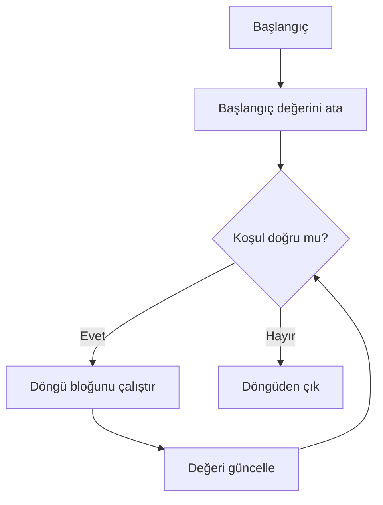

**Diyagram 6.1:** Koşul kontrollü döngünün genel çalışma akışı.

**Görsel üretim notu:** Bu Mermaid diyagramı final DOCX/PDF üretiminden önce PNG’ye dönüştürülmeli; ham `flowchart TD` kodu final çıktıda görünmemelidir. Önerilen görsel genişliği 12–13 cm aralığında tutulmalıdır.

## 6.18 Adım adım kod örnekleri

Bu bölümde döngü türleri ve döngü kalıpları basitten karmaşığa doğru örneklendirilecektir.

### Kod 6.1: `while` ile sayaç kullanımı

**Kod kimliği:** `b06_kod01_ile_sayac_kullanimi`

**Kod erişimi:** [Kod sayfası](https://github.com/bmdersleri/javaninTemelleri/tree/main/kodlar/bolum06/kod01/) | [Kaynak kod](https://github.com/bmdersleri/javaninTemelleri/blob/main/kodlar/bolum06/kod01/Bolum06Ornek01WhileSayac.java) | 

**QR erişimi:** Kod sayfası ve kaynak kod için aşağıdaki iki QR kod kullanılabilir.

{width=2.8cm} {width=2.8cm}


```java
// Dosya: Bolum06Ornek01WhileSayac.java
public class Bolum06Ornek01WhileSayac {
    public static void main(String[] args) {
        int sayac = 1;

        while (sayac <= 5) {
            System.out.println("Sayaç: " + sayac);
            sayac++;
        }

        System.out.println("Döngü bitti.");
    }
}
```

**Kodun amacı:** `while` döngüsünde başlangıç, koşul ve güncelleme adımlarını göstermek.

**Kritik satırlar:**

1. `int sayac = 1;` başlangıç değeridir.
2. `sayac <= 5` devam koşuludur.
3. `sayac++` güncelleme adımıdır.

**Beklenen çıktı:**

```text
Sayaç: 1
Sayaç: 2
Sayaç: 3
Sayaç: 4
Sayaç: 5
Döngü bitti.
```

**Dikkat noktası:** `sayac++` satırı kaldırılırsa sonsuz döngü oluşur.

### Kod 6.2: `do-while` ile menü tekrarı

**Kod kimliği:** `b06_kod02_ile_menu_tekrari`

**Kod erişimi:** [Kod sayfası](https://github.com/bmdersleri/javaninTemelleri/tree/main/kodlar/bolum06/kod02/) | [Kaynak kod](https://github.com/bmdersleri/javaninTemelleri/blob/main/kodlar/bolum06/kod02/Bolum06Ornek02DoWhileMenu.java) | 

**QR erişimi:** Kod sayfası ve kaynak kod için aşağıdaki iki QR kod kullanılabilir.

{width=2.8cm} {width=2.8cm}


```java
// Dosya: Bolum06Ornek02DoWhileMenu.java
import java.util.Scanner;

public class Bolum06Ornek02DoWhileMenu {
    public static void main(String[] args) {
        Scanner scanner = new Scanner(System.in);
        int secim;

        do {
            System.out.println("=== Menü ===");
            System.out.println("1. Yeni kayıt");
            System.out.println("2. Kayıt listeleme");
            System.out.println("0. Çıkış");
            System.out.print("Seçiminiz: ");

            secim = scanner.nextInt();

            if (secim == 1) {
                System.out.println("Yeni kayıt seçildi.");
            } else if (secim == 2) {
                System.out.println("Kayıt listeleme seçildi.");
            } else if (secim == 0) {
                System.out.println("Program sonlandırılıyor.");
            } else {
                System.out.println("Geçersiz seçim.");
            }

            System.out.println();
        } while (secim != 0);

        scanner.close();
    }
}
```

**Kodun amacı:** Menü tabanlı etkileşimli programlarda `do-while` kullanımını göstermek.

**Kritik satırlar:**

1. Menü en az bir kez gösterilir.
2. Kullanıcı seçimi `secim` değişkeninde saklanır.
3. `secim != 0` koşulu çıkış seçilene kadar döngüyü sürdürür.

**Örnek çalışma:**

```text
=== Menü ===
1. Yeni kayıt
2. Kayıt listeleme
0. Çıkış
Seçiminiz: 2
Kayıt listeleme seçildi.

=== Menü ===
1. Yeni kayıt
2. Kayıt listeleme
0. Çıkış
Seçiminiz: 0
Program sonlandırılıyor.
```

**Dikkat noktası:** `do-while` sonunda noktalı virgül bulunur.

### Kod 6.3: `for` ile toplam alma

**Kod kimliği:** `b06_kod03_ile_toplam_alma`

**Kod erişimi:** [Kod sayfası](https://github.com/bmdersleri/javaninTemelleri/tree/main/kodlar/bolum06/kod03/) | [Kaynak kod](https://github.com/bmdersleri/javaninTemelleri/blob/main/kodlar/bolum06/kod03/Bolum06Ornek03ForToplam.java) | 

**QR erişimi:** Kod sayfası ve kaynak kod için aşağıdaki iki QR kod kullanılabilir.

{width=2.8cm} {width=2.8cm}


```java
// Dosya: Bolum06Ornek03ForToplam.java
public class Bolum06Ornek03ForToplam {
    public static void main(String[] args) {
        int toplam = 0;

        for (int i = 1; i <= 10; i++) {
            toplam += i;
        }

        System.out.println("1-10 toplamı: " + toplam);
    }
}
```

**Kodun amacı:** `for` döngüsü ile belirli aralıktaki sayıların toplamını almak.

**Kritik satırlar:**

1. `int toplam = 0;` biriktirici değişkendir.
2. `i <= 10` döngünün devam koşuludur.
3. `toplam += i` her turda toplamı günceller.

**Beklenen çıktı:**

```text
1-10 toplamı: 55
```

**Dikkat noktası:** Toplam değişkeni döngüden önce 0 ile başlatılmalıdır.

### Kod 6.4: `for` ile çift sayıları sayma

**Kod kimliği:** `b06_kod04_ile_cift_sayilari_sayma`

**Kod erişimi:** [Kod sayfası](https://github.com/bmdersleri/javaninTemelleri/tree/main/kodlar/bolum06/kod04/) | [Kaynak kod](https://github.com/bmdersleri/javaninTemelleri/blob/main/kodlar/bolum06/kod04/Bolum06Ornek04CiftSayma.java) | 

**QR erişimi:** Kod sayfası ve kaynak kod için aşağıdaki iki QR kod kullanılabilir.

{width=2.8cm} {width=2.8cm}


```java
// Dosya: Bolum06Ornek04CiftSayma.java
public class Bolum06Ornek04CiftSayma {
    public static void main(String[] args) {
        int ciftSayisi = 0;

        for (int i = 1; i <= 20; i++) {
            if (i % 2 == 0) {
                ciftSayisi++;
            }
        }

        System.out.println("Çift sayı adedi: " + ciftSayisi);
    }
}
```

**Kodun amacı:** Döngü ve karar yapısını birlikte kullanarak sayma deseni kurmak.

**Kritik satırlar:**

1. `%` operatörü kalan bulmak için kullanılır.
2. `i % 2 == 0` çift sayı kontrolüdür.
3. `ciftSayisi++` koşula uyan değerleri sayar.

**Beklenen çıktı:**

```text
Çift sayı adedi: 10
```

**Dikkat noktası:** Sayaç yalnızca koşul doğru olduğunda artırılmalıdır.

### Kod 6.5: İç içe `for` ile çarpım tablosu

**Kod kimliği:** `b06_kod05_ic_ice_ile_carpim_tablosu`

**Kod erişimi:** [Kod sayfası](https://github.com/bmdersleri/javaninTemelleri/tree/main/kodlar/bolum06/kod05/) | [Kaynak kod](https://github.com/bmdersleri/javaninTemelleri/blob/main/kodlar/bolum06/kod05/Bolum06Ornek05CarpimTablosu.java) | 

**QR erişimi:** Kod sayfası ve kaynak kod için aşağıdaki iki QR kod kullanılabilir.

{width=2.8cm} {width=2.8cm}


```java
// Dosya: Bolum06Ornek05CarpimTablosu.java
public class Bolum06Ornek05CarpimTablosu {
    public static void main(String[] args) {
        for (int satir = 1; satir <= 5; satir++) {
            for (int sutun = 1; sutun <= 5; sutun++) {
                System.out.printf("%4d", satir * sutun);
            }

            System.out.println();
        }
    }
}
```

**Kodun amacı:** İç içe döngülerle tablo biçiminde çıktı üretmek.

**Kritik satırlar:**

1. Dış döngü satırları temsil eder.
2. İç döngü sütunları temsil eder.
3. `satir * sutun` çarpım değerini üretir.
4. `printf("%4d", ...)` hizalı çıktı sağlar.

**Beklenen çıktı:**

```text
   1   2   3   4   5
   2   4   6   8  10
   3   6   9  12  15
   4   8  12  16  20
   5  10  15  20  25
```

**Dikkat noktası:** `System.out.println();` iç döngü bittikten sonra yeni satıra geçmek için kullanılır.

### Kod 6.6: `break` ve `continue`

**Kod kimliği:** `b06_kod06_ve`

**Kod erişimi:** [Kod sayfası](https://github.com/bmdersleri/javaninTemelleri/tree/main/kodlar/bolum06/kod06/) | [Kaynak kod](https://github.com/bmdersleri/javaninTemelleri/blob/main/kodlar/bolum06/kod06/Bolum06Ornek06BreakContinue.java) | 

**QR erişimi:** Kod sayfası ve kaynak kod için aşağıdaki iki QR kod kullanılabilir.

{width=2.8cm} {width=2.8cm}


```java
// Dosya: Bolum06Ornek06BreakContinue.java
public class Bolum06Ornek06BreakContinue {
    public static void main(String[] args) {
        System.out.println("continue örneği:");

        for (int i = 1; i <= 5; i++) {
            if (i == 3) {
                continue;
            }

            System.out.println(i);
        }

        System.out.println("break örneği:");

        for (int i = 1; i <= 5; i++) {
            if (i == 4) {
                break;
            }

            System.out.println(i);
        }
    }
}
```

**Kodun amacı:** `break` ve `continue` ifadelerinin döngü akışına etkisini göstermek.

**Beklenen çıktı:**

```text
continue örneği:
1
2
4
5
break örneği:
1
2
3
```

**Dikkat noktası:** `continue` yalnızca o turu atlar; `break` döngüyü tamamen bitirir.

### Kod 6.7: Hatalı ve düzeltilmiş örnek

Aşağıdaki kodda sonsuz döngü hatası vardır.

**Kod kimliği:** `b06_kod07_hatali_ve_duzeltilmis_ornek`

**Kod erişimi:** [Kod sayfası](https://github.com/bmdersleri/javaninTemelleri/tree/main/kodlar/bolum06/kod07/) | [Kaynak kod](https://github.com/bmdersleri/javaninTemelleri/blob/main/kodlar/bolum06/kod07/Bolum06Ornek07HataDuzeltme.java) | 

**QR erişimi:** Kod sayfası ve kaynak kod için aşağıdaki iki QR kod kullanılabilir.

{width=2.8cm} {width=2.8cm}


```java
// Dosya: Bolum06Ornek07HataDuzeltme.java
public class Bolum06Ornek07HataDuzeltme {
    public static void main(String[] args) {
        int sayac = 1;

        while (sayac <= 5) {
            System.out.println("Sayaç: " + sayac);
        }
    }
}
```

Bu kodda `sayac` değeri döngü içinde artırılmadığı için koşul sürekli doğru kalır.

Düzeltilmiş kod:

**Kod kimliği:** `b06_kod07_hatali_ve_duzeltilmis_ornek_2`

**Kod erişimi:** [Kod sayfası](https://github.com/bmdersleri/javaninTemelleri/tree/main/kodlar/bolum06/kod07_2/) | [Kaynak kod](https://github.com/bmdersleri/javaninTemelleri/blob/main/kodlar/bolum06/kod07_2/Bolum06Ornek07HataDuzeltme.java) | 

**QR erişimi:** Kod sayfası ve kaynak kod için aşağıdaki iki QR kod kullanılabilir.

{width=2.8cm} {width=2.8cm}


```java
// Dosya: Bolum06Ornek07HataDuzeltme.java
public class Bolum06Ornek07HataDuzeltme {
    public static void main(String[] args) {
        int sayac = 1;

        while (sayac <= 5) {
            System.out.println("Sayaç: " + sayac);
            sayac++;
        }
    }
}
```

**Beklenen çıktı:**

```text
Sayaç: 1
Sayaç: 2
Sayaç: 3
Sayaç: 4
Sayaç: 5
```

**Dikkat noktası:** Döngü koşulunu etkileyen değişkenin güncellenip güncellenmediği kontrol edilmelidir.

## 6.19 Kodun çalışma mantığı ve iz sürme

Döngülerde kodun çıktısını tahmin etmek için her turda değişkenlerin aldığı değerler izlenmelidir.

Örnek:

```java
int toplam = 0;

for (int i = 1; i <= 4; i++) {
    toplam += i;
}
```

İz sürme tablosu:

| Tur | `i` | `toplam` önce | İşlem | `toplam` sonra |
|---:|---:|---:|---|---:|
| 1 | 1 | 0 | `toplam += 1` | 1 |
| 2 | 2 | 1 | `toplam += 2` | 3 |
| 3 | 3 | 3 | `toplam += 3` | 6 |
| 4 | 4 | 6 | `toplam += 4` | 10 |

Döngü sonunda `toplam` değeri 10 olur.

> **💡 İpucu:** Döngüleri anlamanın en güvenilir yollarından biri küçük değerlerle iz sürme tablosu oluşturmaktır.

## 6.20 Uçtan uca mini uygulama: Şifre Deneme, Sayı Analizi ve Çarpım Tablosu

Bu bölümün mini uygulaması, `while`, `do-while` ve `for` döngülerini tek bir menü tabanlı programda birleştirir.

**Uygulama adı:** Döngü Laboratuvarı

**Dosya adı:** `DonguLaboratuvari.java`

**Amaç:** Kullanıcıya menü sunmak, şifre deneme sistemi çalıştırmak, sayı analizi yapmak ve çarpım tablosu üretmek.

**Kod kimliği:** `b06_kod28_sifre_deneme_sayi_analizi_ve_carpim_tablosu`

**Kod erişimi:** [Kod sayfası](https://github.com/bmdersleri/javaninTemelleri/tree/main/kodlar/bolum06/kod28/) | [Kaynak kod](https://github.com/bmdersleri/javaninTemelleri/blob/main/kodlar/bolum06/kod28/DonguLaboratuvari.java) | 

**QR erişimi:** Kod sayfası ve kaynak kod için aşağıdaki iki QR kod kullanılabilir.

{width=2.8cm} {width=2.8cm}


```java
// Dosya: DonguLaboratuvari.java
import java.util.Scanner;

public class DonguLaboratuvari {
    public static void main(String[] args) {
        Scanner scanner = new Scanner(System.in);

        final String DOGRU_SIFRE = "java123";
        int secim;

        do {
            System.out.println("=== Döngü Laboratuvarı ===");
            System.out.println("1. Şifre deneme sistemi");
            System.out.println("2. 1-N sayı analizi");
            System.out.println("3. Çarpım tablosu");
            System.out.println("0. Çıkış");
            System.out.print("Seçiminiz: ");

            secim = scanner.nextInt();
            scanner.nextLine();

            if (secim == 1) {
                int deneme = 1;
                boolean girisBasarili = false;

                while (deneme <= 3 && !girisBasarili) {
                    System.out.print("Şifre giriniz: ");
                    String sifre = scanner.nextLine();

                    if (sifre.equals(DOGRU_SIFRE)) {
                        girisBasarili = true;
                    } else {
                        System.out.println("Hatalı şifre.");
                    }

                    deneme++;
                }

                if (girisBasarili) {
                    System.out.println("Giriş başarılı.");
                } else {
                    System.out.println("Deneme hakkı bitti.");
                }
            } else if (secim == 2) {
                System.out.print("N değerini giriniz: ");
                int n = scanner.nextInt();

                int toplam = 0;
                int ciftSayisi = 0;
                int tekSayisi = 0;

                for (int i = 1; i <= n; i++) {
                    toplam += i;

                    if (i % 2 == 0) {
                        ciftSayisi++;
                    } else {
                        tekSayisi++;
                    }
                }

                System.out.println("Toplam: " + toplam);
                System.out.println("Çift sayı adedi: " + ciftSayisi);
                System.out.println("Tek sayı adedi: " + tekSayisi);
            } else if (secim == 3) {
                System.out.print("Tablo boyutu giriniz: ");
                int boyut = scanner.nextInt();

                for (int satir = 1; satir <= boyut; satir++) {
                    for (int sutun = 1; sutun <= boyut; sutun++) {
                        System.out.printf("%4d", satir * sutun);
                    }

                    System.out.println();
                }
            } else if (secim == 0) {
                System.out.println("Program sonlandırılıyor.");
            } else {
                System.out.println("Geçersiz seçim.");
            }

            System.out.println();
        } while (secim != 0);

        scanner.close();
    }
}
```

### 6.20.1 Mini uygulama çalışma örneği

```text
=== Döngü Laboratuvarı ===
1. Şifre deneme sistemi
2. 1-N sayı analizi
3. Çarpım tablosu
0. Çıkış
Seçiminiz: 2
N değerini giriniz: 5
Toplam: 15
Çift sayı adedi: 2
Tek sayı adedi: 3
```

Çarpım tablosu için örnek:

```text
Seçiminiz: 3
Tablo boyutu giriniz: 4
   1   2   3   4
   2   4   6   8
   3   6   9  12
   4   8  12  16
```

### 6.20.2 Mini uygulamanın kavram eşleştirmesi

| Kullanılan yapı | Uygulamadaki rolü |
|---|---|
| `do-while` | Menü tekrarını sağlar |
| `while` | Şifre deneme hakkını yönetir |
| `for` | 1-N arası sayı analizini yapar |
| İç içe `for` | Çarpım tablosu üretir |
| `boolean` bayrak | Girişin başarılı olup olmadığını saklar |
| Sayaç | Deneme hakkı ve tekrar sayısını izler |
| Biriktirici | Toplam değişkeninde değerleri toplar |
| `%` operatörü | Çift/tek sayı ayrımı yapar |
| `Scanner` | Kullanıcıdan seçim ve değer alır |

### 6.20.3 Mini uygulama test senaryoları

| Test | Seçim | Girdi | Beklenen sonuç |
|---:|---:|---|---|
| 1 | 1 | Doğru şifre ilk deneme | Giriş başarılı |
| 2 | 1 | Üç yanlış şifre | Deneme hakkı bitti |
| 3 | 2 | `N = 5` | Toplam 15, çift 2, tek 3 |
| 4 | 2 | `N = 10` | Toplam 55, çift 5, tek 5 |
| 5 | 3 | `boyut = 4` | 4x4 çarpım tablosu |
| 6 | 9 | Geçersiz seçim | Uyarı mesajı |
| 7 | 0 | Çıkış | Program sonlanır |

> **Alıştırma Molası:** Şifre deneme hakkını 3 yerine 5 yapınız. Hangi değişkenlerin ve koşulların değişmesi gerektiğini açıklayınız.

## 6.21 Sık yapılan hatalar ve yanlış sezgiler

Döngüler, başlangıç öğrencilerinin en sık mantık hatası yaptığı konulardan biridir.

### 6.21.1 Güncelleme adımını unutmak

Yanlış kullanım:

```java
int i = 1;

while (i <= 5) {
    System.out.println(i);
}
```

Düzeltme:

```java
int i = 1;

while (i <= 5) {
    System.out.println(i);
    i++;
}
```

### 6.21.2 Koşulu yanlış yazmak

Yanlış kullanım:

```java
for (int i = 1; i < 5; i++) {
    System.out.println(i);
}
```

Eğer amaç 1’den 5’e kadar yazdırmaksa `i < 5` koşulu 5’i dışarıda bırakır.

Düzeltme:

```java
for (int i = 1; i <= 5; i++) {
    System.out.println(i);
}
```

### 6.21.3 Biriktiriciyi döngü içinde sıfırlamak

Yanlış kullanım:

```java
for (int i = 1; i <= 5; i++) {
    int toplam = 0;
    toplam += i;
}
```

Bu kullanımda `toplam` her turda yeniden 0 olur. Doğru kullanımda biriktirici döngüden önce tanımlanmalıdır.

```java
int toplam = 0;

for (int i = 1; i <= 5; i++) {
    toplam += i;
}
```

### 6.21.4 `do-while` sonunda noktalı virgül unutmak

Yanlış kullanım:

```java
do {
    System.out.println("Çalıştı");
} while (devam)
```

Düzeltme:

```java
do {
    System.out.println("Çalıştı");
} while (devam);
```

### 6.21.5 İç içe döngüde yanlış değişkeni artırmak

Yanlış kullanım:

```java
for (int satir = 1; satir <= 3; satir++) {
    for (int sutun = 1; sutun <= 3; satir++) {
        System.out.println(satir * sutun);
    }
}
```

İç döngüde `sutun++` yerine yanlışlıkla `satir++` yazılmıştır. Bu ciddi mantık hatalarına yol açabilir.

Düzeltme:

```java
for (int satir = 1; satir <= 3; satir++) {
    for (int sutun = 1; sutun <= 3; sutun++) {
        System.out.println(satir * sutun);
    }
}
```

### 6.21.6 `continue` ile güncelleme adımını atlamak

`while` döngülerinde `continue` kullanılırken güncelleme adımı atlanırsa sonsuz döngü oluşabilir.

Yanlış kullanım:

```java
int i = 1;

while (i <= 5) {
    if (i == 3) {
        continue;
    }

    System.out.println(i);
    i++;
}
```

Bu kodda `i` değeri 3 olduğunda `continue` çalışır ve `i++` satırı atlanır. Döngü 3 değerinde takılı kalabilir.

Düzeltme:

```java
int i = 1;

while (i <= 5) {
    if (i == 3) {
        i++;
        continue;
    }

    System.out.println(i);
    i++;
}
```

## 6.22 Hata ayıklama egzersizi

Aşağıdaki kodun `DonguHatasi.java` adlı dosyaya kaydedildiğini düşünelim.

**Kod kimliği:** `b06_kod41_hata_ayiklama_egzersizi`

**Kod erişimi:** [Kod sayfası](https://github.com/bmdersleri/javaninTemelleri/tree/main/kodlar/bolum06/kod41/) | [Kaynak kod](https://github.com/bmdersleri/javaninTemelleri/blob/main/kodlar/bolum06/kod41/DonguHatasi.java) | 

**QR erişimi:** Kod sayfası ve kaynak kod için aşağıdaki iki QR kod kullanılabilir.

{width=2.8cm} {width=2.8cm}


```java
// Dosya: DonguHatasi.java
public class DonguHatasi {
    public static void main(String[] args) {
        int toplam = 0;
        int i = 1;

        while (i <= 5) {
            toplam += i;
        }

        System.out.println("Toplam: " + toplam);

        for (int satir = 1; satir <= 3; satir++) {
            for (int sutun = 1; sutun <= 3; satir++) {
                System.out.print("* ");
            }

            System.out.println();
        }
    }
}
```

Bu kodda iki önemli hata vardır:

1. `while` döngüsünde `i` değeri artırılmadığı için sonsuz döngü oluşur.
2. İç içe `for` döngüsünde iç döngü değişkeni olarak `sutun++` yerine `satir++` yazılmıştır.

Düzeltilmiş kod:

**Kod kimliği:** `b06_kod42_hata_ayiklama_egzersizi`

**Kod erişimi:** [Kod sayfası](https://github.com/bmdersleri/javaninTemelleri/tree/main/kodlar/bolum06/kod42/) | [Kaynak kod](https://github.com/bmdersleri/javaninTemelleri/blob/main/kodlar/bolum06/kod42/DonguHatasi.java) | 

**QR erişimi:** Kod sayfası ve kaynak kod için aşağıdaki iki QR kod kullanılabilir.

{width=2.8cm} {width=2.8cm}


```java
// Dosya: DonguHatasi.java
public class DonguHatasi {
    public static void main(String[] args) {
        int toplam = 0;
        int i = 1;

        while (i <= 5) {
            toplam += i;
            i++;
        }

        System.out.println("Toplam: " + toplam);

        for (int satir = 1; satir <= 3; satir++) {
            for (int sutun = 1; sutun <= 3; sutun++) {
                System.out.print("* ");
            }

            System.out.println();
        }
    }
}
```

**Beklenen çıktı:**

```text
Toplam: 15
* * *
* * *
* * *
```

**Kendinize sorunuz:**

1. `while` döngüsü neden bitmiyordu?
2. `i++` hangi satırdan sonra eklenmelidir?
3. İç döngüde neden `sutun++` kullanılmalıdır?
4. Bu programda iz sürme tablosu hangi hatayı daha hızlı gösterirdi?
5. Sonsuz döngü oluştuğunda programı güvenli biçimde nasıl durdurabilirsiniz?

> **Laboratuvar İpucu:** Döngü hatalarında önce başlangıç, koşul ve güncelleme üçlüsünü kontrol edin. İç içe döngülerde her döngünün kendi sayaç değişkenini artırdığından emin olun.

## 6.23 Bölümün sonraki bölümlerle ilişkisi

Bu bölümde tekrar eden işlemleri modellemek için döngüler kullanıldı. `while` ve `do-while` ile koşula bağlı tekrarlar, `for` döngüsüyle sayaç kontrollü tekrarlar, iç içe döngülerle tablo benzeri çıktılar üretildi.

Bir sonraki bölümde bu döngü bilgisi algoritmik problem çözme desenlerine taşınacaktır. Asal sayı kontrolü, faktöriyel, Fibonacci, bölünebilme, bayrak değişken kullanımı ve iz sürme gibi örneklerde döngüler temel araç olacaktır.

Bu nedenle döngüler yalnızca bir sözdizimi konusu değil, algoritmik düşünmenin en önemli yapı taşlarından biridir.

## 6.24 Bölüm özeti

Bu bölümde Java’da döngüler ve tekrarlı işlem mantığı ele alındı. Döngülerin, belirli bir kod bloğunu birden fazla kez çalıştırmak için kullanıldığı açıklandı.

İlk olarak `while` döngüsü incelendi. `while` döngüsünün koşulu döngüye girmeden önce kontrol ettiği ve koşul başlangıçta yanlışsa bloğun hiç çalışmayabileceği gösterildi. Daha sonra `do-while` döngüsü ele alındı. `do-while` döngüsünün en az bir kez çalıştığı ve özellikle menü uygulamalarında yararlı olduğu belirtildi.

Sentinel değer, sonsuz döngü, `break` ve `continue` kavramları örneklerle açıklandı. Özellikle sonsuz döngülerin çoğu zaman güncelleme adımının unutulmasından veya koşulun yanlış yazılmasından kaynaklandığı vurgulandı.

Bölümün ikinci kısmında `for` döngüsü ele alındı. Başlangıç, koşul ve artış bölümleri açıklanarak sayaç kontrollü tekrarların nasıl yazıldığı gösterildi. Toplam alma, sayma, min–max bulma ve iç içe döngü desenleri örneklerle işlendi.

Uçtan uca mini uygulama olarak Döngü Laboratuvarı geliştirildi. Bu uygulama, `do-while` ile menü tekrarı, `while` ile şifre deneme, `for` ile sayı analizi ve iç içe `for` ile çarpım tablosu üretme becerilerini birleştirdi.

## 6.25 Terim sözlüğü

| Terim | Açıklama |
|---|---|
| Döngü | Bir kod bloğunu birden fazla kez çalıştıran yapı |
| `while` | Koşul doğru olduğu sürece çalışan döngü |
| `do-while` | Döngü bloğunu en az bir kez çalıştıran döngü |
| `for` | Sayaç kontrollü tekrarlar için sık kullanılan döngü |
| Sayaç | Döngüde tekrar sayısını izleyen değişken |
| Koşul | Döngünün devam edip etmeyeceğini belirleyen ifade |
| Güncelleme | Döngü değişkeninin her turda değiştirilmesi |
| Sentinel değer | Döngüyü sonlandırmak için kullanılan özel değer |
| Sonsuz döngü | Koşulu hiç yanlış olmayan döngü |
| `break` | Döngüyü hemen sonlandıran ifade |
| `continue` | Döngünün o turunu atlayıp sonraki tura geçen ifade |
| Biriktirici | Toplam gibi değerleri biriktiren değişken |
| Sayma deseni | Koşula uyan değerlerin adedini bulma kalıbı |
| Min–max | En küçük veya en büyük değeri bulma mantığı |
| İç içe döngü | Bir döngünün içinde başka bir döngü kullanılması |
| İz sürme | Değişkenlerin her turdaki değerlerini takip etme |

## 6.26 Kendini değerlendirme soruları

### 6.26.1 Çoktan seçmeli sorular

1. Koşul doğru olduğu sürece çalışan döngü yapısı hangisidir?

A) `while`  
B) `class`  
C) `import`  
D) `String`  
E) `println`

2. En az bir kez çalışması garanti olan döngü hangisidir?

A) `do-while`  
B) `for`  
C) `if`  
D) `switch`  
E) `break`

3. Tekrar sayısı baştan belli olan durumlarda genellikle hangi döngü daha okunabilirdir?

A) `for`  
B) `do-while`  
C) `switch`  
D) `Scanner`  
E) `String`

4. Döngüyü hemen sonlandıran ifade hangisidir?

A) `break`  
B) `continue`  
C) `println`  
D) `nextInt`  
E) `final`

5. Döngünün o turunu atlayıp sonraki tura geçen ifade hangisidir?

A) `continue`  
B) `break`  
C) `return`  
D) `case`  
E) `default`

6. Bölme işleminden kalan bulmak için hangi operatör kullanılır?

A) `%`  
B) `/`  
C) `*`  
D) `&&`  
E) `==`

7. İç içe döngüler hangi problem türünde sık kullanılır?

A) Tablo üretme  
B) Sadece metin yazdırma  
C) Import ekleme  
D) Dosya adını değiştirme  
E) Sınıf adını silme

8. Sonsuz döngünün yaygın nedeni aşağıdakilerden hangisidir?

A) Döngü değişkeninin güncellenmemesi  
B) `println` kullanılması  
C) Dosya adının doğru olması  
D) `Scanner` import edilmesi  
E) Yorum satırı yazılması

### 6.26.2 Doğru/Yanlış soruları

1. `while` döngüsü koşulu en başta kontrol eder. (D/Y)
2. `do-while` döngüsü en az bir kez çalışır. (D/Y)
3. `for` döngüsü sayaç kontrollü tekrarlar için uygundur. (D/Y)
4. `break` yalnızca `println` ile birlikte çalışır. (D/Y)
5. `continue`, döngünün o turundaki kalan kodları atlayabilir. (D/Y)
6. Sentinel değer döngüyü sonlandırmak için kullanılabilir. (D/Y)
7. Biriktirici değişken genellikle döngünün içinde sıfırlanmalıdır. (D/Y)
8. İç içe döngülerde dış ve iç sayaçlar dikkatle ayrılmalıdır. (D/Y)
9. Sonsuz döngü her zaman derleme hatası üretir. (D/Y)
10. Döngülerin çıktısı iz sürme tablosuyla takip edilebilir. (D/Y)

### 6.26.3 Açık uçlu kavramsal sorular

1. Döngü kavramını kendi cümlelerinizle açıklayınız.
2. `while` ve `do-while` arasındaki fark nedir?
3. `for` döngüsünün üç temel bölümünü yazınız.
4. Sentinel değer nedir? Bir örnek veriniz.
5. Sonsuz döngü nasıl oluşur?
6. `break` ve `continue` arasındaki fark nedir?
7. Toplam alma deseninde biriktirici değişken neden gereklidir?
8. Sayma deseni hangi durumlarda kullanılır?
9. İç içe döngülerle çarpım tablosu nasıl üretilebilir?
10. Döngülerin algoritmik problem çözmedeki rolünü açıklayınız.

### 6.26.4 Yanlış gerekçeyi bulma soruları

Aşağıdaki ifadelerdeki yanlış gerekçeyi bulunuz ve düzeltiniz.

1. “`while` döngüsü koşul yanlış olsa bile mutlaka bir kez çalışır.”
2. “`do-while` döngüsünün sonunda noktalı virgül gerekmez.”
3. “Döngü değişkenini güncellemek isteğe bağlıdır.”
4. “`break` yalnızca `switch` içinde kullanılabilir.”
5. “`continue` döngüyü tamamen bitirir.”
6. “Biriktirici değişken her turda sıfırlanmalıdır.”
7. “İç içe döngülerde iç döngü sayacı yerine dış sayaç artırılabilir.”
8. “`for` döngüsünde koşul bölümü önemli değildir.”
9. “Sonsuz döngüler her zaman kolay fark edilir.”
10. “Döngüler karar yapılarıyla birlikte kullanılmaz.”

## 6.27 Programlama alıştırmaları

### 6.27.1 Kolay düzey

1. `WhileSayac.java` adlı bir program yazınız. 1’den 10’a kadar sayıları `while` ile yazdırınız.
2. `DoWhileMenu.java` adlı bir program yazınız. Menü en az bir kez görünsün ve 0 girilince bitsin.
3. `ForSayac.java` adlı bir program yazınız. 1’den 20’ye kadar sayıları `for` ile yazdırınız.
4. `CiftSayilar.java` adlı bir program yazınız. 1’den 20’ye kadar çift sayıları yazdırınız.
5. `ToplamAlma.java` adlı bir program yazınız. 1’den 100’e kadar sayıların toplamını hesaplayınız.

### 6.27.2 Orta düzey

1. `SifreDeneme.java` adlı bir program yazınız. Kullanıcıya en fazla üç deneme hakkı veriniz.
2. `SentinelToplam.java` adlı bir program yazınız. Kullanıcı 0 girene kadar sayıları toplayınız.
3. `CiftTekSayma.java` adlı bir program yazınız. 1’den N’ye kadar çift ve tek sayı adetlerini hesaplayınız.
4. `BreakContinueDeneme.java` adlı bir program yazınız. `break` ve `continue` farkını gösteriniz.
5. `CarpimTablosu.java` adlı bir program yazınız. 1’den 10’a kadar çarpım tablosu üretiniz.

### 6.27.3 Zor düzey

1. `DonguLaboratuvari.java` uygulamasını geliştiriniz. Menü, şifre deneme, sayı analizi ve çarpım tablosu seçeneklerini içersin.
2. Şifre deneme sistemi için en fazla üç deneme hakkı tanımlayınız.
3. Sayı analizi seçeneğinde 1’den N’ye kadar toplam, çift adet ve tek adet hesaplayınız.
4. Çarpım tablosu seçeneğinde kullanıcıdan tablo boyutu alınız.
5. Menü kullanıcı 0 girene kadar tekrar etsin.
6. Programı en az yedi farklı test senaryosuyla çalıştırınız.
7. Programın hatalı bir sürümünü oluşturunuz. Bu sürümde sonsuz döngü veya yanlış sayaç güncelleme hatası bulunsun. Sonra düzeltilmiş sürümü yazınız.

## 6.28 Haftalık laboratuvar / proje görevi

**Görev başlığı:** Döngü Laboratuvarı

**Amaç:** Bu laboratuvarın amacı, öğrencinin `while`, `do-while`, `for`, iç içe döngü, sayaç, biriktirici, sentinel değer, `break` ve `continue` kavramlarını tek bir küçük konsol uygulamasında birleştirmesidir.

**Beklenen adımlar:**

1. `DonguLaboratuvari.java` adlı bir Java dosyası oluşturunuz.
2. Programda `Scanner` ile kullanıcıdan menü seçimi alınız.
3. Menüyü kullanıcı 0 girene kadar `do-while` ile tekrar ettiriniz.
4. Birinci seçenekte `while` ile şifre deneme sistemi yazınız.
5. Şifre deneme sisteminde en fazla üç deneme hakkı veriniz.
6. İkinci seçenekte 1-N arası sayı analizi yapınız.
7. Sayı analizinde toplam, çift sayı adedi ve tek sayı adedini hesaplayınız.
8. Üçüncü seçenekte iç içe `for` ile çarpım tablosu üretiniz.
9. En az bir yerde `break` veya `continue` kullanımını açıklayınız.
10. Programı en az yedi farklı test senaryosuyla çalıştırınız.
11. Bir sonsuz döngü veya yanlış sayaç güncelleme hatası örneği oluşturunuz.
12. Kısa bir `README.md` dosyası hazırlayınız.

**Teslim edilecek dosyalar:**

1. `DonguLaboratuvari.java`
2. `README.md`
3. En az yedi test çıktısı
4. Hata ve çözüm notu

**README içeriği şu başlıkları içermelidir:**

1. Programın amacı
2. Kullanılan döngü türleri
3. Kullanılan sayaç ve biriktirici değişkenler
4. Sentinel değer veya çıkış seçeneği
5. Test senaryoları
6. Karşılaşılan hata ve çözümü
7. Beklenen çıktı örnekleri

## 6.29 Değerlendirme rubriği

| Ölçüt | Açıklama | Puan |
|---|---|---:|
| Döngü türlerinin kullanımı | `while`, `do-while` ve `for` yapılarının uygun kullanılması | 20 |
| Döngü mantığı | Başlangıç, koşul ve güncelleme adımlarının doğru kurulması | 20 |
| Uygulama işlevleri | Şifre deneme, sayı analizi ve çarpım tablosunun doğru çalışması | 20 |
| Hata farkındalığı | Sonsuz döngü, sayaç hatası ve iç içe döngü hatalarının açıklanması | 15 |
| Kodun çalışması | Programın derlenebilir ve çalıştırılabilir olması | 10 |
| Kod okunabilirliği | Anlamlı değişken adları, girinti ve çıktı düzeni | 10 |
| Raporlama | README, test çıktıları ve hata çözüm notunun yeterliliği | 5 |
| **Toplam** |  | **100** |

## 6.30 İleri okuma ve kaynaklar

Bu bölümde döngüler başlangıç düzeyinde ele alınmıştır. Daha ayrıntılı bilgi için aşağıdaki kaynak türleri incelenebilir:

1. **Java Language Specification:** `while`, `do-while`, `for`, `break` ve `continue` yapılarının resmî dil davranışını incelemek için kullanılabilir.
2. **Java SE dokümantasyonu:** `Scanner` gibi döngülerle birlikte kullanılan temel sınıfların davranışlarını kontrol etmek için yararlıdır.
3. **Dev.java öğrenme kaynakları:** Java’da kontrol akışı ve temel döngü örnekleri için güncel öğrenme materyalleri sunar.
4. **Oracle Java Tutorials:** Döngü yapıları ve kontrol ifadeleri için örnek odaklı ek çalışma sağlar.
5. **Ders içi ek notlar:** Sonsuz döngü, iz sürme tablosu ve çarpım tablosu örnekleri laboratuvar ortamında çoğaltılmalıdır.

> **💡 İpucu:** Döngüleri yalnızca okuyarak öğrenmek zordur. Her döngü örneğini küçük değerlerle çalıştırıp değişkenlerin nasıl değiştiğini izleyiniz.

## 6.31 Bir sonraki bölüme köprü

Bu bölümde döngülerle tekrarlı işlem mantığı kuruldu. `while`, `do-while` ve `for` yapıları sayesinde programlar artık aynı işlemi belirli bir koşul sağlandığı sürece veya belirli bir sayaç aralığında tekrar edebilmektedir.

Bir sonraki bölümde bu döngü bilgisi algoritmik problem çözme desenlerine taşınacaktır. Asal sayı kontrolü, faktöriyel, Fibonacci, bölünebilme, toplam alma, bayrak değişken ve iz sürme gibi desenler döngülerle birlikte ele alınacaktır. Böylece öğrenci yalnızca döngü yazmayı değil, döngüyü problem çözme aracı olarak kullanmayı öğrenecektir.

**BÖLÜM SONU**


\newpage


# Bölüm 7: Algoritmik Problem Çözme Desenleri

## 7.1 Bölümün yol haritası

Önceki bölümlerde Java programlarında veriyi temsil etmeyi, kullanıcıdan veri almayı, karar yapıları kurmayı ve döngülerle tekrar eden işlemleri yürütmeyi öğrendik. Bu bölümde artık bu yapıların tek tek ne işe yaradığından çok, **bir problemi çözerken hangi düşünme desenlerinin kullanılacağına** odaklanacağız.

Bir programlama problemini çözmek çoğu zaman yalnızca doğru Java komutunu hatırlamakla ilgili değildir. Daha önemli olan, problemi küçük adımlara ayırmak, hangi değişkenlerin gerekli olduğunu belirlemek, tekrar eden işlemleri fark etmek ve programın her adımda ne yaptığını izleyebilmektir.

Bu bölümde şu sorulara yanıt aranacaktır:

1. Bir problem Java koduna dönüştürülmeden önce nasıl analiz edilir?
2. Sözde kod neden yararlıdır?
3. Akış diyagramı program akışını anlamayı nasıl kolaylaştırır?
4. İz sürme, kodun beklenen çıktısını tahmin etmede nasıl kullanılır?
5. Sayaç değişkeni hangi problemlerde kullanılır?
6. Biriktirici değişken hangi durumlarda gerekir?
7. Bayrak değişken mantığı nasıl çalışır?
8. Bölünebilme kontrolleri algoritmik problemlerde nasıl kullanılır?
9. Asal sayı, faktöriyel ve Fibonacci gibi klasik problemler nasıl ele alınır?
10. Bir algoritma menüsü küçük bir Java programına nasıl dönüştürülür?

> **🎯 Bölüm Hedefi:** Bu bölümün sonunda öğrenci, temel Java yapılarını kullanarak küçük algoritmik problemleri çözüm adımlarına ayırabilecek, sözde kod yazabilecek, kodun akışını izleyebilecek ve sayaç, biriktirici, bayrak değişken gibi temel problem çözme desenlerini uygulayabilecektir.

Bu bölüm, metotlar konusuna geçmeden önce önemli bir ara basamaktır. Burada aynı program içinde birden fazla problem çözme yaklaşımı gösterilecek; bir sonraki bölümde ise bu yaklaşımların metotlarla nasıl daha düzenli hâle getirileceği ele alınacaktır.

## 7.2 Bölümün konumu ve pedagojik rolü

Bu bölüm, karar yapıları ve döngülerden metotlara geçişte bir köprü görevi görür. Öğrenci artık `if`, `else-if`, `switch`, `while`, `do-while` ve `for` yapılarını temel düzeyde kullanabilmektedir. Ancak gerçek problem çözmede önemli olan, bu yapıların hangi problemde, hangi sırayla ve hangi değişkenlerle kullanılacağını belirleyebilmektir.

Programlama eğitiminde öğrenciler çoğu zaman sözdizimini öğrenir; fakat problemle karşılaştığında hangi yapıyı seçeceğini bilemeyebilir. Bu bölümün pedagojik rolü tam olarak bu boşluğu kapatmaktır. Öğrenciye “hangi komut ne işe yarar?” sorusundan sonra “hangi problemde hangi düşünme deseni uygundur?” sorusu sorulacaktır.

> **⚠️ Dikkat:** Bu bölüm ileri algoritma analizi bölümü değildir. Amaç, karmaşık veri yapıları veya matematiksel karmaşıklık analizi yapmak değil; temel Java yapılarıyla küçük problemleri sistemli biçimde çözmeyi öğrenmektir.

Bu bölümden sonra öğrenci, benzer kod parçalarının program içinde tekrar ettiğini fark edecektir. Bir sonraki bölümde bu tekrarlar metotlara ayrılacak ve programlar daha düzenli hâle getirilecektir.

## 7.3 Öğrenme çıktıları

Bu bölüm tamamlandığında öğrenci:

1. Algoritmik problem çözme sürecini kendi cümleleriyle açıklayabilir.
2. Basit bir problem için sözde kod yazabilir.
3. Bir programın akışını akış diyagramı üzerinden yorumlayabilir.
4. Verilen bir kodun değişken değerlerini iz sürme tablosu ile takip edebilir.
5. Sayaç değişkenini tekrar sayma problemlerinde kullanabilir.
6. Biriktirici değişkeni toplam, çarpım veya metin biriktirme problemlerinde kullanabilir.
7. Bayrak değişken yardımıyla bir koşulun gerçekleşip gerçekleşmediğini izleyebilir.
8. Bölünebilme kontrolünü asal sayı ve çift/tek sayı problemlerinde uygulayabilir.
9. Faktöriyel, Fibonacci ve asal sayı gibi klasik problemleri küçük Java programlarına dönüştürebilir.
10. Algoritma Menüsü mini uygulamasını sade, okunabilir ve test edilebilir biçimde geliştirebilir.
11. Hatalı algoritmik kodlarda sayaç, biriktirici ve bayrak değişken hatalarını tanıyabilir.
12. Küçük algoritmik problemleri farklı test senaryolarıyla değerlendirebilir.

## 7.4 Ön bilgi ve başlangıç varsayımları

Bu bölüm, öğrencinin aşağıdaki konuları temel düzeyde bildiğini varsayar:

1. Değişkenler ve veri tipleri
2. Operatörler ve ifadeler
3. `Scanner` ile kullanıcı girdisi alma
4. Karar yapıları
5. `while`, `do-while` ve `for` döngüleri
6. `break` ve `continue` ifadeleri
7. Konsol çıktısı üretme
8. Basit iz sürme mantığı

Bu bölümde metotlara bölme yapılmayacaktır. Tüm örnekler başlangıç düzeyine uygun olarak tek sınıf ve `main` metodu içinde verilecektir. Metotlara ayırma, bir sonraki bölümde ele alınacaktır.

## 7.5 Algoritmik problem çözme nedir?

Algoritmik problem çözme, bir problemi bilgisayarın uygulayabileceği açık ve sıralı adımlara dönüştürme sürecidir. Bu süreçte önce problem anlaşılır, sonra girişler ve çıktılar belirlenir, ardından çözüm adımları tasarlanır ve en sonunda Java koduna dönüştürülür.

Bir problemi doğrudan koda çevirmeye çalışmak başlangıçta cazip görünebilir. Ancak bu yaklaşım çoğu zaman hatalı veya karmaşık kodlara yol açar. Daha sağlıklı yaklaşım şudur:

1. Problemi oku.
2. Girdileri belirle.
3. Çıktıları belirle.
4. Gerekli değişkenleri seç.
5. Tekrar eden işlem var mı kontrol et.
6. Koşul var mı kontrol et.
7. Sözde kod yaz.
8. Java koduna dönüştür.
9. Küçük testlerle doğrula.

> **💡 İpucu:** Kod yazmaya başlamadan önce problemi birkaç cümleyle açıklayamıyorsanız, çözüm tasarımınız henüz yeterince net değildir.

## 7.6 Problem analizi: girdi, işlem ve çıktı

Her programlama problemi girdi, işlem ve çıktı açısından incelenebilir.

| Bileşen | Soru | Örnek |
|---|---|---|
| Girdi | Program hangi bilgileri alacak? | Bir sayı, üst sınır, menü seçimi |
| İşlem | Bu bilgilerle ne yapılacak? | Toplama, bölünebilme, tekrar, karşılaştırma |
| Çıktı | Kullanıcıya ne gösterilecek? | Toplam, asal mı, Fibonacci terimleri |

Örneğin “Girilen sayının asal olup olmadığını bulan program” problemi şöyle analiz edilebilir:

| Bileşen | Açıklama |
|---|---|
| Girdi | Kullanıcıdan alınan `sayi` |
| İşlem | Sayının 2’den `sayi - 1` değerine kadar böleninin olup olmadığını kontrol etme |
| Çıktı | “Asal sayı” veya “Asal sayı değil” |

Bu analiz yapıldıktan sonra hangi değişkenlerin kullanılacağı daha kolay belirlenir:

1. `sayi`: Kullanıcının girdiği sayı
2. `asalMi`: Asallık durumunu tutan bayrak değişken
3. `i`: Bölen denemeleri için sayaç değişken

## 7.7 Sözde kod

Sözde kod, programlama dilinin tüm sözdizimi ayrıntılarına girmeden çözüm adımlarını yazma biçimidir. Sözde kod Java kodu değildir; ancak Java koduna geçmeden önce düşünceyi düzenler.

Asal sayı kontrolü için sözde kod örneği:

```text
Kullanıcıdan sayı al
asalMi değerini true yap

Eğer sayı 2'den küçükse
    asalMi değerini false yap

2'den başlayarak sayının bir eksiğine kadar tüm değerleri dene
    Eğer sayı bu değere tam bölünüyorsa
        asalMi değerini false yap
        Döngüden çık

Eğer asalMi true ise
    "Asal sayı" yazdır
Değilse
    "Asal sayı değil" yazdır
```

Sözde kod, özellikle büyük veya karışık problemleri küçük adımlara ayırmak için yararlıdır.

> **🎯 Sınav Notu:** Sözde kod, Java sözdizimini birebir kullanmak zorunda değildir. Ama çözüm adımları açık ve sıralı olmalıdır.

## 7.8 Akış diyagramı

Akış diyagramı, programın karar ve tekrar adımlarını görsel olarak göstermeye yarar. Özellikle karar yapıları ve döngüler içeren problemler için kullanışlıdır.

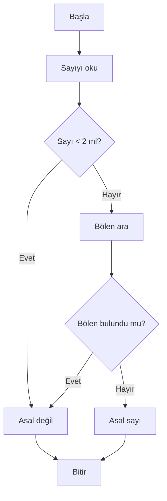

**Diyagram 7.1:** Asal sayı kontrolünün sade akış diyagramı.

**Görsel üretim notu:** Bu Mermaid diyagramı final DOCX/PDF üretiminden önce PNG’ye dönüştürülmeli; ham `flowchart TD` kodu final çıktıda görünmemelidir. Önerilen görsel genişliği 12–13 cm aralığında tutulmalıdır.

Akış diyagramı, kod yazmadan önce programın hangi koşullardan geçeceğini görmeyi kolaylaştırır.

## 7.9 İz sürme

İz sürme, bir programın her adımda hangi değişken değerlerine sahip olduğunu takip etmektir. Bu yöntem, kodu çalıştırmadan önce beklenen çıktıyı tahmin etmeye ve hataları bulmaya yardımcı olur.

Örneğin aşağıdaki kodu düşünelim:

```java
int toplam = 0;

for (int i = 1; i <= 4; i++) {
    toplam += i;
}
```

İz sürme tablosu:

| Tur | `i` | `toplam` önce | İşlem | `toplam` sonra |
|---:|---:|---:|---|---:|
| 1 | 1 | 0 | `toplam += 1` | 1 |
| 2 | 2 | 1 | `toplam += 2` | 3 |
| 3 | 3 | 3 | `toplam += 3` | 6 |
| 4 | 4 | 6 | `toplam += 4` | 10 |

Bu tablo, döngü sonunda `toplam` değerinin 10 olacağını gösterir.

> **💡 İpucu:** İz sürme tabloları özellikle döngü, sayaç, biriktirici ve bayrak değişken hatalarını bulmada çok etkilidir.

## 7.10 Sayaç değişken deseni

Sayaç değişken, belirli bir olayın kaç kez gerçekleştiğini veya döngünün kaçıncı turda olduğunu takip etmek için kullanılır.

Örnek: 1’den 20’ye kadar 3’e tam bölünen sayıların adedini bulmak.

**Kod kimliği:** `b07_kod02_sayac_degisken_deseni`

**Kod erişimi:** [Kod sayfası](https://github.com/bmdersleri/javaninTemelleri/tree/main/kodlar/bolum07/kod02/) | [Kaynak kod](https://github.com/bmdersleri/javaninTemelleri/blob/main/kodlar/bolum07/kod02/Bolum07Ornek01SayacDeseni.java) | 

**QR erişimi:** Kod sayfası ve kaynak kod için aşağıdaki iki QR kod kullanılabilir.

{width=2.8cm} {width=2.8cm}


```java
// Dosya: Bolum07Ornek01SayacDeseni.java
public class Bolum07Ornek01SayacDeseni {
    public static void main(String[] args) {
        int sayac = 0;

        for (int i = 1; i <= 20; i++) {
            if (i % 3 == 0) {
                sayac++;
            }
        }

        System.out.println("3'e tam bölünen sayı adedi: " + sayac);
    }
}
```

**Kodun amacı:** Koşula uyan değerleri sayaç değişkenle saymak.

**Kritik satırlar:**

1. `int sayac = 0;` sayacı başlangıçta sıfırlar.
2. `i % 3 == 0` bölünebilme kontrolüdür.
3. `sayac++` yalnızca koşul doğru olduğunda çalışır.

**Beklenen çıktı:**

```text
3'e tam bölünen sayı adedi: 6
```

**Dikkat noktası:** Sayaç değişken döngü içinde her turda değil, yalnızca istenen koşul gerçekleştiğinde artırılmalıdır.

## 7.11 Biriktirici değişken deseni

Biriktirici değişken, döngü boyunca bir değeri toplamak, çarpmak veya metin olarak biriktirmek için kullanılır.

Örnek: 1’den 10’a kadar sayıların çarpımını bulmak.

**Kod kimliği:** `b07_kod03_biriktirici_degisken_deseni`

**Kod erişimi:** [Kod sayfası](https://github.com/bmdersleri/javaninTemelleri/tree/main/kodlar/bolum07/kod03/) | [Kaynak kod](https://github.com/bmdersleri/javaninTemelleri/blob/main/kodlar/bolum07/kod03/Bolum07Ornek02BiriktiriciDeseni.java) | 

**QR erişimi:** Kod sayfası ve kaynak kod için aşağıdaki iki QR kod kullanılabilir.

{width=2.8cm} {width=2.8cm}


```java
// Dosya: Bolum07Ornek02BiriktiriciDeseni.java
public class Bolum07Ornek02BiriktiriciDeseni {
    public static void main(String[] args) {
        int carpim = 1;

        for (int i = 1; i <= 5; i++) {
            carpim *= i;
        }

        System.out.println("1-5 çarpımı: " + carpim);
    }
}
```

**Kodun amacı:** Çarpım biriktirme desenini göstermek.

**Kritik satırlar:**

1. `carpim` değişkeni 1 ile başlatılır.
2. Her turda `carpim *= i` işlemi yapılır.
3. Başlangıç değeri 0 olsaydı sonuç her zaman 0 olurdu.

**Beklenen çıktı:**

```text
1-5 çarpımı: 120
```

**Dikkat noktası:** Toplam için başlangıç değeri genellikle 0, çarpım için genellikle 1 seçilir.

## 7.12 Bayrak değişken deseni

Bayrak değişken, bir durumun gerçekleşip gerçekleşmediğini takip eden `boolean` değişkendir. Asal sayı kontrolü, arama problemleri ve geçerlilik kontrollerinde sık kullanılır.

Örnek: Bir sayının 1 ile 20 arasında 7’ye tam bölünüp bölünmediğini izlemek.

**Kod kimliği:** `b07_kod04_bayrak_degisken_deseni`

**Kod erişimi:** [Kod sayfası](https://github.com/bmdersleri/javaninTemelleri/tree/main/kodlar/bolum07/kod04/) | [Kaynak kod](https://github.com/bmdersleri/javaninTemelleri/blob/main/kodlar/bolum07/kod04/Bolum07Ornek03BayrakDeseni.java) | 

**QR erişimi:** Kod sayfası ve kaynak kod için aşağıdaki iki QR kod kullanılabilir.

{width=2.8cm} {width=2.8cm}


```java
// Dosya: Bolum07Ornek03BayrakDeseni.java
public class Bolum07Ornek03BayrakDeseni {
    public static void main(String[] args) {
        boolean bulundu = false;

        for (int i = 1; i <= 20; i++) {
            if (i % 7 == 0) {
                bulundu = true;
                break;
            }
        }

        System.out.println("7'ye bölünen sayı bulundu mu?: " + bulundu);
    }
}
```

**Kodun amacı:** Bir koşulun gerçekleşip gerçekleşmediğini bayrak değişkenle izlemek.

**Kritik satırlar:**

1. `boolean bulundu = false;` başlangıçta aranan durumun bulunmadığını gösterir.
2. Koşul sağlandığında `bulundu = true;` yapılır.
3. `break` ile gereksiz denemeler durdurulur.

**Beklenen çıktı:**

```text
7'ye bölünen sayı bulundu mu?: true
```

**Dikkat noktası:** Bayrak değişkenin başlangıç değeri problem mantığına uygun seçilmelidir.

## 7.13 Bölünebilme kontrolü

Bölünebilme kontrolü, `%` operatörüyle yapılır. Bir sayı başka bir sayıya tam bölünüyorsa kalan 0 olur.

```java
int sayi = 18;

if (sayi % 3 == 0) {
    System.out.println("3'e tam bölünür.");
}
```

Bölünebilme kontrolü şu problemlerde sık kullanılır:

1. Çift/tek sayı bulma
2. Asal sayı kontrolü
3. Bölenleri listeleme
4. Belirli aralıktaki sayıları filtreleme
5. Toplam veya sayaç desenleri

> **🎯 Sınav Notu:** `sayi % bolen == 0` ifadesi, `sayi` değerinin `bolen` değerine tam bölündüğünü gösterir.

## 7.14 Faktöriyel problemi

Faktöriyel, pozitif bir tam sayının 1’den kendisine kadar olan sayılarla çarpılmasıdır. Örneğin:

```text
5! = 1 * 2 * 3 * 4 * 5 = 120
```

Bu bölümde faktöriyel döngüyle hesaplanacaktır. Özyineleme konusu daha sonraki bölümde ele alınacaktır.

**Kod kimliği:** `b07_kod06_faktoriyel_problemi`

**Kod erişimi:** [Kod sayfası](https://github.com/bmdersleri/javaninTemelleri/tree/main/kodlar/bolum07/kod06/) | [Kaynak kod](https://github.com/bmdersleri/javaninTemelleri/blob/main/kodlar/bolum07/kod06/Bolum07Ornek04Faktoriyel.java) | 

**QR erişimi:** Kod sayfası ve kaynak kod için aşağıdaki iki QR kod kullanılabilir.

{width=2.8cm} {width=2.8cm}


```java
// Dosya: Bolum07Ornek04Faktoriyel.java
import java.util.Scanner;

public class Bolum07Ornek04Faktoriyel {
    public static void main(String[] args) {
        Scanner scanner = new Scanner(System.in);

        System.out.print("Negatif olmayan bir sayı giriniz: ");
        int sayi = scanner.nextInt();

        long faktoriyel = 1;

        if (sayi < 0) {
            System.out.println("Negatif sayıların faktöriyeli hesaplanmaz.");
        } else {
            for (int i = 1; i <= sayi; i++) {
                faktoriyel *= i;
            }

            System.out.println(sayi + "! = " + faktoriyel);
        }

        scanner.close();
    }
}
```

**Kodun amacı:** Biriktirici değişkenle faktöriyel hesaplamak.

**Kritik satırlar:**

1. `long faktoriyel = 1;` çarpım biriktirici olarak başlatılır.
2. Negatif sayı için uyarı verilir.
3. `for` döngüsü 1’den girilen sayıya kadar çarpar.

**Örnek çalışma:**

```text
Negatif olmayan bir sayı giriniz: 5
5! = 120
```

**Dikkat noktası:** Faktöriyel değerleri hızlı büyür. Büyük sayılar için `long` türü de yetersiz kalabilir. Bu bölümde küçük değerlerle çalışılmalıdır.

## 7.15 Fibonacci problemi

Fibonacci dizisinde her terim, kendisinden önceki iki terimin toplamıdır. Başlangıç düzeyinde dizi şu şekilde düşünülebilir:

```text
0 1 1 2 3 5 8 13 21 ...
```

Aşağıdaki örnek, kullanıcıdan alınan terim sayısı kadar Fibonacci terimi üretir.

**Kod kimliği:** `b07_kod07_fibonacci_problemi`

**Kod erişimi:** [Kod sayfası](https://github.com/bmdersleri/javaninTemelleri/tree/main/kodlar/bolum07/kod07/) | [Kaynak kod](https://github.com/bmdersleri/javaninTemelleri/blob/main/kodlar/bolum07/kod07/Bolum07Ornek05Fibonacci.java) | 

**QR erişimi:** Kod sayfası ve kaynak kod için aşağıdaki iki QR kod kullanılabilir.

{width=2.8cm} {width=2.8cm}


```java
// Dosya: Bolum07Ornek05Fibonacci.java
import java.util.Scanner;

public class Bolum07Ornek05Fibonacci {
    public static void main(String[] args) {
        Scanner scanner = new Scanner(System.in);

        System.out.print("Kaç Fibonacci terimi yazdırılsın?: ");
        int terimSayisi = scanner.nextInt();

        int onceki = 0;
        int simdiki = 1;

        if (terimSayisi <= 0) {
            System.out.println("Terim sayısı pozitif olmalıdır.");
        } else {
            for (int i = 1; i <= terimSayisi; i++) {
                System.out.print(onceki + " ");

                int yeni = onceki + simdiki;
                onceki = simdiki;
                simdiki = yeni;
            }

            System.out.println();
        }

        scanner.close();
    }
}
```

**Kodun amacı:** Bir önceki ve şimdiki değerleri güncelleyerek Fibonacci dizisi üretmek.

**Kritik satırlar:**

1. `onceki` ve `simdiki` ilk iki değeri temsil eder.
2. `yeni = onceki + simdiki` yeni terimi hesaplar.
3. Güncelleme sırası önemlidir.

**Örnek çalışma:**

```text
Kaç Fibonacci terimi yazdırılsın?: 8
0 1 1 2 3 5 8 13
```

**Dikkat noktası:** Güncelleme sırası yanlış olursa Fibonacci dizisi bozulur.

## 7.16 Asal sayı problemi

Asal sayı, 1’den büyük olup yalnızca 1’e ve kendisine tam bölünebilen sayıdır. Asal sayı kontrolü, bayrak değişken ve bölünebilme kontrolünü birlikte kullanmak için çok uygun bir örnektir.

**Kod kimliği:** `b07_kod08_asal_sayi_problemi`

**Kod erişimi:** [Kod sayfası](https://github.com/bmdersleri/javaninTemelleri/tree/main/kodlar/bolum07/kod08/) | [Kaynak kod](https://github.com/bmdersleri/javaninTemelleri/blob/main/kodlar/bolum07/kod08/Bolum07Ornek06AsalKontrol.java) | 

**QR erişimi:** Kod sayfası ve kaynak kod için aşağıdaki iki QR kod kullanılabilir.

{width=2.8cm} {width=2.8cm}


```java
// Dosya: Bolum07Ornek06AsalKontrol.java
import java.util.Scanner;

public class Bolum07Ornek06AsalKontrol {
    public static void main(String[] args) {
        Scanner scanner = new Scanner(System.in);

        System.out.print("Sayı giriniz: ");
        int sayi = scanner.nextInt();

        boolean asalMi = true;

        if (sayi < 2) {
            asalMi = false;
        }

        for (int i = 2; i < sayi; i++) {
            if (sayi % i == 0) {
                asalMi = false;
                break;
            }
        }

        if (asalMi) {
            System.out.println("Asal sayı");
        } else {
            System.out.println("Asal sayı değil");
        }

        scanner.close();
    }
}
```

**Kodun amacı:** Bayrak değişken ve `%` operatörüyle asal sayı kontrolü yapmak.

**Kritik satırlar:**

1. `boolean asalMi = true;` başlangıç varsayımıdır.
2. `sayi < 2` ise sayı asal değildir.
3. `sayi % i == 0` tam bölünebilme kontrolüdür.
4. Bölen bulunduğunda `break` ile döngü sonlandırılır.

**Örnek çalışma 1:**

```text
Sayı giriniz: 17
Asal sayı
```

**Örnek çalışma 2:**

```text
Sayı giriniz: 18
Asal sayı değil
```

**Dikkat noktası:** 0, 1 ve negatif sayılar asal değildir.

## 7.17 Tam bölenleri listeleme

Bir sayının tam bölenlerini listelemek, bölünebilme kontrolünü pekiştirir.

**Kod kimliği:** `b07_kod09_tam_bolenleri_listeleme`

**Kod erişimi:** [Kod sayfası](https://github.com/bmdersleri/javaninTemelleri/tree/main/kodlar/bolum07/kod09/) | [Kaynak kod](https://github.com/bmdersleri/javaninTemelleri/blob/main/kodlar/bolum07/kod09/Bolum07Ornek07BolenListeleme.java) | 

**QR erişimi:** Kod sayfası ve kaynak kod için aşağıdaki iki QR kod kullanılabilir.

{width=2.8cm} {width=2.8cm}


```java
// Dosya: Bolum07Ornek07BolenListeleme.java
import java.util.Scanner;

public class Bolum07Ornek07BolenListeleme {
    public static void main(String[] args) {
        Scanner scanner = new Scanner(System.in);

        System.out.print("Pozitif sayı giriniz: ");
        int sayi = scanner.nextInt();

        if (sayi <= 0) {
            System.out.println("Pozitif sayı girilmelidir.");
        } else {
            System.out.println("Tam bölenler:");

            for (int i = 1; i <= sayi; i++) {
                if (sayi % i == 0) {
                    System.out.println(i);
                }
            }
        }

        scanner.close();
    }
}
```

**Kodun amacı:** `%` operatörüyle tam bölenleri bulmak.

**Örnek çalışma:**

```text
Pozitif sayı giriniz: 12
Tam bölenler:
1
2
3
4
6
12
```

**Dikkat noktası:** Bölme işleminde bölen değerin 0 olmamasına dikkat edilmelidir. Bu örnekte döngü 1’den başladığı için 0’a bölme yoktur.

## 7.18 Kodun çalışma mantığı ve iz sürme örneği

Asal sayı kontrolünde `sayi = 9` için iz sürme yapalım.

| Tur | `i` | `9 % i` | Sonuç | `asalMi` |
|---:|---:|---:|---|---|
| Başlangıç | - | - | Başlangıç varsayımı | `true` |
| 1 | 2 | 1 | Tam bölünmez | `true` |
| 2 | 3 | 0 | Bölen bulundu | `false` |

`i = 3` olduğunda 9 sayısı 3’e tam bölündüğü için `asalMi` değeri `false` yapılır ve döngü `break` ile sonlandırılır.

Bu iz sürme, programın neden “Asal sayı değil” çıktısı verdiğini açık biçimde gösterir.

> **🔍 Derinlemesine:** İz sürme yalnızca çıktıyı tahmin etmek için değil, programın mantığının doğru olup olmadığını sınamak için de kullanılır.

## 7.19 Uçtan uca mini uygulama: Algoritma Menüsü

Bu bölümün mini uygulaması, kullanıcının seçimine göre farklı algoritmik işlemler yapan basit bir konsol menüsüdür.

**Uygulama adı:** Algoritma Menüsü

**Dosya adı:** `AlgoritmaMenusu.java`

**Amaç:** Sayaç, biriktirici, bayrak değişken ve bölünebilme desenlerini tek bir küçük programda birleştirmek.

Program şu seçenekleri sunacaktır:

1. Girilen sayıya kadar toplam hesapla.
2. Girilen sayının asal olup olmadığını kontrol et.
3. Girilen sayıya kadar Fibonacci serisini yazdır.
4. Girilen sayının tam bölenlerini yazdır.
5. Çıkış yap.

Aşağıdaki kod, bölüm düzeyine uygun olarak tek sınıf içinde verilmiştir. Metotlara ayırma işlemi bir sonraki bölümde ele alınacaktır.

**Kod kimliği:** `b07_kod10_algoritma_menusu`

**Kod erişimi:** [Kod sayfası](https://github.com/bmdersleri/javaninTemelleri/tree/main/kodlar/bolum07/kod10/) | [Kaynak kod](https://github.com/bmdersleri/javaninTemelleri/blob/main/kodlar/bolum07/kod10/AlgoritmaMenusu.java) | 

**QR erişimi:** Kod sayfası ve kaynak kod için aşağıdaki iki QR kod kullanılabilir.

{width=2.8cm} {width=2.8cm}


```java
// Dosya: AlgoritmaMenusu.java
import java.util.Scanner;

public class AlgoritmaMenusu {
    public static void main(String[] args) {
        Scanner scanner = new Scanner(System.in);
        int secim;

        do {
            System.out.println("=== Algoritma Menüsü ===");
            System.out.println("1- Toplam hesapla");
            System.out.println("2- Asal sayı kontrolü");
            System.out.println("3- Fibonacci yazdır");
            System.out.println("4- Tam bölenleri yazdır");
            System.out.println("0- Çıkış");
            System.out.print("Seçiminiz: ");
            secim = scanner.nextInt();

            if (secim == 1) {
                System.out.print("Üst sınırı giriniz: ");
                int ustSinir = scanner.nextInt();

                int toplam = 0;

                for (int i = 1; i <= ustSinir; i++) {
                    toplam += i;
                }

                System.out.println("Toplam: " + toplam);
            } else if (secim == 2) {
                System.out.print("Sayı giriniz: ");
                int sayi = scanner.nextInt();

                boolean asalMi = true;

                if (sayi < 2) {
                    asalMi = false;
                }

                for (int i = 2; i < sayi; i++) {
                    if (sayi % i == 0) {
                        asalMi = false;
                        break;
                    }
                }

                if (asalMi) {
                    System.out.println("Asal sayı");
                } else {
                    System.out.println("Asal sayı değil");
                }
            } else if (secim == 3) {
                System.out.print("Terim sayısını giriniz: ");
                int terimSayisi = scanner.nextInt();

                int onceki = 0;
                int simdiki = 1;

                if (terimSayisi <= 0) {
                    System.out.println("Terim sayısı pozitif olmalıdır.");
                } else {
                    for (int i = 1; i <= terimSayisi; i++) {
                        System.out.print(onceki + " ");

                        int yeni = onceki + simdiki;
                        onceki = simdiki;
                        simdiki = yeni;
                    }

                    System.out.println();
                }
            } else if (secim == 4) {
                System.out.print("Pozitif sayı giriniz: ");
                int sayi = scanner.nextInt();

                if (sayi <= 0) {
                    System.out.println("Pozitif sayı girilmelidir.");
                } else {
                    System.out.println("Tam bölenler:");

                    for (int i = 1; i <= sayi; i++) {
                        if (sayi % i == 0) {
                            System.out.println(i);
                        }
                    }
                }
            } else if (secim == 0) {
                System.out.println("Program sonlandırılıyor.");
            } else {
                System.out.println("Geçersiz seçim.");
            }

            System.out.println();
        } while (secim != 0);

        scanner.close();
    }
}
```

### 7.19.1 Mini uygulama çalışma örnekleri

Toplam hesaplama:

```text
=== Algoritma Menüsü ===
1- Toplam hesapla
2- Asal sayı kontrolü
3- Fibonacci yazdır
4- Tam bölenleri yazdır
0- Çıkış
Seçiminiz: 1
Üst sınırı giriniz: 5
Toplam: 15
```

Asal sayı kontrolü:

```text
Seçiminiz: 2
Sayı giriniz: 17
Asal sayı
```

Fibonacci:

```text
Seçiminiz: 3
Terim sayısını giriniz: 7
0 1 1 2 3 5 8
```

Tam bölenler:

```text
Seçiminiz: 4
Pozitif sayı giriniz: 12
Tam bölenler:
1
2
3
4
6
12
```

### 7.19.2 Mini uygulamanın kavram eşleştirmesi

| Kullanılan yapı | Uygulamadaki rolü |
|---|---|
| `do-while` | Menü tekrarını sağlar |
| `if-else` | Kullanıcı seçimine göre işlem ayırır |
| `for` | Toplam, Fibonacci ve bölen listeleme işlemlerini yapar |
| Sayaç | Döngü tekrarlarını izler |
| Biriktirici | Toplam ve faktöriyel gibi işlemlerde değer biriktirir |
| Bayrak değişken | Asal sayı kontrolünde durum tutar |
| `%` operatörü | Bölünebilme kontrolü yapar |
| `break` | Gereksiz döngü tekrarını sonlandırır |

### 7.19.3 Mini uygulama test senaryoları

| Test | Seçim | Girdi | Beklenen sonuç |
|---:|---:|---|---|
| 1 | 1 | `5` | Toplam `15` |
| 2 | 1 | `10` | Toplam `55` |
| 3 | 2 | `17` | Asal sayı |
| 4 | 2 | `18` | Asal sayı değil |
| 5 | 3 | `7` | `0 1 1 2 3 5 8` |
| 6 | 4 | `12` | `1, 2, 3, 4, 6, 12` |
| 7 | 9 | - | Geçersiz seçim |
| 8 | 0 | - | Program sonlanır |

> **Alıştırma Molası:** Menüye faktöriyel hesaplama seçeneği ekleyiniz. Faktöriyel için negatif sayı kontrolü yapmayı unutmayınız.

## 7.20 Sık yapılan hatalar ve yanlış sezgiler

Algoritmik problemler çoğu zaman sözdizimi hatasından çok mantık hatası içerir. Program derlenebilir; ancak yanlış sonuç üretebilir.

### 7.20.1 Problemi analiz etmeden kod yazmak

Yanlış yaklaşım:

```text
Önce kodu yazayım, sonra ne yapacağını düşünürüm.
```

Düzeltme:

Önce girdi, işlem ve çıktı belirlenmelidir. Sonra sözde kod yazılmalı ve Java koduna geçilmelidir.

### 7.20.2 Sayaç ve biriktiriciyi karıştırmak

Sayaç bir olayın kaç kez gerçekleştiğini tutar. Biriktirici ise değerleri toplar, çarpar veya bir araya getirir.

Yanlış kullanım:

```java
int sayac = 0;

for (int i = 1; i <= 5; i++) {
    sayac += i;
}
```

Bu kod aslında sayma değil toplam alma yapar.

### 7.20.3 Bayrak değişkeni yanlış başlatmak

Asal sayı kontrolünde `asalMi` başlangıçta genellikle `true` yapılır. Bölen bulunursa `false` yapılır. Başlangıç değeri yanlış seçilirse sonuç tersine dönebilir.

### 7.20.4 Faktöriyelde başlangıç değerini 0 yapmak

Yanlış kullanım:

```java
int faktoriyel = 0;

for (int i = 1; i <= 5; i++) {
    faktoriyel *= i;
}
```

Bu kodun sonucu her zaman 0 olur.

Düzeltme:

```java
int faktoriyel = 1;

for (int i = 1; i <= 5; i++) {
    faktoriyel *= i;
}
```

### 7.20.5 Fibonacci güncelleme sırasını bozmak

Fibonacci üretirken `onceki`, `simdiki` ve `yeni` değişkenlerinin güncelleme sırası önemlidir. Değerler yanlış sırayla güncellenirse dizi bozulur.

### 7.20.6 Asal sayı kontrolünde 1’i asal kabul etmek

1 asal sayı değildir. Asal sayı kontrolünde `sayi < 2` durumu ayrıca ele alınmalıdır.

### 7.20.7 Bölen bulunduğu hâlde döngüyü sürdürmek

Asal sayı kontrolünde bir bölen bulunduysa sayı asal değildir. Bu noktadan sonra döngüyü sürdürmek gereksizdir. `break` kullanılabilir.

## 7.21 Hata ayıklama egzersizi

Aşağıdaki kodun `AlgoritmaHatasi.java` adlı dosyaya kaydedildiğini düşünelim.

**Kod kimliği:** `b07_kod14_hata_ayiklama_egzersizi`

**Kod erişimi:** [Kod sayfası](https://github.com/bmdersleri/javaninTemelleri/tree/main/kodlar/bolum07/kod14/) | [Kaynak kod](https://github.com/bmdersleri/javaninTemelleri/blob/main/kodlar/bolum07/kod14/AlgoritmaHatasi.java) | 

**QR erişimi:** Kod sayfası ve kaynak kod için aşağıdaki iki QR kod kullanılabilir.

{width=2.8cm} {width=2.8cm}


```java
// Dosya: AlgoritmaHatasi.java
public class AlgoritmaHatasi {
    public static void main(String[] args) {
        int sayi = 9;
        boolean asalMi = true;

        for (int i = 1; i < sayi; i++) {
            if (sayi % i == 0) {
                asalMi = false;
            }
        }

        int faktoriyel = 0;

        for (int i = 1; i <= 5; i++) {
            faktoriyel *= i;
        }

        System.out.println("Asal mı?: " + asalMi);
        System.out.println("Faktöriyel: " + faktoriyel);
    }
}
```

Bu kodda birden fazla mantık hatası vardır.

**Hatalar:**

1. Asal sayı kontrolü `i = 1` değerinden başlamıştır. Her sayı 1’e bölündüğü için `asalMi` hemen `false` olur.
2. Asal sayı kontrolünde 2’den başlanmalı ve gerekirse bölen bulununca döngüden çıkılmalıdır.
3. 1 ve 0 gibi özel durumlar ayrıca ele alınmamıştır.
4. Faktöriyel değişkeni 0 ile başlatılmıştır. Çarpım biriktiricisi 1 ile başlamalıdır.

**Düzeltilmiş kod:**

**Kod kimliği:** `b07_kod15_hata_ayiklama_egzersizi`

**Kod erişimi:** [Kod sayfası](https://github.com/bmdersleri/javaninTemelleri/tree/main/kodlar/bolum07/kod15/) | [Kaynak kod](https://github.com/bmdersleri/javaninTemelleri/blob/main/kodlar/bolum07/kod15/AlgoritmaHatasi.java) | 

**QR erişimi:** Kod sayfası ve kaynak kod için aşağıdaki iki QR kod kullanılabilir.

{width=2.8cm} {width=2.8cm}


```java
// Dosya: AlgoritmaHatasi.java
public class AlgoritmaHatasi {
    public static void main(String[] args) {
        int sayi = 9;
        boolean asalMi = true;

        if (sayi < 2) {
            asalMi = false;
        }

        for (int i = 2; i < sayi; i++) {
            if (sayi % i == 0) {
                asalMi = false;
                break;
            }
        }

        int faktoriyel = 1;

        for (int i = 1; i <= 5; i++) {
            faktoriyel *= i;
        }

        System.out.println("Asal mı?: " + asalMi);
        System.out.println("Faktöriyel: " + faktoriyel);
    }
}
```

**Beklenen çıktı:**

```text
Asal mı?: false
Faktöriyel: 120
```

**Kendinize sorunuz:**

1. Asal sayı kontrolü neden 1’den başlamamalıdır?
2. `sayi < 2` durumu neden ayrı kontrol edilmelidir?
3. `break` kullanmak burada neden yararlıdır?
4. Faktöriyel değişkeni neden 1 ile başlatılmalıdır?
5. Bu hataları iz sürme tablosuyla nasıl bulabilirsiniz?

> **Laboratuvar İpucu:** Program derleniyor diye algoritma doğru kabul edilmemelidir. Mantık hatalarını bulmak için küçük test değerleri ve iz sürme tabloları kullanılmalıdır.

## 7.22 Bölümün sonraki bölümlerle ilişkisi

Bu bölümde temel Java yapıları algoritmik problem çözme desenlerine dönüştürüldü. Artık öğrenci yalnızca döngü veya karar yapısı yazmakla kalmayıp bu yapıları toplam alma, sayma, bayrak değişken, bölünebilme, asal sayı, faktöriyel ve Fibonacci gibi problemlerde kullanabilir.

Bir sonraki bölümde bu problemler metotlara taşınacaktır. Böylece aynı algoritmik işlemler program içinde tekrar tekrar yazılmak yerine, adlandırılmış ve yeniden kullanılabilir kod blokları hâline getirilecektir.

Bu geçiş önemlidir. Çünkü algoritmik desenleri anlamadan metot yazmak yalnızca kodu parçalara bölmek olur; ancak bu bölümdeki desenler anlaşıldığında metotlar gerçek bir düzenleme ve yeniden kullanım aracı hâline gelir.

## 7.23 Bölüm özeti

Bu bölümde algoritmik problem çözme desenleri ele alındı. Önce programlama problemlerinin girdi, işlem ve çıktı açısından analiz edilmesi gerektiği vurgulandı. Problemi doğrudan koda çevirmek yerine, önce sözde kod ve gerekirse akış diyagramı kullanmanın çözümü daha anlaşılır hâle getirdiği gösterildi.

İz sürme yöntemiyle değişken değerlerinin adım adım takip edilebileceği açıklandı. İz sürmenin özellikle döngüler, sayaçlar, biriktiriciler ve bayrak değişkenlerdeki mantık hatalarını bulmada yararlı olduğu belirtildi.

Sayaç değişken deseni, belirli koşula uyan olayları saymak için kullanıldı. Biriktirici değişken deseniyle toplam ve çarpım gibi işlemler gösterildi. Bayrak değişken deseniyle bir durumun gerçekleşip gerçekleşmediği takip edildi.

Bölünebilme kontrolü `%` operatörü ile ele alındı. Bu kontrolün çift/tek sayı, asal sayı ve tam bölen listeleme gibi problemlerde temel araç olduğu gösterildi.

Faktöriyel, Fibonacci ve asal sayı problemleri döngülerle çözüldü. Bu problemlerde doğru başlangıç değeri, doğru güncelleme sırası ve özel durum kontrollerinin önemi vurgulandı.

Son olarak Algoritma Menüsü mini uygulamasıyla toplam hesaplama, asal sayı kontrolü, Fibonacci üretimi ve tam bölen listeleme tek bir konsol programında birleştirildi.

## 7.24 Terim sözlüğü

| Terim | Açıklama |
|---|---|
| Algoritma | Bir problemi çözmek için izlenen sıralı ve açık adımlar bütünü |
| Problem analizi | Girdi, işlem ve çıktıların belirlenmesi süreci |
| Sözde kod | Programlama dili ayrıntılarına girmeden çözüm adımlarını yazma biçimi |
| Akış diyagramı | Program akışını görsel olarak gösteren yapı |
| İz sürme | Değişken değerlerini adım adım takip etme yöntemi |
| Sayaç değişken | Belirli olayların kaç kez gerçekleştiğini tutan değişken |
| Biriktirici değişken | Toplam, çarpım veya metin gibi değerleri biriktiren değişken |
| Bayrak değişken | Bir durumun gerçekleşip gerçekleşmediğini tutan `boolean` değişken |
| Bölünebilme kontrolü | `%` operatörü ile kalan kontrolü yapma |
| Asal sayı | 1’den büyük, yalnızca 1’e ve kendisine bölünebilen sayı |
| Faktöriyel | 1’den verilen sayıya kadar sayıların çarpımı |
| Fibonacci | Her terimin önceki iki terimin toplamı olduğu sayı dizisi |
| Sentinel değer | Döngüyü sonlandırmak için kullanılan özel değer |
| `break` | Döngüyü sonlandıran ifade |
| Test senaryosu | Programın belirli bir girdiyle sınanması |

## 7.25 Kendini değerlendirme soruları

### 7.25.1 Çoktan seçmeli sorular

1. Bir problemin Java koduna dönüştürülmeden önce girdi, işlem ve çıktı açısından incelenmesine ne ad verilebilir?

A) Problem analizi  
B) Derleme  
C) Import ekleme  
D) String birleştirme  
E) Dosya silme  

2. Programlama dili ayrıntılarına girmeden çözüm adımlarını yazma biçimi hangisidir?

A) Sözde kod  
B) Bytecode  
C) Paket  
D) Sınıf yolu  
E) Nesne  

3. Bir olayın kaç kez gerçekleştiğini takip etmek için hangi değişken deseni kullanılır?

A) Sayaç  
B) Sabit  
C) Paket  
D) Sınıf  
E) Import  

4. Toplam veya çarpım gibi değerleri döngü boyunca tutmak için hangi desen kullanılır?

A) Biriktirici  
B) Dosya adı  
C) Yorum satırı  
D) `main` imzası  
E) `import`  

5. Bir durumun gerçekleşip gerçekleşmediğini izlemek için genellikle hangi veri tipi kullanılır?

A) `boolean`  
B) `char`  
C) `String`  
D) `double`  
E) `long`  

6. Bölünebilme kontrolü için hangi operatör kullanılır?

A) `%`  
B) `+`  
C) `&&`  
D) `=`  
E) `++`  

7. Aşağıdakilerden hangisi asal sayı değildir?

A) 1  
B) 2  
C) 3  
D) 5  
E) 7  

8. Faktöriyel hesaplamada çarpım biriktiricisi genellikle hangi değerle başlatılır?

A) 1  
B) 0  
C) -1  
D) 100  
E) 10  

### 7.25.2 Doğru/Yanlış soruları

1. Sözde kod Java sözdizimini birebir kullanmak zorundadır. (D/Y)
2. İz sürme, değişkenlerin adım adım aldığı değerleri görmeye yardımcı olur. (D/Y)
3. Sayaç değişken her zaman toplam almak için kullanılır. (D/Y)
4. Biriktirici değişken toplam veya çarpım tutabilir. (D/Y)
5. Bayrak değişken genellikle `boolean` türünde olur. (D/Y)
6. `%` operatörü bölme işleminden kalanı verir. (D/Y)
7. 1 asal sayıdır. (D/Y)
8. Faktöriyel hesaplamada başlangıç değeri 0 olmalıdır. (D/Y)
9. Fibonacci dizisinde her terim önceki iki terimin toplamıdır. (D/Y)
10. Program derleniyorsa algoritması kesinlikle doğrudur. (D/Y)

### 7.25.3 Açık uçlu kavramsal sorular

1. Algoritmik problem çözme sürecini kendi cümlelerinizle açıklayınız.
2. Girdi, işlem ve çıktı analizi neden önemlidir?
3. Sözde kod yazmanın kodlama sürecine katkısı nedir?
4. İz sürme tablosu hangi tür hataları bulmaya yardımcı olur?
5. Sayaç ve biriktirici değişken arasındaki farkı örnekle açıklayınız.
6. Bayrak değişken hangi durumlarda kullanılır?
7. Asal sayı kontrolünde neden `%` operatörü kullanılır?
8. Faktöriyel hesaplamada başlangıç değeri neden 1 olmalıdır?
9. Fibonacci dizisinde güncelleme sırası neden önemlidir?
10. Algoritma Menüsü uygulaması metotlara nasıl ayrılabilir? Kısaca tartışınız.

### 7.25.4 Yanlış gerekçeyi bulma soruları

Aşağıdaki ifadelerdeki yanlış gerekçeyi bulunuz ve düzeltiniz.

1. “Kod yazmadan önce problemi analiz etmeye gerek yoktur.”
2. “Sözde kod, yalnızca derleyici için yazılır.”
3. “Sayaç ve biriktirici aynı amaçla kullanılır.”
4. “Bayrak değişkenin başlangıç değeri önemli değildir.”
5. “1 asal sayıdır.”
6. “Asal sayı kontrolünde 1’den başlamak doğru yaklaşımdır.”
7. “Faktöriyel değişkeni 0 ile başlatılmalıdır.”
8. “Fibonacci’de değişken güncelleme sırası önemsizdir.”
9. “Program doğru derleniyorsa mantık hatası yoktur.”
10. “Test senaryosu yalnızca büyük projeler için gereklidir.”

## 7.26 Programlama alıştırmaları

### 7.26.1 Kolay düzey

1. Kullanıcıdan alınan bir sayıya kadar olan sayıların toplamını bulan program yazınız.
2. 1’den 20’ye kadar 4’e tam bölünen sayıların adedini bulunuz.
3. Kullanıcıdan alınan bir sayının çift mi tek mi olduğunu yazdırınız.
4. Girilen 5 sayıdan kaç tanesinin pozitif olduğunu bulan bir program yazınız.
5. 1’den 10’a kadar olan sayıların çarpımını bulan bir program yazınız.

### 7.26.2 Orta düzey

1. Kullanıcıdan alınan bir sayının asal olup olmadığını kontrol eden program yazınız.
2. Girilen 5 sayıdan pozitif, negatif ve sıfır olanların adetlerini bulunuz.
3. Kullanıcıdan alınan üst sınıra kadar Fibonacci terimlerini yazdırınız.
4. Girilen bir sayının tam bölenlerini ekrana yazdırınız.
5. 1’den `n` değerine kadar 3’e tam bölünen sayıların toplamını bulunuz.

### 7.26.3 Zor düzey

1. Kullanıcıdan alınan iki sayı arasındaki asal sayıları listeleyen program yazınız.
2. Girilen sayıların ortalamasını sentinel değer kullanarak hesaplayınız.
3. Kullanıcı 0 girene kadar sayı alan ve en büyük sayıyı bulan program yazınız.
4. Basit bir algoritma menüsü tasarlayınız: toplam, asal kontrolü, bölenleri yazdırma ve Fibonacci.
5. Bir program için sözde kod, akış diyagramı ve Java kodunu birlikte hazırlayınız.

## 7.27 Haftalık laboratuvar / proje görevi

**Görev başlığı:** Algoritma Menüsü Laboratuvarı

**Amaç:** Bu görev, öğrencinin algoritmik problem çözme desenlerini tek bir küçük Java uygulamasında birleştirmesini amaçlar.

**Beklenen adımlar:**

1. `AlgoritmaMenusu.java` adlı bir dosya oluşturunuz.
2. Kullanıcıya en az dört seçenek sunan bir menü hazırlayınız.
3. Menüde en az bir toplam alma işlemi bulunsun.
4. Menüde en az bir asal sayı kontrolü bulunsun.
5. Menüde en az bir bölünebilme veya bölen listeleme işlemi bulunsun.
6. Menüde en az bir Fibonacci veya faktöriyel işlemi bulunsun.
7. Menü çıkış yapılana kadar tekrar etsin.
8. Sayaç, biriktirici ve bayrak değişkenlerden en az ikisini kullanınız.
9. Programı en az beş farklı kullanım senaryosu ile test ediniz.
10. Kısa bir `README.md` dosyası hazırlayınız.

**Teslim edilecek dosyalar:**

1. `AlgoritmaMenusu.java`
2. `README.md`
3. Program çıktıları
4. Kullanılan test girdileri
5. Hata ve çözüm notu

**README içeriği şu başlıkları içermelidir:**

1. Programın amacı
2. Kullanılan algoritmik desenler
3. Kullanılan değişkenler
4. Menü seçenekleri
5. Test senaryoları
6. Karşılaşılan hata ve çözümü
7. Sözde kod veya akış açıklaması

## 7.28 Değerlendirme rubriği

| Ölçüt | Açıklama | Puan |
|---|---|---:|
| Problem analizi | Girdi, işlem ve çıktıların doğru belirlenmesi | 15 |
| Algoritmik desenler | Sayaç, biriktirici, bayrak ve bölünebilme desenlerinin doğru kullanılması | 25 |
| Uygulama işlevleri | Toplam, asal kontrolü, Fibonacci ve bölen listeleme seçeneklerinin çalışması | 25 |
| Kodun çalışması | Programın derlenebilir ve çalıştırılabilir olması | 10 |
| Test kapsamı | En az beş test senaryosunun raporlanması | 10 |
| Hata farkındalığı | Mantık hatalarının açıklanması ve düzeltilmesi | 10 |
| Raporlama | README ve çıktıların düzenli sunulması | 5 |
| **Toplam** |  | **100** |

## 7.29 İleri okuma ve kaynaklar

Bu bölümde algoritmik problem çözme desenleri başlangıç düzeyinde ele alınmıştır. Daha ayrıntılı bilgi için aşağıdaki kaynak türleri incelenebilir:

1. **Java Language Specification:** Döngü, karar yapısı ve ifade değerlendirme kurallarını resmî düzeyde incelemek için kullanılabilir.
2. **Java SE dokümantasyonu:** `Scanner`, `Math` ve temel sınıfların davranışlarını doğrulamak için yararlıdır.
3. **Dev.java öğrenme kaynakları:** Başlangıç düzeyindeki Java örnekleriyle kontrol akışı ve temel problem çözme pratiği sağlar.
4. **Oracle Java Tutorials:** Döngüler, kontrol akışı ve temel dil yapıları için örnek odaklı açıklamalar sunar.
5. **Ders içi ek notlar:** Bu bölümdeki asal sayı, faktöriyel, Fibonacci ve iz sürme örneklerini tekrar etmek için kullanılabilir.

> **💡 İpucu:** Algoritmik düşünme, yalnızca yeni örnekler görmekle değil; aynı problemi farklı değerlerle tekrar tekrar test etmekle gelişir.

## 7.30 Bir sonraki bölüme köprü

Bu bölümde sayaç, biriktirici, bayrak değişken, bölünebilme, asal sayı, faktöriyel ve Fibonacci gibi temel algoritmik desenler işlendi. Artık öğrenci küçük problemleri adımlara ayırabilir, sözde kod yazabilir, iz sürme tablosu oluşturabilir ve Java koduna dönüştürebilir.

Bir sonraki bölümde bu kodların daha düzenli yazılması için metotlar ele alınacaktır. Böylece toplam hesaplama, asal kontrolü veya Fibonacci üretimi gibi işlemler tek bir büyük `main` bloğunda kalmak yerine adlandırılmış, tekrar kullanılabilir ve daha kolay test edilebilir parçalara ayrılacaktır.

**BÖLÜM SONU**


\newpage


# Bölüm 8: Metotlar, Overloading ve Özyineleme

## 8.1 Bölümün yol haritası

Önceki bölümlerde Java programlarını tek bir `main` metodu içinde yazdık. Değişkenler, kullanıcı girdisi, karar yapıları, döngüler ve algoritmik problem çözme desenleri çoğunlukla aynı blok içinde ele alındı. Bu yaklaşım başlangıç için öğreticidir; ancak program büyüdükçe kodun okunması, test edilmesi ve tekrar kullanılması zorlaşır.

Bu bölümde programları daha anlamlı parçalara ayırmak için **metotlar** ele alınacaktır. Metotlar, belirli bir işi yapan adlandırılmış kod bloklarıdır. Bir hesaplama yapmak, çıktı yazdırmak, geçerlilik kontrolü yapmak veya bir algoritmik işlemi tekrar kullanılabilir hâle getirmek için metotlardan yararlanılır.

Bölümün ikinci kısmında aynı isimli metotların farklı parametrelerle tanımlanmasını sağlayan **metot overloading** konusu işlenecektir. Son kısımda ise bir metodun kendi kendini çağırmasına dayanan **özyineleme** temel düzeyde ele alınacaktır.

Bu bölümde şu sorulara yanıt aranacaktır:

1. Metot nedir ve neden kullanılır?
2. Metot tanımlama ile metot çağırma arasındaki fark nedir?
3. Parametre ve argüman kavramları nasıl ayrılır?
4. `void` metot ile değer döndüren metot arasındaki fark nedir?
5. `return` ifadesi ne işe yarar?
6. Yerel değişken ve scope kavramı metotlarda neden önemlidir?
7. Başlangıç düzeyinde `static` yardımcı metotlar nasıl yazılır?
8. Metot overloading nedir?
9. Metot imzası hangi bileşenlerden oluşur?
10. Dönüş tipi tek başına overloading için neden yeterli değildir?
11. Özyineleme nedir ve base case neden zorunludur?
12. Stack overflow hatası hangi durumda oluşabilir?

> **🎯 Bölüm Hedefi:** Bu bölümün sonunda öğrenci, programı anlamlı parçalara ayıran `static` metotlar yazabilecek, parametre alan ve değer döndüren metotları kullanabilecek, aynı isimli metotları farklı parametrelerle tanımlayabilecek ve temel özyineleme mantığını açıklayabilecektir.

Bu bölümde nesne metotları, overriding, polymorphism, lambda ifadeleri, method reference ve ileri özyineleme teknikleri ele alınmayacaktır. OOP konuları, kitabın ilerleyen bölümlerinde yalnızca gerekli olduğu ölçüde işlenecektir.

## 8.2 Bölümün konumu ve pedagojik rolü

Bu bölüm, algoritmik problem çözme desenlerinden daha düzenli program yazmaya geçiş sağlar. Önceki bölümde sayaç, biriktirici, bayrak değişken, asal sayı kontrolü, faktöriyel ve Fibonacci gibi desenler tek `main` metodu içinde gösterilmişti. Bu bölümde bu tür işlemler metotlara taşınacaktır.

Metotlar, programın okunabilirliğini artırır. Örneğin bir programda not ortalaması hesaplama, geçme durumu kontrol etme ve rapor yazdırma işlemleri ayrı metotlara ayrıldığında program daha anlaşılır hâle gelir. Aynı işlem farklı yerlerde gerekiyorsa, metot bir kez tanımlanır ve gerektiğinde çağrılır.

Metot overloading, aynı iş ailesine ait farklı durumları aynı ad altında toplamaya yardım eder. Örneğin `alanHesapla` adı kare, dikdörtgen ve daire için farklı parametrelerle kullanılabilir. Öğrenci böylece parametre yapısının metot seçiminde nasıl rol oynadığını görür.

Özyineleme ise bazı problemlerin daha küçük hâlleriyle kendini tekrar ettiğini gösterir. Bu bölümde özyineleme yalnızca temel düzeyde, faktöriyel ve geri sayım gibi küçük örneklerle anlatılacaktır.

> **⚠️ Dikkat:** Bu bölümde `overloading` ile `overriding` karıştırılmamalıdır. Overloading aynı sınıf içinde aynı isimli metotların farklı parametre listeleriyle tanımlanmasıdır. Overriding ise kalıtım bağlamında ele alınır ve bu bölümün konusu değildir.

Bu bölüm, bir sonraki bölümde işlenecek diziler için de hazırlık sağlar. Çünkü dizilerle çalışırken toplam, ortalama, en büyük değer ve arama gibi işlemler çoğu zaman ayrı metotlara taşınır.

## 8.3 Öğrenme çıktıları

Bu bölüm tamamlandığında öğrenci:

1. Metot kavramını programı parçalara ayırma aracı olarak açıklayabilir.
2. Metot tanımlama ve metot çağırma kavramlarını ayırt edebilir.
3. Parametre ve argüman kavramlarını örneklerle açıklayabilir.
4. `void` metot ile değer döndüren metot arasındaki farkı gösterebilir.
5. `return` ifadesini uygun yerde kullanabilir.
6. Yerel değişken ve scope kavramını temel düzeyde yorumlayabilir.
7. Başlangıç düzeyinde `static` yardımcı metot tanımlayabilir.
8. Tekrar eden kodları metotlara taşıyabilir.
9. Metot overloading kavramını kendi cümleleriyle açıklayabilir.
10. Metot imzasının metot adı ve parametre listesinden oluştuğunu ifade edebilir.
11. Dönüş tipinin tek başına overloading için yeterli olmadığını açıklayabilir.
12. Temel özyineleme mantığını base case ve recursive call kavramlarıyla açıklayabilir.
13. Base case eksikliğinden kaynaklanan stack overflow riskini tanıyabilir.
14. Geometrik ve Sayısal Hesaplama Araçları mini uygulamasını geliştirebilir.

## 8.4 Ön bilgi ve başlangıç varsayımları

Bu bölüm, öğrencinin aşağıdaki konuları temel düzeyde bildiğini varsayar:

1. Java program iskeleti
2. Değişkenler ve veri tipleri
3. Operatörler
4. Karar yapıları
5. Döngüler
6. Algoritmik problem çözme desenleri
7. `Scanner` ile kullanıcı girdisi alma
8. `static` kelimesini `main` metodu bağlamında görmüş olma

Bu bölümde metotlar, nesneye yönelik programlama ayrıntılarına girilmeden ele alınacaktır. Tüm örnekler tek sınıf içinde yazılan `static` yardımcı metotlar üzerinden verilecektir.

## 8.5 Metot nedir?

Metot, belirli bir işi yapan adlandırılmış kod bloğudur. Bir metot, programın farklı yerlerinden çağrılabilir. Metotlar sayesinde program daha küçük ve anlamlı parçalara ayrılır.

Metot kullanmanın temel yararları şunlardır:

1. Kod tekrarını azaltır.
2. Programı okunabilir hâle getirir.
3. Her parçanın tek bir göreve odaklanmasını sağlar.
4. Hata ayıklamayı kolaylaştırır.
5. Aynı işlemi farklı yerlerde tekrar kullanmayı sağlar.

Örneğin ekrana başlık yazdıran bir kod parçasını program içinde birçok kez kullanmak yerine bir metot hâline getirebiliriz.

```java
static void baslikYazdir() {
    System.out.println("=== Hesaplama Programı ===");
}
```

Bu metot çağrıldığında başlık ekrana yazdırılır.

```java
baslikYazdir();
```

> **💡 İpucu:** Bir kod parçası program içinde tekrar ediyorsa veya tek başına anlamlı bir iş yapıyorsa metot hâline getirilebilir.

## 8.6 Metot tanımlama ve metot çağırma

Metotlarla çalışırken iki kavramı ayırt etmek gerekir:

1. Metot tanımlama
2. Metot çağırma

Metot tanımlama, metodun ne yapacağını yazmaktır. Metot çağırma ise o metodu çalıştırmaktır.

Örnek:

```java
static void merhabaYazdir() {
    System.out.println("Merhaba Java!");
}
```

Bu bir metot tanımıdır. Bu metot kendi kendine çalışmaz. Çalışması için çağrılması gerekir.

```java
merhabaYazdir();
```

Bu ise metot çağrısıdır.

Başlangıç düzeyinde metotlar, `main` metodunun dışında fakat aynı sınıfın içinde tanımlanır.


```java
public class MetotOrnegi {
    public static void main(String[] args) {
        merhabaYazdir();
    }

    static void merhabaYazdir() {
        System.out.println("Merhaba Java!");
    }
}
```

**Beklenen çıktı:**

```text
Merhaba Java!
```

> **🎯 Sınav Notu:** Metodu tanımlamak yeterli değildir. Metot çalışsın istiyorsanız `main` içinden veya başka bir metottan çağırmanız gerekir.

## 8.7 Parametre ve argüman

Parametre, metodun tanımında aldığı değeri temsil eden değişkendir. Argüman ise metot çağrılırken metoda gönderilen gerçek değerdir.

```java
static void selamla(String ad) {
    System.out.println("Merhaba " + ad);
}
```

Bu metotta `ad` bir parametredir.

```java
selamla("Ayşe");
```

Bu çağrıda `"Ayşe"` argümandır.

Aynı metot farklı argümanlarla tekrar kullanılabilir:

```java
selamla("Ayşe");
selamla("Mehmet");
selamla("Zeynep");
```

**Beklenen çıktı:**

```text
Merhaba Ayşe
Merhaba Mehmet
Merhaba Zeynep
```

Parametreler, metotların dışarıdan veri almasını sağlar. Böylece metot yalnızca sabit değerlerle değil, çağrıldığı yerde gönderilen değerlerle çalışır.

## 8.8 `void` metotlar

`void` metotlar geriye değer döndürmez. Genellikle ekrana çıktı yazdırmak veya bir işlemi gerçekleştirmek için kullanılır.

```java
static void bilgiYazdir(String ad, int yas) {
    System.out.println("Ad: " + ad);
    System.out.println("Yaş: " + yas);
}
```

Bu metot iki parametre alır ve ekrana bilgi yazdırır. Ancak çağıran yere bir değer döndürmez.

```java
bilgiYazdir("Ali", 20);
```

**Beklenen çıktı:**

```text
Ad: Ali
Yaş: 20
```

> **⚠️ Dikkat:** `void` metotlarda hesaplanan bir değeri çağıran yere geri vermek istiyorsanız `void` yerine uygun dönüş tipi kullanılmalıdır.

## 8.9 Değer döndüren metotlar ve `return`

Bir metot hesaplama yapıp sonucu çağıran yere geri verebilir. Bu durumda metodun dönüş tipi belirtilir ve `return` ifadesi kullanılır.

```java
static int topla(int a, int b) {
    int sonuc = a + b;
    return sonuc;
}
```

Bu metot iki `int` parametre alır ve `int` sonuç döndürür.

```java
int toplam = topla(10, 20);
System.out.println("Toplam: " + toplam);
```

**Beklenen çıktı:**

```text
Toplam: 30
```

Metot doğrudan şu şekilde de yazılabilir:

```java
static int topla(int a, int b) {
    return a + b;
}
```

> **🎯 Sınav Notu:** Değer döndüren bir metotta tüm uygun yolların dönüş tipine uygun değer döndürmesi gerekir.

## 8.10 Yerel değişken ve scope

Bir metodun içinde tanımlanan değişkenler yalnızca o metodun içinde kullanılabilir. Buna yerel değişken denir. Bir değişkenin hangi bölgede geçerli olduğunu ifade eden kavrama scope denir.

```java
static int kareAl(int sayi) {
    int sonuc = sayi * sayi;
    return sonuc;
}
```

Bu örnekte `sayi` ve `sonuc` değişkenleri `kareAl` metodunun içinde geçerlidir. Başka bir metotta doğrudan kullanılamaz.

Hatalı yaklaşım:

```java
static int kareAl(int sayi) {
    int sonuc = sayi * sayi;
    return sonuc;
}

static void sonucuYazdir() {
    System.out.println(sonuc);
}
```

Bu kodda `sonuc` değişkeni `sonucuYazdir` metodu içinde tanınmaz.

Daha doğru yaklaşım:

```java
static void sonucuYazdir(int sonuc) {
    System.out.println("Sonuç: " + sonuc);
}
```

Burada sonuç değeri metoda parametre olarak gönderilmiştir.

> **💡 İpucu:** Bir metot başka bir metodun yerel değişkenine doğrudan erişmeye çalışmamalıdır. Gereken değer parametreyle gönderilmeli veya dönüş değeri olarak alınmalıdır.

## 8.11 `static` yardımcı metotlar

Bu kitapta metotlar başlangıç düzeyinde `static` yardımcı metotlar olarak kullanılacaktır. Bunun nedeni, `main` metodunun da `static` olmasıdır. Aynı sınıf içinde `main` metodundan doğrudan çağrılacak yardımcı metotların da `static` tanımlanması gerekir.


```java
public class StaticMetotOrnegi {
    public static void main(String[] args) {
        int sonuc = kareAl(6);
        System.out.println("Sonuç: " + sonuc);
    }

    static int kareAl(int sayi) {
        return sayi * sayi;
    }
}
```

Bu bölümde `static` kavramı nesne modeliyle birlikte ayrıntılı ele alınmayacaktır. Başlangıç düzeyinde şu ifade yeterlidir: `main` içinden doğrudan çağıracağımız yardımcı metotları `static` yazacağız.

> **⚠️ Dikkat:** Bu bölümde metotları nesne oluşturmadan çağırmak için `static` kullanıyoruz. Nesne metotları ilerleyen sınıf ve nesne bölümlerinde ele alınacaktır.

## 8.12 Metot overloading

Metot overloading, aynı sınıf içinde aynı ada sahip birden fazla metodun farklı parametre listeleriyle tanımlanabilmesidir. Bu yapı, benzer işi yapan metotları aynı ad altında toplamayı sağlar.

Örneğin iki sayıyı toplayan metot ile üç sayıyı toplayan metot aynı adı kullanabilir:

```java
static int topla(int a, int b) {
    return a + b;
}

static int topla(int a, int b, int c) {
    return a + b + c;
}
```

Çağrı sırasında Java, gönderilen argümanların sayısına ve tipine göre hangi metodun çalışacağını belirler.

```java
System.out.println(topla(10, 20));
System.out.println(topla(10, 20, 30));
```

**Beklenen çıktı:**

```text
30
60
```

Overloading, aynı iş ailesinin farklı kullanım biçimlerini düzenli hâle getirir.

## 8.13 Metot imzası

Metot imzası, metot adı ve parametre listesinden oluşur. Parametrelerin sayısı, tipi ve sırası metot imzasını etkiler.

Aşağıdaki metotlar overload edilebilir:

```java
static int hesapla(int a, int b) {
    return a + b;
}

static double hesapla(double a, double b) {
    return a + b;
}

static int hesapla(int a, int b, int c) {
    return a + b + c;
}
```

Çünkü parametre tipleri veya sayıları farklıdır.

Ancak yalnızca dönüş tipini değiştirmek overloading için yeterli değildir.

Hatalı örnek:

```java
static int sonucVer(int a) {
    return a;
}

static double sonucVer(int a) {
    return a;
}
```

Bu iki metodun adı ve parametre listesi aynıdır. Dönüş tipi farklı olsa da Java bunu geçerli overloading kabul etmez.

> **🎯 Sınav Notu:** Metot overloading kararında dönüş tipi tek başına yeterli değildir. Metot adı ve parametre listesi belirleyicidir.

## 8.14 Özyineleme

Özyineleme, bir metodun kendi kendini çağırmasıdır. Bazı problemler, aynı problemin daha küçük hâllerine indirgenebilir. Faktöriyel buna uygun bir örnektir.

```text
5! = 5 * 4!
4! = 4 * 3!
3! = 3 * 2!
2! = 2 * 1!
1! = 1
```

Özyinelemeli çözümde iki temel unsur bulunur:

1. Base case
2. Recursive call

Base case, metodun durmasını sağlayan temel durumdur. Recursive call ise metodun kendisini daha küçük bir problemle çağırmasıdır.

```java
static long faktoriyel(int n) {
    if (n <= 1) {
        return 1;
    }

    return n * faktoriyel(n - 1);
}
```

Bu metotta `n <= 1` base case, `faktoriyel(n - 1)` ise recursive call olarak düşünülebilir.

> **⚠️ Dikkat:** Base case yoksa veya recursive call problemi küçültmüyorsa metot kendini durmadan çağırabilir ve stack overflow hatası oluşabilir.

## 8.15 Döngü ve özyineleme ilişkisi

Bazı problemler hem döngüyle hem özyinelemeyle çözülebilir. Faktöriyel buna örnektir.

Döngüyle faktöriyel:

```java
static long faktoriyelDongu(int n) {
    long sonuc = 1;

    for (int i = 1; i <= n; i++) {
        sonuc *= i;
    }

    return sonuc;
}
```

Özyinelemeyle faktöriyel:

```java
static long faktoriyelOzyineleme(int n) {
    if (n <= 1) {
        return 1;
    }

    return n * faktoriyelOzyineleme(n - 1);
}
```

Başlangıç düzeyinde amaç, özyinelemeyi döngünün yerine zorunlu olarak kullanmak değildir. Amaç, problemin kendini daha küçük hâliyle tekrar ettiği durumları fark etmektir.

> **💡 İpucu:** Her döngü problemi özyinelemeyle yazılabilir; ancak her zaman en okunabilir çözüm özyineleme olmayabilir. Başlangıçta sade ve anlaşılır çözüm tercih edilmelidir.

## 8.16 Metot çalışma akışı

Metot çağrıldığında program akışı geçici olarak çağrılan metoda gider. Metot işini bitirince çağrıldığı yere döner.

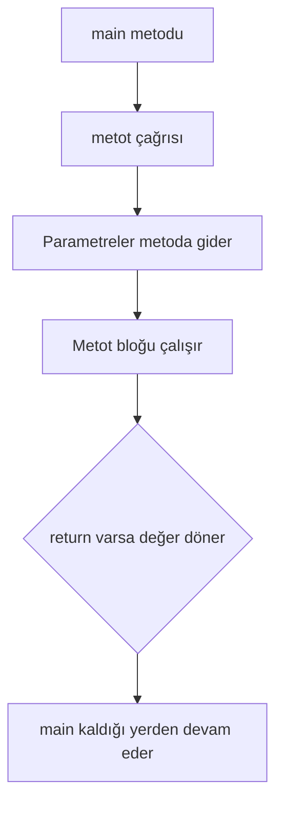

**Diyagram 8.1:** Bir metot çağrısının temel çalışma akışı.

**Görsel üretim notu:** Bu Mermaid diyagramı final DOCX/PDF üretiminden önce PNG’ye dönüştürülmeli; ham `flowchart TD` kodu final çıktıda görünmemelidir. Önerilen görsel genişliği 12–13 cm aralığında tutulmalıdır.

## 8.17 Adım adım kod örnekleri

Bu bölümde temel metot kullanımından overloading ve özyinelemeye doğru ilerleyen örnekler verilecektir.

### Kod 8.1: `void` metot ve metot çağırma

**Kod kimliği:** `b08_kod01_metot_ve_metot_cagirma`

**Kod erişimi:** [Kod sayfası](https://github.com/bmdersleri/javaninTemelleri/tree/main/kodlar/bolum08/kod01/) | [Kaynak kod](https://github.com/bmdersleri/javaninTemelleri/blob/main/kodlar/bolum08/kod01/Bolum08Ornek01VoidMetot.java) | 

**QR erişimi:** Kod sayfası ve kaynak kod için aşağıdaki iki QR kod kullanılabilir.

{width=2.8cm} {width=2.8cm}


```java
// Dosya: Bolum08Ornek01VoidMetot.java
public class Bolum08Ornek01VoidMetot {
    public static void main(String[] args) {
        baslikYazdir();
        bilgiYazdir("Java", 2026);
    }

    static void baslikYazdir() {
        System.out.println("=== Metot Örneği ===");
    }

    static void bilgiYazdir(String dersAdi, int yil) {
        System.out.println("Ders: " + dersAdi);
        System.out.println("Yıl: " + yil);
    }
}
```

**Kodun amacı:** Geriye değer döndürmeyen `void` metotları göstermek.

**Kritik satırlar:**

1. `baslikYazdir()` parametre almayan `void` metottur.
2. `bilgiYazdir(String dersAdi, int yil)` parametre alan `void` metottur.
3. Metotlar `main` içinden çağrılmıştır.

**Beklenen çıktı:**

```text
=== Metot Örneği ===
Ders: Java
Yıl: 2026
```

**Dikkat noktası:** Metot tanımlanmış olsa bile çağrılmazsa çalışmaz.

### Kod 8.2: Değer döndüren metot

**Kod kimliği:** `b08_kod02_deger_donduren_metot`

**Kod erişimi:** [Kod sayfası](https://github.com/bmdersleri/javaninTemelleri/tree/main/kodlar/bolum08/kod02/) | [Kaynak kod](https://github.com/bmdersleri/javaninTemelleri/blob/main/kodlar/bolum08/kod02/Bolum08Ornek02ReturnMetot.java) | 

**QR erişimi:** Kod sayfası ve kaynak kod için aşağıdaki iki QR kod kullanılabilir.

{width=2.8cm} {width=2.8cm}


```java
// Dosya: Bolum08Ornek02ReturnMetot.java
public class Bolum08Ornek02ReturnMetot {
    public static void main(String[] args) {
        int toplam = topla(15, 25);
        double ortalama = ortalamaHesapla(70, 80, 90);

        System.out.println("Toplam: " + toplam);
        System.out.println("Ortalama: " + ortalama);
    }

    static int topla(int a, int b) {
        return a + b;
    }

    static double ortalamaHesapla(int not1, int not2, int not3) {
        return (not1 + not2 + not3) / 3.0;
    }
}
```

**Kodun amacı:** `return` ile çağıran yere değer döndüren metotları göstermek.

**Kritik satırlar:**

1. `topla` metodu `int` değer döndürür.
2. `ortalamaHesapla` metodu `double` değer döndürür.
3. Dönen değerler değişkenlerde saklanmıştır.

**Beklenen çıktı:**

```text
Toplam: 40
Ortalama: 80.0
```

**Dikkat noktası:** Ortalama hesabında `3.0` kullanılarak ondalıklı sonuç korunmuştur.

### Kod 8.3: Scope ve yerel değişken

**Kod kimliği:** `b08_kod03_scope_ve_yerel_degisken`

**Kod erişimi:** [Kod sayfası](https://github.com/bmdersleri/javaninTemelleri/tree/main/kodlar/bolum08/kod03/) | [Kaynak kod](https://github.com/bmdersleri/javaninTemelleri/blob/main/kodlar/bolum08/kod03/Bolum08Ornek03Scope.java) | 

**QR erişimi:** Kod sayfası ve kaynak kod için aşağıdaki iki QR kod kullanılabilir.

{width=2.8cm} {width=2.8cm}


```java
// Dosya: Bolum08Ornek03Scope.java
public class Bolum08Ornek03Scope {
    public static void main(String[] args) {
        int sayi = 6;
        int sonuc = kareAl(sayi);

        sonucuYazdir(sonuc);
    }

    static int kareAl(int sayi) {
        int sonuc = sayi * sayi;
        return sonuc;
    }

    static void sonucuYazdir(int deger) {
        System.out.println("Sonuç: " + deger);
    }
}
```

**Kodun amacı:** Yerel değişkenlerin yalnızca tanımlandıkları metot içinde geçerli olduğunu göstermek.

**Kritik satırlar:**

1. `kareAl` içindeki `sonuc`, o metoda ait yerel değişkendir.
2. `sonucuYazdir` metodu değeri parametre olarak alır.
3. Metotlar birbirinin yerel değişkenlerine doğrudan erişmez.

**Beklenen çıktı:**

```text
Sonuç: 36
```

**Dikkat noktası:** Bir metottaki yerel değişken başka bir metotta doğrudan kullanılamaz.

### Kod 8.4: Metot overloading

**Kod kimliği:** `b08_kod04_metot_overloading`

**Kod erişimi:** [Kod sayfası](https://github.com/bmdersleri/javaninTemelleri/tree/main/kodlar/bolum08/kod04/) | [Kaynak kod](https://github.com/bmdersleri/javaninTemelleri/blob/main/kodlar/bolum08/kod04/Bolum08Ornek04Overloading.java) | 

**QR erişimi:** Kod sayfası ve kaynak kod için aşağıdaki iki QR kod kullanılabilir.

{width=2.8cm} {width=2.8cm}


```java
// Dosya: Bolum08Ornek04Overloading.java
public class Bolum08Ornek04Overloading {
    public static void main(String[] args) {
        System.out.println("Kare alanı: " + alanHesapla(5));
        System.out.println("Dikdörtgen alanı: " + alanHesapla(4, 8));
        System.out.println("Daire alanı: " + alanHesapla(3.0));
    }

    static int alanHesapla(int kenar) {
        return kenar * kenar;
    }

    static int alanHesapla(int kisaKenar, int uzunKenar) {
        return kisaKenar * uzunKenar;
    }

    static double alanHesapla(double yaricap) {
        final double PI = 3.14159;
        return PI * yaricap * yaricap;
    }
}
```

**Kodun amacı:** Aynı isimli metotların farklı parametre listeleriyle kullanılmasını göstermek.

**Kritik satırlar:**

1. `alanHesapla(int kenar)` kare alanı hesaplar.
2. `alanHesapla(int, int)` dikdörtgen alanı hesaplar.
3. `alanHesapla(double)` daire alanı hesaplar.
4. Java, çağrıdaki argümanlara göre uygun metodu seçer.

**Beklenen çıktı:**

```text
Kare alanı: 25
Dikdörtgen alanı: 32
Daire alanı: 28.27431
```

**Dikkat noktası:** Dönüş tipinin farklı olması tek başına overloading için yeterli değildir.

### Kod 8.5: Özyinelemeli faktöriyel

**Kod kimliği:** `b08_kod05_ozyinelemeli_faktoriyel`

**Kod erişimi:** [Kod sayfası](https://github.com/bmdersleri/javaninTemelleri/tree/main/kodlar/bolum08/kod05/) | [Kaynak kod](https://github.com/bmdersleri/javaninTemelleri/blob/main/kodlar/bolum08/kod05/Bolum08Ornek05Ozyineleme.java) | 

**QR erişimi:** Kod sayfası ve kaynak kod için aşağıdaki iki QR kod kullanılabilir.

{width=2.8cm} {width=2.8cm}


```java
// Dosya: Bolum08Ornek05Ozyineleme.java
public class Bolum08Ornek05Ozyineleme {
    public static void main(String[] args) {
        int sayi = 5;
        long sonuc = faktoriyel(sayi);

        System.out.println(sayi + "! = " + sonuc);
    }

    static long faktoriyel(int n) {
        if (n <= 1) {
            return 1;
        }

        return n * faktoriyel(n - 1);
    }
}
```

**Kodun amacı:** Base case ve recursive call kavramlarını temel faktöriyel örneğiyle göstermek.

**Kritik satırlar:**

1. `if (n <= 1)` base case bölümüdür.
2. `faktoriyel(n - 1)` recursive call bölümüdür.
3. Her çağrıda problem daha küçük hâle gelir.

**Beklenen çıktı:**

```text
5! = 120
```

**Dikkat noktası:** Base case kaldırılırsa metot kendini durmadan çağırabilir.

### Kod 8.6: Hatalı ve düzeltilmiş örnek

Aşağıdaki kodda metot tanımlama, dönüş değeri ve özyineleme ile ilgili hatalar vardır.

**Kod kimliği:** `b08_kod06_hatali_ve_duzeltilmis_ornek`

**Kod erişimi:** [Kod sayfası](https://github.com/bmdersleri/javaninTemelleri/tree/main/kodlar/bolum08/kod06/) | [Kaynak kod](https://github.com/bmdersleri/javaninTemelleri/blob/main/kodlar/bolum08/kod06/Bolum08Ornek06HataDuzeltme.java) | 

**QR erişimi:** Kod sayfası ve kaynak kod için aşağıdaki iki QR kod kullanılabilir.

{width=2.8cm} {width=2.8cm}


```java
// Dosya: Bolum08Ornek06HataDuzeltme.java
public class Bolum08Ornek06HataDuzeltme {
    public static void main(String[] args) {
        int sonuc = topla(10, 20);
        System.out.println("Sonuç: " + sonuc);
    }

    static void topla(int a, int b) {
        return a + b;
    }

    static long faktoriyel(int n) {
        return n * faktoriyel(n);
    }
}
```

Bu kodda iki temel hata vardır:

1. `topla` metodu `void` tanımlanmış; ancak değer döndürmeye çalışmaktadır.
2. `faktoriyel` metodunda base case yoktur ve recursive call problemi küçültmemektedir.

Düzeltilmiş kod:

**Kod kimliği:** `b08_kod06_hatali_ve_duzeltilmis_ornek_2`

**Kod erişimi:** [Kod sayfası](https://github.com/bmdersleri/javaninTemelleri/tree/main/kodlar/bolum08/kod06_2/) | [Kaynak kod](https://github.com/bmdersleri/javaninTemelleri/blob/main/kodlar/bolum08/kod06_2/Bolum08Ornek06HataDuzeltme.java) | 

**QR erişimi:** Kod sayfası ve kaynak kod için aşağıdaki iki QR kod kullanılabilir.

{width=2.8cm} {width=2.8cm}


```java
// Dosya: Bolum08Ornek06HataDuzeltme.java
public class Bolum08Ornek06HataDuzeltme {
    public static void main(String[] args) {
        int sonuc = topla(10, 20);
        long faktoriyelSonuc = faktoriyel(5);

        System.out.println("Toplam: " + sonuc);
        System.out.println("5! = " + faktoriyelSonuc);
    }

    static int topla(int a, int b) {
        return a + b;
    }

    static long faktoriyel(int n) {
        if (n <= 1) {
            return 1;
        }

        return n * faktoriyel(n - 1);
    }
}
```

**Beklenen çıktı:**

```text
Toplam: 30
5! = 120
```

**Dikkat noktası:** Metodun dönüş tipi ile `return` edilen değerin tipi uyumlu olmalıdır. Özyinelemede durma koşulu mutlaka bulunmalıdır.

## 8.18 Kodun çalışma mantığı ve beklenen çıktı

Metot çağrılarında program akışı, çağrının yapıldığı yerden metoda gider ve metot tamamlandığında tekrar çağrıldığı yere döner.

Aşağıdaki kodu düşünelim:

```java
int sonuc = topla(3, 4);
System.out.println(sonuc);
```

Metot:

```java
static int topla(int a, int b) {
    return a + b;
}
```

İz sürme tablosu:

| Adım | İşlem | Açıklama |
|---:|---|---|
| 1 | `topla(3, 4)` çağrılır | `3` ve `4` argüman olarak gönderilir |
| 2 | `a = 3`, `b = 4` | Parametreler değer alır |
| 3 | `return a + b` | `7` değeri döndürülür |
| 4 | `sonuc = 7` | Dönen değer değişkene atanır |
| 5 | `println` | `7` ekrana yazdırılır |

Özyinelemede ise metot kendisini çağırdığı için çağrılar üst üste oluşur. Faktöriyel için akış şu şekilde düşünülebilir:

```text
faktoriyel(5)
5 * faktoriyel(4)
5 * 4 * faktoriyel(3)
5 * 4 * 3 * faktoriyel(2)
5 * 4 * 3 * 2 * faktoriyel(1)
5 * 4 * 3 * 2 * 1
120
```

> **🔍 Derinlemesine:** Özyinelemede her çağrı ayrı bir çağrı olarak düşünülmelidir. Base case’e ulaşıldığında çağrılar geriye doğru sonuç üretmeye başlar.

## 8.19 Uçtan uca mini uygulama: Geometrik ve Sayısal Hesaplama Araçları

Bu bölümün mini uygulaması, temel metotları, dönüş değerlerini, overloading yapısını ve özyinelemeyi tek bir konsol programında birleştirir.

**Uygulama adı:** Geometrik ve Sayısal Hesaplama Araçları

**Dosya adı:** `GeometrikSayisalAraclar.java`

**Amaç:** Kare, dikdörtgen ve daire alanı hesaplamak için overloading kullanmak; faktöriyel ve toplam hesaplamak için metotlardan yararlanmak; özyinelemeli faktöriyel mantığını göstermek.

**Kod kimliği:** `b08_kod34_geometrik_ve_sayisal_hesaplama_araclari`

**Kod erişimi:** [Kod sayfası](https://github.com/bmdersleri/javaninTemelleri/tree/main/kodlar/bolum08/kod34/) | [Kaynak kod](https://github.com/bmdersleri/javaninTemelleri/blob/main/kodlar/bolum08/kod34/GeometrikSayisalAraclar.java) | 

**QR erişimi:** Kod sayfası ve kaynak kod için aşağıdaki iki QR kod kullanılabilir.

{width=2.8cm} {width=2.8cm}


```java
// Dosya: GeometrikSayisalAraclar.java
import java.util.Scanner;

public class GeometrikSayisalAraclar {
    public static void main(String[] args) {
        Scanner scanner = new Scanner(System.in);

        baslikYazdir();

        System.out.print("Kare kenarı: ");
        int kenar = scanner.nextInt();

        System.out.print("Dikdörtgen kısa kenarı: ");
        int kisaKenar = scanner.nextInt();

        System.out.print("Dikdörtgen uzun kenarı: ");
        int uzunKenar = scanner.nextInt();

        System.out.print("Daire yarıçapı: ");
        double yaricap = scanner.nextDouble();

        System.out.print("Faktöriyel için sayı: ");
        int sayi = scanner.nextInt();

        System.out.println();
        System.out.println("Kare alanı: " + alanHesapla(kenar));
        System.out.println("Dikdörtgen alanı: "
                + alanHesapla(kisaKenar, uzunKenar));
        System.out.println("Daire alanı: " + alanHesapla(yaricap));

        if (sayi < 0) {
            System.out.println("Negatif sayı için faktöriyel hesaplanmaz.");
        } else {
            System.out.println("Faktöriyel: " + faktoriyel(sayi));
        }

        System.out.println("1-" + sayi + " toplamı: "
                + toplamHesapla(sayi));

        scanner.close();
    }

    static void baslikYazdir() {
        System.out.println("=== Geometrik ve Sayısal Araçlar ===");
    }

    static int alanHesapla(int kenar) {
        return kenar * kenar;
    }

    static int alanHesapla(int kisaKenar, int uzunKenar) {
        return kisaKenar * uzunKenar;
    }

    static double alanHesapla(double yaricap) {
        final double PI = 3.14159;
        return PI * yaricap * yaricap;
    }

    static long faktoriyel(int n) {
        if (n <= 1) {
            return 1;
        }

        return n * faktoriyel(n - 1);
    }

    static int toplamHesapla(int ustSinir) {
        int toplam = 0;

        for (int i = 1; i <= ustSinir; i++) {
            toplam += i;
        }

        return toplam;
    }
}
```

**Örnek çalışma:**

```text
=== Geometrik ve Sayısal Araçlar ===
Kare kenarı: 5
Dikdörtgen kısa kenarı: 4
Dikdörtgen uzun kenarı: 8
Daire yarıçapı: 3
Faktöriyel için sayı: 5

Kare alanı: 25
Dikdörtgen alanı: 32
Daire alanı: 28.27431
Faktöriyel: 120
1-5 toplamı: 15
```

### 8.19.1 Mini uygulamanın kavram eşleştirmesi

| Kullanılan yapı | Uygulamadaki rolü |
|---|---|
| `void` metot | Başlık yazdırmak |
| Değer döndüren metot | Hesaplama sonucunu çağıran yere vermek |
| Parametre | Kullanıcıdan alınan değerleri metoda aktarmak |
| Overloading | Aynı `alanHesapla` adıyla farklı alanları hesaplamak |
| `return` | Hesaplanan sonucu geri döndürmek |
| Özyineleme | Faktöriyel hesaplamak |
| Base case | Faktöriyel çağrısını durdurmak |
| Döngü | 1-N toplamını hesaplamak |
| `Scanner` | Kullanıcıdan değer almak |

### 8.19.2 Mini uygulama test senaryoları

| Test | Girdi | Beklenen sonuç |
|---:|---|---|
| 1 | Kare kenarı `5` | Kare alanı `25` |
| 2 | Dikdörtgen `4`, `8` | Dikdörtgen alanı `32` |
| 3 | Daire yarıçapı `3` | Daire alanı yaklaşık `28.27431` |
| 4 | Faktöriyel sayısı `5` | Faktöriyel `120` |
| 5 | Faktöriyel sayısı `0` | Faktöriyel `1` |
| 6 | Faktöriyel sayısı `-3` | Uyarı mesajı |
| 7 | Toplam üst sınırı `5` | Toplam `15` |

> **Alıştırma Molası:** Mini uygulamaya üçgen alanı hesaplayan yeni bir metot ekleyiniz. Bu metodu overloading mantığına uygun biçimde adlandırıp parametre yapısını gerekçelendiriniz.

## 8.20 Sık yapılan hatalar ve yanlış sezgiler

Metotlar programı düzenli hâle getirir; ancak yanlış kullanıldığında yeni hata türleri de ortaya çıkarabilir.

### 8.20.1 Metodu tanımlayıp çağırmamak

Yanlış düşünce:

```text
Metodu yazarsam otomatik olarak çalışır.
```

Düzeltme:

Metot tanımlandıktan sonra çağrılmalıdır.

```java
public static void main(String[] args) {
    baslikYazdir();
}
```

### 8.20.2 `void` metottan değer döndürmeye çalışmak

Yanlış kullanım:

```java
static void topla(int a, int b) {
    return a + b;
}
```

Düzeltme:

```java
static int topla(int a, int b) {
    return a + b;
}
```

### 8.20.3 Parametre ve argümanı karıştırmak

Parametre metot tanımında yer alır. Argüman metot çağrısında gönderilen gerçek değerdir.

```java
static void yazdir(String ad) {
    System.out.println(ad);
}

yazdir("Ali");
```

Bu örnekte `ad` parametre, `"Ali"` argümandır.

### 8.20.4 Yerel değişkeni başka metotta kullanmaya çalışmak

Bir metodun içinde tanımlanan değişken başka bir metodun içinde doğrudan kullanılamaz. Gerekli değer parametre olarak gönderilmelidir.

### 8.20.5 Dönüş tipiyle overloading yapılacağını sanmak

Yanlış düşünce:

```text
Aynı parametreli iki metodun dönüş tipi farklıysa overload yapılmış olur.
```

Düzeltme:

Dönüş tipi tek başına overloading için yeterli değildir. Parametre listesi farklı olmalıdır.

### 8.20.6 Base case yazmayı unutmak

Yanlış kullanım:

```java
static int geriSay(int n) {
    return geriSay(n - 1);
}
```

Bu metot durma koşulu içermediği için sürekli çağrı yapar.

Düzeltme:

```java
static int geriSay(int n) {
    if (n <= 0) {
        return 0;
    }

    return geriSay(n - 1);
}
```

### 8.20.7 Recursive call içinde problemi küçültmemek

Yanlış kullanım:

```java
static long faktoriyel(int n) {
    if (n <= 1) {
        return 1;
    }

    return n * faktoriyel(n);
}
```

Düzeltme:

```java
static long faktoriyel(int n) {
    if (n <= 1) {
        return 1;
    }

    return n * faktoriyel(n - 1);
}
```

> **💡 İpucu:** Özyinelemeli metot yazarken iki soruyu mutlaka sorun: “Bu metot nerede duracak?” ve “Her çağrıda problem küçülüyor mu?”

## 8.21 Hata ayıklama egzersizi

Aşağıdaki kodun `MetotHatasi.java` adlı dosyaya kaydedildiğini düşünelim.

**Kod kimliği:** `b08_kod43_hata_ayiklama_egzersizi`

**Kod erişimi:** [Kod sayfası](https://github.com/bmdersleri/javaninTemelleri/tree/main/kodlar/bolum08/kod43/) | [Kaynak kod](https://github.com/bmdersleri/javaninTemelleri/blob/main/kodlar/bolum08/kod43/MetotHatasi.java) | 

**QR erişimi:** Kod sayfası ve kaynak kod için aşağıdaki iki QR kod kullanılabilir.

{width=2.8cm} {width=2.8cm}


```java
// Dosya: MetotHatasi.java
public class MetotHatasi {
    public static void main(String[] args) {
        int toplam = topla(10, 20);
        System.out.println("Toplam: " + toplam);

        System.out.println("Faktöriyel: " + faktoriyel(5));
    }

    static void topla(int a, int b) {
        return a + b;
    }

    static int hesapla(int a) {
        return a * a;
    }

    static double hesapla(int a) {
        return a * 2.0;
    }

    static long faktoriyel(int n) {
        return n * faktoriyel(n);
    }
}
```

Bu kodda derleme hatası ve çalışma zamanı riski birlikte bulunmaktadır.

**Hatalar:**

1. `topla` metodu `void` tanımlanmış, fakat değer döndürmeye çalışmaktadır.
2. `int toplam = topla(10, 20);` satırı `void` dönüşle uyumsuzdur.
3. `hesapla(int a)` metodu iki kez aynı parametre listesiyle tanımlanmıştır.
4. Dönüş tipinin farklı olması overloading için yeterli değildir.
5. `faktoriyel` metodunda base case yoktur.
6. `faktoriyel(n)` çağrısı problemi küçültmemektedir.

**Düzeltilmiş kod:**

**Kod kimliği:** `b08_kod44_hata_ayiklama_egzersizi`

**Kod erişimi:** [Kod sayfası](https://github.com/bmdersleri/javaninTemelleri/tree/main/kodlar/bolum08/kod44/) | [Kaynak kod](https://github.com/bmdersleri/javaninTemelleri/blob/main/kodlar/bolum08/kod44/MetotHatasi.java) | 

**QR erişimi:** Kod sayfası ve kaynak kod için aşağıdaki iki QR kod kullanılabilir.

{width=2.8cm} {width=2.8cm}


```java
// Dosya: MetotHatasi.java
public class MetotHatasi {
    public static void main(String[] args) {
        int toplam = topla(10, 20);
        System.out.println("Toplam: " + toplam);

        System.out.println("Kare: " + hesapla(5));
        System.out.println("İki kat: " + hesapla(5.0));
        System.out.println("Faktöriyel: " + faktoriyel(5));
    }

    static int topla(int a, int b) {
        return a + b;
    }

    static int hesapla(int a) {
        return a * a;
    }

    static double hesapla(double a) {
        return a * 2.0;
    }

    static long faktoriyel(int n) {
        if (n <= 1) {
            return 1;
        }

        return n * faktoriyel(n - 1);
    }
}
```

**Beklenen çıktı:**

```text
Toplam: 30
Kare: 25
İki kat: 10.0
Faktöriyel: 120
```

**Kendinize sorunuz:**

1. `void` metottan neden değer döndürülemez?
2. `hesapla(int a)` metodu neden iki kez tanımlanamaz?
3. Dönüş tipi overloading için neden tek başına yeterli değildir?
4. Faktöriyel metodunda base case hangi satırdır?
5. Recursive call problemi nasıl küçültmektedir?

> **Laboratuvar İpucu:** Metot hatalarını incelerken önce dönüş tipi ve `return` uyumunu, sonra parametre listesini, en son özyinelemede durma koşulunu kontrol edin.

## 8.22 Bölümün sonraki bölümlerle ilişkisi

Bu bölümde metotlarla programı anlamlı parçalara ayırma becerisi kazanıldı. Öğrenci artık aynı işlemi tekrar tekrar yazmak yerine, parametre alan ve değer döndüren metotlar oluşturabilir.

Bir sonraki bölümde diziler ele alınacaktır. Dizilerle çalışırken metot kullanımı daha da önemli hâle gelir. Örneğin bir dizinin toplamını, ortalamasını, en büyük değerini veya arama sonucunu bulmak için ayrı metotlar yazılabilir. Bu nedenle bu bölüm, dizi işlemlerinin daha okunabilir ve düzenli yazılmasına doğrudan hazırlık sağlar.

Overloading ve özyineleme bilgisi de ilerleyen bölümlerde metot tasarımını daha esnek düşünmeye yardım edecektir. Ancak ileri OOP kavramları daha sonraki sınıf ve nesne bölümlerine bırakılacaktır.

## 8.23 Bölüm özeti

Bu bölümde Java’da metotlar, metot overloading ve özyineleme konuları ele alındı. Metotların programı anlamlı parçalara ayırmak, kod tekrarını azaltmak ve hesaplamaları yeniden kullanılabilir hâle getirmek için kullanıldığı açıklandı.

Metot tanımlama ile metot çağırma arasındaki fark gösterildi. `void` metotların geriye değer döndürmediği; değer döndüren metotlarda ise uygun dönüş tipi ve `return` ifadesinin gerekli olduğu vurgulandı.

Parametre ve argüman kavramları ayrıştırıldı. Parametrenin metot tanımındaki değişken, argümanın ise çağrı sırasında gönderilen gerçek değer olduğu belirtildi. Yerel değişken ve scope kavramlarıyla bir metottaki değişkenin başka bir metotta doğrudan kullanılamayacağı gösterildi.

Metot overloading, aynı sınıf içinde aynı ada sahip metotların farklı parametre listeleriyle tanımlanması olarak açıklandı. Metot imzasının metot adı ve parametre listesinden oluştuğu, dönüş tipinin tek başına overloading için yeterli olmadığı belirtildi.

Özyineleme, bir metodun kendi kendini çağırması olarak tanıtıldı. Her özyinelemeli çözümde base case ve recursive call bulunması gerektiği, base case eksikse veya problem küçülmüyorsa stack overflow riski oluşabileceği vurgulandı.

Son olarak Geometrik ve Sayısal Hesaplama Araçları mini uygulamasıyla `void` metot, değer döndüren metot, overloading, döngü ve özyineleme birlikte kullanıldı.

## 8.24 Terim sözlüğü

| Terim | Açıklama |
|---|---|
| Metot | Belirli bir işi yapan adlandırılmış kod bloğu |
| Metot tanımlama | Metodun adını, parametrelerini, dönüş tipini ve gövdesini yazma |
| Metot çağırma | Tanımlı bir metodu çalıştırma |
| Parametre | Metot tanımında yer alan değişken |
| Argüman | Metot çağrısında gönderilen gerçek değer |
| `void` | Metodun geriye değer döndürmediğini gösteren dönüş tipi |
| Dönüş tipi | Metodun çağıran yere hangi türde değer döndüreceğini belirten yapı |
| `return` | Metottan değer döndürmeyi veya metodu sonlandırmayı sağlayan ifade |
| Yerel değişken | Bir metodun içinde tanımlanan değişken |
| Scope | Bir değişkenin geçerli olduğu kod bölgesi |
| `static` metot | Nesne oluşturmadan çağrılabilen metot |
| Overloading | Aynı isimli metotların farklı parametre listeleriyle tanımlanması |
| Metot imzası | Metot adı ve parametre listesinden oluşan yapı |
| Özyineleme | Bir metodun kendi kendini çağırması |
| Base case | Özyinelemeli metodun durmasını sağlayan temel durum |
| Recursive call | Metodun kendi kendini daha küçük problemle çağırması |
| Stack overflow | Aşırı veya sonsuz metot çağrısı nedeniyle oluşabilen hata |

## 8.25 Kendini değerlendirme soruları

### 8.25.1 Çoktan seçmeli sorular

1. Belirli bir işi yapan adlandırılmış kod bloğuna ne ad verilir?

A) Metot  
B) Paket  
C) Derleyici  
D) Bytecode  
E) Dizin  

2. Geriye değer döndürmeyen metotlar için hangi dönüş tipi kullanılır?

A) `void`  
B) `int`  
C) `return`  
D) `main`  
E) `class`  

3. Metot çağrısında gönderilen gerçek değere ne ad verilir?

A) Argüman  
B) Paket  
C) Dosya  
D) Anahtar  
E) Bytecode  

4. Değer döndüren metotta sonucu çağıran yere vermek için hangi ifade kullanılır?

A) `return`  
B) `break`  
C) `continue`  
D) `case`  
E) `default`  

5. Metot overloading için aşağıdakilerden hangisi tek başına yeterli değildir?

A) Dönüş tipinin farklı olması  
B) Parametre sayısının farklı olması  
C) Parametre tipinin farklı olması  
D) Parametre sırasının farklı olması  
E) Parametre listesinin farklı olması  

6. Özyinelemeli bir metotta durma koşuluna ne ad verilir?

A) Base case  
B) Overload  
C) Scope  
D) Import  
E) Package  

7. Aşağıdakilerden hangisi recursive call örneğidir?

A) `faktoriyel(n - 1)` metodun kendi içinde çağrılması  
B) `System.out.println()` çağrılması  
C) `Scanner` nesnesi oluşturulması  
D) `int x = 5;` yazılması  
E) `break;` kullanılması  

8. Base case eksikse hangi sorun oluşabilir?

A) Stack overflow  
B) Otomatik import  
C) Dosya adı değişimi  
D) Bytecode silinmesi  
E) Konsol kapanması  

### 8.25.2 Doğru/Yanlış soruları

1. Metotlar kod tekrarını azaltmak için kullanılabilir. (D/Y)
2. Metot tanımlamak, metodun otomatik çalışması için yeterlidir. (D/Y)
3. Parametre metot tanımında, argüman metot çağrısında yer alır. (D/Y)
4. `void` metotlar geriye değer döndürür. (D/Y)
5. Değer döndüren metotlarda uygun `return` ifadesi gerekir. (D/Y)
6. Yerel değişkenler tüm sınıf içinde doğrudan kullanılabilir. (D/Y)
7. Overloading için dönüş tipi tek başına yeterlidir. (D/Y)
8. Parametre sayısı veya tipi farklıysa overloading yapılabilir. (D/Y)
9. Özyinelemeli her çözümde base case bulunmalıdır. (D/Y)
10. Recursive call problemi küçültmüyorsa sonsuz çağrı riski oluşur. (D/Y)

### 8.25.3 Açık uçlu kavramsal sorular

1. Metot kavramını kendi cümlelerinizle açıklayınız.
2. Metot kullanmanın program okunabilirliğine katkısı nedir?
3. Parametre ve argüman arasındaki farkı örnekle açıklayınız.
4. `void` metot ile değer döndüren metot arasındaki fark nedir?
5. `return` ifadesi ne işe yarar?
6. Scope kavramı metotlarda neden önemlidir?
7. Başlangıç düzeyinde yardımcı metotları neden `static` tanımlıyoruz?
8. Metot overloading kavramını örnekle açıklayınız.
9. Dönüş tipi neden tek başına overloading için yeterli değildir?
10. Özyineleme, base case ve recursive call kavramlarını açıklayınız.
11. Faktöriyel problemi neden özyinelemeye uygun bir örnektir?
12. Stack overflow hatası hangi durumda ortaya çıkabilir?

### 8.25.4 Yanlış gerekçeyi bulma soruları

Aşağıdaki ifadelerdeki yanlış gerekçeyi bulunuz ve düzeltiniz.

1. “Bir metot tanımlanırsa otomatik olarak çalışır.”
2. “Parametre ve argüman aynı şeydir.”
3. “`void` metotlar `return` ile değer döndürmelidir.”
4. “Bir metodun yerel değişkeni başka metotta doğrudan kullanılabilir.”
5. “Overloading için sadece dönüş tipini değiştirmek yeterlidir.”
6. “Metot imzası yalnızca dönüş tipinden oluşur.”
7. “Özyinelemeli metotlarda base case olmasa da sorun çıkmaz.”
8. “Recursive call aynı değerle yapılırsa problem küçülmüş olur.”
9. “Stack overflow yalnızca büyük projelerde görülür.”
10. “Metotlara ayırmak küçük programlarda hiçbir yarar sağlamaz.”

## 8.26 Programlama alıştırmaları

### 8.26.1 Kolay düzey

1. `MerhabaMetot.java` adlı bir program yazınız. Ekrana başlık yazdıran `void` bir metot oluşturunuz.
2. `KareAl.java` adlı bir program yazınız. Bir sayının karesini döndüren metot yazınız.
3. `ToplaMetot.java` adlı bir program yazınız. İki tam sayıyı toplayan metot yazınız.
4. `OrtalamaMetot.java` adlı bir program yazınız. Üç notun ortalamasını döndüren metot yazınız.
5. `BilgiYazdir.java` adlı bir program yazınız. Ad ve yaş parametreleri alan `void` metot yazınız.

### 8.26.2 Orta düzey

1. `AlanHesaplama.java` adlı programda kare ve dikdörtgen alanı hesaplayan iki metot yazınız.
2. `AlanOverloading.java` adlı programda `alanHesapla` metodunu üç farklı parametre yapısıyla overload ediniz.
3. `FaktoriyelDongu.java` adlı programda faktöriyeli döngüyle hesaplayan metot yazınız.
4. `FaktoriyelOzyineleme.java` adlı programda faktöriyeli özyinelemeyle hesaplayan metot yazınız.
5. `ScopeDeneme.java` adlı programda yerel değişkenlerin kapsamını gösteren küçük örnek yazınız.

### 8.26.3 Zor düzey

1. `GeometrikSayisalAraclar.java` uygulamasını geliştiriniz.
2. Kare, dikdörtgen ve daire alanı için overload edilmiş `alanHesapla` metotları yazınız.
3. Faktöriyeli özyineleme ile hesaplayan metot yazınız.
4. 1-N toplamını döngüyle hesaplayan ayrı bir metot yazınız.
5. Kullanıcıdan değerleri `Scanner` ile alınız.
6. Negatif faktöriyel girdisi için uygun uyarı üretiniz.
7. Programı en az yedi farklı test senaryosuyla çalıştırınız.
8. Hatalı bir sürüm oluşturunuz. Bu sürümde en az üç hata bulunsun: `void` dönüş hatası, geçersiz overloading ve eksik base case. Sonra düzeltilmiş sürümü yazınız.

## 8.27 Haftalık laboratuvar / proje görevi

**Görev başlığı:** Metotlar ve Overloading ile Hesaplama Araçları Laboratuvarı

**Amaç:** Bu laboratuvarın amacı, öğrencinin temel `static` metotları, parametreleri, dönüş değerlerini, overloading yapısını ve temel özyineleme mantığını küçük bir Java uygulamasında birleştirmesidir.

**Beklenen adımlar:**

1. `GeometrikSayisalAraclar.java` adlı dosyayı oluşturunuz.
2. Programda başlık yazdıran `void` bir metot tanımlayınız.
3. Kare alanı hesaplayan `alanHesapla(int kenar)` metodunu yazınız.
4. Dikdörtgen alanı hesaplayan `alanHesapla(int kisa, int uzun)` metodunu yazınız.
5. Daire alanı hesaplayan `alanHesapla(double yaricap)` metodunu yazınız.
6. Faktöriyel hesaplayan özyinelemeli bir metot yazınız.
7. 1-N toplamını hesaplayan döngü tabanlı bir metot yazınız.
8. Kullanıcıdan gerekli değerleri `Scanner` ile alınız.
9. Negatif faktöriyel girdisini kontrol ediniz.
10. En az yedi test senaryosu çalıştırınız.
11. Bir hatalı overloading veya eksik base case örneği oluşturup düzeltiniz.
12. Kısa bir `README.md` dosyası hazırlayınız.

**Teslim edilecek dosyalar:**

1. `GeometrikSayisalAraclar.java`
2. `README.md`
3. En az yedi test çıktısı
4. Hata ve çözüm notu

**README içeriği şu başlıkları içermelidir:**

1. Programın amacı
2. Kullanılan metotlar
3. Parametre ve dönüş tipleri
4. Overloading örnekleri
5. Özyineleme açıklaması
6. Test senaryoları
7. Karşılaşılan hata ve çözümü

## 8.28 Değerlendirme rubriği

| Ölçüt | Açıklama | Puan |
|---|---|---:|
| Temel metot kullanımı | `void`, değer döndüren metot, parametre ve `return` kullanımı | 20 |
| Overloading doğruluğu | Aynı isimli metotların geçerli parametre listeleriyle tanımlanması | 20 |
| Özyineleme doğruluğu | Base case ve recursive call yapısının doğru kurulması | 20 |
| Uygulama işlevleri | Alan, toplam ve faktöriyel hesaplarının doğru çalışması | 15 |
| Kodun çalışması | Programın derlenebilir ve çalıştırılabilir olması | 10 |
| Hata farkındalığı | Dönüş tipi, scope, overloading ve base case hatalarının açıklanması | 10 |
| Raporlama | README ve test çıktılarının yeterliliği | 5 |
| **Toplam** |  | **100** |

## 8.29 İleri okuma ve kaynaklar

Bu bölümde metotlar, overloading ve özyineleme başlangıç düzeyinde ele alınmıştır. Daha ayrıntılı bilgi için aşağıdaki kaynak türleri incelenebilir:

1. **Java Language Specification:** Metot bildirimi, metot imzası, overloading ve çağrı çözümleme kurallarını teknik düzeyde doğrulamak için kullanılabilir.
2. **Java SE API dokümantasyonu:** Java sınıflarındaki metotların parametre ve dönüş tiplerini incelemek için yararlıdır.
3. **Dev.java öğrenme kaynakları:** Java’da metot tanımlama, parametre kullanımı ve temel dil yapıları için güncel açıklamalar sunar.
4. **Oracle Java Tutorials:** Metot tanımlama, parametre kullanımı, dönüş değerleri ve kontrol akışı hakkında örnek odaklı tekrar yapmak için kullanılabilir.
5. **Ders içi ek notlar:** `static`, scope, overloading ve base case kavramlarını kısa alıştırmalarla pekiştirmek için kullanılmalıdır.

> **💡 İpucu:** Metotlar konusunu öğrenirken yalnızca sözdizimini değil, “bu metot hangi tek görevi yerine getiriyor?” sorusunu da düşününüz.

## 8.30 Bir sonraki bölüme köprü

Bu bölümde programları metotlara ayırmayı, parametre ve dönüş değeri kullanmayı, aynı isimli metotları farklı parametrelerle tanımlamayı ve temel özyineleme mantığını öğrendik.

Bir sonraki bölümde diziler ele alınacaktır. Diziler, aynı türden birden fazla değeri tek yapı altında saklamayı sağlar. Metot bilgisi dizilerle birlikte daha da önemli hâle gelecektir. Çünkü bir dizinin toplamını, ortalamasını, en büyük değerini veya arama sonucunu bulmak için ayrı metotlar yazmak programı daha okunabilir hâle getirir.

**BÖLÜM SONU**


\newpage


# Bölüm 9: Diziler ve Çok Boyutlu Veri Yapıları

## 9.1 Bölümün yol haritası

Önceki bölümlerde değişkenler, karar yapıları, döngüler ve metotlar kullanılarak küçük programlar geliştirildi. Ancak şimdiye kadar çoğu örnekte tek bir değer veya az sayıda değişken üzerinde çalışıldı. Gerçek problemlerde ise çoğu zaman aynı türden çok sayıda veriyi birlikte saklamak ve işlemek gerekir.

Örneğin bir sınıftaki öğrencilerin notları, bir haftanın sıcaklık değerleri, ürün fiyatları veya sınav puanları tek tek değişkenlerle tutulabilir. Ancak veri sayısı arttığında bu yaklaşım kullanışsız hâle gelir. Diziler, aynı türden çok sayıda veriyi tek yapı altında saklamamızı sağlar.

Bu bölümde önce tek boyutlu diziler, ardından iki boyutlu diziler ele alınacaktır. Tek boyutlu diziler liste biçimli veriler için; iki boyutlu diziler ise satır-sütun yapısındaki tablo benzeri veriler için kullanılacaktır.

Bu bölümde şu sorulara yanıt aranacaktır:

1. Dizi nedir ve neden kullanılır?
2. Tek boyutlu dizi nasıl tanımlanır?
3. Dizi elemanlarına indeks ile nasıl erişilir?
4. Java’da indeksler neden 0’dan başlar?
5. `length` özelliği ne işe yarar?
6. Bir dizi döngüyle nasıl dolaşılır?
7. Dizide toplam, ortalama, en küçük ve en büyük değer nasıl bulunur?
8. Dizide arama işlemi nasıl yapılır?
9. `ArrayIndexOutOfBoundsException` hatası neden oluşur?
10. Dizi işlemleri metotlara nasıl ayrılır?
11. İki boyutlu dizi nedir?
12. Satır ve sütun kavramları Java dizilerinde nasıl temsil edilir?
13. İç içe döngüler iki boyutlu dizilerde nasıl kullanılır?
14. Satır toplamı, sütun ortalaması ve genel ortalama nasıl hesaplanır?
15. Öğrenci-ders not çizelgesi nasıl modellenebilir?

> **🎯 Bölüm Hedefi:** Bu bölümün sonunda öğrenci, tek boyutlu ve iki boyutlu dizilerle aynı türden çoklu veriyi saklayabilecek, dizi elemanlarını döngülerle işleyebilecek ve toplam, ortalama, arama, min–max, satır toplamı ve sütun ortalaması gibi temel dizi işlemlerini uygulayabilecektir.

Bu bölümde diziler temel programlama düzeyinde ele alınacaktır. Koleksiyonlar, `ArrayList`, `HashMap`, dinamik veri yapıları, matris cebiri, bilimsel hesaplama kütüphaneleri ve Swing `JTable` bileşeni bu bölümün kapsamı dışındadır.

## 9.2 Bölümün konumu ve pedagojik rolü

Bu bölüm, kitabın temel programlama becerileri açısından önemli bir dönüm noktasıdır. Önceki bölümlerde tekil değerler ve küçük algoritmalarla çalışıldı. Bu bölümde ise çoklu veriyle çalışma becerisi kazanılacaktır. Bu beceri, hem koleksiyonlar hem dosya işlemleri hem GUI tabanlı tablo gösterimi hem de veritabanı uygulamaları için temel hazırlar.

Tek boyutlu diziler, öğrencinin aynı türden değerleri tek isim altında saklamasını sağlar. Örneğin `not1`, `not2`, `not3` gibi değişkenler yerine `notlar` adlı bir dizi kullanılabilir. Bu yaklaşım, döngülerle birlikte çok daha okunabilir programlar yazmayı mümkün kılar.

İki boyutlu diziler ise satır ve sütun mantığını programa taşır. Örneğin öğrencilerin derslerden aldığı notlar, bir tablo yapısında tutulabilir. Her satır bir öğrenciyi, her sütun bir dersi temsil edebilir.

> **⚠️ Dikkat:** Bu bölümde çok boyutlu diziler matematiksel matris cebiri amacıyla değil, tablo biçimli verileri programlama açısından temsil etmek için kullanılacaktır.

Bu bölüm, sonraki bölümde ele alınacak `String` işlemleri için de hazırlık sağlar. Çünkü dizilerle çalışma mantığı, metinlerin karakter ve parça temelli işlenmesinde de yararlı düşünme becerileri kazandırır.

## 9.3 Öğrenme çıktıları

Bu bölüm tamamlandığında öğrenci:

1. Dizi kavramını kendi cümleleriyle açıklayabilir.
2. Tek boyutlu dizi tanımlayabilir ve ilk değer atayabilir.
3. Dizi elemanlarına indeks ile erişebilir.
4. Java’da indekslerin 0’dan başladığını açıklayabilir.
5. `length` özelliğini döngülerde güvenli biçimde kullanabilir.
6. Tek boyutlu diziyi `for` döngüsüyle dolaşabilir.
7. Bir dizide toplam ve ortalama hesaplayabilir.
8. Bir dizide en küçük ve en büyük değeri bulabilir.
9. Bir dizide arama işlemi yapabilir.
10. `ArrayIndexOutOfBoundsException` hatasını tanıyabilir.
11. Dizi işlemlerini temel metotlara ayırabilir.
12. Çok boyutlu dizi kavramını tablo ve matris benzeri yapılarla ilişkilendirebilir.
13. İki boyutlu dizi tanımlayabilir ve elemanlara satır-sütun indeksleriyle erişebilir.
14. İç içe döngülerle iki boyutlu dizileri dolaşabilir.
15. Satır toplamı, sütun ortalaması ve genel ortalama hesaplayabilir.
16. Öğrenci-Ders Not Analizi mini uygulamasını geliştirebilir.

## 9.4 Ön bilgi ve başlangıç varsayımları

Bu bölüm, öğrencinin aşağıdaki konuları temel düzeyde bildiğini varsayar:

1. Java programının temel yapısı
2. Değişkenler ve veri tipleri
3. Karar yapıları
4. `for` ve `while` döngüleri
5. İç içe döngü mantığı
6. Metot tanımlama ve çağırma
7. Parametre ve dönüş değeri kullanımı
8. `Scanner` ile temel kullanıcı girdisi alma

Bu bölümde dizi uzunlukları çoğunlukla sabit örnekler üzerinden verilecektir. Kullanıcıdan dizi boyutu alma ve diziyi kullanıcı girdisiyle doldurma örnekleri sınırlı tutulacaktır.

## 9.5 Dizi nedir?

Dizi, aynı türden birden fazla değeri tek bir isim altında saklayan veri yapısıdır. Java’da diziler sabit uzunlukludur. Yani bir dizi oluşturulduktan sonra eleman sayısı değişmez.

Örneğin üç öğrencinin notunu ayrı değişkenlerde tutmak yerine şöyle yazabiliriz:

```java
int[] notlar = {80, 75, 90};
```

Bu dizi üç tam sayı değer tutar. Dizi adı `notlar`dır. Elemanlara indeks numarasıyla erişilir.

```java
System.out.println(notlar[0]);
System.out.println(notlar[1]);
System.out.println(notlar[2]);
```

Beklenen çıktı:

```text
80
75
90
```

> **🎯 Sınav Notu:** Java’da dizi indeksleri 0’dan başlar. Üç elemanlı bir dizide geçerli indeksler `0`, `1` ve `2` değerleridir.

## 9.6 Tek boyutlu dizi tanımlama

Tek boyutlu dizi, liste biçimli verileri tutmak için kullanılır. Dizi tanımlamanın birkaç yaygın biçimi vardır.

### 9.6.1 İlk değerlerle dizi tanımlama

```java
int[] notlar = {80, 75, 90, 60};
```

Bu kullanımda dizi hem oluşturulur hem de ilk değerleri atanır.

### 9.6.2 Uzunluk belirterek dizi oluşturma

```java
int[] notlar = new int[4];
```

Bu kullanımda dört elemanlı bir `int` dizisi oluşturulur. Elemanlara daha sonra değer atanabilir.

```java
notlar[0] = 80;
notlar[1] = 75;
notlar[2] = 90;
notlar[3] = 60;
```

### 9.6.3 Farklı veri tiplerinde diziler

Diziler yalnızca `int` için kullanılmaz. Aynı türden değerler olmak koşuluyla farklı veri tipleriyle de dizi oluşturulabilir.

```java
double[] sicakliklar = {23.5, 25.0, 22.8};
String[] adlar = {"Ayşe", "Mehmet", "Zeynep"};
boolean[] durumlar = {true, false, true};
```

> **⚠️ Dikkat:** Bir dizi tek bir veri tipine sahiptir. `int[]` bir dizide doğrudan `String` değer saklanamaz.

## 9.7 İndeks mantığı

Dizi elemanlarına indeks numarası ile erişilir. Java’da indeksler 0’dan başlar.

```java
String[] gunler = {"Pazartesi", "Salı", "Çarşamba"};

System.out.println(gunler[0]);
System.out.println(gunler[1]);
System.out.println(gunler[2]);
```

Beklenen çıktı:

```text
Pazartesi
Salı
Çarşamba
```

Üç elemanlı bu dizide `gunler[3]` geçersizdir. Çünkü geçerli son indeks `2` değeridir.

> **💡 İpucu:** Bir dizinin son elemanına erişmek için genellikle `dizi.length - 1` kullanılır.

## 9.8 `length` özelliği

Dizinin eleman sayısı `length` özelliğiyle öğrenilir.

```java
int[] notlar = {80, 75, 90, 60};

System.out.println("Eleman sayısı: " + notlar.length);
```

Beklenen çıktı:

```text
Eleman sayısı: 4
```

`length` özellikle döngülerde güvenli dolaşım için kullanılır.

```java
for (int i = 0; i < notlar.length; i++) {
    System.out.println(notlar[i]);
}
```

Bu yapı, dizinin uzunluğu değişse bile döngünün doğru sınırda çalışmasına yardımcı olur.

> **⚠️ Dikkat:** Dizi indeksleri 0’dan başladığı için döngü koşulu çoğu zaman `i < dizi.length` biçiminde yazılır. `i <= dizi.length` hatalıdır.

## 9.9 Diziyi döngüyle dolaşma

Diziler çoğu zaman döngülerle birlikte kullanılır. Çünkü dizideki her elemana sırayla erişmek gerekir.

```java
int[] notlar = {80, 75, 90, 60};

for (int i = 0; i < notlar.length; i++) {
    System.out.println("Not " + i + ": " + notlar[i]);
}
```

Beklenen çıktı:

```text
Not 0: 80
Not 1: 75
Not 2: 90
Not 3: 60
```

Öğrenciye gösterilen numarayı 1’den başlatmak istersek indeks yerine `i + 1` yazabiliriz.

```java
System.out.println("Not " + (i + 1) + ": " + notlar[i]);
```

Bu durumda dizi indeksi yine 0’dan başlar; yalnızca ekrandaki gösterim 1’den başlar.

## 9.10 Toplam ve ortalama hesaplama

Bir dizideki sayısal değerlerin toplamını almak için bir biriktirici değişken kullanılır.

```java
int[] notlar = {80, 75, 90, 60};
int toplam = 0;

for (int i = 0; i < notlar.length; i++) {
    toplam += notlar[i];
}

double ortalama = toplam / (double) notlar.length;

System.out.println("Toplam: " + toplam);
System.out.println("Ortalama: " + ortalama);
```

Beklenen çıktı:

```text
Toplam: 305
Ortalama: 76.25
```

Burada `(double)` dönüşümü, ortalamanın ondalıklı hesaplanmasını sağlar.

> **🎯 Sınav Notu:** Ortalama hesaplanırken tam sayı bölmesi hatasına dikkat edilmelidir. Ondalıklı sonuç için en az bir değer `double` türüne dönüştürülmelidir.

## 9.11 En küçük ve en büyük değeri bulma

Dizide en küçük veya en büyük değeri bulmak için genellikle ilk eleman başlangıç değeri olarak alınır.

```java
int[] notlar = {80, 75, 90, 60};

int enKucuk = notlar[0];
int enBuyuk = notlar[0];

for (int i = 1; i < notlar.length; i++) {
    if (notlar[i] < enKucuk) {
        enKucuk = notlar[i];
    }

    if (notlar[i] > enBuyuk) {
        enBuyuk = notlar[i];
    }
}

System.out.println("En küçük: " + enKucuk);
System.out.println("En büyük: " + enBuyuk);
```

Beklenen çıktı:

```text
En küçük: 60
En büyük: 90
```

> **💡 İpucu:** Min–max problemlerinde başlangıç değeri olarak dizinin ilk elemanını almak çoğu zaman güvenli ve anlaşılır bir yaklaşımdır.

## 9.12 Dizide arama

Bir dizide belirli bir değerin bulunup bulunmadığını kontrol etmek için bayrak değişken kullanılabilir.

```java
int[] notlar = {80, 75, 90, 60};
int aranan = 90;
boolean bulundu = false;

for (int i = 0; i < notlar.length; i++) {
    if (notlar[i] == aranan) {
        bulundu = true;
        break;
    }
}

System.out.println("Bulundu mu?: " + bulundu);
```

Beklenen çıktı:

```text
Bulundu mu?: true
```

Bu örnekte `break`, aranan değer bulunduğunda gereksiz döngü turlarını durdurur.

## 9.13 Diziler ve metotlar

Metotlar, dizi işlemlerini daha düzenli hâle getirir. Örneğin toplam hesaplama, ortalama hesaplama veya en büyük değeri bulma işlemleri ayrı metotlara taşınabilir.

```java
static int toplamHesapla(int[] dizi) {
    int toplam = 0;

    for (int i = 0; i < dizi.length; i++) {
        toplam += dizi[i];
    }

    return toplam;
}
```

Bu metot şöyle çağrılabilir:

```java
int[] notlar = {80, 75, 90, 60};
int toplam = toplamHesapla(notlar);
```

Dizi metotlara parametre olarak gönderilebilir. Başlangıç düzeyinde bu davranışı “metoda dizinin kendisiyle çalışma olanağı verilir” şeklinde düşünmek yeterlidir.

> **⚠️ Dikkat:** Bu bölümde dizi referanslarının bellek düzeyindeki ayrıntılarına girilmeyecektir. Ancak bir dizinin metot içinde değiştirilebileceği unutulmamalıdır.

## 9.14 `ArrayIndexOutOfBoundsException`

Dizinin geçerli indeks aralığı dışında bir elemana erişilmeye çalışılırsa çalışma zamanı hatası oluşur. Bu hata `ArrayIndexOutOfBoundsException` olarak adlandırılır.

Hatalı örnek:

```java
int[] notlar = {80, 75, 90};

System.out.println(notlar[3]);
```

Bu dizide geçerli indeksler `0`, `1` ve `2` değerleridir. `notlar[3]` geçersizdir.

Düzeltilmiş örnek:

```java
int[] notlar = {80, 75, 90};

System.out.println(notlar[notlar.length - 1]);
```

Bu kod son elemana güvenli biçimde erişir.

> **🎯 Sınav Notu:** Dizi uzunluğu `n` ise son geçerli indeks `n - 1` değeridir.

## 9.15 İki boyutlu diziler

İki boyutlu diziler, satır ve sütun yapısındaki verileri temsil etmek için kullanılır. Bu yapı tablo gibi düşünülebilir.

Örnek:

```java
int[][] notTablosu = {
    {80, 75, 90},
    {60, 70, 65},
    {95, 85, 88}
};
```

Bu dizide her satır bir öğrenciyi, her sütun bir dersi temsil edebilir.

| Satır | Anlam |
|---:|---|
| 0 | 1. öğrenci |
| 1 | 2. öğrenci |
| 2 | 3. öğrenci |

| Sütun | Anlam |
|---:|---|
| 0 | 1. ders |
| 1 | 2. ders |
| 2 | 3. ders |

Belirli bir elemana erişmek için iki indeks kullanılır:

```java
System.out.println(notTablosu[0][1]);
```

Bu satır, 0. satır ve 1. sütundaki değeri yazdırır.

## 9.16 İki boyutlu dizi tanımlama

İki boyutlu dizi ilk değerlerle tanımlanabilir:

```java
int[][] tablo = {
    {1, 2, 3},
    {4, 5, 6}
};
```

Bu yapı 2 satır ve 3 sütundan oluşur.

Uzunluk belirterek de oluşturulabilir:

```java
int[][] tablo = new int[2][3];
```

Elemanlara satır ve sütun indeksleriyle değer atanabilir:

```java
tablo[0][0] = 1;
tablo[0][1] = 2;
tablo[0][2] = 3;
tablo[1][0] = 4;
tablo[1][1] = 5;
tablo[1][2] = 6;
```

## 9.17 İki boyutlu diziyi dolaşma

İki boyutlu diziler genellikle iç içe döngülerle dolaşılır. Dış döngü satırları, iç döngü sütunları temsil eder.

```java
int[][] tablo = {
    {1, 2, 3},
    {4, 5, 6}
};

for (int satir = 0; satir < tablo.length; satir++) {
    for (int sutun = 0; sutun < tablo[satir].length; sutun++) {
        System.out.print(tablo[satir][sutun] + " ");
    }

    System.out.println();
}
```

Beklenen çıktı:

```text
1 2 3
4 5 6
```

Burada `tablo.length` satır sayısını, `tablo[satir].length` ise ilgili satırdaki sütun sayısını verir.

> **💡 İpucu:** İki boyutlu dizilerde sütun sayısını sabit varsaymak yerine `tablo[satir].length` kullanmak daha güvenlidir.

## 9.18 Satır toplamı ve sütun ortalaması

İki boyutlu dizilerde satır toplamı hesaplamak için belirli satırdaki sütunlar dolaşılır.

```java
int[][] notlar = {
    {80, 75, 90},
    {60, 70, 65},
    {95, 85, 88}
};

int satir = 0;
int toplam = 0;

for (int sutun = 0; sutun < notlar[satir].length; sutun++) {
    toplam += notlar[satir][sutun];
}

System.out.println("Satır toplamı: " + toplam);
```

Beklenen çıktı:

```text
Satır toplamı: 245
```

Sütun ortalaması için tüm satırlarda aynı sütun dolaşılır.

```java
int sutun = 1;
int toplam = 0;

for (int satir = 0; satir < notlar.length; satir++) {
    toplam += notlar[satir][sutun];
}

double ortalama = toplam / (double) notlar.length;

System.out.println("Sütun ortalaması: " + ortalama);
```

Beklenen çıktı:

```text
Sütun ortalaması: 76.66666666666667
```

## 9.19 Genel toplam ve genel ortalama

İki boyutlu dizide tüm değerlerin toplamını ve ortalamasını hesaplamak için iç içe döngü kullanılabilir.

```java
int[][] notlar = {
    {80, 75, 90},
    {60, 70, 65},
    {95, 85, 88}
};

int toplam = 0;
int adet = 0;

for (int satir = 0; satir < notlar.length; satir++) {
    for (int sutun = 0; sutun < notlar[satir].length; sutun++) {
        toplam += notlar[satir][sutun];
        adet++;
    }
}

double ortalama = toplam / (double) adet;

System.out.println("Genel toplam: " + toplam);
System.out.println("Genel ortalama: " + ortalama);
```

Beklenen çıktı:

```text
Genel toplam: 708
Genel ortalama: 78.66666666666667
```

> **⚠️ Dikkat:** İki boyutlu dizilerde ortalama hesaplarken yalnızca satır sayısına bölmek hatalı olabilir. Toplam eleman sayısı dikkate alınmalıdır.

## 9.20 Dizi işlemleri akış diyagramı

Dizi işlemlerinde genel akış, diziyi tanımlama, döngüyle elemanları dolaşma, işlem yapma ve sonucu üretme mantığına dayanır.

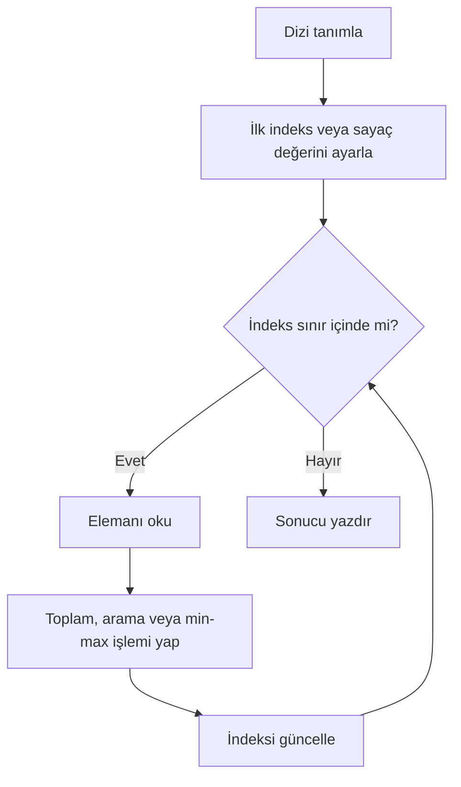

**Diyagram 9.1:** Tek boyutlu dizi dolaşma ve işlem yapma akışı.

**Görsel üretim notu:** Bu Mermaid diyagramı final DOCX/PDF üretiminden önce PNG’ye dönüştürülmeli; ham `flowchart TD` kodu final çıktıda görünmemelidir. Önerilen görsel genişliği 12–13 cm aralığında tutulmalıdır.

## 9.21 Adım adım kod örnekleri

Bu bölümde tek boyutlu ve iki boyutlu diziler temel işlem örnekleriyle gösterilecektir.

### Kod 9.1: Tek boyutlu dizi ve indeks erişimi

**Kod kimliği:** `b09_kod01_tek_boyutlu_dizi_ve_indeks_erisimi`

**Kod erişimi:** [Kod sayfası](https://github.com/bmdersleri/javaninTemelleri/tree/main/kodlar/bolum09/kod01/) | [Kaynak kod](https://github.com/bmdersleri/javaninTemelleri/blob/main/kodlar/bolum09/kod01/Bolum09Ornek01TekBoyutluDizi.java) | 

**QR erişimi:** Kod sayfası ve kaynak kod için aşağıdaki iki QR kod kullanılabilir.

{width=2.8cm} {width=2.8cm}


```java
// Dosya: Bolum09Ornek01TekBoyutluDizi.java
public class Bolum09Ornek01TekBoyutluDizi {
    public static void main(String[] args) {
        int[] notlar = {80, 75, 90, 60};

        System.out.println("İlk not: " + notlar[0]);
        System.out.println("Son not: " + notlar[notlar.length - 1]);
        System.out.println("Eleman sayısı: " + notlar.length);
    }
}
```

**Kodun amacı:** Dizi tanımlama, indeks erişimi ve `length` kullanımını göstermek.

**Beklenen çıktı:**

```text
İlk not: 80
Son not: 60
Eleman sayısı: 4
```

**Dikkat noktası:** Son elemana erişmek için `notlar.length - 1` kullanılmıştır.

### Kod 9.2: Dizide toplam, ortalama ve min–max

**Kod kimliği:** `b09_kod02_dizide_toplam_ortalama_ve_minmax`

**Kod erişimi:** [Kod sayfası](https://github.com/bmdersleri/javaninTemelleri/tree/main/kodlar/bolum09/kod02/) | [Kaynak kod](https://github.com/bmdersleri/javaninTemelleri/blob/main/kodlar/bolum09/kod02/Bolum09Ornek02DiziAnalizi.java) | 

**QR erişimi:** Kod sayfası ve kaynak kod için aşağıdaki iki QR kod kullanılabilir.

{width=2.8cm} {width=2.8cm}


```java
// Dosya: Bolum09Ornek02DiziAnalizi.java
public class Bolum09Ornek02DiziAnalizi {
    public static void main(String[] args) {
        int[] notlar = {80, 75, 90, 60};

        int toplam = 0;
        int enKucuk = notlar[0];
        int enBuyuk = notlar[0];

        for (int i = 0; i < notlar.length; i++) {
            toplam += notlar[i];

            if (notlar[i] < enKucuk) {
                enKucuk = notlar[i];
            }

            if (notlar[i] > enBuyuk) {
                enBuyuk = notlar[i];
            }
        }

        double ortalama = toplam / (double) notlar.length;

        System.out.println("Toplam: " + toplam);
        System.out.println("Ortalama: " + ortalama);
        System.out.println("En küçük: " + enKucuk);
        System.out.println("En büyük: " + enBuyuk);
    }
}
```

**Kodun amacı:** Bir dizide toplam, ortalama, en küçük ve en büyük değeri bulmak.

**Beklenen çıktı:**

```text
Toplam: 305
Ortalama: 76.25
En küçük: 60
En büyük: 90
```

**Dikkat noktası:** `enKucuk` ve `enBuyuk` değişkenleri dizinin ilk elemanı ile başlatılmıştır.

### Kod 9.3: Dizide arama

**Kod kimliği:** `b09_kod03_dizide_arama`

**Kod erişimi:** [Kod sayfası](https://github.com/bmdersleri/javaninTemelleri/tree/main/kodlar/bolum09/kod03/) | [Kaynak kod](https://github.com/bmdersleri/javaninTemelleri/blob/main/kodlar/bolum09/kod03/Bolum09Ornek03DizideArama.java) | 

**QR erişimi:** Kod sayfası ve kaynak kod için aşağıdaki iki QR kod kullanılabilir.

{width=2.8cm} {width=2.8cm}


```java
// Dosya: Bolum09Ornek03DizideArama.java
public class Bolum09Ornek03DizideArama {
    public static void main(String[] args) {
        int[] notlar = {80, 75, 90, 60};
        int aranan = 75;
        boolean bulundu = false;
        int bulunanIndeks = -1;

        for (int i = 0; i < notlar.length; i++) {
            if (notlar[i] == aranan) {
                bulundu = true;
                bulunanIndeks = i;
                break;
            }
        }

        if (bulundu) {
            System.out.println("Değer bulundu. İndeks: " + bulunanIndeks);
        } else {
            System.out.println("Değer bulunamadı.");
        }
    }
}
```

**Kodun amacı:** Dizi içinde belirli bir değerin aranmasını göstermek.

**Beklenen çıktı:**

```text
Değer bulundu. İndeks: 1
```

**Dikkat noktası:** `bulunanIndeks` başlangıçta `-1` yapılmıştır. Bu değer, geçerli bir dizi indeksi değildir ve bulunamadı durumunu temsil etmek için kullanılabilir.

### Kod 9.4: Dizi işlemlerini metotlara ayırma

**Kod kimliği:** `b09_kod04_dizi_islemlerini_metotlara_ayirma`

**Kod erişimi:** [Kod sayfası](https://github.com/bmdersleri/javaninTemelleri/tree/main/kodlar/bolum09/kod04/) | [Kaynak kod](https://github.com/bmdersleri/javaninTemelleri/blob/main/kodlar/bolum09/kod04/Bolum09Ornek04DiziMetotlari.java) | 

**QR erişimi:** Kod sayfası ve kaynak kod için aşağıdaki iki QR kod kullanılabilir.

{width=2.8cm} {width=2.8cm}


```java
// Dosya: Bolum09Ornek04DiziMetotlari.java
public class Bolum09Ornek04DiziMetotlari {
    public static void main(String[] args) {
        int[] notlar = {80, 75, 90, 60};

        System.out.println("Toplam: " + toplamHesapla(notlar));
        System.out.println("Ortalama: " + ortalamaHesapla(notlar));
        System.out.println("En büyük: " + enBuyukBul(notlar));
    }

    static int toplamHesapla(int[] dizi) {
        int toplam = 0;

        for (int i = 0; i < dizi.length; i++) {
            toplam += dizi[i];
        }

        return toplam;
    }

    static double ortalamaHesapla(int[] dizi) {
        return toplamHesapla(dizi) / (double) dizi.length;
    }

    static int enBuyukBul(int[] dizi) {
        int enBuyuk = dizi[0];

        for (int i = 1; i < dizi.length; i++) {
            if (dizi[i] > enBuyuk) {
                enBuyuk = dizi[i];
            }
        }

        return enBuyuk;
    }
}
```

**Kodun amacı:** Dizi işlemlerini yardımcı metotlara taşımak.

**Beklenen çıktı:**

```text
Toplam: 305
Ortalama: 76.25
En büyük: 90
```

**Dikkat noktası:** Bu örnekte dizi boş değildir. Boş dizi kontrolü bu bölümün kapsamı dışında tutulmuştur.

### Kod 9.5: İki boyutlu diziyi yazdırma

**Kod kimliği:** `b09_kod05_iki_boyutlu_diziyi_yazdirma`

**Kod erişimi:** [Kod sayfası](https://github.com/bmdersleri/javaninTemelleri/tree/main/kodlar/bolum09/kod05/) | [Kaynak kod](https://github.com/bmdersleri/javaninTemelleri/blob/main/kodlar/bolum09/kod05/Bolum09Ornek05IkiBoyutluDizi.java) | 

**QR erişimi:** Kod sayfası ve kaynak kod için aşağıdaki iki QR kod kullanılabilir.

{width=2.8cm} {width=2.8cm}


```java
// Dosya: Bolum09Ornek05IkiBoyutluDizi.java
public class Bolum09Ornek05IkiBoyutluDizi {
    public static void main(String[] args) {
        int[][] notlar = {
            {80, 75, 90},
            {60, 70, 65},
            {95, 85, 88}
        };

        for (int satir = 0; satir < notlar.length; satir++) {
            for (int sutun = 0; sutun < notlar[satir].length; sutun++) {
                System.out.printf("%4d", notlar[satir][sutun]);
            }

            System.out.println();
        }
    }
}
```

**Kodun amacı:** İki boyutlu diziyi satır-sütun biçiminde yazdırmak.

**Beklenen çıktı:**

```text
  80  75  90
  60  70  65
  95  85  88
```

**Dikkat noktası:** Dış döngü satırları, iç döngü sütunları dolaşır.

### Kod 9.6: İki boyutlu dizide satır ve sütun işlemleri

**Kod kimliği:** `b09_kod06_iki_boyutlu_dizide_satir_ve_sutun_islemleri`

**Kod erişimi:** [Kod sayfası](https://github.com/bmdersleri/javaninTemelleri/tree/main/kodlar/bolum09/kod06/) | [Kaynak kod](https://github.com/bmdersleri/javaninTemelleri/blob/main/kodlar/bolum09/kod06/Bolum09Ornek06IkiBoyutluAnaliz.java) | 

**QR erişimi:** Kod sayfası ve kaynak kod için aşağıdaki iki QR kod kullanılabilir.

{width=2.8cm} {width=2.8cm}


```java
// Dosya: Bolum09Ornek06IkiBoyutluAnaliz.java
public class Bolum09Ornek06IkiBoyutluAnaliz {
    public static void main(String[] args) {
        int[][] notlar = {
            {80, 75, 90},
            {60, 70, 65},
            {95, 85, 88}
        };

        int genelToplam = 0;
        int adet = 0;

        for (int satir = 0; satir < notlar.length; satir++) {
            int satirToplam = 0;

            for (int sutun = 0; sutun < notlar[satir].length; sutun++) {
                satirToplam += notlar[satir][sutun];
                genelToplam += notlar[satir][sutun];
                adet++;
            }

            double satirOrtalama =
                    satirToplam / (double) notlar[satir].length;

            System.out.println((satir + 1)
                    + ". öğrenci ortalaması: " + satirOrtalama);
        }

        double genelOrtalama = genelToplam / (double) adet;

        System.out.println("Genel toplam: " + genelToplam);
        System.out.println("Genel ortalama: " + genelOrtalama);
    }
}
```

**Kodun amacı:** İki boyutlu dizide satır ortalaması ve genel ortalama hesaplamak.

**Beklenen çıktı:**

```text
1. öğrenci ortalaması: 81.66666666666667
2. öğrenci ortalaması: 65.0
3. öğrenci ortalaması: 89.33333333333333
Genel toplam: 708
Genel ortalama: 78.66666666666667
```

**Dikkat noktası:** Satır ortalaması ilgili satırın uzunluğuna, genel ortalama ise toplam eleman sayısına bölünmüştür.

### Kod 9.7: Hatalı ve düzeltilmiş örnek

Aşağıdaki kodda indeks sınırı hatası vardır.

**Kod kimliği:** `b09_kod07_hatali_ve_duzeltilmis_ornek`

**Kod erişimi:** [Kod sayfası](https://github.com/bmdersleri/javaninTemelleri/tree/main/kodlar/bolum09/kod07/) | [Kaynak kod](https://github.com/bmdersleri/javaninTemelleri/blob/main/kodlar/bolum09/kod07/Bolum09Ornek07HataDuzeltme.java) | 

**QR erişimi:** Kod sayfası ve kaynak kod için aşağıdaki iki QR kod kullanılabilir.

{width=2.8cm} {width=2.8cm}


```java
// Dosya: Bolum09Ornek07HataDuzeltme.java
public class Bolum09Ornek07HataDuzeltme {
    public static void main(String[] args) {
        int[] notlar = {80, 75, 90};

        for (int i = 0; i <= notlar.length; i++) {
            System.out.println(notlar[i]);
        }
    }
}
```

Bu kodda `i <= notlar.length` koşulu hatalıdır. Dizi uzunluğu 3 ise son geçerli indeks 2’dir. Ancak döngü `i = 3` olduğunda da çalışmaya çalışır.

Düzeltilmiş kod:

**Kod kimliği:** `b09_kod07_hatali_ve_duzeltilmis_ornek_2`

**Kod erişimi:** [Kod sayfası](https://github.com/bmdersleri/javaninTemelleri/tree/main/kodlar/bolum09/kod07_2/) | [Kaynak kod](https://github.com/bmdersleri/javaninTemelleri/blob/main/kodlar/bolum09/kod07_2/Bolum09Ornek07HataDuzeltme.java) | 

**QR erişimi:** Kod sayfası ve kaynak kod için aşağıdaki iki QR kod kullanılabilir.

{width=2.8cm} {width=2.8cm}


```java
// Dosya: Bolum09Ornek07HataDuzeltme.java
public class Bolum09Ornek07HataDuzeltme {
    public static void main(String[] args) {
        int[] notlar = {80, 75, 90};

        for (int i = 0; i < notlar.length; i++) {
            System.out.println(notlar[i]);
        }
    }
}
```

**Beklenen çıktı:**

```text
80
75
90
```

**Dikkat noktası:** Dizi dolaşırken koşul genellikle `i < dizi.length` olmalıdır.

## 9.22 Kodun çalışma mantığı ve iz sürme

Dizi işlemlerini anlamak için indeks ve değerleri birlikte izlemek gerekir.

Örnek:

```java
int[] notlar = {80, 75, 90};
int toplam = 0;

for (int i = 0; i < notlar.length; i++) {
    toplam += notlar[i];
}
```

İz sürme tablosu:

| Tur | `i` | `notlar[i]` | `toplam` önce | `toplam` sonra |
|---:|---:|---:|---:|---:|
| 1 | 0 | 80 | 0 | 80 |
| 2 | 1 | 75 | 80 | 155 |
| 3 | 2 | 90 | 155 | 245 |

Bu tablo, dizideki her elemanın sırayla toplama eklendiğini gösterir.

İki boyutlu dizilerde iz sürme satır ve sütun indeksleriyle yapılır.

| Satır | Sütun | Değer |
|---:|---:|---:|
| 0 | 0 | 80 |
| 0 | 1 | 75 |
| 0 | 2 | 90 |
| 1 | 0 | 60 |
| 1 | 1 | 70 |
| 1 | 2 | 65 |

> **💡 İpucu:** Dizi hatalarında önce indeks aralığını kontrol edin. Çoğu başlangıç hatası dizinin son indeksini yanlış hesaplamaktan kaynaklanır.

## 9.23 Uçtan uca mini uygulama: Öğrenci-Ders Not Analizi

Bu bölümün mini uygulaması, tek boyutlu ve iki boyutlu dizileri birlikte kullanır.

**Uygulama adı:** Öğrenci-Ders Not Analizi

**Dosya adı:** `OgrenciDersNotAnalizi.java`

**Amaç:** Öğrencilerin farklı derslerden aldığı notları iki boyutlu dizide saklamak; öğrenci ortalaması, ders ortalaması, genel ortalama, en yüksek not ve en düşük not bilgilerini hesaplamak.

**Kod kimliği:** `b09_kod37_ogrenci_ders_not_analizi`

**Kod erişimi:** [Kod sayfası](https://github.com/bmdersleri/javaninTemelleri/tree/main/kodlar/bolum09/kod37/) | [Kaynak kod](https://github.com/bmdersleri/javaninTemelleri/blob/main/kodlar/bolum09/kod37/OgrenciDersNotAnalizi.java) | 

**QR erişimi:** Kod sayfası ve kaynak kod için aşağıdaki iki QR kod kullanılabilir.

{width=2.8cm} {width=2.8cm}


```java
// Dosya: OgrenciDersNotAnalizi.java
public class OgrenciDersNotAnalizi {
    public static void main(String[] args) {
        String[] ogrenciler = {"Ayşe", "Mehmet", "Zeynep"};
        String[] dersler = {"Java", "Matematik", "Algoritma"};

        int[][] notlar = {
            {80, 75, 90},
            {60, 70, 65},
            {95, 85, 88}
        };

        tabloYazdir(ogrenciler, dersler, notlar);

        System.out.println();
        System.out.println("=== Öğrenci Ortalamaları ===");

        for (int satir = 0; satir < notlar.length; satir++) {
            double ortalama = satirOrtalamaHesapla(notlar, satir);
            System.out.println(ogrenciler[satir] + ": " + ortalama);
        }

        System.out.println();
        System.out.println("=== Ders Ortalamaları ===");

        for (int sutun = 0; sutun < dersler.length; sutun++) {
            double ortalama = sutunOrtalamaHesapla(notlar, sutun);
            System.out.println(dersler[sutun] + ": " + ortalama);
        }

        System.out.println();
        System.out.println("Genel ortalama: " + genelOrtalamaHesapla(notlar));
        System.out.println("En yüksek not: " + enYuksekNotBul(notlar));
        System.out.println("En düşük not: " + enDusukNotBul(notlar));
    }

    static void tabloYazdir(String[] ogrenciler,
                            String[] dersler,
                            int[][] notlar) {
        System.out.printf("%-12s", "Öğrenci");

        for (int i = 0; i < dersler.length; i++) {
            System.out.printf("%12s", dersler[i]);
        }

        System.out.println();

        for (int satir = 0; satir < notlar.length; satir++) {
            System.out.printf("%-12s", ogrenciler[satir]);

            for (int sutun = 0; sutun < notlar[satir].length; sutun++) {
                System.out.printf("%12d", notlar[satir][sutun]);
            }

            System.out.println();
        }
    }

    static double satirOrtalamaHesapla(int[][] notlar, int satir) {
        int toplam = 0;

        for (int sutun = 0; sutun < notlar[satir].length; sutun++) {
            toplam += notlar[satir][sutun];
        }

        return toplam / (double) notlar[satir].length;
    }

    static double sutunOrtalamaHesapla(int[][] notlar, int sutun) {
        int toplam = 0;

        for (int satir = 0; satir < notlar.length; satir++) {
            toplam += notlar[satir][sutun];
        }

        return toplam / (double) notlar.length;
    }

    static double genelOrtalamaHesapla(int[][] notlar) {
        int toplam = 0;
        int adet = 0;

        for (int satir = 0; satir < notlar.length; satir++) {
            for (int sutun = 0; sutun < notlar[satir].length; sutun++) {
                toplam += notlar[satir][sutun];
                adet++;
            }
        }

        return toplam / (double) adet;
    }

    static int enYuksekNotBul(int[][] notlar) {
        int enYuksek = notlar[0][0];

        for (int satir = 0; satir < notlar.length; satir++) {
            for (int sutun = 0; sutun < notlar[satir].length; sutun++) {
                if (notlar[satir][sutun] > enYuksek) {
                    enYuksek = notlar[satir][sutun];
                }
            }
        }

        return enYuksek;
    }

    static int enDusukNotBul(int[][] notlar) {
        int enDusuk = notlar[0][0];

        for (int satir = 0; satir < notlar.length; satir++) {
            for (int sutun = 0; sutun < notlar[satir].length; sutun++) {
                if (notlar[satir][sutun] < enDusuk) {
                    enDusuk = notlar[satir][sutun];
                }
            }
        }

        return enDusuk;
    }
}
```

**Beklenen çıktı:**

```text
Öğrenci             Java   Matematik   Algoritma
Ayşe                  80          75          90
Mehmet                60          70          65
Zeynep                95          85          88

=== Öğrenci Ortalamaları ===
Ayşe: 81.66666666666667
Mehmet: 65.0
Zeynep: 89.33333333333333

=== Ders Ortalamaları ===
Java: 78.33333333333333
Matematik: 76.66666666666667
Algoritma: 81.0

Genel ortalama: 78.66666666666667
En yüksek not: 95
En düşük not: 60
```

### 9.23.1 Mini uygulamanın kavram eşleştirmesi

| Kullanılan yapı | Uygulamadaki rolü |
|---|---|
| `String[]` | Öğrenci ve ders adlarını saklar |
| `int[][]` | Öğrenci-ders not çizelgesini saklar |
| İndeks | Öğrenci ve ders değerlerine erişir |
| `length` | Dizi sınırlarını güvenli dolaşır |
| İç içe döngü | Tabloyu ve tüm notları dolaşır |
| Metot | Analiz işlemlerini parçalara ayırır |
| Biriktirici | Toplam hesaplar |
| Min–max | En yüksek ve en düşük notu bulur |
| `printf` | Tablo çıktısını hizalar |

### 9.23.2 Mini uygulama test senaryoları

| Test | Değişiklik | Beklenen kontrol |
|---:|---|---|
| 1 | Varsayılan not tablosu | Genel ortalama `78.666...` |
| 2 | Ayşe’nin Java notu `100` yapılır | En yüksek not değişir |
| 3 | Mehmet’in Java notu `40` yapılır | En düşük not değişir |
| 4 | Bir ders notu `0` yapılır | Ortalama düşer |
| 5 | Tüm notlar aynı yapılır | Min, max ve ortalama aynı olur |
| 6 | Yeni öğrenci satırı eklenir | Öğrenci ortalamaları yeniden hesaplanır |
| 7 | Yeni ders sütunu eklenir | Ders adları ve not satırları uyumlu olmalıdır |

> **Alıştırma Molası:** Mini uygulamaya “en yüksek notun hangi öğrenci ve hangi derse ait olduğunu bulma” özelliği eklemek için hangi indeks bilgilerine ihtiyaç duyacağınızı açıklayınız. Bu özelliği yazmak için yeni konuya gerek yoktur; satır ve sütun indeksleri yeterlidir.

## 9.24 Sık yapılan hatalar ve yanlış sezgiler

Diziler başlangıçta kolay görünse de indeks mantığı nedeniyle sık hata yapılır.

### 9.24.1 İndeksi 1’den başlatmak

Yanlış düşünce:

```text
İlk eleman her zaman dizi[1] ile alınır.
```

Düzeltme:

Java’da ilk eleman `dizi[0]` ile alınır.

### 9.24.2 Döngü koşulunda `<= length` kullanmak

Yanlış kullanım:

```java
for (int i = 0; i <= notlar.length; i++) {
    System.out.println(notlar[i]);
}
```

Düzeltme:

```java
for (int i = 0; i < notlar.length; i++) {
    System.out.println(notlar[i]);
}
```

### 9.24.3 Min–max başlangıcını yanlış seçmek

Yanlış yaklaşım:

```java
int enKucuk = 0;
```

Eğer tüm notlar pozitifse bu değer gerçek minimumdan küçük olabilir ve sonuç yanlış çıkar. Daha güvenli başlangıç:

```java
int enKucuk = notlar[0];
```

### 9.24.4 Ortalama hesabında tam sayı bölmesi yapmak

Yanlış kullanım:

```java
double ortalama = toplam / notlar.length;
```

Düzeltme:

```java
double ortalama = toplam / (double) notlar.length;
```

### 9.24.5 İki boyutlu dizide satır ve sütunu karıştırmak

Yanlış kullanım:

```java
System.out.println(notlar[sutun][satir]);
```

Düzeltme:

```java
System.out.println(notlar[satir][sutun]);
```

Satır ve sütun rollerinin problem bağlamında net tanımlanması gerekir.

### 9.24.6 Sütun sayısını yanlış varsaymak

Yanlış kullanım:

```java
for (int sutun = 0; sutun < notlar.length; sutun++) {
    System.out.println(notlar[0][sutun]);
}
```

Düzeltme:

```java
for (int sutun = 0; sutun < notlar[0].length; sutun++) {
    System.out.println(notlar[0][sutun]);
}
```

Sütun sayısı için ilgili satırın `length` değeri kullanılmalıdır.

## 9.25 Hata ayıklama egzersizi

Aşağıdaki kodun `DiziHatasi.java` adlı dosyaya kaydedildiğini düşünelim.

**Kod kimliği:** `b09_kod48_hata_ayiklama_egzersizi`

**Kod erişimi:** [Kod sayfası](https://github.com/bmdersleri/javaninTemelleri/tree/main/kodlar/bolum09/kod48/) | [Kaynak kod](https://github.com/bmdersleri/javaninTemelleri/blob/main/kodlar/bolum09/kod48/DiziHatasi.java) | 

**QR erişimi:** Kod sayfası ve kaynak kod için aşağıdaki iki QR kod kullanılabilir.

{width=2.8cm} {width=2.8cm}


```java
// Dosya: DiziHatasi.java
public class DiziHatasi {
    public static void main(String[] args) {
        int[] notlar = {80, 75, 90};

        int toplam = 0;

        for (int i = 1; i <= notlar.length; i++) {
            toplam += notlar[i];
        }

        double ortalama = toplam / notlar.length;

        System.out.println("Ortalama: " + ortalama);

        int[][] tablo = {
            {1, 2, 3},
            {4, 5, 6}
        };

        for (int satir = 0; satir < tablo.length; satir++) {
            for (int sutun = 0; sutun < tablo.length; sutun++) {
                System.out.print(tablo[satir][sutun] + " ");
            }

            System.out.println();
        }
    }
}
```

Bu kodda üç önemli hata vardır:

1. Tek boyutlu dizi döngüsü `i = 1` ile başlamıştır; ilk eleman atlanır.
2. Döngü koşulu `i <= notlar.length` olduğu için son turda geçersiz indekse erişilir.
3. Ortalama hesabında tam sayı bölmesi yapılmaktadır.
4. İki boyutlu dizide iç döngü sütun sayısı yerine satır sayısını kullanmaktadır.

Düzeltilmiş kod:

**Kod kimliği:** `b09_kod49_hata_ayiklama_egzersizi`

**Kod erişimi:** [Kod sayfası](https://github.com/bmdersleri/javaninTemelleri/tree/main/kodlar/bolum09/kod49/) | [Kaynak kod](https://github.com/bmdersleri/javaninTemelleri/blob/main/kodlar/bolum09/kod49/DiziHatasi.java) | 

**QR erişimi:** Kod sayfası ve kaynak kod için aşağıdaki iki QR kod kullanılabilir.

{width=2.8cm} {width=2.8cm}


```java
// Dosya: DiziHatasi.java
public class DiziHatasi {
    public static void main(String[] args) {
        int[] notlar = {80, 75, 90};

        int toplam = 0;

        for (int i = 0; i < notlar.length; i++) {
            toplam += notlar[i];
        }

        double ortalama = toplam / (double) notlar.length;

        System.out.println("Ortalama: " + ortalama);

        int[][] tablo = {
            {1, 2, 3},
            {4, 5, 6}
        };

        for (int satir = 0; satir < tablo.length; satir++) {
            for (int sutun = 0; sutun < tablo[satir].length; sutun++) {
                System.out.print(tablo[satir][sutun] + " ");
            }

            System.out.println();
        }
    }
}
```

**Beklenen çıktı:**

```text
Ortalama: 81.66666666666667
1 2 3
4 5 6
```

**Kendinize sorunuz:**

1. Tek boyutlu dizide ilk geçerli indeks kaçtır?
2. `i <= notlar.length` neden hatalıdır?
3. Ortalama hesabında neden `(double)` dönüşümü kullanılmıştır?
4. İki boyutlu dizide sütun sayısı neden `tablo[satir].length` ile alınmalıdır?
5. Bu hatalar derleme hatası mı, çalışma zamanı hatası mı, mantık hatası mı üretir?

> **Laboratuvar İpucu:** Dizi hatalarını incelerken önce indeks başlangıcını, sonra döngü sınırını, sonra `length` kullanımını kontrol edin.

## 9.26 Bölümün sonraki bölümlerle ilişkisi

Bu bölümde tek boyutlu ve iki boyutlu dizilerle çoklu veri saklama ve işleme becerisi kazanıldı. Artık öğrenci aynı türden çok sayıda değeri tek yapı altında tutabilir, döngülerle işleyebilir, metotlara aktarabilir ve temel analiz işlemleri yapabilir.

Bir sonraki bölümde `String` işlemleri ve metin problemleri ele alınacaktır. `String` yapısı teknik olarak dizi değildir; ancak metinler üzerinde karakter, parça, indeks ve dolaşma mantığı kullanılır. Bu nedenle bu bölümdeki indeks ve döngü bilgisi metin işlemlerinde de işe yarayacaktır.

Ayrıca ilerleyen koleksiyonlar bölümünde `ArrayList`, `HashSet` ve `HashMap` gibi daha esnek veri yapıları ele alınacaktır. Diziler bu yapılara geçiş için temel oluşturur.

## 9.27 Bölüm özeti

Bu bölümde tek boyutlu ve iki boyutlu diziler ele alındı. Tek boyutlu dizilerin aynı türden çok sayıda değeri tek isim altında saklamak için kullanıldığı açıklandı. Dizi elemanlarına indeks ile erişildiği ve Java’da indekslerin 0’dan başladığı vurgulandı.

`length` özelliği ile dizinin eleman sayısının öğrenilebileceği ve döngülerde güvenli dolaşım için `i < dizi.length` koşulunun kullanılması gerektiği gösterildi. Toplam, ortalama, arama, en küçük ve en büyük değer bulma işlemleri tek boyutlu diziler üzerinde uygulandı.

Dizi işlemlerinin metotlara ayrılabileceği gösterildi. Böylece toplam hesaplama, ortalama alma ve en büyük değeri bulma gibi işlemler daha düzenli ve yeniden kullanılabilir hâle getirildi.

Bölümün ikinci kısmında iki boyutlu diziler ele alındı. İki boyutlu dizilerin satır ve sütun mantığıyla tablo biçimli verileri temsil ettiği açıklandı. Elemanlara `dizi[satir][sutun]` biçiminde erişildiği ve iç içe döngülerle tüm elemanların dolaşılabileceği gösterildi.

Satır toplamı, sütun ortalaması, genel toplam ve genel ortalama hesaplama örnekleri verildi. Öğrenci-Ders Not Analizi mini uygulamasıyla tek boyutlu `String` dizileri ve iki boyutlu `int` dizisi birlikte kullanıldı.

## 9.28 Terim sözlüğü

| Terim | Açıklama |
|---|---|
| Dizi | Aynı türden birden fazla değeri tek isim altında saklayan yapı |
| Tek boyutlu dizi | Liste biçimli veri saklayan dizi |
| İki boyutlu dizi | Satır ve sütun yapısındaki verileri saklayan dizi |
| İndeks | Dizi elemanının konumunu gösteren sayı |
| `length` | Dizinin eleman sayısını veren özellik |
| Eleman | Dizide saklanan tekil değer |
| Dizi dolaşma | Dizi elemanlarına döngüyle sırayla erişme |
| Toplam | Dizi değerlerinin biriktirilmesiyle elde edilen sonuç |
| Ortalama | Toplamın eleman sayısına bölünmesi |
| Min–max | En küçük ve en büyük değeri bulma işlemi |
| Arama | Dizide belirli bir değeri bulma işlemi |
| Bayrak değişken | Arama gibi işlemlerde durum tutan `boolean` değişken |
| Satır | İki boyutlu dizide yatay veri grubu |
| Sütun | İki boyutlu dizide dikey veri grubu |
| İç içe döngü | Bir döngünün içinde başka bir döngü kullanılması |
| `ArrayIndexOutOfBoundsException` | Geçersiz dizi indeksine erişildiğinde oluşan hata |

## 9.29 Kendini değerlendirme soruları

### 9.29.1 Çoktan seçmeli sorular

1. Java’da ilk dizi elemanının indeksi kaçtır?

A) `0`  
B) `1`  
C) `-1`  
D) `length`  
E) `2`  

2. Bir dizinin eleman sayısını öğrenmek için hangi özellik kullanılır?

A) `length`  
B) `size()`  
C) `count`  
D) `index`  
E) `number`  

3. Üç elemanlı bir dizide son geçerli indeks kaçtır?

A) `2`  
B) `3`  
C) `1`  
D) `0`  
E) `length`  

4. Aşağıdaki döngülerden hangisi diziyi güvenli dolaşmak için uygundur?

A) `for (int i = 0; i < dizi.length; i++)`  
B) `for (int i = 1; i <= dizi.length; i++)`  
C) `for (int i = 0; i <= dizi.length; i++)`  
D) `for (int i = dizi.length; i > 0; i++)`  
E) `for (int i = 1; i < 0; i++)`  

5. İki boyutlu dizide bir elemana erişmek için hangi biçim kullanılır?

A) `dizi[satir][sutun]`  
B) `dizi(satir, sutun)`  
C) `dizi.satir.sutun`  
D) `dizi{satir}{sutun}`  
E) `dizi->satir`  

6. `ArrayIndexOutOfBoundsException` hangi durumda oluşabilir?

A) Geçersiz dizi indeksine erişildiğinde  
B) `println` kullanıldığında  
C) Dizi tanımlandığında  
D) `main` metodu yazıldığında  
E) Yorum satırı kullanıldığında  

7. Dizide değer ararken aranan değer bulununca gereksiz tekrarları bitirmek için hangi ifade kullanılabilir?

A) `break`  
B) `continue`  
C) `import`  
D) `class`  
E) `final`  

8. İki boyutlu diziyi tüm elemanlarıyla dolaşmak için genellikle hangi yapı kullanılır?

A) İç içe döngü  
B) Tek `println`  
C) Yalnızca `if`  
D) Sadece `switch`  
E) `return` olmadan metot  

### 9.29.2 Doğru/Yanlış soruları

1. Java’da dizi indeksleri 0’dan başlar. (D/Y)
2. Dizi uzunluğu `length` ile öğrenilebilir. (D/Y)
3. Son geçerli indeks her zaman `length` değerine eşittir. (D/Y)
4. `i < dizi.length` koşulu diziyi güvenli dolaşmak için yaygın kullanılır. (D/Y)
5. Tek boyutlu diziler satır-sütun verisi için en doğal yapıdır. (D/Y)
6. İki boyutlu diziler tablo biçimli verileri temsil edebilir. (D/Y)
7. İç içe döngüler iki boyutlu dizilerde kullanılabilir. (D/Y)
8. Ortalama hesabında tam sayı bölmesi hatası oluşabilir. (D/Y)
9. Dizi işlemleri metotlara ayrılabilir. (D/Y)
10. `ArrayList` bu bölümün temel konusu olarak ele alınmıştır. (D/Y)

### 9.29.3 Açık uçlu kavramsal sorular

1. Dizi kavramını kendi cümlelerinizle açıklayınız.
2. Tek boyutlu diziler hangi tür problemlerde kullanılır?
3. Java’da indekslerin 0’dan başlaması ne anlama gelir?
4. `length` özelliği döngülerde neden önemlidir?
5. Dizide toplam ve ortalama hesaplama adımlarını açıklayınız.
6. Min–max bulmada başlangıç değeri neden önemlidir?
7. Dizide arama yaparken bayrak değişken nasıl kullanılır?
8. İki boyutlu diziler hangi tür verileri temsil etmek için uygundur?
9. Satır ve sütun indekslerini örnekle açıklayınız.
10. İki boyutlu dizide genel ortalama hesaplamak için hangi adımlar gerekir?

### 9.29.4 Yanlış gerekçeyi bulma soruları

Aşağıdaki ifadelerdeki yanlış gerekçeyi bulunuz ve düzeltiniz.

1. “Java’da ilk dizi elemanı `dizi[1]` ile alınır.”
2. “Dizi uzunluğu 5 ise son geçerli indeks 5’tir.”
3. “Diziyi dolaşırken `i <= dizi.length` güvenli bir koşuldur.”
4. “Ortalama hesaplarken tam sayı bölmesi hiçbir zaman sorun oluşturmaz.”
5. “Min–max için başlangıç değeri rastgele seçilebilir.”
6. “İki boyutlu dizide satır ve sütun sırası önemsizdir.”
7. “Sütun sayısını her zaman `dizi.length` verir.”
8. “Diziler metotlara parametre olarak gönderilemez.”
9. “Arama yaparken değer bulunsa bile döngüyü sürdürmek zorunludur.”
10. “`ArrayIndexOutOfBoundsException` derleme hatasıdır.”

## 9.30 Programlama alıştırmaları

### 9.30.1 Kolay düzey

1. `NotDizisi.java` adlı bir program yazınız. Beş nottan oluşan bir `int` dizisi tanımlayınız ve tüm elemanları yazdırınız.
2. `DiziToplam.java` adlı bir program yazınız. Bir dizideki sayıların toplamını hesaplayınız.
3. `DiziOrtalama.java` adlı bir program yazınız. Bir dizideki sayıların ortalamasını hesaplayınız.
4. `EnBuyukNot.java` adlı bir program yazınız. Bir dizideki en büyük değeri bulunuz.
5. `DizideArama.java` adlı bir program yazınız. Belirli bir notun dizide olup olmadığını kontrol ediniz.

### 9.30.2 Orta düzey

1. `NotAnalizi.java` adlı bir program yazınız. Not dizisinde toplam, ortalama, en küçük ve en büyük değeri hesaplayınız.
2. `DiziMetotlari.java` adlı bir program yazınız. Toplam, ortalama ve en büyük bulma işlemlerini metotlara ayırınız.
3. `HaftalikSicaklik.java` adlı bir program yazınız. Yedi günlük sıcaklık değerleriyle ortalama sıcaklığı hesaplayınız.
4. `IkiBoyutluTablo.java` adlı bir program yazınız. 2x3 boyutunda bir tabloyu iç içe döngüyle yazdırınız.
5. `SatirToplami.java` adlı bir program yazınız. İki boyutlu dizide her satırın toplamını hesaplayınız.

### 9.30.3 Zor düzey

1. `OgrenciDersNotAnalizi.java` uygulamasını geliştiriniz.
2. Öğrenci adlarını `String[]` dizisinde saklayınız.
3. Ders adlarını `String[]` dizisinde saklayınız.
4. Notları `int[][]` dizisinde saklayınız.
5. Her öğrencinin ortalamasını hesaplayınız.
6. Her dersin ortalamasını hesaplayınız.
7. Genel ortalama, en yüksek not ve en düşük not değerlerini bulunuz.
8. Analiz işlemlerini metotlara ayırınız.
9. En az yedi test senaryosu oluşturunuz.
10. Hatalı indeks kullanımını gösteren bir örnek yazıp düzeltiniz.

## 9.31 Haftalık laboratuvar / proje görevi

**Görev başlığı:** Öğrenci-Ders Not Analizi Laboratuvarı

**Amaç:** Bu laboratuvarın amacı, öğrencinin tek boyutlu ve iki boyutlu dizileri kullanarak tablo biçimli not verilerini saklaması, analiz etmesi ve sonuçları düzenli biçimde raporlamasıdır.

**Beklenen adımlar:**

1. `OgrenciDersNotAnalizi.java` adlı dosyayı oluşturunuz.
2. En az üç öğrenci adını `String[]` dizisinde saklayınız.
3. En az üç ders adını `String[]` dizisinde saklayınız.
4. Öğrenci-ders notlarını `int[][]` dizisinde saklayınız.
5. Not tablosunu düzenli biçimde yazdırınız.
6. Her öğrencinin ortalamasını hesaplayınız.
7. Her dersin ortalamasını hesaplayınız.
8. Genel ortalamayı hesaplayınız.
9. En yüksek ve en düşük notu bulunuz.
10. İşlemleri uygun metotlara ayırınız.
11. En az yedi test senaryosu çalıştırınız.
12. Hatalı indeks kullanımıyla ilgili bir hata ve çözüm notu hazırlayınız.
13. Kısa bir `README.md` dosyası hazırlayınız.

**Teslim edilecek dosyalar:**

1. `OgrenciDersNotAnalizi.java`
2. `README.md`
3. En az yedi test çıktısı
4. Hata ve çözüm notu

**README içeriği şu başlıkları içermelidir:**

1. Programın amacı
2. Kullanılan diziler
3. Satır ve sütun anlamları
4. Kullanılan metotlar
5. Hesaplanan analizler
6. Test senaryoları
7. Karşılaşılan hata ve çözümü

## 9.32 Değerlendirme rubriği

| Ölçüt | Açıklama | Puan |
|---|---|---:|
| Tek boyutlu dizi kullanımı | Dizi tanımlama, indeks, `length`, toplam, ortalama ve arama işlemleri | 20 |
| İki boyutlu dizi kullanımı | Satır-sütun erişimi, iç içe döngü ve tablo yazdırma | 20 |
| Analiz doğruluğu | Öğrenci ortalaması, ders ortalaması, genel ortalama, min–max işlemleri | 20 |
| Metotlara ayırma | Dizi işlemlerinin uygun yardımcı metotlarla düzenlenmesi | 15 |
| Hata farkındalığı | İndeks sınırı ve `ArrayIndexOutOfBoundsException` hatalarının açıklanması | 10 |
| Kodun çalışması | Programın derlenebilir ve çalıştırılabilir olması | 10 |
| Raporlama | README, test çıktıları ve hata çözüm notunun yeterliliği | 5 |
| **Toplam** |  | **100** |

## 9.33 İleri okuma ve kaynaklar

Bu bölümde diziler temel düzeyde ele alınmıştır. Daha ayrıntılı bilgi için aşağıdaki kaynak türleri incelenebilir:

1. **Java Language Specification:** Dizi tipleri, indeks erişimi ve çalışma zamanı hatalarının dil düzeyindeki davranışlarını incelemek için kullanılabilir.
2. **Java SE API dokümantasyonu:** Dizi nesnelerinin temel davranışları ve standart sınıflarla ilişkisini görmek için kullanılabilir.
3. **Dev.java öğrenme kaynakları:** Java’da temel dil yapıları, diziler ve döngüler için güncel öğrenme içeriği sunar.
4. **Oracle Java Tutorials:** Dizi tanımlama, eleman erişimi, dizi dolaşma ve çok boyutlu diziler konularını örneklerle tekrar etmek için yararlıdır.
5. **Ders içi ek notlar:** İndeks mantığı, `length` kullanımı, iç içe döngüler ve `ArrayIndexOutOfBoundsException` hatalarını pekiştirmek için kullanılabilir.

> **💡 İpucu:** Dizi çalışmalarında küçük veri kümeleriyle başlayın. Önce 3–4 elemanlı dizilerle doğru sonucu görün, sonra örnekleri genişletin.

## 9.34 Bir sonraki bölüme köprü

Bu bölümde tek boyutlu ve iki boyutlu dizilerle çoklu veri yönetimi öğrenildi. Dizi indeksleri, `length`, döngüyle dolaşma, toplam, ortalama, arama, min–max ve tablo analizi konuları işlendi.

Bir sonraki bölümde `String` işlemleri ve metin problemleri ele alınacaktır. Metinler üzerinde karakter, parça ve indeks mantığı kullanıldığından, bu bölümdeki dizi ve indeks bilgisi metin işlemlerini anlamayı kolaylaştıracaktır.

İlerleyen bölümlerde ise sabit uzunluklu dizilerden daha esnek veri yapıları olan koleksiyonlara geçilecek; `ArrayList`, `HashMap` ve `HashSet` gibi yapılarla veri saklama ve arama becerileri genişletilecektir.

**BÖLÜM SONU**


\newpage


# Bölüm 10: String İşlemleri ve Metin Problemleri

## 10.1 Bölümün yol haritası

Önceki bölümlerde sayılar, karar yapıları, döngüler, metotlar ve diziler üzerinde çalıştık. Ancak gerçek uygulamalarda yalnızca sayısal verilerle karşılaşılmaz. Kullanıcı adları, parolalar, ad-soyad bilgileri, e-posta adresleri, ürün adları, mesajlar, komutlar ve açıklamalar çoğunlukla metin verisidir. Java’da metin verileri `String` sınıfı ile temsil edilir.

Bu bölümde metinler üzerinde temel işlemler yapmayı öğreneceğiz. Bir metnin uzunluğunu bulma, belirli karaktere erişme, alt metin alma, metin içinde arama yapma, metinleri karşılaştırma, baştaki ve sondaki boşlukları temizleme, büyük/küçük harf dönüşümü yapma ve metni parçalara ayırma işlemleri uygulamalı olarak ele alınacaktır.

Bu bölümde şu sorulara yanıt aranacaktır:

1. `String` nedir ve Java programlarında neden önemlidir?
2. `String` ile `char` arasındaki fark nedir?
3. Bir metnin uzunluğu `length()` ile nasıl bulunur?
4. Belirli bir karaktere `charAt()` ile nasıl erişilir?
5. `substring()` ile metnin bir bölümü nasıl alınır?
6. `indexOf()` ile metin içinde arama nasıl yapılır?
7. `equals()` ve `equalsIgnoreCase()` hangi durumlarda kullanılır?
8. `==` ile `equals()` arasındaki fark neden önemlidir?
9. `trim()` metodu hangi kullanıcı girişi problemini azaltır?
10. `toLowerCase()` ve `toUpperCase()` ne işe yarar?
11. `split()` ile metin nasıl parçalara ayrılır?
12. Metin işlemleri döngü ve metotlarla nasıl birleştirilir?
13. Küçük bir Metin Analiz Aracı nasıl geliştirilir?

> **🎯 Bölüm Hedefi:** Bu bölümün sonunda öğrenci, Java’da temel `String` metotlarını kullanarak metin verilerini işleyebilecek, metin karşılaştırma ve indeks hatalarını tanıyabilecek ve küçük bir metin analiz aracı geliştirebilecektir.

Bu bölümde düzenli ifadeler, ileri metin işleme, doğal dil işleme, `StringBuilder`, karakter kodlama ayrıntıları ve performans optimizasyonları ele alınmayacaktır. `split()` metodu yalnızca temel ayırıcı örnekleriyle kullanılacaktır.

## 10.2 Bölümün konumu ve pedagojik rolü

Bu bölüm, sayısal veri işleme becerilerinden metin verisi işleme becerilerine geçiş sağlar. Önceki bölümde diziler ve çok boyutlu veri yapılarıyla çoklu veri üzerinde işlem yapma alışkanlığı kazanıldı. Bu bölümde benzer düşünme biçimi metinler üzerinde uygulanacaktır.

Metin verisiyle çalışmak birçok uygulama için zorunludur. Kullanıcıdan alınan ad, kullanıcı adı, parola, e-posta, açıklama veya komut bilgileri çoğunlukla `String` olarak gelir. Bu nedenle `String` işlemleri yalnızca sözdizimsel bir konu değil, uygulama geliştirmenin temel bileşenidir.

Bu bölümde özellikle üç alışkanlık kazandırılacaktır. Birincisi, metinleri indeks mantığıyla güvenli biçimde okumaktır. İkincisi, metinleri `==` yerine uygun `String` metotlarıyla karşılaştırmaktır. Üçüncüsü, kullanıcı girdilerini karşılaştırmadan önce temizlemek ve gerekirse standart hâle getirmektir.

> **⚠️ Dikkat:** Java’da `String` içeriklerini karşılaştırırken çoğu durumda `==` kullanılmaz. İçerik karşılaştırması için `equals()` veya uygun durumda `equalsIgnoreCase()` tercih edilmelidir.

Bu bölüm, sonraki bölümde ele alınacak standart kütüphane kullanımı için de hazırlık sağlar. Çünkü birçok uygulamada metin, sayı ve tarih-zaman bilgisi birlikte işlenir.

## 10.3 Öğrenme çıktıları

Bu bölüm tamamlandığında öğrenci:

1. `String` kavramını kendi cümleleriyle açıklayabilir.
2. `String` ve `char` kullanımını ayırt edebilir.
3. `length()` metodu ile bir metnin karakter sayısını bulabilir.
4. `charAt()` ile belirli bir indeksteki karaktere erişebilir.
5. `substring()` ile metnin belirli bir bölümünü alabilir.
6. `indexOf()` ile metin içinde arama yapabilir.
7. `equals()` ve `equalsIgnoreCase()` metotlarını doğru kullanabilir.
8. `==` ile içerik karşılaştırmanın neden hatalı olabileceğini açıklayabilir.
9. `trim()` ile baştaki ve sondaki boşlukları temizleyebilir.
10. `toLowerCase()` ve `toUpperCase()` ile metinleri dönüştürebilir.
11. `split()` ile metni parçalara ayırabilir.
12. `split()` sonucunun `String[]` olduğunu açıklayabilir.
13. Metin işlemlerini döngü ve metotlarla birleştirebilir.
14. İndeks sınırı hatalarını tanıyabilir.
15. Metin Analiz Aracı mini uygulamasını geliştirebilir.

## 10.4 Ön bilgi ve başlangıç varsayımları

Bu bölüm, öğrencinin aşağıdaki konuları temel düzeyde bildiğini varsayar:

1. Java programının temel yapısı
2. Değişkenler ve veri tipleri
3. Karar yapıları
4. Döngüler
5. Metot tanımlama ve çağırma
6. Tek boyutlu diziler
7. `Scanner` ile kullanıcıdan metin alma
8. Konsola düzenli çıktı yazdırma

Bu bölümde örnekler konsol tabanlıdır. GUI, dosya okuma, regex, NLP veya ileri metin işleme kütüphaneleri kullanılmayacaktır.

## 10.5 Ana kavramlar

| Kavram | Kısa açıklama | Bu bölümdeki rolü |
|---|---|---|
| `String` | Metin verisini temsil eden sınıf | Kullanıcı adı, mesaj, cümle |
| `char` | Tek karakteri temsil eden veri tipi | Karakter düzeyinde işlem |
| `length()` | Metnin karakter sayısını verir | Uzunluk kontrolü |
| `charAt()` | Belirli indeksteki karakteri verir | Karaktere erişim |
| `substring()` | Metnin bir bölümünü alır | Alt metin üretme |
| `indexOf()` | Aranan metnin konumunu bulur | Metin içinde arama |
| `contains()` | Aranan metnin bulunup bulunmadığını kontrol eder | Basit içerik kontrolü |
| `equals()` | İçerik eşitliği kontrol eder | Doğru karşılaştırma |
| `equalsIgnoreCase()` | Büyük/küçük harfi yok sayar | Esnek karşılaştırma |
| `trim()` | Baştaki ve sondaki boşlukları siler | Girdi temizleme |
| `toLowerCase()` | Metni küçük harfe dönüştürür | Standartlaştırma |
| `toUpperCase()` | Metni büyük harfe dönüştürür | Standartlaştırma |
| `split()` | Metni parçalara ayırır | Kelime veya alan ayrıştırma |

> **🎯 Sınav Notu:** `length()` bir `String` metodudur ve parantezle kullanılır: `metin.length()`. Dizilerde ise `length` bir özellik olarak kullanılır: `dizi.length`.

## 10.6 `String` kavramı

Java’da metin verileri `String` ile temsil edilir. Bir `String`, karakterlerden oluşan bir metindir.

```java
String ad = "Ayşe";
String mesaj = "Java öğreniyorum";
String eposta = "ogrenci@example.com";
```

Bu örneklerde `ad`, `mesaj` ve `eposta` değişkenleri metin değerleri tutar.

`String` değerleri çift tırnak içinde yazılır. Tek karakterler ise `char` türünde ve tek tırnak içinde gösterilir.

```java
String metin = "Java";
char harf = 'J';
```

`String` metin verisiyle çalışmak için birçok hazır metot sunar. Bu metotlar sayesinde metnin uzunluğu bulunabilir, belirli karaktere erişilebilir, alt metin alınabilir, arama yapılabilir veya metin parçalanabilir.

### 10.6.1 `String` neden önemlidir?

Metin verisi, kullanıcı etkileşimli programların temel parçasıdır. Kullanıcıdan alınan ad-soyad, parola, komut, açıklama veya arama ifadesi çoğunlukla `String` olarak işlenir.

Örneğin bir giriş veya kayıt programında şu işlemler gerekebilir:

1. Kullanıcı adının boş olup olmadığını kontrol etme
2. Parolanın uzunluğunu denetleme
3. Büyük/küçük harf duyarlılığını yönetme
4. Başta ve sonda gereksiz boşlukları temizleme
5. E-posta içinde `@` karakteri olup olmadığını arama
6. Virgülle ayrılmış değerleri parçalara ayırma

Bu işlemler `String` metotlarıyla yapılabilir.

> **💡 İpucu:** Kullanıcıdan alınan metinleri karşılaştırmadan önce çoğu zaman `trim()` ile temizlemek ve gerekirse `toLowerCase()` ile standartlaştırmak iyi bir alışkanlıktır.

## 10.7 Uzunluk ve karakter erişimi: `length()` ve `charAt()`

Bir metnin kaç karakterden oluştuğunu öğrenmek için `length()` metodu kullanılır.

```java
String dil = "Java";
System.out.println(dil.length());
```

Beklenen çıktı:

```text
4
```

Burada `"Java"` dört karakterden oluşur: `J`, `a`, `v`, `a`.

### 10.7.1 `charAt()` ile karaktere erişme

Belirli bir indeksteki karaktere erişmek için `charAt()` metodu kullanılır. `String` indeksleri de dizilerde olduğu gibi 0’dan başlar.

```java
String dil = "Java";

System.out.println(dil.charAt(0));
System.out.println(dil.charAt(3));
```

Beklenen çıktı:

```text
J
a
```

| İndeks | Karakter |
|---:|---|
| 0 | J |
| 1 | a |
| 2 | v |
| 3 | a |

> **⚠️ Dikkat:** `charAt(4)` bu örnek için geçersizdir. Çünkü `"Java"` metninin son geçerli indeksi 3’tür.

### 10.7.2 Son karaktere güvenli erişim

Bir metnin son karakterine erişmek için `metin.length() - 1` kullanılabilir.

```java
String metin = "Java";
char sonKarakter = metin.charAt(metin.length() - 1);

System.out.println(sonKarakter);
```

Beklenen çıktı:

```text
a
```

Ancak metin boşsa `metin.length() - 1` değeri geçersiz olur. Bu nedenle kullanıcıdan alınan metinlerde önce uzunluk kontrolü yapılmalıdır.

```java
if (metin.length() > 0) {
    System.out.println(metin.charAt(metin.length() - 1));
} else {
    System.out.println("Metin boş.");
}
```

### 10.7.3 Metni karakter karakter dolaşma

Bir metnin tüm karakterleri `for` döngüsüyle dolaşılabilir.

```java
String metin = "Java";

for (int i = 0; i < metin.length(); i++) {
    System.out.println(i + ". indeks: " + metin.charAt(i));
}
```

Beklenen çıktı:

```text
0. indeks: J
1. indeks: a
2. indeks: v
3. indeks: a
```

Bu yapı karakter sayma, sesli harf bulma veya belirli karakterleri arama gibi işlemlerin temelidir.

## 10.8 Alt metin alma ve arama: `substring()` ve `indexOf()`

Metnin belirli bir bölümünü almak için `substring()` metodu kullanılır.

```java
String metin = "Java Programlama";
String parca = metin.substring(0, 4);

System.out.println(parca);
```

Beklenen çıktı:

```text
Java
```

`substring(0, 4)` ifadesi 0. indeksten başlar, 4. indekse kadar gider; ancak 4. indeksteki karakter sonuca dahil edilmez.

> **🎯 Sınav Notu:** `substring(baslangic, bitis)` kullanımında başlangıç indeksi dahildir, bitiş indeksi dahil değildir.

### 10.8.1 Tek parametreli `substring()`

Tek parametreli kullanımda belirtilen indeksten metnin sonuna kadar olan bölüm alınır.

```java
String metin = "Java Programlama";
String parca = metin.substring(5);

System.out.println(parca);
```

Beklenen çıktı:

```text
Programlama
```

### 10.8.2 `indexOf()` ile arama

Bir karakterin veya alt metnin konumunu bulmak için `indexOf()` kullanılır.

```java
String metin = "Java Programlama";

System.out.println(metin.indexOf("Program"));
System.out.println(metin.indexOf("Python"));
```

Beklenen çıktı:

```text
5
-1
```

Aranan ifade bulunursa başlangıç indeksi döner. Bulunamazsa `-1` döner.

### 10.8.3 Arama sonucunu kontrol etme

```java
String metin = "Java Programlama";

if (metin.indexOf("Java") != -1) {
    System.out.println("Metin Java kelimesini içeriyor.");
} else {
    System.out.println("Aranan ifade bulunamadı.");
}
```

`indexOf()` sonucu `-1` değilse aranan ifade metin içinde vardır.

### 10.8.4 `contains()` ile basit içerik kontrolü

Bir metnin başka bir metni içerip içermediğini daha okunabilir biçimde kontrol etmek için `contains()` kullanılabilir.

```java
String metin = "Java Programlama";

if (metin.contains("Program")) {
    System.out.println("Aranan ifade bulundu.");
}
```

`contains()` doğrudan `boolean` sonuç döndürür. Konum bilgisi gerekiyorsa `indexOf()`, yalnızca bulunup bulunmadığı gerekiyorsa `contains()` tercih edilebilir.

## 10.9 Metin karşılaştırma: `equals()` ve `equalsIgnoreCase()`

Java’da `String` içeriklerini karşılaştırmak için `equals()` metodu kullanılır.

```java
String kullaniciAdi = "admin";

if (kullaniciAdi.equals("admin")) {
    System.out.println("Kullanıcı adı doğru.");
}
```

Bu örnekte `kullaniciAdi` değişkeninin içeriği `"admin"` metniyle karşılaştırılır.

### 10.9.1 `==` neden risklidir?

`==` operatörü nesneler için çoğu durumda içerik eşitliğini değil, referans eşitliğini kontrol eder. Başlangıç düzeyinde güvenli kural şudur: `String` içeriklerini karşılaştırmak için `equals()` kullanınız.

Hatalı kullanım:

```java
String parola = new String("java123");

if (parola == "java123") {
    System.out.println("Parola doğru.");
} else {
    System.out.println("Parola yanlış.");
}
```

Daha doğru kullanım:

```java
String parola = new String("java123");

if (parola.equals("java123")) {
    System.out.println("Parola doğru.");
} else {
    System.out.println("Parola yanlış.");
}
```

> **⚠️ Dikkat:** `String` içerik karşılaştırmalarında `==` yerine `equals()` kullanmak temel bir Java alışkanlığıdır.

### 10.9.2 `equalsIgnoreCase()`

Büyük/küçük harf farkının önemli olmadığı karşılaştırmalarda `equalsIgnoreCase()` kullanılabilir.

```java
String cevap = "Evet";

if (cevap.equalsIgnoreCase("evet")) {
    System.out.println("Kullanıcı onay verdi.");
}
```

Bu örnekte `"Evet"`, `"evet"` ile büyük/küçük harf farkı yok sayılarak karşılaştırılır.

## 10.10 Boşluk temizleme ve harf dönüşümü

Kullanıcıdan alınan metinlerde başta veya sonda gereksiz boşluklar olabilir. Ayrıca metinler farklı büyük/küçük harf biçimlerinde girilebilir. Bu durum karşılaştırmaları etkileyebilir.

### 10.10.1 `trim()` ile boşluk temizleme

`trim()` metodu, metnin başındaki ve sonundaki boşlukları temizler.

```java
String giris = "   admin   ";
String temiz = giris.trim();

System.out.println("[" + temiz + "]");
```

Beklenen çıktı:

```text
[admin]
```

`trim()` metnin ortasındaki boşlukları silmez.

```java
String adSoyad = "Ayşe Yılmaz";
System.out.println(adSoyad.trim());
```

Beklenen çıktı:

```text
Ayşe Yılmaz
```

> **🎯 Sınav Notu:** `trim()` baştaki ve sondaki boşlukları temizler; metnin ortasındaki normal boşlukları silmez.

### 10.10.2 `toLowerCase()` ve `toUpperCase()`

`toLowerCase()` metni küçük harfe, `toUpperCase()` ise büyük harfe dönüştürür.

```java
String metin = "Java Programlama";

System.out.println(metin.toLowerCase());
System.out.println(metin.toUpperCase());
```

Beklenen çıktı:

```text
java programlama
JAVA PROGRAMLAMA
```

Bu metotlar özellikle karşılaştırma öncesi standartlaştırma için yararlı olabilir.

```java
String komut = "  BASLAT  ";
String standartKomut = komut.trim().toLowerCase();

if (standartKomut.equals("baslat")) {
    System.out.println("Komut kabul edildi.");
}
```

Bu örnekte kullanıcı komutu farklı boşluk ve harf biçimleriyle girse bile program daha tutarlı davranır.

## 10.11 Metni parçalara ayırma: `split()`

`split()` metodu, bir metni belirli bir ayırıcıya göre parçalara ayırır ve sonucu `String[]` olarak döndürür.

```java
String cumle = "Java öğrenmek keyifli";
String[] kelimeler = cumle.split(" ");

for (int i = 0; i < kelimeler.length; i++) {
    System.out.println(kelimeler[i]);
}
```

Beklenen çıktı:

```text
Java
öğrenmek
keyifli
```

Burada boşluk karakteri ayırıcı olarak kullanılmıştır.

### 10.11.1 Virgülle ayrılmış veriyi parçalama

```java
String satir = "Ayşe,80,90";
String[] parcalar = satir.split(",");

System.out.println("Ad: " + parcalar[0]);
System.out.println("Vize: " + parcalar[1]);
System.out.println("Final: " + parcalar[2]);
```

Beklenen çıktı:

```text
Ad: Ayşe
Vize: 80
Final: 90
```

Bu yapı, ilerleyen dosya işlemleri bölümünde satırları parçalamak için de kullanılabilir.

> **⚠️ Dikkat:** `split()` sonucu bir dizidir. Parçalara erişirken dizi indeks sınırlarına dikkat edilmelidir.

## 10.12 Metin işleme akışı

Metin işleme programlarında genel akış çoğu zaman şu şekildedir:

1. Kullanıcıdan veya sabit kaynaktan metin alınır.
2. Metin `trim()` ile temizlenir.
3. Gerekirse `toLowerCase()` veya `toUpperCase()` ile standartlaştırılır.
4. Uzunluk, karakter, alt metin veya arama işlemleri yapılır.
5. Gerekirse `split()` ile parçalara ayrılır.
6. Sonuçlar ekrana yazdırılır.

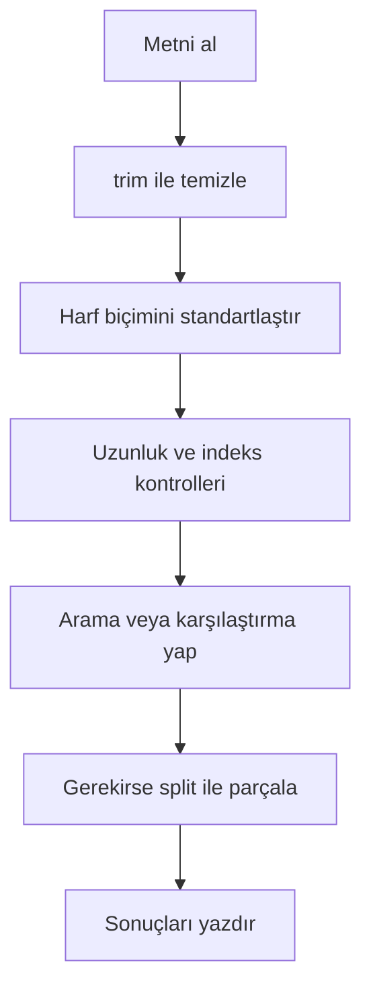

**Diyagram 10.1:** Temel metin işleme akışı.

**Görsel üretim notu:** Bu Mermaid diyagramı final DOCX/PDF üretiminden önce PNG’ye dönüştürülmeli; ham `flowchart TD` kodu final çıktıda görünmemelidir. Önerilen görsel genişliği 12–13 cm aralığında tutulmalıdır.

## 10.13 Adım adım kod örnekleri

Bu bölümde temel `String` işlemleri basitten daha bütünleşik örneklere doğru gösterilecektir.

### Kod 10.1: `String` temel işlemleri

**Kod kimliği:** `b10_kod01_temel_islemleri`

**Kod erişimi:** [Kod sayfası](https://github.com/bmdersleri/javaninTemelleri/tree/main/kodlar/bolum10/kod01/) | [Kaynak kod](https://github.com/bmdersleri/javaninTemelleri/blob/main/kodlar/bolum10/kod01/Bolum10Ornek01StringTemel.java) | 

**QR erişimi:** Kod sayfası ve kaynak kod için aşağıdaki iki QR kod kullanılabilir.

{width=2.8cm} {width=2.8cm}


```java
// Dosya: Bolum10Ornek01StringTemel.java
public class Bolum10Ornek01StringTemel {
    public static void main(String[] args) {
        String metin = "Java Programlama";

        System.out.println("Metin: " + metin);
        System.out.println("Uzunluk: " + metin.length());
        System.out.println("İlk karakter: " + metin.charAt(0));
        System.out.println("Son karakter: "
                + metin.charAt(metin.length() - 1));
        System.out.println("İlk dört karakter: "
                + metin.substring(0, 4));
        System.out.println("Program kelimesinin indeksi: "
                + metin.indexOf("Program"));
        System.out.println("Java içeriyor mu?: "
                + metin.contains("Java"));
    }
}
```

**Kodun amacı:** `length()`, `charAt()`, `substring()`, `indexOf()` ve `contains()` metotlarını göstermek.

**Beklenen çıktı:**

```text
Metin: Java Programlama
Uzunluk: 17
İlk karakter: J
Son karakter: a
İlk dört karakter: Java
Program kelimesinin indeksi: 5
Java içeriyor mu?: true
```

**Dikkat noktası:** Son karaktere erişmek için `metin.length() - 1` kullanılmıştır.

### Kod 10.2: Metin karşılaştırma ve temizleme

**Kod kimliği:** `b10_kod02_metin_karsilastirma_ve_temizleme`

**Kod erişimi:** [Kod sayfası](https://github.com/bmdersleri/javaninTemelleri/tree/main/kodlar/bolum10/kod02/) | [Kaynak kod](https://github.com/bmdersleri/javaninTemelleri/blob/main/kodlar/bolum10/kod02/Bolum10Ornek02KullaniciAdiKontrol.java) | 

**QR erişimi:** Kod sayfası ve kaynak kod için aşağıdaki iki QR kod kullanılabilir.

{width=2.8cm} {width=2.8cm}


```java
// Dosya: Bolum10Ornek02KullaniciAdiKontrol.java
import java.util.Scanner;

public class Bolum10Ornek02KullaniciAdiKontrol {
    public static void main(String[] args) {
        Scanner scanner = new Scanner(System.in);

        final String DOGRU_KULLANICI = "admin";

        System.out.print("Kullanıcı adını giriniz: ");
        String giris = scanner.nextLine();

        String temizGiris = giris.trim();

        if (temizGiris.equals(DOGRU_KULLANICI)) {
            System.out.println("Kullanıcı adı doğru.");
        } else {
            System.out.println("Kullanıcı adı yanlış.");
        }

        scanner.close();
    }
}
```

**Kodun amacı:** Kullanıcıdan alınan metni `trim()` ile temizleyip `equals()` ile karşılaştırmak.

**Örnek çalışma:**

```text
Kullanıcı adını giriniz:    admin
Kullanıcı adı doğru.
```

**Dikkat noktası:** `trim()` kullanılmasaydı baştaki boşluklar karşılaştırmayı etkileyebilirdi.

### Kod 10.3: Büyük/küçük harf duyarsız karşılaştırma

**Kod kimliği:** `b10_kod03_buyuk_kucuk_harf_duyarsiz_karsilastirma`

**Kod erişimi:** [Kod sayfası](https://github.com/bmdersleri/javaninTemelleri/tree/main/kodlar/bolum10/kod03/) | [Kaynak kod](https://github.com/bmdersleri/javaninTemelleri/blob/main/kodlar/bolum10/kod03/Bolum10Ornek03EqualsIgnoreCase.java) | 

**QR erişimi:** Kod sayfası ve kaynak kod için aşağıdaki iki QR kod kullanılabilir.

{width=2.8cm} {width=2.8cm}


```java
// Dosya: Bolum10Ornek03EqualsIgnoreCase.java
import java.util.Scanner;

public class Bolum10Ornek03EqualsIgnoreCase {
    public static void main(String[] args) {
        Scanner scanner = new Scanner(System.in);

        System.out.print("Devam etmek istiyor musunuz? ");
        String cevap = scanner.nextLine().trim();

        if (cevap.equalsIgnoreCase("evet")) {
            System.out.println("İşleme devam ediliyor.");
        } else {
            System.out.println("İşlem sonlandırıldı.");
        }

        scanner.close();
    }
}
```

**Kodun amacı:** `equalsIgnoreCase()` ile büyük/küçük harf farkını yok sayarak karşılaştırma yapmak.

**Örnek çalışma:**

```text
Devam etmek istiyor musunuz? EVET
İşleme devam ediliyor.
```

**Dikkat noktası:** `equalsIgnoreCase()` içerik karşılaştırması yapar; ancak baştaki ve sondaki boşlukları temizlemez. Bu nedenle önce `trim()` kullanılmıştır.

### Kod 10.4: `split()` ile kelime sayma

**Kod kimliği:** `b10_kod04_ile_kelime_sayma`

**Kod erişimi:** [Kod sayfası](https://github.com/bmdersleri/javaninTemelleri/tree/main/kodlar/bolum10/kod04/) | [Kaynak kod](https://github.com/bmdersleri/javaninTemelleri/blob/main/kodlar/bolum10/kod04/Bolum10Ornek04SplitKelimeSayma.java) | 

**QR erişimi:** Kod sayfası ve kaynak kod için aşağıdaki iki QR kod kullanılabilir.

{width=2.8cm} {width=2.8cm}


```java
// Dosya: Bolum10Ornek04SplitKelimeSayma.java
public class Bolum10Ornek04SplitKelimeSayma {
    public static void main(String[] args) {
        String cumle = "Java öğrenmek keyifli";
        String[] kelimeler = cumle.split(" ");

        System.out.println("Kelime sayısı: " + kelimeler.length);

        for (int i = 0; i < kelimeler.length; i++) {
            System.out.println((i + 1) + ". kelime: " + kelimeler[i]);
        }
    }
}
```

**Kodun amacı:** Metni boşluk karakterine göre parçalara ayırmak ve sonucu dizi olarak işlemek.

**Beklenen çıktı:**

```text
Kelime sayısı: 3
1. kelime: Java
2. kelime: öğrenmek
3. kelime: keyifli
```

**Dikkat noktası:** Bu örnekte tek boşlukla ayrılmış basit bir cümle kullanılmıştır. Çoklu boşluklar ileri düzey ayrıştırma gerektirebilir.

### Kod 10.5: Metni karakter karakter analiz etme

**Kod kimliği:** `b10_kod05_metni_karakter_karakter_analiz_etme`

**Kod erişimi:** [Kod sayfası](https://github.com/bmdersleri/javaninTemelleri/tree/main/kodlar/bolum10/kod05/) | [Kaynak kod](https://github.com/bmdersleri/javaninTemelleri/blob/main/kodlar/bolum10/kod05/Bolum10Ornek05KarakterAnalizi.java) | 

**QR erişimi:** Kod sayfası ve kaynak kod için aşağıdaki iki QR kod kullanılabilir.

{width=2.8cm} {width=2.8cm}


```java
// Dosya: Bolum10Ornek05KarakterAnalizi.java
public class Bolum10Ornek05KarakterAnalizi {
    public static void main(String[] args) {
        String metin = "Java";
        int aSayisi = 0;

        for (int i = 0; i < metin.length(); i++) {
            char karakter = metin.charAt(i);

            if (karakter == 'a') {
                aSayisi++;
            }
        }

        System.out.println("'a' karakteri sayısı: " + aSayisi);
    }
}
```

**Kodun amacı:** `charAt()` ve döngü kullanarak metindeki belirli karakterleri saymak.

**Beklenen çıktı:**

```text
'a' karakteri sayısı: 2
```

**Dikkat noktası:** Karakter karşılaştırmasında `char` değerleri tek tırnakla yazılır.

### Kod 10.6: Hatalı ve düzeltilmiş örnek

Aşağıdaki kodda `String` karşılaştırma ve indeks sınırı hataları vardır.

**Kod kimliği:** `b10_kod06_hatali_ve_duzeltilmis_ornek`

**Kod erişimi:** [Kod sayfası](https://github.com/bmdersleri/javaninTemelleri/tree/main/kodlar/bolum10/kod06/) | [Kaynak kod](https://github.com/bmdersleri/javaninTemelleri/blob/main/kodlar/bolum10/kod06/Bolum10Ornek06HataDuzeltme.java) | 

**QR erişimi:** Kod sayfası ve kaynak kod için aşağıdaki iki QR kod kullanılabilir.

{width=2.8cm} {width=2.8cm}


```java
// Dosya: Bolum10Ornek06HataDuzeltme.java
public class Bolum10Ornek06HataDuzeltme {
    public static void main(String[] args) {
        String metin = "Java";
        String parola = new String("java123");

        if (parola == "java123") {
            System.out.println("Parola doğru.");
        }

        System.out.println(metin.charAt(4));
        System.out.println(metin.substring(0, 5));
    }
}
```

Bu kodda üç temel sorun vardır:

1. `String` içerik karşılaştırması için `==` kullanılmıştır.
2. `"Java"` metninde `charAt(4)` geçersiz indekstir.
3. `"Java"` için `substring(0, 5)` geçersiz bitiş sınırı içerir.

Düzeltilmiş kod:

**Kod kimliği:** `b10_kod06_hatali_ve_duzeltilmis_ornek_2`

**Kod erişimi:** [Kod sayfası](https://github.com/bmdersleri/javaninTemelleri/tree/main/kodlar/bolum10/kod06_2/) | [Kaynak kod](https://github.com/bmdersleri/javaninTemelleri/blob/main/kodlar/bolum10/kod06_2/Bolum10Ornek06HataDuzeltme.java) | 

**QR erişimi:** Kod sayfası ve kaynak kod için aşağıdaki iki QR kod kullanılabilir.

{width=2.8cm} {width=2.8cm}


```java
// Dosya: Bolum10Ornek06HataDuzeltme.java
public class Bolum10Ornek06HataDuzeltme {
    public static void main(String[] args) {
        String metin = "Java";
        String parola = new String("java123");

        if (parola.equals("java123")) {
            System.out.println("Parola doğru.");
        }

        System.out.println(metin.charAt(metin.length() - 1));
        System.out.println(metin.substring(0, 4));
    }
}
```

**Beklenen çıktı:**

```text
Parola doğru.
a
Java
```

**Dikkat noktası:** İndeks sınırı ve içerik karşılaştırması hataları derleme aşamasında her zaman yakalanmayabilir; çalışma zamanı veya mantık hatası olarak ortaya çıkabilir.

## 10.14 Kodun çalışma mantığı ve beklenen çıktı

`String` işlemlerinde kodun çıktısını tahmin etmek için karakter indeksleri ve metotların dönüş değerleri dikkatle izlenmelidir.

Aşağıdaki örneği düşünelim:

```java
String metin = "Java";
System.out.println(metin.length());
System.out.println(metin.charAt(0));
System.out.println(metin.substring(1, 3));
System.out.println(metin.indexOf("v"));
```

İz sürme tablosu:

| İşlem | Sonuç | Açıklama |
|---|---|---|
| `metin.length()` | `4` | Metin dört karakterdir |
| `metin.charAt(0)` | `J` | İlk karakter |
| `metin.substring(1, 3)` | `av` | 1 dahil, 3 dahil değil |
| `metin.indexOf("v")` | `2` | `v` karakterinin indeksi |

Beklenen çıktı:

```text
4
J
av
2
```

> **💡 İpucu:** `String` indeks hatalarını önlemek için önce metnin uzunluğunu ve geçerli indeks aralığını yazılı olarak belirleyin.

## 10.15 Uçtan uca mini uygulama: Metin Analiz Aracı

Bu bölümün mini uygulaması, kullanıcıdan alınan bir metin üzerinde temel analizler yapar.

**Uygulama adı:** Metin Analiz Aracı

**Dosya adı:** `MetinAnalizAraci.java`

**Amaç:** Kullanıcıdan alınan metni temizlemek, uzunluğunu bulmak, ilk-son karakteri yazdırmak, büyük/küçük harf dönüşümü yapmak, kelimelere ayırmak, arama yapmak ve belirli karakterleri saymak.

**Kod kimliği:** `b10_kod31_metin_analiz_araci`

**Kod erişimi:** [Kod sayfası](https://github.com/bmdersleri/javaninTemelleri/tree/main/kodlar/bolum10/kod31/) | [Kaynak kod](https://github.com/bmdersleri/javaninTemelleri/blob/main/kodlar/bolum10/kod31/MetinAnalizAraci.java) | 

**QR erişimi:** Kod sayfası ve kaynak kod için aşağıdaki iki QR kod kullanılabilir.

{width=2.8cm} {width=2.8cm}


```java
// Dosya: MetinAnalizAraci.java
import java.util.Scanner;

public class MetinAnalizAraci {
    public static void main(String[] args) {
        Scanner scanner = new Scanner(System.in);

        System.out.println("=== Metin Analiz Aracı ===");
        System.out.print("Bir metin giriniz: ");
        String metin = scanner.nextLine();

        System.out.print("Aranacak kelimeyi giriniz: ");
        String arananKelime = scanner.nextLine();

        String temizMetin = metin.trim();

        System.out.println();
        System.out.println("Temiz metin: [" + temizMetin + "]");
        System.out.println("Karakter sayısı: " + temizMetin.length());

        if (temizMetin.length() > 0) {
            System.out.println("İlk karakter: " + temizMetin.charAt(0));
            System.out.println("Son karakter: "
                    + temizMetin.charAt(temizMetin.length() - 1));
        } else {
            System.out.println("Metin boş olduğu için ilk/son karakter yok.");
        }

        System.out.println("Küçük harf: " + temizMetin.toLowerCase());
        System.out.println("Büyük harf: " + temizMetin.toUpperCase());

        if (temizMetin.toLowerCase()
                .contains(arananKelime.trim().toLowerCase())) {
            System.out.println("Aranan kelime metinde var.");
        } else {
            System.out.println("Aranan kelime metinde yok.");
        }

        if (temizMetin.length() > 0) {
            String[] kelimeler = temizMetin.split(" ");

            System.out.println("Kelime sayısı: " + kelimeler.length);
            System.out.println("Kelimeler:");

            for (int i = 0; i < kelimeler.length; i++) {
                System.out.println((i + 1) + ". " + kelimeler[i]);
            }
        }

        int aSayisi = aKarakteriSay(temizMetin);
        System.out.println("'a' veya 'A' karakteri sayısı: " + aSayisi);

        scanner.close();
    }

    static int aKarakteriSay(String metin) {
        int sayac = 0;

        for (int i = 0; i < metin.length(); i++) {
            char karakter = metin.charAt(i);

            if (karakter == 'a' || karakter == 'A') {
                sayac++;
            }
        }

        return sayac;
    }
}
```

### 10.15.1 Örnek girdi

```text
Bir metin giriniz:   Java programlama keyifli  
Aranacak kelimeyi giriniz: PROGRAMLAMA
```

### 10.15.2 Beklenen çıktı

```text
Temiz metin: [Java programlama keyifli]
Karakter sayısı: 25
İlk karakter: J
Son karakter: i
Küçük harf: java programlama keyifli
Büyük harf: JAVA PROGRAMLAMA KEYIFLI
Aranan kelime metinde var.
Kelime sayısı: 3
Kelimeler:
1. Java
2. programlama
3. keyifli
'a' veya 'A' karakteri sayısı: 5
```

### 10.15.3 Uygulama akışının açıklaması

Bu uygulama şu adımlarla çalışır:

1. Kullanıcıdan bir metin alınır.
2. Kullanıcıdan aranacak kelime alınır.
3. Metnin başındaki ve sonundaki boşluklar temizlenir.
4. Metnin uzunluğu hesaplanır.
5. Metin boş değilse ilk ve son karakter yazdırılır.
6. Metin küçük ve büyük harfe dönüştürülür.
7. Aranan kelime büyük/küçük harf duyarsız biçimde aranır.
8. Metin kelimelere ayrılır.
9. Kelimeler sırayla yazdırılır.
10. Metindeki `a` ve `A` karakterleri sayılır.

### 10.15.4 Mini uygulama test senaryoları

| Test | Metin | Aranan kelime | Beklenen kontrol |
|---:|---|---|---|
| 1 | `"Java programlama keyifli"` | `"programlama"` | Kelime bulunur |
| 2 | `"   Java   "` | `"java"` | Temizleme sonrası bulunur |
| 3 | `""` | `"java"` | İlk/son karakter yok |
| 4 | `"Merhaba Dünya"` | `"python"` | Kelime bulunmaz |
| 5 | `"Ankara Antalya"` | `"an"` | Büyük/küçük harf duyarsız arama yapılır |
| 6 | `"a A aa"` | `"a"` | `a/A` sayısı artar |

> **Alıştırma Molası:** Mini uygulamada yalnızca `a` harfini değil, kullanıcıdan alınan herhangi bir karakteri sayacak bir metot tasarlayınız. Bu işlem için yeni konuya gerek yoktur; parametreli metot ve `charAt()` yeterlidir.

## 10.16 Sık yapılan hatalar ve yanlış sezgiler

Metin işlemlerinde hatalar genellikle karşılaştırma, indeks ve boşluk temizleme konularında ortaya çıkar.

### 10.16.1 `String` karşılaştırmada `==` kullanmak

Yanlış kullanım:

```java
String cevap = new String("evet");

if (cevap == "evet") {
    System.out.println("Onaylandı.");
}
```

Düzeltme:

```java
if (cevap.equals("evet")) {
    System.out.println("Onaylandı.");
}
```

### 10.16.2 Boşlukları temizlemeden karşılaştırmak

Yanlış kullanım:

```java
String giris = " admin ";

if (giris.equals("admin")) {
    System.out.println("Doğru");
}
```

Bu karşılaştırma başarısız olabilir. Çünkü `giris` başta ve sonda boşluk içerir.

Düzeltme:

```java
String giris = " admin ";
String temiz = giris.trim();

if (temiz.equals("admin")) {
    System.out.println("Doğru");
}
```

### 10.16.3 Büyük/küçük harfi dikkate almadan yanlış sonuç beklemek

Yanlış düşünce:

```text
"Java" ile "java" equals kullanıldığında aynı kabul edilir.
```

Düzeltme:

`equals()` büyük/küçük harfe duyarlıdır. Büyük/küçük harf farkı önemli değilse `equalsIgnoreCase()` veya standartlaştırma kullanılmalıdır.

```java
"Java".equalsIgnoreCase("java")
```

Bu ifade `true` üretir.

### 10.16.4 `substring()` sınırlarını yanlış vermek

Yanlış kullanım:

```java
String metin = "Java";
System.out.println(metin.substring(0, 5));
```

Düzeltme:

```java
System.out.println(metin.substring(0, 4));
```

`"Java"` metninin uzunluğu 4’tür. `substring(0, 4)` tüm metni verir.

### 10.16.5 `charAt()` indeksini aşmak

Yanlış kullanım:

```java
String metin = "Java";
System.out.println(metin.charAt(4));
```

Düzeltme:

```java
System.out.println(metin.charAt(metin.length() - 1));
```

Son geçerli indeks `length() - 1` değeridir.

### 10.16.6 `split()` sonucunun dizi olduğunu unutmak

Yanlış düşünce:

```text
split() tek bir String döndürür.
```

Düzeltme:

`split()` sonucu `String[]` dizisidir.

```java
String[] parcalar = "Ayşe,80,90".split(",");
```

Bu nedenle parçalara indeks ile erişilir.

## 10.17 Hata ayıklama egzersizi

Aşağıdaki kodun `StringHatasi.java` adlı dosyaya kaydedildiğini düşünelim.

**Kod kimliği:** `b10_kod42_hata_ayiklama_egzersizi`

**Kod erişimi:** [Kod sayfası](https://github.com/bmdersleri/javaninTemelleri/tree/main/kodlar/bolum10/kod42/) | [Kaynak kod](https://github.com/bmdersleri/javaninTemelleri/blob/main/kodlar/bolum10/kod42/StringHatasi.java) | 

**QR erişimi:** Kod sayfası ve kaynak kod için aşağıdaki iki QR kod kullanılabilir.

{width=2.8cm} {width=2.8cm}


```java
// Dosya: StringHatasi.java
public class StringHatasi {
    public static void main(String[] args) {
        String metin = "Java";
        String parola = new String("java123");

        if (parola == "java123") {
            System.out.println("Parola doğru.");
        } else {
            System.out.println("Parola yanlış.");
        }

        System.out.println(metin.substring(0, 5));
        System.out.println(metin.charAt(4));

        String satir = "Ayşe,80,90";
        String[] parcalar = satir.split(",");

        System.out.println(parcalar[3]);
    }
}
```

Bu kodda bir mantık hatası ve birden fazla çalışma zamanı hatası riski vardır.

**Hatalar:**

1. `String` içerik karşılaştırması için `==` kullanılmıştır.
2. `"Java"` metninde `substring(0, 5)` geçersiz sınır içerir.
3. `"Java"` metninde `charAt(4)` geçersiz indekstir.
4. `"Ayşe,80,90"` üç parçaya ayrılır; geçerli indeksler `0`, `1` ve `2` değerleridir. `parcalar[3]` geçersizdir.

**Düzeltilmiş kod:**

**Kod kimliği:** `b10_kod43_hata_ayiklama_egzersizi`

**Kod erişimi:** [Kod sayfası](https://github.com/bmdersleri/javaninTemelleri/tree/main/kodlar/bolum10/kod43/) | [Kaynak kod](https://github.com/bmdersleri/javaninTemelleri/blob/main/kodlar/bolum10/kod43/StringHatasi.java) | 

**QR erişimi:** Kod sayfası ve kaynak kod için aşağıdaki iki QR kod kullanılabilir.

{width=2.8cm} {width=2.8cm}


```java
// Dosya: StringHatasi.java
public class StringHatasi {
    public static void main(String[] args) {
        String metin = "Java";
        String parola = new String("java123");

        if (parola.equals("java123")) {
            System.out.println("Parola doğru.");
        } else {
            System.out.println("Parola yanlış.");
        }

        System.out.println(metin.substring(0, 4));
        System.out.println(metin.charAt(metin.length() - 1));

        String satir = "Ayşe,80,90";
        String[] parcalar = satir.split(",");

        System.out.println("Ad: " + parcalar[0]);
        System.out.println("Vize: " + parcalar[1]);
        System.out.println("Final: " + parcalar[2]);
    }
}
```

**Beklenen çıktı:**

```text
Parola doğru.
Java
a
Ad: Ayşe
Vize: 80
Final: 90
```

**Kendinize sorunuz:**

1. `==` neden `String` içerik karşılaştırması için güvenli değildir?
2. `"Java"` metninin uzunluğu kaçtır?
3. Son geçerli karakter indeksi kaçtır?
4. `substring(0, 5)` neden hatalıdır?
5. `charAt(4)` neden hatalıdır?
6. `split()` sonucu kaç parçadan oluşur?
7. Dizi indeks sınırları nasıl kontrol edilmelidir?

> **Laboratuvar İpucu:** `String` hatalarında önce metnin uzunluğunu, sonra indeks sınırlarını, sonra karşılaştırma yöntemini kontrol edin.

## 10.18 Bölümün sonraki bölümlerle ilişkisi

Bu bölümde metin verileri üzerinde temel işlemler yapmayı öğrendik. `String` metotları sayesinde kullanıcı girdilerini temizleme, karşılaştırma, arama, alt metin alma, karakter karakter dolaşma ve parçalara ayırma işlemleri uygulanabilir hâle geldi.

Bir sonraki bölümde Java standart kütüphanesindeki yardımcı sınıflar ele alınacaktır. `Math`, `Random`, Date-Time ve paket düzeni konuları sayesinde programlar yalnızca metin ve dizi işlemleri yapmakla kalmayacak; matematiksel hesaplama, rastgele değer üretme ve tarih-zaman bilgisiyle çalışma becerilerini de kazanacaktır.

Ayrıca ilerleyen dosya işlemleri bölümünde `split()` ve `String` temizleme yöntemleri, dosyadan okunan satırların ayrıştırılmasında tekrar kullanılacaktır.

## 10.19 Bölüm özeti

Bu bölümde Java’da `String` işlemleri ve metin problemleri ele alındı. `String` sınıfının metin verilerini temsil ettiği, `String` değerlerinin çift tırnak içinde yazıldığı ve `char` türünden farklı olduğu açıklandı.

`length()` metodu ile metnin karakter sayısı, `charAt()` ile belirli indeksteki karakter, `substring()` ile metnin belirli bir bölümü, `indexOf()` ve `contains()` ile metin içinde arama işlemleri gösterildi.

`String` karşılaştırmalarında `==` kullanımının riskli olduğu, içerik karşılaştırması için `equals()` kullanılması gerektiği vurgulandı. Büyük/küçük harf farkı yok sayılacaksa `equalsIgnoreCase()` kullanılabileceği gösterildi.

Kullanıcı girdilerinde baştaki ve sondaki gereksiz boşlukları temizlemek için `trim()`; metinleri standartlaştırmak için `toLowerCase()` ve `toUpperCase()` metotları kullanıldı.

`split()` metodunun metni parçalara ayırdığı ve sonucun `String[]` dizisi olduğu açıklandı. Bu nedenle `split()` sonucunun indeks ve `length` mantığıyla işlendiği gösterildi.

Son olarak Metin Analiz Aracı mini uygulamasıyla metin temizleme, uzunluk bulma, ilk/son karaktere erişme, büyük/küçük harf dönüşümü, arama, kelime ayırma ve karakter sayma işlemleri bir araya getirildi.

## 10.20 Terim sözlüğü

| Terim | Açıklama |
|---|---|
| `String` | Metin verilerini temsil eden Java sınıfı |
| `char` | Tek karakter tutan veri tipi |
| Karakter indeksi | Metindeki karakterin konum numarası |
| `length()` | Metnin karakter sayısını döndüren metot |
| `charAt()` | Belirli indeksteki karakteri döndüren metot |
| `substring()` | Metnin belirli bir bölümünü alan metot |
| `indexOf()` | Aranan ifadenin indeksini döndüren metot |
| `contains()` | Metnin başka bir metni içerip içermediğini kontrol eden metot |
| `equals()` | İçerik eşitliği kontrol eden metot |
| `equalsIgnoreCase()` | Büyük/küçük harfi yok sayarak içerik karşılaştıran metot |
| `trim()` | Baştaki ve sondaki boşlukları temizleyen metot |
| `toLowerCase()` | Metni küçük harfe dönüştüren metot |
| `toUpperCase()` | Metni büyük harfe dönüştüren metot |
| `split()` | Metni ayırıcıya göre parçalara bölen metot |
| `String[]` | `String` değerlerinden oluşan dizi |
| Alt metin | Bir metnin belirli bir parçası |
| İndeks sınırı | Geçerli karakter veya dizi konumlarının aralığı |
| Mantık hatası | Kod derlense de yanlış sonuç üreten hata |

## 10.21 Kendini değerlendirme soruları

### 10.21.1 Çoktan seçmeli sorular

1. Bir `String` değerinin karakter sayısını bulmak için hangi metot kullanılır?

A) `length()`  
B) `size()`  
C) `count()`  
D) `index()`  
E) `char()`  

2. `"Java"` metninde `charAt(0)` hangi karakteri verir?

A) `J`  
B) `a`  
C) `v`  
D) Boşluk  
E) Hata  

3. `substring(0, 4)` kullanımında hangi indeks sonuca dahil değildir?

A) 4  
B) 0  
C) 1  
D) 2  
E) 3  

4. `String` içeriklerini karşılaştırmak için hangisi tercih edilmelidir?

A) `equals()`  
B) `==`  
C) `length()`  
D) `split()`  
E) `trim()`  

5. Büyük/küçük harf farkını yok sayarak karşılaştırma yapmak için hangisi kullanılır?

A) `equalsIgnoreCase()`  
B) `equalsUpper()`  
C) `ignore()`  
D) `sameText()`  
E) `toChar()`  

6. `indexOf()` aranan ifadeyi bulamazsa genellikle hangi değeri döndürür?

A) `-1`  
B) `0`  
C) `1`  
D) `true`  
E) `null`  

7. `split()` metodunun dönüş tipi aşağıdakilerden hangisidir?

A) `String[]`  
B) `int`  
C) `boolean`  
D) `char`  
E) `double`  

8. Baştaki ve sondaki boşlukları temizlemek için hangi metot kullanılır?

A) `trim()`  
B) `clear()`  
C) `removeSpace()`  
D) `delete()`  
E) `cleanAll()`  

### 10.21.2 Doğru/Yanlış soruları

1. `String` metin verilerini temsil eder. (D/Y)
2. `length()` metodu parantezsiz kullanılır. (D/Y)
3. `charAt(0)` metnin ilk karakterini verir. (D/Y)
4. `substring()` kullanımında bitiş indeksi sonuca dahildir. (D/Y)
5. `equals()` içerik karşılaştırması için kullanılır. (D/Y)
6. `trim()` metnin ortasındaki tüm boşlukları siler. (D/Y)
7. `split()` sonucu bir dizi olarak işlenebilir. (D/Y)
8. `equalsIgnoreCase()` büyük/küçük harf farkını yok sayabilir. (D/Y)
9. `charAt(metin.length())` son karakteri verir. (D/Y)
10. `contains()` doğrudan `boolean` sonuç üretir. (D/Y)

### 10.21.3 Açık uçlu kavramsal sorular

1. `String` kavramını kendi cümlelerinizle açıklayınız.
2. `String` ile `char` arasındaki fark nedir?
3. `length()` ile dizilerdeki `length` kullanımı arasındaki fark nedir?
4. `charAt()` kullanırken hangi indeks hatalarına dikkat edilmelidir?
5. `substring()` metodunda başlangıç ve bitiş indeksleri nasıl yorumlanır?
6. `equals()` ve `==` arasındaki farkı açıklayınız.
7. `trim()` metodu hangi tür kullanıcı girişi problemlerini azaltır?
8. `toLowerCase()` ve `equalsIgnoreCase()` hangi durumlarda kullanılabilir?
9. `split()` metodunun `String[]` döndürmesi ne anlama gelir?
10. Metin analizinde döngü ve metotlar nasıl birlikte kullanılabilir?

### 10.21.4 Yanlış gerekçeyi bulma soruları

Aşağıdaki ifadelerdeki yanlış gerekçeyi bulunuz ve düzeltiniz.

1. “`String` karşılaştırmak için her zaman `==` kullanılır.”
2. “`trim()` metnin içindeki bütün boşlukları siler.”
3. “`substring(0, 4)` kullanımında 4. indeks de sonuca dahildir.”
4. “`charAt(metin.length())` son karakteri verir.”
5. “`indexOf()` aranan metni bulamazsa 0 döndürür.”
6. “`split()` metodu tek bir `String` döndürür.”
7. “Büyük/küçük harf farkı Java’da karşılaştırmaları etkilemez.”
8. “`contains()` metnin konumunu döndürür.”
9. “Metin boş olsa bile ilk karakter her zaman okunabilir.”
10. “`String` metotları döngülerle birlikte kullanılamaz.”

## 10.22 Programlama alıştırmaları

### 10.22.1 Kolay düzey

1. `MetinUzunlugu.java` adlı programda kullanıcıdan alınan bir metnin uzunluğunu yazdırınız.
2. `IlkSonKarakter.java` adlı programda bir metnin ilk ve son karakterini yazdırınız.
3. `BuyukKucukHarf.java` adlı programda bir metni küçük ve büyük harfe dönüştürünüz.
4. `BoslukTemizleme.java` adlı programda başında ve sonunda boşluk olan bir metni `trim()` ile temizleyiniz.
5. `MetinIceriyorMu.java` adlı programda bir metnin belirli bir kelimeyi içerip içermediğini kontrol ediniz.

### 10.22.2 Orta düzey

1. `KelimeArama.java` adlı programda bir metnin belirli bir kelimeyi içerip içermediğini `indexOf()` ile kontrol ediniz.
2. `KullaniciAdiKontrol.java` programında kullanıcı adını `trim()` ve `equalsIgnoreCase()` ile kontrol ediniz.
3. `MetinParcalama.java` programında virgülle ayrılmış bir satırı `split()` ile parçalara ayırınız.
4. Bir metindeki karakterleri indeksleriyle birlikte ekrana yazdırınız.
5. `KarakterSayma.java` programında bir metinde kaç adet `a` harfi olduğunu sayınız.

### 10.22.3 Zor düzey

1. `MetinAnalizAraci.java` uygulamasını geliştirerek sesli harf sayısını hesaplayan metot ekleyiniz.
2. Bir cümledeki kelime sayısını hesaplayınız. Çoklu boşlukların sonucu nasıl etkilediğini gözlemleyiniz.
3. Kullanıcıdan alınan e-posta adresinde `@` karakteri bulunup bulunmadığını kontrol ediniz.
4. Bir metnin belirli bir kelimeyle başlayıp başlamadığını `indexOf()` ve `substring()` kullanarak kontrol ediniz.
5. `String` karşılaştırmada `==` kullanan hatalı bir örnek yazınız ve `equals()` ile düzeltiniz.
6. Kullanıcıdan alınan bir karakteri metin içinde sayan parametreli bir metot yazınız.

## 10.23 Haftalık laboratuvar / proje görevi

**Görev başlığı:** Metin Analiz Aracı Laboratuvarı

**Amaç:** Bu görev, öğrencinin `String` metotlarını kullanarak küçük ama tamamlanabilir bir metin analiz uygulaması geliştirmesini amaçlar.

**Beklenen adımlar:**

1. `MetinAnalizAraci.java` adlı dosyayı oluşturunuz.
2. Kullanıcıdan bir metin alınız.
3. Kullanıcıdan aranacak kelimeyi alınız.
4. Metni `trim()` ile temizleyiniz.
5. Metnin karakter sayısını yazdırınız.
6. İlk ve son karakteri güvenli biçimde yazdırınız.
7. Metni küçük ve büyük harfe dönüştürünüz.
8. Aranan kelimenin metinde bulunup bulunmadığını kontrol ediniz.
9. Metni kelimelere ayırınız ve kelime sayısını yazdırınız.
10. Kelimeleri sıra numarasıyla yazdırınız.
11. Belirli bir karakterin kaç kez geçtiğini hesaplayan bir metot yazınız.
12. En az beş farklı test girdisiyle programı çalıştırınız.
13. İndeks sınırı veya `String` karşılaştırma hatası içeren bir örnek oluşturup düzeltiniz.
14. Kısa bir `README.md` dosyası hazırlayınız.

**Teslim edilecek dosyalar:**

1. `MetinAnalizAraci.java`
2. `README.md`
3. Program çıktıları
4. Test senaryoları listesi
5. Hata ve çözüm notu

**README içeriği şu başlıkları içermelidir:**

1. Programın amacı
2. Kullanılan `String` metotları
3. Kullanılan metotlar
4. Test girdileri ve çıktılar
5. Karşılaşılan hata ve çözüm
6. Geliştirme önerileri

## 10.24 Değerlendirme rubriği

| Ölçüt | Açıklama | Puan |
|---|---|---:|
| `String` metotlarının doğru kullanımı | `length()`, `charAt()`, `substring()`, `indexOf()` ve `contains()` kullanımı | 20 |
| Karşılaştırma ve temizleme | `equals()`, `equalsIgnoreCase()`, `trim()` kullanımı | 20 |
| Metin parçalama ve analiz | `split()`, kelime sayısı, karakter sayma ve arama işlemleri | 20 |
| Kodun çalışması | Programın derlenebilir ve çalıştırılabilir olması | 15 |
| Hata farkındalığı | İndeks ve karşılaştırma hatalarının fark edilmesi | 10 |
| Kod okunabilirliği | Anlamlı metot adları, girinti ve sade yapı | 10 |
| Raporlama | README, test çıktıları ve hata notu | 5 |
| **Toplam** |  | **100** |

## 10.25 İleri okuma ve kaynaklar

Bu bölümdeki konular temel düzeyde işlenmiştir. Daha ayrıntılı çalışma için aşağıdaki kaynak türleri incelenebilir:

1. **Java SE API dokümantasyonu:** `java.lang.String` sınıfındaki metotların resmî tanımlarını ve davranışlarını incelemek için temel kaynaktır.
2. **Dev.java öğrenme kaynakları:** Java’da temel sınıflar, metotlar ve metin işlemleri için güncel öğrenme içerikleri sunar.
3. **Oracle Java Tutorials:** `String` kullanımı, karakter işlemleri ve temel metin örnekleri için yararlı açıklamalar içerir.
4. **Ders içi ek notlar:** `equals()` ve `==` ayrımı, `substring()` sınırları ve `split()` örnekleri için pekiştirme materyali olarak kullanılabilir.

> **💡 İpucu:** İleri kaynakları okurken regex ve NLP gibi konularla karşılaşabilirsiniz. Bu bölümde yalnızca temel `String` işlemleri amaçlanmıştır.

## 10.26 Bir sonraki bölüme köprü

Bu bölümde metin verileri üzerinde temel işlemler yapmayı öğrendik. `String` metotları sayesinde kullanıcı girdilerini temizleme, karşılaştırma, arama, alt metin alma, karakter karakter dolaşma ve parçalara ayırma işlemleri uygulanabilir hâle geldi.

Bir sonraki bölümde `Math`, `Random`, Date-Time ve paket düzeni ele alınacaktır. Böylece programlar yalnızca metin ve dizi işlemleri yapmakla kalmayacak; matematiksel hesaplama, rastgele değer üretme, tarih-zaman bilgisiyle çalışma ve temel paket organizasyonu becerilerini de kazanacaktır.

**BÖLÜM SONU**


\newpage


# Bölüm 11: Matematiksel Yardımcılar ve Rastgelelik

## 11.1 Bölümün yol haritası

Önceki bölümlerde Java’nın temel sözdizimi, metotlar, diziler, metin işlemleri ve temel algoritmik problem çözme desenleri üzerinde çalıştık. Artık değişkenlerle işlem yapabiliyor, karar ve döngü yapıları kurabiliyor, metotlarla kodu düzenleyebiliyor ve küçük konsol uygulamaları geliştirebiliyoruz. Bu bölümde ise Java standart kütüphanesinde günlük programlama problemlerinde sık kullanılan iki yardımcı yapı ele alınacaktır: `Math` sınıfı ve `Random` sınıfı.

Bir programda mutlak değer almak, karekök hesaplamak, üs alma işlemi yapmak, iki sayıdan küçük veya büyük olanı bulmak ya da bir sonucu yuvarlamak gerekebilir. Bu işlemleri her defasında sıfırdan yazmak doğru bir yaklaşım değildir. Java, bu tür temel matematiksel işlemler için `Math` sınıfını sunar.

Benzer biçimde, bazı uygulamalarda rastgele değer üretmek gerekir. Zar oyunu, sayı tahmin oyunu, rastgele soru seçimi veya test verisi üretimi gibi işlemlerde `Random` sınıfı kullanılabilir. Rastgele sayı üretirken özellikle aralık sınırlarının doğru kurulması önemlidir.

Bu bölümde şu sorulara yanıt aranacaktır:

1. Java standart kütüphanesindeki yardımcı sınıflar neden kullanılır?
2. `Math` sınıfı hangi tür matematiksel işlemleri kolaylaştırır?
3. `Math.abs()`, `Math.sqrt()`, `Math.pow()`, `Math.round()`, `Math.min()` ve `Math.max()` metotları nasıl kullanılır?
4. `Math` sınıfı için neden nesne oluşturulmaz?
5. `Random` sınıfı nasıl içe aktarılır ve nasıl kullanılır?
6. `random.nextInt(6)` neden 1–6 arasında zar değeri üretmez?
7. 1–6, 10–20 veya kullanıcıdan alınan aralıkta rastgele sayı nasıl üretilir?
8. Rastgelelik içeren programlarda beklenen çıktı yerine beklenen davranış nasıl açıklanır?
9. Zar oyunu ve sayısal tahmin problemleri nasıl modellenir?
10. Rastgele sayı aralığı hataları nasıl fark edilir ve düzeltilir?

> **🎯 Bölüm Hedefi:** Bu bölümün sonunda öğrenci, `Math` sınıfının temel metotlarını ve `Random` sınıfını kullanarak matematiksel hesaplama ve rastgele değer üretimi gerektiren küçük Java programları geliştirebilecektir.

Bu bölümde Date-Time API, paket/proje organizasyonu, kriptografik rastgelelik, istatistiksel rastgelelik testleri, olasılık kuramı, `SecureRandom`, simülasyon modelleme ve ileri matematiksel kütüphaneler ele alınmayacaktır. Tarih ve zaman işlemleri bir sonraki bölümde ayrı bir konu olarak incelenecektir.

## 11.2 Bölümün konumu ve pedagojik rolü

Bu bölüm, öğrencinin kendi yazdığı kod ile Java’nın hazır yardımcı sınıfları arasında köprü kurar. Önceki bölümlerde bazı işlemleri kendimiz yazdık: toplam aldık, ortalama hesapladık, en küçük ve en büyük değeri bulduk, sayaç ve biriktirici değişkenler kullandık. Bu bölümde, bazı yaygın işlemlerin Java standart kütüphanesi tarafından hazır sağlandığı gösterilecektir.

`Math` sınıfı, öğrencinin matematiksel işlemleri daha kısa ve okunabilir yazmasını sağlar. Örneğin bir sayının mutlak değerini hesaplamak için koşullu ifade yazmak yerine `Math.abs()` kullanılabilir. Üs alma işlemi için döngü yazmak yerine `Math.pow()` kullanılabilir. İki sayıdan büyük olanı bulmak için `if-else` yazılabilir; ancak `Math.max()` daha kısa bir çözüm sunar.

`Random` sınıfı ise öğrencinin rastgelelik gerektiren küçük uygulamalar geliştirmesine olanak tanır. Zar atma, rastgele sayı seçme, sayı tahmin oyunu veya rastgele test verisi üretme gibi uygulamalar bu bölümde temel düzeyde ele alınacaktır.

> **⚠️ Dikkat:** Hazır sınıf kullanmak, algoritmik düşünmeyi bırakmak anlamına gelmez. Hazır sınıfın hangi problemi çözdüğünü, hangi türde değer döndürdüğünü ve hangi sınırlar içinde çalıştığını anlamak gerekir.

Bu bölüm, standart kütüphane kullanımını sade bir bağlamda tanıtır. Bir sonraki bölümde tarih ve zaman işlemleri ayrı olarak ele alınacak; ardından paketler, `import` kullanımı ve proje düzeni sistematik biçimde işlenecektir.

## 11.3 Öğrenme çıktıları

Bu bölüm tamamlandığında öğrenci:

1. Java standart kütüphanesindeki yardımcı sınıfların neden kullanıldığını açıklayabilir.
2. `Math` sınıfının statik metotlarla kullanıldığını ifade edebilir.
3. `Math.abs()` ile mutlak değer hesaplayabilir.
4. `Math.sqrt()` ile karekök hesaplayabilir.
5. `Math.pow()` ile üs alma işlemi yapabilir.
6. `Math.round()` ile ondalıklı sayıyı en yakın tam sayıya yuvarlayabilir.
7. `Math.min()` ve `Math.max()` ile iki değeri karşılaştırabilir.
8. `Math.sqrt()` ve `Math.pow()` metotlarının genellikle `double` sonuç döndürdüğünü yorumlayabilir.
9. `Random` sınıfını `java.util.Random` paketinden içe aktarabilir.
10. `Random` nesnesi oluşturabilir.
11. `nextInt()` metodunun üst sınırı sonuca dahil etmediğini açıklayabilir.
12. 1–6 arası zar değeri üretebilir.
13. Belirli bir alt ve üst sınır arasında rastgele tam sayı üretebilir.
14. Rastgelelik içeren programlarda beklenen çıktı ile beklenen davranış ayrımını yapabilir.
15. Zar Oyunu ve Sayısal Tahmin Aracı mini uygulamasını geliştirebilir.

## 11.4 Ön bilgi ve başlangıç varsayımları

Bu bölüm, öğrencinin aşağıdaki konuları temel düzeyde bildiğini varsayar:

1. Java programının temel yapısı
2. Değişkenler ve veri tipleri
3. Aritmetik operatörler
4. Tip dönüşümleri
5. Karar yapıları
6. Döngüler
7. Metotlar
8. `Scanner` ile kullanıcıdan veri alma
9. `import` ifadesini en azından görmüş olma
10. Konsolda çıktı üretme

Bu bölümde örnekler tek dosyalı konsol programları üzerinden verilecektir. GUI, dosya işlemleri, veritabanı ve gelişmiş paket düzeni kullanılmayacaktır.

## 11.5 Ana kavramlar

| Kavram | Kısa açıklama | Bu bölümdeki rolü |
|---|---|---|
| Standart kütüphane | Java ile birlikte gelen hazır sınıf ve metotlar | Hazır yardımcı işlevleri kullanma |
| `Math` | Matematiksel yardımcı metotlar sunan sınıf | Karekök, üs, mutlak değer, yuvarlama |
| Statik metot | Nesne oluşturmadan sınıf adıyla çağrılabilen metot | `Math.sqrt(25)` |
| `abs()` | Mutlak değer hesaplar | Negatif değeri pozitif büyüklük olarak yorumlama |
| `sqrt()` | Karekök hesaplar | Sayısal hesaplama |
| `pow()` | Üs alma işlemi yapar | Kuvvet hesabı |
| `round()` | En yakın tam sayıya yuvarlar | Ortalama veya ölçüm sonucu yuvarlama |
| `min()` | İki değerden küçük olanı verir | Karşılaştırma |
| `max()` | İki değerden büyük olanı verir | Karşılaştırma |
| `Random` | Rastgele değer üretmek için kullanılan sınıf | Zar, tahmin oyunu, rastgele seçim |
| `nextInt()` | Rastgele tam sayı üretir | Aralık temelli üretim |
| Üst sınır | `nextInt` içinde sonuca dahil edilmeyen sınır | Aralık hatalarını önleme |
| Beklenen davranış | Rastgele programlarda çıktının kuralını belirtme | Değişken sonuçları açıklama |

> **🎯 Sınav Notu:** `Math` sınıfı `java.lang` paketi altında yer aldığı için ayrıca `import` gerektirmez. `Random` sınıfı için ise genellikle `import java.util.Random;` yazılır.

## 11.6 Java standart kütüphanesi ve yardımcı sınıflar

Java standart kütüphanesi, Java ile birlikte gelen hazır sınıf ve metotlardan oluşur. Bu sınıflar, programcıların sık karşılaşılan problemleri her defasında sıfırdan çözmesini engeller.

Örneğin:

```java
double karekok = Math.sqrt(64);
```

satırı, 64 sayısının karekökünü hesaplar. Bunun için öğrencinin karekök algoritmasını baştan yazmasına gerek yoktur.

Benzer şekilde:

```java
Random random = new Random();
int zar = random.nextInt(6) + 1;
```

satırları, 1 ile 6 arasında rastgele zar değeri üretir.

Standart kütüphane kullanırken şu sorular sorulmalıdır:

1. Hangi problem çözülmek isteniyor?
2. Java’da bu problem için hazır sınıf veya metot var mı?
3. Sınıfı kullanmak için `import` gerekiyor mu?
4. Metot nesneyle mi, sınıf adıyla mı çağrılıyor?
5. Metot hangi türde değer döndürüyor?
6. Aralık veya sınır kuralları var mı?

> **💡 İpucu:** Hazır metotları kullanırken yalnızca metot adını ezberlemek yeterli değildir. Metodun girdi türünü, dönüş türünü ve sınır davranışını anlamak gerekir.

## 11.7 `Math` sınıfı

`Math` sınıfı, Java’da sık kullanılan matematiksel işlemler için hazır statik metotlar sağlar. Bu metotlar nesne oluşturmadan doğrudan sınıf adıyla çağrılır.

Örnek:

```java
double sonuc = Math.sqrt(25);
```

Bu kullanımda `new Math()` yazılmaz. `Math.sqrt(25)` doğrudan çağrılır.

Hatalı düşünce:

```text
Math metotlarını kullanmak için Math nesnesi oluşturmalıyım.
```

Doğru yaklaşım:

```java
double karekok = Math.sqrt(25);
```

> **⚠️ Dikkat:** `Math` metotları genellikle statiktir. Başlangıç düzeyinde `Math` sınıfını sınıf adıyla çağrılan hazır matematik aracı olarak düşünebilirsiniz.

## 11.8 `Math.abs()` ile mutlak değer

`Math.abs()` metodu, bir sayının mutlak değerini hesaplar. Mutlak değer, sayının işaretinden bağımsız büyüklüğüdür.

```java
int fark = -15;
System.out.println(Math.abs(fark));
```

Beklenen çıktı:

```text
15
```

Bu metot özellikle iki değer arasındaki uzaklığı hesaplarken yararlıdır. Örneğin zar toplamının hedef değer olan 7’ye uzaklığı şöyle hesaplanabilir:

```java
int toplam = 5;
int hedef = 7;

int uzaklik = Math.abs(hedef - toplam);

System.out.println("Hedefe uzaklık: " + uzaklik);
```

Beklenen çıktı:

```text
Hedefe uzaklık: 2
```

> **💡 İpucu:** Farkın negatif veya pozitif olması değil, büyüklüğü önemliyse `Math.abs()` kullanılabilir.

## 11.9 `Math.sqrt()` ile karekök

`Math.sqrt()` metodu, verilen sayının karekökünü hesaplar.

```java
double karekok = Math.sqrt(64);
System.out.println(karekok);
```

Beklenen çıktı:

```text
8.0
```

Karekök sonucu genellikle `double` türündedir. Bu nedenle sonucu `int` değişkene doğrudan atamak uygun değildir.

Hatalı kullanım:

```java
int sonuc = Math.sqrt(64);
```

Daha uygun kullanım:

```java
double sonuc = Math.sqrt(64);
```

> **🎯 Sınav Notu:** `Math.sqrt()` genellikle `double` sonuç döndürür. Sonucu tam sayı olarak kullanmak istiyorsanız bilinçli tip dönüşümü veya yuvarlama gerekir.

## 11.10 `Math.pow()` ile üs alma

`Math.pow()` metodu, bir sayının kuvvetini hesaplar. İlk parametre taban, ikinci parametre üs değeridir.

```java
double sonuc = Math.pow(2, 3);
System.out.println(sonuc);
```

Beklenen çıktı:

```text
8.0
```

`Math.pow(2, 3)` ifadesi 2 üzeri 3 anlamına gelir.

Başka örnek:

```java
double kare = Math.pow(5, 2);
System.out.println(kare);
```

Beklenen çıktı:

```text
25.0
```

> **⚠️ Dikkat:** `Math.pow()` sonucu da genellikle `double` türündedir. Tam sayı beklenen durumlarda dönüş türüne dikkat edilmelidir.

## 11.11 `Math.round()` ile yuvarlama

`Math.round()` metodu, ondalıklı bir sayıyı en yakın tam sayıya yuvarlar.

```java
double notOrtalamasi = 82.6;
long yuvarlanmis = Math.round(notOrtalamasi);

System.out.println(yuvarlanmis);
```

Beklenen çıktı:

```text
83
```

Başka örnek:

```java
double deger = 82.4;
System.out.println(Math.round(deger));
```

Beklenen çıktı:

```text
82
```

### 11.11.1 Tip dönüşümü ve yuvarlama farkı

Açık tip dönüşümü ondalıklı kısmı atar; yuvarlama yapmaz.

```java
double deger = 82.9;

System.out.println((int) deger);
System.out.println(Math.round(deger));
```

Beklenen çıktı:

```text
82
83
```

Bu nedenle “ondalıklı kısmı atmak” ve “en yakın tam sayıya yuvarlamak” aynı şey değildir.

> **🎯 Sınav Notu:** `(int)` dönüşümü yuvarlama yapmaz; ondalıklı kısmı atar. Yuvarlama için `Math.round()` kullanılmalıdır.

## 11.12 `Math.min()` ve `Math.max()`

`Math.min()` iki değerden küçük olanı, `Math.max()` ise büyük olanı döndürür.

```java
int a = 40;
int b = 65;

System.out.println(Math.min(a, b));
System.out.println(Math.max(a, b));
```

Beklenen çıktı:

```text
40
65
```

Bu metotlar, iki sayı arasında seçim yaparken kısa ve okunabilir bir çözüm sunar.

Örnek:

```java
int oyuncuPuani = 85;
int bilgisayarPuani = 73;

int yuksekPuan = Math.max(oyuncuPuani, bilgisayarPuani);
System.out.println("Yüksek puan: " + yuksekPuan);
```

Beklenen çıktı:

```text
Yüksek puan: 85
```

> **💡 İpucu:** İki değer arasında küçük/büyük seçimi yapılacaksa `Math.min()` ve `Math.max()` kodu sadeleştirebilir. Ancak karmaşık koşullarda `if-else` hâlâ gerekebilir.

## 11.13 `Math` sınıfı özet tablosu

| Metot | Örnek kullanım | Açıklama | Örnek sonuç |
|---|---|---|---|
| `Math.abs(x)` | `Math.abs(-15)` | Mutlak değer | `15` |
| `Math.sqrt(x)` | `Math.sqrt(64)` | Karekök | `8.0` |
| `Math.pow(a, b)` | `Math.pow(2, 3)` | Üs alma | `8.0` |
| `Math.round(x)` | `Math.round(82.6)` | En yakın tam sayıya yuvarlama | `83` |
| `Math.min(a, b)` | `Math.min(40, 65)` | Küçük değeri verir | `40` |
| `Math.max(a, b)` | `Math.max(40, 65)` | Büyük değeri verir | `65` |

Bu tablo, günlük programlama problemlerinde sık kullanılabilecek başlangıç düzeyi `Math` metotlarını özetler.

## 11.14 `Random` sınıfı

Rastgele değer üretmek oyunlar, simülasyonlar, test verisi oluşturma ve basit seçim uygulamaları için yararlıdır. Java’da temel rastgele sayı üretimi için `Random` sınıfı kullanılabilir.

`Random` sınıfı `java.util` paketindedir. Bu nedenle dosyanın başında şu import ifadesi kullanılır:

```java
import java.util.Random;
```

Ardından `Random` nesnesi oluşturulur:

```java
Random random = new Random();
```

Bu nesne üzerinden rastgele değer üreten metotlar çağrılır.

```java
int sayi = random.nextInt(10);
```

> **⚠️ Dikkat:** `Math` sınıfının aksine `Random` için genellikle nesne oluşturulur. `Math.sqrt(25)` sınıf adıyla çağrılırken, `random.nextInt(10)` oluşturulan nesne üzerinden çağrılır.

## 11.15 `nextInt()` ile rastgele tam sayı üretme

`nextInt(sinir)` metodu, 0’dan başlayarak verilen sınırdan küçük tam sayılar üretir.

```java
Random random = new Random();

int sayi = random.nextInt(10);

System.out.println(sayi);
```

Bu kod 0 ile 9 arasında rastgele bir tam sayı üretir. 10 değeri üretilmez.

| İfade | Üretilebilecek değerler |
|---|---|
| `random.nextInt(2)` | 0, 1 |
| `random.nextInt(6)` | 0, 1, 2, 3, 4, 5 |
| `random.nextInt(10)` | 0, 1, 2, ..., 9 |

> **🎯 Sınav Notu:** `random.nextInt(10)` ifadesi 0–9 aralığında değer üretir. Üst sınır olan 10 sonuca dahil değildir.

## 11.16 Zar değeri üretme

Bir zarın olası değerleri 1, 2, 3, 4, 5 ve 6’dır. Ancak:

```java
random.nextInt(6)
```

ifadesi 0–5 aralığında değer üretir. Bu nedenle zar değeri için sonuca 1 eklenir.

```java
int zar = random.nextInt(6) + 1;
```

Bu ifade 1–6 aralığında değer üretir.

### 11.16.1 Neden `+ 1` eklenir?

`random.nextInt(6)` çıktısı şu aralıktadır:

```text
0, 1, 2, 3, 4, 5
```

Bu değerlere 1 eklenirse:

```text
1, 2, 3, 4, 5, 6
```

elde edilir.

> **⚠️ Sık Yapılan Hata:** `nextInt(6)` ifadesinin doğrudan 1–6 arasında zar değeri ürettiğini sanmak yanlıştır.

## 11.17 Belirli aralıkta rastgele sayı üretme

Bazen rastgele sayı 0’dan değil, belirli bir alt sınırdan başlamalıdır. Örneğin 10 ile 20 arasında rastgele tam sayı üretmek isteyebiliriz.

Genel kalıp:

```java
int sayi = random.nextInt(ustSinir - altSinir + 1) + altSinir;
```

10 ile 20 arasında sayı üretmek için:

```java
int altSinir = 10;
int ustSinir = 20;

int sayi = random.nextInt(ustSinir - altSinir + 1) + altSinir;
```

Burada `ustSinir - altSinir + 1` ifadesi üretilebilecek değer sayısını verir. 10–20 aralığında 11 farklı tam sayı vardır.

> **💡 İpucu:** Rastgele aralık kurarken önce aralıkta kaç farklı tam sayı olduğunu hesaplayın. Sonra alt sınırı sonuca ekleyin.

## 11.18 Rastgelelikte beklenen çıktı yerine beklenen davranış

Rastgelelik içeren programlarda her çalıştırmada aynı çıktı beklenmez. Bu nedenle “beklenen çıktı” yerine “beklenen davranış” açıklanmalıdır.

Örneğin:

```java
int zar = random.nextInt(6) + 1;
System.out.println("Zar: " + zar);
```

Bu kodun beklenen davranışı şudur:

```text
Program 1 ile 6 arasında bir tam sayı üretir.
```

Ancak kesin çıktı şu değildir:

```text
Zar: 4
```

Çünkü program her çalıştırıldığında farklı değer üretebilir.

Benzer şekilde rastgele tahmin oyunu, rastgele soru seçimi veya rastgele test verisi üretimi gibi programlarda da sonuç değişken olabilir.

> **🎯 Sınav Notu:** Rastgele değer üreten programlarda test edilirken tek bir sabit çıktı değil, değer aralığının doğru olup olmadığı kontrol edilmelidir.

## 11.19 Matematiksel yardımcılar ve rastgelelik akış diyagramı

`Math` ve `Random` kullanılan küçük uygulamalarda genel akış; veri alma, hesaplama, rastgele değer üretme ve sonucu yorumlama adımlarından oluşur.

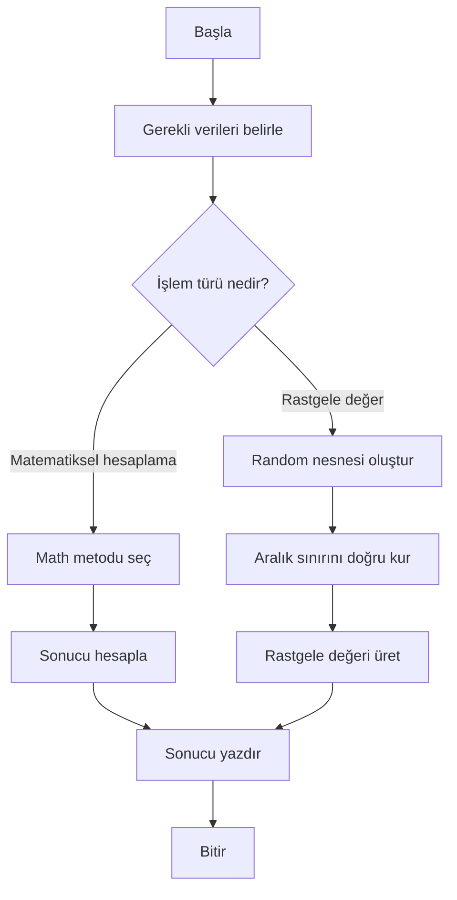

**Diyagram 11.1:** Matematiksel yardımcı ve rastgelelik içeren programların genel akışı.

**Görsel üretim notu:** Bu Mermaid diyagramı final DOCX/PDF üretiminden önce PNG’ye dönüştürülmeli; ham `flowchart TD` kodu final çıktıda görünmemelidir. Önerilen görsel genişliği 12–13 cm aralığında tutulmalıdır.

## 11.20 Adım adım kod örnekleri

Bu bölümde `Math` ve `Random` kullanımı basitten daha bütünleşik örneklere doğru gösterilecektir.

### Kod 11.1: `Math` temel metotları

**Kod kimliği:** `b11_kod01_temel_metotlari`

**Kod erişimi:** [Kod sayfası](https://github.com/bmdersleri/javaninTemelleri/tree/main/kodlar/bolum11/kod01/) | [Kaynak kod](https://github.com/bmdersleri/javaninTemelleri/blob/main/kodlar/bolum11/kod01/Bolum11Ornek01MathTemel.java) | 

**QR erişimi:** Kod sayfası ve kaynak kod için aşağıdaki iki QR kod kullanılabilir.

{width=2.8cm} {width=2.8cm}


```java
// Dosya: Bolum11Ornek01MathTemel.java
public class Bolum11Ornek01MathTemel {
    public static void main(String[] args) {
        int fark = -15;
        double sayi = 64.0;
        double taban = 2.0;
        double us = 3.0;
        double ortalama = 82.6;

        System.out.println("Mutlak değer: " + Math.abs(fark));
        System.out.println("Karekök: " + Math.sqrt(sayi));
        System.out.println("Üs alma: " + Math.pow(taban, us));
        System.out.println("Yuvarlama: " + Math.round(ortalama));
        System.out.println("Küçük değer: " + Math.min(40, 65));
        System.out.println("Büyük değer: " + Math.max(40, 65));
    }
}
```

**Kodun amacı:** Temel `Math` metotlarını tek programda göstermek.

**Kritik satırlar:**

1. `Math.abs(fark)` mutlak değer hesaplar.
2. `Math.sqrt(sayi)` karekök alır.
3. `Math.pow(taban, us)` üs alma işlemi yapar.
4. `Math.round(ortalama)` değeri en yakın tam sayıya yuvarlar.
5. `Math.min()` ve `Math.max()` karşılaştırma yapar.

**Beklenen çıktı:**

```text
Mutlak değer: 15
Karekök: 8.0
Üs alma: 8.0
Yuvarlama: 83
Küçük değer: 40
Büyük değer: 65
```

**Dikkat noktası:** `Math.sqrt()` ve `Math.pow()` sonuçları `double` türündedir.

### Kod 11.2: Tip dönüşümü ve yuvarlama karşılaştırması

**Kod kimliği:** `b11_kod02_tip_donusumu_ve_yuvarlama_karsilastirmasi`

**Kod erişimi:** [Kod sayfası](https://github.com/bmdersleri/javaninTemelleri/tree/main/kodlar/bolum11/kod02/) | [Kaynak kod](https://github.com/bmdersleri/javaninTemelleri/blob/main/kodlar/bolum11/kod02/Bolum11Ornek02YuvarlamaKarsilastirma.java) | 

**QR erişimi:** Kod sayfası ve kaynak kod için aşağıdaki iki QR kod kullanılabilir.

{width=2.8cm} {width=2.8cm}


```java
// Dosya: Bolum11Ornek02YuvarlamaKarsilastirma.java
public class Bolum11Ornek02YuvarlamaKarsilastirma {
    public static void main(String[] args) {
        double deger1 = 82.4;
        double deger2 = 82.6;

        System.out.println("deger1 int dönüşümü: " + (int) deger1);
        System.out.println("deger1 round: " + Math.round(deger1));

        System.out.println("deger2 int dönüşümü: " + (int) deger2);
        System.out.println("deger2 round: " + Math.round(deger2));
    }
}
```

**Kodun amacı:** Açık tip dönüşümü ile `Math.round()` arasındaki farkı göstermek.

**Beklenen çıktı:**

```text
deger1 int dönüşümü: 82
deger1 round: 82
deger2 int dönüşümü: 82
deger2 round: 83
```

**Dikkat noktası:** `(int)` dönüşümü ondalıklı kısmı atar; `Math.round()` en yakın tam sayıya yuvarlar.

### Kod 11.3: `Random` ile zar atma

**Kod kimliği:** `b11_kod03_ile_zar_atma`

**Kod erişimi:** [Kod sayfası](https://github.com/bmdersleri/javaninTemelleri/tree/main/kodlar/bolum11/kod03/) | [Kaynak kod](https://github.com/bmdersleri/javaninTemelleri/blob/main/kodlar/bolum11/kod03/Bolum11Ornek03ZarAtma.java) | 

**QR erişimi:** Kod sayfası ve kaynak kod için aşağıdaki iki QR kod kullanılabilir.

{width=2.8cm} {width=2.8cm}


```java
// Dosya: Bolum11Ornek03ZarAtma.java
import java.util.Random;

public class Bolum11Ornek03ZarAtma {
    public static void main(String[] args) {
        Random random = new Random();

        int birinciZar = random.nextInt(6) + 1;
        int ikinciZar = random.nextInt(6) + 1;
        int toplam = birinciZar + ikinciZar;

        System.out.println("Birinci zar: " + birinciZar);
        System.out.println("İkinci zar: " + ikinciZar);
        System.out.println("Toplam: " + toplam);
    }
}
```

**Kodun amacı:** `Random` sınıfı ile 1–6 aralığında zar değeri üretmek.

**Beklenen davranış:**

```text
Birinci zar: 1 ile 6 arasında değişir
İkinci zar: 1 ile 6 arasında değişir
Toplam: 2 ile 12 arasında değişir
```

**Dikkat noktası:** Zar değerleri rastgele olduğu için her çalıştırmada aynı çıktı beklenmez.

### Kod 11.4: Belirli aralıkta rastgele sayı

**Kod kimliği:** `b11_kod04_belirli_aralikta_rastgele_sayi`

**Kod erişimi:** [Kod sayfası](https://github.com/bmdersleri/javaninTemelleri/tree/main/kodlar/bolum11/kod04/) | [Kaynak kod](https://github.com/bmdersleri/javaninTemelleri/blob/main/kodlar/bolum11/kod04/Bolum11Ornek04RastgeleAralik.java) | 

**QR erişimi:** Kod sayfası ve kaynak kod için aşağıdaki iki QR kod kullanılabilir.

{width=2.8cm} {width=2.8cm}


```java
// Dosya: Bolum11Ornek04RastgeleAralik.java
import java.util.Random;

public class Bolum11Ornek04RastgeleAralik {
    public static void main(String[] args) {
        Random random = new Random();

        int altSinir = 10;
        int ustSinir = 20;

        int rastgeleSayi =
                random.nextInt(ustSinir - altSinir + 1) + altSinir;

        System.out.println("Rastgele sayı: " + rastgeleSayi);
    }
}
```

**Kodun amacı:** Alt ve üst sınır dahil olacak şekilde rastgele tam sayı üretmek.

**Beklenen davranış:**

```text
Rastgele sayı 10 ile 20 arasında olur.
```

**Dikkat noktası:** `ustSinir - altSinir + 1` ifadesi aralıktaki değer sayısını hesaplar.

### Kod 11.5: Sayı tahmin oyunu

**Kod kimliği:** `b11_kod05_sayi_tahmin_oyunu`

**Kod erişimi:** [Kod sayfası](https://github.com/bmdersleri/javaninTemelleri/tree/main/kodlar/bolum11/kod05/) | [Kaynak kod](https://github.com/bmdersleri/javaninTemelleri/blob/main/kodlar/bolum11/kod05/Bolum11Ornek05SayiTahmin.java) | 

**QR erişimi:** Kod sayfası ve kaynak kod için aşağıdaki iki QR kod kullanılabilir.

{width=2.8cm} {width=2.8cm}


```java
// Dosya: Bolum11Ornek05SayiTahmin.java
import java.util.Random;
import java.util.Scanner;

public class Bolum11Ornek05SayiTahmin {
    public static void main(String[] args) {
        Scanner scanner = new Scanner(System.in);
        Random random = new Random();

        int hedef = random.nextInt(10) + 1;

        System.out.print("1 ile 10 arasında tahmin giriniz: ");
        int tahmin = scanner.nextInt();

        int fark = Math.abs(hedef - tahmin);

        System.out.println("Hedef sayı: " + hedef);
        System.out.println("Tahmininiz: " + tahmin);
        System.out.println("Uzaklık: " + fark);

        if (tahmin == hedef) {
            System.out.println("Tebrikler, doğru tahmin!");
        } else {
            System.out.println("Tahmin hedefe " + fark
                    + " birim uzaklıkta.");
        }

        scanner.close();
    }
}
```

**Kodun amacı:** `Random`, `Scanner`, `Math.abs()` ve karar yapısını birlikte kullanmak.

**Beklenen davranış:** Program 1–10 arasında hedef sayı üretir, kullanıcının tahminini alır ve tahminin hedefe uzaklığını hesaplar.

**Dikkat noktası:** Kullanıcı 1–10 dışında değer girerse bu program yine çalışır; ancak uygulama mantığı açısından ek aralık kontrolü yapılabilir.

### Kod 11.6: Hatalı ve düzeltilmiş rastgele aralık

Hatalı örnek:

**Kod kimliği:** `b11_kod06_hatali_ve_duzeltilmis_rastgele_aralik`

**Kod erişimi:** [Kod sayfası](https://github.com/bmdersleri/javaninTemelleri/tree/main/kodlar/bolum11/kod06/) | [Kaynak kod](https://github.com/bmdersleri/javaninTemelleri/blob/main/kodlar/bolum11/kod06/Bolum11Ornek06RandomHatasi.java) | 

**QR erişimi:** Kod sayfası ve kaynak kod için aşağıdaki iki QR kod kullanılabilir.

{width=2.8cm} {width=2.8cm}


```java
// Dosya: Bolum11Ornek06RandomHatasi.java
import java.util.Random;

public class Bolum11Ornek06RandomHatasi {
    public static void main(String[] args) {
        Random random = new Random();

        int zar = random.nextInt(6);

        System.out.println("Zar: " + zar);
    }
}
```

Bu kod 0–5 aralığında değer üretir. Oysa zar değeri 1–6 arasında olmalıdır.

Düzeltilmiş kod:

**Kod kimliği:** `b11_kod06_hatali_ve_duzeltilmis_rastgele_aralik_2`

**Kod erişimi:** [Kod sayfası](https://github.com/bmdersleri/javaninTemelleri/tree/main/kodlar/bolum11/kod06_2/) | [Kaynak kod](https://github.com/bmdersleri/javaninTemelleri/blob/main/kodlar/bolum11/kod06_2/Bolum11Ornek06RandomHatasi.java) | 

**QR erişimi:** Kod sayfası ve kaynak kod için aşağıdaki iki QR kod kullanılabilir.

{width=2.8cm} {width=2.8cm}


```java
// Dosya: Bolum11Ornek06RandomHatasi.java
import java.util.Random;

public class Bolum11Ornek06RandomHatasi {
    public static void main(String[] args) {
        Random random = new Random();

        int zar = random.nextInt(6) + 1;

        System.out.println("Zar: " + zar);
    }
}
```

**Kodun amacı:** `nextInt()` üst sınır davranışını ve zar aralığı düzeltmesini göstermek.

**Beklenen davranış:** Program her çalıştırıldığında 1 ile 6 arasında bir zar değeri üretir.

**Dikkat noktası:** Bu hata derleme hatası değildir; program çalışır ama yanlış aralıkta değer üretebilir. Bu nedenle mantık hatasıdır.

## 11.21 Kodun çalışma mantığı ve beklenen davranış

`Math` metotları genellikle aynı girdiye aynı sonucu verir. Örneğin:

```java
System.out.println(Math.sqrt(81));
```

her zaman şu çıktıyı üretir:

```text
9.0
```

Ancak `Random` kullanılan kodlarda çıktı değişebilir.

```java
int zar = random.nextInt(6) + 1;
```

Bu kodun iz sürme mantığı şu şekildedir:

| Adım | İşlem | Olası sonuç |
|---:|---|---|
| 1 | `random.nextInt(6)` | 0 ile 5 arasında değer |
| 2 | Sonuca 1 eklenir | 1 ile 6 arasında değer |
| 3 | Değer `zar` değişkenine atanır | Geçerli zar değeri |
| 4 | Değer ekrana yazdırılır | Çalıştırmaya göre değişir |

Sayı tahmin oyununda ise rastgele üretilen hedef sayı ve kullanıcının tahmini arasındaki fark `Math.abs()` ile hesaplanır.

```java
int fark = Math.abs(hedef - tahmin);
```

Bu ifade, tahmin hedefin altında da olsa üstünde de olsa uzaklığı pozitif değer olarak verir.

> **💡 İpucu:** Rastgelelik içeren uygulamalarda test ederken tek çıktı yerine “çıktı beklenen aralıkta mı?” sorusunu sorun.

## 11.22 Uçtan uca mini uygulama: Zar Oyunu ve Sayısal Tahmin Aracı

Bu bölümün mini uygulaması, `Math` ve `Random` kullanımını tek bir konsol programında birleştirir.

**Uygulama adı:** Zar Oyunu ve Sayısal Tahmin Aracı

**Dosya adı:** `ZarOyunuVeSayisalTahmin.java`

**Amaç:** İki zar atmak, zar toplamını hesaplamak, toplamın hedef değere uzaklığını bulmak, 1–10 arası rastgele hedef sayı üretmek ve kullanıcının tahminini değerlendirmek.

**Kod kimliği:** `b11_kod36_zar_oyunu_ve_sayisal_tahmin_araci`

**Kod erişimi:** [Kod sayfası](https://github.com/bmdersleri/javaninTemelleri/tree/main/kodlar/bolum11/kod36/) | [Kaynak kod](https://github.com/bmdersleri/javaninTemelleri/blob/main/kodlar/bolum11/kod36/ZarOyunuVeSayisalTahmin.java) | 

**QR erişimi:** Kod sayfası ve kaynak kod için aşağıdaki iki QR kod kullanılabilir.

{width=2.8cm} {width=2.8cm}


```java
// Dosya: ZarOyunuVeSayisalTahmin.java
import java.util.Random;
import java.util.Scanner;

public class ZarOyunuVeSayisalTahmin {
    public static void main(String[] args) {
        Scanner scanner = new Scanner(System.in);
        Random random = new Random();

        System.out.println("=== Zar Oyunu ve Sayısal Tahmin Aracı ===");

        int birinciZar = zarAt(random);
        int ikinciZar = zarAt(random);
        int zarToplami = birinciZar + ikinciZar;

        System.out.println("Birinci zar: " + birinciZar);
        System.out.println("İkinci zar: " + ikinciZar);
        System.out.println("Zar toplamı: " + zarToplami);

        int hedefToplam = 7;
        int uzaklik = Math.abs(hedefToplam - zarToplami);

        System.out.println("7'ye uzaklık: " + uzaklik);

        if (birinciZar == ikinciZar) {
            System.out.println("Çift zar geldi.");
        } else {
            System.out.println("Çift zar gelmedi.");
        }

        System.out.println();

        int hedefSayi = random.nextInt(10) + 1;

        System.out.print("1 ile 10 arasında tahmin giriniz: ");
        int tahmin = scanner.nextInt();

        int tahminFarki = Math.abs(hedefSayi - tahmin);

        System.out.println("Hedef sayı: " + hedefSayi);
        System.out.println("Tahmininiz: " + tahmin);
        System.out.println("Tahmin uzaklığı: " + tahminFarki);

        if (tahmin == hedefSayi) {
            System.out.println("Tebrikler, doğru tahmin!");
        } else {
            System.out.println("Tahmin hedefe "
                    + tahminFarki + " birim uzaklıkta.");
        }

        int kucukDeger = Math.min(hedefSayi, tahmin);
        int buyukDeger = Math.max(hedefSayi, tahmin);

        System.out.println("Küçük değer: " + kucukDeger);
        System.out.println("Büyük değer: " + buyukDeger);

        scanner.close();
    }

    static int zarAt(Random random) {
        return random.nextInt(6) + 1;
    }
}
```

### 11.22.1 Mini uygulama çalışma örneği

Bu programda zarlar ve hedef sayı rastgele üretildiği için çıktı her çalıştırmada değişebilir. Örnek bir çıktı şu yapıda olabilir:

```text
=== Zar Oyunu ve Sayısal Tahmin Aracı ===
Birinci zar: 4
İkinci zar: 2
Zar toplamı: 6
7'ye uzaklık: 1
Çift zar gelmedi.

1 ile 10 arasında tahmin giriniz: 8
Hedef sayı: 6
Tahmininiz: 8
Tahmin uzaklığı: 2
Tahmin hedefe 2 birim uzaklıkta.
Küçük değer: 6
Büyük değer: 8
```

### 11.22.2 Mini uygulamanın kavram eşleştirmesi

| Kullanılan yapı | Uygulamadaki rolü |
|---|---|
| `Random` | Zar ve hedef sayı üretir |
| `nextInt(6) + 1` | 1–6 arası zar üretir |
| `nextInt(10) + 1` | 1–10 arası hedef sayı üretir |
| `Math.abs()` | Hedefe uzaklığı hesaplar |
| `Math.min()` | Tahmin ve hedefin küçük olanını bulur |
| `Math.max()` | Tahmin ve hedefin büyük olanını bulur |
| `Scanner` | Kullanıcı tahminini alır |
| Metot | `zarAt` işlemini tekrar kullanılabilir hâle getirir |
| Karar yapısı | Doğru tahmin ve çift zar durumunu kontrol eder |

### 11.22.3 Mini uygulama test senaryoları

| Test | Durum | Beklenen kontrol |
|---:|---|---|
| 1 | Program çalıştırılır | İki zar 1–6 aralığında olur |
| 2 | Zarlar eşit gelirse | “Çift zar geldi” mesajı yazılır |
| 3 | Zarlar farklı gelirse | “Çift zar gelmedi” mesajı yazılır |
| 4 | Zar toplamı hesaplanır | Toplam 2–12 aralığında olur |
| 5 | 7’ye uzaklık hesaplanır | Negatif değer üretmez |
| 6 | Kullanıcı doğru tahmin eder | Tebrik mesajı yazılır |
| 7 | Kullanıcı yanlış tahmin eder | Hedefe uzaklık yazılır |
| 8 | Hedef ve tahmin karşılaştırılır | `Math.min` ve `Math.max` doğru değerleri verir |

> **Alıştırma Molası:** Mini uygulamada kullanıcıdan alt ve üst sınır alarak hedef sayının bu aralıkta rastgele üretilmesini sağlayınız. Aralık formülünü `random.nextInt(ust - alt + 1) + alt` biçiminde kurunuz.

## 11.23 Sık yapılan hatalar ve yanlış sezgiler

### 11.23.1 `Math` için nesne oluşturmaya çalışmak

Yanlış düşünce:

```text
Math metotlarını kullanmak için new Math() yazılmalıdır.
```

Düzeltme:

```java
double sonuc = Math.sqrt(25);
```

`Math` metotları sınıf adıyla çağrılır.

### 11.23.2 `Math.sqrt()` sonucunu doğrudan `int` değişkene atamak

Yanlış kullanım:

```java
int sonuc = Math.sqrt(64);
```

Düzeltme:

```java
double sonuc = Math.sqrt(64);
```

### 11.23.3 Tip dönüşümünü yuvarlama sanmak

Yanlış düşünce:

```text
(int) 82.9 sonucu 83 olur.
```

Düzeltme:

```java
System.out.println((int) 82.9);
System.out.println(Math.round(82.9));
```

Beklenen çıktı:

```text
82
83
```

### 11.23.4 `Random` için import eklememek

Yanlış kullanım:

```java
Random random = new Random();
```

Eğer `import java.util.Random;` eklenmemişse derleyici `Random` sınıfını tanımaz.

Düzeltme:

```java
import java.util.Random;
```

### 11.23.5 `nextInt()` üst sınırını yanlış anlamak

Yanlış düşünce:

```text
random.nextInt(6) 1 ile 6 arasında değer üretir.
```

Düzeltme:

```java
int zar = random.nextInt(6) + 1;
```

### 11.23.6 Belirli aralık formülünü eksik yazmak

Yanlış kullanım:

```java
int sayi = random.nextInt(ustSinir - altSinir) + altSinir;
```

Bu kullanım üst sınırı çoğu durumda aralığa dahil etmez.

Daha uygun kullanım:

```java
int sayi = random.nextInt(ustSinir - altSinir + 1) + altSinir;
```

> **💡 İpucu:** Rastgele sayı hatalarında önce `nextInt` içine verilen değeri ve sonuca eklenen alt sınırı kontrol edin.

## 11.24 Hata ayıklama egzersizi

Aşağıdaki kodun `RandomAralikHatasi.java` adlı dosyaya kaydedildiğini düşünelim.

**Kod kimliği:** `b11_kod46_hata_ayiklama_egzersizi`

**Kod erişimi:** [Kod sayfası](https://github.com/bmdersleri/javaninTemelleri/tree/main/kodlar/bolum11/kod46/) | [Kaynak kod](https://github.com/bmdersleri/javaninTemelleri/blob/main/kodlar/bolum11/kod46/RandomAralikHatasi.java) | 

**QR erişimi:** Kod sayfası ve kaynak kod için aşağıdaki iki QR kod kullanılabilir.

{width=2.8cm} {width=2.8cm}


```java
// Dosya: RandomAralikHatasi.java
import java.util.Random;

public class RandomAralikHatasi {
    public static void main(String[] args) {
        Random random = new Random();

        int zar = random.nextInt(6);

        if (zar == 0) {
            System.out.println("Geçersiz zar değeri: " + zar);
        } else {
            System.out.println("Zar değeri: " + zar);
        }
    }
}
```

**Hata belirtisi:** Program bazen 0 değerini üretir. Oysa zar değerleri 1 ile 6 arasında olmalıdır. Bu bir mantık hatasıdır.

**Öğrenciye sorular:**

1. `random.nextInt(6)` hangi aralıkta değer üretir?
2. Zar değerleri hangi aralıkta olmalıdır?
3. Sonuca neden 1 eklenmelidir?
4. 10 ile 20 arasında rastgele sayı üretmek için nasıl bir ifade yazılabilir?
5. Bu hata derleme hatası mıdır, mantık hatası mıdır?

Düzeltilmiş kod:

**Kod kimliği:** `b11_kod47_hata_ayiklama_egzersizi`

**Kod erişimi:** [Kod sayfası](https://github.com/bmdersleri/javaninTemelleri/tree/main/kodlar/bolum11/kod47/) | [Kaynak kod](https://github.com/bmdersleri/javaninTemelleri/blob/main/kodlar/bolum11/kod47/RandomAralikHatasi.java) | 

**QR erişimi:** Kod sayfası ve kaynak kod için aşağıdaki iki QR kod kullanılabilir.

{width=2.8cm} {width=2.8cm}


```java
// Dosya: RandomAralikHatasi.java
import java.util.Random;

public class RandomAralikHatasi {
    public static void main(String[] args) {
        Random random = new Random();

        int zar = random.nextInt(6) + 1;

        System.out.println("Zar değeri: " + zar);
    }
}
```

Kısa açıklama: `nextInt(6)` 0–5 arası değer üretir. Sonuca 1 eklenince üretilen değer 1–6 aralığına taşınır.

## 11.25 Ek hata ayıklama egzersizi: Yuvarlama hatası

Aşağıdaki kodu inceleyiniz.

**Kod kimliği:** `b11_kod48_yuvarlama_hatasi`

**Kod erişimi:** [Kod sayfası](https://github.com/bmdersleri/javaninTemelleri/tree/main/kodlar/bolum11/kod48/) | [Kaynak kod](https://github.com/bmdersleri/javaninTemelleri/blob/main/kodlar/bolum11/kod48/YuvarlamaHatasi.java) | 

**QR erişimi:** Kod sayfası ve kaynak kod için aşağıdaki iki QR kod kullanılabilir.

{width=2.8cm} {width=2.8cm}


```java
// Dosya: YuvarlamaHatasi.java
public class YuvarlamaHatasi {
    public static void main(String[] args) {
        double ortalama = 89.9;

        int sonuc = (int) ortalama;

        System.out.println("Sonuç: " + sonuc);
    }
}
```

**Hata belirtisi:** Öğrenci ortalamanın 90’a yuvarlanacağını düşünebilir; ancak çıktı 89 olur.

Düzeltilmiş kod:

**Kod kimliği:** `b11_kod49_yuvarlama_hatasi`

**Kod erişimi:** [Kod sayfası](https://github.com/bmdersleri/javaninTemelleri/tree/main/kodlar/bolum11/kod49/) | [Kaynak kod](https://github.com/bmdersleri/javaninTemelleri/blob/main/kodlar/bolum11/kod49/YuvarlamaHatasi.java) | 

**QR erişimi:** Kod sayfası ve kaynak kod için aşağıdaki iki QR kod kullanılabilir.

{width=2.8cm} {width=2.8cm}


```java
// Dosya: YuvarlamaHatasi.java
public class YuvarlamaHatasi {
    public static void main(String[] args) {
        double ortalama = 89.9;

        long sonuc = Math.round(ortalama);

        System.out.println("Sonuç: " + sonuc);
    }
}
```

**Beklenen çıktı:**

```text
Sonuç: 90
```

**Kendinize sorunuz:**

1. `(int)` dönüşümü ne yapar?
2. `Math.round()` ne yapar?
3. Hangi durumda ondalıklı kısmı atmak, hangi durumda yuvarlamak gerekir?
4. `Math.round()` dönüş tipi neden `long` olabilir?

## 11.26 Bölümün sonraki bölümlerle ilişkisi

Bu bölümde matematiksel yardımcı işlemler ve rastgele değer üretimi ele alındı. `Math` sınıfı sayesinde mutlak değer, karekök, üs alma, yuvarlama, minimum ve maksimum bulma işlemleri hazır metotlarla yapıldı. `Random` sınıfı ile rastgele tam sayı üretme, zar değeri oluşturma ve belirli aralıkta sayı üretme mantığı öğrenildi.

Bir sonraki bölümde tarih ve zaman işlemleri ele alınacaktır. Date-Time konusu ayrı bir bölümde incelenecektir; çünkü tarih, saat, tarih farkı, yaş hesabı ve tarih biçimlendirme işlemleri kendi kavram setine sahiptir. Böylece standart kütüphane kullanımı daha düzenli ve konu odaklı ilerleyecektir.

## 11.27 Bölüm özeti

Bu bölümde Java standart kütüphanesindeki iki temel yardımcı yapı ele alındı: `Math` sınıfı ve `Random` sınıfı.

İlk olarak `Math` sınıfının hazır matematiksel metotlar sunduğu açıklandı. `Math.abs()` ile mutlak değer, `Math.sqrt()` ile karekök, `Math.pow()` ile üs alma, `Math.round()` ile yuvarlama, `Math.min()` ve `Math.max()` ile iki değer arasında karşılaştırma işlemleri yapıldı. `Math` metotlarının genellikle statik olduğu ve nesne oluşturmadan sınıf adıyla çağrıldığı vurgulandı.

Yuvarlama konusunda `(int)` dönüşümü ile `Math.round()` arasındaki fark gösterildi. Açık tip dönüşümünün ondalıklı kısmı attığı, `Math.round()` metodunun ise en yakın tam sayıya yuvarladığı belirtildi.

Bölümün ikinci kısmında `Random` sınıfı ele alındı. `Random` sınıfının `java.util` paketinden içe aktarıldığı, nesne oluşturularak kullanıldığı ve `nextInt()` metoduyla rastgele tam sayı üretildiği gösterildi. Özellikle `nextInt()` metodunda üst sınırın sonuca dahil olmadığı vurgulandı.

Zar atma örneği üzerinden `random.nextInt(6) + 1` kalıbı açıklandı. Belirli alt ve üst sınır arasında rastgele sayı üretmek için `random.nextInt(ust - alt + 1) + alt` kalıbı kullanıldı.

Son olarak Zar Oyunu ve Sayısal Tahmin Aracı mini uygulamasıyla `Math`, `Random`, `Scanner`, metotlar ve karar yapıları birlikte kullanıldı. Rastgelelik içeren programlarda tek bir sabit çıktı yerine beklenen davranışın ifade edilmesi gerektiği özellikle vurgulandı.

## 11.28 Terim sözlüğü

| Terim | Açıklama |
|---|---|
| Standart kütüphane | Java ile birlikte gelen hazır sınıf ve metotlar bütünü |
| `Math` | Matematiksel işlemler için kullanılan yardımcı sınıf |
| Statik metot | Nesne oluşturmadan sınıf adıyla çağrılabilen metot |
| `Math.abs()` | Mutlak değer hesaplayan metot |
| `Math.sqrt()` | Karekök hesaplayan metot |
| `Math.pow()` | Üs alma işlemi yapan metot |
| `Math.round()` | En yakın tam sayıya yuvarlama yapan metot |
| `Math.min()` | İki değerden küçük olanı döndüren metot |
| `Math.max()` | İki değerden büyük olanı döndüren metot |
| `Random` | Rastgele değer üretmek için kullanılan sınıf |
| `nextInt()` | Belirli üst sınıra kadar rastgele tam sayı üreten metot |
| Üst sınır | `nextInt` içinde sonuca dahil edilmeyen sınır |
| Alt sınır | Rastgele aralıkta başlangıç değeri |
| Zar simülasyonu | 1–6 arası rastgele sayı üretme örneği |
| Beklenen davranış | Rastgele programlarda çıktının hangi kurala uyması gerektiği |
| Mantık hatası | Kod çalışsa da yanlış sonuç üreten hata |

## 11.29 Kendini değerlendirme soruları

### 11.29.1 Çoktan seçmeli sorular

1. `Math.sqrt(81)` ifadesinin sonucu nedir?

A) `9.0`  
B) `81`  
C) `8.1`  
D) `18`  
E) `0`

2. 1 ile 6 arasında zar değeri üretmek için hangisi uygundur?

A) `random.nextInt(6) + 1`  
B) `random.nextInt(6)`  
C) `random.nextInt(5)`  
D) `random.nextInt(7) + 1`  
E) `random.nextInt(1) + 6`

3. `Random` sınıfı hangi paketten içe aktarılır?

A) `java.util.Random`  
B) `java.time.Random`  
C) `java.lang.Random`  
D) `java.math.Random`  
E) `java.io.Random`

4. `Math` sınıfı için hangisi doğrudur?

A) Metotları genellikle sınıf adıyla çağrılır  
B) Her zaman `new Math()` gerekir  
C) Sadece rastgele sayı üretir  
D) Tarih biçimlendirme yapar  
E) Kullanmak için mutlaka `java.util` import edilir

5. `(int) 82.9` işleminin sonucu nedir?

A) `82`  
B) `83`  
C) `82.9`  
D) `0`  
E) Derleme hatası

6. `Math.round(82.6)` işleminin sonucu nedir?

A) `83`  
B) `82`  
C) `82.6`  
D) `0`  
E) `-1`

7. `random.nextInt(10)` hangi aralıkta değer üretir?

A) 0–9  
B) 1–10  
C) 0–10  
D) 1–9  
E) 10–20

8. 10 ile 20 arasında rastgele sayı üretmek için hangisi uygundur?

A) `random.nextInt(20 - 10 + 1) + 10`  
B) `random.nextInt(20) + 10`  
C) `random.nextInt(10) + 20`  
D) `random.nextInt(20 - 10) + 10`  
E) `random.nextInt(10 - 20 + 1) + 20`

### 11.29.2 Doğru/Yanlış soruları

1. `Math.sqrt()` karekök hesaplamak için kullanılabilir. (D/Y)
2. `Math` sınıfı için genellikle `new Math()` yazılır. (D/Y)
3. `Math.pow(2, 3)` sonucu 8.0 olur. (D/Y)
4. `(int)` dönüşümü yuvarlama yapar. (D/Y)
5. `Math.round()` en yakın tam sayıya yuvarlama yapabilir. (D/Y)
6. `Random` sınıfı için genellikle `import java.util.Random;` gerekir. (D/Y)
7. `random.nextInt(6)` 1 ile 6 arasında değer üretir. (D/Y)
8. `random.nextInt(6) + 1` zar değeri üretmek için kullanılabilir. (D/Y)
9. Rastgelelik içeren programlarda her çalıştırmada aynı çıktı beklenir. (D/Y)
10. Belirli aralıkta rastgele sayı üretirken aralık uzunluğu doğru hesaplanmalıdır. (D/Y)

### 11.29.3 Açık uçlu kavramsal sorular

1. Java standart kütüphanesindeki yardımcı sınıflar neden önemlidir?
2. `Math` sınıfının hangi tür problemlerde kullanılabileceğini örneklerle açıklayınız.
3. `Math.abs()` hangi durumlarda yararlıdır?
4. `Math.sqrt()` ve `Math.pow()` metotlarının dönüş tipiyle ilgili nelere dikkat edilmelidir?
5. `(int)` dönüşümü ile `Math.round()` arasındaki farkı açıklayınız.
6. `Random` sınıfını kullanmak için hangi adımlar gerekir?
7. `nextInt()` metodunda üst sınırın dahil olmaması ne anlama gelir?
8. Zar simülasyonu nasıl yapılır?
9. 10 ile 20 arasında rastgele sayı üretme formülünü açıklayınız.
10. Rastgelelik içeren programlarda beklenen çıktı yerine beklenen davranış yazmak neden daha doğrudur?

### 11.29.4 Yanlış gerekçeyi bulma soruları

Aşağıdaki ifadelerdeki yanlış gerekçeyi bulunuz ve düzeltiniz.

1. “`Math` sınıfını kullanmak için mutlaka nesne oluşturulmalıdır.”
2. “`random.nextInt(6)` doğrudan 1–6 aralığında zar değeri üretir.”
3. “`(int)` dönüşümü her zaman matematiksel yuvarlama yapar.”
4. “`Math.sqrt()` sonucu her zaman `int` olur.”
5. “`Math.pow()` yalnızca tam sayı sonuç üretir.”
6. “`Random` sınıfı için import gerekmez; her zaman otomatik tanınır.”
7. “10–20 arasında rastgele sayı üretmek için `random.nextInt(20) + 10` yeterlidir.”
8. “Rastgele programların beklenen çıktısı her zaman sabit yazılmalıdır.”
9. “`Math.abs()` yalnızca pozitif sayılarla kullanılabilir.”
10. “`Math.min()` ve `Math.max()` karar yapılarıyla hiçbir ilişkisi olmayan metotlardır.”

## 11.30 Programlama alıştırmaları

### 11.30.1 Kolay düzey

1. `MathTemel.java` adlı programda bir sayının karekökünü, karesini ve mutlak değerini hesaplayınız.
2. `YuvarlamaKarsilastirma.java` adlı programda `(int)` dönüşümü ve `Math.round()` sonuçlarını üç farklı değer için karşılaştırınız.
3. `MinMaxDeneme.java` adlı programda iki sayıdan küçük ve büyük olanı `Math.min()` ve `Math.max()` ile bulunuz.
4. `ZarAtma.java` adlı programda 1 ile 6 arasında rastgele bir zar değeri üretiniz.
5. `RastgeleSayi.java` adlı programda 0 ile 9 arasında rastgele sayı üretiniz.

### 11.30.2 Orta düzey

1. `IkiZarOyunu.java` programında iki zar atıp toplamı ve 7’ye uzaklığı hesaplayınız.
2. `RastgeleSayiAraligi.java` programında 10 ile 20 arasında rastgele sayı üretiniz.
3. `SayiTahmin.java` programında 1–10 arasında rastgele hedef sayı üretip kullanıcı tahminini değerlendiriniz.
4. `RastgeleNot.java` programında 0–100 arasında rastgele not üretiniz ve geçme durumunu yazdırınız.
5. `HedefeUzaklik.java` programında rastgele üretilen sayı ile kullanıcı tahmini arasındaki uzaklığı `Math.abs()` ile hesaplayınız.

### 11.30.3 Zor düzey

1. `ZarOyunuVeSayisalTahmin.java` uygulamasını geliştiriniz.
2. İki zar atıp zar toplamını hesaplayınız.
3. Zar toplamının 7’ye uzaklığını `Math.abs()` ile bulunuz.
4. Çift zar kontrolü ekleyiniz.
5. 1–10 arası hedef sayı üretip kullanıcıdan tahmin alınız.
6. Tahminin hedefe uzaklığını hesaplayınız.
7. Hedef ve tahmin arasındaki küçük ve büyük değeri `Math.min()` ve `Math.max()` ile yazdırınız.
8. Kullanıcıdan alt ve üst sınır alarak rastgele hedef sayı üretme özelliği ekleyiniz.
9. En az sekiz test senaryosu oluşturunuz.
10. Hatalı `nextInt()` aralık kullanımını gösteren bir örnek yazıp düzeltiniz.

## 11.31 Haftalık laboratuvar / proje görevi

**Görev başlığı:** Zar Oyunu ve Sayısal Tahmin Laboratuvarı

**Amaç:** Bu görev, öğrencinin `Math` ve `Random` sınıflarını küçük ama tamamlanabilir bir Java uygulamasında kullanmasını amaçlar.

**Beklenen adımlar:**

1. `ZarOyunuVeSayisalTahmin.java` adlı dosyayı oluşturunuz.
2. `Random` sınıfını import ediniz.
3. `Scanner` sınıfını import ediniz.
4. `Random` nesnesi oluşturunuz.
5. `zarAt(Random random)` adlı bir metot yazınız.
6. Bu metotta 1–6 arasında zar değeri üretiniz.
7. İki zar atıp toplamı hesaplayınız.
8. Zar toplamının 7’ye uzaklığını `Math.abs()` ile hesaplayınız.
9. Çift zar gelip gelmediğini kontrol ediniz.
10. 1–10 arasında rastgele hedef sayı üretiniz.
11. Kullanıcıdan tahmin alınız.
12. Tahminin hedefe uzaklığını hesaplayınız.
13. `Math.min()` ve `Math.max()` ile hedef ve tahmin arasındaki küçük/büyük değeri yazdırınız.
14. En az sekiz test senaryosu çalıştırınız.
15. Rastgele çıktıların değişebileceğini README dosyasında belirtiniz.
16. Hatalı `nextInt()` kullanımı ve düzeltilmiş sürümü içeren kısa bir hata notu hazırlayınız.

**Teslim edilecek dosyalar:**

1. `ZarOyunuVeSayisalTahmin.java`
2. `README.md`
3. En az sekiz test çıktısı
4. Hata ve çözüm notu

**README içeriği şu başlıkları içermelidir:**

1. Programın amacı
2. Kullanılan `Math` metotları
3. Kullanılan `Random` işlemleri
4. Rastgelelik nedeniyle çıktıların değişebilirliği
5. Test senaryoları
6. Karşılaşılan hata ve çözümü
7. Geliştirme önerileri

## 11.32 Değerlendirme rubriği

| Ölçüt | Açıklama | Puan |
|---|---|---:|
| `Math` kullanımı | `abs`, `round`, `min`, `max`, gerekirse `sqrt` veya `pow` metotlarının doğru kullanımı | 20 |
| `Random` kullanımı | `Random` nesnesi oluşturma ve `nextInt()` ile doğru aralıkta sayı üretme | 25 |
| Uygulama işlevleri | Zar atma, toplam, 7’ye uzaklık, çift zar ve sayı tahmin işlemleri | 25 |
| Kodun çalışması | Programın derlenebilir ve çalıştırılabilir olması | 10 |
| Kod okunabilirliği | Anlamlı değişken/metot adları, girinti ve sade yapı | 10 |
| Hata farkındalığı | `nextInt()` üst sınırı, yuvarlama ve tip dönüşümü hatalarının açıklanması | 5 |
| Raporlama | README, test çıktıları ve hata notunun yeterliliği | 5 |
| **Toplam** |  | **100** |

## 11.33 İleri okuma ve kaynaklar

Bu bölümde matematiksel yardımcılar ve rastgelelik başlangıç düzeyinde ele alınmıştır. Daha ayrıntılı çalışma için aşağıdaki kaynak türleri incelenebilir:

1. **Java SE API dokümantasyonu:** `java.lang.Math` ve `java.util.Random` sınıflarının resmî metotlarını incelemek için temel kaynaktır.
2. **Dev.java öğrenme kaynakları:** Java standart kütüphanesi ve temel sınıf kullanımı için güncel öğrenme içerikleri sunar.
3. **Oracle Java Tutorials:** Temel sınıflar ve rastgele sayı üretimiyle ilgili örnek odaklı açıklamalar içerir.
4. **Ders içi ek notlar:** `nextInt()` aralığı, zar simülasyonu, `Math.round()` ve `(int)` dönüşümü farkı için pekiştirme materyali olarak kullanılabilir.

> **💡 İpucu:** İleri kaynaklarda `SecureRandom`, olasılık dağılımları ve simülasyon modelleme gibi konularla karşılaşabilirsiniz. Bu bölümde yalnızca temel Java programlama için gerekli başlangıç düzeyi hedeflenmiştir.

## 11.34 Bir sonraki bölüme köprü

Bu bölümde `Math` ve `Random` sınıflarıyla sayısal yardımcı işlemler ve rastgelelik ele alındı. Bir sonraki bölümde Java Date-Time API ayrı ve odaklı biçimde incelenecektir. Böylece tarih, saat, tarih farkı, yaş hesabı ve tarih biçimlendirme gibi konular kendi bağlamı içinde işlenecektir.

**BÖLÜM SONU**


\newpage


# Bölüm 12: Tarih ve Zaman İşlemleri

## 12.1 Bölümün yol haritası

Önceki bölümde `Math` ve `Random` sınıflarıyla matematiksel yardımcı işlemler ve rastgele değer üretimi ele alındı. Bu bölümde ise Java standart kütüphanesinin başka bir önemli alanına geçiyoruz: tarih ve zaman işlemleri.

Gerçek uygulamalarda tarih ve zaman bilgisi çok sık kullanılır. Bir öğrencinin doğum tarihi, bir kaydın oluşturulma zamanı, bir işlemin gerçekleştiği saat, kullanıcıdan alınan tarih bilgisi veya iki tarih arasındaki süre bu tür verilere örnektir. Bu bilgileri yalnızca `String` olarak saklamak çoğu zaman yeterli değildir. Tarih ve zaman verileriyle güvenli işlem yapabilmek için uygun tarih-zaman sınıflarını kullanmak gerekir.

Java’da modern tarih ve zaman işlemleri için `java.time` paketindeki sınıflar kullanılır. Bu bölümde başlangıç düzeyinde beş temel yapı ele alınacaktır:

1. `LocalDate`
2. `LocalTime`
3. `LocalDateTime`
4. `Period`
5. `DateTimeFormatter`

Bu bölümde şu sorulara yanıt aranacaktır:

1. Java’da modern tarih-zaman işlemleri hangi paketle yapılır?
2. `LocalDate` hangi tür bilgiyi temsil eder?
3. `LocalTime` hangi tür bilgiyi temsil eder?
4. `LocalDateTime` hangi durumda kullanılır?
5. `now()` ve `of()` metotları ne işe yarar?
6. İki tarih arasındaki fark `Period` ile nasıl hesaplanır?
7. Yaş hesabında yalnızca yıl farkı almak neden her zaman doğru değildir?
8. `DateTimeFormatter` ile tarih nasıl biçimlendirilir?
9. Kullanıcıdan alınan tarih metni `LocalDate` değerine nasıl dönüştürülür?
10. Tarih biçimi ile kullanıcı girdisi uyumsuz olursa ne tür sorunlar oluşabilir?
11. Çalıştırma tarihine bağlı programlarda “beklenen çıktı” yerine “beklenen davranış” nasıl açıklanır?

> **🎯 Bölüm Hedefi:** Bu bölümün sonunda öğrenci, `LocalDate`, `LocalTime`, `LocalDateTime`, `Period` ve `DateTimeFormatter` yapılarını kullanarak tarih-saat bilgisiyle çalışan temel Java programları geliştirebilecektir.

Bu bölümde zaman dilimi ayrıntıları, `ZonedDateTime`, `Instant`, eski `Date`/`Calendar` yapıları, zaman dilimleri arası dönüşüm, takvim sistemleri, ileri tarih doğrulama, hata yönetimi ayrıntıları ve dosya/veritabanı kayıt zamanı uygulamaları ele alınmayacaktır. Tarih biçimi hatalarının yönetimi sonraki hata yönetimi bölümünde daha sistematik işlenecektir.

## 12.2 Bölümün konumu ve pedagojik rolü

Bu bölüm, standart kütüphane kullanımının ikinci ayağını oluşturur. Önceki bölümde sayısal yardımcılar ve rastgelelik işlendi. Bu bölümde ise tarih ve zaman bilgisinin temsil edilmesi, biçimlendirilmesi ve iki tarih arasındaki farkın hesaplanması ele alınacaktır.

Tarih ve zaman işlemleri, başlangıç düzeyindeki birçok program için önemlidir. Örneğin kullanıcıdan doğum tarihi alıp yaş hesaplamak, bir kayıt işleminin zamanını göstermek veya bugünün tarihini ekrana yazdırmak için `java.time` sınıfları kullanılabilir.

Bu bölümde özellikle üç beceri kazandırılacaktır:

1. Tarih, saat ve tarih-saat kavramlarını uygun sınıflarla temsil etmek
2. Tarih bilgisini kullanıcıya okunabilir biçimde göstermek
3. Kullanıcıdan alınan tarih metnini doğru biçimle `LocalDate` değerine dönüştürmek

> **⚠️ Dikkat:** Tarih bilgisi yalnızca metin değildir. `"20.05.2005"` bir metindir; ancak `LocalDate` değeri tarih üzerinde işlem yapmayı sağlar. Bu ayrım, yaş hesabı ve tarih farkı gibi işlemler için önemlidir.

Bu bölüm, daha sonra ele alınacak hata yönetimi ve dosya işlemleri için de hazırlık sağlar. Çünkü kullanıcıdan alınan tarih biçimi yanlış olduğunda programda hata oluşabilir; dosyaya kayıt yazılırken tarih veya zaman bilgisi saklanabilir.

## 12.3 Öğrenme çıktıları

Bu bölüm tamamlandığında öğrenci:

1. `java.time` paketinin modern tarih-zaman işlemleri için kullanıldığını açıklayabilir.
2. `LocalDate` sınıfının yalnızca tarih bilgisini temsil ettiğini ifade edebilir.
3. `LocalTime` sınıfının yalnızca saat bilgisini temsil ettiğini ifade edebilir.
4. `LocalDateTime` sınıfının tarih ve saat bilgisini birlikte tuttuğunu açıklayabilir.
5. `now()` metodu ile çalıştırma anına bağlı tarih veya zaman bilgisi üretebilir.
6. `of()` metodu ile belirli bir tarih oluşturabilir.
7. `Period.between()` ile iki tarih arasındaki yıl, ay ve gün farkını hesaplayabilir.
8. Yaş hesabında yalnızca yıl farkı almanın neden eksik olabileceğini açıklayabilir.
9. `DateTimeFormatter.ofPattern()` ile tarih biçimi tanımlayabilir.
10. `format()` ile tarihi istenen biçimde yazdırabilir.
11. `LocalDate.parse()` ile metinden tarih oluşturabilir.
12. Tarih metni ile formatter deseninin uyumlu olması gerektiğini açıklayabilir.
13. Rastgelelik ve tarih-zaman içeren programlarda beklenen davranış kavramını kullanabilir.
14. Yaş ve Kayıt Zamanı Aracı mini uygulamasını geliştirebilir.
15. Date-Time kullanımında yaygın biçim ve kavram hatalarını tanıyabilir.

## 12.4 Ön bilgi ve başlangıç varsayımları

Bu bölüm, öğrencinin aşağıdaki konuları temel düzeyde bildiğini varsayar:

1. Java programının temel yapısı
2. Değişkenler ve veri tipleri
3. `String` kullanımı
4. Metot çağırma
5. `Scanner` ile kullanıcıdan metin alma
6. `import` ifadesinin temel kullanımı
7. Konsola çıktı yazdırma
8. Önceki bölümden standart kütüphane sınıfı kullanma fikri

Bu bölümde örnekler tek dosyalı konsol programları üzerinden verilecektir. Paketli proje yapısı, dosya işlemleri ve kapsamlı hata yönetimi bu bölümün dışında tutulacaktır.

## 12.5 Ana kavramlar

| Kavram | Kısa açıklama | Bu bölümdeki rolü |
|---|---|---|
| `java.time` | Modern tarih-zaman sınıflarını içeren paket | Date-Time API |
| `LocalDate` | Yıl, ay ve gün bilgisini tutar | Doğum tarihi, bugünün tarihi |
| `LocalTime` | Saat, dakika, saniye gibi zaman bilgisini tutar | Anlık saat |
| `LocalDateTime` | Tarih ve saati birlikte tutar | Kayıt zamanı |
| `now()` | Çalıştırma anına göre değer üretir | Bugün, şimdi |
| `of()` | Belirli tarih veya zaman değeri oluşturur | Sabit tarih |
| `Period` | İki tarih arasındaki yıl, ay ve gün farkı | Yaş hesabı |
| `DateTimeFormatter` | Tarih biçimlendirme ve parse işlemleri | `dd.MM.yyyy` |
| `format()` | Tarihi belirlenen biçimde metne dönüştürür | Kullanıcı dostu çıktı |
| `parse()` | Metni tarih değerine dönüştürür | Kullanıcı girdisi |
| Biçim deseni | Tarih metninin yazım kuralı | `dd.MM.yyyy` |
| Beklenen davranış | Çalıştırma tarihine bağlı programın kuralı | Sabit olmayan çıktı |

> **🎯 Sınav Notu:** `LocalDate`, `LocalTime`, `LocalDateTime`, `Period` ve `DateTimeFormatter` sınıfları için genellikle `java.time` paketinden `import` yapılır.

## 12.6 Date-Time API’ye giriş

Java’da modern tarih ve zaman işlemleri için `java.time` paketi kullanılır. Bu paket, tarih ve zaman bilgisini daha güvenli ve okunabilir biçimde temsil etmeye yardımcı olur.

Bu bölümde şu temel sınıflar kullanılacaktır:

```java
import java.time.LocalDate;
import java.time.LocalTime;
import java.time.LocalDateTime;
import java.time.Period;
import java.time.format.DateTimeFormatter;
```

Her sınıfın görevi farklıdır:

| Sınıf | Temsil ettiği bilgi |
|---|---|
| `LocalDate` | Yalnızca tarih |
| `LocalTime` | Yalnızca saat |
| `LocalDateTime` | Tarih ve saat birlikte |
| `Period` | İki tarih arasındaki fark |
| `DateTimeFormatter` | Tarih biçimlendirme ve parse |

> **⚠️ Dikkat:** `LocalDate`, `LocalTime` ve `LocalDateTime` zaman dilimi ayrıntılarını doğrudan temsil etmez. Zaman dilimi ayrıntıları bu bölümün kapsamı dışındadır.

## 12.7 `LocalDate` ile tarih bilgisi

`LocalDate`, yalnızca tarih bilgisini tutar. Yıl, ay ve gün bilgisinden oluşur. Saat bilgisi içermez.

Bugünün tarihini almak için:

```java
import java.time.LocalDate;

LocalDate bugun = LocalDate.now();

System.out.println(bugun);
```

Örnek çıktı:

```text
2026-04-26
```

Bu çıktı programın çalıştırıldığı tarihe göre değişir.

### 12.7.1 Belirli bir tarih oluşturma

Belirli bir tarih oluşturmak için `LocalDate.of()` kullanılabilir.

```java
LocalDate dogumTarihi = LocalDate.of(2005, 5, 20);

System.out.println(dogumTarihi);
```

Beklenen çıktı:

```text
2005-05-20
```

Burada yıl 2005, ay 5, gün 20 olarak verilmiştir.

### 12.7.2 `LocalDate` ne zaman kullanılır?

`LocalDate` şu durumlarda uygundur:

1. Doğum tarihi
2. Kayıt tarihi
3. Teslim tarihi
4. Sınav tarihi
5. Başlangıç ve bitiş tarihi

Saat bilgisi gerekmiyorsa `LocalDate` yeterlidir.

> **💡 İpucu:** Yalnızca yıl-ay-gün bilgisi gerekiyorsa `LocalDate`; saat bilgisi de gerekiyorsa `LocalDateTime` tercih edilebilir.

## 12.8 `LocalTime` ile saat bilgisi

`LocalTime`, yalnızca saat bilgisini temsil eder. Tarih bilgisi içermez.

```java
import java.time.LocalTime;

LocalTime simdi = LocalTime.now();

System.out.println(simdi);
```

Çıktı programın çalıştırıldığı saate göre değişir. Örnek:

```text
14:35:10.123456
```

Çıktıdaki saniye ve daha küçük zaman parçaları çalışma ortamına göre farklı görünebilir.

### 12.8.1 Belirli bir saat oluşturma

Belirli bir saat değeri oluşturmak için `LocalTime.of()` kullanılabilir.

```java
LocalTime dersSaati = LocalTime.of(9, 30);

System.out.println(dersSaati);
```

Beklenen çıktı:

```text
09:30
```

### 12.8.2 `LocalTime` ne zaman kullanılır?

`LocalTime` şu durumlarda kullanılabilir:

1. Ders başlangıç saati
2. Randevu saati
3. İşlem saati
4. Gün içi hatırlatma saati
5. Zaman damgasının yalnızca saat kısmı

> **⚠️ Dikkat:** `LocalTime` tarih bilgisi tutmaz. Yani hangi günün saat 09:30’u olduğu bu sınıfla tek başına bilinmez.

## 12.9 `LocalDateTime` ile tarih ve saat bilgisi

`LocalDateTime`, tarih ve saat bilgisini birlikte tutar. Kayıt zamanı, işlem zamanı veya rapor oluşturma zamanı gibi durumlarda kullanılabilir.

```java
import java.time.LocalDateTime;

LocalDateTime zamanDamgasi = LocalDateTime.now();

System.out.println(zamanDamgasi);
```

Örnek çıktı:

```text
2026-04-26T14:35:10.123456
```

Bu değer programın çalıştırıldığı tarih ve saate göre değişir.

### 12.9.1 Belirli tarih-saat oluşturma

```java
LocalDateTime kayitZamani = LocalDateTime.of(2026, 4, 26, 14, 30);

System.out.println(kayitZamani);
```

Beklenen çıktı:

```text
2026-04-26T14:30
```

### 12.9.2 `LocalDateTime` ne zaman kullanılır?

`LocalDateTime` şu durumlarda uygundur:

1. Öğrenci kaydının oluşturulma zamanı
2. Form gönderim zamanı
3. İşlem log zamanı
4. Rapor oluşturma zamanı
5. Rezervasyon tarihi ve saati

> **💡 İpucu:** Bir olayın hem hangi gün hem de hangi saatte gerçekleştiği önemliyse `LocalDateTime` tercih edilebilir.

## 12.10 `Period` ile iki tarih arasındaki fark

`Period`, iki `LocalDate` değeri arasındaki yıl, ay ve gün farkını temsil eder. Yaş hesabı için özellikle kullanışlıdır.

```java
import java.time.LocalDate;
import java.time.Period;

LocalDate dogumTarihi = LocalDate.of(2005, 5, 20);
LocalDate bugun = LocalDate.now();

Period yas = Period.between(dogumTarihi, bugun);

System.out.println("Yıl: " + yas.getYears());
System.out.println("Ay: " + yas.getMonths());
System.out.println("Gün: " + yas.getDays());
```

Bu kod, doğum tarihi ile bugünün tarihi arasındaki farkı yıl, ay ve gün olarak verir.

### 12.10.1 Yaş hesabında neden `Period` kullanılır?

Yaş hesabı yalnızca yıl farkı almak değildir. Örneğin doğum günü bu yıl henüz gelmediyse kişinin yaşı yıl farkından bir eksik olur.

Hatalı yaklaşım:

```java
int yas = bugun.getYear() - dogumTarihi.getYear();
```

Bu hesap, doğum gününün gelip gelmediğini dikkate almaz.

Daha uygun yaklaşım:

```java
Period yas = Period.between(dogumTarihi, bugun);
System.out.println(yas.getYears());
```

> **🎯 Sınav Notu:** Yaş hesabında yalnızca `bugun.getYear() - dogumTarihi.getYear()` kullanmak her zaman doğru sonuç vermez. Doğum gününün gelip gelmediği dikkate alınmalıdır.

## 12.11 `DateTimeFormatter` ile tarih biçimlendirme

Tarih bilgisi varsayılan biçimde yazdırıldığında her zaman kullanıcı dostu görünmeyebilir. Örneğin `LocalDate` varsayılan olarak şu biçimde yazılabilir:

```text
2026-04-26
```

Türkiye’de kullanıcıya daha tanıdık biçimde göstermek için şu biçim tercih edilebilir:

```text
26.04.2026
```

Bu işlem için `DateTimeFormatter` kullanılır.

```java
import java.time.LocalDate;
import java.time.format.DateTimeFormatter;

LocalDate tarih = LocalDate.of(2026, 4, 26);

DateTimeFormatter formatter =
        DateTimeFormatter.ofPattern("dd.MM.yyyy");

System.out.println(tarih.format(formatter));
```

Beklenen çıktı:

```text
26.04.2026
```

### 12.11.1 Biçim desenindeki harfler

Bu bölümde yalnızca temel biçim deseni kullanılacaktır:

```text
dd.MM.yyyy
```

Bu desende:

| Parça | Anlam |
|---|---|
| `dd` | Gün |
| `MM` | Ay |
| `yyyy` | Yıl |
| `.` | Ayırıcı karakter |

> **⚠️ Dikkat:** `MM` ay bilgisini temsil eder. Küçük/büyük harf farkları biçimlendirme desenlerinde önemlidir. Bu bölümde yalnızca `dd.MM.yyyy` kalıbı kullanılacaktır.

## 12.12 Metinden tarih oluşturma

Kullanıcıdan alınan tarih genellikle metin olarak gelir. Örneğin:

```text
20.05.2005
```

Bu metni tarih işlemlerinde kullanmak için `LocalDate` değerine dönüştürmek gerekir.

```java
import java.time.LocalDate;
import java.time.format.DateTimeFormatter;

String tarihMetni = "20.05.2005";

DateTimeFormatter formatter =
        DateTimeFormatter.ofPattern("dd.MM.yyyy");

LocalDate dogumTarihi =
        LocalDate.parse(tarihMetni, formatter);

System.out.println(dogumTarihi);
```

Beklenen çıktı:

```text
2005-05-20
```

Bu çıktı `LocalDate` değerinin varsayılan gösterimidir. Kullanıcı dostu biçimde yazdırmak için tekrar `format(formatter)` kullanılabilir.

```java
System.out.println(dogumTarihi.format(formatter));
```

Beklenen çıktı:

```text
20.05.2005
```

### 12.12.1 Biçim uyumu neden önemlidir?

Formatter şu deseni bekliyorsa:

```java
DateTimeFormatter.ofPattern("dd.MM.yyyy")
```

kullanıcı tarihini şu biçimde girmelidir:

```text
20.05.2005
```

Aşağıdaki biçim bu desenle uyumlu değildir:

```text
2005-05-20
```

> **⚠️ Dikkat:** Kullanıcının girdiği tarih biçimi ile `DateTimeFormatter` deseni uyumlu olmalıdır. Biçim uyumsuzluğu çalışma zamanı hatasına yol açabilir. Bu hataların yönetimi, hata yönetimi bölümünde daha ayrıntılı ele alınacaktır.

## 12.13 Date-Time işlemlerinde beklenen davranış

Date-Time kullanılan programlarda bazı çıktılar sabit değildir. Örneğin:

```java
LocalDate bugun = LocalDate.now();
System.out.println(bugun);
```

programın çalıştırıldığı tarihe göre çıktı üretir. Bu nedenle tek bir sabit beklenen çıktı yazmak doğru olmayabilir.

Daha doğru ifade:

```text
Program çalıştırıldığı tarihe göre bugünün tarihini yazdırır.
```

Benzer şekilde:

```java
LocalTime simdi = LocalTime.now();
```

çalıştırma anına göre saat üretir.

### 12.13.1 Sabit tarih ile çalıştırma tarihi farkı

Aşağıdaki tarih sabittir:

```java
LocalDate tarih = LocalDate.of(2026, 4, 26);
```

Bu değer her çalıştırmada aynıdır.

Aşağıdaki tarih ise çalıştırma anına bağlıdır:

```java
LocalDate bugun = LocalDate.now();
```

Bu değer farklı günlerde farklı sonuç verir.

> **💡 İpucu:** Test senaryosu yazarken `LocalDate.of(...)` ile sabit tarih kullanılırsa beklenen sonuç daha kolay doğrulanır. `LocalDate.now()` ise gerçek çalışma tarihine göre değişir.

## 12.14 Date-Time işlem akışı

Tarih ve zaman kullanan küçük bir Java programında genel akış şu şekilde düşünülebilir:

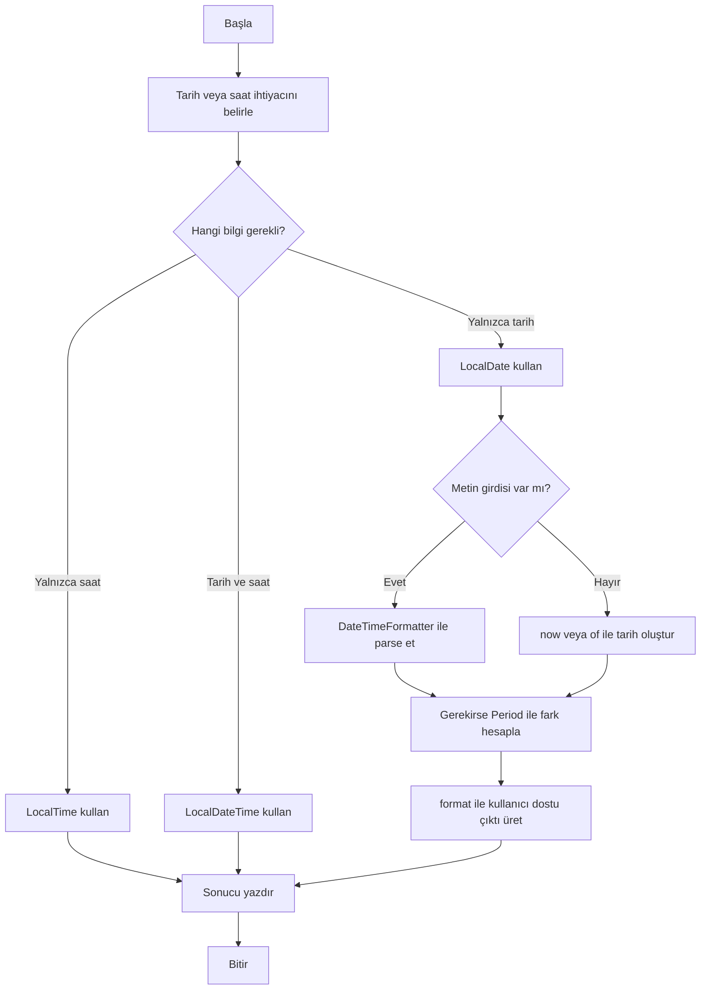

**Diyagram 12.1:** Temel Date-Time işlem akışı.

**Görsel üretim notu:** Bu Mermaid diyagramı final DOCX/PDF üretiminden önce PNG’ye dönüştürülmeli; ham `flowchart TD` kodu final çıktıda görünmemelidir. Önerilen görsel genişliği 12–13 cm aralığında tutulmalıdır.

## 12.15 Adım adım kod örnekleri

Bu bölümde Date-Time kullanımı basit örneklerden bütünleşik uygulamaya doğru gösterilecektir.

### Kod 12.1: `LocalDate`, `LocalTime` ve `LocalDateTime` temel kullanımı

**Kod kimliği:** `b12_kod01_ve_temel_kullanimi`

**Kod erişimi:** [Kod sayfası](https://github.com/bmdersleri/javaninTemelleri/tree/main/kodlar/bolum12/kod01/) | [Kaynak kod](https://github.com/bmdersleri/javaninTemelleri/blob/main/kodlar/bolum12/kod01/Bolum12Ornek01DateTimeTemel.java) | 

**QR erişimi:** Kod sayfası ve kaynak kod için aşağıdaki iki QR kod kullanılabilir.

{width=2.8cm} {width=2.8cm}


```java
// Dosya: Bolum12Ornek01DateTimeTemel.java
import java.time.LocalDate;
import java.time.LocalDateTime;
import java.time.LocalTime;

public class Bolum12Ornek01DateTimeTemel {
    public static void main(String[] args) {
        LocalDate bugun = LocalDate.now();
        LocalTime simdi = LocalTime.now();
        LocalDateTime zamanDamgasi = LocalDateTime.now();

        LocalDate sabitTarih = LocalDate.of(2026, 4, 26);
        LocalTime dersSaati = LocalTime.of(9, 30);

        System.out.println("Bugünün tarihi: " + bugun);
        System.out.println("Şu anki saat: " + simdi);
        System.out.println("Zaman damgası: " + zamanDamgasi);
        System.out.println("Sabit tarih: " + sabitTarih);
        System.out.println("Ders saati: " + dersSaati);
    }
}
```

**Kodun amacı:** `LocalDate`, `LocalTime` ve `LocalDateTime` sınıflarının temel kullanımını göstermek.

**Kritik satırlar:**

1. `LocalDate.now()` çalıştırma tarihini verir.
2. `LocalTime.now()` çalıştırma saatini verir.
3. `LocalDateTime.now()` tarih ve saati birlikte verir.
4. `LocalDate.of(2026, 4, 26)` sabit tarih oluşturur.
5. `LocalTime.of(9, 30)` sabit saat oluşturur.

**Beklenen davranış:** `now()` kullanılan değerler çalıştırma anına göre değişir. `of()` ile oluşturulan değerler sabittir.

### Kod 12.2: `DateTimeFormatter` ile tarih biçimlendirme

**Kod kimliği:** `b12_kod02_ile_tarih_bicimlendirme`

**Kod erişimi:** [Kod sayfası](https://github.com/bmdersleri/javaninTemelleri/tree/main/kodlar/bolum12/kod02/) | [Kaynak kod](https://github.com/bmdersleri/javaninTemelleri/blob/main/kodlar/bolum12/kod02/Bolum12Ornek02TarihBicimlendirme.java) | 

**QR erişimi:** Kod sayfası ve kaynak kod için aşağıdaki iki QR kod kullanılabilir.

{width=2.8cm} {width=2.8cm}


```java
// Dosya: Bolum12Ornek02TarihBicimlendirme.java
import java.time.LocalDate;
import java.time.format.DateTimeFormatter;

public class Bolum12Ornek02TarihBicimlendirme {
    public static void main(String[] args) {
        LocalDate tarih = LocalDate.of(2026, 4, 26);

        DateTimeFormatter formatter =
                DateTimeFormatter.ofPattern("dd.MM.yyyy");

        String bicimliTarih = tarih.format(formatter);

        System.out.println("Varsayılan biçim: " + tarih);
        System.out.println("Biçimlendirilmiş tarih: " + bicimliTarih);
    }
}
```

**Kodun amacı:** `LocalDate` değerini kullanıcı dostu biçimde yazdırmak.

**Beklenen çıktı:**

```text
Varsayılan biçim: 2026-04-26
Biçimlendirilmiş tarih: 26.04.2026
```

**Dikkat noktası:** Biçimlendirme, tarih değerinin kendisini değil, ekrana yazdırılma biçimini etkiler.

### Kod 12.3: Metinden tarih oluşturma

**Kod kimliği:** `b12_kod03_metinden_tarih_olusturma`

**Kod erişimi:** [Kod sayfası](https://github.com/bmdersleri/javaninTemelleri/tree/main/kodlar/bolum12/kod03/) | [Kaynak kod](https://github.com/bmdersleri/javaninTemelleri/blob/main/kodlar/bolum12/kod03/Bolum12Ornek03MetindenTarih.java) | 

**QR erişimi:** Kod sayfası ve kaynak kod için aşağıdaki iki QR kod kullanılabilir.

{width=2.8cm} {width=2.8cm}


```java
// Dosya: Bolum12Ornek03MetindenTarih.java
import java.time.LocalDate;
import java.time.format.DateTimeFormatter;

public class Bolum12Ornek03MetindenTarih {
    public static void main(String[] args) {
        String tarihMetni = "20.05.2005";

        DateTimeFormatter formatter =
                DateTimeFormatter.ofPattern("dd.MM.yyyy");

        LocalDate tarih = LocalDate.parse(tarihMetni, formatter);

        System.out.println("LocalDate değeri: " + tarih);
        System.out.println("Biçimli çıktı: " + tarih.format(formatter));
    }
}
```

**Kodun amacı:** Metin olarak verilen tarihi `LocalDate` değerine dönüştürmek.

**Beklenen çıktı:**

```text
LocalDate değeri: 2005-05-20
Biçimli çıktı: 20.05.2005
```

**Dikkat noktası:** `tarihMetni` ile formatter deseni uyumlu olmalıdır.

### Kod 12.4: `Period` ile yaş hesabı

**Kod kimliği:** `b12_kod04_ile_yas_hesabi`

**Kod erişimi:** [Kod sayfası](https://github.com/bmdersleri/javaninTemelleri/tree/main/kodlar/bolum12/kod04/) | [Kaynak kod](https://github.com/bmdersleri/javaninTemelleri/blob/main/kodlar/bolum12/kod04/Bolum12Ornek04YasHesaplama.java) | 

**QR erişimi:** Kod sayfası ve kaynak kod için aşağıdaki iki QR kod kullanılabilir.

{width=2.8cm} {width=2.8cm}


```java
// Dosya: Bolum12Ornek04YasHesaplama.java
import java.time.LocalDate;
import java.time.Period;

public class Bolum12Ornek04YasHesaplama {
    public static void main(String[] args) {
        LocalDate dogumTarihi = LocalDate.of(2005, 5, 20);
        LocalDate bugun = LocalDate.now();

        Period yas = Period.between(dogumTarihi, bugun);

        System.out.println("Yıl: " + yas.getYears());
        System.out.println("Ay: " + yas.getMonths());
        System.out.println("Gün: " + yas.getDays());
    }
}
```

**Kodun amacı:** İki tarih arasındaki farkı yıl, ay ve gün olarak hesaplamak.

**Beklenen davranış:** Sonuç programın çalıştırıldığı tarihe göre değişir.

**Dikkat noktası:** `Period.between()` başlangıç ve bitiş tarihlerini doğru sırayla almalıdır.

### Kod 12.5: Kullanıcıdan doğum tarihi alma ve yaş hesaplama

**Kod kimliği:** `b12_kod05_kullanicidan_dogum_tarihi_alma_ve_yas_hesaplama`

**Kod erişimi:** [Kod sayfası](https://github.com/bmdersleri/javaninTemelleri/tree/main/kodlar/bolum12/kod05/) | [Kaynak kod](https://github.com/bmdersleri/javaninTemelleri/blob/main/kodlar/bolum12/kod05/Bolum12Ornek05KullaniciYasHesaplama.java) | 

**QR erişimi:** Kod sayfası ve kaynak kod için aşağıdaki iki QR kod kullanılabilir.

{width=2.8cm} {width=2.8cm}


```java
// Dosya: Bolum12Ornek05KullaniciYasHesaplama.java
import java.time.LocalDate;
import java.time.Period;
import java.time.format.DateTimeFormatter;
import java.util.Scanner;

public class Bolum12Ornek05KullaniciYasHesaplama {
    public static void main(String[] args) {
        Scanner scanner = new Scanner(System.in);

        DateTimeFormatter formatter =
                DateTimeFormatter.ofPattern("dd.MM.yyyy");

        System.out.print("Doğum tarihinizi giriniz (gg.aa.yyyy): ");
        String tarihMetni = scanner.nextLine();

        LocalDate dogumTarihi =
                LocalDate.parse(tarihMetni, formatter);

        LocalDate bugun = LocalDate.now();
        Period yas = Period.between(dogumTarihi, bugun);

        System.out.println("Doğum tarihi: "
                + dogumTarihi.format(formatter));
        System.out.println("Bugünün tarihi: "
                + bugun.format(formatter));
        System.out.println("Yaş: " + yas.getYears()
                + " yıl, " + yas.getMonths()
                + " ay, " + yas.getDays() + " gün");

        scanner.close();
    }
}
```

**Kodun amacı:** Kullanıcıdan alınan tarih metnini tarihe dönüştürmek ve yaş hesabı yapmak.

**Örnek girdi:**

```text
20.05.2005
```

**Beklenen davranış:** Yaş sonucu programın çalıştırıldığı tarihe göre değişir.

**Dikkat noktası:** Kullanıcı tarihi `gg.aa.yyyy` biçiminde girmelidir.

### Kod 12.6: Hatalı ve düzeltilmiş tarih biçimi

Hatalı örnek:

**Kod kimliği:** `b12_kod06_hatali_ve_duzeltilmis_tarih_bicimi`

**Kod erişimi:** [Kod sayfası](https://github.com/bmdersleri/javaninTemelleri/tree/main/kodlar/bolum12/kod06/) | [Kaynak kod](https://github.com/bmdersleri/javaninTemelleri/blob/main/kodlar/bolum12/kod06/Bolum12Ornek06TarihBicimHatasi.java) | 

**QR erişimi:** Kod sayfası ve kaynak kod için aşağıdaki iki QR kod kullanılabilir.

{width=2.8cm} {width=2.8cm}


```java
// Dosya: Bolum12Ornek06TarihBicimHatasi.java
import java.time.LocalDate;
import java.time.format.DateTimeFormatter;

public class Bolum12Ornek06TarihBicimHatasi {
    public static void main(String[] args) {
        String tarihMetni = "2005-05-20";

        DateTimeFormatter formatter =
                DateTimeFormatter.ofPattern("dd.MM.yyyy");

        LocalDate tarih = LocalDate.parse(tarihMetni, formatter);

        System.out.println(tarih);
    }
}
```

Bu kodda tarih metni `yyyy-MM-dd` biçimindedir; ancak formatter `dd.MM.yyyy` biçimi beklemektedir. Bu uyumsuzluk çalışma zamanı hatasına neden olabilir.

Düzeltilmiş örnek:

**Kod kimliği:** `b12_kod06_hatali_ve_duzeltilmis_tarih_bicimi_2`

**Kod erişimi:** [Kod sayfası](https://github.com/bmdersleri/javaninTemelleri/tree/main/kodlar/bolum12/kod06_2/) | [Kaynak kod](https://github.com/bmdersleri/javaninTemelleri/blob/main/kodlar/bolum12/kod06_2/Bolum12Ornek06TarihBicimHatasi.java) | 

**QR erişimi:** Kod sayfası ve kaynak kod için aşağıdaki iki QR kod kullanılabilir.

{width=2.8cm} {width=2.8cm}


```java
// Dosya: Bolum12Ornek06TarihBicimHatasi.java
import java.time.LocalDate;
import java.time.format.DateTimeFormatter;

public class Bolum12Ornek06TarihBicimHatasi {
    public static void main(String[] args) {
        String tarihMetni = "20.05.2005";

        DateTimeFormatter formatter =
                DateTimeFormatter.ofPattern("dd.MM.yyyy");

        LocalDate tarih = LocalDate.parse(tarihMetni, formatter);

        System.out.println(tarih.format(formatter));
    }
}
```

**Beklenen çıktı:**

```text
20.05.2005
```

**Dikkat noktası:** Biçim uyumsuzluğu bu bölümde kavramsal olarak gösterilmiştir. Bu hatayı `try-catch` ile yakalama işlemi hata yönetimi bölümünde ele alınacaktır.

## 12.16 Kodun çalışma mantığı ve beklenen çıktı

Date-Time programlarında iki tür değerle karşılaşılır:

1. Sabit değerler
2. Çalıştırma anına bağlı değerler

Sabit değer örneği:

```java
LocalDate tarih = LocalDate.of(2026, 4, 26);
```

Bu kod her zaman aynı tarihi oluşturur.

Çalıştırma anına bağlı değer örneği:

```java
LocalDate bugun = LocalDate.now();
```

Bu kod programın çalıştırıldığı güne göre değişir.

Yaş hesabı akışı şu şekilde izlenebilir:

| Adım | İşlem | Açıklama |
|---:|---|---|
| 1 | Doğum tarihi alınır | Kullanıcıdan metin veya sabit tarih |
| 2 | Formatter oluşturulur | `dd.MM.yyyy` gibi biçim deseni |
| 3 | Metin tarihe dönüştürülür | `LocalDate.parse()` |
| 4 | Bugünün tarihi alınır | `LocalDate.now()` |
| 5 | Fark hesaplanır | `Period.between()` |
| 6 | Yıl, ay, gün okunur | `getYears()`, `getMonths()`, `getDays()` |
| 7 | Sonuç yazdırılır | `format()` ile okunabilir çıktı |

> **💡 İpucu:** Tarih-zaman programlarında sabit test için `LocalDate.of(...)`; gerçek çalışma tarihi için `LocalDate.now()` kullanılır.

## 12.17 Uçtan uca mini uygulama: Yaş ve Kayıt Zamanı Aracı

Bu bölümün mini uygulaması, kullanıcıdan doğum tarihi alır, yaş hesabı yapar, bugünün tarihini biçimlendirir ve kayıt zamanını gösterir.

**Uygulama adı:** Yaş ve Kayıt Zamanı Aracı

**Dosya adı:** `YasVeKayitZamaniAraci.java`

**Amaç:** `LocalDate`, `LocalTime`, `LocalDateTime`, `Period`, `DateTimeFormatter`, `Scanner` ve temel metot kullanımını tek bir konsol uygulamasında birleştirmek.

**Kod kimliği:** `b12_kod28_yas_ve_kayit_zamani_araci`

**Kod erişimi:** [Kod sayfası](https://github.com/bmdersleri/javaninTemelleri/tree/main/kodlar/bolum12/kod28/) | [Kaynak kod](https://github.com/bmdersleri/javaninTemelleri/blob/main/kodlar/bolum12/kod28/YasVeKayitZamaniAraci.java) | 

**QR erişimi:** Kod sayfası ve kaynak kod için aşağıdaki iki QR kod kullanılabilir.

{width=2.8cm} {width=2.8cm}


```java
// Dosya: YasVeKayitZamaniAraci.java
import java.time.LocalDate;
import java.time.LocalDateTime;
import java.time.LocalTime;
import java.time.Period;
import java.time.format.DateTimeFormatter;
import java.util.Scanner;

public class YasVeKayitZamaniAraci {
    public static void main(String[] args) {
        Scanner scanner = new Scanner(System.in);

        DateTimeFormatter tarihFormatter =
                DateTimeFormatter.ofPattern("dd.MM.yyyy");

        System.out.println("=== Yaş ve Kayıt Zamanı Aracı ===");

        System.out.print("Adınızı giriniz: ");
        String ad = scanner.nextLine().trim();

        System.out.print("Doğum tarihinizi giriniz (gg.aa.yyyy): ");
        String tarihMetni = scanner.nextLine();

        LocalDate dogumTarihi =
                LocalDate.parse(tarihMetni, tarihFormatter);

        LocalDate bugun = LocalDate.now();
        LocalTime simdi = LocalTime.now();
        LocalDateTime kayitZamani = LocalDateTime.now();

        Period yas = Period.between(dogumTarihi, bugun);

        System.out.println();
        System.out.println("Ad: " + ad);
        System.out.println("Doğum tarihi: "
                + dogumTarihi.format(tarihFormatter));
        System.out.println("Bugünün tarihi: "
                + bugun.format(tarihFormatter));
        System.out.println("Yaş: " + yas.getYears()
                + " yıl, " + yas.getMonths()
                + " ay, " + yas.getDays() + " gün");
        System.out.println("İşlem saati: " + simdi);
        System.out.println("Kayıt zamanı: " + kayitZamani);

        scanner.close();
    }
}
```

### 12.17.1 Örnek girdi

```text
Adınızı giriniz: Ayşe
Doğum tarihinizi giriniz (gg.aa.yyyy): 20.05.2005
```

### 12.17.2 Beklenen davranış

Program:

1. Kullanıcıdan ad alır.
2. Kullanıcıdan `gg.aa.yyyy` biçiminde doğum tarihi alır.
3. Doğum tarihini `LocalDate` değerine dönüştürür.
4. Bugünün tarihini alır.
5. Yaşı yıl, ay ve gün olarak hesaplar.
6. İşlem saatini gösterir.
7. Kayıt zamanını tarih-saat olarak gösterir.

Çıktıdaki bugünün tarihi, işlem saati, kayıt zamanı ve yaş bilgisi programın çalıştırıldığı ana göre değişebilir.

### 12.17.3 Örnek çıktı yapısı

```text
=== Yaş ve Kayıt Zamanı Aracı ===
Adınızı giriniz: Ayşe
Doğum tarihinizi giriniz (gg.aa.yyyy): 20.05.2005

Ad: Ayşe
Doğum tarihi: 20.05.2005
Bugünün tarihi: çalıştırma tarihine göre değişir
Yaş: çalıştırma tarihine göre değişir
İşlem saati: çalıştırma saatine göre değişir
Kayıt zamanı: çalıştırma anına göre değişir
```

### 12.17.4 Mini uygulamanın kavram eşleştirmesi

| Kullanılan yapı | Uygulamadaki rolü |
|---|---|
| `Scanner` | Kullanıcıdan ad ve doğum tarihi alır |
| `DateTimeFormatter` | Tarih metninin beklenen biçimini tanımlar |
| `LocalDate.parse()` | Tarih metnini `LocalDate` değerine dönüştürür |
| `LocalDate.now()` | Bugünün tarihini alır |
| `LocalTime.now()` | İşlem saatini alır |
| `LocalDateTime.now()` | Kayıt zamanını oluşturur |
| `Period.between()` | Doğum tarihi ile bugün arasındaki farkı hesaplar |
| `format()` | Tarihi kullanıcı dostu biçimde yazdırır |
| `trim()` | Kullanıcı adındaki baş/son boşlukları temizler |

### 12.17.5 Mini uygulama test senaryoları

| Test | Girdi / Durum | Beklenen davranış |
|---:|---|---|
| 1 | `20.05.2005` | Tarih başarıyla parse edilir |
| 2 | Adın başında/sonunda boşluk var | `trim()` ile temizlenir |
| 3 | Bugünün tarihi yazdırılır | Çalıştırma tarihine göre değişir |
| 4 | İşlem saati yazdırılır | Çalıştırma saatine göre değişir |
| 5 | Yaş hesaplanır | Doğum gününe göre yıl, ay, gün değişir |
| 6 | Tarih biçimi `2005-05-20` girilir | Biçim uyumsuzluğu oluşabilir |
| 7 | Tarih `dd.MM.yyyy` biçiminde yazdırılır | Kullanıcı dostu çıktı üretilir |

> **Alıştırma Molası:** Mini uygulamada doğum tarihi yerine “kayıt tarihi” alıp, kayıt tarihi ile bugünün tarihi arasındaki süreyi yıl, ay ve gün olarak hesaplayınız.

## 12.18 Sık yapılan hatalar ve yanlış sezgiler

Bu bölümde görülen hatalar çoğunlukla sınıf seçimi, tarih biçimi ve yaş hesabı mantığından kaynaklanır.

### 12.18.1 Tarihi yalnızca `String` olarak düşünmek

Yanlış düşünce:

```text
Tarih bilgisi metin olarak saklanırsa tüm işlemler yapılabilir.
```

Düzeltme:

Metin gösterim için yararlıdır; ancak tarih farkı ve yaş hesabı için `LocalDate` gibi tarih sınıfları kullanılmalıdır.

### 12.18.2 Yaşı yalnızca yıl farkıyla hesaplamak

Yanlış yaklaşım:

```java
int yas = bugun.getYear() - dogumTarihi.getYear();
```

Bu hesap doğum gününün bu yıl gelip gelmediğini dikkate almaz.

Daha uygun yaklaşım:

```java
Period yas = Period.between(dogumTarihi, bugun);
```

### 12.18.3 `LocalDate` ile saat bilgisi beklemek

`LocalDate` yalnızca tarih bilgisi tutar. Saat bilgisi gerekiyorsa `LocalTime` veya `LocalDateTime` kullanılmalıdır.

### 12.18.4 `LocalTime` ile tarih bilgisi beklemek

`LocalTime` yalnızca saat bilgisi tutar. Hangi güne ait olduğu bilgisi yoktur.

### 12.18.5 Tarih biçimi ile kullanıcı girdisini eşleştirmemek

Formatter şu biçimi bekliyorsa:

```java
DateTimeFormatter.ofPattern("dd.MM.yyyy")
```

kullanıcı girdisi de şu biçimde olmalıdır:

```text
20.05.2005
```

### 12.18.6 `now()` sonucunu sabit beklemek

`LocalDate.now()`, `LocalTime.now()` ve `LocalDateTime.now()` çalışma anına göre değer üretir. Bu nedenle her çalıştırmada aynı sonucu beklemek doğru değildir.

> **💡 İpucu:** Date-Time hatalarında önce kullanılan sınıfı, sonra tarih biçimini, sonra `now()` veya `of()` kullanımını kontrol edin.

## 12.19 Hata ayıklama egzersizi

Aşağıdaki kodun `TarihHatasi.java` adlı dosyaya kaydedildiğini düşünelim.

**Kod kimliği:** `b12_kod32_hata_ayiklama_egzersizi`

**Kod erişimi:** [Kod sayfası](https://github.com/bmdersleri/javaninTemelleri/tree/main/kodlar/bolum12/kod32/) | [Kaynak kod](https://github.com/bmdersleri/javaninTemelleri/blob/main/kodlar/bolum12/kod32/TarihHatasi.java) | 

**QR erişimi:** Kod sayfası ve kaynak kod için aşağıdaki iki QR kod kullanılabilir.

{width=2.8cm} {width=2.8cm}


```java
// Dosya: TarihHatasi.java
import java.time.LocalDate;
import java.time.format.DateTimeFormatter;

public class TarihHatasi {
    public static void main(String[] args) {
        String tarihMetni = "2005-05-20";

        DateTimeFormatter formatter =
                DateTimeFormatter.ofPattern("dd.MM.yyyy");

        LocalDate tarih = LocalDate.parse(tarihMetni, formatter);

        System.out.println(tarih.format(formatter));
    }
}
```

Bu kodda temel sorun, tarih metni ile formatter deseninin uyumsuz olmasıdır.

**Hata analizi:**

| Parça | Değer |
|---|---|
| Tarih metni | `2005-05-20` |
| Formatter deseni | `dd.MM.yyyy` |
| Beklenen metin biçimi | `20.05.2005` |
| Sorun | Metin ve desen uyumsuz |

Düzeltilmiş kod:

**Kod kimliği:** `b12_kod33_hata_ayiklama_egzersizi`

**Kod erişimi:** [Kod sayfası](https://github.com/bmdersleri/javaninTemelleri/tree/main/kodlar/bolum12/kod33/) | [Kaynak kod](https://github.com/bmdersleri/javaninTemelleri/blob/main/kodlar/bolum12/kod33/TarihHatasi.java) | 

**QR erişimi:** Kod sayfası ve kaynak kod için aşağıdaki iki QR kod kullanılabilir.

{width=2.8cm} {width=2.8cm}


```java
// Dosya: TarihHatasi.java
import java.time.LocalDate;
import java.time.format.DateTimeFormatter;

public class TarihHatasi {
    public static void main(String[] args) {
        String tarihMetni = "20.05.2005";

        DateTimeFormatter formatter =
                DateTimeFormatter.ofPattern("dd.MM.yyyy");

        LocalDate tarih = LocalDate.parse(tarihMetni, formatter);

        System.out.println(tarih.format(formatter));
    }
}
```

**Beklenen çıktı:**

```text
20.05.2005
```

**Kendinize sorunuz:**

1. `tarihMetni` hangi biçimdedir?
2. `formatter` hangi biçimi beklemektedir?
3. `LocalDate.parse()` ne yapmaya çalışır?
4. Biçim uyumsuzluğu neden çalışma zamanı hatasına yol açabilir?
5. Bu tür hata sonraki hata yönetimi bölümünde nasıl ele alınabilir?

## 12.20 Ek hata ayıklama egzersizi: Yaş hesabı yanılgısı

Aşağıdaki kodu inceleyiniz.

**Kod kimliği:** `b12_kod34_yas_hesabi_yanilgisi`

**Kod erişimi:** [Kod sayfası](https://github.com/bmdersleri/javaninTemelleri/tree/main/kodlar/bolum12/kod34/) | [Kaynak kod](https://github.com/bmdersleri/javaninTemelleri/blob/main/kodlar/bolum12/kod34/YasHesabiYanilgisi.java) | 

**QR erişimi:** Kod sayfası ve kaynak kod için aşağıdaki iki QR kod kullanılabilir.

{width=2.8cm} {width=2.8cm}


```java
// Dosya: YasHesabiYanilgisi.java
import java.time.LocalDate;

public class YasHesabiYanilgisi {
    public static void main(String[] args) {
        LocalDate dogumTarihi = LocalDate.of(2005, 12, 20);
        LocalDate bugun = LocalDate.of(2026, 4, 26);

        int yas = bugun.getYear() - dogumTarihi.getYear();

        System.out.println("Yaş: " + yas);
    }
}
```

Bu kod yıl farkını `21` olarak hesaplar. Ancak 20 Aralık 2026 henüz gelmediği için kişi 26 Nisan 2026 tarihinde 20 yaşındadır.

Daha uygun kod:

**Kod kimliği:** `b12_kod35_yas_hesabi_yanilgisi`

**Kod erişimi:** [Kod sayfası](https://github.com/bmdersleri/javaninTemelleri/tree/main/kodlar/bolum12/kod35/) | [Kaynak kod](https://github.com/bmdersleri/javaninTemelleri/blob/main/kodlar/bolum12/kod35/YasHesabiYanilgisi.java) | 

**QR erişimi:** Kod sayfası ve kaynak kod için aşağıdaki iki QR kod kullanılabilir.

{width=2.8cm} {width=2.8cm}


```java
// Dosya: YasHesabiYanilgisi.java
import java.time.LocalDate;
import java.time.Period;

public class YasHesabiYanilgisi {
    public static void main(String[] args) {
        LocalDate dogumTarihi = LocalDate.of(2005, 12, 20);
        LocalDate bugun = LocalDate.of(2026, 4, 26);

        Period yas = Period.between(dogumTarihi, bugun);

        System.out.println("Yaş: " + yas.getYears());
    }
}
```

**Beklenen çıktı:**

```text
Yaş: 20
```

**Kendinize sorunuz:**

1. Yalnızca yıl farkı almak neden eksik sonuç verebilir?
2. `Period.between()` doğum gününün gelip gelmediğini nasıl dikkate alır?
3. Testlerde sabit `LocalDate.of()` kullanmak neden yararlı olabilir?

## 12.21 Bölümün sonraki bölümlerle ilişkisi

Bu bölümde tarih ve zaman işlemleri ayrı bir konu olarak ele alındı. `LocalDate`, `LocalTime`, `LocalDateTime`, `Period` ve `DateTimeFormatter` ile temel tarih-saat işlemleri yapılabildi.

Bir sonraki bölümde paketler, `import` kullanımı ve proje düzeni ele alınacaktır. Bu bölümde birçok farklı sınıfın farklı paketlerden içe aktarıldığını gördük. Sonraki bölümde bu durum daha sistematik ele alınacak; sınıfların paketler altında nasıl düzenlendiği, dosya-klasör yapısının nasıl kurulacağı ve küçük bir Java projesinin nasıl organize edileceği açıklanacaktır.

Daha sonraki hata yönetimi bölümünde ise bu bölümde yalnızca dikkat noktası olarak belirtilen tarih biçimi uyumsuzluğu gibi durumların `try-catch` yapısıyla nasıl yönetileceği gösterilecektir.

## 12.22 Bölüm özeti

Bu bölümde Java’da tarih ve zaman işlemleri için kullanılan temel Date-Time API yapıları ele alındı. Modern tarih-zaman işlemleri için `java.time` paketinin kullanıldığı açıklandı.

`LocalDate`, yalnızca tarih bilgisi tutan sınıf olarak tanıtıldı. `LocalDate.now()` ile bugünün tarihinin alınabileceği, `LocalDate.of()` ile belirli bir tarih oluşturulabileceği gösterildi. `LocalTime`, yalnızca saat bilgisi tutan sınıf olarak işlendi. `LocalTime.now()` ve `LocalTime.of()` örnekleri verildi.

`LocalDateTime`, tarih ve saat bilgisini birlikte tutan sınıf olarak açıklandı. Kayıt zamanı, işlem zamanı ve rapor oluşturma zamanı gibi durumlarda kullanılabileceği belirtildi.

`Period`, iki tarih arasındaki yıl, ay ve gün farkını hesaplamak için kullanıldı. Yaş hesabında yalnızca yıl farkı almanın her zaman doğru olmadığı, doğum gününün gelip gelmediğinin dikkate alınması gerektiği vurgulandı.

`DateTimeFormatter` ile tarih biçimlendirme ve metinden tarih oluşturma işlemleri gösterildi. `dd.MM.yyyy` kalıbı üzerinden `format()` ve `LocalDate.parse()` kullanımları açıklandı. Kullanıcıdan alınan tarih metni ile formatter deseninin uyumlu olması gerektiği belirtildi.

Son olarak Yaş ve Kayıt Zamanı Aracı mini uygulamasıyla kullanıcıdan doğum tarihi alma, yaş hesaplama, bugünün tarihini biçimlendirme, işlem saatini ve kayıt zamanını gösterme işlemleri bir araya getirildi.

## 12.23 Terim sözlüğü

| Terim | Açıklama |
|---|---|
| Date-Time API | Java’da modern tarih ve zaman işlemleri için kullanılan API |
| `java.time` | Date-Time sınıflarını içeren paket |
| `LocalDate` | Yıl, ay ve gün bilgisini tutan sınıf |
| `LocalTime` | Saat, dakika, saniye bilgisini tutan sınıf |
| `LocalDateTime` | Tarih ve saat bilgisini birlikte tutan sınıf |
| `now()` | Çalıştırma anına bağlı değer üreten metot |
| `of()` | Belirli tarih veya saat değeri oluşturan metot |
| `Period` | İki tarih arasındaki yıl, ay ve gün farkını temsil eder |
| `Period.between()` | İki tarih arasındaki süreyi hesaplar |
| `DateTimeFormatter` | Tarih ve zaman biçimlendirme aracı |
| Biçim deseni | Tarihin hangi metin kalıbıyla yazılacağını belirleyen yapı |
| `format()` | Tarihi belirli biçimde metne dönüştürür |
| `parse()` | Metni tarih değerine dönüştürür |
| `dd.MM.yyyy` | Gün.Ay.Yıl biçimindeki temel tarih deseni |
| Yaş hesabı | Doğum tarihi ile bugünün tarihi arasındaki yıl farkı |
| Kayıt zamanı | Bir işlemin gerçekleştiği tarih-saat bilgisi |

## 12.24 Kendini değerlendirme soruları

### 12.24.1 Çoktan seçmeli sorular

1. Yalnızca tarih bilgisini temsil eden sınıf hangisidir?

A) `LocalDate`  
B) `LocalTime`  
C) `LocalDateTime`  
D) `Period`  
E) `Scanner`

2. Yalnızca saat bilgisini temsil eden sınıf hangisidir?

A) `LocalTime`  
B) `LocalDate`  
C) `LocalDateTime`  
D) `String`  
E) `Random`

3. Tarih ve saat bilgisini birlikte temsil eden sınıf hangisidir?

A) `LocalDateTime`  
B) `LocalDate`  
C) `LocalTime`  
D) `Period`  
E) `Math`

4. İki tarih arasındaki yıl, ay ve gün farkını hesaplamak için hangi sınıf kullanılabilir?

A) `Period`  
B) `Random`  
C) `Math`  
D) `Scanner`  
E) `String`

5. Tarihi `26.04.2026` biçiminde yazdırmak için hangi yapı kullanılır?

A) `DateTimeFormatter`  
B) `Random`  
C) `Math.pow()`  
D) `HashMap`  
E) `System.in`

6. `DateTimeFormatter.ofPattern("dd.MM.yyyy")` hangi biçimi bekler?

A) `20.05.2005`  
B) `2005-05-20`  
C) `05/20/2005`  
D) `2005.20.05`  
E) `20-2005-05`

7. `LocalDate.now()` ne üretir?

A) Programın çalıştığı tarihe göre bugünün tarihini  
B) Rastgele tarih  
C) Yalnızca saat bilgisini  
D) Karekök sonucunu  
E) Kullanıcı adını

8. Yaş hesabında yalnızca yıl farkı almak neden sorunlu olabilir?

A) Doğum gününün gelip gelmediğini dikkate almayabilir  
B) Derleme hatası üretir  
C) `Scanner` kapalı olduğu için  
D) Saat bilgisi zorunlu olduğu için  
E) `Math` kullanılmadığı için

### 12.24.2 Doğru/Yanlış soruları

1. `LocalDate` yalnızca tarih bilgisi tutar. (D/Y)
2. `LocalTime` tarih ve saat bilgisini birlikte tutar. (D/Y)
3. `LocalDateTime` tarih ve saat bilgisini birlikte tutabilir. (D/Y)
4. `LocalDate.now()` her çalıştırmada aynı sabit tarihi verir. (D/Y)
5. `LocalDate.of(2026, 4, 26)` sabit bir tarih oluşturur. (D/Y)
6. `Period.between()` iki tarih arasındaki farkı hesaplamak için kullanılabilir. (D/Y)
7. `DateTimeFormatter` tarih biçimlendirme için kullanılabilir. (D/Y)
8. `LocalDate.parse()` metni tarihe dönüştürmek için kullanılabilir. (D/Y)
9. Tarih metni ile formatter deseni uyumsuz olsa da her zaman sorunsuz çalışır. (D/Y)
10. `dd.MM.yyyy` biçiminde `20.05.2005` gibi bir tarih yazılabilir. (D/Y)

### 12.24.3 Açık uçlu kavramsal sorular

1. `LocalDate`, `LocalTime` ve `LocalDateTime` arasındaki farkları açıklayınız.
2. `now()` ve `of()` metotları arasındaki fark nedir?
3. `Period` sınıfı hangi amaçla kullanılır?
4. Yaş hesabında yalnızca yıl farkı almak neden her zaman doğru değildir?
5. `DateTimeFormatter` ne işe yarar?
6. `dd.MM.yyyy` biçim desenini açıklayınız.
7. Metinden tarih oluştururken nelere dikkat edilmelidir?
8. `format()` ve `parse()` arasındaki fark nedir?
9. Tarih-zaman kullanan programlarda beklenen davranış neden önemlidir?
10. Yaş ve Kayıt Zamanı Aracı uygulamasında hangi Date-Time sınıfları hangi görevleri üstlenmektedir?

### 12.24.4 Yanlış gerekçeyi bulma soruları

Aşağıdaki ifadelerdeki yanlış gerekçeyi bulunuz ve düzeltiniz.

1. “Tarih bilgisi yalnızca `String` olarak tutulursa tüm tarih işlemleri kolayca yapılır.”
2. “`LocalDate` saat bilgisi de tutar.”
3. “`LocalTime` tarih bilgisi de tutar.”
4. “`LocalDate.now()` her zaman aynı tarihi üretir.”
5. “Yaş hesabı için yalnızca yıl farkı almak her zaman yeterlidir.”
6. “`DateTimeFormatter` yalnızca rastgele sayı üretmek için kullanılır.”
7. “`dd.MM.yyyy` deseni `2005-05-20` biçimini bekler.”
8. “`parse()` tarih değerini metne dönüştürür.”
9. “`format()` metni tarih değerine dönüştürür.”
10. “Biçim uyumsuzluğu hiçbir zaman hata oluşturmaz.”

## 12.25 Programlama alıştırmaları

### 12.25.1 Kolay düzey

1. `BugununTarihi.java` adlı programda `LocalDate.now()` ile bugünün tarihini yazdırınız.
2. `SaatBilgisi.java` adlı programda `LocalTime.now()` ile anlık saat bilgisini yazdırınız.
3. `ZamanDamgasi.java` adlı programda `LocalDateTime.now()` ile tarih-saat bilgisini yazdırınız.
4. `SabitTarih.java` adlı programda `LocalDate.of()` ile belirli bir tarih oluşturunuz.
5. `TarihBicimlendirme.java` adlı programda bir tarihi `dd.MM.yyyy` biçiminde yazdırınız.

### 12.25.2 Orta düzey

1. `MetindenTarih.java` adlı programda `"20.05.2005"` metnini `LocalDate` değerine dönüştürünüz.
2. `YasHesaplama.java` programında sabit bir doğum tarihi ile bugünün tarihi arasındaki yaşı hesaplayınız.
3. `KullaniciYasHesaplama.java` programında kullanıcıdan doğum tarihi alıp yaşı hesaplayınız.
4. `KayitZamani.java` programında kayıt anını `LocalDateTime.now()` ile yazdırınız.
5. `TarihBicimHatasi.java` programında biçim uyumsuzluğu oluşturan bir tarih metnini inceleyiniz ve düzeltiniz.

### 12.25.3 Zor düzey

1. `YasVeKayitZamaniAraci.java` uygulamasını geliştiriniz.
2. Kullanıcıdan ad ve doğum tarihi alınız.
3. Doğum tarihini `dd.MM.yyyy` desenine göre parse ediniz.
4. Bugünün tarihini alınız.
5. Yaşı yıl, ay ve gün olarak hesaplayınız.
6. İşlem saatini `LocalTime.now()` ile yazdırınız.
7. Kayıt zamanını `LocalDateTime.now()` ile gösteriniz.
8. Tarihleri kullanıcı dostu biçimde yazdırınız.
9. En az yedi test senaryosu oluşturunuz.
10. Yaş hesabında yıl farkı kullanmanın neden hatalı olabileceğini gösteren bir örnek yazınız.

## 12.26 Haftalık laboratuvar / proje görevi

**Görev başlığı:** Yaş ve Kayıt Zamanı Aracı Laboratuvarı

**Amaç:** Bu görev, öğrencinin Java Date-Time API sınıflarını kullanarak kullanıcıdan alınan tarih bilgisini işlemesini, yaş hesabı yapmasını ve kayıt zamanı üretmesini amaçlar.

**Beklenen adımlar:**

1. `YasVeKayitZamaniAraci.java` adlı dosyayı oluşturunuz.
2. `LocalDate`, `LocalTime`, `LocalDateTime`, `Period` ve `DateTimeFormatter` sınıflarını import ediniz.
3. Kullanıcıdan ad bilgisini alınız.
4. Kullanıcıdan doğum tarihini `gg.aa.yyyy` biçiminde alınız.
5. `DateTimeFormatter.ofPattern("dd.MM.yyyy")` ile formatter oluşturunuz.
6. Doğum tarihini `LocalDate.parse()` ile tarihe dönüştürünüz.
7. `LocalDate.now()` ile bugünün tarihini alınız.
8. `Period.between()` ile yaşı yıl, ay ve gün olarak hesaplayınız.
9. `LocalTime.now()` ile işlem saatini yazdırınız.
10. `LocalDateTime.now()` ile kayıt zamanını yazdırınız.
11. Tarihleri `format()` ile kullanıcı dostu biçimde gösteriniz.
12. En az yedi test senaryosu çalıştırınız.
13. Biçim uyumsuzluğu örneği oluşturup neden hata oluşturabileceğini açıklayınız.
14. Kısa bir `README.md` dosyası hazırlayınız.

**Teslim edilecek dosyalar:**

1. `YasVeKayitZamaniAraci.java`
2. `README.md`
3. En az yedi test çıktısı
4. Biçim uyumsuzluğu açıklama notu

**README içeriği şu başlıkları içermelidir:**

1. Programın amacı
2. Kullanılan Date-Time sınıfları
3. Tarih biçimi
4. Yaş hesabı yöntemi
5. Test senaryoları
6. Karşılaşılan biçim sorunu ve açıklaması
7. Geliştirme önerileri

## 12.27 Değerlendirme rubriği

| Ölçüt | Açıklama | Puan |
|---|---|---:|
| Date-Time sınıflarını kullanma | `LocalDate`, `LocalTime`, `LocalDateTime` kullanımı | 20 |
| Yaş hesabı | `Period.between()` ile yıl, ay, gün hesabı | 20 |
| Tarih biçimlendirme | `DateTimeFormatter`, `format()` ve `parse()` kullanımı | 20 |
| Mini uygulama işlevleri | Ad alma, doğum tarihi alma, yaş ve kayıt zamanı gösterme | 15 |
| Kodun çalışması | Programın derlenebilir ve çalıştırılabilir olması | 10 |
| Kavramsal doğruluk | `now/of`, `format/parse`, `LocalDate/LocalTime` ayrımlarının doğru kullanılması | 10 |
| Raporlama | README, test çıktıları ve biçim açıklama notu | 5 |
| **Toplam** |  | **100** |

## 12.28 İleri okuma ve kaynaklar

Bu bölümde Date-Time API başlangıç düzeyinde ele alınmıştır. Daha ayrıntılı çalışma için aşağıdaki kaynak türleri incelenebilir:

1. **Java SE API dokümantasyonu:** `LocalDate`, `LocalTime`, `LocalDateTime`, `Period` ve `DateTimeFormatter` sınıflarının resmî davranışlarını incelemek için temel kaynaktır.
2. **Dev.java öğrenme kaynakları:** Java standart kütüphanesi ve Date-Time kullanımı için güncel öğrenme içerikleri sunar.
3. **Oracle Java Tutorials:** Tarih-zaman kullanımı ve biçimlendirme konularında örnek odaklı açıklamalar içerir.
4. **Ders içi ek notlar:** `Period`, yaş hesabı, `format()` ve `parse()` ayrımı için pekiştirme materyali olarak kullanılabilir.

> **💡 İpucu:** İleri kaynaklarda `ZonedDateTime`, `Instant`, zaman dilimleri, eski `Date`/`Calendar` sınıfları ve uluslararasılaştırma gibi konularla karşılaşabilirsiniz. Bu bölümde yalnızca temel Date-Time kullanımı amaçlanmıştır.

## 12.29 Bir sonraki bölüme köprü

Bu bölümde Java Date-Time API ile tarih ve zaman işlemleri ele alındı. Bir sonraki bölümde paketler, `import` kullanımı ve proje düzeni ayrı olarak incelenecektir. Böylece farklı sınıfların hangi paketlerden geldiği, dosya ve klasör yapısının nasıl düzenleneceği ve küçük Java projelerinin daha okunabilir biçimde nasıl organize edileceği ele alınacaktır.

**BÖLÜM SONU**


\newpage


# Bölüm 13: Paketler, import Kullanımı ve Proje Düzeni

## 13.1 Bölümün yol haritası

Önceki bölümlerde Java programları çoğunlukla tek dosya içinde yazıldı. Bu yaklaşım başlangıç düzeyinde öğrenmeyi kolaylaştırır. Ancak program büyüdükçe tüm kodu tek dosyada tutmak zorlaşır. Bir programda metin işlemleri, sayı işlemleri, tarih işlemleri ve kullanıcı arayüzü gibi farklı görevler varsa bu görevleri ayrı dosyalara ve düzenli klasörlere ayırmak daha doğru bir yaklaşımdır.

Bu bölümde küçük Java projelerinde düzenli yapı kurmanın temel yolları ele alınacaktır. `package`, `import`, klasör yapısı, yardımcı sınıf ve kod organizasyonu kavramları sade ve uygulama odaklı örneklerle açıklanacaktır. Bu bölümün odağı hazır sınıfların ayrıntılı kullanımı değil, sınıfların nereden geldiğini ve proje içinde nasıl düzenlendiğini anlamaktır.

Bu bölümde şu sorulara yanıt aranacaktır:

1. Paket kavramı ne işe yarar?
2. `package` ifadesi Java dosyasında nereye yazılır?
3. `import` ifadesi neden kullanılır?
4. `java.util` ve `java.io` gibi paketler nasıl okunmalıdır?
5. Klasör yapısı ile paket adı arasında nasıl ilişki vardır?
6. Yardımcı sınıf nedir ve neden kullanılır?
7. Çok dosyalı küçük bir Java projesi nasıl düzenlenir?
8. Kod organizasyonu programın okunabilirliğini nasıl etkiler?
9. Paket ve import kullanırken hangi başlangıç hataları yapılır?
10. Paketlenmiş Yardımcı Araçlar Projesi nasıl oluşturulur?

> **🎯 Bölüm Hedefi:** Bu bölümün sonunda öğrenci, küçük Java projelerinde dosyaları ve sınıfları düzenli biçimde organize edebilecek, temel `package` ve `import` kullanımını açıklayabilecek ve yardımcı sınıflarla daha okunabilir proje yapısı kurabilecektir.

Bu bölümde modüler Java, Maven proje yapısı, Gradle, jar üretimi ve ayrıntılı dağıtım süreçlerine girilmeyecektir. Amaç, temel programlama düzeyinde çok dosyalı proje düzeni kazandırmaktır.

## 13.2 Bölümün konumu ve pedagojik rolü

Bu bölüm, tek dosyalı örneklerden çok dosyalı küçük projelere geçiş sağlar. Önceki bölümlerde `Scanner`, `Random`, `LocalDate`, `Period` ve `DateTimeFormatter` gibi farklı paketlerdeki sınıfların kullanıldığını gördük. Bu deneyim, `import` kavramının neden önemli olduğunu gösterdi. Bu bölümde ise `import` daha sistematik biçimde ele alınacak ve öğrencinin kendi sınıflarını da düzenli paketler altında toplayabileceği gösterilecektir.

Bir program büyüdükçe kodu tek dosyada tutmak şu sorunlara yol açabilir:

1. Dosya çok uzar.
2. Metotların görevleri karışır.
3. Hata bulmak zorlaşır.
4. Aynı kod tekrar tekrar yazılır.
5. Farklı işlevler birbirinden ayrılamaz.
6. Proje yapısı başkaları tarafından zor anlaşılır.

Paketler ve yardımcı sınıflar, bu sorunları azaltmak için kullanılır. Bu bölümde öğrencinin amacı büyük kurumsal mimari öğrenmek değil, küçük projelerde düzenli düşünme alışkanlığı kazanmaktır.

> **⚠️ Dikkat:** Paket kullanımı ileri düzey proje mimarisi anlamına gelmez. Basit bir Java projesinde bile sınıfları anlamlı klasörlerde toplamak, kodun okunabilirliğini artırır.

Bu bölüm, bir sonraki bölümde ele alınacak koleksiyonlar konusuna da hazırlık yapar. `ArrayList`, `HashSet` ve `HashMap` gibi yapılar `java.util` paketi içinde yer alır ve kullanımları için `import` bilgisi gerekir.

## 13.3 Öğrenme çıktıları

Bu bölüm tamamlandığında öğrenci:

1. `package` kavramını kendi cümleleriyle açıklayabilir.
2. `package` ifadesinin Java dosyasındaki yerini gösterebilir.
3. `import` ifadesinin görevini açıklayabilir.
4. `java.util` ve `java.io` paketlerinin temel kullanım amaçlarını ayırt edebilir.
5. Paket adı ile klasör yapısı arasındaki ilişkiyi yorumlayabilir.
6. Yardımcı sınıf kavramını açıklayabilir.
7. Kod organizasyonunun okunabilirlik ve bakım açısından önemini açıklayabilir.
8. Çok dosyalı küçük bir Java projesi için basit klasör yapısı oluşturabilir.
9. Paket ve import hatalarını tanıyabilir.
10. Paketlenmiş Yardımcı Araçlar Projesi adlı mini uygulamayı geliştirebilir.

## 13.4 Ön bilgi ve başlangıç varsayımları

Bu bölüm, öğrencinin aşağıdaki konuları temel düzeyde bildiğini varsayar:

1. Java programının temel yapısı
2. Sınıf ve dosya adı ilişkisi
3. Metot tanımlama ve çağırma
4. `static` yardımcı metot kullanımı
5. Diziler ve `String` işlemleri
6. `Scanner`, `Random` ve Date-Time sınıflarında temel `import` kullanımı
7. Terminal veya IDE üzerinde basit Java programı çalıştırma

Bu bölümde anlatılan proje düzeni temel düzeydedir. Profesyonel build sistemleri ve bağımlılık yönetimi bu bölümün kapsamı dışındadır.

## 13.5 Ana kavramlar

| Kavram | Kısa açıklama | Bu bölümdeki rolü |
|---|---|---|
| `package` | Sınıfın ait olduğu paketi belirtir | Kodları gruplandırır |
| `import` | Başka paketlerdeki sınıfları kullanmayı sağlar | Kütüphane erişimi |
| `java.util` | Yardımcı sınıflar içeren paket | `Scanner`, `Random`, `ArrayList` |
| `java.io` | Girdi/çıktı sınıfları içeren paket | Dosya ve akış işlemleri |
| Klasör yapısı | Dosyaların dizin düzeni | Paket adıyla ilişkilidir |
| Yardımcı sınıf | Belirli işlevleri toplayan sınıf | Kod tekrarını azaltır |
| Kod organizasyonu | Kodun anlamlı parçalara ayrılması | Bakımı kolaylaştırır |
| Tam nitelikli ad | Paket adıyla birlikte sınıf adı | Çakışmaları azaltır |
| Kaynak klasörü | Java kaynak dosyalarının tutulduğu klasör | Proje düzeni sağlar |

> **🎯 Sınav Notu:** Java dosyasında `package` ifadesi varsa, yorumlar ve boş satırlar dışında en üstte yer almalıdır. `import` ifadeleri `package` satırından sonra yazılır.

## 13.6 Paket kavramı

Paket, Java sınıflarını mantıksal gruplara ayırmak için kullanılan yapıdır. Örneğin metin işlemleriyle ilgili sınıflar bir pakette, sayı işlemleriyle ilgili sınıflar başka bir pakette tutulabilir.

Basit bir paket bildirimi şu şekildedir:

```java
package edu.kitap.araclar;
```

Bu satır, ilgili sınıfın `edu.kitap.araclar` adlı paket içinde olduğunu belirtir.

### 13.6.1 Paket neden kullanılır?

Paketlerin temel amaçları şunlardır:

1. Sınıfları düzenli gruplara ayırmak
2. Aynı isimli sınıfların karışmasını önlemek
3. Büyük projelerde dosya düzenini korumak
4. Kodun okunabilirliğini artırmak
5. Yardımcı sınıfları mantıksal alanlara ayırmak

Örneğin aşağıdaki sınıfları düşünelim:

```text
MetinAraci
SayiAraci
TarihAraci
AnaUygulama
```

Bu sınıfların tamamını aynı klasörde tutmak mümkündür. Ancak proje büyüdükçe şu tür bir ayrım daha anlamlı olabilir:

```text
edu.kitap.araclar.MetinAraci
edu.kitap.araclar.SayiAraci
edu.kitap.uygulama.AnaUygulama
```

### 13.6.2 Paket adı nasıl seçilir?

Paket adları genellikle küçük harflerle yazılır. Türkçe karakter kullanılmaması önerilir. Örneğin:

```text
edu.kitap.araclar
edu.kitap.uygulama
```

Bu kitapta paket adları kısa ve öğretim amaçlı tutulacaktır. Gerçek projelerde kurum veya alan adı temelli daha ayrıntılı paket adları kullanılabilir.

> **💡 İpucu:** Paket adı seçerken anlamlı, kısa, küçük harfli ve klasör yapısıyla uyumlu adlar kullanmak iyi bir alışkanlıktır.

## 13.7 Klasör yapısı ve paket ilişkisi

Java'da paket adı ile dosyanın klasör konumu arasında ilişki vardır. Örneğin şu paket bildirimi:

```java
package edu.kitap.araclar;
```

genellikle şu klasör yapısına karşılık gelir:

```text
src/
└── edu/
    └── kitap/
        └── araclar/
            └── MetinAraci.java
```

Bu yapı, Java dosyasının hangi pakete ait olduğunu fiziksel klasör düzeninde de gösterir.

### 13.7.1 Basit proje yapısı

Başlangıç düzeyi için şu proje yapısı yeterlidir:

```text
paketli-proje/
├── src/
│   └── edu/
│       └── kitap/
│           ├── araclar/
│           │   ├── MetinAraci.java
│           │   └── SayiAraci.java
│           └── uygulama/
│               └── PaketlenmisYardimciAraclarProjesi.java
└── README.md
```

Bu yapıda:

1. `src` kaynak kod klasörüdür.
2. `edu/kitap/araclar` yardımcı sınıfları içerir.
3. `edu/kitap/uygulama` ana uygulama sınıfını içerir.
4. `README.md` proje açıklamasını içerir.

### 13.7.2 Klasör yapısını neden önemsemeliyiz?

Paket bildirimi ile klasör yapısı uyumsuz olduğunda IDE veya terminal derleme sırasında hata verebilir. Bu nedenle paketli projelerde dosyanın hangi klasörde bulunduğu önemlidir.

> **⚠️ Dikkat:** `package edu.kitap.araclar;` yazan bir dosyanın rastgele bir klasörde durması beklenmeyen derleme veya çalıştırma sorunlarına yol açabilir.

## 13.8 `import` kavramı

`import`, başka paketlerde yer alan sınıfları kullanmak için yazılır. Örneğin `Scanner` sınıfı `java.util` paketi içindedir. Bu sınıfı kullanmak için şu ifade yazılır:

```java
import java.util.Scanner;
```

Benzer şekilde `Random` için:

```java
import java.util.Random;
```

`File` sınıfı için:

```java
import java.io.File;
```

### 13.8.1 Import nerede yazılır?

Java dosyasında sıralama genel olarak şöyledir:


```java
package edu.kitap.uygulama;

import java.util.Scanner;
import java.io.File;

public class AnaUygulama {
    public static void main(String[] args) {
        System.out.println("Merhaba");
    }
}
```

Eğer `package` ifadesi yoksa `import` ifadeleri dosyanın en üst kısmında yer alır.

### 13.8.2 Tam nitelikli ad kullanımı

Bazen `import` yazmadan sınıfın tam nitelikli adı kullanılabilir:

```java
java.util.Scanner scanner = new java.util.Scanner(System.in);
```

Bu kullanım geçerlidir; ancak kodu uzatır. Bu nedenle çoğu zaman `import` kullanmak daha okunabilir bir çözümdür.

### 13.8.3 Yıldızlı import

Aynı paketten çok sayıda sınıf kullanılacaksa yıldızlı import görülebilir:

```java
import java.util.*;
```

Bu ifade `java.util` paketindeki sınıfları kullanmayı kolaylaştırır. Ancak başlangıç düzeyinde hangi sınıfın kullanıldığını açıkça görmek için tek tek import yazmak daha öğreticidir.

> **🎯 Sınav Notu:** `import java.util.Scanner;` yalnızca `Scanner` sınıfını içe aktarır. `import java.util.*;` ise `java.util` paketindeki sınıfların kullanılmasına izin verir; alt paketleri otomatik olarak içe aktarmaz.

## 13.9 `java.util` ve `java.io` paketlerine kısa bakış

Java standart kütüphanesi birçok paketten oluşur. Bu bölümde özellikle iki paket adı sık karşımıza çıkar:

1. `java.util`
2. `java.io`

### 13.9.1 `java.util`

`java.util`, yardımcı sınıfların bulunduğu önemli bir pakettir. Bu kitapta daha önce veya ilerleyen bölümlerde şu sınıflarla karşılaşılır:

| Sınıf | Kullanım amacı |
|---|---|
| `Scanner` | Kullanıcı girdisi alma |
| `Random` | Rastgele sayı üretme |
| `ArrayList` | Dinamik liste yönetimi |
| `Collections` | Koleksiyon işlemleri |

Bir sonraki bölümde koleksiyonlar işleneceği için `java.util` paketi tekrar gündeme gelecektir.

### 13.9.2 `java.io`

`java.io`, giriş/çıkış işlemleriyle ilgili sınıflar içerir. Dosya okuma, dosya yazma ve akış işlemleri bu paketle ilişkilidir. Bu bölümde ayrıntılı dosya işlemlerine girilmeyecek; ancak `File` sınıfı basit proje yolu örneği için kullanılacaktır.

```java
import java.io.File;
```

`File`, bir dosya veya klasör yolunu temsil etmek için kullanılabilir.

> **⚠️ Dikkat:** `java.io` kullanmak dosya işlemlerine giriş anlamına gelebilir; ancak ayrıntılı dosya okuma-yazma işlemleri ilerleyen bölümlerde ele alınacaktır.

## 13.10 Yardımcı sınıf kavramı

Yardımcı sınıf, belirli türde işlemleri bir arada tutmak için kullanılan sınıftır. Örneğin metin işlemleri için `MetinAraci`, sayı işlemleri için `SayiAraci` adlı sınıflar yazılabilir.

Yardımcı sınıflar genellikle şu amaçlarla kullanılır:

1. Kod tekrarını azaltmak
2. Benzer metotları bir araya toplamak
3. Ana programı sadeleştirmek
4. Test etmeyi kolaylaştırmak
5. Proje düzenini güçlendirmek

Basit bir yardımcı sınıf örneği:


```java
public class MetinAraci {
    public static String temizle(String metin) {
        return metin.trim();
    }
}
```

Bu metot, verilen metnin başındaki ve sonundaki boşlukları temizler.

### 13.10.1 Yardımcı sınıf ve ana uygulama ayrımı

Ana uygulama sınıfı programın çalışma noktasını içerir. Yardımcı sınıf ise ana uygulamanın kullanacağı metotları sağlar.

| Sınıf türü | Temel görev |
|---|---|
| Ana uygulama sınıfı | `main` metodunu içerir |
| Yardımcı sınıf | Tekrarlı işlemler için metotlar sağlar |

Bu ayrım, küçük projelerde bile kodun daha okunabilir olmasına yardım eder.

## 13.11 Kod organizasyonu için temel ilkeler

Kod organizasyonu, programın daha kolay anlaşılmasını ve geliştirilmesini sağlar. Başlangıç düzeyinde şu ilkeler yeterlidir:

1. Her sınıfa anlamlı bir görev ver.
2. Sınıf adlarını açık ve anlaşılır seç.
3. Yardımcı metotları ilgili yardımcı sınıfta topla.
4. Paket adlarını küçük harfle yaz.
5. Dosya adı ile `public class` adını uyumlu tut.
6. `package` ve klasör yapısını uyumlu kur.
7. Gereksiz import ifadelerinden kaçın.
8. Ana uygulama sınıfını çok fazla görevle doldurma.

> **💡 İpucu:** Bir sınıfın ne yaptığı tek cümlede açıklanamıyorsa, o sınıfın fazla görev üstlenmiş olma ihtimali vardır.

## 13.12 Proje düzeni akışı

Paketli küçük bir Java projesi kurarken şu akış izlenebilir:

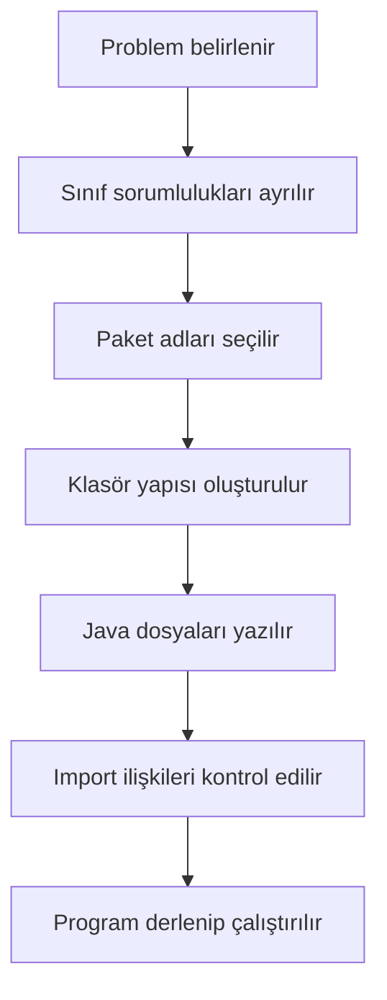

**Diyagram 13.1:** Paketli küçük bir Java projesi oluşturma akışı.

**Görsel üretim notu:** Bu Mermaid diyagramı final DOCX/PDF üretiminden önce PNG'ye dönüştürülmeli; ham `flowchart TD` kodu final çıktıda görünmemelidir.

Bu akış, öğrencinin “önce kodu yazayım, sonra düzenlerim” yaklaşımı yerine küçük de olsa planlı proje geliştirmesini destekler.

## 13.13 Adım adım kod örnekleri

Bu bölümde üç temel kod örneği verilecektir. İlk örnek tek dosyalı import kullanımını, ikinci örnek yardımcı sınıf fikrini, üçüncü örnek ise yaygın paket/import hatasını gösterir.

### 13.13.1 Kod 13.1: Temel import örneği

**Kod kimliği:** `b13_kod01_temel_import_ornegi`

**Kod erişimi:** [Kod sayfası](https://github.com/bmdersleri/javaninTemelleri/tree/main/kodlar/bolum13/kod01/) | [Kaynak kod](https://github.com/bmdersleri/javaninTemelleri/blob/main/kodlar/bolum13/kod01/PaketlerimportveProjeDuzeniTemel.java) | 

**QR erişimi:** Kod sayfası ve kaynak kod için aşağıdaki iki QR kod kullanılabilir.

{width=2.8cm} {width=2.8cm}


```java
// Dosya: PaketlerimportveProjeDuzeniTemel.java
import java.util.Random;
import java.util.Scanner;

public class PaketlerimportveProjeDuzeniTemel {
    public static void main(String[] args) {
        Scanner scanner = new Scanner(System.in);
        Random random = new Random();

        System.out.print("Adınızı giriniz: ");
        String ad = scanner.nextLine();

        int kod = random.nextInt(900) + 100;

        System.out.println("Merhaba " + ad);
        System.out.println("Geçici kullanıcı kodunuz: " + kod);

        scanner.close();
    }
}
```

**Kodun amacı:** `java.util.Scanner` ve `java.util.Random` sınıflarının `import` ile kullanılmasını göstermek.

**Kritik satırlar:**

1. `import java.util.Scanner;` kullanıcı girdisi için gereklidir.
2. `import java.util.Random;` rastgele sayı üretimi için gereklidir.
3. `Random random = new Random();` rastgele sayı üretici nesnesi oluşturur.
4. `random.nextInt(900) + 100` 100–999 arası kod üretir.

**Beklenen davranış:** Program kullanıcıdan ad alır ve rastgele üç basamaklı geçici kod üretir.

**Olası hata ve dikkat noktası:** `Scanner` veya `Random` import edilmezse derleyici sınıfı tanıyamayabilir.

### 13.13.2 Kod 13.2: Yardımcı sınıf kullanılan uygulama

Bu örnekte ana sınıf ve yardımcı sınıf aynı dosyada gösterilmiştir. Başlangıç düzeyinde, tek dosya içinde bir `public` sınıf ve ek bir yardımcı sınıf tanımlanabilir.

**Kod kimliği:** `b13_kod02_yardimci_sinif_kullanilan_uygulama`

**Kod erişimi:** [Kod sayfası](https://github.com/bmdersleri/javaninTemelleri/tree/main/kodlar/bolum13/kod02/) | [Kaynak kod](https://github.com/bmdersleri/javaninTemelleri/blob/main/kodlar/bolum13/kod02/PaketlerimportveProjeDuzeniUygulama.java) | 

**QR erişimi:** Kod sayfası ve kaynak kod için aşağıdaki iki QR kod kullanılabilir.

{width=2.8cm} {width=2.8cm}


```java
// Dosya: PaketlerimportveProjeDuzeniUygulama.java
import java.io.File;
import java.util.Scanner;

public class PaketlerimportveProjeDuzeniUygulama {
    public static void main(String[] args) {
        Scanner scanner = new Scanner(System.in);

        System.out.print("Bir metin giriniz: ");
        String metin = scanner.nextLine();

        String temizMetin = MetinYardimcisi.temizle(metin);
        int kelimeSayisi = MetinYardimcisi.kelimeSay(temizMetin);

        File klasor = new File(".");

        System.out.println("Temiz metin: " + temizMetin);
        System.out.println("Kelime sayısı: " + kelimeSayisi);
        System.out.println("Çalışma klasörü: " + klasor.getAbsolutePath());

        scanner.close();
    }
}

class MetinYardimcisi {
    public static String temizle(String metin) {
        return metin.trim();
    }

    public static int kelimeSay(String metin) {
        if (metin.length() == 0) {
            return 0;
        }

        String[] kelimeler = metin.split(" ");
        return kelimeler.length;
    }
}
```

**Kodun amacı:** Yardımcı sınıf fikrini ve `java.io.File` ile `java.util.Scanner` import kullanımını göstermek.

**Kritik satırlar:**

1. `MetinYardimcisi.temizle` metni temizler.
2. `MetinYardimcisi.kelimeSay` kelime sayısını hesaplar.
3. `File klasor = new File(".");` çalışma klasörünü temsil eder.
4. `getAbsolutePath()` klasörün tam yolunu verir.

**Beklenen davranış:** Program kullanıcıdan metin alır, metni temizler, kelime sayısını bulur ve çalışma klasörünü gösterir.

**Olası hata ve dikkat noktası:** Bu örnekte `MetinYardimcisi` sınıfı `public` değildir. Aynı dosyada yalnızca bir `public` sınıf bulunmalıdır ve dosya adı bu sınıfla aynı olmalıdır.

> **🎯 Sınav Notu:** Bir `.java` dosyasında en fazla bir `public` sınıf bulunur. Dosya adı, `public` sınıf adıyla aynı olmalıdır.

### 13.13.3 Kod 13.3: Hatalı ve düzeltilmiş örnek

Aşağıdaki örnekte `package` ve `import` sırası hatalıdır.

**Kod kimliği:** `b13_kod03_hatali_ve_duzeltilmis_ornek`

**Kod erişimi:** [Kod sayfası](https://github.com/bmdersleri/javaninTemelleri/tree/main/kodlar/bolum13/kod03/) | [Kaynak kod](https://github.com/bmdersleri/javaninTemelleri/blob/main/kodlar/bolum13/kod03/PaketlerimportveProjeDuzeniHataDuzeltme.java) | 

**QR erişimi:** Kod sayfası ve kaynak kod için aşağıdaki iki QR kod kullanılabilir.

{width=2.8cm} {width=2.8cm}


```java
// Dosya: PaketlerimportveProjeDuzeniHataDuzeltme.java
import java.util.Scanner;

package edu.kitap.uygulama;

public class PaketlerimportveProjeDuzeniHataDuzeltme {
    public static void main(String[] args) {
        Scanner scanner = new Scanner(System.in);

        System.out.println("Merhaba paketli proje");

        scanner.close();
    }
}
```

Bu kodda `package` ifadesi `import` ifadesinden sonra yazılmıştır. Java'da `package` bildirimi varsa dosyanın en üst kısmında yer almalıdır.

Düzeltilmiş sürüm:

**Kod kimliği:** `b13_kod03_hatali_ve_duzeltilmis_ornek_2`

**Kod erişimi:** [Kod sayfası](https://github.com/bmdersleri/javaninTemelleri/tree/main/kodlar/bolum13/kod03_2/) | [Kaynak kod](https://github.com/bmdersleri/javaninTemelleri/blob/main/kodlar/bolum13/kod03_2/PaketlerimportveProjeDuzeniHataDuzeltme.java) | 

**QR erişimi:** Kod sayfası ve kaynak kod için aşağıdaki iki QR kod kullanılabilir.

{width=2.8cm} {width=2.8cm}


```java
// Dosya: PaketlerimportveProjeDuzeniHataDuzeltme.java
package edu.kitap.uygulama;

import java.util.Scanner;

public class PaketlerimportveProjeDuzeniHataDuzeltme {
    public static void main(String[] args) {
        Scanner scanner = new Scanner(System.in);

        System.out.println("Merhaba paketli proje");

        scanner.close();
    }
}
```

**Kodun amacı:** `package` ve `import` ifadelerinin doğru sıralamasını göstermek.

**Kritik satırlar:**

1. `package` bildirimi en üstte yer alır.
2. `import` ifadeleri `package` satırından sonra yazılır.
3. `public class` satırı importlardan sonra gelir.

**Beklenen davranış:** Dosya doğru klasör yapısında yer alırsa derlenebilir.

**Olası hata ve dikkat noktası:** Paketli dosyaları terminalden çalıştırırken yalnızca dosya adı değil, paketli sınıf adı da dikkate alınmalıdır.

> **⚠️ Sık Yapılan Hata:** `package` satırını importlardan sonra yazmak veya dosyayı paket adıyla uyumsuz klasöre koymak derleme/çalıştırma sorunlarına neden olabilir.

## 13.14 Kodun çalışma mantığı ve beklenen çıktı

Paket ve import kullanımını anlamak için Java dosyasının üst kısmındaki yapı dikkatle okunmalıdır.

Basit sıralama şu şekildedir:

| Sıra | Bölüm | Örnek |
|---:|---|---|
| 1 | Paket bildirimi | `package edu.kitap.uygulama;` |
| 2 | Import ifadeleri | `import java.util.Scanner;` |
| 3 | Sınıf tanımı | `public class AnaUygulama` |
| 4 | Metotlar | `main` ve yardımcı metotlar |

Eğer paket bildirimi yoksa dosya varsayılan pakette kabul edilir. Ancak büyük projelerde varsayılan paket kullanımı önerilmez.

### 13.14.1 Paketli sınıfı çalıştırma mantığı

Paketli bir sınıfın adı yalnızca sınıf adından oluşmaz. Paket adıyla birlikte düşünülür.

Örneğin:


```java
package edu.kitap.uygulama;

public class AnaUygulama {
}
```

Bu sınıfın tam adı şudur:

```text
edu.kitap.uygulama.AnaUygulama
```

Bu nedenle paketli sınıfları terminalden çalıştırırken tam nitelikli ad kullanılır.

Örnek çalışma mantığı:

```bash
javac -d out src/edu/kitap/uygulama/AnaUygulama.java
java -cp out edu.kitap.uygulama.AnaUygulama
```

Bu komutlar bu bölümde ayrıntılı terminal öğretimi amacıyla değil, paketli sınıf adının nasıl yorumlandığını göstermek için verilmiştir.

> **💡 İpucu:** IDE kullanırken paketli sınıfları çalıştırmak genellikle daha kolaydır; ancak arka planda sınıfın tam nitelikli adıyla çalıştırıldığını bilmek önemlidir.

## 13.15 Uçtan uca mini uygulama: Paketlenmiş Yardımcı Araçlar Projesi

Bu bölümün mini uygulaması, metin ve sayı işlemleri için yardımcı sınıflar içeren küçük paketli bir Java projesidir.

**Uygulama adı:** Paketlenmiş Yardımcı Araçlar Projesi

**Ana sınıf adı:** `PaketlenmisYardimciAraclarProjesi`

**Amaç:** `package`, `import`, klasör yapısı, yardımcı sınıf ve kod organizasyonu kavramlarını küçük bir projede birleştirmek.

### 13.15.1 Önerilen klasör yapısı

```text
paketli-araclar/
├── src/
│   └── edu/
│       └── kitap/
│           ├── araclar/
│           │   ├── MetinAraci.java
│           │   └── SayiAraci.java
│           └── uygulama/
│               └── PaketlenmisYardimciAraclarProjesi.java
└── README.md
```

Bu yapıda iki yardımcı sınıf ve bir ana uygulama sınıfı bulunur.

### 13.15.2 `MetinAraci.java`


```java
// Dosya: src/edu/kitap/araclar/MetinAraci.java
package edu.kitap.araclar;

public class MetinAraci {
    public static String temizle(String metin) {
        return metin.trim();
    }

    public static int kelimeSay(String metin) {
        String temizMetin = temizle(metin);

        if (temizMetin.length() == 0) {
            return 0;
        }

        String[] kelimeler = temizMetin.split(" ");
        return kelimeler.length;
    }

    public static String buyukHarfeCevir(String metin) {
        return metin.toUpperCase();
    }
}
```

### 13.15.3 `SayiAraci.java`


```java
// Dosya: src/edu/kitap/araclar/SayiAraci.java
package edu.kitap.araclar;

public class SayiAraci {
    public static int enBuyukBul(int a, int b) {
        return Math.max(a, b);
    }

    public static int mutlakFarkBul(int a, int b) {
        return Math.abs(a - b);
    }

    public static double ortalamaBul(int a, int b) {
        return (a + b) / 2.0;
    }
}
```

### 13.15.4 `PaketlenmisYardimciAraclarProjesi.java`


```java
// Dosya: src/edu/kitap/uygulama/PaketlenmisYardimciAraclarProjesi.java
package edu.kitap.uygulama;

import edu.kitap.araclar.MetinAraci;
import edu.kitap.araclar.SayiAraci;
import java.util.Scanner;

public class PaketlenmisYardimciAraclarProjesi {
    public static void main(String[] args) {
        Scanner scanner = new Scanner(System.in);

        System.out.println("=== Paketlenmiş Yardımcı Araçlar Projesi ===");

        System.out.print("Bir metin giriniz: ");
        String metin = scanner.nextLine();

        String temizMetin = MetinAraci.temizle(metin);
        int kelimeSayisi = MetinAraci.kelimeSay(metin);
        String buyukMetin = MetinAraci.buyukHarfeCevir(temizMetin);

        System.out.print("Birinci sayıyı giriniz: ");
        int birinciSayi = scanner.nextInt();

        System.out.print("İkinci sayıyı giriniz: ");
        int ikinciSayi = scanner.nextInt();

        int enBuyuk = SayiAraci.enBuyukBul(birinciSayi, ikinciSayi);
        int fark = SayiAraci.mutlakFarkBul(birinciSayi, ikinciSayi);
        double ortalama = SayiAraci.ortalamaBul(birinciSayi, ikinciSayi);

        System.out.println("Temiz metin: " + temizMetin);
        System.out.println("Büyük harfli metin: " + buyukMetin);
        System.out.println("Kelime sayısı: " + kelimeSayisi);
        System.out.println("En büyük sayı: " + enBuyuk);
        System.out.println("Mutlak fark: " + fark);
        System.out.println("Ortalama: " + ortalama);

        scanner.close();
    }
}
```

### 13.15.5 Beklenen davranış

Örnek girdi:

```text
  Java temel programlama  
12
20
```

Örnek çıktı:

```text
=== Paketlenmiş Yardımcı Araçlar Projesi ===
Bir metin giriniz:   Java temel programlama  
Birinci sayıyı giriniz: 12
İkinci sayıyı giriniz: 20
Temiz metin: Java temel programlama
Büyük harfli metin: JAVA TEMEL PROGRAMLAMA
Kelime sayısı: 3
En büyük sayı: 20
Mutlak fark: 8
Ortalama: 16.0
```

### 13.15.6 Derleme ve çalıştırma notu

Terminalden çalıştırma için proje kök dizininde şu komutlar kullanılabilir:

```bash
javac -d out src/edu/kitap/araclar/MetinAraci.java \
    src/edu/kitap/araclar/SayiAraci.java \
    src/edu/kitap/uygulama/PaketlenmisYardimciAraclarProjesi.java
```

Windows komut satırında tek satır kullanılabilir:

```bash
javac -d out src/edu/kitap/araclar/MetinAraci.java src/edu/kitap/araclar/SayiAraci.java src/edu/kitap/uygulama/PaketlenmisYardimciAraclarProjesi.java
```

Çalıştırma:

```bash
java -cp out edu.kitap.uygulama.PaketlenmisYardimciAraclarProjesi
```

> **Alıştırma Molası:** `SayiAraci` sınıfına iki sayının çarpımını döndüren `carpimBul` adlı yeni bir metot ekleyiniz ve ana uygulamada kullanınız.

## 13.16 Sık yapılan hatalar ve yanlış sezgiler

Paket ve import konusunda başlangıç öğrencilerinin yaptığı hatalar çoğunlukla dosya konumu, sıralama ve sınıf adı ilişkisiyle ilgilidir.

### 13.16.1 `package` satırını yanlış yere yazmak

Yanlış kullanım:

```java
import java.util.Scanner;

package edu.kitap.uygulama;
```

Düzeltme:

```java
package edu.kitap.uygulama;

import java.util.Scanner;
```

### 13.16.2 Klasör yapısını paket adıyla uyumsuz kurmak

Yanlış düşünce:

```text
package edu.kitap.araclar yazsam da dosyayı herhangi bir klasöre koyabilirim.
```

Düzeltme:

Paket adı ile klasör yapısı uyumlu olmalıdır. `edu.kitap.araclar` paketi için dosya genellikle `edu/kitap/araclar` klasörü altında yer alır.

### 13.16.3 Import yerine dosyayı kopyalamaya çalışmak

Yanlış düşünce:

```text
Başka sınıftaki metodu kullanmak için kodu ana dosyaya kopyalamalıyım.
```

Düzeltme:

Sınıf uygun paketteyse ve erişilebilir durumdaysa `import` ile kullanılabilir. Kod kopyalamak tekrar ve bakım sorunu oluşturur.

### 13.16.4 Dosya adı ile public sınıf adını karıştırmak

Bir dosyada `public class MetinAraci` varsa dosya adı `MetinAraci.java` olmalıdır. Bu kural paketli projelerde de geçerlidir.

### 13.16.5 `java.util` ve `java.io` paketlerini karıştırmak

`Scanner`, `Random` ve `ArrayList` gibi sınıflar `java.util` paketindedir. `File` gibi sınıflar ise `java.io` paketiyle ilişkilidir.

> **⚠️ Dikkat:** IDE bazı importları otomatik ekleyebilir. Ancak öğrencinin hangi sınıfın hangi paketten geldiğini anlaması önemlidir.

## 13.17 Hata ayıklama egzersizi

Aşağıdaki kodu inceleyiniz.

**Kod kimliği:** `b13_kod21_hata_ayiklama_egzersizi`

**Kod erişimi:** [Kod sayfası](https://github.com/bmdersleri/javaninTemelleri/tree/main/kodlar/bolum13/kod21/) | [Kaynak kod](https://github.com/bmdersleri/javaninTemelleri/blob/main/kodlar/bolum13/kod21/PaketSiralamaHatasi.java) | 

**QR erişimi:** Kod sayfası ve kaynak kod için aşağıdaki iki QR kod kullanılabilir.

{width=2.8cm} {width=2.8cm}


```java
// Dosya: PaketSiralamaHatasi.java
import java.util.Scanner;

package edu.kitap.uygulama;

public class PaketSiralamaHatasi {
    public static void main(String[] args) {
        Scanner scanner = new Scanner(System.in);

        System.out.println("Paket sıralama örneği");

        scanner.close();
    }
}
```

**Hata belirtisi:** Kod derlenmez. Çünkü `package` bildirimi, `import` ifadesinden sonra yazılmıştır. Java'da paket bildirimi varsa dosyanın en üstünde bulunmalıdır.

**Öğrenciye sorular:**

1. Bu dosyada `package` ifadesi nerede yer almalıdır?
2. `import` ifadeleri hangi satırdan sonra yazılmalıdır?
3. Dosya hangi klasör yapısı altında bulunmalıdır?
4. `Scanner` sınıfı hangi paketten gelmektedir?
5. Bu hata derleme hatası mıdır, çalışma zamanı hatası mıdır?

Düzeltilmiş kod:

**Kod kimliği:** `b13_kod22_hata_ayiklama_egzersizi`

**Kod erişimi:** [Kod sayfası](https://github.com/bmdersleri/javaninTemelleri/tree/main/kodlar/bolum13/kod22/) | [Kaynak kod](https://github.com/bmdersleri/javaninTemelleri/blob/main/kodlar/bolum13/kod22/PaketSiralamaHatasi.java) | 

**QR erişimi:** Kod sayfası ve kaynak kod için aşağıdaki iki QR kod kullanılabilir.

{width=2.8cm} {width=2.8cm}


```java
// Dosya: PaketSiralamaHatasi.java
package edu.kitap.uygulama;

import java.util.Scanner;

public class PaketSiralamaHatasi {
    public static void main(String[] args) {
        Scanner scanner = new Scanner(System.in);

        System.out.println("Paket sıralama örneği");

        scanner.close();
    }
}
```

Kısa açıklama: `package` bildirimi varsa en üstte yer alır. Daha sonra `import` ifadeleri ve ardından sınıf tanımı gelir.

## 13.18 Bölümün sonraki bölümlerle ilişkisi

Bu bölümde küçük Java projelerinde dosya ve sınıf düzeni kurmanın temel yolları ele alındı. `package`, `import`, klasör yapısı, yardımcı sınıf ve kod organizasyonu kavramları uygulamalı örneklerle açıklandı.

Bir sonraki bölümde `ArrayList` ile dinamik liste yönetimi işlenecektir. `ArrayList`, `java.util` paketi içinde yer alır. Bu nedenle bu bölümde öğrenilen import bilgisi, sonraki bölümde doğrudan kullanılacaktır.

Ayrıca `ArrayList` ile çalışırken kodu yardımcı sınıflara ayırmak ve proje yapısını düzenli tutmak, daha okunabilir uygulamalar geliştirmeye yardımcı olacaktır.

## 13.19 Bölüm özeti

Bu bölümde Java'da paketler, import kullanımı ve temel proje düzeni ele alındı. Paketlerin sınıfları mantıksal gruplara ayırmak için kullanıldığı, paket adı ile klasör yapısı arasında ilişki olduğu açıklandı.

`import` ifadesinin başka paketlerdeki sınıfları kullanmak için gerekli olduğu gösterildi. `java.util` ve `java.io` paketlerine kısa bir bakış yapıldı. `Scanner`, `Random`, `ArrayList` ve `File` gibi sınıfların hangi tür işlemlerde kullanıldığı örneklendirildi.

Yardımcı sınıf kavramı, kod tekrarını azaltan ve ana uygulamayı sadeleştiren bir yapı olarak tanıtıldı. Metin ve sayı işlemlerinin ayrı yardımcı sınıflara alınmasıyla küçük projelerde düzenli yapı kurulabileceği gösterildi.

Paketli Yardımcı Araçlar Projesi ile `package`, `import`, klasör yapısı ve yardımcı sınıf kullanımı bir araya getirildi. Böylece öğrencinin tek dosyalı örneklerden çok dosyalı küçük projelere geçiş yapması hedeflendi.

Son olarak, paket bildiriminin dosyada en üstte bulunması, importların doğru sırada yazılması ve klasör yapısının paket adıyla uyumlu olması gerektiği vurgulandı.

## 13.20 Terim sözlüğü

| Terim | Açıklama |
|---|---|
| `package` | Sınıfın ait olduğu paketi belirten ifade |
| Paket | Sınıfları mantıksal gruplara ayıran yapı |
| `import` | Başka paketlerdeki sınıfları kullanmayı sağlayan ifade |
| `java.util` | Yardımcı sınıflar içeren standart Java paketi |
| `java.io` | Girdi/çıktı işlemleriyle ilgili standart Java paketi |
| Klasör yapısı | Proje dosyalarının dizin düzeni |
| Yardımcı sınıf | Belirli görevleri yerine getiren destek sınıfı |
| Kod organizasyonu | Kodun anlamlı parçalara ayrılması |
| Tam nitelikli ad | Paket adıyla birlikte sınıf adı |
| Varsayılan paket | `package` bildirimi olmayan sınıfların bulunduğu durum |
| Kaynak klasörü | Java kaynak dosyalarının tutulduğu klasör |
| `File` | Dosya veya klasör yolunu temsil eden sınıf |
| `Scanner` | Kullanıcı girdisi almak için kullanılan sınıf |
| Derleme hatası | Kodun derlenmesini engelleyen hata |

## 13.21 Kendini değerlendirme soruları

### 13.21.1 Çoktan seçmeli sorular

1. Java'da sınıfları mantıksal gruplara ayırmak için hangisi kullanılır?

A) `package`  
B) `println`  
C) `return`  
D) `if`  
E) `break`

2. `Scanner` sınıfı genellikle hangi paketten import edilir?

A) `java.util.Scanner`  
B) `java.io.Scanner`  
C) `java.time.Scanner`  
D) `java.lang.Scanner`  
E) `java.math.Scanner`

3. `File` sınıfı hangi paketle ilişkilidir?

A) `java.io`  
B) `java.util`  
C) `java.time`  
D) `java.lang`  
E) `java.text`

4. `package` bildirimi varsa Java dosyasında nerede bulunmalıdır?

A) En üstte  
B) En altta  
C) `main` metodunun içinde  
D) Her metottan sonra  
E) Yorum satırlarının içinde

5. Aşağıdakilerden hangisi yardımcı sınıf kullanımının yararlarından biridir?

A) Kod tekrarını azaltmak  
B) Programı her zaman yavaşlatmak  
C) Derlemeyi engellemek  
D) Paketleri gereksiz kılmak  
E) Dosya adını önemsiz yapmak

6. `import java.util.*;` ifadesi ne anlama gelir?

A) `java.util` paketindeki sınıfların kullanılabilmesini sağlar  
B) Tüm Java paketlerini otomatik getirir  
C) Sadece `Scanner` sınıfını siler  
D) Dosya okuma işlemini başlatır  
E) Programı otomatik çalıştırır

### 13.21.2 Doğru/Yanlış soruları

1. `package` ifadesi importlardan sonra yazılmalıdır. (D/Y)
2. `import`, başka paketlerdeki sınıfları kullanmayı sağlar. (D/Y)
3. `java.util` içinde `Scanner` ve `Random` gibi sınıflar bulunur. (D/Y)
4. Dosya adı ile `public class` adı uyumlu olmalıdır. (D/Y)
5. Yardımcı sınıflar kod tekrarını azaltabilir. (D/Y)
6. Paket adı ile klasör yapısı arasında hiçbir ilişki yoktur. (D/Y)
7. Modüler Java bu bölümün ana konusudur. (D/Y)

### 13.21.3 Açık uçlu kavramsal sorular

1. Paket kavramını kendi cümlelerinizle açıklayınız.
2. `import` ifadesinin görevini açıklayınız.
3. `package` ve klasör yapısı arasında nasıl bir ilişki vardır?
4. `java.util` paketinde hangi sınıflarla karşılaştınız?
5. Yardımcı sınıf nedir? Basit bir örnek veriniz.
6. Kod organizasyonu neden önemlidir?
7. Tam nitelikli sınıf adı ne anlama gelir?
8. Tek dosyalı programlardan çok dosyalı projelere geçerken nelere dikkat edilmelidir?

### 13.21.4 Yanlış gerekçeyi bulma soruları

Aşağıdaki ifadelerdeki yanlış gerekçeyi bulunuz ve düzeltiniz.

1. “`package` satırı importlardan sonra yazılmalıdır.”
2. “Bir sınıfı kullanmak için o sınıfın kodunu her zaman ana dosyaya kopyalamak gerekir.”
3. “`java.util` ve `java.io` aynı pakettir.”
4. “Paket adı ile klasör yapısı tamamen bağımsızdır.”
5. “Yardımcı sınıf kullanmak kodu her zaman daha karmaşık hâle getirir.”
6. “Dosya adı ile public sınıf adı farklı olabilir.”
7. “Import ifadeleri `main` metodunun içinde yazılmalıdır.”

## 13.22 Programlama alıştırmaları

### 13.22.1 Kolay düzey

1. `ImportOrnegi.java` adlı programda `Scanner` kullanarak kullanıcıdan ad alınız.
2. `RandomKod.java` adlı programda `Random` kullanarak üç basamaklı kod üretiniz.
3. `FileYolu.java` adlı programda `File` sınıfıyla çalışma klasörünün tam yolunu yazdırınız.
4. `package` bildirimi olmayan basit bir program yazıp import sırasını gözlemleyiniz.

### 13.22.2 Orta düzey

1. `MetinYardimcisi` adlı yardımcı sınıf yazınız. `temizle` ve `kelimeSay` metotlarını ekleyiniz.
2. `SayiYardimcisi` adlı yardımcı sınıf yazınız. `enBuyukBul` ve `mutlakFarkBul` metotlarını ekleyiniz.
3. Ana uygulama sınıfında bu yardımcı sınıfları kullanarak kullanıcıdan metin ve iki sayı alınız.
4. Paket bildirimi olan bir sınıf oluşturup klasör yapısını paket adına göre düzenleyiniz.

### 13.22.3 Zor düzey

1. `edu.kitap.araclar` ve `edu.kitap.uygulama` paketlerini içeren küçük bir proje oluşturunuz.
2. `MetinAraci`, `SayiAraci` ve `TarihAraci` adlı üç yardımcı sınıf tasarlayınız.
3. Ana uygulamada bu yardımcı sınıflardan en az üç metot çağırınız.
4. Paketli projeyi terminalden `javac -d out` ve `java -cp out` komutlarıyla çalıştırmayı deneyiniz.
5. Bilerek paket-klasör uyumsuzluğu oluşturunuz ve hata mesajını raporlayınız.

## 13.23 Hata ayıklama egzersizi

Aşağıdaki kodu inceleyiniz.

**Kod kimliği:** `b13_kod23_hata_ayiklama_egzersizi`

**Kod erişimi:** [Kod sayfası](https://github.com/bmdersleri/javaninTemelleri/tree/main/kodlar/bolum13/kod23/) | [Kaynak kod](https://github.com/bmdersleri/javaninTemelleri/blob/main/kodlar/bolum13/kod23/ImportHatasi.java) | 

**QR erişimi:** Kod sayfası ve kaynak kod için aşağıdaki iki QR kod kullanılabilir.

{width=2.8cm} {width=2.8cm}


```java
// Dosya: ImportHatasi.java
public class ImportHatasi {
    public static void main(String[] args) {
        Scanner scanner = new Scanner(System.in);

        System.out.print("Adınızı giriniz: ");
        String ad = scanner.nextLine();

        System.out.println("Merhaba " + ad);

        scanner.close();
    }
}
```

**Hata belirtisi:** Kod derlenmez. Çünkü `Scanner` sınıfı kullanılmıştır; ancak `java.util.Scanner` import edilmemiştir.

**Öğrenciye sorular:**

1. Bu kodda hangi sınıf tanınmamaktadır?
2. `Scanner` hangi pakette bulunur?
3. Import ifadesi dosyanın neresine yazılmalıdır?
4. Bu hata derleme hatası mı, çalışma zamanı hatası mı?
5. Import yazmadan tam nitelikli adla bu kod nasıl düzenlenebilir?

Düzeltilmiş kod:

**Kod kimliği:** `b13_kod24_hata_ayiklama_egzersizi`

**Kod erişimi:** [Kod sayfası](https://github.com/bmdersleri/javaninTemelleri/tree/main/kodlar/bolum13/kod24/) | [Kaynak kod](https://github.com/bmdersleri/javaninTemelleri/blob/main/kodlar/bolum13/kod24/ImportHatasi.java) | 

**QR erişimi:** Kod sayfası ve kaynak kod için aşağıdaki iki QR kod kullanılabilir.

{width=2.8cm} {width=2.8cm}


```java
// Dosya: ImportHatasi.java
import java.util.Scanner;

public class ImportHatasi {
    public static void main(String[] args) {
        Scanner scanner = new Scanner(System.in);

        System.out.print("Adınızı giriniz: ");
        String ad = scanner.nextLine();

        System.out.println("Merhaba " + ad);

        scanner.close();
    }
}
```

Alternatif kullanım:

**Kod kimliği:** `b13_kod25_hata_ayiklama_egzersizi`

**Kod erişimi:** [Kod sayfası](https://github.com/bmdersleri/javaninTemelleri/tree/main/kodlar/bolum13/kod25/) | [Kaynak kod](https://github.com/bmdersleri/javaninTemelleri/blob/main/kodlar/bolum13/kod25/ImportHatasi.java) | 

**QR erişimi:** Kod sayfası ve kaynak kod için aşağıdaki iki QR kod kullanılabilir.

{width=2.8cm} {width=2.8cm}


```java
// Dosya: ImportHatasi.java
public class ImportHatasi {
    public static void main(String[] args) {
        java.util.Scanner scanner =
                new java.util.Scanner(System.in);

        System.out.print("Adınızı giriniz: ");
        String ad = scanner.nextLine();

        System.out.println("Merhaba " + ad);

        scanner.close();
    }
}
```

Kısa açıklama: `Scanner` sınıfı `java.util` paketinde yer aldığı için ya import edilmeli ya da tam nitelikli adıyla kullanılmalıdır.

## 13.24 Haftalık laboratuvar / proje görevi

**Görev başlığı:** Paketlenmiş Yardımcı Araçlar Projesi Laboratuvarı

**Amaç:** Bu görev, öğrencinin `package`, `import`, klasör yapısı, yardımcı sınıf ve kod organizasyonu kavramlarını küçük ama tamamlanabilir bir Java projesinde kullanmasını amaçlar.

**Beklenen adımlar:**

1. `paketli-araclar` adlı proje klasörü oluşturunuz.
2. `src/edu/kitap/araclar` ve `src/edu/kitap/uygulama` klasörlerini oluşturunuz.
3. `MetinAraci.java` adlı yardımcı sınıfı `edu.kitap.araclar` paketinde yazınız.
4. `SayiAraci.java` adlı yardımcı sınıfı aynı pakette yazınız.
5. `PaketlenmisYardimciAraclarProjesi.java` ana sınıfını `edu.kitap.uygulama` paketinde yazınız.
6. Ana sınıfta yardımcı sınıfları `import` ederek kullanınız.
7. Kullanıcıdan metin ve iki sayı alarak sonuçları ekrana yazdırınız.
8. Programı en az üç farklı test girdisiyle çalıştırınız.
9. Kısa bir `README.md` dosyası hazırlayınız.

**Teslim edilecek dosyalar:**

1. `MetinAraci.java`
2. `SayiAraci.java`
3. `PaketlenmisYardimciAraclarProjesi.java`
4. `README.md`
5. Program çıktıları
6. Hata ve çözüm notu

**README içeriği şu başlıkları içermelidir:**

1. Projenin amacı
2. Paket yapısı
3. Sınıfların görevleri
4. Kullanılan import ifadeleri
5. Test girdileri ve çıktılar
6. Karşılaşılan hata ve çözüm

## 13.25 Değerlendirme rubriği

| Ölçüt | Açıklama | Puan |
|---|---|---:|
| Paket yapısı | `package` bildirimi ve klasör uyumu | 20 |
| Import kullanımı | Standart ve kendi sınıflarını doğru import etme | 20 |
| Yardımcı sınıf tasarımı | Görevleri anlamlı sınıflara ayırma | 20 |
| Kodun çalışması | Projenin derlenebilir ve çalıştırılabilir olması | 15 |
| Kod okunabilirliği | İsimlendirme, girinti ve sade yapı | 10 |
| Hata yönetimi / doğrulama | Paket/import hatalarını yorumlama | 10 |
| Raporlama | README, test çıktıları ve hata notu | 5 |
| **Toplam** |  | **100** |

## 13.26 İleri okuma ve kaynaklar

Bu bölümdeki konular temel düzeyde işlenmiştir. Daha ayrıntılı çalışma için aşağıdaki kaynak türleri incelenebilir:

1. **Java SE API dokümantasyonu:** Standart paketlerin ve sınıfların resmi açıklamalarını incelemek için temel kaynaktır.
2. **Dev.java öğrenme kaynakları:** Java proje yapısı, sınıf kullanımı ve standart kütüphane konularını güncel örneklerle destekler.
3. **Oracle Java Tutorials:** Paketler, sınıflar, import kullanımı ve temel proje düzeni hakkında öğretici örnekler sunar.
4. **Ders içi ek notlar:** Paket adı-klasör ilişkisi, terminalden paketli sınıf çalıştırma ve import hatalarını pekiştirmek için kullanılabilir.

> **💡 İpucu:** İleri kaynaklarda Maven, Gradle ve modüler Java gibi konularla karşılaşabilirsiniz. Bu bölümde yalnızca temel paket ve import yapısı hedeflenmiştir.

## 13.27 Bir sonraki bölüme köprü

Bu bölümde paketler, import kullanımı ve temel proje düzeni öğrenildi. Öğrenci artık kodlarını tek dosyada toplamak yerine yardımcı sınıflara ve paketlere ayırarak daha düzenli küçük projeler kurabilir.

Bir sonraki bölümde koleksiyonlar ve dinamik veri yönetimi ele alınacaktır. `ArrayList`, `HashSet` ve `HashMap` gibi yapılar `java.util` paketi içinde yer aldığı için bu bölümde öğrenilen import bilgisi doğrudan kullanılacaktır. Ayrıca koleksiyon tabanlı işlemleri daha düzenli hâle getirmek için yardımcı sınıflar ve proje organizasyonu bilgisi önemli olacaktır.

**BÖLÜM SONU**


<!-- Kaynak dosya: Bolum_19_GPT.md -->


\newpage


# Bölüm 14: Koleksiyonlar ve Dinamik Veri Yönetimi

## 14.1 Bölümün yol haritası

Önceki bölümlerde diziler, metotlar, metin işlemleri ve standart kütüphane kullanımı ele alındı. Diziler, aynı türden çok sayıda veriyi tek yapı altında saklamak için güçlü bir başlangıç aracıdır. Ancak dizilerin önemli bir sınırlılığı vardır: dizi oluşturulduktan sonra eleman sayısı sabit kalır. Gerçek uygulamalarda ise veri sayısı çoğu zaman baştan kesin olarak bilinmez. Öğrenci listesi büyüyebilir, ürün kodları eklenebilir, stok bilgileri güncellenebilir veya kullanıcı adlarının tekrar etmemesi gerekebilir.

Bu bölümde Java’nın koleksiyon yapıları temel düzeyde ele alınacaktır. Özellikle `ArrayList`, `HashSet` ve `HashMap` yapıları üzerinde durulacaktır. Bu üç yapı, başlangıç düzeyinde en sık karşılaşılan veri saklama ihtiyaçlarının büyük bölümünü karşılar: sıralı liste, benzersiz değer kümesi ve anahtar-değer ilişkisi.

Bu bölümde şu sorulara yanıt aranacaktır:

1. Koleksiyon nedir?
2. Dizi ile koleksiyon arasındaki temel farklar nelerdir?
3. `ArrayList` hangi durumlarda kullanılır?
4. `ArrayList` üzerinde `add`, `get`, `set`, `remove`, `size` ve `contains` işlemleri nasıl yapılır?
5. Generics kavramı koleksiyonlarda neden önemlidir?
6. İlkel türler koleksiyonlarda neden doğrudan kullanılmaz?
7. `Integer`, `Double`, `Character` ve `Boolean` gibi sarmalayıcı sınıflar ne işe yarar?
8. For-each döngüsü koleksiyon dolaşımında nasıl kullanılır?
9. `HashSet` hangi durumlarda tercih edilir?
10. `HashSet` tekrar eden değerleri nasıl engeller?
11. `HashMap` anahtar-değer ilişkisini nasıl temsil eder?
12. `put`, `get`, `containsKey`, `remove` ve `keySet` metotları nasıl kullanılır?
13. `ArrayList`, `HashSet` ve `HashMap` hangi problem türleri için daha uygundur?
14. Öğrenci listesi, benzersiz ürün kodu ve stok takibi küçük bir uygulamada nasıl birleştirilir?

> **🎯 Bölüm Hedefi:** Bu bölümün sonunda öğrenci, Java’da temel koleksiyon yapılarından `ArrayList`, `HashSet` ve `HashMap` yapılarını kullanarak dinamik liste, benzersiz değer kümesi ve anahtar-değer ilişkisi gerektiren küçük problemleri çözebilecektir.

Bu bölümde hata yönetimi ayrıntılarına girilmeyecektir. Geçersiz kullanıcı girdisi, exception türleri, `try-catch-finally`, dosya okuma hataları ve kullanıcı dostu hata yakalama mekanizmaları ayrı bir bölümde ele alınacaktır. Bu bölümde yalnızca koleksiyon seçimi, temel koleksiyon işlemleri ve doğru veri modeli kurma becerisine odaklanılacaktır.

## 14.2 Bölümün konumu ve pedagojik rolü

Bu bölüm, dizilerden daha esnek veri yapılarına geçiş sağlar. Diziler, sabit uzunluklu veri kümeleri için uygundur. Ancak program çalışırken veri ekleme, silme veya güncelleme yapılacaksa koleksiyonlar daha kullanışlıdır. Bu nedenle koleksiyonlar, gerçek uygulama geliştirmeye geçişte önemli bir basamaktır.

`ArrayList`, sıralı ve indeksli veri saklamak için uygundur. Örneğin öğrenci adları, yapılacak işler, ürün adları veya not listeleri `ArrayList` içinde tutulabilir. Listeye yeni eleman eklenebilir, istenen indeks okunabilir, var olan eleman güncellenebilir veya silinebilir.

`HashSet`, benzersiz değerlerin saklanması gereken durumlarda kullanılır. Örneğin ürün kodları, öğrenci numaraları, kullanıcı adları veya e-posta adresleri tekrar etmemelidir. `HashSet`, aynı değerin ikinci kez eklenmesini engelleyen yapısıyla bu tür durumlarda yararlıdır.

`HashMap`, anahtar-değer ilişkisi kurmak için kullanılır. Örneğin ürün kodu ile stok miktarı, öğrenci numarası ile öğrenci adı, kullanıcı adı ile puan veya ders adı ile kredi bilgisi eşleştirilebilir.

> **⚠️ Dikkat:** Koleksiyon seçimi rastgele yapılmaz. Verinin sıralı olup olmadığı, tekrar edip etmeyeceği ve anahtarla erişim gerektirip gerektirmediği dikkate alınmalıdır.

Bu bölüm, sonraki bölümde ayrı olarak ele alınacak hata yönetimi için de zemin hazırlar. Çünkü koleksiyon işlemlerinde geçersiz indeks, olmayan anahtar, yanlış kullanıcı girdisi veya beklenmeyen boş veri gibi durumlar görülebilir. Bu bölümde veri yapılarını doğru kullanmayı öğrenecek, sonraki bölümde ise bu yapıların hatalı durumlarda nasıl güvenli yönetileceğini inceleyeceğiz.

## 14.3 Öğrenme çıktıları

Bu bölüm tamamlandığında öğrenci:

1. Koleksiyon kavramını kendi cümleleriyle açıklayabilir.
2. Dizi ile koleksiyon arasındaki temel farkları ayırt edebilir.
3. `ArrayList` yapısını tanımlayabilir ve kullanabilir.
4. `ArrayList` üzerinde `add`, `get`, `set`, `remove`, `size` ve `contains` metotlarını uygulayabilir.
5. `ArrayList` elemanlarını klasik `for` ve for-each döngüsüyle dolaşabilir.
6. Generics kavramının koleksiyonlarda tür güvenliği sağladığını açıklayabilir.
7. İlkel türler yerine sarmalayıcı sınıfların neden kullanıldığını açıklayabilir.
8. `HashSet` ile benzersiz değerleri saklayabilir.
9. `HashSet` üzerinde `add`, `remove`, `contains` ve `size` metotlarını kullanabilir.
10. `HashMap` ile anahtar-değer ilişkisi kurabilir.
11. `HashMap` üzerinde `put`, `get`, `containsKey`, `remove` ve `keySet` metotlarını kullanabilir.
12. `ArrayList`, `HashSet` ve `HashMap` yapılarını kullanım amaçlarına göre karşılaştırabilir.
13. Koleksiyon tabanlı küçük bir yönetim paneli geliştirebilir.
14. Öğrenci listesi, benzersiz ürün kodu ve stok takibi işlemlerini tek programda birleştirebilir.
15. Koleksiyon seçimini problem gereksinimine göre gerekçelendirebilir.

## 14.4 Ön bilgi ve başlangıç varsayımları

Bu bölüm, öğrencinin aşağıdaki konuları temel düzeyde bildiğini varsayar:

1. Java programının temel yapısı
2. Değişkenler ve veri tipleri
3. Karar yapıları
4. Döngüler
5. Metotlar
6. Diziler
7. `String` işlemleri
8. `Scanner` ile kullanıcıdan veri alma
9. `import` kullanımı
10. Standart kütüphane sınıflarını temel düzeyde kullanma

Bu bölümde veriler bellekte tutulacaktır. Dosyaya kaydetme, veritabanı bağlantısı, GUI ekranı, gelişmiş hata yönetimi veya koleksiyon performans analizi yapılmayacaktır.

## 14.5 Ana kavramlar

| Kavram | Kısa açıklama | Bu bölümdeki rolü |
|---|---|---|
| Koleksiyon | Çoklu veriyi yönetmek için kullanılan yapı | Liste, küme, anahtar-değer |
| `ArrayList` | Dinamik, sıralı ve indeksli liste | Öğrenci listesi |
| `HashSet` | Benzersiz eleman saklayan yapı | Tekrar eden kodları engelleme |
| `HashMap` | Anahtar-değer eşleştirmesi | Ürün kodu-stok ilişkisi |
| Generics | Koleksiyonda saklanacak türü belirtir | Tür güvenliği |
| Sarmalayıcı sınıf | İlkel türlerin nesne karşılığı | `Integer`, `Double` |
| For-each | Koleksiyonu eleman eleman dolaşır | Listeleme |
| `add` | Eleman ekler | Liste/küme işlemi |
| `get` | Eleman veya değer okur | Liste/Map erişimi |
| `set` | Liste elemanını günceller | Liste güncelleme |
| `put` | `HashMap` içine anahtar-değer ekler | Stok ekleme/güncelleme |
| `contains` | Elemanın varlığını kontrol eder | Arama |
| `containsKey` | `HashMap` içinde anahtar var mı kontrol eder | Güvenli sorgulama |
| `keySet` | `HashMap` anahtarlarını dolaşmayı sağlar | Listeleme |

> **🎯 Sınav Notu:** `ArrayList` sıralı ve indeksli liste, `HashSet` benzersiz değer kümesi, `HashMap` ise anahtar-değer eşleştirmesi için uygundur.

## 14.6 Dizi ve koleksiyon farkı

Diziler sabit uzunlukludur. Bir dizi oluşturulduktan sonra eleman sayısı değişmez.

```java
String[] ogrenciler = new String[3];
```

Bu dizi üç elemanlık yer ayırır. Dördüncü öğrenciyi eklemek için mevcut dizi kendiliğinden büyümez.

`ArrayList` ise dinamik liste yapısıdır. Başlangıçta boş oluşturulabilir ve çalışma sırasında eleman eklenebilir.

```java
import java.util.ArrayList;

ArrayList<String> ogrenciler = new ArrayList<>();

ogrenciler.add("Ayşe");
ogrenciler.add("Mehmet");
ogrenciler.add("Zeynep");
```

Bu yapı, veri sayısının baştan kesin bilinmediği durumlarda daha esnektir.

| Özellik | Dizi | `ArrayList` |
|---|---|---|
| Boyut | Sabit | Dinamik |
| Eleman erişimi | İndeks | İndeks |
| Uzunluk bilgisi | `length` | `size()` |
| Eleman ekleme | Doğrudan büyümez | `add()` |
| Eleman silme | Elle yönetilir | `remove()` |
| İlkel tür saklama | Doğrudan saklayabilir | Sarmalayıcı sınıf gerekir |
| Kullanım alanı | Sabit veri kümeleri | Değişebilir listeler |

> **⚠️ Dikkat:** Dizilerde `length`, `ArrayList` yapısında ise `size()` kullanılır. `liste.length` hatalıdır.

## 14.7 `ArrayList` oluşturma ve generics

`ArrayList`, `java.util` paketinde yer alır. Bu nedenle kullanmadan önce import edilir.

```java
import java.util.ArrayList;
```

Temel tanımlama:

```java
ArrayList<String> adlar = new ArrayList<>();
```

Burada `String`, listenin yalnızca `String` değerleri saklayacağını belirtir. Bu yapıya generics denir. Generics, koleksiyonda saklanacak türü önceden belirleyerek tür güvenliği sağlar.

```java
adlar.add("Ayşe");
adlar.add("Mehmet");
```

Aşağıdaki kullanım uygun değildir:

```java
adlar.add(42);
```

Çünkü `adlar` listesi `String` türünde tanımlanmıştır.

### 14.7.1 Generics neden önemlidir?

Generics kullanılmadığında listeye farklı türlerden değerlerin eklenmesi mümkün olabilir. Bu durum, programın ilerleyen aşamalarında tür hatalarına neden olabilir. Generics sayesinde listenin hangi türde veri saklayacağı açıkça belirtilir.

```java
ArrayList<String> dersler = new ArrayList<>();

dersler.add("Java");
dersler.add("Algoritma");
```

Bu listeye yalnızca `String` değer eklenmelidir.

> **💡 İpucu:** Koleksiyon tanımlarken `ArrayList<String>`, `ArrayList<Integer>` gibi tür bilgisini açık yazmak hem okunabilirliği hem de güvenliği artırır.

## 14.8 İlkel türler ve sarmalayıcı sınıflar

Koleksiyonlarda generic tür olarak ilkel veri tipleri doğrudan kullanılmaz.

Hatalı kullanım:

```java
ArrayList<int> sayilar = new ArrayList<>();
```

Doğru kullanım:

```java
ArrayList<Integer> sayilar = new ArrayList<>();
```

Java’da ilkel türlerin nesne karşılıkları sarmalayıcı sınıf olarak adlandırılır.

| İlkel tür | Sarmalayıcı sınıf |
|---|---|
| `int` | `Integer` |
| `double` | `Double` |
| `char` | `Character` |
| `boolean` | `Boolean` |

Örnek:

```java
ArrayList<Integer> notlar = new ArrayList<>();

notlar.add(80);
notlar.add(75);
notlar.add(90);
```

Bu listede tam sayılar `Integer` türüyle saklanır.

> **🎯 Sınav Notu:** `ArrayList<int>` yazılmaz. Tam sayılar için `ArrayList<Integer>` kullanılır.

## 14.9 `ArrayList` temel işlemleri

`ArrayList` ile temel işlemler şu metotlarla yapılır:

| Metot | Görev |
|---|---|
| `add` | Eleman ekler |
| `get` | Belirli indeksteki elemanı getirir |
| `set` | Belirli indeksteki elemanı günceller |
| `remove` | Eleman siler |
| `size` | Eleman sayısını verir |
| `contains` | Elemanın listede olup olmadığını kontrol eder |

Örnek:

```java
ArrayList<String> ogrenciler = new ArrayList<>();

ogrenciler.add("Ayşe");
ogrenciler.add("Mehmet");
ogrenciler.add("Zeynep");

System.out.println(ogrenciler.get(0));

ogrenciler.set(1, "Mert");
ogrenciler.remove("Zeynep");

System.out.println("Eleman sayısı: " + ogrenciler.size());
System.out.println("Ayşe var mı?: " + ogrenciler.contains("Ayşe"));
```

Beklenen çıktı:

```text
Ayşe
Eleman sayısı: 2
Ayşe var mı?: true
```

### 14.9.1 `add()` ile eleman ekleme

```java
ogrenciler.add("Ali");
```

Bu satır, listenin sonuna yeni bir eleman ekler.

### 14.9.2 `get()` ile eleman okuma

```java
String ilkOgrenci = ogrenciler.get(0);
```

`get(0)`, listedeki ilk elemanı döndürür. `ArrayList` indeksleri de dizilerde olduğu gibi 0’dan başlar.

### 14.9.3 `set()` ile eleman güncelleme

```java
ogrenciler.set(0, "Aylin");
```

Bu satır, 0. indeksteki elemanı `"Aylin"` olarak değiştirir.

### 14.9.4 `remove()` ile eleman silme

```java
ogrenciler.remove("Aylin");
```

Bu kullanım belirtilen değeri listeden siler.

İndeks ile silme de yapılabilir:

```java
ogrenciler.remove(0);
```

> **⚠️ Dikkat:** `remove(0)` indeksle silme yapar. `remove("0")` ise `"0"` metnini silmeye çalışır. Parametre türü önemlidir.

## 14.10 `ArrayList` dolaşma

Liste elemanlarını dolaşmak için klasik `for` döngüsü veya for-each döngüsü kullanılabilir.

### 14.10.1 Klasik `for` döngüsü

İndeks bilgisi gerekiyorsa klasik `for` döngüsü uygundur.

```java
for (int i = 0; i < ogrenciler.size(); i++) {
    System.out.println((i + 1) + ". " + ogrenciler.get(i));
}
```

Bu örnekte ekrana 1’den başlayan sıra numarası yazdırılır; ancak liste indeksi 0’dan başlar.

### 14.10.2 For-each döngüsü

Yalnızca eleman değerleri gerekiyorsa for-each döngüsü daha sade olabilir.

```java
for (String ogrenci : ogrenciler) {
    System.out.println(ogrenci);
}
```

> **💡 İpucu:** Elemanın indeksi gerekiyorsa klasik `for`; yalnızca eleman değeri gerekiyorsa for-each döngüsü tercih edilebilir.

## 14.11 `ArrayList` ile sayısal liste işlemleri

`ArrayList<Integer>` ile sayısal veriler saklanabilir. Örneğin not listesi:

```java
ArrayList<Integer> notlar = new ArrayList<>();

notlar.add(80);
notlar.add(75);
notlar.add(90);
```

Toplam ve ortalama hesaplama:

```java
int toplam = 0;

for (int not : notlar) {
    toplam += not;
}

double ortalama = toplam / (double) notlar.size();

System.out.println("Toplam: " + toplam);
System.out.println("Ortalama: " + ortalama);
```

Beklenen çıktı:

```text
Toplam: 245
Ortalama: 81.66666666666667
```

Dizilerde öğrendiğimiz toplam, ortalama, min–max ve arama desenleri `ArrayList` üzerinde de uygulanabilir. Temel fark, eleman sayısı için `length` yerine `size()` kullanılması ve eleman erişimi için `dizi[i]` yerine `liste.get(i)` yazılmasıdır.

## 14.12 `HashSet` ile benzersiz değerler

`HashSet`, aynı değerin birden fazla kez saklanmasını engelleyen koleksiyon yapısıdır. `java.util.HashSet` import edilerek kullanılır.

```java
import java.util.HashSet;

HashSet<String> urunKodlari = new HashSet<>();

urunKodlari.add("K100");
urunKodlari.add("K200");
urunKodlari.add("K100");

System.out.println(urunKodlari);
```

Bu örnekte `"K100"` iki kez eklenmeye çalışılmıştır; ancak `HashSet` aynı değeri bir kez tutar.

### 14.14.1 `HashSet` temel işlemleri

| Metot | Görev |
|---|---|
| `add` | Eleman ekler |
| `remove` | Eleman siler |
| `contains` | Elemanın varlığını kontrol eder |
| `size` | Eleman sayısını verir |

Örnek:

```java
if (urunKodlari.contains("K100")) {
    System.out.println("Ürün kodu zaten var.");
}
```

### 14.14.2 `HashSet` ne zaman kullanılır?

`HashSet`, özellikle tekrarların istenmediği durumlarda kullanışlıdır.

Örnek kullanım alanları:

1. Benzersiz ürün kodları
2. Tekil öğrenci numaraları
3. Kayıtlı kullanıcı adları
4. E-posta adresleri
5. Aynı değerin tekrar etmemesi gereken etiket listeleri

> **⚠️ Dikkat:** `HashSet` sıralı liste değildir. Elemanların ekrana hangi sırada yazılacağına güvenilmemelidir.

## 14.13 `HashMap` ile anahtar-değer ilişkisi

`HashMap`, bir anahtar ile bir değeri eşleştirmek için kullanılır. Örneğin ürün kodu anahtar, stok miktarı değer olabilir.

```java
import java.util.HashMap;

HashMap<String, Integer> stoklar = new HashMap<>();

stoklar.put("K100", 25);
stoklar.put("K200", 10);

System.out.println(stoklar.get("K100"));
```

Beklenen çıktı:

```text
25
```

Burada `"K100"` anahtar, `25` ise bu anahtara karşılık gelen değerdir.

### 14.13.1 `HashMap` temel işlemleri

| Metot | Görev |
|---|---|
| `put` | Anahtar-değer ekler veya günceller |
| `get` | Anahtara karşılık gelen değeri getirir |
| `containsKey` | Anahtar var mı kontrol eder |
| `remove` | Anahtarı ve değerini siler |
| `size` | Kayıt sayısını verir |
| `keySet` | Anahtarları dolaşmak için kullanılır |

### 14.13.2 `put()` ile ekleme ve güncelleme

```java
stoklar.put("K100", 25);
stoklar.put("K100", 30);
```

Aynı anahtar ikinci kez kullanıldığında eski değer güncellenir. Bu örnekte `"K100"` için stok değeri 30 olur.

### 14.13.3 `containsKey()` ile kontrol

```java
if (stoklar.containsKey("K100")) {
    System.out.println("Stok: " + stoklar.get("K100"));
} else {
    System.out.println("Ürün kodu bulunamadı.");
}
```

Bu kullanım, anahtarın varlığını kontrol ederek daha güvenli bir sorgulama yapar.

### 14.13.4 `keySet()` ile dolaşma

```java
for (String kod : stoklar.keySet()) {
    System.out.println(kod + " -> " + stoklar.get(kod));
}
```

Bu yapı, `HashMap` içindeki tüm anahtarları dolaşır ve her anahtara karşılık gelen değeri yazdırır.

> **🎯 Sınav Notu:** `HashMap` içinde anahtarın varlığını kontrol etmek için `containsKey()` kullanmak güvenli ve okunabilir bir alışkanlıktır.

## 14.14 Koleksiyon seçimi

Koleksiyon seçimi, problemin veri saklama biçimine göre yapılmalıdır.

| Problem | Uygun yapı | Gerekçe |
|---|---|---|
| Öğrenci adlarını sırayla tutma | `ArrayList` | Sıralı ve indeksli liste |
| Benzersiz ürün kodları | `HashSet` | Tekrarları engeller |
| Ürün kodu-stok eşlemesi | `HashMap` | Anahtardan değere erişim |
| Menü seçeneklerini listeleme | `ArrayList` | Sıralı çıktı |
| E-posta tekrarını engelleme | `HashSet` | Benzersizlik |
| Telefon rehberi | `HashMap` | Ad-telefon ilişkisi |
| Ders adı-kredi bilgisi | `HashMap` | Anahtar-değer modeli |
| Kayıtlı kullanıcı adları | `HashSet` | Tekil kullanıcı adı kontrolü |

Koleksiyon seçerken şu sorular sorulabilir:

1. Elemanların sırası önemli mi?
2. İndeks ile erişim gerekiyor mu?
3. Aynı değer tekrar edebilir mi?
4. Benzersizlik gerekiyor mu?
5. Bir anahtardan bir değere erişmek gerekiyor mu?
6. Veri sayısı program çalışırken değişecek mi?

> **💡 İpucu:** “Sıra önemli mi?”, “Tekrar engellenecek mi?”, “Anahtarla değere erişilecek mi?” soruları koleksiyon seçimini kolaylaştırır.

## 14.15 Koleksiyon işlemleri akış diyagramı

Koleksiyon kullanan küçük bir programda genel akış çoğu zaman veri seçimi, koleksiyon seçimi, işlem uygulama ve sonuç gösterme biçimindedir.

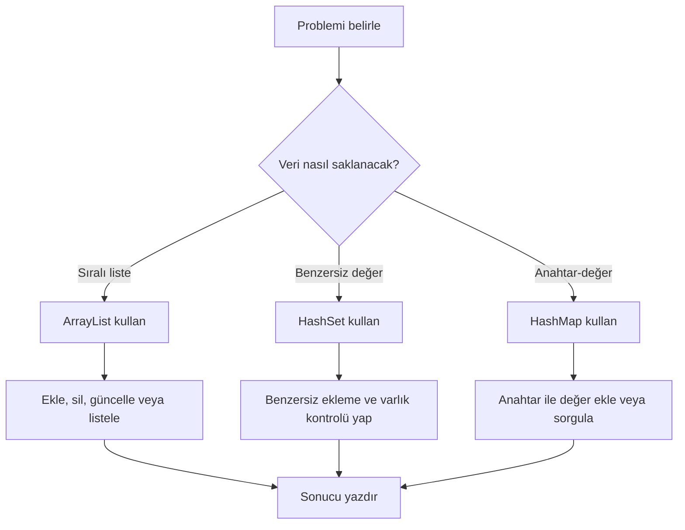

**Diyagram 14.1:** Koleksiyon seçimi ve temel işlem akışı.

**Görsel üretim notu:** Bu Mermaid diyagramı final DOCX/PDF üretiminden önce PNG’ye dönüştürülmeli; ham `flowchart TD` kodu final çıktıda görünmemelidir. Önerilen görsel genişliği 12–13 cm aralığında tutulmalıdır.

## 14.16 Adım adım kod örnekleri

Bu bölümde koleksiyonlar basitten daha bütünleşik örneklere doğru gösterilecektir.

### Kod 14.1: `ArrayList` ile öğrenci listesi

**Kod kimliği:** `b14_kod01_ile_ogrenci_listesi`

**Kod erişimi:** [Kod sayfası](https://github.com/bmdersleri/javaninTemelleri/tree/main/kodlar/bolum14/kod01/) | [Kaynak kod](https://github.com/bmdersleri/javaninTemelleri/blob/main/kodlar/bolum14/kod01/Bolum14Ornek01ArrayListOgrenci.java) | 

**QR erişimi:** Kod sayfası ve kaynak kod için aşağıdaki iki QR kod kullanılabilir.

{width=2.8cm} {width=2.8cm}


```java
// Dosya: Bolum14Ornek01ArrayListOgrenci.java
import java.util.ArrayList;

public class Bolum14Ornek01ArrayListOgrenci {
    public static void main(String[] args) {
        ArrayList<String> ogrenciler = new ArrayList<>();

        ogrenciler.add("Ayşe");
        ogrenciler.add("Mehmet");
        ogrenciler.add("Zeynep");

        ogrenciler.set(1, "Mert");
        ogrenciler.remove("Zeynep");

        for (int i = 0; i < ogrenciler.size(); i++) {
            System.out.println((i + 1) + ". " + ogrenciler.get(i));
        }

        System.out.println("Eleman sayısı: " + ogrenciler.size());
        System.out.println("Ayşe var mı?: " + ogrenciler.contains("Ayşe"));
    }
}
```

**Kodun amacı:** `ArrayList` üzerinde ekleme, güncelleme, silme, dolaşma ve arama işlemlerini göstermek.

**Beklenen çıktı:**

```text
1. Ayşe
2. Mert
Eleman sayısı: 2
Ayşe var mı?: true
```

**Dikkat noktası:** `ArrayList` içinde dizi gibi `length` kullanılmaz; `size()` kullanılır.

### Kod 14.2: `ArrayList<Integer>` ile not analizi

**Kod kimliği:** `b14_kod02_ile_not_analizi`

**Kod erişimi:** [Kod sayfası](https://github.com/bmdersleri/javaninTemelleri/tree/main/kodlar/bolum14/kod02/) | [Kaynak kod](https://github.com/bmdersleri/javaninTemelleri/blob/main/kodlar/bolum14/kod02/Bolum14Ornek02ArrayListNotAnalizi.java) | 

**QR erişimi:** Kod sayfası ve kaynak kod için aşağıdaki iki QR kod kullanılabilir.

{width=2.8cm} {width=2.8cm}


```java
// Dosya: Bolum14Ornek02ArrayListNotAnalizi.java
import java.util.ArrayList;

public class Bolum14Ornek02ArrayListNotAnalizi {
    public static void main(String[] args) {
        ArrayList<Integer> notlar = new ArrayList<>();

        notlar.add(80);
        notlar.add(75);
        notlar.add(90);
        notlar.add(60);

        int toplam = 0;
        int enKucuk = notlar.get(0);
        int enBuyuk = notlar.get(0);

        for (int not : notlar) {
            toplam += not;

            if (not < enKucuk) {
                enKucuk = not;
            }

            if (not > enBuyuk) {
                enBuyuk = not;
            }
        }

        double ortalama = toplam / (double) notlar.size();

        System.out.println("Toplam: " + toplam);
        System.out.println("Ortalama: " + ortalama);
        System.out.println("En küçük: " + enKucuk);
        System.out.println("En büyük: " + enBuyuk);
    }
}
```

**Kodun amacı:** `ArrayList<Integer>` kullanarak toplam, ortalama ve min–max hesaplamak.

**Beklenen çıktı:**

```text
Toplam: 305
Ortalama: 76.25
En küçük: 60
En büyük: 90
```

**Dikkat noktası:** Sayısal liste için `ArrayList<Integer>` kullanılmıştır.

### Kod 14.3: `HashSet` ile benzersiz ürün kodları

**Kod kimliği:** `b14_kod03_ile_benzersiz_urun_kodlari`

**Kod erişimi:** [Kod sayfası](https://github.com/bmdersleri/javaninTemelleri/tree/main/kodlar/bolum14/kod03/) | [Kaynak kod](https://github.com/bmdersleri/javaninTemelleri/blob/main/kodlar/bolum14/kod03/Bolum14Ornek03HashSetUrunKodlari.java) | 

**QR erişimi:** Kod sayfası ve kaynak kod için aşağıdaki iki QR kod kullanılabilir.

{width=2.8cm} {width=2.8cm}


```java
// Dosya: Bolum14Ornek03HashSetUrunKodlari.java
import java.util.HashSet;

public class Bolum14Ornek03HashSetUrunKodlari {
    public static void main(String[] args) {
        HashSet<String> urunKodlari = new HashSet<>();

        urunKodlari.add("K100");
        urunKodlari.add("K200");
        urunKodlari.add("K100");

        System.out.println("Ürün kodları:");
        for (String kod : urunKodlari) {
            System.out.println(kod);
        }

        System.out.println("Kayıt sayısı: " + urunKodlari.size());
        System.out.println("K100 var mı?: " + urunKodlari.contains("K100"));
    }
}
```

**Kodun amacı:** `HashSet` ile tekrar eden değerleri engellemeyi göstermek.

**Beklenen davranış:** `K100` yalnızca bir kez saklanır. Çıktı sırası garanti edilmez.

**Dikkat noktası:** `HashSet` çıktı sırasına güvenilmemelidir.

### Kod 14.4: `HashMap` ile ürün stok takibi

**Kod kimliği:** `b14_kod04_ile_urun_stok_takibi`

**Kod erişimi:** [Kod sayfası](https://github.com/bmdersleri/javaninTemelleri/tree/main/kodlar/bolum14/kod04/) | [Kaynak kod](https://github.com/bmdersleri/javaninTemelleri/blob/main/kodlar/bolum14/kod04/Bolum14Ornek04HashMapStok.java) | 

**QR erişimi:** Kod sayfası ve kaynak kod için aşağıdaki iki QR kod kullanılabilir.

{width=2.8cm} {width=2.8cm}


```java
// Dosya: Bolum14Ornek04HashMapStok.java
import java.util.HashMap;

public class Bolum14Ornek04HashMapStok {
    public static void main(String[] args) {
        HashMap<String, Integer> stoklar = new HashMap<>();

        stoklar.put("K100", 25);
        stoklar.put("K200", 10);
        stoklar.put("K300", 5);

        String arananKod = "K200";

        if (stoklar.containsKey(arananKod)) {
            System.out.println("Stok: " + stoklar.get(arananKod));
        } else {
            System.out.println("Ürün kodu bulunamadı.");
        }

        stoklar.put("K200", 15);
        stoklar.remove("K300");

        System.out.println("Güncel stoklar:");
        for (String kod : stoklar.keySet()) {
            System.out.println(kod + " -> " + stoklar.get(kod));
        }
    }
}
```

**Kodun amacı:** `HashMap` ile anahtar-değer ilişkisi kurmak ve stok güncellemek.

**Beklenen davranış:** `K200` stok değeri önce okunur, sonra 15 olarak güncellenir. `K300` silinir.

**Dikkat noktası:** `HashMap` çıktı sırası garanti edilmez.

### Kod 14.5: Koleksiyonları birlikte kullanma

**Kod kimliği:** `b14_kod05_koleksiyonlari_birlikte_kullanma`

**Kod erişimi:** [Kod sayfası](https://github.com/bmdersleri/javaninTemelleri/tree/main/kodlar/bolum14/kod05/) | [Kaynak kod](https://github.com/bmdersleri/javaninTemelleri/blob/main/kodlar/bolum14/kod05/Bolum14Ornek05KoleksiyonBirlikte.java) | 

**QR erişimi:** Kod sayfası ve kaynak kod için aşağıdaki iki QR kod kullanılabilir.

{width=2.8cm} {width=2.8cm}


```java
// Dosya: Bolum14Ornek05KoleksiyonBirlikte.java
import java.util.ArrayList;
import java.util.HashMap;
import java.util.HashSet;

public class Bolum14Ornek05KoleksiyonBirlikte {
    public static void main(String[] args) {
        ArrayList<String> ogrenciler = new ArrayList<>();
        HashSet<String> urunKodlari = new HashSet<>();
        HashMap<String, Integer> stoklar = new HashMap<>();

        ogrenciler.add("Ayşe");
        ogrenciler.add("Mehmet");

        urunKodlari.add("K100");
        urunKodlari.add("K200");

        stoklar.put("K100", 25);
        stoklar.put("K200", 10);

        System.out.println("Öğrenciler:");
        for (String ogrenci : ogrenciler) {
            System.out.println(ogrenci);
        }

        System.out.println("Ürün stokları:");
        for (String kod : stoklar.keySet()) {
            System.out.println(kod + " -> " + stoklar.get(kod));
        }
    }
}
```

**Kodun amacı:** `ArrayList`, `HashSet` ve `HashMap` yapılarını aynı programda farklı amaçlarla kullanmak.

**Beklenen davranış:** Öğrenci adları liste olarak, ürün kodları benzersiz küme olarak, stoklar ise anahtar-değer ilişkisiyle saklanır.

### Kod 14.6: Hatalı ve düzeltilmiş koleksiyon kullanımı

Hatalı örnek:

**Kod kimliği:** `b14_kod06_hatali_ve_duzeltilmis_koleksiyon_kullanimi`

**Kod erişimi:** [Kod sayfası](https://github.com/bmdersleri/javaninTemelleri/tree/main/kodlar/bolum14/kod06/) | [Kaynak kod](https://github.com/bmdersleri/javaninTemelleri/blob/main/kodlar/bolum14/kod06/Bolum14Ornek06HataDuzeltme.java) | 

**QR erişimi:** Kod sayfası ve kaynak kod için aşağıdaki iki QR kod kullanılabilir.

{width=2.8cm} {width=2.8cm}


```java
// Dosya: Bolum14Ornek06HataDuzeltme.java
import java.util.ArrayList;

public class Bolum14Ornek06HataDuzeltme {
    public static void main(String[] args) {
        ArrayList<int> sayilar = new ArrayList<>();

        sayilar.add(10);
        sayilar.add(20);

        System.out.println("Eleman sayısı: " + sayilar.length);
    }
}
```

Bu kodda iki temel hata vardır:

1. `ArrayList<int>` geçerli değildir; `ArrayList<Integer>` kullanılmalıdır.
2. `ArrayList` eleman sayısı için `length` değil `size()` kullanılır.

Düzeltilmiş kod:

**Kod kimliği:** `b14_kod06_hatali_ve_duzeltilmis_koleksiyon_kullanimi_2`

**Kod erişimi:** [Kod sayfası](https://github.com/bmdersleri/javaninTemelleri/tree/main/kodlar/bolum14/kod06_2/) | [Kaynak kod](https://github.com/bmdersleri/javaninTemelleri/blob/main/kodlar/bolum14/kod06_2/Bolum14Ornek06HataDuzeltme.java) | 

**QR erişimi:** Kod sayfası ve kaynak kod için aşağıdaki iki QR kod kullanılabilir.

{width=2.8cm} {width=2.8cm}


```java
// Dosya: Bolum14Ornek06HataDuzeltme.java
import java.util.ArrayList;

public class Bolum14Ornek06HataDuzeltme {
    public static void main(String[] args) {
        ArrayList<Integer> sayilar = new ArrayList<>();

        sayilar.add(10);
        sayilar.add(20);

        System.out.println("Eleman sayısı: " + sayilar.size());
    }
}
```

**Beklenen çıktı:**

```text
Eleman sayısı: 2
```

**Dikkat noktası:** Koleksiyonlarda tür tanımı ve boyut metodu doğru seçilmelidir.

## 14.17 Kodun çalışma mantığı ve iz sürme

Koleksiyon programlarında iz sürme, koleksiyonun her işlemden sonra nasıl değiştiğini takip etmeye dayanır.

Örnek:

```java
ArrayList<String> liste = new ArrayList<>();
liste.add("A");
liste.add("B");
liste.set(1, "C");
liste.remove("A");
```

İz sürme tablosu:

| Adım | İşlem | Liste durumu |
|---:|---|---|
| 1 | Boş liste | `[]` |
| 2 | `add("A")` | `[A]` |
| 3 | `add("B")` | `[A, B]` |
| 4 | `set(1, "C")` | `[A, C]` |
| 5 | `remove("A")` | `[C]` |

`HashMap` için iz sürme:

```java
HashMap<String, Integer> stok = new HashMap<>();
stok.put("K100", 10);
stok.put("K200", 5);
stok.put("K100", 15);
stok.remove("K200");
```

| Adım | İşlem | Map durumu |
|---:|---|---|
| 1 | Boş map | `{}` |
| 2 | `K100 -> 10` | `{K100=10}` |
| 3 | `K200 -> 5` | `{K100=10, K200=5}` |
| 4 | `K100 -> 15` | `{K100=15, K200=5}` |
| 5 | `K200` silinir | `{K100=15}` |

> **💡 İpucu:** `HashMap` içinde aynı anahtarla tekrar `put()` yapılırsa yeni kayıt açılmaz; mevcut anahtarın değeri güncellenir.

## 14.18 Uçtan uca mini uygulama: Koleksiyon Yönetim Paneli

Bu bölümün mini uygulaması, `ArrayList`, `HashSet` ve `HashMap` yapılarını bir araya getirir.

**Uygulama adı:** Koleksiyon Yönetim Paneli

**Dosya adı:** `KoleksiyonYonetimPaneli.java`

**Amaç:** Öğrenci listesini `ArrayList` ile yönetmek, ürün kodlarının benzersizliğini `HashSet` ile kontrol etmek ve ürün stoklarını `HashMap` ile tutmak.

**Kod kimliği:** `b14_kod36_koleksiyon_yonetim_paneli`

**Kod erişimi:** [Kod sayfası](https://github.com/bmdersleri/javaninTemelleri/tree/main/kodlar/bolum14/kod36/) | [Kaynak kod](https://github.com/bmdersleri/javaninTemelleri/blob/main/kodlar/bolum14/kod36/KoleksiyonYonetimPaneli.java) | 

**QR erişimi:** Kod sayfası ve kaynak kod için aşağıdaki iki QR kod kullanılabilir.

{width=2.8cm} {width=2.8cm}


```java
// Dosya: KoleksiyonYonetimPaneli.java
import java.util.ArrayList;
import java.util.HashMap;
import java.util.HashSet;
import java.util.Scanner;

public class KoleksiyonYonetimPaneli {
    public static void main(String[] args) {
        Scanner scanner = new Scanner(System.in);

        ArrayList<String> ogrenciler = new ArrayList<>();
        HashSet<String> urunKodlari = new HashSet<>();
        HashMap<String, Integer> stoklar = new HashMap<>();

        int secim;

        do {
            menuYazdir();

            System.out.print("Seçiminiz: ");
            secim = scanner.nextInt();
            scanner.nextLine();

            if (secim == 1) {
                System.out.print("Öğrenci adı: ");
                String ad = scanner.nextLine().trim();

                if (ad.length() == 0) {
                    System.out.println("Öğrenci adı boş olamaz.");
                } else {
                    ogrenciler.add(ad);
                    System.out.println("Öğrenci eklendi.");
                }
            } else if (secim == 2) {
                System.out.println("Öğrenci listesi:");

                for (int i = 0; i < ogrenciler.size(); i++) {
                    System.out.println((i + 1) + ". "
                            + ogrenciler.get(i));
                }
            } else if (secim == 3) {
                System.out.print("Silinecek öğrenci sıra numarası: ");
                int sira = scanner.nextInt();
                scanner.nextLine();

                int indeks = sira - 1;

                if (indeks >= 0 && indeks < ogrenciler.size()) {
                    String silinen = ogrenciler.remove(indeks);
                    System.out.println("Silinen öğrenci: " + silinen);
                } else {
                    System.out.println("Geçersiz sıra numarası.");
                }
            } else if (secim == 4) {
                System.out.print("Ürün kodu: ");
                String kod = scanner.nextLine().trim().toUpperCase();

                if (kod.length() == 0) {
                    System.out.println("Ürün kodu boş olamaz.");
                } else if (urunKodlari.contains(kod)) {
                    System.out.println("Bu ürün kodu zaten var.");
                } else {
                    urunKodlari.add(kod);
                    stoklar.put(kod, 0);
                    System.out.println("Ürün kodu eklendi.");
                }
            } else if (secim == 5) {
                System.out.print("Ürün kodu: ");
                String kod = scanner.nextLine().trim().toUpperCase();

                if (stoklar.containsKey(kod)) {
                    System.out.print("Yeni stok miktarı: ");
                    int stok = scanner.nextInt();
                    scanner.nextLine();

                    if (stok < 0) {
                        System.out.println("Stok negatif olamaz.");
                    } else {
                        stoklar.put(kod, stok);
                        System.out.println("Stok güncellendi.");
                    }
                } else {
                    System.out.println("Ürün kodu bulunamadı.");
                }
            } else if (secim == 6) {
                System.out.println("Stok listesi:");

                for (String kod : stoklar.keySet()) {
                    System.out.println(kod + " -> "
                            + stoklar.get(kod));
                }
            } else if (secim == 0) {
                System.out.println("Program sonlandırılıyor.");
            } else {
                System.out.println("Geçersiz menü seçimi.");
            }

            System.out.println();
        } while (secim != 0);

        scanner.close();
    }

    static void menuYazdir() {
        System.out.println("=== Koleksiyon Yönetim Paneli ===");
        System.out.println("1. Öğrenci ekle");
        System.out.println("2. Öğrencileri listele");
        System.out.println("3. Öğrenci sil");
        System.out.println("4. Ürün kodu ekle");
        System.out.println("5. Stok güncelle");
        System.out.println("6. Stokları listele");
        System.out.println("0. Çıkış");
    }
}
```

### 14.18.1 Mini uygulamanın özellikleri

Bu uygulama şu özellikleri içerir:

1. `ArrayList<String>` ile öğrenci listesi tutar.
2. `HashSet<String>` ile ürün kodlarının tekrar etmesini engeller.
3. `HashMap<String, Integer>` ile ürün kodu-stok miktarı eşleştirmesi yapar.
4. Menü seçimiyle farklı koleksiyon işlemleri sunar.
5. Öğrenci ekleme, listeleme ve silme işlemlerini uygular.
6. Ürün kodu ekleme, stok güncelleme ve stok listeleme işlemlerini uygular.
7. Boş öğrenci adı, boş ürün kodu, negatif stok ve geçersiz sıra numarası gibi durumları koşul kontrolüyle yönetir.

### 14.18.2 Mini uygulama test senaryoları

| Test | İşlem | Beklenen sonuç |
|---:|---|---|
| 1 | Öğrenci ekle: `Ayşe` | Listeye eklenir |
| 2 | Öğrencileri listele | `Ayşe` görünür |
| 3 | Geçersiz sıra numarasıyla öğrenci sil | Uyarı mesajı |
| 4 | Ürün kodu ekle: `K100` | Ürün eklenir |
| 5 | Aynı ürün kodunu tekrar ekle | Tekrar uyarısı |
| 6 | `K100` stok güncelle: `25` | Stok güncellenir |
| 7 | Olmayan ürün kodu stok güncelle | Ürün bulunamadı |
| 8 | Negatif stok gir | Stok negatif olamaz |
| 9 | `0` seç | Program sonlanır |

> **Alıştırma Molası:** Mini uygulamaya öğrenci arama seçeneği ekleyiniz. `ArrayList.contains()` metodunu kullanarak öğrencinin listede olup olmadığını kontrol ediniz.

## 14.19 Sık yapılan hatalar ve yanlış sezgiler

### 14.19.1 `ArrayList` içinde `length` kullanmak

Yanlış kullanım:

```java
ArrayList<String> liste = new ArrayList<>();
System.out.println(liste.length);
```

Düzeltme:

```java
System.out.println(liste.size());
```

### 14.19.2 `ArrayList<int>` yazmak

Yanlış kullanım:

```java
ArrayList<int> sayilar = new ArrayList<>();
```

Düzeltme:

```java
ArrayList<Integer> sayilar = new ArrayList<>();
```

### 14.19.3 `HashSet` çıktısında sıralama beklemek

Yanlış düşünce:

```text
HashSet elemanları her zaman eklediğim sırada yazdırır.
```

Düzeltme:

`HashSet` benzersizlik sağlar; çıktı sırası garanti edilmez. Sıralı liste gerekiyorsa `ArrayList` tercih edilmelidir.

### 14.19.4 `HashMap` ile `ArrayList` görevini karıştırmak

Yanlış yaklaşım:

```text
Öğrenci adlarını yalnızca sırayla tutacaksam HashMap kullanmalıyım.
```

Düzeltme:

Sadece sıralı öğrenci listesi gerekiyorsa `ArrayList<String>` daha uygundur. Anahtar-değer ilişkisi gerekiyorsa `HashMap` kullanılır.

### 14.19.5 `HashMap.get()` öncesinde anahtar kontrolü yapmamak

Yanlış kullanım:

```java
System.out.println(stoklar.get("K999"));
```

Anahtar yoksa sonuç beklenen değer olmayabilir. Daha okunabilir kullanım:

```java
if (stoklar.containsKey("K999")) {
    System.out.println(stoklar.get("K999"));
} else {
    System.out.println("Ürün bulunamadı.");
}
```

### 14.19.6 `remove()` kullanımında parametre türünü dikkate almamak

`ArrayList<String>` içinde:

```java
liste.remove("Ayşe");
```

değer siler.

`ArrayList<Integer>` içinde:

```java
sayilar.remove(1);
```

indeks silme olarak yorumlanabilir. Bu nedenle sayısal listelerde `remove()` kullanırken parametre anlamına dikkat edilmelidir.

> **💡 İpucu:** Koleksiyon hatalarında önce koleksiyon türünü, sonra eleman türünü, sonra kullanılan metodun parametre anlamını kontrol edin.

## 14.20 Hata ayıklama egzersizi

Aşağıdaki kodun `KoleksiyonHatasi.java` adlı dosyaya kaydedildiğini düşünelim.

**Kod kimliği:** `b14_kod45_hata_ayiklama_egzersizi`

**Kod erişimi:** [Kod sayfası](https://github.com/bmdersleri/javaninTemelleri/tree/main/kodlar/bolum14/kod45/) | [Kaynak kod](https://github.com/bmdersleri/javaninTemelleri/blob/main/kodlar/bolum14/kod45/KoleksiyonHatasi.java) | 

**QR erişimi:** Kod sayfası ve kaynak kod için aşağıdaki iki QR kod kullanılabilir.

{width=2.8cm} {width=2.8cm}


```java
// Dosya: KoleksiyonHatasi.java
import java.util.ArrayList;
import java.util.HashMap;

public class KoleksiyonHatasi {
    public static void main(String[] args) {
        ArrayList<int> sayilar = new ArrayList<>();

        sayilar.add(10);
        sayilar.add(20);

        System.out.println("Eleman sayısı: " + sayilar.length);

        HashMap<String, Integer> stoklar = new HashMap<>();
        stoklar.put("K100", 25);

        System.out.println("Stok: " + stoklar.get("K999"));
    }
}
```

Bu kodda koleksiyon kullanımı açısından temel hatalar vardır:

1. `ArrayList<int>` geçersizdir; `ArrayList<Integer>` kullanılmalıdır.
2. `ArrayList` boyutu için `length` değil `size()` kullanılır.
3. `HashMap` içinde olmayan bir anahtar sorgulanmaktadır.
4. `get("K999")` öncesinde `containsKey("K999")` ile kontrol yapılmamıştır.

Düzeltilmiş kod:

**Kod kimliği:** `b14_kod46_hata_ayiklama_egzersizi`

**Kod erişimi:** [Kod sayfası](https://github.com/bmdersleri/javaninTemelleri/tree/main/kodlar/bolum14/kod46/) | [Kaynak kod](https://github.com/bmdersleri/javaninTemelleri/blob/main/kodlar/bolum14/kod46/KoleksiyonHatasi.java) | 

**QR erişimi:** Kod sayfası ve kaynak kod için aşağıdaki iki QR kod kullanılabilir.

{width=2.8cm} {width=2.8cm}


```java
// Dosya: KoleksiyonHatasi.java
import java.util.ArrayList;
import java.util.HashMap;

public class KoleksiyonHatasi {
    public static void main(String[] args) {
        ArrayList<Integer> sayilar = new ArrayList<>();

        sayilar.add(10);
        sayilar.add(20);

        System.out.println("Eleman sayısı: " + sayilar.size());

        HashMap<String, Integer> stoklar = new HashMap<>();
        stoklar.put("K100", 25);

        String kod = "K999";

        if (stoklar.containsKey(kod)) {
            System.out.println("Stok: " + stoklar.get(kod));
        } else {
            System.out.println("Ürün kodu bulunamadı.");
        }
    }
}
```

**Beklenen çıktı:**

```text
Eleman sayısı: 2
Ürün kodu bulunamadı.
```

**Kendinize sorunuz:**

1. `ArrayList<int>` neden hatalıdır?
2. `size()` ile `length` arasındaki fark nedir?
3. `HashMap` içinde olmayan anahtar nasıl kontrol edilmelidir?
4. `HashSet` kullanılsaydı ürün kodu-stok ilişkisi kurulabilir miydi?
5. Bu programda hangi koleksiyon hangi görevi üstlenmektedir?

> **Laboratuvar İpucu:** Koleksiyon hatalarını incelerken “hangi veri türünü saklıyorum, bu veri sıralı mı, benzersiz mi, anahtar-değer ilişkisi mi?” sorularıyla başlayın.

## 14.21 Bölümün sonraki bölümlerle ilişkisi

Bu bölümde koleksiyonlarla dinamik veri yönetimi ele alındı. Öğrenci artık yalnızca sabit uzunluklu dizilerle çalışmak zorunda değildir. `ArrayList`, `HashSet` ve `HashMap` ile sıralı liste, benzersiz değer kümesi ve anahtar-değer ilişkisi kurabilir.

Bir sonraki bölümde hata yönetimi ayrı ve odaklı biçimde ele alınacaktır. Koleksiyonlarla çalışırken geçersiz indeks, hatalı kullanıcı girdisi veya olmayan anahtar gibi durumlar ortaya çıkabilir. Bu bölümde bu durumları çoğunlukla koşul kontrolleriyle yönettik. Sonraki bölümde ise Java’nın `try-catch-finally` yapısı, yaygın exception türleri ve kullanıcı dostu hata yönetimi ayrıntılı olarak incelenecektir.

Bu nedenle koleksiyonlar bölümü, hata yönetimi bölümünün veri yapıları açısından doğal ön hazırlığıdır.

## 14.22 Bölüm özeti

Bu bölümde Java koleksiyonları ve dinamik veri yönetimi ele alındı. Önce diziler ile koleksiyonlar arasındaki temel fark açıklandı. Dizilerin sabit uzunluklu olduğu, `ArrayList` yapısının ise çalışma sırasında büyüyüp küçülebilen dinamik liste yapısı sunduğu gösterildi.

`ArrayList` üzerinde `add`, `get`, `set`, `remove`, `size` ve `contains` metotları uygulandı. Generics kavramı, koleksiyonun hangi türde eleman saklayacağını belirten yapı olarak açıklandı. İlkel türlerin koleksiyonlarda doğrudan generic tür olarak yazılamayacağı, bu nedenle `Integer`, `Double`, `Character` ve `Boolean` gibi sarmalayıcı sınıfların kullanıldığı belirtildi.

`HashSet`, benzersiz değerleri saklamak için kullanıldı. Aynı ürün kodunun iki kez eklenmesi engellendi ve `contains()` ile değer varlığı kontrol edildi. `HashSet` yapısında çıktı sırasına güvenilmemesi gerektiği vurgulandı.

`HashMap`, anahtar-değer ilişkisini temsil eden koleksiyon olarak işlendi. Ürün kodu-stok miktarı örneği üzerinden `put`, `get`, `containsKey`, `remove`, `size` ve `keySet` metotları gösterildi. Aynı anahtarla tekrar `put()` kullanıldığında değerin güncellendiği açıklandı.

Son olarak Koleksiyon Yönetim Paneli mini uygulamasıyla öğrenci listesi, benzersiz ürün kodu ve stok takibi tek programda birleştirildi. Böylece `ArrayList`, `HashSet` ve `HashMap` yapılarının hangi problem türlerinde kullanılacağı uygulamalı olarak gösterildi.

## 14.23 Terim sözlüğü

| Terim | Açıklama |
|---|---|
| Koleksiyon | Çoklu verileri saklamak ve yönetmek için kullanılan yapı |
| `ArrayList` | Dinamik, sıralı ve indeksli liste yapısı |
| `HashSet` | Benzersiz elemanlar saklayan koleksiyon |
| `HashMap` | Anahtar-değer eşlemesi saklayan koleksiyon |
| Generics | Koleksiyondaki eleman türünü belirtme yapısı |
| Sarmalayıcı sınıf | İlkel türlerin nesne karşılığı |
| `Integer` | `int` türünün sarmalayıcı sınıfı |
| `Double` | `double` türünün sarmalayıcı sınıfı |
| `add` | Koleksiyona eleman ekleme metodu |
| `get` | Eleman veya değer okuma metodu |
| `set` | Liste elemanını güncelleme metodu |
| `remove` | Eleman veya anahtar silme metodu |
| `size` | Koleksiyondaki eleman/kayıt sayısını verir |
| `contains` | Elemanın varlığını kontrol eder |
| `put` | `HashMap` içine anahtar-değer ekleme veya güncelleme metodu |
| `containsKey` | `HashMap` içinde anahtar var mı kontrol eder |
| `keySet` | `HashMap` anahtarlarını dolaşmayı sağlar |
| Anahtar | `HashMap` içinde değere erişmek için kullanılan bilgi |
| Değer | Anahtara karşılık gelen veri |

## 14.24 Kendini değerlendirme soruları

### 14.24.1 Çoktan seçmeli sorular

1. Dinamik liste yönetimi için hangi yapı kullanılır?

A) `ArrayList`  
B) `int[]`  
C) `char`  
D) `switch`  
E) `System.out`  

2. `ArrayList` eleman sayısını öğrenmek için hangi metot kullanılır?

A) `size()`  
B) `length`  
C) `count()`  
D) `index()`  
E) `total()`  

3. `ArrayList<int>` yerine hangisi kullanılmalıdır?

A) `ArrayList<Integer>`  
B) `ArrayList<Int>`  
C) `ArrayList<number>`  
D) `ArrayList<double>`  
E) `int<ArrayList>`  

4. Benzersiz değerleri saklamak için hangi koleksiyon uygundur?

A) `HashSet`  
B) `ArrayList`  
C) `String`  
D) `Scanner`  
E) `Math`  

5. Anahtar-değer ilişkisi için hangi yapı uygundur?

A) `HashMap`  
B) `HashSet`  
C) `int[]`  
D) `while`  
E) `charAt()`  

6. `HashMap` içinde anahtarın varlığını kontrol etmek için hangisi kullanılır?

A) `containsKey()`  
B) `containsValueOnly()`  
C) `hasIndex()`  
D) `sizeOfKey()`  
E) `indexOf()`  

7. Aşağıdakilerden hangisi `HashMap` içine değer eklemek veya güncellemek için kullanılır?

A) `put()`  
B) `addOnly()`  
C) `appendMap()`  
D) `insertKey()`  
E) `push()`  

8. `HashSet` için aşağıdakilerden hangisi doğrudur?

A) Tekrar eden değerleri engeller  
B) Her zaman ekleme sırasını korur  
C) İndeksle erişim sağlar  
D) Anahtar-değer saklar  
E) Yalnızca sayılarla çalışır  

### 14.24.2 Doğru/Yanlış soruları

1. `ArrayList` dinamik liste yapısıdır. (D/Y)
2. `ArrayList` içinde `length` kullanılır. (D/Y)
3. `ArrayList<Integer>` sayısal tam değerleri saklamak için kullanılabilir. (D/Y)
4. `HashSet` tekrar eden değerleri engellemek için uygundur. (D/Y)
5. `HashMap` anahtar-değer ilişkisi kurar. (D/Y)
6. `HashMap` içinde aynı anahtarla tekrar `put()` yapılırsa değer güncellenir. (D/Y)
7. `HashSet` elemanları her zaman eklenme sırasına göre yazdırır. (D/Y)
8. `containsKey()` `HashMap` içinde anahtar varlığını kontrol eder. (D/Y)
9. Sıralı öğrenci listesi için `ArrayList` uygun bir seçim olabilir. (D/Y)
10. Benzersiz ürün kodları için `HashMap` zorunlu tek seçenektir. (D/Y)

### 14.24.3 Açık uçlu kavramsal sorular

1. Koleksiyon kavramını kendi cümlelerinizle açıklayınız.
2. Dizi ile `ArrayList` arasındaki farkları yazınız.
3. Generics neden önemlidir?
4. `ArrayList<Integer>` kullanımında `Integer` neden tercih edilir?
5. `ArrayList` üzerinde `add`, `get`, `set`, `remove` ve `size` metotlarının görevlerini açıklayınız.
6. `HashSet` hangi problem türleri için uygundur?
7. `HashSet` neden sıralı liste gibi düşünülmemelidir?
8. `HashMap` yapısında anahtar ve değer ne anlama gelir?
9. `HashMap` ile ürün kodu-stok ilişkisi nasıl modellenebilir?
10. `ArrayList`, `HashSet` ve `HashMap` yapılarını kullanım amaçlarına göre karşılaştırınız.
11. Koleksiyon seçerken hangi sorular sorulmalıdır?
12. Koleksiyon Yönetim Paneli uygulamasında hangi koleksiyon hangi görevi üstlenmektedir?

### 14.24.4 Yanlış gerekçeyi bulma soruları

Aşağıdaki ifadelerdeki yanlış gerekçeyi bulunuz ve düzeltiniz.

1. “`ArrayList` dizidir; bu nedenle `length` kullanılır.”
2. “`ArrayList<int>` doğru bir generic tanımlamadır.”
3. “`HashSet` elemanları her zaman eklenme sırasına göre yazdırır.”
4. “`HashMap` içinde olmayan anahtar için `get()` her zaman 0 döndürür.”
5. “Koleksiyon seçimi önemli değildir; her problem `ArrayList` ile çözülmelidir.”
6. “Sıralı liste için `HashSet` en doğal çözümdür.”
7. “Benzersiz kullanıcı adları için tekrar kontrolüne gerek yoktur.”
8. “`HashMap` yalnızca sayısal anahtarlarla kullanılabilir.”
9. “`put()` her zaman yeni kayıt ekler, mevcut anahtarı güncellemez.”
10. “For-each döngüsü koleksiyonlarla kullanılamaz.”

## 14.25 Programlama alıştırmaları

### 14.25.1 Kolay düzey

1. `OgrenciListesi.java` adlı programda `ArrayList<String>` oluşturup üç öğrenci ekleyiniz.
2. Listeye eklenen öğrencileri klasik `for` döngüsüyle yazdırınız.
3. Aynı listeyi for-each döngüsüyle yazdırınız.
4. Bir öğrencinin listede olup olmadığını `contains()` ile kontrol ediniz.
5. `ArrayList<Integer>` kullanarak sayı listesi oluşturunuz ve toplamını hesaplayınız.

### 14.25.2 Orta düzey

1. `NotListesi.java` adlı programda `ArrayList<Integer>` kullanarak notların toplamını, ortalamasını, en küçük ve en büyük değerini hesaplayınız.
2. `BenzersizKodlar.java` adlı programda `HashSet<String>` kullanarak ürün kodlarını saklayınız.
3. Aynı ürün kodunu iki kez eklemeyi deneyiniz ve sonucu yorumlayınız.
4. `StokTakip.java` adlı programda `HashMap<String, Integer>` kullanarak ürün kodu-stok miktarı eşleştiriniz.
5. `containsKey()` ile ürün kodu varlığını kontrol ediniz.
6. `keySet()` ile tüm ürün kodlarını ve stok değerlerini yazdırınız.

### 14.25.3 Zor düzey

1. `KoleksiyonYonetimPaneli.java` uygulamasını geliştiriniz.
2. Menüde öğrenci ekleme, listeleme ve silme seçenekleri bulunsun.
3. Öğrenci listesi için `ArrayList<String>` kullanınız.
4. Ürün kodlarının benzersizliği için `HashSet<String>` kullanınız.
5. Ürün stokları için `HashMap<String, Integer>` kullanınız.
6. Ürün kodu eklenirken tekrar kontrolü yapınız.
7. Stok güncellemede `containsKey()` ile ürün kodu kontrolü yapınız.
8. Negatif stok değerlerini koşul kontrolüyle engelleyiniz.
9. En az dokuz test senaryosu çalıştırınız.
10. Hatalı bir sürüm oluşturup en az üç koleksiyon hatasını düzeltiniz: `ArrayList<int>`, `length`, sıralama beklentisi veya olmayan anahtar sorgusu.

## 14.26 Haftalık laboratuvar / proje görevi

**Görev başlığı:** Koleksiyon Yönetim Paneli Laboratuvarı

**Amaç:** Bu laboratuvarın amacı, öğrencinin `ArrayList`, `HashSet` ve `HashMap` yapılarını tek bir konsol uygulamasında doğru problem türleriyle eşleştirerek kullanmasıdır.

**Beklenen adımlar:**

1. `KoleksiyonYonetimPaneli.java` adlı dosyayı oluşturunuz.
2. Öğrenci listesi için `ArrayList<String>` kullanınız.
3. Ürün kodları için `HashSet<String>` kullanınız.
4. Ürün stokları için `HashMap<String, Integer>` kullanınız.
5. Menü tabanlı bir uygulama yapısı oluşturunuz.
6. Öğrenci ekleme, listeleme ve silme işlemlerini yazınız.
7. Ürün kodu ekleme, stok güncelleme ve stok listeleme işlemlerini yazınız.
8. Boş öğrenci adı ve boş ürün kodu için koşul kontrolü yapınız.
9. Ürün kodu tekrarını `HashSet.contains()` ile kontrol ediniz.
10. Olmayan ürün kodu için `HashMap.containsKey()` kullanınız.
11. Negatif stok değerini koşul kontrolüyle engelleyiniz.
12. En az dokuz test senaryosu çalıştırınız.
13. Hatalı koleksiyon kullanımı ve düzeltilmiş kod içeren kısa bir hata notu hazırlayınız.
14. Kısa bir `README.md` dosyası hazırlayınız.

**Teslim edilecek dosyalar:**

1. `KoleksiyonYonetimPaneli.java`
2. `README.md`
3. En az dokuz test çıktısı
4. Hata ve çözüm notu

**README içeriği şu başlıkları içermelidir:**

1. Programın amacı
2. Kullanılan koleksiyonlar
3. Koleksiyon seçimi gerekçesi
4. Menü seçenekleri
5. Test senaryoları
6. Karşılaşılan koleksiyon hatası ve çözümü
7. Geliştirme önerileri

## 14.27 Değerlendirme rubriği

| Ölçüt | Açıklama | Puan |
|---|---|---:|
| `ArrayList` kullanımı | Ekleme, listeleme, silme, arama ve boyut işlemlerinin doğru uygulanması | 25 |
| `HashSet` kullanımı | Benzersiz değer saklama ve tekrar kontrolünün doğru yapılması | 20 |
| `HashMap` kullanımı | Anahtar-değer ilişkisi, `put`, `get`, `containsKey`, `keySet` kullanımı | 25 |
| Koleksiyon seçimi | Problem türüne uygun koleksiyon seçiminin gerekçelendirilmesi | 10 |
| Mini uygulama işlevleri | Menü akışı, öğrenci yönetimi, ürün kodu ve stok işlemlerinin çalışması | 10 |
| Kod okunabilirliği | Anlamlı değişken/metot adları, girinti ve sade yapı | 5 |
| Raporlama | README, test çıktıları ve hata notunun yeterliliği | 5 |
| **Toplam** |  | **100** |

## 14.28 İleri okuma ve kaynaklar

Bu bölümde koleksiyonlar başlangıç düzeyinde ele alınmıştır. Daha ayrıntılı bilgi için aşağıdaki kaynak türleri incelenebilir:

1. **Java SE API dokümantasyonu:** `ArrayList`, `HashSet` ve `HashMap` sınıflarının resmî davranışlarını incelemek için temel kaynaktır.
2. **Dev.java öğrenme kaynakları:** Java koleksiyonlarını modern Java öğrenme akışı içinde tekrar etmek için yararlıdır.
3. **Oracle Java Tutorials:** Collections Framework konusunu örnek odaklı açıklamalarla çalışmak için kullanılabilir.
4. **Ders içi ek notlar:** Koleksiyon seçimi, generics, sarmalayıcı sınıflar ve `HashMap` anahtar-değer ilişkisi için pekiştirme materyali olarak kullanılabilir.

> **💡 İpucu:** İleri kaynaklarda `LinkedList`, `TreeSet`, `TreeMap`, `Queue`, `Deque`, Stream API ve koleksiyon performans konularıyla karşılaşabilirsiniz. Bu bölümde yalnızca temel uygulama geliştirme için gerekli başlangıç düzeyi hedeflenmiştir.

## 14.29 Bir sonraki bölüme köprü

Bu bölümde dinamik veri yönetimi için `ArrayList`, `HashSet` ve `HashMap` yapıları ele alındı. Artık programlar sabit uzunluklu diziler yerine çalışma sırasında büyüyüp küçülebilen listeler, tekrarları engelleyen kümeler ve anahtar-değer ilişkisi kuran haritalar kullanabilir.

Bir sonraki bölümde hata yönetimi ayrı ve odaklı biçimde ele alınacaktır. Koleksiyonlarla çalışırken geçersiz indeks, hatalı kullanıcı girdisi, sayısal dönüşüm hatası, sıfıra bölme veya olmayan veri sorgulama gibi durumlar ortaya çıkabilir. Hata Yönetimi ve Dayanıklı Programlama bölümü, bu tür durumları `try-catch-finally` yapısıyla daha güvenli ve kullanıcı dostu biçimde ele almayı öğretecektir.

**BÖLÜM SONU**


\newpage


# Bölüm 15: Hata Yönetimi ve Dayanıklı Programlama

## 15.1 Bölümün yol haritası

Önceki bölümlerde Java programlarında değişkenler, karar yapıları, döngüler, metotlar, diziler, metin işlemleri, standart kütüphane, paket/proje düzeni ve koleksiyonlar ele alındı. Bu yapılarda çoğu örnek doğru girdi ve beklenen çalışma akışı üzerinden ilerledi. Ancak gerçek uygulamalarda kullanıcı her zaman doğru veri girmez, koleksiyonda aranan anahtar her zaman bulunmaz ve bazı işlemler çalışma sırasında beklenmeyen durumlarla karşılaşabilir.

Örneğin kullanıcı sayı beklenen yere metin girebilir, sıfıra bölme yapılabilir veya bir metin sayıya dönüştürülemeyebilir. Bu tür durumlarda programın tamamen çökmesi yerine hatayı fark etmesi, kullanıcıya anlaşılır mesaj vermesi ve mümkünse güvenli biçimde devam etmesi beklenir. Bu bölümde Java'da temel hata yönetimi ele alınacaktır.

Bu bölümde şu sorulara yanıt aranacaktır:

1. Hata, çalışma zamanı hatası ve exception kavramları ne anlama gelir?
2. `try` bloğu hangi kodları kapsar?
3. `catch` bloğu hatayı nasıl yakalar?
4. `finally` bloğu hangi durumlarda kullanılır?
5. `NumberFormatException` ne zaman oluşur?
6. `InputMismatchException` hangi kullanıcı girdilerinde görülür?
7. `ArithmeticException` hangi işlemlerde ortaya çıkabilir?
8. Kullanıcıya anlaşılır hata mesajı nasıl verilir?
9. Tüm hataları genel `Exception` ile yakalamak neden iyi bir alışkanlık değildir?
10. Hatalı girişlere dayanıklı hesap makinesi nasıl geliştirilir?

> **🎯 Bölüm Hedefi:** Bu bölümün sonunda öğrenci, temel çalışma zamanı hatalarını tanıyabilecek, `try-catch-finally` yapısını kullanarak hataları kontrollü biçimde yönetebilecek ve kullanıcı girdilerine karşı daha dayanıklı konsol programları geliştirebilecektir.

Bu bölümde custom exception tasarımı, exception hierarchy ayrıntıları ve logging frameworkleri işlenmeyecektir. Amaç, temel Java programlama düzeyinde güvenli ve anlaşılır hata yönetimi alışkanlığı kazandırmaktır.

## 15.2 Bölümün konumu ve pedagojik rolü

Bu bölüm, öğrencinin yalnızca çalışan program yazma becerisinden, hatalı durumlara dayanıklı program yazma becerisine geçmesini sağlar. Önceki bölümde koleksiyonlar ve dinamik veri yönetimi öğrenildi; daha önceki bölümlerde ise kullanıcı girdileri, metin işlemleri, tarih biçimleri ve temel uygulama akışları ele alındı. Bu bölümde ise programın beklenmeyen durumlarda nasıl davranması gerektiği ele alınacaktır.

Hata yönetimi, özellikle kullanıcı etkileşimli programlarda önemlidir. Kullanıcı yanlış veri girdiğinde programın teknik hata mesajıyla kapanması öğrenme ve kullanım açısından istenmeyen bir durumdur. Bunun yerine program, hatayı kontrollü şekilde yakalamalı ve kullanıcıya neyin yanlış olduğunu sade biçimde açıklamalıdır.

Bu bölüm, Bölüm 16'da ele alınacak dosya işlemleri için doğrudan hazırlık niteliğindedir. Dosya okuma ve yazma işlemlerinde dosyanın bulunmaması, erişim izni olmaması veya veri biçiminin beklenenden farklı olması gibi durumlarla karşılaşılabilir. Bu nedenle hata yönetimi, dosya işlemlerinden önce öğrenilmesi gereken temel bir konudur.

> **⚠️ Dikkat:** Hata yönetimi, hataları gizlemek için değil, hataları anlaşılır biçimde ele almak için kullanılır. Hatanın neden oluştuğunu tamamen yok saymak doğru bir yaklaşım değildir.

## 15.3 Öğrenme çıktıları

Bu bölüm tamamlandığında öğrenci:

1. `exception` kavramını kendi cümleleriyle açıklayabilir.
2. Çalışma zamanı hatası ile derleme hatası arasındaki farkı ayırt edebilir.
3. `try`, `catch` ve `finally` bloklarının görevlerini açıklayabilir.
4. `NumberFormatException` hatasının hangi durumda oluştuğunu gösterebilir.
5. `InputMismatchException` hatasını kullanıcı girdisi bağlamında yorumlayabilir.
6. `ArithmeticException` hatasını sıfıra bölme örneğiyle açıklayabilir.
7. Hata mesajlarını kullanıcı dostu biçimde düzenleyebilir.
8. Genel `Exception` yakalamanın neden dikkatli kullanılması gerektiğini açıklayabilir.
9. Hata sonrası programı güvenli duruma döndürme fikrini uygulayabilir.
10. Hatalı Girişlere Dayanıklı Hesap Makinesi uygulamasını geliştirebilir.

## 15.4 Ön bilgi ve başlangıç varsayımları

Bu bölüm, öğrencinin aşağıdaki konuları temel düzeyde bildiğini varsayar:

1. Java programının temel yapısı
2. Karar yapıları
3. Döngüler
4. Metotlar
5. `Scanner` ile kullanıcı girdisi alma
6. `String` işlemleri
7. Sayısal dönüşümler
8. Koleksiyonlarda temel arama ve erişim
9. Basit hesap makinesi mantığı

Bu bölümde kullanılan örnekler konsol tabanlıdır. Dosya işlemleri bir sonraki bölümde ele alınacağı için burada yalnızca temel hata yönetimi yapısı gösterilecektir.

## 15.5 Ana kavramlar

| Kavram | Kısa açıklama | Bu bölümdeki rolü |
|---|---|---|
| Exception | Program çalışırken oluşan olağan dışı durum | Kontrollü hata yönetimi |
| Runtime error | Çalışma sırasında ortaya çıkan hata | Hatalı girdi veya işlem |
| `try` | Hata oluşabilecek kodları kapsar | Riskli işlemi dener |
| `catch` | Oluşan hatayı yakalar | Uygun hata mesajı verir |
| `finally` | Hata olsa da olmasa da çalışabilir | Temizlik ve kapanış işlemleri |
| `NumberFormatException` | Metin sayıya çevrilemezse oluşur | `parseInt`, `parseDouble` |
| `InputMismatchException` | Beklenen türde girdi alınamazsa oluşur | `Scanner` girdisi |
| `ArithmeticException` | Aritmetik işlem hatası | Sıfıra bölme |
| Hata mesajı | Kullanıcıya veya geliştiriciye bilgi verir | Anlaşılır geri bildirim |
| Güvenli durum | Hata sonrası programın kontrollü hâli | Devam veya sonlandırma |

> **🎯 Sınav Notu:** `try` bloğu hatayı yakalamaz; hatanın oluşabileceği kodu kapsar. Hatayı yakalayan ve yöneten kısım `catch` bloğudur.

## 15.6 Hata türlerine ilk bakış

Programlama sürecinde farklı hata türleriyle karşılaşılır. Bu bölümde özellikle çalışma zamanı hatalarına ve exception yönetimine odaklanılacaktır.

### 15.6.1 Derleme hatası

Derleme hatası, kod Java sözdizimine uygun olmadığında oluşur. Örneğin noktalı virgül eksikliği veya yanlış sınıf adı derleme hatasına neden olabilir.

```java
System.out.println("Merhaba")
```

Bu satırda noktalı virgül eksiktir. Program derlenmeden önce hata verir.

### 15.6.2 Çalışma zamanı hatası

Çalışma zamanı hatası, program derlendikten sonra çalışırken ortaya çıkar. Örneğin sıfıra bölme çalışma zamanı hatasıdır.

```java
int sonuc = 10 / 0;
```

Bu kod derlenebilir; ancak çalıştırıldığında hata oluşur.

### 15.6.3 Mantık hatası

Mantık hatasında program derlenir ve çalışır; fakat beklenen sonucu üretmez. Örneğin ortalama hesaplanırken toplamı yanlış değişkene bölmek mantık hatası olabilir.

> **💡 İpucu:** Her hata türü aynı şekilde çözülmez. Derleme hatasında sözdizimi kontrol edilir; çalışma zamanı hatasında riskli işlem belirlenir; mantık hatasında algoritma adımları izlenir.

## 15.7 Exception kavramı

Exception, program çalışırken ortaya çıkan olağan dışı durumu temsil eder. Java, bu tür durumları belirli sınıflar aracılığıyla ifade eder. Örneğin:

1. Metin sayıya dönüştürülemezse `NumberFormatException`
2. Sıfıra bölme yapılırsa `ArithmeticException`
3. `Scanner` beklenen türde veri alamazsa `InputMismatchException`

Exception oluştuğunda program bunu yönetmiyorsa çoğu zaman çalışmayı durdurur ve hata mesajı gösterir. Hata yönetimi, bu durumun daha kontrollü ele alınmasını sağlar.

### 15.7.1 Exception neden önemlidir?

Hata yönetimi şu nedenlerle önemlidir:

1. Programın aniden kapanmasını önleyebilir.
2. Kullanıcıya anlaşılır mesaj verilebilir.
3. Hatanın oluştuğu yer daha kolay bulunabilir.
4. Program güvenli bir duruma döndürülebilir.
5. Daha sağlam ve test edilebilir kod yazılır.

### 15.7.2 Hata mesajını okumak

Java hata mesajları başlangıçta karmaşık görünebilir. Ancak hata mesajları genellikle şu bilgileri içerir:

1. Hata türü
2. Hatanın oluştuğu satır
3. Hatanın nedeni hakkında ipucu
4. Metot çağrı zinciri

> **⚠️ Dikkat:** Hata mesajını okumadan rastgele kod değiştirmek, hatayı çözmek yerine yeni hatalar üretmeye neden olabilir.

## 15.8 `try-catch` yapısı

Java'da hata oluşabilecek kodlar `try` bloğu içine alınabilir. Hata oluşursa uygun `catch` bloğu çalışır.

Genel yapı:

```java
try {
    // Hata oluşabilecek kodlar
} catch (ExceptionTuru e) {
    // Hata oluştuğunda çalışacak kodlar
}
```

Basit örnek:

```java
try {
    int sonuc = 10 / 0;
    System.out.println("Sonuç: " + sonuc);
} catch (ArithmeticException e) {
    System.out.println("Bir sayı sıfıra bölünemez.");
}
```

Bu kodda sıfıra bölme hatası oluşur ve `catch` bloğu çalışır.

### 15.8.1 `try` bloğunda ne olmalı?

`try` bloğuna yalnızca hata oluşturma ihtimali olan kodlar konulmalıdır. Tüm programı gereksiz yere büyük bir `try` bloğuna almak okunabilirliği azaltır.

### 15.8.2 `catch` bloğunda ne olmalı?

`catch` bloğu, hataya uygun bir tepki vermelidir. Bu tepki kullanıcıya mesaj vermek, varsayılan değer kullanmak veya işlemi güvenli biçimde sonlandırmak olabilir.

> **🎯 Sınav Notu:** Belirli hata türlerini yakalamak, tüm hataları genel `Exception` ile yakalamaktan daha öğretici ve kontrollü bir yaklaşımdır.

## 15.9 `finally` bloğu

`finally` bloğu, hata oluşsa da oluşmasa da çalışması istenen kodlar için kullanılır. Örneğin bir kaynak kapatma veya işlem sonu mesajı burada yer alabilir.

Genel yapı:

```java
try {
    System.out.println("Riskli işlem");
} catch (Exception e) {
    System.out.println("Hata oluştu.");
} finally {
    System.out.println("İşlem tamamlandı.");
}
```

`finally` bloğu her zaman zorunlu değildir. Ancak bazı durumlarda işlem sonunda çalışması gereken kodları güvence altına almak için yararlıdır.

### 15.9.1 finally ne zaman kullanılır?

`finally` şu durumlarda kullanılabilir:

1. İşlem sonunda kaynak kapatılacaksa
2. Kullanıcıya işlem bitiş mesajı verilecekse
3. Hata olsa da olmasa da ortak bir temizlik işlemi yapılacaksa
4. Dosya veya bağlantı gibi dış kaynaklarla çalışılıyorsa

Bu bölümde `finally` temel düzeyde gösterilecektir. Dosya ve kaynak yönetimi daha ayrıntılı olarak Bölüm 16'da ele alınacaktır.

> **💡 İpucu:** `finally` bloğunu gereksiz yere kullanmak zorunda değilsiniz. Ancak “bu kod hata olsa da çalışmalı mı?” sorusunun cevabı evetse `finally` düşünülebilir.

## 15.10 Yaygın exception örnekleri

Bu bölümde üç temel exception türü üzerinde durulacaktır:

1. `NumberFormatException`
2. `InputMismatchException`
3. `ArithmeticException`

### 15.10.1 NumberFormatException

`NumberFormatException`, metin sayıya çevrilemediğinde oluşur.

```java
String metin = "abc";
int sayi = Integer.parseInt(metin);
```

Bu kod derlenir; ancak çalıştırıldığında hata oluşur. Çünkü `"abc"` geçerli bir tam sayı değildir.

Daha güvenli kullanım:

```java
try {
    String metin = "abc";
    int sayi = Integer.parseInt(metin);
    System.out.println("Sayı: " + sayi);
} catch (NumberFormatException e) {
    System.out.println("Geçerli bir tam sayı girilmedi.");
}
```

### 15.10.2 InputMismatchException

`InputMismatchException`, `Scanner` beklenen türde veri alamadığında oluşabilir.

```java
Scanner scanner = new Scanner(System.in);

System.out.print("Yaş: ");
int yas = scanner.nextInt();
```

Kullanıcı `yirmi` gibi metin girerse `InputMismatchException` oluşabilir.

Bu sınıf için import gerekir:

```java
import java.util.InputMismatchException;
```

### 15.10.3 ArithmeticException

`ArithmeticException`, aritmetik işlem sırasında hata oluştuğunda görülebilir. En yaygın örnek sıfıra bölmedir.

```java
int sonuc = 10 / 0;
```

Bu kod çalışma zamanında hata üretir.

> **⚠️ Dikkat:** Ondalıklı sayılarda sıfıra bölme davranışı tam sayılardan farklı olabilir. Bu bölümde temel düzeyde tam sayı bölme hatası üzerinde durulacaktır.

## 15.11 Hata yönetimi akışı

Hata yönetiminde genel düşünme akışı şu şekilde özetlenebilir:

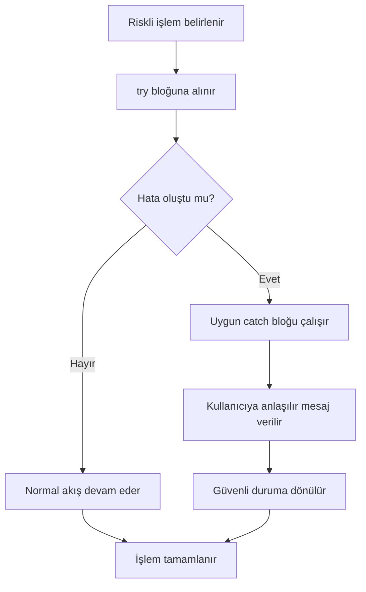

**Diyagram 15.1:** Temel hata yönetimi akışı.

**Görsel üretim notu:** Bu Mermaid diyagramı final DOCX/PDF üretiminden önce PNG'ye dönüştürülmeli; ham `flowchart TD` kodu final çıktıda görünmemelidir.

Bu akış, kullanıcı girdisi, sayısal dönüşüm, koleksiyon erişimi ve dosya işlemleri gibi birçok durumda kullanılabilir.

## 15.12 Adım adım kod örnekleri

Bu bölümde üç temel kod örneği verilecektir. Kod örneklerinde dosya adı ile `public class` adı uyumlu tutulacaktır.

### 15.12.1 Kod 15.1: Temel try-catch örneği

**Kod kimliği:** `b15_kod01_temel_try_catch_ornegi`

**Kod erişimi:** [Kod sayfası](https://github.com/bmdersleri/javaninTemelleri/tree/main/kodlar/bolum15/kod01/) | [Kaynak kod](https://github.com/bmdersleri/javaninTemelleri/blob/main/kodlar/bolum15/kod01/HataYonetimiTemel.java) | 

**QR erişimi:** Kod sayfası ve kaynak kod için aşağıdaki iki QR kod kullanılabilir.

{width=2.8cm} {width=2.8cm}


```java
// Dosya: HataYonetimiTemel.java
public class HataYonetimiTemel {
    public static void main(String[] args) {
        String sayiMetni = "abc";

        try {
            int sayi = Integer.parseInt(sayiMetni);
            System.out.println("Sayı: " + sayi);
        } catch (NumberFormatException e) {
            System.out.println("Hata: Geçerli bir tam sayı değil.");
        }

        System.out.println("Program kontrollü biçimde devam etti.");
    }
}
```

**Kodun amacı:** `NumberFormatException` hatasını `try-catch` ile yakalamayı göstermek.

**Kritik satırlar:**

1. `Integer.parseInt(sayiMetni)` metni tam sayıya çevirmeye çalışır.
2. `"abc"` geçerli bir tam sayı olmadığı için hata oluşur.
3. `catch (NumberFormatException e)` bu hatayı yakalar.
4. Program hata mesajından sonra kontrollü biçimde devam eder.

**Beklenen çıktı:**

```text
Hata: Geçerli bir tam sayı değil.
Program kontrollü biçimde devam etti.
```

**Olası hata ve dikkat noktası:** `catch` bloğu olmasaydı program hata oluştuğunda durabilirdi.

### 15.12.2 Kod 15.2: Kullanıcı girdisiyle bölme işlemi

**Kod kimliği:** `b15_kod02_kullanici_girdisiyle_bolme_islemi`

**Kod erişimi:** [Kod sayfası](https://github.com/bmdersleri/javaninTemelleri/tree/main/kodlar/bolum15/kod02/) | [Kaynak kod](https://github.com/bmdersleri/javaninTemelleri/blob/main/kodlar/bolum15/kod02/HataYonetimiUygulama.java) | 

**QR erişimi:** Kod sayfası ve kaynak kod için aşağıdaki iki QR kod kullanılabilir.

{width=2.8cm} {width=2.8cm}


```java
// Dosya: HataYonetimiUygulama.java
import java.util.InputMismatchException;
import java.util.Scanner;

public class HataYonetimiUygulama {
    public static void main(String[] args) {
        Scanner scanner = new Scanner(System.in);

        try {
            System.out.print("Birinci sayıyı giriniz: ");
            int birinciSayi = scanner.nextInt();

            System.out.print("İkinci sayıyı giriniz: ");
            int ikinciSayi = scanner.nextInt();

            int sonuc = birinciSayi / ikinciSayi;

            System.out.println("Sonuç: " + sonuc);
        } catch (InputMismatchException e) {
            System.out.println("Hata: Lütfen tam sayı giriniz.");
        } catch (ArithmeticException e) {
            System.out.println("Hata: Bir sayı sıfıra bölünemez.");
        } finally {
            System.out.println("Bölme işlemi denemesi tamamlandı.");
            scanner.close();
        }
    }
}
```

**Kodun amacı:** Kullanıcı girdisi ve aritmetik işlem sırasında oluşabilecek iki farklı hatayı ayrı `catch` bloklarıyla yönetmek.

**Kritik satırlar:**

1. `scanner.nextInt()` tam sayı bekler.
2. Kullanıcı metin girerse `InputMismatchException` oluşabilir.
3. İkinci sayı 0 olursa `ArithmeticException` oluşur.
4. `finally` bloğunda işlem sonu mesajı verilir ve `scanner` kapatılır.

**Örnek kullanım durumları:**

```text
Girdi: 10 ve 2
Çıktı: Sonuç: 5
```

```text
Girdi: 10 ve 0
Çıktı: Hata: Bir sayı sıfıra bölünemez.
```

```text
Girdi: on ve 2
Çıktı: Hata: Lütfen tam sayı giriniz.
```

**Olası hata ve dikkat noktası:** Birden fazla `catch` bloğu kullanmak, hataya daha özel mesajlar vermeyi sağlar.

### 15.12.3 Kod 15.3: Hatalı ve düzeltilmiş örnek

Aşağıdaki örnekte tüm hatalar genel `Exception` ile yakalanmış ve kullanıcıya belirsiz bir mesaj verilmiştir.

**Kod kimliği:** `b15_kod03_hatali_ve_duzeltilmis_ornek`

**Kod erişimi:** [Kod sayfası](https://github.com/bmdersleri/javaninTemelleri/tree/main/kodlar/bolum15/kod03/) | [Kaynak kod](https://github.com/bmdersleri/javaninTemelleri/blob/main/kodlar/bolum15/kod03/HataYonetimiHataDuzeltme.java) | 

**QR erişimi:** Kod sayfası ve kaynak kod için aşağıdaki iki QR kod kullanılabilir.

{width=2.8cm} {width=2.8cm}


```java
// Dosya: HataYonetimiHataDuzeltme.java
import java.util.Scanner;

public class HataYonetimiHataDuzeltme {
    public static void main(String[] args) {
        Scanner scanner = new Scanner(System.in);

        try {
            System.out.print("Sayı giriniz: ");
            int sayi = scanner.nextInt();

            int sonuc = 100 / sayi;

            System.out.println("Sonuç: " + sonuc);
        } catch (Exception e) {
            System.out.println("Bir hata oluştu.");
        }

        scanner.close();
    }
}
```

Bu kod çalışabilir; ancak hata türünü ayırt etmez. Kullanıcı metin girdiğinde de sıfır girdiğinde de aynı mesaj gösterilir.

Düzeltilmiş sürüm:

**Kod kimliği:** `b15_kod03_hatali_ve_duzeltilmis_ornek_2`

**Kod erişimi:** [Kod sayfası](https://github.com/bmdersleri/javaninTemelleri/tree/main/kodlar/bolum15/kod03_2/) | [Kaynak kod](https://github.com/bmdersleri/javaninTemelleri/blob/main/kodlar/bolum15/kod03_2/HataYonetimiHataDuzeltme.java) | 

**QR erişimi:** Kod sayfası ve kaynak kod için aşağıdaki iki QR kod kullanılabilir.

{width=2.8cm} {width=2.8cm}


```java
// Dosya: HataYonetimiHataDuzeltme.java
import java.util.InputMismatchException;
import java.util.Scanner;

public class HataYonetimiHataDuzeltme {
    public static void main(String[] args) {
        Scanner scanner = new Scanner(System.in);

        try {
            System.out.print("Sayı giriniz: ");
            int sayi = scanner.nextInt();

            int sonuc = 100 / sayi;

            System.out.println("Sonuç: " + sonuc);
        } catch (InputMismatchException e) {
            System.out.println("Hata: Tam sayı girmeniz gerekir.");
        } catch (ArithmeticException e) {
            System.out.println("Hata: Sıfıra bölme yapılamaz.");
        } finally {
            scanner.close();
        }
    }
}
```

**Kodun amacı:** Genel `Exception` yerine daha özel exception türlerini yakalamanın daha anlaşılır olduğunu göstermek.

**Kritik satırlar:**

1. `InputMismatchException` hatalı giriş türünü yakalar.
2. `ArithmeticException` sıfıra bölme hatasını yakalar.
3. Kullanıcıya hatanın türüne uygun mesaj verilir.
4. `finally` içinde `scanner.close()` çağrılır.

**Beklenen davranış:** Hata türüne göre farklı ve anlaşılır mesaj gösterilir.

**Olası hata ve dikkat noktası:** Genel `Exception` yakalamak bazı durumlarda gerekli olabilir; ancak başlangıç düzeyinde önce özel hata türlerini ayırt etmek daha öğreticidir.

> **⚠️ Sık Yapılan Hata:** Tüm hataları `catch (Exception e)` ile yakalayıp aynı mesajı vermek, hatanın gerçek nedenini anlamayı zorlaştırır.

## 15.13 Kodun çalışma mantığı ve beklenen çıktı

Hata yönetimi kodlarını anlamak için normal akış ve hata akışı ayrı ayrı izlenmelidir.

Aşağıdaki kodu düşünelim:

```java
try {
    int sonuc = 10 / sayi;
    System.out.println("Sonuç: " + sonuc);
} catch (ArithmeticException e) {
    System.out.println("Sıfıra bölme hatası.");
}
```

Eğer `sayi` değeri 2 ise:

| Adım | İşlem | Sonuç |
|---:|---|---|
| 1 | `10 / 2` hesaplanır | 5 |
| 2 | Sonuç yazdırılır | Normal akış |
| 3 | `catch` çalışır mı? | Hayır |

Eğer `sayi` değeri 0 ise:

| Adım | İşlem | Sonuç |
|---:|---|---|
| 1 | `10 / 0` denenir | Hata oluşur |
| 2 | Normal akış kesilir | `println` atlanır |
| 3 | `catch` bloğu çalışır | Hata mesajı verilir |

> **💡 İpucu:** `try` bloğunda hata oluştuktan sonra aynı bloktaki sonraki satırlar çalışmayabilir. Program uygun `catch` bloğuna geçer.

## 15.14 Kullanıcıya anlaşılır hata mesajı verme

Teknik hata mesajları geliştirici için yararlı olabilir; ancak kullanıcı için çoğu zaman anlaşılmazdır. Kullanıcıya gösterilen hata mesajı kısa, açık ve yönlendirici olmalıdır.

Teknik ve anlaşılması zor mesaj:

```text
java.lang.NumberFormatException: For input string: "abc"
```

Kullanıcı dostu mesaj:

```text
Lütfen geçerli bir tam sayı giriniz.
```

### 15.14.1 Hata mesajı yazarken dikkat edilecek noktalar

İyi bir hata mesajı şu özellikleri taşımalıdır:

1. Hatanın ne olduğunu sade biçimde söyler.
2. Kullanıcıyı suçlayıcı ifade kullanmaz.
3. Ne yapılması gerektiğini belirtir.
4. Gereksiz teknik ayrıntı içermez.
5. Gerekirse örnek girdi biçimi verir.

Örnek:

```text
Hata: İkinci sayı 0 olamaz. Lütfen 0 dışında bir değer giriniz.
```

> **🎯 Sınav Notu:** Hata yönetiminde amaç yalnızca programın çökmesini önlemek değildir. Kullanıcıya doğru ve anlaşılır geri bildirim vermek de hata yönetiminin parçasıdır.

## 15.15 Uçtan uca mini uygulama: Hatalı Girişlere Dayanıklı Hesap Makinesi

Bu bölümün mini uygulaması, kullanıcıdan iki sayı ve bir işlem alarak hesaplama yapar. Program, hatalı sayı girişi, sıfıra bölme ve geçersiz işlem seçimi gibi durumları kontrollü biçimde ele alır.

**Uygulama adı:** Hatalı Girişlere Dayanıklı Hesap Makinesi

**Dosya adı:** `HataliGirislereDayanikliHesapMakinesi.java`

**Amaç:** `try`, `catch`, `finally`, `NumberFormatException`, `ArithmeticException`, hata mesajı ve güvenli program akışı kavramlarını tek bir küçük uygulamada birleştirmek.

### 15.15.1 Uygulamanın kodu

**Kod kimliği:** `b15_kod16_uygulamanin_kodu`

**Kod erişimi:** [Kod sayfası](https://github.com/bmdersleri/javaninTemelleri/tree/main/kodlar/bolum15/kod16/) | [Kaynak kod](https://github.com/bmdersleri/javaninTemelleri/blob/main/kodlar/bolum15/kod16/HataliGirislereDayanikliHesapMakinesi.java) | 

**QR erişimi:** Kod sayfası ve kaynak kod için aşağıdaki iki QR kod kullanılabilir.

{width=2.8cm} {width=2.8cm}


```java
// Dosya: HataliGirislereDayanikliHesapMakinesi.java
import java.util.Scanner;

public class HataliGirislereDayanikliHesapMakinesi {
    public static void main(String[] args) {
        Scanner scanner = new Scanner(System.in);

        System.out.println("=== Hatalı Girişlere Dayanıklı Hesap Makinesi ===");

        try {
            System.out.print("Birinci sayı: ");
            int birinciSayi = sayiOku(scanner.nextLine());

            System.out.print("İkinci sayı: ");
            int ikinciSayi = sayiOku(scanner.nextLine());

            System.out.print("İşlem (+, -, *, /): ");
            String islem = scanner.nextLine().trim();

            int sonuc = hesapla(birinciSayi, ikinciSayi, islem);

            System.out.println("Sonuç: " + sonuc);
        } catch (NumberFormatException e) {
            System.out.println("Hata: Sayılar tam sayı biçiminde olmalıdır.");
        } catch (ArithmeticException e) {
            System.out.println("Hata: Bölme işleminde ikinci sayı 0 olamaz.");
        } catch (IllegalArgumentException e) {
            System.out.println("Hata: Geçersiz işlem seçildi.");
        } finally {
            System.out.println("Hesap makinesi işlemi tamamlandı.");
            scanner.close();
        }
    }

    public static int sayiOku(String metin) {
        return Integer.parseInt(metin.trim());
    }

    public static int hesapla(int a, int b, String islem) {
        if (islem.equals("+")) {
            return a + b;
        } else if (islem.equals("-")) {
            return a - b;
        } else if (islem.equals("*")) {
            return a * b;
        } else if (islem.equals("/")) {
            return a / b;
        } else {
            throw new IllegalArgumentException();
        }
    }
}
```

### 15.15.2 Örnek kullanım durumları

Normal kullanım:

```text
Birinci sayı: 20
İkinci sayı: 5
İşlem (+, -, *, /): /
Sonuç: 4
Hesap makinesi işlemi tamamlandı.
```

Hatalı sayı girişi:

```text
Birinci sayı: yirmi
Hata: Sayılar tam sayı biçiminde olmalıdır.
Hesap makinesi işlemi tamamlandı.
```

Sıfıra bölme:

```text
Birinci sayı: 20
İkinci sayı: 0
İşlem (+, -, *, /): /
Hata: Bölme işleminde ikinci sayı 0 olamaz.
Hesap makinesi işlemi tamamlandı.
```

Geçersiz işlem:

```text
Birinci sayı: 20
İkinci sayı: 5
İşlem (+, -, *, /): %
Hata: Geçersiz işlem seçildi.
Hesap makinesi işlemi tamamlandı.
```

### 15.15.3 Uygulama akışının açıklaması

Program şu temel parçalardan oluşur:

1. Kullanıcıdan iki sayı metin olarak alınır.
2. `sayiOku` metodu metni tam sayıya dönüştürür.
3. Dönüşüm hatalıysa `NumberFormatException` oluşur.
4. `hesapla` metodu işlem türüne göre sonucu üretir.
5. Bölme işleminde ikinci sayı 0 ise `ArithmeticException` oluşabilir.
6. Geçersiz işlem seçilirse `IllegalArgumentException` oluşturulur.
7. `finally` bloğu işlem sonunda çalışır.

### 15.15.4 Üç kullanım durumu

| Kullanım durumu | Örnek girdi | Beklenen davranış |
|---|---|---|
| Geçerli bölme | `20`, `5`, `/` | Sonuç 4 |
| Hatalı sayı | `abc`, `5`, `+` | Sayı hatası mesajı |
| Sıfıra bölme | `20`, `0`, `/` | Bölme hatası mesajı |

> **Alıştırma Molası:** Hesap makinesine kalan bulma `%` işlemini ekleyiniz. İkinci sayı 0 olduğunda bu işlem için de uygun hata mesajı gösterildiğinden emin olunuz.

## 15.16 Sık yapılan hatalar ve yanlış sezgiler

Hata yönetimi konusunda öğrencilerin yaptığı hatalar genellikle hatayı aşırı genellemek, kullanıcıya teknik mesaj göstermek veya hata sonrası programın durumunu düşünmemekle ilgilidir.

### 15.16.1 Tüm hataları genel Exception ile yakalamak

Yanlış yaklaşım:

```java
try {
    int sonuc = 10 / sayi;
} catch (Exception e) {
    System.out.println("Hata oluştu.");
}
```

Bu yapı çalışabilir; ancak hatanın nedenini belirsizleştirir. Daha iyi yaklaşım:

```java
try {
    int sonuc = 10 / sayi;
} catch (ArithmeticException e) {
    System.out.println("Hata: Sıfıra bölme yapılamaz.");
}
```

### 15.16.2 Teknik hata mesajını doğrudan kullanıcıya göstermek

Hatalı yaklaşım:

```java
System.out.println(e);
```

Bu çıktı kullanıcı için anlaşılmaz olabilir. Daha uygun yaklaşım:

```java
System.out.println("Hata: Lütfen geçerli bir sayı giriniz.");
```

### 15.16.3 Hata sonrası programı güvenli duruma döndürmemek

Bir işlem hata verdiğinde programın sonraki adımda hangi durumda olacağı düşünülmelidir. Örneğin hesaplama yapılamadıysa sonuç değişkeni kullanılmamalıdır.

### 15.16.4 Yanlış catch sıralaması kullanmak

Daha genel exception türleri, daha özel türlerden önce yazılırsa özel hatalar ayrı yakalanamayabilir. Bu bölümde exception hierarchy ayrıntısına girilmeyecektir; ancak başlangıç kuralı olarak özel hataları önce yakalamak daha doğru bir yaklaşımdır.

### 15.16.5 Hata yönetimini doğrulama yerine kullanmak

Hata yönetimi önemlidir; ancak her kontrolü exception ile yapmak doğru değildir. Örneğin bölme işleminden önce ikinci sayının 0 olup olmadığı karar yapısıyla da kontrol edilebilir.

> **⚠️ Dikkat:** Hata yönetimi, kötü girişleri görmezden gelmek değildir. Hatalı durumun nedenini anlamak, kullanıcıya açıklamak ve programı güvenli hâlde tutmak gerekir.

## 15.17 Hata ayıklama egzersizi

Aşağıdaki kodu inceleyiniz.

**Kod kimliği:** `b15_kod21_hata_ayiklama_egzersizi`

**Kod erişimi:** [Kod sayfası](https://github.com/bmdersleri/javaninTemelleri/tree/main/kodlar/bolum15/kod21/) | [Kaynak kod](https://github.com/bmdersleri/javaninTemelleri/blob/main/kodlar/bolum15/kod21/BolmeHatasi.java) | 

**QR erişimi:** Kod sayfası ve kaynak kod için aşağıdaki iki QR kod kullanılabilir.

{width=2.8cm} {width=2.8cm}


```java
// Dosya: BolmeHatasi.java
public class BolmeHatasi {
    public static void main(String[] args) {
        int a = 10;
        int b = 0;

        int sonuc = a / b;

        System.out.println("Sonuç: " + sonuc);
    }
}
```

**Hata belirtisi:** Kod derlenir; ancak çalıştırıldığında `ArithmeticException` oluşur. Çünkü tam sayı bölme işleminde bir sayı 0'a bölünemez.

**Öğrenciye sorular:**

1. Bu kod derleme hatası mı üretir, çalışma zamanı hatası mı?
2. Hangi satırda hata oluşur?
3. Hata türü nedir?
4. Bu hata `try-catch` ile nasıl yakalanabilir?
5. Hata oluşmadan önce `b == 0` kontrolü yapılabilir mi?
6. Kullanıcıya nasıl daha anlaşılır bir mesaj verilebilir?

Düzeltilmiş kod:

**Kod kimliği:** `b15_kod22_hata_ayiklama_egzersizi`

**Kod erişimi:** [Kod sayfası](https://github.com/bmdersleri/javaninTemelleri/tree/main/kodlar/bolum15/kod22/) | [Kaynak kod](https://github.com/bmdersleri/javaninTemelleri/blob/main/kodlar/bolum15/kod22/BolmeHatasi.java) | 

**QR erişimi:** Kod sayfası ve kaynak kod için aşağıdaki iki QR kod kullanılabilir.

{width=2.8cm} {width=2.8cm}


```java
// Dosya: BolmeHatasi.java
public class BolmeHatasi {
    public static void main(String[] args) {
        int a = 10;
        int b = 0;

        try {
            int sonuc = a / b;
            System.out.println("Sonuç: " + sonuc);
        } catch (ArithmeticException e) {
            System.out.println("Hata: Bir sayı sıfıra bölünemez.");
        }

        System.out.println("Program güvenli biçimde tamamlandı.");
    }
}
```

Alternatif doğrulama yaklaşımı:

```java
if (b == 0) {
    System.out.println("Hata: İkinci sayı 0 olamaz.");
} else {
    int sonuc = a / b;
    System.out.println("Sonuç: " + sonuc);
}
```

Kısa açıklama: Bu örnekte `ArithmeticException`, sıfıra bölme nedeniyle çalışma zamanında oluşur. Hata `try-catch` ile yakalanabilir veya işlemden önce koşul kontrolüyle önlenebilir.

## 15.18 Bölümün sonraki bölümlerle ilişkisi

Bu bölümde hatalı durumlara dayanıklı program yazmanın temelleri öğrenildi. `try`, `catch`, `finally`, `NumberFormatException`, `InputMismatchException` ve `ArithmeticException` örnekleriyle çalışma zamanı hatalarının nasıl yönetilebileceği gösterildi.

Bir sonraki bölümde dosya işlemleri ele alınacaktır. Dosya işlemleri hata yönetimiyle doğrudan ilişkilidir. Dosya bulunamayabilir, dosya okunamayabilir, yazma izni olmayabilir veya dosya içeriği beklenen biçimde olmayabilir. Bu nedenle bu bölümde kazanılan hata yönetimi becerileri, dosya okuma ve yazma uygulamalarında doğrudan kullanılacaktır.

## 15.19 Bölüm özeti

Bu bölümde Java'da temel hata yönetimi ele alındı. Programlarda yalnızca doğru girdi ve beklenen akışa göre kod yazmanın yeterli olmadığı, hatalı kullanıcı girdileri ve beklenmeyen çalışma zamanı durumlarının da düşünülmesi gerektiği vurgulandı.

Exception kavramı, program çalışırken ortaya çıkan olağan dışı durum olarak açıklandı. Derleme hatası, çalışma zamanı hatası ve mantık hatası arasındaki farklar örneklerle gösterildi.

`try-catch` yapısı ile hata oluşabilecek kodların kontrollü biçimde ele alınabileceği anlatıldı. `try` bloğunun riskli işlemleri kapsadığı, `catch` bloğunun ise oluşan hataya uygun tepki verdiği açıklandı. `finally` bloğunun hata olsa da olmasa da çalışması istenen kodlar için kullanılabileceği gösterildi.

`NumberFormatException`, `InputMismatchException` ve `ArithmeticException` temel örneklerle işlendi. Kullanıcıya teknik hata mesajı göstermek yerine sade, açıklayıcı ve yönlendirici mesajlar verilmesi gerektiği vurgulandı.

Son olarak Hatalı Girişlere Dayanıklı Hesap Makinesi uygulamasıyla sayı dönüştürme, sıfıra bölme ve geçersiz işlem seçimi gibi durumlar kontrollü biçimde yönetildi.

## 15.20 Terim sözlüğü

| Terim | Açıklama |
|---|---|
| Exception | Program çalışırken oluşan olağan dışı durum |
| Runtime error | Program çalışırken ortaya çıkan hata |
| Derleme hatası | Program derlenmeden önce yakalanan sözdizimi hatası |
| Mantık hatası | Program çalışsa da yanlış sonuç üretmesine neden olan hata |
| `try` | Hata oluşabilecek kodları kapsayan blok |
| `catch` | Oluşan hatayı yakalayıp yöneten blok |
| `finally` | Hata olsa da olmasa da çalışabilen blok |
| `NumberFormatException` | Metin sayıya çevrilemediğinde oluşan hata |
| `InputMismatchException` | Beklenen türde girdi alınamadığında oluşan hata |
| `ArithmeticException` | Aritmetik işlem sırasında oluşan hata |
| Hata mesajı | Hata hakkında kullanıcıya veya geliştiriciye verilen bilgi |
| Güvenli durum | Hata sonrası programın kontrollü hâlde kalması |
| `IllegalArgumentException` | Uygun olmayan argüman durumunda kullanılabilen hata |
| Doğrulama | İşlemden önce veri veya koşul kontrolü yapma |

## 15.21 Kendini değerlendirme soruları

### 15.15.1 Çoktan seçmeli sorular

1. Java'da hata oluşabilecek kodlar genellikle hangi blok içine alınır?

A) `try`  
B) `class`  
C) `package`  
D) `return`  
E) `break`

2. Hata oluştuğunda uygun tepkinin yazıldığı blok hangisidir?

A) `catch`  
B) `main`  
C) `import`  
D) `static`  
E) `void`

3. Metin tam sayıya çevrilemediğinde hangi hata oluşabilir?

A) `NumberFormatException`  
B) `ArithmeticException`  
C) `InputMismatchException`  
D) `HashMapException`  
E) `DateException`

4. Tam sayı bölme işleminde sıfıra bölme yapılırsa hangi hata oluşabilir?

A) `ArithmeticException`  
B) `NumberFormatException`  
C) `InputMismatchException`  
D) `StringException`  
E) `PackageException`

5. `finally` bloğu için hangisi doğrudur?

A) Hata olsa da olmasa da çalışması istenen kodlar için kullanılabilir  
B) Yalnızca derleme hatalarında çalışır  
C) Her zaman programı durdurur  
D) Sadece değişken tanımlar  
E) Import ifadelerinin yerine geçer

6. Kullanıcı sayı yerine metin girerse `Scanner.nextInt()` hangi hatayı oluşturabilir?

A) `InputMismatchException`  
B) `ArithmeticException`  
C) `NullPointerException`  
D) `PackageException`  
E) `HashSetException`

7. Kullanıcıya gösterilecek hata mesajı nasıl olmalıdır?

A) Açık, kısa ve yönlendirici  
B) Mümkün olduğunca teknik  
C) Her zaman İngilizce stack trace  
D) Kullanıcıyı suçlayıcı  
E) Belirsiz ve genel

### 15.15.2 Doğru/Yanlış soruları

1. `try` bloğu hata oluşabilecek kodları kapsar. (D/Y)
2. `catch` bloğu hataya uygun tepki vermek için kullanılır. (D/Y)
3. `finally` bloğu hiçbir zaman çalışmaz. (D/Y)
4. `NumberFormatException`, metin sayıya çevrilemediğinde oluşabilir. (D/Y)
5. Sıfıra bölme `ArithmeticException` oluşturabilir. (D/Y)
6. Tüm hataları genel `Exception` ile yakalamak her zaman en iyi yaklaşımdır. (D/Y)
7. Hata mesajları kullanıcı için anlaşılır olmalıdır. (D/Y)

### 15.15.3 Açık uçlu kavramsal sorular

1. Exception kavramını kendi cümlelerinizle açıklayınız.
2. Derleme hatası ile çalışma zamanı hatası arasındaki fark nedir?
3. `try`, `catch` ve `finally` bloklarının görevlerini açıklayınız.
4. `NumberFormatException` hangi durumda oluşur? Örnek veriniz.
5. `InputMismatchException` hangi kullanıcı girdilerinde ortaya çıkabilir?
6. `ArithmeticException` için basit bir örnek yazınız.
7. Kullanıcı dostu hata mesajı yazarken nelere dikkat edilmelidir?
8. Genel `Exception` yakalamanın sakıncaları nelerdir?

### 15.15.4 Yanlış gerekçeyi bulma soruları

Aşağıdaki ifadelerdeki yanlış gerekçeyi bulunuz ve düzeltiniz.

1. “Tüm hataları `Exception` ile yakalarsam her zaman en iyi çözümü yazmış olurum.”
2. “Hata mesajının kullanıcı tarafından anlaşılması önemli değildir.”
3. “`try` bloğu hata oluşmasını tamamen engeller.”
4. “`finally` yalnızca hata oluşursa çalışır.”
5. “`NumberFormatException` yalnızca sıfıra bölmede oluşur.”
6. “Program derleniyorsa çalışma zamanında hata oluşamaz.”
7. “Hata sonrası programın güvenli durumda kalması gerekmez.”

## 15.22 Programlama alıştırmaları

### 15.22.1 Kolay düzey

1. `SayiDonusturme.java` adlı programda bir metni `Integer.parseInt` ile sayıya çeviriniz ve hatalı metin için `NumberFormatException` yakalayınız.
2. `BolmeKontrol.java` adlı programda iki tam sayıyı bölünüz ve sıfıra bölme durumunu `catch` ile yakalayınız.
3. `FinallyOrnegi.java` adlı programda hata olsa da olmasa da çalışan bir `finally` bloğu yazınız.
4. Kullanıcıdan alınan yaş bilgisini tam sayıya dönüştüren ve hatalı girişte mesaj veren program yazınız.

### 15.22.2 Orta düzey

1. `GirdiKontrol.java` programında `Scanner.nextInt()` kullanarak `InputMismatchException` yakalayınız.
2. `GuvenceliOrtalama.java` programında kullanıcıdan iki not alıp ortalama hesaplayınız; hatalı girişleri yönetin.
3. `BasitHesapMakinesi.java` programında `+`, `-`, `*`, `/` işlemleri için hata yönetimi ekleyiniz.
4. Teknik hata mesajı yerine kullanıcı dostu hata mesajı veren bir örnek geliştiriniz.

### 15.22.3 Zor düzey

1. `HataliGirislereDayanikliHesapMakinesi.java` uygulamasına `%` işlemini ekleyiniz.
2. Kullanıcı hatalı giriş yaptığında programın yeniden giriş istemesini sağlayınız.
3. Aynı programda hem `NumberFormatException` hem `ArithmeticException` yöneten metotlar yazınız.
4. Genel `Exception` kullanan hatalı bir örnek yazıp özel exception türleriyle düzeltiniz.
5. Hata sonrası programın güvenli duruma dönmesini açıklayan kısa bir rapor hazırlayınız.

## 15.23 Hata ayıklama egzersizi

Aşağıdaki kodu inceleyiniz.

**Kod kimliği:** `b15_kod24_hata_ayiklama_egzersizi`

**Kod erişimi:** [Kod sayfası](https://github.com/bmdersleri/javaninTemelleri/tree/main/kodlar/bolum15/kod24/) | [Kaynak kod](https://github.com/bmdersleri/javaninTemelleri/blob/main/kodlar/bolum15/kod24/ParseHatasi.java) | 

**QR erişimi:** Kod sayfası ve kaynak kod için aşağıdaki iki QR kod kullanılabilir.

{width=2.8cm} {width=2.8cm}


```java
// Dosya: ParseHatasi.java
public class ParseHatasi {
    public static void main(String[] args) {
        String giris = "12a";

        int sayi = Integer.parseInt(giris);

        System.out.println("Sayı: " + sayi);
    }
}
```

**Hata belirtisi:** Kod derlenir; ancak çalışma zamanında `NumberFormatException` oluşur. Çünkü `"12a"` geçerli bir tam sayı biçimi değildir.

**Öğrenciye sorular:**

1. Bu kod derleme hatası mı üretir, çalışma zamanı hatası mı?
2. Hangi satırda hata oluşur?
3. Hata türü nedir?
4. `"12a"` neden tam sayıya çevrilemez?
5. Bu hata `try-catch` ile nasıl yönetilebilir?
6. Kullanıcıya nasıl daha anlaşılır bir mesaj verilebilir?

Düzeltilmiş kod:

**Kod kimliği:** `b15_kod25_hata_ayiklama_egzersizi`

**Kod erişimi:** [Kod sayfası](https://github.com/bmdersleri/javaninTemelleri/tree/main/kodlar/bolum15/kod25/) | [Kaynak kod](https://github.com/bmdersleri/javaninTemelleri/blob/main/kodlar/bolum15/kod25/ParseHatasi.java) | 

**QR erişimi:** Kod sayfası ve kaynak kod için aşağıdaki iki QR kod kullanılabilir.

{width=2.8cm} {width=2.8cm}


```java
// Dosya: ParseHatasi.java
public class ParseHatasi {
    public static void main(String[] args) {
        String giris = "12a";

        try {
            int sayi = Integer.parseInt(giris);
            System.out.println("Sayı: " + sayi);
        } catch (NumberFormatException e) {
            System.out.println("Hata: Giriş tam sayı biçiminde olmalıdır.");
        }

        System.out.println("Program güvenli biçimde tamamlandı.");
    }
}
```

Kısa açıklama: `Integer.parseInt` yalnızca geçerli tam sayı biçimindeki metinleri dönüştürebilir. Hatalı metinlerde `NumberFormatException` oluşur ve bu hata `catch` bloğunda yönetilebilir.

## 15.24 Haftalık laboratuvar / proje görevi

**Görev başlığı:** Hatalı Girişlere Dayanıklı Hesap Makinesi Laboratuvarı

**Amaç:** Bu görev, öğrencinin temel hata yönetimi kavramlarını küçük ama tamamlanabilir bir Java uygulamasında kullanmasını amaçlar.

**Beklenen adımlar:**

1. `HataliGirislereDayanikliHesapMakinesi.java` adlı dosyayı oluşturunuz.
2. Kullanıcıdan iki sayı ve bir işlem alınız.
3. Sayı girişlerini `Integer.parseInt` ile dönüştürünüz.
4. Hatalı sayı girişlerinde `NumberFormatException` yakalayınız.
5. Bölme ve kalan işlemlerinde sıfıra bölme durumunu yönetiniz.
6. Geçersiz işlem seçimlerinde kullanıcıya anlaşılır mesaj veriniz.
7. `finally` bloğu ile işlem sonu mesajı gösteriniz.
8. Programı en az üç farklı test senaryosuyla çalıştırınız.
9. Hata mesajlarını kullanıcı dostu biçimde düzenleyiniz.
10. Kısa bir `README.md` dosyası hazırlayınız.

**Teslim edilecek dosyalar:**

1. `HataliGirislereDayanikliHesapMakinesi.java`
2. `README.md`
3. Program çıktıları
4. Test senaryoları listesi
5. Hata ve çözüm notu

**README içeriği şu başlıkları içermelidir:**

1. Programın amacı
2. Kullanılan hata yönetimi yapıları
3. Desteklenen işlemler
4. Test girdileri ve çıktılar
5. Karşılaşılan hata türleri
6. Hata mesajlarının açıklaması
7. Geliştirme önerileri

## 15.25 Değerlendirme rubriği

| Ölçüt | Açıklama | Puan |
|---|---|---:|
| Hata yönetimi kavramları | `try`, `catch`, `finally` doğru kullanımı | 20 |
| Özel exception kullanımı | `NumberFormatException`, `ArithmeticException` vb. | 20 |
| Uygulama akışı | Hesap makinesi işlemlerinin doğru yönetilmesi | 20 |
| Hata mesajları | Kullanıcı dostu ve açıklayıcı mesajlar | 15 |
| Kodun çalışması | Programın derlenebilir ve çalıştırılabilir olması | 10 |
| Kod okunabilirliği | Metotlara ayırma, isimlendirme ve girinti | 10 |
| Raporlama | README, test çıktıları ve hata notu | 5 |
| **Toplam** |  | **100** |

## 15.26 İleri okuma ve kaynaklar

Bu bölümdeki konular temel düzeyde işlenmiştir. Daha ayrıntılı çalışma için aşağıdaki kaynak türleri incelenebilir:

1. **Java SE API dokümantasyonu:** Exception sınıflarının resmi tanımlarını ve metotlarını incelemek için temel kaynaktır.
2. **Dev.java öğrenme kaynakları:** Java'da hata yönetimi ve güvenli programlama pratikleri için güncel öğrenme içerikleri sunar.
3. **Oracle Java Tutorials:** Exceptions konusu, `try`, `catch`, `finally` ve hata türlerini örneklerle tekrar etmek için yararlıdır.
4. **Ders içi ek notlar:** Kullanıcı girdisi hataları, sıfıra bölme, parse hataları ve hata mesajı tasarımı için pekiştirme materyali olarak kullanılabilir.

> **💡 İpucu:** İleri kaynaklarda custom exception, exception hierarchy ve logging frameworkleriyle karşılaşabilirsiniz. Bu bölümde temel hata yönetimi hedeflenmiştir.

## 15.27 Bir sonraki bölüme köprü

Bu bölümde Java programlarında hatalı durumları yönetmenin temel yolları öğrenildi. Öğrenci artık kullanıcıdan gelen yanlış verileri, sıfıra bölme gibi aritmetik hataları ve metinden sayıya dönüşüm problemlerini daha kontrollü biçimde ele alabilir.

Bir sonraki bölümde dosya işlemleri ve kalıcı veri saklama ele alınacaktır. Dosya okuma ve yazma işlemleri hata yönetimiyle doğrudan ilişkilidir. Dosyanın bulunmaması, erişim izni olmaması veya dosya içeriğinin beklenen biçimde olmaması gibi durumlar hata yönetimi gerektirir. Bu nedenle bu bölümde öğrenilen `try-catch-finally` yapısı, Dosya İşlemleri ve Kalıcı Veri Saklama bölümünde doğrudan kullanılacaktır.

**BÖLÜM SONU**


\newpage


# Bölüm 16: Dosya İşlemleri ve Kalıcı Veri Saklama

## 16.1 Bölümün yol haritası

Önceki bölümlerde program verileri çoğunlukla bellekte tutuldu. Kullanıcıdan alınan bilgiler, dizilerde veya koleksiyonlarda saklandı; program kapandığında bu veriler kayboldu. Gerçek uygulamalarda ise birçok durumda verilerin program kapandıktan sonra da korunması gerekir. Öğrenci listesi, ürün kayıtları, günlük notlar, işlem geçmişi veya ayar bilgileri dosyada saklanabilir.

Bu bölümde Java ile temel dosya işlemleri ve kalıcı veri saklama ele alınacaktır. Amaç, program verilerini dosyaya yazmak ve daha sonra dosyadan okuyarak tekrar kullanabilmektir. Dosya yolu, `File`, `Path`, `Files`, `BufferedReader`, `BufferedWriter`, CSV biçimi, satır satır okuma ve `try-with-resources` konuları sade ve uygulama odaklı örneklerle işlenecektir.

Bu bölümde şu sorulara yanıt aranacaktır:

1. Dosya işlemleri neden gereklidir?
2. Dosya yolu nedir ve göreli yol ile mutlak yol nasıl ayrılır?
3. `File`, `Path` ve `Files` hangi amaçlarla kullanılır?
4. Dosyaya metin nasıl yazılır?
5. Dosya satır satır nasıl okunur?
6. `BufferedReader` ve `BufferedWriter` ne işe yarar?
7. CSV dosya biçimi temel düzeyde nasıl kullanılır?
8. `try-with-resources` dosya kapatma sorununu nasıl azaltır?
9. Dosya yolu yanlış verildiğinde hangi hatalar oluşabilir?
10. CSV Öğrenci Kayıt Sistemi nasıl geliştirilebilir?

> **🎯 Bölüm Hedefi:** Bu bölümün sonunda öğrenci, Java ile temel metin dosyası oluşturabilecek, dosyaya satır yazabilecek, dosyadan satır satır veri okuyabilecek, basit CSV verilerini işleyebilecek ve kaynakları güvenli biçimde kapatmak için `try-with-resources` yapısını kullanabilecektir.

Bu bölümde nesne serileştirme, binary dosyalar ve büyük dosya optimizasyonu ele alınmayacaktır. Amaç, temel Java programlama düzeyinde metin tabanlı dosya işlemlerini öğretmektir.

## 16.2 Bölümün konumu ve pedagojik rolü

Bu bölüm, önceki bölümlerde öğrenilen kullanıcı girdisi, koleksiyonlar ve hata yönetimi bilgisini kalıcı veri saklama ihtiyacıyla birleştirir. Bölüm 21'de hatalı durumları yönetmek için `try`, `catch`, `finally` ve temel exception kavramları öğrenildi. Dosya işlemleri, hata yönetiminin en doğal uygulama alanlarından biridir. Çünkü dosya bulunmayabilir, dosyaya yazma izni olmayabilir, dosya yolu yanlış olabilir veya dosya içeriği beklenenden farklı biçimde düzenlenmiş olabilir.

Bu bölümde öğrenci, yalnızca dosyaya yazma ve dosyadan okuma sözdizimini öğrenmeyecek; aynı zamanda dosya işlemlerinin neden hata yönetimiyle birlikte düşünülmesi gerektiğini de görecektir. Özellikle `try-with-resources` yapısı, dosya kaynaklarının otomatik kapanmasını sağlayarak daha güvenli ve okunabilir kod yazmaya yardım eder.

Bu bölüm, Bölüm 17'de işlenecek sınıf ve nesne kavramına uygulama odaklı giriş için de hazırlık yapar. Çünkü dosyadan okunan satırları bir sonraki bölümde öğrenci nesnelerine dönüştürmek mümkün olacaktır. Bu bölümde ise veriler basit `String`, dizi ve koleksiyon yapılarıyla işlenecektir.

> **⚠️ Dikkat:** Dosya işlemleri yalnızca “dosyaya yaz ve oku” işleminden ibaret değildir. Dosya yolu, veri biçimi, hata yönetimi ve kaynak kapatma birlikte düşünülmelidir.

## 16.3 Öğrenme çıktıları

Bu bölüm tamamlandığında öğrenci:

1. Dosya işlemlerinin program verilerini kalıcı tutmadaki rolünü açıklayabilir.
2. Dosya yolu, göreli yol ve mutlak yol kavramlarını ayırt edebilir.
3. `File`, `Path` ve `Files` kavramlarını temel düzeyde açıklayabilir.
4. `BufferedWriter` ile metin dosyasına satır yazabilir.
5. `BufferedReader` ile metin dosyasını satır satır okuyabilir.
6. `try-with-resources` yapısını dosya kaynaklarını güvenli kapatmak için kullanabilir.
7. CSV biçimindeki basit verileri virgül ayıracıyla yazabilir ve okuyabilir.
8. Dosya yolu hatalarını ve dosya bulunamadı durumlarını yorumlayabilir.
9. CSV ayıracı yanlış kullanıldığında oluşabilecek mantık hatalarını fark edebilir.
10. CSV Öğrenci Kayıt Sistemi adlı mini uygulamayı geliştirebilir.

## 16.4 Ön bilgi ve başlangıç varsayımları

Bu bölüm, öğrencinin aşağıdaki konuları temel düzeyde bildiğini varsayar:

1. Java programının temel yapısı
2. Değişkenler ve veri tipleri
3. Karar yapıları
4. Döngüler
5. Metotlar
6. Diziler
7. `String` işlemleri
8. `ArrayList` kullanımı
9. Hata yönetimi
10. Konsoldan kullanıcı girdisi alma

Bu bölümde dosya işlemleri metin dosyalarıyla sınırlı tutulacaktır. Nesne serileştirme, binary dosya biçimleri ve büyük veri dosyalarının performanslı işlenmesi kapsam dışıdır.

## 16.5 Ana kavramlar

| Kavram | Kısa açıklama | Bu bölümdeki rolü |
|---|---|---|
| `File` | Dosya veya klasör yolunu temsil eder | Dosya var mı kontrolü |
| `Path` | Modern dosya yolu temsilidir | Yol bilgisini düzenli tutma |
| `Files` | Dosya işlemleri için yardımcı metotlar sunar | Okuma, yazma, varlık kontrolü |
| `BufferedReader` | Metin dosyasını verimli okumaya yardım eder | Satır satır okuma |
| `BufferedWriter` | Metin dosyasına verimli yazmaya yardım eder | Satır yazma |
| CSV | Virgül gibi ayırıcılarla düzenlenen metin verisi | Öğrenci kaydı saklama |
| Satır satır okuma | Dosyayı her satırı ayrı işleyerek okuma | CSV kayıtlarını işleme |
| Dosya yolu | Dosyanın sistemdeki konumunu belirtir | Doğru dosyaya erişim |
| `try-with-resources` | Kaynakları otomatik kapatan yapı | Güvenli dosya işlemi |
| Ayırıcı | CSV satırını parçalara bölen karakter | `split(",")` kullanımı |

> **🎯 Sınav Notu:** Dosya işlemlerinde `try-with-resources` kullanmak, `BufferedReader` veya `BufferedWriter` gibi kaynakların işlem sonunda otomatik kapatılmasına yardım eder.

## 16.6 Dosya işlemleri neden gereklidir?

Bir program çalışırken bellekte tutulan veriler program kapandığında kaybolur. Bu durum her uygulama için uygun değildir. Örneğin bir öğrenci kayıt programında girilen öğrencilerin program kapandıktan sonra da saklanması beklenir.

Bellekte tutulan liste:

```java
ArrayList<String> ogrenciler = new ArrayList<>();
ogrenciler.add("1001,Ayşe,Yılmaz");
```

Bu liste program kapandığında kaybolur. Aynı bilgiyi dosyaya yazarsak daha sonra tekrar okuyabiliriz:

```text
1001,Ayşe,Yılmaz
```

Dosya işlemleri özellikle şu durumlarda kullanılır:

1. Program verisi kalıcı saklanacaksa
2. Kullanıcı çıktıları raporlanacaksa
3. Program başka bir programla metin dosyası üzerinden veri paylaşacaksa
4. Basit kayıt sistemi geliştirilecekse
5. Ayar veya log bilgisi tutulacaksa

> **💡 İpucu:** Başlangıç düzeyinde dosya işlemlerini öğrenmek için önce küçük metin dosyalarıyla çalışmak en doğru yaklaşımdır.

## 16.7 Dosya yolu: göreli ve mutlak yol

Dosya yolu, bir dosyanın bilgisayar üzerindeki konumunu belirtir. Java programı bir dosyayı okuyacak veya yazacaksa o dosyanın yolunu bilmelidir.

### 16.7.1 Göreli dosya yolu

Göreli yol, programın çalıştığı klasöre göre verilen yoldur.

```java
Path yol = Path.of("ogrenciler.csv");
```

Bu kullanımda `ogrenciler.csv` dosyası programın çalışma klasöründe aranır veya oluşturulur.

Alt klasör kullanımı:

```java
Path yol = Path.of("veriler", "ogrenciler.csv");
```

Bu ifade `veriler/ogrenciler.csv` yolunu temsil eder.

### 16.7.2 Mutlak dosya yolu

Mutlak yol, dosyanın sistemdeki tam konumunu belirtir. Windows ortamında şu biçimde görülebilir:

```text
C:\projeler\java\ogrenciler.csv
```

Linux veya macOS ortamında şu biçimde görülebilir:

```text
/home/kullanici/projeler/java/ogrenciler.csv
```

Mutlak yollar sistemden sisteme değişebilir. Bu nedenle öğretim ve taşınabilir örneklerde göreli yollar daha uygundur.

> **⚠️ Dikkat:** Dosya yolu yanlış verilirse program beklediğiniz dosyayı bulamayabilir veya dosyayı farklı bir klasörde oluşturabilir.

## 16.8 `File`, `Path` ve `Files` kavramları

Java'da dosya işlemleri için farklı sınıflar kullanılabilir. Bu bölümde üç temel kavrama kısa bir giriş yapılacaktır: `File`, `Path` ve `Files`.

### 16.8.1 `File`

`File`, bir dosya veya klasör yolunu temsil etmek için kullanılabilir.

```java
import java.io.File;

File dosya = new File("ogrenciler.csv");

System.out.println("Var mı?: " + dosya.exists());
System.out.println("Dosya mı?: " + dosya.isFile());
```

`File` sınıfı eski Java sürümlerinden beri kullanılmaktadır. Bu bölümde temel varlık kontrolü için tanıtılacaktır.

### 16.8.2 `Path`

`Path`, modern Java dosya yolu temsilidir. Yol bilgisini daha düzenli biçimde ifade etmeyi sağlar.

```java
import java.nio.file.Path;

Path yol = Path.of("ogrenciler.csv");
```

`Path` nesnesi dosyanın konumunu temsil eder; tek başına dosyanın içeriğini okumaz veya yazmaz.

### 16.8.3 `Files`

`Files`, dosya işlemleri için yardımcı metotlar içeren bir sınıftır.

```java
import java.nio.file.Files;
import java.nio.file.Path;

Path yol = Path.of("ogrenciler.csv");

if (Files.exists(yol)) {
    System.out.println("Dosya var.");
}
```

`Files` sınıfı ile dosya varlığı kontrol edilebilir, satırlar okunabilir veya yazılabilir. Bu bölümde temel düzeyde kullanılacaktır.

> **🎯 Sınav Notu:** `Path` dosya yolunu temsil eder; `Files` ise bu yol üzerinde okuma, yazma veya kontrol işlemleri yapmaya yarayan yardımcı metotlar sunar.

## 16.9 `BufferedWriter` ile dosyaya yazma

Metin dosyasına veri yazmak için `BufferedWriter` kullanılabilir. `BufferedWriter`, veriyi doğrudan tek tek yazmak yerine tamponlama yaparak daha verimli yazmaya yardım eder. Başlangıç düzeyinde önemli olan, bu sınıfın metin dosyasına satır yazmak için kullanışlı olduğunu bilmektir.

Basit örnek:

```java
import java.io.BufferedWriter;
import java.io.IOException;
import java.nio.file.Files;
import java.nio.file.Path;

Path yol = Path.of("notlar.txt");

try (BufferedWriter writer = Files.newBufferedWriter(yol)) {
    writer.write("Merhaba dosya");
    writer.newLine();
    writer.write("İkinci satır");
} catch (IOException e) {
    System.out.println("Dosyaya yazma sırasında hata oluştu.");
}
```

Bu kod `notlar.txt` dosyasına iki satır yazar.

### 16.9.1 `try-with-resources` neden kullanılır?

Dosya yazma işlemlerinde kullanılan kaynakların kapatılması gerekir. `try-with-resources`, kaynakların işlem sonunda otomatik kapatılmasını sağlar.

```java
try (BufferedWriter writer = Files.newBufferedWriter(yol)) {
    writer.write("Satır");
}
```

Bu kullanımda `writer` kaynağı blok sonunda otomatik kapatılır.

> **💡 İpucu:** Dosya okuma veya yazma işlemlerinde `try-with-resources` kullanmak, dosyayı kapatmayı unutma riskini azaltır.

## 16.10 `BufferedReader` ile satır satır okuma

Metin dosyasını okumak için `BufferedReader` kullanılabilir. Dosyadaki veriler çoğu zaman satır satır işlenir. Özellikle CSV dosyalarında her satır bir kaydı temsil edebilir.

Basit okuma örneği:

```java
import java.io.BufferedReader;
import java.io.IOException;
import java.nio.file.Files;
import java.nio.file.Path;

Path yol = Path.of("notlar.txt");

try (BufferedReader reader = Files.newBufferedReader(yol)) {
    String satir = reader.readLine();

    while (satir != null) {
        System.out.println(satir);
        satir = reader.readLine();
    }
} catch (IOException e) {
    System.out.println("Dosya okuma sırasında hata oluştu.");
}
```

Bu kod dosyayı satır satır okur ve her satırı ekrana yazdırır.

### 16.10.1 `readLine` nasıl çalışır?

`readLine` metodu dosyadan bir satır okur. Okunacak satır kalmadığında `null` döndürür. Bu nedenle satır satır okuma için genellikle şu kalıp kullanılır:

```java
String satir = reader.readLine();

while (satir != null) {
    // satırı işle
    satir = reader.readLine();
}
```

> **⚠️ Dikkat:** `readLine` sonucu `null` olduğunda artık dosyada okunacak satır kalmamıştır. `null` değer üzerinde `split` gibi metotlar çağırmaya çalışmak hataya neden olabilir.

## 16.11 CSV dosya biçimi

CSV, virgül gibi bir ayırıcı ile düzenlenen metin tabanlı veri biçimidir. Başlangıç düzeyinde her satır bir kayıt, satırdaki değerler ise alanlar olarak düşünülebilir.

Örnek CSV içeriği:

```text
1001,Ayşe,Yılmaz,85
1002,Mehmet,Demir,72
1003,Zeynep,Kaya,90
```

Bu örnekte her satır bir öğrenciyi temsil eder. Alanlar sırasıyla öğrenci numarası, ad, soyad ve not olabilir.

### 16.11.1 CSV satırını parçalama

CSV satırı `split` ile parçalara ayrılabilir:

```java
String satir = "1001,Ayşe,Yılmaz,85";
String[] alanlar = satir.split(",");

System.out.println("No: " + alanlar[0]);
System.out.println("Ad: " + alanlar[1]);
System.out.println("Soyad: " + alanlar[2]);
System.out.println("Not: " + alanlar[3]);
```

Beklenen çıktı:

```text
No: 1001
Ad: Ayşe
Soyad: Yılmaz
Not: 85
```

### 16.11.2 CSV kullanımında dikkat

Bu bölümde CSV kullanımı basit tutulacaktır. Alanların içinde virgül bulunması, tırnaklı alanlar ve özel kaçış karakterleri gibi ayrıntılar kapsam dışıdır. Öğretim amacıyla her satırda basit ve virgülle ayrılmış alanlar kullanılacaktır.

> **⚠️ Dikkat:** CSV ayıracı olarak virgül kullanıyorsanız, yazma ve okuma tarafında aynı ayıracı kullanmalısınız. Yazarken noktalı virgül, okurken virgül kullanmak mantık hatasına yol açar.

## 16.12 Dosya işlemi akışı

Dosya işlemlerinde genel akış şu şekilde özetlenebilir:

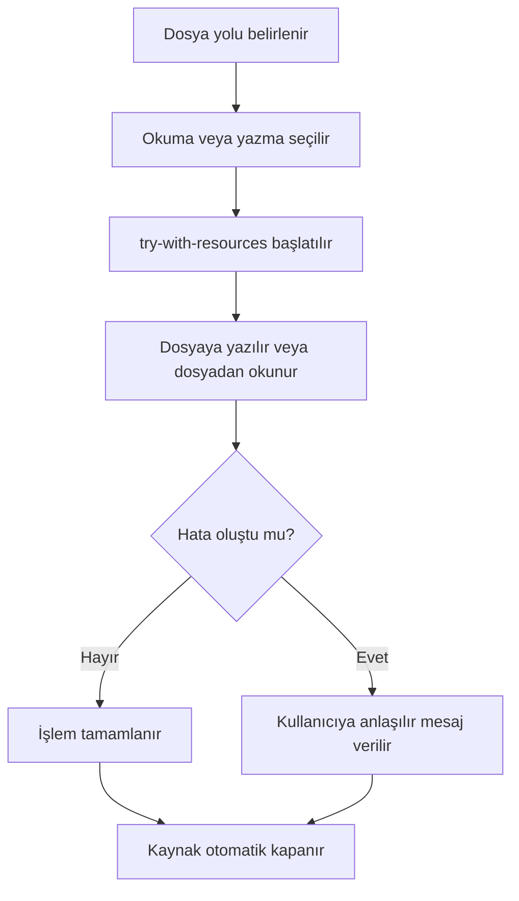

**Diyagram 16.1:** Dosya okuma ve yazma işlemlerinde temel akış.

**Görsel üretim notu:** Bu Mermaid diyagramı final DOCX/PDF üretiminden önce PNG'ye dönüştürülmeli; ham `flowchart TD` kodu final çıktıda görünmemelidir.

Bu akış, dosya yolu, hata yönetimi ve kaynak kapatma adımlarının birlikte düşünülmesi gerektiğini gösterir.

## 16.13 Adım adım kod örnekleri

Bu bölümde üç temel kod örneği verilecektir. Kod örneklerinde dosya adı ile `public class` adı uyumlu tutulacaktır.

### 16.13.1 Kod 16.1: Temel dosyaya yazma ve okuma

**Kod kimliği:** `b16_kod01_temel_dosyaya_yazma_ve_okuma`

**Kod erişimi:** [Kod sayfası](https://github.com/bmdersleri/javaninTemelleri/tree/main/kodlar/bolum16/kod01/) | [Kaynak kod](https://github.com/bmdersleri/javaninTemelleri/blob/main/kodlar/bolum16/kod01/DosyaIslemleriTemel.java) | 

**QR erişimi:** Kod sayfası ve kaynak kod için aşağıdaki iki QR kod kullanılabilir.

{width=2.8cm} {width=2.8cm}


```java
// Dosya: DosyaIslemleriTemel.java
import java.io.BufferedReader;
import java.io.BufferedWriter;
import java.io.IOException;
import java.nio.file.Files;
import java.nio.file.Path;

public class DosyaIslemleriTemel {
    public static void main(String[] args) {
        Path yol = Path.of("temel_notlar.txt");

        try (BufferedWriter writer = Files.newBufferedWriter(yol)) {
            writer.write("Java dosya işlemleri");
            writer.newLine();
            writer.write("Satır satır yazma örneği");
        } catch (IOException e) {
            System.out.println("Yazma sırasında hata oluştu.");
        }

        try (BufferedReader reader = Files.newBufferedReader(yol)) {
            String satir = reader.readLine();

            while (satir != null) {
                System.out.println(satir);
                satir = reader.readLine();
            }
        } catch (IOException e) {
            System.out.println("Okuma sırasında hata oluştu.");
        }
    }
}
```

**Kodun amacı:** `BufferedWriter` ile dosyaya yazma ve `BufferedReader` ile dosyadan satır satır okuma işlemini göstermektir.

**Kritik satırların açıklaması:**

1. `Path.of("temel_notlar.txt")` dosya yolunu oluşturur.
2. `Files.newBufferedWriter(yol)` dosyaya yazmak için writer üretir.
3. `writer.write` dosyaya metin yazar.
4. `writer.newLine()` yeni satıra geçer.
5. `Files.newBufferedReader(yol)` dosyadan okumak için reader üretir.
6. `readLine()` her çağrıda bir satır okur.
7. `try-with-resources` kaynakları otomatik kapatır.

**Beklenen çıktı veya davranış:**

```text
Java dosya işlemleri
Satır satır yazma örneği
```

Program ayrıca çalışma klasöründe `temel_notlar.txt` adlı bir dosya oluşturur.

**Olası hata ve dikkat noktası:** Programın dosya oluşturduğu klasör, IDE veya terminalin çalışma klasörüne göre değişebilir.

### 16.13.2 Kod 16.2: CSV öğrenci kayıtlarını yazma ve okuma

**Kod kimliği:** `b16_kod02_csv_ogrenci_kayitlarini_yazma_ve_okuma`

**Kod erişimi:** [Kod sayfası](https://github.com/bmdersleri/javaninTemelleri/tree/main/kodlar/bolum16/kod02/) | [Kaynak kod](https://github.com/bmdersleri/javaninTemelleri/blob/main/kodlar/bolum16/kod02/DosyaIslemleriUygulama.java) | 

**QR erişimi:** Kod sayfası ve kaynak kod için aşağıdaki iki QR kod kullanılabilir.

{width=2.8cm} {width=2.8cm}


```java
// Dosya: DosyaIslemleriUygulama.java
import java.io.BufferedReader;
import java.io.BufferedWriter;
import java.io.IOException;
import java.nio.file.Files;
import java.nio.file.Path;

public class DosyaIslemleriUygulama {
    public static void main(String[] args) {
        Path yol = Path.of("ogrenciler.csv");

        try (BufferedWriter writer = Files.newBufferedWriter(yol)) {
            writer.write("1001,Ayşe,Yılmaz,85");
            writer.newLine();
            writer.write("1002,Mehmet,Demir,72");
            writer.newLine();
            writer.write("1003,Zeynep,Kaya,90");
        } catch (IOException e) {
            System.out.println("CSV yazma sırasında hata oluştu.");
        }

        try (BufferedReader reader = Files.newBufferedReader(yol)) {
            String satir = reader.readLine();

            while (satir != null) {
                String[] alanlar = satir.split(",");

                if (alanlar.length == 4) {
                    System.out.println("No: " + alanlar[0]);
                    System.out.println("Ad Soyad: "
                            + alanlar[1] + " " + alanlar[2]);
                    System.out.println("Not: " + alanlar[3]);
                    System.out.println("---");
                }

                satir = reader.readLine();
            }
        } catch (IOException e) {
            System.out.println("CSV okuma sırasında hata oluştu.");
        }
    }
}
```

**Kodun amacı:** CSV biçiminde öğrenci kayıtları yazmayı ve dosyadan satır satır okuyarak alanlara ayırmayı göstermektir.

**Kritik satırların açıklaması:**

1. Her CSV satırı bir öğrenciyi temsil eder.
2. Alanlar virgül ile ayrılır.
3. `satir.split(",")` satırı alanlara böler.
4. `alanlar.length == 4` basit biçim kontrolü yapar.
5. Her öğrenci kaydı okunabilir biçimde ekrana yazdırılır.

**Beklenen çıktı veya davranış:**

```text
No: 1001
Ad Soyad: Ayşe Yılmaz
Not: 85
---
No: 1002
Ad Soyad: Mehmet Demir
Not: 72
---
No: 1003
Ad Soyad: Zeynep Kaya
Not: 90
---
```

**Olası hata ve dikkat noktası:** CSV satırında beklenen alan sayısı yoksa `alanlar[3]` gibi erişimler hata üretebilir. Bu nedenle alan sayısı kontrol edilmelidir.

### 16.13.3 Kod 16.3: Hatalı ve düzeltilmiş örnek

Aşağıdaki örnekte CSV dosyasına noktalı virgül ile yazılmış veri, virgül ile okunmaya çalışılmıştır.

**Kod kimliği:** `b16_kod03_hatali_ve_duzeltilmis_ornek`

**Kod erişimi:** [Kod sayfası](https://github.com/bmdersleri/javaninTemelleri/tree/main/kodlar/bolum16/kod03/) | [Kaynak kod](https://github.com/bmdersleri/javaninTemelleri/blob/main/kodlar/bolum16/kod03/DosyaIslemleriHataDuzeltme.java) | 

**QR erişimi:** Kod sayfası ve kaynak kod için aşağıdaki iki QR kod kullanılabilir.

{width=2.8cm} {width=2.8cm}


```java
// Dosya: DosyaIslemleriHataDuzeltme.java
public class DosyaIslemleriHataDuzeltme {
    public static void main(String[] args) {
        String satir = "1001;Ayşe;Yılmaz;85";

        String[] alanlar = satir.split(",");

        System.out.println("Ad: " + alanlar[1]);
    }
}
```

Bu kod çalışma zamanında hata üretebilir. Çünkü `split(",")` virgül arar; satırda virgül olmadığı için dizi tek elemanlı olur. `alanlar[1]` geçersiz erişimdir.

Düzeltilmiş sürüm:

**Kod kimliği:** `b16_kod03_hatali_ve_duzeltilmis_ornek_2`

**Kod erişimi:** [Kod sayfası](https://github.com/bmdersleri/javaninTemelleri/tree/main/kodlar/bolum16/kod03_2/) | [Kaynak kod](https://github.com/bmdersleri/javaninTemelleri/blob/main/kodlar/bolum16/kod03_2/DosyaIslemleriHataDuzeltme.java) | 

**QR erişimi:** Kod sayfası ve kaynak kod için aşağıdaki iki QR kod kullanılabilir.

{width=2.8cm} {width=2.8cm}


```java
// Dosya: DosyaIslemleriHataDuzeltme.java
public class DosyaIslemleriHataDuzeltme {
    public static void main(String[] args) {
        String satir = "1001;Ayşe;Yılmaz;85";

        String[] alanlar = satir.split(";");

        if (alanlar.length == 4) {
            System.out.println("Ad: " + alanlar[1]);
        } else {
            System.out.println("CSV satırı beklenen biçimde değil.");
        }
    }
}
```

**Kodun amacı:** CSV ayıracının yazma ve okuma tarafında tutarlı seçilmesi gerektiğini göstermek.

**Kritik satırların açıklaması:**

1. Hatalı kodda veri `;` ile ayrılmıştır.
2. Hatalı kodda `split(",")` kullanılmıştır.
3. Düzeltilmiş kodda `split(";")` ile doğru ayırıcı seçilmiştir.
4. `alanlar.length == 4` kontrolü indeks hatasını önler.

**Beklenen çıktı veya davranış:**

```text
Ad: Ayşe
```

**Olası hata ve dikkat noktası:** CSV verilerinde ayırıcı karakter baştan belirlenmeli ve tutarlı kullanılmalıdır.

> **⚠️ Sık Yapılan Hata:** Dosyaya yazarken farklı, okurken farklı CSV ayıracı kullanmak satırların yanlış parçalanmasına ve indeks hatalarına neden olabilir.

## 16.14 Kodun çalışma mantığı ve beklenen çıktı

Dosya işlemlerini anlamak için yazma ve okuma adımlarını ayrı düşünmek gerekir.

Aşağıdaki işlem dizisini ele alalım:

```java
Path yol = Path.of("ogrenciler.csv");

try (BufferedWriter writer = Files.newBufferedWriter(yol)) {
    writer.write("1001,Ayşe,Yılmaz,85");
    writer.newLine();
}
```

Bu kodun iz sürme tablosu:

| Adım | İşlem | Sonuç |
|---:|---|---|
| 1 | Dosya yolu oluşturulur | `ogrenciler.csv` hedeflenir |
| 2 | Writer açılır | Yazma kaynağı hazırlanır |
| 3 | Satır yazılır | Dosyaya kayıt eklenir |
| 4 | `newLine` çağrılır | Satır sonu eklenir |
| 5 | Blok biter | Writer otomatik kapanır |

Okuma tarafında ise akış şöyledir:

| Adım | İşlem | Sonuç |
|---:|---|---|
| 1 | Reader açılır | Dosya okumaya hazırlanır |
| 2 | `readLine` çağrılır | İlk satır okunur |
| 3 | Satır `null` mı? | Değilse işlenir |
| 4 | Satır `split` ile ayrılır | Alanlar elde edilir |
| 5 | Sonraki satır okunur | Döngü devam eder |

> **💡 İpucu:** Dosya işlemlerinde hata ararken önce dosyanın gerçekten hangi klasörde oluştuğunu kontrol edin. Birçok başlangıç hatası yanlış çalışma klasörü beklentisinden kaynaklanır.

## 16.15 Uçtan uca mini uygulama: CSV Öğrenci Kayıt Sistemi

Bu bölümün mini uygulaması, öğrenci kayıtlarını CSV dosyasında saklayan küçük bir konsol uygulamasıdır. Program kullanıcıdan öğrenci numarası, ad, soyad ve not bilgisi alır; bu bilgileri CSV dosyasına yazar ve dosyadaki kayıtları okuyarak ekrana listeler.

**Uygulama adı:** CSV Öğrenci Kayıt Sistemi

**Dosya adı:** `CsvOgrenciKayitSistemi.java`

**Amaç:** `Path`, `Files`, `BufferedReader`, `BufferedWriter`, CSV, satır satır okuma ve `try-with-resources` kavramlarını tek bir küçük uygulamada birleştirmek.

### 16.15.1 Uygulamanın kodu

**Kod kimliği:** `b16_kod17_uygulamanin_kodu`

**Kod erişimi:** [Kod sayfası](https://github.com/bmdersleri/javaninTemelleri/tree/main/kodlar/bolum16/kod17/) | [Kaynak kod](https://github.com/bmdersleri/javaninTemelleri/blob/main/kodlar/bolum16/kod17/CsvOgrenciKayitSistemi.java) | 

**QR erişimi:** Kod sayfası ve kaynak kod için aşağıdaki iki QR kod kullanılabilir.

{width=2.8cm} {width=2.8cm}


```java
// Dosya: CsvOgrenciKayitSistemi.java
import java.io.BufferedReader;
import java.io.BufferedWriter;
import java.io.IOException;
import java.nio.file.Files;
import java.nio.file.Path;
import java.nio.file.StandardOpenOption;
import java.util.Scanner;

public class CsvOgrenciKayitSistemi {
    private static final Path DOSYA_YOLU = Path.of("ogrenciler.csv");

    public static void main(String[] args) {
        Scanner scanner = new Scanner(System.in);
        boolean devam = true;

        while (devam) {
            menuYazdir();
            System.out.print("Seçiminiz: ");
            String secim = scanner.nextLine();

            if (secim.equals("1")) {
                ogrenciEkle(scanner);
            } else if (secim.equals("2")) {
                ogrencileriListele();
            } else if (secim.equals("0")) {
                devam = false;
            } else {
                System.out.println("Geçersiz seçim.");
            }
        }

        System.out.println("Program sonlandırıldı.");
        scanner.close();
    }

    public static void menuYazdir() {
        System.out.println();
        System.out.println("=== CSV Öğrenci Kayıt Sistemi ===");
        System.out.println("1 - Öğrenci ekle");
        System.out.println("2 - Öğrencileri listele");
        System.out.println("0 - Çıkış");
    }

    public static void ogrenciEkle(Scanner scanner) {
        System.out.print("Öğrenci no: ");
        String no = scanner.nextLine().trim();

        System.out.print("Ad: ");
        String ad = scanner.nextLine().trim();

        System.out.print("Soyad: ");
        String soyad = scanner.nextLine().trim();

        System.out.print("Not: ");
        String not = scanner.nextLine().trim();

        String csvSatiri = no + "," + ad + "," + soyad + "," + not;

        try (BufferedWriter writer = Files.newBufferedWriter(
                DOSYA_YOLU,
                StandardOpenOption.CREATE,
                StandardOpenOption.APPEND)) {
            writer.write(csvSatiri);
            writer.newLine();
            System.out.println("Öğrenci kaydı eklendi.");
        } catch (IOException e) {
            System.out.println("Hata: Dosyaya yazılamadı.");
        }
    }

    public static void ogrencileriListele() {
        if (!Files.exists(DOSYA_YOLU)) {
            System.out.println("Henüz kayıt dosyası yok.");
            return;
        }

        try (BufferedReader reader = Files.newBufferedReader(DOSYA_YOLU)) {
            String satir = reader.readLine();
            int sayac = 1;

            while (satir != null) {
                yazdirCsvKaydi(satir, sayac);
                sayac++;
                satir = reader.readLine();
            }
        } catch (IOException e) {
            System.out.println("Hata: Dosya okunamadı.");
        }
    }

    public static void yazdirCsvKaydi(String satir, int sira) {
        String[] alanlar = satir.split(",");

        if (alanlar.length != 4) {
            System.out.println(sira + ". kayıt beklenen biçimde değil.");
            return;
        }

        System.out.println(sira + ". öğrenci");
        System.out.println("No: " + alanlar[0]);
        System.out.println("Ad Soyad: " + alanlar[1] + " " + alanlar[2]);
        System.out.println("Not: " + alanlar[3]);
        System.out.println("---");
    }
}
```

### 16.15.2 Örnek kullanım akışı

Öğrenci ekleme:

```text
1 - Öğrenci ekle
Öğrenci no: 1001
Ad: Ayşe
Soyad: Yılmaz
Not: 85
Öğrenci kaydı eklendi.
```

Listeleme:

```text
2 - Öğrencileri listele
1. öğrenci
No: 1001
Ad Soyad: Ayşe Yılmaz
Not: 85
---
```

Geçersiz seçim:

```text
Seçiminiz: 9
Geçersiz seçim.
```

### 16.15.3 Uygulama akışının açıklaması

Program şu temel parçalardan oluşur:

1. `DOSYA_YOLU` sabiti ile CSV dosyasının yolu belirlenir.
2. Menü kullanıcıya işlem seçeneklerini gösterir.
3. Öğrenci ekleme işleminde bilgiler CSV satırı hâline getirilir.
4. `BufferedWriter` ve `StandardOpenOption.APPEND` ile kayıt dosyaya eklenir.
5. Listeleme işleminde dosya varsa `BufferedReader` ile satır satır okunur.
6. Her satır `split(",")` ile alanlara ayrılır.
7. Alan sayısı kontrol edilerek hatalı kayıtlar güvenli biçimde atlanır.

### 16.15.4 Üç kullanım durumu

| Kullanım durumu | Örnek işlem | Beklenen davranış |
|---|---|---|
| İlk kayıt ekleme | `1001,Ayşe,Yılmaz,85` | Dosya oluşturulur ve kayıt yazılır |
| İkinci kayıt ekleme | `1002,Mehmet,Demir,72` | Kayıt dosyanın sonuna eklenir |
| Listeleme | Menüden `2` seçilir | Kayıtlar okunabilir biçimde yazdırılır |

> **Alıştırma Molası:** Uygulamaya “notu 60 ve üzeri olan öğrencileri listele” seçeneği ekleyiniz. CSV satırındaki not alanını `Integer.parseInt` ile sayıya dönüştürerek kontrol ediniz.

## 16.16 Sık yapılan hatalar ve yanlış sezgiler

Dosya işlemlerinde başlangıç öğrencilerinin yaptığı hatalar çoğunlukla dosya yolu, kaynak kapatma ve CSV biçimiyle ilgilidir.

### 16.16.1 Dosya yolunu yanlış vermek

Yanlış düşünce:

```text
Dosya her zaman Java dosyasının bulunduğu klasörde aranır.
```

Düzeltme:

Dosya göreli yol ile verildiyse programın çalışma klasörüne göre aranır. IDE ve terminalde çalışma klasörü farklı olabilir.

### 16.16.2 Dosyayı kapatmayı unutmak

Hatalı yaklaşım:

```java
BufferedWriter writer = Files.newBufferedWriter(Path.of("notlar.txt"));
writer.write("Merhaba");
```

Bu kodda writer kapatılmamıştır. Daha güvenli yaklaşım:

```java
try (BufferedWriter writer =
        Files.newBufferedWriter(Path.of("notlar.txt"))) {
    writer.write("Merhaba");
}
```

### 16.16.3 CSV ayıracını yanlış kullanmak

Yazarken:

```text
1001;Ayşe;Yılmaz;85
```

Okurken:

```java
String[] alanlar = satir.split(",");
```

Bu durumda satır beklenen biçimde parçalanmaz. Yazma ve okuma tarafında aynı ayırıcı kullanılmalıdır.

### 16.16.4 Alan sayısını kontrol etmeden indeks kullanmak

Hatalı kullanım:

```java
String[] alanlar = satir.split(",");
System.out.println(alanlar[3]);
```

Daha güvenli kullanım:

```java
String[] alanlar = satir.split(",");

if (alanlar.length == 4) {
    System.out.println(alanlar[3]);
}
```

### 16.16.5 Dosya yokken doğrudan okumaya çalışmak

Dosya yoksa okuma işlemi hata üretebilir. Bu nedenle `Files.exists` ile kontrol yapılabilir.

```java
if (!Files.exists(yol)) {
    System.out.println("Dosya bulunamadı.");
    return;
}
```

> **⚠️ Dikkat:** Dosya işlemlerinde hata yönetimi isteğe bağlı bir ayrıntı değil, güvenli program yazmanın temel parçasıdır.

## 16.17 Hata ayıklama egzersizi

Aşağıdaki kodu inceleyiniz.

**Kod kimliği:** `b16_kod24_hata_ayiklama_egzersizi`

**Kod erişimi:** [Kod sayfası](https://github.com/bmdersleri/javaninTemelleri/tree/main/kodlar/bolum16/kod24/) | [Kaynak kod](https://github.com/bmdersleri/javaninTemelleri/blob/main/kodlar/bolum16/kod24/CsvAyiracHatasi.java) | 

**QR erişimi:** Kod sayfası ve kaynak kod için aşağıdaki iki QR kod kullanılabilir.

{width=2.8cm} {width=2.8cm}


```java
// Dosya: CsvAyiracHatasi.java
public class CsvAyiracHatasi {
    public static void main(String[] args) {
        String satir = "1001;Ayşe;Yılmaz;85";

        String[] alanlar = satir.split(",");

        System.out.println("Öğrenci adı: " + alanlar[1]);
    }
}
```

**Hata belirtisi:** Kod derlenir; ancak çalışma zamanında hata oluşabilir. Çünkü satır noktalı virgül ile ayrılmıştır; fakat kod virgüle göre parçalama yapmaktadır. Bu nedenle `alanlar` dizisi beklenen uzunlukta değildir.

**Öğrenciye sorular:**

1. CSV satırında hangi ayırıcı kullanılmıştır?
2. Kod hangi ayırıcıya göre parçalama yapmaktadır?
3. `alanlar.length` değeri bu örnekte kaç olabilir?
4. `alanlar[1]` erişimi neden risklidir?
5. Ayırıcı tutarlılığı nasıl sağlanmalıdır?
6. Alan sayısı kontrolü neden gereklidir?

Düzeltilmiş kod:

**Kod kimliği:** `b16_kod25_hata_ayiklama_egzersizi`

**Kod erişimi:** [Kod sayfası](https://github.com/bmdersleri/javaninTemelleri/tree/main/kodlar/bolum16/kod25/) | [Kaynak kod](https://github.com/bmdersleri/javaninTemelleri/blob/main/kodlar/bolum16/kod25/CsvAyiracHatasi.java) | 

**QR erişimi:** Kod sayfası ve kaynak kod için aşağıdaki iki QR kod kullanılabilir.

{width=2.8cm} {width=2.8cm}


```java
// Dosya: CsvAyiracHatasi.java
public class CsvAyiracHatasi {
    public static void main(String[] args) {
        String satir = "1001;Ayşe;Yılmaz;85";

        String[] alanlar = satir.split(";");

        if (alanlar.length == 4) {
            System.out.println("Öğrenci adı: " + alanlar[1]);
        } else {
            System.out.println("Kayıt beklenen biçimde değil.");
        }
    }
}
```

Kısa açıklama: CSV satırı hangi ayırıcıyla yazıldıysa aynı ayırıcıyla okunmalıdır. Ayrıca alan sayısı kontrol edilmeden indeks erişimi yapılmamalıdır.

## 16.18 Bölümün sonraki bölümlerle ilişkisi

Bu bölümde Java ile temel metin dosyası işlemleri öğrenildi. Öğrenci artık program verilerini basit dosyalara yazabilir, dosyadan satır satır okuyabilir ve CSV biçimindeki kayıtları temel düzeyde işleyebilir. Hata yönetimi, dosya yolu ve kaynak kapatma konuları dosya işlemleriyle birlikte uygulamalı olarak pekiştirildi.

Bir sonraki bölümde sınıf ve nesne kavramına uygulama odaklı giriş yapılacaktır. Bu bölümde CSV satırları basit `String[]` alanlarına ayrıldı. Sonraki bölümde bu tür veriler bir `Ogrenci` sınıfı ile temsil edilebilecek, böylece dosyadan okunan verilerin daha düzenli nesnelere dönüştürülmesi için temel hazırlanacaktır.

## 16.19 Bölüm özeti

Bu bölümde Java ile temel dosya işlemleri ele alındı. Program verilerinin yalnızca bellekte tutulduğunda program kapanınca kaybolacağı, dosyaya yazıldığında ise daha sonra tekrar okunabileceği açıklandı.

Dosya yolu kavramı, göreli ve mutlak yol ayrımıyla birlikte işlendi. `File`, `Path` ve `Files` yapıları temel düzeyde tanıtıldı. `Path` ile yol temsil edilebileceği, `Files` ile bu yol üzerinde okuma, yazma ve kontrol işlemleri yapılabileceği vurgulandı.

`BufferedWriter` ile dosyaya metin yazma, `BufferedReader` ile dosyadan satır satır okuma örnekleri verildi. Kaynakların güvenli biçimde kapatılması için `try-with-resources` kullanımı gösterildi.

CSV biçimi, her satırın bir kayıt ve her alanın ayırıcı ile ayrıldığı basit metin biçimi olarak ele alındı. Öğrenci kayıtleri üzerinden CSV yazma, okuma, `split` ile parçalama ve alan sayısı kontrolü uygulandı.

Son olarak CSV Öğrenci Kayıt Sistemi uygulamasıyla dosya yolu, CSV, satır satır okuma, dosyaya ekleme ve hata yönetimi birlikte kullanıldı. Bu bölüm, dosyadaki ham metin verilerinden nesne tabanlı veri modellemeye geçiş için temel hazırlık sağladı.

## 16.20 Terim sözlüğü

| Terim | Açıklama |
|---|---|
| Dosya işlemi | Programın dosyadan veri okuması veya dosyaya veri yazması |
| Dosya yolu | Dosyanın sistemdeki konumunu belirten ifade |
| Göreli yol | Programın çalışma klasörüne göre verilen dosya yolu |
| Mutlak yol | Dosyanın sistemdeki tam konumu |
| `File` | Dosya veya klasör yolunu temsil eden sınıf |
| `Path` | Modern dosya yolu temsilcisi |
| `Files` | Dosya okuma, yazma ve kontrol metotları sunan sınıf |
| `BufferedReader` | Metin dosyasını satır satır okumaya yarayan sınıf |
| `BufferedWriter` | Metin dosyasına yazmaya yarayan sınıf |
| CSV | Ayırıcılarla düzenlenen metin tabanlı veri biçimi |
| Ayırıcı | CSV alanlarını birbirinden ayıran karakter |
| `readLine` | Dosyadan bir satır okuyan metot |
| `try-with-resources` | Kaynakları otomatik kapatan `try` yapısı |
| `IOException` | Girdi/çıktı işlemlerinde oluşabilecek hata türü |
| `StandardOpenOption.APPEND` | Dosyanın sonuna ekleme yapmayı sağlayan seçenek |

## 16.21 Kendini değerlendirme soruları

### 16.21.1 Çoktan seçmeli sorular

1. Modern Java'da dosya yolunu temsil etmek için hangi sınıf kullanılabilir?

A) `Path`  
B) `Scanner`  
C) `Random`  
D) `HashMap`  
E) `StringBuilder`

2. Dosyadan satır satır metin okumak için hangi sınıf kullanılabilir?

A) `BufferedReader`  
B) `BufferedWriter`  
C) `Random`  
D) `LocalDate`  
E) `Math`

3. Dosyaya metin yazmak için hangi sınıf kullanılabilir?

A) `BufferedWriter`  
B) `BufferedReader`  
C) `HashSet`  
D) `Period`  
E) `String`

4. `try-with-resources` kullanımının temel yararı nedir?

A) Kaynakların otomatik kapatılmasına yardım eder  
B) Programı grafik arayüzlü yapar  
C) Tüm dosyaları otomatik siler  
D) Değişken türlerini değiştirir  
E) CSV ayıracını otomatik bulur

5. CSV biçiminde alanları ayırmak için başlangıç düzeyinde hangi metot kullanılabilir?

A) `split`  
B) `sqrt`  
C) `nextInt`  
D) `containsKey`  
E) `round`

6. Dosyanın var olup olmadığını kontrol etmek için hangisi kullanılabilir?

A) `Files.exists(yol)`  
B) `Math.exists(yol)`  
C) `String.exists(yol)`  
D) `Path.read(yol)`  
E) `Scanner.write(yol)`

7. Dosyanın sonuna kayıt eklemek için hangi seçenek kullanılabilir?

A) `StandardOpenOption.APPEND`  
B) `Math.APPEND`  
C) `LocalDate.APPEND`  
D) `HashSet.APPEND`  
E) `Scanner.APPEND`

### 16.21.2 Doğru/Yanlış soruları

1. `Path` dosya yolunu temsil etmek için kullanılabilir. (D/Y)
2. `BufferedReader` dosyaya yazmak için kullanılır. (D/Y)
3. `BufferedWriter` dosyaya metin yazmak için kullanılabilir. (D/Y)
4. `try-with-resources` kaynak kapatma riskini azaltır. (D/Y)
5. CSV satırı her zaman aynı ayırıcıyla yazılıp okunmalıdır. (D/Y)
6. `readLine` okunacak satır kalmadığında `null` döndürebilir. (D/Y)
7. Dosya yolu yanlış olsa bile program her zaman doğru dosyayı bulur. (D/Y)

### 16.21.3 Açık uçlu kavramsal sorular

1. Dosya işlemleri neden gereklidir?
2. Göreli dosya yolu ile mutlak dosya yolu arasındaki fark nedir?
3. `File`, `Path` ve `Files` kavramlarını temel düzeyde karşılaştırınız.
4. `BufferedWriter` ile dosyaya yazma adımlarını açıklayınız.
5. `BufferedReader` ile satır satır okuma nasıl yapılır?
6. `try-with-resources` yapısının yararını açıklayınız.
7. CSV biçimi nedir? Basit bir öğrenci kaydı örneği veriniz.
8. CSV ayıracının yanlış seçilmesi hangi hatalara yol açabilir?

### 16.21.4 Yanlış gerekçeyi bulma soruları

Aşağıdaki ifadelerdeki yanlış gerekçeyi bulunuz ve düzeltiniz.

1. “Dosya her zaman Java kaynak dosyasının bulunduğu klasörde aranır.”
2. “Dosya işlemlerinde kaynak kapatmaya gerek yoktur.”
3. “CSV yazarken ve okurken farklı ayırıcı kullanmak sorun oluşturmaz.”
4. “`readLine` hiçbir zaman `null` döndürmez.”
5. “Alan sayısı kontrol edilmeden `alanlar[3]` erişimi her zaman güvenlidir.”
6. “`Path` dosya içeriğini doğrudan okur.”
7. “Dosya işlemlerinde hata yönetimi gereksizdir.”

## 16.22 Programlama alıştırmaları

### 16.16.1 Kolay düzey

1. `BasitDosyaYazma.java` adlı programda `notlar.txt` dosyasına iki satır yazınız.
2. `BasitDosyaOkuma.java` adlı programda bir metin dosyasını satır satır okuyunuz.
3. `DosyaVarMi.java` adlı programda `Files.exists` ile dosya varlığını kontrol ediniz.
4. `CsvSatiriParcala.java` adlı programda `"1001,Ayşe,Yılmaz,85"` satırını parçalara ayırınız.

### 16.16.2 Orta düzey

1. `OgrenciCsvYaz.java` programında üç öğrenci kaydını CSV dosyasına yazınız.
2. `OgrenciCsvOku.java` programında CSV dosyasındaki kayıtları okuyup ekrana yazdırınız.
3. CSV satırlarında alan sayısını kontrol eden bir program yazınız.
4. Dosya yoksa kullanıcıya “Henüz kayıt yok” mesajı veren program geliştiriniz.

### 16.16.3 Zor düzey

1. `CsvOgrenciKayitSistemi.java` uygulamasına “notu 60 ve üzeri olanları listele” seçeneği ekleyiniz.
2. Aynı uygulamaya öğrenci numarasına göre arama seçeneği ekleyiniz.
3. Hatalı biçimde yazılmış CSV satırlarını atlayıp raporlayan metot yazınız.
4. Dosya yolu kullanıcıdan alınan ve dosya yoksa oluşturulan bir program geliştiriniz.
5. CSV ayıracını yanlış kullanarak hata üreten bir örnek yazınız ve düzeltiniz.

## 16.23 Hata ayıklama egzersizi

Aşağıdaki kodu inceleyiniz.

**Kod kimliği:** `b16_kod26_hata_ayiklama_egzersizi`

**Kod erişimi:** [Kod sayfası](https://github.com/bmdersleri/javaninTemelleri/tree/main/kodlar/bolum16/kod26/) | [Kaynak kod](https://github.com/bmdersleri/javaninTemelleri/blob/main/kodlar/bolum16/kod26/DosyaYoluHatasi.java) | 

**QR erişimi:** Kod sayfası ve kaynak kod için aşağıdaki iki QR kod kullanılabilir.

{width=2.8cm} {width=2.8cm}


```java
// Dosya: DosyaYoluHatasi.java
import java.io.BufferedReader;
import java.io.IOException;
import java.nio.file.Files;
import java.nio.file.Path;

public class DosyaYoluHatasi {
    public static void main(String[] args) {
        Path yol = Path.of("veriler", "ogrenciler.csv");

        try (BufferedReader reader = Files.newBufferedReader(yol)) {
            String satir = reader.readLine();
            System.out.println(satir);
        } catch (IOException e) {
            System.out.println("Dosya okunamadı.");
        }
    }
}
```

**Hata belirtisi:** Kod derlenir; ancak `veriler/ogrenciler.csv` dosyası yoksa veya program farklı bir çalışma klasöründen çalıştırılıyorsa dosya okunamaz. Kullanıcı yalnızca “Dosya okunamadı.” mesajını görür.

**Öğrenciye sorular:**

1. Kod hangi dosya yolunu okumaya çalışmaktadır?
2. Bu yol göreli yol mudur, mutlak yol mudur?
3. `veriler` klasörü yoksa ne olur?
4. Dosyanın varlığı hangi metotla kontrol edilebilir?
5. Kullanıcıya daha açıklayıcı bir hata mesajı nasıl verilebilir?
6. Programın çalışma klasörü neden önemlidir?

Düzeltilmiş kod:

**Kod kimliği:** `b16_kod27_hata_ayiklama_egzersizi`

**Kod erişimi:** [Kod sayfası](https://github.com/bmdersleri/javaninTemelleri/tree/main/kodlar/bolum16/kod27/) | [Kaynak kod](https://github.com/bmdersleri/javaninTemelleri/blob/main/kodlar/bolum16/kod27/DosyaYoluHatasi.java) | 

**QR erişimi:** Kod sayfası ve kaynak kod için aşağıdaki iki QR kod kullanılabilir.

{width=2.8cm} {width=2.8cm}


```java
// Dosya: DosyaYoluHatasi.java
import java.io.BufferedReader;
import java.io.IOException;
import java.nio.file.Files;
import java.nio.file.Path;

public class DosyaYoluHatasi {
    public static void main(String[] args) {
        Path yol = Path.of("veriler", "ogrenciler.csv");

        if (!Files.exists(yol)) {
            System.out.println("Dosya bulunamadı: " + yol);
            System.out.println("Çalışma klasörünü ve dosya yolunu kontrol edin.");
            return;
        }

        try (BufferedReader reader = Files.newBufferedReader(yol)) {
            String satir = reader.readLine();

            if (satir == null) {
                System.out.println("Dosya boş.");
            } else {
                System.out.println(satir);
            }
        } catch (IOException e) {
            System.out.println("Dosya okunurken hata oluştu.");
        }
    }
}
```

Kısa açıklama: Dosya okunmadan önce `Files.exists` ile varlık kontrolü yapılır. Hata mesajı, kullanıcıya hangi yolun bulunamadığını açıkça gösterir.

## 16.24 Haftalık laboratuvar / proje görevi

**Görev başlığı:** CSV Öğrenci Kayıt Sistemi Laboratuvarı

**Amaç:** Bu görev, öğrencinin dosya işlemleri, CSV biçimi, satır satır okuma ve hata yönetimi becerilerini küçük ama tamamlanabilir bir Java uygulamasında kullanmasını amaçlar.

**Beklenen adımlar:**

1. `CsvOgrenciKayitSistemi.java` adlı dosyayı oluşturunuz.
2. `ogrenciler.csv` adlı dosya için `Path` sabiti tanımlayınız.
3. Menü yapısı oluşturunuz.
4. Kullanıcıdan öğrenci no, ad, soyad ve not bilgisi alınız.
5. Öğrenci kaydını CSV satırı olarak dosyaya ekleyiniz.
6. Dosyadaki kayıtları satır satır okuyup ekrana yazdırınız.
7. CSV satırını `split` ile alanlara ayırınız.
8. Alan sayısı beklenen değerde değilse kullanıcıya uyarı veriniz.
9. Dosya yoksa kullanıcıya anlaşılır mesaj veriniz.
10. Programı en az üç farklı test girdisiyle çalıştırınız.
11. Kısa bir `README.md` dosyası hazırlayınız.

**Teslim edilecek dosyalar:**

1. `CsvOgrenciKayitSistemi.java`
2. `ogrenciler.csv`
3. `README.md`
4. Program çıktıları
5. Test senaryoları listesi
6. Hata ve çözüm notu

**README içeriği şu başlıkları içermelidir:**

1. Programın amacı
2. Kullanılan dosya işlemi yapıları
3. CSV alanları ve ayırıcı bilgisi
4. Menü seçenekleri
5. Test girdileri ve çıktılar
6. Karşılaşılan hata ve çözüm
7. Geliştirme önerileri

## 16.25 Değerlendirme rubriği

| Ölçüt | Açıklama | Puan |
|---|---|---:|
| Dosya yolu ve kaynak kullanımı | `Path`, `Files`, try-with-resources | 20 |
| Dosyaya yazma | `BufferedWriter` ile doğru kayıt ekleme | 20 |
| Dosyadan okuma | `BufferedReader` ile satır satır okuma | 20 |
| CSV işleme | Ayırıcı, alan sayısı ve veri yorumlama | 15 |
| Hata yönetimi / doğrulama | Dosya yokluğu ve hatalı satır kontrolü | 10 |
| Kod okunabilirliği | Metotlara ayırma, isimlendirme ve girinti | 10 |
| Raporlama | README, test çıktıları ve hata notu | 5 |
| **Toplam** |  | **100** |

## 16.26 İleri okuma ve kaynaklar

Bu bölümdeki konular temel düzeyde işlenmiştir. Daha ayrıntılı çalışma için aşağıdaki kaynak türleri incelenebilir:

1. **Java SE API dokümantasyonu:** `java.nio.file.Files`, `Path`, `BufferedReader` ve `BufferedWriter` sınıflarının resmi davranışlarını incelemek için temel kaynaktır.
2. **Dev.java öğrenme kaynakları:** Modern Java dosya işlemleri ve `java.nio.file` kullanımı için güncel öğretici içerikler sunar.
3. **Oracle Java Tutorials:** Dosya okuma-yazma, path kullanımı ve I/O kavramları için örnekli açıklamalar içerir.
4. **Ders içi ek notlar:** CSV biçimi, dosya yolu hataları ve `try-with-resources` kullanımını pekiştirmek için kullanılabilir.

> **💡 İpucu:** İleri kaynaklarda nesne serileştirme, binary dosyalar ve büyük dosya optimizasyonu gibi konularla karşılaşabilirsiniz. Bu bölümde yalnızca temel metin dosyası işlemleri hedeflenmiştir.

## 16.27 Bir sonraki bölüme köprü

Bu bölümde Java programlarında verileri dosyada saklama ve tekrar okuma becerisi kazanıldı. Öğrenci artık basit CSV dosyalarıyla çalışabilir, kayıtları satır satır okuyabilir ve dosya işlemlerinde hata yönetimini temel düzeyde uygulayabilir.

Bir sonraki bölümde sınıf ve nesne kavramına uygulama odaklı giriş yapılacaktır. Bu bölümde CSV satırları `String[]` alanları olarak işlendi. Sonraki bölümde aynı tür veriler `Ogrenci` gibi sınıflarla temsil edilerek daha düzenli, okunabilir ve genişletilebilir programlar geliştirilecektir.

**BÖLÜM SONU**


\newpage


# Bölüm 17: Sınıf, Nesne, Constructor ve Kapsülleme

## 17.1 Bölümün yol haritası

Önceki bölümlerde Java programlarında veriler çoğunlukla tekil değişkenler, diziler, koleksiyonlar veya CSV satırları biçiminde temsil edildi. Bu yaklaşım başlangıç için uygundur; ancak gerçek uygulamalarda bir varlık genellikle birden fazla bilgiyle birlikte düşünülür. Örneğin bir öğrenciyi yalnızca ad değişkeniyle değil; öğrenci numarası, ad, soyad, not ve geçme durumu gibi ilişkili bilgilerle birlikte temsil etmek gerekir.

Bu bölümde Java’nın nesne yönelimli programlamaya geçişteki temel yapı taşları ele alınacaktır: **sınıf**, **nesne**, **alan**, **metot**, **constructor**, **`this`**, **`private`**, **getter-setter** ve **basit kapsülleme**. Amaç, öğrenciyi ileri düzey OOP tartışmalarına sokmak değil, verileri daha düzenli modelleyebileceği küçük sınıflar yazdırmaktır.

Bu bölümde şu sorulara yanıt aranacaktır:

1. Sınıf nedir ve neden kullanılır?
2. Nesne nedir ve `new` anahtar kelimesi ne işe yarar?
3. Alanlar bir nesnenin hangi bilgilerini temsil eder?
4. Sınıf içinde metot tanımlamak neden yararlıdır?
5. Referans kavramı başlangıç düzeyinde nasıl anlaşılmalıdır?
6. Model sınıfı nedir?
7. `ArrayList<Ogrenci>` gibi nesne listeleri neden önemlidir?
8. Constructor nedir ve nesne oluşturma sürecinde hangi rolü üstlenir?
9. Default constructor ve parametreli constructor arasındaki fark nedir?
10. `this` anahtar kelimesi hangi karışıklığı çözer?
11. `private` alanlar neden kullanılır?
12. Getter ve setter metotları ne işe yarar?
13. Setter içinde doğrulama neden önemlidir?
14. `toString()` metodu nesne bilgisini yazdırmayı nasıl kolaylaştırır?
15. Basit bir Öğrenci Kayıt Modeli nasıl geliştirilir?

> **🎯 Bölüm Hedefi:** Bu bölümün sonunda öğrenci, temel düzeyde sınıf ve nesne oluşturabilecek, constructor kullanarak nesneye başlangıç değeri verebilecek, `this` anahtar kelimesini doğru yerde kullanabilecek, `private` alanlar ve getter-setter metotlarıyla basit kapsülleme uygulayabilecek ve `ArrayList` içinde nesnelerden oluşan küçük bir öğrenci kayıt modeli geliştirebilecektir.

Bu bölümde kalıtım, interface, polymorphism, abstract class, design patterns, SOLID ilkeleri, generic sınıf tasarımı, inner class ayrıntıları ve ileri nesne yönelimli tasarım konuları ele alınmayacaktır. Bu konuların bazılarına sonraki bölümde yalnızca GUI olay yönetimine hazırlık düzeyinde değinilecektir.

## 17.2 Bölümün konumu ve pedagojik rolü

Bu bölüm, prosedürel programlama yaklaşımından nesne tabanlı veri modellemeye geçiş sağlar. Önceki bölümlerde bir öğrencinin bilgileri ayrı değişkenlerde veya CSV satırında saklanabiliyordu. Ancak değişken sayısı arttıkça ve aynı türden çok sayıda kayıt yönetilmek istendikçe kodun okunması ve yönetilmesi zorlaşır.

Örneğin aşağıdaki yapı başlangıçta anlaşılır görünebilir:

```java
String no = "1001";
String ad = "Ayşe";
String soyad = "Yılmaz";
int not = 85;
```

Ancak birden fazla öğrenci olduğunda bu değişkenleri çoğaltmak sürdürülebilir değildir. Bunun yerine `Ogrenci` adlı bir sınıf tanımlanabilir ve her öğrenci bu sınıftan oluşturulan bir nesne olarak temsil edilebilir.

Bu bölümde öğrencinin üç temel alışkanlık kazanması hedeflenir:

1. İlişkili verileri aynı sınıf altında toplamak
2. Nesne oluştururken başlangıç değerlerini constructor ile vermek
3. Alanlara doğrudan erişmek yerine kontrollü erişim için getter-setter kullanmak

> **⚠️ Dikkat:** Bu bölümde OOP, teorik bir tasarım felsefesi olarak değil, küçük Java uygulamalarında veriyi daha düzenli temsil etme aracı olarak ele alınacaktır.

Bu bölüm, ilerleyen GUI bölümleri ve JDBC bölümüne hazırlık sağlar. Çünkü arayüzden veya veritabanından gelen kayıtlar çoğu zaman `Ogrenci`, `Urun`, `Ders` gibi model sınıflarıyla temsil edilir.

## 17.3 Öğrenme çıktıları

Bu bölüm tamamlandığında öğrenci:

1. Sınıf kavramını kendi cümleleriyle açıklayabilir.
2. Nesne kavramını sınıftan oluşturulan örnek olarak tanımlayabilir.
3. `new` anahtar kelimesiyle nesne oluşturabilir.
4. Alan ve metot kavramlarını ayırt edebilir.
5. Basit bir model sınıfı yazabilir.
6. Nesne alanlarına başlangıç düzeyinde değer atayabilir.
7. Sınıf içinde nesneye ait bilgileri yazdıran metot oluşturabilir.
8. `ArrayList<Ogrenci>` ile nesne listesi oluşturabilir.
9. Constructor kavramını açıklayabilir.
10. Default constructor ve parametreli constructor arasındaki farkı gösterebilir.
11. `this` anahtar kelimesinin alan-parametre karışıklığını nasıl çözdüğünü açıklayabilir.
12. `private` alan kullanımının neden gerekli olduğunu ifade edebilir.
13. Getter ve setter metotları yazabilir.
14. Setter içinde basit doğrulama uygulayabilir.
15. `toString()` metodunu nesne bilgisini okunabilir yazdırmak için kullanabilir.
16. Öğrenci Kayıt Modeli mini uygulamasını geliştirebilir.

## 17.4 Ön bilgi ve başlangıç varsayımları

Bu bölüm, öğrencinin aşağıdaki konuları temel düzeyde bildiğini varsayar:

1. Java programının temel yapısı
2. Değişkenler ve veri tipleri
3. Karar yapıları
4. Döngüler
5. Metot tanımlama ve çağırma
6. `ArrayList` kullanımı
7. `String` işlemleri
8. `Scanner` ile kullanıcı girdisi alma
9. Dosya işlemlerinde CSV satırı kavramı
10. `public class` ve dosya adı ilişkisi

Bu bölümde sınıflar çoğunlukla aynı `.java` dosyasında gösterilecektir. Bir dosyada yalnızca bir sınıf `public` olacaktır. Paketli proje düzeni önceki bölümde ele alındığı için burada temel örnekler sade tutulacaktır.

## 17.5 Ana kavramlar

| Kavram | Kısa açıklama | Bu bölümdeki rolü |
|---|---|---|
| Sınıf | Nesneler için şablon | `Ogrenci` modeli |
| Nesne | Sınıftan oluşturulan örnek | Bir öğrenci kaydı |
| Alan | Nesnenin verisini tutan değişken | `no`, `ad`, `not` |
| Metot | Nesnenin davranışını veya işlemini temsil eder | `bilgileriYazdir()` |
| `new` | Yeni nesne oluşturur | `new Ogrenci()` |
| Referans | Nesneye erişmek için kullanılan değişken | `Ogrenci ogrenci` |
| Model sınıfı | Uygulamadaki bir varlığı temsil eden sınıf | Öğrenci, ürün, ders |
| Constructor | Nesne oluşturulurken çalışan özel yapı | Başlangıç değeri verme |
| Default constructor | Parametresiz constructor | Varsayılan değer |
| Parametreli constructor | Parametre alarak nesne oluşturan constructor | `new Ogrenci("Ayşe", 85)` |
| `this` | Mevcut nesneyi temsil eder | Alan-parametre ayrımı |
| `private` | Alanlara doğrudan erişimi sınırlar | Kapsülleme |
| Getter | Alan değerini okuyan metot | `getNot()` |
| Setter | Alan değerini kontrollü değiştiren metot | `setNot(int not)` |
| `toString()` | Nesnenin metinsel temsilini döndürür | Listeleme |

> **🎯 Sınav Notu:** Sınıf bir şablondur; nesne bu şablondan oluşturulan somut örnektir. `Ogrenci` sınıf, `new Ogrenci(...)` ile oluşturulan her öğrenci ise nesnedir.

## 17.6 Sınıf kavramı

Sınıf, belirli bir varlık türünü temsil eden şablondur. Bir sınıf, o varlığın hangi bilgilere sahip olacağını ve hangi işlemleri yapabileceğini tanımlar.

Örneğin bir öğrenciyi temsil etmek için şu bilgiler gerekebilir:

1. Öğrenci numarası
2. Ad
3. Soyad
4. Not

Bu bilgiler ayrı ayrı değişkenlerde tutulabilir; ancak daha düzenli yaklaşım bunları bir sınıf altında toplamaktır.


```java
class Ogrenci {
    String no;
    String ad;
    String soyad;
    int not;
}
```

Bu sınıf, öğrenci nesneleri için bir şablondur. Henüz gerçek bir öğrenci oluşturulmamıştır. Sadece öğrencinin hangi bilgilere sahip olacağı tanımlanmıştır.

### 17.6.1 Sınıf neden kullanılır?

Sınıf kullanmak şu yararları sağlar:

1. İlişkili verileri aynı yapı altında toplar.
2. Kodun okunabilirliğini artırır.
3. Aynı türden birçok nesne oluşturmayı kolaylaştırır.
4. Veriye ait işlemleri sınıf içinde tanımlamayı sağlar.
5. GUI, dosya ve veritabanı uygulamalarında veri modellemeyi kolaylaştırır.

> **💡 İpucu:** Bir problemde “öğrenci”, “ürün”, “ders”, “kitap” gibi gerçek dünyadan varlıklar varsa, bu varlıklar çoğu zaman sınıf olarak modellenebilir.

## 17.7 Nesne kavramı ve `new`

Sınıf bir şablondur. Nesne ise bu şablondan oluşturulan gerçek örnektir. Java’da nesne oluşturmak için `new` anahtar kelimesi kullanılır.

```java
Ogrenci ogrenci1 = new Ogrenci();
```

Bu satırda `Ogrenci` sınıfından `ogrenci1` adlı bir nesne oluşturulur.

### 17.7.1 Alanlara değer atama

Nesne oluşturulduktan sonra alanlarına değer atanabilir.

```java
ogrenci1.no = "1001";
ogrenci1.ad = "Ayşe";
ogrenci1.soyad = "Yılmaz";
ogrenci1.not = 85;
```

### 17.7.2 Alanları okuma

Nesne alanlarına nokta operatörüyle erişilebilir.

```java
System.out.println(ogrenci1.ad);
System.out.println(ogrenci1.not);
```

Beklenen çıktı:

```text
Ayşe
85
```

> **⚠️ Dikkat:** Bu ilk örneklerde alanlara doğrudan erişim gösterilmektedir. Bölümün ilerleyen kısmında `private` alanlar ve getter-setter metotlarıyla daha kontrollü erişim kullanılacaktır.

## 17.8 Alan ve metot ilişkisi

Bir sınıf yalnızca veri alanları içermez. Nesneye ait işlemler de sınıf içinde metot olarak tanımlanabilir.


```java
class Ogrenci {
    String no;
    String ad;
    String soyad;
    int not;

    void bilgileriYazdir() {
        System.out.println(no + " - " + ad + " " + soyad);
        System.out.println("Not: " + not);
    }
}
```

Bu metot, nesnenin kendi alanlarını kullanarak öğrenci bilgilerini ekrana yazar.

Kullanım:

```java
Ogrenci ogrenci = new Ogrenci();

ogrenci.no = "1001";
ogrenci.ad = "Ayşe";
ogrenci.soyad = "Yılmaz";
ogrenci.not = 85;

ogrenci.bilgileriYazdir();
```

Beklenen çıktı:

```text
1001 - Ayşe Yılmaz
Not: 85
```

### 17.8.1 Metot neden sınıf içinde tanımlanır?

Bir işlem doğrudan belirli bir nesnenin verileriyle ilgiliyse, bu işlem sınıf içinde metot olarak tanımlanabilir. Böylece nesnenin verisi ve bu veriyle yapılan işlem aynı yapıda yer alır.

Örneğin öğrencinin geçip geçmediğini belirlemek için şu metot yazılabilir:

```java
boolean gectiMi() {
    return not >= 50;
}
```

Bu metot, öğrencinin kendi `not` alanını kullanır.

> **💡 İpucu:** Bir metot sürekli aynı varlığın alanlarını kullanıyorsa, o varlığın sınıfı içinde tanımlanması daha anlamlı olabilir.

## 17.9 Referans kavramına başlangıç

Java’da nesne değişkenleri nesnenin kendisini doğrudan içermez; nesneye erişmek için bir referans tutar. Başlangıç düzeyinde referans, “nesneye ulaşmamızı sağlayan değişken” olarak düşünülebilir.

```java
Ogrenci ogrenci1 = new Ogrenci();
Ogrenci ogrenci2 = ogrenci1;
```

Bu örnekte `ogrenci2`, yeni bir öğrenci oluşturmaz. `ogrenci1` ile aynı nesneyi gösterir.

```java
ogrenci1.ad = "Ayşe";
ogrenci2.ad = "Zeynep";

System.out.println(ogrenci1.ad);
```

Beklenen çıktı:

```text
Zeynep
```

Çünkü `ogrenci1` ve `ogrenci2` aynı nesneye erişmektedir.

> **⚠️ Dikkat:** Nesne değişkenlerini birbirine atamak, her zaman bağımsız yeni nesne oluşturmak anlamına gelmez. Bu konu bu bölümde başlangıç düzeyinde ele alınmıştır.

## 17.10 Model sınıfı kavramı

Model sınıfı, uygulamadaki bir varlığı temsil eden sınıftır. Örneğin öğrenci kayıt uygulamasında `Ogrenci`, stok takip uygulamasında `Urun`, ders takip uygulamasında `Ders` model sınıfı olabilir.

Basit bir öğrenci model sınıfı:


```java
class Ogrenci {
    String no;
    String ad;
    String soyad;
    int not;

    boolean gectiMi() {
        return not >= 50;
    }

    void bilgileriYazdir() {
        System.out.println(no + " - " + ad + " " + soyad
                + " - Not: " + not);
    }
}
```

### 17.10.1 Model sınıfı neyi kolaylaştırır?

Model sınıfları:

1. Veriyi daha anlamlı temsil eder.
2. `ArrayList<Ogrenci>` gibi nesne listeleri oluşturmayı sağlar.
3. Dosya veya veritabanından gelen kayıtları nesneye dönüştürmeyi kolaylaştırır.
4. GUI formlarında veri taşımayı düzenler.
5. Kod tekrarını azaltır.

## 17.11 `ArrayList<Ogrenci>` ile nesne listesi

Daha önce `ArrayList<String>` ve `ArrayList<Integer>` kullandık. Aynı mantıkla kendi oluşturduğumuz sınıflardan nesneler de listede saklanabilir.

```java
ArrayList<Ogrenci> ogrenciler = new ArrayList<>();
```

Bu liste, `Ogrenci` nesneleri saklar.

```java
Ogrenci ogrenci1 = new Ogrenci();
ogrenci1.no = "1001";
ogrenci1.ad = "Ayşe";
ogrenci1.soyad = "Yılmaz";
ogrenci1.not = 85;

ogrenciler.add(ogrenci1);
```

Liste dolaşılırken her eleman bir `Ogrenci` nesnesidir.

```java
for (Ogrenci ogrenci : ogrenciler) {
    ogrenci.bilgileriYazdir();
}
```

> **🎯 Sınav Notu:** `ArrayList<Ogrenci>` ifadesi, listenin `Ogrenci` nesneleri saklayacağını belirtir. Bu yapı, koleksiyonlar ile OOP konusunu birleştirir.

## 17.12 Constructor kavramı

Constructor, nesne oluşturulurken çalışan özel yapıdır. Constructor adı sınıf adıyla aynı olur ve dönüş tipi yazılmaz.


```java
class Ogrenci {
    String ad;

    Ogrenci() {
        ad = "Bilinmiyor";
    }
}
```

Bu sınıftan nesne oluşturulduğunda constructor çalışır.

```java
Ogrenci ogrenci = new Ogrenci();
System.out.println(ogrenci.ad);
```

Beklenen çıktı:

```text
Bilinmiyor
```

### 17.12.1 Constructor neden gereklidir?

Constructor şu amaçlarla kullanılır:

1. Nesneye başlangıç değeri vermek
2. Zorunlu bilgilerin nesne oluşturulurken alınmasını sağlamak
3. Nesneyi eksik veya tutarsız durumda bırakmamak
4. Kod tekrarını azaltmak
5. Nesne oluşturmayı daha okunabilir hâle getirmek

Örneğin:

```java
Ogrenci ogrenci = new Ogrenci("1001", "Ayşe", "Yılmaz", 85);
```

bu kullanım, alanlara tek tek değer atamaktan daha düzenlidir.

## 17.13 Default constructor ve parametreli constructor

Constructor iki temel biçimde görülebilir:

1. Default constructor
2. Parametreli constructor

### 17.13.1 Default constructor

Parametre almayan constructor default constructor olarak düşünülebilir.


```java
class Ogrenci {
    String ad;
    int not;

    Ogrenci() {
        ad = "Bilinmiyor";
        not = 0;
    }
}
```

Kullanım:

```java
Ogrenci ogrenci = new Ogrenci();
```

### 17.13.2 Parametreli constructor

Parametreli constructor, nesne oluşturulurken dışarıdan değer alır.


```java
class Ogrenci {
    String ad;
    int not;

    Ogrenci(String ad, int not) {
        this.ad = ad;
        this.not = not;
    }
}
```

Kullanım:

```java
Ogrenci ogrenci = new Ogrenci("Ayşe", 85);
```

### 17.13.3 Constructor karşılaştırması

| Constructor türü | Örnek | Kullanım amacı |
|---|---|---|
| Default constructor | `new Ogrenci()` | Varsayılan değerlerle nesne oluşturma |
| Parametreli constructor | `new Ogrenci("Ayşe", 85)` | Başlangıç değerleriyle nesne oluşturma |

> **⚠️ Dikkat:** Constructor dönüş tipi yazmaz. `void Ogrenci()` constructor değildir; normal bir metot olarak değerlendirilir.

## 17.14 `this` anahtar kelimesi

`this`, mevcut nesneyi temsil eder. En sık kullanım alanı, constructor veya metot parametresi ile sınıf alanı aynı ada sahip olduğunda ortaya çıkar.


```java
class Ogrenci {
    String ad;
    int not;

    Ogrenci(String ad, int not) {
        this.ad = ad;
        this.not = not;
    }
}
```

Bu örnekte:

- `this.ad` sınıfın alanıdır.
- `ad` constructor parametresidir.
- `this.not` sınıfın alanıdır.
- `not` constructor parametresidir.

### 17.14.1 `this` neden kullanılır?

Aşağıdaki kod hatalı bir mantık içerir:


```java
class Ogrenci {
    String ad;

    Ogrenci(String ad) {
        ad = ad;
    }
}
```

Bu atama, parametreyi yine kendisine atar. Sınıf alanı güncellenmez.

Doğru kullanım:


```java
class Ogrenci {
    String ad;

    Ogrenci(String ad) {
        this.ad = ad;
    }
}
```

> **🎯 Sınav Notu:** Alan adı ile parametre adı aynıysa `this.alanAdi` kullanımı karışıklığı giderir.

## 17.15 `private` alanlar ve basit kapsülleme

Önceki örneklerde alanlara doğrudan eriştik:

```java
ogrenci.not = -20;
```

Bu kullanım tehlikelidir. Çünkü öğrencinin notu negatif olamaz. Alanlar doğrudan erişime açık olursa programda tutarsız değerler oluşabilir.

Daha güvenli yaklaşım, alanları `private` yapmak ve erişimi metotlarla kontrol etmektir.


```java
class Ogrenci {
    private String ad;
    private int not;
}
```

`private` alanlara sınıf dışından doğrudan erişilemez. Bunun yerine getter ve setter metotları kullanılır.

### 17.15.1 `private` ne sağlar?

`private` kullanımı:

1. Alanlara kontrolsüz erişimi engeller.
2. Veri doğrulama için setter metotlarına olanak sağlar.
3. Sınıfın iç yapısını dış kullanımdan ayırır.
4. Daha güvenli model sınıfları yazmayı sağlar.
5. Kapsülleme fikrine başlangıç oluşturur.

> **⚠️ Dikkat:** Kapsülleme, yalnızca alanları `private` yapmak değildir. Alanlara erişimin anlamlı metotlarla kontrollü yapılması gerekir.

## 17.16 Getter ve setter metotları

Getter metodu alan değerini okur. Setter metodu alan değerini değiştirir.


```java
class Ogrenci {
    private String ad;
    private int not;

    public String getAd() {
        return ad;
    }

    public void setAd(String ad) {
        this.ad = ad;
    }

    public int getNot() {
        return not;
    }

    public void setNot(int not) {
        this.not = not;
    }
}
```

### 17.16.1 Setter içinde doğrulama

Setter metotları yalnızca değer atamak için değil, gelen değeri kontrol etmek için de kullanılabilir.

```java
public void setNot(int not) {
    if (not >= 0 && not <= 100) {
        this.not = not;
    } else {
        this.not = 0;
    }
}
```

Bu örnekte not 0–100 aralığında değilse 0 yapılır.

Daha açıklayıcı bir yaklaşımda kullanıcıya mesaj da verilebilir; ancak model sınıflarında çok fazla ekran çıktısı üretmek her zaman iyi tasarım olmayabilir. Bu kitapta başlangıç düzeyi için sade doğrulama yeterlidir.

### 17.16.2 Getter-setter ne zaman kullanılmalı?

Getter-setter özellikle şu durumlarda yararlıdır:

1. Alanların dışarıdan doğrudan değiştirilmesi istenmiyorsa
2. Değer atanmadan önce doğrulama yapılacaksa
3. Sınıf iç yapısı dış kullanımdan korunmak isteniyorsa
4. GUI veya dosya/veritabanı işlemleriyle model sınıfları kullanılacaksa

> **💡 İpucu:** Yeni başlayanlar için güvenli kural: Model sınıflarında alanları `private` yapın, gerekli alanlar için getter ve setter yazın.

## 17.17 `toString()` metodu

Bir nesneyi doğrudan yazdırmak istediğimizde okunabilir bilgi üretmek için `toString()` metodu kullanılabilir.


```java
class Ogrenci {
    private String ad;
    private int not;

    public Ogrenci(String ad, int not) {
        this.ad = ad;
        setNot(not);
    }

    public void setNot(int not) {
        if (not >= 0 && not <= 100) {
            this.not = not;
        } else {
            this.not = 0;
        }
    }

    public String toString() {
        return ad + " - Not: " + not;
    }
}
```

Kullanım:

```java
Ogrenci ogrenci = new Ogrenci("Ayşe", 85);
System.out.println(ogrenci);
```

Beklenen çıktı:

```text
Ayşe - Not: 85
```

> **🎯 Sınav Notu:** `toString()` metodu, nesnenin okunabilir metinsel temsilini döndürmek için kullanılır. Listeleme işlemlerinde kodu sadeleştirir.

## 17.18 Sınıf-nesne-constructor-kapsülleme akışı

Aşağıdaki akış, bir model sınıfının güvenli biçimde kullanılma sürecini gösterir.

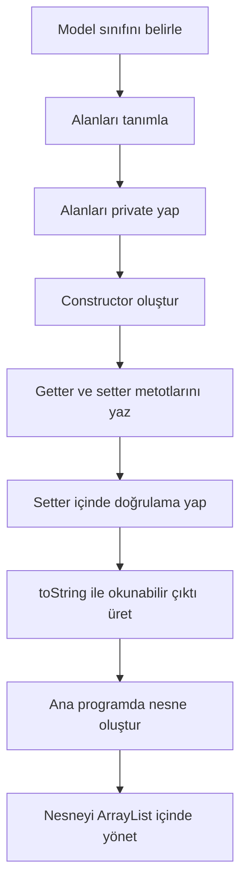

**Diyagram 17.1:** Model sınıfı oluşturma ve kullanma akışı.

**Görsel üretim notu:** Bu Mermaid diyagramı final DOCX/PDF üretiminden önce PNG’ye dönüştürülmeli; ham `flowchart TD` kodu final çıktıda görünmemelidir. Önerilen görsel genişliği 12–13 cm aralığında tutulmalıdır.

## 17.19 Adım adım kod örnekleri

Bu bölümde sınıf ve nesne kullanımından kapsüllemeye doğru ilerleyen örnekler verilecektir.

### Kod 17.1: Temel sınıf ve nesne örneği

**Kod kimliği:** `b17_kod01_temel_sinif_ve_nesne_ornegi`

**Kod erişimi:** [Kod sayfası](https://github.com/bmdersleri/javaninTemelleri/tree/main/kodlar/bolum17/kod01/) | [Kaynak kod](https://github.com/bmdersleri/javaninTemelleri/blob/main/kodlar/bolum17/kod01/Bolum17Ornek01TemelSinif.java) | 

**QR erişimi:** Kod sayfası ve kaynak kod için aşağıdaki iki QR kod kullanılabilir.

{width=2.8cm} {width=2.8cm}


```java
// Dosya: Bolum17Ornek01TemelSinif.java
public class Bolum17Ornek01TemelSinif {
    public static void main(String[] args) {
        OgrenciBasit ogrenci = new OgrenciBasit();

        ogrenci.no = "1001";
        ogrenci.ad = "Ayşe";
        ogrenci.soyad = "Yılmaz";
        ogrenci.not = 85;

        System.out.println(ogrenci.no + " - "
                + ogrenci.ad + " " + ogrenci.soyad);
        System.out.println("Not: " + ogrenci.not);
    }
}

class OgrenciBasit {
    String no;
    String ad;
    String soyad;
    int not;
}
```

**Kodun amacı:** Sınıf tanımlama, nesne oluşturma ve alanlara değer atama işlemlerini göstermek.

**Beklenen çıktı:**

```text
1001 - Ayşe Yılmaz
Not: 85
```

**Dikkat noktası:** Bu örnek başlangıç amaçlıdır. Alanlar `private` yapılmamıştır.

### Kod 17.2: Sınıf içinde metot kullanımı

**Kod kimliği:** `b17_kod02_sinif_icinde_metot_kullanimi`

**Kod erişimi:** [Kod sayfası](https://github.com/bmdersleri/javaninTemelleri/tree/main/kodlar/bolum17/kod02/) | [Kaynak kod](https://github.com/bmdersleri/javaninTemelleri/blob/main/kodlar/bolum17/kod02/Bolum17Ornek02SinifMetodu.java) | 

**QR erişimi:** Kod sayfası ve kaynak kod için aşağıdaki iki QR kod kullanılabilir.

{width=2.8cm} {width=2.8cm}


```java
// Dosya: Bolum17Ornek02SinifMetodu.java
public class Bolum17Ornek02SinifMetodu {
    public static void main(String[] args) {
        OgrenciMetotlu ogrenci = new OgrenciMetotlu();

        ogrenci.no = "1001";
        ogrenci.ad = "Ayşe";
        ogrenci.soyad = "Yılmaz";
        ogrenci.not = 85;

        ogrenci.bilgileriYazdir();

        if (ogrenci.gectiMi()) {
            System.out.println("Durum: Geçti");
        } else {
            System.out.println("Durum: Kaldı");
        }
    }
}

class OgrenciMetotlu {
    String no;
    String ad;
    String soyad;
    int not;

    void bilgileriYazdir() {
        System.out.println(no + " - " + ad + " " + soyad);
        System.out.println("Not: " + not);
    }

    boolean gectiMi() {
        return not >= 50;
    }
}
```

**Kodun amacı:** Nesne alanlarını kullanan sınıf metotlarını göstermek.

**Beklenen çıktı:**

```text
1001 - Ayşe Yılmaz
Not: 85
Durum: Geçti
```

**Dikkat noktası:** `gectiMi()` metodu öğrencinin kendi `not` alanını kullanır.

### Kod 17.3: `ArrayList` ile öğrenci nesneleri

**Kod kimliği:** `b17_kod03_ile_ogrenci_nesneleri`

**Kod erişimi:** [Kod sayfası](https://github.com/bmdersleri/javaninTemelleri/tree/main/kodlar/bolum17/kod03/) | [Kaynak kod](https://github.com/bmdersleri/javaninTemelleri/blob/main/kodlar/bolum17/kod03/Bolum17Ornek03NesneListesi.java) | 

**QR erişimi:** Kod sayfası ve kaynak kod için aşağıdaki iki QR kod kullanılabilir.

{width=2.8cm} {width=2.8cm}


```java
// Dosya: Bolum17Ornek03NesneListesi.java
import java.util.ArrayList;

public class Bolum17Ornek03NesneListesi {
    public static void main(String[] args) {
        ArrayList<OgrenciListe> ogrenciler = new ArrayList<>();

        OgrenciListe ogrenci1 = new OgrenciListe();
        ogrenci1.no = "1001";
        ogrenci1.ad = "Ayşe";
        ogrenci1.soyad = "Yılmaz";
        ogrenci1.not = 85;

        OgrenciListe ogrenci2 = new OgrenciListe();
        ogrenci2.no = "1002";
        ogrenci2.ad = "Mehmet";
        ogrenci2.soyad = "Demir";
        ogrenci2.not = 45;

        ogrenciler.add(ogrenci1);
        ogrenciler.add(ogrenci2);

        for (OgrenciListe ogrenci : ogrenciler) {
            ogrenci.bilgileriYazdir();
            System.out.println();
        }
    }
}

class OgrenciListe {
    String no;
    String ad;
    String soyad;
    int not;

    void bilgileriYazdir() {
        System.out.println(no + " - " + ad + " " + soyad);
        System.out.println("Not: " + not);
        System.out.println("Geçti mi?: " + (not >= 50));
    }
}
```

**Kodun amacı:** Kendi sınıfımızdan oluşturulan nesneleri `ArrayList` içinde saklamak.

**Beklenen çıktı:**

```text
1001 - Ayşe Yılmaz
Not: 85
Geçti mi?: true

1002 - Mehmet Demir
Not: 45
Geçti mi?: false
```

**Dikkat noktası:** Liste elemanlarının her biri `OgrenciListe` nesnesidir.

### Kod 17.4: Constructor ve `this`

**Kod kimliği:** `b17_kod04_constructor_ve`

**Kod erişimi:** [Kod sayfası](https://github.com/bmdersleri/javaninTemelleri/tree/main/kodlar/bolum17/kod04/) | [Kaynak kod](https://github.com/bmdersleri/javaninTemelleri/blob/main/kodlar/bolum17/kod04/Bolum17Ornek04ConstructorThis.java) | 

**QR erişimi:** Kod sayfası ve kaynak kod için aşağıdaki iki QR kod kullanılabilir.

{width=2.8cm} {width=2.8cm}


```java
// Dosya: Bolum17Ornek04ConstructorThis.java
public class Bolum17Ornek04ConstructorThis {
    public static void main(String[] args) {
        OgrenciConstructor ogrenci =
                new OgrenciConstructor("1001", "Ayşe", "Yılmaz", 85);

        ogrenci.bilgileriYazdir();
    }
}

class OgrenciConstructor {
    String no;
    String ad;
    String soyad;
    int not;

    OgrenciConstructor(String no, String ad, String soyad, int not) {
        this.no = no;
        this.ad = ad;
        this.soyad = soyad;
        this.not = not;
    }

    void bilgileriYazdir() {
        System.out.println(no + " - " + ad + " " + soyad);
        System.out.println("Not: " + not);
    }
}
```

**Kodun amacı:** Parametreli constructor ve `this` kullanımını göstermek.

**Beklenen çıktı:**

```text
1001 - Ayşe Yılmaz
Not: 85
```

**Dikkat noktası:** `this.no` sınıf alanını, `no` constructor parametresini ifade eder.

### Kod 17.5: Private alan, getter-setter ve doğrulama

**Kod kimliği:** `b17_kod05_private_alan_getter_setter_ve_dogrulama`

**Kod erişimi:** [Kod sayfası](https://github.com/bmdersleri/javaninTemelleri/tree/main/kodlar/bolum17/kod05/) | [Kaynak kod](https://github.com/bmdersleri/javaninTemelleri/blob/main/kodlar/bolum17/kod05/Bolum17Ornek05Kapsulleme.java) | 

**QR erişimi:** Kod sayfası ve kaynak kod için aşağıdaki iki QR kod kullanılabilir.

{width=2.8cm} {width=2.8cm}


```java
// Dosya: Bolum17Ornek05Kapsulleme.java
public class Bolum17Ornek05Kapsulleme {
    public static void main(String[] args) {
        OgrenciKapsul ogrenci =
                new OgrenciKapsul("1001", "Ayşe", "Yılmaz", 85);

        System.out.println(ogrenci.getAd() + " "
                + ogrenci.getSoyad());
        System.out.println("Not: " + ogrenci.getNot());

        ogrenci.setNot(120);

        System.out.println("Güncel not: " + ogrenci.getNot());
    }
}

class OgrenciKapsul {
    private String no;
    private String ad;
    private String soyad;
    private int not;

    OgrenciKapsul(String no, String ad, String soyad, int not) {
        this.no = no;
        this.ad = ad;
        this.soyad = soyad;
        setNot(not);
    }

    String getAd() {
        return ad;
    }

    String getSoyad() {
        return soyad;
    }

    int getNot() {
        return not;
    }

    void setNot(int not) {
        if (not >= 0 && not <= 100) {
            this.not = not;
        } else {
            this.not = 0;
        }
    }
}
```

**Kodun amacı:** Alanları `private` yaparak getter-setter üzerinden kontrollü erişim sağlamak.

**Beklenen çıktı:**

```text
Ayşe Yılmaz
Not: 85
Güncel not: 0
```

**Dikkat noktası:** `setNot(120)` geçersiz olduğu için not 0 yapılmıştır.

### Kod 17.6: `toString()` ile nesne yazdırma

**Kod kimliği:** `b17_kod06_ile_nesne_yazdirma`

**Kod erişimi:** [Kod sayfası](https://github.com/bmdersleri/javaninTemelleri/tree/main/kodlar/bolum17/kod06/) | [Kaynak kod](https://github.com/bmdersleri/javaninTemelleri/blob/main/kodlar/bolum17/kod06/Bolum17Ornek06ToString.java) | 

**QR erişimi:** Kod sayfası ve kaynak kod için aşağıdaki iki QR kod kullanılabilir.

{width=2.8cm} {width=2.8cm}


```java
// Dosya: Bolum17Ornek06ToString.java
import java.util.ArrayList;

public class Bolum17Ornek06ToString {
    public static void main(String[] args) {
        ArrayList<OgrenciYazdir> ogrenciler = new ArrayList<>();

        ogrenciler.add(new OgrenciYazdir("1001", "Ayşe", "Yılmaz", 85));
        ogrenciler.add(new OgrenciYazdir("1002", "Mehmet", "Demir", 45));

        for (OgrenciYazdir ogrenci : ogrenciler) {
            System.out.println(ogrenci);
        }
    }
}

class OgrenciYazdir {
    private String no;
    private String ad;
    private String soyad;
    private int not;

    OgrenciYazdir(String no, String ad, String soyad, int not) {
        this.no = no;
        this.ad = ad;
        this.soyad = soyad;
        setNot(not);
    }

    void setNot(int not) {
        if (not >= 0 && not <= 100) {
            this.not = not;
        } else {
            this.not = 0;
        }
    }

    public String toString() {
        String durum = not >= 50 ? "Geçti" : "Kaldı";
        return no + " - " + ad + " " + soyad
                + " - Not: " + not + " - " + durum;
    }
}
```

**Kodun amacı:** `toString()` metodu ile nesne bilgisini okunabilir biçimde yazdırmak.

**Beklenen çıktı:**

```text
1001 - Ayşe Yılmaz - Not: 85 - Geçti
1002 - Mehmet Demir - Not: 45 - Kaldı
```

**Dikkat noktası:** `System.out.println(ogrenci)` çağrıldığında `toString()` sonucu kullanılır.

### Kod 17.7: Hatalı ve düzeltilmiş `this` örneği

Hatalı örnek:

**Kod kimliği:** `b17_kod07_hatali_ve_duzeltilmis_ornegi`

**Kod erişimi:** [Kod sayfası](https://github.com/bmdersleri/javaninTemelleri/tree/main/kodlar/bolum17/kod07/) | [Kaynak kod](https://github.com/bmdersleri/javaninTemelleri/blob/main/kodlar/bolum17/kod07/Bolum17Ornek07ThisHatasi.java) | 

**QR erişimi:** Kod sayfası ve kaynak kod için aşağıdaki iki QR kod kullanılabilir.

{width=2.8cm} {width=2.8cm}


```java
// Dosya: Bolum17Ornek07ThisHatasi.java
public class Bolum17Ornek07ThisHatasi {
    public static void main(String[] args) {
        OgrenciThisHata ogrenci = new OgrenciThisHata("Ayşe");
        System.out.println(ogrenci.ad);
    }
}

class OgrenciThisHata {
    String ad;

    OgrenciThisHata(String ad) {
        ad = ad;
    }
}
```

Bu kodda constructor parametresi yine kendisine atanır. Sınıfın `ad` alanı beklenen biçimde güncellenmez.

Düzeltilmiş kod:

**Kod kimliği:** `b17_kod07_hatali_ve_duzeltilmis_ornegi_2`

**Kod erişimi:** [Kod sayfası](https://github.com/bmdersleri/javaninTemelleri/tree/main/kodlar/bolum17/kod07_2/) | [Kaynak kod](https://github.com/bmdersleri/javaninTemelleri/blob/main/kodlar/bolum17/kod07_2/Bolum17Ornek07ThisHatasi.java) | 

**QR erişimi:** Kod sayfası ve kaynak kod için aşağıdaki iki QR kod kullanılabilir.

{width=2.8cm} {width=2.8cm}


```java
// Dosya: Bolum17Ornek07ThisHatasi.java
public class Bolum17Ornek07ThisHatasi {
    public static void main(String[] args) {
        OgrenciThisDuzgun ogrenci = new OgrenciThisDuzgun("Ayşe");
        System.out.println(ogrenci.ad);
    }
}

class OgrenciThisDuzgun {
    String ad;

    OgrenciThisDuzgun(String ad) {
        this.ad = ad;
    }
}
```

**Beklenen çıktı:**

```text
Ayşe
```

**Dikkat noktası:** `this.ad`, sınıfın alanını ifade eder.

## 17.20 Kodun çalışma mantığı ve beklenen çıktı

Sınıf ve nesne kullanımında program akışını anlamak için nesne oluşturma, alanlara değer verme ve metot çağırma adımları izlenmelidir.

Örnek:

```java
Ogrenci ogrenci = new Ogrenci("1001", "Ayşe", 85);
```

Bu satırda şu işlemler gerçekleşir:

| Adım | İşlem | Açıklama |
|---:|---|---|
| 1 | `new Ogrenci(...)` | Yeni nesne oluşturulur |
| 2 | Constructor çalışır | Parametreler alınır |
| 3 | `this.no = no` | Alanlara başlangıç değeri verilir |
| 4 | `setNot(not)` | Not doğrulaması yapılır |
| 5 | Referans atanır | Nesneye `ogrenci` değişkeniyle erişilir |

`ArrayList<Ogrenci>` kullanımında ise her liste elemanı bir nesnedir.

| Liste indeksi | Nesne | Örnek bilgi |
|---:|---|---|
| 0 | `Ogrenci` nesnesi | Ayşe |
| 1 | `Ogrenci` nesnesi | Mehmet |
| 2 | `Ogrenci` nesnesi | Zeynep |

> **💡 İpucu:** Nesne listelerinde önce listenin eleman türünü düşünün. `ArrayList<Ogrenci>` listesindeki her eleman bir `Ogrenci` nesnesidir; bu nedenle eleman üzerinden öğrenciye ait metotlar çağrılabilir.

## 17.21 Uçtan uca mini uygulama: Öğrenci Kayıt Modeli

Bu bölümün mini uygulaması, sınıf, nesne, constructor, `this`, kapsülleme, getter-setter, `toString()` ve `ArrayList<Ogrenci>` kullanımını birleştirir.

**Uygulama adı:** Öğrenci Kayıt Modeli

**Dosya adı:** `OgrenciKayitModeli.java`

**Amaç:** Öğrencileri model sınıfıyla temsil etmek, kullanıcıdan alınan verilerle öğrenci nesneleri oluşturmak, not doğrulaması yapmak ve öğrenci listesini yazdırmak.

**Kod kimliği:** `b17_kod40_ogrenci_kayit_modeli`

**Kod erişimi:** [Kod sayfası](https://github.com/bmdersleri/javaninTemelleri/tree/main/kodlar/bolum17/kod40/) | [Kaynak kod](https://github.com/bmdersleri/javaninTemelleri/blob/main/kodlar/bolum17/kod40/OgrenciKayitModeli.java) | 

**QR erişimi:** Kod sayfası ve kaynak kod için aşağıdaki iki QR kod kullanılabilir.

{width=2.8cm} {width=2.8cm}


```java
// Dosya: OgrenciKayitModeli.java
import java.util.ArrayList;
import java.util.Scanner;

public class OgrenciKayitModeli {
    public static void main(String[] args) {
        Scanner scanner = new Scanner(System.in);
        ArrayList<Ogrenci> ogrenciler = new ArrayList<>();

        int secim;

        do {
            menuYazdir();

            System.out.print("Seçiminiz: ");
            secim = scanner.nextInt();
            scanner.nextLine();

            if (secim == 1) {
                System.out.print("Öğrenci no: ");
                String no = scanner.nextLine().trim();

                System.out.print("Ad: ");
                String ad = scanner.nextLine().trim();

                System.out.print("Soyad: ");
                String soyad = scanner.nextLine().trim();

                System.out.print("Not: ");
                int not = scanner.nextInt();
                scanner.nextLine();

                Ogrenci ogrenci = new Ogrenci(no, ad, soyad, not);
                ogrenciler.add(ogrenci);

                System.out.println("Öğrenci eklendi.");
            } else if (secim == 2) {
                System.out.println("=== Öğrenci Listesi ===");

                for (Ogrenci ogrenci : ogrenciler) {
                    System.out.println(ogrenci);
                }
            } else if (secim == 3) {
                double ortalama = ortalamaHesapla(ogrenciler);
                System.out.println("Sınıf ortalaması: " + ortalama);
            } else if (secim == 0) {
                System.out.println("Program sonlandırılıyor.");
            } else {
                System.out.println("Geçersiz seçim.");
            }

            System.out.println();
        } while (secim != 0);

        scanner.close();
    }

    static void menuYazdir() {
        System.out.println("=== Öğrenci Kayıt Modeli ===");
        System.out.println("1. Öğrenci ekle");
        System.out.println("2. Öğrencileri listele");
        System.out.println("3. Sınıf ortalamasını hesapla");
        System.out.println("0. Çıkış");
    }

    static double ortalamaHesapla(ArrayList<Ogrenci> ogrenciler) {
        if (ogrenciler.size() == 0) {
            return 0;
        }

        int toplam = 0;

        for (Ogrenci ogrenci : ogrenciler) {
            toplam += ogrenci.getNot();
        }

        return toplam / (double) ogrenciler.size();
    }
}

class Ogrenci {
    private String no;
    private String ad;
    private String soyad;
    private int not;

    public Ogrenci(String no, String ad, String soyad, int not) {
        this.no = no;
        this.ad = ad;
        this.soyad = soyad;
        setNot(not);
    }

    public String getNo() {
        return no;
    }

    public String getAd() {
        return ad;
    }

    public String getSoyad() {
        return soyad;
    }

    public int getNot() {
        return not;
    }

    public void setNot(int not) {
        if (not >= 0 && not <= 100) {
            this.not = not;
        } else {
            this.not = 0;
        }
    }

    public boolean gectiMi() {
        return not >= 50;
    }

    public String toString() {
        String durum = gectiMi() ? "Geçti" : "Kaldı";

        return no + " - " + ad + " " + soyad
                + " - Not: " + not
                + " - Durum: " + durum;
    }
}
```

### 17.21.1 Mini uygulamanın özellikleri

Bu uygulama şu özellikleri içerir:

1. Öğrenci bilgilerini `Ogrenci` sınıfıyla temsil eder.
2. `Ogrenci` sınıfında alanlar `private` tanımlanır.
3. Constructor ile nesneye başlangıç değerleri verilir.
4. `this` ile alan-parametre ayrımı yapılır.
5. `setNot()` içinde not doğrulaması yapılır.
6. `getNot()` sınıf ortalaması hesabında kullanılır.
7. `gectiMi()` öğrencinin durumunu hesaplar.
8. `toString()` listeleme çıktısını düzenler.
9. `ArrayList<Ogrenci>` öğrenci nesnelerini saklar.

### 17.21.2 Örnek kullanım akışı

```text
=== Öğrenci Kayıt Modeli ===
1. Öğrenci ekle
2. Öğrencileri listele
3. Sınıf ortalamasını hesapla
0. Çıkış
Seçiminiz: 1
Öğrenci no: 1001
Ad: Ayşe
Soyad: Yılmaz
Not: 85
Öğrenci eklendi.
```

Listeleme çıktısı:

```text
1001 - Ayşe Yılmaz - Not: 85 - Durum: Geçti
```

### 17.21.3 Mini uygulama test senaryoları

| Test | Girdi / İşlem | Beklenen sonuç |
|---:|---|---|
| 1 | Not `85` | Öğrenci geçti |
| 2 | Not `45` | Öğrenci kaldı |
| 3 | Not `120` | Not 0 yapılır |
| 4 | Not `-10` | Not 0 yapılır |
| 5 | İki öğrenci eklenir | Liste iki nesne içerir |
| 6 | Ortalama hesaplanır | `getNot()` değerleri kullanılır |
| 7 | Öğrenci listelenir | `toString()` çıktısı görünür |
| 8 | Liste boşken ortalama | 0 döner |

> **Alıştırma Molası:** `Ogrenci` sınıfına `harfNotu()` adlı bir metot ekleyiniz. Not 85 ve üzeriyse `"AA"`, 70–84 arasıysa `"BB"`, 50–69 arasıysa `"CC"`, 50 altıysa `"FF"` döndürsün.

## 17.22 Sık yapılan hatalar ve yanlış sezgiler

### 17.22.1 Sınıf ile nesneyi karıştırmak

Yanlış düşünce:

```text
Ogrenci sınıfını yazdığım anda bir öğrenci oluşturmuş olurum.
```

Düzeltme:

Sınıf bir şablondur. Nesne oluşturmak için `new` kullanılmalıdır.

```java
Ogrenci ogrenci = new Ogrenci();
```

### 17.22.2 Constructor’a dönüş tipi yazmak

Yanlış kullanım:

```java
void Ogrenci() {
}
```

Düzeltme:

```java
Ogrenci() {
}
```

Constructor dönüş tipi yazmaz.

### 17.22.3 `this` kullanmamak

Yanlış kullanım:

```java
Ogrenci(String ad) {
    ad = ad;
}
```

Düzeltme:

```java
Ogrenci(String ad) {
    this.ad = ad;
}
```

### 17.22.4 Alanları gereksiz yere public bırakmak

Yanlış yaklaşım:

```java
public int not;
```

Bu durumda dışarıdan geçersiz değer atanabilir.

Daha güvenli yaklaşım:

```java
private int not;
```

ve setter ile doğrulama:

```java
public void setNot(int not) {
    if (not >= 0 && not <= 100) {
        this.not = not;
    }
}
```

### 17.22.5 Setter içinde doğrulama yapmamak

Sadece değer atayan setter bazı durumlarda yetersizdir.

```java
public void setNot(int not) {
    this.not = not;
}
```

Daha güvenli kullanım:

```java
public void setNot(int not) {
    if (not >= 0 && not <= 100) {
        this.not = not;
    } else {
        this.not = 0;
    }
}
```

### 17.22.6 `toString()` yazmadan nesneyi doğrudan yazdırmak

`toString()` yazılmadığında nesne doğrudan anlamlı görünmeyebilir. Öğrenciye okunabilir çıktı vermek için `toString()` yazmak yararlıdır.

> **💡 İpucu:** Nesne çıktısı anlamsız görünüyorsa sınıfta `toString()` metodunun yazılıp yazılmadığını kontrol edin.

## 17.23 Hata ayıklama egzersizi

Aşağıdaki kodun `OgrenciHatasi.java` adlı dosyaya kaydedildiğini düşünelim.

**Kod kimliği:** `b17_kod51_hata_ayiklama_egzersizi`

**Kod erişimi:** [Kod sayfası](https://github.com/bmdersleri/javaninTemelleri/tree/main/kodlar/bolum17/kod51/) | [Kaynak kod](https://github.com/bmdersleri/javaninTemelleri/blob/main/kodlar/bolum17/kod51/OgrenciHatasi.java) | 

**QR erişimi:** Kod sayfası ve kaynak kod için aşağıdaki iki QR kod kullanılabilir.

{width=2.8cm} {width=2.8cm}


```java
// Dosya: OgrenciHatasi.java
public class OgrenciHatasi {
    public static void main(String[] args) {
        Ogrenci ogrenci = new Ogrenci("Ayşe", 85);

        System.out.println(ogrenci.ad);
        System.out.println(ogrenci.not);
    }
}

class Ogrenci {
    private String ad;
    private int not;

    void Ogrenci(String ad, int not) {
        ad = ad;
        not = not;
    }
}
```

Bu kodda birkaç temel hata vardır:

1. `void Ogrenci(...)` constructor değildir; dönüş tipi yazıldığı için normal metottur.
2. `ad = ad` ve `not = not` atamaları alanları güncellemez.
3. `ad` ve `not` alanları `private` olduğu için sınıf dışından doğrudan erişilemez.
4. Getter metotları yazılmamıştır.

Düzeltilmiş kod:

**Kod kimliği:** `b17_kod52_hata_ayiklama_egzersizi`

**Kod erişimi:** [Kod sayfası](https://github.com/bmdersleri/javaninTemelleri/tree/main/kodlar/bolum17/kod52/) | [Kaynak kod](https://github.com/bmdersleri/javaninTemelleri/blob/main/kodlar/bolum17/kod52/OgrenciHatasi.java) | 

**QR erişimi:** Kod sayfası ve kaynak kod için aşağıdaki iki QR kod kullanılabilir.

{width=2.8cm} {width=2.8cm}


```java
// Dosya: OgrenciHatasi.java
public class OgrenciHatasi {
    public static void main(String[] args) {
        Ogrenci ogrenci = new Ogrenci("Ayşe", 85);

        System.out.println(ogrenci.getAd());
        System.out.println(ogrenci.getNot());
    }
}

class Ogrenci {
    private String ad;
    private int not;

    Ogrenci(String ad, int not) {
        this.ad = ad;
        setNot(not);
    }

    String getAd() {
        return ad;
    }

    int getNot() {
        return not;
    }

    void setNot(int not) {
        if (not >= 0 && not <= 100) {
            this.not = not;
        } else {
            this.not = 0;
        }
    }
}
```

**Beklenen çıktı:**

```text
Ayşe
85
```

**Kendinize sorunuz:**

1. Constructor neden dönüş tipi içermez?
2. `this.ad = ad` ifadesinde hangi taraf alan, hangi taraf parametredir?
3. `private` alanlara neden doğrudan erişilemez?
4. Getter metotları hangi amaçla kullanılır?
5. Setter içinde doğrulama neden önemlidir?

## 17.24 Ek hata ayıklama egzersizi: Referans yanılgısı

Aşağıdaki kodu inceleyiniz.

**Kod kimliği:** `b17_kod53_referans_yanilgisi`

**Kod erişimi:** [Kod sayfası](https://github.com/bmdersleri/javaninTemelleri/tree/main/kodlar/bolum17/kod53/) | [Kaynak kod](https://github.com/bmdersleri/javaninTemelleri/blob/main/kodlar/bolum17/kod53/ReferansYanilgisi.java) | 

**QR erişimi:** Kod sayfası ve kaynak kod için aşağıdaki iki QR kod kullanılabilir.

{width=2.8cm} {width=2.8cm}


```java
// Dosya: ReferansYanilgisi.java
public class ReferansYanilgisi {
    public static void main(String[] args) {
        OgrenciRef ogrenci1 = new OgrenciRef("Ayşe");
        OgrenciRef ogrenci2 = ogrenci1;

        ogrenci2.setAd("Zeynep");

        System.out.println(ogrenci1.getAd());
    }
}

class OgrenciRef {
    private String ad;

    OgrenciRef(String ad) {
        this.ad = ad;
    }

    String getAd() {
        return ad;
    }

    void setAd(String ad) {
        this.ad = ad;
    }
}
```

**Beklenen çıktı:**

```text
Zeynep
```

Açıklama: `ogrenci2 = ogrenci1` satırı yeni bir nesne oluşturmaz. İki değişken aynı nesneye erişir.

> **Laboratuvar İpucu:** Nesne değişkenlerini kopyalarken gerçekten yeni nesne mi oluşturduğunuzu, yoksa aynı nesneye ikinci bir referans mı verdiğinizi kontrol edin.

## 17.25 Bölümün sonraki bölümlerle ilişkisi

Bu bölümde sınıf, nesne, constructor, `this` ve kapsülleme konuları temel düzeyde ele alındı. Artık öğrenci bir varlığı model sınıfı olarak temsil edebilir, nesne oluşturabilir, nesneleri `ArrayList` içinde saklayabilir ve alanlara kontrollü erişim sağlayabilir.

Bir sonraki bölümde kalıtım ve interface’e kısa bir ön bakış yapılacaktır. Bu konu, nesne yönelimli programlamanın ileri ayrıntılarına girmek için değil; özellikle GUI olay yönetiminde karşılaşılacak `implements ActionListener` gibi yapıları anlamaya hazırlık için işlenecektir.

Bu nedenle bu bölümde öğrenilen sınıf ve nesne bilgisi, sonraki bölümdeki kalıtım ve interface kavramlarının temelini oluşturur.

## 17.26 Bölüm özeti

Bu bölümde Java’da sınıf, nesne, constructor ve kapsülleme konuları uygulama odaklı olarak ele alındı. Öncelikle sınıfın bir şablon, nesnenin ise bu şablondan oluşturulan somut örnek olduğu açıklandı. `Ogrenci` sınıfı üzerinden alanlar, nesne oluşturma ve alanlara erişim örnekleri gösterildi.

Sınıf içinde metot tanımlamanın, nesneye ait işlemleri veriye yakın tutmayı sağladığı belirtildi. `bilgileriYazdir()` ve `gectiMi()` gibi metotlarla nesnenin kendi alanlarını kullanarak işlem yapabileceği gösterildi.

Referans kavramına başlangıç düzeyinde değinildi. Bir nesne değişkeninin başka bir nesne değişkenine atanmasının yeni nesne oluşturmak anlamına gelmeyebileceği açıklandı. `ArrayList<Ogrenci>` kullanımıyla nesnelerin koleksiyonlar içinde saklanabileceği gösterildi.

Constructor kavramı, nesne oluşturulurken çalışan özel yapı olarak ele alındı. Default constructor ve parametreli constructor arasındaki fark açıklandı. Constructor içinde `this` anahtar kelimesinin alan ve parametre adları arasındaki karışıklığı gidermek için kullanıldığı gösterildi.

Bölümün ikinci kısmında basit kapsülleme işlendi. Alanların `private` yapılması, getter ve setter metotlarıyla kontrollü erişim sağlanması ve setter içinde doğrulama yapılması örneklerle açıklandı. `toString()` metodu ile nesnelerin okunabilir biçimde yazdırılması gösterildi.

Son olarak Öğrenci Kayıt Modeli mini uygulamasıyla sınıf, nesne, constructor, `this`, getter-setter, `toString()` ve `ArrayList<Ogrenci>` yapıları tek bir programda birleştirildi.

## 17.27 Terim sözlüğü

| Terim | Açıklama |
|---|---|
| Sınıf | Nesneler için şablon görevi gören yapı |
| Nesne | Sınıftan oluşturulan somut örnek |
| Alan | Nesnenin verisini tutan değişken |
| Metot | Nesneye veya sınıfa ait işlem |
| `new` | Yeni nesne oluşturmak için kullanılan anahtar kelime |
| Referans | Nesneye erişmeyi sağlayan değişken |
| Model sınıfı | Uygulamadaki bir varlığı temsil eden sınıf |
| Constructor | Nesne oluşturulurken çalışan özel yapı |
| Default constructor | Parametre almayan constructor |
| Parametreli constructor | Nesne oluştururken dışarıdan değer alan constructor |
| `this` | Mevcut nesneyi temsil eden anahtar kelime |
| `private` | Alanlara doğrudan dış erişimi engelleyen erişim belirleyici |
| Kapsülleme | Veriye erişimi kontrollü hâle getirme yaklaşımı |
| Getter | Alan değerini döndüren metot |
| Setter | Alan değerini değiştiren metot |
| Doğrulama | Girilen değerin kabul edilebilir olup olmadığını kontrol etme |
| `toString()` | Nesnenin metinsel temsilini döndüren metot |
| Nesne listesi | Nesneleri koleksiyon içinde saklayan yapı |

## 17.28 Kendini değerlendirme soruları

### 17.28.1 Çoktan seçmeli sorular

1. Nesneler için şablon görevi gören yapı hangisidir?

A) Sınıf  
B) Döngü  
C) Operatör  
D) Paket  
E) Yorum satırı  

2. Bir sınıftan nesne oluşturmak için hangi anahtar kelime kullanılır?

A) `new`  
B) `return`  
C) `break`  
D) `case`  
E) `import`  

3. Constructor için aşağıdakilerden hangisi doğrudur?

A) Sınıf adıyla aynı ada sahiptir ve dönüş tipi yazılmaz  
B) Her zaman `void` dönüş tipine sahiptir  
C) Yalnızca döngülerde kullanılır  
D) Sadece `String` değer döndürür  
E) `import` satırından önce yazılır  

4. `this` anahtar kelimesi en çok hangi durumda kullanılır?

A) Alan ve parametre adlarını ayırt etmek için  
B) Dosya silmek için  
C) Paket oluşturmak için  
D) Dizi uzunluğunu bulmak için  
E) Rastgele sayı üretmek için  

5. Alanlara doğrudan erişimi sınırlandırmak için hangi erişim belirleyici kullanılır?

A) `private`  
B) `while`  
C) `switch`  
D) `new`  
E) `void`  

6. Alan değerini okumak için kullanılan metotlara genel olarak ne ad verilir?

A) Getter  
B) Constructor  
C) Paket  
D) Derleyici  
E) Döngü  

7. Alan değerini kontrollü değiştirmek için kullanılan metotlara ne ad verilir?

A) Setter  
B) Getter  
C) Import  
D) Classpath  
E) Literal  

8. Nesnenin okunabilir metinsel temsilini döndürmek için hangi metot kullanılabilir?

A) `toString()`  
B) `nextInt()`  
C) `parse()`  
D) `length()`  
E) `sqrt()`  

### 17.28.2 Doğru/Yanlış soruları

1. Sınıf bir şablondur. (D/Y)
2. Nesne, sınıftan oluşturulan somut örnektir. (D/Y)
3. Constructor dönüş tipi olarak mutlaka `void` yazar. (D/Y)
4. `this.ad = ad` ifadesinde `this.ad` sınıf alanını temsil eder. (D/Y)
5. `private` alanlara sınıf dışından doğrudan erişilebilir. (D/Y)
6. Getter metotları alan değerlerini okumak için kullanılabilir. (D/Y)
7. Setter metotları içinde doğrulama yapılabilir. (D/Y)
8. `ArrayList<Ogrenci>` öğrenci nesnelerini saklayabilir. (D/Y)
9. `toString()` nesnenin okunabilir yazdırılmasını kolaylaştırabilir. (D/Y)
10. Kapsülleme yalnızca alanları `public` yapmak anlamına gelir. (D/Y)

### 17.28.3 Açık uçlu kavramsal sorular

1. Sınıf ve nesne arasındaki farkı açıklayınız.
2. `new` anahtar kelimesi ne işe yarar?
3. Alan ve metot kavramlarını örnekle açıklayınız.
4. Model sınıfı nedir?
5. `ArrayList<Ogrenci>` kullanmanın yararı nedir?
6. Constructor neden kullanılır?
7. Default constructor ile parametreli constructor arasındaki fark nedir?
8. `this` anahtar kelimesi hangi problemi çözer?
9. `private` alanlar neden tercih edilir?
10. Getter ve setter metotları ne işe yarar?
11. Setter içinde doğrulama yapmanın önemi nedir?
12. `toString()` metodu hangi durumda yararlıdır?

### 17.28.4 Yanlış gerekçeyi bulma soruları

Aşağıdaki ifadelerdeki yanlış gerekçeyi bulunuz ve düzeltiniz.

1. “Sınıf yazıldığında otomatik olarak nesne oluşur.”
2. “Constructor yazarken dönüş tipi olarak `void` kullanılmalıdır.”
3. “Alan ve parametre adları aynıysa `this` gereksizdir.”
4. “Tüm alanları `public` yapmak kapsülleme sağlar.”
5. “Setter metotları yalnızca değer atar, doğrulama yapamaz.”
6. “Getter metodu alan değerini değiştirmek için kullanılır.”
7. “`ArrayList<Ogrenci>` yalnızca metin saklayabilir.”
8. “Nesne değişkenini başka değişkene atamak her zaman bağımsız kopya oluşturur.”
9. “`toString()` yazmak hiçbir zaman gerekli değildir.”
10. “Model sınıfları yalnızca GUI uygulamalarında kullanılır.”

## 17.29 Programlama alıştırmaları

### 17.29.1 Kolay düzey

1. `Kitap.java` adlı programda kitap adı, yazar ve sayfa sayısı alanlarına sahip basit bir sınıf oluşturunuz.
2. `OgrenciBasit.java` programında `Ogrenci` sınıfından bir nesne oluşturup alanlarına değer atayınız.
3. `Urun.java` programında ürün adı ve fiyat alanlarını yazdıran bir metot oluşturunuz.
4. `Ders.java` sınıfında ders adı ve kredi bilgisini temsil ediniz.
5. Bir nesnenin alanlarını ekrana yazdıran `bilgileriYazdir()` metodu yazınız.

### 17.29.2 Orta düzey

1. `OgrenciConstructor.java` programında parametreli constructor kullanarak öğrenci nesnesi oluşturunuz.
2. `this` kullanılmayan hatalı bir constructor yazıp hatayı düzeltiniz.
3. `OgrenciKapsul.java` programında alanları `private` yapıp getter-setter metotları yazınız.
4. `setNot()` içinde 0–100 aralığı doğrulaması yapınız.
5. `toString()` metodu yazarak öğrenci bilgisini tek satırda yazdırınız.
6. `ArrayList<Ogrenci>` kullanarak üç öğrenci nesnesini listeleyiniz.

### 17.29.3 Zor düzey

1. `OgrenciKayitModeli.java` uygulamasını geliştiriniz.
2. `Ogrenci` sınıfında `no`, `ad`, `soyad` ve `not` alanlarını `private` tanımlayınız.
3. Parametreli constructor yazınız.
4. `this` anahtar kelimesini doğru biçimde kullanınız.
5. Getter ve setter metotlarını yazınız.
6. `setNot()` içinde doğrulama yapınız.
7. `gectiMi()` metodu ekleyiniz.
8. `toString()` metodu yazınız.
9. `ArrayList<Ogrenci>` ile öğrenci listesi oluşturunuz.
10. Sınıf ortalamasını hesaplayan metot yazınız.
11. En az sekiz test senaryosu çalıştırınız.
12. Constructor, `this` veya `private` erişim hatası içeren bir örnek oluşturup düzeltiniz.

## 17.30 Haftalık laboratuvar / proje görevi

**Görev başlığı:** Öğrenci Kayıt Modeli Laboratuvarı

**Amaç:** Bu laboratuvarın amacı, öğrencinin sınıf, nesne, constructor, `this`, kapsülleme, getter-setter, `toString()` ve `ArrayList<Ogrenci>` yapılarını tek bir küçük Java uygulamasında birleştirmesidir.

**Beklenen adımlar:**

1. `OgrenciKayitModeli.java` adlı dosyayı oluşturunuz.
2. Aynı dosyada `Ogrenci` adlı ikinci bir sınıf tanımlayınız.
3. Dosyada yalnızca ana sınıfı `public` yapınız.
4. `Ogrenci` sınıfında `no`, `ad`, `soyad` ve `not` alanlarını oluşturunuz.
5. Alanları `private` yapınız.
6. Parametreli constructor yazınız.
7. Constructor içinde `this` kullanınız.
8. Not değerini `setNot()` üzerinden atayınız.
9. Getter metotlarını yazınız.
10. `setNot()` içinde 0–100 aralığı doğrulaması yapınız.
11. `gectiMi()` metodu yazınız.
12. `toString()` metodu yazınız.
13. Ana programda `ArrayList<Ogrenci>` oluşturunuz.
14. Menü ile öğrenci ekleme, listeleme ve ortalama hesaplama işlemleri yapınız.
15. En az sekiz test senaryosu çalıştırınız.
16. Hatalı ve düzeltilmiş constructor/`this` örneği içeren kısa bir not hazırlayınız.
17. Kısa bir `README.md` dosyası hazırlayınız.

**Teslim edilecek dosyalar:**

1. `OgrenciKayitModeli.java`
2. `README.md`
3. En az sekiz test çıktısı
4. Hata ve çözüm notu

**README içeriği şu başlıkları içermelidir:**

1. Programın amacı
2. `Ogrenci` sınıfının alanları
3. Constructor açıklaması
4. Getter-setter kullanımı
5. Not doğrulama mantığı
6. `ArrayList<Ogrenci>` kullanımı
7. Test senaryoları
8. Karşılaşılan hata ve çözümü

## 17.31 Değerlendirme rubriği

| Ölçüt | Açıklama | Puan |
|---|---|---:|
| Sınıf ve nesne kullanımı | Model sınıfı oluşturma, nesne üretme ve nesne listesi kullanma | 20 |
| Constructor ve `this` kullanımı | Parametreli constructor ve alan-parametre ayrımının doğru yapılması | 20 |
| Kapsülleme | `private` alan, getter-setter ve doğrulama kullanımı | 25 |
| Uygulama işlevleri | Öğrenci ekleme, listeleme, geçme durumu ve ortalama hesaplama | 15 |
| Kodun çalışması | Programın derlenebilir ve çalıştırılabilir olması | 10 |
| Kod okunabilirliği | Anlamlı sınıf/metot adları, girinti ve sade yapı | 5 |
| Raporlama | README, test çıktıları ve hata notunun yeterliliği | 5 |
| **Toplam** |  | **100** |

## 17.32 İleri okuma ve kaynaklar

Bu bölümde sınıf, nesne, constructor ve kapsülleme başlangıç düzeyinde ele alınmıştır. Daha ayrıntılı çalışma için aşağıdaki kaynak türleri incelenebilir:

1. **Java SE API dokümantasyonu:** Java sınıflarının ve temel nesne davranışlarının resmî açıklamalarını incelemek için kullanılabilir.
2. **Dev.java öğrenme kaynakları:** Nesne yönelimli programlamaya giriş, sınıf ve nesne kullanımı için güncel öğrenme içerikleri sunar.
3. **Oracle Java Tutorials:** Classes and Objects, constructors, fields and methods konularında örnek odaklı açıklamalar içerir.
4. **Ders içi ek notlar:** Constructor, `this`, getter-setter ve `toString()` örneklerini pekiştirmek için kullanılabilir.

> **💡 İpucu:** İleri kaynaklarda kalıtım, polymorphism, abstract class, interface, record ve design patterns gibi konularla karşılaşabilirsiniz. Bu bölümde yalnızca küçük uygulama geliştirme için gerekli temel OOP becerileri hedeflenmiştir.

## 17.33 Bir sonraki bölüme köprü

Bu bölümde sınıf, nesne, constructor ve kapsülleme konuları temel düzeyde ele alındı. Bir sonraki bölümde kalıtım ve interface’e kısa bir ön bakış yapılacaktır. Bu geçiş, özellikle Swing GUI bölümlerinde karşılaşılacak `implements ActionListener` gibi yapıları anlamayı kolaylaştıracaktır.

**BÖLÜM SONU**


\newpage


# Bölüm 18: Kalıtım ve Interface’e Kısa Ön Bakış

## 18.1 Bölümün yol haritası

Önceki bölümde sınıf, nesne, constructor, `this`, `private`, getter, setter, `toString` ve basit kapsülleme kavramları uygulama geliştirmeye yetecek düzeyde ele alındı. Bu bölümde ise nesne kullanımının iki önemli kavramına kısa bir ön bakış yapılacaktır: kalıtım ve interface.

Bu bölüm, ayrıntılı bir nesne yönelimli programlama bölümü değildir. Amaç, öğrencinin ilerleyen GUI bölümlerinde karşılaşacağı `extends`, `implements`, listener ve `ActionListener` gibi kavramlara yabancı kalmamasını sağlamaktır. Bu nedenle kalıtım, polymorphism veya interface tasarımı bu bölümde ileri düzey OOP konusu olarak değil, Swing olay yönetimine geçişi kolaylaştıran kısa bir hazırlık olarak ele alınacaktır. Özellikle Swing programlamasında olay yönetimi yapılırken bir sınıfın bir interface'i uygulaması ve belirli metotları yazması gerekir. Bu nedenle bu bölüm, GUI programlamaya geçmeden önce kısa ama gerekli bir hazırlık adımıdır.

Bu bölümde şu sorulara yanıt aranacaktır:

1. Kalıtım nedir ve hangi problemi çözer?
2. `extends` anahtar kelimesi ne işe yarar?
3. Superclass ve subclass kavramları nasıl anlaşılmalıdır?
4. Interface nedir ve neyi tanımlar?
5. `implements` anahtar kelimesi ne için kullanılır?
6. Method contract ne anlama gelir?
7. Listener kavramı GUI olay yönetimine nasıl hazırlık sağlar?
8. `ActionListener` kavramı neden önemlidir?
9. Kalıtım ve interface ne zaman karıştırılır?
10. Yazdırılabilir Nesneler uygulaması nasıl geliştirilebilir?

> **🎯 Bölüm Hedefi:** Bu bölümün sonunda öğrenci, `extends` ve `implements` anahtar kelimelerinin temel görevini açıklayabilecek, superclass-subclass ilişkisini sade örneklerle yorumlayabilecek, interface'in metot sözleşmesi oluşturduğunu anlayabilecek ve Swing olay yönetiminde karşılaşacağı listener kavramına hazır hâle gelecektir.

Bu bölümde polymorphism ayrıntısı, abstract class, SOLID ilkeleri ve design patterns konularına girilmeyecektir. Bu kavramlar yalnızca ileri okuma düzeyinde anılacaktır.

## 18.2 Bölümün konumu ve pedagojik rolü

Bu bölüm, temel nesne kullanımından GUI programlamaya geçiş için köprü görevi görür. Bölüm 17'te öğrenciler constructor ve kapsülleme ile daha düzenli model sınıfları yazmayı öğrendi. Ancak GUI programlamada yalnızca model sınıfları yeterli değildir. Bir butona tıklandığında çalışacak kodu yazmak için olay dinleme mekanizmasını anlamak gerekir.

Swing tarafında sık karşılaşılan yapılardan biri `ActionListener` kavramıdır. Bir sınıf `ActionListener` interface'ini uyguladığında, belirli bir metodu yazmayı kabul etmiş olur. Bu fikir, interface ve method contract kavramlarıyla ilişkilidir. Bu bölümde GUI koduna derin girilmeden, bu mantığın temeli basit konsol örnekleriyle kurulacaktır.

Kalıtım tarafında ise bir sınıfın başka bir sınıftan bazı özellikleri devralabileceği gösterilecektir. Örneğin `Rapor` ve `Fatura` gibi sınıflar ortak bir `Belge` sınıfından türeyebilir. Böylece ortak alan ve metotlar tek bir üst sınıfta toplanabilir.

> **⚠️ Dikkat:** Kalıtım ve interface güçlü kavramlardır; ancak her problemi bu yapılarla çözmek gerekmez. Bu bölümde yalnızca GUI ve küçük uygulama geliştirmeye hazırlık düzeyinde kullanılacaktır.

## 18.3 Öğrenme çıktıları

Bu bölüm tamamlandığında öğrenci:

1. Kalıtım kavramını kendi cümleleriyle açıklayabilir.
2. `extends` anahtar kelimesinin temel kullanımını gösterebilir.
3. Superclass ve subclass kavramlarını örnekle ayırt edebilir.
4. Interface kavramını temel düzeyde açıklayabilir.
5. `implements` anahtar kelimesini çalışan küçük örnekte kullanabilir.
6. Method contract fikrini basit bir interface üzerinden yorumlayabilir.
7. Listener kavramını olay bekleyen yapı olarak açıklayabilir.
8. `ActionListener` kavramına neden ihtiyaç duyulacağını söyleyebilir.
9. Kalıtım ve interface kullanımındaki yaygın başlangıç hatalarını tanıyabilir.
10. Yazdırılabilir Nesneler mini uygulamasını geliştirebilir.

## 18.4 Ön bilgi ve başlangıç varsayımları

Bu bölüm, öğrencinin aşağıdaki konuları temel düzeyde bildiğini varsayar:

1. Java programının temel yapısı
2. Sınıf ve nesne kavramı
3. Constructor kullanımı
4. Getter, setter ve `toString`
5. Metotlar
6. `ArrayList` ve temel koleksiyon kullanımı
7. Basit hata yönetimi
8. Dosya/kayıt mantığına giriş
9. Konsol tabanlı uygulama akışı

Bu bölüm, nesne yönelimli programlama ayrıntılarına girmez. Amaç, öğrencinin ilerleyen GUI bölümlerindeki olay yönetimi kodlarını okuyabilecek hazırlık düzeyine ulaşmasıdır.

## 18.5 Ana kavramlar

| Kavram | Kısa açıklama | Bu bölümdeki rolü |
|---|---|---|
| `extends` | Bir sınıfın başka sınıftan türemesini sağlar | Kalıtım ilişkisi kurar |
| Superclass | Üst sınıf | Ortak özellikleri tutar |
| Subclass | Alt sınıf | Üst sınıftan özellik devralır |
| Kalıtım | Bir sınıfın başka sınıftan özellik alması | Kod tekrarını azaltır |
| Interface | Uygulanması gereken metotları tanımlar | Sözleşme oluşturur |
| `implements` | Bir interface'in uygulanmasını sağlar | Metot yazma zorunluluğu |
| Method contract | Yazılması beklenen metot sözleşmesi | Interface mantığı |
| Listener | Olayları dinleyen yapı | GUI olaylarına hazırlık |
| `ActionListener` | Swing'de eylem olaylarını dinleyen interface | Buton tıklama hazırlığı |
| Ortak davranış | Birden fazla sınıfta benzer işlem | Üst sınıf veya interface |

> **🎯 Sınav Notu:** `extends` sınıflar arası kalıtım ilişkisi kurar. `implements` ise bir sınıfın bir interface'teki metotları uygulayacağını belirtir.

## 18.6 Kalıtım kavramı

Kalıtım, bir sınıfın başka bir sınıftaki bazı alan ve metotları devralabilmesini sağlar. Bu ilişki “üst sınıf” ve “alt sınıf” biçiminde düşünülebilir. Java'da bu ilişki `extends` anahtar kelimesiyle kurulur.

Örneğin bir uygulamada farklı belge türleri olsun:

1. Rapor
2. Fatura
3. Dilekçe

Bu belgelerin hepsinin ortak bir başlığı olabilir. Bu ortak alanı her sınıfta tekrar yazmak yerine `Belge` adlı bir üst sınıfta toplayabiliriz.


```java
class Belge {
    private String baslik;

    public Belge(String baslik) {
        this.baslik = baslik;
    }

    public String getBaslik() {
        return baslik;
    }
}
```

`Rapor` sınıfı bu sınıftan türeyebilir:


```java
class Rapor extends Belge {
    public Rapor(String baslik) {
        super(baslik);
    }
}
```

Bu örnekte `Rapor`, `Belge` sınıfından türemiştir.

### 18.6.1 Superclass ve subclass

Kalıtım ilişkisinde üst sınıfa superclass, alt sınıfa subclass denir.

| Kavram | Örnek | Açıklama |
|---|---|---|
| Superclass | `Belge` | Ortak özellikleri tutar |
| Subclass | `Rapor` | Belge sınıfından türeyen sınıf |

Subclass, superclass içindeki uygun alan ve metotlardan yararlanabilir. Bu sayede ortak kod tekrarını azaltmak mümkün olur.

> **💡 İpucu:** “Bu sınıfların ortak özelliği var mı?” sorusuna evet yanıtı veriyorsanız, basit bir üst sınıf düşünmek öğretici olabilir. Ancak her ortaklık için kalıtım kullanmak zorunda değilsiniz.

## 18.7 `extends` anahtar kelimesi

Java'da bir sınıfın başka bir sınıftan türediğini belirtmek için `extends` kullanılır.

Genel biçim:


```java
class AltSinif extends UstSinif {
    // alt sınıf kodları
}
```

Örnek:

```java
class Fatura extends Belge {
    public Fatura(String baslik) {
        super(baslik);
    }
}
```

Burada `Fatura`, `Belge` sınıfından türemiştir. `super(baslik)` ifadesi üst sınıfın constructorını çağırır.

### 18.7.1 `super` kullanımına kısa bakış

Subclass içinde superclass constructorını çağırmak için `super(...)` kullanılabilir. Bu bölümde `super` ayrıntılı işlenmeyecek; yalnızca üst sınıfa başlangıç değeri gönderme amacıyla kullanılacaktır.

```java
public Rapor(String baslik) {
    super(baslik);
}
```

Bu ifade, `Belge` sınıfındaki constructorı çağırır.

> **⚠️ Dikkat:** `extends` yalnızca “kod tekrarını azaltmak” için mekanik biçimde kullanılmamalıdır. Alt sınıf gerçekten üst sınıfın özel bir türü olmalıdır.

## 18.8 Interface kavramı

Interface, bir sınıfın hangi metotları yazması gerektiğini belirleyen sözleşme gibi düşünülebilir. Interface içinde metot başlıkları tanımlanır. Bu interface'i uygulayan sınıf, bu metotları yazmak zorundadır.

Örnek:

```java
interface Yazdirilabilir {
    void yazdir();
}
```

Bu interface, “beni uygulayan sınıflar `yazdir` adlı metodu yazmalıdır” anlamına gelir.

Bir sınıf interface'i şu şekilde uygular:


```java
class Rapor implements Yazdirilabilir {
    public void yazdir() {
        System.out.println("Rapor yazdırılıyor.");
    }
}
```

### 18.8.1 Interface ne zaman kullanılır?

Interface özellikle şu durumlarda yararlıdır:

1. Farklı sınıfların aynı metodu sağlaması gerekiyorsa
2. Bir sınıfa belirli bir davranış kazandırılmak isteniyorsa
3. GUI olay yönetiminde belirli metotların yazılması gerekiyorsa
4. Bir sınıfın “şu işi yapabilir” demesi gerekiyorsa

Örneğin `Rapor`, `Fatura` ve `Dilekce` sınıfları farklı olabilir; ancak hepsi yazdırılabilir olabilir. Bu durumda `Yazdirilabilir` interface'i anlamlıdır.

> **🎯 Sınav Notu:** Interface, genellikle “ne yapılmalı?” sorusunu tanımlar. Bu işin “nasıl yapılacağı” interface'i uygulayan sınıfta yazılır.

## 18.9 `implements` ve method contract

Bir sınıfın bir interface'i uyguladığını belirtmek için `implements` kullanılır.


```java
class Fatura implements Yazdirilabilir {
    public void yazdir() {
        System.out.println("Fatura yazdırılıyor.");
    }
}
```

Burada `Fatura`, `Yazdirilabilir` interface'ini uygulamaktadır. Bu nedenle `yazdir` metodunu yazmak zorundadır.

Bu zorunluluk method contract olarak düşünülebilir. Interface, uygulanması gereken metodu söyler; sınıf da bu metodu kendi içeriğine göre doldurur.

### 18.9.1 Method contract ne sağlar?

Method contract şu yararları sağlar:

1. Sınıflar arasında ortak davranış adı oluşturur.
2. Kodun okunabilirliğini artırır.
3. GUI listener yapılarının anlaşılmasına hazırlık sağlar.
4. “Bu sınıf şu davranışı destekler” bilgisini açık hâle getirir.

Örneğin bir sınıf `Yazdirilabilir` interface'ini uyguluyorsa, o sınıfta `yazdir()` metodu bulunacağını biliriz.

> **⚠️ Dikkat:** Bir sınıf interface'i uyguladığında, interface'teki metotları yazmayı unutursa program derlenmez.

## 18.10 Listener ve ActionListener kavramına hazırlık

GUI programlamada kullanıcı bir butona tıkladığında, bir metin alanına yazdığında veya bir menü seçtiğinde olay oluşur. Bu olaylara tepki veren yapılara genel olarak listener denir.

Listener, belirli bir olayı dinleyen ve olay gerçekleştiğinde çalışacak metodu sağlayan yapıdır. Swing'de buton tıklamaları için sık karşılaşılan interface `ActionListener` interface'idir.

Bu bölümde Swing koduna ayrıntılı girilmeyecektir; ancak fikir şu şekilde düşünülebilir:

```java
interface BasitListener {
    void olayGerceklesti();
}
```

Bu interface'i uygulayan sınıf, olay gerçekleştiğinde çalışacak metodu yazmak zorundadır:


```java
class ButonDinleyici implements BasitListener {
    public void olayGerceklesti() {
        System.out.println("Butona tıklandı.");
    }
}
```

Bu düşünce, Swing'deki `ActionListener` mantığına hazırlık sağlar.

### 18.10.1 ActionListener neden önemli?

Swing'de bir butona tıklama olayı genellikle `ActionListener` ile ele alınır. Bu interface belirli bir metodu yazmayı gerektirir. İlerleyen GUI bölümlerinde şu tür kodlarla karşılaşılacaktır:

```java
// Kavramsal hazırlık örneği
// button.addActionListener(...);
```

Bu satırın arkasındaki temel fikir şudur: buton, bir olay dinleyici bekler; dinleyici de tıklama olduğunda çalışacak metodu sağlar.

> **💡 İpucu:** Listener kavramını “olay olduğunda haber verilecek sınıf” gibi düşünebilirsiniz. Interface ise bu sınıfın hangi metodu yazması gerektiğini belirtir.

## 18.11 Kalıtım ve interface karşılaştırması

Kalıtım ve interface bazen karıştırılır. Başlangıç düzeyinde şu ayrım yeterlidir:

| İhtiyaç | Uygun yapı | Örnek |
|---|---|---|
| Ortak alan/metot devralma | Kalıtım | `Rapor extends Belge` |
| Ortak davranış sözleşmesi | Interface | `Rapor implements Yazdirilabilir` |
| Üst sınıf-alt sınıf ilişkisi | `extends` | `Fatura extends Belge` |
| Belirli metodu yazma zorunluluğu | `implements` | `implements Yazdirilabilir` |

Kalıtım “bir türüdür” ilişkisine yakındır. Örneğin `Rapor`, bir `Belge` türüdür. Interface ise “şu davranışı yapabilir” ilişkisine yakındır. Örneğin `Rapor`, yazdırılabilir bir nesnedir.

> **🎯 Sınav Notu:** `extends` ile bir sınıf başka bir sınıftan türeyebilir. `implements` ile bir sınıf bir veya daha fazla interface'i uygulayabilir. Bu bölümde yalnızca temel kullanım gösterilmektedir.

## 18.12 Kavram akışı

Kalıtım ve interface kullanımında genel akış şu şekilde özetlenebilir:

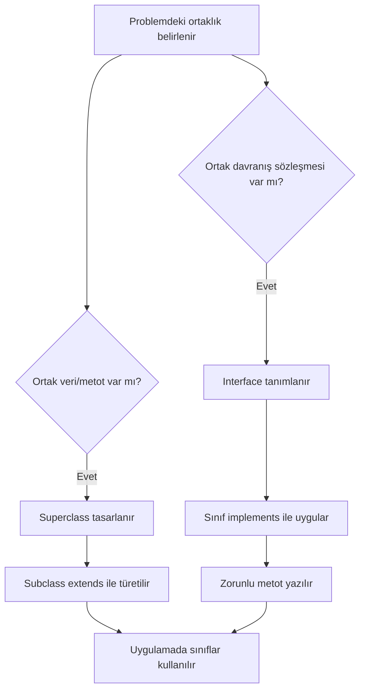

**Diyagram 18.1:** Kalıtım ve interface kullanımında temel karar akışı.

**Görsel üretim notu:** Bu Mermaid diyagramı final DOCX/PDF üretiminden önce PNG'ye dönüştürülmeli; ham `flowchart TD` kodu final çıktıda görünmemelidir.

Bu diyagram kesin bir tasarım kuralı değildir. Başlangıç düzeyinde hangi durumda `extends`, hangi durumda `implements` düşünüleceğini göstermek için verilmiştir.

## 18.13 Adım adım kod örnekleri

Bu bölümde üç temel kod örneği verilecektir. Kod örneklerinde dosya adı ile `public class` adı uyumlu tutulacaktır.

### 18.13.1 Kod 18.1: Temel kalıtım ve interface örneği

**Kod kimliği:** `b18_kod01_temel_kalitim_ve_interface_ornegi`

**Kod erişimi:** [Kod sayfası](https://github.com/bmdersleri/javaninTemelleri/tree/main/kodlar/bolum18/kod01/) | [Kaynak kod](https://github.com/bmdersleri/javaninTemelleri/blob/main/kodlar/bolum18/kod01/KalitimveInterfaceeKisaOnBakTemel.java) | 

**QR erişimi:** Kod sayfası ve kaynak kod için aşağıdaki iki QR kod kullanılabilir.

{width=2.8cm} {width=2.8cm}


```java
// Dosya: KalitimveInterfaceeKisaOnBakTemel.java
public class KalitimveInterfaceeKisaOnBakTemel {
    public static void main(String[] args) {
        Rapor rapor = new Rapor("Haftalık Durum Raporu");

        rapor.bilgileriYazdir();
        rapor.yazdir();
    }
}

class Belge {
    private String baslik;

    public Belge(String baslik) {
        this.baslik = baslik;
    }

    public String getBaslik() {
        return baslik;
    }

    public void bilgileriYazdir() {
        System.out.println("Belge başlığı: " + baslik);
    }
}

interface Yazdirilabilir {
    void yazdir();
}

class Rapor extends Belge implements Yazdirilabilir {
    public Rapor(String baslik) {
        super(baslik);
    }

    public void yazdir() {
        System.out.println("Rapor yazdırılıyor: " + getBaslik());
    }
}
```

**Kodun amacı:** `extends`, `implements`, superclass, subclass, interface ve method contract kavramlarını en küçük çalışan örnekle göstermek.

**Kritik satırların açıklaması:**

1. `class Belge` üst sınıftır.
2. `class Rapor extends Belge` ifadesi `Rapor` sınıfını alt sınıf yapar.
3. `interface Yazdirilabilir` yazdırma davranışı için sözleşme tanımlar.
4. `implements Yazdirilabilir` sınıfın bu sözleşmeyi uyguladığını belirtir.
5. `public void yazdir()` interface'teki metodu gerçekleştirir.
6. `super(baslik)` üst sınıf constructorını çağırır.

**Beklenen çıktı veya davranış:**

```text
Belge başlığı: Haftalık Durum Raporu
Rapor yazdırılıyor: Haftalık Durum Raporu
```

**Olası hata ve dikkat noktası:** `Rapor` sınıfı `Yazdirilabilir` interface'ini uyguladığı için `yazdir` metodunu yazmak zorundadır. Metot yazılmazsa derleme hatası oluşur.

### 18.13.2 Kod 18.2: Kullanıcı girdisiyle yazdırılabilir belge

**Kod kimliği:** `b18_kod02_kullanici_girdisiyle_yazdirilabilir_belge`

**Kod erişimi:** [Kod sayfası](https://github.com/bmdersleri/javaninTemelleri/tree/main/kodlar/bolum18/kod02/) | [Kaynak kod](https://github.com/bmdersleri/javaninTemelleri/blob/main/kodlar/bolum18/kod02/KalitimveInterfaceeKisaOnBakUygulama.java) | 

**QR erişimi:** Kod sayfası ve kaynak kod için aşağıdaki iki QR kod kullanılabilir.

{width=2.8cm} {width=2.8cm}


```java
// Dosya: KalitimveInterfaceeKisaOnBakUygulama.java
import java.util.Scanner;

public class KalitimveInterfaceeKisaOnBakUygulama {
    public static void main(String[] args) {
        Scanner scanner = new Scanner(System.in);

        System.out.print("Rapor başlığı: ");
        String baslik = scanner.nextLine();

        System.out.print("Rapor özeti: ");
        String ozet = scanner.nextLine();

        YazdirilabilirRapor rapor =
                new YazdirilabilirRapor(baslik, ozet);

        rapor.bilgileriYazdir();
        rapor.yazdir();

        scanner.close();
    }
}

class TemelBelge {
    private String baslik;

    public TemelBelge(String baslik) {
        this.baslik = baslik;
    }

    public String getBaslik() {
        return baslik;
    }

    public void bilgileriYazdir() {
        System.out.println("Başlık: " + baslik);
    }
}

interface KonsolaYazdirilabilir {
    void yazdir();
}

class YazdirilabilirRapor extends TemelBelge
        implements KonsolaYazdirilabilir {
    private String ozet;

    public YazdirilabilirRapor(String baslik, String ozet) {
        super(baslik);
        this.ozet = ozet;
    }

    public void yazdir() {
        System.out.println("Rapor yazdırma çıktısı");
        System.out.println("Başlık: " + getBaslik());
        System.out.println("Özet: " + ozet);
    }
}
```

**Kodun amacı:** Kullanıcıdan alınan verilerle bir alt sınıf nesnesi oluşturmak, üst sınıftan gelen başlık bilgisini kullanmak ve interface tarafından zorunlu kılınan `yazdir` metodunu uygulamak.

**Kritik satırların açıklaması:**

1. `TemelBelge` ortak başlık alanını tutar.
2. `YazdirilabilirRapor extends TemelBelge` ortak başlık davranışını devralır.
3. `implements KonsolaYazdirilabilir` sınıfın `yazdir` metodunu yazmasını gerektirir.
4. `super(baslik)` başlığı üst sınıfa gönderir.
5. `getBaslik()` üst sınıftaki başlığı okumayı sağlar.

**Beklenen çıktı veya davranış:** Program kullanıcıdan rapor başlığı ve özeti alır. Ardından rapor bilgisini ve yazdırma çıktısını ekrana verir.

**Olası hata ve dikkat noktası:** `yazdir` metodunun imzası interface'teki metotla uyumlu olmalıdır. `void yazdir(String metin)` yazmak aynı sözleşmeyi karşılamaz.

### 18.13.3 Kod 18.3: Hatalı ve düzeltilmiş interface örneği

Aşağıdaki örnekte sınıf bir interface'i uyguladığını belirtmiş; ancak zorunlu metodu yazmamıştır.

**Kod kimliği:** `b18_kod03_hatali_ve_duzeltilmis_interface_ornegi`

**Kod erişimi:** [Kod sayfası](https://github.com/bmdersleri/javaninTemelleri/tree/main/kodlar/bolum18/kod03/) | [Kaynak kod](https://github.com/bmdersleri/javaninTemelleri/blob/main/kodlar/bolum18/kod03/KalitimveInterfaceeKisaOnBakHataDuzeltme.java) | 

**QR erişimi:** Kod sayfası ve kaynak kod için aşağıdaki iki QR kod kullanılabilir.

{width=2.8cm} {width=2.8cm}


```java
// Dosya: KalitimveInterfaceeKisaOnBakHataDuzeltme.java
public class KalitimveInterfaceeKisaOnBakHataDuzeltme {
    public static void main(String[] args) {
        BasitRapor rapor = new BasitRapor();

        rapor.baslikYaz();
    }
}

interface YazdirmaSozlesmesi {
    void yazdir();
}

class BasitRapor implements YazdirmaSozlesmesi {
    public void baslikYaz() {
        System.out.println("Basit rapor");
    }
}
```

Bu kod derlenmez. Çünkü `BasitRapor`, `YazdirmaSozlesmesi` interface'ini uyguladığını söylemiş, ancak `yazdir()` metodunu yazmamıştır.

Düzeltilmiş sürüm:

**Kod kimliği:** `b18_kod03_hatali_ve_duzeltilmis_interface_ornegi_2`

**Kod erişimi:** [Kod sayfası](https://github.com/bmdersleri/javaninTemelleri/tree/main/kodlar/bolum18/kod03_2/) | [Kaynak kod](https://github.com/bmdersleri/javaninTemelleri/blob/main/kodlar/bolum18/kod03_2/KalitimveInterfaceeKisaOnBakHataDuzeltme.java) | 

**QR erişimi:** Kod sayfası ve kaynak kod için aşağıdaki iki QR kod kullanılabilir.

{width=2.8cm} {width=2.8cm}


```java
// Dosya: KalitimveInterfaceeKisaOnBakHataDuzeltme.java
public class KalitimveInterfaceeKisaOnBakHataDuzeltme {
    public static void main(String[] args) {
        BasitRapor rapor = new BasitRapor();

        rapor.baslikYaz();
        rapor.yazdir();
    }
}

interface YazdirmaSozlesmesi {
    void yazdir();
}

class BasitRapor implements YazdirmaSozlesmesi {
    public void baslikYaz() {
        System.out.println("Basit rapor");
    }

    public void yazdir() {
        System.out.println("Rapor yazdırılıyor.");
    }
}
```

**Kodun amacı:** Interface uygulayan sınıfın sözleşmedeki metodu yazmak zorunda olduğunu göstermek.

**Kritik satırların açıklaması:**

1. `YazdirmaSozlesmesi` interface'i `yazdir` metodunu zorunlu kılar.
2. Hatalı kodda `BasitRapor` bu metodu yazmadığı için derlenmez.
3. Düzeltilmiş kodda `public void yazdir()` eklenmiştir.
4. Böylece sınıf interface sözleşmesini yerine getirir.

**Beklenen çıktı veya davranış:**

```text
Basit rapor
Rapor yazdırılıyor.
```

**Olası hata ve dikkat noktası:** Interface'teki metot adı, dönüş tipi ve parametreleri doğru yazılmalıdır. Farklı imza yazılırsa sözleşme karşılanmış sayılmaz.

> **⚠️ Sık Yapılan Hata:** `implements` yazmak tek başına yeterli değildir. Interface içinde belirtilen metotların sınıfta gerçekten yazılması gerekir.

## 18.14 Kodun çalışma mantığı ve beklenen çıktı

Kalıtım ve interface içeren kodları anlamak için iki farklı ilişkiyi ayrı ayrı izlemek yararlıdır.

Örnek:


```java
class Rapor extends Belge implements Yazdirilabilir {
    public void yazdir() {
        System.out.println("Rapor yazdırılıyor.");
    }
}
```

İz sürme tablosu:

| Adım | Kod parçası | Anlamı |
|---:|---|---|
| 1 | `extends Belge` | `Rapor`, `Belge` sınıfından türemiştir |
| 2 | `implements Yazdirilabilir` | `Rapor`, yazdırma sözleşmesini kabul eder |
| 3 | `yazdir()` | Interface'teki metot uygulanır |
| 4 | `getBaslik()` | Üst sınıftaki metot kullanılabilir |

Çıktı tahmini yaparken şu sorular sorulmalıdır:

1. Nesne hangi sınıftan oluşturuluyor?
2. Bu sınıf bir üst sınıftan türemiş mi?
3. Hangi metot üst sınıftan geliyor?
4. Hangi metot interface gereği yazılmış?
5. Ekrana hangi sırayla çıktı veriliyor?

> **💡 İpucu:** Kalıtım ve interface kodlarını okurken önce `extends`, sonra `implements` ilişkisini bulun. Böylece sınıfın nereden veri/metot aldığı ve hangi davranışı uyguladığı daha kolay anlaşılır.

## 18.15 Uçtan uca mini uygulama: Yazdırılabilir Nesneler

Bu bölümün mini uygulaması, farklı kayıt türlerinin ortak bir üst sınıftan türemesini ve aynı interface üzerinden yazdırılabilir hâle gelmesini gösterir. Program, öğrenci ve ürün kayıtlarını sade biçimde ekrana yazdırır.

**Uygulama adı:** Yazdırılabilir Nesneler

**Dosya adı:** `YazdirilabilirNesneler.java`

**Amaç:** `extends`, `implements`, superclass, subclass, interface, method contract ve listener fikrine hazırlık kavramlarını tek bir küçük uygulamada birleştirmek.

### 18.15.1 Ana program kodu

**Kod kimliği:** `b18_kod17_ana_program_kodu`

**Kod erişimi:** [Kod sayfası](https://github.com/bmdersleri/javaninTemelleri/tree/main/kodlar/bolum18/kod17/) | [Kaynak kod](https://github.com/bmdersleri/javaninTemelleri/blob/main/kodlar/bolum18/kod17/YazdirilabilirNesneler.java) | 

**QR erişimi:** Kod sayfası ve kaynak kod için aşağıdaki iki QR kod kullanılabilir.

{width=2.8cm} {width=2.8cm}


```java
// Dosya: YazdirilabilirNesneler.java
import java.util.ArrayList;

public class YazdirilabilirNesneler {
    public static void main(String[] args) {
        ArrayList<Yazdirilabilir> yazdirilacaklar = new ArrayList<>();

        OgrenciKaydi ogrenci =
                new OgrenciKaydi("Öğrenci Kaydı", "1001", "Ayşe", 85);

        UrunKaydi urun =
                new UrunKaydi("Ürün Kaydı", "P100", "Klavye", 450.0);

        BasitMesaj mesaj =
                new BasitMesaj("Duyuru", "Laboratuvar saat 10.00'da.");

        yazdirilacaklar.add(ogrenci);
        yazdirilacaklar.add(urun);
        yazdirilacaklar.add(mesaj);

        System.out.println("=== Yazdırılabilir Nesneler ===");

        for (Yazdirilabilir nesne : yazdirilacaklar) {
            nesne.yazdir();
            System.out.println("---");
        }
    }
}
```

### 18.15.2 Interface ve üst sınıf


```java
interface Yazdirilabilir {
    void yazdir();
}

class Kayit {
    private String baslik;

    public Kayit(String baslik) {
        this.baslik = baslik;
    }

    public String getBaslik() {
        return baslik;
    }

    public void baslikYazdir() {
        System.out.println("Başlık: " + baslik);
    }
}
```

Bu bölümde `Yazdirilabilir` interface'i yazdırma davranışını tanımlar. `Kayit` sınıfı ise farklı kayıt türleri için ortak başlık bilgisini tutar.

### 18.15.3 Öğrenci ve ürün kayıtları


```java
class OgrenciKaydi extends Kayit implements Yazdirilabilir {
    private String no;
    private String ad;
    private int not;

    public OgrenciKaydi(String baslik, String no, String ad, int not) {
        super(baslik);
        this.no = no;
        this.ad = ad;
        this.not = not;
    }

    public void yazdir() {
        baslikYazdir();
        System.out.println("No: " + no);
        System.out.println("Ad: " + ad);
        System.out.println("Not: " + not);
    }
}

class UrunKaydi extends Kayit implements Yazdirilabilir {
    private String kod;
    private String ad;
    private double fiyat;

    public UrunKaydi(String baslik, String kod, String ad, double fiyat) {
        super(baslik);
        this.kod = kod;
        this.ad = ad;
        this.fiyat = fiyat;
    }

    public void yazdir() {
        baslikYazdir();
        System.out.println("Kod: " + kod);
        System.out.println("Ürün: " + ad);
        System.out.println("Fiyat: " + fiyat);
    }
}
```

Bu sınıflar hem `Kayit` sınıfından türemiştir hem de `Yazdirilabilir` interface'ini uygulamıştır.

### 18.15.4 Basit mesaj sınıfı


```java
class BasitMesaj extends Kayit implements Yazdirilabilir {
    private String mesaj;

    public BasitMesaj(String baslik, String mesaj) {
        super(baslik);
        this.mesaj = mesaj;
    }

    public void yazdir() {
        baslikYazdir();
        System.out.println("Mesaj: " + mesaj);
    }
}
```

Bu sınıf da aynı yazdırma sözleşmesini uygular. Böylece farklı nesneler aynı `yazdir` metodu üzerinden ekrana bilgi verebilir.

### 18.15.5 Beklenen çıktı

```text
=== Yazdırılabilir Nesneler ===
Başlık: Öğrenci Kaydı
No: 1001
Ad: Ayşe
Not: 85
---
Başlık: Ürün Kaydı
Kod: P100
Ürün: Klavye
Fiyat: 450.0
---
Başlık: Duyuru
Mesaj: Laboratuvar saat 10.00'da.
---
```

### 18.15.6 Uygulama akışının açıklaması

Program şu temel parçalardan oluşur:

1. `Yazdirilabilir` interface'i yazdırma sözleşmesini tanımlar.
2. `Kayit` superclass ortak başlık bilgisini tutar.
3. `OgrenciKaydi`, `UrunKaydi` ve `BasitMesaj` sınıfları `Kayit` sınıfından türetilir.
4. Bu sınıflar `Yazdirilabilir` interface'ini uygular.
5. Her sınıf kendi `yazdir` metodunu yazar.
6. Ana program nesneleri listeye ekler ve sırayla yazdırır.

### 18.15.7 Üç kullanım durumu

| Kullanım durumu | Nesne türü | Beklenen davranış |
|---|---|---|
| Öğrenci bilgisi | `OgrenciKaydi` | No, ad ve not yazdırılır |
| Ürün bilgisi | `UrunKaydi` | Kod, ürün adı ve fiyat yazdırılır |
| Duyuru | `BasitMesaj` | Başlık ve mesaj yazdırılır |

> **Alıştırma Molası:** Mini uygulamaya `DersKaydi` adlı yeni bir sınıf ekleyiniz. Bu sınıf `Kayit` sınıfından türesin ve `Yazdirilabilir` interface'ini uygulasın.

## 18.16 Sık yapılan hatalar ve yanlış sezgiler

Kalıtım ve interface konusunda başlangıç öğrencilerinin yaptığı hatalar genellikle kavramları ezberlemek, `extends` ve `implements` görevlerini karıştırmak, interface metodunu yazmayı unutmak ve beklenen çıktıyı elle izlememekle ilgilidir.

### 18.16.1 Konuyu problem bağlamından kopuk ezberlemek

Yanlış yaklaşım:

```text
extends ve implements yalnızca ezberlenmesi gereken kelimelerdir.
```

Düzeltme:

`extends`, sınıflar arasında “bir türüdür” ilişkisi kurar. `implements`, bir sınıfın belirli bir davranışı uygulayacağını belirtir.

### 18.16.2 Interface metodunu yazmayı unutmak

Hatalı kullanım:


```java
interface Calistirilabilir {
    void calistir();
}

class Gorev implements Calistirilabilir {
}
```

Düzeltilmiş kullanım:


```java
interface Calistirilabilir {
    void calistir();
}

class Gorev implements Calistirilabilir {
    public void calistir() {
        System.out.println("Görev çalıştırıldı.");
    }
}
```

### 18.16.3 `extends` ve `implements` sırasını karıştırmak

Doğru kullanımda önce `extends`, sonra `implements` yazılır:


```java
class Rapor extends Belge implements Yazdirilabilir {
}
```

### 18.16.4 Interface'i veri saklama sınıfı sanmak

Interface, doğrudan bir kayıt nesnesi gibi düşünülmemelidir. Interface, uygulanacak davranışları belirtir. Bu bölümde interface, “yazdırılabilir olma” davranışını tanımlamak için kullanılmıştır.

### 18.16.5 Uç durumları test etmemek

Yalnızca tek sınıfla test yapmak yeterli değildir. Öğrenci, ürün ve mesaj gibi farklı sınıfların aynı interface'i doğru uygulayıp uygulamadığını kontrol etmelidir.

> **⚠️ Dikkat:** Interface kullanmak, metot yazma sorumluluğunu ortadan kaldırmaz. Tam tersine, sınıfa belirli metotları yazma zorunluluğu getirir.

## 18.17 Hata ayıklama egzersizi

Aşağıdaki kodu inceleyiniz.

**Kod kimliği:** `b18_kod24_hata_ayiklama_egzersizi`

**Kod erişimi:** [Kod sayfası](https://github.com/bmdersleri/javaninTemelleri/tree/main/kodlar/bolum18/kod24/) | [Kaynak kod](https://github.com/bmdersleri/javaninTemelleri/blob/main/kodlar/bolum18/kod24/InterfaceMetotHatasi.java) | 

**QR erişimi:** Kod sayfası ve kaynak kod için aşağıdaki iki QR kod kullanılabilir.

{width=2.8cm} {width=2.8cm}


```java
// Dosya: InterfaceMetotHatasi.java
public class InterfaceMetotHatasi {
    public static void main(String[] args) {
        Yazici yazici = new Yazici();

        yazici.yazdir();
    }
}

interface YazdirmaGorevi {
    void yazdir();
}

class Yazici implements YazdirmaGorevi {
    public void yaz() {
        System.out.println("Yazdırılıyor.");
    }
}
```

**Hata belirtisi veya beklenmeyen çıktı:** Kod derlenmez. Çünkü `Yazici` sınıfı `YazdirmaGorevi` interface'ini uyguladığını belirtmiştir; ancak interface'teki `yazdir()` metodunu yazmamıştır. `yaz()` adlı metot farklı bir metottur ve interface sözleşmesini karşılamaz.

**Öğrenciye yöneltilecek sorular:**

1. `YazdirmaGorevi` interface'i hangi metodu zorunlu kılıyor?
2. `Yazici` sınıfında hangi metot yazılmış?
3. `yaz()` ile `yazdir()` aynı metot mudur?
4. Bu hata derleme hatası mı, çalışma zamanı hatası mı?
5. Interface sözleşmesini karşılamak için kod nasıl düzeltilmelidir?

Düzeltilmiş kod:

**Kod kimliği:** `b18_kod25_hata_ayiklama_egzersizi`

**Kod erişimi:** [Kod sayfası](https://github.com/bmdersleri/javaninTemelleri/tree/main/kodlar/bolum18/kod25/) | [Kaynak kod](https://github.com/bmdersleri/javaninTemelleri/blob/main/kodlar/bolum18/kod25/InterfaceMetotHatasi.java) | 

**QR erişimi:** Kod sayfası ve kaynak kod için aşağıdaki iki QR kod kullanılabilir.

{width=2.8cm} {width=2.8cm}


```java
// Dosya: InterfaceMetotHatasi.java
public class InterfaceMetotHatasi {
    public static void main(String[] args) {
        Yazici yazici = new Yazici();

        yazici.yazdir();
    }
}

interface YazdirmaGorevi {
    void yazdir();
}

class Yazici implements YazdirmaGorevi {
    public void yazdir() {
        System.out.println("Yazdırılıyor.");
    }
}
```

Kısa açıklama: Interface içinde hangi metot tanımlandıysa, onu uygulayan sınıf aynı metot imzasını yazmalıdır. Metot adındaki küçük bir fark bile sözleşmenin karşılanmadığı anlamına gelir.

## 18.18 Bölümün sonraki bölümlerle ilişkisi

Bu bölümde kalıtım ve interface kavramlarına kısa bir ön bakış yapıldı. Öğrenci `extends` ile üst sınıftan türeme, `implements` ile interface uygulama ve method contract fikrini temel düzeyde öğrendi. Ayrıca listener ve `ActionListener` kavramlarına hazırlık yapıldı.

Bir sonraki bölümde GUI programlamaya giriş ve Swing mimarisi ele alınacaktır. Swing'de butonlar, pencereler ve olaylar ile çalışırken listener yapıları sık kullanılacaktır. Bu bölümde öğrenilen interface ve method contract fikri, buton tıklamalarını yakalayan `ActionListener` kodlarını anlamak için temel oluşturacaktır.

## 18.19 Bölüm özeti

Bu bölümde kalıtım ve interface kavramlarına uygulama geliştirmeye yetecek düzeyde kısa bir giriş yapıldı. Kalıtımın bir sınıfın başka bir sınıftan bazı özellikleri devralmasını sağladığı, Java'da bu ilişkinin `extends` anahtar kelimesiyle kurulduğu açıklandı.

Superclass ve subclass kavramları `Belge` ve `Rapor` örnekleri üzerinden ele alındı. Superclass ortak alan ve metotları tutarken, subclass bu ortak yapıyı devralan özel sınıf olarak tanımlandı.

Interface kavramı, uygulanması gereken metotları belirleyen bir sözleşme olarak açıklandı. `implements` anahtar kelimesiyle bir sınıfın interface'i uyguladığı ve interface'teki metotları yazmak zorunda olduğu gösterildi. Method contract fikri, özellikle GUI olay yönetimine hazırlık amacıyla vurgulandı.

Listener kavramı, olayları dinleyen yapı olarak tanıtıldı. Swing'de sık karşılaşılacak `ActionListener` interface'inin buton tıklama gibi olaylarda kullanılacağı belirtildi; ancak ayrıntılı Swing kodu sonraki bölüme bırakıldı.

Yazdırılabilir Nesneler mini uygulamasıyla `extends`, `implements`, superclass, subclass, interface ve method contract kavramları tek bir küçük programda birleştirildi. Son olarak interface metodunu yazmayı unutmak, `extends` ve `implements` görevlerini karıştırmak ve beklenen çıktıyı izlememek gibi başlangıç hataları görünür kılındı.

## 18.20 Terim sözlüğü

| Terim | Açıklama |
|---|---|
| Kalıtım | Bir sınıfın başka bir sınıftan özellik ve davranış devralması |
| `extends` | Sınıflar arasında kalıtım ilişkisi kuran anahtar kelime |
| Superclass | Üst sınıf; ortak özellikleri tutan sınıf |
| Subclass | Alt sınıf; üst sınıftan türeyen sınıf |
| Interface | Uygulanması gereken metotları tanımlayan sözleşme |
| `implements` | Bir sınıfın interface'i uyguladığını belirten anahtar kelime |
| Method contract | Interface'in sınıfa yüklediği metot yazma sorumluluğu |
| Listener | Bir olayı dinleyen ve olay olduğunda tepki veren yapı |
| `ActionListener` | Swing'de eylem olaylarını dinlemek için kullanılan interface |
| `super` | Üst sınıf constructor veya üyelerine erişim için kullanılan anahtar kelime |
| Ortak davranış | Birden fazla sınıfta benzer şekilde bulunması beklenen işlem |
| Derleme hatası | Kodun derlenmesini engelleyen hata |
| Uygulama sınıfı | Programın çalıştığı ana sınıf |
| Sözleşme | Uygulanması beklenen metotların tanımı |

## 18.21 Kendini değerlendirme soruları

### 18.21.1 Çoktan seçmeli sorular

1. Java'da bir sınıfın başka bir sınıftan türemesi için hangi anahtar kelime kullanılır?

A) `extends`  
B) `implements`  
C) `import`  
D) `return`  
E) `package`

2. Bir sınıfın bir interface'i uyguladığını belirtmek için hangisi kullanılır?

A) `implements`  
B) `extends`  
C) `new`  
D) `this`  
E) `static`

3. Superclass kavramı neyi ifade eder?

A) Üst sınıfı  
B) Alt sınıfı  
C) Interface metodunu  
D) Dosya yolunu  
E) Kullanıcı girdisini

4. Interface için hangisi doğrudur?

A) Uygulanması gereken metotları tanımlayabilir  
B) Her zaman dosya okur  
C) Sadece değişken saklar  
D) Mutlaka GUI oluşturur  
E) Yalnızca `main` metodu içerir

5. `ActionListener` kavramı hangi konuya hazırlık sağlar?

A) Swing olay yönetimine  
B) Dosya yolu belirlemeye  
C) Karekök almaya  
D) CSV ayırmaya  
E) Tarih biçimlendirmeye

6. Interface'i uygulayan sınıf zorunlu metodu yazmazsa ne olur?

A) Derleme hatası oluşabilir  
B) Program her zaman doğru çalışır  
C) Metot otomatik yazılır  
D) Interface silinir  
E) Nesne oluşturulmaz ama hata vermez

7. `class Rapor extends Belge implements Yazdirilabilir` ifadesinde `Belge` nedir?

A) Superclass  
B) Interface  
C) Getter  
D) Listener metodu  
E) Dosya adı

### 18.21.2 Doğru/Yanlış soruları

1. `extends`, kalıtım ilişkisi kurmak için kullanılır. (D/Y)
2. `implements`, interface uygulamak için kullanılır. (D/Y)
3. Interface içindeki metotlar sınıf tarafından yazılmak zorunda olabilir. (D/Y)
4. Listener kavramı GUI olay yönetimiyle ilişkilidir. (D/Y)
5. `ActionListener`, Swing'de buton tıklama gibi olaylara hazırlık sağlar. (D/Y)
6. `extends` ve `implements` tamamen aynı görevi yapar. (D/Y)
7. Bu bölümde SOLID ve design patterns ayrıntılı olarak işlenir. (D/Y)

### 18.21.3 Açık uçlu kavramsal sorular

1. Kalıtım kavramını kendi cümlelerinizle açıklayınız.
2. Superclass ve subclass arasındaki ilişki nedir?
3. `extends` anahtar kelimesinin görevini açıklayınız.
4. Interface kavramını bir sözleşme olarak nasıl yorumlarsınız?
5. `implements` anahtar kelimesi ne işe yarar?
6. Method contract kavramını basit bir örnekle açıklayınız.
7. Listener kavramı GUI programlamaya nasıl hazırlık sağlar?
8. `ActionListener` kavramı neden GUI bölümlerinden önce kısaca tanıtılmıştır?

### 18.21.4 Yanlış gerekçeyi bulma soruları

Aşağıdaki ifadelerdeki yanlış gerekçeyi bulunuz ve düzeltiniz.

1. “`extends` ve `implements` aynı anlama gelir.”
2. “Interface yazınca metotları sınıfta yazmaya gerek kalmaz.”
3. “Subclass, superclass ile hiçbir ilişki kurmaz.”
4. “Listener yalnızca dosya okuma işlemleri için kullanılır.”
5. “`ActionListener` kavramı GUI olaylarıyla ilgili değildir.”
6. “Interface metodu farklı adla yazılsa da sözleşme karşılanmış olur.”
7. “Kalıtım her problemde mutlaka kullanılmalıdır.”

## 18.22 Programlama alıştırmaları

### 18.22.1 Kolay düzey

1. `Hayvan` adlı bir superclass ve `Kedi` adlı bir subclass yazınız.
2. `Belge` sınıfından türeyen `Rapor` sınıfı oluşturunuz.
3. `Yazdirilabilir` adlı bir interface yazınız ve `void yazdir()` metodu tanımlayınız.
4. `Rapor` sınıfının `Yazdirilabilir` interface'ini uygulamasını sağlayınız.

### 18.22.2 Orta düzey

1. `Urun` superclassından türeyen `ElektronikUrun` sınıfı yazınız.
2. `Kaydedilebilir` adlı interface oluşturup `kaydet()` metodu tanımlayınız.
3. Bir sınıfın hem `extends` hem `implements` kullanmasını sağlayan küçük bir örnek yazınız.
4. `Yazdirilabilir` interface'ini uygulayan üç farklı sınıf oluşturunuz ve her birinin `yazdir` metodunu farklı yazınız.

### 18.22.3 Zor düzey

1. `YazdirilabilirNesneler.java` uygulamasına `DersKaydi` sınıfı ekleyiniz.
2. Aynı uygulamada `ArrayList<Yazdirilabilir>` içine en az dört farklı nesne ekleyiniz.
3. Interface metodunu yanlış adla yazan hatalı bir örnek oluşturup düzeltiniz.
4. Listener fikrini temsil eden `TiklamaDinleyici` adlı basit bir interface yazınız.
5. GUI'ye geçmeden önce `ActionListener` mantığını açıklayan kısa bir konsol örneği geliştiriniz.

## 18.23 Hata ayıklama egzersizi

Aşağıdaki kodu inceleyiniz.

**Kod kimliği:** `b18_kod26_hata_ayiklama_egzersizi`

**Kod erişimi:** [Kod sayfası](https://github.com/bmdersleri/javaninTemelleri/tree/main/kodlar/bolum18/kod26/) | [Kaynak kod](https://github.com/bmdersleri/javaninTemelleri/blob/main/kodlar/bolum18/kod26/ImplementsMetotHatasi.java) | 

**QR erişimi:** Kod sayfası ve kaynak kod için aşağıdaki iki QR kod kullanılabilir.

{width=2.8cm} {width=2.8cm}


```java
// Dosya: ImplementsMetotHatasi.java
public class ImplementsMetotHatasi {
    public static void main(String[] args) {
        BasitDinleyici dinleyici = new BasitDinleyici();

        dinleyici.olayGerceklesti();
    }
}

interface OlayDinleyici {
    void olayGerceklesti();
}

class BasitDinleyici implements OlayDinleyici {
    public void olayOldu() {
        System.out.println("Olay algılandı.");
    }
}
```

**Hata belirtisi:** Kod derlenmez. Çünkü `BasitDinleyici` sınıfı `OlayDinleyici` interface'ini uyguladığını belirtmiştir; ancak interface'teki `olayGerceklesti()` metodunu yazmamıştır. `olayOldu()` farklı bir metottur.

**Öğrenciye sorular:**

1. `OlayDinleyici` interface'i hangi metodu zorunlu kılıyor?
2. `BasitDinleyici` sınıfında hangi metot yazılmış?
3. `olayOldu()` ile `olayGerceklesti()` aynı metot sayılır mı?
4. Bu hata derleme hatası mı, çalışma zamanı hatası mı?
5. Listener mantığı açısından metot adının doğru yazılması neden önemlidir?
6. Kodun düzeltilmiş hâli nasıl olmalıdır?

Düzeltilmiş kod:

**Kod kimliği:** `b18_kod27_hata_ayiklama_egzersizi`

**Kod erişimi:** [Kod sayfası](https://github.com/bmdersleri/javaninTemelleri/tree/main/kodlar/bolum18/kod27/) | [Kaynak kod](https://github.com/bmdersleri/javaninTemelleri/blob/main/kodlar/bolum18/kod27/ImplementsMetotHatasi.java) | 

**QR erişimi:** Kod sayfası ve kaynak kod için aşağıdaki iki QR kod kullanılabilir.

{width=2.8cm} {width=2.8cm}


```java
// Dosya: ImplementsMetotHatasi.java
public class ImplementsMetotHatasi {
    public static void main(String[] args) {
        BasitDinleyici dinleyici = new BasitDinleyici();

        dinleyici.olayGerceklesti();
    }
}

interface OlayDinleyici {
    void olayGerceklesti();
}

class BasitDinleyici implements OlayDinleyici {
    public void olayGerceklesti() {
        System.out.println("Olay algılandı.");
    }
}
```

Kısa açıklama: Interface metodunun adı, dönüş tipi ve parametreleri aynı şekilde uygulanmalıdır. Bu mantık, GUI bölümünde `ActionListener` gibi interface'leri kullanırken özellikle önemlidir.

## 18.24 Haftalık laboratuvar / proje görevi

**Görev başlığı:** Yazdırılabilir Nesneler Laboratuvarı

**Amaç:** Bu görev, öğrencinin `extends`, `implements`, superclass, subclass, interface, method contract ve listener hazırlığı kavramlarını küçük ama tamamlanabilir bir Java uygulamasında birleştirmesini amaçlar.

**Beklenen adımlar:**

1. `YazdirilabilirNesneler.java` adlı dosyayı oluşturunuz.
2. `Yazdirilabilir` adlı bir interface tanımlayınız.
3. Interface içine `void yazdir()` metodunu ekleyiniz.
4. Ortak başlık bilgisi için `Kayit` adlı bir superclass oluşturunuz.
5. `OgrenciKaydi`, `UrunKaydi` ve `BasitMesaj` sınıflarını tasarlayınız.
6. Bu sınıfların uygun olanlarını `Kayit` sınıfından türetiniz.
7. Her sınıfın `Yazdirilabilir` interface'ini uygulamasını sağlayınız.
8. Her sınıfta `yazdir` metodunu anlamlı biçimde yazınız.
9. Ana programda en az üç farklı nesne oluşturunuz.
10. Nesneleri listeleyip yazdırma çıktılarını test ediniz.
11. Interface metodunu eksik bırakan hatalı bir örneği raporlayınız.
12. Kısa bir `README.md` dosyası hazırlayınız.

**Teslim edilecek dosyalar:**

1. `YazdirilabilirNesneler.java`
2. `README.md`
3. Program çıktıları
4. Test senaryoları listesi
5. Hata ve çözüm notu

**README içeriği şu başlıkları içermelidir:**

1. Programın amacı
2. Kullanılan superclass ve subclass yapısı
3. Kullanılan interface ve method contract
4. `extends` ve `implements` kullanımı
5. Test girdileri ve çıktılar
6. Karşılaşılan hata ve çözüm
7. GUI bölümüne hazırlık açısından kısa yorum

## 18.25 Değerlendirme rubriği

| Ölçüt | Açıklama | Puan |
|---|---|---:|
| Kalıtım kullanımı | `extends`, superclass ve subclass ilişkisinin doğru kurulması | 20 |
| Interface kullanımı | `implements` ve method contractın doğru uygulanması | 20 |
| Uygulama akışı | Yazdırılabilir nesnelerin düzenli biçimde listelenmesi | 20 |
| GUI hazırlığı | Listener ve `ActionListener` fikrinin doğru yorumlanması | 10 |
| Hata yönetimi / doğrulama | Eksik metot ve yanlış kullanım hatalarının açıklanması | 10 |
| Kod okunabilirliği | İsimlendirme, girinti ve sade yapı | 10 |
| Raporlama | README, test çıktıları ve hata notu | 10 |
| **Toplam** |  | **100** |

## 18.26 İleri okuma ve kaynaklar

Bu bölümdeki konular temel düzeyde işlenmiştir. Daha ayrıntılı çalışma için aşağıdaki kaynak türleri incelenebilir:

1. **Java SE API dokümantasyonu:** `ActionListener` gibi interface'lerin hangi metotları zorunlu kıldığını görmek için yararlıdır. Öğrenci resmi API metinlerinden method contract fikrini takip etmeyi öğrenebilir.
2. **Dev.java öğrenme kaynakları:** Java'da sınıflar, interface'ler ve temel nesne ilişkileri konusunda güncel ve sade örnekler sunar. Bu bölümdeki kavramları kısa alıştırmalarla pekiştirmek için kullanılabilir.
3. **Oracle Java Tutorials:** Interfaces and Inheritance başlıkları, `extends` ve `implements` kullanımını daha kapsamlı örneklerle açıklar. Bu kaynak, ileri OOP konularına geçmeden önce temel tekrar için uygundur.
4. **Ders içi ek okuma notu:** Swing'e geçmeden önce listener ve method contract mantığını pekiştirmek için sınıf içi küçük konsol örnekleriyle birlikte kullanılabilir.

> **💡 İpucu:** İleri kaynaklarda polymorphism, abstract class, SOLID ve design patterns gibi konularla karşılaşabilirsiniz. Bu bölümde bu konuların ayrıntısına girilmemiştir; temel hedef Swing olay yönetimine hazırlıktır.

## 18.27 Bir sonraki bölüme köprü

Bu bölümde kalıtım ve interface kavramlarına kısa bir ön bakış yapıldı. `extends` ile sınıflar arası temel ilişki kurma, `implements` ile bir interface sözleşmesini uygulama ve listener fikrine hazırlık konuları ele alındı. Bu bilgiler, GUI programlamaya geçişte özellikle önemlidir.

Bir sonraki bölümde GUI Programlamaya Giriş ve Swing Arayüz Tasarımı işlenecektir. Swing'de pencereler, butonlar ve olaylar ile çalışırken `ActionListener` gibi interface'ler kullanılacaktır. Bu bölümde öğrenilen method contract ve listener mantığı, buton tıklama olaylarını anlamak için doğrudan kullanılacaktır.

**BÖLÜM SONU**


\newpage


# Bölüm 19: GUI Programlamaya Giriş ve Swing Arayüz Tasarımı

## 19.1 Bölümün yol haritası

Önceki bölümlerde Java programları çoğunlukla konsol üzerinden geliştirildi. Kullanıcıdan veri almak için `Scanner`, sonuçları göstermek için `System.out.println` kullanıldı. Bu yaklaşım temel programlama mantığını öğrenmek için uygundur. Ancak gerçek uygulamalarda kullanıcı çoğu zaman komut satırı yerine pencereler, formlar, etiketler, metin kutuları, butonlar ve düzenli arayüzler üzerinden programla etkileşime girer.

Bu bölümde Java ile grafiksel kullanıcı arayüzü geliştirmeye giriş yapılacaktır. Amaç, öğrencinin Swing kullanarak ilk penceresini oluşturması, pencere içine temel bileşenler yerleştirmesi ve bu bileşenleri layout manager kullanarak düzenli biçimde hizalamasıdır.

Bu bölüm iki eski konuyu tek çatı altında toplar:

| Kaynak kapsam | Bu bölümdeki karşılığı | Koruma durumu |
|---|---|---|
| GUI programlamaya giriş | GUI, Swing, `JFrame`, `JPanel`, `JLabel` | Korundu |
| Swing mimarisi | Component-container ilişkisi, event-driven düşünceye giriş | Korundu |
| İlk pencere örnekleri | En küçük çalışan Swing penceresi, panel ve etiket örnekleri | Korundu |
| Layout yönetimi | `FlowLayout`, `BorderLayout`, `GridLayout` | Korundu |
| Arayüz tasarımı | Panel bölümlendirme, padding, hizalama, düzenli form | Korundu |
| GUI mini uygulamaları | İlk pencere + düzenli öğrenci formu | Birleştirildi |

Bu bölümde şu sorulara yanıt aranacaktır:

1. GUI nedir ve konsol programlarından nasıl ayrılır?
2. Swing nedir ve Java’da ne amaçla kullanılır?
3. `JFrame` neyi temsil eder?
4. `JPanel` neden kullanılır?
5. `JLabel` hangi amaçla kullanılır?
6. Component ve container ilişkisi nasıl yorumlanır?
7. Event-driven programming fikri başlangıç düzeyinde nasıl anlaşılmalıdır?
8. `setVisible(true)` neden gereklidir?
9. Layout manager nedir?
10. Elle konum vermek yerine layout kullanmak neden daha uygundur?
11. `FlowLayout`, `BorderLayout` ve `GridLayout` hangi durumlarda tercih edilir?
12. `JPanel` ile arayüz bölümlere nasıl ayrılır?
13. Padding ve hizalama arayüz okunabilirliğini nasıl etkiler?
14. Düzenli bir öğrenci formu nasıl tasarlanır?

> **🎯 Bölüm Hedefi:** Bu bölümün sonunda öğrenci, Java Swing ile temel bir pencere oluşturabilecek, `JFrame`, `JPanel` ve `JLabel` bileşenlerini kullanabilecek, `FlowLayout`, `BorderLayout` ve `GridLayout` yardımıyla düzenli bir form arayüzü tasarlayabilecektir.

Bu bölümde olay yönetimi, `ActionListener`, buton tıklama işlemleri, metin kutusundan veri okuma, form doğrulama, `JList`, `JTable`, menü, diyalog, JDBC ve ileri GUI mimarisi ele alınmayacaktır. Bunlar sonraki bölümlerde sırasıyla işlenecektir.

## 19.2 Bölümün konumu ve pedagojik rolü

Bu bölüm, konsol tabanlı programlamadan pencere tabanlı programlamaya geçiş bölümüdür. Önceki bölümlerde program akışı çoğunlukla yukarıdan aşağıya ilerliyordu. Kullanıcı veri giriyor, program hesaplama yapıyor ve sonuç ekrana yazdırılıyordu. GUI programlarında ise kullanıcı pencere üzerinde farklı bileşenlerle etkileşime girer. Bu nedenle programlama yaklaşımı yavaş yavaş olay odaklı düşünmeye geçer.

Bu bölümde olay yönetimi ayrıntılı olarak işlenmeyecektir; ancak GUI programlarının konsol programlarından farklı bir akışa sahip olduğu sezdirilecektir. Öğrencinin öncelikle pencere, panel, bileşen ve layout kavramlarını sağlam biçimde anlaması gerekir. Buton tıklama ve form doğrulama gibi konular sonraki bölümde daha anlamlı hâle gelecektir.

`JFrame`, uygulamanın ana penceresidir. `JPanel`, bileşenleri gruplamak ve arayüzü bölümlere ayırmak için kullanılır. `JLabel`, ekranda metin göstermek için kullanılan basit bir bileşendir. Layout manager yapıları ise bileşenlerin pencere veya panel içinde nasıl yerleşeceğini belirler.

> **⚠️ Dikkat:** GUI programlamada ilk hedef “çok fazla bileşen kullanmak” değildir. İlk hedef, pencereyi oluşturmak, bileşenleri doğru container içine eklemek ve arayüzü okunabilir şekilde düzenlemektir.

Bu bölüm, sonraki bölümde ele alınacak temel Swing bileşenleri, olay yönetimi ve form doğrulama konularına temel hazırlar.

## 19.3 Öğrenme çıktıları

Bu bölüm tamamlandığında öğrenci:

1. GUI kavramını kendi cümleleriyle açıklayabilir.
2. Konsol programı ile GUI programı arasındaki temel farkları ayırt edebilir.
3. Swing’in Java’da grafiksel arayüz geliştirmek için kullanılabileceğini açıklayabilir.
4. `JFrame` ile temel pencere oluşturabilir.
5. `setSize()`, `setTitle()`, `setDefaultCloseOperation()` ve `setVisible(true)` kullanımını açıklayabilir.
6. `JPanel` ile bileşenleri gruplandırabilir.
7. `JLabel` ile ekranda metin gösterebilir.
8. Component ve container ilişkisini temel düzeyde açıklayabilir.
9. Event-driven programming fikrini başlangıç düzeyinde yorumlayabilir.
10. Layout manager kavramını açıklayabilir.
11. `FlowLayout` ile bileşenleri sıralı yerleştirebilir.
12. `BorderLayout` ile pencereyi bölgelere ayırabilir.
13. `GridLayout` ile form alanlarını satır-sütun düzeninde yerleştirebilir.
14. `JPanel` kullanarak arayüzü başlık, form ve buton bölümlerine ayırabilir.
15. Padding ve hizalamanın arayüz okunabilirliğine etkisini açıklayabilir.
16. Düzenli Öğrenci Formu mini uygulamasını geliştirebilir.

## 19.4 Ön bilgi ve başlangıç varsayımları

Bu bölüm, öğrencinin aşağıdaki konuları temel düzeyde bildiğini varsayar:

1. Java programının temel yapısı
2. Sınıf ve `main` metodu
3. Nesne oluşturma
4. `new` anahtar kelimesi
5. Metot çağırma
6. `import` kullanımı
7. Constructor kavramı
8. Basit OOP bilgisi
9. `extends` ve `implements` kavramlarını başlangıç düzeyinde görmüş olma
10. Konsol programlarını derleyip çalıştırabilme

Bu bölümde örnekler masaüstü Swing arayüzleri olarak verilecektir. Web arayüzü, mobil arayüz, JavaFX, Android, HTML/CSS veya gelişmiş UI tasarım ilkeleri kapsam dışındadır.

## 19.5 Ana kavramlar

| Kavram | Kısa açıklama | Bu bölümdeki rolü |
|---|---|---|
| GUI | Grafiksel kullanıcı arayüzü | Pencere tabanlı programlama |
| Swing | Java GUI kütüphanesi | Arayüz geliştirme |
| `JFrame` | Ana pencere sınıfı | Uygulama penceresi |
| `JPanel` | Bileşenleri gruplama alanı | Arayüz bölümlendirme |
| `JLabel` | Metin gösteren bileşen | Başlık, açıklama |
| Component | Arayüzde görünen öğe | Label, panel, buton |
| Container | Component tutan yapı | Frame, panel |
| Event-driven | Olaylara göre çalışan program akışı | GUI mantığına giriş |
| Layout manager | Bileşenlerin yerleşimini belirler | Düzenli arayüz |
| `FlowLayout` | Bileşenleri soldan sağa dizer | Basit satır düzeni |
| `BorderLayout` | Beş bölgeye ayırır | Ana pencere iskeleti |
| `GridLayout` | Satır-sütun düzeni kurar | Form alanları |
| Padding | Kenar boşluğu | Okunabilirlik |
| Hizalama | Bileşenlerin konum düzeni | Görsel düzen |
| Form | Kullanıcıdan bilgi alınan arayüz | Öğrenci formu |

> **🎯 Sınav Notu:** `JFrame` ana pencere, `JPanel` bileşenleri gruplamak için kullanılan ara container, `JLabel` ise metin gösteren basit bir Swing bileşenidir.

## 19.6 GUI nedir?

GUI, grafiksel kullanıcı arayüzü anlamına gelir. Kullanıcı programla metin komutları yerine görsel bileşenler üzerinden etkileşime girer. Pencereler, butonlar, metin alanları, etiketler, listeler ve tablolar GUI bileşenlerine örnektir.

Konsol programı örneği:

```text
Adınızı giriniz: Ayşe
Merhaba Ayşe
```

GUI yaklaşımında ise kullanıcı bir pencere üzerinde metin alanına adını yazar, butona basar ve sonucu ekranda görür.

### 19.6.1 Konsol ve GUI farkı

| Özellik | Konsol programı | GUI programı |
|---|---|---|
| Etkileşim biçimi | Klavye ve metin | Pencere ve bileşenler |
| Çıktı | Konsol metni | Arayüz bileşenleri |
| Akış | Genellikle sırayla ilerler | Olaylara bağlıdır |
| Kullanıcı deneyimi | Basit ve teknik | Görsel ve etkileşimli |
| Örnek giriş | `Scanner` | `JTextField`, buton |
| Örnek çıktı | `System.out.println` | `JLabel`, diyalog |

> **💡 İpucu:** GUI programlamada önce bileşenlerin görünmesini sağlayan arayüz iskeleti kurulur. Kullanıcı etkileşimi ve olay yönetimi sonraki aşamada eklenir.

## 19.7 Swing nedir?

Swing, Java ile masaüstü grafiksel kullanıcı arayüzleri geliştirmek için kullanılan bir kütüphanedir. Swing bileşenleri genellikle `javax.swing` paketi altında yer alır.

Örnek importlar:

```java
import javax.swing.JFrame;
import javax.swing.JLabel;
import javax.swing.JPanel;
```

Daha kısa kullanım için şu da yazılabilir:

```java
import javax.swing.*;
```

Bu bölümde başlangıç düzeyinde `JFrame`, `JPanel` ve `JLabel` kullanılacaktır. Buton, metin kutusu ve olay yönetimi sonraki bölümde ayrıntılı olarak ele alınacaktır.

### 19.7.1 Swing ne zaman kullanılabilir?

Swing şu tür uygulamalar için kullanılabilir:

1. Basit masaüstü formları
2. Öğrenci kayıt arayüzleri
3. Küçük hesaplama araçları
4. Listeleme ve tablo uygulamaları
5. Eğitim amaçlı GUI örnekleri

> **⚠️ Dikkat:** Swing, web veya mobil uygulama geliştirme aracı değildir. Bu bölümde yalnızca Java masaüstü arayüz mantığına giriş yapılmaktadır.

## 19.8 `JFrame`: Ana pencere

`JFrame`, Swing uygulamasının ana penceresini temsil eder. En küçük çalışan pencere örneği şu şekildedir:

```java
JFrame pencere = new JFrame("İlk Pencere");

pencere.setSize(400, 200);
pencere.setDefaultCloseOperation(JFrame.EXIT_ON_CLOSE);
pencere.setVisible(true);
```

Bu kodda:

1. `new JFrame("İlk Pencere")` başlıklı bir pencere oluşturur.
2. `setSize(400, 200)` pencerenin genişlik ve yüksekliğini belirler.
3. `setDefaultCloseOperation(JFrame.EXIT_ON_CLOSE)` pencere kapatıldığında programın kapanmasını sağlar.
4. `setVisible(true)` pencereyi görünür yapar.

### 19.8.1 `setVisible(true)` neden gereklidir?

Pencere nesnesi oluşturmak, pencerenin otomatik olarak ekranda görünmesini sağlamaz. Pencereyi göstermek için `setVisible(true)` çağrılmalıdır.

Yanlış beklenti:

```text
JFrame nesnesi oluşturulunca pencere otomatik görünür.
```

Doğru kullanım:

```java
pencere.setVisible(true);
```

### 19.8.2 `setDefaultCloseOperation`

Pencere kapatıldığında programın nasıl davranacağı belirlenmelidir.

```java
pencere.setDefaultCloseOperation(JFrame.EXIT_ON_CLOSE);
```

Bu ifade, pencere kapatıldığında programın sonlanmasını sağlar.

> **🎯 Sınav Notu:** `JFrame` oluşturduktan sonra pencere boyutu, kapanış davranışı ve görünürlük ayarları yapılmalıdır.

## 19.9 `JPanel`: Bileşenleri gruplama alanı

`JPanel`, arayüz bileşenlerini gruplamak için kullanılan bir container yapısıdır. Büyük arayüzleri daha düzenli parçalara ayırmak için kullanılır.

Örnek:

```java
JPanel panel = new JPanel();

panel.add(new JLabel("Merhaba Swing"));

pencere.add(panel);
```

Bu örnekte `JLabel` doğrudan pencereye değil, önce panele eklenmiştir. Panel daha sonra pencereye eklenmiştir.

### 19.9.1 Neden panel kullanılır?

Panel kullanmak şu yararları sağlar:

1. Bileşenleri gruplandırır.
2. Arayüzü bölümlere ayırır.
3. Farklı bölümlerde farklı layout kullanılmasını sağlar.
4. Kodun okunabilirliğini artırır.
5. Form, başlık ve buton alanlarını ayırmayı kolaylaştırır.

> **💡 İpucu:** Karmaşık arayüzleri tek pencereye doğrudan bileşen ekleyerek değil, panellere ayırarak kurmak daha okunabilir bir tasarım sağlar.

## 19.10 `JLabel`: Arayüzde metin gösterme

`JLabel`, arayüzde metin göstermek için kullanılan Swing bileşenidir.

```java
JLabel etiket = new JLabel("Java Swing'e hoş geldiniz");
```

Bir etiketi panele eklemek için:

```java
panel.add(etiket);
```

`JLabel` genellikle şu amaçlarla kullanılır:

1. Başlık göstermek
2. Açıklama yazmak
3. Form alanlarının adını belirtmek
4. Kullanıcıya kısa bilgi vermek
5. Sonuç veya durum mesajı göstermek

Bu bölümde `JLabel`, metin gösterme ve form etiketi amaçlı kullanılacaktır.

## 19.11 Component ve container ilişkisi

Swing arayüzlerinde bileşenler component olarak düşünülebilir. Component, arayüzde görünen veya arayüzün parçası olan öğedir. Container ise başka componentleri içinde tutabilen yapıdır.

Örnekler:

| Yapı | Tür | Açıklama |
|---|---|---|
| `JLabel` | Component | Metin gösterir |
| `JPanel` | Container | Bileşenleri gruplar |
| `JFrame` | Container | Ana pencereyi temsil eder |

Basit ilişki:

```text
JFrame
 └── JPanel
      └── JLabel
```

Bu ilişki, GUI arayüzlerinin ağaç benzeri bir yapıda kurulabileceğini gösterir.

> **⚠️ Dikkat:** Bir bileşen oluşturmak tek başına yeterli değildir. Bileşenin görünmesi için uygun bir container içine eklenmesi gerekir.

## 19.12 Event-driven programming fikrine giriş

Konsol programlarında akış genellikle satır satır ilerler. GUI programlarında ise kullanıcı farklı zamanlarda farklı bileşenlerle etkileşime girebilir. Bu nedenle GUI programları olay odaklıdır.

Olay örnekleri:

1. Butona tıklama
2. Metin kutusuna yazı yazma
3. Pencereyi kapatma
4. Menü seçimi yapma
5. Listeden eleman seçme

Bu bölümde olay yönetimi ayrıntılı olarak işlenmeyecektir. Ancak GUI programlarının temel mantığı, kullanıcı olaylarına tepki verme üzerine kuruludur.

### 19.12.1 Konsol akışı ve GUI akışı

Konsol yaklaşımı:

```text
Veri iste
Veriyi oku
Hesapla
Sonucu yazdır
Bitir
```

GUI yaklaşımı:

```text
Pencereyi oluştur
Bileşenleri yerleştir
Pencereyi göster
Kullanıcı olaylarını bekle
Olay gerçekleşince tepki ver
```

> **💡 İpucu:** Bu bölümde “olayları bekleme” fikrini anlamak yeterlidir. Buton tıklama ve `ActionListener` ayrıntıları sonraki bölümde işlenecektir.

## 19.13 Layout manager nedir?

Layout manager, bileşenlerin pencere veya panel üzerinde nasıl yerleşeceğini belirleyen yapıdır. Swing’de bileşenleri elle piksel piksel konumlandırmak yerine layout manager kullanmak daha güvenli ve düzenli bir yaklaşımdır.

Örneğin bir panel şu şekilde oluşturulabilir:

```java
JPanel panel = new JPanel(new FlowLayout());
```

Bu panel, içine eklenen bileşenleri `FlowLayout` kurallarına göre yerleştirir.

### 19.13.1 Neden elle konum vermiyoruz?

Elle konum verme yaklaşımında her bileşenin x-y koordinatı ve boyutu tek tek belirlenir. Bu yöntem küçük örneklerde mümkün görünse de pencere boyutu, işletim sistemi, yazı tipi veya ekran çözünürlüğü değiştiğinde sorun çıkarabilir.

Layout kullanmanın yararları:

1. Bileşenler daha düzenli yerleşir.
2. Pencere boyutu değiştiğinde arayüz daha uyumlu davranır.
3. Kod daha okunabilir olur.
4. Form yapıları daha kolay kurulur.
5. Farklı panellerde farklı düzenler kullanılabilir.

> **🎯 Sınav Notu:** Layout manager, bileşenlerin konum ve düzenini yönetir. Başlangıç düzeyinde `FlowLayout`, `BorderLayout` ve `GridLayout` yeterlidir.

## 19.14 `FlowLayout`

`FlowLayout`, bileşenleri soldan sağa doğru sıralı biçimde yerleştirir. Yer kalmadığında bileşenler bir sonraki satıra geçebilir.

```java
JPanel panel = new JPanel(new FlowLayout());

panel.add(new JLabel("Ad"));
panel.add(new JLabel("Soyad"));
panel.add(new JLabel("Not"));
```

Bu düzen, basit satır içi bileşenler için uygundur.

### 19.14.1 Hizalama

`FlowLayout` hizalaması ayarlanabilir.

```java
JPanel panel = new JPanel(new FlowLayout(FlowLayout.LEFT));
```

Bu kullanım bileşenleri sola hizalar.

### 19.14.2 Yatay ve dikey boşluk

Bileşenler arasındaki boşluklar da ayarlanabilir.

```java
JPanel panel = new JPanel(new FlowLayout(FlowLayout.LEFT, 10, 8));
```

Burada:

1. `FlowLayout.LEFT` sola hizalama yapar.
2. `10` yatay boşluğu belirtir.
3. `8` dikey boşluğu belirtir.

> **💡 İpucu:** `FlowLayout`, az sayıda bileşeni yan yana göstermek için kullanışlıdır. Form alanlarını düzenlemek için genellikle `GridLayout` daha uygundur.

## 19.15 `BorderLayout`

`BorderLayout`, container alanını beş bölgeye ayırır:

1. `BorderLayout.NORTH`
2. `BorderLayout.SOUTH`
3. `BorderLayout.EAST`
4. `BorderLayout.WEST`
5. `BorderLayout.CENTER`

Örnek:

```java
JFrame pencere = new JFrame("BorderLayout Örneği");
pencere.setLayout(new BorderLayout());

pencere.add(new JLabel("Üst Bölüm"), BorderLayout.NORTH);
pencere.add(new JLabel("Orta Bölüm"), BorderLayout.CENTER);
pencere.add(new JLabel("Alt Bölüm"), BorderLayout.SOUTH);
```

### 19.15.1 BorderLayout bölgeleri

| Bölge | Kullanım örneği |
|---|---|
| `NORTH` | Başlık alanı |
| `SOUTH` | Buton veya durum alanı |
| `WEST` | Sol menü |
| `EAST` | Yardımcı panel |
| `CENTER` | Ana içerik alanı |

> **⚠️ Dikkat:** Aynı `BorderLayout` bölgesine birden fazla bileşen eklemek beklenen sonucu vermeyebilir. Aynı bölgeye birden çok bileşen yerleştirmek istiyorsanız önce bu bileşenleri bir `JPanel` içine ekleyin.

## 19.16 `GridLayout`

`GridLayout`, bileşenleri satır ve sütunlardan oluşan bir ızgara düzenine yerleştirir. Form tasarımlarında etiket ve alanları düzenlemek için başlangıç düzeyinde kullanışlıdır.

```java
JPanel formPanel = new JPanel(new GridLayout(3, 2));

formPanel.add(new JLabel("Ad:"));
formPanel.add(new JLabel("Ayşe"));

formPanel.add(new JLabel("Soyad:"));
formPanel.add(new JLabel("Yılmaz"));

formPanel.add(new JLabel("Not:"));
formPanel.add(new JLabel("85"));
```

Bu örnekte 3 satır ve 2 sütun vardır.

### 19.16.1 Form düzeninde GridLayout

Formlarda genellikle sol sütunda etiketler, sağ sütunda giriş veya bilgi alanları bulunur.

```text
Ad:       Ayşe
Soyad:    Yılmaz
Not:      85
```

Bu yapı `GridLayout(3, 2)` ile kurulabilir.

### 19.16.2 Boşluk ekleme

Satır ve sütunlar arasında boşluk bırakmak için şu constructor kullanılabilir:

```java
JPanel formPanel = new JPanel(new GridLayout(3, 2, 8, 8));
```

Buradaki `8, 8` değerleri yatay ve dikey boşlukları belirtir.

> **🎯 Sınav Notu:** `GridLayout(satir, sutun)` form alanlarını düzenlemek için kullanışlıdır. Satır-sütun sayısı eklenen bileşenlerle uyumlu olmalıdır.

## 19.17 `JPanel` ile arayüzü bölümlere ayırma

Düzenli GUI tasarımında çoğu zaman tek bir layout yeterli olmaz. Bu nedenle ana pencere `BorderLayout` kullanırken, iç paneller farklı layoutlar kullanabilir.

Örnek yapı:

```text
JFrame
 └── anaPanel / BorderLayout
      ├── baslikPanel / FlowLayout
      ├── formPanel / GridLayout
      └── altPanel / FlowLayout
```

Bu yaklaşım, arayüzü bölümlere ayırır ve her bölümde uygun layout kullanımına izin verir.

### 19.17.1 Başlık, form ve alt alan

Düzenli bir form arayüzü şu bölümlerden oluşabilir:

| Bölüm | Uygun layout | İçerik |
|---|---|---|
| Başlık paneli | `FlowLayout` | Form başlığı |
| Form paneli | `GridLayout` | Etiketler ve alanlar |
| Alt panel | `FlowLayout` | Buton alanı veya açıklama |

Bu bölümde butonlar yalnızca görsel yerleşim amacıyla gösterilebilir. Tıklama işlemleri sonraki bölümde ele alınacaktır.

## 19.18 Padding ve hizalama

Arayüzlerde bileşenlerin birbirine çok yakın veya pencere kenarına yapışık durması okunabilirliği azaltır. Padding, panelin iç kenar boşluğunu artırmak için kullanılır.

```java
panel.setBorder(BorderFactory.createEmptyBorder(10, 10, 10, 10));
```

Bu satır panelin üst, sol, alt ve sağ kenarlarında 10 piksel boşluk bırakır.

### 19.18.1 Hizalama neden önemlidir?

Hizalama, arayüzün daha düzenli ve anlaşılır görünmesini sağlar. Örneğin form etiketleri ve karşılık gelen değerler düzgün hizalanırsa kullanıcı aradığı bilgiyi daha kolay bulur.

> **💡 İpucu:** Başlangıç düzeyinde iyi bir GUI için üç basit kural yeterlidir: bileşenleri panellere ayırın, uygun layout kullanın ve kenar boşluğu ekleyin.

## 19.19 Form düzeni oluşturma

Bir öğrenci formu tasarlarken şu alanlar düşünülebilir:

1. Öğrenci no
2. Ad
3. Soyad
4. Not
5. Durum

Bu bölümde metin kutusu kullanımı ayrıntılı işlenmeyeceği için form değerleri `JLabel` ile gösterilecektir. Sonraki bölümde `JTextField` ve `JButton` ile etkileşimli form geliştirilecektir.

Basit form paneli:

```java
JPanel formPanel = new JPanel(new GridLayout(5, 2, 8, 8));

formPanel.add(new JLabel("Öğrenci No:"));
formPanel.add(new JLabel("1001"));

formPanel.add(new JLabel("Ad:"));
formPanel.add(new JLabel("Ayşe"));

formPanel.add(new JLabel("Soyad:"));
formPanel.add(new JLabel("Yılmaz"));

formPanel.add(new JLabel("Not:"));
formPanel.add(new JLabel("85"));

formPanel.add(new JLabel("Durum:"));
formPanel.add(new JLabel("Geçti"));
```

Bu yapı, form verilerini düzenli biçimde gösterir.

## 19.20 GUI ve layout tasarım akışı

GUI arayüzü tasarlarken önce pencere, sonra ana panel, ardından alt paneller ve bileşenler düşünülmelidir.

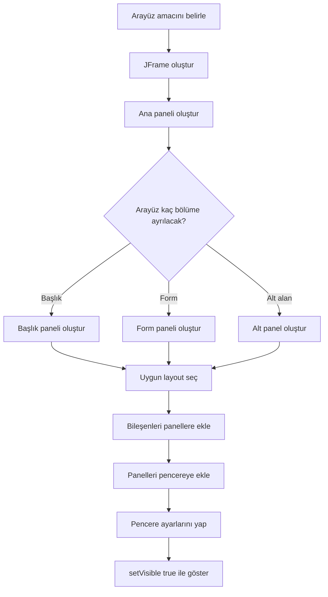

**Diyagram 19.1:** Swing arayüz tasarımı ve layout seçimi akışı.

**Görsel üretim notu:** Bu Mermaid diyagramı final DOCX/PDF üretiminden önce PNG’ye dönüştürülmeli; ham `flowchart TD` kodu final çıktıda görünmemelidir. Önerilen görsel genişliği 12–13 cm aralığında tutulmalıdır.

## 19.21 Adım adım kod örnekleri

Bu bölümde Swing arayüzü oluşturmaya temel pencereden düzenli forma doğru ilerleyen örneklerle başlanacaktır.

### Kod 19.1: En küçük çalışan Swing penceresi

**Kod kimliği:** `b19_kod01_en_kucuk_calisan_swing_penceresi`

**Kod erişimi:** [Kod sayfası](https://github.com/bmdersleri/javaninTemelleri/tree/main/kodlar/bolum19/kod01/) | [Kaynak kod](https://github.com/bmdersleri/javaninTemelleri/blob/main/kodlar/bolum19/kod01/Bolum19Ornek01IlkPencere.java) | 

**QR erişimi:** Kod sayfası ve kaynak kod için aşağıdaki iki QR kod kullanılabilir.

{width=2.8cm} {width=2.8cm}


```java
// Dosya: Bolum19Ornek01IlkPencere.java
import javax.swing.JFrame;

public class Bolum19Ornek01IlkPencere {
    public static void main(String[] args) {
        JFrame pencere = new JFrame("İlk Swing Pencerem");

        pencere.setSize(400, 200);
        pencere.setDefaultCloseOperation(JFrame.EXIT_ON_CLOSE);
        pencere.setLocationRelativeTo(null);
        pencere.setVisible(true);
    }
}
```

**Kodun amacı:** En küçük çalışan Swing penceresini oluşturmak.

**Beklenen ekran davranışı:** Ekranda “İlk Swing Pencerem” başlıklı 400x200 boyutlarında bir pencere görünür. Pencere kapatıldığında program sonlanır.

**Dikkat noktası:** `setVisible(true)` çağrısı yapılmazsa pencere oluşturulsa bile ekranda görünmez.

### Kod 19.2: `JPanel` ve `JLabel` ile düzenli pencere

**Kod kimliği:** `b19_kod02_ve_ile_duzenli_pencere`

**Kod erişimi:** [Kod sayfası](https://github.com/bmdersleri/javaninTemelleri/tree/main/kodlar/bolum19/kod02/) | [Kaynak kod](https://github.com/bmdersleri/javaninTemelleri/blob/main/kodlar/bolum19/kod02/Bolum19Ornek02PanelEtiket.java) | 

**QR erişimi:** Kod sayfası ve kaynak kod için aşağıdaki iki QR kod kullanılabilir.

{width=2.8cm} {width=2.8cm}


```java
// Dosya: Bolum19Ornek02PanelEtiket.java
import javax.swing.BorderFactory;
import javax.swing.JFrame;
import javax.swing.JLabel;
import javax.swing.JPanel;
import java.awt.FlowLayout;

public class Bolum19Ornek02PanelEtiket {
    public static void main(String[] args) {
        JFrame pencere = new JFrame("Panel ve Etiket");

        JPanel panel = new JPanel(new FlowLayout(FlowLayout.LEFT));
        panel.setBorder(BorderFactory.createEmptyBorder(10, 10, 10, 10));

        JLabel baslik = new JLabel("Java Swing'e Hoş Geldiniz");
        JLabel aciklama = new JLabel("Bu pencere JPanel ve JLabel kullanır.");

        panel.add(baslik);
        panel.add(aciklama);

        pencere.add(panel);
        pencere.setSize(450, 180);
        pencere.setDefaultCloseOperation(JFrame.EXIT_ON_CLOSE);
        pencere.setLocationRelativeTo(null);
        pencere.setVisible(true);
    }
}
```

**Kodun amacı:** Bileşenleri önce panel içine, ardından pencereye eklemek.

**Beklenen ekran davranışı:** Pencere içinde iki metin etiketi görünür. Panelin kenarlarında boşluk vardır.

**Dikkat noktası:** `JLabel` bileşenleri doğrudan pencereye değil, önce `JPanel` içine eklenmiştir.

### Kod 19.3: `FlowLayout` ile basit satır düzeni

**Kod kimliği:** `b19_kod03_ile_basit_satir_duzeni`

**Kod erişimi:** [Kod sayfası](https://github.com/bmdersleri/javaninTemelleri/tree/main/kodlar/bolum19/kod03/) | [Kaynak kod](https://github.com/bmdersleri/javaninTemelleri/blob/main/kodlar/bolum19/kod03/Bolum19Ornek03FlowLayout.java) | 

**QR erişimi:** Kod sayfası ve kaynak kod için aşağıdaki iki QR kod kullanılabilir.

{width=2.8cm} {width=2.8cm}


```java
// Dosya: Bolum19Ornek03FlowLayout.java
import javax.swing.JFrame;
import javax.swing.JLabel;
import javax.swing.JPanel;
import java.awt.FlowLayout;

public class Bolum19Ornek03FlowLayout {
    public static void main(String[] args) {
        JFrame pencere = new JFrame("FlowLayout Örneği");

        JPanel panel = new JPanel(new FlowLayout(FlowLayout.LEFT, 12, 8));

        panel.add(new JLabel("Ad"));
        panel.add(new JLabel("Soyad"));
        panel.add(new JLabel("Not"));

        pencere.add(panel);
        pencere.setSize(400, 160);
        pencere.setDefaultCloseOperation(JFrame.EXIT_ON_CLOSE);
        pencere.setLocationRelativeTo(null);
        pencere.setVisible(true);
    }
}
```

**Kodun amacı:** `FlowLayout` ile bileşenleri sıralı biçimde yerleştirmek.

**Beklenen ekran davranışı:** Etiketler soldan sağa doğru aralarında boşluk bırakılarak görünür.

### Kod 19.4: `BorderLayout` ile pencere bölümlendirme

**Kod kimliği:** `b19_kod04_ile_pencere_bolumlendirme`

**Kod erişimi:** [Kod sayfası](https://github.com/bmdersleri/javaninTemelleri/tree/main/kodlar/bolum19/kod04/) | [Kaynak kod](https://github.com/bmdersleri/javaninTemelleri/blob/main/kodlar/bolum19/kod04/Bolum19Ornek04BorderLayout.java) | 

**QR erişimi:** Kod sayfası ve kaynak kod için aşağıdaki iki QR kod kullanılabilir.

{width=2.8cm} {width=2.8cm}


```java
// Dosya: Bolum19Ornek04BorderLayout.java
import javax.swing.JFrame;
import javax.swing.JLabel;
import javax.swing.JPanel;
import java.awt.BorderLayout;
import java.awt.FlowLayout;

public class Bolum19Ornek04BorderLayout {
    public static void main(String[] args) {
        JFrame pencere = new JFrame("BorderLayout Örneği");

        JPanel anaPanel = new JPanel(new BorderLayout());

        JPanel ustPanel = new JPanel(new FlowLayout(FlowLayout.CENTER));
        ustPanel.add(new JLabel("Öğrenci Bilgi Ekranı"));

        JPanel ortaPanel = new JPanel(new FlowLayout(FlowLayout.LEFT));
        ortaPanel.add(new JLabel("Form alanı burada yer alacak."));

        JPanel altPanel = new JPanel(new FlowLayout(FlowLayout.RIGHT));
        altPanel.add(new JLabel("Durum: Hazır"));

        anaPanel.add(ustPanel, BorderLayout.NORTH);
        anaPanel.add(ortaPanel, BorderLayout.CENTER);
        anaPanel.add(altPanel, BorderLayout.SOUTH);

        pencere.add(anaPanel);
        pencere.setSize(500, 250);
        pencere.setDefaultCloseOperation(JFrame.EXIT_ON_CLOSE);
        pencere.setLocationRelativeTo(null);
        pencere.setVisible(true);
    }
}
```

**Kodun amacı:** Ana pencereyi başlık, orta alan ve alt durum alanı olarak bölümlendirmek.

**Beklenen ekran davranışı:** Üstte başlık, ortada açıklama, altta durum bilgisi görünür.

### Kod 19.5: `GridLayout` ile form düzeni

**Kod kimliği:** `b19_kod05_ile_form_duzeni`

**Kod erişimi:** [Kod sayfası](https://github.com/bmdersleri/javaninTemelleri/tree/main/kodlar/bolum19/kod05/) | [Kaynak kod](https://github.com/bmdersleri/javaninTemelleri/blob/main/kodlar/bolum19/kod05/Bolum19Ornek05GridLayoutForm.java) | 

**QR erişimi:** Kod sayfası ve kaynak kod için aşağıdaki iki QR kod kullanılabilir.

{width=2.8cm} {width=2.8cm}


```java
// Dosya: Bolum19Ornek05GridLayoutForm.java
import javax.swing.BorderFactory;
import javax.swing.JFrame;
import javax.swing.JLabel;
import javax.swing.JPanel;
import java.awt.GridLayout;

public class Bolum19Ornek05GridLayoutForm {
    public static void main(String[] args) {
        JFrame pencere = new JFrame("GridLayout Form");

        JPanel formPanel = new JPanel(new GridLayout(5, 2, 8, 8));
        formPanel.setBorder(BorderFactory.createEmptyBorder(12, 12, 12, 12));

        formPanel.add(new JLabel("Öğrenci No:"));
        formPanel.add(new JLabel("1001"));

        formPanel.add(new JLabel("Ad:"));
        formPanel.add(new JLabel("Ayşe"));

        formPanel.add(new JLabel("Soyad:"));
        formPanel.add(new JLabel("Yılmaz"));

        formPanel.add(new JLabel("Not:"));
        formPanel.add(new JLabel("85"));

        formPanel.add(new JLabel("Durum:"));
        formPanel.add(new JLabel("Geçti"));

        pencere.add(formPanel);
        pencere.setSize(420, 240);
        pencere.setDefaultCloseOperation(JFrame.EXIT_ON_CLOSE);
        pencere.setLocationRelativeTo(null);
        pencere.setVisible(true);
    }
}
```

**Kodun amacı:** Form alanlarını satır-sütun düzeniyle göstermek.

**Beklenen ekran davranışı:** Sol sütunda alan adları, sağ sütunda alan değerleri görünür.

### Kod 19.6: Hatalı ve düzeltilmiş `setVisible` örneği

Hatalı örnek:

**Kod kimliği:** `b19_kod06_hatali_ve_duzeltilmis_ornegi`

**Kod erişimi:** [Kod sayfası](https://github.com/bmdersleri/javaninTemelleri/tree/main/kodlar/bolum19/kod06/) | [Kaynak kod](https://github.com/bmdersleri/javaninTemelleri/blob/main/kodlar/bolum19/kod06/Bolum19Ornek06GorunurlukHatasi.java) | 

**QR erişimi:** Kod sayfası ve kaynak kod için aşağıdaki iki QR kod kullanılabilir.

{width=2.8cm} {width=2.8cm}


```java
// Dosya: Bolum19Ornek06GorunurlukHatasi.java
import javax.swing.JFrame;

public class Bolum19Ornek06GorunurlukHatasi {
    public static void main(String[] args) {
        JFrame pencere = new JFrame("Görünmeyen Pencere");

        pencere.setSize(400, 200);
        pencere.setDefaultCloseOperation(JFrame.EXIT_ON_CLOSE);
    }
}
```

Bu kod pencere nesnesini oluşturur; ancak pencere ekranda görünmez. Çünkü `setVisible(true)` çağrılmamıştır.

Düzeltilmiş kod:

**Kod kimliği:** `b19_kod06_hatali_ve_duzeltilmis_ornegi_2`

**Kod erişimi:** [Kod sayfası](https://github.com/bmdersleri/javaninTemelleri/tree/main/kodlar/bolum19/kod06_2/) | [Kaynak kod](https://github.com/bmdersleri/javaninTemelleri/blob/main/kodlar/bolum19/kod06_2/Bolum19Ornek06GorunurlukHatasi.java) | 

**QR erişimi:** Kod sayfası ve kaynak kod için aşağıdaki iki QR kod kullanılabilir.

{width=2.8cm} {width=2.8cm}


```java
// Dosya: Bolum19Ornek06GorunurlukHatasi.java
import javax.swing.JFrame;

public class Bolum19Ornek06GorunurlukHatasi {
    public static void main(String[] args) {
        JFrame pencere = new JFrame("Görünen Pencere");

        pencere.setSize(400, 200);
        pencere.setDefaultCloseOperation(JFrame.EXIT_ON_CLOSE);
        pencere.setVisible(true);
    }
}
```

**Dikkat noktası:** GUI programlarında pencere ayarları yapılsa bile görünürlük ayrıca etkinleştirilmelidir.

### Kod 19.7: Hatalı ve düzeltilmiş `BorderLayout` örneği

Hatalı örnek:

**Kod kimliği:** `b19_kod07_hatali_ve_duzeltilmis_ornegi`

**Kod erişimi:** [Kod sayfası](https://github.com/bmdersleri/javaninTemelleri/tree/main/kodlar/bolum19/kod07/) | [Kaynak kod](https://github.com/bmdersleri/javaninTemelleri/blob/main/kodlar/bolum19/kod07/Bolum19Ornek07BorderLayoutHatasi.java) | 

**QR erişimi:** Kod sayfası ve kaynak kod için aşağıdaki iki QR kod kullanılabilir.

{width=2.8cm} {width=2.8cm}


```java
// Dosya: Bolum19Ornek07BorderLayoutHatasi.java
import javax.swing.JFrame;
import javax.swing.JLabel;
import java.awt.BorderLayout;

public class Bolum19Ornek07BorderLayoutHatasi {
    public static void main(String[] args) {
        JFrame pencere = new JFrame("BorderLayout Hatası");
        pencere.setLayout(new BorderLayout());

        pencere.add(new JLabel("Birinci üst bilgi"), BorderLayout.NORTH);
        pencere.add(new JLabel("İkinci üst bilgi"), BorderLayout.NORTH);

        pencere.setSize(400, 200);
        pencere.setDefaultCloseOperation(JFrame.EXIT_ON_CLOSE);
        pencere.setVisible(true);
    }
}
```

Bu örnekte iki bileşen aynı `BorderLayout.NORTH` bölgesine eklenmiştir. Beklenen düzen oluşmayabilir.

Daha doğru yaklaşım:

**Kod kimliği:** `b19_kod07_hatali_ve_duzeltilmis_ornegi_2`

**Kod erişimi:** [Kod sayfası](https://github.com/bmdersleri/javaninTemelleri/tree/main/kodlar/bolum19/kod07_2/) | [Kaynak kod](https://github.com/bmdersleri/javaninTemelleri/blob/main/kodlar/bolum19/kod07_2/Bolum19Ornek07BorderLayoutHatasi.java) | 

**QR erişimi:** Kod sayfası ve kaynak kod için aşağıdaki iki QR kod kullanılabilir.

{width=2.8cm} {width=2.8cm}


```java
// Dosya: Bolum19Ornek07BorderLayoutHatasi.java
import javax.swing.JFrame;
import javax.swing.JLabel;
import javax.swing.JPanel;
import java.awt.BorderLayout;
import java.awt.FlowLayout;

public class Bolum19Ornek07BorderLayoutHatasi {
    public static void main(String[] args) {
        JFrame pencere = new JFrame("BorderLayout Düzeltilmiş");

        JPanel ustPanel = new JPanel(new FlowLayout());
        ustPanel.add(new JLabel("Birinci üst bilgi"));
        ustPanel.add(new JLabel("İkinci üst bilgi"));

        pencere.add(ustPanel, BorderLayout.NORTH);

        pencere.setSize(450, 200);
        pencere.setDefaultCloseOperation(JFrame.EXIT_ON_CLOSE);
        pencere.setVisible(true);
    }
}
```

**Dikkat noktası:** Aynı bölgeye birden çok bileşen yerleştirilecekse önce bu bileşenler bir panel içinde gruplanmalıdır.

## 19.22 Kodun çalışma mantığı ve beklenen davranış

Swing programlarında beklenen davranış, konsol çıktısı yerine ekranda görülen pencere üzerinden tanımlanır. Örneğin:

```java
JFrame pencere = new JFrame("İlk Pencere");
pencere.setSize(400, 200);
pencere.setVisible(true);
```

Bu kod için beklenen davranış şudur:

```text
Ekranda 400x200 boyutlarında, başlığı “İlk Pencere” olan bir pencere görünür.
```

Layout kullanılan bir programda ise bileşenlerin doğru bölgelerde görünmesi beklenir.

| Kod parçası | Beklenen davranış |
|---|---|
| `BorderLayout.NORTH` | Bileşen üst bölgede görünür |
| `BorderLayout.CENTER` | Bileşen orta bölgede görünür |
| `GridLayout(5, 2)` | Bileşenler 5 satır 2 sütun düzeninde görünür |
| `FlowLayout.LEFT` | Bileşenler sola hizalanır |
| `setBorder(...)` | Panel kenarlarında boşluk oluşur |

> **💡 İpucu:** GUI programlarını test ederken yalnızca “program çalıştı mı?” sorusunu değil, “bileşenler beklenen yerde ve okunabilir biçimde görünüyor mu?” sorusunu da sorun.

## 19.23 Uçtan uca mini uygulama: Düzenli Öğrenci Formu

Bu bölümün mini uygulaması, `JFrame`, `JPanel`, `JLabel`, `BorderLayout`, `FlowLayout`, `GridLayout`, padding ve hizalama konularını bir araya getirir.

**Uygulama adı:** Düzenli Öğrenci Formu

**Dosya adı:** `DuzenliOgrenciFormu.java`

**Amaç:** Öğrenci bilgilerini düzenli bir Swing penceresinde göstermek; başlık, form ve alt açıklama alanlarını panel yapısıyla ayırmak.

**Kod kimliği:** `b19_kod28_duzenli_ogrenci_formu`

**Kod erişimi:** [Kod sayfası](https://github.com/bmdersleri/javaninTemelleri/tree/main/kodlar/bolum19/kod28/) | [Kaynak kod](https://github.com/bmdersleri/javaninTemelleri/blob/main/kodlar/bolum19/kod28/DuzenliOgrenciFormu.java) | 

**QR erişimi:** Kod sayfası ve kaynak kod için aşağıdaki iki QR kod kullanılabilir.

{width=2.8cm} {width=2.8cm}


```java
// Dosya: DuzenliOgrenciFormu.java
import javax.swing.BorderFactory;
import javax.swing.JFrame;
import javax.swing.JLabel;
import javax.swing.JPanel;
import java.awt.BorderLayout;
import java.awt.FlowLayout;
import java.awt.GridLayout;

public class DuzenliOgrenciFormu {
    public static void main(String[] args) {
        JFrame pencere = new JFrame("Düzenli Öğrenci Formu");

        JPanel anaPanel = panelOlustur();
        JPanel baslikPanel = baslikPaneliOlustur();
        JPanel formPanel = formPaneliOlustur();
        JPanel altPanel = altPanelOlustur();

        anaPanel.add(baslikPanel, BorderLayout.NORTH);
        anaPanel.add(formPanel, BorderLayout.CENTER);
        anaPanel.add(altPanel, BorderLayout.SOUTH);

        pencere.add(anaPanel);
        pencere.setSize(500, 300);
        pencere.setDefaultCloseOperation(JFrame.EXIT_ON_CLOSE);
        pencere.setLocationRelativeTo(null);
        pencere.setVisible(true);
    }

    static JPanel panelOlustur() {
        JPanel panel = new JPanel(new BorderLayout(8, 8));
        panel.setBorder(BorderFactory.createEmptyBorder(12, 12, 12, 12));
        return panel;
    }

    static JPanel baslikPaneliOlustur() {
        JPanel panel = new JPanel(new FlowLayout(FlowLayout.CENTER));
        panel.add(new JLabel("Öğrenci Bilgi Formu"));
        return panel;
    }

    static JPanel formPaneliOlustur() {
        JPanel panel = new JPanel(new GridLayout(5, 2, 8, 8));

        panel.add(new JLabel("Öğrenci No:"));
        panel.add(new JLabel("1001"));

        panel.add(new JLabel("Ad:"));
        panel.add(new JLabel("Ayşe"));

        panel.add(new JLabel("Soyad:"));
        panel.add(new JLabel("Yılmaz"));

        panel.add(new JLabel("Not:"));
        panel.add(new JLabel("85"));

        panel.add(new JLabel("Durum:"));
        panel.add(new JLabel("Geçti"));

        return panel;
    }

    static JPanel altPanelOlustur() {
        JPanel panel = new JPanel(new FlowLayout(FlowLayout.RIGHT));
        panel.add(new JLabel("Bu form yalnızca arayüz düzeni örneğidir."));
        return panel;
    }
}
```

### 19.23.1 Mini uygulamanın özellikleri

Bu uygulama şu özellikleri içerir:

1. Ana pencere `JFrame` ile oluşturulur.
2. Ana panel `BorderLayout` kullanır.
3. Başlık paneli üst bölgede yer alır.
4. Form paneli orta bölgede yer alır.
5. Form panelinde `GridLayout(5, 2)` kullanılır.
6. Alt açıklama paneli alt bölgede yer alır.
7. Panel kenarlarında padding kullanılır.
8. Form değerleri `JLabel` bileşenleriyle gösterilir.
9. Kod metotlara ayrılarak okunabilirlik artırılır.

### 19.23.2 Beklenen ekran davranışı

Program çalıştırıldığında:

1. “Düzenli Öğrenci Formu” başlıklı pencere açılır.
2. Üstte “Öğrenci Bilgi Formu” başlığı görünür.
3. Ortada öğrenci no, ad, soyad, not ve durum bilgileri düzenli satırlar hâlinde görünür.
4. Altta açıklama metni sağa yakın konumda görünür.
5. Pencere kapatıldığında program sonlanır.

### 19.23.3 Mini uygulama test senaryoları

| Test | Beklenen davranış |
|---:|---|
| 1 | Pencere görünür |
| 2 | Pencere başlığı doğru görünür |
| 3 | Üst başlık paneli görünür |
| 4 | Form alanları 5 satır 2 sütun düzenindedir |
| 5 | Form kenarlarında boşluk vardır |
| 6 | Alt açıklama alanı görünür |
| 7 | Pencere kapatıldığında program sonlanır |
| 8 | Bileşenler birbirine yapışık değildir |

> **Alıştırma Molası:** Mini uygulamaya “Ders”, “Devamsızlık” ve “Ortalama” alanlarını ekleyiniz. `GridLayout` satır sayısını yeni alan sayısına göre güncellemeyi unutmayınız.

## 19.24 Sık yapılan hatalar ve yanlış sezgiler

### 19.24.1 `setVisible(true)` çağrısını unutmak

Yanlış kullanım:

```java
JFrame pencere = new JFrame("Pencere");
pencere.setSize(400, 200);
```

Düzeltme:

```java
pencere.setVisible(true);
```

### 19.24.2 Bileşeni container içine eklememek

Bir `JLabel` oluşturmak, onun otomatik görünmesi anlamına gelmez.

Yanlış eksik kullanım:

```java
JLabel etiket = new JLabel("Merhaba");
```

Doğru kullanım:

```java
panel.add(etiket);
```

### 19.24.3 Kapanış davranışını ayarlamamak

Pencere kapatılsa bile program arka planda çalışmaya devam edebilir. Bu nedenle başlangıç düzeyinde şu ayar yapılmalıdır:

```java
pencere.setDefaultCloseOperation(JFrame.EXIT_ON_CLOSE);
```

### 19.24.4 Aynı `BorderLayout` bölgesine birden fazla bileşen eklemek

Aynı bölgeye birden fazla bileşen eklenecekse önce bir panel oluşturulmalıdır.

```java
JPanel ustPanel = new JPanel(new FlowLayout());
ustPanel.add(new JLabel("Başlık"));
ustPanel.add(new JLabel("Açıklama"));

pencere.add(ustPanel, BorderLayout.NORTH);
```

### 19.24.5 `GridLayout` satır-sütun sayısını güncellememek

Forma yeni alan eklendiğinde `GridLayout` satır sayısı da güncellenmelidir.

```java
new GridLayout(6, 2)
```

6 satırlı bir form için kullanılabilir.

### 19.24.6 Padding kullanmamak

Bileşenler pencere kenarına yapışık görünüyorsa padding eklenmelidir.

```java
panel.setBorder(BorderFactory.createEmptyBorder(10, 10, 10, 10));
```

### 19.24.7 Olay yönetimini bu bölümde beklemek

Bu bölümde pencere ve layout tasarımı ele alınır. Buton tıklama, metin kutusundan veri okuma ve form doğrulama sonraki bölümde işlenecektir.

> **💡 İpucu:** GUI hatalarında sırasıyla şunları kontrol edin: Pencere görünür mü? Bileşenler container içine eklendi mi? Doğru layout kullanıldı mı? Pencere kapatma davranışı ayarlandı mı?

## 19.25 Hata ayıklama egzersizi

Aşağıdaki kodun `GuiHatasi.java` adlı dosyaya kaydedildiğini düşünelim.

**Kod kimliği:** `b19_kod37_hata_ayiklama_egzersizi`

**Kod erişimi:** [Kod sayfası](https://github.com/bmdersleri/javaninTemelleri/tree/main/kodlar/bolum19/kod37/) | [Kaynak kod](https://github.com/bmdersleri/javaninTemelleri/blob/main/kodlar/bolum19/kod37/GuiHatasi.java) | 

**QR erişimi:** Kod sayfası ve kaynak kod için aşağıdaki iki QR kod kullanılabilir.

{width=2.8cm} {width=2.8cm}


```java
// Dosya: GuiHatasi.java
import javax.swing.JFrame;
import javax.swing.JLabel;

public class GuiHatasi {
    public static void main(String[] args) {
        JFrame pencere = new JFrame("GUI Hatası");

        JLabel etiket = new JLabel("Merhaba Swing");

        pencere.setSize(400, 200);
        pencere.setDefaultCloseOperation(JFrame.EXIT_ON_CLOSE);
    }
}
```

Bu kodda iki temel sorun vardır:

1. `etiket` oluşturulmuştur; ancak pencereye veya panele eklenmemiştir.
2. `setVisible(true)` çağrılmadığı için pencere görünmez.

Düzeltilmiş kod:

**Kod kimliği:** `b19_kod38_hata_ayiklama_egzersizi`

**Kod erişimi:** [Kod sayfası](https://github.com/bmdersleri/javaninTemelleri/tree/main/kodlar/bolum19/kod38/) | [Kaynak kod](https://github.com/bmdersleri/javaninTemelleri/blob/main/kodlar/bolum19/kod38/GuiHatasi.java) | 

**QR erişimi:** Kod sayfası ve kaynak kod için aşağıdaki iki QR kod kullanılabilir.

{width=2.8cm} {width=2.8cm}


```java
// Dosya: GuiHatasi.java
import javax.swing.JFrame;
import javax.swing.JLabel;

public class GuiHatasi {
    public static void main(String[] args) {
        JFrame pencere = new JFrame("GUI Hatası Düzeltildi");

        JLabel etiket = new JLabel("Merhaba Swing");

        pencere.add(etiket);
        pencere.setSize(400, 200);
        pencere.setDefaultCloseOperation(JFrame.EXIT_ON_CLOSE);
        pencere.setVisible(true);
    }
}
```

**Beklenen ekran davranışı:** Pencere görünür ve içinde “Merhaba Swing” etiketi yer alır.

**Kendinize sorunuz:**

1. `JLabel` oluşturmak neden tek başına yeterli değildir?
2. Etiket hangi container içine eklenmelidir?
3. `setVisible(true)` ne işe yarar?
4. Pencere kapatma davranışı neden ayarlanmalıdır?

## 19.26 Ek hata ayıklama egzersizi: Layout hatası

Aşağıdaki kodu inceleyiniz.

**Kod kimliği:** `b19_kod39_layout_hatasi`

**Kod erişimi:** [Kod sayfası](https://github.com/bmdersleri/javaninTemelleri/tree/main/kodlar/bolum19/kod39/) | [Kaynak kod](https://github.com/bmdersleri/javaninTemelleri/blob/main/kodlar/bolum19/kod39/LayoutHatasi.java) | 

**QR erişimi:** Kod sayfası ve kaynak kod için aşağıdaki iki QR kod kullanılabilir.

{width=2.8cm} {width=2.8cm}


```java
// Dosya: LayoutHatasi.java
import javax.swing.JFrame;
import javax.swing.JLabel;
import java.awt.BorderLayout;

public class LayoutHatasi {
    public static void main(String[] args) {
        JFrame pencere = new JFrame("Layout Hatası");
        pencere.setLayout(new BorderLayout());

        pencere.add(new JLabel("Başlık 1"), BorderLayout.NORTH);
        pencere.add(new JLabel("Başlık 2"), BorderLayout.NORTH);

        pencere.setSize(400, 200);
        pencere.setDefaultCloseOperation(JFrame.EXIT_ON_CLOSE);
        pencere.setVisible(true);
    }
}
```

**Sorun:** Aynı `BorderLayout.NORTH` bölgesine iki bileşen eklenmiştir.

Düzeltilmiş yaklaşım:

**Kod kimliği:** `b19_kod40_layout_hatasi`

**Kod erişimi:** [Kod sayfası](https://github.com/bmdersleri/javaninTemelleri/tree/main/kodlar/bolum19/kod40/) | [Kaynak kod](https://github.com/bmdersleri/javaninTemelleri/blob/main/kodlar/bolum19/kod40/LayoutHatasi.java) | 

**QR erişimi:** Kod sayfası ve kaynak kod için aşağıdaki iki QR kod kullanılabilir.

{width=2.8cm} {width=2.8cm}


```java
// Dosya: LayoutHatasi.java
import javax.swing.JFrame;
import javax.swing.JLabel;
import javax.swing.JPanel;
import java.awt.BorderLayout;
import java.awt.FlowLayout;

public class LayoutHatasi {
    public static void main(String[] args) {
        JFrame pencere = new JFrame("Layout Hatası Düzeltildi");
        pencere.setLayout(new BorderLayout());

        JPanel ustPanel = new JPanel(new FlowLayout());
        ustPanel.add(new JLabel("Başlık 1"));
        ustPanel.add(new JLabel("Başlık 2"));

        pencere.add(ustPanel, BorderLayout.NORTH);

        pencere.setSize(450, 200);
        pencere.setDefaultCloseOperation(JFrame.EXIT_ON_CLOSE);
        pencere.setVisible(true);
    }
}
```

**Kendinize sorunuz:**

1. `BorderLayout` kaç ana bölgeden oluşur?
2. Aynı bölgeye birden fazla bileşen eklenmesi neden sorun oluşturabilir?
3. `JPanel` bu sorunu nasıl çözer?
4. Bu örnekte `FlowLayout` neden kullanılmıştır?

## 19.27 Bölümün sonraki bölümlerle ilişkisi

Bu bölümde GUI programlamaya giriş yapıldı. `JFrame`, `JPanel`, `JLabel`, component-container ilişkisi, event-driven düşünceye giriş ve temel layout manager yapıları ele alındı. Ayrıca `FlowLayout`, `BorderLayout` ve `GridLayout` kullanılarak düzenli bir öğrenci formu tasarlandı.

Bir sonraki bölümde temel Swing bileşenleri, olay yönetimi ve form doğrulama işlenecektir. Bu bölümde görsel olarak oluşturduğumuz form yapısı, sonraki bölümde `JTextField`, `JButton` ve `ActionListener` ile etkileşimli hâle getirilecektir.

## 19.28 Bölüm özeti

Bu bölümde Java ile grafiksel kullanıcı arayüzü geliştirmeye giriş yapıldı. Öncelikle GUI kavramı ve konsol programlarından farkı açıklandı. GUI programlarında kullanıcının pencereler ve bileşenler üzerinden programla etkileşime girdiği belirtildi.

Swing’in Java masaüstü arayüzleri geliştirmek için kullanılan bir kütüphane olduğu açıklandı. `JFrame` ana pencere, `JPanel` bileşenleri gruplama alanı, `JLabel` ise metin gösteren bileşen olarak ele alındı.

Component ve container ilişkisi üzerinden GUI yapılarının ağaç benzeri bir düzenle kurulabileceği gösterildi. GUI programlarının olay odaklı çalıştığı, ancak olay yönetimi ayrıntılarının sonraki bölümde işleneceği vurgulandı.

Bölümün ikinci kısmında layout manager kavramı işlendi. Elle konumlandırma yerine layout kullanmanın daha düzenli ve esnek olduğu açıklandı. `FlowLayout`, `BorderLayout` ve `GridLayout` örneklerle gösterildi.

`JPanel` ile arayüzü başlık, form ve alt alan gibi bölümlere ayırma yaklaşımı ele alındı. Padding ve hizalamanın arayüz okunabilirliğini artırdığı gösterildi.

Son olarak Düzenli Öğrenci Formu mini uygulamasıyla `JFrame`, `JPanel`, `JLabel`, `BorderLayout`, `FlowLayout`, `GridLayout`, padding ve metotlara ayrılmış arayüz kurma yaklaşımı tek bir uygulamada birleştirildi.

## 19.29 Terim sözlüğü

| Terim | Açıklama |
|---|---|
| GUI | Grafiksel kullanıcı arayüzü |
| Swing | Java masaüstü GUI kütüphanesi |
| `JFrame` | Ana pencere sınıfı |
| `JPanel` | Bileşenleri gruplamak için kullanılan panel |
| `JLabel` | Metin gösteren Swing bileşeni |
| Component | Arayüzde yer alan bileşen |
| Container | Başka bileşenleri içinde tutan yapı |
| Event-driven | Kullanıcı olaylarına göre çalışan program yaklaşımı |
| Layout manager | Bileşenlerin yerleşimini yöneten yapı |
| `FlowLayout` | Bileşenleri akış düzeninde yerleştiren layout |
| `BorderLayout` | Container alanını beş bölgeye ayıran layout |
| `GridLayout` | Bileşenleri satır ve sütun düzeninde yerleştiren layout |
| Padding | İç kenar boşluğu |
| Hizalama | Bileşenlerin görsel konum düzeni |
| Form | Kullanıcıya bilgi gösteren veya kullanıcıdan bilgi alan düzenli arayüz |

## 19.30 Kendini değerlendirme soruları

### 19.30.1 Çoktan seçmeli sorular

1. Swing’de ana pencereyi temsil eden sınıf hangisidir?

A) `JFrame`  
B) `JLabel`  
C) `JPanel`  
D) `Scanner`  
E) `String`

2. Metin göstermek için kullanılan Swing bileşeni hangisidir?

A) `JLabel`  
B) `JFrame`  
C) `BorderLayout`  
D) `GridLayout`  
E) `System.out`

3. Bileşenleri gruplamak için kullanılan yapı hangisidir?

A) `JPanel`  
B) `int`  
C) `Math`  
D) `Random`  
E) `Period`

4. Pencerenin görünür olması için hangi metot çağrılmalıdır?

A) `setVisible(true)`  
B) `setSize(false)`  
C) `close()`  
D) `print()`  
E) `nextLine()`

5. Bileşenleri soldan sağa yerleştiren layout hangisidir?

A) `FlowLayout`  
B) `GridLayout`  
C) `BorderLayout`  
D) `Scanner`  
E) `HashMap`

6. Pencereyi `NORTH`, `SOUTH`, `EAST`, `WEST`, `CENTER` bölgelerine ayıran layout hangisidir?

A) `BorderLayout`  
B) `FlowLayout`  
C) `GridLayout`  
D) `JLabel`  
E) `String`

7. Form alanlarını satır-sütun düzeninde göstermek için hangi layout uygundur?

A) `GridLayout`  
B) `FlowLayout`  
C) `JFrame`  
D) `JLabel`  
E) `System.in`

8. Panel kenarlarında boşluk oluşturmak için hangi yaklaşım kullanılabilir?

A) `BorderFactory.createEmptyBorder(...)`  
B) `Math.sqrt()`  
C) `Random.nextInt()`  
D) `LocalDate.now()`  
E) `Integer.parseInt()`

### 19.30.2 Doğru/Yanlış soruları

1. GUI, grafiksel kullanıcı arayüzü anlamına gelir. (D/Y)
2. `JFrame` ana pencereyi temsil eder. (D/Y)
3. `JLabel` kullanıcıdan metin almak için kullanılır. (D/Y)
4. `JPanel` bileşenleri gruplamak için kullanılabilir. (D/Y)
5. `setVisible(true)` çağrılmadan pencere görünmeyebilir. (D/Y)
6. `FlowLayout` bileşenleri satır akışı şeklinde yerleştirir. (D/Y)
7. `BorderLayout` beş ana bölgeden oluşur. (D/Y)
8. `GridLayout` form düzenlerinde kullanılabilir. (D/Y)
9. Padding arayüz okunabilirliğini artırabilir. (D/Y)
10. Buton tıklama olayları bu bölümün ana konusudur. (D/Y)

### 19.30.3 Açık uçlu kavramsal sorular

1. GUI ile konsol programı arasındaki farkları açıklayınız.
2. Swing nedir?
3. `JFrame`, `JPanel` ve `JLabel` rollerini karşılaştırınız.
4. Component ve container ilişkisini açıklayınız.
5. Event-driven programming fikrini başlangıç düzeyinde açıklayınız.
6. Layout manager neden kullanılır?
7. `FlowLayout` hangi durumlarda uygundur?
8. `BorderLayout` bölgelerini yazınız.
9. `GridLayout` form tasarımında neden kullanışlıdır?
10. Padding ve hizalama arayüz okunabilirliğini nasıl etkiler?
11. Bir form arayüzünü başlık, form ve alt panel olarak ayırmanın yararı nedir?
12. Düzenli Öğrenci Formu uygulamasında hangi layoutlar hangi görevleri üstlenmiştir?

### 19.30.4 Yanlış gerekçeyi bulma soruları

Aşağıdaki ifadelerdeki yanlış gerekçeyi bulunuz ve düzeltiniz.

1. “`JFrame` nesnesi oluşturulunca pencere otomatik görünür.”
2. “Bir `JLabel` oluşturmak onun ekranda görünmesi için yeterlidir.”
3. “`JPanel` yalnızca metin yazdırmak için kullanılır.”
4. “Layout kullanmak yerine tüm bileşenleri rastgele eklemek daha düzenlidir.”
5. “`BorderLayout` aynı bölgeye sınırsız sayıda bileşeni sorunsuz yerleştirir.”
6. “`GridLayout` yalnızca tek satırlı arayüzler için uygundur.”
7. “Padding arayüz tasarımında gereksizdir.”
8. “GUI programları her zaman konsol programlarıyla aynı satır akışında çalışır.”
9. “`FlowLayout` form alanlarını iki sütunlu düzenlemek için en uygun çözümdür.”
10. “Bu bölümde olay yönetimi ve form doğrulama tamamen işlenmiştir.”

## 19.31 Programlama alıştırmaları

### 19.31.1 Kolay düzey

1. `IlkPencere.java` adlı programda 400x200 boyutunda bir `JFrame` oluşturunuz.
2. Pencereye bir `JLabel` ekleyiniz.
3. `setVisible(true)` çağrısını kaldırıp sonucu gözlemleyiniz; sonra düzeltiniz.
4. `JPanel` içine iki farklı `JLabel` ekleyiniz.
5. Panel kenarlarına padding ekleyiniz.

### 19.31.2 Orta düzey

1. `FlowLayoutDeneme.java` programında üç etiketi sola hizalı olarak yerleştiriniz.
2. `BorderLayoutDeneme.java` programında üst, orta ve alt bölüme üç panel ekleyiniz.
3. `GridLayoutForm.java` programında öğrenci no, ad, soyad ve not alanlarını 4 satır 2 sütun olarak gösteriniz.
4. Aynı `BorderLayout.NORTH` bölgesine iki bileşen ekleyip sonucu gözlemleyiniz; sonra panel kullanarak düzeltiniz.
5. Form paneline yeni alan ekleyip `GridLayout` satır sayısını güncelleyiniz.

### 19.31.3 Zor düzey

1. `DuzenliOgrenciFormu.java` uygulamasını geliştiriniz.
2. Ana pencere için `JFrame` kullanınız.
3. Ana panelde `BorderLayout` kullanınız.
4. Başlık panelinde `FlowLayout` kullanınız.
5. Form panelinde `GridLayout` kullanınız.
6. Alt açıklama panelinde `FlowLayout.RIGHT` kullanınız.
7. Öğrenci no, ad, soyad, not, durum, ders ve ortalama alanlarını gösteriniz.
8. Panel kenarlarına padding ekleyiniz.
9. Arayüzü metotlara bölerek yazınız.
10. En az sekiz ekran davranışı test senaryosu hazırlayınız.

## 19.32 Haftalık laboratuvar / proje görevi

**Görev başlığı:** Düzenli Öğrenci Formu Laboratuvarı

**Amaç:** Bu laboratuvarın amacı, öğrencinin Swing ile temel pencere oluşturması, panel yapısını anlaması ve layout manager kullanarak düzenli bir form arayüzü tasarlamasıdır.

**Beklenen adımlar:**

1. `DuzenliOgrenciFormu.java` adlı dosyayı oluşturunuz.
2. `JFrame`, `JPanel`, `JLabel` ve gerekli layout sınıflarını import ediniz.
3. Ana pencereyi oluşturunuz.
4. Ana paneli `BorderLayout` ile oluşturunuz.
5. Başlık panelini `FlowLayout.CENTER` ile oluşturunuz.
6. Form panelini `GridLayout` ile oluşturunuz.
7. Alt açıklama panelini `FlowLayout.RIGHT` ile oluşturunuz.
8. Öğrenci bilgilerini `JLabel` bileşenleriyle gösteriniz.
9. Panel kenarlarına padding ekleyiniz.
10. Pencere boyutunu ve kapanış davranışını ayarlayınız.
11. `setVisible(true)` ile pencereyi gösteriniz.
12. Aynı `BorderLayout` bölgesine iki bileşen ekleme hatasını oluşturup panel ile düzeltiniz.
13. Kısa bir `README.md` dosyası hazırlayınız.

**Teslim edilecek dosyalar:**

1. `DuzenliOgrenciFormu.java`
2. `README.md`
3. Ekran görüntüsü veya beklenen ekran davranışı açıklaması
4. Hata ve çözüm notu

**README içeriği şu başlıkları içermelidir:**

1. Programın amacı
2. Kullanılan Swing bileşenleri
3. Kullanılan layoutlar
4. Panel yapısı
5. Beklenen ekran davranışı
6. Karşılaşılan hata ve çözümü
7. Geliştirme önerileri

## 19.33 Değerlendirme rubriği

| Ölçüt | Açıklama | Puan |
|---|---|---:|
| Temel Swing kullanımı | `JFrame`, `JPanel`, `JLabel` bileşenlerinin doğru kullanımı | 20 |
| Layout kullanımı | `FlowLayout`, `BorderLayout`, `GridLayout` yapılarının doğru uygulanması | 25 |
| Arayüz organizasyonu | Başlık, form ve alt panel ayrımının doğru yapılması | 20 |
| Görsel okunabilirlik | Padding, hizalama ve düzenli form görünümü | 10 |
| Kodun çalışması | Programın derlenebilir ve pencerenin görünür olması | 10 |
| Hata farkındalığı | `setVisible`, container ekleme ve BorderLayout bölge hatalarının açıklanması | 10 |
| Raporlama | README, ekran davranışı ve hata notunun yeterliliği | 5 |
| **Toplam** |  | **100** |

## 19.34 İleri okuma ve kaynaklar

Bu bölümde Swing ve layout yönetimi başlangıç düzeyinde ele alınmıştır. Daha ayrıntılı çalışma için aşağıdaki kaynak türleri incelenebilir:

1. **Java SE API dokümantasyonu:** `JFrame`, `JPanel`, `JLabel`, `FlowLayout`, `BorderLayout` ve `GridLayout` sınıflarının resmî davranışlarını incelemek için temel kaynaktır.
2. **Oracle Java Tutorials:** Swing bileşenleri ve layout manager konuları için örnek odaklı açıklamalar içerir.
3. **Ders içi ek notlar:** Pencere oluşturma, panel bölümlendirme, padding ve form düzeni için pekiştirme materyali olarak kullanılabilir.
4. **Dev.java öğrenme kaynakları:** Modern Java öğrenme akışı içinde GUI dışındaki temel standart kütüphane ve sınıf kullanımlarını tekrar etmek için yararlıdır.

> **💡 İpucu:** İleri kaynaklarda `JButton`, `JTextField`, `ActionListener`, `JList`, `JTable`, `JMenu`, `JDialog` ve daha gelişmiş Swing konularıyla karşılaşabilirsiniz. Bu bölümde yalnızca pencere ve layout temelleri hedeflenmiştir.

## 19.35 Bir sonraki bölüme köprü

Bu bölümde GUI programlamaya giriş yapıldı ve Swing arayüzlerinde pencere, panel, etiket ve layout yönetimi ele alındı. Bir sonraki bölümde bu arayüzler etkileşimli hâle getirilecektir. `JButton`, `JTextField`, `JComboBox`, `JCheckBox`, `ActionListener` ve form doğrulama konuları işlenerek kullanıcının girdiği veriler arayüz üzerinden yönetilecektir.

**BÖLÜM SONU**


\newpage


# Bölüm 20: Temel Swing Bileşenleri, Olay Yönetimi ve Form Doğrulama

## 20.1 Bölümün yol haritası

Önceki bölümde Swing ile temel pencere oluşturma, `JFrame`, `JPanel`, `JLabel` ve layout yönetimi ele alındı. Arayüzün başlık, form ve alt alan gibi bölümlere ayrılması; `FlowLayout`, `BorderLayout` ve `GridLayout` ile düzenli form tasarlama konuları işlendi. Bu bölümde aynı arayüz artık etkileşimli hâle getirilecektir.

Bir GUI uygulamasında yalnızca bileşenleri ekrana yerleştirmek yeterli değildir. Kullanıcı metin kutusuna veri girebilir, butona tıklayabilir, açılır listeden seçim yapabilir, radyo butonlarından birini seçebilir veya onay kutusunu işaretleyebilir. Programın bu olaylara yanıt vermesi gerekir. Bu nedenle bu bölümde temel Swing bileşenleri ile olay yönetimi birlikte ele alınacaktır.

Bu bölüm iki eski konuyu tek çatı altında toplar:

| Kaynak kapsam | Bu bölümdeki karşılığı | Koruma durumu |
|---|---|---|
| Temel Swing bileşenleri | `JLabel`, `JTextField`, `JPasswordField`, `JButton`, `JComboBox`, `JRadioButton`, `JCheckBox`, `JTextArea` | Korundu |
| Bileşen seçimi | Hangi bileşen hangi kullanıcı girdisi için uygundur? | Korundu |
| Olay yönetimi | event, listener, `ActionListener`, `actionPerformed` | Korundu |
| Event source | Hangi butona tıklandığını ayırt etme | Korundu |
| Form doğrulama | Boş alan, sayısal dönüşüm, aralık kontrolü | Korundu |
| Mesaj gösterme | `JOptionPane` ile kullanıcıya bilgi verme | Korundu |
| Mini uygulamalar | Öğrenci kayıt formu + vize-final hesaplama | Birleştirildi |

Bu bölümde şu sorulara yanıt aranacaktır:

1. `JLabel`, `JTextField`, `JPasswordField`, `JButton`, `JComboBox`, `JRadioButton`, `JCheckBox` ve `JTextArea` hangi amaçlarla kullanılır?
2. Kullanıcıdan tek satırlık metin nasıl alınır?
3. Buton bir işlemi başlatmak için nasıl kullanılır?
4. Açılır liste, radyo butonu ve onay kutusu hangi durumlarda tercih edilir?
5. Event kavramı nedir?
6. Listener kavramı nedir?
7. `ActionListener` ve `actionPerformed` nasıl çalışır?
8. Bir butona listener eklenmezse ne olur?
9. Event source kavramı hangi durumlarda gereklidir?
10. Form validation nedir?
11. Boş alan kontrolü nasıl yapılır?
12. Metin kutusundaki veri sayıya nasıl dönüştürülür?
13. Sayısal aralık doğrulaması nasıl yapılır?
14. `JOptionPane` ile kullanıcıya nasıl mesaj verilir?
15. Öğrenci not formu GUI üzerinden nasıl hesaplama yapar?

> **🎯 Bölüm Hedefi:** Bu bölümün sonunda öğrenci, temel Swing bileşenleriyle etkileşimli form arayüzü oluşturabilecek, `ActionListener` ile buton olaylarını yakalayabilecek, kullanıcı girdilerini doğrulayabilecek ve `JOptionPane` ile kullanıcıya anlaşılır geri bildirim verebilecektir.

Bu bölümde `JList`, `JTable`, `JMenu`, `JDialog`, dosya işlemleri, JDBC bağlantısı, çoklu pencere mimarisi, MVC tasarımı ve ileri Swing mimarisi ele alınmayacaktır. Liste, tablo, menü ve diyaloglar bir sonraki bölümde işlenecektir.

## 20.2 Bölümün konumu ve pedagojik rolü

Bu bölüm, “görünen arayüz” aşamasından “çalışan arayüz” aşamasına geçiş sağlar. Önceki bölümde form düzeni kuruldu; ancak kullanıcı girişleri işlenmedi. Bu bölümde metin kutuları, seçim bileşenleri ve butonlar üzerinden kullanıcıyla etkileşim kurulacaktır.

GUI programlamada olay yönetimi temel bir zihinsel dönüşüm gerektirir. Konsol programında program akışı genellikle sırayla ilerler. GUI programında ise kullanıcı ne zaman hangi butona basarsa program o olay gerçekleştiğinde ilgili kodu çalıştırır. Bu nedenle `ActionListener` ve `actionPerformed` kavramları GUI programlamanın merkezindedir.

Form doğrulama da bu bölümün önemli bir parçasıdır. Kullanıcı boş alan bırakabilir, not alanına metin yazabilir, 0–100 aralığı dışında değer girebilir veya gerekli seçimleri yapmayabilir. Programın bu durumlarda çökmesi yerine kullanıcıya açık ve yönlendirici mesaj vermesi gerekir.

> **⚠️ Dikkat:** GUI programlarında hata mesajlarını yalnızca konsola yazmak çoğu zaman yeterli değildir. Kullanıcı arayüz üzerinde çalıştığı için geri bildirim de arayüz üzerinden verilmelidir.

Bu bölüm, sonraki bölümde ele alınacak liste, tablo, menü ve diyalog konularına hazırlık sağlar. Çünkü daha gelişmiş GUI bileşenleri de aynı olay yönetimi ve doğrulama mantığı üzerine kurulur.

## 20.3 Öğrenme çıktıları

Bu bölüm tamamlandığında öğrenci:

1. Temel Swing bileşenlerinin görevlerini açıklayabilir.
2. `JLabel` ile arayüzde bilgi gösterebilir.
3. `JTextField` ile tek satırlık kullanıcı girdisi alabilir.
4. `JPasswordField` ile gizli giriş alanı oluşturabilir.
5. `JButton` ile kullanıcı işlemi başlatabilir.
6. `JComboBox` ile açılır seçim listesi oluşturabilir.
7. `JRadioButton` ve `ButtonGroup` ile tek seçimli seçenek grubu oluşturabilir.
8. `JCheckBox` ile bağımsız onay seçeneği oluşturabilir.
9. `JTextArea` ile çok satırlı metin alanı kullanabilir.
10. Event kavramını temel düzeyde açıklayabilir.
11. Listener kavramını açıklayabilir.
12. `ActionListener` arayüzünü kullanabilir.
13. `actionPerformed` metodunun ne zaman çalıştığını açıklayabilir.
14. Bir butona `addActionListener` ile olay dinleyici ekleyebilir.
15. Event source kullanarak birden fazla butonu ayırt edebilir.
16. Form validation kavramını açıklayabilir.
17. Boş alan, sayısal dönüşüm ve aralık kontrolü yapabilir.
18. `JOptionPane` ile bilgi, uyarı ve hata mesajı gösterebilir.
19. Öğrenci Not Formu mini uygulamasını geliştirebilir.

## 20.4 Ön bilgi ve başlangıç varsayımları

Bu bölüm, öğrencinin aşağıdaki konuları temel düzeyde bildiğini varsayar:

1. Java programının temel yapısı
2. Sınıf ve nesne kavramı
3. Metot tanımlama
4. `if-else` karar yapısı
5. `try-catch` ile temel hata yönetimi
6. `Integer.parseInt()` veya `Double.parseDouble()` kullanımı
7. Swing’de `JFrame`, `JPanel`, `JLabel` kullanımı
8. `FlowLayout`, `BorderLayout`, `GridLayout` kullanımı
9. `implements` kavramına kısa ön bakış
10. `ActionListener` adını daha önce duymuş olma

Bu bölümde kodlar tek dosyalı GUI uygulamaları şeklinde verilecektir. Paketli proje düzeni uygulanabilir; ancak örnekler başlangıç düzeyi için sade tutulacaktır.

## 20.5 Ana kavramlar

| Kavram | Kısa açıklama | Bu bölümdeki rolü |
|---|---|---|
| `JLabel` | Arayüzde metin gösterir | Etiket ve sonuç |
| `JTextField` | Tek satırlık metin girişi alır | Ad, not, sayı girişi |
| `JPasswordField` | Gizli metin girişi alır | Şifre alanı |
| `JButton` | İşlem başlatır | Hesapla, temizle |
| `JComboBox` | Açılır seçim listesi | Ders seçimi |
| `JRadioButton` | Seçeneklerden birini seçtirir | Öğretim türü |
| `ButtonGroup` | Radyo butonlarında tek seçim sağlar | Seçim grubu |
| `JCheckBox` | Bağımsız onay kutusu | Ek seçenek |
| `JTextArea` | Çok satırlı metin alanı | Açıklama veya sonuç |
| Event | Kullanıcı veya sistem tarafından oluşan olay | Buton tıklama |
| Listener | Olayı dinleyen yapı | `ActionListener` |
| `ActionListener` | Buton gibi eylem olaylarını yakalar | Olay yönetimi |
| `actionPerformed` | Olay oluşunca çalışan metot | Buton işlemi |
| Event source | Olayı başlatan bileşen | Hangi buton? |
| Form validation | Kullanıcı girdisini kontrol etme | Boş/sayısal/aralık kontrolü |
| `JOptionPane` | Mesaj penceresi gösterir | Uyarı, hata, bilgi |

> **🎯 Sınav Notu:** `JButton` tek başına işlem yapmaz. Butona işlem kazandırmak için genellikle `addActionListener` ile bir listener eklenir.

## 20.6 Temel Swing bileşenlerine genel bakış

Swing bileşenleri, arayüzde kullanıcının gördüğü veya etkileşim kurduğu öğelerdir. Her bileşenin belirli bir amacı vardır. Doğru bileşeni seçmek, arayüzün anlaşılır ve kullanılabilir olmasını sağlar.

| Kullanıcı ihtiyacı | Uygun bileşen |
|---|---|
| Bilgi göstermek | `JLabel` |
| Tek satırlık metin almak | `JTextField` |
| Gizli metin almak | `JPasswordField` |
| İşlem başlatmak | `JButton` |
| Listeden tek değer seçmek | `JComboBox` |
| Birkaç seçenekten yalnızca birini seçmek | `JRadioButton` + `ButtonGroup` |
| Bağımsız onay almak | `JCheckBox` |
| Çok satırlı metin göstermek/almak | `JTextArea` |
| Kullanıcıya mesaj göstermek | `JOptionPane` |

> **💡 İpucu:** GUI tasarımında önce kullanıcıdan hangi tür veri alınacağını belirleyin, sonra buna uygun Swing bileşenini seçin.

## 20.7 `JLabel`: Arayüzde bilgi gösterme

`JLabel`, arayüzde metin göstermek için kullanılır. Genellikle form alanlarının adlarını belirtmek, başlık göstermek veya sonuç yazdırmak için tercih edilir.

```java
JLabel adEtiketi = new JLabel("Ad:");
JLabel sonucEtiketi = new JLabel("Sonuç henüz hesaplanmadı.");
```

`JLabel` doğrudan kullanıcı girdisi almaz. Sadece bilgi gösterir.

### 20.7.1 `JLabel` ne zaman kullanılır?

`JLabel` şu durumlarda kullanılabilir:

1. Form alanı etiketi
2. Başlık metni
3. Açıklama metni
4. Sonuç metni
5. Durum bilgisi

Örnek:

```java
panel.add(new JLabel("Vize Notu:"));
panel.add(vizeAlani);
```

Bu örnekte `JLabel`, metin kutusunun ne için kullanıldığını açıklar.

## 20.8 `JTextField`: Tek satırlık metin girişi

`JTextField`, kullanıcıdan tek satırlık metin almak için kullanılır.

```java
JTextField adAlani = new JTextField(15);
```

Buradaki `15`, alanın yaklaşık sütun genişliğini belirtir. Kullanıcı tarafından girilen metni almak için `getText()` kullanılır:

```java
String ad = adAlani.getText();
```

Metin kutusunu temizlemek için:

```java
adAlani.setText("");
```

### 20.8.1 Sayısal girişlerde dikkat

`JTextField` her zaman metin döndürür. Kullanıcı not veya sayı girse bile `getText()` sonucu `String` türündedir.

```java
String notMetni = notAlani.getText();
int not = Integer.parseInt(notMetni);
```

Bu dönüşüm sırasında kullanıcı sayısal olmayan bir değer girerse hata oluşabilir. Bu nedenle form doğrulama yapılmalıdır.

> **⚠️ Dikkat:** `JTextField` içinden alınan veri doğrudan sayı değildir. Sayıya dönüştürmeden önce boşluk ve geçerlilik kontrolü yapılmalıdır.

## 20.9 `JPasswordField`: Gizli giriş alanı

`JPasswordField`, şifre gibi gizli metin girişleri için kullanılır.

```java
JPasswordField sifreAlani = new JPasswordField(15);
```

Şifreyi almak için:

```java
char[] sifreKarakterleri = sifreAlani.getPassword();
```

Başlangıç düzeyinde bu karakter dizisi gerekirse metne dönüştürülebilir:

```java
String sifre = new String(sifreAlani.getPassword());
```

> **⚠️ Dikkat:** Gerçek güvenlik gerektiren uygulamalarda şifrelerin metin olarak tutulması uygun değildir. Bu bölümde `JPasswordField` yalnızca bileşen kullanımını göstermek için ele alınmaktadır.

## 20.10 `JButton`: İşlem başlatma bileşeni

`JButton`, kullanıcı bir işlem başlatmak istediğinde kullanılır. Örneğin hesapla, kaydet, temizle, çıkış gibi işlemler butonlarla tetiklenebilir.

```java
JButton hesaplaButonu = new JButton("Hesapla");
JButton temizleButonu = new JButton("Temizle");
```

Ancak buton oluşturmak tek başına işlem yapmasını sağlamaz. Butona tıklandığında çalışacak kod için listener eklenmelidir.

```java
hesaplaButonu.addActionListener(...);
```

Bu bölümün ilerleyen kısmında `ActionListener` ile buton olayları ele alınacaktır.

### 20.10.1 `JButton` ne zaman kullanılır?

`JButton` şu durumlarda kullanılır:

1. Hesaplama başlatmak
2. Kayıt eklemek
3. Formu temizlemek
4. Programdan çıkmak
5. Kullanıcıdan onay almak

> **🎯 Sınav Notu:** Buton, kullanıcı eylemini temsil eder. Eylemin gerçekleşmesi için buton olayına kod bağlanmalıdır.

## 20.11 `JComboBox`: Açılır seçim listesi

`JComboBox`, kullanıcıya önceden belirlenmiş seçenekler arasından seçim yaptırmak için kullanılır.

```java
String[] dersler = {"Java", "Veri Yapıları", "Veritabanı"};
JComboBox<String> dersKutusu = new JComboBox<>(dersler);
```

Seçilen değeri almak için:

```java
String secilenDers = (String) dersKutusu.getSelectedItem();
```

### 20.11.1 `JComboBox` ne zaman kullanılmalı?

`JComboBox` şu durumlarda uygundur:

1. Ders seçimi
2. Şehir seçimi
3. Kategori seçimi
4. Bölüm seçimi
5. Önceden belirlenmiş seçenek listesi

> **💡 İpucu:** Seçenek sayısı sınırlıysa ve kullanıcı serbest metin yazmak zorunda değilse `JComboBox` kullanmak hatalı veri girişini azaltır.

## 20.12 `JRadioButton` ve `ButtonGroup`

`JRadioButton`, seçeneklerden birini seçtirmek için kullanılır. Ancak birden fazla radyo butonu varsa, bunların tek seçimli davranması için `ButtonGroup` kullanılmalıdır.

```java
JRadioButton orgunRadio = new JRadioButton("Örgün");
JRadioButton ikinciOgretimRadio = new JRadioButton("İkinci Öğretim");

ButtonGroup grup = new ButtonGroup();
grup.add(orgunRadio);
grup.add(ikinciOgretimRadio);
```

Seçim kontrolü:

```java
if (orgunRadio.isSelected()) {
    System.out.println("Örgün seçildi.");
}
```

### 20.12.1 `ButtonGroup` neden önemlidir?

`ButtonGroup` kullanılmazsa kullanıcı birden fazla radyo butonunu aynı anda seçebilir. Bu durum radyo butonu mantığına aykırıdır.

> **⚠️ Dikkat:** Radyo butonlarının tek seçimli çalışması için aynı `ButtonGroup` içine eklenmesi gerekir.

## 20.13 `JCheckBox`: Bağımsız onay kutusu

`JCheckBox`, kullanıcının bağımsız bir seçeneği işaretleyip işaretlemediğini belirtir.

```java
JCheckBox bursluCheck = new JCheckBox("Burslu öğrenci");
```

Seçili olup olmadığını öğrenmek için:

```java
boolean bursluMu = bursluCheck.isSelected();
```

`JCheckBox`, radyo butonundan farklıdır. Radyo butonları genellikle seçeneklerden yalnızca birini seçmek içindir. CheckBox ise bağımsız onay durumları için uygundur.

### 20.13.1 `JCheckBox` ne zaman kullanılmalı?

`JCheckBox` şu durumlarda kullanılabilir:

1. Kullanım şartlarını kabul etme
2. Burslu öğrenci bilgisi
3. Ek özellik seçimi
4. “Beni hatırla” seçeneği
5. Birden fazla bağımsız onay

## 20.14 `JTextArea`: Çok satırlı metin alanı

`JTextArea`, çok satırlı metin göstermek veya almak için kullanılır.

```java
JTextArea sonucAlani = new JTextArea(6, 30);
```

Metin yazmak için:

```java
sonucAlani.setText("Sonuç burada gösterilecek.");
```

Metin eklemek için:

```java
sonucAlani.append("Yeni satır\n");
```

Kullanıcının düzenlemesini engellemek için:

```java
sonucAlani.setEditable(false);
```

Çok satırlı alanlar genellikle açıklama, rapor veya sonuç listesi göstermek için kullanılır.

> **💡 İpucu:** `JTextArea` uzun sonuçları göstermek için uygundur. Tek satırlık veri girişi için `JTextField` tercih edilmelidir.

## 20.15 Bileşen seçimi akışı

Bir form tasarlarken önce veri türü, sonra uygun bileşen seçilmelidir.

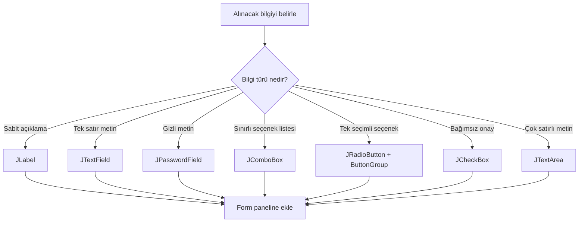

**Diyagram 20.1:** Swing bileşeni seçimi akışı.

**Görsel üretim notu:** Bu Mermaid diyagramı final DOCX/PDF üretiminden önce PNG’ye dönüştürülmeli; ham `flowchart TD` kodu final çıktıda görünmemelidir. Önerilen görsel genişliği 12–13 cm aralığında tutulmalıdır.

## 20.16 Event kavramı

Event, programda gerçekleşen olay anlamına gelir. GUI programlarında olaylar çoğunlukla kullanıcı etkileşimlerinden doğar.

### 20.16.1 Event örnekleri

GUI uygulamalarında şu olaylarla karşılaşılabilir:

1. Butona tıklama
2. Açılır listeden seçim yapma
3. Metin kutusuna yazı yazma
4. Onay kutusunu işaretleme
5. Pencereyi kapatma
6. Menü seçimi yapma

Bu bölümde özellikle buton tıklama olayı üzerinde durulacaktır.

> **🎯 Sınav Notu:** GUI programları olaylara tepki verir. Kullanıcı butona tıkladığında ilgili listener çalışır.

## 20.17 Listener kavramı

Listener, belirli bir olayı dinleyen yapıdır. Örneğin bir butona tıklandığında bu olayı yakalamak için `ActionListener` kullanılır.

Gerçek hayattan benzetme:

```text
Buton = Kapı zili
Tıklama = Zile basılması
Listener = Zili duyan kişi
actionPerformed = Zil çalınca yapılan işlem
```

Java’da buton olayını dinlemek için sınıf `ActionListener` arayüzünü uygulayabilir.


```java
public class Ornek implements ActionListener {
    public void actionPerformed(ActionEvent e) {
        System.out.println("Butona tıklandı.");
    }
}
```

## 20.18 `ActionListener` ve `actionPerformed`

`ActionListener`, buton gibi eylem üreten bileşenleri dinlemek için kullanılır. Bu arayüzü kullanan sınıf `actionPerformed` metodunu yazmalıdır.


```java
import java.awt.event.ActionEvent;
import java.awt.event.ActionListener;

public class Ornek implements ActionListener {
    public void actionPerformed(ActionEvent e) {
        System.out.println("Olay gerçekleşti.");
    }
}
```

Butona listener eklemek için:

```java
buton.addActionListener(this);
```

Bu satır, buton tıklandığında mevcut sınıftaki `actionPerformed` metodunun çalışmasını sağlar.

### 20.18.1 `actionPerformed` ne zaman çalışır?

`actionPerformed`, kullanıcı butona tıkladığında veya ilgili eylem olayı oluştuğunda çalışır. Program başlar başlamaz otomatik çalışmaz. Kullanıcı olayı beklenir.

> **⚠️ Dikkat:** `actionPerformed` metodunu yazmak tek başına yeterli değildir. İlgili butona `addActionListener` ile listener bağlanmalıdır.

## 20.19 Event source kavramı

Bir arayüzde birden fazla buton olabilir. Örneğin “Hesapla” ve “Temizle” butonları aynı listener tarafından dinlenebilir. Bu durumda hangi butona tıklandığını anlamak için event source kontrol edilir.

```java
public void actionPerformed(ActionEvent e) {
    if (e.getSource() == hesaplaButonu) {
        hesapla();
    } else if (e.getSource() == temizleButonu) {
        temizle();
    }
}
```

Burada `e.getSource()`, olayı başlatan bileşeni verir.

> **💡 İpucu:** Birden fazla buton aynı `actionPerformed` metoduna geliyorsa `e.getSource()` ile olayın hangi bileşenden geldiği kontrol edilebilir.

## 20.20 Buton olayı oluşturma

Buton olayını çalışır hâle getirmek için genellikle şu adımlar izlenir:

1. Buton oluşturulur.
2. Sınıf `ActionListener` uygular.
3. `actionPerformed` metodu yazılır.
4. Butona `addActionListener` ile listener eklenir.
5. Olay gerçekleşince çalışacak kod yazılır.

Örnek:

```java
JButton buton = new JButton("Tıkla");
buton.addActionListener(this);
```

Listener metodu:

```java
public void actionPerformed(ActionEvent e) {
    System.out.println("Butona tıklandı.");
}
```

## 20.21 Form validation kavramı

Form validation, kullanıcı tarafından girilen bilgilerin beklenen kurallara uygun olup olmadığını kontrol etme işlemidir. GUI programlarında kullanıcı girdisine güvenilmemelidir. Program, girilen verileri kullanmadan önce kontrol etmelidir.

### 20.21.1 Temel doğrulama türleri

| Doğrulama türü | Açıklama | Örnek |
|---|---|---|
| Boş alan kontrolü | Alan boş bırakılmış mı? | Ad alanı boş mu? |
| Sayısal dönüşüm | Metin sayıya çevrilebilir mi? | Not alanı `abc` mi? |
| Aralık kontrolü | Sayı beklenen aralıkta mı? | Not 0–100 arasında mı? |
| Seçim kontrolü | Gerekli seçim yapılmış mı? | Ders seçildi mi? |
| Mantıksal kontrol | Değerler birbiriyle tutarlı mı? | Final notu geçerli mi? |

### 20.21.2 Boş alan kontrolü

```java
String ad = adAlani.getText().trim();

if (ad.length() == 0) {
    JOptionPane.showMessageDialog(null, "Ad alanı boş bırakılamaz.");
}
```

`trim()` baştaki ve sondaki boşlukları temizler. Böylece yalnızca boşluk girilen alan da boş kabul edilebilir.

### 20.21.3 Sayısal dönüşüm kontrolü

```java
try {
    int not = Integer.parseInt(notAlani.getText().trim());
} catch (NumberFormatException e) {
    JOptionPane.showMessageDialog(null, "Not sayısal olmalıdır.");
}
```

Bu yapı, metin sayıya dönüştürülemezse programın çökmesini engeller.

### 20.21.4 Aralık kontrolü

```java
if (not < 0 || not > 100) {
    JOptionPane.showMessageDialog(null, "Not 0 ile 100 arasında olmalıdır.");
}
```

> **🎯 Sınav Notu:** Form doğrulama, kullanıcı girdisini işleme almadan önce kontrol etmektir. Boş alan, sayısal dönüşüm ve aralık kontrolü temel doğrulama adımlarıdır.

## 20.22 `JOptionPane` ile mesaj gösterme

`JOptionPane`, kullanıcıya mesaj penceresi göstermek için kullanılır.

Bilgi mesajı:

```java
JOptionPane.showMessageDialog(null, "Kayıt başarılı.");
```

Hata mesajı:

```java
JOptionPane.showMessageDialog(null,
        "Not sayısal olmalıdır.",
        "Giriş Hatası",
        JOptionPane.ERROR_MESSAGE);
```

Uyarı mesajı:

```java
JOptionPane.showMessageDialog(null,
        "Lütfen tüm alanları doldurunuz.",
        "Uyarı",
        JOptionPane.WARNING_MESSAGE);
```

> **💡 İpucu:** GUI uygulamalarında kullanıcıya hata mesajını konsolda değil, arayüz üzerinde göstermek daha uygundur.

## 20.23 Olay ve doğrulama akışı

Etkileşimli form uygulamalarında genel akış şu şekildedir:

```mermaid
flowchart TD
    A[Kullanıcı formu doldurur] --> B[Butona tıklar]
    B --> C[actionPerformed çalışır]
    C --> D[Form alanları okunur]
    D --> E{Boş alan var mı?}
    E -->|Evet| F[JOptionPane ile uyar]
    E -->|Hayır| G{Sayısal alanlar geçerli mi?}
    G -->|Hayır| H[JOptionPane ile hata göster]
    G -->|Evet| I{Değerler aralıkta mı?}
    I -->|Hayır| J[JOptionPane ile aralık uyarısı]
    I -->|Evet| K[Hesapla veya kaydet]
    K --> L[Sonucu JLabel veya JTextArea ile göster]
```

**Diyagram 20.2:** GUI olay yönetimi ve form doğrulama akışı.

**Görsel üretim notu:** Bu Mermaid diyagramı final DOCX/PDF üretiminden önce PNG’ye dönüştürülmeli; ham `flowchart TD` kodu final çıktıda görünmemelidir. Önerilen görsel genişliği 12–13 cm aralığında tutulmalıdır.

## 20.24 Adım adım kod örnekleri

Bu bölümde örnekler temel bileşenlerden olay yönetimi ve doğrulamaya doğru ilerleyecektir.

### Kod 20.1: Temel Swing bileşenleri

**Kod kimliği:** `b20_kod01_temel_swing_bilesenleri`

**Kod erişimi:** [Kod sayfası](https://github.com/bmdersleri/javaninTemelleri/tree/main/kodlar/bolum20/kod01/) | [Kaynak kod](https://github.com/bmdersleri/javaninTemelleri/blob/main/kodlar/bolum20/kod01/Bolum20Ornek01TemelBilesenler.java) | 

**QR erişimi:** Kod sayfası ve kaynak kod için aşağıdaki iki QR kod kullanılabilir.

{width=2.8cm} {width=2.8cm}


```java
// Dosya: Bolum20Ornek01TemelBilesenler.java
import javax.swing.*;
import java.awt.GridLayout;

public class Bolum20Ornek01TemelBilesenler {
    public static void main(String[] args) {
        JFrame pencere = new JFrame("Temel Swing Bileşenleri");

        JPanel panel = new JPanel(new GridLayout(8, 2, 8, 8));

        JTextField adAlani = new JTextField(15);
        JPasswordField sifreAlani = new JPasswordField(15);

        JComboBox<String> dersKutusu =
                new JComboBox<>(new String[]{"Java", "Veritabanı", "Algoritma"});

        JRadioButton orgunRadio = new JRadioButton("Örgün");
        JRadioButton ikinciRadio = new JRadioButton("İkinci Öğretim");

        ButtonGroup grup = new ButtonGroup();
        grup.add(orgunRadio);
        grup.add(ikinciRadio);

        JCheckBox bursluCheck = new JCheckBox("Burslu");

        JTextArea aciklamaAlani = new JTextArea(3, 20);

        JButton kaydetButonu = new JButton("Kaydet");

        panel.add(new JLabel("Ad:"));
        panel.add(adAlani);

        panel.add(new JLabel("Şifre:"));
        panel.add(sifreAlani);

        panel.add(new JLabel("Ders:"));
        panel.add(dersKutusu);

        panel.add(new JLabel("Öğretim Türü:"));
        JPanel radioPanel = new JPanel();
        radioPanel.add(orgunRadio);
        radioPanel.add(ikinciRadio);
        panel.add(radioPanel);

        panel.add(new JLabel("Burs:"));
        panel.add(bursluCheck);

        panel.add(new JLabel("Açıklama:"));
        panel.add(new JScrollPane(aciklamaAlani));

        panel.add(new JLabel(""));
        panel.add(kaydetButonu);

        pencere.add(panel);
        pencere.setSize(520, 360);
        pencere.setDefaultCloseOperation(JFrame.EXIT_ON_CLOSE);
        pencere.setLocationRelativeTo(null);
        pencere.setVisible(true);
    }
}
```

**Kodun amacı:** Temel Swing bileşenlerini tek form üzerinde göstermek.

**Beklenen ekran davranışı:** Formda ad, şifre, ders seçimi, öğretim türü, burs seçimi, açıklama alanı ve kaydet butonu görünür.

**Dikkat noktası:** Bu örnekte buton henüz işlem yapmaz. Olay yönetimi sonraki örneklerde eklenecektir.

### Kod 20.2: En küçük buton olayı örneği

**Kod kimliği:** `b20_kod02_en_kucuk_buton_olayi_ornegi`

**Kod erişimi:** [Kod sayfası](https://github.com/bmdersleri/javaninTemelleri/tree/main/kodlar/bolum20/kod02/) | [Kaynak kod](https://github.com/bmdersleri/javaninTemelleri/blob/main/kodlar/bolum20/kod02/Bolum20Ornek02ButonOlayi.java) | 

**QR erişimi:** Kod sayfası ve kaynak kod için aşağıdaki iki QR kod kullanılabilir.

{width=2.8cm} {width=2.8cm}


```java
// Dosya: Bolum20Ornek02ButonOlayi.java
import javax.swing.*;
import java.awt.FlowLayout;
import java.awt.event.ActionEvent;
import java.awt.event.ActionListener;

public class Bolum20Ornek02ButonOlayi implements ActionListener {
    private JLabel sonucEtiketi;
    private JButton buton;

    public static void main(String[] args) {
        new Bolum20Ornek02ButonOlayi().pencereOlustur();
    }

    void pencereOlustur() {
        JFrame pencere = new JFrame("Buton Olayı");

        JPanel panel = new JPanel(new FlowLayout());

        sonucEtiketi = new JLabel("Henüz tıklanmadı.");
        buton = new JButton("Tıkla");

        buton.addActionListener(this);

        panel.add(sonucEtiketi);
        panel.add(buton);

        pencere.add(panel);
        pencere.setSize(350, 150);
        pencere.setDefaultCloseOperation(JFrame.EXIT_ON_CLOSE);
        pencere.setLocationRelativeTo(null);
        pencere.setVisible(true);
    }

    public void actionPerformed(ActionEvent e) {
        sonucEtiketi.setText("Butona tıklandı.");
    }
}
```

**Kodun amacı:** `ActionListener`, `addActionListener` ve `actionPerformed` kullanımını göstermek.

**Beklenen ekran davranışı:** Kullanıcı butona tıkladığında etiket metni “Butona tıklandı.” olarak değişir.

**Dikkat noktası:** `buton.addActionListener(this)` satırı olmazsa buton tıklansa bile `actionPerformed` çalışmaz.

### Kod 20.3: `JTextField` verisini okuma

**Kod kimliği:** `b20_kod03_verisini_okuma`

**Kod erişimi:** [Kod sayfası](https://github.com/bmdersleri/javaninTemelleri/tree/main/kodlar/bolum20/kod03/) | [Kaynak kod](https://github.com/bmdersleri/javaninTemelleri/blob/main/kodlar/bolum20/kod03/Bolum20Ornek03MetinOkuma.java) | 

**QR erişimi:** Kod sayfası ve kaynak kod için aşağıdaki iki QR kod kullanılabilir.

{width=2.8cm} {width=2.8cm}


```java
// Dosya: Bolum20Ornek03MetinOkuma.java
import javax.swing.*;
import java.awt.GridLayout;
import java.awt.event.ActionEvent;
import java.awt.event.ActionListener;

public class Bolum20Ornek03MetinOkuma implements ActionListener {
    private JTextField adAlani;
    private JLabel sonucEtiketi;

    public static void main(String[] args) {
        new Bolum20Ornek03MetinOkuma().pencereOlustur();
    }

    void pencereOlustur() {
        JFrame pencere = new JFrame("Metin Okuma");

        JPanel panel = new JPanel(new GridLayout(3, 2, 8, 8));

        adAlani = new JTextField(15);
        JButton gosterButonu = new JButton("Göster");
        sonucEtiketi = new JLabel("Sonuç burada görünecek.");

        gosterButonu.addActionListener(this);

        panel.add(new JLabel("Ad:"));
        panel.add(adAlani);

        panel.add(new JLabel(""));
        panel.add(gosterButonu);

        panel.add(new JLabel("Sonuç:"));
        panel.add(sonucEtiketi);

        pencere.add(panel);
        pencere.setSize(420, 180);
        pencere.setDefaultCloseOperation(JFrame.EXIT_ON_CLOSE);
        pencere.setLocationRelativeTo(null);
        pencere.setVisible(true);
    }

    public void actionPerformed(ActionEvent e) {
        String ad = adAlani.getText().trim();

        if (ad.length() == 0) {
            JOptionPane.showMessageDialog(null,
                    "Ad alanı boş bırakılamaz.",
                    "Uyarı",
                    JOptionPane.WARNING_MESSAGE);
        } else {
            sonucEtiketi.setText("Merhaba " + ad);
        }
    }
}
```

**Kodun amacı:** `JTextField` içeriğini okumak ve boş alan kontrolü yapmak.

**Beklenen ekran davranışı:** Kullanıcı ad girip butona basarsa sonuç etiketinde selamlama görünür. Boş bırakırsa uyarı mesajı çıkar.

### Kod 20.4: Form doğrulama ile not hesaplama

**Kod kimliği:** `b20_kod04_form_dogrulama_ile_not_hesaplama`

**Kod erişimi:** [Kod sayfası](https://github.com/bmdersleri/javaninTemelleri/tree/main/kodlar/bolum20/kod04/) | [Kaynak kod](https://github.com/bmdersleri/javaninTemelleri/blob/main/kodlar/bolum20/kod04/Bolum20Ornek04NotHesaplama.java) | 

**QR erişimi:** Kod sayfası ve kaynak kod için aşağıdaki iki QR kod kullanılabilir.

{width=2.8cm} {width=2.8cm}


```java
// Dosya: Bolum20Ornek04NotHesaplama.java
import javax.swing.*;
import java.awt.GridLayout;
import java.awt.event.ActionEvent;
import java.awt.event.ActionListener;

public class Bolum20Ornek04NotHesaplama implements ActionListener {
    private JTextField vizeAlani;
    private JTextField finalAlani;
    private JLabel sonucEtiketi;

    public static void main(String[] args) {
        new Bolum20Ornek04NotHesaplama().pencereOlustur();
    }

    void pencereOlustur() {
        JFrame pencere = new JFrame("Not Hesaplama");

        JPanel panel = new JPanel(new GridLayout(4, 2, 8, 8));

        vizeAlani = new JTextField(10);
        finalAlani = new JTextField(10);
        JButton hesaplaButonu = new JButton("Hesapla");
        sonucEtiketi = new JLabel("Sonuç bekleniyor.");

        hesaplaButonu.addActionListener(this);

        panel.add(new JLabel("Vize:"));
        panel.add(vizeAlani);

        panel.add(new JLabel("Final:"));
        panel.add(finalAlani);

        panel.add(new JLabel(""));
        panel.add(hesaplaButonu);

        panel.add(new JLabel("Sonuç:"));
        panel.add(sonucEtiketi);

        pencere.add(panel);
        pencere.setSize(420, 220);
        pencere.setDefaultCloseOperation(JFrame.EXIT_ON_CLOSE);
        pencere.setLocationRelativeTo(null);
        pencere.setVisible(true);
    }

    public void actionPerformed(ActionEvent e) {
        String vizeMetni = vizeAlani.getText().trim();
        String finalMetni = finalAlani.getText().trim();

        if (vizeMetni.length() == 0 || finalMetni.length() == 0) {
            JOptionPane.showMessageDialog(null,
                    "Vize ve final alanları boş bırakılamaz.",
                    "Eksik Giriş",
                    JOptionPane.WARNING_MESSAGE);
            return;
        }

        try {
            int vize = Integer.parseInt(vizeMetni);
            int finalNotu = Integer.parseInt(finalMetni);

            if (!notGecerliMi(vize) || !notGecerliMi(finalNotu)) {
                JOptionPane.showMessageDialog(null,
                        "Notlar 0 ile 100 arasında olmalıdır.",
                        "Aralık Hatası",
                        JOptionPane.ERROR_MESSAGE);
                return;
            }

            double ortalama = vize * 0.4 + finalNotu * 0.6;
            String durum = ortalama >= 50 ? "Geçti" : "Kaldı";

            sonucEtiketi.setText("Ortalama: " + ortalama + " - " + durum);
        } catch (NumberFormatException ex) {
            JOptionPane.showMessageDialog(null,
                    "Vize ve final sayısal olmalıdır.",
                    "Sayı Hatası",
                    JOptionPane.ERROR_MESSAGE);
        }
    }

    boolean notGecerliMi(int not) {
        return not >= 0 && not <= 100;
    }
}
```

**Kodun amacı:** Boş alan kontrolü, sayısal dönüşüm, aralık kontrolü ve sonuç gösterimini birlikte uygulamak.

**Beklenen ekran davranışı:** Geçerli notlar girildiğinde ortalama hesaplanır. Boş, sayısal olmayan veya aralık dışı girişlerde kullanıcıya mesaj gösterilir.

### Kod 20.5: Event source ile iki butonu ayırt etme

**Kod kimliği:** `b20_kod05_event_source_ile_iki_butonu_ayirt_etme`

**Kod erişimi:** [Kod sayfası](https://github.com/bmdersleri/javaninTemelleri/tree/main/kodlar/bolum20/kod05/) | [Kaynak kod](https://github.com/bmdersleri/javaninTemelleri/blob/main/kodlar/bolum20/kod05/Bolum20Ornek05EventSource.java) | 

**QR erişimi:** Kod sayfası ve kaynak kod için aşağıdaki iki QR kod kullanılabilir.

{width=2.8cm} {width=2.8cm}


```java
// Dosya: Bolum20Ornek05EventSource.java
import javax.swing.*;
import java.awt.FlowLayout;
import java.awt.event.ActionEvent;
import java.awt.event.ActionListener;

public class Bolum20Ornek05EventSource implements ActionListener {
    private JTextField metinAlani;
    private JLabel sonucEtiketi;
    private JButton gosterButonu;
    private JButton temizleButonu;

    public static void main(String[] args) {
        new Bolum20Ornek05EventSource().pencereOlustur();
    }

    void pencereOlustur() {
        JFrame pencere = new JFrame("Event Source");

        JPanel panel = new JPanel(new FlowLayout());

        metinAlani = new JTextField(15);
        gosterButonu = new JButton("Göster");
        temizleButonu = new JButton("Temizle");
        sonucEtiketi = new JLabel("Sonuç");

        gosterButonu.addActionListener(this);
        temizleButonu.addActionListener(this);

        panel.add(metinAlani);
        panel.add(gosterButonu);
        panel.add(temizleButonu);
        panel.add(sonucEtiketi);

        pencere.add(panel);
        pencere.setSize(480, 150);
        pencere.setDefaultCloseOperation(JFrame.EXIT_ON_CLOSE);
        pencere.setLocationRelativeTo(null);
        pencere.setVisible(true);
    }

    public void actionPerformed(ActionEvent e) {
        if (e.getSource() == gosterButonu) {
            sonucEtiketi.setText(metinAlani.getText());
        } else if (e.getSource() == temizleButonu) {
            metinAlani.setText("");
            sonucEtiketi.setText("Sonuç");
        }
    }
}
```

**Kodun amacı:** Aynı `actionPerformed` içinde birden fazla butonu ayırt etmek.

**Dikkat noktası:** `e.getSource()` olayı başlatan bileşeni verir.

### Kod 20.6: Hatalı ve düzeltilmiş listener örneği

Hatalı örnek:

**Kod kimliği:** `b20_kod06_hatali_ve_duzeltilmis_listener_ornegi`

**Kod erişimi:** [Kod sayfası](https://github.com/bmdersleri/javaninTemelleri/tree/main/kodlar/bolum20/kod06/) | [Kaynak kod](https://github.com/bmdersleri/javaninTemelleri/blob/main/kodlar/bolum20/kod06/Bolum20Ornek06ListenerHatasi.java) | 

**QR erişimi:** Kod sayfası ve kaynak kod için aşağıdaki iki QR kod kullanılabilir.

{width=2.8cm} {width=2.8cm}


```java
// Dosya: Bolum20Ornek06ListenerHatasi.java
import javax.swing.*;
import java.awt.FlowLayout;
import java.awt.event.ActionEvent;
import java.awt.event.ActionListener;

public class Bolum20Ornek06ListenerHatasi implements ActionListener {
    private JLabel sonuc;

    public static void main(String[] args) {
        new Bolum20Ornek06ListenerHatasi().pencereOlustur();
    }

    void pencereOlustur() {
        JFrame pencere = new JFrame("Listener Hatası");
        JPanel panel = new JPanel(new FlowLayout());

        JButton buton = new JButton("Tıkla");
        sonuc = new JLabel("Bekleniyor");

        panel.add(buton);
        panel.add(sonuc);

        pencere.add(panel);
        pencere.setSize(350, 150);
        pencere.setDefaultCloseOperation(JFrame.EXIT_ON_CLOSE);
        pencere.setVisible(true);
    }

    public void actionPerformed(ActionEvent e) {
        sonuc.setText("Tıklandı");
    }
}
```

Bu kodda `actionPerformed` yazılmıştır; ancak butona listener eklenmemiştir. Bu nedenle butona tıklanınca metot çalışmaz.

Düzeltilmiş kodda şu satır eklenmelidir:

```java
buton.addActionListener(this);
```

Düzeltilmiş bölüm:

```java
JButton buton = new JButton("Tıkla");
buton.addActionListener(this);
```

**Dikkat noktası:** Listener yazmak ve listener bağlamak iki ayrı adımdır.

## 20.25 Kodun çalışma mantığı ve beklenen davranış

Etkileşimli GUI programlarında kodun çalışma mantığı şu sırayla düşünülmelidir:

| Adım | İşlem | Açıklama |
|---:|---|---|
| 1 | Pencere oluşturulur | `JFrame` |
| 2 | Bileşenler oluşturulur | `JTextField`, `JButton`, `JLabel` |
| 3 | Bileşenler panellere eklenir | Layout düzeni |
| 4 | Listener bağlantısı yapılır | `addActionListener` |
| 5 | Pencere görünür yapılır | `setVisible(true)` |
| 6 | Kullanıcı butona tıklar | Event oluşur |
| 7 | `actionPerformed` çalışır | Olay yakalanır |
| 8 | Form verileri okunur | `getText()` |
| 9 | Doğrulama yapılır | Boş/sayı/aralık |
| 10 | Sonuç gösterilir | `JLabel` veya `JOptionPane` |

Buton olaylarında en sık kontrol edilmesi gereken iki nokta vardır:

1. Butona listener eklendi mi?
2. `actionPerformed` içinde doğru bileşenlerden veri okunuyor mu?

> **💡 İpucu:** Bir GUI programında buton tıklanınca hiçbir şey olmuyorsa önce `addActionListener` satırını kontrol edin.

## 20.26 Uçtan uca mini uygulama: Öğrenci Not Formu

Bu bölümün mini uygulaması, temel Swing bileşenleri, olay yönetimi ve form doğrulama konularını bir araya getirir.

**Uygulama adı:** Öğrenci Not Formu

**Dosya adı:** `OgrenciNotFormu.java`

**Amaç:** Kullanıcıdan öğrenci adı, ders, öğretim türü, burs durumu, vize ve final notu almak; formu doğrulamak; ortalama ve geçme durumunu GUI üzerinde göstermek.

**Kod kimliği:** `b20_kod42_ogrenci_not_formu`

**Kod erişimi:** [Kod sayfası](https://github.com/bmdersleri/javaninTemelleri/tree/main/kodlar/bolum20/kod42/) | [Kaynak kod](https://github.com/bmdersleri/javaninTemelleri/blob/main/kodlar/bolum20/kod42/OgrenciNotFormu.java) | 

**QR erişimi:** Kod sayfası ve kaynak kod için aşağıdaki iki QR kod kullanılabilir.

{width=2.8cm} {width=2.8cm}


```java
// Dosya: OgrenciNotFormu.java
import javax.swing.*;
import java.awt.BorderLayout;
import java.awt.FlowLayout;
import java.awt.GridLayout;
import java.awt.event.ActionEvent;
import java.awt.event.ActionListener;

public class OgrenciNotFormu implements ActionListener {
    private JTextField adAlani;
    private JTextField vizeAlani;
    private JTextField finalAlani;

    private JComboBox<String> dersKutusu;

    private JRadioButton orgunRadio;
    private JRadioButton ikinciRadio;

    private JCheckBox bursluCheck;

    private JTextArea sonucAlani;

    private JButton hesaplaButonu;
    private JButton temizleButonu;

    public static void main(String[] args) {
        new OgrenciNotFormu().pencereOlustur();
    }

    void pencereOlustur() {
        JFrame pencere = new JFrame("Öğrenci Not Formu");

        JPanel anaPanel = new JPanel(new BorderLayout(8, 8));
        anaPanel.setBorder(BorderFactory.createEmptyBorder(12, 12, 12, 12));

        anaPanel.add(baslikPaneliOlustur(), BorderLayout.NORTH);
        anaPanel.add(formPaneliOlustur(), BorderLayout.CENTER);
        anaPanel.add(altPanelOlustur(), BorderLayout.SOUTH);

        pencere.add(anaPanel);
        pencere.setSize(620, 480);
        pencere.setDefaultCloseOperation(JFrame.EXIT_ON_CLOSE);
        pencere.setLocationRelativeTo(null);
        pencere.setVisible(true);
    }

    JPanel baslikPaneliOlustur() {
        JPanel panel = new JPanel(new FlowLayout(FlowLayout.CENTER));
        panel.add(new JLabel("Öğrenci Not Hesaplama Formu"));
        return panel;
    }

    JPanel formPaneliOlustur() {
        JPanel panel = new JPanel(new GridLayout(7, 2, 8, 8));

        adAlani = new JTextField(15);
        vizeAlani = new JTextField(10);
        finalAlani = new JTextField(10);

        dersKutusu = new JComboBox<>(new String[]{
                "Java Programlama",
                "Veritabanı",
                "Algoritma",
                "Web Programlama"
        });

        orgunRadio = new JRadioButton("Örgün");
        ikinciRadio = new JRadioButton("İkinci Öğretim");

        ButtonGroup ogretimGrubu = new ButtonGroup();
        ogretimGrubu.add(orgunRadio);
        ogretimGrubu.add(ikinciRadio);

        JPanel radioPanel = new JPanel(new FlowLayout(FlowLayout.LEFT));
        radioPanel.add(orgunRadio);
        radioPanel.add(ikinciRadio);

        bursluCheck = new JCheckBox("Burslu öğrenci");

        sonucAlani = new JTextArea(5, 25);
        sonucAlani.setEditable(false);

        panel.add(new JLabel("Ad Soyad:"));
        panel.add(adAlani);

        panel.add(new JLabel("Ders:"));
        panel.add(dersKutusu);

        panel.add(new JLabel("Öğretim Türü:"));
        panel.add(radioPanel);

        panel.add(new JLabel("Burs Durumu:"));
        panel.add(bursluCheck);

        panel.add(new JLabel("Vize Notu:"));
        panel.add(vizeAlani);

        panel.add(new JLabel("Final Notu:"));
        panel.add(finalAlani);

        panel.add(new JLabel("Sonuç:"));
        panel.add(new JScrollPane(sonucAlani));

        return panel;
    }

    JPanel altPanelOlustur() {
        JPanel panel = new JPanel(new FlowLayout(FlowLayout.RIGHT));

        hesaplaButonu = new JButton("Hesapla");
        temizleButonu = new JButton("Temizle");

        hesaplaButonu.addActionListener(this);
        temizleButonu.addActionListener(this);

        panel.add(hesaplaButonu);
        panel.add(temizleButonu);

        return panel;
    }

    public void actionPerformed(ActionEvent e) {
        if (e.getSource() == hesaplaButonu) {
            hesapla();
        } else if (e.getSource() == temizleButonu) {
            temizle();
        }
    }

    void hesapla() {
        String ad = adAlani.getText().trim();
        String vizeMetni = vizeAlani.getText().trim();
        String finalMetni = finalAlani.getText().trim();

        if (ad.length() == 0) {
            mesajGoster("Ad soyad alanı boş bırakılamaz.");
            return;
        }

        if (!orgunRadio.isSelected() && !ikinciRadio.isSelected()) {
            mesajGoster("Öğretim türü seçilmelidir.");
            return;
        }

        if (vizeMetni.length() == 0 || finalMetni.length() == 0) {
            mesajGoster("Vize ve final notları boş bırakılamaz.");
            return;
        }

        try {
            int vize = Integer.parseInt(vizeMetni);
            int finalNotu = Integer.parseInt(finalMetni);

            if (!notGecerliMi(vize) || !notGecerliMi(finalNotu)) {
                mesajGoster("Notlar 0 ile 100 arasında olmalıdır.");
                return;
            }

            double ortalama = vize * 0.4 + finalNotu * 0.6;
            String durum = ortalama >= 50 ? "Geçti" : "Kaldı";

            String ders = (String) dersKutusu.getSelectedItem();
            String ogretim = orgunRadio.isSelected()
                    ? "Örgün"
                    : "İkinci Öğretim";

            String burs = bursluCheck.isSelected()
                    ? "Burslu"
                    : "Burslu değil";

            sonucAlani.setText("");
            sonucAlani.append("Ad Soyad: " + ad + "\n");
            sonucAlani.append("Ders: " + ders + "\n");
            sonucAlani.append("Öğretim Türü: " + ogretim + "\n");
            sonucAlani.append("Burs Durumu: " + burs + "\n");
            sonucAlani.append("Vize: " + vize + "\n");
            sonucAlani.append("Final: " + finalNotu + "\n");
            sonucAlani.append("Ortalama: " + ortalama + "\n");
            sonucAlani.append("Durum: " + durum + "\n");

            JOptionPane.showMessageDialog(null,
                    "Hesaplama tamamlandı.",
                    "Bilgi",
                    JOptionPane.INFORMATION_MESSAGE);
        } catch (NumberFormatException ex) {
            mesajGoster("Vize ve final notları sayısal olmalıdır.");
        }
    }

    boolean notGecerliMi(int not) {
        return not >= 0 && not <= 100;
    }

    void mesajGoster(String mesaj) {
        JOptionPane.showMessageDialog(null,
                mesaj,
                "Form Hatası",
                JOptionPane.WARNING_MESSAGE);
    }

    void temizle() {
        adAlani.setText("");
        vizeAlani.setText("");
        finalAlani.setText("");
        orgunRadio.setSelected(false);
        ikinciRadio.setSelected(false);
        bursluCheck.setSelected(false);
        dersKutusu.setSelectedIndex(0);
        sonucAlani.setText("");
    }
}
```

### 20.26.1 Mini uygulamanın özellikleri

Bu uygulama şu özellikleri içerir:

1. `JTextField` ile ad, vize ve final bilgisi alır.
2. `JComboBox` ile ders seçtirir.
3. `JRadioButton` ve `ButtonGroup` ile öğretim türü seçtirir.
4. `JCheckBox` ile burs durumunu alır.
5. `JTextArea` ile sonuçları çok satırlı gösterir.
6. `JButton` ile hesaplama ve temizleme işlemleri başlatılır.
7. `ActionListener` ile buton olayları yakalanır.
8. `e.getSource()` ile hangi butona tıklandığı belirlenir.
9. Boş alan kontrolü yapılır.
10. Sayısal dönüşüm kontrolü yapılır.
11. Not aralığı kontrol edilir.
12. `JOptionPane` ile kullanıcıya uyarı veya bilgi mesajı gösterilir.

### 20.26.2 Beklenen ekran davranışı

Program çalıştırıldığında:

1. “Öğrenci Not Formu” başlıklı pencere açılır.
2. Kullanıcı ad soyad, ders, öğretim türü, burs durumu, vize ve final bilgilerini girer.
3. “Hesapla” butonuna basıldığında form doğrulanır.
4. Geçerli girişlerde ortalama ve durum sonuç alanına yazılır.
5. Hatalı girişlerde `JOptionPane` ile uyarı gösterilir.
6. “Temizle” butonu formu başlangıç hâline getirir.

### 20.26.3 Mini uygulama test senaryoları

| Test | Girdi / İşlem | Beklenen sonuç |
|---:|---|---|
| 1 | Geçerli tüm alanlar | Ortalama hesaplanır |
| 2 | Ad alanı boş | Uyarı mesajı |
| 3 | Öğretim türü seçilmez | Uyarı mesajı |
| 4 | Vize boş | Uyarı mesajı |
| 5 | Final boş | Uyarı mesajı |
| 6 | Vize `abc` | Sayısal hata mesajı |
| 7 | Final `120` | Aralık hatası |
| 8 | Ortalama 50 ve üstü | Durum “Geçti” |
| 9 | Ortalama 50 altı | Durum “Kaldı” |
| 10 | Temizle butonu | Form alanları temizlenir |

> **Alıştırma Molası:** Mini uygulamaya “Devamsızlık” alanı ekleyiniz. Devamsızlık 5’ten büyükse ortalama 50 üzerinde olsa bile sonuç alanında “Devamsızlıktan kaldı” mesajı gösteriniz.

## 20.27 Sık yapılan hatalar ve öğrenci yanılgıları

### 20.27.1 Listener eklemeyi unutmak

Yanlış eksik kullanım:

```java
JButton buton = new JButton("Hesapla");
```

Düzeltme:

```java
buton.addActionListener(this);
```

### 20.27.2 `actionPerformed` yazıp butona bağlamamak

`actionPerformed` metodunun var olması yeterli değildir. Buton ilgili listener ile ilişkilendirilmelidir.

### 20.27.3 `JTextField` verisini doğrudan sayı sanmak

Yanlış düşünce:

```text
Not alanına sayı yazıldığı için getText() sonucu int olur.
```

Düzeltme:

```java
int not = Integer.parseInt(notAlani.getText().trim());
```

### 20.27.4 Form girdisini doğrulamadan sayıya çevirmek

Boş veya hatalı metin sayıya çevrilmeye çalışılırsa hata oluşabilir.

Daha güvenli yaklaşım:

```java
if (notMetni.length() == 0) {
    mesajGoster("Not boş olamaz.");
    return;
}

try {
    int not = Integer.parseInt(notMetni);
} catch (NumberFormatException e) {
    mesajGoster("Not sayısal olmalıdır.");
}
```

### 20.27.5 Radyo butonlarını `ButtonGroup` içine eklememek

`ButtonGroup` kullanılmazsa birden fazla radyo butonu aynı anda seçilebilir.

```java
ButtonGroup grup = new ButtonGroup();
grup.add(orgunRadio);
grup.add(ikinciRadio);
```

### 20.27.6 Hata mesajını yalnızca konsola yazmak

Yanlış yaklaşım:

```java
System.out.println("Hata var.");
```

GUI uygulamasında daha uygun yaklaşım:

```java
JOptionPane.showMessageDialog(null, "Hata var.");
```

### 20.27.7 Event source kontrolünü unutmak

Birden fazla buton aynı listener tarafından dinleniyorsa hangi butona basıldığını kontrol etmek gerekir.

```java
if (e.getSource() == hesaplaButonu) {
    hesapla();
}
```

### 20.27.8 Formu temizlerken tüm alanları sıfırlamamak

Temizle butonu yalnızca metin alanlarını değil, radyo butonları, onay kutuları, açılır liste ve sonuç alanını da sıfırlamalıdır.

> **💡 İpucu:** GUI hatalarını izlerken şu sırayı kullanın: bileşen oluşturuldu mu, panele eklendi mi, listener bağlandı mı, olay geldi mi, doğrulama doğru mu?

## 20.28 Hata ayıklama egzersizi

Aşağıdaki kodun `GuiOlayHatasi.java` adlı dosyaya kaydedildiğini düşünelim.

**Kod kimliği:** `b20_kod51_hata_ayiklama_egzersizi`

**Kod erişimi:** [Kod sayfası](https://github.com/bmdersleri/javaninTemelleri/tree/main/kodlar/bolum20/kod51/) | [Kaynak kod](https://github.com/bmdersleri/javaninTemelleri/blob/main/kodlar/bolum20/kod51/GuiOlayHatasi.java) | 

**QR erişimi:** Kod sayfası ve kaynak kod için aşağıdaki iki QR kod kullanılabilir.

{width=2.8cm} {width=2.8cm}


```java
// Dosya: GuiOlayHatasi.java
import javax.swing.*;
import java.awt.FlowLayout;
import java.awt.event.ActionEvent;
import java.awt.event.ActionListener;

public class GuiOlayHatasi implements ActionListener {
    private JTextField sayiAlani;
    private JLabel sonucEtiketi;

    public static void main(String[] args) {
        new GuiOlayHatasi().pencereOlustur();
    }

    void pencereOlustur() {
        JFrame pencere = new JFrame("GUI Olay Hatası");
        JPanel panel = new JPanel(new FlowLayout());

        sayiAlani = new JTextField(10);
        JButton hesaplaButonu = new JButton("Hesapla");
        sonucEtiketi = new JLabel("Sonuç");

        panel.add(sayiAlani);
        panel.add(hesaplaButonu);
        panel.add(sonucEtiketi);

        pencere.add(panel);
        pencere.setSize(350, 150);
        pencere.setDefaultCloseOperation(JFrame.EXIT_ON_CLOSE);
        pencere.setVisible(true);
    }

    public void actionPerformed(ActionEvent e) {
        int sayi = Integer.parseInt(sayiAlani.getText());
        sonucEtiketi.setText("Kare: " + (sayi * sayi));
    }
}
```

Bu kodda iki temel sorun vardır:

1. `hesaplaButonu.addActionListener(this);` satırı eksiktir.
2. Sayı alanı doğrulanmadan `Integer.parseInt()` çağrılmıştır.

Düzeltilmiş kod:

**Kod kimliği:** `b20_kod52_hata_ayiklama_egzersizi`

**Kod erişimi:** [Kod sayfası](https://github.com/bmdersleri/javaninTemelleri/tree/main/kodlar/bolum20/kod52/) | [Kaynak kod](https://github.com/bmdersleri/javaninTemelleri/blob/main/kodlar/bolum20/kod52/GuiOlayHatasi.java) | 

**QR erişimi:** Kod sayfası ve kaynak kod için aşağıdaki iki QR kod kullanılabilir.

{width=2.8cm} {width=2.8cm}


```java
// Dosya: GuiOlayHatasi.java
import javax.swing.*;
import java.awt.FlowLayout;
import java.awt.event.ActionEvent;
import java.awt.event.ActionListener;

public class GuiOlayHatasi implements ActionListener {
    private JTextField sayiAlani;
    private JLabel sonucEtiketi;

    public static void main(String[] args) {
        new GuiOlayHatasi().pencereOlustur();
    }

    void pencereOlustur() {
        JFrame pencere = new JFrame("GUI Olay Hatası Düzeltildi");
        JPanel panel = new JPanel(new FlowLayout());

        sayiAlani = new JTextField(10);
        JButton hesaplaButonu = new JButton("Hesapla");
        sonucEtiketi = new JLabel("Sonuç");

        hesaplaButonu.addActionListener(this);

        panel.add(sayiAlani);
        panel.add(hesaplaButonu);
        panel.add(sonucEtiketi);

        pencere.add(panel);
        pencere.setSize(400, 150);
        pencere.setDefaultCloseOperation(JFrame.EXIT_ON_CLOSE);
        pencere.setVisible(true);
    }

    public void actionPerformed(ActionEvent e) {
        String metin = sayiAlani.getText().trim();

        if (metin.length() == 0) {
            JOptionPane.showMessageDialog(null,
                    "Sayı alanı boş bırakılamaz.");
            return;
        }

        try {
            int sayi = Integer.parseInt(metin);
            sonucEtiketi.setText("Kare: " + (sayi * sayi));
        } catch (NumberFormatException ex) {
            JOptionPane.showMessageDialog(null,
                    "Geçerli bir tam sayı giriniz.");
        }
    }
}
```

**Beklenen davranış:** Kullanıcı geçerli sayı girerse karesi hesaplanır. Boş veya hatalı girişte kullanıcıya mesaj gösterilir.

**Kendinize sorunuz:**

1. Buton neden ilk sürümde işlem yapmıyordu?
2. `addActionListener(this)` hangi görevi üstlenir?
3. `getText()` sonucu neden doğrudan sayı kabul edilmemelidir?
4. Boş alan kontrolü neden `parseInt` öncesinde yapılmalıdır?
5. GUI uygulamasında hata mesajı neden `JOptionPane` ile verilmelidir?

## 20.29 Bölümün sonraki bölümlerle ilişkisi

Bu bölümde temel Swing bileşenleri, olay yönetimi ve form doğrulama ele alındı. Artık öğrenci yalnızca pencere ve form düzeni oluşturmakla kalmaz; kullanıcıdan veri alabilir, buton olaylarını yakalayabilir, form girdilerini doğrulayabilir ve sonucu arayüz üzerinde gösterebilir.

Bir sonraki bölümde liste, tablo, menü ve diyaloglarla GUI veri sunumu ele alınacaktır. Bu bölümde öğrenilen `ActionListener`, `JOptionPane`, form doğrulama ve bileşen kullanımı bilgileri; `JList`, `JTable`, `JMenu` ve daha gelişmiş Swing arayüzleri için temel oluşturacaktır.

## 20.30 Bölüm özeti

Bu bölümde Swing arayüzleri etkileşimli hâle getirildi. İlk olarak temel Swing bileşenleri ele alındı. `JLabel` bilgi göstermek, `JTextField` tek satırlık metin almak, `JPasswordField` gizli giriş almak, `JButton` işlem başlatmak, `JComboBox` seçim listesi sunmak, `JRadioButton` ve `ButtonGroup` tek seçimli seçenek oluşturmak, `JCheckBox` bağımsız onay almak ve `JTextArea` çok satırlı metin göstermek için kullanıldı.

Bileşen seçiminin kullanıcıdan alınacak veri türüne göre yapılması gerektiği vurgulandı. Tek satırlık serbest metin için `JTextField`, sınırlı seçenekler için `JComboBox`, tek seçimli seçenekler için `JRadioButton`, bağımsız onay için `JCheckBox` önerildi.

Bölümün ikinci kısmında olay yönetimi işlendi. Event, listener, `ActionListener`, `actionPerformed`, `addActionListener` ve event source kavramları örneklerle açıklandı. Buton oluşturmanın tek başına yeterli olmadığı, butona listener bağlanması gerektiği belirtildi.

Form validation konusu kapsamında boş alan kontrolü, sayısal dönüşüm kontrolü ve aralık kontrolü işlendi. Hatalı kullanıcı girdilerinde programın çökmesi yerine `JOptionPane` ile kullanıcıya anlaşılır mesaj verilmesi gerektiği gösterildi.

Son olarak Öğrenci Not Formu mini uygulamasıyla temel Swing bileşenleri, layout, olay yönetimi, event source kontrolü, form doğrulama, not hesaplama, sonuç gösterme ve form temizleme işlemleri tek bir uygulamada birleştirildi.

## 20.31 Terim sözlüğü

| Terim | Açıklama |
|---|---|
| `JLabel` | Arayüzde metin gösteren bileşen |
| `JTextField` | Tek satırlık metin girişi alan bileşen |
| `JPasswordField` | Gizli metin girişi alan bileşen |
| `JButton` | Kullanıcı eylemini başlatan buton |
| `JComboBox` | Açılır seçim listesi |
| `JRadioButton` | Tek seçimli seçenek bileşeni |
| `ButtonGroup` | Radyo butonlarını tek seçimli gruplar |
| `JCheckBox` | Bağımsız onay kutusu |
| `JTextArea` | Çok satırlı metin alanı |
| Event | Kullanıcı veya sistem tarafından oluşturulan olay |
| Listener | Olayı dinleyen yapı |
| `ActionListener` | Eylem olaylarını dinleyen arayüz |
| `actionPerformed` | Eylem olayı oluşunca çalışan metot |
| Event source | Olayı başlatan bileşen |
| Form validation | Form girdilerini kontrol etme işlemi |
| `JOptionPane` | Mesaj penceresi gösteren Swing sınıfı |
| `getText()` | Metin alanındaki veriyi okur |
| `setText()` | Bileşen metnini değiştirir |
| `isSelected()` | Seçim durumunu kontrol eder |

## 20.32 Kendini değerlendirme soruları

### 20.32.1 Çoktan seçmeli sorular

1. Tek satırlık metin girişi için hangi Swing bileşeni kullanılır?

A) `JTextField`  
B) `JLabel`  
C) `JFrame`  
D) `JPanel`  
E) `GridLayout`

2. Kullanıcıya bilgi göstermek için hangi bileşen kullanılabilir?

A) `JLabel`  
B) `JPasswordField`  
C) `ActionEvent`  
D) `ButtonGroup`  
E) `Scanner`

3. Bir işlemi başlatmak için en uygun bileşen hangisidir?

A) `JButton`  
B) `JLabel`  
C) `JTextArea`  
D) `FlowLayout`  
E) `BorderLayout`

4. Açılır seçim listesi için hangi bileşen kullanılır?

A) `JComboBox`  
B) `JCheckBox`  
C) `JRadioButton`  
D) `JLabel`  
E) `JPasswordField`

5. Radyo butonlarının tek seçimli davranması için hangi yapı kullanılır?

A) `ButtonGroup`  
B) `JOptionPane`  
C) `JTextArea`  
D) `ActionEvent`  
E) `Math`

6. Buton tıklama olaylarını dinlemek için hangi arayüz kullanılır?

A) `ActionListener`  
B) `GridLayout`  
C) `JFrame`  
D) `LocalDate`  
E) `ArrayList`

7. Olay gerçekleştiğinde hangi metot çalışır?

A) `actionPerformed`  
B) `main`  
C) `setSize`  
D) `getTextOnly`  
E) `parseDate`

8. Kullanıcıya mesaj penceresi göstermek için hangi sınıf kullanılabilir?

A) `JOptionPane`  
B) `JTextField`  
C) `ButtonGroup`  
D) `ActionListener`  
E) `Scanner`

### 20.32.2 Doğru/Yanlış soruları

1. `JTextField` kullanıcıdan tek satırlık metin almak için kullanılabilir. (D/Y)
2. `JButton` oluşturulunca otomatik olarak hesaplama yapar. (D/Y)
3. Butona tıklama olayını yakalamak için listener eklenmelidir. (D/Y)
4. `actionPerformed` kullanıcı butona tıkladığında çalışabilir. (D/Y)
5. `JTextField.getText()` sonucu doğrudan `int` türündedir. (D/Y)
6. Form doğrulama, kullanıcı girdisini işlemden önce kontrol etmektir. (D/Y)
7. `JOptionPane` GUI üzerinde mesaj göstermek için kullanılabilir. (D/Y)
8. `ButtonGroup` radyo butonlarının tek seçimli çalışmasına yardımcı olur. (D/Y)
9. `JCheckBox` bağımsız onay kutusu olarak kullanılabilir. (D/Y)
10. Event source, olayı başlatan bileşeni anlamaya yardımcı olur. (D/Y)

### 20.32.3 Açık uçlu kavramsal sorular

1. `JLabel`, `JTextField` ve `JButton` bileşenlerinin görevlerini karşılaştırınız.
2. `JComboBox`, `JRadioButton` ve `JCheckBox` hangi durumlarda tercih edilir?
3. `ButtonGroup` neden gereklidir?
4. Event kavramını açıklayınız.
5. Listener kavramını örnekle açıklayınız.
6. `ActionListener` ve `actionPerformed` arasındaki ilişki nedir?
7. `addActionListener` satırı neden gereklidir?
8. Event source kontrolü hangi durumlarda kullanılır?
9. Form validation neden önemlidir?
10. Boş alan, sayısal dönüşüm ve aralık kontrolünü örnekle açıklayınız.
11. GUI uygulamalarında `JOptionPane` kullanmanın avantajı nedir?
12. Öğrenci Not Formu uygulamasında hangi bileşen hangi görevi üstlenmektedir?

### 20.32.4 Yanlış gerekçeyi bulma soruları

Aşağıdaki ifadelerdeki yanlış gerekçeyi bulunuz ve düzeltiniz.

1. “Buton oluşturmak, butona otomatik olarak işlem kazandırır.”
2. “`actionPerformed` yazmak yeterlidir; butona listener eklemeye gerek yoktur.”
3. “`JTextField.getText()` sonucu doğrudan sayısal türdür.”
4. “Kullanıcı girdisi doğrulanmadan hesaplama yapılmalıdır.”
5. “Radyo butonlarında `ButtonGroup` kullanılmasa da tek seçim garanti edilir.”
6. “GUI uygulamasında hata mesajını yalnızca konsola yazmak yeterlidir.”
7. “`JOptionPane` yalnızca dosya işlemleri için kullanılır.”
8. “Birden fazla buton varsa event source kontrolüne gerek yoktur.”
9. “`JCheckBox` yalnızca tek seçimli gruplar için kullanılır.”
10. “`JTextArea` tek satırlık kısa girişler için her zaman en iyi bileşendir.”

## 20.33 Programlama alıştırmaları

### 20.33.1 Kolay düzey

1. `AdGosterFormu.java` adlı programda `JTextField`, `JButton` ve `JLabel` kullanarak girilen adı ekranda gösteriniz.
2. Boş ad girildiğinde `JOptionPane` ile uyarı veriniz.
3. `SifreFormu.java` programında `JPasswordField` kullanınız.
4. `DersSecimi.java` programında `JComboBox` ile ders seçtiriniz.
5. `CheckBoxDeneme.java` programında bir `JCheckBox` seçiliyse etikete “Seçildi” yazdırınız.

### 20.33.2 Orta düzey

1. `RadioButtonDeneme.java` programında iki `JRadioButton` ve bir `ButtonGroup` kullanınız.
2. `ButonOlayi.java` programında butona tıklandığında etiket metnini değiştiriniz.
3. `IkiButon.java` programında “Göster” ve “Temizle” butonlarını `e.getSource()` ile ayırt ediniz.
4. `NotHesaplama.java` programında vize-final ortalaması hesaplayınız.
5. Not alanları boşsa uyarı veriniz.
6. Sayısal olmayan not girilirse hata mesajı gösteriniz.
7. Notlar 0–100 aralığında değilse işlem yapmayınız.

### 20.33.3 Zor düzey

1. `OgrenciNotFormu.java` uygulamasını geliştiriniz.
2. Ad soyad için `JTextField` kullanınız.
3. Ders seçimi için `JComboBox` kullanınız.
4. Öğretim türü için `JRadioButton` ve `ButtonGroup` kullanınız.
5. Burs durumu için `JCheckBox` kullanınız.
6. Vize ve final için `JTextField` kullanınız.
7. Sonuç için `JTextArea` kullanınız.
8. Hesapla ve temizle butonlarını ekleyiniz.
9. Buton olaylarını `ActionListener` ile yönetiniz.
10. Boş alan, seçim, sayısal dönüşüm ve aralık doğrulaması yapınız.
11. `JOptionPane` ile kullanıcıya hata mesajları gösteriniz.
12. En az on test senaryosu hazırlayınız.

## 20.34 Haftalık laboratuvar / proje görevi

**Görev başlığı:** Etkileşimli Öğrenci Not Formu Laboratuvarı

**Amaç:** Bu laboratuvarın amacı, öğrencinin temel Swing bileşenlerini kullanarak etkileşimli bir form oluşturması, buton olaylarını yönetmesi ve kullanıcı girdilerini doğrulamasıdır.

**Beklenen adımlar:**

1. `OgrenciNotFormu.java` adlı dosyayı oluşturunuz.
2. `JFrame`, `JPanel`, `JLabel`, `JTextField`, `JButton`, `JComboBox`, `JRadioButton`, `ButtonGroup`, `JCheckBox`, `JTextArea` ve `JOptionPane` bileşenlerini kullanınız.
3. Ana panelde uygun layout düzeni kurunuz.
4. Ad soyad, ders, öğretim türü, burs, vize ve final alanlarını ekleyiniz.
5. Hesapla ve temizle butonlarını oluşturunuz.
6. Sınıfı `ActionListener` ile ilişkilendiriniz.
7. Butonlara `addActionListener(this)` ekleyiniz.
8. `actionPerformed` içinde event source kontrolü yapınız.
9. Hesaplama metodunu ayrı yazınız.
10. Temizleme metodunu ayrı yazınız.
11. Boş alan kontrolü yapınız.
12. Öğretim türü seçimi kontrolü yapınız.
13. Vize ve final notlarını sayıya dönüştürünüz.
14. `NumberFormatException` durumunda kullanıcıya mesaj gösteriniz.
15. Notların 0–100 aralığında olduğunu kontrol ediniz.
16. Sonuçları `JTextArea` içinde gösteriniz.
17. En az on test senaryosu çalıştırınız.
18. Hatalı listener veya doğrulama örneği ve düzeltmesini açıklayan kısa not hazırlayınız.
19. `README.md` dosyası hazırlayınız.

**Teslim edilecek dosyalar:**

1. `OgrenciNotFormu.java`
2. `README.md`
3. En az on test çıktısı veya ekran davranışı açıklaması
4. Hata ve çözüm notu

**README içeriği şu başlıkları içermelidir:**

1. Programın amacı
2. Kullanılan Swing bileşenleri
3. Olay yönetimi yapısı
4. Form doğrulama kuralları
5. Test senaryoları
6. Karşılaşılan hata ve çözümü
7. Geliştirme önerileri

## 20.35 Değerlendirme rubriği

| Ölçüt | Açıklama | Puan |
|---|---|---:|
| Swing bileşenleri | `JTextField`, `JButton`, `JComboBox`, `JRadioButton`, `JCheckBox`, `JTextArea` kullanımı | 25 |
| Olay yönetimi | `ActionListener`, `actionPerformed`, `addActionListener`, event source kullanımı | 25 |
| Form doğrulama | Boş alan, seçim, sayısal dönüşüm ve aralık kontrolü | 20 |
| Mini uygulama işlevleri | Ortalama hesaplama, durum belirleme, sonucu gösterme, form temizleme | 15 |
| Kodun çalışması | Programın derlenebilir ve arayüzün kullanılabilir olması | 5 |
| Kod okunabilirliği | Metotlara ayırma, anlamlı adlandırma ve sade yapı | 5 |
| Raporlama | README, test senaryoları ve hata notunun yeterliliği | 5 |
| **Toplam** |  | **100** |

## 20.36 İleri okuma ve kaynaklar

Bu bölümde temel Swing bileşenleri, olay yönetimi ve form doğrulama başlangıç düzeyinde ele alınmıştır. Daha ayrıntılı çalışma için aşağıdaki kaynak türleri incelenebilir:

1. **Java SE API dokümantasyonu:** `JButton`, `JTextField`, `JComboBox`, `JRadioButton`, `JCheckBox`, `JTextArea`, `ActionListener` ve `JOptionPane` sınıflarının resmî davranışlarını incelemek için temel kaynaktır.
2. **Oracle Java Tutorials:** Swing bileşenleri, event handling ve layout konularında örnek odaklı açıklamalar içerir.
3. **Ders içi ek notlar:** Buton olayı, form doğrulama, `JOptionPane` mesajları ve `ActionListener` kullanımı için pekiştirme materyali olarak kullanılabilir.
4. **Dev.java öğrenme kaynakları:** Temel Java sınıf, arayüz ve olay mantığını tekrar etmek için yararlı olabilir.

> **💡 İpucu:** İleri kaynaklarda lambda expression ile listener yazımı, `DocumentListener`, `ItemListener`, `KeyListener`, `JList`, `JTable` ve MVC gibi konularla karşılaşabilirsiniz. Bu bölümde yalnızca temel olay yönetimi ve form doğrulama hedeflenmiştir.

## 20.37 Bir sonraki bölüme köprü

Bu bölümde temel Swing bileşenleri, olay yönetimi ve form doğrulama ele alındı. Bir sonraki bölümde liste, tablo, menü ve diyaloglarla GUI veri sunumu işlenecektir. Bu bölümde öğrenilen bileşen kullanımı, `ActionListener`, `JOptionPane` ve form doğrulama becerileri; `JList`, `JTable`, `JMenu` ve daha gelişmiş veri sunum arayüzlerinde doğrudan kullanılacaktır.

**BÖLÜM SONU**


\newpage


# Bölüm 21: Liste, Tablo, Menü ve Diyaloglarla GUI Veri Sunumu

## 21.1 Bölümün yol haritası

Önceki bölümde Swing uygulamalarında olay yönetimi ve form doğrulama ele
alındı. Kullanıcının butona tıklamasıyla olay oluştuğu, `ActionListener` ile bu
olayın yakalanabildiği ve hatalı girişlerde `JOptionPane` ile kullanıcıya mesaj
verilebildiği gösterildi. Bu bölümde ise daha gerçekçi masaüstü uygulama ekranları oluşturmak için liste, tablo, menü ve diyalog bileşenleri incelenecektir. Odak, GUI üzerinde verinin düzenli biçimde sunulmasıdır.

Küçük bir GUI uygulaması yalnızca metin alanı ve butondan oluşmak zorunda
değildir. Kullanıcıya kayıt listesi göstermek, kayıtları tablo içinde düzenli
sunmak, menüden işlem seçtirmek veya onay ve bilgi pencereleri göstermek daha
gerçekçi masaüstü uygulamaların temel parçalarıdır. Bu bölümde özellikle
`JList`, `JTable`, `DefaultTableModel`, `JMenuBar`, `JMenu`, `JMenuItem` ve
`JOptionPane` üzerinde durulacaktır.

Bu bölümde şu sorulara yanıt aranacaktır:

1. `JList` hangi durumlarda kullanılır?
2. `JTable` kayıtları tablo biçiminde nasıl gösterir?
3. `DefaultTableModel` tablo verisini yönetmede ne işe yarar?
4. Tablo modeli ile tablo görünümü arasındaki fark nedir?
5. Seçili satır nasıl okunur?
6. `JMenuBar`, `JMenu` ve `JMenuItem` nasıl birlikte kullanılır?
7. `JOptionPane` ile bilgi, uyarı ve onay pencereleri nasıl gösterilir?
8. Seçili satır yokken işlem yapılırsa ne olur?
9. Tablolu Öğrenci Kayıt Ekranı nasıl geliştirilir?
10. Daha gelişmiş GUI bileşenlerine geçişte nelere dikkat edilmelidir?

> **🎯 Bölüm Hedefi:** Bu bölümün sonunda öğrenci, Swing ile liste ve tablo
> bileşenlerini kullanabilecek, `DefaultTableModel` üzerinden tabloya veri
> ekleyip silebilecek, seçili satırı okuyabilecek, menü bileşenleriyle temel
> işlemler oluşturabilecek ve `JOptionPane` ile kullanıcıya bilgi, uyarı ve onay
> mesajları gösterebilecektir.

Bu bölümde gelişmiş tablo render işlemleri, MVC mimarisi ve veri bağlama
frameworkleri ele alınmayacaktır. Amaç, temel Java ve Swing bilgisiyle küçük ama
gerçekçi masaüstü uygulama ekranları oluşturabilmektir.

## 21.2 Bölümün konumu ve pedagojik rolü

Bu bölüm, GUI uygulamalarını daha gerçekçi bir yapıya taşır. Bölüm 28'de temel
Swing bileşenleri, Bölüm 20'da ise olay yönetimi ve form doğrulama öğrenildi.
Bu bölümde bu bilgiler daha zengin arayüz bileşenleriyle birleştirilecektir.

Bir öğrenci kayıt ekranında kullanıcı yalnızca tek bir öğrenci bilgisi girmekle
kalmaz; girilen öğrencileri listelemek, belirli bir satırı seçmek, seçili kaydı
silmek, menüden yardım veya çıkış işlemi yapmak isteyebilir. Bu ihtiyaçlar
`JTable`, tablo modeli ve menü bileşenleriyle karşılanabilir.

Bu bölüm ayrıca Bölüm 22'de işlenecek JDBC ile veritabanı programlamaya giriş
için de hazırlık sağlar. Çünkü veritabanından okunan kayıtlar çoğu masaüstü
uygulamada tablo bileşeni içinde gösterilir. Bu bölümde veriler bellekteki tablo
modelinde tutulacaktır; bir sonraki bölümde veritabanı bağlantısı fikrine geçiş
yapılacaktır.

> **⚠️ Dikkat:** `JTable` yalnızca ekrandaki görünümü temsil eder. Verilerin
> eklenmesi, silinmesi veya güncellenmesi çoğu başlangıç örneğinde tablo modeli
> üzerinden yapılır.

## 21.3 Öğrenme çıktıları

Bu bölüm tamamlandığında öğrenci:

1. `JList` bileşeninin temel kullanım amacını açıklayabilir.
2. `JTable` ile verileri satır ve sütun biçiminde gösterebilir.
3. `DefaultTableModel` ile tabloya satır ekleyebilir.
4. `DefaultTableModel` üzerinden seçili satırı silebilir.
5. Tablo modeli ve tablo görünümü arasındaki farkı açıklayabilir.
6. `getSelectedRow` ile seçili satır indeksini okuyabilir.
7. `JMenuBar`, `JMenu` ve `JMenuItem` bileşenlerini birlikte kullanabilir.
8. `JOptionPane` ile bilgi, hata ve onay diyalogları gösterebilir.
9. Seçili satır yokken işlem yapmanın neden hata doğurabileceğini açıklayabilir.
10. Tablolu Öğrenci Kayıt Ekranı mini uygulamasını geliştirebilir.

## 21.4 Ön bilgi ve başlangıç varsayımları

Bu bölüm, öğrencinin aşağıdaki konuları temel düzeyde bildiğini varsayar:

1. Java programının temel yapısı
2. Sınıf ve nesne kullanımı
3. Constructor ve basit kapsülleme
4. Interface ve listener kavramına kısa aşinalık
5. `JFrame`, `JPanel`, `JLabel`, `JTextField` ve `JButton` kullanımı
6. `BorderLayout`, `FlowLayout` ve `GridLayout` temel kullanımı
7. `ActionListener` ve buton olayı
8. `JOptionPane` ile temel mesaj gösterme
9. Basit form doğrulama

Bu bölümde tablo render işlemleri, özel hücre editörleri, profesyonel MVC
mimarisi ve veri bağlama frameworkleri kapsam dışında bırakılmıştır.

## 21.5 Ana kavramlar

| Kavram | Kısa açıklama | Bu bölümdeki rolü |
|---|---|---|
| `JList` | Tek sütunlu liste bileşeni | Basit seçenek listesi |
| `JTable` | Satır-sütun yapısında veri gösterir | Kayıt tablosu |
| `DefaultTableModel` | Tablo verisini yönetir | Satır ekleme/silme |
| Tablo modeli | Tablo verisini tutan yapı | Veri kaynağı |
| Seçili satır | Kullanıcının tabloda seçtiği satır | Silme/güncelleme |
| `getSelectedRow` | Seçili satır indeksini verir | Satır kontrolü |
| `JMenuBar` | Menü çubuğu | Pencerenin üst menüsü |
| `JMenu` | Menü başlığı | Dosya, Yardım |
| `JMenuItem` | Menü içindeki işlem | Çıkış, Hakkında |
| `JOptionPane` | Diyalog penceresi gösterir | Bilgi, uyarı, onay |

> **🎯 Sınav Notu:** `JTable` ekrandaki tabloyu gösterir; `DefaultTableModel`
> ise bu tablonun veri modelini yönetir. Satır ekleme ve silme işlemleri çoğu
> zaman model üzerinden yapılır.

## 21.6 `JList`: Basit liste bileşeni

`JList`, kullanıcıya tek sütunlu bir liste göstermek için kullanılan Swing
bileşenidir. Bölüm listesi, şehir listesi, kategori listesi veya basit seçenek
listeleri için uygundur.

Basit kullanım:

```java
String[] bolumler = {"Bilgisayar", "Yazılım", "Elektrik"};
JList<String> bolumListesi = new JList<>(bolumler);
```

Listeyi kaydırılabilir yapmak için genellikle `JScrollPane` kullanılır:

```java
JScrollPane kaydirma = new JScrollPane(bolumListesi);
```

Seçili değeri almak için:

```java
String secilen = bolumListesi.getSelectedValue();
```

### 21.6.1 JList ne zaman kullanılır?

`JList` şu durumlarda uygundur:

1. Kullanıcıya basit bir seçenek listesi gösterilecekse
2. Liste tek sütunlu olacaksa
3. Çok ayrıntılı kayıt yapısı gerekmiyorsa
4. Seçilen öğe üzerinden işlem yapılacaksa

Örneğin yalnızca bölüm adlarını göstermek için `JList` yeterlidir. Ancak öğrenci
numarası, ad, soyad ve not gibi birden fazla alan gösterilecekse `JTable` daha
uygundur.

> **💡 İpucu:** Tek sütunlu basit veri için `JList`, çok sütunlu kayıt verisi
> için `JTable` düşünmek başlangıç düzeyinde iyi bir ayrımdır.

## 21.7 `JTable`: Kayıtları tablo biçiminde gösterme

`JTable`, verileri satır ve sütunlardan oluşan tablo biçiminde göstermek için
kullanılır. Öğrenci kayıtları, ürün listeleri, not tabloları veya stok bilgileri
gibi yapılar için uygundur.

Basit bir tablo şu bilgilerden oluşabilir:

| No | Ad Soyad | Not |
|---|---|---:|
| 1001 | Ayşe Yılmaz | 85 |
| 1002 | Mehmet Demir | 72 |

Swing tarafında bu yapı için tablo sütun adları ve veri satırları tanımlanabilir.
Ancak başlangıç düzeyinde en pratik yaklaşım `DefaultTableModel` kullanmaktır.

```java
String[] sutunlar = {"No", "Ad Soyad", "Not"};
DefaultTableModel model = new DefaultTableModel(sutunlar, 0);
JTable tablo = new JTable(model);
```

Buradaki `0`, başlangıçta satır olmadığını belirtir.

### 21.7.1 JTable neden JScrollPane içinde kullanılır?

Tablolar çoğu zaman pencereye sığmayacak kadar çok satır içerebilir. Bu nedenle
`JTable` genellikle `JScrollPane` içine yerleştirilir.

```java
JScrollPane kaydirma = new JScrollPane(tablo);
```

Bu kullanım, satır sayısı arttığında kaydırma çubuğu sağlar.

> **⚠️ Dikkat:** `JTable` doğrudan pencereye eklenebilir; ancak başlıkların ve
> kaydırma davranışının düzgün görünmesi için çoğu durumda `JScrollPane` içinde
> kullanılması önerilir.

## 21.8 `DefaultTableModel`: Tablo verisini yönetme

`DefaultTableModel`, `JTable` verisini yönetmek için kullanılan pratik bir model
sınıfıdır. Sütun adları, satırlar, satır ekleme ve satır silme işlemleri model
üzerinden yapılabilir.

Model oluşturma:

```java
String[] sutunlar = {"No", "Ad Soyad", "Not"};
DefaultTableModel model = new DefaultTableModel(sutunlar, 0);
```

Satır ekleme:

```java
Object[] satir = {"1001", "Ayşe Yılmaz", 85};
model.addRow(satir);
```

Satır silme:

```java
model.removeRow(0);
```

Satır sayısını öğrenme:

```java
int satirSayisi = model.getRowCount();
```

### 21.8.1 Tablo modeli ve tablo görünümü

`DefaultTableModel` veriyi tutar, `JTable` ise bu veriyi ekranda gösterir. Bu
ayrım önemlidir. Öğrenci, veriyi doğrudan tabloya değil, çoğu zaman modele
eklediğini bilmelidir.

| Yapı | Görev |
|---|---|
| `DefaultTableModel` | Satır ve sütun verilerini yönetir |
| `JTable` | Modeldeki verileri ekranda gösterir |
| `JScrollPane` | Tablo için kaydırma desteği sağlar |

> **🎯 Sınav Notu:** `model.addRow(...)` çağrıldığında tablo görünümü genellikle
> otomatik güncellenir; çünkü `JTable` bu modele bağlıdır.

## 21.9 Seçili satır kavramı

Kullanıcı tabloda bir satıra tıkladığında o satır seçili hâle gelebilir. Seçili
satır üzerinde silme veya ayrıntı gösterme gibi işlemler yapılabilir.

Seçili satırı almak için:

```java
int seciliSatir = tablo.getSelectedRow();
```

Eğer hiçbir satır seçili değilse `getSelectedRow()` genellikle `-1` döndürür.

```java
if (seciliSatir == -1) {
    JOptionPane.showMessageDialog(null, "Lütfen bir satır seçiniz.");
    return;
}
```

Seçili satırı silmek için:

```java
model.removeRow(seciliSatir);
```

### 21.9.1 Neden seçili satır kontrolü gerekir?

Kullanıcı hiçbir satır seçmeden Sil butonuna basabilir. Bu durumda doğrudan
`removeRow(seciliSatir)` çağrılırsa hata oluşabilir. Çünkü `-1` geçerli bir satır
indeksi değildir.

> **⚠️ Sık Yapılan Hata:** Seçili satır kontrolü yapmadan `removeRow` çağırmak,
> çalışma zamanı hatasına neden olabilir. Önce `seciliSatir == -1` kontrolü
> yapılmalıdır.

## 21.10 Menü bileşenleri: `JMenuBar`, `JMenu`, `JMenuItem`

Masaüstü uygulamalarda pencerenin üst kısmında menü çubuğu bulunabilir. Bu menü
çubuğu dosya, düzen, yardım gibi başlıklar içerebilir. Swing'de bu yapı üç temel
bileşenle kurulur:

1. `JMenuBar`: Menü çubuğu
2. `JMenu`: Menü başlığı
3. `JMenuItem`: Menü içindeki işlem

Basit kullanım:

```java
JMenuBar menuBar = new JMenuBar();

JMenu dosyaMenu = new JMenu("Dosya");
JMenuItem cikisItem = new JMenuItem("Çıkış");

dosyaMenu.add(cikisItem);
menuBar.add(dosyaMenu);

pencere.setJMenuBar(menuBar);
```

Menü öğesine olay eklemek:

```java
cikisItem.addActionListener(e -> System.exit(0));
```

### 21.10.1 Menü ne zaman kullanılır?

Menü bileşenleri şu durumlarda uygundur:

1. Uygulamada genel işlemler varsa
2. Çıkış, hakkında, yardım gibi işlemler sunulacaksa
3. Butonlarla arayüz kalabalıklaştırılmak istenmiyorsa
4. Masaüstü uygulama alışkanlığı korunmak isteniyorsa

> **💡 İpucu:** Başlangıç uygulamalarında “Dosya > Çıkış” ve “Yardım >
> Hakkında” gibi iki basit menü öğesi yeterli bir pratik sağlar.

## 21.11 `JOptionPane`: Diyalog pencereleri

`JOptionPane`, bilgi, uyarı, hata, onay ve basit giriş diyalogları göstermek için
kullanılabilir. Önceki bölümde hata mesajları için kullanılmıştı. Bu bölümde
tablo ve menü işlemleriyle birlikte daha sık kullanılacaktır.

Bilgi mesajı:

```java
JOptionPane.showMessageDialog(null, "Kayıt eklendi.");
```

Uyarı mesajı:

```java
JOptionPane.showMessageDialog(
        null,
        "Lütfen bir satır seçiniz.",
        "Uyarı",
        JOptionPane.WARNING_MESSAGE);
```

Onay penceresi:

```java
int cevap = JOptionPane.showConfirmDialog(
        null,
        "Seçili kayıt silinsin mi?",
        "Onay",
        JOptionPane.YES_NO_OPTION);
```

Cevap kontrolü:

```java
if (cevap == JOptionPane.YES_OPTION) {
    // Silme işlemi yapılır
}
```

> **🎯 Sınav Notu:** Silme gibi geri alınması zor işlemlerden önce
> `showConfirmDialog` ile kullanıcıdan onay almak iyi bir alışkanlıktır.

## 21.12 Liste, tablo, menü ve diyalog akışı

Tablolu bir kayıt ekranında genel olay akışı şu şekilde düşünülebilir:

```mermaid
flowchart TD
    A[Kullanıcı formu doldurur] --> B[Ekle butonuna tıklar]
    B --> C[Form doğrulanır]
    C --> D{Geçerli mi?}
    D -- Hayır --> E[JOptionPane ile uyarı]
    D -- Evet --> F[DefaultTableModel addRow]
    F --> G[JTable güncellenir]
    G --> H[Kullanıcı satır seçer]
    H --> I[Sil butonuna veya menüye tıklar]
    I --> J{Satır seçili mi?}
    J -- Hayır --> E
    J -- Evet --> K[Onay diyalogu gösterilir]
    K --> L[Seçili satır silinir]
```

**Diyagram 21.1:** Tablolu kayıt ekranında temel kullanıcı etkileşimi.

**Görsel üretim notu:** Bu Mermaid diyagramı final DOCX/PDF üretiminden önce
PNG'ye dönüştürülmeli; ham `flowchart TD` kodu final çıktıda görünmemelidir.

## 21.13 Adım adım kod örnekleri

Bu bölümde üç temel kod örneği verilecektir. Kod örneklerinde dosya adı ile
`public class` adı uyumlu tutulacaktır.

### 21.13.1 Kod 21.1: JList, JTable ve JOptionPane temel örneği

**Kod kimliği:** `b21_kod01_jlist_jtable_ve_joptionpane_temel_ornegi`

**Kod erişimi:** [Kod sayfası](https://github.com/bmdersleri/javaninTemelleri/tree/main/kodlar/bolum21/kod01/) | [Kaynak kod](https://github.com/bmdersleri/javaninTemelleri/blob/main/kodlar/bolum21/kod01/ListeTabloMenuveDiyaloglarTemel.java) | 

**QR erişimi:** Kod sayfası ve kaynak kod için aşağıdaki iki QR kod kullanılabilir.

{width=2.8cm} {width=2.8cm}


```java
// Dosya: ListeTabloMenuveDiyaloglarTemel.java
import java.awt.BorderLayout;
import javax.swing.JButton;
import javax.swing.JFrame;
import javax.swing.JList;
import javax.swing.JOptionPane;
import javax.swing.JScrollPane;
import javax.swing.JTable;
import javax.swing.JPanel;
import javax.swing.table.DefaultTableModel;

public class ListeTabloMenuveDiyaloglarTemel {
    public static void main(String[] args) {
        JFrame pencere = new JFrame("Liste ve Tablo Temel");

        String[] bolumler = {"Bilgisayar", "Yazılım", "Elektrik"};
        JList<String> liste = new JList<>(bolumler);

        String[] sutunlar = {"No", "Ad Soyad", "Not"};
        DefaultTableModel model = new DefaultTableModel(sutunlar, 0);
        JTable tablo = new JTable(model);

        model.addRow(new Object[]{"1001", "Ayşe Yılmaz", 85});
        model.addRow(new Object[]{"1002", "Mehmet Demir", 72});

        JButton secimiGoster = new JButton("Bölümü Göster");
        secimiGoster.addActionListener(e -> {
            String secilen = liste.getSelectedValue();

            if (secilen == null) {
                JOptionPane.showMessageDialog(null, "Lütfen bölüm seçiniz.");
            } else {
                JOptionPane.showMessageDialog(null, "Seçilen: " + secilen);
            }
        });

        JPanel solPanel = new JPanel(new BorderLayout());
        solPanel.add(new JScrollPane(liste), BorderLayout.CENTER);
        solPanel.add(secimiGoster, BorderLayout.SOUTH);

        pencere.add(solPanel, BorderLayout.WEST);
        pencere.add(new JScrollPane(tablo), BorderLayout.CENTER);

        pencere.setSize(560, 260);
        pencere.setDefaultCloseOperation(JFrame.EXIT_ON_CLOSE);
        pencere.setVisible(true);
    }
}
```

**Kodun amacı:** `JList`, `JTable`, `DefaultTableModel` ve `JOptionPane`
bileşenlerini en küçük çalışan örnekte göstermek.

**Kritik satırların açıklaması:**

1. `JList<String>` bölüm listesini gösterir.
2. `DefaultTableModel` tablo sütunlarını ve satırlarını yönetir.
3. `JTable` modeldeki verileri ekranda gösterir.
4. `model.addRow(...)` tabloya yeni satır ekler.
5. `liste.getSelectedValue()` seçili liste değerini okur.
6. `JOptionPane` seçili değeri kullanıcıya gösterir.

**Beklenen çıktı veya davranış:** Pencerede solda bölüm listesi, sağda öğrenci
tablosu görünür. Kullanıcı listeden bölüm seçip butona basınca seçilen bölüm
mesaj kutusunda gösterilir.

**Olası hata ve dikkat noktası:** Liste seçimi yapılmadan butona basılırsa
`getSelectedValue()` sonucu `null` olabilir. Bu nedenle seçim kontrolü
yapılmalıdır.

### 21.13.2 Kod 21.2: Menü ve tablo modeline satır ekleme

**Kod kimliği:** `b21_kod02_menu_ve_tablo_modeline_satir_ekleme`

**Kod erişimi:** [Kod sayfası](https://github.com/bmdersleri/javaninTemelleri/tree/main/kodlar/bolum21/kod02/) | [Kaynak kod](https://github.com/bmdersleri/javaninTemelleri/blob/main/kodlar/bolum21/kod02/ListeTabloMenuveDiyaloglarUygulama.java) | 

**QR erişimi:** Kod sayfası ve kaynak kod için aşağıdaki iki QR kod kullanılabilir.

{width=2.8cm} {width=2.8cm}


```java
// Dosya: ListeTabloMenuveDiyaloglarUygulama.java
import java.awt.BorderLayout;
import java.awt.GridLayout;
import javax.swing.JButton;
import javax.swing.JFrame;
import javax.swing.JLabel;
import javax.swing.JMenu;
import javax.swing.JMenuBar;
import javax.swing.JMenuItem;
import javax.swing.JOptionPane;
import javax.swing.JPanel;
import javax.swing.JScrollPane;
import javax.swing.JTable;
import javax.swing.JTextField;
import javax.swing.table.DefaultTableModel;

public class ListeTabloMenuveDiyaloglarUygulama {
    public static void main(String[] args) {
        JFrame pencere = new JFrame("Öğrenci Tablosu");

        String[] sutunlar = {"No", "Ad Soyad", "Not"};
        DefaultTableModel model = new DefaultTableModel(sutunlar, 0);
        JTable tablo = new JTable(model);

        JTextField noAlani = new JTextField(10);
        JTextField adAlani = new JTextField(10);
        JTextField notAlani = new JTextField(10);

        JPanel formPanel = new JPanel(new GridLayout(4, 2, 8, 8));
        formPanel.add(new JLabel("No:"));
        formPanel.add(noAlani);
        formPanel.add(new JLabel("Ad Soyad:"));
        formPanel.add(adAlani);
        formPanel.add(new JLabel("Not:"));
        formPanel.add(notAlani);

        JButton ekleButonu = new JButton("Ekle");
        formPanel.add(new JLabel(""));
        formPanel.add(ekleButonu);

        ekleButonu.addActionListener(e -> {
            String no = noAlani.getText().trim();
            String ad = adAlani.getText().trim();
            String notMetni = notAlani.getText().trim();

            if (no.isEmpty() || ad.isEmpty() || notMetni.isEmpty()) {
                JOptionPane.showMessageDialog(null, "Tüm alanları doldurunuz.");
                return;
            }

            try {
                int not = Integer.parseInt(notMetni);

                if (not < 0 || not > 100) {
                    JOptionPane.showMessageDialog(null, "Not 0-100 olmalıdır.");
                    return;
                }

                model.addRow(new Object[]{no, ad, not});

                noAlani.setText("");
                adAlani.setText("");
                notAlani.setText("");
            } catch (NumberFormatException ex) {
                JOptionPane.showMessageDialog(null, "Not sayısal olmalıdır.");
            }
        });

        pencere.setJMenuBar(menuOlustur(pencere, tablo, model));

        pencere.add(formPanel, BorderLayout.NORTH);
        pencere.add(new JScrollPane(tablo), BorderLayout.CENTER);

        pencere.setSize(620, 360);
        pencere.setDefaultCloseOperation(JFrame.EXIT_ON_CLOSE);
        pencere.setVisible(true);
    }

    public static JMenuBar menuOlustur(JFrame pencere,
            JTable tablo,
            DefaultTableModel model) {
        JMenuBar menuBar = new JMenuBar();

        JMenu dosyaMenu = new JMenu("Dosya");
        JMenuItem cikisItem = new JMenuItem("Çıkış");

        cikisItem.addActionListener(e -> System.exit(0));

        JMenu islemMenu = new JMenu("İşlem");
        JMenuItem seciliSilItem = new JMenuItem("Seçili Satırı Sil");

        seciliSilItem.addActionListener(e -> {
            int seciliSatir = tablo.getSelectedRow();

            if (seciliSatir == -1) {
                JOptionPane.showMessageDialog(pencere, "Satır seçiniz.");
                return;
            }

            int cevap = JOptionPane.showConfirmDialog(
                    pencere,
                    "Seçili kayıt silinsin mi?",
                    "Onay",
                    JOptionPane.YES_NO_OPTION);

            if (cevap == JOptionPane.YES_OPTION) {
                model.removeRow(seciliSatir);
            }
        });

        dosyaMenu.add(cikisItem);
        islemMenu.add(seciliSilItem);
        menuBar.add(dosyaMenu);
        menuBar.add(islemMenu);

        return menuBar;
    }
}
```

**Kodun amacı:** Formdan alınan değerlerle tablo modeline satır eklemek, menü
öğesiyle seçili satırı silmek ve `JOptionPane` ile kullanıcıya geri bildirim
vermektir.

**Kritik satırların açıklaması:**

1. `DefaultTableModel` tablo verisini yönetir.
2. `model.addRow(...)` yeni öğrenci satırı ekler.
3. `JMenuBar`, `JMenu` ve `JMenuItem` menü yapısını oluşturur.
4. `tablo.getSelectedRow()` seçili satırı verir.
5. `showConfirmDialog` silme öncesi kullanıcıdan onay alır.
6. `model.removeRow(seciliSatir)` seçili satırı modelden siler.

**Beklenen çıktı veya davranış:** Kullanıcı formu doldurup Ekle butonuna
bastığında öğrenci tabloya eklenir. Menüden “Seçili Satırı Sil” seçildiğinde
seçili satır onaydan sonra silinir.

**Olası hata ve dikkat noktası:** Hiçbir satır seçili değilken silme işlemi
yapılmaya çalışılırsa `getSelectedRow()` değeri `-1` olur. Bu durum mutlaka
kontrol edilmelidir.

### 21.13.3 Kod 21.3: Hatalı ve düzeltilmiş seçili satır örneği

Aşağıdaki örnekte seçili satır kontrolü yapılmadan satır silinmeye çalışılmıştır.

**Kod kimliği:** `b21_kod03_hatali_ve_duzeltilmis_secili_satir_ornegi`

**Kod erişimi:** [Kod sayfası](https://github.com/bmdersleri/javaninTemelleri/tree/main/kodlar/bolum21/kod03/) | [Kaynak kod](https://github.com/bmdersleri/javaninTemelleri/blob/main/kodlar/bolum21/kod03/ListeTabloMenuveDiyaloglarHataDuzeltme.java) | 

**QR erişimi:** Kod sayfası ve kaynak kod için aşağıdaki iki QR kod kullanılabilir.

{width=2.8cm} {width=2.8cm}


```java
// Dosya: ListeTabloMenuveDiyaloglarHataDuzeltme.java
import javax.swing.JButton;
import javax.swing.JFrame;
import javax.swing.JScrollPane;
import javax.swing.JTable;
import javax.swing.table.DefaultTableModel;

public class ListeTabloMenuveDiyaloglarHataDuzeltme {
    public static void main(String[] args) {
        JFrame pencere = new JFrame("Seçili Satır Hatası");

        String[] sutunlar = {"No", "Ad"};
        DefaultTableModel model = new DefaultTableModel(sutunlar, 0);
        JTable tablo = new JTable(model);

        model.addRow(new Object[]{"1001", "Ayşe"});

        JButton sil = new JButton("Sil");

        sil.addActionListener(e -> {
            int seciliSatir = tablo.getSelectedRow();
            model.removeRow(seciliSatir);
        });

        pencere.add(new JScrollPane(tablo), "Center");
        pencere.add(sil, "South");

        pencere.setSize(360, 220);
        pencere.setDefaultCloseOperation(JFrame.EXIT_ON_CLOSE);
        pencere.setVisible(true);
    }
}
```

Bu kod derlenebilir. Ancak kullanıcı satır seçmeden Sil butonuna basarsa
`seciliSatir` değeri `-1` olabilir ve çalışma zamanı hatası oluşabilir.

Düzeltilmiş sürüm:

**Kod kimliği:** `b21_kod03_hatali_ve_duzeltilmis_secili_satir_ornegi_2`

**Kod erişimi:** [Kod sayfası](https://github.com/bmdersleri/javaninTemelleri/tree/main/kodlar/bolum21/kod03_2/) | [Kaynak kod](https://github.com/bmdersleri/javaninTemelleri/blob/main/kodlar/bolum21/kod03_2/ListeTabloMenuveDiyaloglarHataDuzeltme.java) | 

**QR erişimi:** Kod sayfası ve kaynak kod için aşağıdaki iki QR kod kullanılabilir.

{width=2.8cm} {width=2.8cm}


```java
// Dosya: ListeTabloMenuveDiyaloglarHataDuzeltme.java
import java.awt.BorderLayout;
import javax.swing.JButton;
import javax.swing.JFrame;
import javax.swing.JOptionPane;
import javax.swing.JScrollPane;
import javax.swing.JTable;
import javax.swing.table.DefaultTableModel;

public class ListeTabloMenuveDiyaloglarHataDuzeltme {
    public static void main(String[] args) {
        JFrame pencere = new JFrame("Seçili Satır Düzeltildi");
        pencere.setLayout(new BorderLayout());

        String[] sutunlar = {"No", "Ad"};
        DefaultTableModel model = new DefaultTableModel(sutunlar, 0);
        JTable tablo = new JTable(model);

        model.addRow(new Object[]{"1001", "Ayşe"});

        JButton sil = new JButton("Sil");

        sil.addActionListener(e -> {
            int seciliSatir = tablo.getSelectedRow();

            if (seciliSatir == -1) {
                JOptionPane.showMessageDialog(null, "Lütfen satır seçiniz.");
                return;
            }

            model.removeRow(seciliSatir);
        });

        pencere.add(new JScrollPane(tablo), BorderLayout.CENTER);
        pencere.add(sil, BorderLayout.SOUTH);

        pencere.setSize(360, 220);
        pencere.setDefaultCloseOperation(JFrame.EXIT_ON_CLOSE);
        pencere.setVisible(true);
    }
}
```

**Kodun amacı:** Seçili satır kontrolü yapılmadan tablo satırı silmenin neden
riskli olduğunu göstermek.

**Kritik satırların açıklaması:**

1. `tablo.getSelectedRow()` seçili satır indeksini döndürür.
2. Satır seçili değilse sonuç `-1` olabilir.
3. `removeRow(-1)` geçerli bir işlem değildir.
4. Düzeltilmiş kodda önce `seciliSatir == -1` kontrolü yapılır.
5. Hata durumunda `JOptionPane` ile kullanıcıya mesaj verilir.

**Beklenen çıktı veya davranış:** Satır seçilmeden Sil butonuna basılırsa uyarı
mesajı görünür. Satır seçiliyse kayıt tablodan silinir.

**Olası hata ve dikkat noktası:** Tablo işlemlerinde kullanıcı seçimi her zaman
var sayılmamalıdır. Silme ve güncelleme gibi işlemlerden önce seçim kontrolü
yapılmalıdır.

## 21.14 Kodun çalışma mantığı ve beklenen davranış

Tablo tabanlı bir uygulamada veri akışı çoğu zaman model üzerinden ilerler.
Aşağıdaki kodu düşünelim:

```java
DefaultTableModel model = new DefaultTableModel(sutunlar, 0);
JTable tablo = new JTable(model);
model.addRow(new Object[]{"1001", "Ayşe", 85});
```

İz sürme tablosu:

| Adım | İşlem | Beklenen etki |
|---:|---|---|
| 1 | Model oluşturulur | Sütun yapısı belirlenir |
| 2 | JTable modele bağlanır | Tablo modeli ekranda gösterir |
| 3 | `addRow` çağrılır | Modele yeni satır eklenir |
| 4 | JTable güncellenir | Yeni satır ekranda görünür |
| 5 | Kullanıcı satır seçer | Seçili satır indeksi oluşur |
| 6 | `removeRow` çağrılır | Modelden satır silinir |

> **💡 İpucu:** Tablo davranışını anlamak için “Veri modele mi eklendi, yoksa
> yalnızca ekranda mı gösterildi?” sorusunu sorun. Swing'de tablo verisini
> genellikle model yönetir.

## 21.15 Uçtan uca mini uygulama: Tablolu Öğrenci Kayıt Ekranı

Bu bölümün mini uygulaması, öğrenci bilgilerini tablo içinde gösteren küçük bir
Swing uygulamasıdır. Kullanıcı öğrenci no, ad-soyad ve not bilgisi girer;
Ekle butonuyla tabloya yeni kayıt ekler; seçili satırı silebilir; menüden çıkış
ve hakkında işlemlerini kullanabilir.

**Uygulama adı:** Tablolu Öğrenci Kayıt Ekranı

**Dosya adı:** `TabloluOgrenciKayitEkrani.java`

**Amaç:** `JTable`, `DefaultTableModel`, `JMenuBar`, `JMenu`, `JMenuItem`,
`JOptionPane`, seçili satır ve tablo modeli kavramlarını tek bir küçük Swing
uygulamasında birleştirmek.

### 21.15.1 Ana sınıf ve alanlar

**Kod kimliği:** `b21_kod24_ana_sinif_ve_alanlar`

**Kod erişimi:** [Kod sayfası](https://github.com/bmdersleri/javaninTemelleri/tree/main/kodlar/bolum21/kod24/) | [Kaynak kod](https://github.com/bmdersleri/javaninTemelleri/blob/main/kodlar/bolum21/kod24/TabloluOgrenciKayitEkrani.java) | 

**QR erişimi:** Kod sayfası ve kaynak kod için aşağıdaki iki QR kod kullanılabilir.

{width=2.8cm} {width=2.8cm}


```java
// Dosya: TabloluOgrenciKayitEkrani.java
import java.awt.BorderLayout;
import java.awt.FlowLayout;
import java.awt.GridLayout;
import javax.swing.BorderFactory;
import javax.swing.JButton;
import javax.swing.JFrame;
import javax.swing.JLabel;
import javax.swing.JMenu;
import javax.swing.JMenuBar;
import javax.swing.JMenuItem;
import javax.swing.JOptionPane;
import javax.swing.JPanel;
import javax.swing.JScrollPane;
import javax.swing.JTable;
import javax.swing.JTextField;
import javax.swing.table.DefaultTableModel;

public class TabloluOgrenciKayitEkrani {
    private JTextField noAlani;
    private JTextField adSoyadAlani;
    private JTextField notAlani;
    private JTable tablo;
    private DefaultTableModel model;

    public static void main(String[] args) {
        TabloluOgrenciKayitEkrani uygulama =
                new TabloluOgrenciKayitEkrani();

        uygulama.pencereyiGoster();
    }
```

Bu sınıfta form alanları, tablo ve tablo modeli sınıf düzeyinde tutulur. Böylece
buton ve menü olaylarında aynı bileşenlere erişilebilir.

### 21.15.2 Pencere oluşturma

```java
    public void pencereyiGoster() {
        JFrame pencere = new JFrame("Tablolu Öğrenci Kayıt Ekranı");

        pencere.setJMenuBar(menuBarOlustur(pencere));

        JPanel anaPanel = new JPanel(new BorderLayout(10, 10));
        anaPanel.setBorder(BorderFactory.createEmptyBorder(12, 12, 12, 12));

        anaPanel.add(formPaneliOlustur(), BorderLayout.NORTH);
        anaPanel.add(tabloPaneliOlustur(), BorderLayout.CENTER);
        anaPanel.add(butonPaneliOlustur(pencere), BorderLayout.SOUTH);

        pencere.add(anaPanel);
        pencere.setSize(720, 420);
        pencere.setDefaultCloseOperation(JFrame.EXIT_ON_CLOSE);
        pencere.setVisible(true);
    }
```

Ana pencere menü çubuğu, form paneli, tablo paneli ve buton panelinden oluşur.

### 21.15.3 Form paneli

```java
    public JPanel formPaneliOlustur() {
        JPanel panel = new JPanel(new GridLayout(3, 2, 8, 8));

        noAlani = new JTextField(12);
        adSoyadAlani = new JTextField(18);
        notAlani = new JTextField(8);

        panel.add(new JLabel("Öğrenci No:"));
        panel.add(noAlani);
        panel.add(new JLabel("Ad Soyad:"));
        panel.add(adSoyadAlani);
        panel.add(new JLabel("Not:"));
        panel.add(notAlani);

        return panel;
    }
```

Bu panelde öğrenci kaydı için gerekli üç temel alan alınır.

### 21.15.4 Tablo paneli

```java
    public JScrollPane tabloPaneliOlustur() {
        String[] sutunlar = {"No", "Ad Soyad", "Not", "Durum"};

        model = new DefaultTableModel(sutunlar, 0);
        tablo = new JTable(model);

        return new JScrollPane(tablo);
    }
```

Tablo modeli dört sütun içerir. Durum sütunu, öğrencinin geçti veya kaldı
bilgisini göstermek için kullanılacaktır.

### 21.15.5 Buton paneli

```java
    public JPanel butonPaneliOlustur(JFrame pencere) {
        JPanel panel = new JPanel(new FlowLayout(FlowLayout.RIGHT));

        JButton ekleButonu = new JButton("Ekle");
        JButton silButonu = new JButton("Seçili Satırı Sil");
        JButton temizleButonu = new JButton("Temizle");

        ekleButonu.addActionListener(e -> ogrenciEkle());
        silButonu.addActionListener(e -> seciliSatiriSil(pencere));
        temizleButonu.addActionListener(e -> formuTemizle());

        panel.add(ekleButonu);
        panel.add(silButonu);
        panel.add(temizleButonu);

        return panel;
    }
```

Butonlar sırasıyla kayıt ekleme, seçili satırı silme ve formu temizleme
işlemlerini başlatır.

### 21.15.6 Menü çubuğu

```java
    public JMenuBar menuBarOlustur(JFrame pencere) {
        JMenuBar menuBar = new JMenuBar();

        JMenu dosyaMenu = new JMenu("Dosya");
        JMenuItem cikisItem = new JMenuItem("Çıkış");

        cikisItem.addActionListener(e -> System.exit(0));

        JMenu yardimMenu = new JMenu("Yardım");
        JMenuItem hakkindaItem = new JMenuItem("Hakkında");

        hakkindaItem.addActionListener(e -> {
            JOptionPane.showMessageDialog(
                    pencere,
                    "Tablolu Öğrenci Kayıt Ekranı\nBölüm 21 örneği",
                    "Hakkında",
                    JOptionPane.INFORMATION_MESSAGE);
        });

        dosyaMenu.add(cikisItem);
        yardimMenu.add(hakkindaItem);
        menuBar.add(dosyaMenu);
        menuBar.add(yardimMenu);

        return menuBar;
    }
```

Menü çubuğu, uygulamaya daha gerçekçi bir masaüstü uygulama görünümü kazandırır.

### 21.15.7 Kayıt ekleme metodu

```java
    public void ogrenciEkle() {
        String no = noAlani.getText().trim();
        String adSoyad = adSoyadAlani.getText().trim();
        String notMetni = notAlani.getText().trim();

        if (no.isEmpty() || adSoyad.isEmpty() || notMetni.isEmpty()) {
            JOptionPane.showMessageDialog(null, "Tüm alanları doldurunuz.");
            return;
        }

        try {
            int not = Integer.parseInt(notMetni);

            if (not < 0 || not > 100) {
                JOptionPane.showMessageDialog(null, "Not 0-100 arasında olmalıdır.");
                return;
            }

            String durum = not >= 60 ? "Geçti" : "Kaldı";

            model.addRow(new Object[]{no, adSoyad, not, durum});
            formuTemizle();
        } catch (NumberFormatException e) {
            JOptionPane.showMessageDialog(null, "Not sayısal olmalıdır.");
        }
    }
```

Bu metot önce form doğrulama yapar. Sonra tablo modeline yeni satır ekler.

### 21.15.8 Seçili satırı silme ve form temizleme

```java
    public void seciliSatiriSil(JFrame pencere) {
        int seciliSatir = tablo.getSelectedRow();

        if (seciliSatir == -1) {
            JOptionPane.showMessageDialog(pencere, "Lütfen silinecek satırı seçiniz.");
            return;
        }

        int cevap = JOptionPane.showConfirmDialog(
                pencere,
                "Seçili öğrenci kaydı silinsin mi?",
                "Silme Onayı",
                JOptionPane.YES_NO_OPTION);

        if (cevap == JOptionPane.YES_OPTION) {
            model.removeRow(seciliSatir);
        }
    }

    public void formuTemizle() {
        noAlani.setText("");
        adSoyadAlani.setText("");
        notAlani.setText("");
    }
}
```

Silme işleminde önce seçili satır kontrolü yapılır. Ardından kullanıcıdan onay
alınır.

### 21.15.9 Beklenen ekran davranışı

Program çalıştırıldığında şu özelliklere sahip bir pencere açılır:

1. Üstte menü çubuğu görünür.
2. Form alanlarında öğrenci no, ad-soyad ve not girilebilir.
3. Ekle butonuna basıldığında geçerli kayıt tabloya eklenir.
4. Not 60 ve üzerindeyse Durum sütununda “Geçti” yazılır.
5. Not 60'ın altındaysa Durum sütununda “Kaldı” yazılır.
6. Seçili satır silinmek istendiğinde onay penceresi gösterilir.
7. Satır seçilmeden silme yapılırsa uyarı mesajı gösterilir.
8. Yardım menüsünden Hakkında mesajı görüntülenir.

### 21.15.10 Üç kullanım durumu

| Kullanım durumu | Örnek giriş | Beklenen davranış |
|---|---|---|
| Geçerli kayıt | `1001`, `Ayşe Yılmaz`, `85` | Tabloya “Geçti” olarak eklenir |
| Başarısız kayıt | `1002`, `Mehmet Demir`, `45` | Tabloya “Kaldı” olarak eklenir |
| Hatalı not | `1003`, `Zeynep Kaya`, `abc` | Sayısal not uyarısı gösterilir |
| Seçimsiz silme | Satır seçilmeden Sil | “Satır seçiniz” uyarısı gösterilir |

> **Alıştırma Molası:** Uygulamaya “Tabloyu Temizle” adlı yeni bir menü öğesi
> ekleyiniz. Bu menü öğesi tüm satırları silmeden önce kullanıcıdan onay alsın.

## 21.16 Sık yapılan hatalar ve öğrenci yanılgıları

Liste, tablo, menü ve diyalog konularında başlangıç düzeyinde yapılan hatalar
çoğunlukla kavramları problem bağlamından kopuk ezberlemek, tablo modeli ile
tablo görünümünü karıştırmak ve uç durumları test etmemekle ilgilidir.

### 21.16.1 Konuyu problem bağlamından kopuk ezberlemek

Yanlış yaklaşım:

```text
JTable, DefaultTableModel ve JMenuBar sadece ezberlenecek sınıf adlarıdır.
```

Düzeltme:

`JTable` kayıtları tablo biçiminde gösterir. `DefaultTableModel` tablo verisini
yönetir. `JMenuBar` ise pencereye genel işlem menüleri ekler. Bu bileşenler,
kullanıcının kayıtlarla daha düzenli etkileşim kurması için birlikte kullanılır.

### 21.16.2 Kodun beklenen çıktısını elle izlememek

Tabloya satır eklerken hangi değerlerin hangi sütuna gittiği izlenmelidir:

```java
model.addRow(new Object[]{no, adSoyad, not, durum});
```

Burada değer sırası sütun sırasıyla uyumlu olmalıdır.

### 21.16.3 Hatalı girdi veya uç durumları test etmemek

Yalnızca geçerli kayıt eklemek yeterli test değildir. Aşağıdaki durumlar da
denenmelidir:

1. Boş öğrenci numarası
2. Boş ad-soyad
3. Sayı olmayan not
4. 0'dan küçük not
5. 100'den büyük not
6. Satır seçmeden silme
7. Boş tabloyu silmeye çalışma

### 21.16.4 Seçili satır yokken silme yapmak

Hatalı kullanım:

```java
int seciliSatir = tablo.getSelectedRow();
model.removeRow(seciliSatir);
```

Düzeltilmiş kullanım:

```java
int seciliSatir = tablo.getSelectedRow();

if (seciliSatir == -1) {
    JOptionPane.showMessageDialog(null, "Lütfen satır seçiniz.");
    return;
}

model.removeRow(seciliSatir);
```

### 21.16.5 Diyalog yerine konsola mesaj yazmak

GUI uygulamasında kullanıcı çoğu zaman konsolu görmez. Bu nedenle bilgi ve hata
mesajları `JOptionPane` ile gösterilmelidir.

> **⚠️ Dikkat:** GUI tabanlı uygulamalarda test yalnızca kodun derlenmesiyle
> bitmez. Ekranda bileşenlerin görünmesi, menülerin çalışması, seçili satır
> davranışı ve hata mesajları tek tek denenmelidir.

## 21.17 Bölüm özeti

Bu bölümde Swing ile daha gerçekçi masaüstü uygulama ekranları oluşturmak için
liste, tablo, menü ve diyalog bileşenleri ele alındı. `JList`, tek sütunlu basit
seçenek listeleri için; `JTable`, çok sütunlu kayıt verilerini göstermek için
tanıtıldı.

`DefaultTableModel`, tablo verisini yönetmek için kullanılan temel model yapısı
olarak işlendi. Satır ekleme, satır silme, satır sayısını öğrenme ve tablo
görünümünün modele bağlı olarak güncellenmesi örneklerle gösterildi.

Seçili satır kavramı, kullanıcı tarafından tabloda seçilen satırın okunması ve
işlenmesi için açıklandı. `getSelectedRow` metodunun satır seçilmemişse `-1`
döndürebileceği, bu nedenle silme ve güncelleme işlemlerinden önce seçim
kontrolü yapılması gerektiği vurgulandı.

Menü bileşenleri kapsamında `JMenuBar`, `JMenu` ve `JMenuItem` kullanıldı.
Dosya, İşlem ve Yardım gibi menülerle masaüstü uygulama görünümünün daha gerçekçi
hâle getirilebileceği gösterildi.

`JOptionPane`, bilgi, uyarı, hata ve onay diyalogları için tekrar ele alındı.
Özellikle silme işlemlerinden önce kullanıcıdan onay almak ve hatalı durumlarda
GUI üzerinde uyarı vermek için kullanıldı.

Tablolu Öğrenci Kayıt Ekranı uygulamasıyla tablo modeli, form doğrulama, seçili
satır silme, menü ve diyalog kavramları tek bir küçük Swing uygulamasında
birleştirildi.

## 21.18 Terim sözlüğü

| Terim | Açıklama |
|---|---|
| `JList` | Tek sütunlu liste göstermek için kullanılan Swing bileşeni |
| `JTable` | Satır ve sütunlardan oluşan tablo bileşeni |
| `DefaultTableModel` | JTable verisini yönetmek için kullanılan model sınıfı |
| Tablo modeli | Tablo verilerinin tutulduğu ve yönetildiği yapı |
| Seçili satır | Kullanıcının tabloda seçtiği satır |
| `getSelectedRow` | JTable üzerinde seçili satır indeksini döndürür |
| `addRow` | Tablo modeline yeni satır ekler |
| `removeRow` | Tablo modelinden satır siler |
| `JMenuBar` | Pencerenin menü çubuğu |
| `JMenu` | Menü başlığı |
| `JMenuItem` | Menü içinde çalıştırılabilir işlem |
| `JOptionPane` | Bilgi, uyarı, hata veya onay penceresi gösterir |
| `showConfirmDialog` | Kullanıcıdan onay almak için diyalog gösterir |
| `JScrollPane` | Liste veya tabloya kaydırma desteği sağlar |

## 21.19 Kendini değerlendirme soruları

### 21.19.1 Çoktan seçmeli sorular

1. Tek sütunlu basit seçenek listesi için hangi bileşen uygundur?

A) `JList`  
B) `JTable`  
C) `JMenuBar`  
D) `JFrame`  
E) `JOptionPane`

2. Satır ve sütunlardan oluşan kayıt verisi göstermek için hangisi kullanılır?

A) `JTable`  
B) `JCheckBox`  
C) `JLabel`  
D) `JPasswordField`  
E) `ButtonGroup`

3. JTable verisini yönetmek için hangi model sınıfı başlangıç düzeyinde uygundur?

A) `DefaultTableModel`  
B) `Scanner`  
C) `Path`  
D) `Random`  
E) `Math`

4. Seçili satır indeksini almak için hangi metot kullanılır?

A) `getSelectedRow()`  
B) `getText()`  
C) `setVisible()`  
D) `addActionListener()`  
E) `parseInt()`

5. Menü çubuğu oluşturmak için hangi bileşen kullanılır?

A) `JMenuBar`  
B) `JTextArea`  
C) `JRadioButton`  
D) `JPasswordField`  
E) `JList`

6. Menü içindeki işlem öğesi hangisidir?

A) `JMenuItem`  
B) `JTable`  
C) `JScrollPane`  
D) `DefaultTableModel`  
E) `JTextField`

7. Silme işleminden önce kullanıcıdan onay almak için hangisi uygundur?

A) `JOptionPane.showConfirmDialog`  
B) `Integer.parseInt`  
C) `Files.exists`  
D) `Math.sqrt`  
E) `new Scanner`

### 21.19.2 Doğru/Yanlış soruları

1. `JList` basit liste göstermek için kullanılabilir. (D/Y)
2. `JTable` satır ve sütunlardan oluşan veri gösterebilir. (D/Y)
3. `DefaultTableModel` tablo verisini yönetmek için kullanılabilir. (D/Y)
4. Seçili satır yoksa `getSelectedRow()` değeri `-1` olabilir. (D/Y)
5. Menü çubuğu için `JMenuBar` kullanılabilir. (D/Y)
6. `JOptionPane` yalnızca konsol uygulamalarında kullanılır. (D/Y)
7. Seçili satır kontrolü yapmadan silme işlemi her zaman güvenlidir. (D/Y)

### 21.19.3 Açık uçlu kavramsal sorular

1. `JList` ve `JTable` arasındaki temel fark nedir?
2. `DefaultTableModel` ne işe yarar?
3. Tablo modeli ile tablo görünümü arasındaki ilişkiyi açıklayınız.
4. Seçili satır kontrolü neden gereklidir?
5. `JMenuBar`, `JMenu` ve `JMenuItem` ilişkisini açıklayınız.
6. `JOptionPane` ile hangi tür diyaloglar gösterilebilir?
7. Tablolu öğrenci kayıt ekranında hangi uç durumlar test edilmelidir?
8. Veritabanı bölümüne geçmeden önce tablo modeli kullanmak neden öğreticidir?

### 21.19.4 Yanlış gerekçeyi bulma soruları

Aşağıdaki ifadelerdeki yanlış gerekçeyi bulunuz ve düzeltiniz.

1. “`JTable` verileri her zaman kendisi saklar; modele gerek yoktur.”
2. “Satır seçilmeden silme işlemi yapmak her zaman güvenlidir.”
3. “`JMenuItem` pencerenin ana veri tablosudur.”
4. “`JOptionPane` GUI mesajları için kullanılamaz.”
5. “`DefaultTableModel.addRow` tabloyu hiçbir zaman güncellemez.”
6. “Liste ve tablo bileşenlerini problem bağlamıyla ilişkilendirmek gerekmez.”
7. “GUI uygulamalarında hatalı girdi ve uç durum testleri gereksizdir.”

## 21.20 Programlama alıştırmaları

### 21.20.1 Kolay düzey

1. `BasitListe.java` adlı programda üç bölüm adını `JList` içinde gösteriniz.
2. `BasitTablo.java` programında iki sütunlu bir `JTable` oluşturunuz.
3. `DefaultTableModel` kullanarak tabloya iki satır ekleyiniz.
4. `JOptionPane` ile “Kayıt eklendi” mesajı gösteriniz.

### 21.20.2 Orta düzey

1. `OgrenciTablosu.java` programında no, ad-soyad ve not sütunları oluşturunuz.
2. Formdan alınan değerlerle tablo modeline yeni satır ekleyiniz.
3. Seçili satırı silen bir buton ekleyiniz.
4. Silme işleminden önce kullanıcıdan onay alan bir diyalog gösteriniz.

### 21.20.3 Zor düzey

1. `TabloluOgrenciKayitEkrani.java` uygulamasına “Tabloyu Temizle” menü öğesi
   ekleyiniz.
2. Tüm satırları silmeden önce kullanıcıdan onay alınız.
3. Aynı öğrenci numarasının iki kez eklenmesini engelleyiniz.
4. Seçili satırdaki öğrencinin bilgilerini `JOptionPane` ile gösteriniz.
5. Uygulamadaki tablo modeli kararlarınızı açıklayan kısa bir rapor yazınız.

## 21.21 Hata ayıklama egzersizi

Aşağıdaki kodu inceleyiniz.

**Kod kimliği:** `b21_kod35_hata_ayiklama_egzersizi`

**Kod erişimi:** [Kod sayfası](https://github.com/bmdersleri/javaninTemelleri/tree/main/kodlar/bolum21/kod35/) | [Kaynak kod](https://github.com/bmdersleri/javaninTemelleri/blob/main/kodlar/bolum21/kod35/SeciliSatirSilmeHatasi.java) | 

**QR erişimi:** Kod sayfası ve kaynak kod için aşağıdaki iki QR kod kullanılabilir.

{width=2.8cm} {width=2.8cm}


```java
// Dosya: SeciliSatirSilmeHatasi.java
import javax.swing.JButton;
import javax.swing.JFrame;
import javax.swing.JScrollPane;
import javax.swing.JTable;
import javax.swing.table.DefaultTableModel;

public class SeciliSatirSilmeHatasi {
    public static void main(String[] args) {
        JFrame pencere = new JFrame("Silme Hatası");

        String[] sutunlar = {"No", "Ad"};
        DefaultTableModel model = new DefaultTableModel(sutunlar, 0);
        JTable tablo = new JTable(model);

        model.addRow(new Object[]{"1001", "Ayşe"});

        JButton sil = new JButton("Sil");

        sil.addActionListener(e -> {
            int seciliSatir = tablo.getSelectedRow();
            model.removeRow(seciliSatir);
        });

        pencere.add(new JScrollPane(tablo), "Center");
        pencere.add(sil, "South");

        pencere.setSize(360, 220);
        pencere.setDefaultCloseOperation(JFrame.EXIT_ON_CLOSE);
        pencere.setVisible(true);
    }
}
```

**Hata belirtisi veya beklenmeyen çıktı:** Kod derlenir ve pencere açılır. Ancak
kullanıcı hiçbir satır seçmeden Sil butonuna basarsa `seciliSatir` değeri `-1`
olabilir. Bu durumda `removeRow(-1)` çalışma zamanı hatasına yol açabilir.

**Öğrenciye sorular:**

1. Bu kod derleme hatası mı, çalışma zamanı hatası mı, mantık hatası mı üretebilir?
2. `getSelectedRow()` hangi durumda `-1` döndürebilir?
3. `removeRow(-1)` neden risklidir?
4. Silme işleminden önce hangi kontrol yapılmalıdır?
5. Kullanıcıya uyarı göstermek için hangi sınıf kullanılabilir?
6. Kodun düzeltilmiş hâli nasıl yazılmalıdır?

Düzeltilmiş kod:

**Kod kimliği:** `b21_kod36_hata_ayiklama_egzersizi`

**Kod erişimi:** [Kod sayfası](https://github.com/bmdersleri/javaninTemelleri/tree/main/kodlar/bolum21/kod36/) | [Kaynak kod](https://github.com/bmdersleri/javaninTemelleri/blob/main/kodlar/bolum21/kod36/SeciliSatirSilmeHatasi.java) | 

**QR erişimi:** Kod sayfası ve kaynak kod için aşağıdaki iki QR kod kullanılabilir.

{width=2.8cm} {width=2.8cm}


```java
// Dosya: SeciliSatirSilmeHatasi.java
import java.awt.BorderLayout;
import javax.swing.JButton;
import javax.swing.JFrame;
import javax.swing.JOptionPane;
import javax.swing.JScrollPane;
import javax.swing.JTable;
import javax.swing.table.DefaultTableModel;

public class SeciliSatirSilmeHatasi {
    public static void main(String[] args) {
        JFrame pencere = new JFrame("Silme Hatası Düzeltildi");
        pencere.setLayout(new BorderLayout());

        String[] sutunlar = {"No", "Ad"};
        DefaultTableModel model = new DefaultTableModel(sutunlar, 0);
        JTable tablo = new JTable(model);

        model.addRow(new Object[]{"1001", "Ayşe"});

        JButton sil = new JButton("Sil");

        sil.addActionListener(e -> {
            int seciliSatir = tablo.getSelectedRow();

            if (seciliSatir == -1) {
                JOptionPane.showMessageDialog(
                        null,
                        "Lütfen silmek için bir satır seçiniz.");
                return;
            }

            model.removeRow(seciliSatir);
        });

        pencere.add(new JScrollPane(tablo), BorderLayout.CENTER);
        pencere.add(sil, BorderLayout.SOUTH);

        pencere.setSize(360, 220);
        pencere.setDefaultCloseOperation(JFrame.EXIT_ON_CLOSE);
        pencere.setVisible(true);
    }
}
```

Kısa açıklama: Seçili satır kontrolü yapılmadan silme işlemi güvenli değildir.
`getSelectedRow()` sonucu `-1` ise kullanıcıya uyarı verilmeli ve işlem
durdurulmalıdır.

## 21.22 Haftalık laboratuvar / proje görevi

**Görev başlığı:** Tablolu Öğrenci Kayıt Ekranı Laboratuvarı

**Amaç:** Bu görev, öğrencinin liste, tablo, menü ve diyalog kavramlarını küçük
ama tamamlanabilir bir Java uygulamasında birleştirmesini amaçlar.

**Beklenen adımlar:**

1. `TabloluOgrenciKayitEkrani.java` adlı dosyayı oluşturunuz.
2. Ana pencere için `JFrame` kullanınız.
3. Öğrenci no, ad-soyad ve not için form alanları ekleyiniz.
4. `DefaultTableModel` ile tablo modeli oluşturunuz.
5. `JTable` bileşenini bu modele bağlayınız.
6. Tabloyu `JScrollPane` içine yerleştiriniz.
7. Ekle butonuyla tabloya yeni satır ekleyiniz.
8. Seçili satırı silen bir buton veya menü öğesi ekleyiniz.
9. Silme işleminden önce `JOptionPane` ile onay alınız.
10. Dosya ve Yardım menüleri için `JMenuBar` oluşturunuz.
11. Hatalı giriş ve seçili satır yokluğu durumlarını test ediniz.
12. Programı en az üç farklı test girdisiyle çalıştırınız.
13. Kısa bir `README.md` dosyası hazırlayınız.

**Teslim edilecek dosyalar:**

1. `TabloluOgrenciKayitEkrani.java`
2. `README.md`
3. Program çıktısı veya ekran görüntüsü
4. Test senaryoları listesi
5. Hata ve çözüm notu

**README içeriği şu başlıkları içermelidir:**

1. Programın amacı
2. Kullanılan liste, tablo, menü ve diyalog bileşenleri
3. Tablo modeli yapısı
4. Test edilen girişler ve beklenen davranışlar
5. Karşılaşılan hata ve çözüm
6. Bölüm 22 için veritabanı bağlantısına hazırlık yorumu

## 21.23 Değerlendirme rubriği

| Ölçüt | Açıklama | Puan |
|---|---|---:|
| Kavramların doğru kullanımı | `JTable`, model, menü ve diyalog kullanımı | 20 |
| Kodun çalışması | Kayıt ekleme, seçme ve silme işlemleri | 25 |
| Hata yönetimi / doğrulama | Boş giriş, hatalı not, seçili satır yokluğu | 15 |
| Kod okunabilirliği | Metotlara ayırma, isimlendirme ve sade yapı | 15 |
| Uygulama çıktısı | Tablo görünümü, menü ve diyalog davranışı | 15 |
| Raporlama ve açıklama | README, ekran görüntüsü ve test notu | 10 |
| **Toplam** |  | **100** |

## 21.24 İleri okuma ve kaynaklar

Bu bölümdeki konular temel düzeyde işlenmiştir. Daha ayrıntılı çalışma için
aşağıdaki kaynak türleri incelenebilir:

1. **Java SE API dokümantasyonu:** `JTable`, `JList`, `DefaultTableModel`,
   `JMenuBar`, `JMenu`, `JMenuItem` ve `JOptionPane` sınıflarının resmi
   metotlarını incelemek için yararlıdır. Öğrenci, tablo modeli ve menü
   bileşenlerinin hangi seçenekleri sunduğunu buradan doğrulayabilir.
2. **Dev.java öğrenme kaynakları:** Java dilinin güncel öğretim kaynakları,
   sınıf, nesne ve Swing mantığını daha geniş bağlamda tekrar etmek için
   kullanılabilir. Bu bölümdeki tablo modeli yaklaşımını pekiştirmek için
   yararlıdır.
3. **Oracle Java Tutorials:** Swing tablo, liste, menü ve diyalog örnekleri
   açısından öğretici bir kaynaktır. İleri örneklerde farklı tablo davranışları
   ve kullanıcı etkileşimleri görülebilir.
4. **Ders içi ek okuma notu:** Tablolu Öğrenci Kayıt Ekranı uygulamasını farklı
   sütunlar, menüler ve test senaryolarıyla genişletmek için kullanılabilir.

> **💡 İpucu:** İleri kaynaklarda gelişmiş tablo render işlemleri, MVC mimarisi
> ve veri bağlama frameworkleriyle karşılaşabilirsiniz. Bu bölümde bu konular
> yalnızca ileri okuma düzeyinde bırakılmıştır.

## 21.25 Bir sonraki bölüme köprü

Bu bölümde Swing ile daha gerçekçi masaüstü uygulama ekranları oluşturmak için
liste, tablo, menü ve diyalog bileşenleri öğrenildi. Öğrenci artık kayıtları
`JTable` üzerinde gösterebilir, `DefaultTableModel` ile satır ekleyip silebilir,
seçili satırı kontrol edebilir ve menü-diyalog yapılarıyla kullanıcı etkileşimini
zenginleştirebilir.

Bir sonraki bölümde JDBC ile Veritabanı Programlamaya Giriş ele alınacaktır.
Bu bölümde tablo verileri bellekteki `DefaultTableModel` içinde tutuldu. Sonraki
bölümde ise kayıtların kalıcı olarak veritabanında saklanması fikrine geçilecek;
veritabanından okunan kayıtların tablo arayüzünde gösterilmesi için bu bölümde
öğrenilen `JTable` ve tablo modeli bilgisi doğrudan kullanılacaktır.

**BÖLÜM SONU**


\newpage


# Bölüm 22: JDBC ile Veritabanı Programlamaya Giriş

## 22.1 Bölümün yol haritası

Önceki bölümde Swing ile liste, tablo, menü ve diyalog bileşenleri kullanılarak
daha gerçekçi masaüstü uygulama ekranları oluşturuldu. Öğrenci kayıtları
`JTable` üzerinde gösterildi ve `DefaultTableModel` ile bellekte yönetildi.
Ancak bu yaklaşımda program kapatıldığında tablodaki kayıtlar kaybolur. Gerçek
uygulamalarda çoğu zaman verilerin kalıcı biçimde saklanması gerekir.

Bu bölümde Java uygulamasının basit veritabanı işlemleriyle nasıl
ilişkilendirileceği ele alınacaktır. Java'da veritabanı bağlantısı kurmak ve SQL
sorguları çalıştırmak için JDBC kullanılır. JDBC; `Connection`,
`DriverManager`, `PreparedStatement` ve `ResultSet` gibi sınıf ve arayüzlerle
veritabanına bağlanmayı, kayıt eklemeyi, kayıt listelemeyi, kayıt güncellemeyi
ve kayıt silmeyi sağlar.

Bu bölümde örnekler sade tutulacak ve dosya tabanlı SQLite veritabanı üzerinden
anlatılacaktır. SQLite kullanımı için uygun JDBC sürücüsünün projeye eklenmiş
olması gerekir. Bu tercih, öğrencinin ayrı bir veritabanı sunucusu kurmadan
temel JDBC akışını görebilmesi için yapılmıştır.

Bu bölümde şu sorulara yanıt aranacaktır:

1. Veritabanı, tablo ve kayıt kavramları ne anlama gelir?
2. SQL nedir ve temel işlemler hangi komutlarla yapılır?
3. JDBC nedir ve Java programını veritabanına nasıl bağlar?
4. `Connection` hangi görevi üstlenir?
5. `DriverManager` bağlantı oluşturmada nasıl kullanılır?
6. `PreparedStatement` neden tercih edilmelidir?
7. `ResultSet` sorgu sonuçlarını nasıl temsil eder?
8. CRUD işlemleri hangi temel işlemlerden oluşur?
9. SQL sorgusunu kullanıcı girdisiyle doğrudan birleştirmek neden risklidir?
10. Veritabanlı Öğrenci Kayıt Konsolu nasıl geliştirilir?

> **🎯 Bölüm Hedefi:** Bu bölümün sonunda öğrenci, JDBC ile basit bir
> veritabanına bağlanabilecek, tablo oluşturabilecek, `PreparedStatement`
> kullanarak kayıt ekleyebilecek, `ResultSet` ile kayıtları okuyabilecek ve
> temel CRUD işlemlerinin mantığını açıklayabilecektir.

Bu bölümde ORM, Hibernate, JPA, transaction yönetimi ve connection pool
konularına girilmeyecektir. Amaç, temel Java bilgisiyle veritabanı işlemlerine
sade ve uygulama odaklı bir giriş yapmaktır.

## 22.2 Bölümün konumu ve pedagojik rolü

Bu bölüm, önceki bölümlerde öğrenilen dosya işlemleri, koleksiyonlar, nesne
modeli, GUI bileşenleri ve olay yönetimi konularını kalıcı veri saklama fikriyle
birleştirir. Bölüm 21'da öğrenciler tablo bileşeni üzerinde kayıtları gösterdi;
bu bölümde ise kayıtların yalnızca bellekte değil, veritabanında saklanabileceği
gösterilecektir.

Veritabanı programlama, yazılım geliştirmede temel bir beceridir. Bir uygulama
kullanıcı, öğrenci, ürün, sipariş, not veya randevu gibi verileri uzun süre
saklamak istiyorsa genellikle bir veritabanına ihtiyaç duyar. Java tarafında
JDBC, bu veritabanıyla iletişim kurmanın temel yollarından biridir.

Bu bölüm, Bölüm 23'te işlenecek Bütünleşik Uygulama ve Final Proje Rehberi için
doğrudan hazırlık sağlar. Bu bölümde veritabanı işlemleri konsol uygulaması
üzerinden öğrenilecek; sonraki bölümde bu işlemler GUI ekranıyla
bütünleştirilecektir.

> **⚠️ Dikkat:** Veritabanı işlemleri yalnızca SQL komutu yazmak değildir.
> Bağlantı kurma, kaynakları kapatma, hatalı girdi kontrolü ve güvenli sorgu
> hazırlama birlikte düşünülmelidir.

## 22.3 Öğrenme çıktıları

Bu bölüm tamamlandığında öğrenci:

1. Veritabanı, tablo ve kayıt kavramlarını kendi cümleleriyle açıklayabilir.
2. SQL'in temel veri işlemleri için kullanıldığını açıklayabilir.
3. JDBC'nin Java ile veritabanı arasında köprü görevi gördüğünü söyleyebilir.
4. `DriverManager` ile bağlantı oluşturma mantığını açıklayabilir.
5. `Connection` nesnesiyle veritabanı bağlantısını temsil edebilir.
6. `PreparedStatement` ile güvenli ve parametreli sorgu yazabilir.
7. `ResultSet` ile sorgu sonucundaki kayıtları okuyabilir.
8. CRUD işlemlerini örneklerle açıklayabilir.
9. SQL sorgusunu kullanıcı girdisiyle doğrudan birleştirmenin sakıncalarını
   yorumlayabilir.
10. Veritabanlı Öğrenci Kayıt Konsolu mini uygulamasını geliştirebilir.

## 22.4 Ön bilgi ve başlangıç varsayımları

Bu bölüm, öğrencinin aşağıdaki konuları temel düzeyde bildiğini varsayar:

1. Java programının temel yapısı
2. Sınıf ve nesne kullanımı
3. Metotlar
4. Hata yönetimi
5. Dosya işlemleri ve kalıcı veri fikri
6. `ArrayList` ve kayıt mantığı
7. GUI bileşenleri ve olay yönetimine giriş
8. Temel form doğrulama
9. Konsol tabanlı menü uygulaması geliştirme

Bu bölümde SQLite JDBC sürücüsünün projeye eklenmiş olduğu varsayılır. SQLite
yerine MySQL, PostgreSQL veya başka bir veritabanı da kullanılabilir; ancak
başlangıç düzeyinde bağlantı adresi ve sürücü ayrıntıları farklılaşabilir.

## 22.5 Ana kavramlar

| Kavram | Kısa açıklama | Bu bölümdeki rolü |
|---|---|---|
| Veritabanı | Verilerin düzenli ve kalıcı saklandığı yapı | Öğrenci kayıtlarını saklar |
| Tablo | Verilerin satır ve sütun halinde tutulduğu yapı | `ogrenciler` tablosu |
| Kayıt | Tablodaki bir satır | Bir öğrenci bilgisi |
| SQL | Veritabanı sorgulama dili | Tablo ve kayıt işlemleri |
| JDBC | Java ile veritabanı arasında bağlantı sağlar | Temel erişim katmanı |
| `Connection` | Veritabanı bağlantısını temsil eder | Sorgu çalıştırma |
| `DriverManager` | Bağlantı nesnesi oluşturur | `getConnection` |
| `PreparedStatement` | Parametreli SQL sorgusu hazırlar | Güvenli sorgu |
| `ResultSet` | Sorgu sonucunu temsil eder | Kayıt okuma |
| CRUD | Create, Read, Update, Delete | Temel veri işlemleri |

> **🎯 Sınav Notu:** CRUD; Create, Read, Update ve Delete işlemlerinin
> kısaltmasıdır. Bir kayıt sistemi genellikle bu dört temel işlemin en az
> birkaçını içerir.

## 22.6 Veritabanı, tablo ve kayıt

Veritabanı, verilerin düzenli biçimde saklandığı yapıdır. Bir veritabanı içinde
bir veya daha fazla tablo bulunabilir. Tablo, satır ve sütunlardan oluşur.
Tablodaki her satır bir kayıt olarak düşünülebilir.

Örneğin öğrenci bilgileri için şu tablo tasarlanabilir:

| id | no | ad_soyad | not_degeri |
|---:|---|---|---:|
| 1 | 1001 | Ayşe Yılmaz | 85 |
| 2 | 1002 | Mehmet Demir | 72 |

Bu tabloda:

1. `id` kaydın benzersiz kimliğidir.
2. `no` öğrenci numarasını temsil eder.
3. `ad_soyad` öğrencinin ad ve soyad bilgisini tutar.
4. `not_degeri` öğrencinin notunu temsil eder.

### 22.6.1 Bellek, dosya ve veritabanı farkı

| Saklama biçimi | Kalıcılık | Kullanım örneği |
|---|---|---|
| Bellek | Program kapanınca kaybolur | `ArrayList` |
| Dosya | Programdan sonra kalır | CSV dosyası |
| Veritabanı | Düzenli ve sorgulanabilir kalıcılık sağlar | Öğrenci tablosu |

Veritabanı, dosyaya göre daha düzenli sorgulama ve kayıt yönetimi sağlar.
Örneğin belirli notun üzerindeki öğrencileri listelemek SQL ile kolayca
yapılabilir.

> **💡 İpucu:** Veritabanını, verilerin satır ve sütunlar halinde düzenli
> saklandığı ve gerektiğinde sorgulanabildiği kalıcı bir yapı olarak düşünebilirsiniz.

## 22.7 SQL'e kısa giriş

SQL, veritabanı üzerinde tablo oluşturmak, kayıt eklemek, kayıt okumak, kayıt
güncellemek ve kayıt silmek için kullanılan dildir. Bu bölümde yalnızca temel
SQL komutlarına giriş yapılacaktır.

Tablo oluşturma:

```sql
CREATE TABLE IF NOT EXISTS ogrenciler (
    id INTEGER PRIMARY KEY AUTOINCREMENT,
    no TEXT NOT NULL,
    ad_soyad TEXT NOT NULL,
    not_degeri INTEGER NOT NULL
);
```

Kayıt ekleme:

```sql
INSERT INTO ogrenciler (no, ad_soyad, not_degeri)
VALUES (?, ?, ?);
```

Kayıt listeleme:

```sql
SELECT id, no, ad_soyad, not_degeri
FROM ogrenciler;
```

Kayıt güncelleme:

```sql
UPDATE ogrenciler
SET not_degeri = ?
WHERE id = ?;
```

Kayıt silme:

```sql
DELETE FROM ogrenciler
WHERE id = ?;
```

Buradaki `?` işaretleri `PreparedStatement` ile daha sonra doldurulacak
parametreleri temsil eder.

> **⚠️ Dikkat:** SQL sözdizimi kullanılan veritabanı sistemine göre küçük
> farklılıklar gösterebilir. Bu bölümde örnekler SQLite uyumlu tutulmuştur.

## 22.8 JDBC nedir?

JDBC, Java Database Connectivity ifadesinin kısaltmasıdır. Java programlarının
veritabanlarıyla iletişim kurmasını sağlayan standart bir API olarak
düşünülebilir. JDBC sayesinde Java kodu içinde bağlantı kurulabilir, SQL
sorguları çalıştırılabilir ve sonuçlar okunabilir.

Temel JDBC akışı şu şekildedir:

1. Bağlantı adresi belirlenir.
2. `DriverManager` ile `Connection` alınır.
3. SQL sorgusu hazırlanır.
4. `PreparedStatement` ile parametreler verilir.
5. Sorgu çalıştırılır.
6. Sonuç varsa `ResultSet` ile okunur.
7. Kaynaklar kapatılır.

Basit bağlantı adresi:

```java
String url = "jdbc:sqlite:ogrenciler.db";
```

Bu adres, çalışma klasöründe `ogrenciler.db` adlı SQLite veritabanı dosyasını
kullanır.

> **🎯 Sınav Notu:** JDBC tek başına veritabanı değildir. Java programının bir
> veritabanına bağlanması ve SQL çalıştırması için kullanılan erişim yoludur.

## 22.9 `Connection` ve `DriverManager`

`Connection`, veritabanı bağlantısını temsil eder. Java programı veritabanında
işlem yapacaksa önce bağlantı kurmalıdır. `DriverManager.getConnection(...)`
metodu bağlantı nesnesi oluşturmak için kullanılır.

Basit bağlantı örneği:

```java
String url = "jdbc:sqlite:ogrenciler.db";

try (Connection baglanti = DriverManager.getConnection(url)) {
    System.out.println("Bağlantı kuruldu.");
} catch (SQLException e) {
    System.out.println("Bağlantı hatası: " + e.getMessage());
}
```

Bu örnekte `try-with-resources` kullanıldığı için bağlantı blok sonunda otomatik
kapatılır.

### 22.9.1 Bağlantıyı kapatmak neden önemlidir?

Veritabanı bağlantısı bir kaynaktır. Açılan kaynaklar kapatılmazsa program
gereksiz kaynak tüketebilir veya bazı veritabanı işlemleri beklenmedik sorunlar
üretebilir. Bu nedenle JDBC işlemlerinde `try-with-resources` kullanmak iyi bir
alışkanlıktır.

> **⚠️ Dikkat:** Bağlantıyı kapatmamak başlangıç düzeyinde sık görülen bir
> hatadır. `try-with-resources`, bu riski azaltır.

## 22.10 `PreparedStatement` kullanımı

`PreparedStatement`, parametreli SQL sorguları çalıştırmak için kullanılır.
Kullanıcı girdilerini SQL metnine doğrudan eklemek yerine `?` yer tutucuları
kullanılır ve değerler güvenli biçimde atanır.

Yanlış ve riskli yaklaşım:

```java
String sql = "SELECT * FROM ogrenciler WHERE no = '" + no + "'";
```

Daha doğru yaklaşım:

```java
String sql = "SELECT * FROM ogrenciler WHERE no = ?";

PreparedStatement ps = baglanti.prepareStatement(sql);
ps.setString(1, no);
```

Burada `setString(1, no)` ifadesi birinci `?` yerine `no` değerini yerleştirir.

### 22.10.1 PreparedStatement neden önemlidir?

`PreparedStatement` şu nedenlerle önemlidir:

1. Kullanıcı girdisini SQL metninden ayırır.
2. SQL enjeksiyonu riskini azaltır.
3. Parametreli sorguları daha okunabilir yapar.
4. Farklı veri türleri için uygun setter metotları sunar.
5. Tekrarlı sorguların daha düzenli yazılmasını sağlar.

> **🎯 Sınav Notu:** Kullanıcıdan gelen veriyle SQL sorgusu yazarken
> `PreparedStatement` tercih edilmelidir. Metin birleştirme yöntemi güvenli ve
> sürdürülebilir değildir.

## 22.11 `ResultSet` ile kayıt okuma

`ResultSet`, `SELECT` sorgusunun sonucunu temsil eder. Sorgudan dönen satırlar
`ResultSet` üzerinden okunur. `next()` metodu bir sonraki satıra geçer.

Örnek:

```java
String sql = "SELECT id, no, ad_soyad, not_degeri FROM ogrenciler";

try (PreparedStatement ps = baglanti.prepareStatement(sql);
     ResultSet rs = ps.executeQuery()) {

    while (rs.next()) {
        int id = rs.getInt("id");
        String no = rs.getString("no");
        String adSoyad = rs.getString("ad_soyad");
        int not = rs.getInt("not_degeri");

        System.out.println(id + " - " + no + " - " + adSoyad + " - " + not);
    }
}
```

Bu kodda `while (rs.next())` her kayıt için döngüyü çalıştırır.

### 22.11.1 ResultSet okurken dikkat

`ResultSet` okurken sütun adları doğru yazılmalıdır. Örneğin tablo sütunu
`ad_soyad` ise `rs.getString("adSoyad")` yazmak hata üretebilir.

> **💡 İpucu:** SQL sorgusundaki sütun adları ile `ResultSet` okuma kodundaki
> sütun adlarını aynı yazmaya özen gösteriniz.

## 22.12 CRUD işlemleri

CRUD, temel veri işlemlerini ifade eder:

1. **Create:** Kayıt oluşturma
2. **Read:** Kayıt okuma
3. **Update:** Kayıt güncelleme
4. **Delete:** Kayıt silme

Öğrenci kayıt sistemi açısından CRUD şöyle düşünülebilir:

| CRUD işlemi | SQL karşılığı | Öğrenci örneği |
|---|---|---|
| Create | `INSERT` | Yeni öğrenci ekle |
| Read | `SELECT` | Öğrencileri listele |
| Update | `UPDATE` | Öğrenci notunu güncelle |
| Delete | `DELETE` | Öğrenci kaydını sil |

Bu bölümde mini uygulamada ekleme, listeleme ve silme işlemleri temel düzeyde
gösterilecek; güncelleme ise alıştırma olarak genişletilecektir.

> **⚠️ Dikkat:** CRUD işlemlerinde kullanıcıdan alınan değerler her zaman
> doğrulanmalı ve SQL sorgularına `PreparedStatement` ile verilmelidir.

## 22.13 JDBC veri akışı

Java programı ile veritabanı arasındaki temel veri akışı şu şekilde
özetlenebilir:

```mermaid
flowchart TD
    A[Kullanıcı veri girer] --> B[Java programı doğrulama yapar]
    B --> C[SQL sorgusu hazırlanır]
    C --> D[PreparedStatement parametreleri alır]
    D --> E[Connection üzerinden sorgu çalışır]
    E --> F[Veritabanı tabloyu günceller veya sonuç döndürür]
    F --> G{SELECT sorgusu mu?}
    G -- Evet --> H[ResultSet ile kayıtlar okunur]
    G -- Hayır --> I[Etkilenen satır sayısı alınır]
    H --> J[Kullanıcıya sonuç gösterilir]
    I --> J
```

**Diyagram 22.1:** JDBC ile temel veri akışı.

**Görsel üretim notu:** Bu Mermaid diyagramı final DOCX/PDF üretiminden önce
PNG'ye dönüştürülmeli; ham `flowchart TD` kodu final çıktıda görünmemelidir.

## 22.14 Adım adım kod örnekleri

Bu bölümde üç temel kod örneği verilecektir. Kod örneklerinde dosya adı ile
`public class` adı uyumlu tutulacaktır.

> **⚠️ Dikkat:** Aşağıdaki örneklerde SQLite JDBC sürücüsünün projeye eklenmiş
> olduğu varsayılmıştır. Sürücü eklenmemişse program derlenebilir; ancak çalışma
> zamanında bağlantı hatası alınabilir.

### 22.14.1 Kod 22.1: En küçük JDBC bağlantısı ve tablo oluşturma

**Kod kimliği:** `b22_kod01_en_kucuk_jdbc_baglantisi_ve_tablo_olusturma`

**Kod erişimi:** [Kod sayfası](https://github.com/bmdersleri/javaninTemelleri/tree/main/kodlar/bolum22/kod01/) | [Kaynak kod](https://github.com/bmdersleri/javaninTemelleri/blob/main/kodlar/bolum22/kod01/JDBCileVeritabaniProgramlamaTemel.java) | 

**QR erişimi:** Kod sayfası ve kaynak kod için aşağıdaki iki QR kod kullanılabilir.

{width=2.8cm} {width=2.8cm}


```java
// Dosya: JDBCileVeritabaniProgramlamaTemel.java
import java.sql.Connection;
import java.sql.DriverManager;
import java.sql.SQLException;
import java.sql.Statement;

public class JDBCileVeritabaniProgramlamaTemel {
    public static void main(String[] args) {
        String url = "jdbc:sqlite:ogrenciler.db";

        String sql = """
                CREATE TABLE IF NOT EXISTS ogrenciler (
                    id INTEGER PRIMARY KEY AUTOINCREMENT,
                    no TEXT NOT NULL,
                    ad_soyad TEXT NOT NULL,
                    not_degeri INTEGER NOT NULL
                )
                """;

        try (Connection baglanti = DriverManager.getConnection(url);
             Statement statement = baglanti.createStatement()) {

            statement.execute(sql);
            System.out.println("Veritabanı bağlantısı kuruldu.");
            System.out.println("ogrenciler tablosu hazır.");

        } catch (SQLException e) {
            System.out.println("Veritabanı hatası: " + e.getMessage());
        }
    }
}
```

**Kodun amacı:** JDBC ile SQLite veritabanına bağlanmak ve basit bir öğrenci
tablosu oluşturmak.

**Kritik satırların açıklaması:**

1. `jdbc:sqlite:ogrenciler.db` bağlantı adresini belirtir.
2. `DriverManager.getConnection(url)` veritabanı bağlantısı oluşturur.
3. `Connection` veritabanı bağlantısını temsil eder.
4. `Statement` basit SQL komutu çalıştırmak için kullanılmıştır.
5. `CREATE TABLE IF NOT EXISTS` tablo yoksa oluşturur.
6. `try-with-resources` bağlantı ve statement kaynağını kapatır.

**Beklenen çıktı veya davranış:** Program çalıştığında çalışma klasöründe
`ogrenciler.db` dosyası oluşur veya mevcut dosya kullanılır. `ogrenciler` tablosu
hazır hâle gelir.

**Olası hata ve dikkat noktası:** SQLite JDBC sürücüsü projeye ekli değilse
çalışma zamanında uygun sürücü bulunamadığına ilişkin bağlantı hatası
alınabilir.

### 22.14.2 Kod 22.2: PreparedStatement ile ekleme ve ResultSet ile okuma

**Kod kimliği:** `b22_kod02_preparedstatement_ile_ekleme_ve_resultset_ile_ok`

**Kod erişimi:** [Kod sayfası](https://github.com/bmdersleri/javaninTemelleri/tree/main/kodlar/bolum22/kod02/) | [Kaynak kod](https://github.com/bmdersleri/javaninTemelleri/blob/main/kodlar/bolum22/kod02/JDBCileVeritabaniProgramlamaUygulama.java) | 

**QR erişimi:** Kod sayfası ve kaynak kod için aşağıdaki iki QR kod kullanılabilir.

{width=2.8cm} {width=2.8cm}


```java
// Dosya: JDBCileVeritabaniProgramlamaUygulama.java
import java.sql.Connection;
import java.sql.DriverManager;
import java.sql.PreparedStatement;
import java.sql.ResultSet;
import java.sql.SQLException;

public class JDBCileVeritabaniProgramlamaUygulama {
    private static final String URL = "jdbc:sqlite:ogrenciler.db";

    public static void main(String[] args) {
        tabloOlustur();

        ogrenciEkle("1001", "Ayşe Yılmaz", 85);
        ogrenciEkle("1002", "Mehmet Demir", 72);

        ogrencileriListele();
    }

    public static void tabloOlustur() {
        String sql = """
                CREATE TABLE IF NOT EXISTS ogrenciler (
                    id INTEGER PRIMARY KEY AUTOINCREMENT,
                    no TEXT NOT NULL,
                    ad_soyad TEXT NOT NULL,
                    not_degeri INTEGER NOT NULL
                )
                """;

        try (Connection baglanti = DriverManager.getConnection(URL);
             PreparedStatement ps = baglanti.prepareStatement(sql)) {

            ps.execute();

        } catch (SQLException e) {
            System.out.println("Tablo oluşturma hatası: " + e.getMessage());
        }
    }

    public static void ogrenciEkle(String no, String adSoyad, int not) {
        String sql = """
                INSERT INTO ogrenciler (no, ad_soyad, not_degeri)
                VALUES (?, ?, ?)
                """;

        try (Connection baglanti = DriverManager.getConnection(URL);
             PreparedStatement ps = baglanti.prepareStatement(sql)) {

            ps.setString(1, no);
            ps.setString(2, adSoyad);
            ps.setInt(3, not);

            ps.executeUpdate();

        } catch (SQLException e) {
            System.out.println("Ekleme hatası: " + e.getMessage());
        }
    }

    public static void ogrencileriListele() {
        String sql = """
                SELECT id, no, ad_soyad, not_degeri
                FROM ogrenciler
                ORDER BY id
                """;

        try (Connection baglanti = DriverManager.getConnection(URL);
             PreparedStatement ps = baglanti.prepareStatement(sql);
             ResultSet rs = ps.executeQuery()) {

            while (rs.next()) {
                int id = rs.getInt("id");
                String no = rs.getString("no");
                String adSoyad = rs.getString("ad_soyad");
                int not = rs.getInt("not_degeri");

                System.out.println(id + " | " + no + " | "
                        + adSoyad + " | " + not);
            }

        } catch (SQLException e) {
            System.out.println("Listeleme hatası: " + e.getMessage());
        }
    }
}
```

**Kodun amacı:** `PreparedStatement` ile kayıt eklemek ve `ResultSet` ile
kayıtları listelemek.

**Kritik satırların açıklaması:**

1. `URL` bağlantı adresini tek yerde tutar.
2. `tabloOlustur` metodu tabloyu hazırlar.
3. `ogrenciEkle` metodu `INSERT` sorgusu çalıştırır.
4. `?` yer tutucuları güvenli parametre kullanımını sağlar.
5. `ps.setString` ve `ps.setInt` değerleri sorguya bağlar.
6. `executeUpdate` veri değiştiren sorguları çalıştırır.
7. `executeQuery` `SELECT` sorgusundan `ResultSet` döndürür.

**Beklenen çıktı veya davranış:** Program tabloyu oluşturur, iki öğrenci kaydı
ekler ve kayıtları konsola listeler.

**Olası hata ve dikkat noktası:** Program her çalıştırıldığında aynı iki kayıt
yeniden eklenebilir. Tekrar eklemeyi engelleme bu örneğin kapsamı dışındadır;
laboratuvar görevi kapsamında geliştirilebilir.

### 22.14.3 Kod 22.3: Hatalı ve düzeltilmiş SQL birleştirme örneği

Aşağıdaki örnekte kullanıcı girdisi SQL sorgusuna doğrudan eklenmiştir. Bu
yaklaşım okunabilir görünse de güvenli değildir.

**Kod kimliği:** `b22_kod03_hatali_ve_duzeltilmis_sql_birlestirme_ornegi`

**Kod erişimi:** [Kod sayfası](https://github.com/bmdersleri/javaninTemelleri/tree/main/kodlar/bolum22/kod03/) | [Kaynak kod](https://github.com/bmdersleri/javaninTemelleri/blob/main/kodlar/bolum22/kod03/JDBCileVeritabaniProgramlamaHataDuzeltme.java) | 

**QR erişimi:** Kod sayfası ve kaynak kod için aşağıdaki iki QR kod kullanılabilir.

{width=2.8cm} {width=2.8cm}


```java
// Dosya: JDBCileVeritabaniProgramlamaHataDuzeltme.java
import java.sql.Connection;
import java.sql.DriverManager;
import java.sql.SQLException;
import java.sql.Statement;

public class JDBCileVeritabaniProgramlamaHataDuzeltme {
    public static void main(String[] args) {
        String url = "jdbc:sqlite:ogrenciler.db";
        String no = "1001";
        String adSoyad = "Ayşe Yılmaz";
        int not = 85;

        String sql = "INSERT INTO ogrenciler (no, ad_soyad, not_degeri) "
                + "VALUES ('" + no + "', '" + adSoyad + "', " + not + ")";

        try (Connection baglanti = DriverManager.getConnection(url);
             Statement statement = baglanti.createStatement()) {

            statement.executeUpdate(sql);
            System.out.println("Kayıt eklendi.");

        } catch (SQLException e) {
            System.out.println("Hata: " + e.getMessage());
        }
    }
}
```

Bu kod çalışabilir; ancak kullanıcı girdisi SQL metniyle doğrudan birleştirildiği
için hatalara ve güvenlik risklerine açıktır.

Düzeltilmiş sürüm:

**Kod kimliği:** `b22_kod03_hatali_ve_duzeltilmis_sql_birlestirme_ornegi_2`

**Kod erişimi:** [Kod sayfası](https://github.com/bmdersleri/javaninTemelleri/tree/main/kodlar/bolum22/kod03_2/) | [Kaynak kod](https://github.com/bmdersleri/javaninTemelleri/blob/main/kodlar/bolum22/kod03_2/JDBCileVeritabaniProgramlamaHataDuzeltme.java) | 

**QR erişimi:** Kod sayfası ve kaynak kod için aşağıdaki iki QR kod kullanılabilir.

{width=2.8cm} {width=2.8cm}


```java
// Dosya: JDBCileVeritabaniProgramlamaHataDuzeltme.java
import java.sql.Connection;
import java.sql.DriverManager;
import java.sql.PreparedStatement;
import java.sql.SQLException;

public class JDBCileVeritabaniProgramlamaHataDuzeltme {
    public static void main(String[] args) {
        String url = "jdbc:sqlite:ogrenciler.db";
        String no = "1001";
        String adSoyad = "Ayşe Yılmaz";
        int not = 85;

        String sql = """
                INSERT INTO ogrenciler (no, ad_soyad, not_degeri)
                VALUES (?, ?, ?)
                """;

        try (Connection baglanti = DriverManager.getConnection(url);
             PreparedStatement ps = baglanti.prepareStatement(sql)) {

            ps.setString(1, no);
            ps.setString(2, adSoyad);
            ps.setInt(3, not);

            ps.executeUpdate();
            System.out.println("Kayıt güvenli biçimde eklendi.");

        } catch (SQLException e) {
            System.out.println("Hata: " + e.getMessage());
        }
    }
}
```

**Kodun amacı:** Kullanıcı girdisini SQL sorgusuyla doğrudan birleştirmenin
sakıncasını göstermek ve `PreparedStatement` ile daha güvenli yaklaşımı
uygulamak.

**Kritik satırların açıklaması:**

1. Hatalı kodda SQL metni `+` ile birleştirilmiştir.
2. Kullanıcı verisi SQL komutunun parçası hâline gelmiştir.
3. Düzeltilmiş kodda `?` yer tutucuları kullanılmıştır.
4. `ps.setString` ve `ps.setInt` değerleri güvenli biçimde bağlar.
5. `PreparedStatement` sorgu metni ile kullanıcı verisini ayırır.

**Beklenen çıktı veya davranış:** Düzeltilmiş kod geçerli veriyle kayıt ekler ve
SQL metni birleştirme riskini azaltır.

**Olası hata ve dikkat noktası:** `PreparedStatement` kullanmak, girdi
doğrulamanın yerine geçmez. Not aralığı gibi kontroller yine Java tarafında
yapılmalıdır.

> **⚠️ Sık Yapılan Hata:** SQL sorgusunu kullanıcı girdisiyle doğrudan
> birleştirmek başlangıçta kolay görünür; ancak güvenlik, hata ayıklama ve
> bakım açısından doğru bir alışkanlık değildir.

## 22.15 Kodun çalışma mantığı ve beklenen davranış

JDBC kodlarını anlamak için bağlantı, sorgu hazırlama, sorgu çalıştırma ve
kaynak kapatma adımlarını ayrı ayrı izlemek gerekir.

Aşağıdaki kodu düşünelim:

```java
try (Connection baglanti = DriverManager.getConnection(URL);
     PreparedStatement ps = baglanti.prepareStatement(sql)) {

    ps.setString(1, no);
    ps.setString(2, adSoyad);
    ps.setInt(3, not);

    ps.executeUpdate();
}
```

İz sürme tablosu:

| Adım | İşlem | Beklenen etki |
|---:|---|---|
| 1 | Bağlantı alınır | Veritabanına erişim başlar |
| 2 | SQL hazırlanır | Parametreli sorgu oluşur |
| 3 | Parametreler atanır | `?` yerleri değerlerle bağlanır |
| 4 | `executeUpdate` çalışır | Veritabanında değişiklik yapılır |
| 5 | Blok biter | Kaynaklar otomatik kapanır |

`SELECT` sorgularında ise ek olarak `ResultSet` okunur:

| Adım | İşlem | Beklenen etki |
|---:|---|---|
| 1 | `executeQuery` çağrılır | Sonuç kümesi elde edilir |
| 2 | `rs.next()` çağrılır | Bir sonraki kayda geçilir |
| 3 | `getString/getInt` kullanılır | Sütun değerleri okunur |
| 4 | Kayıtlar biter | Döngü sonlanır |

> **💡 İpucu:** JDBC hatalarını ayıklarken önce bağlantı adresini, sonra tablo
> adını, sonra sütun adlarını, en son da SQL parametre sırasını kontrol ediniz.

## 22.16 Uçtan uca mini uygulama: Veritabanlı Öğrenci Kayıt Konsolu

Bu bölümün mini uygulaması, öğrenci kayıtlarını SQLite veritabanında saklayan
küçük bir konsol uygulamasıdır. Uygulama, menü üzerinden öğrenci ekleme,
öğrencileri listeleme ve öğrenci silme işlemlerini yapar.

**Uygulama adı:** Veritabanlı Öğrenci Kayıt Konsolu

**Dosya adı:** `VeritabanliOgrenciKayitKonsolu.java`

**Amaç:** Veritabanı, tablo, kayıt, SQL, JDBC, `Connection`, `DriverManager`,
`PreparedStatement`, `ResultSet` ve temel CRUD kavramlarını tek bir küçük Java
programında birleştirmek.

### 22.16.1 Ana sınıf ve sabitler

**Kod kimliği:** `b22_kod11_ana_sinif_ve_sabitler`

**Kod erişimi:** [Kod sayfası](https://github.com/bmdersleri/javaninTemelleri/tree/main/kodlar/bolum22/kod11/) | [Kaynak kod](https://github.com/bmdersleri/javaninTemelleri/blob/main/kodlar/bolum22/kod11/VeritabanliOgrenciKayitKonsolu.java) | 

**QR erişimi:** Kod sayfası ve kaynak kod için aşağıdaki iki QR kod kullanılabilir.

{width=2.8cm} {width=2.8cm}


```java
// Dosya: VeritabanliOgrenciKayitKonsolu.java
import java.sql.Connection;
import java.sql.DriverManager;
import java.sql.PreparedStatement;
import java.sql.ResultSet;
import java.sql.SQLException;
import java.util.Scanner;

public class VeritabanliOgrenciKayitKonsolu {
    private static final String URL = "jdbc:sqlite:ogrenciler.db";

    public static void main(String[] args) {
        tabloOlustur();

        Scanner scanner = new Scanner(System.in);
        boolean devam = true;

        while (devam) {
            menuYazdir();
            System.out.print("Seçiminiz: ");
            String secim = scanner.nextLine();

            if (secim.equals("1")) {
                ogrenciEkle(scanner);
            } else if (secim.equals("2")) {
                ogrencileriListele();
            } else if (secim.equals("3")) {
                ogrenciSil(scanner);
            } else if (secim.equals("0")) {
                devam = false;
            } else {
                System.out.println("Geçersiz seçim.");
            }
        }

        scanner.close();
        System.out.println("Program sonlandırıldı.");
    }
```

Bu bölümde uygulama konsol tabanlı tutulmuştur. Böylece JDBC mantığı GUI
ayrıntılarına boğulmadan öğrenilebilir.

### 22.16.2 Menü ve bağlantı yardımcıları

```java
    public static void menuYazdir() {
        System.out.println();
        System.out.println("=== Veritabanlı Öğrenci Kayıt Konsolu ===");
        System.out.println("1 - Öğrenci ekle");
        System.out.println("2 - Öğrencileri listele");
        System.out.println("3 - Öğrenci sil");
        System.out.println("0 - Çıkış");
    }

    public static Connection baglantiAl() throws SQLException {
        return DriverManager.getConnection(URL);
    }
```

`baglantiAl` metodu, bağlantı oluşturma işlemini tek yerde toplar.

### 22.16.3 Tablo oluşturma

```java
    public static void tabloOlustur() {
        String sql = """
                CREATE TABLE IF NOT EXISTS ogrenciler (
                    id INTEGER PRIMARY KEY AUTOINCREMENT,
                    no TEXT NOT NULL,
                    ad_soyad TEXT NOT NULL,
                    not_degeri INTEGER NOT NULL
                )
                """;

        try (Connection baglanti = baglantiAl();
             PreparedStatement ps = baglanti.prepareStatement(sql)) {

            ps.execute();

        } catch (SQLException e) {
            System.out.println("Tablo oluşturma hatası: " + e.getMessage());
        }
    }
```

Program başlarken tablo yoksa oluşturulur. Tablo zaten varsa mevcut tablo
kullanılır.

### 22.16.4 Öğrenci ekleme

```java
    public static void ogrenciEkle(Scanner scanner) {
        System.out.print("Öğrenci no: ");
        String no = scanner.nextLine().trim();

        System.out.print("Ad Soyad: ");
        String adSoyad = scanner.nextLine().trim();

        System.out.print("Not: ");
        String notMetni = scanner.nextLine().trim();

        if (no.isEmpty() || adSoyad.isEmpty() || notMetni.isEmpty()) {
            System.out.println("Tüm alanlar doldurulmalıdır.");
            return;
        }

        try {
            int not = Integer.parseInt(notMetni);

            if (not < 0 || not > 100) {
                System.out.println("Not 0-100 arasında olmalıdır.");
                return;
            }

            String sql = """
                    INSERT INTO ogrenciler (no, ad_soyad, not_degeri)
                    VALUES (?, ?, ?)
                    """;

            try (Connection baglanti = baglantiAl();
                 PreparedStatement ps = baglanti.prepareStatement(sql)) {

                ps.setString(1, no);
                ps.setString(2, adSoyad);
                ps.setInt(3, not);

                ps.executeUpdate();
                System.out.println("Öğrenci eklendi.");
            }

        } catch (NumberFormatException e) {
            System.out.println("Not sayısal olmalıdır.");
        } catch (SQLException e) {
            System.out.println("Ekleme hatası: " + e.getMessage());
        }
    }
```

Bu metotta önce form doğrulama yapılır, sonra `PreparedStatement` ile kayıt
eklenir.

### 22.16.5 Öğrencileri listeleme

```java
    public static void ogrencileriListele() {
        String sql = """
                SELECT id, no, ad_soyad, not_degeri
                FROM ogrenciler
                ORDER BY id
                """;

        try (Connection baglanti = baglantiAl();
             PreparedStatement ps = baglanti.prepareStatement(sql);
             ResultSet rs = ps.executeQuery()) {

            System.out.println();
            System.out.println("ID | NO | AD SOYAD | NOT");
            System.out.println("---------------------------");

            boolean kayitVar = false;

            while (rs.next()) {
                kayitVar = true;

                int id = rs.getInt("id");
                String no = rs.getString("no");
                String adSoyad = rs.getString("ad_soyad");
                int not = rs.getInt("not_degeri");

                System.out.println(id + " | " + no + " | "
                        + adSoyad + " | " + not);
            }

            if (!kayitVar) {
                System.out.println("Kayıt bulunamadı.");
            }

        } catch (SQLException e) {
            System.out.println("Listeleme hatası: " + e.getMessage());
        }
    }
```

`ResultSet` satır satır okunur ve kayıtlar konsola düzenli biçimde yazdırılır.

### 22.16.6 Öğrenci silme

```java
    public static void ogrenciSil(Scanner scanner) {
        System.out.print("Silinecek öğrenci ID: ");
        String idMetni = scanner.nextLine().trim();

        if (idMetni.isEmpty()) {
            System.out.println("ID boş bırakılamaz.");
            return;
        }

        try {
            int id = Integer.parseInt(idMetni);

            String sql = "DELETE FROM ogrenciler WHERE id = ?";

            try (Connection baglanti = baglantiAl();
                 PreparedStatement ps = baglanti.prepareStatement(sql)) {

                ps.setInt(1, id);

                int etkilenenSatir = ps.executeUpdate();

                if (etkilenenSatir > 0) {
                    System.out.println("Kayıt silindi.");
                } else {
                    System.out.println("Bu ID ile kayıt bulunamadı.");
                }
            }

        } catch (NumberFormatException e) {
            System.out.println("ID sayısal olmalıdır.");
        } catch (SQLException e) {
            System.out.println("Silme hatası: " + e.getMessage());
        }
    }
}
```

Silme işleminde `executeUpdate` sonucu etkilenen satır sayısını döndürür. Bu sayı
0 ise ilgili ID ile kayıt bulunmamış demektir.

### 22.16.7 Beklenen konsol davranışı

Program çalıştırıldığında kullanıcı şu işlemleri yapabilir:

1. Öğrenci ekleyebilir.
2. Öğrencileri listeleyebilir.
3. ID değerine göre öğrenci silebilir.
4. Geçersiz seçimlerde uyarı alır.
5. Hatalı not veya ID girişlerinde program çökmeden mesaj gösterir.

### 22.16.8 Üç kullanım durumu

| Kullanım durumu | Örnek giriş | Beklenen davranış |
|---|---|---|
| Geçerli ekleme | `1001`, `Ayşe Yılmaz`, `85` | Kayıt veritabanına eklenir |
| Hatalı not | `1002`, `Mehmet Demir`, `abc` | “Not sayısal olmalıdır.” |
| Listeleme | Menüden `2` | Tüm kayıtlar ekrana yazılır |
| Silme | Menüden `3`, ID `1` | Varsa kayıt silinir |

> **Alıştırma Molası:** Mini uygulamaya “Öğrenci notunu güncelle” seçeneği
> ekleyiniz. `UPDATE ogrenciler SET not_degeri = ? WHERE id = ?` sorgusunu
> `PreparedStatement` ile kullanınız.

## 22.17 Sık yapılan hatalar ve öğrenci yanılgıları

JDBC konusunda başlangıç düzeyinde yapılan hatalar çoğunlukla kaynak yönetimi,
SQL sorgusu oluşturma ve kullanıcı girdisini doğrulamama ile ilgilidir.

### 22.17.1 SQL sorgusunu kullanıcı girdisiyle doğrudan birleştirmek

Hatalı yaklaşım:

```java
String sql = "DELETE FROM ogrenciler WHERE id = " + id;
```

Daha güvenli yaklaşım:

```java
String sql = "DELETE FROM ogrenciler WHERE id = ?";

PreparedStatement ps = baglanti.prepareStatement(sql);
ps.setInt(1, id);
```

### 22.17.2 Bağlantıyı kapatmamak

Hatalı yaklaşım:

```java
Connection baglanti = DriverManager.getConnection(URL);
PreparedStatement ps = baglanti.prepareStatement(sql);
ps.executeUpdate();
```

Daha güvenli yaklaşım:

```java
try (Connection baglanti = DriverManager.getConnection(URL);
     PreparedStatement ps = baglanti.prepareStatement(sql)) {

    ps.executeUpdate();
}
```

### 22.17.3 PreparedStatement kullanmamak

`Statement` bazı basit sabit SQL komutlarında kullanılabilir. Ancak kullanıcıdan
gelen veri sorguya dahil edilecekse `PreparedStatement` tercih edilmelidir.

### 22.17.4 Sütun adlarını yanlış yazmak

SQL sorgusunda `not_degeri` sütunu seçilmişse `ResultSet` okurken aynı ad
kullanılmalıdır:

```java
int not = rs.getInt("not_degeri");
```

Yanlış ad kullanımı çalışma zamanı hatası üretebilir.

### 22.17.5 Hatalı girdi veya uç durumları test etmemek

Aşağıdaki durumlar mutlaka denenmelidir:

1. Boş öğrenci numarası
2. Boş ad-soyad
3. Sayı olmayan not
4. 0'dan küçük not
5. 100'den büyük not
6. Var olmayan ID ile silme
7. Veritabanı dosyasına erişim sorunu

> **⚠️ Dikkat:** `PreparedStatement` güvenli sorgu yazmaya yardım eder; ancak
> boş alan, aralık dışı not veya hatalı ID gibi iş kurallarını sizin kontrol
> etmeniz gerekir.

## 22.18 Bölüm özeti

Bu bölümde Java uygulamalarının veritabanı işlemleriyle nasıl
ilişkilendirileceği ele alındı. Veritabanı, tablo ve kayıt kavramları öğrenci
kayıt sistemi üzerinden açıklandı. Verinin bellekte, dosyada ve veritabanında
saklanması arasındaki farklar karşılaştırıldı.

SQL, veritabanı üzerinde tablo oluşturma, kayıt ekleme, kayıt listeleme, kayıt
güncelleme ve kayıt silme işlemleri için kullanılan dil olarak tanıtıldı. Bu
işlemler CRUD kavramı ile ilişkilendirildi. Create, Read, Update ve Delete
işlemlerinin küçük bir kayıt sistemindeki karşılıkları gösterildi.

JDBC, Java programı ile veritabanı arasında bağlantı kuran temel API olarak
açıklandı. `DriverManager` ile bağlantı alma, `Connection` ile bağlantıyı temsil
etme, `PreparedStatement` ile parametreli sorgu yazma ve `ResultSet` ile sorgu
sonuçlarını okuma örneklerle işlendi.

`PreparedStatement` kullanımının önemi özellikle vurgulandı. Kullanıcı
girdisinin SQL sorgusuyla doğrudan birleştirilmesinin güvenlik ve bakım
açısından hatalı bir alışkanlık olduğu, bunun yerine `?` parametreleri ve setter
metotlarının kullanılması gerektiği gösterildi.

Veritabanlı Öğrenci Kayıt Konsolu uygulamasıyla tablo oluşturma, kayıt ekleme,
kayıt listeleme ve kayıt silme işlemleri tek bir küçük konsol programında
birleştirildi. Bu uygulama, bir sonraki bölümde GUI ile veritabanı işlemlerini
bütünleştirmek için temel hazırlık sağladı.

## 22.19 Terim sözlüğü

| Terim | Açıklama |
|---|---|
| Veritabanı | Verilerin düzenli ve kalıcı biçimde saklandığı yapı |
| Tablo | Verilerin satır ve sütunlar halinde tutulduğu yapı |
| Kayıt | Tablodaki bir veri satırı |
| SQL | Veritabanı üzerinde sorgu ve işlem yapmak için kullanılan dil |
| JDBC | Java ile veritabanı arasında iletişim sağlayan API |
| `Connection` | Veritabanı bağlantısını temsil eden nesne |
| `DriverManager` | JDBC bağlantısı oluşturmak için kullanılan sınıf |
| `PreparedStatement` | Parametreli SQL sorgusu çalıştırmaya yarayan yapı |
| `ResultSet` | `SELECT` sorgusundan dönen sonuç kümesi |
| CRUD | Create, Read, Update, Delete işlemleri |
| `executeUpdate` | Veri değiştiren SQL sorgularını çalıştırır |
| `executeQuery` | Sonuç döndüren SQL sorgularını çalıştırır |
| `SQLException` | Veritabanı işlemlerinde oluşabilecek hata türü |
| SQL enjeksiyonu | Kullanıcı girdisiyle SQL davranışının değiştirilmesi riski |

## 22.20 Kendini değerlendirme soruları

### 22.20.1 Çoktan seçmeli sorular

1. Java ile veritabanı bağlantısı kurmak için kullanılan temel API hangisidir?

A) JDBC  
B) Swing  
C) AWT  
D) Math  
E) Scanner

2. Veritabanı bağlantısını temsil eden yapı hangisidir?

A) `Connection`  
B) `ResultSet`  
C) `JFrame`  
D) `JButton`  
E) `StringBuilder`

3. Bağlantı oluşturmak için hangi sınıf kullanılabilir?

A) `DriverManager`  
B) `JOptionPane`  
C) `ArrayList`  
D) `LocalDate`  
E) `HashMap`

4. Parametreli SQL sorgusu için hangisi tercih edilir?

A) `PreparedStatement`  
B) `JLabel`  
C) `Scanner`  
D) `File`  
E) `Random`

5. `SELECT` sorgusunun sonucu hangi yapı ile okunur?

A) `ResultSet`  
B) `Connection`  
C) `DriverManager`  
D) `JMenuBar`  
E) `GridLayout`

6. CRUD içinde kayıt ekleme işlemi hangi kavrama karşılık gelir?

A) Create  
B) Read  
C) Update  
D) Delete  
E) Connect

7. Veri değiştiren `INSERT`, `UPDATE`, `DELETE` sorguları için hangi metot
kullanılabilir?

A) `executeUpdate`  
B) `executeQuery`  
C) `getText`  
D) `setVisible`  
E) `readLine`

### 22.20.2 Doğru/Yanlış soruları

1. JDBC, Java programının veritabanıyla iletişim kurmasına yardım eder. (D/Y)
2. `Connection`, veritabanı bağlantısını temsil eder. (D/Y)
3. `PreparedStatement`, parametreli sorgular için kullanılabilir. (D/Y)
4. `ResultSet`, `SELECT` sorgularının sonuçlarını okumak için kullanılır. (D/Y)
5. SQL sorgusunu kullanıcı girdisiyle doğrudan birleştirmek her zaman güvenlidir. (D/Y)
6. Bağlantı ve statement kaynaklarını kapatmak önemlidir. (D/Y)
7. CRUD yalnızca grafik arayüz bileşenlerini ifade eder. (D/Y)

### 22.20.3 Açık uçlu kavramsal sorular

1. Veritabanı, tablo ve kayıt kavramlarını açıklayınız.
2. SQL hangi amaçlarla kullanılır?
3. JDBC'nin Java programındaki rolü nedir?
4. `Connection` ve `DriverManager` ilişkisini açıklayınız.
5. `PreparedStatement` neden `Statement` ile metin birleştirmeye göre daha
   güvenli bir yaklaşımdır?
6. `ResultSet` ile kayıt okuma mantığını açıklayınız.
7. CRUD işlemlerini öğrenci kayıt sistemi üzerinden örneklendiriniz.
8. JDBC işlemlerinde `try-with-resources` kullanmanın yararı nedir?

### 22.20.4 Yanlış gerekçeyi bulma soruları

Aşağıdaki ifadelerdeki yanlış gerekçeyi bulunuz ve düzeltiniz.

1. “JDBC bir veritabanı sunucusudur.”
2. “Kullanıcı girdisini SQL sorgusuyla birleştirmek her zaman güvenlidir.”
3. “`PreparedStatement` kullanıldığında girdi doğrulamaya hiç gerek kalmaz.”
4. “`ResultSet`, kayıt eklemek için kullanılır.”
5. “Bağlantıyı kapatmak gereksizdir.”
6. “CRUD yalnızca kayıt silme işleminden oluşur.”
7. “Sütun adlarının doğru yazılması önemli değildir.”

## 22.21 Programlama alıştırmaları

### 22.21.1 Kolay düzey

1. `BaglantiTesti.java` adlı programda SQLite veritabanına bağlantı kurunuz.
2. `ogrenciler` adlı tabloyu oluşturan bir SQL komutu yazınız.
3. `PreparedStatement` ile tek öğrenci kaydı ekleyiniz.
4. `SELECT` sorgusuyla kayıtları konsola yazdırınız.

### 22.21.2 Orta düzey

1. `OgrenciListele.java` programında tüm öğrencileri ID sırasına göre listeleyiniz.
2. `OgrenciSil.java` programında kullanıcıdan ID alarak kayıt siliniz.
3. Notu 60 ve üzeri olan öğrencileri listeleyen bir sorgu yazınız.
4. Öğrenci numarasına göre arama yapan bir metot geliştiriniz.

### 22.21.3 Zor düzey

1. `VeritabanliOgrenciKayitKonsolu.java` uygulamasına not güncelleme seçeneği
   ekleyiniz.
2. Aynı öğrenci numarasının iki kez eklenmesini engelleyiniz.
3. Kayıt ekleme işleminde öğrenci numarası ve ad-soyad için boşluk kontrolü
   yapınız.
4. SQL sorgusunu metin birleştirme ile yazan hatalı bir örnek oluşturup
   `PreparedStatement` ile düzeltiniz.
5. Bir sonraki GUI bölümüne hazırlık için veritabanındaki kayıtları tabloya
   aktaracak metot tasarlayınız.

## 22.22 Hata ayıklama egzersizi

Aşağıdaki kodu inceleyiniz.

**Kod kimliği:** `b22_kod22_hata_ayiklama_egzersizi`

**Kod erişimi:** [Kod sayfası](https://github.com/bmdersleri/javaninTemelleri/tree/main/kodlar/bolum22/kod22/) | [Kaynak kod](https://github.com/bmdersleri/javaninTemelleri/blob/main/kodlar/bolum22/kod22/SQLBirlestirmeHatasi.java) | 

**QR erişimi:** Kod sayfası ve kaynak kod için aşağıdaki iki QR kod kullanılabilir.

{width=2.8cm} {width=2.8cm}


```java
// Dosya: SQLBirlestirmeHatasi.java
import java.sql.Connection;
import java.sql.DriverManager;
import java.sql.SQLException;
import java.sql.Statement;

public class SQLBirlestirmeHatasi {
    public static void main(String[] args) {
        String url = "jdbc:sqlite:ogrenciler.db";
        String no = "1001";
        String adSoyad = "Ayşe Yılmaz";
        int not = 85;

        String sql = "INSERT INTO ogrenciler (no, ad_soyad, not_degeri) "
                + "VALUES ('" + no + "', '" + adSoyad + "', " + not + ")";

        try (Connection baglanti = DriverManager.getConnection(url);
             Statement statement = baglanti.createStatement()) {

            statement.executeUpdate(sql);

        } catch (SQLException e) {
            System.out.println("Hata: " + e.getMessage());
        }
    }
}
```

**Hata belirtisi veya beklenmeyen çıktı:** Kod bazı geçerli değerlerle çalışabilir.
Ancak kullanıcı girdisi SQL sorgusuna doğrudan eklendiği için güvenli değildir.
Ayrıca ad-soyad içinde tek tırnak gibi özel karakterler bulunursa SQL hatası
oluşabilir.

**Öğrenciye sorular:**

1. Bu kod derleme hatası mı, çalışma zamanı hatası mı, güvenli olmayan kullanım mı içerir?
2. SQL sorgusu hangi yöntemle oluşturulmuştur?
3. Kullanıcı girdisini SQL metnine doğrudan eklemek neden risklidir?
4. Bu örnekte `PreparedStatement` nasıl kullanılmalıdır?
5. `?` yer tutucuları hangi değerlerle doldurulmalıdır?
6. Kodun düzeltilmiş hâli nasıl yazılmalıdır?

Düzeltilmiş kod:

**Kod kimliği:** `b22_kod23_hata_ayiklama_egzersizi`

**Kod erişimi:** [Kod sayfası](https://github.com/bmdersleri/javaninTemelleri/tree/main/kodlar/bolum22/kod23/) | [Kaynak kod](https://github.com/bmdersleri/javaninTemelleri/blob/main/kodlar/bolum22/kod23/SQLBirlestirmeHatasi.java) | 

**QR erişimi:** Kod sayfası ve kaynak kod için aşağıdaki iki QR kod kullanılabilir.

{width=2.8cm} {width=2.8cm}


```java
// Dosya: SQLBirlestirmeHatasi.java
import java.sql.Connection;
import java.sql.DriverManager;
import java.sql.PreparedStatement;
import java.sql.SQLException;

public class SQLBirlestirmeHatasi {
    public static void main(String[] args) {
        String url = "jdbc:sqlite:ogrenciler.db";
        String no = "1001";
        String adSoyad = "Ayşe Yılmaz";
        int not = 85;

        String sql = """
                INSERT INTO ogrenciler (no, ad_soyad, not_degeri)
                VALUES (?, ?, ?)
                """;

        try (Connection baglanti = DriverManager.getConnection(url);
             PreparedStatement ps = baglanti.prepareStatement(sql)) {

            ps.setString(1, no);
            ps.setString(2, adSoyad);
            ps.setInt(3, not);

            ps.executeUpdate();

        } catch (SQLException e) {
            System.out.println("Hata: " + e.getMessage());
        }
    }
}
```

Kısa açıklama: Kullanıcı girdileri SQL metniyle doğrudan birleştirilmemelidir.
`PreparedStatement` ve `?` yer tutucuları, sorgu metni ile veri değerlerini
ayırarak daha güvenli ve okunabilir bir yapı sağlar.

## 22.23 Haftalık laboratuvar / proje görevi

**Görev başlığı:** Veritabanlı Öğrenci Kayıt Konsolu Laboratuvarı

**Amaç:** Bu görev, öğrencinin JDBC, SQL, `Connection`, `DriverManager`,
`PreparedStatement`, `ResultSet` ve CRUD kavramlarını küçük ama tamamlanabilir
bir Java uygulamasında birleştirmesini amaçlar.

**Beklenen adımlar:**

1. `VeritabanliOgrenciKayitKonsolu.java` adlı dosyayı oluşturunuz.
2. SQLite JDBC sürücüsünü projeye ekleyiniz.
3. `ogrenciler.db` veritabanı dosyası için bağlantı adresi tanımlayınız.
4. `ogrenciler` tablosunu oluşturan metot yazınız.
5. Öğrenci ekleme işlemini `PreparedStatement` ile geliştiriniz.
6. Öğrencileri listelemek için `SELECT` sorgusu ve `ResultSet` kullanınız.
7. ID değerine göre öğrenci silme işlemi ekleyiniz.
8. Hatalı not ve hatalı ID girişlerini kontrol ediniz.
9. Bağlantı ve statement kaynaklarını `try-with-resources` ile kapatınız.
10. Programı en az üç farklı test girdisiyle çalıştırınız.
11. Kısa bir `README.md` dosyası hazırlayınız.

**Teslim edilecek dosyalar:**

1. `VeritabanliOgrenciKayitKonsolu.java`
2. `ogrenciler.db` veya test veritabanı açıklaması
3. `README.md`
4. Program çıktıları
5. Test senaryoları listesi
6. Hata ve çözüm notu

**README içeriği şu başlıkları içermelidir:**

1. Programın amacı
2. Kullanılan veritabanı ve tablo yapısı
3. Kullanılan JDBC sınıfları
4. CRUD işlemleri
5. Test edilen girişler ve beklenen çıktılar
6. Karşılaşılan hata ve çözüm
7. Bölüm 23 için GUI bütünleşmesine hazırlık yorumu

## 22.24 Değerlendirme rubriği

| Ölçüt | Açıklama | Puan |
|---|---|---:|
| Kavramların doğru kullanımı | JDBC, SQL, Connection, PreparedStatement | 20 |
| Kodun çalışması | Tablo oluşturma, ekleme, listeleme ve silme | 25 |
| Hata yönetimi / doğrulama | Boş giriş, hatalı not, hatalı ID ve SQL hataları | 15 |
| Kod okunabilirliği | Metotlara ayırma, isimlendirme ve sade yapı | 15 |
| Uygulama çıktısı | Konsol çıktılarının anlaşılır olması | 15 |
| Raporlama ve açıklama | README, test çıktısı ve hata notu | 10 |
| **Toplam** |  | **100** |

## 22.25 İleri okuma ve kaynaklar

Bu bölümdeki konular temel düzeyde işlenmiştir. Daha ayrıntılı çalışma için
aşağıdaki kaynak türleri incelenebilir:

1. **Java SE API dokümantasyonu:** `java.sql.Connection`,
   `DriverManager`, `PreparedStatement`, `ResultSet` ve `SQLException`
   yapılarını resmi kaynaktan incelemek için yararlıdır. Öğrenci, her sınıf ve
   arayüzün hangi metotları sunduğunu buradan doğrulayabilir.
2. **Dev.java öğrenme kaynakları:** Java dilinin güncel öğretim kaynakları,
   temel API kullanımı ve uygulama geliştirme yaklaşımını pekiştirmek için
   kullanılabilir. JDBC örnekleriyle birlikte sınıf ve hata yönetimi bilgisini
   tekrar etmek açısından yararlıdır.
3. **Oracle Java Tutorials:** JDBC temelleri, SQL çalıştırma ve sonuç okuma
   konularını daha kapsamlı örneklerle sunar. Bu bölümde verilen sade örneklerin
   arkasındaki genel JDBC yaklaşımını derinleştirmek için uygundur.
4. **Ders içi ek okuma notu:** Veritabanlı Öğrenci Kayıt Konsolu uygulamasını
   güncelleme, arama ve GUI bağlantısı gibi ek görevlerle genişletmek için
   kullanılabilir.

> **💡 İpucu:** İleri kaynaklarda ORM, Hibernate, JPA, transaction yönetimi ve
> connection pool gibi konularla karşılaşabilirsiniz. Bu bölümde bu konulara
> girilmemiştir; temel hedef doğrudan JDBC akışını öğrenmektir.

## 22.26 Bir sonraki bölüme köprü

Bu bölümde Java uygulamalarının veritabanıyla nasıl iletişim kurabileceği
öğrenildi. Öğrenci artık JDBC ile bağlantı kurabilir, SQL komutlarını
`PreparedStatement` ile çalıştırabilir, `ResultSet` ile kayıtları okuyabilir ve
temel CRUD işlemlerini konsol uygulamasında uygulayabilir.

Bir sonraki bölümde GUI + Dosya/Veritabanı Bütünleşik Uygulama ele alınacaktır.
Bu bölümde veritabanı işlemleri konsol üzerinden öğrenildi; sonraki bölümde bu
işlemler Swing arayüzleriyle birleştirilecektir. Böylece kullanıcı formdan veri
girecek, kayıtlar veritabanına kaydedilecek ve tablo bileşeninde
görüntülenebilecektir.

**BÖLÜM SONU**


\newpage


# Bölüm 23: Bütünleşik Uygulama ve Final Proje Rehberi

## 23.1 Bölümün yol haritası

Bu bölüm, kitabın kompakt sürümündeki son ana bölümdür. Önceki bölümlerde öğrenilen temel Java sözdizimi, karar yapıları, döngüler, metotlar, diziler, koleksiyonlar, hata yönetimi, dosya işlemleri, sınıf-nesne yapısı, Swing GUI bileşenleri ve JDBC veritabanı işlemleri bu bölümde bütünleşik bir uygulama ve final proje rehberi içinde bir araya getirilir.

Bu bölüm iki ana bloğa ayrılır:

1. **Bütünleşik uygulama geliştirme:** GUI, `ArrayList`, dosya ve veritabanı işlemlerinin Öğrenci Takip Sistemi benzeri bir uygulamada birlikte kullanılması.
2. **Final proje rehberi:** Öğrencinin kendi mini projesini konu seçimi, gereksinim yazma, ekran tasarımı, veri modeli, test senaryosu, raporlama ve teslim ölçütleriyle tamamlaması.

Bu bölümde amaç yeni bir Java konusu eklemek değildir. Amaç, önceki bölümlerde öğrenilen konuları gerçekçi ama sınırlı bir masaüstü uygulama içinde birleştirmek ve final proje teslimi için açık ölçütler sunmaktır.

> **🎯 Bölüm Hedefi:** Bu bölümün sonunda öğrenci, temel Java bilgilerini kullanarak GUI, veri modeli, koleksiyon, dosya/veritabanı kalıcılığı ve test senaryolarını içeren küçük bir masaüstü uygulaması geliştirebilecek; ayrıca final proje için konu, gereksinim, ekran tasarımı, veri modeli, test planı, README ve teslim dosyalarını sistematik biçimde hazırlayabilecektir.

Bu bölümde profesyonel katmanlı mimari, çok kullanıcılı sistemler, ağ tabanlı uygulamalar, gelişmiş güvenlik, ORM/JPA/Hibernate, Maven/Gradle yapılandırması ve kurumsal proje yönetimi ayrıntılarına girilmeyecektir.

## 23.2 Birleştirme kapsam matrisi

| Kaynak bölüm | Kaynak başlık | Yeni bölümdeki karşılığı | Koruma kararı |
|---:|---|---|---|
| 32 | GUI + Dosya/Veritabanı Bütünleşik Uygulama | Bütünleşik uygulama geliştirme bloğu | Korundu |
| 32 | GUI formu ve doğrulama | Öğrenci Takip Sistemi içinde form akışı | Korundu |
| 32 | `ArrayList`, dosya ve JDBC kalıcılığı | Bellek, dosya ve veritabanı akışı | Korundu |
| 32 | CRUD ve veri akışı | Katmanlar arası işlem akışı | Korundu |
| 32 | Öğrenci Takip Sistemi | Uçtan uca mini uygulama | Korundu |
| 33 | Final proje konusu seçimi | Final proje rehberi bloğu | Korundu |
| 33 | Gereksinim yazma | Teslim öncesi analiz adımı | Korundu |
| 33 | Ekran ve veri modeli tasarımı | Proje planlama adımı | Korundu |
| 33 | Test senaryosu ve hata ayıklama | Kalite güvence adımı | Korundu |
| 33 | Final proje rubriği | Değerlendirme ölçütleri | Korundu |
| 33 | Tamamlanmış masaüstü uygulaması | Final proje örnek uygulaması | Korundu |

Bu birleştirmede tekrar eden giriş, genel öğrenme çıktısı, özet ve kaynak yönlendirmeleri sadeleştirilmiştir. Buna karşılık kod örnekleri, mini uygulamalar, laboratuvar görevleri, hata ayıklama egzersizleri ve rubrikler korunmuştur.

## 23.3 Bölümün konumu ve pedagojik rolü

Bu bölüm, kitabın “öğrenilen parçaları bir araya getirme” aşamasıdır. Önceki bölümlerde her konu ayrı ayrı işlendi. Ancak gerçek uygulamalarda yalnızca tek bir konu kullanılmaz. Örneğin bir öğrenci takip uygulamasında:

1. GUI formu gerekir.
2. Kullanıcı girdileri doğrulanır.
3. Öğrenci bir model sınıfıyla temsil edilir.
4. Kayıtlar bellekte liste olarak tutulur.
5. Veriler dosyaya veya veritabanına aktarılabilir.
6. Kayıtlar tabloda gösterilir.
7. Kullanıcıya hata ve bilgi mesajları verilir.
8. Proje README, test senaryosu ve teslim dosyalarıyla tamamlanır.

Bu nedenle bölüm, teknik uygulama ile proje teslim disiplini arasında köprü kurar.

> **⚠️ Dikkat:** Final proje, büyük ve karmaşık bir yazılım olmak zorunda değildir. Başarılı final proje; sınırlı problemi doğru tanımlayan, temel işlevleri çalışan, hatalı durumları test eden, kodu okunabilir yazılmış ve teslim dosyaları düzenli hazırlanmış projedir.

## 23.4 Öğrenme çıktıları

Bu bölüm tamamlandığında öğrenci:

1. GUI, model sınıfı, koleksiyon, dosya ve veritabanı işlemlerini aynı uygulama içinde ilişkilendirebilir.
2. Formdan alınan verileri doğrulayabilir.
3. Doğrulanan verilerle nesne oluşturabilir.
4. Nesneleri `ArrayList` içinde saklayabilir.
5. Liste verilerini `JTable` üzerinde gösterebilir.
6. Kayıtları dosyaya yazma ve dosyadan okuma akışını açıklayabilir.
7. JDBC ile temel veritabanı kayıt işlemlerini bütünleşik uygulama bağlamında kullanabilir.
8. CRUD işlemlerinin uygulama içindeki yerini açıklayabilir.
9. Final proje için konu ve kapsam belirleyebilir.
10. Gereksinim listesi yazabilir.
11. Ekran tasarımı ve veri modeli planlayabilir.
12. Test senaryosu hazırlayabilir.
13. Hata ayıklama ve kod düzeni kontrolü yapabilir.
14. README, test çıktısı ve teslim paketini hazırlayabilir.
15. Rubriğe göre kendi projesini ön değerlendirmeden geçirebilir.

## 23.5 Ön bilgi ve başlangıç varsayımları

Bu bölüm, öğrencinin aşağıdaki konuları temel düzeyde bildiğini varsayar:

1. Java programının temel yapısı
2. Değişkenler, karar yapıları ve döngüler
3. Metotlar
4. `ArrayList`
5. Hata yönetimi
6. Dosya işlemleri
7. Sınıf, nesne, constructor ve kapsülleme
8. Swing GUI pencere ve layout yapıları
9. Swing bileşenleri ve olay yönetimi
10. `JTable`, `JOptionPane` ve menü kullanımı
11. JDBC temel bağlantı ve CRUD mantığı
12. Kod dosyalarını derleme ve çalıştırma

### 23.5.1 Ana kavramlar

| Kavram | Kısa açıklama | Bu bölümdeki rolü |
|---|---|---|
| Bütünleşik uygulama | Birden fazla konunun tek projede birleşmesi | Öğrenci takip sistemi |
| GUI | Kullanıcı arayüzü | Form, tablo, buton |
| Model sınıfı | Veriyi temsil eden sınıf | `Ogrenci`, `Gorev` |
| `ArrayList` | Bellek içi kayıt listesi | Geçici veri yönetimi |
| Dosya kalıcılığı | Veriyi dosyada saklama | CSV veya metin dosyası |
| JDBC | Veritabanı bağlantısı | Kayıt ekleme/listeleme |
| CRUD | Ekleme, okuma, güncelleme, silme | Uygulama işlevleri |
| Form validation | Kullanıcı girdisini kontrol etme | Hatalı girişi önleme |
| Test senaryosu | Beklenen davranışı kontrol etme | Kalite güvence |
| README | Projeyi açıklayan dosya | Teslim belgesi |
| Rubrik | Değerlendirme ölçütleri | Final proje puanlama |
| Teslim paketi | Kod, rapor ve test dosyaları | Final teslim |

Aşağıdaki bölümlerde önce bütünleşik uygulama geliştirme, ardından final proje rehberi ayrıntılı olarak ele alınacaktır.

## 23.6 Bütünleşik uygulama fikri

Bütünleşik uygulama, farklı programlama konularının tek bir problem etrafında
birleştirildiği uygulamadır. Bu bölümde problem bağlamı öğrenci takip sistemidir.
Uygulama, öğrenci no, ad-soyad ve not bilgilerini alır; bu bilgileri bellekte
liste olarak tutar; ekranda tablo biçiminde gösterir; dosyaya veya veritabanına
kaydedebilir.

Basit veri akışı şu şekilde düşünülebilir:

```text
GUI formu → Ogrenci nesnesi → ArrayList → JTable → Dosya/Veritabanı
```

Bu akış, öğrencinin öğrendiği konuların birbirinden kopuk olmadığını gösterir.
Örneğin `JTextField` yalnızca bir GUI bileşeni değildir; onun içindeki değer
bir model nesnesinin alanına dönüşebilir. `ArrayList` yalnızca koleksiyon
örneği değildir; uygulamanın geçici veri belleği olabilir.

### 23.6.1 Neden bütünleşik uygulama?

Bütünleşik uygulama geliştirmek şu becerileri kazandırır:

1. Konular arasında bağlantı kurma
2. Kodun veri akışını izleme
3. Hata ve uç durumları fark etme
4. Kullanıcı etkileşimini test etme
5. Küçük bir projeyi parçalarına ayırma

> **💡 İpucu:** Bir uygulamayı anlamaya çalışırken önce “veri nereden geliyor,
> nerede saklanıyor, nereye gidiyor?” sorularını sorun.

## 23.7 GUI formu ve form validation

GUI formu, kullanıcının veri girdiği arayüz bölümüdür. Öğrenci takip sistemi
için temel form alanları şunlar olabilir:

1. Öğrenci no
2. Ad soyad
3. Not

Bu alanların doğrudan kaydedilmesi doğru değildir. Önce form validation
yapılmalıdır. Örneğin öğrenci no boş olmamalı, ad-soyad boş olmamalı ve not
0–100 aralığında sayısal değer olmalıdır.

Boş alan kontrolü:

```java
if (no.isEmpty() || adSoyad.isEmpty() || notMetni.isEmpty()) {
    JOptionPane.showMessageDialog(null, "Tüm alanları doldurunuz.");
    return;
}
```

Sayı kontrolü:

```java
int not = Integer.parseInt(notMetni);
```

Aralık kontrolü:

```java
if (not < 0 || not > 100) {
    JOptionPane.showMessageDialog(null, "Not 0-100 arasında olmalıdır.");
    return;
}
```

> **⚠️ Dikkat:** Form doğrulama yapılmadan veriyi listeye, dosyaya veya
> veritabanına göndermek, hatalı kayıtların uygulamaya yayılmasına neden olur.

## 23.8 Veri modeli ve `ArrayList`

Veri modeli, uygulamadaki bir kaydı temsil eden sınıftır. Öğrenci takip sistemi
için `Ogrenci` sınıfı kullanılabilir.


```java
class Ogrenci {
    private String no;
    private String adSoyad;
    private int not;

    public Ogrenci(String no, String adSoyad, int not) {
        this.no = no;
        this.adSoyad = adSoyad;
        this.not = not;
    }

    public String getNo() {
        return no;
    }

    public String getAdSoyad() {
        return adSoyad;
    }

    public int getNot() {
        return not;
    }
}
```

Kayıtlar bellekte `ArrayList<Ogrenci>` içinde saklanabilir:

```java
ArrayList<Ogrenci> ogrenciler = new ArrayList<>();
```

Yeni kayıt eklendiğinde:

```java
Ogrenci ogrenci = new Ogrenci(no, adSoyad, not);
ogrenciler.add(ogrenci);
```

### 23.8.1 ArrayList neden kullanılır?

`ArrayList`, program çalışırken kayıtları bellekte tutar. Böylece tabloyu
yenilemek, dosyaya yazmak veya veritabanına aktarmak için aynı veri listesi
kullanılabilir.

| Yapı | Görev |
|---|---|
| `Ogrenci` | Tek kaydı temsil eder |
| `ArrayList<Ogrenci>` | Birden çok kaydı bellekte tutar |
| `JTable` | Kayıtları kullanıcıya gösterir |
| Dosya/Veritabanı | Kayıtları kalıcı saklar |

> **🎯 Sınav Notu:** `ArrayList`, kalıcı saklama aracı değildir. Program
> kapanınca içeriği kaybolur. Kalıcılık için dosya veya veritabanı gerekir.

## 23.9 Dosya kalıcılığı

Dosya kalıcılığı, kayıtların bir metin dosyasına yazılması ve gerektiğinde
dosyadan tekrar okunmasıdır. Bu bölümde CSV benzeri basit bir biçim
kullanılacaktır.

Örnek dosya içeriği:

```text
1001;Ayşe Yılmaz;85
1002;Mehmet Demir;72
```

Dosyaya yazma mantığı:

```java
try (PrintWriter writer = new PrintWriter(new FileWriter("ogrenciler.csv"))) {
    for (Ogrenci ogrenci : ogrenciler) {
        writer.println(ogrenci.toCsvSatiri());
    }
}
```

Dosyadan okuma mantığı:

```java
try (BufferedReader reader = new BufferedReader(
        new FileReader("ogrenciler.csv"))) {
    String satir;

    while ((satir = reader.readLine()) != null) {
        String[] alanlar = satir.split(";");
        // alanlar Ogrenci nesnesine dönüştürülür
    }
}
```

### 23.9.1 Dosya kalıcılığı ne zaman uygundur?

Dosya kalıcılığı şu durumlarda uygundur:

1. Küçük veri setleriyle çalışılıyorsa
2. Kurulum gerektirmeyen sade uygulama isteniyorsa
3. Öğretim amacıyla veri akışı gösterilecekse
4. Veriler basit metin biçiminde saklanabiliyorsa

> **⚠️ Dikkat:** Dosya kalıcılığı basit ve öğreticidir; ancak büyük veri,
> eş zamanlı erişim ve karmaşık sorgular için veritabanı daha uygun olabilir.

## 23.10 Veritabanı kalıcılığı

Veritabanı kalıcılığı, kayıtların tablo içinde saklanmasıdır. Öğrenci takip
sistemi için SQLite tablosu şu şekilde kurulabilir:

```sql
CREATE TABLE IF NOT EXISTS ogrenciler (
    id INTEGER PRIMARY KEY AUTOINCREMENT,
    no TEXT NOT NULL,
    ad_soyad TEXT NOT NULL,
    not_degeri INTEGER NOT NULL
);
```

Kayıt ekleme:

```sql
INSERT INTO ogrenciler (no, ad_soyad, not_degeri)
VALUES (?, ?, ?);
```

Kayıt okuma:

```sql
SELECT no, ad_soyad, not_degeri
FROM ogrenciler;
```

Veritabanı kalıcılığı, özellikle kayıtları sorgulamak, filtrelemek, güncellemek
ve daha düzenli saklamak için uygundur.

### 23.10.1 Dosya ve veritabanı karşılaştırması

| Ölçüt | Dosya | Veritabanı |
|---|---|---|
| Kurulum kolaylığı | Daha kolay | Sürücü/bağlantı gerekir |
| Sorgulama | Sınırlı | SQL ile güçlü |
| Veri büyüdüğünde | Yönetim zorlaşabilir | Daha uygundur |
| Öğretim değeri | Veri akışını gösterir | Kalıcı sistem mantığını öğretir |
| Güncelleme/silme | Daha zahmetli | SQL ile daha düzenli |

> **💡 İpucu:** Küçük uygulamada dosya kalıcılığı yeterli olabilir. Ancak kayıt
> arama, filtreleme, güncelleme ve raporlama artıyorsa veritabanı tercih edilir.

## 23.11 CRUD ve katmanlar arası veri akışı

CRUD işlemleri bütünleşik uygulamalarda farklı katmanlardan geçer. Örneğin
öğrenci ekleme işlemi şu adımlardan oluşabilir:

1. Kullanıcı formu doldurur.
2. Program formu doğrular.
3. `Ogrenci` nesnesi oluşturulur.
4. Nesne `ArrayList` içine eklenir.
5. Tablo yenilenir.
6. Kullanıcı isterse kayıt dosyaya veya veritabanına kaydedilir.

Bu akış küçük görünse de uygulama geliştirme mantığı açısından önemlidir. Çünkü
hatalar genellikle bu adımlardan birinin atlanmasıyla ortaya çıkar.

Örneğin öğrenci `ArrayList` içine eklenmiş ama tablo yenilenmemiş olabilir. Bu
durumda veri bellekte vardır; ancak kullanıcı ekranda göremez.

> **⚠️ Sık Yapılan Hata:** Kayıt listeye eklendikten sonra tabloyu yenilemeyi
> unutmak, uygulama çalışıyor olmasına rağmen kullanıcının kayıtları görmemesine
> neden olabilir.

## 23.12 Bütünleşik veri akışı diyagramı

Aşağıdaki diyagram, bu bölümdeki temel veri akışını özetler:

```mermaid
flowchart TD
    A[Kullanıcı GUI formuna veri girer] --> B[Form validation yapılır]
    B --> C{Veri geçerli mi?}
    C -- Hayır --> D[JOptionPane ile uyarı gösterilir]
    C -- Evet --> E[Ogrenci nesnesi oluşturulur]
    E --> F[ArrayList içine eklenir]
    F --> G[JTable yenilenir]
    G --> H{Kalıcılık seçimi}
    H -- Dosya --> I[CSV dosyasına yazılır]
    H -- Veritabanı --> J[JDBC ile tabloya yazılır]
    I --> K[Kullanıcıya işlem sonucu gösterilir]
    J --> K
```

**Diyagram 23.1:** GUI, veri modeli, liste ve kalıcılık katmanları arasında veri
akışı.

**Görsel üretim notu:** Bu Mermaid diyagramı final DOCX/PDF üretiminden önce
PNG'ye dönüştürülmeli; ham `flowchart TD` kodu final çıktıda görünmemelidir.

## 23.13 Adım adım kod örnekleri

Bu bölümde üç temel kod örneği verilecektir. Kod örneklerinde dosya adı ile
`public class` adı uyumlu tutulacaktır.

### 23.13.1 Kod 23.1: GUI formu, ArrayList ve tablo

**Kod kimliği:** `b23_kod01_gui_formu_arraylist_ve_tablo`

**Kod erişimi:** [Kod sayfası](https://github.com/bmdersleri/javaninTemelleri/tree/main/kodlar/bolum23/kod01/) | [Kaynak kod](https://github.com/bmdersleri/javaninTemelleri/blob/main/kodlar/bolum23/kod01/GUIDosyaVeritabaniButunlesikTemel.java) | 

**QR erişimi:** Kod sayfası ve kaynak kod için aşağıdaki iki QR kod kullanılabilir.

{width=2.8cm} {width=2.8cm}


```java
// Dosya: GUIDosyaVeritabaniButunlesikTemel.java
import java.awt.BorderLayout;
import java.awt.GridLayout;
import java.util.ArrayList;
import javax.swing.JButton;
import javax.swing.JFrame;
import javax.swing.JLabel;
import javax.swing.JOptionPane;
import javax.swing.JPanel;
import javax.swing.JScrollPane;
import javax.swing.JTable;
import javax.swing.JTextField;
import javax.swing.table.DefaultTableModel;

public class GUIDosyaVeritabaniButunlesikTemel {
    public static void main(String[] args) {
        ArrayList<OgrenciTemel> ogrenciler = new ArrayList<>();

        JFrame pencere = new JFrame("Temel Öğrenci Formu");
        JPanel panel = new JPanel(new BorderLayout(8, 8));

        JTextField noAlani = new JTextField(10);
        JTextField adAlani = new JTextField(15);
        JTextField notAlani = new JTextField(10);

        JPanel formPanel = new JPanel(new GridLayout(4, 2, 8, 8));
        formPanel.add(new JLabel("No:"));
        formPanel.add(noAlani);
        formPanel.add(new JLabel("Ad Soyad:"));
        formPanel.add(adAlani);
        formPanel.add(new JLabel("Not:"));
        formPanel.add(notAlani);

        JButton ekleButonu = new JButton("Ekle");
        formPanel.add(new JLabel(""));
        formPanel.add(ekleButonu);

        String[] sutunlar = {"No", "Ad Soyad", "Not"};
        DefaultTableModel model = new DefaultTableModel(sutunlar, 0);
        JTable tablo = new JTable(model);

        ekleButonu.addActionListener(e -> {
            String no = noAlani.getText().trim();
            String ad = adAlani.getText().trim();
            String notMetni = notAlani.getText().trim();

            if (no.isEmpty() || ad.isEmpty() || notMetni.isEmpty()) {
                JOptionPane.showMessageDialog(null, "Tüm alanları doldurunuz.");
                return;
            }

            try {
                int not = Integer.parseInt(notMetni);

                if (not < 0 || not > 100) {
                    JOptionPane.showMessageDialog(null, "Not 0-100 olmalıdır.");
                    return;
                }

                OgrenciTemel ogrenci = new OgrenciTemel(no, ad, not);
                ogrenciler.add(ogrenci);
                model.addRow(new Object[]{no, ad, not});

                noAlani.setText("");
                adAlani.setText("");
                notAlani.setText("");
            } catch (NumberFormatException ex) {
                JOptionPane.showMessageDialog(null, "Not sayısal olmalıdır.");
            }
        });

        panel.add(formPanel, BorderLayout.NORTH);
        panel.add(new JScrollPane(tablo), BorderLayout.CENTER);

        pencere.add(panel);
        pencere.setSize(560, 320);
        pencere.setDefaultCloseOperation(JFrame.EXIT_ON_CLOSE);
        pencere.setVisible(true);
    }
}

class OgrenciTemel {
    private String no;
    private String adSoyad;
    private int not;

    public OgrenciTemel(String no, String adSoyad, int not) {
        this.no = no;
        this.adSoyad = adSoyad;
        this.not = not;
    }
}
```

**Kodun amacı:** GUI formu, form validation, model nesnesi, `ArrayList` ve
`JTable` kullanımını en küçük bütünleşik örnekle göstermek.

**Kritik satırların açıklaması:**

1. `ArrayList<OgrenciTemel>` kayıtları bellekte tutar.
2. `JTextField` bileşenleri kullanıcıdan veri alır.
3. Form doğrulama boş alan ve not aralığını kontrol eder.
4. `OgrenciTemel` nesnesi model kaydını temsil eder.
5. `model.addRow(...)` kaydı tablo görünümüne ekler.
6. Form alanları kayıt eklendikten sonra temizlenir.

**Beklenen çıktı veya davranış:** Kullanıcı geçerli öğrenci bilgisi girdiğinde
kayıt tabloya eklenir. Hatalı girişlerde `JOptionPane` ile uyarı gösterilir.

**Olası hata ve dikkat noktası:** Bu örnekte kayıtlar yalnızca bellekte tutulur.
Program kapatıldığında `ArrayList` ve tablo içeriği kaybolur. Kalıcılık için
dosya veya veritabanı gerekir.

### 23.13.2 Kod 23.2: GUI formundan dosyaya ve veritabanına kayıt

**Kod kimliği:** `b23_kod02_gui_formundan_dosyaya_ve_veritabanina_kayit`

**Kod erişimi:** [Kod sayfası](https://github.com/bmdersleri/javaninTemelleri/tree/main/kodlar/bolum23/kod02/) | [Kaynak kod](https://github.com/bmdersleri/javaninTemelleri/blob/main/kodlar/bolum23/kod02/GUIDosyaVeritabaniButunlesikUygulama.java) | 

**QR erişimi:** Kod sayfası ve kaynak kod için aşağıdaki iki QR kod kullanılabilir.

{width=2.8cm} {width=2.8cm}


```java
// Dosya: GUIDosyaVeritabaniButunlesikUygulama.java
import java.awt.BorderLayout;
import java.awt.GridLayout;
import java.io.FileWriter;
import java.io.IOException;
import java.io.PrintWriter;
import java.sql.Connection;
import java.sql.DriverManager;
import java.sql.PreparedStatement;
import java.sql.SQLException;
import java.util.ArrayList;
import javax.swing.JButton;
import javax.swing.JFrame;
import javax.swing.JLabel;
import javax.swing.JOptionPane;
import javax.swing.JPanel;
import javax.swing.JTextField;

public class GUIDosyaVeritabaniButunlesikUygulama {
    private static final String DB_URL = "jdbc:sqlite:ogrenciler.db";
    private static ArrayList<OgrenciKayit> ogrenciler = new ArrayList<>();

    public static void main(String[] args) {
        tabloOlustur();

        JFrame pencere = new JFrame("Dosya ve Veritabanı Kayıt");
        JPanel panel = new JPanel(new BorderLayout(8, 8));
        JPanel form = new JPanel(new GridLayout(4, 2, 8, 8));

        JTextField noAlani = new JTextField(10);
        JTextField adAlani = new JTextField(15);
        JTextField notAlani = new JTextField(10);

        form.add(new JLabel("No:"));
        form.add(noAlani);
        form.add(new JLabel("Ad Soyad:"));
        form.add(adAlani);
        form.add(new JLabel("Not:"));
        form.add(notAlani);

        JButton kaydet = new JButton("Listeye, Dosyaya ve DB'ye Kaydet");
        form.add(new JLabel(""));
        form.add(kaydet);

        kaydet.addActionListener(e -> {
            OgrenciKayit ogrenci = formdanOgrenciAl(
                    noAlani, adAlani, notAlani);

            if (ogrenci == null) {
                return;
            }

            ogrenciler.add(ogrenci);
            dosyayaYaz();
            veritabaninaEkle(ogrenci);

            JOptionPane.showMessageDialog(null, "Kayıt tamamlandı.");
        });

        panel.add(form, BorderLayout.NORTH);

        pencere.add(panel);
        pencere.setSize(520, 220);
        pencere.setDefaultCloseOperation(JFrame.EXIT_ON_CLOSE);
        pencere.setVisible(true);
    }

    public static OgrenciKayit formdanOgrenciAl(
            JTextField noAlani,
            JTextField adAlani,
            JTextField notAlani) {
        String no = noAlani.getText().trim();
        String ad = adAlani.getText().trim();
        String notMetni = notAlani.getText().trim();

        if (no.isEmpty() || ad.isEmpty() || notMetni.isEmpty()) {
            JOptionPane.showMessageDialog(null, "Tüm alanları doldurunuz.");
            return null;
        }

        try {
            int not = Integer.parseInt(notMetni);

            if (not < 0 || not > 100) {
                JOptionPane.showMessageDialog(null, "Not 0-100 olmalıdır.");
                return null;
            }

            return new OgrenciKayit(no, ad, not);
        } catch (NumberFormatException e) {
            JOptionPane.showMessageDialog(null, "Not sayısal olmalıdır.");
            return null;
        }
    }

    public static void dosyayaYaz() {
        try (PrintWriter writer = new PrintWriter(
                new FileWriter("ogrenciler.csv"))) {

            for (OgrenciKayit ogrenci : ogrenciler) {
                writer.println(ogrenci.toCsvSatiri());
            }

        } catch (IOException e) {
            JOptionPane.showMessageDialog(null, "Dosya hatası: "
                    + e.getMessage());
        }
    }

    public static void tabloOlustur() {
        String sql = """
                CREATE TABLE IF NOT EXISTS ogrenciler (
                    id INTEGER PRIMARY KEY AUTOINCREMENT,
                    no TEXT NOT NULL,
                    ad_soyad TEXT NOT NULL,
                    not_degeri INTEGER NOT NULL
                )
                """;

        try (Connection baglanti = DriverManager.getConnection(DB_URL);
             PreparedStatement ps = baglanti.prepareStatement(sql)) {

            ps.execute();
        } catch (SQLException e) {
            JOptionPane.showMessageDialog(null, "Tablo hatası: "
                    + e.getMessage());
        }
    }

    public static void veritabaninaEkle(OgrenciKayit ogrenci) {
        String sql = """
                INSERT INTO ogrenciler (no, ad_soyad, not_degeri)
                VALUES (?, ?, ?)
                """;

        try (Connection baglanti = DriverManager.getConnection(DB_URL);
             PreparedStatement ps = baglanti.prepareStatement(sql)) {

            ps.setString(1, ogrenci.getNo());
            ps.setString(2, ogrenci.getAdSoyad());
            ps.setInt(3, ogrenci.getNot());

            ps.executeUpdate();
        } catch (SQLException e) {
            JOptionPane.showMessageDialog(null, "DB hatası: "
                    + e.getMessage());
        }
    }
}

class OgrenciKayit {
    private String no;
    private String adSoyad;
    private int not;

    public OgrenciKayit(String no, String adSoyad, int not) {
        this.no = no;
        this.adSoyad = adSoyad;
        this.not = not;
    }

    public String getNo() {
        return no;
    }

    public String getAdSoyad() {
        return adSoyad;
    }

    public int getNot() {
        return not;
    }

    public String toCsvSatiri() {
        return no + ";" + adSoyad + ";" + not;
    }
}
```

**Kodun amacı:** GUI formundan alınan geçerli bir kaydı önce `ArrayList`
içine eklemek, sonra dosyaya ve veritabanına kaydetmek.

**Kritik satırların açıklaması:**

1. `formdanOgrenciAl` metodu form validation işlemini merkezileştirir.
2. Geçerli veri `OgrenciKayit` model nesnesine dönüştürülür.
3. `ogrenciler.add(ogrenci)` kaydı bellekte tutar.
4. `dosyayaYaz` metodu listeyi CSV benzeri dosyaya yazar.
5. `veritabaninaEkle` metodu `PreparedStatement` ile DB kaydı yapar.
6. Hatalar `JOptionPane` ile kullanıcıya gösterilir.

**Beklenen çıktı veya davranış:** Kullanıcı geçerli kayıt girdiğinde kayıt
belleğe, `ogrenciler.csv` dosyasına ve `ogrenciler.db` veritabanına aktarılır.
Hatalı girişlerde işlem durdurulur.

**Olası hata ve dikkat noktası:** Veritabanı işlemi için SQLite JDBC sürücüsü
gereklidir. Dosya başarıyla yazılsa bile veritabanı bağlantısı başarısız
olabilir; bu nedenle hata mesajları ayrı izlenmelidir.

### 23.13.3 Kod 23.3: Hatalı ve düzeltilmiş tablo yenileme örneği

Aşağıdaki örnekte kayıt `ArrayList` içine eklenmiş, ancak tablo modeli
güncellenmemiştir.

**Kod kimliği:** `b23_kod03_hatali_ve_duzeltilmis_tablo_yenileme_ornegi`

**Kod erişimi:** [Kod sayfası](https://github.com/bmdersleri/javaninTemelleri/tree/main/kodlar/bolum23/kod03/) | [Kaynak kod](https://github.com/bmdersleri/javaninTemelleri/blob/main/kodlar/bolum23/kod03/GUIDosyaVeritabaniButunlesikHataDuzeltme.java) | 

**QR erişimi:** Kod sayfası ve kaynak kod için aşağıdaki iki QR kod kullanılabilir.

{width=2.8cm} {width=2.8cm}


```java
// Dosya: GUIDosyaVeritabaniButunlesikHataDuzeltme.java
import java.util.ArrayList;
import javax.swing.table.DefaultTableModel;

public class GUIDosyaVeritabaniButunlesikHataDuzeltme {
    public static void main(String[] args) {
        ArrayList<OgrenciHata> ogrenciler = new ArrayList<>();

        String[] sutunlar = {"No", "Ad Soyad", "Not"};
        DefaultTableModel model = new DefaultTableModel(sutunlar, 0);

        OgrenciHata ogrenci = new OgrenciHata("1001", "Ayşe Yılmaz", 85);

        ogrenciler.add(ogrenci);

        System.out.println("Liste boyutu: " + ogrenciler.size());
        System.out.println("Tablo satır sayısı: " + model.getRowCount());
    }
}

class OgrenciHata {
    String no;
    String adSoyad;
    int not;

    OgrenciHata(String no, String adSoyad, int not) {
        this.no = no;
        this.adSoyad = adSoyad;
        this.not = not;
    }
}
```

Bu kod çalışır; ancak tablo modeli satır sayısı 0 kalır. Çünkü kayıt listeye
eklenmiş, fakat tablo modeline eklenmemiştir.

Düzeltilmiş sürüm:

**Kod kimliği:** `b23_kod03_hatali_ve_duzeltilmis_tablo_yenileme_ornegi_2`

**Kod erişimi:** [Kod sayfası](https://github.com/bmdersleri/javaninTemelleri/tree/main/kodlar/bolum23/kod03_2/) | [Kaynak kod](https://github.com/bmdersleri/javaninTemelleri/blob/main/kodlar/bolum23/kod03_2/GUIDosyaVeritabaniButunlesikHataDuzeltme.java) | 

**QR erişimi:** Kod sayfası ve kaynak kod için aşağıdaki iki QR kod kullanılabilir.

{width=2.8cm} {width=2.8cm}


```java
// Dosya: GUIDosyaVeritabaniButunlesikHataDuzeltme.java
import java.util.ArrayList;
import javax.swing.table.DefaultTableModel;

public class GUIDosyaVeritabaniButunlesikHataDuzeltme {
    public static void main(String[] args) {
        ArrayList<OgrenciHata> ogrenciler = new ArrayList<>();

        String[] sutunlar = {"No", "Ad Soyad", "Not"};
        DefaultTableModel model = new DefaultTableModel(sutunlar, 0);

        OgrenciHata ogrenci = new OgrenciHata("1001", "Ayşe Yılmaz", 85);

        ogrenciler.add(ogrenci);
        model.addRow(new Object[]{ogrenci.no, ogrenci.adSoyad, ogrenci.not});

        System.out.println("Liste boyutu: " + ogrenciler.size());
        System.out.println("Tablo satır sayısı: " + model.getRowCount());
    }
}

class OgrenciHata {
    String no;
    String adSoyad;
    int not;

    OgrenciHata(String no, String adSoyad, int not) {
        this.no = no;
        this.adSoyad = adSoyad;
        this.not = not;
    }
}
```

**Kodun amacı:** Bellekteki veri listesi ile tablo modeli arasındaki
senkronizasyon hatasını göstermek.

**Kritik satırların açıklaması:**

1. Hatalı kodda kayıt yalnızca `ArrayList` içine eklenmiştir.
2. Tablo modeli güncellenmediği için ekranda satır görünmeyebilir.
3. Düzeltilmiş kodda `model.addRow(...)` çağrısı eklenmiştir.
4. Böylece liste boyutu ile tablo satır sayısı uyumlu hâle gelir.
5. Bu hata derleme hatası değil, mantık hatasıdır.

**Beklenen çıktı veya davranış:** Düzeltilmiş kodda liste boyutu 1, tablo satır
sayısı 1 olur.

**Olası hata ve dikkat noktası:** Gerçek GUI uygulamalarında tabloyu yenilemek
unutulursa kullanıcı kayıt eklediğini düşünür; ancak kaydı ekranda göremez. Bu
durum güven kaybına neden olabilir.

## 23.14 Kodun çalışma mantığı ve beklenen davranış

Bütünleşik uygulama kodlarını anlamak için veri akışını katman katman izlemek
gerekir. Aşağıdaki işlem dizisini düşünelim:

```java
Ogrenci ogrenci = new Ogrenci(no, adSoyad, not);
ogrenciler.add(ogrenci);
model.addRow(new Object[]{no, adSoyad, not});
dosyayaYaz();
veritabaninaEkle(ogrenci);
```

İz sürme tablosu:

| Adım | İşlem | Beklenen etki |
|---:|---|---|
| 1 | `Ogrenci` nesnesi oluşturulur | Form verisi modele dönüşür |
| 2 | `ArrayList` içine eklenir | Veri bellekte saklanır |
| 3 | `model.addRow` çalışır | Kayıt tabloda görünür |
| 4 | `dosyayaYaz` çalışır | Liste dosyaya kaydedilir |
| 5 | `veritabaninaEkle` çalışır | Kayıt DB tablosuna yazılır |

Bu sıranın bozulması veya adımlardan birinin unutulması farklı hatalara yol
açabilir. Örneğin veritabanına kayıt yapılmış ama tablo yenilenmemişse kullanıcı
ekrandaki değişikliği göremez.

> **💡 İpucu:** Bütünleşik uygulama hatalarını ayıklarken “form, model, liste,
> tablo, dosya, veritabanı” sırasını kontrol listesi gibi kullanınız.

## 23.15 Uçtan uca mini uygulama: Öğrenci Takip Sistemi

Bu bölümün mini uygulaması, öğrenci bilgilerini Swing arayüzünden alır,
`ArrayList` içinde tutar, tabloda gösterir, CSV dosyasına kaydeder, dosyadan
yükler ve SQLite veritabanına aktarır. Uygulama temel düzeyde tutulmuştur; amaç,
profesyonel mimari değil, veri akışını anlaşılır biçimde göstermektir.

**Uygulama adı:** Öğrenci Takip Sistemi

**Dosya adı:** `OgrenciTakipSistemi.java`

**Amaç:** GUI formu, veri modeli, `ArrayList`, dosya kalıcılığı, veritabanı
kalıcılığı, CRUD ve form validation kavramlarını tek bir küçük Java programında
birleştirmek.

### 23.15.1 Importlar, sınıf ve alanlar

**Kod kimliği:** `b23_kod14_importlar_sinif_ve_alanlar`

**Kod erişimi:** [Kod sayfası](https://github.com/bmdersleri/javaninTemelleri/tree/main/kodlar/bolum23/kod14/) | [Kaynak kod](https://github.com/bmdersleri/javaninTemelleri/blob/main/kodlar/bolum23/kod14/OgrenciTakipSistemi.java) | 

**QR erişimi:** Kod sayfası ve kaynak kod için aşağıdaki iki QR kod kullanılabilir.

{width=2.8cm} {width=2.8cm}


```java
// Dosya: OgrenciTakipSistemi.java
import java.awt.BorderLayout;
import java.awt.FlowLayout;
import java.awt.GridLayout;
import java.io.BufferedReader;
import java.io.FileReader;
import java.io.FileWriter;
import java.io.IOException;
import java.io.PrintWriter;
import java.sql.Connection;
import java.sql.DriverManager;
import java.sql.PreparedStatement;
import java.sql.SQLException;
import java.util.ArrayList;
import javax.swing.BorderFactory;
import javax.swing.JButton;
import javax.swing.JFrame;
import javax.swing.JLabel;
import javax.swing.JOptionPane;
import javax.swing.JPanel;
import javax.swing.JScrollPane;
import javax.swing.JTable;
import javax.swing.JTextField;
import javax.swing.table.DefaultTableModel;

public class OgrenciTakipSistemi {
    private static final String DOSYA_ADI = "ogrenciler.csv";
    private static final String DB_URL = "jdbc:sqlite:ogrenciler.db";

    private ArrayList<Ogrenci> ogrenciler = new ArrayList<>();

    private JTextField noAlani;
    private JTextField adSoyadAlani;
    private JTextField notAlani;
    private DefaultTableModel tabloModeli;

    public static void main(String[] args) {
        OgrenciTakipSistemi uygulama = new OgrenciTakipSistemi();
        uygulama.tabloOlustur();
        uygulama.pencereyiGoster();
    }
```

Bu parçada uygulamanın temel alanları tanımlanır. `ArrayList` geçici veri
saklamak için, `DefaultTableModel` tabloyu güncellemek için kullanılır.

### 23.15.2 Pencere oluşturma

```java
    public void pencereyiGoster() {
        JFrame pencere = new JFrame("Öğrenci Takip Sistemi");

        JPanel anaPanel = new JPanel(new BorderLayout(10, 10));
        anaPanel.setBorder(BorderFactory.createEmptyBorder(12, 12, 12, 12));

        anaPanel.add(formPaneliOlustur(), BorderLayout.NORTH);
        anaPanel.add(tabloPaneliOlustur(), BorderLayout.CENTER);
        anaPanel.add(butonPaneliOlustur(), BorderLayout.SOUTH);

        pencere.add(anaPanel);
        pencere.setSize(760, 460);
        pencere.setDefaultCloseOperation(JFrame.EXIT_ON_CLOSE);
        pencere.setVisible(true);
    }
```

Ana pencere üç bölümden oluşur: form paneli, tablo paneli ve buton paneli.

### 23.15.3 Form paneli

```java
    public JPanel formPaneliOlustur() {
        JPanel panel = new JPanel(new GridLayout(3, 2, 8, 8));

        noAlani = new JTextField(12);
        adSoyadAlani = new JTextField(18);
        notAlani = new JTextField(8);

        panel.add(new JLabel("Öğrenci No:"));
        panel.add(noAlani);
        panel.add(new JLabel("Ad Soyad:"));
        panel.add(adSoyadAlani);
        panel.add(new JLabel("Not:"));
        panel.add(notAlani);

        return panel;
    }
```

Form paneli kullanıcıdan öğrenci no, ad-soyad ve not bilgilerini alır.

### 23.15.4 Tablo paneli

```java
    public JScrollPane tabloPaneliOlustur() {
        String[] sutunlar = {"No", "Ad Soyad", "Not", "Durum"};

        tabloModeli = new DefaultTableModel(sutunlar, 0);
        JTable tablo = new JTable(tabloModeli);

        return new JScrollPane(tablo);
    }
```

Tablo modeli, öğrencileri ekranda göstermek için kullanılır.

### 23.15.5 Buton paneli

```java
    public JPanel butonPaneliOlustur() {
        JPanel panel = new JPanel(new FlowLayout(FlowLayout.RIGHT));

        JButton ekle = new JButton("Ekle");
        JButton dosyayaKaydet = new JButton("Dosyaya Kaydet");
        JButton dosyadanYukle = new JButton("Dosyadan Yükle");
        JButton dbKaydet = new JButton("DB'ye Aktar");
        JButton temizle = new JButton("Temizle");

        ekle.addActionListener(e -> ogrenciEkle());
        dosyayaKaydet.addActionListener(e -> dosyayaKaydet());
        dosyadanYukle.addActionListener(e -> dosyadanYukle());
        dbKaydet.addActionListener(e -> veritabaninaAktar());
        temizle.addActionListener(e -> formuTemizle());

        panel.add(ekle);
        panel.add(dosyayaKaydet);
        panel.add(dosyadanYukle);
        panel.add(dbKaydet);
        panel.add(temizle);

        return panel;
    }
```

Butonlar, CRUD ve kalıcılık işlemlerinin kullanıcı tarafından tetiklenmesini
sağlar.

### 23.15.6 Öğrenci ekleme ve doğrulama

```java
    public void ogrenciEkle() {
        Ogrenci ogrenci = formdanOgrenciAl();

        if (ogrenci == null) {
            return;
        }

        ogrenciler.add(ogrenci);
        tabloyaSatirEkle(ogrenci);
        formuTemizle();

        JOptionPane.showMessageDialog(null, "Öğrenci listeye eklendi.");
    }

    public Ogrenci formdanOgrenciAl() {
        String no = noAlani.getText().trim();
        String adSoyad = adSoyadAlani.getText().trim();
        String notMetni = notAlani.getText().trim();

        if (no.isEmpty() || adSoyad.isEmpty() || notMetni.isEmpty()) {
            JOptionPane.showMessageDialog(null, "Tüm alanları doldurunuz.");
            return null;
        }

        try {
            int not = Integer.parseInt(notMetni);

            if (not < 0 || not > 100) {
                JOptionPane.showMessageDialog(null, "Not 0-100 olmalıdır.");
                return null;
            }

            return new Ogrenci(no, adSoyad, not);
        } catch (NumberFormatException e) {
            JOptionPane.showMessageDialog(null, "Not sayısal olmalıdır.");
            return null;
        }
    }
```

Önce form doğrulanır. Geçerli veri varsa `Ogrenci` nesnesi oluşturulur.

### 23.15.7 Tabloyu güncelleme

```java
    public void tabloyaSatirEkle(Ogrenci ogrenci) {
        tabloModeli.addRow(new Object[]{
                ogrenci.getNo(),
                ogrenci.getAdSoyad(),
                ogrenci.getNot(),
                ogrenci.durumMetni()
        });
    }

    public void tabloyuYenile() {
        tabloModeli.setRowCount(0);

        for (Ogrenci ogrenci : ogrenciler) {
            tabloyaSatirEkle(ogrenci);
        }
    }
```

`tabloyuYenile` metodu, `ArrayList` ile tablo modelini yeniden uyumlu hâle
getirir.

### 23.15.8 Dosyaya kaydetme

```java
    public void dosyayaKaydet() {
        try (PrintWriter writer = new PrintWriter(
                new FileWriter(DOSYA_ADI))) {

            for (Ogrenci ogrenci : ogrenciler) {
                writer.println(ogrenci.toCsvSatiri());
            }

            JOptionPane.showMessageDialog(null, "Kayıtlar dosyaya yazıldı.");
        } catch (IOException e) {
            JOptionPane.showMessageDialog(null, "Dosya yazma hatası: "
                    + e.getMessage());
        }
    }
```

Bu metot bellekteki tüm kayıtları dosyaya yazar.

### 23.15.9 Dosyadan yükleme

```java
    public void dosyadanYukle() {
        ArrayList<Ogrenci> yuklenenler = new ArrayList<>();

        try (BufferedReader reader = new BufferedReader(
                new FileReader(DOSYA_ADI))) {

            String satir;

            while ((satir = reader.readLine()) != null) {
                Ogrenci ogrenci = Ogrenci.fromCsvSatiri(satir);

                if (ogrenci != null) {
                    yuklenenler.add(ogrenci);
                }
            }

            ogrenciler = yuklenenler;
            tabloyuYenile();

            JOptionPane.showMessageDialog(null, "Kayıtlar dosyadan yüklendi.");
        } catch (IOException e) {
            JOptionPane.showMessageDialog(null, "Dosya okuma hatası: "
                    + e.getMessage());
        }
    }
```

Dosyadan yükleme işleminde önce yeni bir liste oluşturulur. Sonra tablo yeniden
güncellenir.

### 23.15.10 Veritabanı tablosu oluşturma

```java
    public void tabloOlustur() {
        String sql = """
                CREATE TABLE IF NOT EXISTS ogrenciler (
                    id INTEGER PRIMARY KEY AUTOINCREMENT,
                    no TEXT NOT NULL,
                    ad_soyad TEXT NOT NULL,
                    not_degeri INTEGER NOT NULL
                )
                """;

        try (Connection baglanti = DriverManager.getConnection(DB_URL);
             PreparedStatement ps = baglanti.prepareStatement(sql)) {

            ps.execute();
        } catch (SQLException e) {
            System.out.println("Tablo oluşturma hatası: " + e.getMessage());
        }
    }
```

Uygulama başlarken veritabanı tablosu hazırlanır.

### 23.15.11 Veritabanına aktarma

```java
    public void veritabaninaAktar() {
        String sql = """
                INSERT INTO ogrenciler (no, ad_soyad, not_degeri)
                VALUES (?, ?, ?)
                """;

        try (Connection baglanti = DriverManager.getConnection(DB_URL)) {
            for (Ogrenci ogrenci : ogrenciler) {
                try (PreparedStatement ps = baglanti.prepareStatement(sql)) {
                    ps.setString(1, ogrenci.getNo());
                    ps.setString(2, ogrenci.getAdSoyad());
                    ps.setInt(3, ogrenci.getNot());

                    ps.executeUpdate();
                }
            }

            JOptionPane.showMessageDialog(null, "Kayıtlar DB'ye aktarıldı.");
        } catch (SQLException e) {
            JOptionPane.showMessageDialog(null, "DB hatası: "
                    + e.getMessage());
        }
    }
```

Bu metot, bellekteki kayıtları veritabanı tablosuna ekler.

### 23.15.12 Yardımcı metot ve model sınıfı


```java
    public void formuTemizle() {
        noAlani.setText("");
        adSoyadAlani.setText("");
        notAlani.setText("");
    }
}

class Ogrenci {
    private String no;
    private String adSoyad;
    private int not;

    public Ogrenci(String no, String adSoyad, int not) {
        this.no = no;
        this.adSoyad = adSoyad;
        this.not = not;
    }

    public String getNo() {
        return no;
    }

    public String getAdSoyad() {
        return adSoyad;
    }

    public int getNot() {
        return not;
    }

    public String durumMetni() {
        if (not >= 60) {
            return "Geçti";
        }

        return "Kaldı";
    }

    public String toCsvSatiri() {
        return no + ";" + adSoyad + ";" + not;
    }

    public static Ogrenci fromCsvSatiri(String satir) {
        String[] alanlar = satir.split(";");

        if (alanlar.length != 3) {
            return null;
        }

        try {
            int not = Integer.parseInt(alanlar[2]);
            return new Ogrenci(alanlar[0], alanlar[1], not);
        } catch (NumberFormatException e) {
            return null;
        }
    }
}
```

Model sınıfı, öğrencinin verilerini ve CSV dönüşüm mantığını içerir.

### 23.15.13 Beklenen ekran davranışı

Program çalıştırıldığında şu davranışlar beklenir:

1. Öğrenci no, ad-soyad ve not alanları görünür.
2. Geçerli kayıt Ekle butonuyla listeye ve tabloya eklenir.
3. Hatalı girişlerde kullanıcıya mesaj gösterilir.
4. Dosyaya Kaydet butonu kayıtları `ogrenciler.csv` dosyasına yazar.
5. Dosyadan Yükle butonu kayıtları dosyadan okuyup tabloya aktarır.
6. DB'ye Aktar butonu kayıtları SQLite veritabanına ekler.
7. Temizle butonu form alanlarını sıfırlar.

### 23.15.14 Üç kullanım durumu

| Kullanım durumu | Örnek giriş | Beklenen davranış |
|---|---|---|
| Geçerli kayıt | `1001`, `Ayşe Yılmaz`, `85` | Tabloya “Geçti” olarak eklenir |
| Hatalı not | `1002`, `Mehmet Demir`, `abc` | Sayısal not uyarısı gösterilir |
| Dosyaya kaydet | İki kayıt eklendikten sonra | `ogrenciler.csv` oluşur |
| Dosyadan yükle | CSV dosyası mevcutsa | Kayıtlar tabloya aktarılır |
| DB'ye aktar | Liste doluyken | Kayıtlar veritabanına eklenir |

> **Alıştırma Molası:** Uygulamaya seçili satırı silme özelliği ekleyiniz.
> Silme işleminde hem `ArrayList` hem de tablo modelinin güncellenmesi
> gerektiğini unutmayınız.

## 23.16 Sık yapılan hatalar ve öğrenci yanılgıları

Bütünleşik uygulamalarda hatalar genellikle tek bir satırdan değil, veri akışının
kopmasından kaynaklanır. Öğrenci formdan gelen verinin hangi adımlardan geçtiğini
izlemezse uygulama derlense bile beklenen davranışı üretmeyebilir.

### 23.16.1 Konuyu problem bağlamından kopuk ezberlemek

Yanlış yaklaşım:

```text
GUI, ArrayList, dosya ve veritabanı ayrı ayrı ezberlenecek konulardır.
```

Düzeltme:

Bu yapılar aynı uygulamada farklı görevler üstlenir. GUI veri alır, model veriyi
temsil eder, `ArrayList` geçici saklar, dosya ve veritabanı kalıcılık sağlar.

### 23.16.2 Kodun beklenen çıktısını elle izlememek

Aşağıdaki işlem sırası izlenmelidir:

```text
Form → Doğrulama → Nesne → ArrayList → JTable → Dosya/DB
```

Bu sıra izlenmezse kayıt bellekte var olduğu hâlde tabloda görünmeyebilir veya
dosyaya yazıldığı sanılan veri aslında eski listeyi temsil edebilir.

### 23.16.3 Hatalı girdi veya uç durumları test etmemek

Aşağıdaki durumlar test edilmelidir:

1. Boş öğrenci numarası
2. Boş ad-soyad
3. Sayı olmayan not
4. 0'dan küçük not
5. 100'den büyük not
6. Dosya yokken dosyadan yükleme
7. Boş listeyi veritabanına aktarma
8. Aynı kaydı birden fazla kez DB'ye aktarma

### 23.16.4 Liste ile tabloyu senkron tutmamak

Hatalı yaklaşım:

```java
ogrenciler.add(ogrenci);
// tablo güncellenmiyor
```

Düzeltilmiş yaklaşım:

```java
ogrenciler.add(ogrenci);
tabloyaSatirEkle(ogrenci);
```

### 23.16.5 Dosya veya veritabanı işlemini doğrulamadan yapmak

Dosyaya yazmadan veya veritabanına aktarmadan önce listenin boş olup olmadığı
kontrol edilebilir. Bu kontrol kullanıcı deneyimini iyileştirir.

> **⚠️ Dikkat:** Bütünleşik uygulamada her işlemden sonra kullanıcıya açık geri
> bildirim veriniz. “Kaydedildi”, “Dosya okunamadı” veya “Liste boş” gibi
> mesajlar hata ayıklamayı kolaylaştırır.

## 23.17 Bütünleşik uygulama özeti

Bu bölümde kitap boyunca öğrenilen temel Java yapıları bir bütünleşik uygulama
mantığı içinde birleştirildi. GUI formu, veri modeli, `ArrayList`, dosya
kalıcılığı, veritabanı kalıcılığı, CRUD ve form validation kavramları Öğrenci
Takip Sistemi bağlamında ele alındı.

GUI formunun kullanıcıdan veri topladığı, form validation işleminin bu verileri
kaydetmeden önce kontrol ettiği ve geçerli verinin `Ogrenci` model nesnesine
dönüştürüldüğü gösterildi. Bu model nesnesi `ArrayList` içinde geçici olarak
saklandı ve `JTable` üzerinde kullanıcıya gösterildi.

Dosya kalıcılığı, kayıtları CSV benzeri bir metin dosyasına yazma ve dosyadan
geri okuma yaklaşımıyla açıklandı. Bu yöntem küçük uygulamalarda kolay ve
öğretici bir kalıcılık çözümü olarak değerlendirildi.

Veritabanı kalıcılığı, JDBC ve SQLite üzerinden ele alındı. Kayıtların
`PreparedStatement` ile veritabanına aktarılması ve tablo oluşturma işlemleri
gösterildi. Böylece Bölüm 22'de öğrenilen JDBC bilgisi GUI uygulama akışıyla
ilişkilendirildi.

Son olarak, bütünleşik uygulamalarda sık yapılan hatalar görünür kılındı.
Özellikle liste ile tabloyu senkron tutmamak, form doğrulama yapmadan kayıt
eklemek, dosya/veritabanı hatalarını test etmemek ve veri akışını elle
izlememek temel hata kaynakları olarak vurgulandı.

## 23.18 Bütünleşik uygulama terim sözlüğü

| Terim | Açıklama |
|---|---|
| GUI formu | Kullanıcıdan veri almak için kullanılan grafik arayüz bölümü |
| Veri modeli | Uygulamadaki kaydı temsil eden sınıf |
| `ArrayList` | Program çalışırken kayıtları bellekte tutan koleksiyon |
| Dosya kalıcılığı | Kayıtların dosyada saklanması |
| Veritabanı kalıcılığı | Kayıtların veritabanı tablosunda saklanması |
| CRUD | Create, Read, Update, Delete işlemleri |
| Form validation | Kullanıcı girdilerinin işlemden önce kontrol edilmesi |
| `JTable` | Kayıtları tablo biçiminde gösteren Swing bileşeni |
| `DefaultTableModel` | JTable verisini yöneten tablo modeli |
| CSV | Satır tabanlı basit metin veri biçimi |
| JDBC | Java ile veritabanı arasında iletişim sağlayan API |
| `PreparedStatement` | Parametreli SQL sorgusu çalıştıran yapı |
| Senkronizasyon | Liste, tablo ve kalıcı verinin uyumlu tutulması |
| Uç durum | Normal akış dışında test edilmesi gereken özel durum |

## 23.19 Bütünleşik uygulama kendini değerlendirme soruları

### 23.19.1 Çoktan seçmeli sorular

1. GUI formunun temel görevi nedir?

A) Kullanıcıdan veri almak  
B) Veritabanını otomatik silmek  
C) Sadece matematiksel işlem yapmak  
D) JVM'i güncellemek  
E) Dosya uzantısını değiştirmek

2. Uygulamadaki bir öğrenci kaydını temsil etmek için hangisi uygundur?

A) Veri modeli sınıfı  
B) Sadece pencere başlığı  
C) Menü çubuğu  
D) `System.exit`  
E) `Math.random`

3. Program çalışırken kayıtları bellekte tutmak için hangisi kullanılabilir?

A) `ArrayList`  
B) `JLabel`  
C) `JMenuItem`  
D) `Scanner.close`  
E) `BorderLayout.NORTH`

4. Kullanıcı girdilerini kaydetmeden önce kontrol etmeye ne denir?

A) Form validation  
B) Derleme  
C) Paketleme  
D) Kalıtım zinciri  
E) Stil verme

5. Kayıtları dosyada saklama yaklaşımı hangisidir?

A) Dosya kalıcılığı  
B) Event source  
C) Constructor overload  
D) Layout manager  
E) Classpath

6. Kayıtları veritabanı tablosunda saklama yaklaşımı hangisidir?

A) Veritabanı kalıcılığı  
B) `JLabel` hizalama  
C) Random sayı üretme  
D) Sadece konsola yazma  
E) String birleştirme

7. Kayıt eklendikten sonra tablonun güncellenmemesi hangi tür hatadır?

A) Mantık hatası  
B) Her zaman derleme hatası  
C) Paket adı hatası  
D) Unicode hatası  
E) Java sürümü hatası

### 23.19.2 Doğru/Yanlış soruları

1. GUI formu kullanıcıdan veri almak için kullanılabilir. (D/Y)
2. `ArrayList`, program kapanınca verileri kalıcı biçimde saklar. (D/Y)
3. Dosya kalıcılığı küçük uygulamalarda öğretici olabilir. (D/Y)
4. Veritabanı kalıcılığı kayıtları tablo içinde saklayabilir. (D/Y)
5. Form validation veri kaydetmeden önce yapılmalıdır. (D/Y)
6. Kayıt listeye eklenince tablo her zaman otomatik güncellenir. (D/Y)
7. Bütünleşik uygulamada uç durumları test etmek gereklidir. (D/Y)

### 23.19.3 Açık uçlu kavramsal sorular

1. GUI formu, veri modeli ve kalıcılık kavramlarını ilişkilendiriniz.
2. `ArrayList` neden geçici veri saklama aracı olarak düşünülebilir?
3. Dosya kalıcılığı ile veritabanı kalıcılığı arasındaki farkları açıklayınız.
4. Form validation neden önemlidir?
5. Bir öğrenci kaydının formdan veritabanına kadar izlediği yolu açıklayınız.
6. Liste ile tabloyu senkron tutmak ne anlama gelir?
7. Bütünleşik uygulamada hangi uç durumlar test edilmelidir?
8. Öğrenci Takip Sistemi uygulaması final proje için nasıl temel oluşturur?

### 23.19.4 Yanlış gerekçeyi bulma soruları

Aşağıdaki ifadelerdeki yanlış gerekçeyi bulunuz ve düzeltiniz.

1. “GUI, ArrayList, dosya ve veritabanı birbiriyle ilişkili değildir.”
2. “Form validation yalnızca süsleme amacıyla yapılır.”
3. “`ArrayList` kalıcı veritabanı yerine her durumda yeterlidir.”
4. “Dosyadan yükleme yaptıktan sonra tabloyu yenilemeye gerek yoktur.”
5. “Veritabanına kayıt yapılırken hatalı giriş kontrolü gereksizdir.”
6. “Kayıt listeye eklenmişse kullanıcı onu mutlaka tabloda görür.”
7. “Bütünleşik uygulamalarda beklenen çıktı elle izlenmemelidir.”

## 23.20 Bütünleşik uygulama programlama alıştırmaları

### 23.20.1 Kolay düzey

1. `BasitOgrenciFormu.java` programında öğrenci no, ad-soyad ve not alanları
   oluşturunuz.
2. Formdan alınan bilgileri `Ogrenci` nesnesine dönüştürünüz.
3. Oluşturulan öğrenciyi `ArrayList<Ogrenci>` içine ekleyiniz.
4. Kayıt eklendiğinde `JOptionPane` ile bilgi mesajı gösteriniz.

### 23.20.2 Orta düzey

1. `OgrenciDosyaKayit.java` programında listeyi CSV dosyasına yazınız.
2. Dosyadan kayıtları okuyup `ArrayList` içine aktarınız.
3. `JTable` kullanarak listedeki öğrencileri ekranda gösteriniz.
4. Dosyadan yükleme işleminden sonra tabloyu yenileyiniz.

### 23.20.3 Zor düzey

1. `OgrenciTakipSistemi.java` uygulamasına seçili satırı silme özelliği ekleyiniz.
2. Silme işleminde hem `ArrayList` hem de tablo modelini güncelleyiniz.
3. SQLite veritabanından kayıtları okuyup tabloya aktaran metot yazınız.
4. Aynı öğrenci numarasının iki kez eklenmesini engelleyiniz.
5. Uygulamanın veri akışını açıklayan kısa bir rapor hazırlayınız.

## 23.21 Bütünleşik uygulama hata ayıklama egzersizi

Aşağıdaki kodu inceleyiniz.

**Kod kimliği:** `b23_kod28_butunlesik_uygulama_hata_ayiklama_egzersizi`

**Kod erişimi:** [Kod sayfası](https://github.com/bmdersleri/javaninTemelleri/tree/main/kodlar/bolum23/kod28/) | [Kaynak kod](https://github.com/bmdersleri/javaninTemelleri/blob/main/kodlar/bolum23/kod28/TabloSenkronHatasi.java) | 

**QR erişimi:** Kod sayfası ve kaynak kod için aşağıdaki iki QR kod kullanılabilir.

{width=2.8cm} {width=2.8cm}


```java
// Dosya: TabloSenkronHatasi.java
import java.util.ArrayList;
import javax.swing.table.DefaultTableModel;

public class TabloSenkronHatasi {
    public static void main(String[] args) {
        ArrayList<OgrenciSenkron> ogrenciler = new ArrayList<>();

        String[] sutunlar = {"No", "Ad Soyad", "Not"};
        DefaultTableModel model = new DefaultTableModel(sutunlar, 0);

        OgrenciSenkron ogrenci =
                new OgrenciSenkron("1001", "Ayşe Yılmaz", 85);

        ogrenciler.add(ogrenci);

        System.out.println("Liste boyutu: " + ogrenciler.size());
        System.out.println("Tablo satır sayısı: " + model.getRowCount());
    }
}

class OgrenciSenkron {
    String no;
    String adSoyad;
    int not;

    OgrenciSenkron(String no, String adSoyad, int not) {
        this.no = no;
        this.adSoyad = adSoyad;
        this.not = not;
    }
}
```

**Hata belirtisi veya beklenmeyen çıktı:** Kod derlenir ve çalışır. Liste boyutu
1 görünür; ancak tablo satır sayısı 0 görünür. Çünkü kayıt yalnızca
`ArrayList` içine eklenmiş, tablo modeline eklenmemiştir. Bu bir mantık
hatasıdır.

**Öğrenciye sorular:**

1. Bu kod derleme hatası mı, çalışma zamanı hatası mı, mantık hatası mı üretir?
2. Öğrenci kaydı hangi veri yapısına eklenmiştir?
3. Tablo modeli neden hâlâ boştur?
4. `ArrayList` ile `DefaultTableModel` arasındaki ilişki nasıl kurulmalıdır?
5. Gerçek GUI uygulamasında bu hata kullanıcıya nasıl görünür?
6. Kodun düzeltilmiş hâli nasıl yazılmalıdır?

Düzeltilmiş kod:

**Kod kimliği:** `b23_kod29_butunlesik_uygulama_hata_ayiklama_egzersizi`

**Kod erişimi:** [Kod sayfası](https://github.com/bmdersleri/javaninTemelleri/tree/main/kodlar/bolum23/kod29/) | [Kaynak kod](https://github.com/bmdersleri/javaninTemelleri/blob/main/kodlar/bolum23/kod29/TabloSenkronHatasi.java) | 

**QR erişimi:** Kod sayfası ve kaynak kod için aşağıdaki iki QR kod kullanılabilir.

{width=2.8cm} {width=2.8cm}


```java
// Dosya: TabloSenkronHatasi.java
import java.util.ArrayList;
import javax.swing.table.DefaultTableModel;

public class TabloSenkronHatasi {
    public static void main(String[] args) {
        ArrayList<OgrenciSenkron> ogrenciler = new ArrayList<>();

        String[] sutunlar = {"No", "Ad Soyad", "Not"};
        DefaultTableModel model = new DefaultTableModel(sutunlar, 0);

        OgrenciSenkron ogrenci =
                new OgrenciSenkron("1001", "Ayşe Yılmaz", 85);

        ogrenciler.add(ogrenci);
        model.addRow(new Object[]{ogrenci.no, ogrenci.adSoyad, ogrenci.not});

        System.out.println("Liste boyutu: " + ogrenciler.size());
        System.out.println("Tablo satır sayısı: " + model.getRowCount());
    }
}

class OgrenciSenkron {
    String no;
    String adSoyad;
    int not;

    OgrenciSenkron(String no, String adSoyad, int not) {
        this.no = no;
        this.adSoyad = adSoyad;
        this.not = not;
    }
}
```

Kısa açıklama: Bellekteki liste ile tablo modeli farklı yapılardır. Kayıt
listeye eklendiğinde kullanıcıya görünmesi isteniyorsa tablo modeli de
güncellenmelidir. Daha büyük uygulamalarda tabloyu tamamen `ArrayList`
üzerinden yeniden oluşturmak da tercih edilebilir.

## 23.22 Bütünleşik uygulama laboratuvar / proje görevi

**Görev başlığı:** Öğrenci Takip Sistemi Laboratuvarı

**Amaç:** Bu görev, öğrencinin GUI formu, veri modeli, `ArrayList`, dosya
kalıcılığı, veritabanı kalıcılığı, CRUD ve form validation kavramlarını küçük
ama tamamlanabilir bir Java uygulamasında birleştirmesini amaçlar.

**Beklenen adımlar:**

1. `OgrenciTakipSistemi.java` adlı dosyayı oluşturunuz.
2. Öğrenci no, ad-soyad ve not alanlarından oluşan GUI formu tasarlayınız.
3. `Ogrenci` adlı model sınıfını oluşturunuz.
4. Kayıtları tutmak için `ArrayList<Ogrenci>` kullanınız.
5. Kayıtları göstermek için `JTable` ve `DefaultTableModel` kullanınız.
6. Ekle butonuyla form verisini doğrulayıp listeye ekleyiniz.
7. Dosyaya Kaydet ve Dosyadan Yükle özelliklerini ekleyiniz.
8. SQLite veritabanına aktarma özelliği ekleyiniz.
9. Hatalı giriş ve uç durumları test ediniz.
10. Programı en az üç farklı test girdisiyle çalıştırınız.
11. Kısa bir `README.md` dosyası hazırlayınız.

**Teslim edilecek dosyalar:**

1. `OgrenciTakipSistemi.java`
2. `ogrenciler.csv` veya örnek veri dosyası
3. `ogrenciler.db` veya veritabanı kurulum açıklaması
4. `README.md`
5. Program ekran görüntüsü
6. Test girdileri ve beklenen çıktılar
7. Hata ve çözüm notu

**README içeriği şu başlıkları içermelidir:**

1. Programın amacı
2. Kullanılan GUI bileşenleri
3. Veri modeli ve `ArrayList` kullanımı
4. Dosya kalıcılığı
5. Veritabanı kalıcılığı
6. CRUD işlemleri
7. Test edilen durumlar
8. Karşılaşılan hata ve çözüm
9. Final proje için geliştirme önerileri

## 23.23 Bütünleşik uygulama değerlendirme rubriği

| Ölçüt | Açıklama | Puan |
|---|---|---:|
| Kavramların doğru kullanımı | GUI, model, ArrayList, dosya, DB, CRUD | 20 |
| Kodun çalışması | Form, tablo, dosya ve DB işlemlerinin çalışması | 25 |
| Hata yönetimi / doğrulama | Boş giriş, hatalı not, dosya/DB hataları | 15 |
| Kod okunabilirliği | Metotlara ayırma, isimlendirme ve sade yapı | 15 |
| Uygulama çıktısı | Ekran davranışı, tablo ve mesajların doğruluğu | 15 |
| Raporlama ve açıklama | README, ekran görüntüsü ve test notu | 10 |
| **Toplam** |  | **100** |

## 23.24 Bütünleşik uygulama için ileri okuma ve kaynaklar

Bu bölümdeki konular temel düzeyde işlenmiştir. Daha ayrıntılı çalışma için
aşağıdaki kaynak türleri incelenebilir:

1. **Java SE API dokümantasyonu:** Swing bileşenleri, `ArrayList`, dosya I/O ve
   `java.sql` sınıflarının resmi açıklamalarını incelemek için yararlıdır.
   Öğrenci, her bileşenin ve API'nin hangi metotları sunduğunu buradan
   doğrulayabilir.
2. **Dev.java öğrenme kaynakları:** Java dilinin güncel öğretim kaynakları,
   temel API kullanımı ve küçük uygulama geliştirme alışkanlığını pekiştirmek
   için kullanılabilir. Özellikle sınıf, koleksiyon ve hata yönetimi konularını
   tekrar etmek açısından yararlıdır.
3. **Oracle Java Tutorials:** Swing, dosya işlemleri ve JDBC konularında daha
   kapsamlı örnekler sunar. Bu bölümdeki bütünleşik uygulamanın her alt parçası
   için daha derin örnekler incelenebilir.
4. **Ders içi ek okuma notu:** Öğrenci Takip Sistemi uygulamasını seçili satır
   silme, veritabanından yükleme ve arama özellikleriyle genişletmek için
   kullanılabilir.

> **💡 İpucu:** İleri kaynaklarda profesyonel katmanlı mimari, DAO ayrıntısı ve
> çok kullanıcılı sistem tasarımıyla karşılaşabilirsiniz. Bu bölümde bu konulara
> girilmemiştir; temel hedef küçük bir bütünleşik uygulama geliştirmektir.

## 23.25 Final proje konusu seçimi

Final proje konusu, öğrencinin kitabın temel kazanımlarını gösterebileceği kadar
kapsamlı; ancak dönem sonunda tamamlanabilecek kadar sınırlı olmalıdır. Çok
büyük bir proje seçmek, çoğu zaman yarım kalan ve test edilemeyen bir çalışmaya
neden olur.

Uygun proje konuları:

1. Öğrenci takip sistemi
2. Kitap ödünç takip sistemi
3. Basit stok takip sistemi
4. Randevu kayıt sistemi
5. Görev takip uygulaması
6. Harcama kayıt uygulaması
7. Ders notu hesaplama sistemi
8. Laboratuvar cihaz takip sistemi

Uygun olmayan başlangıç projeleri:

1. Çok kullanıcılı sosyal ağ
2. Büyük ölçekli e-ticaret platformu
3. Gerçek zamanlı ağ sohbet uygulaması
4. Android uygulaması
5. Web tabanlı yönetim paneli
6. Yapay zekâ destekli kapsamlı sistem

### 23.25.1 Proje sınırını belirleme

İyi bir final projesinde kapsam net olmalıdır. Örneğin “öğrenci takip sistemi”
çok genel bir başlıktır. Daha uygun bir sınır şöyle yazılabilir:

```text
Bu proje, öğrencilerin no, ad-soyad, ders ve not bilgilerini kaydeden,
kayıtları tabloda gösteren, hatalı girişleri kontrol eden ve kayıtları dosyaya
kaydedebilen küçük bir masaüstü uygulamasıdır.
```

Bu tanım, projenin yapacaklarını ve yapmayacaklarını daha anlaşılır hâle getirir.

> **💡 İpucu:** Final proje başlığınızı seçtikten sonra “Bu uygulama üç temel
> işlem yapacaksa bunlar nelerdir?” sorusunu cevaplayınız. Bu cevaplar
> gereksinimlerin temelini oluşturur.

## 23.26 Gereksinim yazma

Gereksinim, uygulamanın ne yapması gerektiğini belirten ifadedir. Gereksinimler
çok teknik yazılmak zorunda değildir; ancak açık, test edilebilir ve sınırlı
olmalıdır.

Kötü gereksinim örneği:

```text
Program güzel çalışmalıdır.
```

Daha iyi gereksinim örneği:

```text
Kullanıcı, öğrenci no, ad-soyad ve not bilgisi girerek yeni kayıt ekleyebilmelidir.
```

Bu gereksinim test edilebilir. Çünkü bir kullanıcı kayıt eklemeyi deneyebilir ve
sonucun tabloda görünüp görünmediğini kontrol edebilir.

### 23.26.1 Gereksinim türleri

| Tür | Örnek |
|---|---|
| İşlevsel gereksinim | Kullanıcı yeni kayıt ekleyebilmelidir |
| Doğrulama gereksinimi | Not değeri 0-100 arasında olmalıdır |
| Arayüz gereksinimi | Kayıtlar tabloda gösterilmelidir |
| Kalıcılık gereksinimi | Kayıtlar dosyaya kaydedilebilmelidir |
| Raporlama gereksinimi | README içinde testler açıklanmalıdır |

> **⚠️ Dikkat:** Gereksinim yazmadan kodlamaya başlamak, projenin ortasında
> neyin yapılacağına karar vermeye çalışmak anlamına gelir. Bu durum zaman
> kaybına ve dağınık koda neden olur.

## 23.27 Ekran tasarımı

Ekran tasarımı, kullanıcının uygulamayla nasıl etkileşim kuracağını belirler.
Başlangıç düzeyinde ekran tasarımı profesyonel grafik tasarım olmak zorunda
değildir. Ancak hangi bileşenin nerede duracağı ve hangi işlemin hangi butonla
yapılacağı planlanmalıdır.

Örnek ekran bölümleri:

1. Üst bölüm: Uygulama başlığı
2. Orta bölüm: Form alanları
3. Alt bölüm: İşlem butonları
4. Ana alan: Kayıt tablosu

Basit yerleşim planı:

```text
+--------------------------------------+
| Tamamlanmış Masaüstü Uygulaması      |
+--------------------------------------+
| Ad: [........]  Durum: [Açık/Kapalı] |
| Açıklama: [......................]   |
| [Ekle] [Sil] [Temizle] [Kaydet]      |
+--------------------------------------+
| Tablo: kayıt listesi                 |
+--------------------------------------+
```

### 23.27.1 Ekran tasarımında dikkat edilecekler

1. Kullanıcı hangi alana ne gireceğini anlamalıdır.
2. Buton adları kısa ve eylem odaklı olmalıdır.
3. Hata mesajları kullanıcıya açık biçimde gösterilmelidir.
4. Form alanları mantıklı sırada olmalıdır.
5. Tabloda gerekli sütunlar bulunmalıdır.

> **💡 İpucu:** Kod yazmadan önce ekranı kağıda kutularla çizmek, hangi Swing
> bileşenlerine ihtiyaç duyacağınızı daha erken görmenizi sağlar.

## 23.28 Veri modeli tasarımı

Veri modeli, uygulamadaki temel kaydı temsil eden sınıftır. Örneğin görev takip
uygulaması için `Gorev` sınıfı kullanılabilir.

Bir görev kaydı şu alanlardan oluşabilir:

1. Başlık
2. Açıklama
3. Durum

Basit model sınıfı:


```java
class Gorev {
    private String baslik;
    private String aciklama;
    private String durum;

    public Gorev(String baslik, String aciklama, String durum) {
        this.baslik = baslik;
        this.aciklama = aciklama;
        this.durum = durum;
    }

    public String getBaslik() {
        return baslik;
    }

    public String getAciklama() {
        return aciklama;
    }

    public String getDurum() {
        return durum;
    }
}
```

Veri modeli, GUI bileşenlerinden bağımsız düşünülmelidir. `JTextField` bir veri
giriş bileşenidir; `Gorev` ise uygulamanın anlamlı kaydını temsil eder.

> **🎯 Sınav Notu:** Veri modeli, arayüz bileşeni değildir. Model sınıfı,
> uygulamadaki verinin anlamlı ve düzenli biçimde temsil edilmesini sağlar.

## 23.29 Test senaryosu hazırlama

Test senaryosu, programın belirli bir girdiyle nasıl davranması gerektiğini
tanımlar. Final projede test senaryoları, programın yalnızca çalıştığını değil,
beklenen durumlarda doğru davrandığını göstermelidir.

Basit test senaryosu tablosu:

| Senaryo | Girdi | Beklenen davranış |
|---|---|---|
| Geçerli kayıt | Başlık: Ödev, Durum: Açık | Kayıt tabloya eklenir |
| Boş başlık | Başlık boş | Uyarı mesajı gösterilir |
| Silme | Satır seçilip Sil'e basılır | Seçili kayıt silinir |
| Seçimsiz silme | Satır seçilmeden Sil | “Satır seçiniz” uyarısı |
| Kaydetme | Kayıtlar eklendikten sonra | Dosya oluşur veya güncellenir |

### 23.29.1 Uç durumları test etme

Uç durumlar, normal kullanım dışında kalan ama programın karşılaşabileceği
durumlardır. Örneğin boş giriş, hatalı sayı, seçili satır olmaması veya dosya
bulunmaması uç durum olabilir.

> **⚠️ Dikkat:** Final projede yalnızca geçerli girişleri test etmek yeterli
> değildir. Hatalı ve eksik girişler de test edilmelidir.

## 23.30 Hata ayıklama ve kod düzeni

Hata ayıklama, programın beklenen davranışı üretmediği durumlarda hatayı bulma
ve düzeltme sürecidir. Hatalar üç temel grupta düşünülebilir:

1. **Derleme hatası:** Kod derlenmez.
2. **Çalışma zamanı hatası:** Program çalışırken hata verir.
3. **Mantık hatası:** Program çalışır ama yanlış sonuç üretir.

Final projede en sık görülen mantık hatalarından biri, kayıt listeye eklenmiş
olmasına rağmen tablonun güncellenmemesidir. Başka bir yaygın hata ise form
doğrulama yapılmadan kayıt eklemektir.

Kod düzeni için temel ilkeler:

1. Sınıf adları anlamlı olmalıdır.
2. Değişken adları görevi anlatmalıdır.
3. Uzun işlemler metotlara ayrılmalıdır.
4. Kod girintisi tutarlı olmalıdır.
5. Tekrarlı kod azaltılmalıdır.
6. Açıklama satırları gerekli yerlerde kullanılmalıdır.

> **💡 İpucu:** Final proje tesliminden önce kodunuzu baştan sona okuyun ve her
> metodun ne yaptığını tek cümleyle açıklamaya çalışın. Açıklayamıyorsanız metot
> çok karmaşık olabilir.

## 23.31 Final proje geliştirme akışı

Aşağıdaki akış, final proje geliştirme sürecini özetler:

```mermaid
flowchart TD
    A[Problem konusu seçilir] --> B[Gereksinimler yazılır]
    B --> C[Ekran tasarımı çizilir]
    C --> D[Veri modeli oluşturulur]
    D --> E[GUI bileşenleri geliştirilir]
    E --> F[Olay yönetimi eklenir]
    F --> G[Form validation yapılır]
    G --> H[Dosya veya DB kalıcılığı eklenir]
    H --> I[Test senaryoları çalıştırılır]
    I --> J[Hatalar düzeltilir]
    J --> K[README ve teslim paketi hazırlanır]
```

**Diyagram 23.2:** Final proje geliştirme ve teslim akışı.

**Görsel üretim notu:** Bu Mermaid diyagramı final DOCX/PDF üretiminden önce
PNG'ye dönüştürülmeli; ham `flowchart TD` kodu final çıktıda görünmemelidir.

## 23.32 Adım adım kod örnekleri

Bu bölümde üç temel kod örneği verilecektir. Kod örneklerinde dosya adı ile
`public class` adı uyumlu tutulacaktır.

### 23.32.1 Kod 23.4: Gereksinim ve test senaryosu modeli

**Kod kimliği:** `b23_kod04_gereksinim_ve_test_senaryosu_modeli`

**Kod erişimi:** [Kod sayfası](https://github.com/bmdersleri/javaninTemelleri/tree/main/kodlar/bolum23/kod04/) | [Kaynak kod](https://github.com/bmdersleri/javaninTemelleri/blob/main/kodlar/bolum23/kod04/FinalProjeRehberiveTeslimOlcTemel.java) | 

**QR erişimi:** Kod sayfası ve kaynak kod için aşağıdaki iki QR kod kullanılabilir.

{width=2.8cm} {width=2.8cm}


```java
// Dosya: FinalProjeRehberiveTeslimOlcTemel.java
import java.util.ArrayList;

public class FinalProjeRehberiveTeslimOlcTemel {
    public static void main(String[] args) {
        ArrayList<Gereksinim> gereksinimler = new ArrayList<>();

        gereksinimler.add(new Gereksinim(
                "G1",
                "Kullanıcı yeni görev ekleyebilmelidir.",
                true));

        gereksinimler.add(new Gereksinim(
                "G2",
                "Boş başlıkla kayıt eklenmemelidir.",
                true));

        gereksinimler.add(new Gereksinim(
                "G3",
                "Kayıtlar dosyaya kaydedilebilmelidir.",
                false));

        for (Gereksinim gereksinim : gereksinimler) {
            System.out.println(gereksinim);
        }
    }
}

class Gereksinim {
    private String kod;
    private String aciklama;
    private boolean testEdildi;

    public Gereksinim(String kod, String aciklama, boolean testEdildi) {
        this.kod = kod;
        this.aciklama = aciklama;
        this.testEdildi = testEdildi;
    }

    public String durumMetni() {
        if (testEdildi) {
            return "Test edildi";
        }

        return "Test bekliyor";
    }

    public String toString() {
        return kod + " - " + aciklama + " - " + durumMetni();
    }
}
```

**Kodun amacı:** Final projede gereksinimlerin ve test durumlarının
izlenebileceğini en küçük çalışan örnekle göstermek.

**Kritik satırların açıklaması:**

1. `Gereksinim` sınıfı bir proje gereksinimini temsil eder.
2. `kod` alanı gereksinimi kısa bir etiketle tanımlar.
3. `aciklama` alanı gereksinimin ne olduğunu açıklar.
4. `testEdildi` alanı gereksinimin test durumunu gösterir.
5. `ArrayList<Gereksinim>` proje gereksinimlerini listeler.

**Beklenen çıktı veya davranış:** Program üç gereksinimi konsola yazar ve her
birinin test edilip edilmediğini gösterir.

**Olası hata ve dikkat noktası:** Gereksinimler yalnızca kod içinde değil,
README veya proje raporunda da açıkça yer almalıdır. Bu örnek, izleme mantığını
göstermek için sade tutulmuştur.

### 23.32.2 Kod 23.5: Kullanıcı girdisiyle test senaryosu kaydı

**Kod kimliği:** `b23_kod05_kullanici_girdisiyle_test_senaryosu_kaydi`

**Kod erişimi:** [Kod sayfası](https://github.com/bmdersleri/javaninTemelleri/tree/main/kodlar/bolum23/kod05/) | [Kaynak kod](https://github.com/bmdersleri/javaninTemelleri/blob/main/kodlar/bolum23/kod05/FinalProjeRehberiveTeslimOlcUygulama.java) | 

**QR erişimi:** Kod sayfası ve kaynak kod için aşağıdaki iki QR kod kullanılabilir.

{width=2.8cm} {width=2.8cm}


```java
// Dosya: FinalProjeRehberiveTeslimOlcUygulama.java
import java.util.ArrayList;
import java.util.Scanner;

public class FinalProjeRehberiveTeslimOlcUygulama {
    public static void main(String[] args) {
        Scanner scanner = new Scanner(System.in);
        ArrayList<TestSenaryosu> testler = new ArrayList<>();

        boolean devam = true;

        while (devam) {
            System.out.println();
            System.out.println("1 - Test senaryosu ekle");
            System.out.println("2 - Testleri listele");
            System.out.println("0 - Çıkış");
            System.out.print("Seçim: ");

            String secim = scanner.nextLine();

            if (secim.equals("1")) {
                TestSenaryosu test = testOku(scanner);

                if (test != null) {
                    testler.add(test);
                    System.out.println("Test senaryosu eklendi.");
                }
            } else if (secim.equals("2")) {
                testleriListele(testler);
            } else if (secim.equals("0")) {
                devam = false;
            } else {
                System.out.println("Geçersiz seçim.");
            }
        }

        scanner.close();
    }

    public static TestSenaryosu testOku(Scanner scanner) {
        System.out.print("Senaryo adı: ");
        String ad = scanner.nextLine().trim();

        System.out.print("Girdi: ");
        String girdi = scanner.nextLine().trim();

        System.out.print("Beklenen çıktı: ");
        String beklenen = scanner.nextLine().trim();

        if (ad.isEmpty() || girdi.isEmpty() || beklenen.isEmpty()) {
            System.out.println("Alanlar boş bırakılamaz.");
            return null;
        }

        return new TestSenaryosu(ad, girdi, beklenen);
    }

    public static void testleriListele(ArrayList<TestSenaryosu> testler) {
        if (testler.size() == 0) {
            System.out.println("Henüz test senaryosu yok.");
            return;
        }

        for (TestSenaryosu test : testler) {
            System.out.println(test);
        }
    }
}

class TestSenaryosu {
    private String ad;
    private String girdi;
    private String beklenenCikti;

    public TestSenaryosu(String ad, String girdi, String beklenenCikti) {
        this.ad = ad;
        this.girdi = girdi;
        this.beklenenCikti = beklenenCikti;
    }

    public String toString() {
        return ad + " | Girdi: " + girdi
                + " | Beklenen: " + beklenenCikti;
    }
}
```

**Kodun amacı:** Kullanıcıdan test senaryosu bilgisi alarak final proje test
planının küçük bir konsol uygulamasıyla nasıl yönetilebileceğini göstermek.

**Kritik satırların açıklaması:**

1. `TestSenaryosu` sınıfı test planındaki tek bir durumu temsil eder.
2. `testOku` metodu kullanıcı girdisini okur ve doğrular.
3. Boş alan varsa `null` döndürülür ve kayıt eklenmez.
4. `ArrayList<TestSenaryosu>` test senaryolarını saklar.
5. `testleriListele` metodu test planını ekrana yazdırır.

**Beklenen çıktı veya davranış:** Kullanıcı test senaryosu ekleyebilir ve eklenen
testleri listeleyebilir. Boş alan girilirse uyarı verilir.

**Olası hata ve dikkat noktası:** Bu örnek test senaryolarını bellekte tutar.
Program kapanınca bilgiler kaybolur. Genişletme olarak dosyaya yazma eklenebilir.

### 23.32.3 Kod 23.6: Hatalı ve düzeltilmiş doğrulama örneği

Aşağıdaki kodda görev başlığı boş olsa bile kayıt eklenmektedir. Bu durum final
projede sık görülen bir mantık hatasıdır.

**Kod kimliği:** `b23_kod06_hatali_ve_duzeltilmis_dogrulama_ornegi`

**Kod erişimi:** [Kod sayfası](https://github.com/bmdersleri/javaninTemelleri/tree/main/kodlar/bolum23/kod06/) | [Kaynak kod](https://github.com/bmdersleri/javaninTemelleri/blob/main/kodlar/bolum23/kod06/FinalProjeRehberiveTeslimOlcHataDuzeltme.java) | 

**QR erişimi:** Kod sayfası ve kaynak kod için aşağıdaki iki QR kod kullanılabilir.

{width=2.8cm} {width=2.8cm}


```java
// Dosya: FinalProjeRehberiveTeslimOlcHataDuzeltme.java
import java.util.ArrayList;

public class FinalProjeRehberiveTeslimOlcHataDuzeltme {
    public static void main(String[] args) {
        ArrayList<GorevHata> gorevler = new ArrayList<>();

        String baslik = "";
        String durum = "Açık";

        GorevHata gorev = new GorevHata(baslik, durum);
        gorevler.add(gorev);

        System.out.println("Görev sayısı: " + gorevler.size());
    }
}

class GorevHata {
    private String baslik;
    private String durum;

    public GorevHata(String baslik, String durum) {
        this.baslik = baslik;
        this.durum = durum;
    }
}
```

Bu kod derlenir ve çalışır; ancak boş başlıklı görev eklenmesi mantık hatasıdır.
Kullanıcı arayüzünde bu durum eksik veya anlamsız kayıt olarak görünebilir.

Düzeltilmiş sürüm:

**Kod kimliği:** `b23_kod06_hatali_ve_duzeltilmis_dogrulama_ornegi_2`

**Kod erişimi:** [Kod sayfası](https://github.com/bmdersleri/javaninTemelleri/tree/main/kodlar/bolum23/kod06_2/) | [Kaynak kod](https://github.com/bmdersleri/javaninTemelleri/blob/main/kodlar/bolum23/kod06_2/FinalProjeRehberiveTeslimOlcHataDuzeltme.java) | 

**QR erişimi:** Kod sayfası ve kaynak kod için aşağıdaki iki QR kod kullanılabilir.

{width=2.8cm} {width=2.8cm}


```java
// Dosya: FinalProjeRehberiveTeslimOlcHataDuzeltme.java
import java.util.ArrayList;

public class FinalProjeRehberiveTeslimOlcHataDuzeltme {
    public static void main(String[] args) {
        ArrayList<GorevHata> gorevler = new ArrayList<>();

        String baslik = "";
        String durum = "Açık";

        if (baslik.trim().isEmpty()) {
            System.out.println("Başlık boş bırakılamaz.");
            return;
        }

        GorevHata gorev = new GorevHata(baslik, durum);
        gorevler.add(gorev);

        System.out.println("Görev sayısı: " + gorevler.size());
    }
}

class GorevHata {
    private String baslik;
    private String durum;

    public GorevHata(String baslik, String durum) {
        this.baslik = baslik;
        this.durum = durum;
    }
}
```

**Kodun amacı:** Final projede form doğrulama yapılmadan kayıt eklemenin neden
mantık hatası oluşturduğunu göstermek.

**Kritik satırların açıklaması:**

1. Hatalı kodda `baslik` boş olmasına rağmen nesne oluşturulur.
2. Listeye anlamsız bir kayıt eklenir.
3. Düzeltilmiş kodda `trim().isEmpty()` ile boşluk kontrolü yapılır.
4. Hatalı durumda `return` ile işlem durdurulur.
5. Böylece geçersiz kayıt listeye eklenmez.

**Beklenen çıktı veya davranış:** Düzeltilmiş kodda başlık boş olduğu için
“Başlık boş bırakılamaz.” mesajı yazılır ve görev eklenmez.

**Olası hata ve dikkat noktası:** GUI uygulamasında bu mesaj konsola değil,
genellikle `JOptionPane` ile kullanıcıya gösterilmelidir.

## 23.33 Kodun çalışma mantığı ve beklenen çıktı

Final proje kodlarını değerlendirirken yalnızca programın açılıp açılmadığına
bakmak yeterli değildir. Programın gereksinimlere uygun davranıp davranmadığı
izlenmelidir.

Örnek iz sürme tablosu:

| Adım | İşlem | Beklenen etki |
|---:|---|---|
| 1 | Kullanıcı formu doldurur | Girdi alınır |
| 2 | Doğrulama yapılır | Hatalı veri engellenir |
| 3 | Model nesnesi oluşturulur | Kayıt anlamlı hâle gelir |
| 4 | Liste veya tablo güncellenir | Kullanıcı sonucu görür |
| 5 | Dosya/DB işlemi yapılır | Veri kalıcı hâle gelir |
| 6 | Test senaryosu çalıştırılır | Beklenen davranış doğrulanır |

> **💡 İpucu:** Final projenizde her buton için şu soruyu sorun: “Bu butona
> basınca hangi veri değişiyor ve kullanıcı bunu nerede görüyor?”

## 23.34 Uçtan uca mini uygulama: Tamamlanmış Masaüstü Uygulaması

Bu bölümün mini uygulaması, görev takip sistemi biçiminde küçük bir masaüstü
uygulaması sunar. Uygulama, final proje için örnek bir iskelet olarak
düşünülmelidir. Gereksinim, ekran tasarımı, veri modeli, form doğrulama, tablo,
dosya kalıcılığı, test senaryosu ve kod düzeni kavramlarını bir araya getirir.

**Uygulama adı:** Tamamlanmış Masaüstü Uygulaması

**Dosya adı:** `TamamlanmisMasaustuUygulamasi.java`

**Problem senaryosu:** Kullanıcı, yapılacak görevleri başlık, açıklama ve durum
bilgisiyle kaydeder. Görevler tabloda gösterilir. Kullanıcı görev ekleyebilir,
seçili görevi silebilir, kayıtları dosyaya kaydedebilir ve dosyadan yükleyebilir.

**Temel gereksinimler:**

1. Kullanıcı yeni görev ekleyebilmelidir.
2. Başlık alanı boş bırakılamamalıdır.
3. Görevler tabloda gösterilmelidir.
4. Seçili görev silinebilmelidir.
5. Görevler dosyaya kaydedilebilmelidir.
6. Görevler dosyadan yüklenebilmelidir.

### 23.34.1 Importlar, sınıf ve alanlar

**Kod kimliği:** `b23_kod35_importlar_sinif_ve_alanlar`

**Kod erişimi:** [Kod sayfası](https://github.com/bmdersleri/javaninTemelleri/tree/main/kodlar/bolum23/kod35/) | [Kaynak kod](https://github.com/bmdersleri/javaninTemelleri/blob/main/kodlar/bolum23/kod35/TamamlanmisMasaustuUygulamasi.java) | 

**QR erişimi:** Kod sayfası ve kaynak kod için aşağıdaki iki QR kod kullanılabilir.

{width=2.8cm} {width=2.8cm}


```java
// Dosya: TamamlanmisMasaustuUygulamasi.java
import java.awt.BorderLayout;
import java.awt.FlowLayout;
import java.awt.GridLayout;
import java.io.BufferedReader;
import java.io.FileReader;
import java.io.FileWriter;
import java.io.IOException;
import java.io.PrintWriter;
import java.util.ArrayList;
import javax.swing.BorderFactory;
import javax.swing.JButton;
import javax.swing.JComboBox;
import javax.swing.JFrame;
import javax.swing.JLabel;
import javax.swing.JOptionPane;
import javax.swing.JPanel;
import javax.swing.JScrollPane;
import javax.swing.JTable;
import javax.swing.JTextArea;
import javax.swing.JTextField;
import javax.swing.table.DefaultTableModel;

public class TamamlanmisMasaustuUygulamasi {
    private static final String DOSYA_ADI = "gorevler.csv";

    private ArrayList<Gorev> gorevler = new ArrayList<>();

    private JTextField baslikAlani;
    private JTextArea aciklamaAlani;
    private JComboBox<String> durumKutusu;
    private JTable tablo;
    private DefaultTableModel model;

    public static void main(String[] args) {
        TamamlanmisMasaustuUygulamasi uygulama =
                new TamamlanmisMasaustuUygulamasi();

        uygulama.pencereyiGoster();
    }
```

Bu bölümde alanlar sınıf düzeyinde tutulmuştur. Böylece buton olaylarında form,
tablo ve listeye erişmek kolaylaşır.

### 23.34.2 Pencere oluşturma

```java
    public void pencereyiGoster() {
        JFrame pencere = new JFrame("Tamamlanmış Masaüstü Uygulaması");

        JPanel anaPanel = new JPanel(new BorderLayout(10, 10));
        anaPanel.setBorder(BorderFactory.createEmptyBorder(12, 12, 12, 12));

        anaPanel.add(formPaneliOlustur(), BorderLayout.NORTH);
        anaPanel.add(tabloPaneliOlustur(), BorderLayout.CENTER);
        anaPanel.add(butonPaneliOlustur(), BorderLayout.SOUTH);

        pencere.add(anaPanel);
        pencere.setSize(760, 480);
        pencere.setDefaultCloseOperation(JFrame.EXIT_ON_CLOSE);
        pencere.setVisible(true);
    }
```

Pencere form, tablo ve buton alanı olmak üzere üç ana bölümden oluşur.

### 23.34.3 Form paneli

```java
    public JPanel formPaneliOlustur() {
        JPanel panel = new JPanel(new GridLayout(3, 2, 8, 8));

        baslikAlani = new JTextField(20);
        aciklamaAlani = new JTextArea(3, 20);

        String[] durumlar = {"Açık", "Devam Ediyor", "Tamamlandı"};
        durumKutusu = new JComboBox<>(durumlar);

        panel.add(new JLabel("Görev Başlığı:"));
        panel.add(baslikAlani);
        panel.add(new JLabel("Açıklama:"));
        panel.add(new JScrollPane(aciklamaAlani));
        panel.add(new JLabel("Durum:"));
        panel.add(durumKutusu);

        return panel;
    }
```

Form paneli görev başlığı, açıklama ve durum bilgisini alır.

### 23.34.4 Tablo paneli

```java
    public JScrollPane tabloPaneliOlustur() {
        String[] sutunlar = {"Başlık", "Açıklama", "Durum"};

        model = new DefaultTableModel(sutunlar, 0);
        tablo = new JTable(model);

        return new JScrollPane(tablo);
    }
```

Tablo paneli görevleri kullanıcıya düzenli biçimde gösterir.

### 23.34.5 Buton paneli

```java
    public JPanel butonPaneliOlustur() {
        JPanel panel = new JPanel(new FlowLayout(FlowLayout.RIGHT));

        JButton ekle = new JButton("Ekle");
        JButton sil = new JButton("Seçili Görevi Sil");
        JButton kaydet = new JButton("Dosyaya Kaydet");
        JButton yukle = new JButton("Dosyadan Yükle");
        JButton temizle = new JButton("Formu Temizle");

        ekle.addActionListener(e -> gorevEkle());
        sil.addActionListener(e -> seciliGoreviSil());
        kaydet.addActionListener(e -> dosyayaKaydet());
        yukle.addActionListener(e -> dosyadanYukle());
        temizle.addActionListener(e -> formuTemizle());

        panel.add(ekle);
        panel.add(sil);
        panel.add(kaydet);
        panel.add(yukle);
        panel.add(temizle);

        return panel;
    }
```

Butonlar, uygulamanın temel işlevlerini kullanıcıya sunar.

### 23.34.6 Görev ekleme ve doğrulama

```java
    public void gorevEkle() {
        Gorev gorev = formdanGorevAl();

        if (gorev == null) {
            return;
        }

        gorevler.add(gorev);
        tabloyaSatirEkle(gorev);
        formuTemizle();

        JOptionPane.showMessageDialog(null, "Görev eklendi.");
    }

    public Gorev formdanGorevAl() {
        String baslik = baslikAlani.getText().trim();
        String aciklama = aciklamaAlani.getText().trim();
        String durum = (String) durumKutusu.getSelectedItem();

        if (baslik.isEmpty()) {
            JOptionPane.showMessageDialog(null, "Başlık boş bırakılamaz.");
            return null;
        }

        if (aciklama.isEmpty()) {
            aciklama = "Açıklama yok";
        }

        return new Gorev(baslik, aciklama, durum);
    }
```

Başlık zorunlu tutulmuştur. Açıklama boş bırakılırsa varsayılan açıklama
kullanılır.

### 23.34.7 Tabloyu güncelleme ve silme

```java
    public void tabloyaSatirEkle(Gorev gorev) {
        model.addRow(new Object[]{
                gorev.getBaslik(),
                gorev.getAciklama(),
                gorev.getDurum()
        });
    }

    public void tabloyuYenile() {
        model.setRowCount(0);

        for (Gorev gorev : gorevler) {
            tabloyaSatirEkle(gorev);
        }
    }

    public void seciliGoreviSil() {
        int seciliSatir = tablo.getSelectedRow();

        if (seciliSatir == -1) {
            JOptionPane.showMessageDialog(null, "Lütfen görev seçiniz.");
            return;
        }

        int cevap = JOptionPane.showConfirmDialog(
                null,
                "Seçili görev silinsin mi?",
                "Silme Onayı",
                JOptionPane.YES_NO_OPTION);

        if (cevap == JOptionPane.YES_OPTION) {
            gorevler.remove(seciliSatir);
            tabloyuYenile();
        }
    }
```

Silme işleminde hem `ArrayList` hem de tablo modeli güncellenir.

### 23.34.8 Dosyaya kaydetme

```java
    public void dosyayaKaydet() {
        try (PrintWriter writer = new PrintWriter(
                new FileWriter(DOSYA_ADI))) {

            for (Gorev gorev : gorevler) {
                writer.println(gorev.toCsvSatiri());
            }

            JOptionPane.showMessageDialog(null, "Görevler dosyaya kaydedildi.");
        } catch (IOException e) {
            JOptionPane.showMessageDialog(null, "Dosya yazma hatası: "
                    + e.getMessage());
        }
    }
```

Bu metot görev listesini CSV benzeri dosyaya yazar.

### 23.34.9 Dosyadan yükleme

```java
    public void dosyadanYukle() {
        ArrayList<Gorev> yuklenenler = new ArrayList<>();

        try (BufferedReader reader = new BufferedReader(
                new FileReader(DOSYA_ADI))) {

            String satir;

            while ((satir = reader.readLine()) != null) {
                Gorev gorev = Gorev.fromCsvSatiri(satir);

                if (gorev != null) {
                    yuklenenler.add(gorev);
                }
            }

            gorevler = yuklenenler;
            tabloyuYenile();

            JOptionPane.showMessageDialog(null, "Görevler dosyadan yüklendi.");
        } catch (IOException e) {
            JOptionPane.showMessageDialog(null, "Dosya okuma hatası: "
                    + e.getMessage());
        }
    }

    public void formuTemizle() {
        baslikAlani.setText("");
        aciklamaAlani.setText("");
        durumKutusu.setSelectedIndex(0);
    }
```

Dosyadan yükleme sonrası tablo yenilenir. Böylece kullanıcı yüklenen kayıtları
ekranda görür.

### 23.34.10 Veri modeli


```java
class Gorev {
    private String baslik;
    private String aciklama;
    private String durum;

    public Gorev(String baslik, String aciklama, String durum) {
        this.baslik = baslik;
        this.aciklama = aciklama;
        this.durum = durum;
    }

    public String getBaslik() {
        return baslik;
    }

    public String getAciklama() {
        return aciklama;
    }

    public String getDurum() {
        return durum;
    }

    public String toCsvSatiri() {
        return baslik + ";" + aciklama + ";" + durum;
    }

    public static Gorev fromCsvSatiri(String satir) {
        String[] alanlar = satir.split(";");

        if (alanlar.length != 3) {
            return null;
        }

        return new Gorev(alanlar[0], alanlar[1], alanlar[2]);
    }
}
```

Bu model sınıfı görev kaydını temsil eder ve CSV dönüşümünü sağlar.

### 23.34.11 Beklenen ekran davranışı

Program çalıştırıldığında şu davranışlar beklenir:

1. Görev başlığı, açıklama ve durum alanları görünür.
2. Başlık girilip Ekle butonuna basıldığında görev tabloya eklenir.
3. Başlık boş bırakılırsa uyarı mesajı gösterilir.
4. Seçili görev silinebilir.
5. Satır seçilmeden silme yapılırsa uyarı verilir.
6. Görevler dosyaya kaydedilebilir.
7. Görevler dosyadan yüklenebilir.
8. Formu Temizle butonu giriş alanlarını sıfırlar.

### 23.34.12 Test senaryoları

| Senaryo | Girdi veya işlem | Beklenen davranış |
|---|---|---|
| Geçerli görev | Başlık: Ödev, Durum: Açık | Görev tabloya eklenir |
| Boş başlık | Başlık boş | Uyarı mesajı gösterilir |
| Seçili silme | Bir satır seçilip Sil'e basılır | Onaydan sonra görev silinir |
| Seçimsiz silme | Satır seçilmeden Sil | “Lütfen görev seçiniz” mesajı |
| Dosyaya kaydet | Kayıtlar varken Kaydet | `gorevler.csv` oluşur |
| Dosyadan yükle | Dosya mevcutken Yükle | Kayıtlar tabloya gelir |

> **Alıştırma Molası:** Uygulamaya “Tamamlananları Listele” adlı bir buton
> ekleyiniz. Bu buton yalnızca durumu “Tamamlandı” olan görevleri ayrı bir mesaj
> penceresinde göstersin.

## 23.35 Sık yapılan hatalar ve öğrenci yanılgıları

Final proje sürecinde yapılan hatalar çoğunlukla planlama eksikliği, gereksinim
belirsizliği, test yapılmaması ve kod düzeninin ihmal edilmesiyle ilgilidir.

### 23.35.1 Konuyu problem bağlamından kopuk ezberlemek

Yanlış yaklaşım:

```text
Final proje, daha önceki kodları rastgele birleştirmektir.
```

Düzeltme:

Final proje, seçilen küçük bir problem için gereksinim, ekran tasarımı, veri
modeli, olay yönetimi, kalıcılık ve testleri tutarlı biçimde birleştirmektir.

### 23.35.2 Kodun beklenen çıktısını elle izlememek

Öğrenci şu akışı elle izleyebilmelidir:

```text
Kullanıcı girdi girer → Doğrulama yapılır → Nesne oluşur
→ Liste güncellenir → Tablo yenilenir → Dosyaya kaydedilir
```

Bu akış izlenmezse program derlense bile yanlış davranabilir.

### 23.35.3 Hatalı girdi veya uç durumları test etmemek

Sadece doğru veriyle test yapmak final proje için yetersizdir. Boş alan, hatalı
değer, seçili satır olmaması, dosya bulunmaması gibi durumlar da denenmelidir.

### 23.35.4 README hazırlamamak

Kod dosyası tek başına çoğu zaman projenin amacını ve kullanımını anlatmaz.
README dosyası, değerlendiricinin projeyi hızlı anlamasını sağlar.

### 23.35.5 Kod düzenini ihmal etmek

Tüm kodu tek metotta toplamak, anlamsız değişken adları kullanmak ve tekrarları
azaltmamak projenin okunabilirliğini düşürür.

> **⚠️ Dikkat:** Final projede çalışan ama okunamayan kod, sürdürülebilir
> değildir. Değerlendirmede kod düzeni ve açıklama da önemlidir.

## 23.36 Final proje özeti

Bu bölümde final proje geliştirme süreci baştan sona ele alındı. Öğrencinin
bağımsız küçük bir Java masaüstü uygulaması geliştirebilmesi için problem
seçimi, gereksinim yazma, ekran tasarımı, veri modeli oluşturma, test senaryosu
hazırlama, hata ayıklama, kod düzeni ve teslim rubriği konuları açıklandı.

Gereksinimlerin açık, sınırlı ve test edilebilir olması gerektiği vurgulandı.
Ekran tasarımının kodlamadan önce düşünülmesinin arayüz bileşenlerini ve kullanıcı
etkileşimini planlamayı kolaylaştırdığı gösterildi. Veri modeli, uygulamadaki
kaydın anlamlı sınıf yapısıyla temsil edilmesi olarak ele alındı.

Test senaryoları, projenin beklenen davranışlarını göstermek için kullanıldı.
Yalnızca geçerli girişlerin değil; boş alan, hatalı giriş, seçimsiz silme ve
dosya hatası gibi uç durumların da test edilmesi gerektiği açıklandı.

Hata ayıklama süreci derleme hatası, çalışma zamanı hatası ve mantık hatası
ayrımıyla değerlendirildi. Kod düzeni, isimlendirme, metotlara ayırma ve README
hazırlamanın final proje kalitesini doğrudan etkilediği vurgulandı.

Son olarak Tamamlanmış Masaüstü Uygulaması örneğiyle görev takip sistemi
tasarlandı. Bu örnek; gereksinim, GUI formu, veri modeli, `ArrayList`,
`JTable`, dosya kalıcılığı, doğrulama, test senaryosu ve teslim mantığını tek
bir küçük uygulamada birleştirdi.

## 23.37 Final proje terim sözlüğü

| Terim | Açıklama |
|---|---|
| Final proje | Dönem sonunda geliştirilen küçük bütünleşik uygulama |
| Gereksinim | Uygulamanın yapması beklenen iş |
| Ekran tasarımı | GUI bileşenlerinin yerleşim ve etkileşim planı |
| Veri modeli | Uygulamadaki kaydı temsil eden sınıf |
| Test senaryosu | Girdi, işlem ve beklenen çıktı tanımı |
| Hata ayıklama | Program hatalarını bulma ve düzeltme süreci |
| Derleme hatası | Kodun derlenmesini engelleyen hata |
| Çalışma zamanı hatası | Program çalışırken oluşan hata |
| Mantık hatası | Programın çalışıp yanlış sonuç üretmesi |
| Teslim rubriği | Projenin hangi ölçütlerle değerlendirileceğini gösteren yapı |
| Kod düzeni | İsimlendirme, girinti, metot ayrımı ve okunabilirlik |
| README | Projenin amacını, kullanımını ve testlerini açıklayan dosya |
| Uç durum | Normal kullanım dışında test edilmesi gereken durum |
| Teslim paketi | Kod, rapor, ekran görüntüsü ve test çıktılarından oluşan bütün |

## 23.38 Final proje kendini değerlendirme soruları

### 23.38.1 Çoktan seçmeli sorular

1. Final projede gereksinim neyi ifade eder?

A) Programın yapması beklenen işi  
B) JVM'in kurulu olduğu dizini  
C) Yalnızca renk seçimini  
D) Sadece dosya uzantısını  
E) İşletim sistemi sürümünü

2. Ekran tasarımı neden önemlidir?

A) Kullanıcı etkileşimini ve bileşen yerleşimini planlamak için  
B) Kodun derlenmesini tamamen gereksiz kılmak için  
C) Java sözdizimini değiştirmek için  
D) Veritabanını otomatik silmek için  
E) Dosya adını gizlemek için

3. Uygulamadaki kaydı temsil eden sınıf yapısı hangisidir?

A) Veri modeli  
B) Menü rengi  
C) Pencere boyutu  
D) Derleyici uyarısı  
E) Paket sıkıştırma

4. Test senaryosu neyi içerir?

A) Girdi, işlem ve beklenen çıktı bilgisini  
B) Sadece proje başlığını  
C) Bilgisayar markasını  
D) İnternet hızını  
E) Ekran çözünürlüğünü

5. Boş başlıkla kayıt eklenmesini engellemek hangi kavramla ilgilidir?

A) Form validation  
B) Random sayı üretimi  
C) JVM optimizasyonu  
D) Dosya sıkıştırma  
E) Ağ programlama

6. Kod çalışıyor ancak yanlış sonuç üretiyorsa bu hata türü hangisidir?

A) Mantık hatası  
B) Her zaman derleme hatası  
C) Paket hatası  
D) Unicode hatası  
E) Sürücü kurulumu

7. README dosyasının temel amacı nedir?

A) Projenin amacını, kullanımını ve testlerini açıklamak  
B) Java kodunu otomatik derlemek  
C) İşletim sistemini güncellemek  
D) Tüm hataları kendiliğinden düzeltmek  
E) Pencereyi renklendirmek

### 23.38.2 Açık uçlu kavramsal sorular

1. Final proje konusu seçerken hangi ölçütlere dikkat edilmelidir?
2. Gereksinimlerin test edilebilir olması ne anlama gelir?
3. Ekran tasarımı kodlamadan önce neden yapılmalıdır?
4. Veri modeli ile GUI bileşeni arasındaki fark nedir?
5. Test senaryosu hazırlamak proje kalitesini nasıl artırır?
6. Mantık hatası ile çalışma zamanı hatası arasındaki farkı açıklayınız.
7. Kod düzeni ve isimlendirme değerlendirme sürecini nasıl etkiler?
8. README dosyasında hangi başlıklar bulunmalıdır?

### 23.38.3 Yanlış gerekçeyi bulma soruları

Aşağıdaki ifadelerdeki yanlış gerekçeyi bulunuz ve düzeltiniz.

1. “Final proje için gereksinim yazmaya gerek yoktur.”
2. “Ekran tasarımı yalnızca renk seçimi demektir.”
3. “Veri modeli yerine tüm veriler doğrudan `JTextField` içinde saklanmalıdır.”
4. “Sadece doğru girişlerle test yapmak yeterlidir.”
5. “Kod çalışıyorsa okunabilirlik önemli değildir.”
6. “README dosyası değerlendirme açısından gereksizdir.”
7. “Mantık hataları program derlenmediğinde ortaya çıkar.”

## 23.39 Final proje programlama alıştırmaları

### 23.39.1 Kolay düzey

1. Kendi final projeniz için en az beş gereksinim yazınız.
2. Projeniz için üç test senaryosu hazırlayınız.
3. Basit bir veri modeli sınıfı oluşturunuz.
4. README dosyanız için başlık taslağı yazınız.

### 23.39.2 Orta düzey

1. Seçtiğiniz proje için bir Swing formu tasarlayınız.
2. Form doğrulama kurallarınızı kodlayınız.
3. Kayıtları `ArrayList` içinde tutan küçük bir örnek geliştiriniz.
4. Kayıtları `JTable` üzerinde gösteriniz.

### 23.39.3 Zor düzey

1. Projenize dosya kalıcılığı ekleyiniz.
2. Seçili satırı silme özelliği ekleyiniz.
3. En az beş test senaryosunu çalıştırıp sonuçları raporlayınız.
4. Kodunuzu metotlara ayırarak yeniden düzenleyiniz.
5. Teslim rubriğine göre kendi projenize 100 üzerinden ön değerlendirme yapınız.

## 23.40 Final proje hata ayıklama egzersizi

Aşağıdaki kodu inceleyiniz.

**Kod kimliği:** `b23_kod45_final_proje_hata_ayiklama_egzersizi`

**Kod erişimi:** [Kod sayfası](https://github.com/bmdersleri/javaninTemelleri/tree/main/kodlar/bolum23/kod45/) | [Kaynak kod](https://github.com/bmdersleri/javaninTemelleri/blob/main/kodlar/bolum23/kod45/FinalProjeBosGirdiHatasi.java) | 

**QR erişimi:** Kod sayfası ve kaynak kod için aşağıdaki iki QR kod kullanılabilir.

{width=2.8cm} {width=2.8cm}


```java
// Dosya: FinalProjeBosGirdiHatasi.java
import java.util.ArrayList;

public class FinalProjeBosGirdiHatasi {
    public static void main(String[] args) {
        ArrayList<GorevDebug> gorevler = new ArrayList<>();

        String baslik = "   ";
        String durum = "Açık";

        GorevDebug gorev = new GorevDebug(baslik, durum);
        gorevler.add(gorev);

        System.out.println("Eklenen görev sayısı: " + gorevler.size());
        System.out.println("Başlık: '" + baslik + "'");
    }
}

class GorevDebug {
    private String baslik;
    private String durum;

    public GorevDebug(String baslik, String durum) {
        this.baslik = baslik;
        this.durum = durum;
    }
}
```

**Hata belirtisi veya beklenmeyen çıktı:** Kod derlenir ve çalışır. Program
boşluklardan oluşan bir başlığı geçerli görev gibi listeye ekler. Bu bir mantık
hatasıdır. Kullanıcı arayüzünde boş görünen görevler oluşabilir.

**Öğrenciye yöneltilecek sorular:**

1. Bu kod derleme hatası mı, çalışma zamanı hatası mı, mantık hatası mı üretir?
2. `baslik` değişkeni gerçekten anlamlı bir başlık içeriyor mu?
3. `trim()` metodu bu örnekte nasıl kullanılabilir?
4. Görev nesnesi oluşturmadan önce hangi kontrol yapılmalıdır?
5. Gerçek GUI uygulamasında bu hata kullanıcıya nasıl gösterilmelidir?
6. Kodun düzeltilmiş hâli nasıl yazılmalıdır?

Düzeltilmiş kod:

**Kod kimliği:** `b23_kod46_final_proje_hata_ayiklama_egzersizi`

**Kod erişimi:** [Kod sayfası](https://github.com/bmdersleri/javaninTemelleri/tree/main/kodlar/bolum23/kod46/) | [Kaynak kod](https://github.com/bmdersleri/javaninTemelleri/blob/main/kodlar/bolum23/kod46/FinalProjeBosGirdiHatasi.java) | 

**QR erişimi:** Kod sayfası ve kaynak kod için aşağıdaki iki QR kod kullanılabilir.

{width=2.8cm} {width=2.8cm}


```java
// Dosya: FinalProjeBosGirdiHatasi.java
import java.util.ArrayList;

public class FinalProjeBosGirdiHatasi {
    public static void main(String[] args) {
        ArrayList<GorevDebug> gorevler = new ArrayList<>();

        String baslik = "   ";
        String durum = "Açık";

        if (baslik.trim().isEmpty()) {
            System.out.println("Başlık boş bırakılamaz.");
            return;
        }

        GorevDebug gorev = new GorevDebug(baslik.trim(), durum);
        gorevler.add(gorev);

        System.out.println("Eklenen görev sayısı: " + gorevler.size());
    }
}

class GorevDebug {
    private String baslik;
    private String durum;

    public GorevDebug(String baslik, String durum) {
        this.baslik = baslik;
        this.durum = durum;
    }
}
```

Kısa açıklama: Kullanıcı girdisi yalnızca `isEmpty()` ile değil, çoğu zaman
`trim().isEmpty()` ile kontrol edilmelidir. Böylece yalnızca boşluklardan oluşan
metinler de geçersiz kabul edilir.

## 23.41 Final proje laboratuvar / proje görevi

**Görev başlığı:** Tamamlanmış Masaüstü Uygulaması Laboratuvarı

**Amaç:** Bu görev, öğrencinin kitap boyunca öğrendiği temel Java kavramlarını
küçük ama tamamlanabilir bir masaüstü uygulamasında birleştirmesini amaçlar.

**Beklenen adımlar:**

1. Küçük bir problem senaryosu belirleyiniz.
2. Proje için en az beş açık gereksinim yazınız.
3. Ekran tasarımınızı basit bir çizim veya metin şemasıyla açıklayınız.
4. Veri modelinizi sınıf ve alanlar düzeyinde tasarlayınız.
5. `TamamlanmisMasaustuUygulamasi.java` adlı uygulamayı geliştiriniz.
6. GUI formu ve tablo görünümünü oluşturunuz.
7. En az bir form validation kuralı uygulayınız.
8. Kayıt ekleme ve seçili kayıt silme işlemlerini yapınız.
9. Dosya veya veritabanı kalıcılığından en az birini ekleyiniz.
10. En az üç farklı test senaryosu çalıştırınız.
11. Hatalı giriş ve uç durumları test ediniz.
12. Kısa bir `README.md` dosyası hazırlayınız.

**Teslim edilecek dosyalar:**

1. `.java` dosyası veya küçük proje klasörü
2. `README.md`
3. Program çıktısı veya ekran görüntüsü
4. Test senaryoları ve sonuçları
5. Varsa örnek veri dosyası veya veritabanı açıklaması
6. Kısa hata ve çözüm notu

**README içeriği şu başlıkları içermelidir:**

1. Proje adı
2. Problem tanımı
3. Gereksinimler
4. Kullanılan Java konuları
5. Ekran tasarımı
6. Veri modeli
7. Kurulum ve çalıştırma adımları
8. Test senaryoları
9. Bilinen sınırlılıklar
10. Geliştirme önerileri

## 23.42 Final proje değerlendirme rubriği

| Ölçüt | Açıklama | Puan |
|---|---|---:|
| Kavramların doğru kullanımı | Gereksinim, ekran, model, test, kalıcılık | 20 |
| Kodun çalışması | Programın derlenmesi ve temel işlevleri yapması | 25 |
| Hata yönetimi / doğrulama | Boş giriş, hatalı işlem ve uç durum kontrolü | 15 |
| Kod okunabilirliği | İsimlendirme, girinti, metotlara ayırma | 15 |
| Uygulama çıktısı | GUI davranışı, tablo, mesajlar ve dosya/DB çıktısı | 15 |
| Raporlama ve açıklama | README, ekran görüntüsü ve test sonuçları | 10 |
| **Toplam** |  | **100** |

### 23.42.1 Rubriği kontrol listesi olarak kullanma

Öğrenci teslimden önce kendisine şu soruları sormalıdır:

1. Program derleniyor mu?
2. Program temel gereksinimleri karşılıyor mu?
3. Hatalı girişlerde uyarı veriyor mu?
4. Kod okunabilir ve metotlara ayrılmış mı?
5. Ekran davranışı beklenen şekilde mi?
6. README dosyası projeyi açıklıyor mu?
7. Test senaryoları gerçekten çalıştırıldı mı?

> **💡 İpucu:** Rubriği yalnızca teslimden sonra verilen puan tablosu olarak
> değil, geliştirme sürecinde kullanılacak kontrol listesi olarak görünüz.

## 23.43 Final proje için ileri okuma ve kaynaklar

Bu bölümdeki konular temel düzeyde işlenmiştir. Daha ayrıntılı çalışma için
aşağıdaki kaynak türleri incelenebilir:

1. **Java SE API dokümantasyonu:** Swing bileşenleri, dosya işlemleri,
   koleksiyonlar ve `java.sql` paketindeki sınıfların resmi açıklamalarını
   incelemek için yararlıdır. Final projede kullanılan API metotlarının doğru
   davranışı buradan kontrol edilebilir.
2. **Dev.java öğrenme kaynakları:** Java dilinin güncel öğretim kaynakları,
   temel sözdizimi, sınıf yapısı, koleksiyon kullanımı ve hata yönetimi
   konularını tekrar etmek için kullanılabilir. Final proje öncesi genel tekrar
   için uygundur.
3. **Oracle Java Tutorials:** Swing, event handling, file I/O ve JDBC
   konularında daha ayrıntılı örnekler sunar. Öğrenci final projesini
   genişletmek istediğinde bu kaynaklardan yararlanabilir.
4. **Ders içi ek okuma notu:** Proje önerileri, örnek README şablonu, test
   senaryosu tablosu ve teslim kontrol listesi gibi ders özelinde hazırlanmış
   materyaller final proje sürecini kolaylaştırabilir.

> **⚠️ Dikkat:** İleri kaynaklarda web uygulaması, Android uygulaması, ağ
> programlama ve ileri mimari desenler gibi konularla karşılaşabilirsiniz.
> Bu kitapta final proje kapsamı temel Java masaüstü uygulamasıyla sınırlıdır.

## 23.44 Kitabın ana öğretim hattını tamamlama

Bu bölüm, kitabın ana öğretim hattını final proje ile tamamlar. Öğrenci artık
değişken, karar yapısı, döngü, metot, koleksiyon, dosya, sınıf, nesne, GUI,
olay yönetimi, tablo ve veritabanı gibi temel Java konularını tek tek öğrenmiş
durumdadır. Final proje, bu konuların bağımsız küçük bir uygulamada nasıl
birleşeceğini gösterir.

Bu noktadan sonra öğrenci kendi ilgi alanına göre farklı yönlere ilerleyebilir.
Masaüstü uygulamaları daha ileri düzeyde geliştirebilir, veritabanı işlemlerini
derinleştirebilir, yazılım mühendisliği ilkelerini öğrenebilir veya başka
platformlara geçebilir. Ancak hangi yöne gidilirse gidilsin, bu kitapta
kazanılan temel beceri aynıdır: problemi küçük parçalara ayırmak, veriyi doğru
modellemek, kodu okunabilir yazmak, test etmek ve sonucu açıklayarak teslim
etmek.

## 23.45 Nihai teslim kontrol listesi

Final proje tesliminden önce aşağıdaki kontrol listesi uygulanmalıdır.

| Kontrol maddesi | Durum |
|---|---|
| Proje konusu açık biçimde tanımlandı | ☐ |
| En az bir model sınıfı kullanıldı | ☐ |
| GUI formu çalışıyor | ☐ |
| Temel form doğrulama yapıldı | ☐ |
| Liste veya tablo ile veri gösterildi | ☐ |
| Dosya veya veritabanı kalıcılığı uygulandı | ☐ |
| En az beş test senaryosu çalıştırıldı | ☐ |
| Hatalı giriş testleri yapıldı | ☐ |
| Kod dosyaları düzenli adlandırıldı | ☐ |
| README dosyası hazırlandı | ☐ |
| Ekran görüntüsü veya beklenen ekran davranışı açıklandı | ☐ |
| Teslim paketi gereksiz dosyalardan temizlendi | ☐ |
| Rubrik üzerinden öz değerlendirme yapıldı | ☐ |

> **🎯 Son Hatırlatma:** İyi bir final proje, tüm konuları aynı anda karmaşıklaştıran proje değildir. İyi bir final proje; sınırlı bir problemi doğru çözen, kullanıcı girdisini kontrol eden, veriyi düzenli saklayan, kodu okunabilir olan ve test edilerek teslim edilen projedir.

**BÖLÜM SONU**


\newpage


# Ek A: Sık Yapılan Java Hataları ve Çözüm Rehberi

## A.1 Ekin amacı ve kullanım biçimi

Bu ek, Java öğrenme sürecinde öğrencilerin en sık karşılaştığı hataları tanımak,
hata mesajlarını daha doğru okumak ve çözüm sürecini sistematik hâle getirmek
için hazırlanmıştır. Ana bölümlerde kavramlar adım adım anlatılırken, bu ek
öğrencinin takıldığı anda başvurabileceği kısa bir hata çözüm rehberi olarak
tasarlanmıştır.

Java öğrenirken hata almak olağan ve öğretici bir süreçtir. Önemli olan, hatayı
yalnızca “program çalışmadı” biçiminde görmek değil; hatanın türünü, nedenini,
oluştuğu satırı ve çözüm yolunu sistematik biçimde yorumlayabilmektir. Bu nedenle
bu ekte derleme hataları, çalışma zamanı hataları ve mantık hataları ayrı ayrı
ele alınacaktır.

Bu ek üç amaç için kullanılabilir:

1. Kod yazarken karşılaşılan hatayı hızlı sınıflandırmak.
2. Hata mesajını okuyup çözüm adımlarını belirlemek.
3. Laboratuvar veya proje teslimlerinde hata çözüm sürecini kısa raporla belgelemek.

> **🎯 Ek Hedefi:** Bu ekin sonunda öğrenci, Java programlarında sık görülen
> derleme, çalışma zamanı ve mantık hatalarını ayırt edebilecek; hata mesajını
> okuyarak olası nedeni bulabilecek ve kendi hata çözüm sürecini kısa bir hata
> günlüğü ile belgeleyebilecektir.

Bu ekte ileri profiling, JVM iç hata analizi, bellek dökümü inceleme veya
performans araçları ayrıntılı olarak ele alınmayacaktır. Amaç, temel Java
programlama sürecinde karşılaşılan yaygın hatalara pratik çözümler sunmaktır.

## A.2 Hata türlerine genel bakış

Java programlarında karşılaşılan hatalar başlangıç düzeyinde üç ana grupta
düşünülebilir:

1. **Derleme hataları**
2. **Çalışma zamanı hataları**
3. **Mantık hataları**

Bu ayrım, hata çözüm sürecini kolaylaştırır. Çünkü her hata türü farklı bir
yaklaşım gerektirir. Derleme hatasında program daha çalışmadan durur.
Çalışma zamanı hatasında program başlar fakat belirli bir satırda hata verir.
Mantık hatasında ise program çalışır ancak beklenen sonucu üretmez.

### Şablon A.1: Temel başvuru tablosu

| Hata türü | Ne zaman görülür? | Tipik belirti | İlk kontrol |
|---|---|---|---|
| Derleme hatası | Program çalışmadan önce | Kod derlenmez | Sözdizimi ve isimler |
| Çalışma zamanı hatası | Program çalışırken | Exception mesajı | Hatanın olduğu satır |
| Mantık hatası | Program çalışır | Yanlış çıktı | Algoritma ve test verisi |

Bu tablo, öğrencinin hata türünü hızlı belirlemesine yardım eder. Hata türü
belirlendikten sonra çözüm adımları daha bilinçli seçilebilir.

> **💡 İpucu:** Hata çözümüne başlamadan önce kendinize şu soruyu sorun:
> “Kod hiç derlenmiyor mu, çalışırken mi duruyor, yoksa çalışıp yanlış sonuç mu
> veriyor?”

## A.3 Derleme hataları

Derleme hataları, Java kodu çalıştırılmadan önce ortaya çıkar. Derleyici, kodun
Java sözdizimine uygun olmadığını veya kullanılan adların tanınmadığını bildirir.
Bu tür hatalar çoğu zaman noktalı virgül eksikliği, parantez uyumsuzluğu,
değişken adının yanlış yazılması veya dosya adı ile `public class` adının
uyuşmaması gibi nedenlerle oluşur.

Sık görülen derleme hataları şunlardır:

1. Noktalı virgül unutmak
2. Süslü parantezi eksik kapatmak
3. Değişken adını yanlış yazmak
4. Tanımlanmamış değişken kullanmak
5. `public class` adı ile dosya adını farklı yazmak
6. Büyük-küçük harf duyarlılığını gözden kaçırmak
7. Gerekli `import` satırını yazmamak

### A.3.1 Noktalı virgül hatası

Hatalı kod:


```java
public class NoktaliVirgulHatasi {
    public static void main(String[] args) {
        int sayi = 10
        System.out.println(sayi);
    }
}
```

Bu kod derlenmez. Çünkü `int sayi = 10` satırının sonunda noktalı virgül
bulunmamaktadır.

Düzeltilmiş kod:


```java
public class NoktaliVirgulHatasi {
    public static void main(String[] args) {
        int sayi = 10;
        System.out.println(sayi);
    }
}
```

> **⚠️ Dikkat:** Derleyici bazen hatayı eksik noktalı virgülün olduğu satırda
> değil, bir sonraki satırda gösterebilir. Bu nedenle hata satırının bir önceki
> satırı da kontrol edilmelidir.

### A.3.2 Değişken adı hatası

Hatalı kod:


```java
public class DegiskenAdiHatasi {
    public static void main(String[] args) {
        int toplamPuan = 85;

        System.out.println(toplamPunn);
    }
}
```

Bu kodda `toplamPunn` adlı değişken tanımlı değildir. Doğru değişken adı
`toplamPuan` olmalıdır.

Düzeltilmiş kod:


```java
public class DegiskenAdiHatasi {
    public static void main(String[] args) {
        int toplamPuan = 85;

        System.out.println(toplamPuan);
    }
}
```

> **🎯 Sınav Notu:** Java büyük-küçük harfe duyarlıdır. `puan`, `Puan` ve
> `PUAN` farklı adlar olarak değerlendirilir.

## A.4 Çalışma zamanı hataları

Çalışma zamanı hataları, program derlendikten ve çalışmaya başladıktan sonra
oluşur. Bu hatalar genellikle exception olarak görülür. Örneğin sayı beklenen
bir yere metin girilmesi, dizinin olmayan indeksine erişilmesi veya `null`
değer üzerinden metot çağrılması çalışma zamanı hatalarına yol açabilir.

Sık görülen çalışma zamanı hataları:

1. `NumberFormatException`
2. `ArrayIndexOutOfBoundsException`
3. `NullPointerException`
4. `ArithmeticException`
5. Dosya bulunamaması
6. Veritabanı bağlantı hatası

### A.4.1 NumberFormatException

Hatalı kod:


```java
public class SayiDonusumHatasi {
    public static void main(String[] args) {
        String metin = "abc";

        int sayi = Integer.parseInt(metin);

        System.out.println(sayi);
    }
}
```

Bu kod derlenir; ancak çalışırken hata verir. Çünkü `"abc"` metni tam sayıya
dönüştürülemez.

Düzeltilmiş kod:


```java
public class SayiDonusumHatasi {
    public static void main(String[] args) {
        String metin = "abc";

        try {
            int sayi = Integer.parseInt(metin);
            System.out.println(sayi);
        } catch (NumberFormatException e) {
            System.out.println("Geçerli bir sayı girilmelidir.");
        }
    }
}
```

Bu çözümde hatalı dönüşüm `try-catch` ile yakalanır ve kullanıcıya anlaşılır
mesaj verilir.

### A.4.2 ArrayIndexOutOfBoundsException

Hatalı kod:


```java
public class DiziIndeksHatasi {
    public static void main(String[] args) {
        int[] notlar = {70, 80, 90};

        System.out.println(notlar[3]);
    }
}
```

Dizinin indeksleri `0`, `1` ve `2` değerleridir. `notlar[3]` geçerli değildir.

Düzeltilmiş kod:


```java
public class DiziIndeksHatasi {
    public static void main(String[] args) {
        int[] notlar = {70, 80, 90};

        for (int i = 0; i < notlar.length; i++) {
            System.out.println(notlar[i]);
        }
    }
}
```

> **💡 İpucu:** Dizi veya liste hatalarında ilk kontrol edilecek değer,
> erişilmeye çalışılan indeks ile koleksiyonun uzunluğudur.

## A.5 Mantık hataları

Mantık hataları, programın derlenip çalışmasına rağmen yanlış sonuç üretmesidir.
Bu hatalar başlangıç düzeyinde en zor fark edilen hatalardır. Çünkü program
çökmez, hata mesajı vermeyebilir ve kullanıcı yanlış sonucu ancak dikkatli test
ederse görebilir.

Sık görülen mantık hataları:

1. Yanlış karşılaştırma operatörü kullanmak
2. Döngü koşulunu hatalı yazmak
3. Ortalama formülünü yanlış kurmak
4. Listeye eklenen veriyi tabloya aktarmamak
5. Form doğrulama yapmadan kayıt eklemek
6. `if-else` sırasını yanlış kurmak
7. Dosyaya eski veriyi yazmak

### A.5.1 Yanlış ortalama hesaplama

Hatalı kod:


```java
public class OrtalamaMantikHatasi {
    public static void main(String[] args) {
        double vize = 70;
        double finalNotu = 80;

        double ortalama = vize + finalNotu / 2;

        System.out.println("Ortalama: " + ortalama);
    }
}
```

Bu kod derlenir ve çalışır; ancak sonuç yanlıştır. Çünkü bölme işlemi toplama
işleminden önce yapılır. Hesaplama `70 + 40` biçiminde gerçekleşir.

Düzeltilmiş kod:


```java
public class OrtalamaMantikHatasi {
    public static void main(String[] args) {
        double vize = 70;
        double finalNotu = 80;

        double ortalama = (vize + finalNotu) / 2;

        System.out.println("Ortalama: " + ortalama);
    }
}
```

Beklenen çıktı:

```text
Ortalama: 75.0
```

> **⚠️ Dikkat:** Mantık hataları çoğu zaman exception üretmez. Bu nedenle
> beklenen çıktıyı elle hesaplamak ve program çıktısıyla karşılaştırmak gerekir.

## A.6 Hata mesajı okuma

Hata mesajı okumak, hata çözümünün en önemli adımıdır. Öğrenciler bazen hata
mesajının tamamını okumadan kodda rastgele değişiklik yapmaya başlar. Bu yaklaşım
zaman kaybettirir. Hata mesajı genellikle hatanın türünü, dosya adını, satır
numarasını ve çağrı zincirini içerir.

Bir hata mesajı okunurken şu sıraya dikkat edilebilir:

1. Hata türü nedir?
2. Hata hangi dosyada oluşmuştur?
3. Hata hangi satırda belirtilmiştir?
4. Hata derleme sırasında mı, çalışma sırasında mı oluşmuştur?
5. Hata mesajında değişken, metot veya sınıf adı geçiyor mu?
6. Hata satırının bir önceki ve bir sonraki satırı doğru mu?
7. Programın beklenen çıktısı ne olmalıydı?

### A.6.1 Örnek hata mesajı yorumlama

Örnek mesaj:

```text
Exception in thread "main" java.lang.NumberFormatException:
For input string: "abc"
    at java.base/java.lang.Integer.parseInt(Integer.java:...)
    at SayiDonusumHatasi.main(SayiDonusumHatasi.java:6)
```

Bu mesajdan çıkarılabilecek bilgiler:

| Bilgi | Yorum |
|---|---|
| `NumberFormatException` | Sayıya dönüşüm hatası |
| `"abc"` | Sayıya çevrilmeye çalışılan metin |
| `parseInt` | Hatanın dönüşüm sırasında oluştuğu |
| `SayiDonusumHatasi.java:6` | Kontrol edilecek satır |

> **💡 İpucu:** Hata mesajındaki en önemli satırlardan biri genellikle sizin
> yazdığınız dosya adını ve satır numarasını içeren satırdır.

## A.7 Hata çözüm kontrol listesi

Hata çözümünde rastgele değişiklik yapmak yerine sistematik bir kontrol listesi
kullanmak daha doğru sonuç verir. Aşağıdaki kontrol listesi, küçük Java
uygulamalarında ilk başvurulacak adımları içerir.

### Şablon A.2: Uygulama kontrol listesi

| Kontrol adımı | Evet/Hayır | Not |
|---|---|---|
| Kod derleniyor mu? |  |  |
| Hata mesajı tamamen okundu mu? |  |  |
| Hata türü belirlendi mi? |  |  |
| Satır numarası kontrol edildi mi? |  |  |
| Değişken ve metot adları doğru mu? |  |  |
| Parantez ve noktalı virgüller kontrol edildi mi? |  |  |
| Girdi değerleri beklenen biçimde mi? |  |  |
| Uç durumlar test edildi mi? |  |  |
| Beklenen çıktı elle hesaplandı mı? |  |  |
| Çözüm kısa notla belgelendi mi? |  |  |

Bu tablo laboratuvar çalışmalarında veya proje tesliminde kullanılabilir.
Öğrenci, hangi adımları yaptığını işaretleyerek hata çözüm sürecini daha düzenli
hâle getirebilir.

> **🎯 Sınav Notu:** Hata ayıklamada en güvenilir yaklaşım, önce hata türünü
> belirlemek, sonra en küçük olası nedeni test etmektir.

## A.8 Sık yapılan hatalar tablosu

Aşağıdaki tablo, kitap boyunca karşılaşılabilecek yaygın Java hatalarını ve ilk
çözüm önerilerini özetler.

| Belirti | Olası neden | İlk çözüm |
|---|---|---|
| Kod derlenmiyor | Noktalı virgül eksik | Önceki satırı kontrol et |
| Değişken bulunamadı | Ad yanlış yazılmış | Büyük-küçük harfi kontrol et |
| Pencere görünmüyor | `setVisible(true)` yok | Pencere sonunda çağır |
| Buton çalışmıyor | Listener eklenmemiş | `addActionListener` ekle |
| Sayı dönüşüm hatası | Metin sayıya çevrilemiyor | `try-catch` kullan |
| Tablo boş görünüyor | Model güncellenmemiş | `model.addRow` kontrol et |
| Dosya okunamıyor | Dosya yolu hatalı | Dosya adını ve konumu kontrol et |
| DB bağlantısı yok | Sürücü/URL hatalı | JDBC sürücüsünü ve URL'yi kontrol et |
| Yanlış ortalama | İşlem önceliği hatalı | Parantez kullan |
| Silme hata veriyor | Satır seçili değil | `getSelectedRow()` kontrol et |

> **⚠️ Dikkat:** Aynı belirti farklı nedenlerle ortaya çıkabilir. Tablo ilk
> kontrol için kullanılmalı; kesin çözüm için kod ve hata mesajı birlikte
> incelenmelidir.

## A.9 Kişisel Java Hata Günlüğü

Öğrencinin kendi hata günlüğünü tutması, öğrenme sürecini hızlandırır. Çünkü
aynı hata türleri farklı bölümlerde tekrar edebilir. Örneğin değişken adı hatası,
hem konsol programında hem GUI uygulamasında hem de veritabanı kodunda ortaya
çıkabilir.

**Uygulama adı:** Kişisel Java Hata Günlüğü

Bu hata günlüğü şu amaçlarla kullanılabilir:

1. Karşılaşılan hatayı belgelemek
2. Hata mesajını daha dikkatli okumak
3. Çözüm adımlarını tekrar kullanılabilir hâle getirmek
4. Proje tesliminde hata çözüm sürecini göstermek

### A.9.1 Hata günlüğü şablonu

| Alan | Açıklama |
|---|---|
| Tarih | Hatanın görüldüğü tarih |
| Bölüm/Konu | Hatanın ilişkili olduğu konu |
| Hata türü | Derleme, çalışma zamanı veya mantık |
| Hata mesajı | Programın verdiği mesaj |
| Hatalı satır | Hatanın görüldüğü kod satırı |
| Neden | Hatanın kısa açıklaması |
| Çözüm | Uygulanan düzeltme |
| Öğrenilen ders | Sonraki denemeler için not |

### A.9.2 Örnek hata günlüğü kaydı

| Alan | Örnek |
|---|---|
| Tarih | 12. hafta |
| Bölüm/Konu | GUI olay yönetimi |
| Hata türü | Mantık hatası |
| Hata mesajı | Hata mesajı yok |
| Hatalı satır | Buton oluşturuldu, listener eklenmedi |
| Neden | `addActionListener` unutuldu |
| Çözüm | Butona listener eklendi |
| Öğrenilen ders | Buton görünmesi, çalıştığı anlamına gelmez |

> **💡 İpucu:** Hata günlüğünü yalnızca hatayı çözdükten sonra değil, çözüm
> ararken de doldurabilirsiniz. Bu, düşünme sürecinizi görünür kılar.

## A.10 Kısa rapor yazma

Laboratuvar veya proje teslimlerinde öğrencinin yalnızca kodu göndermesi çoğu
zaman yeterli değildir. Kodun amacı, nasıl çalıştığı, hangi testlerin yapıldığı
ve hangi hataların çözüldüğü kısa bir raporla açıklanmalıdır.

### Şablon A.3: Kısa rapor örneği

```text
Başlık:
Öğrenci Not Hesaplama Uygulaması

Amaç:
Bu uygulama, vize ve final notlarını alarak ağırlıklı ortalama hesaplar.

Kullanılan Java konuları:
Değişkenler, koşullar, metotlar, Swing bileşenleri, olay yönetimi.

Test senaryoları:
1. Vize 70, final 80 → Ortalama 76.0
2. Vize boş, final 80 → Uyarı mesajı
3. Vize abc, final 80 → Sayısal giriş uyarısı

Karşılaşılan hata:
İlk sürümde boş giriş kontrolü yapılmadığı için NumberFormatException oluştu.

Çözüm:
parseDouble işleminden önce boş alan kontrolü ve try-catch eklendi.

Sonuç:
Uygulama geçerli girişlerde doğru hesaplama yapmakta, hatalı girişlerde
kullanıcıya uyarı vermektedir.
```

Bu rapor kısa tutulabilir; ancak değerlendiricinin programı hızlı anlamasını
sağlamalıdır.

> **🎯 Sınav Notu:** Teknik raporda amaç, “ne yaptım, nasıl test ettim, hangi
> hatayı nasıl çözdüm?” sorularına açık yanıt vermektir.

## A.11 Hata çözüm akışı

Aşağıdaki diyagram, hata çözüm sürecini özetler:

```mermaid
flowchart TD
    A[Programda hata veya yanlış çıktı görülür] --> B[Hata mesajı okunur]
    B --> C{Kod derleniyor mu?}
    C -- Hayır --> D[Derleme hatası kontrol edilir]
    C -- Evet --> E{Program çalışırken duruyor mu?}
    E -- Evet --> F[Exception ve satır numarası incelenir]
    E -- Hayır --> G[Mantık ve beklenen çıktı kontrol edilir]
    D --> H[Düzeltme yapılır]
    F --> H
    G --> H
    H --> I[Test senaryosu tekrar çalıştırılır]
    I --> J[Çözüm hata günlüğüne yazılır]
```

**Diyagram A.1:** Temel Java hata çözüm akışı.

**Görsel üretim notu:** Bu Mermaid diyagramı final DOCX/PDF üretiminden önce
PNG'ye dönüştürülmeli; ham `flowchart TD` kodu final çıktıda görünmemelidir.

## A.12 Hata ayıklama egzersizi

Aşağıdaki kodu inceleyiniz.

**Kod kimliği:** `b23_kod57_a_12_hata_ayiklama_egzersizi`

**Kod erişimi:** [Kod sayfası](https://github.com/bmdersleri/javaninTemelleri/tree/main/kodlar/bolum23/kod57/) | [Kaynak kod](https://github.com/bmdersleri/javaninTemelleri/blob/main/kodlar/bolum23/kod57/EkAHataAyiklama.java) | 

**QR erişimi:** Kod sayfası ve kaynak kod için aşağıdaki iki QR kod kullanılabilir.

{width=2.8cm} {width=2.8cm}


```java
// Dosya: EkAHataAyiklama.java
public class EkAHataAyiklama {
    public static void main(String[] args) {
        String vizeMetni = "70";
        String finalMetni = "abc";

        double vize = Double.parseDouble(vizeMetni);
        double finalNotu = Double.parseDouble(finalMetni);

        double ortalama = vize * 0.4 + finalNotu * 0.6;

        System.out.println("Ortalama: " + ortalama);
    }
}
```

**Hata belirtisi veya beklenmeyen çıktı:** Program derlenir; ancak çalışırken
`NumberFormatException` oluşur. Çünkü `"abc"` metni `double` sayıya
dönüştürülemez.

**Öğrenciye yöneltilecek sorular:**

1. Bu hata derleme hatası mı, çalışma zamanı hatası mı, mantık hatası mı?
2. Hata hangi satırda oluşur?
3. Hangi metin sayıya dönüştürülememektedir?
4. Bu hata kullanıcı girdisiyle nasıl ilişkilidir?
5. `try-catch` bu kodda nasıl kullanılabilir?
6. Hatalı girişte kullanıcıya nasıl mesaj verilmelidir?

Düzeltilmiş kod:

**Kod kimliği:** `b23_kod58_a_12_hata_ayiklama_egzersizi`

**Kod erişimi:** [Kod sayfası](https://github.com/bmdersleri/javaninTemelleri/tree/main/kodlar/bolum23/kod58/) | [Kaynak kod](https://github.com/bmdersleri/javaninTemelleri/blob/main/kodlar/bolum23/kod58/EkAHataAyiklama.java) | 

**QR erişimi:** Kod sayfası ve kaynak kod için aşağıdaki iki QR kod kullanılabilir.

{width=2.8cm} {width=2.8cm}


```java
// Dosya: EkAHataAyiklama.java
public class EkAHataAyiklama {
    public static void main(String[] args) {
        String vizeMetni = "70";
        String finalMetni = "abc";

        try {
            double vize = Double.parseDouble(vizeMetni);
            double finalNotu = Double.parseDouble(finalMetni);

            double ortalama = vize * 0.4 + finalNotu * 0.6;

            System.out.println("Ortalama: " + ortalama);
        } catch (NumberFormatException e) {
            System.out.println("Vize ve final sayısal olmalıdır.");
        }
    }
}
```

Kısa açıklama: Sayıya dönüştürme işlemleri kullanıcı girdisine bağlıysa hata
oluşabileceği kabul edilmelidir. Bu nedenle dönüşüm işlemi `try-catch` içinde
yapılmalı ve kullanıcıya anlaşılır bir mesaj verilmelidir.

## A.13 Ek uygulaması: Kişisel Java Hata Günlüğü hazırlama

Bu ek uygulamasında öğrenciden kendi hata günlüğünü oluşturması beklenir.
Günlük, bir tablo veya kısa metin dosyası biçiminde hazırlanabilir. Amaç,
öğrencinin karşılaştığı hatayı yalnızca çözmesi değil, çözüm sürecini
belgelemesidir.

**Beklenen adımlar:**

1. Son iki haftada karşılaştığınız en az üç Java hatasını belirleyiniz.
2. Her hata için hata türünü yazınız.
3. Hata mesajını veya yanlış çıktıyı kaydediniz.
4. Hatanın nedenini kendi cümlelerinizle açıklayınız.
5. Uyguladığınız çözümü yazınız.
6. Aynı hatayı tekrar yaşamamak için kısa bir not ekleyiniz.
7. Günlüğü `java_hata_gunlugu.md` veya `java_hata_gunlugu.docx` adıyla
   teslim ediniz.

**Örnek kullanım durumları:**

| Durum | Beklenen belge |
|---|---|
| Derleme hatası | Hata satırı ve düzeltilmiş kod |
| Çalışma zamanı hatası | Exception türü ve çözüm |
| Mantık hatası | Beklenen çıktı ve gerçek çıktı karşılaştırması |

> **Alıştırma Molası:** Bu hafta karşılaştığınız bir Java hatasını seçiniz.
> Hata türünü belirleyiniz ve Şablon A.2 kontrol listesini kullanarak çözüm
> sürecinizi belgeleyiniz.

## A.14 Bölüm özeti

Bu ekte Java öğrenme sürecinde sık karşılaşılan hata türleri ve çözüm yolları
ele alındı. Derleme hatalarının program çalışmadan önce ortaya çıktığı,
genellikle sözdizimi, parantez, noktalı virgül, değişken adı veya `import`
eksikliğinden kaynaklandığı açıklandı.

Çalışma zamanı hatalarının program çalışırken oluştuğu ve çoğunlukla exception
mesajlarıyla görüldüğü anlatıldı. `NumberFormatException`,
`ArrayIndexOutOfBoundsException` ve benzeri hataların kullanıcı girdisi, indeks
kontrolü veya kaynak erişimiyle ilişkili olabileceği gösterildi.

Mantık hatalarının programı durdurmadığı, ancak yanlış çıktı ürettiği vurgulandı.
Bu nedenle beklenen çıktıyı elle hesaplamanın, test senaryosu hazırlamanın ve
uç durumları denemenin önemi açıklandı.

Hata mesajı okuma, hata türünü belirleme, satır numarasını kontrol etme,
değişken adlarını ve girdileri inceleme gibi temel hata çözüm adımları sistematik
bir kontrol listesiyle verildi. Ayrıca Kişisel Java Hata Günlüğü yaklaşımıyla
öğrencinin kendi öğrenme sürecini belgelemesi önerildi.

Son olarak kısa rapor şablonu, hata ayıklama egzersizi ve uygulama göreviyle
hata çözüm sürecinin yalnızca teknik değil, aynı zamanda raporlanabilir ve
değerlendirilebilir bir beceri olduğu gösterildi.

## A.15 Terim sözlüğü

| Terim | Açıklama |
|---|---|
| Derleme hatası | Program çalışmadan önce derleyici tarafından yakalanan hata |
| Çalışma zamanı hatası | Program çalışırken oluşan hata |
| Mantık hatası | Programın çalışıp yanlış sonuç üretmesi |
| Exception | Çalışma sırasında oluşan hata durumunu temsil eden yapı |
| Hata mesajı | Hatanın türü, nedeni ve satırı hakkında bilgi veren metin |
| Stack trace | Hatanın çağrı zincirini gösteren çıktı |
| `NumberFormatException` | Metin sayıya çevrilemediğinde oluşan hata |
| `ArrayIndexOutOfBoundsException` | Geçersiz dizi indeksine erişimde oluşan hata |
| `NullPointerException` | `null` değer üzerinden işlem yapılınca oluşan hata |
| Mantık kontrolü | Beklenen çıktı ile gerçek çıktıyı karşılaştırma |
| Uç durum | Normal kullanım dışındaki test durumu |
| Hata günlüğü | Hata, neden, çözüm ve öğrenilen dersi belgeleyen kayıt |
| Kontrol listesi | Hata çözüm adımlarını sistematik izleme aracı |

## A.16 Kendini değerlendirme soruları

### A.16.1 Çoktan seçmeli sorular

1. Program çalışmadan önce derleyici tarafından yakalanan hata türü hangisidir?

A) Derleme hatası  
B) Mantık hatası  
C) Kullanıcı deneyimi  
D) Pencere düzeni  
E) Dosya adı önerisi

2. Program çalışırken `"abc"` metni sayıya çevrilirse hangi hata oluşabilir?

A) `NumberFormatException`  
B) `JFrameException`  
C) `LayoutException`  
D) `ImportWarning`  
E) `PackageNote`

3. Program çalışıyor fakat yanlış ortalama hesaplıyorsa hata türü nedir?

A) Mantık hatası  
B) Derleme hatası  
C) Dosya sıkıştırma hatası  
D) Paketleme başarısı  
E) Ekran çözünürlüğü

4. Dizi uzunluğu 3 iken `dizi[3]` kullanılırsa hangi hata oluşabilir?

A) `ArrayIndexOutOfBoundsException`  
B) `NumberFormatException`  
C) `SQLException`  
D) `JOptionPane`  
E) `ActionListener`

5. Hata mesajında ilk kontrol edilmesi gereken bilgilerden biri hangisidir?

A) Hata türü ve satır numarası  
B) Bilgisayar markası  
C) Klavye rengi  
D) Monitör boyutu  
E) İnternet hızı

### A.16.2 Açık uçlu kavramsal sorular

1. Derleme hatası ile çalışma zamanı hatası arasındaki farkı açıklayınız.
2. Mantık hataları neden zor fark edilebilir?
3. Hata mesajı okurken hangi bilgileri sırasıyla kontrol edersiniz?
4. `NumberFormatException` hangi durumlarda oluşabilir?
5. Uç durum testi neden önemlidir?
6. Hata günlüğü tutmak öğrenme sürecine nasıl katkı sağlar?
7. Kısa hata raporunda hangi başlıklar bulunmalıdır?

### A.16.3 Yanlış gerekçeyi bulma soruları

Aşağıdaki ifadelerdeki yanlış gerekçeyi bulunuz ve düzeltiniz.

1. “Kod derleniyorsa içinde hiçbir hata yoktur.”
2. “Mantık hataları her zaman exception üretir.”
3. “Hata mesajını okumadan rastgele kod değiştirmek en hızlı çözümdür.”
4. “Dizi indeksleri 1'den başlar.”
5. “Kullanıcı girdisi her zaman beklenen biçimdedir.”
6. “Test senaryosu yalnızca büyük projelerde gereklidir.”
7. “Hata günlüğü tutmak programlama öğrenimine katkı sağlamaz.”

## A.17 Programlama alıştırmaları

### A.17.1 Kolay düzey

1. Noktalı virgül eksikliği içeren küçük bir kod yazınız ve hatayı düzeltiniz.
2. Yanlış değişken adı kullanılan bir örnek oluşturunuz.
3. `Integer.parseInt("abc")` hatasını yakalayan bir `try-catch` örneği yazınız.
4. Üç elemanlı bir diziyi doğru indekslerle ekrana yazdırınız.

### A.17.2 Orta düzey

1. Yanlış ortalama hesaplayan bir program yazıp mantık hatasını düzeltiniz.
2. Kullanıcıdan alınan not değerini 0-100 aralığında kontrol ediniz.
3. Hata mesajını yorumlayan kısa bir rapor hazırlayınız.
4. Kendi hata çözüm kontrol listenizi doldurunuz.

### A.17.3 Zor düzey

1. Küçük bir Swing formunda boş alan kontrolü yapılmadığında oluşan hatayı
   gösteriniz ve düzeltiniz.
2. `JTable` modeline satır eklemeyi unutan bir örnek yazıp düzeltiniz.
3. Dosya bulunamadığında kullanıcıya anlaşılır mesaj veren program yazınız.
4. Üç farklı hata türünü içeren bir hata günlüğü hazırlayınız.
5. Bir laboratuvar çalışmanız için kısa hata raporu yazınız.

## A.18 Haftalık laboratuvar / proje görevi

**Görev başlığı:** Kişisel Java Hata Günlüğü Laboratuvarı

**Amaç:** Bu görev, öğrencinin Java öğrenme sürecinde karşılaştığı hataları
sistematik biçimde analiz etmesini ve belgeleyebilmesini amaçlar.

**Beklenen adımlar:**

1. En az üç farklı Java hatası belirleyiniz.
2. Her hata için hata türünü yazınız.
3. Hata mesajını veya yanlış çıktıyı kaydediniz.
4. Hatanın nedenini açıklayınız.
5. Hatalı kod ve düzeltilmiş kodu kısa biçimde veriniz.
6. Hangi kontrol listesini kullandığınızı belirtiniz.
7. Her hata için öğrenilen dersi yazınız.
8. Kısa bir sonuç paragrafı ekleyiniz.

**Teslim edilecek dosyalar:**

1. `java_hata_gunlugu.md`
2. Hatalı ve düzeltilmiş kod parçaları
3. Varsa ekran görüntüsü veya konsol çıktısı
4. Kısa rapor

**README veya rapor başlıkları:**

1. Çalışmanın amacı
2. İncelenen hata türleri
3. Hata mesajı analizleri
4. Uygulanan çözümler
5. Öğrenilen dersler
6. Sonraki çalışmalar için öneriler

## A.19 Değerlendirme rubriği

| Ölçüt | Açıklama | Puan |
|---|---|---:|
| Hata türlerini ayırt etme | Derleme, çalışma zamanı, mantık ayrımı | 20 |
| Hata mesajı analizi | Mesaj, satır ve nedeni doğru yorumlama | 20 |
| Çözüm doğruluğu | Hatalı kodu doğru biçimde düzeltme | 20 |
| Kontrol listesi kullanımı | Sistematik çözüm adımlarını uygulama | 15 |
| Raporlama | Hata günlüğü ve kısa rapor kalitesi | 15 |
| Kod okunabilirliği | Düzeltilmiş kodun sade ve anlaşılır olması | 10 |
| **Toplam** |  | **100** |

## A.20 İleri okuma ve kaynaklar

Bu ekteki konular temel düzeyde ele alınmıştır. Daha ayrıntılı çalışma için
aşağıdaki kaynak türleri incelenebilir:

1. **Java SE API dokümantasyonu:** Exception sınıflarını, standart kütüphane
   metotlarını ve hata türlerini resmi kaynaktan incelemek için yararlıdır.
   Öğrenci hata mesajında gördüğü sınıf adını bu dokümantasyondan araştırabilir.
2. **Dev.java öğrenme kaynakları:** Java diline ilişkin güncel ve sade öğretim
   materyalleri sunar. Hata türlerini anlamak için temel sözdizimi, sınıf yapısı
   ve exception konuları tekrar edilebilir.
3. **Oracle Java Tutorials:** Exceptions, arrays, strings, Swing ve JDBC gibi
   başlıklarda örnekler içerir. Bu kaynak, hata alınan konunun arka planını
   tekrar etmek için uygundur.
4. **Ders içi ek okuma notu:** Öğrencinin kendi hata günlüğünü doldurması,
   laboratuvar çıktısını yorumlaması ve teslim öncesi kontrol listesi kullanması
   için pratik bir destek materyali olarak kullanılabilir.

> **⚠️ Dikkat:** İleri kaynaklarda profiling, JVM hata analizi, thread dump ve
> bellek analizi gibi konularla karşılaşabilirsiniz. Bu ek, temel Java öğrenme
> sürecindeki yaygın hatalarla sınırlıdır.

## A.21 Kitabın ana bölümleriyle ilişki

Bu ek, kitabın tüm ana bölümlerini destekleyen başvuru bölümü olarak
kullanılabilir. İlk bölümlerde değişken, koşul ve döngü hataları için; orta
bölümlerde metot, dizi, koleksiyon ve dosya hataları için; sonraki bölümlerde
GUI, tablo ve JDBC hataları için bu ekten yararlanılabilir.

Ek A'nın temel mesajı şudur: Hata almak öğrenme sürecinin doğal bir parçasıdır.
Önemli olan hatayı sistematik biçimde sınıflandırmak, hata mesajını okumak,
beklenen çıktıyı kontrol etmek ve çözüm sürecini belgelemektir. Bu alışkanlık,
öğrencinin hem laboratuvar çalışmalarında hem final projesinde daha güvenilir ve
okunabilir kod üretmesine katkı sağlar.

**BÖLÜM SONU**


\newpage


# Ek B: JavaFX’e Kısa Bakış

## B.1 Ekin amacı ve kullanım biçimi

Bu ek, Swing ile temel masaüstü arayüz geliştirmeyi öğrenen öğrencinin modern
Java GUI ekosistemine kısa ve kontrollü bir geçiş yapabilmesi için hazırlanmıştır.
Kitabın ana bölümlerinde GUI programlama Swing üzerinden anlatılmıştır. Bunun
temel nedeni Swing'in Java kurulumu ve temel nesne yönelimli programlama
kavramlarıyla birlikte öğretim açısından sade ve erişilebilir bir başlangıç
sunmasıdır.

JavaFX ise Java ile modern masaüstü arayüzleri geliştirmek için kullanılan daha
güncel bir GUI yaklaşımıdır. JavaFX; sahne, pencere, düğüm, düzen yöneticileri,
CSS ile stil verme ve FXML ile arayüz tanımlama gibi kavramları içerir. Ancak bu
ek, tam JavaFX uygulama geliştirme bölümü değildir. Amaç, öğrencinin Swing'de
öğrendiği pencere, bileşen, olay ve layout kavramlarını JavaFX ekosistemindeki
karşılıklarıyla ilişkilendirmesidir.

Bu ek üç amaçla kullanılabilir:

1. Swing ile JavaFX arasındaki temel farkları görmek.
2. JavaFX'in Stage, Scene, Node ve FXML gibi kavramlarını tanımak.
3. JavaFX öğrenmek isteyen öğrenciler için kısa bir yol haritası oluşturmak.

> **🎯 Ek Hedefi:** Bu ekin sonunda öğrenci, JavaFX'in temel GUI
> kavramlarını tanıyabilecek, Swing ile JavaFX arasındaki temel farkları
> açıklayabilecek ve JavaFX öğrenmeye başlamak için izlenebilir kısa bir yol
> haritası hazırlayabilecektir.

Bu ekte Scene Builder kullanımı, FXML ayrıntıları, tam JavaFX uygulama mimarisi
ve ileri JavaFX bileşenleri ayrıntılı olarak ele alınmayacaktır.

## B.2 Java GUI ekosisteminde JavaFX'in yeri

Java ile grafiksel kullanıcı arayüzü geliştirme denildiğinde tarihsel olarak
AWT, Swing ve JavaFX gibi teknolojilerle karşılaşılır. Bu kitapta temel GUI
konuları Swing üzerinden verilmiştir. Swing, uzun yıllardır kullanılan, birçok
örneği bulunan ve temel GUI mantığını öğretmek için uygun olan bir kütüphanedir.

JavaFX ise daha modern bir yaklaşım sunar. Arayüz bileşenleri, sahne grafiği,
CSS ile biçimlendirme ve FXML ile arayüz tanımlama gibi özelliklerle daha esnek
arayüzler geliştirmeyi mümkün kılar. Swing öğrenen bir öğrenci için JavaFX'e
geçiş, kavramsal olarak tamamen yabancı değildir. Çünkü her iki yaklaşımda da
pencere, bileşen, olay yönetimi ve layout düzeni bulunur.

Ancak isimler ve programlama modeli farklıdır. Swing'de `JFrame`, `JPanel`,
`JButton` ve `JLabel` gibi sınıflarla çalışılırken, JavaFX'te `Stage`, `Scene`,
`Button`, `Label`, `VBox`, `HBox` ve `GridPane` gibi yapılarla karşılaşılır.

### B.2.1 Swing'den JavaFX'e geçerken temel bakış

Swing bilgisi JavaFX'e geçişte şu açılardan yardımcı olur:

1. Pencere tabanlı uygulama mantığı anlaşılmıştır.
2. Bileşenleri container içine yerleştirme fikri öğrenilmiştir.
3. Olay yönetimi ve buton tıklama mantığı tanınmıştır.
4. Form doğrulama ve kullanıcıya mesaj gösterme alışkanlığı kazanılmıştır.
5. Tablo, liste ve veri modeli fikri temel düzeyde görülmüştür.

JavaFX öğrenirken bu bilgiler tamamen terk edilmez. Ancak aynı kavramların
JavaFX'teki karşılıkları öğrenilir.

> **💡 İpucu:** JavaFX'i öğrenirken “Swing'deki bu kavramın JavaFX'teki
> karşılığı nedir?” sorusunu sormak geçişi kolaylaştırır.

## B.3 JavaFX'in temel kavramları

JavaFX'te arayüz, sahne grafiği mantığıyla düşünülür. Uygulama penceresi bir
`Stage` ile temsil edilir. Bu pencere içinde bir `Scene` bulunur. `Scene` içinde
ise buton, etiket, metin alanı ve layout container gibi `Node` nesneleri yer alır.

Temel kavramlar şunlardır:

1. **Stage**
2. **Scene**
3. **Node**
4. **Layout pane**
5. **Event handler**
6. **FXML**
7. **CSS ile stil verme**

Bu ek, özellikle Stage, Scene, Node ve FXML kavramlarına odaklanacaktır.

### Şablon B.1: Temel başvuru tablosu

| JavaFX kavramı | Kısa açıklama | Swing karşılığına benzetim |
|---|---|---|
| `Stage` | Ana pencereyi temsil eder | `JFrame` |
| `Scene` | Pencere içeriğini taşıyan sahne | `JFrame` içeriği |
| `Node` | Arayüzdeki temel öğe | Component |
| `Button` | Tıklanabilir buton | `JButton` |
| `Label` | Metin gösteren bileşen | `JLabel` |
| `TextField` | Tek satırlık metin alanı | `JTextField` |
| `VBox` | Dikey yerleşim düzeni | Layout + panel |
| `HBox` | Yatay yerleşim düzeni | Layout + panel |
| `GridPane` | Satır-sütun düzeni | `GridLayout` benzeri |
| FXML | Arayüzü XML benzeri dosyada tanımlar | Swing'de doğrudan karşılığı yok |

Bu tablo birebir eşleşme sunmaz. Ama Swing öğrenmiş öğrencinin JavaFX
kavramlarını hızlı konumlandırmasına yardım eder.

> **⚠️ Dikkat:** Swing ve JavaFX sınıfları birbirinin birebir aynısı değildir.
> Tablo yalnızca öğrenmeyi kolaylaştıran kavramsal benzetmeler içerir.

## B.4 Stage kavramı

`Stage`, JavaFX uygulamasındaki pencereyi temsil eder. Bir JavaFX uygulaması
başladığında genellikle ana pencere olarak bir `Stage` alınır. Bu pencereye
başlık verilebilir, boyut ayarlanabilir ve pencere görünür yapılabilir.

Basit kavramsal örnek:

```java
primaryStage.setTitle("İlk JavaFX Penceresi");
primaryStage.setScene(scene);
primaryStage.show();
```

Bu satırlar sırasıyla pencere başlığını ayarlar, pencereye bir sahne bağlar ve
pencereyi görünür yapar. Swing'deki `setVisible(true)` çağrısı gibi,
JavaFX'te de pencerenin kullanıcıya gösterilmesi için `show()` çağrısı önemlidir.

### B.4.1 Stage ile JFrame ilişkisi

Swing'de ilk pencere için genellikle `JFrame` kullanılmıştı:

```java
JFrame pencere = new JFrame("Başlık");
pencere.setVisible(true);
```

JavaFX'te benzer düşünce şu şekildedir:

```java
primaryStage.setTitle("Başlık");
primaryStage.show();
```

Aradaki fark, JavaFX'te pencerenin içeriğinin `Scene` üzerinden kurulmasıdır.

> **🎯 Sınav Notu:** JavaFX'te `Stage`, pencereyi temsil eder. Pencerenin
> içeriği doğrudan `Stage` içine değil, genellikle `Scene` üzerinden verilir.

## B.5 Scene kavramı

`Scene`, JavaFX penceresinin içeriğini temsil eder. Bir `Stage` içine bir
`Scene` yerleştirilir. `Scene` içinde ise arayüz bileşenleri ve layout yapıları
bulunur.

Basit örnek:

```java
Label etiket = new Label("Merhaba JavaFX");
Scene scene = new Scene(etiket, 400, 200);

primaryStage.setScene(scene);
primaryStage.show();
```

Bu örnekte sahnenin kök düğümü bir `Label` bileşenidir. Daha gerçekçi
uygulamalarda kök düğüm genellikle `VBox`, `HBox`, `BorderPane` veya `GridPane`
gibi bir layout pane olur.

### B.5.1 Scene neden önemlidir?

`Scene`, uygulamanın görünen içeriğini düzenler. Pencere değişmeden farklı
sahneler gösterilebilir. Bu yaklaşım, ileride çok ekranlı JavaFX uygulamalarında
önemli hâle gelir. Ancak bu ekte yalnızca temel sahne kavramı tanıtılmaktadır.

> **💡 İpucu:** JavaFX yapısını “Stage pencere, Scene pencerenin içeriği, Node
> ise içerikteki öğeler” şeklinde düşünebilirsiniz.

## B.6 Node kavramı

`Node`, JavaFX sahne grafiğindeki temel arayüz öğesidir. `Button`, `Label`,
`TextField`, `TextArea` ve layout pane türleri birer node olarak düşünülebilir.
Bir `Scene` içinde doğrudan veya dolaylı olarak node'lar bulunur.

Örnek node'lar:

1. `Label`
2. `Button`
3. `TextField`
4. `TextArea`
5. `VBox`
6. `HBox`
7. `GridPane`

Bir layout pane de node olabilir. Örneğin `VBox`, içinde başka node'lar
barındırır ve kendisi de sahneye kök node olarak verilebilir.

```java
VBox root = new VBox();
root.getChildren().add(new Label("Başlık"));
root.getChildren().add(new Button("Kaydet"));

Scene scene = new Scene(root, 400, 250);
```

Bu örnekte `VBox` kök node'dur. İçinde `Label` ve `Button` bulunur.

> **⚠️ Dikkat:** JavaFX'te arayüz öğeleri sahne grafiği içinde hiyerarşik
> olarak yer alır. Bu nedenle hangi node'un hangi container içinde olduğunu
> izlemek önemlidir.

## B.7 JavaFX layout yapıları

Swing'de `FlowLayout`, `BorderLayout` ve `GridLayout` gibi layout yöneticileri
öğrenilmişti. JavaFX'te de benzer amaçla kullanılan layout pane türleri vardır.
Bu yapılar, node'ların ekranda nasıl yerleşeceğini belirler.

Yaygın JavaFX layout yapıları:

| JavaFX layout | Temel kullanım | Swing benzetimi |
|---|---|---|
| `VBox` | Bileşenleri dikey sıralar | Dikey panel düzeni |
| `HBox` | Bileşenleri yatay sıralar | Yatay panel düzeni |
| `BorderPane` | Üst, alt, sol, sağ, merkez alanlar | `BorderLayout` |
| `GridPane` | Satır-sütun düzeni | `GridLayout` benzeri |
| `StackPane` | Öğeleri üst üste yerleştirir | Özel durum düzeni |

### B.7.1 GridPane ile form mantığı

Swing'de form tasarımı için `GridLayout` kullanılmıştı. JavaFX'te benzer bir
form düzeni için `GridPane` tercih edilebilir.

Kavramsal örnek:

```java
GridPane form = new GridPane();

form.add(new Label("Ad:"), 0, 0);
form.add(new TextField(), 1, 0);

form.add(new Label("Soyad:"), 0, 1);
form.add(new TextField(), 1, 1);
```

Burada `add(node, column, row)` mantığı kullanılır. İlk sayı sütunu, ikinci sayı
satırı temsil eder.

> **🎯 Sınav Notu:** JavaFX `GridPane`, form düzenleri için kullanışlıdır.
> Etiket ve giriş alanları satır-sütun koordinatlarıyla yerleştirilebilir.

## B.8 Event handling: JavaFX'te olay yönetimi

Swing'de buton tıklamaları için `ActionListener` ve `actionPerformed`
kavramları kullanılmıştı. JavaFX'te olay yönetimi farklı sözdizimiyle yapılır;
ancak temel fikir benzerdir. Kullanıcı butona tıklar, olay oluşur ve olay için
tanımlanan kod çalışır.

JavaFX buton olayı örneği:

```java
Button buton = new Button("Tıkla");

buton.setOnAction(e -> {
    System.out.println("Butona tıklandı.");
});
```

Bu örnekte `setOnAction`, buton tıklanınca çalışacak kodu tanımlar. Swing'deki
`addActionListener` fikrine benzer bir rol üstlenir.

### B.8.1 Swing ve JavaFX olay karşılaştırması

| İşlem | Swing | JavaFX |
|---|---|---|
| Buton oluşturma | `new JButton("Kaydet")` | `new Button("Kaydet")` |
| Olay bağlama | `addActionListener(...)` | `setOnAction(...)` |
| Olay nesnesi | `ActionEvent` | `ActionEvent` |
| Kısa yazım | Lambda kullanılabilir | Lambda yaygın kullanılır |

> **💡 İpucu:** Olay yönetimi öğrenilirken asıl amaç sözdizimini ezberlemek
> değil, “kullanıcı eylemi → olay → çalışan kod” akışını anlamaktır.

## B.9 FXML kavramı

FXML, JavaFX arayüzlerinin XML benzeri bir dosyada tanımlanmasını sağlayan bir
yaklaşımdır. Bu sayede arayüz tanımı ile Java kodu kısmen ayrılabilir. FXML,
özellikle daha düzenli ve büyük JavaFX projelerinde yararlı olabilir.

Basit kavramsal FXML örneği:

```xml
<VBox spacing="10">
    <Label text="Merhaba JavaFX" />
    <Button text="Kaydet" />
</VBox>
```

Bu örnekte dikey bir düzen içinde bir etiket ve bir buton tanımlanmıştır.
Java kodu tarafında bu FXML dosyası yüklenebilir ve olaylar controller sınıfı
üzerinden yönetilebilir. Ancak bu ekte FXML yükleme ve controller ayrıntılarına
girilmeyecektir.

### B.9.1 FXML ne zaman yararlı olabilir?

FXML şu durumlarda yararlı olabilir:

1. Arayüz tasarımı ile iş mantığını ayırmak istendiğinde
2. Daha büyük JavaFX ekranları geliştirildiğinde
3. Tasarım dosyasının ayrı yönetilmesi istendiğinde
4. Takım çalışmasında arayüz ve kod sorumlulukları ayrılmak istendiğinde

> **⚠️ Dikkat:** FXML güçlü bir araçtır; ancak başlangıçta JavaFX kavramları
> öğrenilmeden FXML ayrıntılarına hızlı geçmek kafa karışıklığı oluşturabilir.

## B.10 Swing-JavaFX farkı

Swing ve JavaFX aynı amaç için kullanılabilir: Java ile masaüstü grafik arayüz
geliştirmek. Ancak programlama modeli, bileşen yapısı ve modern arayüz
olanakları açısından farklılıklar bulunur.

### Şablon B.1: Swing-JavaFX hızlı karşılaştırma tablosu

| Ölçüt | Swing | JavaFX |
|---|---|---|
| Temel pencere | `JFrame` | `Stage` |
| Ana içerik | Panel ve componentler | `Scene` ve node'lar |
| Bileşen modeli | Swing componentleri | JavaFX node yapısı |
| Stil verme | Sınırlı ve kod ağırlıklı | CSS desteği |
| Arayüz tanımı | Genellikle Java kodu | Java kodu veya FXML |
| Olay yönetimi | Listener yaklaşımı | Event handler yaklaşımı |
| Öğretim kolaylığı | Temel giriş için uygundur | Modern GUI için uygundur |
| Modern görünüm | Daha sınırlı | Daha esnek |

Bu karşılaştırma, Swing'in gereksiz olduğu anlamına gelmez. Swing, temel GUI
mantığını öğretmek için hâlâ yararlı bir başlangıçtır. JavaFX ise daha modern
arayüz geliştirme yönünde bir sonraki adım olarak düşünülebilir.

> **🎯 Sınav Notu:** Swing ve JavaFX farklı kütüphanelerdir. Aynı uygulamada
> karıştırılmaları mümkündür; ancak başlangıç düzeyinde her birini ayrı öğrenmek
> daha sağlıklıdır.

## B.11 Modern GUI yaklaşımı

Modern GUI geliştirme yalnızca pencere açmak ve buton eklemek değildir. Kullanıcı
deneyimi, okunabilir ekran düzeni, uygun geri bildirim, hata mesajları ve
bakımı kolay kod yapısı önemlidir. JavaFX, CSS desteği ve sahne grafiği yapısıyla
daha modern arayüzler geliştirmeye imkân verir.

Modern GUI yaklaşımında şu sorular önemlidir:

1. Kullanıcı hangi işlemi nasıl yapacak?
2. Hata mesajı anlaşılır mı?
3. Form alanları düzenli mi?
4. Arayüz farklı ekran boyutlarında kabul edilebilir görünüyor mu?
5. Kod ve arayüz mantığı birbirinden ayrılabiliyor mu?
6. Bileşen adları ve olay metotları anlaşılır mı?

Bu sorular Swing için de geçerlidir. JavaFX yalnızca daha modern araçlar sunar;
iyi tasarım düşüncesi yine geliştiricinin sorumluluğundadır.

> **💡 İpucu:** Modern GUI öğrenirken önce kullanıcı akışını düşünün. Hangi
> butonun hangi sonucu üretmesi gerektiği belirsizse, teknoloji değişse de
> arayüz kaliteli olmaz.

## B.12 JavaFX öğrenme yol haritası

Swing öğrenmiş bir öğrenci için JavaFX öğrenme yol haritası aşamalı olmalıdır.
Doğrudan FXML, CSS ve karmaşık çok ekranlı uygulamalara geçmek yerine temel
kavramlar sırayla öğrenilmelidir.

Önerilen yol haritası:

1. JavaFX proje kurulumu ve çalışma ortamı
2. `Application` sınıfı ve `start` metodu
3. `Stage`, `Scene` ve `Node` kavramları
4. `Label`, `Button`, `TextField` gibi temel bileşenler
5. `VBox`, `HBox`, `BorderPane`, `GridPane` layout yapıları
6. `setOnAction` ile olay yönetimi
7. Basit form doğrulama
8. CSS ile temel stil verme
9. FXML'e giriş
10. Küçük bir JavaFX final mini projesi

### Şablon B.2: Uygulama kontrol listesi

| Kontrol adımı | Evet/Hayır | Not |
|---|---|---|
| JavaFX projesi çalışıyor mu? |  |  |
| Ana `Stage` oluşturuldu mu? |  |  |
| `Scene` doğru kök node ile kuruldu mu? |  |  |
| Gerekli node'lar eklendi mi? |  |  |
| Layout yapısı uygun seçildi mi? |  |  |
| Buton olayları `setOnAction` ile bağlandı mı? |  |  |
| Form doğrulama yapıldı mı? |  |  |
| Hatalı girişler test edildi mi? |  |  |
| Kod okunabilir metotlara ayrıldı mı? |  |  |
| Kısa rapor veya README hazırlandı mı? |  |  |

Bu kontrol listesi, JavaFX'e başlayan öğrencinin ilk küçük uygulamalarını
sistematik biçimde değerlendirmesine yardım eder.

## B.13 JavaFX veri akışı diyagramı

JavaFX uygulamasında temel veri akışı şu şekilde düşünülebilir:

```mermaid
flowchart TD
    A[Kullanıcı JavaFX formuna veri girer] --> B[Button setOnAction çalışır]
    B --> C[TextField değerleri okunur]
    C --> D{Girdiler geçerli mi?}
    D -- Hayır --> E[Kullanıcıya uyarı gösterilir]
    D -- Evet --> F[Model nesnesi oluşturulur]
    F --> G[Liste veya tablo güncellenir]
    G --> H[İsteğe bağlı dosya veya DB kaydı]
```

**Diyagram B.1:** JavaFX formunda temel olay ve veri akışı.

**Görsel üretim notu:** Bu Mermaid diyagramı final DOCX/PDF üretiminden önce
PNG'ye dönüştürülmeli; ham `flowchart TD` kodu final çıktıda görünmemelidir.

## B.14 Adım adım kısa örnekler

Bu ek, tam JavaFX uygulama geliştirme bölümü değildir. Ancak kavramların
yerleşmesi için kısa ve kavramsal örnekler verilmiştir. Kodların çalıştırılması
için JavaFX kütüphanelerinin projeye eklenmiş olması gerekir.

### B.14.1 Kod B.1: En küçük JavaFX pencere fikri

**Kod kimliği:** `b23_kod66_en_kucuk_javafx_pencere_fikri`

**Kod erişimi:** [Kod sayfası](https://github.com/bmdersleri/javaninTemelleri/tree/main/kodlar/bolum23/kod66/) | [Kaynak kod](https://github.com/bmdersleri/javaninTemelleri/blob/main/kodlar/bolum23/kod66/IlkJavaFxPenceresi.java) | 

**QR erişimi:** Kod sayfası ve kaynak kod için aşağıdaki iki QR kod kullanılabilir.

{width=2.8cm} {width=2.8cm}


```java
// Dosya: IlkJavaFxPenceresi.java
import javafx.application.Application;
import javafx.scene.Scene;
import javafx.scene.control.Label;
import javafx.stage.Stage;

public class IlkJavaFxPenceresi extends Application {
    public void start(Stage primaryStage) {
        Label etiket = new Label("Merhaba JavaFX");

        Scene scene = new Scene(etiket, 400, 200);

        primaryStage.setTitle("İlk JavaFX Penceresi");
        primaryStage.setScene(scene);
        primaryStage.show();
    }

    public static void main(String[] args) {
        launch(args);
    }
}
```

**Kodun amacı:** `Stage`, `Scene` ve `Node` ilişkisini en küçük örnekle
göstermek.

**Kritik satırların açıklaması:**

1. `Application` JavaFX uygulamasının temel sınıfıdır.
2. `start` metodu JavaFX uygulaması başladığında çalışır.
3. `Stage` ana pencereyi temsil eder.
4. `Label` sahnede gösterilecek node'dur.
5. `Scene` pencere içeriğini taşır.
6. `primaryStage.show()` pencereyi görünür yapar.

**Beklenen çıktı veya davranış:** Başlığı “İlk JavaFX Penceresi” olan bir
pencere açılır ve içinde “Merhaba JavaFX” metni görünür.

**Olası hata ve dikkat noktası:** JavaFX kütüphaneleri projeye eklenmemişse
`javafx.*` paketleri bulunamayabilir. Bu durum proje yapılandırmasıyla ilgilidir.

### B.14.2 Kod B.2: JavaFX buton olayı

**Kod kimliği:** `b23_kod67_javafx_buton_olayi`

**Kod erişimi:** [Kod sayfası](https://github.com/bmdersleri/javaninTemelleri/tree/main/kodlar/bolum23/kod67/) | [Kaynak kod](https://github.com/bmdersleri/javaninTemelleri/blob/main/kodlar/bolum23/kod67/JavaFxButonOlayi.java) | 

**QR erişimi:** Kod sayfası ve kaynak kod için aşağıdaki iki QR kod kullanılabilir.

{width=2.8cm} {width=2.8cm}


```java
// Dosya: JavaFxButonOlayi.java
import javafx.application.Application;
import javafx.scene.Scene;
import javafx.scene.control.Button;
import javafx.scene.control.Label;
import javafx.scene.layout.VBox;
import javafx.stage.Stage;

public class JavaFxButonOlayi extends Application {
    public void start(Stage primaryStage) {
        Label sonuc = new Label("Butona henüz basılmadı.");
        Button buton = new Button("Tıkla");

        buton.setOnAction(e -> {
            sonuc.setText("Butona tıklandı.");
        });

        VBox root = new VBox(10);
        root.getChildren().add(sonuc);
        root.getChildren().add(buton);

        Scene scene = new Scene(root, 360, 180);

        primaryStage.setTitle("JavaFX Buton Olayı");
        primaryStage.setScene(scene);
        primaryStage.show();
    }

    public static void main(String[] args) {
        launch(args);
    }
}
```

**Kodun amacı:** JavaFX'te `setOnAction` ile buton olayını göstermek.

**Kritik satırların açıklaması:**

1. `Button` tıklanabilir bileşen oluşturur.
2. `setOnAction` buton tıklanınca çalışacak kodu bağlar.
3. `Label` sonucu kullanıcıya gösterir.
4. `VBox` bileşenleri dikey olarak yerleştirir.
5. `root.getChildren().add(...)` node'ları layout içine ekler.

**Beklenen çıktı veya davranış:** Kullanıcı butona tıkladığında etiket metni
“Butona tıklandı.” olarak değişir.

**Olası hata ve dikkat noktası:** `Button` oluşturmak tek başına olay davranışı
eklemez. Olay için `setOnAction` tanımlanmalıdır.

### B.14.3 Kod B.3: Hatalı ve düzeltilmiş Scene atama örneği

Aşağıdaki örnekte `Scene` oluşturulmuş, ancak `Stage` üzerine atanmamıştır.

**Kod kimliği:** `b23_kod68_hatali_ve_duzeltilmis_scene_atama_ornegi`

**Kod erişimi:** [Kod sayfası](https://github.com/bmdersleri/javaninTemelleri/tree/main/kodlar/bolum23/kod68/) | [Kaynak kod](https://github.com/bmdersleri/javaninTemelleri/blob/main/kodlar/bolum23/kod68/JavaFxSceneHatasi.java) | 

**QR erişimi:** Kod sayfası ve kaynak kod için aşağıdaki iki QR kod kullanılabilir.

{width=2.8cm} {width=2.8cm}


```java
// Dosya: JavaFxSceneHatasi.java
import javafx.application.Application;
import javafx.scene.Scene;
import javafx.scene.control.Label;
import javafx.stage.Stage;

public class JavaFxSceneHatasi extends Application {
    public void start(Stage primaryStage) {
        Label etiket = new Label("Scene atama hatası");

        Scene scene = new Scene(etiket, 350, 160);

        primaryStage.setTitle("Hatalı JavaFX Penceresi");
        primaryStage.show();
    }

    public static void main(String[] args) {
        launch(args);
    }
}
```

Bu kodda sahne oluşturulmuştur; ancak `primaryStage.setScene(scene)` çağrısı
yapılmadığı için içerik beklenen şekilde görünmeyebilir.

Düzeltilmiş sürüm:

**Kod kimliği:** `b23_kod69_hatali_ve_duzeltilmis_scene_atama_ornegi`

**Kod erişimi:** [Kod sayfası](https://github.com/bmdersleri/javaninTemelleri/tree/main/kodlar/bolum23/kod69/) | [Kaynak kod](https://github.com/bmdersleri/javaninTemelleri/blob/main/kodlar/bolum23/kod69/JavaFxSceneHatasi.java) | 

**QR erişimi:** Kod sayfası ve kaynak kod için aşağıdaki iki QR kod kullanılabilir.

{width=2.8cm} {width=2.8cm}


```java
// Dosya: JavaFxSceneHatasi.java
import javafx.application.Application;
import javafx.scene.Scene;
import javafx.scene.control.Label;
import javafx.stage.Stage;

public class JavaFxSceneHatasi extends Application {
    public void start(Stage primaryStage) {
        Label etiket = new Label("Scene doğru atandı.");

        Scene scene = new Scene(etiket, 350, 160);

        primaryStage.setTitle("Düzeltilmiş JavaFX Penceresi");
        primaryStage.setScene(scene);
        primaryStage.show();
    }

    public static void main(String[] args) {
        launch(args);
    }
}
```

**Kodun amacı:** `Scene` oluşturmanın ve `Stage` üzerine atamanın farklı adımlar
olduğunu göstermek.

**Kritik satırların açıklaması:**

1. `Scene` pencere içeriğini temsil eder.
2. Hatalı kodda `scene` oluşturulur ama kullanılmaz.
3. `primaryStage.setScene(scene)` sahneyi pencereye bağlar.
4. `primaryStage.show()` pencereyi görünür yapar.
5. Bu adımların sırası JavaFX başlangıcında önemlidir.

**Beklenen çıktı veya davranış:** Düzeltilmiş kodda pencere açılır ve etiket
metni görünür.

## B.15 Swing'den JavaFX'e karşılaştırma notu

Bu ekin uçtan uca kullanım senaryosu, öğrencinin Swing bilgisiyle JavaFX
kavramlarını karşılaştırdığı kısa bir not hazırlamasıdır.

**Uygulama adı:** Swing'den JavaFX'e Karşılaştırma Notu

**Amaç:** Swing'de öğrenilen temel GUI kavramlarını JavaFX'teki karşılıklarıyla
eşleştirmek ve JavaFX öğrenme sürecine bilinçli başlangıç yapmak.

### B.15.1 Karşılaştırma notu şablonu

| Swing kavramı | JavaFX kavramı | Kendi açıklamam |
|---|---|---|
| `JFrame` | `Stage` |  |
| `JPanel` | `Pane`, `VBox`, `HBox` |  |
| `JLabel` | `Label` |  |
| `JButton` | `Button` |  |
| `JTextField` | `TextField` |  |
| `GridLayout` | `GridPane` |  |
| `ActionListener` | `setOnAction` |  |
| `JOptionPane` | Alert benzeri yapılar |  |

### B.15.2 Kısa rapor başlıkları

Öğrenci karşılaştırma notunda şu başlıklara yer verebilir:

1. Swing'de öğrendiğim temel GUI kavramları
2. JavaFX'te bu kavramların karşılıkları
3. JavaFX'te yeni karşılaştığım kavramlar
4. Stage-Scene-Node ilişkisi
5. FXML hakkında ilk izlenim
6. JavaFX öğrenme yol haritam
7. Kısa sonuç

### Şablon B.3: Kısa rapor örneği

```text
Başlık:
Swing'den JavaFX'e Karşılaştırma Notu

Amaç:
Bu çalışma, Swing'de öğrendiğim pencere, bileşen ve olay yönetimi
kavramlarını JavaFX'teki karşılıklarıyla ilişkilendirmek için hazırlanmıştır.

Kısa karşılaştırma:
Swing'de ana pencere için JFrame kullanılırken, JavaFX'te Stage kavramı
kullanılır. Swing'de bileşenler panel içine eklenirken, JavaFX'te node'lar
Scene içindeki kök layout yapısına eklenir.

Yeni öğrendiğim kavram:
Scene, pencerenin içeriğini temsil eder. Node ise sahne grafiğinde yer alan
arayüz öğelerini ifade eder.

Sonuç:
JavaFX, Swing'de öğrendiğim GUI mantığını modern bir yapı içinde sürdürmektedir.
İlk öğrenme adımım Stage, Scene, Node ve temel layout yapılarını pekiştirmek
olacaktır.
```

> **Alıştırma Molası:** Swing'de yaptığınız “İlk Java Pencerem” uygulamasını
> JavaFX kavramlarıyla yeniden tasarlamak isteseydiniz hangi sınıfları
> kullanırdınız? Kısa bir eşleştirme tablosu oluşturunuz.

## B.16 Kapsam dışı bırakılan konular

Bu ek, JavaFX ekosistemine kısa bir kapı açmak için hazırlanmıştır. Bu nedenle
aşağıdaki konular ayrıntılı olarak ele alınmamıştır:

1. Tam JavaFX uygulama geliştirme
2. FXML dosyası yükleme ayrıntıları
3. Controller sınıfı mimarisi
4. Scene Builder kullanımı
5. CSS ile kapsamlı stil tasarımı
6. JavaFX tablo, grafik ve medya bileşenleri
7. JavaFX modül sistemi ayrıntıları
8. Dağıtım ve paketleme süreçleri

Bu konular JavaFX'i ana odak olarak ele alan ayrı bir ders veya ileri okuma
materyali kapsamında incelenebilir.

> **⚠️ Dikkat:** Bu ek, Swing'in yerine JavaFX'i tam olarak öğretme amacı
> taşımaz. Yalnızca öğrencinin modern Java GUI ekosistemini tanımasını sağlar.

## B.17 Bölüm özeti

Bu ekte, Swing ile temel GUI programlama öğrenen öğrenci için JavaFX ekosistemine
kısa bir bakış sunuldu. JavaFX'in modern Java GUI geliştirme yaklaşımı olduğu,
Stage, Scene ve Node kavramlarıyla sahne grafiği temelli bir yapı sunduğu
açıklandı.

`Stage`, JavaFX uygulamasındaki pencere olarak tanıtıldı. `Scene`, pencerenin
içeriğini taşıyan yapı olarak ele alındı. `Node`, arayüzdeki bileşenleri ve
layout yapılarını kapsayan temel kavram olarak açıklandı.

JavaFX layout yapıları, Swing'de öğrenilen layout mantığıyla ilişkilendirildi.
`VBox`, `HBox`, `BorderPane` ve `GridPane` gibi yapıların bileşen yerleşimini
düzenlediği gösterildi. Olay yönetimi tarafında Swing'deki `ActionListener`
yaklaşımı ile JavaFX'teki `setOnAction` kullanımı karşılaştırıldı.

FXML kavramı, arayüz tasarımını XML benzeri dosyalarla tanımlamaya imkân veren
bir yapı olarak tanıtıldı; ancak ayrıntılarına girilmedi. Swing-JavaFX farkları,
hızlı karşılaştırma tablosu ve kısa rapor şablonuyla desteklendi.

Son olarak JavaFX öğrenme yol haritası, uygulama kontrol listesi ve
“Swing'den JavaFX'e Karşılaştırma Notu” kullanım senaryosu sunuldu. Böylece
öğrenci, JavaFX'e geçiş için temel kavramsal hazırlığı edinmiş oldu.

## B.18 Terim sözlüğü

| Terim | Açıklama |
|---|---|
| JavaFX | Java ile modern masaüstü arayüz geliştirme teknolojisi |
| `Stage` | JavaFX uygulamasındaki pencere |
| `Scene` | Pencerenin içeriğini taşıyan sahne |
| `Node` | Sahne grafiğindeki arayüz öğesi |
| Sahne grafiği | Node'ların hiyerarşik biçimde düzenlendiği yapı |
| `Application` | JavaFX uygulamalarının temel sınıfı |
| `start` | JavaFX uygulaması başladığında çalışan metot |
| `Label` | Metin gösteren JavaFX bileşeni |
| `Button` | Tıklanabilir JavaFX butonu |
| `TextField` | Tek satırlık metin girişi alanı |
| `VBox` | Node'ları dikey sıralayan layout |
| `HBox` | Node'ları yatay sıralayan layout |
| `GridPane` | Satır ve sütun düzeni sağlayan layout |
| FXML | Arayüzü XML benzeri biçimde tanımlayan yapı |
| Event handler | Olay gerçekleştiğinde çalışacak kod parçası |

## B.19 Kendini değerlendirme soruları

### B.19.1 Çoktan seçmeli sorular

1. JavaFX'te ana pencereyi temsil eden kavram hangisidir?

A) `Stage`  
B) `Scene`  
C) `Node`  
D) `Label`  
E) `TextField`

2. JavaFX'te pencere içeriğini taşıyan yapı hangisidir?

A) `Scene`  
B) `Stage`  
C) `JFrame`  
D) `JPanel`  
E) `Scanner`

3. JavaFX sahne grafiğindeki temel arayüz öğesi hangi kavramla ifade edilir?

A) `Node`  
B) `ResultSet`  
C) `Connection`  
D) `ArrayList`  
E) `FileWriter`

4. Swing'deki `JButton` bileşenine JavaFX'te en yakın karşılık hangisidir?

A) `Button`  
B) `Stage`  
C) `Scene`  
D) `GridPane`  
E) `Application`

5. JavaFX'te buton tıklama olayı için hangi metot yaygın kullanılır?

A) `setOnAction`  
B) `addActionListener`  
C) `executeQuery`  
D) `parseInt`  
E) `setDefaultCloseOperation`

6. FXML ne için kullanılır?

A) Arayüzü XML benzeri dosyada tanımlamak için  
B) Veritabanını otomatik silmek için  
C) Sadece konsol çıktısı üretmek için  
D) Java dosyasını derlemek için  
E) Dizi indekslerini değiştirmek için

7. JavaFX'te satır-sütun temelli form düzeni için hangisi kullanılabilir?

A) `GridPane`  
B) `ResultSet`  
C) `DriverManager`  
D) `JOptionPane`  
E) `StringBuilder`

### B.19.2 Açık uçlu kavramsal sorular

1. JavaFX'in Swing'den temel farklarını açıklayınız.
2. Stage, Scene ve Node ilişkisini kendi cümlelerinizle anlatınız.
3. JavaFX'te layout pane kavramı ne işe yarar?
4. Swing'deki `ActionListener` ile JavaFX'teki `setOnAction` arasında nasıl bir
   benzerlik vardır?
5. FXML hangi durumlarda yararlı olabilir?
6. JavaFX öğrenme yol haritanızda ilk beş adım ne olur?
7. Swing'de öğrendiğiniz hangi bilgiler JavaFX'e geçişte size yardımcı olur?

### B.19.3 Yanlış gerekçeyi bulma soruları

Aşağıdaki ifadelerdeki yanlış gerekçeyi bulunuz ve düzeltiniz.

1. “JavaFX'te pencereyi `Scene` temsil eder; `Stage` gereksizdir.”
2. “Node kavramı yalnızca veritabanı kayıtları için kullanılır.”
3. “JavaFX'te olay yönetimi yoktur.”
4. “FXML öğrenmeden JavaFX'in temel kavramları anlaşılamaz.”
5. “Swing bilen bir öğrenci JavaFX'teki tüm kavramları otomatik bilir.”
6. “`setOnAction`, layout seçmek için kullanılan bir metottur.”
7. “Modern GUI yalnızca güzel renk seçmekten ibarettir.”

## B.20 Programlama alıştırmaları

### B.20.1 Kolay düzey

1. `Stage`, `Scene` ve `Node` kavramlarını birer cümleyle açıklayınız.
2. Swing ve JavaFX bileşenlerini karşılaştıran beş satırlık tablo hazırlayınız.
3. `Label` ve `Button` içeren basit bir JavaFX pencere taslağı yazınız.
4. JavaFX öğrenme yol haritanızın ilk üç adımını belirleyiniz.

### B.20.2 Orta düzey

1. Swing'deki “İlk Java Pencerem” örneğini JavaFX kavramlarıyla yeniden
   tasarlayınız.
2. `VBox` ve `HBox` arasındaki farkı örnekle açıklayınız.
3. `GridPane` kullanarak ad-soyad formu için kavramsal kod yazınız.
4. `setOnAction` ile buton tıklanınca etiket metnini değiştiren örnek hazırlayınız.

### B.20.3 Zor düzey

1. Swing ve JavaFX olay yönetimini karşılaştıran kısa rapor yazınız.
2. FXML kullanmanın olası yararlarını ve zorluklarını listeleyiniz.
3. JavaFX ile küçük bir görev takip ekranı için ekran tasarımı çiziniz.
4. JavaFX projesi için uygulama kontrol listesini doldurunuz.
5. Swing'den JavaFX'e geçişte karşılaşılabilecek üç öğrenme güçlüğünü açıklayınız.

## B.21 Hata ayıklama egzersizi

Aşağıdaki JavaFX kodunu inceleyiniz.

**Kod kimliği:** `b23_kod70_b_21_hata_ayiklama_egzersizi`

**Kod erişimi:** [Kod sayfası](https://github.com/bmdersleri/javaninTemelleri/tree/main/kodlar/bolum23/kod70/) | [Kaynak kod](https://github.com/bmdersleri/javaninTemelleri/blob/main/kodlar/bolum23/kod70/JavaFxSceneBaglamaHatasi.java) | 

**QR erişimi:** Kod sayfası ve kaynak kod için aşağıdaki iki QR kod kullanılabilir.

{width=2.8cm} {width=2.8cm}


```java
// Dosya: JavaFxSceneBaglamaHatasi.java
import javafx.application.Application;
import javafx.scene.Scene;
import javafx.scene.control.Label;
import javafx.stage.Stage;

public class JavaFxSceneBaglamaHatasi extends Application {
    public void start(Stage primaryStage) {
        Label etiket = new Label("Merhaba JavaFX");

        Scene scene = new Scene(etiket, 400, 200);

        primaryStage.setTitle("Scene Hatası");
        primaryStage.show();
    }

    public static void main(String[] args) {
        launch(args);
    }
}
```

**Hata belirtisi veya beklenmeyen çıktı:** Kod JavaFX ortamı doğru kurulmuşsa
çalışabilir; ancak `Scene` nesnesi `Stage` üzerine atanmadığı için beklenen
içerik görünmeyebilir. Bu bir mantık hatasıdır.

**Öğrenciye yöneltilecek sorular:**

1. `Stage` hangi görevi üstlenir?
2. `Scene` hangi görevi üstlenir?
3. `scene` değişkeni oluşturulmuş mu?
4. `scene` değişkeni `primaryStage` üzerine atanmış mı?
5. Eksik metot çağrısı hangisidir?
6. Kodun düzeltilmiş hâli nasıl yazılmalıdır?

Düzeltilmiş kod:

**Kod kimliği:** `b23_kod71_b_21_hata_ayiklama_egzersizi`

**Kod erişimi:** [Kod sayfası](https://github.com/bmdersleri/javaninTemelleri/tree/main/kodlar/bolum23/kod71/) | [Kaynak kod](https://github.com/bmdersleri/javaninTemelleri/blob/main/kodlar/bolum23/kod71/JavaFxSceneBaglamaHatasi.java) | 

**QR erişimi:** Kod sayfası ve kaynak kod için aşağıdaki iki QR kod kullanılabilir.

{width=2.8cm} {width=2.8cm}


```java
// Dosya: JavaFxSceneBaglamaHatasi.java
import javafx.application.Application;
import javafx.scene.Scene;
import javafx.scene.control.Label;
import javafx.stage.Stage;

public class JavaFxSceneBaglamaHatasi extends Application {
    public void start(Stage primaryStage) {
        Label etiket = new Label("Merhaba JavaFX");

        Scene scene = new Scene(etiket, 400, 200);

        primaryStage.setTitle("Scene Düzeltildi");
        primaryStage.setScene(scene);
        primaryStage.show();
    }

    public static void main(String[] args) {
        launch(args);
    }
}
```

Kısa açıklama: JavaFX'te `Scene`, pencere içeriğini taşır. Bu içeriğin
gösterilebilmesi için `primaryStage.setScene(scene)` çağrısıyla sahnenin
pencereye bağlanması gerekir.

## B.22 Haftalık laboratuvar / proje görevi

**Görev başlığı:** Swing'den JavaFX'e Karşılaştırma Notu Laboratuvarı

**Amaç:** Bu görev, öğrencinin Swing'de öğrendiği temel GUI kavramlarını JavaFX
kavramlarıyla ilişkilendirmesini ve JavaFX öğrenme sürecine bilinçli başlangıç
yapmasını amaçlar.

**Beklenen adımlar:**

1. Swing'de öğrendiğiniz en az sekiz GUI kavramını listeleyiniz.
2. Bu kavramların JavaFX'teki karşılıklarını araştırınız veya bu ekten bulunuz.
3. Stage, Scene ve Node ilişkisini açıklayan kısa bir paragraf yazınız.
4. JavaFX öğrenme yol haritanızı en az altı adım hâlinde yazınız.
5. `setOnAction` ile `addActionListener` arasındaki benzerliği açıklayınız.
6. FXML'in ne amaçla kullanılabileceğini kısa biçimde yazınız.
7. Şablon B.2 uygulama kontrol listesini doldurunuz.
8. Kısa bir karşılaştırma raporu hazırlayınız.

**Teslim edilecek dosyalar:**

1. `swing_javafx_karsilastirma_notu.md`
2. Karşılaştırma tablosu
3. JavaFX öğrenme yol haritası
4. Kısa rapor
5. Varsa küçük kavramsal kod örneği

**README veya rapor başlıkları:**

1. Çalışmanın amacı
2. Swing'de öğrenilen kavramlar
3. JavaFX karşılıkları
4. Stage-Scene-Node açıklaması
5. JavaFX öğrenme yol haritası
6. FXML hakkında kısa not
7. Sonuç ve değerlendirme

## B.23 Değerlendirme rubriği

| Ölçüt | Açıklama | Puan |
|---|---|---:|
| Kavramların doğru açıklanması | JavaFX, Stage, Scene, Node, FXML | 20 |
| Swing-JavaFX karşılaştırması | Benzerlik ve farkların doğru kurulması | 20 |
| Kontrol listesi kullanımı | Şablon B.2'nin sistematik uygulanması | 15 |
| Öğrenme yol haritası | Aşamalı ve uygulanabilir plan | 15 |
| Kısa rapor kalitesi | Açık, düzenli ve teknik anlatım | 15 |
| Kod/örnek okunabilirliği | Kavramsal örneklerin sade ve anlaşılır olması | 10 |
| Kapsam uyumu | İleri ayrıntılara gereksiz girilmemesi | 5 |
| **Toplam** |  | **100** |

## B.24 İleri okuma ve kaynaklar

Bu ekteki konular JavaFX'e kısa bir giriş niteliğindedir. Daha ayrıntılı çalışma
için aşağıdaki kaynak türleri incelenebilir:

1. **OpenJFX dokümantasyonu:** JavaFX'in güncel kurulumu, modül kullanımı ve
   temel bileşenleri için birincil başvuru kaynağı olarak kullanılabilir.
2. **Java SE ve ilgili API dokümantasyonu:** Java uygulama yapısı, koleksiyonlar,
   dosya işlemleri ve temel sınıflar için resmi açıklamalar incelenebilir.
3. **Dev.java öğrenme kaynakları:** Java diline ilişkin güncel ve sade öğretim
   kaynakları, JavaFX'e geçmeden önce temel Java bilgisini pekiştirmek için
   kullanılabilir.
4. **Ders içi ek okuma notu:** Swing'den JavaFX'e karşılaştırma tabloları,
   Stage-Scene-Node çizimleri ve küçük uygulama kontrol listeleri için
   kullanılabilir.

> **⚠️ Dikkat:** JavaFX ekosisteminde sürüm, modül ve proje yapılandırması
> ayrıntıları kullanılan geliştirme ortamına göre değişebilir. Bu ek,
> kavramsal hazırlık amacı taşır.

## B.25 Kitabın ana bölümleriyle ilişki

Bu ek, kitabın Swing tabanlı GUI bölümlerini tamamlayıcı bir başvuru bölümü
olarak kullanılmalıdır. Kitapta önce Swing ile pencere, panel, bileşen, layout,
olay yönetimi, tablo ve form doğrulama kavramları öğretilmiştir. JavaFX'e kısa
bakış ise bu kavramların modern Java GUI ekosistemindeki karşılıklarını tanıtır.

Öğrenci bu eki okuduktan sonra JavaFX'i hemen ayrıntılı biçimde kullanmak zorunda
değildir. Ancak Stage, Scene, Node, FXML ve modern GUI kavramlarını duyduğunda
bunların neye karşılık geldiğini temel düzeyde anlayabilir. Böylece Swing ile
kazanılan GUI düşüncesi, JavaFX öğrenme süreci için sağlam bir başlangıç noktası
oluşturur.

**BÖLÜM SONU**


\newpage


# Ek C: Mini Proje Fikirleri ve Rubrikler

## C.1 Ekin amacı ve kullanım biçimi

Bu ek, Java'nın Temelleri kitabındaki konuları uygulamaya dönüştürmek isteyen
öğrenciler için mini proje fikirleri, proje kartı şablonları, teslim ölçütleri ve
değerlendirme rubrikleri sunar. Ana bölümlerde Java programlama kavramları
konu konu ele alınmıştır. Bu ekte ise bu kavramların küçük, tamamlanabilir ve
değerlendirilebilir projelere nasıl dönüştürülebileceği gösterilecektir.

Mini proje, öğrencinin belirli bir problemi sınırlı kapsamda analiz ettiği,
uygun Java yapılarıyla çözüm geliştirdiği, test ettiği ve kısa raporla sunduğu
küçük uygulama çalışmasıdır. Bu nedenle mini proje yalnızca kod yazma etkinliği
değildir. Gereksinim belirleme, minimum özellikleri tanımlama, gelişmiş
özellikleri ayırma, test senaryosu hazırlama, teslim formatına uyma ve rubriğe
göre öz değerlendirme yapma süreçlerini de içerir.

Bu ek üç amaçla kullanılabilir:

1. Ders içi uygulama ve ödevler için proje fikri seçmek.
2. Seçilen fikri küçük, ölçülebilir ve teslim edilebilir proje kartına dönüştürmek.
3. Proje teslimini rubrik, test senaryosu ve kısa raporla desteklemek.

> **🎯 Ek Hedefi:** Bu ekin sonunda öğrenci, temel Java kazanımlarına uygun
> bir mini proje fikri seçebilecek, gereksinimlerini yazabilecek, minimum ve
> gelişmiş özellikleri ayırabilecek, test senaryoları hazırlayabilecek ve
> projesini rubriğe uygun biçimde teslim edebilecektir.

Bu ekte kurumsal proje yönetimi, Scrum ayrıntıları, çok kullanıcılı sistemler,
web servisleri, mobil uygulama geliştirme ve ileri yazılım mimarileri kapsam
dışı bırakılmıştır.

## C.2 Mini proje nedir?

Mini proje, belirli bir öğrenme hedefini uygulama içinde göstermek için
tasarlanan küçük yazılım çalışmasıdır. Bir mini proje, öğrencinin Java
programlama bilgisini gerçekçi ama sınırlı bir problem üzerinde kullanmasını
sağlar. Proje çok büyük olmamalı; ders süresi içinde tamamlanabilecek, test
edilebilecek ve raporlanabilecek kapsamda olmalıdır.

Mini proje şu özelliklere sahip olmalıdır:

1. Açık bir problem tanımı bulunmalıdır.
2. En az üç işlevsel gereksinim içermelidir.
3. Minimum özellikleri net tanımlanmalıdır.
4. Gelişmiş özellikleri isteğe bağlı olarak ayrılmalıdır.
5. Hatalı girişler için temel doğrulama yapılmalıdır.
6. En az üç test senaryosu hazırlanmalıdır.
7. Kod okunabilir ve metotlara ayrılmış olmalıdır.
8. Teslim dosyaları düzenli biçimde sunulmalıdır.

Mini proje, final projeden daha küçük kapsamlıdır. Final proje daha bütünleşik,
daha fazla test ve raporlama gerektiren bir çalışma olabilir. Mini proje ise
belirli bir konuyu pekiştirmek için daha kısa süreli uygulanır.

### C.2.1 Mini proje ile alıştırma arasındaki fark

| Ölçüt | Alıştırma | Mini proje |
|---|---|---|
| Kapsam | Tek konuya odaklanır | Birkaç konuyu birleştirir |
| Süre | Kısa | Daha uzun |
| Teslim | Kod parçası olabilir | Kod, test ve kısa rapor içerir |
| Test | Basit çıktı kontrolü | Test senaryosu beklenir |
| Değerlendirme | Doğru/yanlış ağırlıklı | Rubrikle değerlendirilir |

> **💡 İpucu:** Mini proje seçerken “Bu projeyi bir haftada kodlayıp test
> edebilir miyim?” sorusunu sorun. Yanıt hayır ise kapsamı küçültmek gerekir.

## C.3 Temel kavramlar

Mini proje sürecinde bazı temel kavramların doğru anlaşılması gerekir. Bu
kavramlar, proje fikrini belirsiz bir başlıktan düzenli bir teslim çalışmasına
dönüştürür.

### Şablon C.1: Temel başvuru tablosu

| Kavram | Kısa açıklama | Mini projedeki rolü |
|---|---|---|
| Mini proje | Sınırlı kapsamlı uygulama çalışması | Öğrenilen konuyu uygular |
| Gereksinim | Programın yapması beklenen iş | Kapsamı belirler |
| Minimum özellik | Olmazsa olmaz temel işlev | Projenin çekirdeği |
| Gelişmiş özellik | Zaman kalırsa eklenen özellik | Projeyi zenginleştirir |
| Rubrik | Değerlendirme ölçütleri | Kaliteyi görünür kılar |
| Teslim formatı | Dosya ve rapor düzeni | Değerlendirmeyi kolaylaştırır |
| Test senaryosu | Girdi ve beklenen çıktı tanımı | Doğrulamayı sağlar |
| Proje raporu | Projenin amacı ve sonucunu açıklar | Teknik iletişim sağlar |

> **🎯 Sınav Notu:** Minimum özellik, projenin çalışır kabul edilebilmesi için
> mutlaka bulunması gereken özelliktir. Gelişmiş özellik ise temel işlevler
> tamamlandıktan sonra eklenmelidir.

## C.4 Gereksinim yazma

Gereksinim, programın ne yapması gerektiğini açıklayan test edilebilir ifadedir.
İyi yazılmış gereksinim, öğrencinin ne kodlayacağını ve değerlendiricinin neyi
kontrol edeceğini netleştirir.

Zayıf gereksinim örneği:

```text
Program güzel olmalıdır.
```

Daha iyi gereksinim örneği:

```text
Kullanıcı, öğrenci no ve not bilgisi girerek yeni kayıt ekleyebilmelidir.
```

Bu ikinci ifade test edilebilir. Kullanıcı veri girer, kayıt eklenir ve sonuç
gözlenir.

### C.4.1 Gereksinim yazma ilkeleri

Gereksinimler şu özelliklere sahip olmalıdır:

1. Açık olmalıdır.
2. Test edilebilir olmalıdır.
3. Tek bir işlevi anlatmalıdır.
4. Proje kapsamına uygun olmalıdır.
5. Öğrencinin seviyesine uygun olmalıdır.
6. Belirsiz kelimelerden kaçınmalıdır.

Örnek gereksinimler:

| Kod | Gereksinim |
|---|---|
| G1 | Kullanıcı yeni görev ekleyebilmelidir |
| G2 | Boş başlıkla görev eklenmemelidir |
| G3 | Görevler tabloda gösterilmelidir |
| G4 | Seçili görev silinebilmelidir |
| G5 | Kayıtlar dosyaya kaydedilebilmelidir |

> **⚠️ Dikkat:** “Profesyonel görünsün”, “çok iyi çalışsın” veya “modern
> olsun” gibi ifadeler tek başına ölçülebilir gereksinim değildir.

## C.5 Minimum özellik ve gelişmiş özellik ayrımı

Mini projede kapsam kontrolü çok önemlidir. Öğrenci genellikle projeye çok fazla
özellik eklemek ister; ancak zaman sınırlıysa temel özellikler tamamlanmadan
gelişmiş özelliklere geçmek projenin yarım kalmasına neden olabilir.

**Minimum özellik**, projenin çalışır kabul edilebilmesi için zorunlu olan
özelliktir. **Gelişmiş özellik** ise minimum özellikler tamamlandıktan sonra
eklenebilecek, projeyi zenginleştiren ek işlevdir.

Örneğin görev takip uygulaması için:

| Özellik | Tür | Açıklama |
|---|---|---|
| Görev ekleme | Minimum | Temel kayıt oluşturma |
| Görevleri tabloda gösterme | Minimum | Kullanıcı kayıtları görür |
| Boş başlık kontrolü | Minimum | Hatalı giriş engellenir |
| Dosyaya kaydetme | Gelişmiş | Kalıcılık sağlar |
| Duruma göre filtreleme | Gelişmiş | Kullanımı zenginleştirir |
| Grafik rapor | Gelişmiş | İleri görselleştirme |

### C.5.1 Özellik önceliklendirme

Öğrenci, proje kartında özellikleri şu şekilde sınıflandırmalıdır:

1. Zorunlu özellikler
2. Zaman kalırsa yapılacak özellikler
3. Kapsam dışı bırakılan özellikler

Bu ayrım, projenin yönetilebilir kalmasını sağlar.

> **💡 İpucu:** Önce minimum özellikleri tamamlayın. Gelişmiş özelliklere,
> minimum sürüm çalışıp test edildikten sonra geçin.

## C.6 Teslim formatı

Teslim formatı, projenin hangi dosyalarla ve hangi düzen içinde sunulacağını
belirler. İyi düzenlenmiş teslim paketi, değerlendiricinin projeyi hızlıca
çalıştırmasını ve anlamasını sağlar.

Önerilen teslim paketi:

```text
mini_proje_adi/
├── src/
│   └── AnaProgram.java
├── data/
│   └── ornek_veri.csv
├── README.md
├── test_senaryolari.md
└── ekran_goruntuleri/
    └── ana_ekran.png
```

Başlangıç düzeyindeki küçük projelerde klasör yapısı daha sade olabilir. Ancak
en azından kod dosyası, README ve test senaryoları bulunmalıdır.

### C.6.1 README dosyasında bulunması gerekenler

README dosyası şu başlıkları içermelidir:

1. Proje adı
2. Problem tanımı
3. Kullanılan Java konuları
4. Minimum özellikler
5. Gelişmiş özellikler
6. Kurulum ve çalıştırma adımları
7. Test senaryoları
8. Bilinen sınırlılıklar
9. Geliştirme önerileri

> **🎯 Sınav Notu:** Teslim formatı, kod kadar önemlidir. Çalışan ama nasıl
> kullanılacağı açıklanmayan proje, değerlendirme sürecini zorlaştırır.

## C.7 Test senaryosu hazırlama

Test senaryosu, belirli bir girdi ve işlem için beklenen davranışı tanımlar.
Mini projede test senaryoları, programın gereksinimleri karşılayıp
karşılamadığını gösterir.

Örnek test senaryosu:

| Senaryo | Girdi | Beklenen davranış |
|---|---|---|
| Geçerli kayıt | Başlık: Ödev, Durum: Açık | Kayıt tabloya eklenir |
| Boş başlık | Başlık boş | Uyarı mesajı gösterilir |
| Seçili silme | Satır seçilip Sil'e basılır | Kayıt silinir |
| Seçimsiz silme | Satır seçilmeden Sil | Uyarı mesajı gösterilir |
| Kaydetme | Kayıtlar varken Kaydet | Dosya oluşur |

### C.7.1 Test senaryosu yazarken dikkat edilecekler

Test senaryoları yalnızca doğru girişleri içermemelidir. Hatalı ve uç durumlar
da test edilmelidir.

Kontrol edilmesi gereken durumlar:

1. Boş alan
2. Sayı yerine metin
3. Aralık dışı sayı
4. Seçili satır yokluğu
5. Dosya bulunamaması
6. Aynı kaydın tekrar eklenmesi
7. Boş listeyle işlem yapılması

> **⚠️ Dikkat:** Mini proje tesliminde “program çalışıyor” ifadesi yeterli
> değildir. Hangi girişlerle test edildiği ve beklenen davranışın ne olduğu
> açıkça gösterilmelidir.

## C.8 Proje raporu

Proje raporu, öğrencinin yaptığı çalışmayı teknik olarak açıklamasını sağlar.
Rapor kısa olabilir; ancak projenin amacı, kullanılan Java konuları, testler ve
sınırlılıklar açık biçimde yazılmalıdır.

### Şablon C.3: Kısa rapor örneği

```text
Proje adı:
Görev Takip Mini Projesi

Amaç:
Bu proje, kullanıcının görev ekleyip silebildiği ve görevleri tabloda
görebildiği küçük bir Java Swing uygulamasıdır.

Kullanılan Java konuları:
Sınıf ve nesne, ArrayList, Swing bileşenleri, olay yönetimi, JTable,
form doğrulama ve dosya yazma.

Minimum özellikler:
1. Görev ekleme
2. Görevleri tabloda gösterme
3. Boş başlık kontrolü
4. Seçili görevi silme

Gelişmiş özellikler:
1. Dosyaya kaydetme
2. Dosyadan yükleme

Test senaryoları:
1. Geçerli görev ekleme
2. Boş başlıkla ekleme denemesi
3. Satır seçmeden silme
4. Dosyaya kaydetme

Karşılaşılan hata:
İlk sürümde görev listeye ekleniyor fakat tabloya yansımıyordu.

Çözüm:
Listeye ekleme işleminden sonra tablo modeline de satır eklendi.

Sonuç:
Uygulama temel gereksinimleri karşılamaktadır. Dosyadan yükleme özelliği
gelecek sürümde geliştirilebilir.
```

Bu rapor, öğrencinin yalnızca kod yazmadığını, aynı zamanda geliştirme sürecini
teknik olarak açıklayabildiğini gösterir.

## C.9 Mini proje fikir havuzu

Bu bölümde kitap içeriğiyle uyumlu mini proje fikirleri sunulmaktadır. Her proje
fikri, temel Java kazanımlarını uygulamaya dönüştürmek için kullanılabilir.

### C.9.1 Konsol tabanlı mini projeler

| Proje fikri | Uygun konular | Minimum özellikler | Gelişmiş özellikler |
|---|---|---|---|
| Not hesaplayıcı | Değişken, koşul, metot | Ortalama hesaplama | Harf notu |
| Basit hesap makinesi | Operatör, switch | Dört işlem | Hatalı işlem kontrolü |
| Sayı tahmin oyunu | Döngü, Random | Tahmin kontrolü | Deneme sayısı |
| Kelime sayacı | String, döngü | Kelime sayma | En uzun kelime |
| Menü tabanlı görev listesi | ArrayList, metot | Ekle/listele/sil | Dosyaya kaydet |

Konsol projeleri, temel programlama mantığını pekiştirmek için uygundur. GUI ve
veritabanı gerektirmez.

### C.9.2 Dosya işlemleri mini projeleri

| Proje fikri | Uygun konular | Minimum özellikler | Gelişmiş özellikler |
|---|---|---|---|
| CSV öğrenci kaydı | Dosya I/O, ArrayList | Dosyaya yazma | Dosyadan okuma |
| Günlük uygulaması | FileWriter | Metin kaydetme | Tarihli kayıt |
| Harcama takip | Dosya, koşul | Harcama ekleme | Toplam hesaplama |
| Kitap listesi | Sınıf, dosya | Kitap kaydetme | Kategori filtreleme |
| Basit log okuyucu | BufferedReader | Satır okuma | Anahtar kelime arama |

Dosya projeleri, verinin program kapandıktan sonra da saklanmasını öğretir.

### C.9.3 Swing GUI mini projeleri

| Proje fikri | Uygun konular | Minimum özellikler | Gelişmiş özellikler |
|---|---|---|---|
| Görev takip ekranı | Swing, JTable | Ekle/sil/listele | Dosyaya kaydet |
| Öğrenci kayıt formu | JTextField, JTable | Kayıt ekleme | Not durum hesabı |
| Randevu formu | JComboBox, validation | Randevu ekleme | Tarih kontrolü |
| Kitap ödünç formu | JTable, JOptionPane | Kitap ekleme | Gecikme uyarısı |
| Basit stok ekranı | JTable, form | Ürün ekleme | Stok altı uyarısı |

Swing projeleri, kullanıcı arayüzü, olay yönetimi ve form doğrulamayı
birleştirmek için uygundur.

### C.9.4 JDBC mini projeleri

| Proje fikri | Uygun konular | Minimum özellikler | Gelişmiş özellikler |
|---|---|---|---|
| Veritabanlı öğrenci kaydı | JDBC, SQL | Ekle/listele | Sil/güncelle |
| Ürün stok veritabanı | CRUD | Ürün ekleme | Stok arama |
| Kitap veritabanı | PreparedStatement | Kitap listeleme | Kategori filtreleme |
| Not arşivi | ResultSet | Not kaydetme | Ortalama sorgusu |
| Görev veritabanı | SQLite | Görev ekleme | Duruma göre listeleme |

JDBC projeleri için SQLite gibi dosya tabanlı veritabanı tercih edilebilir. Bu,
başlangıç düzeyi için kurulum yükünü azaltır.

> **💡 İpucu:** İlk mini projenizi konsol veya dosya işlemleriyle seçin. Daha
> sonra GUI ve JDBC içeren projelere geçmek öğrenmeyi kolaylaştırır.

## C.10 Mini proje kartı

Mini proje kartı, proje fikrini netleştiren kısa plan belgesidir. Öğrenci proje
kodlamasına başlamadan önce bu kartı doldurmalıdır.

### C.10.1 Proje kartı alanları

| Alan | Açıklama |
|---|---|
| Proje adı | Kısa ve açıklayıcı başlık |
| Problem tanımı | Uygulamanın çözeceği küçük problem |
| Kullanıcı | Programı kimin kullanacağı |
| Minimum özellikler | Olmazsa olmaz işlevler |
| Gelişmiş özellikler | Zaman kalırsa eklenecekler |
| Kullanılan Java konuları | Ders kazanımları |
| Veri modeli | Sınıf ve alanlar |
| Test senaryoları | Girdi ve beklenen çıktı |
| Teslim dosyaları | Kod, README, testler |
| Kapsam dışı | Bu projede yapılmayacaklar |

### C.10.2 Örnek mini proje kartı

| Alan | Örnek içerik |
|---|---|
| Proje adı | Görev Takip Mini Projesi |
| Problem tanımı | Kullanıcının görevlerini kaydedip takip etmesi |
| Kullanıcı | Öğrenci |
| Minimum özellikler | Görev ekle, listele, sil |
| Gelişmiş özellikler | Dosyaya kaydet, durum filtresi |
| Kullanılan Java konuları | Swing, ArrayList, JTable, dosya |
| Veri modeli | `Gorev`: başlık, açıklama, durum |
| Test senaryoları | Boş başlık, geçerli görev, seçimsiz silme |
| Teslim dosyaları | `.java`, README, test senaryoları |
| Kapsam dışı | Çok kullanıcılı sistem, web arayüzü |

> **🎯 Sınav Notu:** Proje kartı, proje başlamadan önce kapsamı netleştirir.
> Kod yazmaya başlamadan önce proje kartının doldurulması önerilir.

## C.11 Uygulama kontrol listesi

Mini proje geliştirme sürecinde öğrencinin kendi çalışmasını denetlemesi için
kontrol listesi kullanılmalıdır. Kontrol listesi, teslimden önce eksikleri fark
etmeyi kolaylaştırır.

### Şablon C.2: Uygulama kontrol listesi

| Kontrol adımı | Evet/Hayır | Not |
|---|---|---|
| Proje adı ve amacı net mi? |  |  |
| En az üç gereksinim yazıldı mı? |  |  |
| Minimum özellikler tamamlandı mı? |  |  |
| Gelişmiş özellikler ayrı belirtildi mi? |  |  |
| Form doğrulama veya girdi kontrolü var mı? |  |  |
| En az üç test senaryosu hazırlandı mı? |  |  |
| Hatalı girişler test edildi mi? |  |  |
| Kod metotlara ayrıldı mı? |  |  |
| Değişken ve sınıf adları anlamlı mı? |  |  |
| README dosyası hazır mı? |  |  |
| Teslim dosyaları düzenli mi? |  |  |
| Rubriğe göre öz değerlendirme yapıldı mı? |  |  |

Bu kontrol listesi, mini proje tesliminden hemen önce doldurulabilir. Öğrenci,
“Hayır” olan maddeleri teslimden önce düzeltmeye çalışmalıdır.

## C.12 Mini proje geliştirme akışı

Aşağıdaki diyagram, mini proje fikrinden teslim paketine kadar izlenecek temel
akışı özetler:

```mermaid
flowchart TD
    A[Proje fikri seçilir] --> B[Problem tanımı yazılır]
    B --> C[Gereksinimler belirlenir]
    C --> D[Minimum özellikler seçilir]
    D --> E[Veri modeli tasarlanır]
    E --> F[Kod geliştirilir]
    F --> G[Test senaryoları çalıştırılır]
    G --> H{Eksik veya hata var mı?}
    H -- Evet --> I[Düzeltme yapılır]
    I --> G
    H -- Hayır --> J[README ve rapor hazırlanır]
    J --> K[Rubrikle öz değerlendirme yapılır]
    K --> L[Teslim paketi oluşturulur]
```

**Diyagram C.1:** Mini proje geliştirme ve teslim akışı.

**Görsel üretim notu:** Bu Mermaid diyagramı final DOCX/PDF üretiminden önce
PNG'ye dönüştürülmeli; ham `flowchart TD` kodu final çıktıda görünmemelidir.

## C.13 Uçtan uca kullanım senaryosu: Kendi Mini Proje Kartını Hazırla

Bu ekin uygulama senaryosu, öğrencinin kendi mini proje kartını hazırlamasıdır.
Amaç, doğrudan kod yazmaya başlamadan önce projenin sınırlarını belirlemek ve
değerlendirilebilir bir plan oluşturmaktır.

**Uygulama adı:** Kendi Mini Proje Kartını Hazırla

**Beklenen çıktı:** Bir sayfalık mini proje kartı, test senaryosu tablosu ve
kısa rubrik öz değerlendirmesi.

### C.13.1 Adım 1: Proje fikrini seç

Aşağıdaki örneklerden birini seçebilirsiniz:

1. Görev takip uygulaması
2. Öğrenci not kayıt sistemi
3. Kitap ödünç takip sistemi
4. Harcama takip uygulaması
5. Basit stok takip ekranı
6. Randevu kayıt formu

Seçtiğiniz proje fikrini bir cümleyle açıklayınız.

Örnek:

```text
Bu proje, kullanıcının günlük görevlerini ekleyip durumlarına göre takip
edebileceği küçük bir Swing masaüstü uygulamasıdır.
```

### C.13.2 Adım 2: Gereksinimleri yaz

En az beş gereksinim yazınız:

| Kod | Gereksinim |
|---|---|
| G1 | Kullanıcı yeni görev ekleyebilmelidir |
| G2 | Başlık alanı boş bırakılamamalıdır |
| G3 | Görevler tabloda gösterilmelidir |
| G4 | Seçili görev silinebilmelidir |
| G5 | Görevler dosyaya kaydedilebilmelidir |

### C.13.3 Adım 3: Minimum ve gelişmiş özellikleri ayır

| Minimum özellikler | Gelişmiş özellikler |
|---|---|
| Görev ekleme | Dosyadan yükleme |
| Görev listeleme | Duruma göre filtreleme |
| Boş başlık kontrolü | Arama özelliği |
| Seçili görev silme | Rapor ekranı |

Minimum özellikler tamamlanmadan gelişmiş özelliklere geçilmemelidir.

### C.13.4 Adım 4: Veri modelini belirle

Örnek veri modeli:

```text
Sınıf adı: Gorev
Alanlar:
- baslik: String
- aciklama: String
- durum: String
```

Bu model, projenin kod tarafında hangi nesnenin kullanılacağını gösterir.

### C.13.5 Adım 5: Test senaryolarını yaz

| Senaryo | Girdi | Beklenen davranış |
|---|---|---|
| Geçerli görev | Başlık: Ödev | Görev tabloya eklenir |
| Boş başlık | Başlık boş | Uyarı mesajı gösterilir |
| Seçili silme | Satır seçilir | Kayıt silinir |
| Seçimsiz silme | Satır seçilmez | Uyarı mesajı gösterilir |
| Kaydetme | Liste dolu | Dosya oluşur |

### C.13.6 Adım 6: Kısa öz değerlendirme yap

| Ölçüt | Kendi durumum |
|---|---|
| Gereksinimler açık mı? |  |
| Minimum özellikler gerçekçi mi? |  |
| Test senaryoları yeterli mi? |  |
| Kod yapısı planlandı mı? |  |
| Teslim dosyaları belirlendi mi? |  |

> **Alıştırma Molası:** Bu bölümdeki şablonları kullanarak kendi mini proje
> kartınızı doldurunuz. Sonra minimum özelliklerden birini çıkarırsanız projenin
> hâlâ anlamlı kalıp kalmadığını tartışınız.

## C.14 Örnek proje kartları

Bu bölümde farklı zorluk düzeylerine göre örnek mini proje kartları verilmiştir.

### C.14.1 Kolay düzey: Not hesaplayıcı

| Alan | İçerik |
|---|---|
| Proje adı | Not Hesaplayıcı |
| Problem | Vize ve final notundan ortalama hesaplama |
| Minimum özellik | Not alma, ortalama hesaplama, geçme durumu |
| Gelişmiş özellik | Harf notu, hatalı giriş kontrolü |
| Java konuları | Değişken, koşul, metot |
| Test | 70/80, boş giriş, negatif not |

### C.14.2 Orta düzey: Görev takip uygulaması

| Alan | İçerik |
|---|---|
| Proje adı | Görev Takip |
| Problem | Kullanıcının görevlerini takip etmesi |
| Minimum özellik | Ekle, listele, sil |
| Gelişmiş özellik | Dosyaya kaydet, durum filtresi |
| Java konuları | ArrayList, sınıf, Swing, JTable |
| Test | Boş başlık, seçili silme, dosya kaydetme |

### C.14.3 Zor düzey: Veritabanlı öğrenci kayıt sistemi

| Alan | İçerik |
|---|---|
| Proje adı | Veritabanlı Öğrenci Kayıt |
| Problem | Öğrenci kayıtlarını kalıcı saklama |
| Minimum özellik | DB ekleme, listeleme |
| Gelişmiş özellik | Silme, güncelleme, arama |
| Java konuları | JDBC, SQL, PreparedStatement, ResultSet |
| Test | Geçerli kayıt, hatalı not, var olmayan ID |

> **💡 İpucu:** Zor düzey proje seçiyorsanız önce orta düzey sürümü çalışır
> hâle getirin. Ardından veritabanı veya gelişmiş özellik ekleyin.

## C.15 Rubrik tasarımı

Rubrik, projenin hangi ölçütlere göre değerlendirileceğini gösterir. Rubrik,
öğrenci için yalnızca puan tablosu değil, geliştirme sürecinde kullanılacak
kontrol aracıdır.

İyi bir rubrik şu özelliklere sahip olmalıdır:

1. Ölçütler açık olmalıdır.
2. Puanlar dengeli dağıtılmalıdır.
3. Kodun çalışması kadar raporlama da değerlendirilmelidir.
4. Hata yönetimi ayrı bir ölçüt olmalıdır.
5. Test senaryoları görünür biçimde puanlanmalıdır.

### C.15.1 Genel mini proje rubriği

| Ölçüt | Açıklama | Puan |
|---|---|---:|
| Problem ve gereksinim | Amaç, kapsam ve gereksinimlerin açıklığı | 15 |
| Kodun çalışması | Minimum özelliklerin doğru çalışması | 25 |
| Hata yönetimi | Boş/hatalı giriş ve uç durum kontrolleri | 15 |
| Kod okunabilirliği | İsimlendirme, girinti, metotlara ayırma | 15 |
| Test senaryoları | Girdi, beklenen çıktı ve sonuçların verilmesi | 15 |
| Raporlama ve teslim | README, ekran görüntüsü, dosya düzeni | 15 |
| **Toplam** |  | **100** |

### C.15.2 GUI mini proje rubriği

| Ölçüt | Açıklama | Puan |
|---|---|---:|
| GUI tasarımı | Form, butonlar, tablo ve mesajların düzeni | 20 |
| Olay yönetimi | Butonların beklenen işlemleri yapması | 20 |
| Veri modeli | Kayıtların sınıf veya listeyle temsil edilmesi | 15 |
| Form doğrulama | Boş ve hatalı girişlerin engellenmesi | 15 |
| Test ve rapor | Senaryolar, ekran görüntüleri, README | 20 |
| Kod düzeni | Okunabilirlik ve metot yapısı | 10 |
| **Toplam** |  | **100** |

### C.15.3 JDBC mini proje rubriği

| Ölçüt | Açıklama | Puan |
|---|---|---:|
| Veritabanı tasarımı | Tablo, sütun ve veri türlerinin uygunluğu | 15 |
| JDBC kullanımı | Connection, PreparedStatement, ResultSet | 20 |
| CRUD işlemleri | Ekleme, listeleme, silme/güncelleme | 25 |
| Hata yönetimi | SQL ve kullanıcı girdi hatalarının yönetimi | 15 |
| Test ve rapor | Test verileri, çıktı ve README | 15 |
| Kod düzeni | Metotlara ayırma ve okunabilirlik | 10 |
| **Toplam** |  | **100** |

> **🎯 Sınav Notu:** Rubrikte yüksek puan almak için yalnızca çalışan kod
> yeterli değildir. Test, hata yönetimi ve raporlama da değerlendirmeye dahildir.

## C.16 Kod örnekleri

Bu ek proje fikirleri ve rubrikler üzerine odaklanır. Yine de öğrencinin proje
kartı ve test senaryosu mantığını kodla ilişkilendirebilmesi için kısa örnekler
verilmiştir.

### C.16.1 Kod C.1: Mini proje kartını temsil eden sınıf

**Kod kimliği:** `b23_kod72_mini_proje_kartini_temsil_eden_sinif`

**Kod erişimi:** [Kod sayfası](https://github.com/bmdersleri/javaninTemelleri/tree/main/kodlar/bolum23/kod72/) | [Kaynak kod](https://github.com/bmdersleri/javaninTemelleri/blob/main/kodlar/bolum23/kod72/MiniProjeFikirleriveRubriklerTemel.java) | 

**QR erişimi:** Kod sayfası ve kaynak kod için aşağıdaki iki QR kod kullanılabilir.

{width=2.8cm} {width=2.8cm}


```java
// Dosya: MiniProjeFikirleriveRubriklerTemel.java
import java.util.ArrayList;

public class MiniProjeFikirleriveRubriklerTemel {
    public static void main(String[] args) {
        MiniProjeKart proje = new MiniProjeKart(
                "Görev Takip",
                "Kullanıcının görevlerini takip etmesi");

        proje.gereksinimEkle("Kullanıcı görev ekleyebilmelidir.");
        proje.gereksinimEkle("Boş başlıkla görev eklenmemelidir.");
        proje.gereksinimEkle("Görevler tabloda gösterilmelidir.");

        proje.yazdir();
    }
}

class MiniProjeKart {
    private String ad;
    private String problem;
    private ArrayList<String> gereksinimler = new ArrayList<>();

    public MiniProjeKart(String ad, String problem) {
        this.ad = ad;
        this.problem = problem;
    }

    public void gereksinimEkle(String gereksinim) {
        gereksinimler.add(gereksinim);
    }

    public void yazdir() {
        System.out.println("Proje: " + ad);
        System.out.println("Problem: " + problem);

        for (String gereksinim : gereksinimler) {
            System.out.println("- " + gereksinim);
        }
    }
}
```

**Kodun amacı:** Mini proje kartının program içinde nasıl temsil
edilebileceğini göstermek.

**Beklenen davranış:** Program proje adını, problem tanımını ve gereksinimleri
konsola yazar.

### C.16.2 Kod C.2: Test senaryosu listesi

**Kod kimliği:** `b23_kod73_test_senaryosu_listesi`

**Kod erişimi:** [Kod sayfası](https://github.com/bmdersleri/javaninTemelleri/tree/main/kodlar/bolum23/kod73/) | [Kaynak kod](https://github.com/bmdersleri/javaninTemelleri/blob/main/kodlar/bolum23/kod73/MiniProjeFikirleriveRubriklerUygulama.java) | 

**QR erişimi:** Kod sayfası ve kaynak kod için aşağıdaki iki QR kod kullanılabilir.

{width=2.8cm} {width=2.8cm}


```java
// Dosya: MiniProjeFikirleriveRubriklerUygulama.java
import java.util.ArrayList;

public class MiniProjeFikirleriveRubriklerUygulama {
    public static void main(String[] args) {
        ArrayList<TestSenaryosu> testler = new ArrayList<>();

        testler.add(new TestSenaryosu(
                "Geçerli görev",
                "Başlık: Ödev",
                "Görev tabloya eklenir"));

        testler.add(new TestSenaryosu(
                "Boş başlık",
                "Başlık boş",
                "Uyarı mesajı gösterilir"));

        for (TestSenaryosu test : testler) {
            System.out.println(test);
        }
    }
}

class TestSenaryosu {
    private String ad;
    private String girdi;
    private String beklenen;

    public TestSenaryosu(String ad, String girdi, String beklenen) {
        this.ad = ad;
        this.girdi = girdi;
        this.beklenen = beklenen;
    }

    public String toString() {
        return ad + " | Girdi: " + girdi
                + " | Beklenen: " + beklenen;
    }
}
```

**Kodun amacı:** Test senaryolarının sistematik biçimde listelenebileceğini
göstermek.

**Beklenen davranış:** Program test senaryolarını ad, girdi ve beklenen çıktı
bilgisiyle konsola yazar.

### C.16.3 Kod C.3: Hatalı ve düzeltilmiş kapsam örneği

Hatalı yaklaşım:

**Kod kimliği:** `b23_kod74_hatali_ve_duzeltilmis_kapsam_ornegi`

**Kod erişimi:** [Kod sayfası](https://github.com/bmdersleri/javaninTemelleri/tree/main/kodlar/bolum23/kod74/) | [Kaynak kod](https://github.com/bmdersleri/javaninTemelleri/blob/main/kodlar/bolum23/kod74/MiniProjeFikirleriveRubriklerHataDuzeltme.java) | 

**QR erişimi:** Kod sayfası ve kaynak kod için aşağıdaki iki QR kod kullanılabilir.

{width=2.8cm} {width=2.8cm}


```java
// Dosya: MiniProjeFikirleriveRubriklerHataDuzeltme.java
public class MiniProjeFikirleriveRubriklerHataDuzeltme {
    public static void main(String[] args) {
        String proje = "Büyük sosyal ağ, mesajlaşma, oyun ve e-ticaret";
        System.out.println("Proje: " + proje);
    }
}
```

Bu proje fikri başlangıç düzeyi mini proje için çok geniştir. Kapsam
belirsizdir ve tamamlanması gerçekçi değildir.

Düzeltilmiş yaklaşım:

**Kod kimliği:** `b23_kod75_hatali_ve_duzeltilmis_kapsam_ornegi`

**Kod erişimi:** [Kod sayfası](https://github.com/bmdersleri/javaninTemelleri/tree/main/kodlar/bolum23/kod75/) | [Kaynak kod](https://github.com/bmdersleri/javaninTemelleri/blob/main/kodlar/bolum23/kod75/MiniProjeFikirleriveRubriklerHataDuzeltme.java) | 

**QR erişimi:** Kod sayfası ve kaynak kod için aşağıdaki iki QR kod kullanılabilir.

{width=2.8cm} {width=2.8cm}


```java
// Dosya: MiniProjeFikirleriveRubriklerHataDuzeltme.java
public class MiniProjeFikirleriveRubriklerHataDuzeltme {
    public static void main(String[] args) {
        String proje = "Görev Takip Mini Projesi";

        String minimumOzellik1 = "Görev ekleme";
        String minimumOzellik2 = "Görevleri listeleme";
        String minimumOzellik3 = "Seçili görevi silme";

        System.out.println("Proje: " + proje);
        System.out.println("- " + minimumOzellik1);
        System.out.println("- " + minimumOzellik2);
        System.out.println("- " + minimumOzellik3);
    }
}
```

**Kodun amacı:** Mini proje kapsamının küçük, açık ve tamamlanabilir olması
gerektiğini göstermek.

**Kritik nokta:** Başlangıç düzeyi mini proje, tek bir problemi sınırlı
özelliklerle çözmelidir. Çok farklı uygulama türlerini tek projede birleştirmek
doğru değildir.

## C.17 Sık yapılan hatalar ve öğrenci yanılgıları

Mini proje hazırlığında öğrencilerin yaptığı hatalar genellikle kapsamı fazla
geniş tutmak, gereksinim yazmamak, test senaryosu hazırlamamak ve teslim
formatını ihmal etmekle ilgilidir.

### C.17.1 Çok büyük proje seçmek

Yanlış yaklaşım:

```text
Hem sosyal medya hem oyun hem e-ticaret sistemi yapacağım.
```

Daha uygun yaklaşım:

```text
Kullanıcının görev ekleyip silebildiği küçük bir görev takip uygulaması yapacağım.
```

### C.17.2 Minimum özellikleri yazmamak

Minimum özellikler yazılmazsa proje sürecinde hangi işlevlerin zorunlu olduğu
belirsizleşir.

### C.17.3 Testleri sona bırakmak

Test senaryoları proje sonunda değil, proje başında yazılmalıdır. Böylece kodun
hangi davranışı üretmesi gerektiği daha erken netleşir.

### C.17.4 Rubriği yalnızca puan tablosu sanmak

Rubrik, teslimden sonra bakılacak bir belge değil; proje geliştirme sürecinde
kullanılacak kontrol listesidir.

### C.17.5 README hazırlamamak

README dosyası olmayan proje, değerlendirici tarafından zor anlaşılır. Programın
amacı, çalıştırma adımları ve testleri mutlaka açıklanmalıdır.

> **⚠️ Dikkat:** Mini proje tesliminde en sık görülen eksiklerden biri,
> programın çalışıyor olmasına rağmen test senaryolarının ve raporun
> bulunmamasıdır.

## C.18 Bölüm özeti

Bu ekte, Java'nın Temelleri kitabındaki konuları uygulamaya dönüştürmek için
mini proje fikirleri ve rubrikler sunuldu. Mini projenin yalnızca kod yazmak
değil; problem tanımı, gereksinim, minimum özellik, gelişmiş özellik, test
senaryosu, teslim formatı ve rapor süreçlerini de içeren küçük bir geliştirme
çalışması olduğu vurgulandı.

Gereksinim yazmanın, projenin kapsamını netleştirdiği ve değerlendirmeyi
kolaylaştırdığı açıklandı. Minimum özellik ve gelişmiş özellik ayrımıyla
öğrencinin önce temel çalışan sürümü tamamlaması, daha sonra isteğe bağlı
özelliklere geçmesi önerildi.

Teslim formatı kapsamında kod dosyaları, README, test senaryoları, örnek veri ve
ekran görüntülerinin düzenli biçimde sunulması gerektiği belirtildi. Test
senaryolarının yalnızca geçerli girişleri değil, hatalı ve uç durumları da
içermesi gerektiği vurgulandı.

Mini proje fikir havuzunda konsol, dosya, Swing GUI ve JDBC düzeylerinde farklı
proje önerileri sunuldu. Proje kartı şablonu, öğrencinin seçtiği fikri
uygulanabilir plana dönüştürmesi için verildi. Son olarak genel mini proje,
GUI mini proje ve JDBC mini proje rubrikleriyle değerlendirme ölçütleri açıklandı.

## C.19 Terim sözlüğü

| Terim | Açıklama |
|---|---|
| Mini proje | Sınırlı kapsamlı küçük uygulama çalışması |
| Gereksinim | Programın yapması beklenen işlev |
| Minimum özellik | Projenin çalışır kabul edilmesi için zorunlu özellik |
| Gelişmiş özellik | Zaman kalırsa eklenen zenginleştirici özellik |
| Rubrik | Değerlendirme ölçütleri ve puanlama tablosu |
| Teslim formatı | Projenin hangi dosyalarla sunulacağını belirleyen düzen |
| Test senaryosu | Girdi, işlem ve beklenen davranış tanımı |
| Proje raporu | Projenin amacı, yöntemi ve sonucunu açıklayan belge |
| README | Projenin kullanımını ve yapısını açıklayan dosya |
| Uç durum | Normal kullanım dışında test edilmesi gereken durum |
| Öz değerlendirme | Öğrencinin kendi çalışmasını rubriğe göre incelemesi |
| Proje kartı | Proje fikrini ve kapsamını özetleyen kısa plan belgesi |

## C.20 Kendini değerlendirme soruları

### C.20.1 Çoktan seçmeli sorular

1. Mini projenin temel amacı nedir?

A) Öğrenilen Java konularını küçük bir uygulamada göstermek  
B) Her zaman çok kullanıcılı sistem geliştirmek  
C) Sadece teorik tanım yazmak  
D) Java kurulumunu değiştirmek  
E) Derleyiciyi güncellemek

2. Projenin çalışır kabul edilebilmesi için zorunlu olan özelliklere ne denir?

A) Minimum özellik  
B) Rastgele özellik  
C) Kapsam dışı konu  
D) Stil ayrıntısı  
E) Paket adı

3. Değerlendirme ölçütlerini ve puanlamayı gösteren yapı hangisidir?

A) Rubrik  
B) Scanner  
C) JVM  
D) Node  
E) Scene

4. Girdi, işlem ve beklenen davranışı tanımlayan yapı hangisidir?

A) Test senaryosu  
B) Dosya uzantısı  
C) Pencere başlığı  
D) Derleyici sürümü  
E) Değişken türü

5. README dosyasının temel görevi nedir?

A) Projenin amacını ve kullanımını açıklamak  
B) Java kodunu otomatik düzeltmek  
C) Bilgisayarı yeniden başlatmak  
D) Veritabanını şifrelemek  
E) JVM'i silmek

### C.20.2 Açık uçlu kavramsal sorular

1. Mini proje ile alıştırma arasındaki farkı açıklayınız.
2. Gereksinimlerin test edilebilir olması ne anlama gelir?
3. Minimum özellik ve gelişmiş özellik ayrımı neden önemlidir?
4. Teslim formatında hangi dosyalar bulunmalıdır?
5. Test senaryoları proje kalitesini nasıl artırır?
6. Rubrik neden geliştirme sürecinde kullanılmalıdır?
7. Kendi mini proje fikriniz için üç minimum özellik yazınız.

### C.20.3 Yanlış gerekçeyi bulma soruları

Aşağıdaki ifadelerdeki yanlış gerekçeyi bulunuz ve düzeltiniz.

1. “Mini proje için gereksinim yazmaya gerek yoktur.”
2. “Minimum özellikler tamamlanmadan gelişmiş özelliklere geçmek daha doğrudur.”
3. “Test senaryosu yalnızca büyük kurumsal projelerde gereklidir.”
4. “README dosyası teslim kalitesini etkilemez.”
5. “Rubrik yalnızca öğretmenin işine yarar.”
6. “Proje kapsamı ne kadar büyük olursa o kadar iyi olur.”
7. “Hatalı girişleri test etmek gereksizdir.”

## C.21 Programlama alıştırmaları

### C.21.1 Kolay düzey

1. Kendi mini projeniz için üç gereksinim yazınız.
2. Bir proje kartı tablosu doldurunuz.
3. Üç test senaryosu hazırlayınız.
4. Minimum ve gelişmiş özellikleri ayrı listeleyiniz.

### C.21.2 Orta düzey

1. Görev takip uygulaması için README taslağı yazınız.
2. Öğrenci not sistemi için rubrik önerisi hazırlayınız.
3. Swing GUI mini projesi için ekran tasarımını metin şemasıyla gösteriniz.
4. Dosya işlemleri içeren bir mini proje için test senaryoları oluşturunuz.

### C.21.3 Zor düzey

1. JDBC içeren bir mini proje için tablo tasarımını ve CRUD işlemlerini yazınız.
2. Seçtiğiniz mini proje için 100 puanlık rubrik hazırlayınız.
3. Projenizi rubriğe göre öz değerlendirmeye tabi tutunuz.
4. Hatalı giriş ve uç durum testleriyle kısa test raporu hazırlayınız.
5. Kapsamı fazla geniş olan bir proje fikrini küçük projeye dönüştürünüz.

## C.22 Hata ayıklama egzersizi

Aşağıdaki proje fikrini inceleyiniz:

```text
Proje adı:
Her şeyi yapan öğrenci platformu

Özellikler:
- Öğrenci kayıt sistemi
- Sosyal medya
- Mesajlaşma
- Oyun
- Yapay zekâ öneri sistemi
- Mobil uygulama
- Web paneli
- Veritabanı
```

**Hata belirtisi veya beklenmeyen durum:** Proje fikri çok geniştir. Başlangıç
düzeyi Java mini projesi için kapsamı belirsiz ve tamamlanması gerçekçi değildir.
Minimum özellikler ayrılmamıştır, test senaryosu yazmak zordur ve teslim formatı
belirsizdir.

**Öğrenciye yöneltilecek sorular:**

1. Bu proje fikri neden mini proje için uygun değildir?
2. Hangi özellikler kapsam dışı bırakılmalıdır?
3. Proje tek bir küçük probleme nasıl indirgenebilir?
4. Minimum özellikler neler olabilir?
5. Gelişmiş özellikler nasıl ayrılabilir?
6. Test senaryoları nasıl yazılabilir?

Düzeltilmiş proje kartı:

| Alan | Düzeltilmiş içerik |
|---|---|
| Proje adı | Öğrenci Not Takip Mini Projesi |
| Problem | Öğrencilerin ders notlarını kaydetmek |
| Minimum özellikler | Öğrenci ekle, not ekle, listele |
| Gelişmiş özellikler | Dosyaya kaydet, ortalama hesapla |
| Kapsam dışı | Sosyal medya, oyun, mobil uygulama |
| Test senaryoları | Geçerli not, boş ad, hatalı not |

Kısa açıklama: Mini projede amaç büyük sistem kurmak değil, sınırlı bir problemi
doğru Java yapılarıyla çözmektir. Kapsam küçültme, projenin tamamlanma olasılığını
artırır.

## C.23 Haftalık laboratuvar / proje görevi

**Görev başlığı:** Kendi Mini Proje Kartını Hazırla Laboratuvarı

**Amaç:** Bu görev, öğrencinin seçtiği bir Java mini projesini kodlamadan önce
planlamasını, gereksinimlerini yazmasını, test senaryolarını hazırlamasını ve
rubriğe göre ön değerlendirme yapmasını amaçlar.

**Beklenen adımlar:**

1. Bir mini proje fikri seçiniz.
2. Problem tanımını en fazla beş cümleyle yazınız.
3. En az beş gereksinim belirleyiniz.
4. Minimum özellikleri ve gelişmiş özellikleri ayrı yazınız.
5. Veri modelini sınıf ve alanlar düzeyinde tasarlayınız.
6. En az beş test senaryosu hazırlayınız.
7. Teslim dosyalarını listeleyiniz.
8. Kapsam dışı bırakılan konuları açıkça belirtiniz.
9. Şablon C.2 kontrol listesini doldurunuz.
10. Kısa proje raporu taslağı hazırlayınız.

**Teslim edilecek dosyalar:**

1. `mini_proje_karti.md`
2. `test_senaryolari.md`
3. `README_taslagi.md`
4. Rubrik öz değerlendirme tablosu

**README veya rapor başlıkları:**

1. Proje adı
2. Problem tanımı
3. Gereksinimler
4. Minimum özellikler
5. Gelişmiş özellikler
6. Veri modeli
7. Test senaryoları
8. Teslim formatı
9. Kapsam dışı alanlar
10. Öz değerlendirme

## C.24 Değerlendirme rubriği

| Ölçüt | Açıklama | Puan |
|---|---|---:|
| Proje fikri ve kapsam | Fikrin uygunluğu ve sınırlandırılması | 15 |
| Gereksinimler | Açık, test edilebilir ve tutarlı gereksinimler | 20 |
| Minimum/gelişmiş özellik ayrımı | Önceliklerin doğru yapılması | 15 |
| Test senaryoları | Geçerli, hatalı ve uç durumların kapsanması | 20 |
| Teslim formatı | README, dosya düzeni ve rapor taslağı | 15 |
| Rubrik öz değerlendirme | Ölçütlere göre gerçekçi değerlendirme | 10 |
| Dil ve düzen | Açık, sade ve teknik anlatım | 5 |
| **Toplam** |  | **100** |

## C.25 İleri okuma ve kaynaklar

Bu ekteki konular temel proje planlama ve değerlendirme düzeyinde ele alınmıştır.
Daha ayrıntılı çalışma için aşağıdaki kaynak türleri incelenebilir:

1. **Java SE API dokümantasyonu:** Mini projede kullanılan sınıf ve metotların
   doğru davranışını kontrol etmek için yararlıdır.
2. **Dev.java öğrenme kaynakları:** Java diline ilişkin temel ve güncel öğretim
   materyalleri, proje geliştirme öncesi kavram tekrarı için kullanılabilir.
3. **Oracle Java Tutorials:** Swing, dosya işlemleri, koleksiyonlar ve JDBC
   konularında örnekler sunar. Mini proje fikrini teknik olarak geliştirmek için
   destekleyici kaynak olarak incelenebilir.
4. **Ders içi ek okuma notu:** Proje kartı şablonları, örnek rubrikler, test
   senaryosu tabloları ve teslim kontrol listeleri için kullanılabilir.

> **⚠️ Dikkat:** Kurumsal proje yönetimi, Scrum ayrıntıları ve çok kullanıcılı
> sistemler bu ekin kapsamı dışındadır. Bu ek, temel Java dersi için küçük ve
> tamamlanabilir mini projelere odaklanır.

## C.26 Kitabın ana bölümleriyle ilişki

Bu ek, kitabın ana bölümlerinde öğrenilen Java konularını küçük proje
çalışmalarına dönüştürmek için başvuru bölümü olarak kullanılmalıdır. İlk
bölümlerdeki değişken, koşul, döngü ve metot konuları konsol projelerinde;
koleksiyon, dosya ve sınıf konuları orta düzey projelerde; Swing ve JDBC
konuları ise daha gelişmiş mini projelerde kullanılabilir.

Ek C'nin temel mesajı şudur: İyi bir mini proje, büyük ve karmaşık olmak zorunda
değildir. Önemli olan sınırlı bir problemi doğru tanımlamak, minimum özellikleri
tamamlamak, hatalı durumları test etmek ve sonucu anlaşılır biçimde raporlamaktır.
Bu yaklaşım, öğrencinin final proje sürecine daha hazır girmesini sağlar.

**BÖLÜM SONU**


\newpage


# Ek D: Java Programlama Kontrol Rehberi, Sık Hatalar ve Kod Kalitesi

## D.1 Ek D’nin amacı

Bu ek, kitap boyunca öğrenilen Java konularını yeni bir ana konu eklemeden bir **kontrol rehberi** hâline getirir. Amaç, öğrencinin bir Java programını yazarken, çalıştırırken, hata ayıklarken ve final proje teslimine hazırlarken sistematik bir kontrol listesi kullanmasını sağlamaktır.

Ana bölümlerde Java’nın temel yapısı, değişkenler, veri tipleri, operatörler, kullanıcı girdisi, karar yapıları, döngüler, metotlar, diziler, `String`, standart kütüphane, paketler, koleksiyonlar, hata yönetimi, dosya işlemleri, temel OOP, Swing GUI ve JDBC konuları işlendi. Bu ek, bu konularda sık yapılan hataları bir araya getirir ve öğrencinin kendi kodunu adım adım denetlemesine yardımcı olur.

Bu ek şu sorulara yanıt verir:

1. Java dosyam neden derlenmiyor?
2. `public class` adı ile dosya adı neden aynı olmalıdır?
3. `main` metodu neden bulunamıyor?
4. Noktalı virgül, süslü parantez ve tırnak hataları nasıl fark edilir?
5. `Scanner` kullanırken neden bazen giriş atlanır?
6. `String` karşılaştırmasında `==` yerine neden `equals()` kullanılmalıdır?
7. Dizi ve koleksiyonlarda en sık yapılan indeks ve boyut hataları nelerdir?
8. `ArrayList`, `HashSet` ve `HashMap` kullanımında hangi kontroller yapılmalıdır?
9. `try-catch` ne zaman gereklidir?
10. Dosya işlemlerinde yol, izin ve kapatma sorunları nasıl kontrol edilir?
11. OOP sınıflarında constructor, `this`, `private`, getter-setter hataları nasıl fark edilir?
12. Swing GUI’de pencere görünmüyor veya buton çalışmıyorsa hangi adımlar kontrol edilmelidir?
13. JDBC bağlantı ve SQL hataları nasıl izlenmelidir?
14. Kod okunabilirliği için hangi kurallar uygulanmalıdır?
15. Final proje tesliminden önce hangi teknik kontroller yapılmalıdır?

> **🎯 Ek D Hedefi:** Bu ekin sonunda öğrenci, kendi Java kodunu derleme hatası, çalışma zamanı hatası, mantık hatası, kullanıcı girdisi hatası, GUI etkileşim hatası, dosya/JDBC hatası ve kod kalitesi açısından sistematik biçimde kontrol edebilecektir.

Bu ek, yeni bir ileri Java konusu öğretmez. Maven, Gradle, Spring Boot, JUnit, JavaFX, çok iş parçacıklı programlama, ileri generics, lambda/Stream API veya kurumsal yazılım mimarisi bu ekin kapsamı dışındadır.

## D.2 Hata türlerini ayırt etme

Java programlarında karşılaşılan hatalar genellikle üç ana grupta düşünülebilir:

| Hata türü | Ne zaman ortaya çıkar? | Örnek |
|---|---|---|
| Derleme hatası | Program çalışmadan önce, `javac` aşamasında | Eksik `;`, yanlış sınıf adı |
| Çalışma zamanı hatası | Program çalışırken | `NumberFormatException`, dosya bulunamaması |
| Mantık hatası | Program çalışır ama yanlış sonuç üretir | Ortalama formülünün yanlış yazılması |

### D.2.1 Derleme hatası

Derleme hatası, Java kodunun kurallara uygun yazılmadığını gösterir. Program çalışmadan önce ortaya çıkar.

Örnek:


```java
public class HataOrnegi {
    public static void main(String[] args) {
        System.out.println("Merhaba")
    }
}
```

Bu kodda `System.out.println("Merhaba")` satırının sonunda noktalı virgül yoktur.

Düzeltilmiş kod:


```java
public class HataOrnegi {
    public static void main(String[] args) {
        System.out.println("Merhaba");
    }
}
```

### D.2.2 Çalışma zamanı hatası

Çalışma zamanı hatası, program derlense bile çalışırken ortaya çıkar.

Örnek:

```java
String metin = "abc";
int sayi = Integer.parseInt(metin);
```

Bu kod derlenir; ancak `"abc"` tam sayıya dönüştürülemediği için çalışma zamanı hatası oluşur.

Daha güvenli yaklaşım:

```java
try {
    String metin = "abc";
    int sayi = Integer.parseInt(metin);
    System.out.println(sayi);
} catch (NumberFormatException e) {
    System.out.println("Geçerli bir sayı girilmelidir.");
}
```

### D.2.3 Mantık hatası

Mantık hatasında program çalışır; ancak sonuç yanlıştır.

Örnek:

```java
int vize = 80;
int finalNotu = 60;

double ortalama = vize * 0.6 + finalNotu * 0.4;
```

Eğer ders kuralı vize %40, final %60 ise formül yanlıştır.

Düzeltilmiş kod:

```java
double ortalama = vize * 0.4 + finalNotu * 0.6;
```

> **💡 İpucu:** Derleme hatası kodun çalışmasını engeller; çalışma zamanı hatası program çalışırken ortaya çıkar; mantık hatası ise programın yanlış sonuç üretmesine neden olur.

## D.3 Derleme öncesi hızlı kontrol listesi

Bir Java dosyasını derlemeden önce aşağıdaki kontrol listesi uygulanabilir.

| Kontrol maddesi | Evet/Hayır |
|---|---|
| Dosya adı ile `public class` adı aynı mı? | ☐ |
| Dosya uzantısı `.java` mı? | ☐ |
| `main` metodu doğru yazılmış mı? | ☐ |
| Tüm `{` ve `}` parantezleri dengeli mi? | ☐ |
| Her ifade satırı uygun yerde `;` ile bitiyor mu? | ☐ |
| String ifadelerde çift tırnaklar kapatılmış mı? | ☐ |
| Değişkenler kullanılmadan önce tanımlanmış mı? | ☐ |
| Değişken adları aynı kapsamda tekrar tanımlanmamış mı? | ☐ |
| Gerekli `import` satırları eklenmiş mi? | ☐ |
| Kod dosyası doğru klasörde mi? | ☐ |

## D.4 Dosya adı ve `public class` uyumu

Java’da bir dosyada `public class` varsa, dosya adı bu sınıf adıyla aynı olmalıdır.

Doğru örnek:

**Kod kimliği:** `b23_kod82_d_4_dosya_adi_ve_uyumu`

**Kod erişimi:** [Kod sayfası](https://github.com/bmdersleri/javaninTemelleri/tree/main/kodlar/bolum23/kod82/) | [Kaynak kod](https://github.com/bmdersleri/javaninTemelleri/blob/main/kodlar/bolum23/kod82/Merhaba.java) | 

**QR erişimi:** Kod sayfası ve kaynak kod için aşağıdaki iki QR kod kullanılabilir.

{width=2.8cm} {width=2.8cm}


```java
// Dosya: Merhaba.java
public class Merhaba {
    public static void main(String[] args) {
        System.out.println("Merhaba Java");
    }
}
```

Yanlış örnek:

**Kod kimliği:** `b23_kod83_d_4_dosya_adi_ve_uyumu`

**Kod erişimi:** [Kod sayfası](https://github.com/bmdersleri/javaninTemelleri/tree/main/kodlar/bolum23/kod83/) | [Kaynak kod](https://github.com/bmdersleri/javaninTemelleri/blob/main/kodlar/bolum23/kod83/Deneme.java) | 

**QR erişimi:** Kod sayfası ve kaynak kod için aşağıdaki iki QR kod kullanılabilir.

{width=2.8cm} {width=2.8cm}


```java
// Dosya: Deneme.java
public class Merhaba {
    public static void main(String[] args) {
        System.out.println("Merhaba Java");
    }
}
```

Bu durumda dosya adı `Merhaba.java` olmalıdır.

> **🎯 Sınav Notu:** `public class Merhaba` varsa dosya adı `Merhaba.java` olmalıdır.

## D.5 `main` metodu kontrolü

Java programının çalışmaya başladığı yer genellikle `main` metodudur.

Doğru biçim:

```java
public static void main(String[] args) {
    // Program buradan başlar
}
```

Sık yapılan hatalar:

```java
public void main(String[] args) { }
```

```java
public static main(String[] args) { }
```

```java
public static void Main(String[] args) { }
```

İlkinde `static` eksiktir. İkincisinde dönüş tipi eksiktir. Üçüncüsünde `main` yerine `Main` yazılmıştır; Java büyük/küçük harfe duyarlıdır.

## D.6 Süslü parantez ve noktalı virgül hataları

Süslü parantezler blokları belirler. Her açılan `{` için uygun yerde kapanan `}` bulunmalıdır.

Örnek hata:


```java
public class ParantezHatasi {
    public static void main(String[] args) {
        if (true) {
            System.out.println("Merhaba");
    }
}
```

Bu kodda `if` bloğu ve `main` bloğu karışmıştır. Düzeltilmiş sürüm:


```java
public class ParantezHatasi {
    public static void main(String[] args) {
        if (true) {
            System.out.println("Merhaba");
        }
    }
}
```

Noktalı virgül ise çoğu ifade satırının sonunda gerekir.

```java
int sayi = 10;
System.out.println(sayi);
```

Ancak sınıf, metot, `if`, `for`, `while` bloklarının sonunda her zaman `;` kullanılmaz. Bu nedenle noktalı virgülü ezbere değil, ifade türüne göre kullanmak gerekir.

## D.7 Büyük/küçük harf duyarlılığı

Java büyük/küçük harfe duyarlıdır.

Aşağıdaki adlar farklı kabul edilir:

```java
int sayi = 10;
int Sayi = 20;
```

Benzer şekilde:

```java
System.out.println("Merhaba");
```

doğrudur; ancak şu kullanım hatalıdır:

```java
system.out.println("Merhaba");
```

Çünkü `System` büyük `S` ile yazılmalıdır.

> **⚠️ Dikkat:** `String`, `System`, `Scanner`, `ArrayList`, `JFrame` gibi sınıf adlarında büyük/küçük harf yazımı önemlidir.

## D.8 Değişken ve tip kontrolü

Değişken kullanırken üç temel kontrol yapılmalıdır:

1. Değişken tanımlandı mı?
2. Değişkene uygun türde değer atandı mı?
3. Değişken kullanılmadan önce değer aldı mı?

Yanlış örnek:

```java
int yas;
System.out.println(yas);
```

Yerel değişken değer almadan kullanılamaz.

Düzeltilmiş örnek:

```java
int yas = 20;
System.out.println(yas);
```

Tip uyumsuzluğu örneği:

```java
int not = "85";
```

Düzeltme:

```java
int not = 85;
```

veya metinden sayıya dönüşüm gerekiyorsa:

```java
String notMetni = "85";
int not = Integer.parseInt(notMetni);
```

## D.9 Tip dönüşümü kontrolü

Tip dönüşümlerinde veri kaybı veya hatalı sonuç oluşabilir.

### D.9.1 Tam sayı bölmesi

Yanlış beklenti:

```java
int toplam = 245;
int adet = 3;

double ortalama = toplam / adet;

System.out.println(ortalama);
```

Bu kod `81.0` yazabilir; çünkü `toplam / adet` işlemi önce tam sayı bölmesi olarak yapılır.

Daha uygun kullanım:

```java
double ortalama = toplam / (double) adet;
```

### D.9.2 Açık dönüşüm ve yuvarlama farkı

```java
double deger = 82.9;

System.out.println((int) deger);
System.out.println(Math.round(deger));
```

Beklenen çıktı:

```text
82
83
```

`(int)` dönüşümü ondalıklı kısmı atar; `Math.round()` yuvarlama yapar.

## D.10 Operatör kontrolü

Aritmetik ve karşılaştırma operatörleri karıştırılmamalıdır.

| Amaç | Operatör |
|---|---|
| Atama | `=` |
| Eşitlik kontrolü | `==` |
| Eşit değil | `!=` |
| Büyük | `>` |
| Küçük | `<` |
| Büyük veya eşit | `>=` |
| Küçük veya eşit | `<=` |
| Mantıksal VE | `&&` |
| Mantıksal VEYA | `||` |

Yanlış örnek:

```java
if (not = 50) {
    System.out.println("Geçti");
}
```

Düzeltme:

```java
if (not == 50) {
    System.out.println("Tam sınır notu");
}
```

> **💡 İpucu:** `=` değer atar, `==` karşılaştırma yapar.

## D.11 `Scanner` kullanım hataları

`Scanner`, başlangıç düzeyinde en sık hata yapılan konulardan biridir.

### D.11.1 `nextInt()` sonrası `nextLine()` problemi

Örnek:

```java
Scanner scanner = new Scanner(System.in);

System.out.print("Yaş: ");
int yas = scanner.nextInt();

System.out.print("Ad: ");
String ad = scanner.nextLine();
```

Bu kodda `ad` girişi atlanabilir. Çünkü `nextInt()` satır sonu karakterini okumaz.

Düzeltme:

```java
Scanner scanner = new Scanner(System.in);

System.out.print("Yaş: ");
int yas = scanner.nextInt();
scanner.nextLine();

System.out.print("Ad: ");
String ad = scanner.nextLine();
```

### D.11.2 Sayısal girişte hatalı veri

Kullanıcı sayı beklenen yere metin girerse hata oluşabilir.

```java
int yas = scanner.nextInt();
```

Kullanıcı `abc` girerse `InputMismatchException` oluşabilir. Bu tür durumlar hata yönetimi bölümündeki `try-catch` veya giriş kontrolüyle yönetilmelidir.

## D.12 `String` karşılaştırma hatası

Java’da `String` içerikleri `==` ile karşılaştırılmamalıdır. `==`, iki referansın aynı nesneyi gösterip göstermediğini kontrol eder. Metin içeriği için `equals()` kullanılmalıdır.

Yanlış kullanım:

```java
String cevap = "evet";

if (cevap == "evet") {
    System.out.println("Onaylandı");
}
```

Daha uygun kullanım:

```java
String cevap = "evet";

if (cevap.equals("evet")) {
    System.out.println("Onaylandı");
}
```

Büyük/küçük harf duyarsız karşılaştırma:

```java
if (cevap.equalsIgnoreCase("evet")) {
    System.out.println("Onaylandı");
}
```

> **🎯 Sınav Notu:** `String` içeriği karşılaştırılırken `equals()` veya `equalsIgnoreCase()` kullanılmalıdır.

## D.13 Karar yapısı kontrolü

Karar yapılarında koşulun doğru yazıldığından emin olunmalıdır.

Örnek:

```java
if (not >= 50) {
    System.out.println("Geçti");
} else {
    System.out.println("Kaldı");
}
```

Kontrol soruları:

1. Koşul doğru karşılaştırmayı yapıyor mu?
2. Sınır değerler test edildi mi?
3. `else if` sıralaması doğru mu?
4. Aynı koşul iki kez yazılmış mı?
5. Mantıksal operatörler doğru mu?

Sınır değer testleri:

| Not | Beklenen sonuç |
|---:|---|
| 49 | Kaldı |
| 50 | Geçti |
| 100 | Geçti |
| 0 | Kaldı |

## D.14 Döngü kontrolü

Döngülerde en sık yapılan hatalar şunlardır:

1. Başlangıç değerinin yanlış verilmesi
2. Koşulun yanlış yazılması
3. Artırma/azaltma ifadesinin eksik olması
4. Sonsuz döngü
5. Bir fazla veya bir eksik çalışma

Örnek:

```java
for (int i = 0; i < 5; i++) {
    System.out.println(i);
}
```

Bu döngü `0, 1, 2, 3, 4` değerlerini yazdırır.

Eğer 1’den 5’e kadar yazdırmak istenirse:

```java
for (int i = 1; i <= 5; i++) {
    System.out.println(i);
}
```

### D.14.1 Sonsuz döngü kontrolü

Yanlış örnek:

```java
int i = 0;

while (i < 5) {
    System.out.println(i);
}
```

Düzeltme:

```java
int i = 0;

while (i < 5) {
    System.out.println(i);
    i++;
}
```

## D.15 Metot kontrolü

Metot yazarken şu noktalar kontrol edilmelidir:

| Kontrol | Açıklama |
|---|---|
| Metot adı anlamlı mı? | `ortalamaHesapla` gibi |
| Parametreler gerekli mi? | Gereksiz parametre var mı? |
| Dönüş tipi doğru mu? | `int`, `double`, `void` |
| `return` gerekli yerde var mı? | Dönüş tipi `void` değilse |
| Metot tek bir işe odaklanıyor mu? | Çok uzun metotlar bölünebilir |
| Aynı kod tekrar ediyor mu? | Metoda taşınabilir |

Yanlış örnek:

```java
static int kareAl(int sayi) {
    int kare = sayi * sayi;
}
```

Dönüş tipi `int` olduğu için `return` gerekir.

Düzeltilmiş kod:

```java
static int kareAl(int sayi) {
    int kare = sayi * sayi;
    return kare;
}
```

## D.16 Dizi hataları

Dizilerde en sık hata indeks sınırlarıyla ilgilidir.

```java
int[] sayilar = {10, 20, 30};

System.out.println(sayilar[3]);
```

Bu kod hatalıdır. Geçerli indeksler `0`, `1` ve `2` değerleridir.

Doğru dolaşma:

```java
for (int i = 0; i < sayilar.length; i++) {
    System.out.println(sayilar[i]);
}
```

Kontrol soruları:

1. Dizi oluşturuldu mu?
2. Dizi uzunluğu doğru mu?
3. İndeks 0’dan başlıyor mu?
4. Döngü koşulu `i < dizi.length` mi?
5. `i <= dizi.length` hatası yapılmış mı?

> **⚠️ Dikkat:** Dizi indeksleri 0’dan başlar. Son indeks `length - 1` değeridir.

## D.17 Çok boyutlu dizi kontrolü

İki boyutlu dizilerde satır ve sütun karıştırılmamalıdır.

```java
int[][] matris = {
    {1, 2, 3},
    {4, 5, 6}
};
```

Bu matris 2 satır ve 3 sütundan oluşur.

Dolaşma:

```java
for (int i = 0; i < matris.length; i++) {
    for (int j = 0; j < matris[i].length; j++) {
        System.out.print(matris[i][j] + " ");
    }
    System.out.println();
}
```

Burada:

- `matris.length` satır sayısıdır.
- `matris[i].length` ilgili satırdaki sütun sayısıdır.

## D.18 `ArrayList` kontrolü

`ArrayList` kullanırken dizi alışkanlıklarıyla hata yapılabilir.

Yanlış kullanım:

```java
ArrayList<String> adlar = new ArrayList<>();
System.out.println(adlar.length);
```

Düzeltme:

```java
System.out.println(adlar.size());
```

Temel kontrol listesi:

| Kontrol | Doğru kullanım |
|---|---|
| Import var mı? | `import java.util.ArrayList;` |
| Generic tür yazıldı mı? | `ArrayList<String>` |
| İlkel tür yerine wrapper kullanıldı mı? | `ArrayList<Integer>` |
| Boyut için `size()` kullanıldı mı? | `liste.size()` |
| Eleman okumak için `get()` kullanıldı mı? | `liste.get(i)` |
| Geçerli indeks kontrol edildi mi? | `i >= 0 && i < liste.size()` |

## D.19 `HashSet` kontrolü

`HashSet`, benzersiz değerler için kullanılır. Sıralı liste gibi düşünülmemelidir.

Yanlış beklenti:

```text
HashSet elemanları her zaman ekleme sırasına göre yazdırır.
```

Düzeltme:

`HashSet` benzersizlik sağlar; çıktı sırası garanti edilmez.

Kontrol listesi:

| Kontrol | Açıklama |
|---|---|
| Tekrar eden değer engellenmeli mi? | `HashSet` uygundur |
| Sıra önemli mi? | Sıra önemliyse `ArrayList` düşünülmelidir |
| Varlık kontrolü gerekiyor mu? | `contains()` kullanılabilir |
| Silme gerekiyor mu? | `remove()` kullanılabilir |

## D.20 `HashMap` kontrolü

`HashMap`, anahtar-değer ilişkisi için kullanılır.

Örnek:

```java
HashMap<String, Integer> stoklar = new HashMap<>();

stoklar.put("K100", 25);
stoklar.put("K200", 10);
```

Kontrol listesi:

| Kontrol | Doğru kullanım |
|---|---|
| Import var mı? | `import java.util.HashMap;` |
| Anahtar ve değer türü doğru mu? | `HashMap<String, Integer>` |
| Değer eklemek için `put()` kullanıldı mı? | `put("K100", 25)` |
| Anahtar varlığı kontrol edildi mi? | `containsKey("K100")` |
| Değer okumak için `get()` kullanıldı mı? | `get("K100")` |
| Tüm kayıtları dolaşmak için `keySet()` kullanıldı mı? | `for (String kod : map.keySet())` |

> **💡 İpucu:** `HashMap` içinde aynı anahtarla tekrar `put()` yapılırsa yeni kayıt eklenmez; mevcut değer güncellenir.

## D.21 Hata yönetimi kontrolü

`try-catch`, hatalı durumlarda programın kontrolsüz biçimde sonlanmasını engeller. Ancak her kodu geniş bir `try-catch` içine almak iyi bir yaklaşım değildir.

Kontrol listesi:

| Kontrol | Açıklama |
|---|---|
| Hangi hata bekleniyor? | `NumberFormatException`, `IOException` |
| Hata türü özel yakalandı mı? | Genel `Exception` en sona bırakılmalı |
| Kullanıcıya anlaşılır mesaj verildi mi? | Teknik yığın izi gösterilmemeli |
| Program hatadan sonra ne yapacak? | Tekrar giriş, varsayılan değer, çıkış |
| `finally` veya `try-with-resources` gerekli mi? | Kaynak kapatma |

Örnek:

```java
try {
    int not = Integer.parseInt(notMetni);
    System.out.println("Not: " + not);
} catch (NumberFormatException e) {
    System.out.println("Not sayısal olmalıdır.");
}
```

## D.22 Dosya işlemleri kontrolü

Dosya işlemlerinde sorunlar çoğunlukla dosya yolu, izin, dosyanın varlığı ve kaynak kapatma konularından kaynaklanır.

Kontrol listesi:

| Kontrol | Açıklama |
|---|---|
| Dosya yolu doğru mu? | Göreli/mutlak yol |
| Program hangi klasörden çalışıyor? | Göreli yol buna göre çözülür |
| Dosya gerçekten var mı? | Okuma işlemi için |
| Yazma izni var mı? | Klasör izinleri |
| Kodlama doğru mu? | Türkçe karakterler için UTF-8 |
| Kaynak kapanıyor mu? | `try-with-resources` |
| CSV ayırıcı karakter tutarlı mı? | `;` veya `,` |

Güvenli yazma örneği:

```java
try (BufferedWriter writer = Files.newBufferedWriter(Path.of("ogrenciler.csv"))) {
    writer.write("1001;Ayşe;85");
    writer.newLine();
} catch (IOException e) {
    System.out.println("Dosya yazma hatası: " + e.getMessage());
}
```

## D.23 CSV kontrolü

CSV dosyalarında satır yapısı tutarlı olmalıdır.

Örnek satır:

```text
1001;Ayşe;85
```

Parçalama:

```java
String[] parcalar = satir.split(";");

if (parcalar.length == 3) {
    String no = parcalar[0];
    String ad = parcalar[1];
    int not = Integer.parseInt(parcalar[2]);
}
```

Kontrol soruları:

1. Ayırıcı karakter doğru mu?
2. Satırda beklenen sayıda parça var mı?
3. Sayısal alanlar dönüştürülmeden önce kontrol edildi mi?
4. Boş satırlar atlanıyor mu?
5. Türkçe karakterler doğru görünüyor mu?

## D.24 Sınıf, nesne ve constructor kontrolü

OOP bölümünde en sık karşılaşılan hatalar constructor, `this`, `private` ve getter-setter kullanımıyla ilgilidir.

### D.24.1 Constructor hatası

Yanlış:

```java
void Ogrenci(String ad) {
    this.ad = ad;
}
```

Doğru:

```java
Ogrenci(String ad) {
    this.ad = ad;
}
```

Constructor dönüş tipi yazmaz.

### D.24.2 `this` hatası

Yanlış:

```java
Ogrenci(String ad) {
    ad = ad;
}
```

Doğru:

```java
Ogrenci(String ad) {
    this.ad = ad;
}
```

### D.24.3 Kapsülleme kontrolü

| Kontrol | Açıklama |
|---|---|
| Alanlar `private` mı? | Doğrudan erişim sınırlandırılır |
| Getter gerekli mi? | Değer okunacaksa |
| Setter gerekli mi? | Değer değiştirilecekse |
| Setter içinde doğrulama var mı? | Not 0–100 aralığı |
| `toString()` gerekli mi? | Nesne listelenecekse |

## D.25 Referans yanılgısı kontrolü

Nesne değişkenleri referans tutar.

```java
Ogrenci o1 = new Ogrenci("Ayşe");
Ogrenci o2 = o1;

o2.setAd("Zeynep");

System.out.println(o1.getAd());
```

Beklenen çıktı:

```text
Zeynep
```

Çünkü `o1` ve `o2` aynı nesneye erişir.

> **⚠️ Dikkat:** Nesne değişkenini başka bir değişkene atamak, her zaman bağımsız kopya oluşturmak anlamına gelmez.

## D.26 Paket ve import kontrolü

Paketli projelerde klasör yapısı ile `package` satırı uyumlu olmalıdır.

Örnek:


```java
package okul.model;

public class Ogrenci {
}
```

Bu sınıf genellikle şu klasör yapısında bulunmalıdır:

```text
okul/model/Ogrenci.java
```

Kontrol listesi:

| Kontrol | Açıklama |
|---|---|
| `package` satırı doğru mu? | Klasör yapısıyla uyumlu olmalı |
| Gerekli sınıflar import edildi mi? | `ArrayList`, `Scanner`, `JFrame` |
| Aynı paketteki sınıf için import gerekli mi? | Genellikle gerekmez |
| Dosya doğru klasörde mi? | Paket adına göre |
| Terminalden doğru klasörde derleniyor mu? | Kök klasörden derleme |

## D.27 Date-Time kontrolü

Date-Time işlemlerinde sınıf seçimi ve biçim uyumu önemlidir.

| İhtiyaç | Uygun sınıf |
|---|---|
| Yalnızca tarih | `LocalDate` |
| Yalnızca saat | `LocalTime` |
| Tarih ve saat | `LocalDateTime` |
| İki tarih arası fark | `Period` |
| Biçimlendirme/parse | `DateTimeFormatter` |

Biçim uyumu örneği:

```java
DateTimeFormatter formatter =
        DateTimeFormatter.ofPattern("dd.MM.yyyy");

LocalDate tarih =
        LocalDate.parse("20.05.2005", formatter);
```

Yanlış biçim:

```java
LocalDate tarih =
        LocalDate.parse("2005-05-20", formatter);
```

Bu metin `dd.MM.yyyy` biçimiyle uyumlu değildir.

## D.28 Swing pencere kontrolü

Swing programlarında pencere görünmüyorsa şu adımlar kontrol edilmelidir:

| Kontrol | Açıklama |
|---|---|
| `JFrame` oluşturuldu mu? | `new JFrame(...)` |
| Boyut verildi mi? | `setSize(...)` veya `pack()` |
| Kapanış davranışı ayarlandı mı? | `setDefaultCloseOperation(...)` |
| Bileşenler panele/pencereye eklendi mi? | `add(...)` |
| Pencere görünür yapıldı mı? | `setVisible(true)` |
| Kod `main` içinden çağrılıyor mu? | Nesne oluşturuldu mu? |

Yanlış:

```java
JFrame pencere = new JFrame("Pencere");
pencere.setSize(400, 200);
```

Doğru:

```java
JFrame pencere = new JFrame("Pencere");
pencere.setSize(400, 200);
pencere.setDefaultCloseOperation(JFrame.EXIT_ON_CLOSE);
pencere.setVisible(true);
```

## D.29 Swing layout kontrolü

Arayüz bozuk görünüyorsa layout kontrolü yapılmalıdır.

| Sorun | Olası neden |
|---|---|
| Bileşenler üst üste geliyor | Yanlış layout veya aynı bölge |
| Form düzensiz | `GridLayout` satır/sütun uyumsuz |
| Pencere kenarına yapışık görünüm | Padding yok |
| Birden çok başlık görünmüyor | Aynı `BorderLayout` bölgesi |
| Bileşen görünmüyor | Container içine eklenmemiş |

Aynı `BorderLayout.NORTH` bölgesine birden fazla bileşen eklemek yerine panel kullanılmalıdır.

```java
JPanel ustPanel = new JPanel(new FlowLayout());
ustPanel.add(new JLabel("Başlık"));
ustPanel.add(new JLabel("Açıklama"));

pencere.add(ustPanel, BorderLayout.NORTH);
```

## D.30 Swing olay yönetimi kontrolü

Buton çalışmıyorsa şu adımlar kontrol edilmelidir:

| Kontrol | Açıklama |
|---|---|
| Sınıf `ActionListener` uyguluyor mu? | `implements ActionListener` |
| `actionPerformed` yazıldı mı? | Olay metodu |
| Butona listener eklendi mi? | `addActionListener(this)` |
| Doğru buton kontrol ediliyor mu? | `e.getSource()` |
| Alanlardan veri okunuyor mu? | `getText()` |
| Sonuç arayüzde gösteriliyor mu? | `setText()`, `JTextArea` |
| Hatalı girişler kontrol edildi mi? | `try-catch`, boş alan |

Yanlış eksik kullanım:

```java
JButton buton = new JButton("Hesapla");
```

Düzeltme:

```java
JButton buton = new JButton("Hesapla");
buton.addActionListener(this);
```

## D.31 Form doğrulama kontrolü

GUI formlarında kullanıcı girdisi doğrudan kullanılmamalıdır.

Kontrol listesi:

| Kontrol | Örnek |
|---|---|
| Boş alan | `ad.length() == 0` |
| Sayısal dönüşüm | `Integer.parseInt(...)` |
| Aralık | `not >= 0 && not <= 100` |
| Seçim | `radio.isSelected()` |
| Açılır liste | `combo.getSelectedItem()` |
| Hata mesajı | `JOptionPane.showMessageDialog(...)` |

Örnek:

```java
String notMetni = notAlani.getText().trim();

if (notMetni.length() == 0) {
    JOptionPane.showMessageDialog(null, "Not boş olamaz.");
    return;
}

try {
    int not = Integer.parseInt(notMetni);

    if (not < 0 || not > 100) {
        JOptionPane.showMessageDialog(null, "Not 0 ile 100 arasında olmalıdır.");
        return;
    }
} catch (NumberFormatException e) {
    JOptionPane.showMessageDialog(null, "Not sayısal olmalıdır.");
}
```

## D.32 JTable ve liste kontrolü

Tablo veya liste verileri görünmüyorsa model kontrol edilmelidir.

### D.32.1 `JList`

`JList` için `DefaultListModel` kullanılabilir.

Kontrol listesi:

| Kontrol | Açıklama |
|---|---|
| Model oluşturuldu mu? | `DefaultListModel` |
| Liste modele bağlandı mı? | `new JList<>(model)` |
| Eleman modele eklendi mi? | `model.addElement(...)` |
| Liste scroll pane içine alındı mı? | Uzun listeler için |

### D.32.2 `JTable`

`JTable` için `DefaultTableModel` kullanılabilir.

Kontrol listesi:

| Kontrol | Açıklama |
|---|---|
| Kolon adları doğru mu? | `String[] kolonlar` |
| Model oluşturuldu mu? | `DefaultTableModel` |
| Tablo modele bağlı mı? | `new JTable(model)` |
| Satır ekleniyor mu? | `model.addRow(...)` |
| Tablo scroll pane içinde mi? | `new JScrollPane(tablo)` |

## D.33 JDBC kontrolü

JDBC hataları genellikle bağlantı, sürücü, SQL veya veri dönüşümü kaynaklıdır.

Kontrol listesi:

| Kontrol | Açıklama |
|---|---|
| JDBC sürücüsü projeye eklendi mi? | SQLite jar vb. |
| Bağlantı URL’si doğru mu? | `jdbc:sqlite:...` |
| Veritabanı dosyası doğru yerde mi? | Göreli yol |
| Tablo oluşturuldu mu? | `CREATE TABLE` |
| SQL sözdizimi doğru mu? | `INSERT`, `SELECT` |
| `PreparedStatement` parametreleri doğru sırada mı? | `setString`, `setInt` |
| `executeUpdate()` ve `executeQuery()` doğru yerde mi? | İşlem türüne göre |
| `ResultSet` doğru dolaşılıyor mu? | `while (rs.next())` |
| Bağlantı kapatılıyor mu? | `try-with-resources` |

Örnek bağlantı:

```java
try (Connection conn = DriverManager.getConnection("jdbc:sqlite:ogrenciler.db")) {
    System.out.println("Bağlantı başarılı.");
} catch (SQLException e) {
    System.out.println("Veritabanı hatası: " + e.getMessage());
}
```

## D.34 SQL ve `PreparedStatement` kontrolü

SQL ifadelerinde metin birleştirme yerine `PreparedStatement` kullanmak daha güvenlidir ve hata olasılığını azaltır.

Örnek:

```java
String sql = "INSERT INTO ogrenci(no, ad, not) VALUES(?, ?, ?)";

try (PreparedStatement ps = conn.prepareStatement(sql)) {
    ps.setString(1, no);
    ps.setString(2, ad);
    ps.setInt(3, not);
    ps.executeUpdate();
}
```

Kontrol soruları:

1. `?` sayısı ile `set...` sayısı aynı mı?
2. Parametre sırası doğru mu?
3. Sayısal alan için doğru `setInt` veya `setDouble` kullanıldı mı?
4. `INSERT`, `UPDATE`, `DELETE` için `executeUpdate()` kullanıldı mı?
5. `SELECT` için `executeQuery()` kullanıldı mı?

## D.35 Kod okunabilirliği kontrolü

Kod yalnızca çalışmakla kalmamalı, okunabilir de olmalıdır.

Kontrol listesi:

| Ölçüt | Açıklama |
|---|---|
| Anlamlı değişken adları | `notOrtalamasi`, `ogrenciListesi` |
| Anlamlı metot adları | `ortalamaHesapla`, `formuTemizle` |
| Girinti düzeni | Bloklar okunabilir olmalı |
| Uzun metotları bölme | Tek metot çok fazla iş yapmamalı |
| Tekrar eden kodu azaltma | Ortak kod metoda alınmalı |
| Yorum kullanımı | Karmaşık yerlerde kısa açıklama |
| Gereksiz yorumdan kaçınma | Her satırı açıklamak gerekmez |
| Sabit değerleri anlamlandırma | `50` geçme notu ise açıklanmalı |
| Kod bloklarını tutarlı yazma | Aynı stil kullanılmalı |

Kötü adlandırma:

```java
int x = 85;
int y = 60;
double z = x * 0.4 + y * 0.6;
```

Daha iyi adlandırma:

```java
int vize = 85;
int finalNotu = 60;
double ortalama = vize * 0.4 + finalNotu * 0.6;
```

## D.36 Metotlara ayırma kontrolü

Uzun bir `main` metodu okunabilirliği azaltır. Uygun yerlerde metotlara ayırmak gerekir.

Örnek:

```java
static boolean notGecerliMi(int not) {
    return not >= 0 && not <= 100;
}
```

Bu metot, not doğrulama kuralını merkezi hâle getirir.

GUI uygulamalarında şu metot ayrımları yararlıdır:

1. `pencereOlustur()`
2. `formPaneliOlustur()`
3. `hesapla()`
4. `temizle()`
5. `mesajGoster(String mesaj)`
6. `notGecerliMi(int not)`

## D.37 Hata ayıklama yöntemi

Bir hata ile karşılaşıldığında rastgele değişiklik yapmak yerine adım adım ilerlemek gerekir.

### D.37.1 Beş adımlı hata ayıklama yöntemi

| Adım | Soru |
|---:|---|
| 1 | Hata derleme hatası mı, çalışma zamanı hatası mı, mantık hatası mı? |
| 2 | Hata mesajında hangi satır numarası yazıyor? |
| 3 | O satırda hangi değişkenler kullanılıyor? |
| 4 | Değişkenlerin beklenen değerleri nedir? |
| 5 | Küçük bir testle sorun tekrar üretilebiliyor mu? |

### D.37.2 Ara çıktı kullanma

Konsol programlarında ara çıktı yararlı olabilir.

```java
System.out.println("vize = " + vize);
System.out.println("final = " + finalNotu);
System.out.println("ortalama = " + ortalama);
```

GUI programlarında ara çıktılar geçici olarak kullanılabilir; ancak son kullanıcıya gösterilecek mesajlar arayüz üzerinden verilmelidir.

## D.38 Test senaryosu yazma

Her program en az birkaç sınır durumla test edilmelidir.

Not hesaplama örneği:

| Test | Vize | Final | Beklenen sonuç |
|---:|---:|---:|---|
| 1 | 80 | 90 | Geçti |
| 2 | 40 | 40 | Kaldı |
| 3 | 50 | 50 | Geçti |
| 4 | -10 | 80 | Hata |
| 5 | 70 | 120 | Hata |
| 6 | `abc` | 80 | Sayısal hata |
| 7 | boş | 80 | Boş alan uyarısı |

Test senaryosu şu üç parçayı içermelidir:

1. Girdi
2. Beklenen davranış
3. Gerçek sonuç

## D.39 Final proje teknik kontrol listesi

Final proje tesliminden önce aşağıdaki liste uygulanmalıdır.

| Kontrol maddesi | Durum |
|---|---|
| Proje klasörü düzenli mi? | ☐ |
| Ana `.java` dosyası çalışıyor mu? | ☐ |
| `public class` ve dosya adı uyumlu mu? | ☐ |
| Kod derleniyor mu? | ☐ |
| Program çalışıyor mu? | ☐ |
| En az bir model sınıfı var mı? | ☐ |
| Form doğrulama yapıldı mı? | ☐ |
| Hatalı girişlerde program çökmüyor mu? | ☐ |
| Dosya veya veritabanı işlemi çalışıyor mu? | ☐ |
| Liste veya tablo ile veri gösteriliyor mu? | ☐ |
| En az beş test senaryosu yazıldı mı? | ☐ |
| README dosyası hazır mı? | ☐ |
| Ekran görüntüsü veya çalışma açıklaması eklendi mi? | ☐ |
| Gereksiz geçici dosyalar temizlendi mi? | ☐ |

## D.40 README kontrol listesi

İyi bir README dosyası projenin nasıl çalıştığını kısa ve açık biçimde anlatır.

README şu başlıkları içerebilir:

1. Proje adı
2. Projenin amacı
3. Kullanılan Java konuları
4. Kullanılan sınıflar
5. Çalıştırma adımları
6. Test senaryoları
7. Bilinen sınırlılıklar
8. Ekran görüntüsü veya beklenen ekran davranışı
9. Geliştirme önerileri

Örnek iskelet:

```markdown
# Öğrenci Not Takip Sistemi

## Amaç
Bu proje, öğrencilerin not bilgilerini kaydetmek ve ortalama hesaplamak için geliştirilmiştir.

## Kullanılan Konular
- Swing GUI
- ArrayList
- Dosya işlemleri
- Hata yönetimi

## Çalıştırma
javac OgrenciNotTakip.java
java OgrenciNotTakip

## Test Senaryoları
| Test | Girdi | Beklenen Sonuç |
|---|---|---|

## Geliştirme Önerileri
- Veritabanı desteği eklenebilir.
```

## D.41 Teslim paketi kontrolü

Teslim paketi gereksiz dosyalarla şişirilmemelidir. Öğrenci, yalnızca gerekli dosyaları teslim etmelidir.

Önerilen yapı:

```text
FinalProje/
├── src/
│   ├── AnaProgram.java
│   ├── Ogrenci.java
│   └── Yardimci.java
├── data/
│   └── ogrenciler.csv
├── README.md
├── test_senaryolari.md
└── ekran_goruntusu.png
```

Kontrol:

| Dosya/Klasör | Gerekli mi? |
|---|---|
| `.java` dosyaları | Evet |
| README | Evet |
| Test senaryoları | Evet |
| Veri dosyası | Uygulamaya bağlı |
| Ekran görüntüsü | Tercihen evet |
| `.class` dosyaları | Genellikle gerekli değil |
| IDE geçici dosyaları | Genellikle gerekli değil |

## D.42 Mini hata sözlüğü

| Hata belirtisi | Olası neden | Kontrol |
|---|---|---|
| `class ... is public, should be declared in a file named ...` | Dosya adı ve public class uyumsuz | Dosya adını düzelt |
| `cannot find symbol` | Değişken/metot/sınıf adı tanınmıyor | Yazım ve import kontrolü |
| `';' expected` | Noktalı virgül eksik | Satır sonunu kontrol et |
| `reached end of file while parsing` | Süslü parantez eksik | `{}` dengesini kontrol et |
| `ArrayIndexOutOfBoundsException` | Dizi indeksi sınır dışı | İndeks ve length kontrolü |
| `IndexOutOfBoundsException` | Liste indeksi sınır dışı | `size()` kontrolü |
| `NumberFormatException` | Metin sayıya çevrilemiyor | Girdi doğrulama |
| `InputMismatchException` | Scanner beklenen türde veri alamadı | Girdi türünü kontrol et |
| Pencere görünmüyor | `setVisible(true)` eksik | JFrame kontrolü |
| Buton çalışmıyor | Listener bağlanmamış | `addActionListener` kontrolü |
| Tablo boş | Model satır eklenmemiş | `addRow` kontrolü |
| Veritabanı bağlanmıyor | URL/sürücü/yol hatası | JDBC kontrolü |

## D.43 Genel kod kalite rubriği

| Ölçüt | Açıklama | Puan |
|---|---|---:|
| Derlenebilirlik | Kodun hatasız derlenmesi | 20 |
| Çalışabilirlik | Programın beklenen temel işlevleri yerine getirmesi | 20 |
| Hata yönetimi | Hatalı kullanıcı girdilerinde programın çökmemesi | 15 |
| Veri modeli | Sınıf, nesne veya koleksiyonların uygun kullanılması | 15 |
| Kod okunabilirliği | Anlamlı adlar, girinti, metotlara ayırma | 10 |
| Test senaryoları | Normal, sınır ve hatalı durumların test edilmesi | 10 |
| Raporlama | README ve teslim belgelerinin yeterliliği | 10 |
| **Toplam** |  | **100** |

## D.44 Uygulamalı kontrol görevi

Aşağıdaki küçük programı inceleyiniz ve hataları bulunuz.

**Kod kimliği:** `b23_kod147_d_44_uygulamali_kontrol_gorevi`

**Kod erişimi:** [Kod sayfası](https://github.com/bmdersleri/javaninTemelleri/tree/main/kodlar/bolum23/kod147/) | [Kaynak kod](https://github.com/bmdersleri/javaninTemelleri/blob/main/kodlar/bolum23/kod147/KontrolGorevi.java) | 

**QR erişimi:** Kod sayfası ve kaynak kod için aşağıdaki iki QR kod kullanılabilir.

{width=2.8cm} {width=2.8cm}


```java
// Dosya: KontrolGorevi.java
import java.util.Scanner;

public class KontrolGorevi {
    public static void main(String[] args) {
        Scanner scanner = new Scanner(System.in)

        System.out.print("Ad: ");
        String ad = scanner.nextLine();

        System.out.print("Vize: ");
        int vize = scanner.nextInt();

        System.out.print("Final: ");
        int finalNotu = scanner.nextInt();

        double ortalama = vize * 0.6 + finalNotu * 0.4;

        if (ortalama >= 50)
            System.out.println(ad + " geçti");
        else
            System.out.println(ad + " kaldı");
    }
}
```

Bulunması beklenen noktalar:

1. `Scanner scanner = new Scanner(System.in)` satırında `;` eksiktir.
2. Ortalama formülü ders kuralına göre kontrol edilmelidir.
3. Vize ve final için 0–100 aralığı kontrol edilmemiştir.
4. Sayısal olmayan girişler için hata yönetimi yoktur.
5. `scanner.close()` eklenebilir.
6. Karar bloğunda süslü parantez kullanmak okunabilirliği artırır.

Daha güvenli sürüm:

**Kod kimliği:** `b23_kod148_d_44_uygulamali_kontrol_gorevi`

**Kod erişimi:** [Kod sayfası](https://github.com/bmdersleri/javaninTemelleri/tree/main/kodlar/bolum23/kod148/) | [Kaynak kod](https://github.com/bmdersleri/javaninTemelleri/blob/main/kodlar/bolum23/kod148/KontrolGorevi.java) | 

**QR erişimi:** Kod sayfası ve kaynak kod için aşağıdaki iki QR kod kullanılabilir.

{width=2.8cm} {width=2.8cm}


```java
// Dosya: KontrolGorevi.java
import java.util.Scanner;

public class KontrolGorevi {
    public static void main(String[] args) {
        Scanner scanner = new Scanner(System.in);

        System.out.print("Ad: ");
        String ad = scanner.nextLine().trim();

        try {
            System.out.print("Vize: ");
            int vize = scanner.nextInt();

            System.out.print("Final: ");
            int finalNotu = scanner.nextInt();

            if (!notGecerliMi(vize) || !notGecerliMi(finalNotu)) {
                System.out.println("Notlar 0 ile 100 arasında olmalıdır.");
            } else {
                double ortalama = vize * 0.4 + finalNotu * 0.6;

                if (ortalama >= 50) {
                    System.out.println(ad + " geçti");
                } else {
                    System.out.println(ad + " kaldı");
                }
            }
        } catch (Exception e) {
            System.out.println("Vize ve final sayısal olmalıdır.");
        }

        scanner.close();
    }

    static boolean notGecerliMi(int not) {
        return not >= 0 && not <= 100;
    }
}
```

## D.45 Son kontrol özeti

Bu ek, Java programlama sürecinde karşılaşılabilecek temel hata türlerini ve kalite kontrol adımlarını özetledi. Derleme hataları, çalışma zamanı hataları ve mantık hataları birbirinden ayrıldı. Dosya adı, `public class`, `main` metodu, süslü parantez, noktalı virgül ve büyük/küçük harf duyarlılığı gibi temel kontroller ele alındı.

`Scanner`, `String`, karar yapıları, döngüler, metotlar, diziler, koleksiyonlar, hata yönetimi, dosya işlemleri, sınıf-nesne yapısı, Date-Time, paket/import, Swing GUI ve JDBC konularında sık yapılan hatalar tablo ve örneklerle açıklandı.

Kod kalitesi açısından anlamlı adlandırma, metotlara ayırma, gereksiz tekrarları azaltma, test senaryosu yazma, README hazırlama ve final proje teslim paketi oluşturma konuları vurgulandı.

Bu ek, kitabın ana bölümlerini tamamlayıcı bir kontrol rehberidir. Öğrenci, özellikle laboratuvar görevleri ve final proje tesliminden önce bu ekten yararlanarak programını sistematik biçimde gözden geçirebilir.

**EK D SONU**
