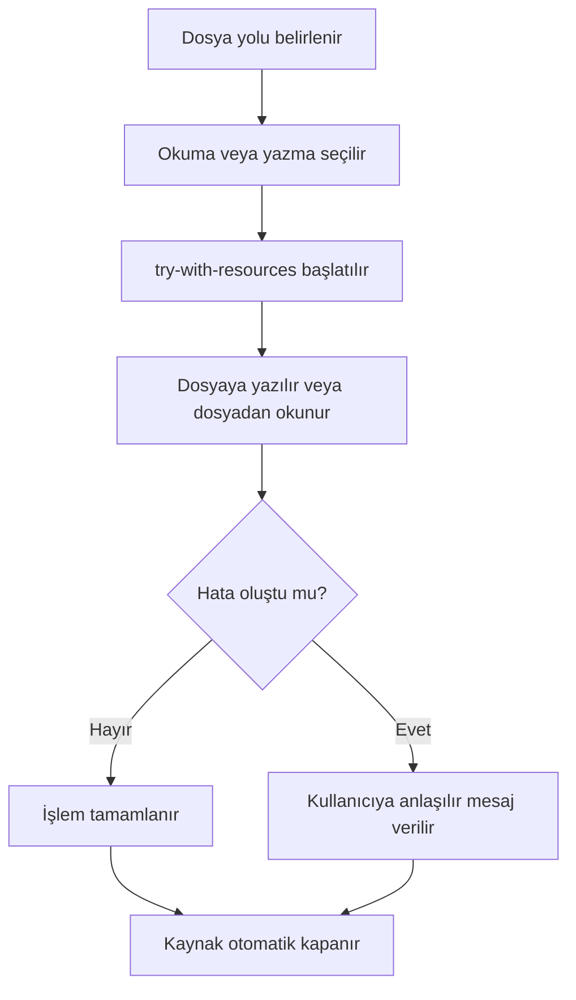

# Dosya İşlemleri ve Kalıcı Veri Saklama

<!-- SECTION_META
order: 001
title: "Bölümün yol haritası"
-->

## Bölümün yol haritası

Önceki bölümlerde program verileri çoğunlukla bellekte tutuldu. Kullanıcıdan alınan bilgiler, dizilerde veya koleksiyonlarda saklandı; program kapandığında bu veriler kayboldu. Gerçek uygulamalarda ise birçok durumda verilerin program kapandıktan sonra da korunması gerekir. Öğrenci listesi, ürün kayıtları, günlük notlar, işlem geçmişi veya ayar bilgileri dosyada saklanabilir.

Bu bölümde Java ile temel dosya işlemleri ve kalıcı veri saklama ele alınacaktır. Amaç, program verilerini dosyaya yazmak ve daha sonra dosyadan okuyarak tekrar kullanabilmektir. Dosya yolu, `File`, `Path`, `Files`, `BufferedReader`, `BufferedWriter`, CSV biçimi, satır satır okuma ve `try-with-resources` konuları sade ve uygulama odaklı örneklerle işlenecektir.

Bu bölümde şu sorulara yanıt aranacaktır:

1. Dosya işlemleri neden gereklidir?
2. Dosya yolu nedir ve göreli yol ile mutlak yol nasıl ayrılır?
3. `File`, `Path` ve `Files` hangi amaçlarla kullanılır?
4. Dosyaya metin nasıl yazılır?
5. Dosya satır satır nasıl okunur?
6. `BufferedReader` ve `BufferedWriter` ne işe yarar?
7. CSV dosya biçimi temel düzeyde nasıl kullanılır?
8. `try-with-resources` dosya kapatma sorununu nasıl azaltır?
9. Dosya yolu yanlış verildiğinde hangi hatalar oluşabilir?
10. CSV Öğrenci Kayıt Sistemi nasıl geliştirilebilir?

> **🎯 Bölüm Hedefi:** Bu bölümün sonunda öğrenci, Java ile temel metin dosyası oluşturabilecek, dosyaya satır yazabilecek, dosyadan satır satır veri okuyabilecek, basit CSV verilerini işleyebilecek ve kaynakları güvenli biçimde kapatmak için `try-with-resources` yapısını kullanabilecektir.

Bu bölümde nesne serileştirme, binary dosyalar ve büyük dosya optimizasyonu ele alınmayacaktır. Amaç, temel Java programlama düzeyinde metin tabanlı dosya işlemlerini öğretmektir.

<!-- SECTION_META
order: 002
title: "Bölümün konumu ve pedagojik rolü"
-->
## Bölümün konumu ve pedagojik rolü

Bu bölüm, önceki bölümlerde öğrenilen kullanıcı girdisi, koleksiyonlar ve hata yönetimi bilgisini kalıcı veri saklama ihtiyacıyla birleştirir. Önceki hata yönetimi bölümünde hatalı durumları yönetmek için `try`, `catch`, `finally` ve temel exception kavramları öğrenildi. Dosya işlemleri, hata yönetiminin en doğal uygulama alanlarından biridir. Çünkü dosya bulunmayabilir, dosyaya yazma izni olmayabilir, dosya yolu yanlış olabilir veya dosya içeriği beklenenden farklı biçimde düzenlenmiş olabilir.

Bu bölümde öğrenci, yalnızca dosyaya yazma ve dosyadan okuma sözdizimini öğrenmeyecek; aynı zamanda dosya işlemlerinin neden hata yönetimiyle birlikte düşünülmesi gerektiğini de görecektir. Özellikle `try-with-resources` yapısı, dosya kaynaklarının otomatik kapanmasını sağlayarak daha güvenli ve okunabilir kod yazmaya yardım eder.

Bu bölüm, sonraki nesne yönelimli programlama bölümünde işlenecek sınıf ve nesne kavramına uygulama odaklı giriş için de hazırlık yapar. Çünkü dosyadan okunan satırları bir sonraki bölümde öğrenci nesnelerine dönüştürmek mümkün olacaktır. Bu bölümde ise veriler basit `String`, dizi ve koleksiyon yapılarıyla işlenecektir.

> **⚠️ Dikkat:** Dosya işlemleri yalnızca “dosyaya yaz ve oku” işleminden ibaret değildir. Dosya yolu, veri biçimi, hata yönetimi ve kaynak kapatma birlikte düşünülmelidir.

<!-- SECTION_META
order: 003
title: "Öğrenme çıktıları"
-->

## Öğrenme çıktıları

Bu bölüm tamamlandığında öğrenci:

1. Dosya işlemlerinin program verilerini kalıcı tutmadaki rolünü açıklayabilir.
2. Dosya yolu, göreli yol ve mutlak yol kavramlarını ayırt edebilir.
3. `File`, `Path` ve `Files` kavramlarını temel düzeyde açıklayabilir.
4. `BufferedWriter` ile metin dosyasına satır yazabilir.
5. `BufferedReader` ile metin dosyasını satır satır okuyabilir.
6. `try-with-resources` yapısını dosya kaynaklarını güvenli kapatmak için kullanabilir.
7. CSV biçimindeki basit verileri virgül ayıracıyla yazabilir ve okuyabilir.
8. Dosya yolu hatalarını ve dosya bulunamadı durumlarını yorumlayabilir.
9. CSV ayıracı yanlış kullanıldığında oluşabilecek mantık hatalarını fark edebilir.
10. CSV Öğrenci Kayıt Sistemi adlı mini uygulamayı geliştirebilir.

<!-- SECTION_META
order: 004
title: "Ön bilgi ve başlangıç varsayımları"
-->
## Ön bilgi ve başlangıç varsayımları

Bu bölüm, öğrencinin aşağıdaki konuları temel düzeyde bildiğini varsayar:

1. Java programının temel yapısı
2. Değişkenler ve veri tipleri
3. Karar yapıları
4. Döngüler
5. Metotlar
6. Diziler
7. `String` işlemleri
8. `ArrayList` kullanımı
9. Hata yönetimi
10. Konsoldan kullanıcı girdisi alma

Bu bölümde dosya işlemleri metin dosyalarıyla sınırlı tutulacaktır. Nesne serileştirme, binary dosya biçimleri ve büyük veri dosyalarının performanslı işlenmesi kapsam dışıdır.

<!-- SECTION_META
order: 005
title: "Ana kavramlar"
-->

## Ana kavramlar

| Kavram | Kısa açıklama | Bu bölümdeki rolü |
|---|---|---|
| `File` | Dosya veya klasör yolunu temsil eder | Dosya var mı kontrolü |
| `Path` | Modern dosya yolu temsilidir | Yol bilgisini düzenli tutma |
| `Files` | Dosya işlemleri için yardımcı metotlar sunar | Okuma, yazma, varlık kontrolü |
| `BufferedReader` | Metin dosyasını verimli okumaya yardım eder | Satır satır okuma |
| `BufferedWriter` | Metin dosyasına verimli yazmaya yardım eder | Satır yazma |
| CSV | Virgül gibi ayırıcılarla düzenlenen metin verisi | Öğrenci kaydı saklama |
| Satır satır okuma | Dosyayı her satırı ayrı işleyerek okuma | CSV kayıtlarını işleme |
| Dosya yolu | Dosyanın sistemdeki konumunu belirtir | Doğru dosyaya erişim |
| `try-with-resources` | Kaynakları otomatik kapatan yapı | Güvenli dosya işlemi |
| Ayırıcı | CSV satırını parçalara bölen karakter | `split(",")` kullanımı |

> **🎯 Sınav Notu:** Dosya işlemlerinde `try-with-resources` kullanmak, `BufferedReader` veya `BufferedWriter` gibi kaynakların işlem sonunda otomatik kapatılmasına yardım eder.

<!-- SECTION_META
order: 006
title: "Gövde Metni"
section_type: body_group
-->

## Gövde Metni

### Dosya işlemleri neden gereklidir?

Bir program çalışırken bellekte tutulan veriler program kapandığında kaybolur. Bu durum her uygulama için uygun değildir. Örneğin bir öğrenci kayıt programında girilen öğrencilerin program kapandıktan sonra da saklanması beklenir.

Bellekte tutulan liste:

```java
ArrayList<String> ogrenciler = new ArrayList<>();
ogrenciler.add("1001,Ayşe,Yılmaz");
```

Bu liste program kapandığında kaybolur. Aynı bilgiyi dosyaya yazarsak daha sonra tekrar okuyabiliriz:

```text
1001,Ayşe,Yılmaz
```

Dosya işlemleri özellikle şu durumlarda kullanılır:

1. Program verisi kalıcı saklanacaksa
2. Kullanıcı çıktıları raporlanacaksa
3. Program başka bir programla metin dosyası üzerinden veri paylaşacaksa
4. Basit kayıt sistemi geliştirilecekse
5. Ayar veya log bilgisi tutulacaksa

> **💡 İpucu:** Başlangıç düzeyinde dosya işlemlerini öğrenmek için önce küçük metin dosyalarıyla çalışmak en doğru yaklaşımdır.

### Dosya yolu: göreli ve mutlak yol

Dosya yolu, bir dosyanın bilgisayar üzerindeki konumunu belirtir. Java programı bir dosyayı okuyacak veya yazacaksa o dosyanın yolunu bilmelidir.

#### Göreli dosya yolu

Göreli yol, programın çalıştığı klasöre göre verilen yoldur.

```java
Path yol = Path.of("ogrenciler.csv");
```

Bu kullanımda `ogrenciler.csv` dosyası programın çalışma klasöründe aranır veya oluşturulur.

Alt klasör kullanımı:
```java
Path yol = Path.of("veriler", "ogrenciler.csv");
```

Bu ifade `veriler/ogrenciler.csv` yolunu temsil eder.

#### Mutlak dosya yolu

Mutlak yol, dosyanın sistemdeki tam konumunu belirtir. Windows ortamında şu biçimde görülebilir:

```text
C:\projeler\java\ogrenciler.csv
```

Linux veya macOS ortamında şu biçimde görülebilir:

```text
/home/kullanici/projeler/java/ogrenciler.csv
```

Mutlak yollar sistemden sisteme değişebilir. Bu nedenle öğretim ve taşınabilir örneklerde göreli yollar daha uygundur.

> **⚠️ Dikkat:** Dosya yolu yanlış verilirse program beklediğiniz dosyayı bulamayabilir veya dosyayı farklı bir klasörde oluşturabilir.

### `File`, `Path` ve `Files` kavramları

Java'da dosya işlemleri için farklı sınıflar kullanılabilir. Bu bölümde üç temel kavrama kısa bir giriş yapılacaktır: `File`, `Path` ve `Files`.

#### `File`

`File`, bir dosya veya klasör yolunu temsil etmek için kullanılabilir.

```java
import java.io.File;

File dosya = new File("ogrenciler.csv");

System.out.println("Var mı?: " + dosya.exists());
System.out.println("Dosya mı?: " + dosya.isFile());
```

`File` sınıfı eski Java sürümlerinden beri kullanılmaktadır. Bu bölümde temel varlık kontrolü için tanıtılacaktır.

#### `Path`

`Path`, modern Java dosya yolu temsilidir. Yol bilgisini daha düzenli biçimde ifade etmeyi sağlar.

```java
import java.nio.file.Path;

Path yol = Path.of("ogrenciler.csv");
```

`Path` nesnesi dosyanın konumunu temsil eder; tek başına dosyanın içeriğini okumaz veya yazmaz.

#### `Files`

`Files`, dosya işlemleri için yardımcı metotlar içeren bir sınıftır.

```java
import java.nio.file.Files;
import java.nio.file.Path;

Path yol = Path.of("ogrenciler.csv");

if (Files.exists(yol)) {
    System.out.println("Dosya var.");
}
```

`Files` sınıfı ile dosya varlığı kontrol edilebilir, satırlar okunabilir veya yazılabilir. Bu bölümde temel düzeyde kullanılacaktır.

> **🎯 Sınav Notu:** `Path` dosya yolunu temsil eder; `Files` ise bu yol üzerinde okuma, yazma veya kontrol işlemleri yapmaya yarayan yardımcı metotlar sunar.

### `BufferedWriter` ile dosyaya yazma

Metin dosyasına veri yazmak için `BufferedWriter` kullanılabilir. `BufferedWriter`, veriyi doğrudan tek tek yazmak yerine tamponlama yaparak daha verimli yazmaya yardım eder. Başlangıç düzeyinde önemli olan, bu sınıfın metin dosyasına satır yazmak için kullanışlı olduğunu bilmektir.

Basit örnek:

```java
import java.io.BufferedWriter;
import java.io.IOException;
import java.nio.file.Files;
import java.nio.file.Path;

Path yol = Path.of("notlar.txt");

try (BufferedWriter writer = Files.newBufferedWriter(yol)) {
    writer.write("Merhaba dosya");
    writer.newLine();
    writer.write("İkinci satır");
} catch (IOException e) {
    System.out.println("Dosyaya yazma sırasında hata oluştu.");
}
```

Bu kod `notlar.txt` dosyasına iki satır yazar.

#### `try-with-resources` neden kullanılır?

Dosya yazma işlemlerinde kullanılan kaynakların kapatılması gerekir. `try-with-resources`, kaynakların işlem sonunda otomatik kapatılmasını sağlar.

```java
try (BufferedWriter writer = Files.newBufferedWriter(yol)) {
    writer.write("Satır");
}
```

Bu kullanımda `writer` kaynağı blok sonunda otomatik kapatılır.

> **💡 İpucu:** Dosya okuma veya yazma işlemlerinde `try-with-resources` kullanmak, dosyayı kapatmayı unutma riskini azaltır.

### `BufferedReader` ile satır satır okuma

Metin dosyasını okumak için `BufferedReader` kullanılabilir. Dosyadaki veriler çoğu zaman satır satır işlenir. Özellikle CSV dosyalarında her satır bir kaydı temsil edebilir.

Basit okuma örneği:

```java
import java.io.BufferedReader;
import java.io.IOException;
import java.nio.file.Files;
import java.nio.file.Path;

Path yol = Path.of("notlar.txt");

try (BufferedReader reader = Files.newBufferedReader(yol)) {
    String satir = reader.readLine();

    while (satir != null) {
        System.out.println(satir);
        satir = reader.readLine();
    }
} catch (IOException e) {
    System.out.println("Dosya okuma sırasında hata oluştu.");
}
```

Bu kod dosyayı satır satır okur ve her satırı ekrana yazdırır.

#### `readLine` nasıl çalışır?

`readLine` metodu dosyadan bir satır okur. Okunacak satır kalmadığında `null` döndürür. Bu nedenle satır satır okuma için genellikle şu kalıp kullanılır:

```java
String satir = reader.readLine();

while (satir != null) {
    // satırı işle
    satir = reader.readLine();
}
```

> **⚠️ Dikkat:** `readLine` sonucu `null` olduğunda artık dosyada okunacak satır kalmamıştır. `null` değer üzerinde `split` gibi metotlar çağırmaya çalışmak hataya neden olabilir.

### CSV dosya biçimi

CSV, virgül gibi bir ayırıcı ile düzenlenen metin tabanlı veri biçimidir. Başlangıç düzeyinde her satır bir kayıt, satırdaki değerler ise alanlar olarak düşünülebilir.

Örnek CSV içeriği:

```text
1001,Ayşe,Yılmaz,85
1002,Mehmet,Demir,72
1003,Zeynep,Kaya,90
```

Bu örnekte her satır bir öğrenciyi temsil eder. Alanlar sırasıyla öğrenci numarası, ad, soyad ve not olabilir.

#### CSV satırını parçalama

CSV satırı `split` ile parçalara ayrılabilir:

```java
String satir = "1001,Ayşe,Yılmaz,85";
String[] alanlar = satir.split(",");

System.out.println("No: " + alanlar[0]);
System.out.println("Ad: " + alanlar[1]);
System.out.println("Soyad: " + alanlar[2]);
System.out.println("Not: " + alanlar[3]);
```

Beklenen çıktı:

```text
No: 1001
Ad: Ayşe
Soyad: Yılmaz
Not: 85
```

#### CSV kullanımında dikkat

Bu bölümde CSV kullanımı basit tutulacaktır. Alanların içinde virgül bulunması, tırnaklı alanlar ve özel kaçış karakterleri gibi ayrıntılar kapsam dışıdır. Öğretim amacıyla her satırda basit ve virgülle ayrılmış alanlar kullanılacaktır.

> **⚠️ Dikkat:** CSV ayıracı olarak virgül kullanıyorsanız, yazma ve okuma tarafında aynı ayıracı kullanmalısınız. Yazarken noktalı virgül, okurken virgül kullanmak mantık hatasına yol açar.

### Dosya işlemi akışı

Dosya işlemlerinde genel akış şu şekilde özetlenebilir:

<!-- MERMAID_META
order: 001
id: dosya_islemleri_diagram_001
chapter_alias: dosya_islemleri
title: "Dosya okuma ve yazma işlemlerinde temel akış"
kind: flowchart
output_file: assets/auto/mermaid/dosya_islemleri_diagram_001.png
manual_override: true
validation_mode: render
-->



**Diyagram:** Dosya okuma ve yazma işlemlerinde temel akış.

**Görsel üretim notu:** Bu Mermaid diyagramı final DOCX/PDF üretiminden önce PNG'ye dönüştürülmeli; ham `flowchart TD` kodu final çıktıda görünmemelidir.

Bu akış, dosya yolu, hata yönetimi ve kaynak kapatma adımlarının birlikte düşünülmesi gerektiğini gösterir.

### Adım adım kod örnekleri

Bu bölümde üç temel kod örneği verilecektir. Kod örneklerinde dosya adı ile `public class` adı uyumlu tutulacaktır.
`CODE_META` içinde `intentional_mismatch: true` olan örnekler, öğretim amacıyla bilerek hatalı bırakılmış örneklerdir. Bu örnekler otomatik çalıştırma yerine inceleme ve karşılaştırma için kullanılmalıdır.

#### Kod: Temel dosyaya yazma ve okuma

<!-- CODE_META
order: 001
code_id: dosya_islemleri_001
extension: java
kind: example
title: "Temel dosyaya yazma ve okuma"
file: DosyaIslemleriTemel.java
main_class: DosyaIslemleriTemel
link: "{repo}/{project-alias}/{chapter-alias}/{file}"
qrfile: dosya_islemleri_001.png
extract: true
test: compile_run_assert
github: true
qr_policy: dual
expected_stdout_contains: "Java dosya işlemleri;Satır satır yazma örneği"
intentional_mismatch: false
validation_mode: runnable
-->

{width=2.8cm} 


```java
// Dosya: DosyaIslemleriTemel.java
import java.io.BufferedReader;
import java.io.BufferedWriter;
import java.io.IOException;
import java.nio.file.Files;
import java.nio.file.Path;

public class DosyaIslemleriTemel {
    public static void main(String[] args) {
        Path yol = Path.of("temel_notlar.txt");

        try (BufferedWriter writer = Files.newBufferedWriter(yol)) {
            writer.write("Java dosya işlemleri");
            writer.newLine();
            writer.write("Satır satır yazma örneği");
        } catch (IOException e) {
            System.out.println("Yazma sırasında hata oluştu.");
        }

        try (BufferedReader reader = Files.newBufferedReader(yol)) {
            String satir = reader.readLine();

            while (satir != null) {
                System.out.println(satir);
                satir = reader.readLine();
            }
        } catch (IOException e) {
            System.out.println("Okuma sırasında hata oluştu.");
        }
    }
}
```

**Kodun amacı:** `BufferedWriter` ile dosyaya yazma ve `BufferedReader` ile dosyadan satır satır okuma işlemini göstermektir.

**Kritik satırların açıklaması:**

1. `Path.of("temel_notlar.txt")` dosya yolunu oluşturur.
2. `Files.newBufferedWriter(yol)` dosyaya yazmak için writer üretir.
3. `writer.write` dosyaya metin yazar.
4. `writer.newLine()` yeni satıra geçer.
5. `Files.newBufferedReader(yol)` dosyadan okumak için reader üretir.
6. `readLine()` her çağrıda bir satır okur.
7. `try-with-resources` kaynakları otomatik kapatır.

**Beklenen çıktı veya davranış:**

```text
Java dosya işlemleri
Satır satır yazma örneği
```

Program ayrıca çalışma klasöründe `temel_notlar.txt` adlı bir dosya oluşturur.

**Olası hata ve dikkat noktası:** Programın dosya oluşturduğu klasör, IDE veya terminalin çalışma klasörüne göre değişebilir.

#### Kod: CSV öğrenci kayıtlarını yazma ve okuma
<!-- CODE_META

order: 002
code_id: dosya_islemleri_002
extension: java
kind: example
title: "CSV öğrenci kayıtlarını yazma ve okuma"
file: DosyaIslemleriUygulama.java
main_class: DosyaIslemleriUygulama
link: "{repo}/{project-alias}/{chapter-alias}/{file}"
qrfile: dosya_islemleri_002.png
extract: true
test: compile_run_assert
github: true
qr_policy: dual
expected_stdout_contains: "No: 1001;Ad Soyad: Ayşe Yılmaz;Not: 85;No: 1002;Ad Soyad: Mehmet Demir;Not: 72"
intentional_mismatch: false
validation_mode: runnable
-->

{width=2.8cm} 


```java
// Dosya: DosyaIslemleriUygulama.java
import java.io.BufferedReader;
import java.io.BufferedWriter;
import java.io.IOException;
import java.nio.file.Files;
import java.nio.file.Path;

public class DosyaIslemleriUygulama {
    public static void main(String[] args) {
        Path yol = Path.of("ogrenciler.csv");

        try (BufferedWriter writer = Files.newBufferedWriter(yol)) {
            writer.write("1001,Ayşe,Yılmaz,85");
            writer.newLine();
            writer.write("1002,Mehmet,Demir,72");
            writer.newLine();
            writer.write("1003,Zeynep,Kaya,90");
        } catch (IOException e) {
            System.out.println("CSV yazma sırasında hata oluştu.");
        }

        try (BufferedReader reader = Files.newBufferedReader(yol)) {
            String satir = reader.readLine();

            while (satir != null) {
                String[] alanlar = satir.split(",");

                if (alanlar.length == 4) {
                    System.out.println("No: " + alanlar[0]);
                    System.out.println("Ad Soyad: "
                            + alanlar[1] + " " + alanlar[2]);
                    System.out.println("Not: " + alanlar[3]);
                    System.out.println("---");
                }

                satir = reader.readLine();
            }
        } catch (IOException e) {
            System.out.println("CSV okuma sırasında hata oluştu.");
        }
    }
}
```

**Kodun amacı:** CSV biçiminde öğrenci kayıtları yazmayı ve dosyadan satır satır okuyarak alanlara ayırmayı göstermektir.

**Kritik satırların açıklaması:**

1. Her CSV satırı bir öğrenciyi temsil eder.
2. Alanlar virgül ile ayrılır.
3. `satir.split(",")` satırı alanlara böler.
4. `alanlar.length == 4` basit biçim kontrolü yapar.
5. Her öğrenci kaydı okunabilir biçimde ekrana yazdırılır.

**Beklenen çıktı veya davranış:**

```text
No: 1001
Ad Soyad: Ayşe Yılmaz
Not: 85
---
No: 1002
Ad Soyad: Mehmet Demir
Not: 72
---
No: 1003
Ad Soyad: Zeynep Kaya
Not: 90
---
```

**Olası hata ve dikkat noktası:** CSV satırında beklenen alan sayısı yoksa `alanlar[3]` gibi erişimler hata üretebilir. Bu nedenle alan sayısı kontrol edilmelidir.

#### Kod: Hatalı ve düzeltilmiş örnek

Aşağıdaki örnekte CSV dosyasına noktalı virgül ile yazılmış veri, virgül ile okunmaya çalışılmıştır.

<!-- CODE_META

order: 003
code_id: dosya_islemleri_003
extension: java
kind: broken_example
title: "Hatalı ve düzeltilmiş örnek"
file: DosyaIslemleriHataDuzeltme.java
main_class: DosyaIslemleriHataDuzeltme
link: "{repo}/{project-alias}/{chapter-alias}/{file}"
qrfile: dosya_islemleri_003.png
extract: true
test: skip
github: true
qr_policy: page
intentional_mismatch: true
mismatch_kind: delimiter
mismatch_summary: "CSV satırı ';' ile ayrılmışken split(',') kullanılıyor."
expected_outcome: "Hatalı ayırıcı kullanımının neden sorun yarattığı gösterilmeli."
paired_with: dosya_islemleri_004
validation_mode: review_only
-->

{width=2.8cm} 


```java
// Dosya: DosyaIslemleriHataDuzeltme.java
public class DosyaIslemleriHataDuzeltme {
    public static void main(String[] args) {
        String satir = "1001;Ayşe;Yılmaz;85";

        String[] alanlar = satir.split(",");

        System.out.println("Ad: " + alanlar[1]);
    }
}
```

Bu kod çalışma zamanında hata üretebilir. Çünkü `split(",")` virgül arar; satırda virgül olmadığı için dizi tek elemanlı olur. `alanlar[1]` geçersiz erişimdir.

Düzeltilmiş sürüm:

<!-- CODE_META

order: 004
code_id: dosya_islemleri_004
extension: java
kind: fixed_example
title: "Hatalı ve düzeltilmiş örnek"
file: DosyaIslemleriHataDuzeltme2.java
main_class: DosyaIslemleriHataDuzeltme2
link: "{repo}/{project-alias}/{chapter-alias}/{file}"
qrfile: dosya_islemleri_004.png
extract: true
test: compile_run_assert
github: true
qr_policy: dual
expected_stdout_contains: "Ad: Ayşe"
intentional_mismatch: false
paired_with: dosya_islemleri_003
validation_mode: runnable
-->

{width=2.8cm} 


```java
// Dosya: DosyaIslemleriHataDuzeltme2.java
public class DosyaIslemleriHataDuzeltme2 {
    public static void main(String[] args) {
        String satir = "1001;Ayşe;Yılmaz;85";

        String[] alanlar = satir.split(";");

        if (alanlar.length == 4) {
            System.out.println("Ad: " + alanlar[1]);
        } else {
            System.out.println("CSV satırı beklenen biçimde değil.");
        }
    }
}
```

**Kodun amacı:** CSV ayıracının yazma ve okuma tarafında tutarlı seçilmesi gerektiğini göstermek.

**Kritik satırların açıklaması:**

1. Hatalı kodda veri `;` ile ayrılmıştır.
2. Hatalı kodda `split(",")` kullanılmıştır.
3. Düzeltilmiş kodda `split(";")` ile doğru ayırıcı seçilmiştir.
4. `alanlar.length == 4` kontrolü indeks hatasını önler.

**Beklenen çıktı veya davranış:**

```text
Ad: Ayşe
```

**Olası hata ve dikkat noktası:** CSV verilerinde ayırıcı karakter baştan belirlenmeli ve tutarlı kullanılmalıdır.

> **⚠️ Sık Yapılan Hata:** Dosyaya yazarken farklı, okurken farklı CSV ayıracı kullanmak satırların yanlış parçalanmasına ve indeks hatalarına neden olabilir.

### Kodun çalışma mantığı ve beklenen çıktı

Dosya işlemlerini anlamak için yazma ve okuma adımlarını ayrı düşünmek gerekir.

Aşağıdaki işlem dizisini ele alalım:

```java
Path yol = Path.of("ogrenciler.csv");

try (BufferedWriter writer = Files.newBufferedWriter(yol)) {
    writer.write("1001,Ayşe,Yılmaz,85");
    writer.newLine();
}
```

Bu kodun iz sürme tablosu:

| Adım | İşlem | Sonuç |
|---:|---|---|
| 1 | Dosya yolu oluşturulur | `ogrenciler.csv` hedeflenir |
| 2 | Writer açılır | Yazma kaynağı hazırlanır |
| 3 | Satır yazılır | Dosyaya kayıt eklenir |
| 4 | `newLine` çağrılır | Satır sonu eklenir |
| 5 | Blok biter | Writer otomatik kapanır |

Okuma tarafında ise akış şöyledir:

| Adım | İşlem | Sonuç |
|---:|---|---|
| 1 | Reader açılır | Dosya okumaya hazırlanır |
| 2 | `readLine` çağrılır | İlk satır okunur |
| 3 | Satır `null` mı? | Değilse işlenir |
| 4 | Satır `split` ile ayrılır | Alanlar elde edilir |
| 5 | Sonraki satır okunur | Döngü devam eder |

> **💡 İpucu:** Dosya işlemlerinde hata ararken önce dosyanın gerçekten hangi klasörde oluştuğunu kontrol edin. Birçok başlangıç hatası yanlış çalışma klasörü beklentisinden kaynaklanır.

### Uçtan uca mini uygulama: CSV Öğrenci Kayıt Sistemi

Bu bölümün mini uygulaması, öğrenci kayıtlarını CSV dosyasında saklayan küçük bir konsol uygulamasıdır. Program kullanıcıdan öğrenci numarası, ad, soyad ve not bilgisi alır; bu bilgileri CSV dosyasına yazar ve dosyadaki kayıtları okuyarak ekrana listeler.

**Uygulama adı:** CSV Öğrenci Kayıt Sistemi

**Dosya adı:** `CsvOgrenciKayitSistemi.java`

**Amaç:** `Path`, `Files`, `BufferedReader`, `BufferedWriter`, CSV, satır satır okuma ve `try-with-resources` kavramlarını tek bir küçük uygulamada birleştirmek.

#### Uygulamanın kodu

<!-- CODE_META

order: 005
code_id: dosya_islemleri_005
extension: java
kind: application
title: "CSV Öğrenci Kayıt Sistemi"
file: CsvOgrenciKayitSistemi.java
main_class: CsvOgrenciKayitSistemi
link: "{repo}/{project-alias}/{chapter-alias}/{file}"
qrfile: dosya_islemleri_005.png
extract: true
test: compile
github: true
qr_policy: dual
intentional_mismatch: false
validation_mode: compile_only
-->

{width=2.8cm} 


```java
// Dosya: CsvOgrenciKayitSistemi.java
import java.io.BufferedReader;
import java.io.BufferedWriter;
import java.io.IOException;
import java.nio.file.Files;
import java.nio.file.Path;
import java.nio.file.StandardOpenOption;
import java.util.Scanner;

public class CsvOgrenciKayitSistemi {
    private static final Path DOSYA_YOLU = Path.of("ogrenciler.csv");

    public static void main(String[] args) {
        Scanner scanner = new Scanner(System.in);
        boolean devam = true;

        while (devam) {
            menuYazdir();
            System.out.print("Seçiminiz: ");
            String secim = scanner.nextLine();

            if (secim.equals("1")) {
                ogrenciEkle(scanner);
            } else if (secim.equals("2")) {
                ogrencileriListele();
            } else if (secim.equals("0")) {
                devam = false;
            } else {
                System.out.println("Geçersiz seçim.");
            }
        }

        System.out.println("Program sonlandırıldı.");
        scanner.close();
    }

    public static void menuYazdir() {
        System.out.println();
        System.out.println("=== CSV Öğrenci Kayıt Sistemi ===");
        System.out.println("1 - Öğrenci ekle");
        System.out.println("2 - Öğrencileri listele");
        System.out.println("0 - Çıkış");
    }

    public static void ogrenciEkle(Scanner scanner) {
        System.out.print("Öğrenci no: ");
        String no = scanner.nextLine().trim();

        System.out.print("Ad: ");
        String ad = scanner.nextLine().trim();

        System.out.print("Soyad: ");
        String soyad = scanner.nextLine().trim();

        System.out.print("Not: ");
        String not = scanner.nextLine().trim();

        String csvSatiri = no + "," + ad + "," + soyad + "," + not;

        try (BufferedWriter writer = Files.newBufferedWriter(
                DOSYA_YOLU,
                StandardOpenOption.CREATE,
                StandardOpenOption.APPEND)) {
            writer.write(csvSatiri);
            writer.newLine();
            System.out.println("Öğrenci kaydı eklendi.");
        } catch (IOException e) {
            System.out.println("Hata: Dosyaya yazılamadı.");
        }
    }

    public static void ogrencileriListele() {
        if (!Files.exists(DOSYA_YOLU)) {
            System.out.println("Henüz kayıt dosyası yok.");
            return;
        }

        try (BufferedReader reader = Files.newBufferedReader(DOSYA_YOLU)) {
            String satir = reader.readLine();
            int sayac = 1;

            while (satir != null) {
                yazdirCsvKaydi(satir, sayac);
                sayac++;
                satir = reader.readLine();
            }
        } catch (IOException e) {
            System.out.println("Hata: Dosya okunamadı.");
        }
    }

    public static void yazdirCsvKaydi(String satir, int sira) {
        String[] alanlar = satir.split(",");

        if (alanlar.length != 4) {
            System.out.println(sira + ". kayıt beklenen biçimde değil.");
            return;
        }

        System.out.println(sira + ". öğrenci");
        System.out.println("No: " + alanlar[0]);
        System.out.println("Ad Soyad: " + alanlar[1] + " " + alanlar[2]);
        System.out.println("Not: " + alanlar[3]);
        System.out.println("---");
    }
}
```

#### Örnek kullanım akışı

Öğrenci ekleme:

```text
1 - Öğrenci ekle
Öğrenci no: 1001
Ad: Ayşe
Soyad: Yılmaz
Not: 85
Öğrenci kaydı eklendi.
```

Listeleme:

```text
2 - Öğrencileri listele
1. öğrenci
No: 1001
Ad Soyad: Ayşe Yılmaz
Not: 85
---
```

Geçersiz seçim:

```text
Seçiminiz: 9
Geçersiz seçim.
```

#### Uygulama akışının açıklaması

Program şu temel parçalardan oluşur:

1. `DOSYA_YOLU` sabiti ile CSV dosyasının yolu belirlenir.
2. Menü kullanıcıya işlem seçeneklerini gösterir.
3. Öğrenci ekleme işleminde bilgiler CSV satırı hâline getirilir.
4. `BufferedWriter` ve `StandardOpenOption.APPEND` ile kayıt dosyaya eklenir.
5. Listeleme işleminde dosya varsa `BufferedReader` ile satır satır okunur.
6. Her satır `split(",")` ile alanlara ayrılır.
7. Alan sayısı kontrol edilerek hatalı kayıtlar güvenli biçimde atlanır.

#### Üç kullanım durumu

| Kullanım durumu | Örnek işlem | Beklenen davranış |
|---|---|---|
| İlk kayıt ekleme | `1001,Ayşe,Yılmaz,85` | Dosya oluşturulur ve kayıt yazılır |
| İkinci kayıt ekleme | `1002,Mehmet,Demir,72` | Kayıt dosyanın sonuna eklenir |
| Listeleme | Menüden `2` seçilir | Kayıtlar okunabilir biçimde yazdırılır |

> **Alıştırma Molası:** Uygulamaya “notu 60 ve üzeri olan öğrencileri listele” seçeneği ekleyiniz. CSV satırındaki not alanını `Integer.parseInt` ile sayıya dönüştürerek kontrol ediniz.


<!-- SECTION_META
order: 007
title: "Sık yapılan hatalar ve yanlış sezgiler"
-->

## Sık yapılan hatalar ve yanlış sezgiler

Dosya işlemlerinde başlangıç öğrencilerinin yaptığı hatalar çoğunlukla dosya yolu, kaynak kapatma ve CSV biçimiyle ilgilidir.

### Dosya yolunu yanlış vermek

Yanlış düşünce:

```text
Dosya her zaman Java dosyasının bulunduğu klasörde aranır.
```

Düzeltme:

Dosya göreli yol ile verildiyse programın çalışma klasörüne göre aranır. IDE ve terminalde çalışma klasörü farklı olabilir.

### Dosyayı kapatmayı unutmak

Hatalı yaklaşım:

```java
BufferedWriter writer = Files.newBufferedWriter(Path.of("notlar.txt"));
writer.write("Merhaba");
```

Bu kodda writer kapatılmamıştır. Daha güvenli yaklaşım:

```java
try (BufferedWriter writer =
        Files.newBufferedWriter(Path.of("notlar.txt"))) {
    writer.write("Merhaba");
}
```

### CSV ayıracını yanlış kullanmak

Yazarken:

```text
1001;Ayşe;Yılmaz;85
```

Okurken:

```java
String[] alanlar = satir.split(",");
```

Bu durumda satır beklenen biçimde parçalanmaz. Yazma ve okuma tarafında aynı ayırıcı kullanılmalıdır.

### Alan sayısını kontrol etmeden indeks kullanmak

Hatalı kullanım:

```java
String[] alanlar = satir.split(",");
System.out.println(alanlar[3]);
```

Daha güvenli kullanım:

```java
String[] alanlar = satir.split(",");

if (alanlar.length == 4) {
    System.out.println(alanlar[3]);
}
```

### Dosya yokken doğrudan okumaya çalışmak

Dosya yoksa okuma işlemi hata üretebilir. Bu nedenle `Files.exists` ile kontrol yapılabilir.

```java
if (!Files.exists(yol)) {
    System.out.println("Dosya bulunamadı.");
    return;
}
```

> **⚠️ Dikkat:** Dosya işlemlerinde hata yönetimi isteğe bağlı bir ayrıntı değil, güvenli program yazmanın temel parçasıdır.

<!-- SECTION_META
order: 008
title: "Hata ayıklama egzersizi"
-->


## Hata ayıklama egzersizi

Aşağıdaki kodu inceleyiniz.

<!-- CODE_META

order: 006
code_id: dosya_islemleri_006
extension: java
kind: broken_example
title: "CSV Ayıracı Hatası"
file: CsvAyiracHatasi.java
main_class: CsvAyiracHatasi
link: "{repo}/{project-alias}/{chapter-alias}/{file}"
qrfile: dosya_islemleri_006.png
extract: true
test: skip
github: true
qr_policy: page
intentional_mismatch: true
mismatch_kind: delimiter
mismatch_summary: "CSV satırı ';' ile ayrılmışken split(',') kullanılıyor."
expected_outcome: "Satırın yanlış ayırıcıyla parçalanınca indeks erişiminin neden riskli olduğu gösterilmeli."
paired_with: dosya_islemleri_007
validation_mode: review_only
-->

{width=2.8cm} 

```java
// Dosya: CsvAyiracHatasi.java
public class CsvAyiracHatasi {
    public static void main(String[] args) {
        String satir = "1001;Ayşe;Yılmaz;85";

        String[] alanlar = satir.split(",");

        System.out.println("Öğrenci adı: " + alanlar[1]);
    }
}
```

**Hata belirtisi:** Kod derlenir; ancak çalışma zamanında hata oluşabilir. Çünkü satır noktalı virgül ile ayrılmıştır; fakat kod virgüle göre parçalama yapmaktadır. Bu nedenle `alanlar` dizisi beklenen uzunlukta değildir.

<!-- SUBSECTION_META
order: 001
title: "Öğrenciye sorular"
-->

**Öğrenciye sorular:**

1. CSV satırında hangi ayırıcı kullanılmıştır?
2. Kod hangi ayırıcıya göre parçalama yapmaktadır?
3. `alanlar.length` değeri bu örnekte kaç olabilir?
4. `alanlar[1]` erişimi neden risklidir?
5. Ayırıcı tutarlılığı nasıl sağlanmalıdır?
6. Alan sayısı kontrolü neden gereklidir?

Düzeltilmiş kod:
<!-- CODE_META

order: 007
code_id: dosya_islemleri_007
extension: java
kind: fixed_example
title: "CSV Ayıracı Hatası Düzeltilmiş"
file: CsvAyiracHatasi2.java
main_class: CsvAyiracHatasi2
link: "{repo}/{project-alias}/{chapter-alias}/{file}"
qrfile: dosya_islemleri_007.png
extract: true
test: compile_run_assert
github: true
qr_policy: dual
expected_stdout_contains: "Öğrenci adı: Ayşe"
intentional_mismatch: false
paired_with: dosya_islemleri_006
validation_mode: runnable
-->

{width=2.8cm} 

```java
// Dosya: CsvAyiracHatasi2.java
public class CsvAyiracHatasi2 {
    public static void main(String[] args) {
        String satir = "1001;Ayşe;Yılmaz;85";

        String[] alanlar = satir.split(";");

        if (alanlar.length == 4) {
            System.out.println("Öğrenci adı: " + alanlar[1]);
        } else {
            System.out.println("Kayıt beklenen biçimde değil.");
        }
    }
}
```

Kısa açıklama: CSV satırı hangi ayırıcıyla yazıldıysa aynı ayırıcıyla okunmalıdır. Ayrıca alan sayısı kontrol edilmeden indeks erişimi yapılmamalıdır.

<!-- SECTION_META
order: 009
title: "Bölümün sonraki bölümlerle ilişkisi"
-->

## Bölümün sonraki bölümlerle ilişkisi

Bu bölümde Java ile temel metin dosyası işlemleri öğrenildi. Öğrenci artık program verilerini basit dosyalara yazabilir, dosyadan satır satır okuyabilir ve CSV biçimindeki kayıtları temel düzeyde işleyebilir. Hata yönetimi, dosya yolu ve kaynak kapatma konuları dosya işlemleriyle birlikte uygulamalı olarak pekiştirildi.

Bir sonraki bölümde sınıf ve nesne kavramına uygulama odaklı giriş yapılacaktır. Bu bölümde CSV satırları basit `String[]` alanlarına ayrıldı. Sonraki bölümde bu tür veriler bir `Ogrenci` sınıfı ile temsil edilebilecek, böylece dosyadan okunan verilerin daha düzenli nesnelere dönüştürülmesi için temel hazırlanacaktır.

<!-- SECTION_META
order: 010
title: "Bölüm özeti"
-->

## Bölüm özeti

Bu bölümde Java ile temel dosya işlemleri ele alındı. Program verilerinin yalnızca bellekte tutulduğunda program kapanınca kaybolacağı, dosyaya yazıldığında ise daha sonra tekrar okunabileceği açıklandı.

Dosya yolu kavramı, göreli ve mutlak yol ayrımıyla birlikte işlendi. `File`, `Path` ve `Files` yapıları temel düzeyde tanıtıldı. `Path` ile yol temsil edilebileceği, `Files` ile bu yol üzerinde okuma, yazma ve kontrol işlemleri yapılabileceği vurgulandı.

`BufferedWriter` ile dosyaya metin yazma, `BufferedReader` ile dosyadan satır satır okuma örnekleri verildi. Kaynakların güvenli biçimde kapatılması için `try-with-resources` kullanımı gösterildi.

CSV biçimi, her satırın bir kayıt ve her alanın ayırıcı ile ayrıldığı basit metin biçimi olarak ele alındı. Öğrenci kayıtları üzerinden CSV yazma, okuma, `split` ile parçalama ve alan sayısı kontrolü uygulandı.

Son olarak CSV Öğrenci Kayıt Sistemi uygulamasıyla dosya yolu, CSV, satır satır okuma, dosyaya ekleme ve hata yönetimi birlikte kullanıldı. Bu bölüm, dosyadaki ham metin verilerinden nesne tabanlı veri modellemeye geçiş için temel hazırlık sağladı.

<!-- SECTION_META
order: 011
title: "Terim sözlüğü"
-->

## Terim sözlüğü

| Terim | Açıklama |
|---|---|
| Dosya işlemi | Programın dosyadan veri okuması veya dosyaya veri yazması |
| Dosya yolu | Dosyanın sistemdeki konumunu belirten ifade |
| Göreli yol | Programın çalışma klasörüne göre verilen dosya yolu |
| Mutlak yol | Dosyanın sistemdeki tam konumu |
| `File` | Dosya veya klasör yolunu temsil eden sınıf |
| `Path` | Modern dosya yolu temsilcisi |
| `Files` | Dosya okuma, yazma ve kontrol metotları sunan sınıf |
| `BufferedReader` | Metin dosyasını satır satır okumaya yarayan sınıf |
| `BufferedWriter` | Metin dosyasına yazmaya yarayan sınıf |
| CSV | Ayırıcılarla düzenlenen metin tabanlı veri biçimi |
| Ayırıcı | CSV alanlarını birbirinden ayıran karakter |
| `readLine` | Dosyadan bir satır okuyan metot |
| `try-with-resources` | Kaynakları otomatik kapatan `try` yapısı |
| `IOException` | Girdi/çıktı işlemlerinde oluşabilecek hata türü |
| `StandardOpenOption.APPEND` | Dosyanın sonuna ekleme yapmayı sağlayan seçenek |

<!-- SECTION_META
order: 012
title: "Kendini değerlendirme soruları"
-->

## Kendini değerlendirme soruları

### Doğru/Yanlış soruları

1. `Path` dosya yolunu temsil etmek için kullanılabilir. (D/Y)
2. `BufferedReader` dosyaya yazmak için kullanılır. (D/Y)
3. `BufferedWriter` dosyaya metin yazmak için kullanılabilir. (D/Y)
4. `try-with-resources` kaynak kapatma riskini azaltır. (D/Y)
5. CSV satırı her zaman aynı ayırıcıyla yazılıp okunmalıdır. (D/Y)
6. `readLine` okunacak satır kalmadığında `null` döndürebilir. (D/Y)
7. Dosya yolu yanlış olsa bile program her zaman doğru dosyayı bulur. (D/Y)

### Açık uçlu kavramsal sorular

1. Dosya işlemleri neden gereklidir?
2. Göreli dosya yolu ile mutlak dosya yolu arasındaki fark nedir?
3. `File`, `Path` ve `Files` kavramlarını temel düzeyde karşılaştırınız.
4. `BufferedWriter` ile dosyaya yazma adımlarını açıklayınız.
5. `BufferedReader` ile satır satır okuma nasıl yapılır?
6. `try-with-resources` yapısının yararını açıklayınız.
7. CSV biçimi nedir? Basit bir öğrenci kaydı örneği veriniz.
8. CSV ayıracının yanlış seçilmesi hangi hatalara yol açabilir?

<!-- SECTION_META
order: 013
title: "Programlama alıştırmaları"
-->

## Programlama alıştırmaları

### Kolay düzey

1. `BasitDosyaYazma.java` adlı programda `notlar.txt` dosyasına iki satır yazınız.
2. `BasitDosyaOkuma.java` adlı programda bir metin dosyasını satır satır okuyunuz.
3. `DosyaVarMi.java` adlı programda `Files.exists` ile dosya varlığını kontrol ediniz.
4. `CsvSatiriParcala.java` adlı programda `"1001,Ayşe,Yılmaz,85"` satırını parçalara ayırınız.

### Orta düzey

1. `OgrenciCsvYaz.java` programında üç öğrenci kaydını CSV dosyasına yazınız.
2. `OgrenciCsvOku.java` programında CSV dosyasındaki kayıtları okuyup ekrana yazdırınız.
3. CSV satırlarında alan sayısını kontrol eden bir program yazınız.
4. Dosya yoksa kullanıcıya “Henüz kayıt yok” mesajı veren program geliştiriniz.

### Zor düzey

1. `CsvOgrenciKayitSistemi.java` uygulamasına “notu 60 ve üzeri olanları listele” seçeneği ekleyiniz.
2. Aynı uygulamaya öğrenci numarasına göre arama seçeneği ekleyiniz.
3. Hatalı biçimde yazılmış CSV satırlarını atlayıp raporlayan metot yazınız.
4. Dosya yolu kullanıcıdan alınan ve dosya yoksa oluşturulan bir program geliştiriniz.
5. CSV ayıracını yanlış kullanarak hata üreten bir örnek yazınız ve düzeltiniz.

### Ek hata ayıklama alıştırması

Aşağıdaki kodu inceleyiniz.

<!-- CODE_META

order: 008
code_id: dosya_islemleri_008
extension: java
kind: broken_example
title: "Dosya Yolu Hatası"
file: DosyaYoluHatasi.java
main_class: DosyaYoluHatasi
link: "{repo}/{project-alias}/{chapter-alias}/{file}"
qrfile: dosya_islemleri_008.png
extract: true
test: skip
github: true
qr_policy: page
intentional_mismatch: true
mismatch_kind: wrong_path
mismatch_summary: "Dosya varlık kontrolü yapılmadan doğrudan okuma deneniyor."
expected_outcome: "Dosya yoksa okunamaması ve kontrol edilmesi gerektiği gösterilmeli."
paired_with: dosya_islemleri_009
validation_mode: review_only
-->

{width=2.8cm} 

```java
// Dosya: DosyaYoluHatasi.java
import java.io.BufferedReader;
import java.io.IOException;
import java.nio.file.Files;
import java.nio.file.Path;

public class DosyaYoluHatasi {
    public static void main(String[] args) {
        Path yol = Path.of("veriler", "ogrenciler.csv");

        try (BufferedReader reader = Files.newBufferedReader(yol)) {
            String satir = reader.readLine();
            System.out.println(satir);
        } catch (IOException e) {
            System.out.println("Dosya okunamadı.");
        }
    }
}
```

**Hata belirtisi:** Kod derlenir; ancak `veriler/ogrenciler.csv` dosyası yoksa veya program farklı bir çalışma klasöründen çalıştırılıyorsa dosya okunamaz. Kullanıcı yalnızca “Dosya okunamadı.” mesajını görür.

**Öğrenciye sorular:**

1. Kod hangi dosya yolunu okumaya çalışmaktadır?
2. Bu yol göreli yol mudur, mutlak yol mudur?
3. `veriler` klasörü yoksa ne olur?
4. Dosyanın varlığı hangi metotla kontrol edilebilir?
5. Kullanıcıya daha açıklayıcı bir hata mesajı nasıl verilebilir?
6. Programın çalışma klasörü neden önemlidir?

Düzeltilmiş kod:
<!-- CODE_META

order: 009
code_id: dosya_islemleri_009
extension: java
kind: fixed_example
title: "Dosya Yolu Hatası Düzeltilmiş"
file: DosyaYoluHatasi2.java
main_class: DosyaYoluHatasi2
link: "{repo}/{project-alias}/{chapter-alias}/{file}"
qrfile: dosya_islemleri_009.png
extract: true
test: compile_run_assert
github: true
qr_policy: dual
expected_stdout_contains: "Dosya bulunamadı:;Çalışma klasörünü"
intentional_mismatch: false
paired_with: dosya_islemleri_008
validation_mode: runnable
-->

{width=2.8cm} 

```java
// Dosya: DosyaYoluHatasi2.java
import java.io.BufferedReader;
import java.io.IOException;
import java.nio.file.Files;
import java.nio.file.Path;

public class DosyaYoluHatasi2 {
    public static void main(String[] args) {
        Path yol = Path.of("veriler", "ogrenciler.csv");

        if (!Files.exists(yol)) {
            System.out.println("Dosya bulunamadı: " + yol);
            System.out.println("Çalışma klasörünü ve dosya yolunu kontrol edin.");
            return;
        }

        try (BufferedReader reader = Files.newBufferedReader(yol)) {
            String satir = reader.readLine();

            if (satir == null) {
                System.out.println("Dosya boş.");
            } else {
                System.out.println(satir);
            }
        } catch (IOException e) {
            System.out.println("Dosya okunurken hata oluştu.");
        }
    }
}
```

Kısa açıklama: Dosya okunmadan önce `Files.exists` ile varlık kontrolü yapılır. Hata mesajı, kullanıcıya hangi yolun bulunamadığını açıkça gösterir.

<!-- SECTION_META
order: 014
title: "Haftalık laboratuvar / proje görevi"
-->

## Haftalık laboratuvar / proje görevi

**Görev başlığı:** CSV Öğrenci Kayıt Sistemi Laboratuvarı

**Amaç:** Bu görev, öğrencinin dosya işlemleri, CSV biçimi, satır satır okuma ve hata yönetimi becerilerini küçük ama tamamlanabilir bir Java uygulamasında kullanmasını amaçlar.

**Beklenen adımlar:**

1. `CsvOgrenciKayitSistemi.java` adlı dosyayı oluşturunuz.
2. `ogrenciler.csv` adlı dosya için `Path` sabiti tanımlayınız.
3. Menü yapısı oluşturunuz.
4. Kullanıcıdan öğrenci no, ad, soyad ve not bilgisi alınız.
5. Öğrenci kaydını CSV satırı olarak dosyaya ekleyiniz.
6. Dosyadaki kayıtları satır satır okuyup ekrana yazdırınız.
7. CSV satırını `split` ile alanlara ayırınız.
8. Alan sayısı beklenen değerde değilse kullanıcıya uyarı veriniz.
9. Dosya yoksa kullanıcıya anlaşılır mesaj veriniz.
10. Programı en az üç farklı test girdisiyle çalıştırınız.
11. Kısa bir `README.md` dosyası hazırlayınız.

**Teslim edilecek dosyalar:**

1. `CsvOgrenciKayitSistemi.java`
2. `ogrenciler.csv`
3. `README.md`
4. Program çıktıları
5. Test senaryoları listesi
6. Hata ve çözüm notu

**README içeriği şu başlıkları içermelidir:**

1. Programın amacı
2. Kullanılan dosya işlemi yapıları
3. CSV alanları ve ayırıcı bilgisi
4. Menü seçenekleri
5. Test girdileri ve çıktılar
6. Karşılaşılan hata ve çözüm
7. Geliştirme önerileri

<!-- SECTION_META
order: 015
title: "Değerlendirme rubriği"
-->

## Değerlendirme rubriği

| Ölçüt | Açıklama | Puan |
|---|---|---:|
| Dosya yolu ve kaynak kullanımı | `Path`, `Files`, try-with-resources | 20 |
| Dosyaya yazma | `BufferedWriter` ile doğru kayıt ekleme | 20 |
| Dosyadan okuma | `BufferedReader` ile satır satır okuma | 20 |
| CSV işleme | Ayırıcı, alan sayısı ve veri yorumlama | 15 |
| Hata yönetimi / doğrulama | Dosya yokluğu ve hatalı satır kontrolü | 10 |
| Kod okunabilirliği | Metotlara ayırma, isimlendirme ve girinti | 10 |
| Raporlama | README, test çıktıları ve hata notu | 5 |
| **Toplam** |  | **100** |

<!-- SECTION_META
order: 016
title: "İleri okuma ve kaynaklar"
-->

## İleri okuma ve kaynaklar

Bu bölümdeki konular temel düzeyde işlenmiştir. Daha ayrıntılı çalışma için aşağıdaki kaynak türleri incelenebilir:

1. **Java SE API dokümantasyonu:** `java.nio.file.Files`, `Path`, `BufferedReader` ve `BufferedWriter` sınıflarının resmi davranışlarını incelemek için temel kaynaktır.
2. **Dev.java öğrenme kaynakları:** Modern Java dosya işlemleri ve `java.nio.file` kullanımı için güncel öğretici içerikler sunar.
3. **Oracle Java Tutorials:** Dosya okuma-yazma, path kullanımı ve I/O kavramları için örnekli açıklamalar içerir.
4. **Ders içi ek notlar:** CSV biçimi, dosya yolu hataları ve `try-with-resources` kullanımını pekiştirmek için kullanılabilir.

> **💡 İpucu:** İleri kaynaklarda nesne serileştirme, binary dosyalar ve büyük dosya optimizasyonu gibi konularla karşılaşabilirsiniz. Bu bölümde yalnızca temel metin dosyası işlemleri hedeflenmiştir.

<!-- SECTION_META
order: 017
title: "Bir sonraki bölüme köprü"
-->
## Bir sonraki bölüme köprü

Bu bölümde Java programlarında verileri dosyada saklama ve tekrar okuma becerisi kazanıldı. Öğrenci artık basit CSV dosyalarıyla çalışabilir, kayıtları satır satır okuyabilir ve dosya işlemlerinde hata yönetimini temel düzeyde uygulayabilir.

Bir sonraki bölümde sınıf ve nesne kavramına uygulama odaklı giriş yapılacaktır. Bu bölümde CSV satırları `String[]` alanları olarak işlendi. Sonraki bölümde aynı tür veriler `Ogrenci` gibi sınıflarla temsil edilerek daha düzenli, okunabilir ve genişletilebilir programlar geliştirilecektir.
